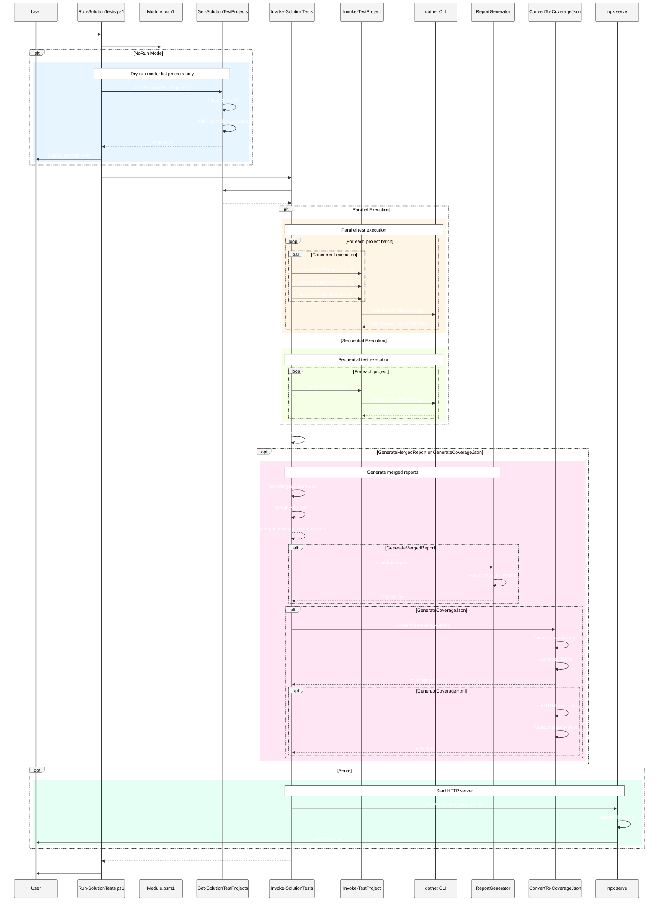

# .Scripts

This folder contains helper scripts and a small PowerShell module to run tests across the repository.

## Table of Contents

- [Overview](#overview)
- [Entry Points](#entry-points)
  - [Run-TestProject.ps1](#run-testprojectps1)
  - [ConvertTo-CoverageJson.ps1](#convertto-coveragejsonps1)
- [Module](#module)
  - [Exported Functions](#exported-functions)
  - [Module Architecture](#module-architecture)
- [Sequence Diagrams](#sequence-diagrams)
  - [Run-SolutionTests Workflow](#run-solutiontests-workflow)
  - [Run-TestProject Workflow](#run-testproject-workflow)
  - [ConvertTo-CoverageJson Workflow](#convertto-coveragejson-workflow)
- [Clear-HostIfNecessary (Test Safety)](#clear-hostifnecessary-test-safety)
- [Usage Examples](#usage-examples)
  - [Basic Usage](#basic-usage)
  - [Coverage Reports](#coverage-reports)
  - [Interactive JSON Reports](#interactive-json-reports)
  - [HTTP Server](#http-server)
- [Tests](#tests)

---

## Overview

The `.Scripts` directory provides a comprehensive testing infrastructure for .NET solutions with:

- Automated test discovery and execution across solution projects
- Code coverage collection (Cobertura XML)
- Merged coverage reports using ReportGenerator
- Interactive JSON-driven coverage viewers
- Parallel test execution with throttling
- HTTP server support for local report hosting

---

## Entry Points

### Run-TestProject.ps1

Standalone script to run tests for a single project with coverage collection.

**Key Features:**
- Auto-discovers test project if not specified
- Supports both coverlet.msbuild and coverlet.collector
- Generates HTML coverage reports using ReportGenerator
- Configurable output directories
- Coverage threshold validation
- Browser auto-open support

**Parameters:**

| Parameter | Description | Default |
|-----------|-------------|---------|
| `ProjectPath` | Path to test project (auto-detected) | `''` |
| `Configuration` | Build configuration | `'Release'` |
| `ResultsDir` | Test results directory | `'TestResults'` |
| `ReportDir` | Coverage report directory | `'CoverageReport'` |
| `OutputDir` | Root output directory (overrides above) | `''` |
| `NoBuild` | Skip build phase | `$false` |
| `OpenReport` | Open report in browser | `$false` |
| `CoverageFormats` | Coverage output formats | `@('cobertura')` |
| `ReportTypes` | ReportGenerator output types | `@('Html')` |
| `UseMsBuildCoverlet` | Use coverlet.msbuild | `$false` |
| `IncludeFilters` | Coverage include filters | `@()` |
| `ExcludeFilters` | Coverage exclude filters | `@()` |
| `CoverageThreshold` | Minimum coverage percentage | `-1` |

---

### ConvertTo-CoverageJson.ps1

Utility script to convert Cobertura XML coverage reports to JSON format with optional HTML viewer generation.

**Key Features:**
- Parses Cobertura XML structure (packages, classes, lines)
- Generates compact JSON with coverage statistics
- Creates interactive HTML viewer using embedded template
- Calculates line-level and class-level coverage metrics
- Pure client-side HTML (no external dependencies)

**Parameters:**

| Parameter | Description | Default |
|-----------|-------------|---------|
| `CoverageXmlPath` | Path to Cobertura XML file (required) | - |
| `OutputDir` | Output directory (defaults to XML parent) | `''` |
| `Title` | Report title | `'Code Coverage Report'` |
| `GenerateHtml` | Generate HTML viewer | `$false` |
| `JsonFileName` | Output JSON filename | `'coverage.json'` |
| `HtmlFileName` | Output HTML filename | `'index.html'` |

---

## Module

The PowerShell module is located at `./Module/Module.psm1` and provides core functionality for test execution and coverage processing.

### Exported Functions

| Function | Description |
|----------|-------------|
| `Clear-HostIfNecessary` | Test-safe wrapper around `Clear-Host` |
| `Get-SolutionTestProjects` | Discover test projects from solution file |
| `Invoke-TestProject` | Run single test project with coverage |
| `Invoke-SolutionTests` | Run all solution test projects |
| `New-MergedCobertura` | Merge multiple Cobertura XML files |
| `Get-CoverageSummary` | Parse coverage statistics from XML |
| `Format-StatusTable` | Format test results as table |

---

### Module Architecture


---

## Sequence Diagrams

### Run-SolutionTests Workflow



---

### Run-TestProject Workflow


---

### ConvertTo-CoverageJson Workflow


---

## Clear-HostIfNecessary (Test Safety)

The module exposes `Clear-HostIfNecessary` which delegates to the built-in `Clear-Host` in production.

**Purpose:** Tests should stub or mock `Clear-HostIfNecessary` to avoid clearing the terminal during automated test runs.

**Example (Pester):**
```powershell
Mock -CommandName Clear-HostIfNecessary -MockWith {}
```

---

## Usage Examples

### Basic Usage

#### Dry-list projects (no tests executed)

```powershell
Set-Location 'path/to/repo/root'
.\.Scripts\Run-SolutionTests.ps1 -NoRun
```

#### Run solution tests, skip build

```powershell
.\.Scripts\Run-SolutionTests.ps1 -NoBuild
```

#### Filter projects to include/exclude via substring pattern

```powershell
.\.Scripts\Run-SolutionTests.ps1 -Include 'CSharp.Object' -Exclude 'ProjectDependency'
```

#### Run tests and fail if coverage below threshold

```powershell
.\.Scripts\Run-SolutionTests.ps1 -UseMsBuildCoverlet -CoverageThreshold 80
```

---

### Coverage Reports

#### Generate merged coverage report (repo-local tool)

**Preferred approach — recommended for CI and reproducibility:**

1. Restore repository tools (once per workspace/CI job):

```powershell
dotnet tool restore
```

2. Run the script; the runner will prefer the repo-local tool if present:

```powershell
# Generate merged HTML report under the run folder
.\.Scripts\Run-SolutionTests.ps1 `
    -GenerateMergedReport `
    -ReportTypes Html `
    -WriteMergedCobertura `
    -RunOutputRoot '.\test\reports\my-run-2025-01-08'
```

**Notes:**
- This repository includes a tool manifest at `.config/dotnet-tools.json` pinning `dotnet-reportgenerator-globaltool`
- The script automatically tries `dotnet tool restore` if a manifest is present
- Prefers `dotnet tool run reportgenerator` for reproducible builds
- Avoids auto-installing global tools to prevent side-effects on developer machines

**Alternative (global tool):**
```powershell
dotnet tool install --global dotnet-reportgenerator-globaltool --version 5.1.4
```

#### Run tests in parallel with throttling

Useful for CI hosts with multiple cores:

```powershell
# Run with up to 6 concurrent test jobs
.\.Scripts\Run-SolutionTests.ps1 -Parallel -MaxParallel 6
```

**Notes on merging behavior:**
- `New-MergedCobertura` consolidates class entries by filename and classname
- Sums per-line hit counts across inputs
- Produces merged cobertura XML with accurate combined hit counts
- Computes `line-rate` attribute automatically

---

### Interactive JSON Reports

#### Automatic (Integrated with Run-SolutionTests)

The easiest way is to use the integrated parameters which automatically enable merged report generation:

```powershell
# JSON + HTML coverage report (auto-enables merged report & merged Cobertura)
.\.Scripts\Run-SolutionTests.ps1 `
    -GenerateCoverageJson `
    -GenerateCoverageHtml `
    -CoverageReportTitle "My Project Coverage" `
    -RunOutputRoot "./test/reports/my-run"

# JSON only (no HTML viewer)
.\.Scripts\Run-SolutionTests.ps1 `
    -GenerateCoverageJson `
    -RunOutputRoot "./test/reports/my-run"

# Open the generated report
Start-Process "./test/reports/my-run/MergedReport/index.html"
```

**Note:** Specifying `-GenerateCoverageJson` or `-GenerateCoverageHtml` automatically enables:
- `-GenerateMergedReport` (creates merged HTML report via ReportGenerator)
- `-WriteMergedCobertura` (creates merged Cobertura XML required for JSON conversion)

#### Manual (Standalone Script)

You can also convert existing coverage reports manually:

```powershell
# Generate JSON only (default - minimal output)
.\.Scripts\ConvertTo-CoverageJson.ps1 `
    -CoverageXmlPath ".\test\reports\latest\MergedReport\merged-coverage.cobertura.xml"

# Generate JSON + HTML viewer (uses template from .Scripts/Module/Resources/)
.\.Scripts\ConvertTo-CoverageJson.ps1 `
    -CoverageXmlPath ".\coverage.xml" `
    -OutputDir ".\web-report" `
    -Title "My Project Coverage" `
    -GenerateHtml

# Custom file names
.\.Scripts\ConvertTo-CoverageJson.ps1 `
    -CoverageXmlPath ".\coverage.xml" `
    -JsonFileName "report-data.json" `
    -HtmlFileName "report.html" `
    -GenerateHtml

# Open the generated report
Start-Process ".\web-report\index.html"
```

**HTML Viewer Features:**
- **Separation of concerns**: JSON data can be consumed by other tools, HTML is optional
- **Interactive filtering**: Search by class name, filename, or coverage percentage
- **Expandable packages**: Click to view class-level details
- **Beautiful design**: Gradient visuals with responsive layout
- **Pure client-side**: No web server required, works offline
- **Color-coded indicators**: Visual coverage status (excellent/high/medium/low)

The HTML viewer template is stored in `.Scripts/Module/Resources/coverage-viewer.html` and uses simple placeholder replacement (`__TITLE__`, `__JSON_FILE__`) for customization.

---

### HTTP Server

#### Serve the Coverage Report via HTTP

To serve the merged report via a local HTTP server (useful for testing CORS-restricted features or sharing on local network):

```powershell
# Generate and serve the report (requires Node.js/npx)
.\.Scripts\Run-SolutionTests.ps1 `
    -GenerateCoverageJson `
    -GenerateCoverageHtml `
    -CoverageReportTitle "My Project Coverage" `
    -Serve

# Specify custom port (default: 8080)
.\.Scripts\Run-SolutionTests.ps1 `
    -GenerateCoverageJson `
    -GenerateCoverageHtml `
    -Serve `
    -ServePort 3000
```

The `-Serve` switch uses `npx serve` to start a local HTTP server serving the MergedReport directory. The browser will automatically open to view the report. Press `Ctrl+C` to stop the server.

**Requirements:** Node.js must be installed (includes npx). Download from https://nodejs.org/

---

## Tests

Pester tests are in `./.Scripts/test` and can be run with:

```powershell
Install-Module -Name Pester -Force -Scope CurrentUser
Invoke-Pester ./.Scripts/test -Verbose
```

**Test Coverage:**
- Module function exports
- Solution parsing (.sln/.slnx)
- Project filtering logic
- Coverage XML parsing
- Merged Cobertura generation
- JSON conversion accuracy

