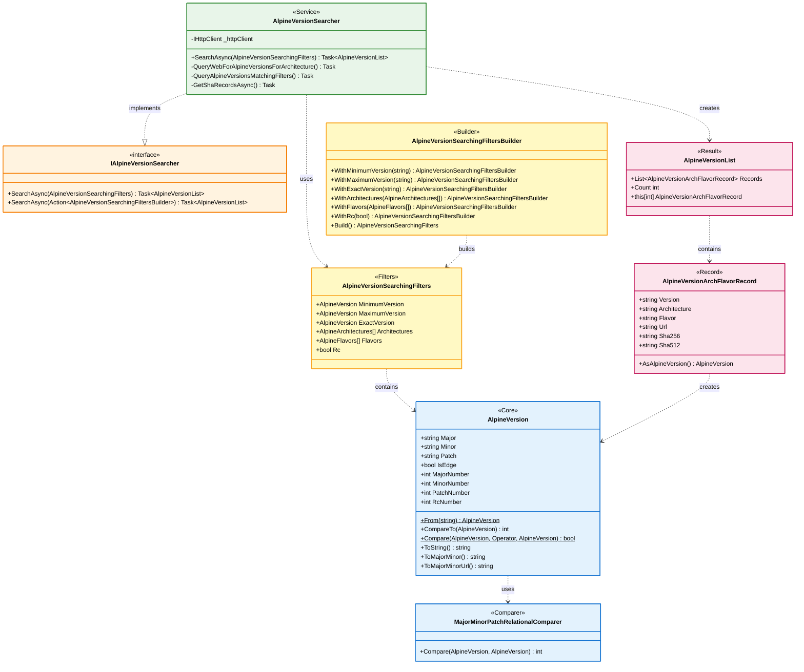
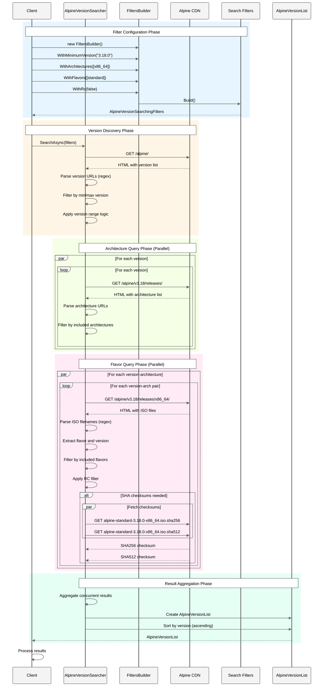
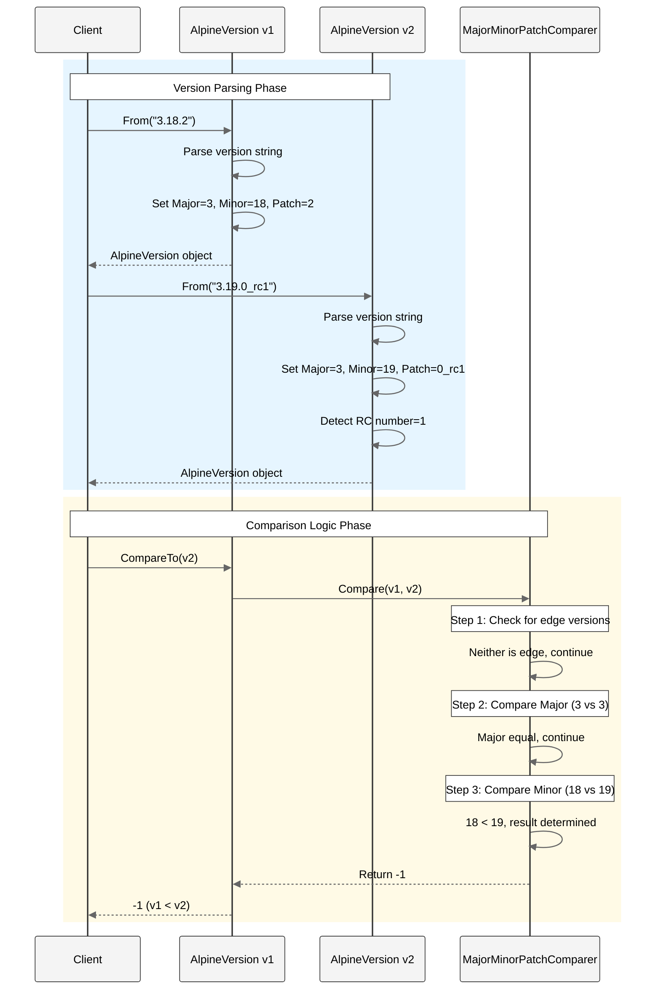
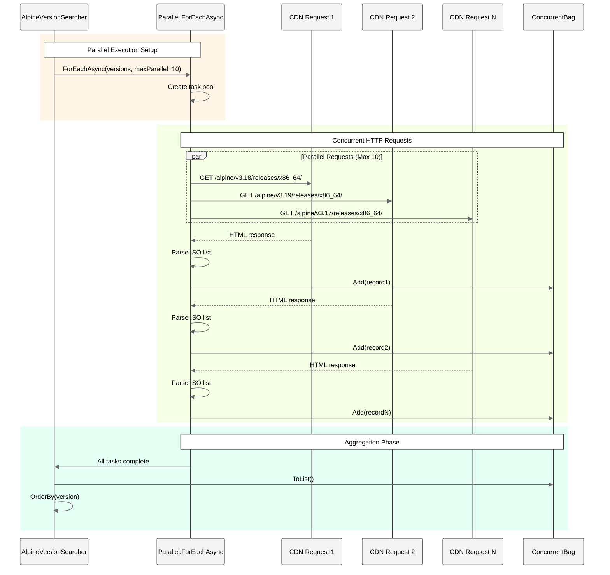

# Alpine.Version - Architecture Documentation

## Table of Contents

- [Overview](#overview)
- [Architecture Diagrams](#architecture-diagrams)
- [Core Components](#core-components)
- [Sequence Diagrams](#sequence-diagrams)
- [Design Decisions](#design-decisions)
- [Best Practices](#best-practices)

---

## Overview

Alpine.Version is a .NET 9 library that provides comprehensive functionality for working with Alpine Linux version information. The architecture is designed around three main pillars:

1. **Version Representation & Comparison** - Parse and compare Alpine versions with support for semantic versioning, release candidates, and edge releases
2. **Repository Search** - Query the official Alpine Linux CDN with powerful filtering capabilities
3. **Result Aggregation** - Collect and return version, architecture, flavor, and checksum information

**Key Design Principles:**
- **Immutability** - Version objects are read-only after creation
- **Fluent API** - Builder pattern for search filters
- **Async-First** - All I/O operations are asynchronous
- **Parallel Processing** - Concurrent HTTP requests for performance
- **Separation of Concerns** - Clear boundaries between parsing, comparison, and search

---

## Architecture Diagrams

### Component Architecture



---

## Sequence Diagrams

### Version Search Workflow



### Version Comparison Workflow



### Parallel HTTP Requests Flow



---

## Core Components

### AlpineVersion

**Purpose:** Represents an Alpine Linux version with parsing and comparison capabilities.

**Responsibilities:**
- Parse version strings (e.g., "3.18.2", "edge", "3.19.0_rc1")
- Provide access to version components (major, minor, patch, RC)
- Implement IComparable for sorting
- Support comparison operators
- Handle special cases ("edge", release candidates)

**Key Methods:**
```csharp
public class AlpineVersion : IComparable<AlpineVersion>
{
    // Factory method for parsing
    public static AlpineVersion From(string versionString);
    
    // Comparison
    public int CompareTo(AlpineVersion? other);
    public static bool Compare(AlpineVersion left, Operator @operator, AlpineVersion right);
    
    // String representations
    public override string ToString();              // "3.18.2"
    public string ToMajorMinor();                  // "3.18"
    public string ToMajorMinorUrl();               // "v3.18" or "edge"
}
```

**Design Pattern:** Value Object with Factory Method

---

### AlpineVersionSearcher

**Purpose:** Search the Alpine Linux CDN for available versions, architectures, and flavors.

**Responsibilities:**
- Query Alpine Linux CDN endpoints
- Parse HTML responses using regular expressions
- Apply search filters (version, architecture, flavor, RC)
- Execute parallel HTTP requests
- Aggregate results with checksums
- Return sorted, filtered results

**Key Methods:**
```csharp
public class AlpineVersionSearcher : IAlpineVersionSearcher
{
    // Fluent API entry point
    public Task<AlpineVersionList> SearchAsync(
        Action<AlpineVersionSearchingFiltersBuilder> configureSearchFilter,
        CancellationToken cancellationToken = default);
    
    // Direct filter usage
    public Task<AlpineVersionList> SearchAsync(
        AlpineVersionSearchingFilters alpineVersionSearchingFilters,
        CancellationToken cancellationToken = default);
}
```

**Design Pattern:** Service with Dependency Injection (IHttpClient)

---

### AlpineVersionSearchingFiltersBuilder

**Purpose:** Fluent builder for creating search filter configurations.

**Responsibilities:**
- Provide fluent API for filter configuration
- Validate filter combinations
- Build immutable filter objects
- Parse version strings into AlpineVersion objects

**Key Methods:**
```csharp
public class AlpineVersionSearchingFiltersBuilder
{
    public AlpineVersionSearchingFiltersBuilder WithMinimumVersion(string version);
    public AlpineVersionSearchingFiltersBuilder WithMaximumVersion(string version);
    public AlpineVersionSearchingFiltersBuilder WithExactVersion(string version);
    public AlpineVersionSearchingFiltersBuilder WithArchitectures(AlpineArchitectures[] architectures);
    public AlpineVersionSearchingFiltersBuilder WithFlavors(AlpineFlavors[] flavors);
    public AlpineVersionSearchingFiltersBuilder WithRc(bool includeRc);
    public AlpineVersionSearchingFilters Build();
}
```

**Design Pattern:** Fluent Builder

---

## Design Decisions

### Decision 1: String-Based Version Components

**Context:** Alpine versions include "edge" and various formats that don't fit standard semantic versioning.

**Decision:** Use string for major, minor, and patch components instead of integers.

**Rationale:**
- Supports "edge" as a valid major version
- Handles RC suffixes naturally ("0_rc1")
- Avoids parsing errors for unconventional formats
- Provides numeric accessors (MajorNumber, MinorNumber) when needed

**Alternatives Considered:**
- **Numeric-only with special flags** - Rejected: Complex edge cases
- **Separate classes for edge/stable** - Rejected: Complicates comparison logic

---

### Decision 2: Parallel HTTP Requests with Limits

**Context:** Searching multiple versions, architectures, and flavors requires many HTTP requests.

**Decision:** Use `Parallel.ForEachAsync` with `MaxDegreeOfParallelism = 10`.

**Rationale:**
- Significantly improves search performance (10x faster than sequential)
- Limits concurrent connections to avoid overwhelming the CDN
- Leverages async/await for efficient resource usage
- ConcurrentBag provides thread-safe result aggregation

**Alternatives Considered:**
- **Sequential requests** - Rejected: Too slow for multi-version queries
- **Unlimited parallelism** - Rejected: Could overwhelm CDN or client
- **Task.WhenAll batching** - Rejected: More complex, similar performance

---

### Decision 3: Fluent Builder for Search Filters

**Context:** Search filters have many optional parameters with complex combinations.

**Decision:** Implement fluent builder pattern for filter configuration.

**Rationale:**
- Improves API discoverability
- Makes optional parameters explicit
- Enables method chaining for readable code
- Validates filter combinations at build time
- Separates filter configuration from search execution

**Alternatives Considered:**
- **Constructor with optional parameters** - Rejected: Too many parameters
- **Property initialization** - Rejected: Less discoverable, no validation

---

## Best Practices

### ? Do

1. **Use Fluent API for Searches**
   ```csharp
   var results = await searcher.SearchAsync(filters => filters
       .WithMinimumVersion("3.18.0")
       .WithArchitectures(new[] { AlpineArchitectures.x86_64 })
       .WithRc(false)
   );
   ```

2. **Handle CancellationToken**
   ```csharp
   var cts = new CancellationTokenSource(TimeSpan.FromSeconds(30));
   var results = await searcher.SearchAsync(filters => /*...*/, cts.Token);
   ```

3. **Reuse HttpClient**
   ```csharp
   // Create once, use throughout application lifetime
   var httpClient = new StandardHttpClient();
   var searcher = new AlpineVersionSearcher(httpClient);
   ```

### ? Don't

1. **Don't Create HttpClient Per Request**
   ```csharp
   // ? Bad - creates new HttpClient each time
   foreach (var search in searches)
   {
       var httpClient = new StandardHttpClient();
       var searcher = new AlpineVersionSearcher(httpClient);
       await searcher.SearchAsync(/*...*/);
   }
   
   // ? Good - reuse HttpClient
   var httpClient = new StandardHttpClient();
   var searcher = new AlpineVersionSearcher(httpClient);
   foreach (var search in searches)
   {
       await searcher.SearchAsync(/*...*/);
   }
   ```

2. **Don't Ignore Async**
   ```csharp
   // ? Bad - blocks thread
   var results = searcher.SearchAsync(/*...*/).Result;
   
   // ? Good - truly async
   var results = await searcher.SearchAsync(/*...*/);
   ```

3. **Don't Compare Strings Directly**
   ```csharp
   // ? Bad - string comparison doesn't follow semantic versioning
   if (version1.ToString().CompareTo(version2.ToString()) > 0)
   
   // ? Good - use version comparison
   if (version1.CompareTo(version2) > 0)
   ```

---

**Version**: 1.0  
**Last Updated**: January 2025  
**Target Framework**: .NET 9  
**Architecture Style**: Service-Oriented with Builder Pattern
