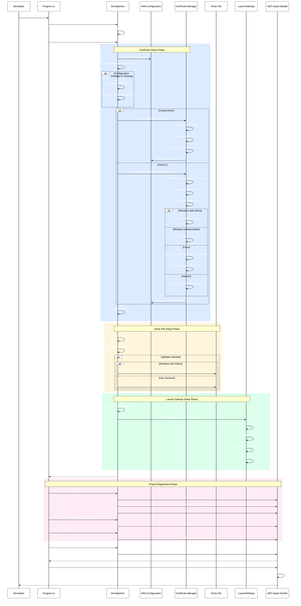
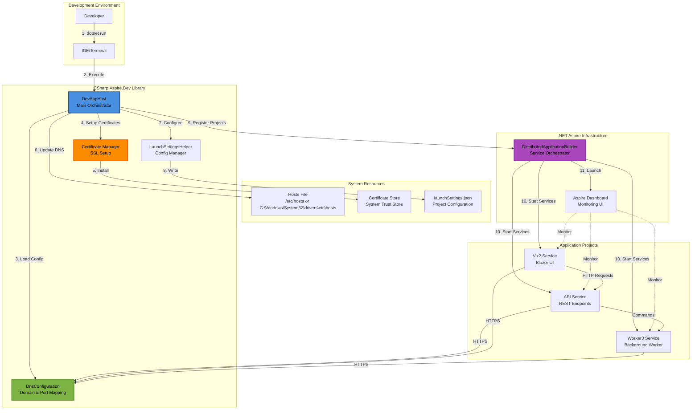
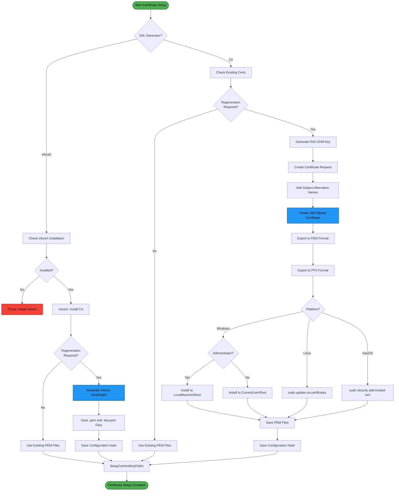

# CSharp.Aspire.Dev - Architecture Documentation

## Overview

CSharp.Aspire.Dev is a .NET 9 development infrastructure library that simplifies local development environment setup for .NET Aspire distributed applications. It automates the configuration of HTTPS certificates, DNS entries, launch settings, and environment variables to enable consistent and secure local development experiences.

## Solution Structure

### Projects

#### Core Library Projects

- **FrenchExDev.Net.CSharp.Aspire.Dev**
  - Main library providing `DevAppHost` orchestration
  - DNS and certificate configuration management
  - Hosts file automation
  - Launch settings generation
  - Self-signed and mkcert certificate support

- **FrenchExDev.Net.CSharp.Aspire.App**
  - Launch settings helper utilities
  - JSON manipulation for launchSettings.json
  - Profile and environment variable management

- **FrenchExDev.Net.CSharp.Aspire.Dev.WebApplication**
  - ASP.NET Core integration extensions
  - Kestrel certificate configuration
  - WebApplicationBuilder extensions

- **FrenchExDev.Net.CSharp.Aspire.Dev.WebAssembly**
  - Blazor WebAssembly specific extensions
  - Client-side configuration helpers

## Architecture Diagrams

### DevAppHost Setup Sequence



### Key Actors and Component Interaction



### Certificate Generation Flow



## Core Components

### DevAppHost

The central orchestration class that manages the complete development environment setup.

**Key Responsibilities:**
- Load and validate DNS configuration from JSON files
- Manage SSL certificate generation and installation
- Update system hosts file with development domain entries
- Configure launch settings with environment variables
- Register project resources with Aspire builder
- Build and return configured distributed application

**Key Methods:**
- `Default()`: Factory method to create DevAppHost with configuration
- `EnsureSetup()`: Main entry point for environment setup
- `EnsureCertSetup()`: Orchestrates certificate generation
- `EnsureHostsSetup()`: Updates hosts file
- `EnsureLaunchSettingsSetup()`: Configures launch settings
- `WithProjectInstance()`: Registers project resources
- `Build()`: Builds the distributed application

### DnsConfiguration

Configuration record that holds all DNS and certificate-related settings.

**Key Properties:**
- `Domain`: Base domain (e.g., "dev.local")
- `Domains`: Array of subdomains (e.g., ["api", "viz", "worker"])
- `Ports`: Dictionary mapping domain names to port numbers
- `AspNetCoreUrls`: URL templates for ASP.NET Core endpoints
- `SslGenerator`: Certificate generator to use ("C#" or "mkcert")
- `CertificatesDirectory`: Directory for storing certificates
- `CertPath` / `KeyPath`: Paths to certificate files

**Key Methods:**
- `GetUrl()`: Constructs HTTPS URLs for domains
- `GetAspNetCoreUrl()`: Generates ASP.NET Core URL from template
- `GetAllHosts()`: Returns all fully qualified host names
- `GetHostsFileEntries()`: Generates hosts file entries
- `CalculateConfigurationHash()`: Computes SHA256 hash for change detection

### Certificate Management

#### Self-Signed Certificates (C#)
1. Generate RSA 2048-bit key pair
2. Create X509 certificate request with SAN entries
3. Self-sign certificate with 2-year validity
4. Export to PEM format (certificate and private key)
5. Export to PFX with password
6. Install to system certificate store
7. Platform-specific trust store installation

#### mkcert Certificates
1. Check mkcert installation
2. Install local CA (`mkcert -install`)
3. Generate certificates for all domains
4. Save as PEM files
5. System automatically trusts mkcert CA

### Launch Settings Management

The `LaunchSettingsHelper` class provides utilities for manipulating `launchSettings.json`:

**Environment Variables Set:**
- `ASPNETCORE_Kestrel__Certificates__Default__Path`
- `ASPNETCORE_Kestrel__Certificates__Default__KeyPath`
- `ASPNETCORE_URLS`
- `ASPIRE_DASHBOARD_OTLP_ENDPOINT_URL`
- `ASPIRE_RESOURCE_SERVICE_ENDPOINT_URL`
- `ASPIRE_ENVIRONMENT`
- `DOTNET_ENVIRONMENT`
- `CustomDomain__Fqdn`
- `CustomDomain__Port`

### WebApplication Extensions

The `EnsureCertificateSetup()` extension method for `WebApplicationBuilder`:
- Reads certificate paths from configuration
- Loads PEM certificate and key
- Converts to X509Certificate2 with exportable private key
- Configures Kestrel HTTPS defaults
- Supports TLS 1.2 and TLS 1.3
- Does not override Aspire endpoint configuration

## Configuration Structure

### devapphost.json (Base Configuration)

```json
{
  "Environment": "Development",
  "LaunchSettingsProfile": "local-dev-https"
}
```

### devapphost.Development.json

```json
{
  "DnsConfiguration": {
    "DashboardAppName": "devdash",
    "SslPassword": "",
    "SslGenerator": "mkcert",
    "CertificatesDirectory": ".dev-certs",
    "Domain": "dev.local",
    "Domains": ["api", "viz", "worker", "devdash"],
    "Ports": {
      "api": 5000,
      "viz": 5001,
      "worker": 5002,
      "devdash": 15888,
      "devdash-oltp": 16666,
      "devdash-services": 17777
    },
    "AspNetCoreUrls": {
      "api": "https://#subdomain#.#domain#:#port#",
      "viz": "https://#subdomain#.#domain#:#port#",
      "worker": "https://#subdomain#.#domain#:#port#",
      "devdash": "https://#subdomain#.#domain#:#port#"
    }
  }
}
```

## Technology Stack

### Framework
- **.NET 9**: Target framework for all projects
- **.NET Aspire**: Distributed application orchestration

### Libraries
- **Newtonsoft.Json**: JSON manipulation for launch settings
- **System.Security.Cryptography**: Certificate generation
- **System.Security.Cryptography.X509Certificates**: Certificate store management

### External Tools (Optional)
- **mkcert**: Local CA and certificate generation (alternative to C# generated certs)

## Platform Support

### Windows
- Administrator privileges for LocalMachine certificate store
- Non-admin users can use CurrentUser store
- Automatic hosts file updates with admin rights
- Support for both mkcert and C# generated certificates

### Linux
- `update-ca-certificates` (Debian/Ubuntu)
- `update-ca-trust` (RHEL/CentOS)
- `sudo` required for hosts file updates
- Certificate installation to `/usr/local/share/ca-certificates/`

### macOS
- `security` CLI for keychain management
- `sudo` required for system keychain and hosts file
- Certificate installation to System keychain

## Development Workflow

### 1. Initial Setup

```csharp
var devAppHost = DevAppHost.Default(
    builder: () => DistributedApplication.CreateBuilder(args),
    loggerName: "apphost",
    jsonFile: "devapphost.#Env#.json",
    environment: "Development"
);
```

### 2. Environment Setup

```csharp
devAppHost.EnsureSetup(force: false);
```

This performs:
- Certificate generation/validation
- Hosts file updates
- Launch settings configuration

### 3. Project Registration

```csharp
devAppHost
    .WithProjectInstance(
        resourceBuilder: (builder) => builder.AddProject<Projects.Api>("api"),
        name: "api"
    )
    .WithProjectInstance(
        resourceBuilder: (builder) => builder.AddProject<Projects.Viz2>("viz"),
        name: "viz"
    )
    .WithProjectInstance(
        resourceBuilder: (builder) => builder.AddProject<Projects.Worker3>("worker"),
        name: "worker"
    );
```

### 4. Build and Run

```csharp
await devAppHost
    .Build()
    .RunAsync();
```

## Security Considerations

### Certificate Security
- Self-signed certificates for development only
- 2048-bit RSA keys
- 2-year validity period
- PFX files password-protected
- Private keys exportable for system use

### System Modifications
- Requires elevated privileges for:
  - Hosts file modifications
  - System certificate store access
- Changes are logged for traceability
- Configuration hash tracking prevents unnecessary regeneration

### Production Usage
**Warning:** This library is designed for development environments only. Do not use in production:
- Self-signed certificates are not trusted by external clients
- Hosts file modifications affect system-wide DNS
- Certificate stores are modified globally

## Extensibility

### Custom Certificate Generators

Implement custom certificate generation by:
1. Adding new `SslGenerator` value to configuration
2. Implementing generator method in `DevAppHost`
3. Ensuring PEM format output

### Custom DNS Configuration

Extend `DnsConfiguration` with:
- Additional domain patterns
- Custom port assignment logic
- Alternative URL templates

### Custom Project Configuration

Use `WithProjectInstance` configuration parameter:
```csharp
.WithProjectInstance(
    resourceBuilder: (b) => b.AddProject<Projects.Api>("api"),
    name: "api",
    configuration: (resource) => {
        resource.WithEnvironment("CUSTOM_VAR", "value");
        resource.WithReplicas(2);
    }
)
```

## Troubleshooting

### Certificate Issues
- **Not Trusted**: Ensure CA is installed (mkcert) or certificate is in system store
- **Permission Denied**: Run with administrator/sudo privileges
- **Already Exists**: Use `force: true` to regenerate

### Hosts File Issues
- **Updates Not Applied**: Check administrator privileges
- **DNS Not Resolving**: Verify hosts file syntax and flush DNS cache
- **Linux/macOS**: Ensure `sudo` access

### Launch Settings Issues
- **Variables Not Applied**: Check profile name matches configuration
- **File Not Found**: Verify launchSettings.json path
- **Invalid JSON**: Review launch settings file syntax

## Best Practices

1. **Use mkcert for Teams**: Ensures consistent certificate generation across team members
2. **Version Control**: Exclude `.dev-certs/` directory and `dns-config.json`
3. **Configuration**: Use environment-specific configuration files
4. **Domain Names**: Use `.local` or `.test` TLDs for development
5. **Port Assignment**: Use consistent port ranges (5000-5999 for dev)
6. **Documentation**: Document custom domains and ports for team

## Future Enhancements

- Docker container certificate mounting
- Kubernetes local development support
- Multiple environment profiles
- Certificate expiration monitoring
- Automatic DNS cache flushing
- Integration with other development tools
- GUI for configuration management

---

**Version**: 1.0  
**Last Updated**: 2024  
**Target Framework**: .NET 9  
**Architecture Style**: Development Infrastructure Library
