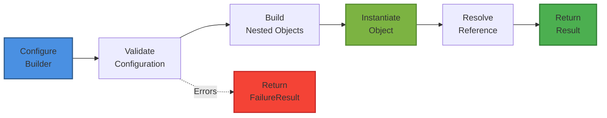

# FrenchExDev.Net.CSharp.Object.Builder2

An advanced Builder pattern implementation for .NET 9 that provides validation, cyclic reference management, deferred resolution, and result-based error handling for constructing complex object graphs with confidence.

[](https://dotnet.microsoft.com/)
[](LICENSE)

## Overview

The Builder pattern separates the construction of complex objects from their representation. This library extends the classic pattern with:

- **Validation Infrastructure**: Collect all validation errors before building
- **Cyclic Reference Support**: Handle circular dependencies elegantly
- **Deferred Resolution**: Build objects before dependencies are ready
- **Result Pattern**: Return success/failure instead of throwing exceptions
- **Type Safety**: Fully generic and type-safe implementation
- **Batch Operations**: Build multiple objects efficiently

## Key Features

### ? Advanced Validation

- Collect all validation errors (not just the first one)
- Validate nested builders recursively
- Custom validation rules per builder
- Helper methods for common validations

### ? Cyclic Reference Management

- Automatic detection and handling of circular dependencies
- `Reference<T>` for deferred object resolution
- `VisitedObjectDictionary` prevents infinite loops
- No stack overflow on complex graphs

### ? Result-Based Error Handling

- `SuccessResult<T>` contains the built object
- `FailureResult` contains collected validation failures
- No exceptions for expected validation failures
- Fluent error handling with extension methods

### ? Collection Support

- `ReferenceList<T>` for managing object collections
- `BuilderList<T, TBuilder>` for batch building
- LINQ support with `Where`, `Select`, `Any`, `All`
- Queryable interface for advanced queries

## Installation

```bash
dotnet add package FrenchExDev.Net.CSharp.Object.Builder2
```

Or via Package Manager Console:

```powershell
Install-Package FrenchExDev.Net.CSharp.Object.Builder2
```

## Quick Start

### Define Your Model

```csharp
public class Person
{
    public string Name { get; }
    public int Age { get; }
    protected Reference<Person> _contact;
    protected ReferenceList<Address> _addresses;
    
    public Person Contact => _contact.Resolved();
    public IEnumerable<Address> Addresses => _addresses.AsEnumerable();
    
    public Person(string name, int age, 
                  ReferenceList<Address> addresses, 
                  Reference<Person> contact)
    {
        Name = name;
        Age = age;
        _addresses = addresses;
        _contact = contact;
    }
}

public class Address
{
    public string Street { get; }
    public string City { get; }
    
    public Address(string street, string city)
    {
        Street = street;
        City = city;
    }
}
```

### Create Your Builder

```csharp
public class PersonBuilder : AbstractBuilder<Person>
{
    private string? _name;
    private int? _age;
    private PersonBuilder? _contact;
    private readonly BuilderList<Address, AddressBuilder> _addresses = [];
    
    public PersonBuilder Name(string name)
    {
        _name = name;
        return this;
    }
    
    public PersonBuilder Age(int age)
    {
        _age = age;
        return this;
    }
    
    public PersonBuilder Contact(PersonBuilder contact)
    {
        _contact = contact;
        return this;
    }
    
    public PersonBuilder Address(AddressBuilder address)
    {
        _addresses.Add(address);
        return this;
    }
    
    protected override void ValidateInternal(
        VisitedObjectDictionary visited, 
        FailuresDictionary failures)
    {
        AssertNotNullOrEmptyOrWhitespace(_name, nameof(_name), 
            failures, _ => new NameRequiredException());
        
        if (_age == null || _age < 0)
        {
            failures.Failure(nameof(_age), 
                new AgeException("Must be non-negative"));
        }
        
        if (_contact != null)
        {
            var contactFailures = new FailuresDictionary();
            _contact.Validate(visited, contactFailures);
            if (contactFailures.Count > 0)
            {
                failures.Failure(nameof(_contact), contactFailures);
            }
        }
    }
    
    protected override void BuildInternal(VisitedObjectDictionary visited)
    {
        _contact?.Build(visited);
        BuildList(_addresses, visited);
    }
    
    protected override Person Instantiate()
    {
        return new Person(
            _name!,
            _age!.Value,
            _addresses.AsReferenceList(),
            _contact!.Reference());
    }
}

public class AddressBuilder : AbstractBuilder<Address>
{
    private string? _street;
    private string? _city;
    
    public AddressBuilder Street(string street)
    {
        _street = street;
        return this;
    }
    
    public AddressBuilder City(string city)
    {
        _city = city;
        return this;
    }
    
    protected override void ValidateInternal(
        VisitedObjectDictionary visited, 
        FailuresDictionary failures)
    {
        AssertNotNullOrEmptyOrWhitespace(_street, nameof(_street), 
            failures, _ => new StreetRequiredException());
        AssertNotNullOrEmptyOrWhitespace(_city, nameof(_city), 
            failures, _ => new CityRequiredException());
    }
    
    protected override Address Instantiate()
    {
        return new Address(_street!, _city!);
    }
}
```

### Use Your Builder

```csharp
// Simple building
var address = new AddressBuilder()
    .Street("123 Main St")
    .City("Springfield")
    .BuildSuccess();

// Complex object with nested builders
var jane = new PersonBuilder()
    .Name("Jane")
    .Age(28)
    .Address(new AddressBuilder()
        .Street("1 Rue de la Paix")
        .City("Paris"));

var john = new PersonBuilder()
    .Name("John")
    .Age(30)
    .Contact(jane)
    .Address(new AddressBuilder()
        .Street("2 Avenue des Champs")
        .City("Lyon"));

// Build with result handling
var result = john.Build();

if (result.IsSuccess<Person>())
{
    var person = result.Success<Person>();
    Console.WriteLine($"{person.Name}, {person.Age}");
    Console.WriteLine($"Contact: {person.Contact.Name}");
}
else if (result.IsFailure())
{
    var failures = result.Failures();
    foreach (var failure in failures)
    {
        Console.WriteLine($"{failure.Key}: {failure.Value}");
    }
}
```

### Handle Cyclic References

```csharp
// Create two people who reference each other
var john = new PersonBuilder()
    .Name("John")
    .Age(30)
    .Address(new AddressBuilder().Street("1 St").City("City1"));

var jane = new PersonBuilder()
    .Name("Jane")
    .Age(28)
    .Address(new AddressBuilder().Street("2 St").City("City2"));

// Set each other as contacts (cyclic reference)
john.Contact(jane);
jane.Contact(john);

// Build works correctly despite cycles
var johnPerson = john.BuildSuccess();
var janePerson = jane.BuildSuccess();

Console.WriteLine(johnPerson.Contact.Name);  // "Jane"
Console.WriteLine(janePerson.Contact.Name);  // "John"
```

### Batch Building

```csharp
var people = new BuilderList<Person, PersonBuilder>();

people
    .New(p => p
        .Name("Alice")
        .Age(25)
        .Address(new AddressBuilder().Street("1 St").City("City"))
        .Contact(new PersonBuilder().Name("Bob").Age(26)))
    .New(p => p
        .Name("Bob")
        .Age(26)
        .Address(new AddressBuilder().Street("2 St").City("City"))
        .Contact(new PersonBuilder().Name("Alice").Age(25)))
    .New(p => p
        .Name("Charlie")
        .Age(30)
        .Address(new AddressBuilder().Street("3 St").City("City"))
        .Contact(new PersonBuilder().Name("Alice").Age(25)));

var instances = people.BuildSuccess();  // Builds all 3 people
```

## Documentation

### ?? Comprehensive Guides

- **[Architecture Documentation](doc/ARCHITECTURE.md)** - Complete architecture overview
  - Solution structure and project organization
  - Type hierarchy with class diagrams
  - Build process sequences
  - Reference resolution flows
  - Cyclic reference handling diagrams
  - Core components detailed explanation
  - Build lifecycle phases
  - Advanced features and patterns
  - Best practices and performance tips

- **[Builder Pattern Guide](doc/BUILDER-PATTERN.md)** - Deep dive into the Builder pattern
  - Pattern implementation details
  - Complete code examples
  - Mermaid diagrams (class, sequence, flow)
  - Usage examples (simple to complex)
  - Cyclic reference examples
  - Batch building patterns
  - Validation patterns
  - Error handling strategies
  - Comparison with traditional builder
  - Integration with other patterns
  - Testing guidelines

### ?? Quick Reference

#### Core Classes

| Class | Purpose | Key Methods |
|-------|---------|-------------|
| `AbstractBuilder<T>` | Base class for builders | `Build()`, `BuildSuccess()`, `Validate()` |
| `Reference<T>` | Deferred resolution | `Resolve()`, `Resolved()`, `IsResolved` |
| `ReferenceList<T>` | Collection of references | `Add()`, `AsEnumerable()`, `Queryable` |
| `BuilderList<T,TBuilder>` | Batch builder operations | `New()`, `BuildSuccess()`, `AsReferenceList()` |
| `SuccessResult<T>` | Successful build result | `Object` property |
| `FailureResult` | Failed build result | `Failures` property |
| `FailuresDictionary` | Validation errors | `Failure()` method |

#### Builder Lifecycle



## Project Structure

```
CSharp.Object.Builder2/
??? src/
?   ??? FrenchExDev.Net.CSharp.Object.Builder2/         # Core library
?   ?   ??? Code.cs                                      # All types
?   ??? FrenchExDev.Net.CSharp.Object.Builder2.Testing/ # Example builders
?       ??? ExampleClasses.cs                            # Person, Address examples
??? test/
?   ??? FrenchExDev.Net.CSharp.Object.Builder2.Tests/   # Unit tests
??? doc/
    ??? ARCHITECTURE.md                                  # Architecture guide
    ??? BUILDER-PATTERN.md                               # Pattern guide
```

## Core Concepts

### 1. Validation Before Building

Collect all validation errors before attempting to build:

```csharp
protected override void ValidateInternal(
    VisitedObjectDictionary visited, 
    FailuresDictionary failures)
{
    AssertNotNull(_field1, nameof(_field1), failures, ...);
    AssertNotNull(_field2, nameof(_field2), failures, ...);
    AssertNotNull(_field3, nameof(_field3), failures, ...);
    // All errors collected, not just first one
}
```

### 2. Reference-Based Resolution

Use references to handle objects that haven't been built yet:

```csharp
public class Person
{
    protected Reference<Person> _contact;
    
    public Person Contact => _contact.Resolved();
    
    public Person(Reference<Person> contact)
    {
        _contact = contact;  // Store reference, not instance
    }
}
```

### 3. Result Pattern

Return results instead of throwing exceptions:

```csharp
var result = builder.Build();

if (result.IsSuccess<Person>())
{
    var person = result.Success<Person>();
}
else
{
    var failures = result.Failures();
}
```

### 4. Cyclic Dependency Detection

Automatically detect and handle circular references:

```csharp
// VisitedObjectDictionary tracks what's being built
var visited = new VisitedObjectDictionary();
builder.Validate(visited, failures);
builder.Build(visited);  // Prevents infinite loops
```

## Advanced Features

### Conditional Building

```csharp
protected override void BuildInternal(VisitedObjectDictionary visited)
{
    if (_includeOptionalData)
    {
        _optionalData?.Build(visited);
    }
}
```

### Existing Instance Modification

```csharp
var builder = new PersonBuilder()
    .Existing(existingPerson)
    .Name("Updated Name");

var result = builder.Build();  // Modifies existing instance
```

### Validation Levels

```csharp
public PersonBuilder WithValidationLevel(ValidationLevel level)
{
    _validationLevel = level;
    return this;
}
```

### Composite Builders

```csharp
public class TeamBuilder : AbstractBuilder<Team>
{
    private readonly BuilderList<Person, PersonBuilder> _members = [];
    
    public TeamBuilder Member(PersonBuilder member)
    {
        _members.Add(member);
        return this;
    }
}
```

## Best Practices

### ? Do

- Use fluent methods that return `this`
- Collect all validation errors in `ValidateInternal`
- Use meaningful exception types for failures
- Leverage `Reference<T>` for cyclic dependencies
- Pass `VisitedObjectDictionary` through all builds
- Store references, resolve in property accessors

### ? Don't

- Don't throw exceptions in setter methods
- Don't validate in `Instantiate()` method
- Don't resolve references in constructors
- Don't build nested objects without passing `visited`
- Don't ignore validation failures

## Testing

Comprehensive unit tests using xUnit and Shouldly:

```bash
dotnet test
```

Tests cover:
- Simple and complex object building
- Validation scenarios
- Cyclic reference handling
- Batch building operations
- Reference resolution
- Error handling patterns
- Edge cases

## Examples

See the [Builder Pattern Guide](doc/BUILDER-PATTERN.md) for comprehensive examples including:

- Simple object creation
- Complex nested objects
- Cyclic references
- Batch building
- Validation before building
- Accessing references before build
- Error handling patterns
- Modifying existing instances

## Contributing

Contributions are welcome! Please feel free to submit a Pull Request.

## License

This project is licensed under the MIT License - see the LICENSE file for details.

## Links

- ?? **[Architecture Documentation](doc/ARCHITECTURE.md)**
- ?? **[Builder Pattern Implementation Guide](doc/BUILDER-PATTERN.md)**
- ?? **[GitHub Repository](https://github.com/FrenchExDev/FrenchExDev.Net)**
- ?? **[NuGet Package](https://www.nuget.org/packages/FrenchExDev.Net.CSharp.Object.Builder2)**

## Related Projects

- [FrenchExDev.Net.CSharp.Object.Result](../CSharp.Object.Result/) - Result pattern implementation
- [FrenchExDev.Net.CSharp.Object.Model](../CSharp.Object.Model/) - Object model utilities
- [FrenchExDev.Net.CSharp.ManagedList](../CSharp.ManagedList/) - Managed collection implementations

---

**Target Framework**: .NET 9  
**Version**: 1.0  
**Pattern**: Builder Pattern with Advanced Features  
**Author**: FrenchExDev
