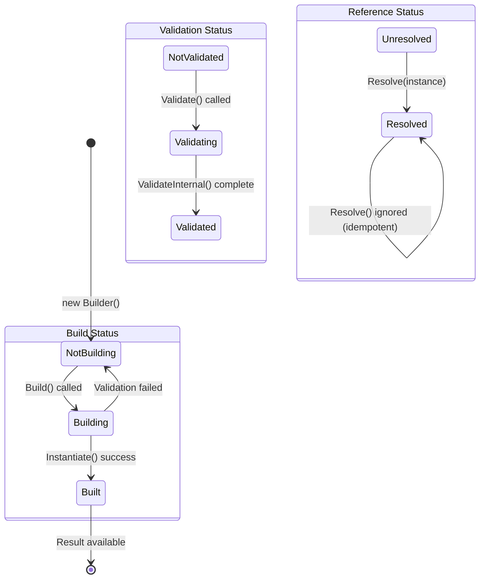
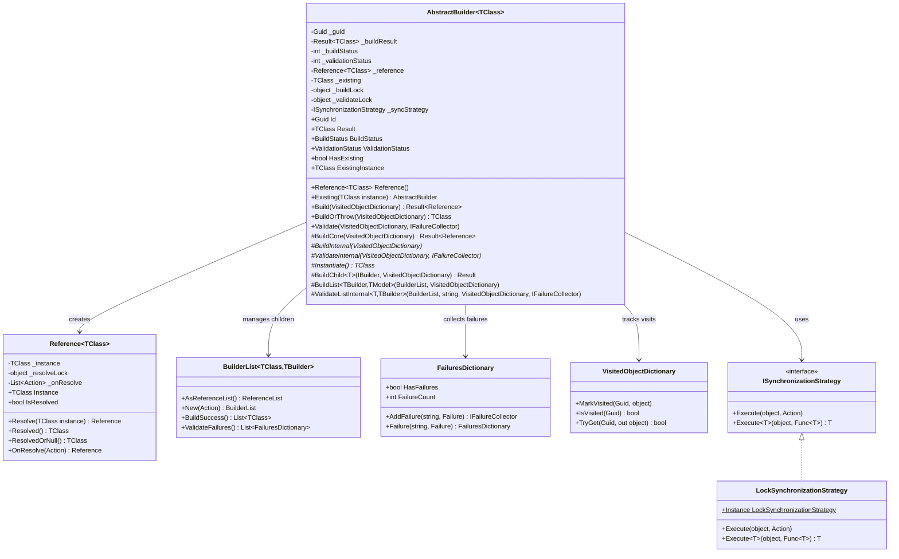
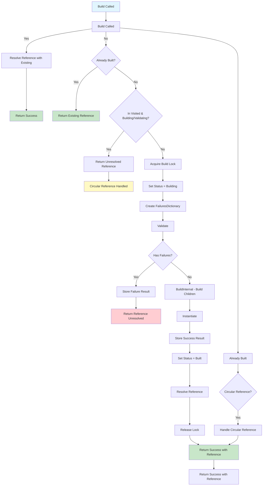
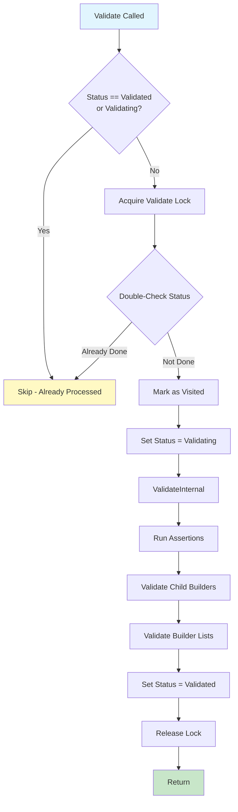

# FrenchExDev.Net.CSharp.Object.Builder2

A robust, thread-safe implementation of the **Builder Pattern** for .NET, designed to construct complex object graphs with validation, circular reference support, and deferred resolution.

[](https://dotnet.microsoft.com/)
[](LICENSE.md)

## Table of Contents

- [Overview](#overview)
- [Features](#features)
- [Installation](#installation)
- [Quick Start](#quick-start)
- [Core Concepts](#core-concepts)
  - [AbstractBuilder](#abstractbuilder)
  - [Reference](#reference)
  - [Validation](#validation)
  - [Circular References](#circular-references)
- [API Reference](#api-reference)
- [Advanced Usage](#advanced-usage)
- [Thread Safety](#thread-safety)
- [Testing](#testing)
- [Architecture](#architecture)

## Overview

Builder2 provides a powerful abstraction for constructing complex object graphs in .NET applications. It addresses common challenges like:

- **Validation before construction** - Ensure all required data is present
- **Circular references** - Handle bidirectional relationships between objects
- **Thread safety** - Safe concurrent builds of the same builder
- **Deferred resolution** - Reference objects before they're built
- **Fluent API** - Clean, readable builder configuration

## Features

| Feature | Description |
|---------|-------------|
| 🔨 **Fluent Builder API** | Chain configuration methods for readable code |
| ✅ **Built-in Validation** | Validate before building with detailed failure collection |
| 🔄 **Circular Reference Support** | Handle bidirectional relationships automatically |
| 🔒 **Thread-Safe** | Concurrent builds produce consistent results |
| 📦 **Deferred Resolution** | Reference objects that haven't been built yet |
| 🎯 **Type-Safe** | Full generic support with compile-time safety |
| 🧩 **Extensible** | Custom synchronization and reference strategies |

## Installation

```xml
<PackageReference Include="FrenchExDev.Net.CSharp.Object.Builder2" Version="1.0.0" />
```

**Dependencies:**
- .NET 10.0+
- FrenchExDev.Net.CSharp.Object.Result2

## Quick Start

### 1. Define Your Domain Model

```csharp
public class Person
{
    public string Name { get; set; } = string.Empty;
    public int Age { get; set; }
    public Address? Address { get; set; }
    public List<Person> Friends { get; set; } = [];
}

public class Address
{
    public string Street { get; set; } = string.Empty;
    public string City { get; set; } = string.Empty;
}
```

### 2. Create a Builder

```csharp
public class PersonBuilder : AbstractBuilder<Person>
{
    public string? Name { get; set; }
    public int Age { get; set; }
    public AddressBuilder? AddressBuilder { get; set; }
    public BuilderList<Person, PersonBuilder> Friends { get; } = [];

    // Required: Define how to create the instance
    protected override Person Instantiate() => new()
    {
        Name = Name!,
        Age = Age,
        Address = AddressBuilder?.Reference().ResolvedOrNull(),
        Friends = [.. Friends.AsReferenceList().AsEnumerable()]
    };

    // Optional: Define validation rules
    protected override void ValidateInternal(
        VisitedObjectDictionary visited, 
        IFailureCollector failures)
    {
        AssertNotNullOrEmptyOrWhitespace(Name, nameof(Name), failures, 
            n => new ArgumentException($"{n} is required"));
        Assert(() => Age < 0, nameof(Age), failures, 
            n => new ArgumentOutOfRangeException(n));
    }

    // Optional: Build child objects
    protected override void BuildInternal(VisitedObjectDictionary visited)
    {
        if (AddressBuilder is not null)
            BuildChild(AddressBuilder, visited);
        BuildList<PersonBuilder, Person>(Friends, visited);
    }

    // Fluent API methods
    public PersonBuilder WithName(string name) { Name = name; return this; }
    public PersonBuilder WithAge(int age) { Age = age; return this; }
    public PersonBuilder WithAddress(Action<AddressBuilder> configure)
    {
        AddressBuilder = new AddressBuilder();
        configure(AddressBuilder);
        return this;
    }
    public PersonBuilder WithFriend(Action<PersonBuilder> configure)
    {
        Friends.New(configure);
        return this;
    }
}
```

### 3. Use the Builder

```csharp
// Simple build
var person = new PersonBuilder()
    .WithName("Alice")
    .WithAge(30)
    .WithAddress(a => a
        .WithStreet("123 Main St")
        .WithCity("Paris"))
    .BuildOrThrow();

// Build with nested objects
var alice = new PersonBuilder()
    .WithName("Alice")
    .WithAge(30)
    .WithFriend(f => f.WithName("Bob").WithAge(25))
    .WithFriend(f => f.WithName("Charlie").WithAge(28))
    .BuildOrThrow();

Console.WriteLine(alice.Friends.Count); // 2
```

## Core Concepts

### AbstractBuilder

The base class for all builders. Provides:

- **Build lifecycle management** (NotBuilding → Building → Built)
- **Validation lifecycle** (NotValidated → Validating → Validated)
- **Thread-safe operations**
- **Reference management**

```csharp
public abstract class AbstractBuilder<TClass> : IBuilder<TClass>
{
    // Override these methods in your builder:
    protected abstract TClass Instantiate();
    protected virtual void ValidateInternal(...) { }
    protected virtual void BuildInternal(...) { }
}
```

#### Key Methods

| Method | Description |
|--------|-------------|
| `Build()` | Builds and returns a `Result<Reference<TClass>>` |
| `BuildOrThrow()` | Builds or throws `AggregateException` on failure |
| `Validate()` | Validates without building |
| `Reference()` | Gets the deferred reference |
| `Existing()` | Use an existing instance instead of building |

### Reference

A thread-safe wrapper for deferred object resolution:

```csharp
var builder = new PersonBuilder().WithName("Alice").WithAge(30);

// Get reference BEFORE building
var reference = builder.Reference();
Console.WriteLine(reference.IsResolved); // false

// Build the object
builder.Build();

// Reference is now resolved
Console.WriteLine(reference.IsResolved); // true
Console.WriteLine(reference.Resolved().Name); // "Alice"
```

#### Reference Methods

| Method | Description |
|--------|-------------|
| `Resolved()` | Returns instance or throws `ReferenceNotResolvedException` |
| `ResolvedOrNull()` | Returns instance or `null` |
| `IsResolved` | Whether the reference has been resolved |
| `OnResolve(action)` | Register callback for when resolved |

### Validation

Built-in validation assertions for common scenarios:

```csharp
protected override void ValidateInternal(
    VisitedObjectDictionary visited, 
    IFailureCollector failures)
{
    // String validations
    AssertNotNullOrEmptyOrWhitespace(Name, nameof(Name), failures, 
        n => new ArgumentException(n));
    
    AssertNotEmptyOrWhitespace(Description, nameof(Description), failures,
        n => new ArgumentException(n)); // null is OK
    
    // Null checks
    AssertNotNull(RequiredObject, nameof(RequiredObject), failures,
        n => new ArgumentNullException(n));
    
    // Collection validations
    AssertNotNullNotEmptyCollection(Items, nameof(Items), failures,
        n => new ArgumentException(n));
    
    // Custom predicates
    Assert(() => Age < 0, nameof(Age), failures,
        n => new ArgumentOutOfRangeException(n));
    
    // Validate nested builders
    AddressBuilder?.Validate(visited, failures);
    ValidateListInternal(Friends, nameof(Friends), visited, failures);
}
```

#### Failure Types

```csharp
// Exception-based failure
Failure.FromException(new ArgumentException("Invalid"));

// Message-based failure
Failure.FromMessage("Name is required");

// Nested failures (for child validation)
Failure.FromNested(childFailures);
```

### Circular References

Handle bidirectional relationships using `Reference<T>`:

```csharp
public class Department
{
    public string Name { get; set; } = string.Empty;
    public List<Employee> Employees { get; set; } = [];
}

public class Employee
{
    public string Name { get; set; } = string.Empty;
    public Department? Department { get; set; }
}

// Builder with circular reference
public class DepartmentBuilder : AbstractBuilder<Department>
{
    public BuilderList<Employee, EmployeeBuilder> Employees { get; } = [];
    
    // ... implementation
}

public class EmployeeBuilder : AbstractBuilder<Employee>
{
    public Reference<Department>? DepartmentRef { get; set; }
    
    protected override Employee Instantiate() => new()
    {
        Name = Name!,
        Department = DepartmentRef?.ResolvedOrNull()
    };
    
    public EmployeeBuilder WithDepartment(Reference<Department> dept)
    {
        DepartmentRef = dept;
        return this;
    }
}

// Usage: Employees reference their department
var deptBuilder = new DepartmentBuilder().WithName("Engineering");
deptBuilder
    .WithEmployee(e => e.WithName("Alice").WithDepartment(deptBuilder.Reference()))
    .WithEmployee(e => e.WithName("Bob").WithDepartment(deptBuilder.Reference()));

var dept = deptBuilder.BuildOrThrow();
// dept.Employees[0].Department == dept ✓
```

## API Reference

### Interfaces

| Interface | Description |
|-----------|-------------|
| `IBuilder<T>` | Main builder contract |
| `IBuildable<T>` | Can build objects |
| `IValidatable` | Can be validated |
| `IReferenceable<T>` | Provides references |
| `IIdentifiable` | Has unique ID |
| `IExistingInstanceProvider<T>` | Can use existing instances |

### Classes

| Class | Description |
|-------|-------------|
| `AbstractBuilder<T>` | Base class for builders |
| `Reference<T>` | Deferred reference wrapper |
| `BuilderList<T, TBuilder>` | List of builders |
| `BuilderListWithFactory<T, TBuilder>` | List with custom factory |
| `ReferenceList<T>` | List of references |
| `FailuresDictionary` | Validation failure collector |
| `VisitedObjectDictionary` | Tracks visited objects |

### Synchronization Strategies

| Strategy | Use Case |
|----------|----------|
| `LockSynchronizationStrategy` | Default, general purpose |
| `NoSynchronizationStrategy` | Single-threaded scenarios |
| `ReaderWriterSynchronizationStrategy` | Read-heavy scenarios |

## Advanced Usage

### Custom Synchronization

```csharp
public class MyBuilder : AbstractBuilder<MyClass>
{
    public MyBuilder() 
        : base(DefaultReferenceFactory.Instance, NoSynchronizationStrategy.Instance)
    { }
}
```

### Using Existing Instances

```csharp
var existing = new Person { Name = "Alice", Age = 30 };
var builder = new PersonBuilder().Existing(existing);

var result = builder.Build();
Console.WriteLine(result.Value.Resolved() == existing); // true
```

### Builder Lists with Factory

```csharp
// For dependency injection scenarios
var list = new BuilderListWithFactory<Person, PersonBuilder>(
    () => serviceProvider.GetRequiredService<PersonBuilder>());

list.New(b => b.WithName("Alice"));
list.New(b => b.WithName("Bob"));
```

### Handling Build Failures

```csharp
var builder = new PersonBuilder().WithAge(-1); // Invalid

// Option 1: Check result
var result = builder.Build();
if (!result.Value.IsResolved)
{
    // Handle failure
}

// Option 2: Catch exception
try
{
    var person = builder.BuildOrThrow();
}
catch (AggregateException ex)
{
    foreach (var inner in ex.InnerExceptions)
    {
        Console.WriteLine(inner.Message);
    }
}
```

## Thread Safety

Builder2 is designed for concurrent use:

```csharp
var builder = new PersonBuilder().WithName("Alice").WithAge(30);

// Multiple threads can safely call Build()
var tasks = Enumerable.Range(0, 100)
    .Select(_ => Task.Run(() => builder.Build()))
    .ToArray();

await Task.WhenAll(tasks);

// All tasks receive the same instance
var results = tasks.Select(t => t.Result.Value.Resolved());
Console.WriteLine(results.Distinct().Count()); // 1
```

### Guarantees

- ✅ `Build()` only instantiates once
- ✅ `Validate()` only validates once
- ✅ `Reference.Resolve()` is atomic
- ✅ Status reads are volatile
- ✅ Callbacks execute exactly once

## Testing

### Test Coverage: 95.4%

| Component | Coverage |
|-----------|----------|
| AbstractBuilder | 90.9% |
| BuilderList | 100% |
| Reference | 100% |
| Validation | 100% |
| Failures | 100% |

### Running Tests

```bash
cd CSharp.Object.Builder2
dotnet test
```

### Coverage Report

```bash
dotnet test --collect:"XPlat Code Coverage"
reportgenerator -reports:"**/coverage.cobertura.xml" -targetdir:"coverage"
```

## Sequence Diagrams

### Complex Build Scenario: Department with Circular Employee References

This diagram illustrates building a `Department` with a `Manager` and `Employees`, where each employee has a circular reference back to the department.

**Test Scenario:**
```csharp
var deptBuilder = new DepartmentBuilder().WithName("Engineering");
deptBuilder
    .WithManager(m => m.WithName("Alice").WithDepartment(deptBuilder.Reference()))
    .WithEmployee(e => e.WithName("Bob").WithDepartment(deptBuilder.Reference()))
    .WithEmployee(e => e.WithName("Charlie").WithDepartment(deptBuilder.Reference()));

var dept = deptBuilder.BuildOrThrow();
```

### Sequence Diagram: Full Build Lifecycle

```mermaid
sequenceDiagram
    autonumber
    participant Client
    participant DeptBuilder as DepartmentBuilder
    participant DeptRef as Reference<Department>
    participant Visited as VisitedObjectDictionary
    participant Failures as FailuresDictionary
    participant MgrBuilder as EmployeeBuilder (Manager)
    participant MgrRef as Reference<Employee>
    participant EmpBuilder1 as EmployeeBuilder (Bob)
    participant EmpBuilder2 as EmployeeBuilder (Charlie)
    participant SyncStrategy as LockSynchronizationStrategy

    Note over Client,SyncStrategy: Phase 1: Configuration
    Client->>DeptBuilder: new DepartmentBuilder()
    DeptBuilder->>DeptRef: Create Reference<Department>
    Client->>DeptBuilder: WithName("Engineering")
    Client->>DeptBuilder: WithManager(configure)
    DeptBuilder->>MgrBuilder: new EmployeeBuilder()
    MgrBuilder->>MgrRef: Create Reference<Employee>
    Client->>MgrBuilder: WithName("Alice")
    Client->>MgrBuilder: WithDepartment(deptBuilder.Reference())
    MgrBuilder-->>MgrBuilder: Store DeptRef
    
    Client->>DeptBuilder: WithEmployee(configure) [Bob]
    DeptBuilder->>EmpBuilder1: new EmployeeBuilder()
    Client->>EmpBuilder1: WithName("Bob").WithDepartment(deptRef)
    
    Client->>DeptBuilder: WithEmployee(configure) [Charlie]
    DeptBuilder->>EmpBuilder2: new EmployeeBuilder()
    Client->>EmpBuilder2: WithName("Charlie").WithDepartment(deptRef)

    Note over Client,SyncStrategy: Phase 2: Build Invocation
    Client->>DeptBuilder: BuildOrThrow()
    DeptBuilder->>DeptBuilder: Build(visited=null)
    
    Note over Client,SyncStrategy: Phase 3: Lock Acquisition
    DeptBuilder->>SyncStrategy: Execute(_buildLock, BuildCore)
    SyncStrategy-->>DeptBuilder: Acquire lock
    DeptBuilder->>DeptBuilder: BuildStatus = Building

    Note over Client,SyncStrategy: Phase 4: Validation
    DeptBuilder->>Visited: new VisitedObjectDictionary()
    DeptBuilder->>Failures: new FailuresDictionary()
    DeptBuilder->>DeptBuilder: Validate(visited, failures)
    
    rect rgba(173, 216, 230, 0.3)
        Note over DeptBuilder,Failures: DepartmentBuilder.ValidateInternal()
        DeptBuilder->>Visited: MarkVisited(DeptBuilder.Id, this)
        DeptBuilder->>DeptBuilder: ValidationStatus = Validating
        DeptBuilder->>DeptBuilder: AssertNotNullOrEmptyOrWhitespace(Name)
        DeptBuilder->>MgrBuilder: Validate(visited, failures)
        
        rect rgba(144, 238, 144, 0.3)
            Note over MgrBuilder,Failures: EmployeeBuilder.ValidateInternal() [Manager]
            MgrBuilder->>Visited: MarkVisited(MgrBuilder.Id, this)
            MgrBuilder->>MgrBuilder: ValidationStatus = Validating
            MgrBuilder->>MgrBuilder: AssertNotNullOrEmptyOrWhitespace(Name)
            MgrBuilder->>MgrBuilder: ValidationStatus = Validated
        end
        
        DeptBuilder->>DeptBuilder: ValidateListInternal(Employees)
        
        loop For each Employee in Employees
            DeptBuilder->>EmpBuilder1: Validate(visited, itemFailures)
            rect rgba(255, 182, 193, 0.3)
                Note over EmpBuilder1: EmployeeBuilder.ValidateInternal() [Bob]
                EmpBuilder1->>Visited: MarkVisited(EmpBuilder1.Id, this)
                EmpBuilder1->>EmpBuilder1: ValidationStatus = Validating
                EmpBuilder1->>EmpBuilder1: AssertNotNullOrEmptyOrWhitespace(Name)
                EmpBuilder1->>EmpBuilder1: ValidationStatus = Validated
            end
            
            DeptBuilder->>EmpBuilder2: Validate(visited, itemFailures)
            rect rgba(255, 255, 150, 0.3)
                Note over EmpBuilder2: EmployeeBuilder.ValidateInternal() [Charlie]
                EmpBuilder2->>Visited: MarkVisited(EmpBuilder2.Id, this)
                EmpBuilder2->>EmpBuilder2: ValidationStatus = Validating
                EmpBuilder2->>EmpBuilder2: AssertNotNullOrEmptyOrWhitespace(Name)
                EmpBuilder2->>EmpBuilder2: ValidationStatus = Validated
            end
        end
        
        DeptBuilder->>DeptBuilder: ValidationStatus = Validated
    end

    Note over Client,SyncStrategy: Phase 5: Build Children
    DeptBuilder->>DeptBuilder: BuildInternal(visited)
    
    rect rgba(144, 238, 144, 0.3)
        Note over DeptBuilder,MgrRef: Build Manager
        DeptBuilder->>MgrBuilder: BuildChild(ManagerBuilder, visited)
        MgrBuilder->>MgrBuilder: Build(visited)
        Note over MgrBuilder: Already validated, skip validation
        MgrBuilder->>MgrBuilder: BuildInternal(visited)
        MgrBuilder->>MgrBuilder: Instantiate()
        MgrBuilder-->>MgrBuilder: Employee { Name="Alice", Department=deptRef.ResolvedOrNull() }
        Note over MgrBuilder: Department not yet resolved → null
        MgrBuilder->>MgrRef: Resolve(employee)
        MgrBuilder->>MgrBuilder: BuildStatus = Built
    end
    
    rect rgba(255, 182, 193, 0.3)
        Note over DeptBuilder,EmpBuilder2: Build Employees List
        DeptBuilder->>DeptBuilder: BuildList(Employees, visited)
        
        DeptBuilder->>EmpBuilder1: Build(visited)
        EmpBuilder1->>EmpBuilder1: Instantiate()
        EmpBuilder1-->>EmpBuilder1: Employee { Name="Bob", Department=null }
        EmpBuilder1->>EmpBuilder1: Reference().Resolve(employee)
        EmpBuilder1->>EmpBuilder1: BuildStatus = Built
        
        DeptBuilder->>EmpBuilder2: Build(visited)
        EmpBuilder2->>EmpBuilder2: Instantiate()
        EmpBuilder2-->>EmpBuilder2: Employee { Name="Charlie", Department=null }
        EmpBuilder2->>EmpBuilder2: Reference().Resolve(employee)
        EmpBuilder2->>EmpBuilder2: BuildStatus = Built
    end

    Note over Client,SyncStrategy: Phase 6: Instantiate Department
    DeptBuilder->>DeptBuilder: Instantiate()
    DeptBuilder-->>DeptBuilder: Department { Name, Manager=MgrRef.Resolved(), Employees=[...] }
    DeptBuilder->>DeptRef: Resolve(department)
    
    Note over DeptRef,EmpBuilder2: 🔄 Circular references now resolved!
    Note over DeptRef: All Employee.Department references<br/>now point to the resolved Department
    
    DeptBuilder->>DeptBuilder: BuildStatus = Built
    DeptBuilder->>DeptBuilder: _buildResult = Success(department)
    
    SyncStrategy-->>DeptBuilder: Release lock
    DeptBuilder-->>Client: Return department

    Note over Client,SyncStrategy: Phase 7: Result
    Client->>Client: dept.Manager.Department == dept ✓
    Client->>Client: dept.Employees[0].Department == dept ✓
```



### State Diagram: Builder Lifecycle



### Class Diagram: Builder Components



### Flowchart: Build Decision Tree



### Flowchart: Validation Flow



## Architecture

```
┌─────────────────────────────────────────────────────────────┐
│                        IBuilder<T>                          │
│  ┌─────────────┐ ┌────────────┐ ┌──────────────┐            │
│  │ IBuildable  │ │IValidatable│ │IReferenceable│            │
│  └─────────────┘ └────────────┘ └──────────────┘            │
└─────────────────────────────────────────────────────────────┘
                            │
                            ▼
┌──────────────────────────────────────────────────────────────┐
│                   AbstractBuilder<T>                         │
│  ┌───────────────────────────────────────────────────────┐   │
│  │ Build() → Validate() → BuildInternal() → Instantiate()│   │
│  └───────────────────────────────────────────────────────┘   │
│  ┌─────────────┐ ┌─────────────┐ ┌─────────────────────┐     │
│  │ Reference<T>│ │ BuildStatus │ │ValidationStatus     │     │
│  └─────────────┘ └─────────────┘ └─────────────────────┘     │
└──────────────────────────────────────────────────────────────┘
                            │
              ┌─────────────┼─────────────┐
              ▼             ▼             ▼
     ┌─────────────┐ ┌───────────┐ ┌─────────────┐
     │BuilderList  │ │ Failure   │ │ISyncStrategy│
     │<T,TBuilder> │ │Dictionary │ │             │
     └─────────────┘ └───────────┘ └─────────────┘
```

## Project Structure

```
CSharp.Object.Builder2/
├── src/
│   ├── FrenchExDev.Net.CSharp.Object.Builder2/
│   │   ├── AbstractBuilder.cs      # Core builder base class
│   │   ├── Reference.cs            # Deferred reference
│   │   ├── BuilderList.cs          # Builder collections
│   │   ├── Failure.cs              # Failure types
│   │   ├── ValidationAssertions.cs # Validation helpers
│   │   └── ...
│   └── FrenchExDev.Net.CSharp.Object.Builder2.Testing/
│       └── ...                     # Test utilities
├── test/
│   └── FrenchExDev.Net.CSharp.Object.Builder2.Tests/
│       └── Tests.cs                # 111 unit tests
├── README.md
└── LICENSE.md
```

## License

MIT License - see [LICENSE.md](LICENSE.md)

## Contributing

1. Fork the repository
2. Create a feature branch
3. Write tests for new functionality
4. Ensure all tests pass
5. Submit a pull request

---

**Made with ❤️ by FrenchExDev**
