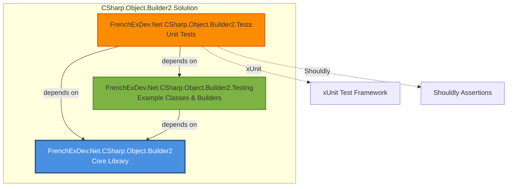
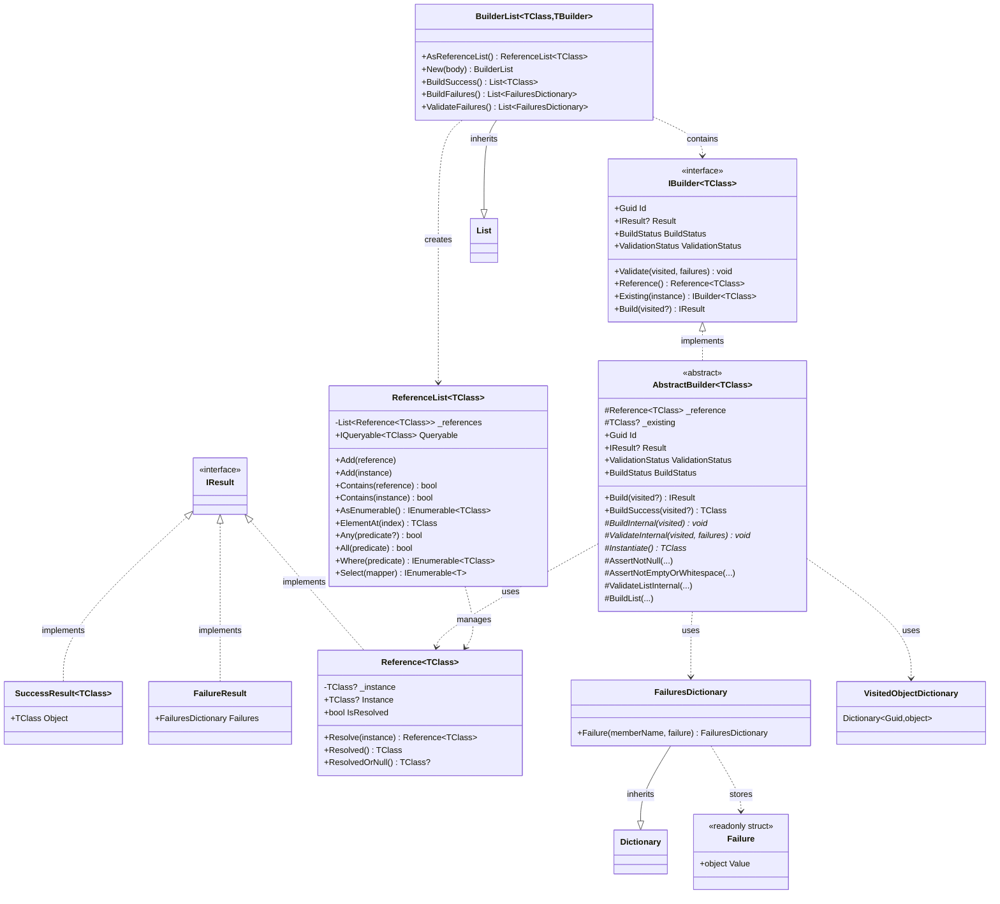
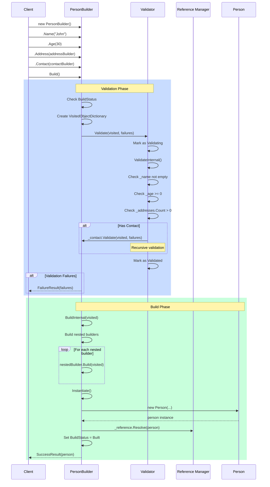
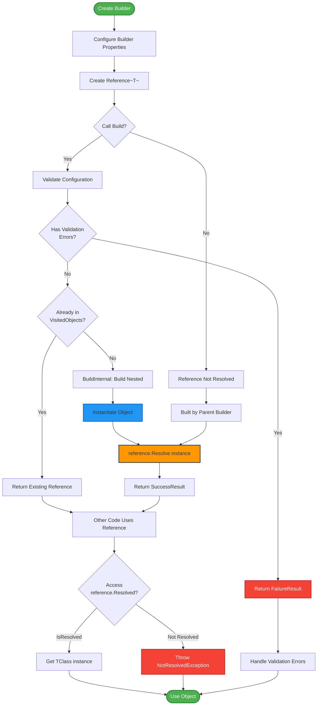
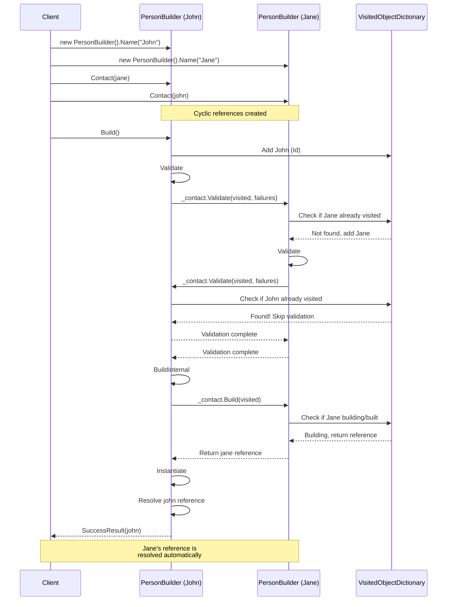

# CSharp.Object.Builder2 - Architecture Documentation

## Overview

CSharp.Object.Builder2 is a .NET 9 library that implements the Builder pattern with advanced features for constructing complex object graphs. It provides validation, cyclic reference management, deferred resolution, and result-based error handling for building domain objects with confidence.

## Solution Structure

### Projects

#### Core Library

- **FrenchExDev.Net.CSharp.Object.Builder2**
  - Main library implementing the Builder pattern
  - Abstract base class `AbstractBuilder<TClass>` for builders
  - `Reference<TClass>` for deferred object resolution
  - `ReferenceList<TClass>` for managing collections with references
  - `BuilderList<TClass, TBuilder>` for batch builder operations
  - Result types: `SuccessResult<T>` and `FailureResult`
  - Validation infrastructure with `FailuresDictionary`
  - Cyclic reference detection via `VisitedObjectDictionary`

#### Testing Projects

- **FrenchExDev.Net.CSharp.Object.Builder2.Testing**
  - Example classes demonstrating builder usage
  - `Person` and `Address` domain models
  - `PersonBuilder` and `AddressBuilder` implementations
  - Complex cyclic reference scenarios

- **FrenchExDev.Net.CSharp.Object.Builder2.Tests**
  - Comprehensive unit tests using xUnit and Shouldly
  - Tests for builder patterns, validation, references
  - Cyclic graph resolution tests
  - Edge cases and error scenarios

## Architecture Diagrams

### Project Structure



### Type Hierarchy



### Build Process Sequence



### Reference Resolution Flow



### Cyclic Reference Handling



## Core Components

### AbstractBuilder<TClass>

The foundation for all builders, providing:

**State Management:**
- `BuildStatus`: Tracks build lifecycle (NotBuilding, Building, Built)
- `ValidationStatus`: Tracks validation state (NotValidated, Validating, Validated)
- `Id`: Unique identifier for cycle detection

**Core Methods:**
- `Build(VisitedObjectDictionary?)`: Validates and builds the object
- `BuildSuccess()`: Builds and returns object or throws on failure
- `Validate()`: Validates configuration and nested builders
- `Reference()`: Returns a reference to the built object

**Extension Points (Abstract/Virtual):**
- `Instantiate()`: Must override to create the actual object
- `ValidateInternal()`: Override to add custom validation rules
- `BuildInternal()`: Override to build nested objects

**Helper Methods:**
- `AssertNotNull()`: Null validation helper
- `AssertNotEmptyOrWhitespace()`: String validation helper
- `AssertNotNullOrEmptyOrWhitespace()`: Combined validation
- `ValidateListInternal()`: Validates builder lists
- `BuildList()`: Builds all items in a builder list

### Reference<TClass>

Deferred object resolution mechanism.

**Purpose:** Allows builders to reference objects before they're constructed, enabling cyclic graphs.

**Key Properties:**
- `Instance`: The resolved instance (or null)
- `IsResolved`: Whether the reference has been resolved

**Key Methods:**
- `Resolve(instance)`: Resolves the reference with an instance
- `Resolved()`: Returns instance or throws `NotResolvedException`
- `ResolvedOrNull()`: Returns instance or null

**Usage Pattern:**
```csharp
// Create reference
var personRef = personBuilder.Reference();

// Later, after build
var person = personRef.Resolved();  // Throws if not built yet
```

### ReferenceList<TClass>

Collection of references with LINQ-style operations.

**Implements:** `IReferenceList<TClass>`, `IList<TClass>`

**Key Features:**
- Manages a list of `Reference<TClass>` objects
- Provides enumeration over resolved instances
- Supports LINQ operations (Where, Select, Any, All)
- Queryable interface for advanced queries

**Key Methods:**
- `Add(Reference<TClass>)`: Adds a reference
- `Add(TClass)`: Creates and adds a reference
- `Contains(Reference<TClass>)`: Checks reference presence
- `Contains(TClass)`: Checks instance presence
- `AsEnumerable()`: Returns resolved instances
- `Queryable`: Returns IQueryable for LINQ

### BuilderList<TClass, TBuilder>

Collection of builders for batch operations.

**Inherits:** `List<TBuilder>`

**Key Methods:**
- `New(Action<TBuilder>)`: Creates, configures, and adds a builder
- `AsReferenceList()`: Converts to ReferenceList of instances
- `BuildSuccess()`: Builds all and returns successful instances
- `BuildFailures()`: Builds all and returns failures
- `ValidateFailures()`: Validates all and returns failures

**Usage Pattern:**
```csharp
var addresses = new BuilderList<Address, AddressBuilder>();
addresses
    .New(a => a.Street("1 Rue").City("Paris"))
    .New(a => a.Street("2 Ave").City("Lyon"));

var instances = addresses.BuildSuccess();
```

### Result Types

#### IResult Interface
Base interface for all results.

#### SuccessResult<TClass>
Represents successful build with the constructed object.

```csharp
var result = builder.Build();
if (result is SuccessResult<Person> success)
{
    var person = success.Object;
}
```

#### FailureResult
Represents build failure with collected errors.

```csharp
if (result is FailureResult failure)
{
    var errors = failure.Failures;
    foreach (var kvp in errors)
    {
        Console.WriteLine($"{kvp.Key}:");
        foreach (var f in kvp.Value)
        {
            Console.WriteLine($"  - {f.Value}");
        }
    }
}
```

### Failure Types

#### FailuresDictionary
Maps member names to lists of failures.

```csharp
var failures = new FailuresDictionary();
failures
    .Failure("Name", new Exception("Required"))
    .Failure("Age", new Exception("Must be positive"));
```

#### Failure struct
Lightweight wrapper for failure payloads (exception, string, dictionary).

**Implicit Conversions:**
- `Exception` ? `Failure`
- `string` ? `Failure`
- `FailuresDictionary` ? `Failure`

### Validation Infrastructure

#### VisitedObjectDictionary
Tracks visited objects during validation/build to prevent:
- Infinite loops in cyclic graphs
- Redundant validation of same objects
- Stack overflow from circular references

**Usage:**
```csharp
var visited = new VisitedObjectDictionary();
builder.Validate(visited, failures);
```

## Build Lifecycle

### 1. Configuration Phase
Builder is configured with fluent methods:

```csharp
var builder = new PersonBuilder()
    .Name("John")
    .Age(30)
    .Address(addressBuilder)
    .Contact(contactBuilder);
```

### 2. Validation Phase
When `Build()` is called:

1. Check if already validated/building (prevent cycles)
2. Create `VisitedObjectDictionary` if not provided
3. Mark as `Validating`
4. Call `ValidateInternal()` in derived class
5. Validate nested builders recursively
6. Collect all failures in `FailuresDictionary`
7. Mark as `Validated`
8. If failures exist, return `FailureResult`

### 3. Build Phase
If validation succeeds:

1. Mark as `Building`
2. Call `BuildInternal()` to build nested objects
3. Call `Instantiate()` to create actual object
4. Create `SuccessResult` with object
5. Resolve reference with created object
6. Mark as `Built`
7. Return `SuccessResult`

### 4. Reference Resolution
References are resolved during build:

- Parent builder calls child builder's `Build()`
- Child creates object and resolves its reference
- Parent receives reference (already resolved)
- Parent can use reference in constructor

## Advanced Features

### Cyclic Reference Support

The library handles circular dependencies elegantly:

```csharp
var john = new PersonBuilder().Name("John").Age(30);
var jane = new PersonBuilder().Name("Jane").Age(28);

// Create circular references
john.Contact(jane);
jane.Contact(john);

// Build works correctly
var johnPerson = john.Build().Success<Person>();
var janePerson = jane.Build().Success<Person>();

// Both contacts are resolved
Assert.NotNull(johnPerson.Contact);  // jane
Assert.NotNull(janePerson.Contact);  // john
```

**How It Works:**
1. `john.Build()` starts
2. Validates john, then validates jane (as contact)
3. jane validation tries to validate john (contact)
4. john is already in `VisitedObjectDictionary` ? skip
5. Build phase: build john's nested objects
6. jane's `Build()` is called
7. jane is already being built ? return reference
8. john instantiates with jane's reference
9. Reference resolves when jane finishes building

### Deferred Object Access

Objects can be accessed before they're built:

```csharp
var builder = new PersonBuilder().Name("John");
var reference = builder.Reference();

// Can pass reference around before building
SomeMethod(reference);

// Build later
builder.Build();

// Now can access
var person = reference.Resolved();
```

### Batch Building

Build multiple objects efficiently:

```csharp
var builders = new BuilderList<Person, PersonBuilder>();
builders
    .New(p => p.Name("John").Age(30))
    .New(p => p.Name("Jane").Age(28))
    .New(p => p.Name("Bob").Age(35));

// Build all successfully or throw
var people = builders.BuildSuccess();

// Or get all failures
var failures = builders.ValidateFailures();
```

### Existing Instance Modification

Use builder pattern on existing objects:

```csharp
var existingPerson = GetPersonFromDatabase();

var builder = new PersonBuilder()
    .Existing(existingPerson)
    .Name("Updated Name");

var result = builder.Build();
// Returns the existing instance (no new object created)
```

## Validation Patterns

### Basic Validation

```csharp
protected override void ValidateInternal(
    VisitedObjectDictionary visited, 
    FailuresDictionary failures)
{
    AssertNotNullOrEmptyOrWhitespace(_name, 
        nameof(_name), 
        failures, 
        _ => new NameRequiredException());
    
    if (_age < 0)
    {
        failures.Failure(nameof(_age), 
            new AgeException("Must be non-negative"));
    }
}
```

### Nested Validation

```csharp
protected override void ValidateInternal(
    VisitedObjectDictionary visited, 
    FailuresDictionary failures)
{
    if (_contact != null)
    {
        var contactFailures = new FailuresDictionary();
        _contact.Validate(visited, contactFailures);
        
        if (contactFailures.Count > 0)
        {
            failures.Failure(nameof(_contact), contactFailures);
        }
    }
}
```

### Collection Validation

```csharp
protected override void ValidateInternal(
    VisitedObjectDictionary visited, 
    FailuresDictionary failures)
{
    ValidateListInternal(_addresses, 
        nameof(_addresses), 
        visited, 
        failures);
    
    if (_addresses.Count == 0)
    {
        failures.Failure(nameof(_addresses), 
            new AtLeastOneRequiredException());
    }
}
```

## Error Handling

### Result Pattern

```csharp
var result = builder.Build();

if (result.IsSuccess<Person>())
{
    var person = result.Success<Person>();
    ProcessPerson(person);
}
else if (result.IsFailure())
{
    var failures = result.Failures();
    LogErrors(failures);
}
```

### Exception-Based (BuildSuccess)

```csharp
try
{
    var person = builder.BuildSuccess();
    ProcessPerson(person);
}
catch (BuildFailedException ex)
{
    var failures = ex.Failures;
    LogErrors(failures);
}
```

### Aggregated Failures

```csharp
var failures = builder.Build().Failures();

foreach (var memberFailure in failures)
{
    Console.WriteLine($"Member: {memberFailure.Key}");
    
    foreach (var failure in memberFailure.Value)
    {
        switch (failure.Value)
        {
            case Exception ex:
                Console.WriteLine($"  Error: {ex.Message}");
                break;
            case string msg:
                Console.WriteLine($"  Message: {msg}");
                break;
            case FailuresDictionary nested:
                // Handle nested failures
                PrintNested(nested);
                break;
        }
    }
}
```

## Best Practices

### Builder Design

? **Good:**
```csharp
public class PersonBuilder : AbstractBuilder<Person>
{
    private string? _name;
    
    public PersonBuilder Name(string name)
    {
        _name = name;
        return this;  // Fluent interface
    }
    
    protected override void ValidateInternal(...)
    {
        AssertNotNullOrEmptyOrWhitespace(_name, ...);
    }
    
    protected override Person Instantiate()
    {
        return new Person(_name!, ...);
    }
}
```

? **Avoid:**
```csharp
// Don't throw in setters
public PersonBuilder Name(string name)
{
    if (string.IsNullOrEmpty(name))
        throw new Exception();  // ? Use ValidateInternal instead
    _name = name;
    return this;
}
```

### Validation Placement

? **Good:**
```csharp
protected override void ValidateInternal(...)
{
    // All validation logic here
    AssertNotNull(_required, ...);
    
    if (_custom validation)
        failures.Failure(...);
}
```

? **Avoid:**
```csharp
protected override Person Instantiate()
{
    // ? Don't validate in Instantiate
    if (_name == null)
        throw new Exception();
    
    return new Person(_name);
}
```

### Reference Management

? **Good:**
```csharp
public class Person
{
    protected Reference<Person> _contact;
    
    public Person Contact => _contact.Resolved();
    
    public Person(Reference<Person> contact)
    {
        _contact = contact;
    }
}
```

? **Avoid:**
```csharp
// Don't resolve in constructor
public Person(Reference<Person> contact)
{
    Contact = contact.Resolved();  // ? May not be built yet
}
```

## Testing Support

### Unit Test Example

```csharp
[Fact]
public void PersonBuilder_WithValidData_BuildsSuccessfully()
{
    // Arrange
    var jane = new PersonBuilder()
        .Name("Jane")
        .Age(28)
        .Address(new AddressBuilder()
            .Street("1 Rue")
            .City("Paris"));
    
    var john = new PersonBuilder()
        .Name("John")
        .Age(30)
        .Contact(jane)
        .Address(new AddressBuilder()
            .Street("2 Ave")
            .City("Lyon"));
    
    jane.Contact(john);  // Cyclic reference
    
    // Act
    var result = john.Build();
    
    // Assert
    result.IsSuccess<Person>().ShouldBeTrue();
    var person = result.Success<Person>();
    person.Name.ShouldBe("John");
    person.Contact.Name.ShouldBe("Jane");
}

[Fact]
public void PersonBuilder_MissingName_ValidationFails()
{
    // Arrange
    var builder = new PersonBuilder().Age(30);
    
    // Act
    var result = builder.Build();
    
    // Assert
    result.IsFailure().ShouldBeTrue();
    var failures = result.Failures();
    failures.ContainsKey("_name").ShouldBeTrue();
}
```

## Performance Considerations

### Memory Allocation
- `AbstractBuilder<T>` and `Reference<T>` are classes (heap)
- `Failure` is a readonly struct (stack)
- `VisitedObjectDictionary` prevents redundant work

### Optimization Tips

1. **Reuse VisitedObjectDictionary**
   ```csharp
   var visited = new VisitedObjectDictionary();
   builder1.Build(visited);
   builder2.Build(visited);  // Reuses tracking
   ```

2. **Batch Validation**
   ```csharp
   var failures = builders.ValidateFailures();
   // Validates all before building any
   ```

3. **Avoid Deep Nesting**
   - Excessive nesting impacts stack depth
   - Consider flattening complex hierarchies

## Future Enhancements

- **Async Building**: Support for async instantiation
- **Parallel Validation**: Validate independent branches in parallel
- **Change Tracking**: Detect modifications to existing instances
- **Snapshot/Rollback**: Save and restore builder state
- **Code Generation**: Auto-generate builders from classes
- **Fluent Validation Integration**: Integration with FluentValidation library

---

**Version**: 1.0  
**Last Updated**: 2024  
**Target Framework**: .NET 9  
**Architecture Style**: Builder Pattern with Advanced Features
