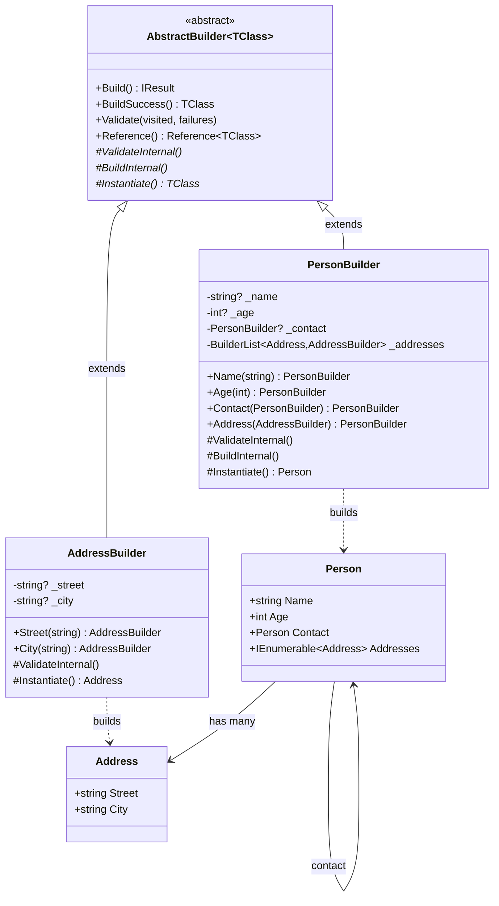
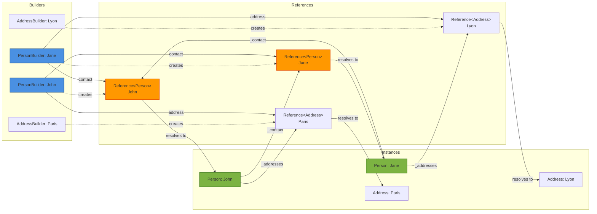
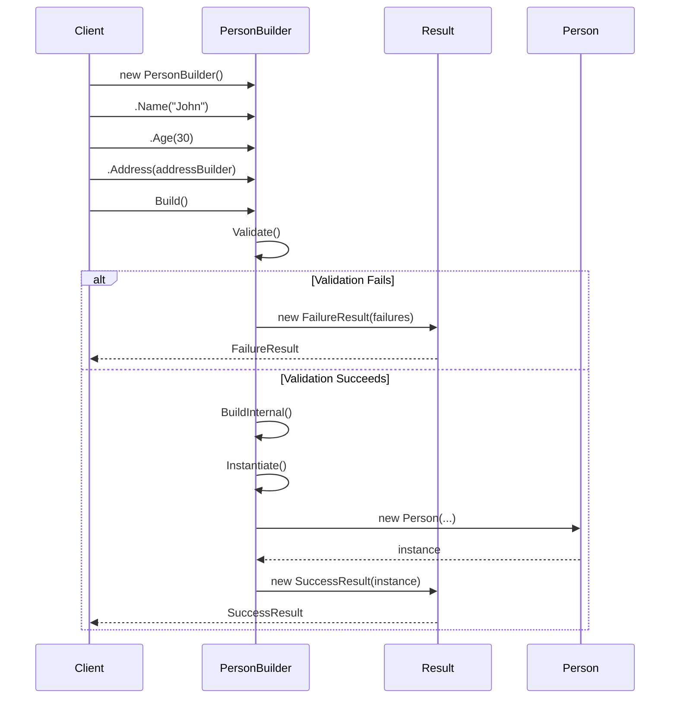
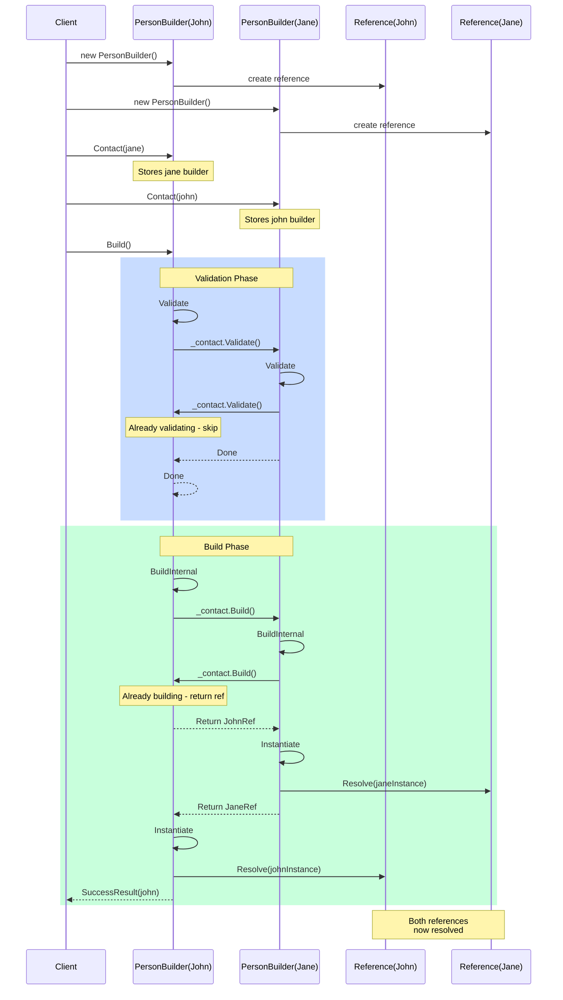
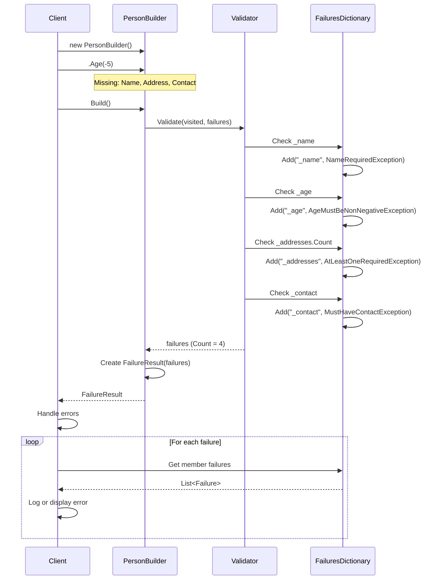

# Builder Pattern - Implementation Guide

## Overview

The Builder pattern separates the construction of complex objects from their representation, allowing the same construction process to create different representations. This implementation extends the classic pattern with validation, cyclic reference management, and result-based error handling.

## Pattern Implementation

### Basic Builder Structure

```csharp
public class PersonBuilder : AbstractBuilder<Person>
{
    // 1. Private fields for configuration
    private string? _name;
    private int? _age;
    private PersonBuilder? _contact;
    private readonly BuilderList<Address, AddressBuilder> _addresses = [];
    
    // 2. Fluent configuration methods
    public PersonBuilder Name(string name)
    {
        _name = name;
        return this;
    }
    
    public PersonBuilder Age(int age)
    {
        _age = age;
        return this;
    }
    
    public PersonBuilder Contact(PersonBuilder contact)
    {
        _contact = contact;
        return this;
    }
    
    public PersonBuilder Address(AddressBuilder address)
    {
        _addresses.Add(address);
        return this;
    }
    
    // 3. Validation logic
    protected override void ValidateInternal(
        VisitedObjectDictionary visited, 
        FailuresDictionary failures)
    {
        AssertNotNullOrEmptyOrWhitespace(_name, nameof(_name), 
            failures, _ => new NameRequiredException());
        
        if (_age == null || _age < 0)
        {
            failures.Failure(nameof(_age), 
                new AgeException("Must be non-negative"));
        }
        
        if (_contact != null)
        {
            var contactFailures = new FailuresDictionary();
            _contact.Validate(visited, contactFailures);
            if (contactFailures.Count > 0)
            {
                failures.Failure(nameof(_contact), contactFailures);
            }
        }
        
        ValidateListInternal(_addresses, nameof(_addresses), 
            visited, failures);
    }
    
    // 4. Build nested objects
    protected override void BuildInternal(VisitedObjectDictionary visited)
    {
        _contact?.Build(visited);
        BuildList(_addresses, visited);
    }
    
    // 5. Instantiate the final object
    protected override Person Instantiate()
    {
        return new Person(
            _name!,
            _age!.Value,
            _addresses.AsReferenceList(),
            _contact?.Reference() ?? throw new MustHaveContactException());
    }
}
```

## Class Diagrams

### Builder Pattern Structure



### Object Graph with References



## Sequence Diagrams

### Simple Build Sequence



### Cyclic Reference Build



### Validation Failure Sequence



## Usage Examples

### Example 1: Simple Object Creation

```csharp
// Create a simple address
var addressBuilder = new AddressBuilder()
    .Street("123 Main St")
    .City("Springfield");

var result = addressBuilder.Build();

if (result.IsSuccess<Address>())
{
    var address = result.Success<Address>();
    Console.WriteLine($"{address.Street}, {address.City}");
}
```

### Example 2: Complex Object with Nested Builders

```csharp
// Create addresses
var homeAddress = new AddressBuilder()
    .Street("123 Home St")
    .City("Hometown");

var workAddress = new AddressBuilder()
    .Street("456 Work Ave")
    .City("Worktown");

// Create a person with addresses
var person = new PersonBuilder()
    .Name("John Doe")
    .Age(30)
    .Address(homeAddress)
    .Address(workAddress);

var result = person.BuildSuccess();
// Throws BuildFailedException if validation fails
```

### Example 3: Cyclic References

```csharp
// Create two people who know each other
var john = new PersonBuilder()
    .Name("John")
    .Age(30)
    .Address(new AddressBuilder().Street("1 St").City("City1"));

var jane = new PersonBuilder()
    .Name("Jane")
    .Age(28)
    .Address(new AddressBuilder().Street("2 St").City("City2"));

// Set each other as contacts (cyclic reference)
john.Contact(jane).KnownPerson(jane);
jane.Contact(john).KnownPerson(john);

// Build works correctly despite cycles
var johnResult = john.Build();
var janeResult = jane.Build();

if (johnResult.IsSuccess<Person>() && janeResult.IsSuccess<Person>())
{
    var johnPerson = johnResult.Success<Person>();
    var janePerson = janeResult.Success<Person>();
    
    // Both contacts are properly resolved
    Console.WriteLine(johnPerson.Contact.Name);  // "Jane"
    Console.WriteLine(janePerson.Contact.Name);  // "John"
}
```

### Example 4: Batch Building

```csharp
// Create multiple people at once
var people = new BuilderList<Person, PersonBuilder>();

people
    .New(p => p
        .Name("Alice")
        .Age(25)
        .Address(new AddressBuilder().Street("1 St").City("City1"))
        .Contact(new PersonBuilder().Name("Bob").Age(26)))
    .New(p => p
        .Name("Bob")
        .Age(26)
        .Address(new AddressBuilder().Street("2 St").City("City2"))
        .Contact(new PersonBuilder().Name("Alice").Age(25)))
    .New(p => p
        .Name("Charlie")
        .Age(30)
        .Address(new AddressBuilder().Street("3 St").City("City3"))
        .Contact(new PersonBuilder().Name("Alice").Age(25)));

try
{
    var instances = people.BuildSuccess();
    Console.WriteLine($"Created {instances.Count} people");
}
catch (BuildFailedException ex)
{
    Console.WriteLine($"Build failed: {ex.Failures.Count} errors");
}
```

### Example 5: Validation Before Building

```csharp
var builder = new PersonBuilder()
    .Name("John");  // Missing age, address, contact

var visited = new VisitedObjectDictionary();
var failures = new FailuresDictionary();

builder.Validate(visited, failures);

if (failures.Count > 0)
{
    Console.WriteLine("Validation errors:");
    foreach (var kvp in failures)
    {
        Console.WriteLine($"  {kvp.Key}:");
        foreach (var failure in kvp.Value)
        {
            if (failure.Value is Exception ex)
            {
                Console.WriteLine($"    - {ex.Message}");
            }
        }
    }
    // Don't call Build() - fix errors first
}
else
{
    var result = builder.Build(visited);  // Reuse visited dictionary
}
```

### Example 6: Accessing References Before Build

```csharp
// Create builders
var johnBuilder = new PersonBuilder()
    .Name("John")
    .Age(30);

// Get reference before building
var johnRef = johnBuilder.Reference();

// Can pass reference to other builders
var janeBuilder = new PersonBuilder()
    .Name("Jane")
    .Age(28)
    .Address(new AddressBuilder().Street("1 St").City("City"));

// Add john as contact using reference
janeBuilder.Contact(johnBuilder);

// Build jane (will build john too)
var janeResult = janeBuilder.Build();

// Now john's reference is resolved
if (johnRef.IsResolved)
{
    var john = johnRef.Resolved();
    Console.WriteLine($"John is now built: {john.Name}");
}
```

### Example 7: Error Handling Patterns

```csharp
var builder = new PersonBuilder().Name("Test");

// Pattern 1: Result-based
var result = builder.Build();
if (result.IsSuccess<Person>())
{
    ProcessPerson(result.Success<Person>());
}
else if (result.IsFailure())
{
    HandleErrors(result.Failures());
}

// Pattern 2: Exception-based
try
{
    var person = builder.BuildSuccess();
    ProcessPerson(person);
}
catch (BuildFailedException ex)
{
    HandleErrors(ex.Failures);
}

// Pattern 3: Extension method
var success = builder.Build().IsSuccess<Person>();
if (success)
{
    // Process
}
```

### Example 8: Modifying Existing Instances

```csharp
// Get existing person from database
var existingPerson = repository.GetPerson(id);

// Use builder to modify
var builder = new PersonBuilder()
    .Existing(existingPerson)
    .Name("Updated Name")
    .Age(existingPerson.Age + 1);

var result = builder.Build();
// Returns the same instance (not a new one)

if (result.IsSuccess<Person>())
{
    var updated = result.Success<Person>();
    repository.Save(updated);
}
```

## Comparison with Standard Builder Pattern

### Traditional Builder Pattern

```csharp
// Traditional implementation
public class PersonBuilder
{
    private string? _name;
    private int _age;
    
    public PersonBuilder WithName(string name)
    {
        _name = name;
        return this;
    }
    
    public PersonBuilder WithAge(int age)
    {
        _age = age;
        return this;
    }
    
    public Person Build()
    {
        // Validation might throw exceptions
        if (string.IsNullOrEmpty(_name))
            throw new ArgumentException("Name required");
        
        if (_age < 0)
            throw new ArgumentException("Age must be positive");
        
        return new Person(_name, _age);
    }
}
```

### This Implementation

```csharp
// Advanced implementation
public class PersonBuilder : AbstractBuilder<Person>
{
    private string? _name;
    private int? _age;
    
    public PersonBuilder Name(string name)
    {
        _name = name;
        return this;
    }
    
    public PersonBuilder Age(int age)
    {
        _age = age;
        return this;
    }
    
    protected override void ValidateInternal(
        VisitedObjectDictionary visited, 
        FailuresDictionary failures)
    {
        // Collect all errors (no throwing)
        AssertNotNullOrEmptyOrWhitespace(_name, 
            nameof(_name), failures, 
            _ => new NameRequiredException());
        
        if (_age == null || _age < 0)
        {
            failures.Failure(nameof(_age), 
                new AgeException("Must be positive"));
        }
    }
    
    protected override Person Instantiate()
    {
        return new Person(_name!, _age!.Value);
    }
    
    public override IResult Build(VisitedObjectDictionary? visited = null)
    {
        // Returns result instead of throwing
        return base.Build(visited);
    }
}
```

### Feature Comparison Table

| Feature | Traditional | This Implementation |
|---------|------------|-------------------|
| **Fluent API** | ? Yes | ? Yes |
| **Validation** | Throws exceptions | ? Collects all errors |
| **Cyclic References** | ? No | ? Full support |
| **Deferred Resolution** | ? No | ? Reference<T> |
| **Batch Operations** | ? No | ? BuilderList |
| **Result Pattern** | ? No | ? Success/Failure |
| **Visited Tracking** | ? No | ? Prevents cycles |
| **Nested Validation** | ? Manual | ? Automatic |
| **Multiple Errors** | ? First error only | ? All errors collected |
| **Type Safety** | ? Yes | ? Yes |
| **Existing Instance** | ? No | ? Supported |

## Design Patterns Integration

### With Factory Pattern

```csharp
public class PersonFactory
{
    public static Person CreateEmployee(string name, int age)
    {
        return new PersonBuilder()
            .Name(name)
            .Age(age)
            .Address(new AddressBuilder()
                .Street("Company HQ")
                .City("Business City"))
            .BuildSuccess();
    }
}
```

### With Prototype Pattern

```csharp
public class PersonBuilder : AbstractBuilder<Person>
{
    public PersonBuilder FromPrototype(Person prototype)
    {
        _name = prototype.Name;
        _age = prototype.Age;
        // Copy other properties
        return this;
    }
}

// Usage
var template = GetPersonTemplate();
var builder = new PersonBuilder()
    .FromPrototype(template)
    .Name("Different Name");  // Override specific fields
```

### With Strategy Pattern

```csharp
public interface IValidationStrategy
{
    void Validate(PersonBuilder builder, FailuresDictionary failures);
}

public class StrictValidationStrategy : IValidationStrategy
{
    public void Validate(PersonBuilder builder, FailuresDictionary failures)
    {
        // Strict validation rules
    }
}

public class PersonBuilder : AbstractBuilder<Person>
{
    private IValidationStrategy _validationStrategy = new StrictValidationStrategy();
    
    public PersonBuilder WithValidation(IValidationStrategy strategy)
    {
        _validationStrategy = strategy;
        return this;
    }
    
    protected override void ValidateInternal(
        VisitedObjectDictionary visited, 
        FailuresDictionary failures)
    {
        _validationStrategy.Validate(this, failures);
    }
}
```

## Advanced Patterns

### Conditional Building

```csharp
public class PersonBuilder : AbstractBuilder<Person>
{
    private bool _includeOptionalData = false;
    
    public PersonBuilder IncludeOptionalData()
    {
        _includeOptionalData = true;
        return this;
    }
    
    protected override void BuildInternal(VisitedObjectDictionary visited)
    {
        base.BuildInternal(visited);
        
        if (_includeOptionalData)
        {
            // Build additional optional nested objects
            _optionalData?.Build(visited);
        }
    }
}
```

### Validation Levels

```csharp
public enum ValidationLevel
{
    Basic,    // Required fields only
    Standard, // Basic + business rules
    Strict    // Standard + advanced constraints
}

public class PersonBuilder : AbstractBuilder<Person>
{
    private ValidationLevel _validationLevel = ValidationLevel.Standard;
    
    public PersonBuilder WithValidationLevel(ValidationLevel level)
    {
        _validationLevel = level;
        return this;
    }
    
    protected override void ValidateInternal(
        VisitedObjectDictionary visited, 
        FailuresDictionary failures)
    {
        // Basic validation (always)
        AssertNotNull(_name, nameof(_name), failures, ...);
        
        if (_validationLevel >= ValidationLevel.Standard)
        {
            // Standard business rules
            if (_age < 18)
                failures.Failure(nameof(_age), new UnderageException());
        }
        
        if (_validationLevel >= ValidationLevel.Strict)
        {
            // Advanced constraints
            ValidateAddressFormat(failures);
        }
    }
}
```

### Composite Builders

```csharp
public class TeamBuilder : AbstractBuilder<Team>
{
    private readonly BuilderList<Person, PersonBuilder> _members = [];
    private PersonBuilder? _leader;
    
    public TeamBuilder Member(PersonBuilder member)
    {
        _members.Add(member);
        return this;
    }
    
    public TeamBuilder Leader(PersonBuilder leader)
    {
        _leader = leader;
        return this;
    }
    
    protected override void ValidateInternal(
        VisitedObjectDictionary visited, 
        FailuresDictionary failures)
    {
        if (_leader == null)
        {
            failures.Failure(nameof(_leader), new LeaderRequiredException());
        }
        
        if (_members.Count == 0)
        {
            failures.Failure(nameof(_members), new NoMembersException());
        }
        
        // Validate all members
        ValidateListInternal(_members, nameof(_members), visited, failures);
    }
    
    protected override Team Instantiate()
    {
        return new Team(
            _leader!.Reference(),
            _members.AsReferenceList());
    }
}
```

## Best Practices

### ? Do

1. **Use Fluent Methods**
   ```csharp
   public PersonBuilder Name(string name)
   {
       _name = name;
       return this;  // Enable chaining
   }
   ```

2. **Collect All Validation Errors**
   ```csharp
   protected override void ValidateInternal(...)
   {
       AssertNotNull(_field1, ...);
       AssertNotNull(_field2, ...);
       AssertNotNull(_field3, ...);
       // All collected before returning
   }
   ```

3. **Use Meaningful Exception Types**
   ```csharp
   public class NameRequiredException : BuildException
   {
       public NameRequiredException() 
           : base("Name is required") { }
   }
   ```

4. **Leverage References for Cycles**
   ```csharp
   public Person(Reference<Person> contact)
   {
       _contact = contact;
   }
   
   public Person Contact => _contact.Resolved();
   ```

5. **Provide Build Convenience Methods**
   ```csharp
   public TClass BuildSuccess() { ... }
   public List<TClass> BuildSuccessList() { ... }
   ```

### ? Don't

1. **Don't Throw in Setters**
   ```csharp
   // ? Bad
   public PersonBuilder Name(string name)
   {
       if (string.IsNullOrEmpty(name))
           throw new Exception();
       return this;
   }
   
   // ? Good
   public PersonBuilder Name(string name)
   {
       _name = name;  // Just store, validate later
       return this;
   }
   ```

2. **Don't Validate in Instantiate**
   ```csharp
   // ? Bad
   protected override Person Instantiate()
   {
       if (_name == null) throw new Exception();
       return new Person(_name);
   }
   
   // ? Good - validation happens in ValidateInternal
   protected override Person Instantiate()
   {
       return new Person(_name!);  // Assume validated
   }
   ```

3. **Don't Resolve References in Constructor**
   ```csharp
   // ? Bad
   public Person(Reference<Person> contact)
   {
       _contact = contact.Resolved();  // May not be built yet
   }
   
   // ? Good
   public Person(Reference<Person> contact)
   {
       _contact = contact;  // Store reference, resolve later
   }
   ```

4. **Don't Ignore VisitedObjectDictionary**
   ```csharp
   // ? Bad
   protected override void BuildInternal(VisitedObjectDictionary visited)
   {
       _nested.Build();  // Missing visited parameter
   }
   
   // ? Good
   protected override void BuildInternal(VisitedObjectDictionary visited)
   {
       _nested.Build(visited);  // Pass visited for cycle detection
   }
   ```

## Testing Guidelines

### Unit Test Structure

```csharp
public class PersonBuilderTests
{
    [Fact]
    public void Build_WithValidData_ReturnsSuccess()
    {
        // Arrange
        var builder = new PersonBuilder()
            .Name("John")
            .Age(30)
            .Address(new AddressBuilder().Street("1 St").City("City"))
            .Contact(new PersonBuilder()...);
        
        // Act
        var result = builder.Build();
        
        // Assert
        result.IsSuccess<Person>().ShouldBeTrue();
        var person = result.Success<Person>();
        person.Name.ShouldBe("John");
    }
    
    [Fact]
    public void Build_MissingRequiredField_ReturnsFailure()
    {
        // Arrange
        var builder = new PersonBuilder();  // Nothing set
        
        // Act
        var result = builder.Build();
        
        // Assert
        result.IsFailure().ShouldBeTrue();
        var failures = result.Failures();
        failures.ContainsKey("_name").ShouldBeTrue();
    }
    
    [Fact]
    public void Build_WithCyclicReference_BuildsSuccessfully()
    {
        // Arrange
        var john = new PersonBuilder().Name("John").Age(30);
        var jane = new PersonBuilder().Name("Jane").Age(28);
        john.Contact(jane);
        jane.Contact(john);
        
        // Act
        var johnResult = john.Build();
        var janeResult = jane.Build();
        
        // Assert
        johnResult.IsSuccess<Person>().ShouldBeTrue();
        janeResult.IsSuccess<Person>().ShouldBeTrue();
        
        var johnPerson = johnResult.Success<Person>();
        var janePerson = janeResult.Success<Person>();
        johnPerson.Contact.Name.ShouldBe("Jane");
        janePerson.Contact.Name.ShouldBe("John");
    }
}
```

---

**Version**: 1.0  
**Last Updated**: 2024  
**Target Framework**: .NET 9  
**Pattern Category**: Creational Pattern with Advanced Features
