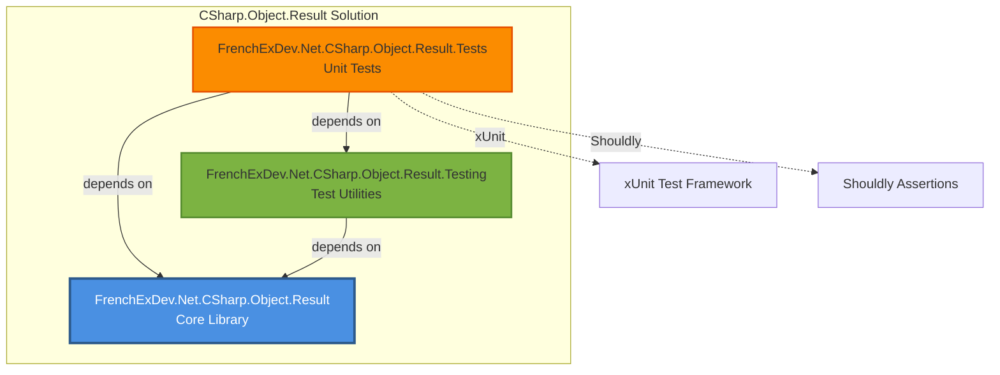
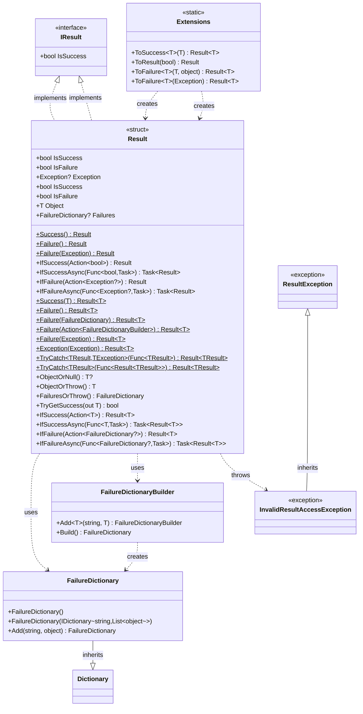
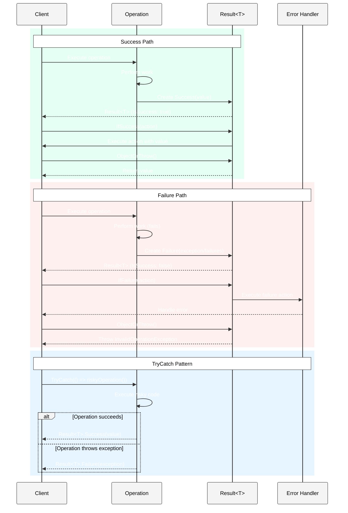
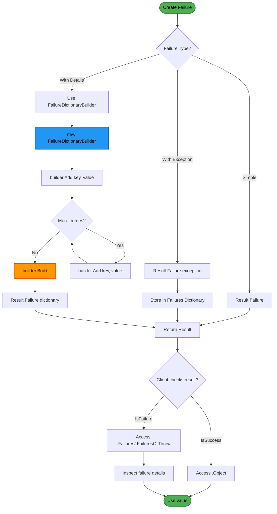
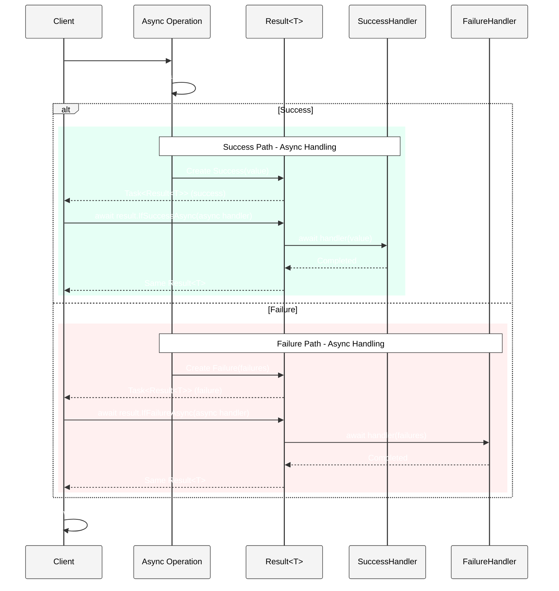

# CSharp.Object.Result - Architecture Documentation

## Overview

CSharp.Object.Result is a .NET 9 library that provides a functional programming approach to error handling through the Result pattern. It eliminates the need for exception-based control flow by encapsulating operation outcomes (success or failure) in strongly-typed value types, enabling more explicit and composable error handling.

## Solution Structure

### Projects

#### Core Library

- **FrenchExDev.Net.CSharp.Object.Result**
  - Main library implementing the Result pattern
  - Contains `Result` (non-generic) and `Result<T>` (generic) types
  - Failure dictionary and builder for detailed error tracking
  - Extension methods for fluent API usage
  - Async/await support for asynchronous operations

#### Testing Projects

- **FrenchExDev.Net.CSharp.Object.Result.Testing**
  - Testing utilities and helpers
  - Contains `ResultTester` class for test scenarios

- **FrenchExDev.Net.CSharp.Object.Result.Tests**
  - Comprehensive unit tests using xUnit and Shouldly
  - Tests for all Result APIs, edge cases, and async operations
  - Validates failure dictionaries and exception handling

## Architecture Diagrams

### Project Structure



### Type Hierarchy and Relationships



### Result Pattern Flow



### Failure Dictionary Building Flow



### Async Result Pattern



## Core Components

### Result (Non-Generic)

A readonly struct representing the outcome of an operation without a return value.

**Key Properties:**
- `IsSuccess`: Indicates success
- `IsFailure`: Indicates failure (inverse of IsSuccess)
- `Exception`: Optional exception for failure cases

**Static Factory Methods:**
- `Success()`: Creates successful result
- `Failure()`: Creates failed result
- `Failure(Exception)`: Creates failed result with exception

**Fluent Methods:**
- `IfSuccess(Action<bool>)`: Execute action on success
- `IfSuccessAsync(Func<bool, Task>)`: Async version
- `IfFailure(Action<Exception?>)`: Execute action on failure
- `IfFailureAsync(Func<Exception?, Task>)`: Async version

### Result<T> (Generic)

A readonly struct representing the outcome of an operation that returns a value of type T.

**Key Properties:**
- `IsSuccess`: Indicates success
- `IsFailure`: Indicates failure
- `Object`: The successful value (throws if accessed on failure)
- `Failures`: Optional failure dictionary with detailed error information

**Static Factory Methods:**
- `Success(T)`: Creates successful result with value
- `Failure()`: Creates failed result
- `Failure(FailureDictionary)`: Creates failed result with failure details
- `Failure(Action<FailureDictionaryBuilder>)`: Creates failed result using builder
- `Failure(Exception)`: Creates failed result from exception
- `Exception(Exception)`: Creates failed result storing exception in failures
- `TryCatch<TResult, TException>(Func<TResult>)`: Catches specific exception type
- `TryCatch<TResult>(Func<Result<TResult>>)`: Catches all exceptions

**Value Access Methods:**
- `ObjectOrNull()`: Returns value or null
- `ObjectOrThrow()`: Returns value or throws InvalidOperationException
- `FailuresOrThrow()`: Returns failures or throws InvalidResultAccessException
- `TryGetSuccess(out T)`: Pattern for safe value retrieval

**Fluent Methods:**
- `IfSuccess(Action<T>)`: Execute action with value on success
- `IfSuccessAsync(Func<T, Task>)`: Async version
- `IfFailure(Action<FailureDictionary?>)`: Execute action with failures on failure
- `IfFailureAsync(Func<FailureDictionary?, Task>)`: Async version

### FailureDictionary

A specialized dictionary mapping string keys to lists of failure objects.

**Purpose:** Stores multiple failure reasons grouped by category

**Key Methods:**
- `Add(string, object)`: Adds failure entry, appending to existing key's list
- Inherits all Dictionary functionality

**Usage Pattern:**
```csharp
var failures = new FailureDictionary();
failures.Add("ValidationError", "Email is required");
failures.Add("ValidationError", "Password too short");
failures.Add("BusinessRule", "User already exists");
```

### FailureDictionaryBuilder

Fluent builder for constructing FailureDictionary instances.

**Key Methods:**
- `Add<T>(string, T)`: Adds typed failure entry
- `Build()`: Creates independent FailureDictionary

**Features:**
- Type-safe entry addition
- Creates deep copy on Build() for isolation
- Supports method chaining

**Usage Pattern:**
```csharp
var result = Result<User>.Failure(d => d
    .Add("Email", "Invalid format")
    .Add("Email", "Already registered")
    .Add("Password", "Too weak"));
```

### Extension Methods

Static helper methods for creating Results fluently.

**Methods:**
- `ToSuccess<T>(this T)`: Converts value to success result
- `ToResult(this bool)`: Converts boolean to Result
- `ToFailure<T>(this T, object)`: Creates failure with subject
- `ToFailure<T>(this Exception)`: Converts exception to failure

**Usage Examples:**
```csharp
// Success
var result = user.ToSuccess();

// Failure
var failure = new InvalidOperationException("error").ToFailure<User>();

// Boolean to Result
var result = isValid.ToResult();
```

## Exception Types

### ResultException

Base exception class for all Result-related exceptions.

### InvalidResultAccessException

Thrown when accessing properties on results in invalid states:
- Accessing `Object` on failed Result<T>
- Calling `FailuresOrThrow()` on Result<T> without failures

## Design Patterns

### Railway Oriented Programming

The Result pattern implements Railway Oriented Programming:
- **Success track**: Operations continue with values
- **Failure track**: Operations propagate failures
- **Switching**: IfSuccess/IfFailure switch between tracks

### Monad-like Behavior

Result<T> exhibits monad-like properties:
- **Unit** (return): `ToSuccess()`, `Success()`
- **Bind** (flatMap): Can be chained through IfSuccess
- **Pure values**: Immutable structs

### Try-Catch Elimination

Replace exception handling with explicit result handling:

**Traditional:**
```csharp
try {
    var user = GetUser(id);
    return user;
} catch (Exception ex) {
    logger.LogError(ex, "Failed to get user");
    return null;
}
```

**Result Pattern:**
```csharp
return Result<User>
    .TryCatch(() => GetUser(id))
    .IfFailure(failures => logger.LogError("Failed to get user"));
```

## Usage Patterns

### Basic Success/Failure

```csharp
public Result<User> GetUser(int id)
{
    var user = _repository.Find(id);
    return user != null 
        ? Result<User>.Success(user)
        : Result<User>.Failure(d => d.Add("NotFound", $"User {id} not found"));
}
```

### Exception Handling

```csharp
public Result<Data> LoadData(string path)
{
    return Result<Data>.TryCatch<Data>(() =>
    {
        var content = File.ReadAllText(path);
        return JsonSerializer.Deserialize<Data>(content).ToSuccess();
    });
}
```

### Conditional Execution

```csharp
var result = GetUser(userId)
    .IfSuccess(user => logger.LogInfo($"Found user: {user.Name}"))
    .IfFailure(failures => logger.LogError($"Errors: {failures}"));

if (result.IsSuccess)
{
    ProcessUser(result.Object);
}
```

### Async Operations

```csharp
public async Task<Result<Order>> CreateOrderAsync(OrderRequest request)
{
    return await ValidateRequest(request)
        .IfSuccessAsync(async validRequest =>
        {
            await _repository.SaveAsync(validRequest);
        })
        .IfFailureAsync(async failures =>
        {
            await _logger.LogAsync($"Validation failed: {failures}");
        });
}
```

### Detailed Failure Tracking

```csharp
public Result<User> RegisterUser(UserRequest request)
{
    var errors = new List<string>();
    
    if (string.IsNullOrEmpty(request.Email))
        errors.Add("Email is required");
    if (request.Password.Length < 8)
        errors.Add("Password must be at least 8 characters");
        
    if (errors.Any())
    {
        return Result<User>.Failure(d =>
        {
            foreach (var error in errors)
                d.Add("ValidationError", error);
        });
    }
    
    return CreateUser(request).ToSuccess();
}
```

## Benefits

### Type Safety
- Compiler enforces handling of both success and failure cases
- No silent failures or ignored exceptions
- Explicit return types document possible failures

### Composability
- Fluent API enables method chaining
- Async support integrates with async/await
- Extension methods provide natural syntax

### Testability
- Results are easy to construct in tests
- No exception setup required
- Failure dictionaries enable detailed assertions

### Performance
- Struct-based implementation (no heap allocation)
- No exception throwing/catching overhead
- Efficient for high-throughput scenarios

### Readability
- Intent is clear from method signatures
- Success and failure paths are explicit
- Railway-oriented programming paradigm

## Testing Support

### Test Utilities

The Testing project provides helpers for:
- Creating test results
- Asserting on result states
- Mocking result-returning methods

### Test Coverage

Comprehensive tests validate:
- Success and failure creation
- Property access and exceptions
- Conditional execution (If*/async)
- Extension method behavior
- Failure dictionary building
- Exception to failure conversion
- TryCatch patterns
- Edge cases and error conditions

## Best Practices

### When to Use Result Pattern

**Use Result for:**
- Expected failures (validation, not found, etc.)
- Business rule violations
- External service failures
- Parsing/conversion operations

**Don't use Result for:**
- Truly exceptional conditions (out of memory, etc.)
- Framework exceptions that should propagate
- Internal programming errors (nullref, etc.)

### Failure Dictionary Usage

**Good:**
```csharp
return Result<User>.Failure(d => d
    .Add("Validation", "Email invalid")
    .Add("Validation", "Phone invalid")
    .Add("Business", "User exists"));
```

**Avoid:**
```csharp
// Too generic
return Result<User>.Failure(d => d.Add("Error", "Something failed"));

// Should use exception instead
return Result<User>.Failure(d => d.Add("Critical", "Out of memory"));
```

### Method Signatures

**Prefer:**
```csharp
public Result<User> FindUser(int id);
public async Task<Result<Order>> ProcessOrderAsync(Order order);
```

**Over:**
```csharp
public User FindUser(int id); // throws if not found
public async Task<Order?> ProcessOrderAsync(Order order); // null on error
```

## Future Enhancements

- **Result.Combine()**: Combine multiple results
- **Result.Map/Bind**: Functional transformations
- **Result.Match()**: Pattern matching helper
- **Source generators**: Generate result handling code
- **Logging integration**: Automatic failure logging
- **Serialization support**: JSON/XML serialization
- **Result<T, TError>**: Typed error results

---

**Version**: 1.0  
**Last Updated**: 2024  
**Target Framework**: .NET 9  
**Architecture Style**: Functional Error Handling Library
