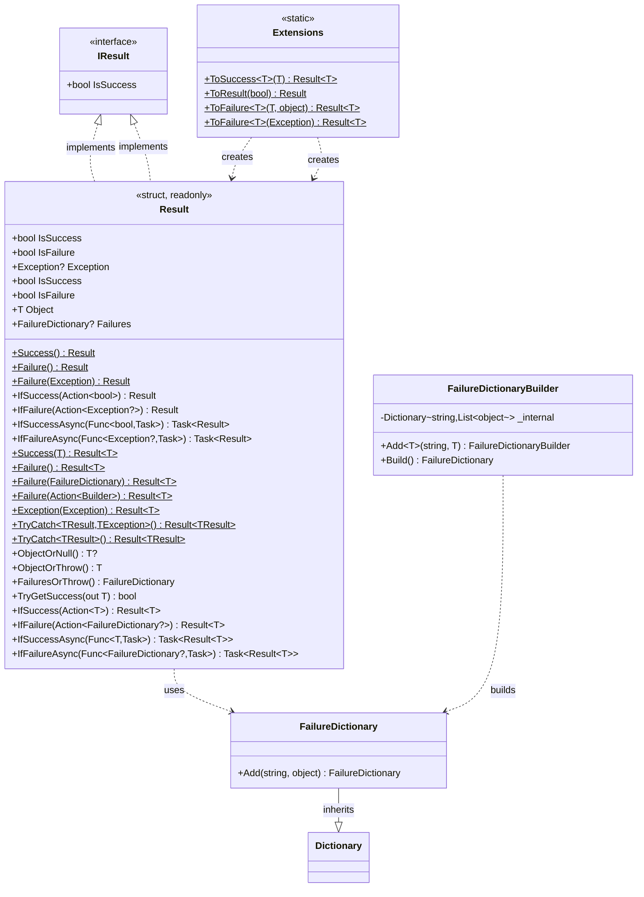
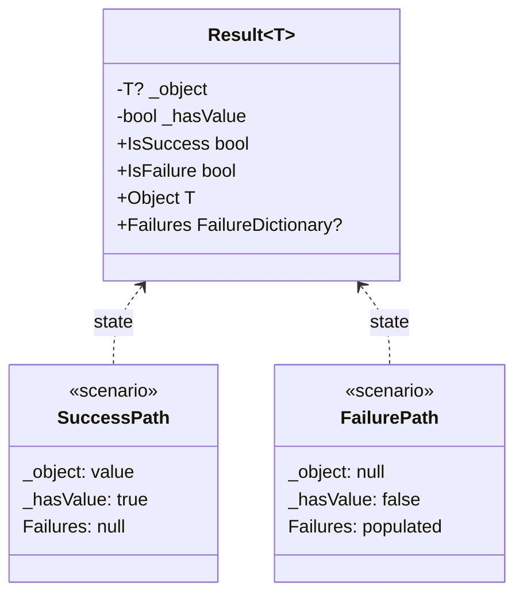
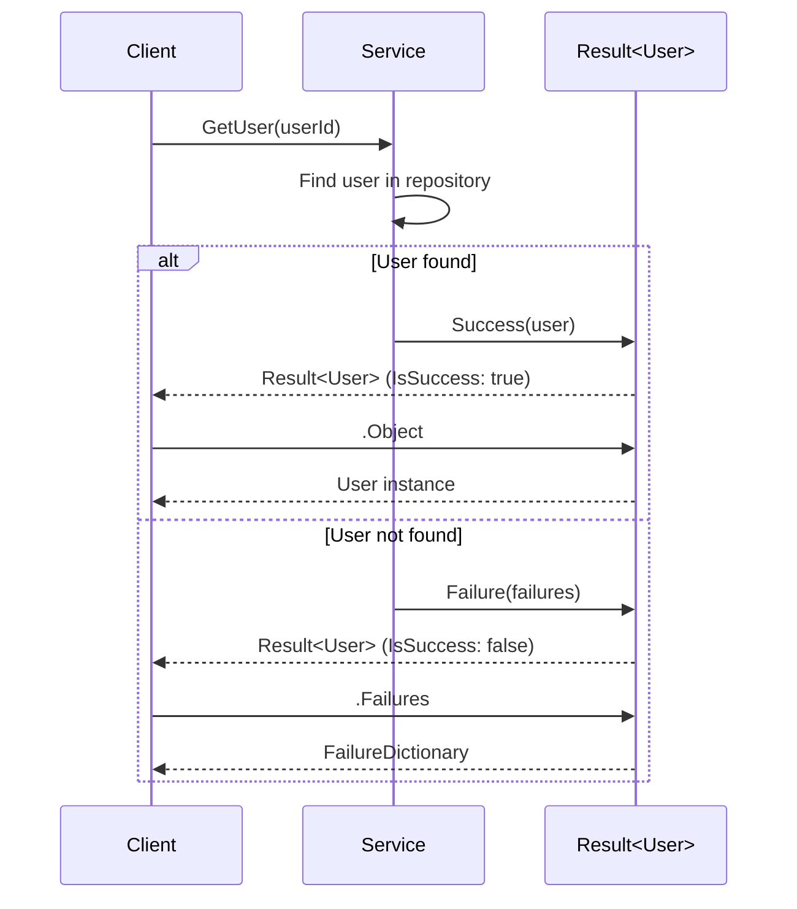
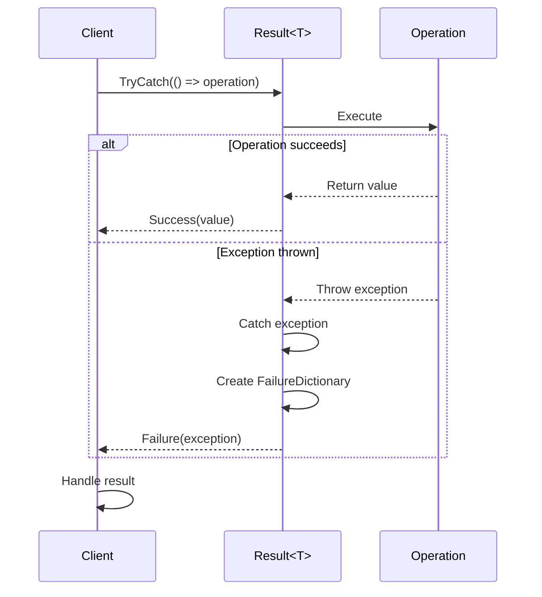
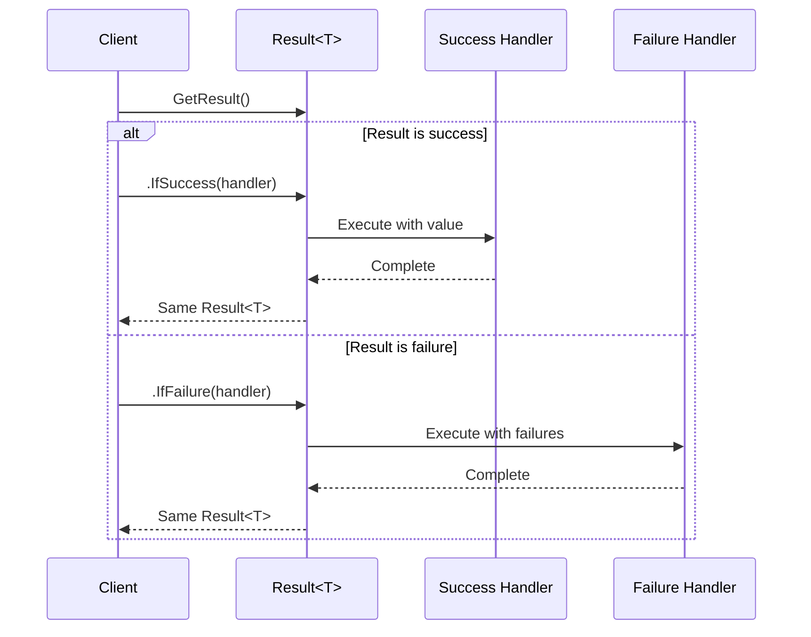
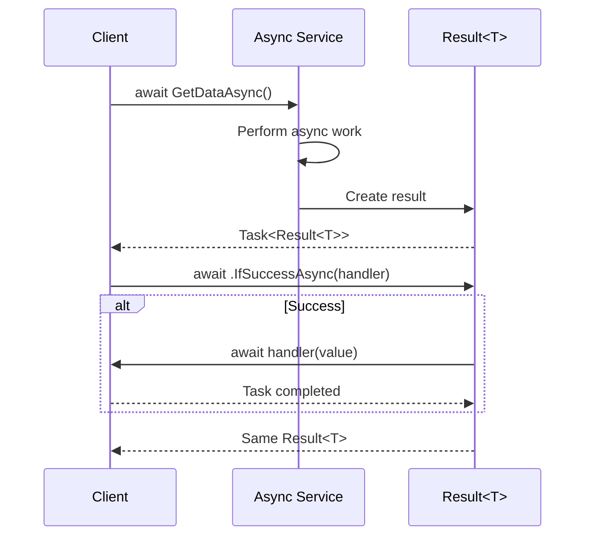

# Result Pattern - Implementation Guide

## Overview

The Result pattern is a functional programming approach to error handling that makes success and failure explicit in method signatures. Instead of throwing exceptions or returning null, operations return a `Result` or `Result<T>` that encapsulates both the outcome (success/failure) and relevant data.

## Core Implementation

### Basic Types

#### Result (Non-Generic)

Used for operations that don't return a value but need to indicate success or failure.

```csharp
// Definition
public readonly struct Result : IResult
{
    public bool IsSuccess { get; }
    public bool IsFailure => !IsSuccess;
    public Exception? Exception { get; }
    
    public static Result Success() => new(true, null);
    public static Result Failure() => new(false, null);
    public static Result Failure(Exception ex) => new(false, ex);
}

// Usage
public Result DeleteUser(int userId)
{
    try
    {
        _repository.Delete(userId);
        return Result.Success();
    }
    catch (Exception ex)
    {
        return Result.Failure(ex);
    }
}

// Consumption
var result = DeleteUser(123);
if (result.IsSuccess)
{
    Console.WriteLine("User deleted successfully");
}
else
{
    Console.WriteLine($"Failed: {result.Exception?.Message}");
}
```

#### Result<T> (Generic)

Used for operations that return a value on success.

```csharp
// Definition
public readonly struct Result<T> : IResult where T : notnull
{
    public bool IsSuccess { get; }
    public bool IsFailure => !IsSuccess;
    public T Object { get; }  // Throws if accessed on failure
    public FailureDictionary? Failures { get; }
    
    public static Result<T> Success(T instance) => new(instance);
    public static Result<T> Failure() => new();
    public static Result<T> Failure(FailureDictionary failures) => new(failures);
    public static Result<T> Failure(Action<FailureDictionaryBuilder> body);
    public static Result<T> Exception(Exception ex);
    
    public T? ObjectOrNull();
    public T ObjectOrThrow();
    public FailureDictionary FailuresOrThrow();
    public bool TryGetSuccess(out T result);
}

// Usage
public Result<User> GetUser(int userId)
{
    var user = _repository.Find(userId);
    
    if (user == null)
    {
        return Result<User>.Failure(d => d
            .Add("NotFound", $"User {userId} not found"));
    }
    
    return Result<User>.Success(user);
}

// Consumption
var result = GetUser(123);
if (result.IsSuccess)
{
    var user = result.Object;
    Console.WriteLine($"Found: {user.Name}");
}
else
{
    var errors = result.Failures;
    // Handle failures
}
```

### Failure Dictionary

Structured error tracking with categorization.

```csharp
// Definition
public class FailureDictionary : Dictionary<string, List<object>>
{
    public FailureDictionary Add(string name, object value)
    {
        if (!TryGetValue(name, out var list))
        {
            list = new List<object>();
            this[name] = list;
        }
        list.Add(value);
        return this;
    }
}

// Builder for fluent construction
public class FailureDictionaryBuilder
{
    public FailureDictionaryBuilder Add<T>(string name, T value) where T : notnull;
    public FailureDictionary Build();
}

// Usage
public Result<Order> ValidateOrder(OrderRequest request)
{
    var errors = new List<string>();
    
    if (request.Items.Count == 0)
        errors.Add("Order must contain at least one item");
    if (request.Total <= 0)
        errors.Add("Total must be positive");
    
    if (errors.Any())
    {
        return Result<Order>.Failure(d =>
        {
            foreach (var error in errors)
                d.Add("Validation", error);
        });
    }
    
    var order = CreateOrder(request);
    return order.ToSuccess();
}

// Accessing failures
var result = ValidateOrder(request);
if (result.IsFailure)
{
    var failures = result.FailuresOrThrow();
    if (failures.ContainsKey("Validation"))
    {
        foreach (var error in failures["Validation"])
        {
            Console.WriteLine($"Validation error: {error}");
        }
    }
}
```

### Extension Methods

Fluent helpers for creating Results.

```csharp
public static class Extensions
{
    // Convert value to success
    public static Result<T> ToSuccess<T>(this T value) where T : notnull
        => Result<T>.Success(value);
    
    // Convert boolean to result
    public static Result ToResult(this bool isSuccess)
        => isSuccess ? Result.Success() : Result.Failure();
    
    // Create failure with subject
    public static Result<T> ToFailure<T>(this T subject, object value) 
        where T : notnull;
    
    // Convert exception to failure
    public static Result<T> ToFailure<T>(this Exception ex) where T : notnull
        => Result<T>.Exception(ex);
}

// Usage examples
var user = new User { Name = "John" };
var result = user.ToSuccess();  // Result<User>

var isValid = ValidateInput(data);
var validationResult = isValid.ToResult();  // Result

var exception = new InvalidOperationException("Failed");
var errorResult = exception.ToFailure<User>();  // Result<User>
```

## Class Diagrams

### Type Hierarchy



### Detailed Result<T> Structure



## Sequence Diagrams

### Basic Success Flow



### TryCatch Pattern



### Fluent Chaining



### Async Operation Flow



## Code Examples

### Simple CRUD Operations

```csharp
// Create
public Result<User> CreateUser(CreateUserRequest request)
{
    // Validation
    if (string.IsNullOrEmpty(request.Email))
    {
        return Result<User>.Failure(d => d.Add("Email", "Required"));
    }
    
    // Check for duplicates
    if (_repository.ExistsByEmail(request.Email))
    {
        return Result<User>.Failure(d => d.Add("Email", "Already exists"));
    }
    
    // Create and save
    var user = new User 
    { 
        Email = request.Email,
        Name = request.Name 
    };
    
    _repository.Save(user);
    
    return user.ToSuccess();
}

// Read
public Result<User> GetUser(int id)
{
    var user = _repository.Find(id);
    return user != null
        ? user.ToSuccess()
        : Result<User>.Failure(d => d.Add("NotFound", $"User {id}"));
}

// Update
public Result<User> UpdateUser(int id, UpdateUserRequest request)
{
    return GetUser(id)
        .IfSuccess(user =>
        {
            user.Name = request.Name;
            user.Email = request.Email;
            _repository.Update(user);
        });
}

// Delete
public Result DeleteUser(int id)
{
    return GetUser(id).IsSuccess
        ? ExecuteDelete(id)
        : Result.Failure(new InvalidOperationException($"User {id} not found"));
    
    Result ExecuteDelete(int userId)
    {
        _repository.Delete(userId);
        return Result.Success();
    }
}
```

### Exception Handling

```csharp
// TryCatch with specific exception
public Result<Data> LoadData(string path)
{
    return Result<Data>.TryCatch<Data, FileNotFoundException>(() =>
    {
        var content = File.ReadAllText(path);
        var data = JsonSerializer.Deserialize<Data>(content);
        return data.ToSuccess();
    });
}

// TryCatch with any exception
public Result<Configuration> LoadConfiguration()
{
    return Result<Configuration>.TryCatch<Configuration>(() =>
    {
        var config = _configService.Load();
        return ValidateConfiguration(config);
    });
}

// Converting exception to failure
public Result<Document> ProcessDocument(string path)
{
    try
    {
        var document = _processor.Process(path);
        return document.ToSuccess();
    }
    catch (Exception ex)
    {
        return ex.ToFailure<Document>();
    }
}
```

### Validation Patterns

```csharp
public Result<Order> ValidateAndCreateOrder(OrderRequest request)
{
    var validator = new OrderValidator();
    
    var validationResult = validator.Validate(request);
    
    if (!validationResult.IsValid)
    {
        return Result<Order>.Failure(builder =>
        {
            foreach (var error in validationResult.Errors)
            {
                builder.Add(error.PropertyName, error.ErrorMessage);
            }
        });
    }
    
    var order = CreateOrder(request);
    return order.ToSuccess();
}

// Multiple validation stages
public Result<Transaction> ProcessTransaction(TransactionRequest request)
{
    return ValidateAccount(request.AccountId)
        .IfSuccess(_ => ValidateAmount(request.Amount))
        .IfSuccess(_ => ValidateFunds(request.AccountId, request.Amount))
        .IfSuccess(_ => ExecuteTransaction(request));
}

private Result ValidateAccount(int accountId)
{
    return _repository.AccountExists(accountId)
        ? Result.Success()
        : Result.Failure(new InvalidOperationException("Account not found"));
}

private Result ValidateAmount(decimal amount)
{
    return amount > 0 && amount <= 10000
        ? Result.Success()
        : Result.Failure(new InvalidOperationException("Invalid amount"));
}
```

### Async Patterns

```csharp
public async Task<Result<User>> RegisterUserAsync(RegistrationRequest request)
{
    return await ValidateRegistrationAsync(request)
        .IfSuccessAsync(async _ =>
        {
            var user = await CreateUserAsync(request);
            await SendWelcomeEmailAsync(user.Email);
            return user;
        })
        .IfFailureAsync(async failures =>
        {
            await _logger.LogAsync($"Registration failed: {failures}");
        });
}

private async Task<Result> ValidateRegistrationAsync(RegistrationRequest request)
{
    var emailExists = await _repository.EmailExistsAsync(request.Email);
    
    if (emailExists)
    {
        return Result.Failure(
            new InvalidOperationException("Email already registered"));
    }
    
    return Result.Success();
}

private async Task<User> CreateUserAsync(RegistrationRequest request)
{
    var user = new User
    {
        Email = request.Email,
        Name = request.Name,
        CreatedAt = DateTime.UtcNow
    };
    
    await _repository.SaveAsync(user);
    return user;
}
```

### Railway-Oriented Programming

```csharp
public Result<ProcessedOrder> ProcessOrderPipeline(OrderRequest request)
{
    return ValidateRequest(request)
        .IfSuccess(validated => EnrichOrder(validated))
        .IfSuccess(enriched => ApplyDiscounts(enriched))
        .IfSuccess(discounted => CalculateTotals(discounted))
        .IfSuccess(finalized => SaveOrder(finalized))
        .IfFailure(failures => LogFailures(failures));
}

private Result<OrderRequest> ValidateRequest(OrderRequest request)
{
    if (request.Items.Count == 0)
    {
        return Result<OrderRequest>.Failure(d => 
            d.Add("Items", "Order must contain items"));
    }
    return request.ToSuccess();
}

private ProcessedOrder EnrichOrder(OrderRequest request)
{
    return new ProcessedOrder
    {
        Items = request.Items,
        CustomerId = request.CustomerId,
        Customer = _repository.GetCustomer(request.CustomerId)
    };
}

private ProcessedOrder ApplyDiscounts(ProcessedOrder order)
{
    order.Discount = CalculateDiscount(order);
    return order;
}
```

## Comparison with Other Result Patterns

### Feature Comparison Table

| Feature | FrenchExDev Result | ErrorOr | CSharpFunctionalExtensions | LanguageExt Result | Ardalis Result |
|---------|-------------------|---------|---------------------------|-------------------|----------------|
| **Type Structure** | Readonly struct | Readonly struct | Class | Struct | Class |
| **Generic Type** | `Result<T>` | `ErrorOr<T>` | `Result<T>`, `Result<T,E>` | `Result<T>` | `Result<T>` |
| **Non-Generic** | ? `Result` | ? | ? `Result` | ? | ? `Result` |
| **Multiple Errors** | ? FailureDictionary | ? List<Error> | ? Single error | ? Seq<Error> | ? List<string> |
| **Structured Errors** | ? Dictionary with categories | ? Error type with metadata | ? | ? | ? |
| **Fluent API** | ? IfSuccess/IfFailure | ? Match, Then | ? Bind, Map | ? Bind, Map | ? Then, OnSuccess |
| **Async Support** | ? IfSuccessAsync | ? MatchAsync | ? BindAsync | ? BindAsync | ? |
| **TryCatch Helpers** | ? Generic & typed | ? | ? | ? | ? |
| **Pattern Matching** | ? (manual if/else) | ? Match method | ? Match | ? Match | ? |
| **Railway Oriented** | ? Via IfSuccess | ? Via Then | ? Via Bind | ? Via Bind | ? Via Then |
| **Implicit Conversion** | ? | ? T ? ErrorOr<T> | ? | ? | ? T ? Result<T> |
| **Memory Allocation** | Stack (struct) | Stack (struct) | Heap (class) | Stack (struct) | Heap (class) |

### Code Comparison

#### Creating Success

```csharp
// FrenchExDev.Net.CSharp.Object.Result
var result = user.ToSuccess();
var result = Result<User>.Success(user);

// ErrorOr
ErrorOr<User> result = user;  // Implicit conversion
ErrorOr<User> result = ErrorOr<User>.From(user);

// CSharpFunctionalExtensions
var result = Result.Success(user);
var result = Result.Ok(user);

// LanguageExt
Result<User> result = new Success<User>(user);
Result<User> result = Result<User>.Pure(user);

// Ardalis.Result
var result = Result<User>.Success(user);
var result = Result.Success(user);
```

#### Creating Failure

```csharp
// FrenchExDev.Net.CSharp.Object.Result
var result = Result<User>.Failure(d => d
    .Add("Email", "Invalid")
    .Add("Age", "Too young"));

// ErrorOr
var result = ErrorOr<User>.From(new[]
{
    Error.Validation("Email.Invalid", "Email is invalid"),
    Error.Validation("Age.TooYoung", "Age is too young")
});

// CSharpFunctionalExtensions
var result = Result.Failure<User>("Validation failed");

// LanguageExt
Result<User> result = new Fail<User>(
    Seq.FromArray(
        Error.New("Email invalid"),
        Error.New("Age too young")));

// Ardalis.Result
var result = Result<User>.Invalid(new[]
{
    new ValidationError 
    { 
        Identifier = "Email",
        ErrorMessage = "Invalid" 
    }
});
```

#### Pattern Matching / Handling

```csharp
// FrenchExDev.Net.CSharp.Object.Result
result
    .IfSuccess(user => Console.WriteLine(user.Name))
    .IfFailure(failures => Console.WriteLine(failures));

if (result.IsSuccess)
{
    var user = result.Object;
}

// ErrorOr
result.Match(
    value => Console.WriteLine(value.Name),
    errors => Console.WriteLine(errors));

var value = result.Match(
    user => user.Name,
    errors => "Error occurred");

// CSharpFunctionalExtensions
result.Match(
    user => Console.WriteLine(user.Name),
    error => Console.WriteLine(error));

if (result.IsSuccess)
{
    var user = result.Value;
}

// LanguageExt
result.Match(
    user => Console.WriteLine(user.Name),
    fail => Console.WriteLine(fail.Message));

// Ardalis.Result
if (result.IsSuccess)
{
    var user = result.Value;
}
else
{
    foreach (var error in result.ValidationErrors)
    {
        Console.WriteLine(error.ErrorMessage);
    }
}
```

#### Railway Chaining

```csharp
// FrenchExDev.Net.CSharp.Object.Result
return ValidateUser(request)
    .IfSuccess(user => EnrichUser(user))
    .IfSuccess(enriched => SaveUser(enriched));

// ErrorOr
return ValidateUser(request)
    .Then(user => EnrichUser(user))
    .Then(enriched => SaveUser(enriched));

// CSharpFunctionalExtensions
return ValidateUser(request)
    .Bind(user => EnrichUser(user))
    .Bind(enriched => SaveUser(enriched));

// LanguageExt
return ValidateUser(request)
    .Bind(user => EnrichUser(user))
    .Bind(enriched => SaveUser(enriched));

// Ardalis.Result
return ValidateUser(request)
    .Then(user => EnrichUser(user))
    .Then(enriched => SaveUser(enriched));
```

### Key Differences

#### FrenchExDev.Net.CSharp.Object.Result
- **Structured error tracking**: `FailureDictionary` allows categorized, multiple errors per category
- **Builder pattern**: Fluent failure construction
- **Explicit state checking**: `IsSuccess`/`IsFailure` with multiple accessor methods
- **No implicit conversions**: Explicit `ToSuccess()` extension
- **TryCatch variants**: Both generic and exception-type-specific

#### ErrorOr
- **Discriminated union style**: Strong emphasis on pattern matching
- **Implicit conversions**: Clean syntax (`ErrorOr<T> result = value`)
- **Error types**: Predefined error categories (Validation, NotFound, etc.)
- **First-class errors**: `Error` type with code, description, metadata

#### CSharpFunctionalExtensions
- **FP-first approach**: Bind, Map, pure functional operations
- **Multiple Result types**: `Result`, `Result<T>`, `Result<T, E>`
- **Maybe type included**: Optional value handling
- **Railway oriented programming**: Explicit focus on composition

#### LanguageExt
- **Full FP library**: Part of comprehensive functional programming toolkit
- **Advanced features**: Monadic operations, higher-kinded types
- **Immutable collections**: Seq, Lst for error collections
- **Complex but powerful**: Steeper learning curve

#### Ardalis.Result
- **Status-based**: Explicit status enumeration (Success, NotFound, Invalid, etc.)
- **ASP.NET focused**: Designed for web API scenarios
- **Simple and pragmatic**: Easy to learn and use
- **Validation support**: Built-in validation error types

### Choosing the Right Library

| Use Case | Recommended Library |
|----------|-------------------|
| Structured, categorized error tracking | **FrenchExDev Result** |
| Pattern matching emphasis | **ErrorOr** |
| Functional programming style | **CSharpFunctionalExtensions** or **LanguageExt** |
| Full FP ecosystem | **LanguageExt** |
| ASP.NET Web APIs | **Ardalis.Result** |
| Simple, lightweight | **FrenchExDev Result** or **ErrorOr** |
| Performance critical (value types) | **FrenchExDev Result**, **ErrorOr**, or **LanguageExt** |
| Multiple errors per category | **FrenchExDev Result** |

## Best Practices

### When to Use Result Pattern

? **Good Use Cases:**
- Business rule validation
- Expected failures (not found, already exists, etc.)
- Operations that may fail for known reasons
- API boundaries where errors need to be communicated
- Parsing/conversion operations
- Multi-step workflows with potential failures

? **Avoid Using For:**
- Truly exceptional circumstances (out of memory, etc.)
- Programming errors (null reference, index out of range)
- Framework exceptions that should propagate
- Performance-critical tight loops

### Pattern Guidelines

```csharp
// ? Good: Clear intent
public Result<User> FindUser(string email)
{
    var user = _repository.FindByEmail(email);
    return user != null
        ? user.ToSuccess()
        : Result<User>.Failure(d => d.Add("NotFound", email));
}

// ? Bad: Hiding exceptions
public Result<User> FindUser(string email)
{
    try
    {
        return _repository.FindByEmail(email).ToSuccess();
    }
    catch (Exception)
    {
        return Result<User>.Failure();  // Lost context
    }
}

// ? Good: Detailed failure information
public Result<Order> CreateOrder(OrderRequest request)
{
    return Result<Order>.Failure(failures =>
    {
        if (request.Items.Count == 0)
            failures.Add("Items", "Required");
        if (request.Total <= 0)
            failures.Add("Total", "Must be positive");
    });
}

// ? Good: Railway composition
return ValidateInput(data)
    .IfSuccess(_ => ProcessData(data))
    .IfSuccess(processed => SaveResults(processed))
    .IfFailure(errors => LogErrors(errors));
```

---

**Version**: 1.0  
**Last Updated**: 2024  
**Target Framework**: .NET 9
