## Table of Contents
- [Structural Coupling](#structural-coupling)
- [Classical Coupling (Ca, Ce, Instability)](#classical-coupling-ca-ce-instability)
- [Directional Coupling (A -> B: unique types, member uses)](#directional-coupling-a-b-unique-types-member-uses)
  - [FenchExDev.Net.Testing](#fenchexdevnettesting)
  - [FrenchExDev.Net.Alpine.Version](#frenchexdevnetalpineversion)
  - [FrenchExDev.Net.Alpine.Version.Testing](#frenchexdevnetalpineversiontesting)
  - [FrenchExDev.Net.Alpine.Version.Tests](#frenchexdevnetalpineversiontests)
  - [FrenchExDev.Net.CSharp.ManagedDictionary](#frenchexdevnetcsharpmanageddictionary)
  - [FrenchExDev.Net.CSharp.ManagedDictionary.Testing](#frenchexdevnetcsharpmanageddictionarytesting)
  - [FrenchExDev.Net.CSharp.ManagedDictionary.Tests](#frenchexdevnetcsharpmanageddictionarytests)
  - [FrenchExDev.Net.CSharp.ManagedList](#frenchexdevnetcsharpmanagedlist)
  - [FrenchExDev.Net.CSharp.ManagedList.Testing](#frenchexdevnetcsharpmanagedlisttesting)
  - [FrenchExDev.Net.CSharp.ManagedList.Tests](#frenchexdevnetcsharpmanagedlisttests)
  - [FrenchExDev.Net.CSharp.Object.Biz](#frenchexdevnetcsharpobjectbiz)
  - [FrenchExDev.Net.CSharp.Object.Biz.Testing](#frenchexdevnetcsharpobjectbiztesting)
  - [FrenchExDev.Net.CSharp.Object.Biz.Tests](#frenchexdevnetcsharpobjectbiztests)
  - [FrenchExDev.Net.CSharp.Object.Builder2](#frenchexdevnetcsharpobjectbuilder2)
  - [FrenchExDev.Net.CSharp.Object.Builder2.Testing](#frenchexdevnetcsharpobjectbuilder2testing)
  - [FrenchExDev.Net.CSharp.Object.Builder2.Tests](#frenchexdevnetcsharpobjectbuilder2tests)
  - [FrenchExDev.Net.CSharp.Object.Model](#frenchexdevnetcsharpobjectmodel)
  - [FrenchExDev.Net.CSharp.Object.Model.Abstractions](#frenchexdevnetcsharpobjectmodelabstractions)
  - [FrenchExDev.Net.CSharp.Object.Model.Infrastructure](#frenchexdevnetcsharpobjectmodelinfrastructure)
  - [FrenchExDev.Net.CSharp.Object.Model.Testing](#frenchexdevnetcsharpobjectmodeltesting)
  - [FrenchExDev.Net.CSharp.Object.Model.Tests](#frenchexdevnetcsharpobjectmodeltests)
  - [FrenchExDev.Net.CSharp.Object.Result](#frenchexdevnetcsharpobjectresult)
  - [FrenchExDev.Net.CSharp.Object.Result.Testing](#frenchexdevnetcsharpobjectresulttesting)
  - [FrenchExDev.Net.CSharp.Object.Result.Tests](#frenchexdevnetcsharpobjectresulttests)
  - [FrenchExDev.Net.CSharp.ProjectDependency3](#frenchexdevnetcsharpprojectdependency3)
  - [FrenchExDev.Net.CSharp.ProjectDependency3.Abstractions](#frenchexdevnetcsharpprojectdependency3abstractions)
  - [FrenchExDev.Net.CSharp.ProjectDependency3.AppHost](#frenchexdevnetcsharpprojectdependency3apphost)
  - [FrenchExDev.Net.CSharp.ProjectDependency3.ServiceDefaults](#frenchexdevnetcsharpprojectdependency3servicedefaults)
  - [FrenchExDev.Net.CSharp.ProjectDependency3.Tests](#frenchexdevnetcsharpprojectdependency3tests)
  - [FrenchExDev.Net.CSharp.ProjectDependency3.Viz](#frenchexdevnetcsharpprojectdependency3viz)
  - [FrenchExDev.Net.CSharp.ProjectDependency3.Viz.Api](#frenchexdevnetcsharpprojectdependency3vizapi)
  - [FrenchExDev.Net.CSharp.ProjectDependency3.Worker.Agent](#frenchexdevnetcsharpprojectdependency3workeragent)
  - [FrenchExDev.Net.CSharp.ProjectDependency3.Worker.Orchestrator](#frenchexdevnetcsharpprojectdependency3workerorchestrator)
  - [FrenchExDev.Net.CSharp.ProjectDependency4.DevAppHost](#frenchexdevnetcsharpprojectdependency4devapphost)
  - [FrenchExDev.Net.CSharp.ProjectDependency4.Viz](#frenchexdevnetcsharpprojectdependency4viz)
  - [FrenchExDev.Net.CSharp.ProjectDependency4.Viz.Api](#frenchexdevnetcsharpprojectdependency4vizapi)
  - [FrenchExDev.Net.CSharp.SolutionEngineering](#frenchexdevnetcsharpsolutionengineering)
  - [FrenchExDev.Net.CSharp.SolutionEngineering.Testing](#frenchexdevnetcsharpsolutionengineeringtesting)
  - [FrenchExDev.Net.CSharp.SolutionEngineering.Tests](#frenchexdevnetcsharpsolutionengineeringtests)
  - [FrenchExDev.Net.Dotnet.Project](#frenchexdevnetdotnetproject)
  - [FrenchExDev.Net.Dotnet.Project.Abstractions](#frenchexdevnetdotnetprojectabstractions)
  - [FrenchExDev.Net.Dotnet.Project.Infrastructure](#frenchexdevnetdotnetprojectinfrastructure)
  - [FrenchExDev.Net.Dotnet.Project.Testing](#frenchexdevnetdotnetprojecttesting)
  - [FrenchExDev.Net.Dotnet.Project.Tests](#frenchexdevnetdotnetprojecttests)
  - [FrenchExDev.Net.Dotnet.Project.Types.ClassProjectType](#frenchexdevnetdotnetprojecttypesclassprojecttype)
  - [FrenchExDev.Net.Dotnet.Project.Types.ClassProjectType.Abstractions](#frenchexdevnetdotnetprojecttypesclassprojecttypeabstractions)
  - [FrenchExDev.Net.Dotnet.Project.Types.ClassProjectType.Infrastructure](#frenchexdevnetdotnetprojecttypesclassprojecttypeinfrastructure)
  - [FrenchExDev.Net.Dotnet.Project.Types.ClassProjectType.Testing](#frenchexdevnetdotnetprojecttypesclassprojecttypetesting)
  - [FrenchExDev.Net.Dotnet.Project.Types.ClassProjectType.Tests](#frenchexdevnetdotnetprojecttypesclassprojecttypetests)
  - [FrenchExDev.Net.Dotnet.Project.Types.CliProjectType](#frenchexdevnetdotnetprojecttypescliprojecttype)
  - [FrenchExDev.Net.Dotnet.Project.Types.CliProjectType.Abstractions](#frenchexdevnetdotnetprojecttypescliprojecttypeabstractions)
  - [FrenchExDev.Net.Dotnet.Project.Types.CliProjectType.Infrastructure](#frenchexdevnetdotnetprojecttypescliprojecttypeinfrastructure)
  - [FrenchExDev.Net.Dotnet.Project.Types.CliProjectType.Testing](#frenchexdevnetdotnetprojecttypescliprojecttypetesting)
  - [FrenchExDev.Net.Dotnet.Project.Types.CliProjectType.Tests](#frenchexdevnetdotnetprojecttypescliprojecttypetests)
  - [FrenchExDev.Net.Dotnet.Project.Types.DesktopProjectType](#frenchexdevnetdotnetprojecttypesdesktopprojecttype)
  - [FrenchExDev.Net.Dotnet.Project.Types.DesktopProjectType.Abstractions](#frenchexdevnetdotnetprojecttypesdesktopprojecttypeabstractions)
  - [FrenchExDev.Net.Dotnet.Project.Types.DesktopProjectType.Infrastructure](#frenchexdevnetdotnetprojecttypesdesktopprojecttypeinfrastructure)
  - [FrenchExDev.Net.Dotnet.Project.Types.DesktopProjectType.Testing](#frenchexdevnetdotnetprojecttypesdesktopprojecttypetesting)
  - [FrenchExDev.Net.Dotnet.Project.Types.DesktopProjectType.Tests](#frenchexdevnetdotnetprojecttypesdesktopprojecttypetests)
  - [FrenchExDev.Net.Dotnet.Project.Types.LibraryProject](#frenchexdevnetdotnetprojecttypeslibraryproject)
  - [FrenchExDev.Net.Dotnet.Project.Types.LibraryProject.Abstractions](#frenchexdevnetdotnetprojecttypeslibraryprojectabstractions)
  - [FrenchExDev.Net.Dotnet.Project.Types.LibraryProject.Infrastructure](#frenchexdevnetdotnetprojecttypeslibraryprojectinfrastructure)
  - [FrenchExDev.Net.Dotnet.Project.Types.LibraryProject.Testing](#frenchexdevnetdotnetprojecttypeslibraryprojecttesting)
  - [FrenchExDev.Net.Dotnet.Project.Types.LibraryProject.Tests](#frenchexdevnetdotnetprojecttypeslibraryprojecttests)
  - [FrenchExDev.Net.Dotnet.Project.Types.WebApiProjectType](#frenchexdevnetdotnetprojecttypeswebapiprojecttype)
  - [FrenchExDev.Net.Dotnet.Project.Types.WebApiProjectType.Abstractions](#frenchexdevnetdotnetprojecttypeswebapiprojecttypeabstractions)
  - [FrenchExDev.Net.Dotnet.Project.Types.WebApiProjectType.Infrastructure](#frenchexdevnetdotnetprojecttypeswebapiprojecttypeinfrastructure)
  - [FrenchExDev.Net.Dotnet.Project.Types.WebApiProjectType.Testing](#frenchexdevnetdotnetprojecttypeswebapiprojecttypetesting)
  - [FrenchExDev.Net.Dotnet.Project.Types.WebApiProjectType.Tests](#frenchexdevnetdotnetprojecttypeswebapiprojecttypetests)
  - [FrenchExDev.Net.Dotnet.Project.Types.WebWorkerProjectType](#frenchexdevnetdotnetprojecttypeswebworkerprojecttype)
  - [FrenchExDev.Net.Dotnet.Project.Types.WebWorkerProjectType.Abstractions](#frenchexdevnetdotnetprojecttypeswebworkerprojecttypeabstractions)
  - [FrenchExDev.Net.Dotnet.Project.Types.WebWorkerProjectType.Infrastructure](#frenchexdevnetdotnetprojecttypeswebworkerprojecttypeinfrastructure)
  - [FrenchExDev.Net.Dotnet.Project.Types.WebWorkerProjectType.Testing](#frenchexdevnetdotnetprojecttypeswebworkerprojecttypetesting)
  - [FrenchExDev.Net.Dotnet.Project.Types.WebWorkerProjectType.Tests](#frenchexdevnetdotnetprojecttypeswebworkerprojecttypetests)
  - [FrenchExDev.Net.Dotnet.Solution](#frenchexdevnetdotnetsolution)
  - [FrenchExDev.Net.Dotnet.Solution.Abstractions](#frenchexdevnetdotnetsolutionabstractions)
  - [FrenchExDev.Net.Dotnet.Solution.Infrastructure](#frenchexdevnetdotnetsolutioninfrastructure)
  - [FrenchExDev.Net.Dotnet.Solution.Testing](#frenchexdevnetdotnetsolutiontesting)
  - [FrenchExDev.Net.Dotnet.Solution.Tests](#frenchexdevnetdotnetsolutiontests)
  - [FrenchExDev.Net.HttpClient](#frenchexdevnethttpclient)
  - [FrenchExDev.Net.HttpClient.Testing](#frenchexdevnethttpclienttesting)
  - [FrenchExDev.Net.Mm](#frenchexdevnetmm)
  - [FrenchExDev.Net.Mm.Abstractions](#frenchexdevnetmmabstractions)
  - [FrenchExDev.Net.Mm.Abstractions.Tests](#frenchexdevnetmmabstractionstests)
  - [FrenchExDev.Net.Mm.App.Cli](#frenchexdevnetmmappcli)
  - [FrenchExDev.Net.Mm.App.Cli.Builder.Tests](#frenchexdevnetmmappclibuildertests)
  - [FrenchExDev.Net.Mm.App.Cli.Generator.Tests](#frenchexdevnetmmappcligeneratortests)
  - [FrenchExDev.Net.Mm.App.Cli.Testing](#frenchexdevnetmmappclitesting)
  - [FrenchExDev.Net.Mm.App.Cli.Tests](#frenchexdevnetmmappclitests)
  - [FrenchExDev.Net.Mm.App.Desktop](#frenchexdevnetmmappdesktop)
  - [FrenchExDev.Net.Mm.App.Desktop.Abstractions](#frenchexdevnetmmappdesktopabstractions)
  - [FrenchExDev.Net.Mm.App.Desktop.Builder](#frenchexdevnetmmappdesktopbuilder)
  - [FrenchExDev.Net.Mm.App.Desktop.Builder.Abstractions](#frenchexdevnetmmappdesktopbuilderabstractions)
  - [FrenchExDev.Net.Mm.App.Desktop.Builder.Infrastructure](#frenchexdevnetmmappdesktopbuilderinfrastructure)
  - [FrenchExDev.Net.Mm.App.Desktop.Builder.Testing](#frenchexdevnetmmappdesktopbuildertesting)
  - [FrenchExDev.Net.Mm.App.Desktop.Builder.Tests](#frenchexdevnetmmappdesktopbuildertests)
  - [FrenchExDev.Net.Mm.App.Desktop.Generator.Tests](#frenchexdevnetmmappdesktopgeneratortests)
  - [FrenchExDev.Net.Mm.App.Desktop.Tests](#frenchexdevnetmmappdesktoptests)
  - [FrenchExDev.Net.Mm.App.WebApi](#frenchexdevnetmmappwebapi)
  - [FrenchExDev.Net.Mm.App.WebApi.Testing](#frenchexdevnetmmappwebapitesting)
  - [FrenchExDev.Net.Mm.App.WebApi.Tests](#frenchexdevnetmmappwebapitests)
  - [FrenchExDev.Net.Mm.App.WebWorker](#frenchexdevnetmmappwebworker)
  - [FrenchExDev.Net.Mm.App.WebWorker.Testing](#frenchexdevnetmmappwebworkertesting)
  - [FrenchExDev.Net.Mm.App.WebWorker.Tests](#frenchexdevnetmmappwebworkertests)
  - [FrenchExDev.Net.Mm.Module.Library](#frenchexdevnetmmmodulelibrary)
  - [FrenchExDev.Net.Mm.Module.Library.Abstractions](#frenchexdevnetmmmodulelibraryabstractions)
  - [FrenchExDev.Net.Mm.Module.Library.Builder.Tests](#frenchexdevnetmmmodulelibrarybuildertests)
  - [FrenchExDev.Net.Mm.Module.Library.Generator.Tests](#frenchexdevnetmmmodulelibrarygeneratortests)
  - [FrenchExDev.Net.Mm.Module.Library.Infrastructure](#frenchexdevnetmmmodulelibraryinfrastructure)
  - [FrenchExDev.Net.Mm.Module.Library.Testing](#frenchexdevnetmmmodulelibrarytesting)
  - [FrenchExDev.Net.Mm.Module.Library.Tests](#frenchexdevnetmmmodulelibrarytests)
  - [FrenchExDev.Net.Packer](#frenchexdevnetpacker)
  - [FrenchExDev.Net.Packer.Abstractions](#frenchexdevnetpackerabstractions)
  - [FrenchExDev.Net.Packer.Alpine](#frenchexdevnetpackeralpine)
  - [FrenchExDev.Net.Packer.Alpine.Abstractions](#frenchexdevnetpackeralpineabstractions)
  - [FrenchExDev.Net.Packer.Alpine.Docker](#frenchexdevnetpackeralpinedocker)
  - [FrenchExDev.Net.Packer.Alpine.Docker.Abstractions](#frenchexdevnetpackeralpinedockerabstractions)
  - [FrenchExDev.Net.Packer.Alpine.Docker.Infrastructure](#frenchexdevnetpackeralpinedockerinfrastructure)
  - [FrenchExDev.Net.Packer.Alpine.Docker.Testing](#frenchexdevnetpackeralpinedockertesting)
  - [FrenchExDev.Net.Packer.Alpine.Docker.Tests](#frenchexdevnetpackeralpinedockertests)
  - [FrenchExDev.Net.Packer.Alpine.Kubernetes](#frenchexdevnetpackeralpinekubernetes)
  - [FrenchExDev.Net.Packer.Alpine.Kubernetes.Abstractions](#frenchexdevnetpackeralpinekubernetesabstractions)
  - [FrenchExDev.Net.Packer.Alpine.Kubernetes.Testing](#frenchexdevnetpackeralpinekubernetestesting)
  - [FrenchExDev.Net.Packer.Alpine.Kubernetes.Tests](#frenchexdevnetpackeralpinekubernetestests)
  - [FrenchExDev.Net.Packer.Alpine.Testing](#frenchexdevnetpackeralpinetesting)
  - [FrenchExDev.Net.Packer.Alpine.Tests](#frenchexdevnetpackeralpinetests)
  - [FrenchExDev.Net.Packer.Bundle](#frenchexdevnetpackerbundle)
  - [FrenchExDev.Net.Packer.Bundle.Testing](#frenchexdevnetpackerbundletesting)
  - [FrenchExDev.Net.Packer.Bundle.Tests](#frenchexdevnetpackerbundletests)
  - [FrenchExDev.Net.Packer.Testing](#frenchexdevnetpackertesting)
  - [FrenchExDev.Net.Packer.Tests](#frenchexdevnetpackertests)
  - [FrenchExDev.Net.Ssh.Config](#frenchexdevnetsshconfig)
  - [FrenchExDev.Net.Ssh.Config.Testing](#frenchexdevnetsshconfigtesting)
  - [FrenchExDev.Net.Ssh.Config.Tests](#frenchexdevnetsshconfigtests)
  - [FrenchExDev.Net.Vagrant](#frenchexdevnetvagrant)
  - [FrenchExDev.Net.Vagrant.Testing](#frenchexdevnetvagranttesting)
  - [FrenchExDev.Net.Vagrant.Tests](#frenchexdevnetvagranttests)
  - [FrenchExDev.Net.VirtualBox.Version](#frenchexdevnetvirtualboxversion)
  - [FrenchExDev.Net.VirtualBox.Version.DependencyInjection](#frenchexdevnetvirtualboxversiondependencyinjection)
  - [FrenchExDev.Net.VirtualBox.Version.Mm](#frenchexdevnetvirtualboxversionmm)
  - [FrenchExDev.Net.VirtualBox.Version.Testing](#frenchexdevnetvirtualboxversiontesting)
  - [FrenchExDev.Net.VirtualBox.Version.Tests](#frenchexdevnetvirtualboxversiontests)
  - [FrenchExDev.Net.Vos](#frenchexdevnetvos)
  - [FrenchExDev.Net.Vos.Abstractions](#frenchexdevnetvosabstractions)
  - [FrenchExDev.Net.Vos.Alpine](#frenchexdevnetvosalpine)
  - [FrenchExDev.Net.Vos.Alpine.Abstractions](#frenchexdevnetvosalpineabstractions)
  - [FrenchExDev.Net.Vos.Alpine.Docker](#frenchexdevnetvosalpinedocker)
  - [FrenchExDev.Net.Vos.Alpine.Docker.Abstractions](#frenchexdevnetvosalpinedockerabstractions)
  - [FrenchExDev.Net.Vos.Alpine.Docker.Infrastructure](#frenchexdevnetvosalpinedockerinfrastructure)
  - [FrenchExDev.Net.Vos.Alpine.Docker.Testing](#frenchexdevnetvosalpinedockertesting)
  - [FrenchExDev.Net.Vos.Alpine.Docker.Tests](#frenchexdevnetvosalpinedockertests)
  - [FrenchExDev.Net.Vos.Alpine.Kubernetes](#frenchexdevnetvosalpinekubernetes)
  - [FrenchExDev.Net.Vos.Alpine.Kubernetes.Abstractions](#frenchexdevnetvosalpinekubernetesabstractions)
  - [FrenchExDev.Net.Vos.Alpine.Kubernetes.Infrastructure](#frenchexdevnetvosalpinekubernetesinfrastructure)
  - [FrenchExDev.Net.Vos.Alpine.Kubernetes.Testing](#frenchexdevnetvosalpinekubernetestesting)
  - [FrenchExDev.Net.Vos.Alpine.Kubernetes.Tests](#frenchexdevnetvosalpinekubernetestests)
  - [FrenchExDev.Net.Vos.Alpine.Tests](#frenchexdevnetvosalpinetests)
  - [FrenchExDev.Net.Vos.Infrastructure](#frenchexdevnetvosinfrastructure)
  - [FrenchExDev.Net.Vos.Testing](#frenchexdevnetvostesting)
  - [FrenchExDev.Net.Vos.Tests](#frenchexdevnetvostests)

# Structural Coupling

| Project | Referenced Project | Referenced Path |
|---|---|---|
| FenchExDev.Net.Testing | (none) | | 
| FrenchExDev.Net.Alpine.Version | FrenchExDev.Net.HttpClient | HttpClient\src\FrenchExDev.Net.HttpClient\FrenchExDev.Net.HttpClient.csproj |
| FrenchExDev.Net.Alpine.Version.Testing | FrenchExDev.Net.CSharp.Object.Builder2 | CSharp.Object.Builder2\src\FrenchExDev.Net.CSharp.Object.Builder2\FrenchExDev.Net.CSharp.Object.Builder2.csproj |
| FrenchExDev.Net.Alpine.Version.Testing | FrenchExDev.Net.HttpClient.Testing | HttpClient\src\FrenchExDev.Net.HttpClient.Testing\FrenchExDev.Net.HttpClient.Testing.csproj |
| FrenchExDev.Net.Alpine.Version.Testing | FrenchExDev.Net.Alpine.Version | Alpine.Version\src\FrenchExDev.Net.Alpine.Version\FrenchExDev.Net.Alpine.Version.csproj |
| FrenchExDev.Net.Alpine.Version.Tests | FrenchExDev.Net.CSharp.Object.Builder2 | CSharp.Object.Builder2\src\FrenchExDev.Net.CSharp.Object.Builder2\FrenchExDev.Net.CSharp.Object.Builder2.csproj |
| FrenchExDev.Net.Alpine.Version.Tests | FenchExDev.Net.Testing | Testing\src\FenchExDev.Net.Testing\FenchExDev.Net.Testing.csproj |
| FrenchExDev.Net.Alpine.Version.Tests | FrenchExDev.Net.Alpine.Version.Testing | Alpine.Version\src\FrenchExDev.Net.Alpine.Version.Testing\FrenchExDev.Net.Alpine.Version.Testing.csproj |
| FrenchExDev.Net.CSharp.ManagedDictionary | (none) | | 
| FrenchExDev.Net.CSharp.ManagedDictionary.Testing | FrenchExDev.Net.CSharp.ManagedDictionary | CSharp.ManagedDictionary\src\FrenchExDev.Net.CSharp.ManagedDictionary\FrenchExDev.Net.CSharp.ManagedDictionary.csproj |
| FrenchExDev.Net.CSharp.ManagedDictionary.Tests | FrenchExDev.Net.CSharp.ManagedDictionary.Testing | CSharp.ManagedDictionary\src\FrenchExDev.Net.CSharp.ManagedDictionary.Testing\FrenchExDev.Net.CSharp.ManagedDictionary.Testing.csproj |
| FrenchExDev.Net.CSharp.ManagedList | (none) | | 
| FrenchExDev.Net.CSharp.ManagedList.Testing | FrenchExDev.Net.CSharp.ManagedList | CSharp.ManagedList\src\FrenchExDev.Net.CSharp.ManagedList\FrenchExDev.Net.CSharp.ManagedList.csproj |
| FrenchExDev.Net.CSharp.ManagedList.Tests | FrenchExDev.Net.CSharp.ManagedList.Testing | CSharp.ManagedList\src\FrenchExDev.Net.CSharp.ManagedList.Testing\FrenchExDev.Net.CSharp.ManagedList.Testing.csproj |
| FrenchExDev.Net.CSharp.Object.Biz | FrenchExDev.Net.CSharp.Object.Result | CSharp.Object.Result\src\FrenchExDev.Net.CSharp.Object.Result\FrenchExDev.Net.CSharp.Object.Result.csproj |
| FrenchExDev.Net.CSharp.Object.Biz.Testing | FrenchExDev.Net.CSharp.Object.Biz | Object.Biz\src\FrenchExDev.Net.CSharp.Object.Biz\FrenchExDev.Net.CSharp.Object.Biz.csproj |
| FrenchExDev.Net.CSharp.Object.Biz.Tests | FrenchExDev.Net.CSharp.Object.Result | CSharp.Object.Result\src\FrenchExDev.Net.CSharp.Object.Result\FrenchExDev.Net.CSharp.Object.Result.csproj |
| FrenchExDev.Net.CSharp.Object.Biz.Tests | FrenchExDev.Net.CSharp.Object.Biz.Testing | Object.Biz\src\FrenchExDev.Net.CSharp.Object.Biz.Testing\FrenchExDev.Net.CSharp.Object.Biz.Testing.csproj |
| FrenchExDev.Net.CSharp.Object.Builder2 | (none) | | 
| FrenchExDev.Net.CSharp.Object.Builder2.Testing | FrenchExDev.Net.CSharp.Object.Builder2 | CSharp.Object.Builder2\src\FrenchExDev.Net.CSharp.Object.Builder2\FrenchExDev.Net.CSharp.Object.Builder2.csproj |
| FrenchExDev.Net.CSharp.Object.Builder2.Tests | FrenchExDev.Net.CSharp.Object.Builder2.Testing | CSharp.Object.Builder2\src\FrenchExDev.Net.CSharp.Object.Builder2.Testing\FrenchExDev.Net.CSharp.Object.Builder2.Testing.csproj |
| FrenchExDev.Net.CSharp.Object.Model | FrenchExDev.Net.CSharp.Object.Model.Infrastructure | CSharp.Object.Model\src\FrenchExDev.Net.CSharp.Object.Model.Infrastructure\FrenchExDev.Net.CSharp.Object.Model.Infrastructure.csproj |
| FrenchExDev.Net.CSharp.Object.Model.Abstractions | FrenchExDev.Net.CSharp.Object.Builder2 | CSharp.Object.Builder2\src\FrenchExDev.Net.CSharp.Object.Builder2\FrenchExDev.Net.CSharp.Object.Builder2.csproj |
| FrenchExDev.Net.CSharp.Object.Model.Infrastructure | FrenchExDev.Net.CSharp.Object.Model.Abstractions | CSharp.Object.Model\src\FrenchExDev.Net.CSharp.Object.Model.Abstractions\FrenchExDev.Net.CSharp.Object.Model.Abstractions.csproj |
| FrenchExDev.Net.CSharp.Object.Model.Testing | FrenchExDev.Net.CSharp.Object.Model | CSharp.Object.Model\src\FrenchExDev.Net.CSharp.Object.Model\FrenchExDev.Net.CSharp.Object.Model.csproj |
| FrenchExDev.Net.CSharp.Object.Model.Tests | FrenchExDev.Net.CSharp.Object.Model.Testing | CSharp.Object.Model\src\FrenchExDev.Net.CSharp.Object.Model.Testing\FrenchExDev.Net.CSharp.Object.Model.Testing.csproj |
| FrenchExDev.Net.CSharp.Object.Result | (none) | | 
| FrenchExDev.Net.CSharp.Object.Result.Testing | FrenchExDev.Net.CSharp.Object.Result | CSharp.Object.Result\src\FrenchExDev.Net.CSharp.Object.Result\FrenchExDev.Net.CSharp.Object.Result.csproj |
| FrenchExDev.Net.CSharp.Object.Result.Tests | FrenchExDev.Net.CSharp.Object.Result.Testing | CSharp.Object.Result\src\FrenchExDev.Net.CSharp.Object.Result.Testing\FrenchExDev.Net.CSharp.Object.Result.Testing.csproj |
| FrenchExDev.Net.CSharp.ProjectDependency3 | FrenchExDev.Net.CSharp.ManagedList | CSharp.ManagedList\src\FrenchExDev.Net.CSharp.ManagedList\FrenchExDev.Net.CSharp.ManagedList.csproj |
| FrenchExDev.Net.CSharp.ProjectDependency3 | FrenchExDev.Net.CSharp.Object.Result | CSharp.Object.Result\src\FrenchExDev.Net.CSharp.Object.Result\FrenchExDev.Net.CSharp.Object.Result.csproj |
| FrenchExDev.Net.CSharp.ProjectDependency3 | FrenchExDev.Net.CSharp.ProjectDependency3.Abstractions | CSharp.ProjectDependency3\src\FrenchExDev.Net.CSharp.ProjectDependency3.Abstractions\FrenchExDev.Net.CSharp.ProjectDependency3.Abstractions.csproj |
| FrenchExDev.Net.CSharp.ProjectDependency3.Abstractions | (none) | | 
| FrenchExDev.Net.CSharp.ProjectDependency3.AppHost | FrenchExDev.Net.CSharp.ProjectDependency3.Viz.Api | CSharp.ProjectDependency3\src\FrenchExDev.Net.CSharp.ProjectDependency3.Viz.Api\FrenchExDev.Net.CSharp.ProjectDependency3.Viz.Api.csproj |
| FrenchExDev.Net.CSharp.ProjectDependency3.AppHost | FrenchExDev.Net.CSharp.ProjectDependency3.Viz | CSharp.ProjectDependency3\src\FrenchExDev.Net.CSharp.ProjectDependency3.Viz\FrenchExDev.Net.CSharp.ProjectDependency3.Viz.csproj |
| FrenchExDev.Net.CSharp.ProjectDependency3.AppHost | FrenchExDev.Net.CSharp.ProjectDependency3.Worker.Agent | CSharp.ProjectDependency3\src\FrenchExDev.Net.CSharp.ProjectDependency3.Worker.Agent\FrenchExDev.Net.CSharp.ProjectDependency3.Worker.Agent.csproj |
| FrenchExDev.Net.CSharp.ProjectDependency3.AppHost | FrenchExDev.Net.CSharp.ProjectDependency3.Worker.Orchestrator | CSharp.ProjectDependency3\src\FrenchExDev.Net.CSharp.ProjectDependency3.Worker.Orchestrator\FrenchExDev.Net.CSharp.ProjectDependency3.Worker.Orchestrator.csproj |
| FrenchExDev.Net.CSharp.ProjectDependency3.AppHost | FrenchExDev.Net.CSharp.ProjectDependency3.Viz | CSharp.ProjectDependency3\src\FrenchExDev.Net.CSharp.ProjectDependency3.Viz\FrenchExDev.Net.CSharp.ProjectDependency3.Viz.csproj |
| FrenchExDev.Net.CSharp.ProjectDependency3.ServiceDefaults | (none) | | 
| FrenchExDev.Net.CSharp.ProjectDependency3.Tests | FrenchExDev.Net.CSharp.ProjectDependency3.Testing | CSharp.ProjectDependency2\src\FrenchExDev.Net.CSharp.ProjectDependency3.Testing\FrenchExDev.Net.CSharp.ProjectDependency3.Testing.csproj |
| FrenchExDev.Net.CSharp.ProjectDependency3.Viz | FrenchExDev.Net.CSharp.Object.Result | CSharp.Object.Result\src\FrenchExDev.Net.CSharp.Object.Result\FrenchExDev.Net.CSharp.Object.Result.csproj |
| FrenchExDev.Net.CSharp.ProjectDependency3.Viz.Api | FrenchExDev.Net.CSharp.ProjectDependency3.ServiceDefaults | CSharp.ProjectDependency3\src\FrenchExDev.Net.CSharp.ProjectDependency3.ServiceDefaults\FrenchExDev.Net.CSharp.ProjectDependency3.ServiceDefaults.csproj |
| FrenchExDev.Net.CSharp.ProjectDependency3.Worker.Agent | FrenchExDev.Net.CSharp.ProjectDependency3 | CSharp.ProjectDependency3\src\FrenchExDev.Net.CSharp.ProjectDependency3\FrenchExDev.Net.CSharp.ProjectDependency3.csproj |
| FrenchExDev.Net.CSharp.ProjectDependency3.Worker.Agent | FrenchExDev.Net.CSharp.ProjectDependency3.Abstractions | CSharp.ProjectDependency3\src\FrenchExDev.Net.CSharp.ProjectDependency3.Abstractions\FrenchExDev.Net.CSharp.ProjectDependency3.Abstractions.csproj |
| FrenchExDev.Net.CSharp.ProjectDependency3.Worker.Orchestrator | FrenchExDev.Net.CSharp.Object.Result | CSharp.Object.Result\src\FrenchExDev.Net.CSharp.Object.Result\FrenchExDev.Net.CSharp.Object.Result.csproj |
| FrenchExDev.Net.CSharp.ProjectDependency4.DevAppHost | FrenchExDev.Net.CSharp.ProjectDependency4.Viz.Api | CSharp.ProjectDependency4\src\FrenchExDev.Net.CSharp.ProjectDependency4.Viz.Api\FrenchExDev.Net.CSharp.ProjectDependency4.Viz.Api.csproj |
| FrenchExDev.Net.CSharp.ProjectDependency4.DevAppHost | FrenchExDev.Net.CSharp.ProjectDependency4.Viz | CSharp.ProjectDependency4\src\FrenchExDev.Net.CSharp.ProjectDependency4.Viz\FrenchExDev.Net.CSharp.ProjectDependency4.Viz.csproj |
| FrenchExDev.Net.CSharp.ProjectDependency4.Viz | (none) | | 
| FrenchExDev.Net.CSharp.ProjectDependency4.Viz.Api | (none) | | 
| FrenchExDev.Net.CSharp.SolutionEngineering | FrenchExDev.Net.CSharp.ManagedList | CSharp.ManagedList\src\FrenchExDev.Net.CSharp.ManagedList\FrenchExDev.Net.CSharp.ManagedList.csproj |
| FrenchExDev.Net.CSharp.SolutionEngineering.Testing | FrenchExDev.Net.CSharp.SolutionEngineering | CSharp.SolutionEngineering\src\FrenchExDev.Net.CSharp.SolutionEngineering\FrenchExDev.Net.CSharp.SolutionEngineering.csproj |
| FrenchExDev.Net.CSharp.SolutionEngineering.Tests | FrenchExDev.Net.CSharp.SolutionEngineering.Testing | CSharp.SolutionEngineering\src\FrenchExDev.Net.CSharp.SolutionEngineering.Testing\FrenchExDev.Net.CSharp.SolutionEngineering.Testing.csproj |
| FrenchExDev.Net.Dotnet.Project | FrenchExDev.Net.Dotnet.Project.Infrastructure | Dotnet.Project\src\FrenchExDev.Net.Dotnet.Project.Infrastructure\FrenchExDev.Net.Dotnet.Project.Infrastructure.csproj |
| FrenchExDev.Net.Dotnet.Project.Abstractions | FrenchExDev.Net.CSharp.Object.Builder2 | CSharp.Object.Builder2\src\FrenchExDev.Net.CSharp.Object.Builder2\FrenchExDev.Net.CSharp.Object.Builder2.csproj |
| FrenchExDev.Net.Dotnet.Project.Abstractions | FrenchExDev.Net.CSharp.Object.Model.Abstractions | CSharp.Object.Model\src\FrenchExDev.Net.CSharp.Object.Model.Abstractions\FrenchExDev.Net.CSharp.Object.Model.Abstractions.csproj |
| FrenchExDev.Net.Dotnet.Project.Infrastructure | FrenchExDev.Net.Dotnet.Project.Abstractions | Dotnet.Project\src\FrenchExDev.Net.Dotnet.Project.Abstractions\FrenchExDev.Net.Dotnet.Project.Abstractions.csproj |
| FrenchExDev.Net.Dotnet.Project.Testing | FrenchExDev.Net.Dotnet.Project | Dotnet.Project\src\FrenchExDev.Net.Dotnet.Project\FrenchExDev.Net.Dotnet.Project.csproj |
| FrenchExDev.Net.Dotnet.Project.Tests | FrenchExDev.Net.CSharp.Object.Model.Infrastructure | CSharp.Object.Model\src\FrenchExDev.Net.CSharp.Object.Model.Infrastructure\FrenchExDev.Net.CSharp.Object.Model.Infrastructure.csproj |
| FrenchExDev.Net.Dotnet.Project.Tests | FrenchExDev.Net.Dotnet.Project | Dotnet.Project\src\FrenchExDev.Net.Dotnet.Project\FrenchExDev.Net.Dotnet.Project.csproj |
| FrenchExDev.Net.Dotnet.Project.Types.ClassProjectType | FrenchExDev.Net.Dotnet.Project.Types.ClassProjectType.Infrastructure | Dotnet.Project\src\FrenchExDev.Net.Dotnet.Project.Types.ClassProjectType.Infrastructure\FrenchExDev.Net.Dotnet.Project.Types.ClassProjectType.Infrastructure.csproj |
| FrenchExDev.Net.Dotnet.Project.Types.ClassProjectType.Abstractions | FrenchExDev.Net.Dotnet.Project.Abstractions | Dotnet.Project\src\FrenchExDev.Net.Dotnet.Project.Abstractions\FrenchExDev.Net.Dotnet.Project.Abstractions.csproj |
| FrenchExDev.Net.Dotnet.Project.Types.ClassProjectType.Infrastructure | FrenchExDev.Net.Dotnet.Project.Types.ClassProjectType.Abstractions | Dotnet.Project\src\FrenchExDev.Net.Dotnet.Project.Types.ClassProjectType.Abstractions\FrenchExDev.Net.Dotnet.Project.Types.ClassProjectType.Abstractions.csproj |
| FrenchExDev.Net.Dotnet.Project.Types.ClassProjectType.Testing | FrenchExDev.Net.Dotnet.Project.Types.ClassProjectType | Dotnet.Project\src\FrenchExDev.Net.Dotnet.Project.Types.ClassProjectType\FrenchExDev.Net.Dotnet.Project.Types.ClassProjectType.csproj |
| FrenchExDev.Net.Dotnet.Project.Types.ClassProjectType.Tests | FrenchExDev.Net.Dotnet.Project.Types.ClassProjectType.Testing | Dotnet.Project\src\FrenchExDev.Net.Dotnet.Project.Types.ClassProjectType.Testing\FrenchExDev.Net.Dotnet.Project.Types.ClassProjectType.Testing.csproj |
| FrenchExDev.Net.Dotnet.Project.Types.CliProjectType | FrenchExDev.Net.Dotnet.Project.Types.CliProjectType.Infrastructure | Dotnet.Project\src\FrenchExDev.Net.Dotnet.Project.Types.CliProjectType.Infrastructure\FrenchExDev.Net.Dotnet.Project.Types.CliProjectType.Infrastructure.csproj |
| FrenchExDev.Net.Dotnet.Project.Types.CliProjectType.Abstractions | FrenchExDev.Net.Dotnet.Project.Abstractions | Dotnet.Project\src\FrenchExDev.Net.Dotnet.Project.Abstractions\FrenchExDev.Net.Dotnet.Project.Abstractions.csproj |
| FrenchExDev.Net.Dotnet.Project.Types.CliProjectType.Infrastructure | FrenchExDev.Net.Dotnet.Project.Types.CliProjectType.Abstractions | Dotnet.Project\src\FrenchExDev.Net.Dotnet.Project.Types.CliProjectType.Abstractions\FrenchExDev.Net.Dotnet.Project.Types.CliProjectType.Abstractions.csproj |
| FrenchExDev.Net.Dotnet.Project.Types.CliProjectType.Testing | FrenchExDev.Net.Dotnet.Project.Types.CliProjectType | Dotnet.Project\src\FrenchExDev.Net.Dotnet.Project.Types.CliProjectType\FrenchExDev.Net.Dotnet.Project.Types.CliProjectType.csproj |
| FrenchExDev.Net.Dotnet.Project.Types.CliProjectType.Tests | (none) | | 
| FrenchExDev.Net.Dotnet.Project.Types.DesktopProjectType | FrenchExDev.Net.Dotnet.Project.Types.DesktopProjectType.Abstractions | Dotnet.Project\src\FrenchExDev.Net.Dotnet.Project.Types.DesktopProjectType.Abstractions\FrenchExDev.Net.Dotnet.Project.Types.DesktopProjectType.Abstractions.csproj |
| FrenchExDev.Net.Dotnet.Project.Types.DesktopProjectType | FrenchExDev.Net.Dotnet.Project.Types.DesktopProjectType.Infrastructure | Dotnet.Project\src\FrenchExDev.Net.Dotnet.Project.Types.DesktopProjectType.Infrastructure\FrenchExDev.Net.Dotnet.Project.Types.DesktopProjectType.Infrastructure.csproj |
| FrenchExDev.Net.Dotnet.Project.Types.DesktopProjectType.Abstractions | FrenchExDev.Net.Dotnet.Project.Abstractions | Dotnet.Project\src\FrenchExDev.Net.Dotnet.Project.Abstractions\FrenchExDev.Net.Dotnet.Project.Abstractions.csproj |
| FrenchExDev.Net.Dotnet.Project.Types.DesktopProjectType.Infrastructure | (none) | | 
| FrenchExDev.Net.Dotnet.Project.Types.DesktopProjectType.Testing | (none) | | 
| FrenchExDev.Net.Dotnet.Project.Types.DesktopProjectType.Tests | (none) | | 
| FrenchExDev.Net.Dotnet.Project.Types.LibraryProject | FrenchExDev.Net.Dotnet.Project.Types.LibraryProject.Infrastructure | Dotnet.Project\src\FrenchExDev.Net.Dotnet.Project.Types.LibraryProject.Infrastructure\FrenchExDev.Net.Dotnet.Project.Types.LibraryProject.Infrastructure.csproj |
| FrenchExDev.Net.Dotnet.Project.Types.LibraryProject.Abstractions | FrenchExDev.Net.Dotnet.Project.Abstractions | Dotnet.Project\src\FrenchExDev.Net.Dotnet.Project.Abstractions\FrenchExDev.Net.Dotnet.Project.Abstractions.csproj |
| FrenchExDev.Net.Dotnet.Project.Types.LibraryProject.Infrastructure | FrenchExDev.Net.Dotnet.Project.Types.LibraryProject.Abstractions | Dotnet.Project\src\FrenchExDev.Net.Dotnet.Project.Types.LibraryProject.Abstractions\FrenchExDev.Net.Dotnet.Project.Types.LibraryProject.Abstractions.csproj |
| FrenchExDev.Net.Dotnet.Project.Types.LibraryProject.Testing | FrenchExDev.Net.Dotnet.Project.Types.LibraryProject | Dotnet.Project\src\FrenchExDev.Net.Dotnet.Project.Types.LibraryProject\FrenchExDev.Net.Dotnet.Project.Types.LibraryProject.csproj |
| FrenchExDev.Net.Dotnet.Project.Types.LibraryProject.Tests | (none) | | 
| FrenchExDev.Net.Dotnet.Project.Types.WebApiProjectType | FrenchExDev.Net.Dotnet.Project.Types.WebApiProjectType.Infrastructure | Dotnet.Project\src\FrenchExDev.Net.Dotnet.Project.Types.WebApiProjectType.Infrastructure\FrenchExDev.Net.Dotnet.Project.Types.WebApiProjectType.Infrastructure.csproj |
| FrenchExDev.Net.Dotnet.Project.Types.WebApiProjectType.Abstractions | (none) | | 
| FrenchExDev.Net.Dotnet.Project.Types.WebApiProjectType.Infrastructure | FrenchExDev.Net.Dotnet.Project.Types.WebApiProjectType.Abstractions | Dotnet.Project\src\FrenchExDev.Net.Dotnet.Project.Types.WebApiProjectType.Abstractions\FrenchExDev.Net.Dotnet.Project.Types.WebApiProjectType.Abstractions.csproj |
| FrenchExDev.Net.Dotnet.Project.Types.WebApiProjectType.Testing | FrenchExDev.Net.Dotnet.Project.Types.WebApiProjectType | Dotnet.Project\src\FrenchExDev.Net.Dotnet.Project.Types.WebApiProjectType\FrenchExDev.Net.Dotnet.Project.Types.WebApiProjectType.csproj |
| FrenchExDev.Net.Dotnet.Project.Types.WebApiProjectType.Tests | (none) | | 
| FrenchExDev.Net.Dotnet.Project.Types.WebWorkerProjectType | FrenchExDev.Net.Dotnet.Project.Types.WebWorkerProjectType.Infrastructure | Dotnet.Project\src\FrenchExDev.Net.Dotnet.Project.Types.WebWorkerProjectType.Infrastructure\FrenchExDev.Net.Dotnet.Project.Types.WebWorkerProjectType.Infrastructure.csproj |
| FrenchExDev.Net.Dotnet.Project.Types.WebWorkerProjectType.Abstractions | (none) | | 
| FrenchExDev.Net.Dotnet.Project.Types.WebWorkerProjectType.Infrastructure | FrenchExDev.Net.Dotnet.Project.Types.WebWorkerProjectType.Abstractions | Dotnet.Project\src\FrenchExDev.Net.Dotnet.Project.Types.WebWorkerProjectType.Abstractions\FrenchExDev.Net.Dotnet.Project.Types.WebWorkerProjectType.Abstractions.csproj |
| FrenchExDev.Net.Dotnet.Project.Types.WebWorkerProjectType.Testing | FrenchExDev.Net.Dotnet.Project.Types.WebWorkerProjectType | Dotnet.Project\src\FrenchExDev.Net.Dotnet.Project.Types.WebWorkerProjectType\FrenchExDev.Net.Dotnet.Project.Types.WebWorkerProjectType.csproj |
| FrenchExDev.Net.Dotnet.Project.Types.WebWorkerProjectType.Tests | FrenchExDev.Net.Dotnet.Project.Types.WebWorkerProjectType.Testing | Dotnet.Project\src\FrenchExDev.Net.Dotnet.Project.Types.WebWorkerProjectType.Testing\FrenchExDev.Net.Dotnet.Project.Types.WebWorkerProjectType.Testing.csproj |
| FrenchExDev.Net.Dotnet.Solution | FrenchExDev.Net.Dotnet.Solution.Abstractions | Dotnet.Solution\src\FrenchExDev.Net.Dotnet.Solution.Abstractions\FrenchExDev.Net.Dotnet.Solution.Abstractions.csproj |
| FrenchExDev.Net.Dotnet.Solution | FrenchExDev.Net.Dotnet.Solution.Infrastructure | Dotnet.Solution\src\FrenchExDev.Net.Dotnet.Solution.Infrastructure\FrenchExDev.Net.Dotnet.Solution.Infrastructure.csproj |
| FrenchExDev.Net.Dotnet.Solution.Abstractions | (none) | | 
| FrenchExDev.Net.Dotnet.Solution.Infrastructure | FrenchExDev.Net.Dotnet.Solution.Abstractions | Dotnet.Solution\src\FrenchExDev.Net.Dotnet.Solution.Abstractions\FrenchExDev.Net.Dotnet.Solution.Abstractions.csproj |
| FrenchExDev.Net.Dotnet.Solution.Testing | FrenchExDev.Net.Dotnet.Solution | Dotnet.Solution\src\FrenchExDev.Net.Dotnet.Solution\FrenchExDev.Net.Dotnet.Solution.csproj |
| FrenchExDev.Net.Dotnet.Solution.Tests | (none) | | 
| FrenchExDev.Net.HttpClient | (none) | | 
| FrenchExDev.Net.HttpClient.Testing | FrenchExDev.Net.CSharp.Object.Builder2 | CSharp.Object.Builder2\src\FrenchExDev.Net.CSharp.Object.Builder2\FrenchExDev.Net.CSharp.Object.Builder2.csproj |
| FrenchExDev.Net.HttpClient.Testing | FrenchExDev.Net.HttpClient | HttpClient\src\FrenchExDev.Net.HttpClient\FrenchExDev.Net.HttpClient.csproj |
| FrenchExDev.Net.Mm | (none) | | 
| FrenchExDev.Net.Mm.Abstractions | FrenchExDev.Net.CSharp.Object.Builder2 | CSharp.Object.Builder2\src\FrenchExDev.Net.CSharp.Object.Builder2\FrenchExDev.Net.CSharp.Object.Builder2.csproj |
| FrenchExDev.Net.Mm.Abstractions.Tests | FrenchExDev.Net.Mm.Abstractions | Mm\src\FrenchExDev.Net.Mm.Abstractions\FrenchExDev.Net.Mm.Abstractions.csproj |
| FrenchExDev.Net.Mm.App.Cli | (none) | | 
| FrenchExDev.Net.Mm.App.Cli.Builder.Tests | (none) | | 
| FrenchExDev.Net.Mm.App.Cli.Generator.Tests | (none) | | 
| FrenchExDev.Net.Mm.App.Cli.Testing | (none) | | 
| FrenchExDev.Net.Mm.App.Cli.Tests | (none) | | 
| FrenchExDev.Net.Mm.App.Desktop | (none) | | 
| FrenchExDev.Net.Mm.App.Desktop.Abstractions | (none) | | 
| FrenchExDev.Net.Mm.App.Desktop.Builder | (none) | | 
| FrenchExDev.Net.Mm.App.Desktop.Builder.Abstractions | (none) | | 
| FrenchExDev.Net.Mm.App.Desktop.Builder.Infrastructure | (none) | | 
| FrenchExDev.Net.Mm.App.Desktop.Builder.Testing | (none) | | 
| FrenchExDev.Net.Mm.App.Desktop.Builder.Tests | (none) | | 
| FrenchExDev.Net.Mm.App.Desktop.Generator.Tests | (none) | | 
| FrenchExDev.Net.Mm.App.Desktop.Tests | (none) | | 
| FrenchExDev.Net.Mm.App.WebApi | (none) | | 
| FrenchExDev.Net.Mm.App.WebApi.Testing | (none) | | 
| FrenchExDev.Net.Mm.App.WebApi.Tests | (none) | | 
| FrenchExDev.Net.Mm.App.WebWorker | (none) | | 
| FrenchExDev.Net.Mm.App.WebWorker.Testing | (none) | | 
| FrenchExDev.Net.Mm.App.WebWorker.Tests | (none) | | 
| FrenchExDev.Net.Mm.Module.Library | FrenchExDev.Net.Mm.Module.Library.Abstractions | Mm\src\FrenchExDev.Net.Mm.Module.Library.Abstractions\FrenchExDev.Net.Mm.Module.Library.Abstractions.csproj |
| FrenchExDev.Net.Mm.Module.Library | FrenchExDev.Net.Mm.Module.Library.Infrastructure | Mm\src\FrenchExDev.Net.Mm.Module.Library.Infrastructure\FrenchExDev.Net.Mm.Module.Library.Infrastructure.csproj |
| FrenchExDev.Net.Mm.Module.Library.Abstractions | FrenchExDev.Net.Mm.Abstractions | Mm\src\FrenchExDev.Net.Mm.Abstractions\FrenchExDev.Net.Mm.Abstractions.csproj |
| FrenchExDev.Net.Mm.Module.Library.Builder.Tests | (none) | | 
| FrenchExDev.Net.Mm.Module.Library.Generator.Tests | (none) | | 
| FrenchExDev.Net.Mm.Module.Library.Infrastructure | FrenchExDev.Net.Mm.Module.Library.Abstractions | Mm\src\FrenchExDev.Net.Mm.Module.Library.Abstractions\FrenchExDev.Net.Mm.Module.Library.Abstractions.csproj |
| FrenchExDev.Net.Mm.Module.Library.Testing | FrenchExDev.Net.Mm.Module.Library | Mm\src\FrenchExDev.Net.Mm.Module.Library\FrenchExDev.Net.Mm.Module.Library.csproj |
| FrenchExDev.Net.Mm.Module.Library.Tests | FrenchExDev.Net.Mm.Module.Library.Testing | Mm\src\FrenchExDev.Net.Mm.Module.Library.Testing\FrenchExDev.Net.Mm.Module.Library.Testing.csproj |
| FrenchExDev.Net.Packer | (none) | | 
| FrenchExDev.Net.Packer.Abstractions | FrenchExDev.Net.Packer.Bundle | Packer\src\FrenchExDev.Net.Packer.Bundle\FrenchExDev.Net.Packer.Bundle.csproj |
| FrenchExDev.Net.Packer.Alpine | FrenchExDev.Net.Packer.Alpine.Abstractions | Packer.Alpine\src\FrenchExDev.Net.Packer.Alpine.Abstractions\FrenchExDev.Net.Packer.Alpine.Abstractions.csproj |
| FrenchExDev.Net.Packer.Alpine.Abstractions | FrenchExDev.Net.Alpine.Version | Alpine.Version\src\FrenchExDev.Net.Alpine.Version\FrenchExDev.Net.Alpine.Version.csproj |
| FrenchExDev.Net.Packer.Alpine.Abstractions | FrenchExDev.Net.Packer.Abstractions | Packer\src\FrenchExDev.Net.Packer.Abstractions\FrenchExDev.Net.Packer.Abstractions.csproj |
| FrenchExDev.Net.Packer.Alpine.Abstractions | FrenchExDev.Net.Packer.Bundle | Packer\src\FrenchExDev.Net.Packer.Bundle\FrenchExDev.Net.Packer.Bundle.csproj |
| FrenchExDev.Net.Packer.Alpine.Docker | FrenchExDev.Net.Packer.Alpine.Docker.Infrastructure | Packer.Alpine.Docker\src\FrenchExDev.Net.Packer.Alpine.Docker.Infrastructure\FrenchExDev.Net.Packer.Alpine.Docker.Infrastructure.csproj |
| FrenchExDev.Net.Packer.Alpine.Docker.Abstractions | (none) | | 
| FrenchExDev.Net.Packer.Alpine.Docker.Infrastructure | FrenchExDev.Net.Packer.Alpine.Docker.Abstractions | Packer.Alpine.Docker\src\FrenchExDev.Net.Packer.Alpine.Docker.Abstractions\FrenchExDev.Net.Packer.Alpine.Docker.Abstractions.csproj |
| FrenchExDev.Net.Packer.Alpine.Docker.Testing | FrenchExDev.Net.Packer.Alpine.Docker | Packer.Alpine.Docker\src\FrenchExDev.Net.Packer.Alpine.Docker\FrenchExDev.Net.Packer.Alpine.Docker.csproj |
| FrenchExDev.Net.Packer.Alpine.Docker.Tests | FrenchExDev.Net.Packer.Alpine.Docker.Testing | Packer.Alpine.Docker\src\FrenchExDev.Net.Packer.Alpine.Docker.Testing\FrenchExDev.Net.Packer.Alpine.Docker.Testing.csproj |
| FrenchExDev.Net.Packer.Alpine.Kubernetes | (none) | | 
| FrenchExDev.Net.Packer.Alpine.Kubernetes.Abstractions | (none) | | 
| FrenchExDev.Net.Packer.Alpine.Kubernetes.Testing | (none) | | 
| FrenchExDev.Net.Packer.Alpine.Kubernetes.Tests | (none) | | 
| FrenchExDev.Net.Packer.Alpine.Testing | (none) | | 
| FrenchExDev.Net.Packer.Alpine.Tests | FrenchExDev.Net.Packer.Bundle.Testing | Packer\src\FrenchExDev.Net.Packer.Bundle.Testing\FrenchExDev.Net.Packer.Bundle.Testing.csproj |
| FrenchExDev.Net.Packer.Alpine.Tests | FrenchExDev.Net.Packer.Bundle | Packer\src\FrenchExDev.Net.Packer.Bundle\FrenchExDev.Net.Packer.Bundle.csproj |
| FrenchExDev.Net.Packer.Alpine.Tests | FrenchExDev.Net.Packer.Alpine.Abstractions | Packer.Alpine\src\FrenchExDev.Net.Packer.Alpine.Abstractions\FrenchExDev.Net.Packer.Alpine.Abstractions.csproj |
| FrenchExDev.Net.Packer.Alpine.Tests | FrenchExDev.Net.Packer.Alpine.Testing | Packer.Alpine\src\FrenchExDev.Net.Packer.Alpine.Testing\FrenchExDev.Net.Packer.Alpine.Testing.csproj |
| FrenchExDev.Net.Packer.Bundle | FrenchExDev.Net.CSharp.Object.Builder2 | CSharp.Object.Builder2\src\FrenchExDev.Net.CSharp.Object.Builder2\FrenchExDev.Net.CSharp.Object.Builder2.csproj |
| FrenchExDev.Net.Packer.Bundle.Testing | FenchExDev.Net.Testing | Testing\src\FenchExDev.Net.Testing\FenchExDev.Net.Testing.csproj |
| FrenchExDev.Net.Packer.Bundle.Testing | FrenchExDev.Net.Packer.Bundle | Packer\src\FrenchExDev.Net.Packer.Bundle\FrenchExDev.Net.Packer.Bundle.csproj |
| FrenchExDev.Net.Packer.Bundle.Tests | FenchExDev.Net.Testing | Testing\src\FenchExDev.Net.Testing\FenchExDev.Net.Testing.csproj |
| FrenchExDev.Net.Packer.Bundle.Tests | FrenchExDev.Net.Packer.Bundle.Testing | Packer\src\FrenchExDev.Net.Packer.Bundle.Testing\FrenchExDev.Net.Packer.Bundle.Testing.csproj |
| FrenchExDev.Net.Packer.Testing | FrenchExDev.Net.Packer.Bundle.Testing | Packer\src\FrenchExDev.Net.Packer.Bundle.Testing\FrenchExDev.Net.Packer.Bundle.Testing.csproj |
| FrenchExDev.Net.Packer.Testing | FrenchExDev.Net.Packer | Packer\src\FrenchExDev.Net.Packer\FrenchExDev.Net.Packer.csproj |
| FrenchExDev.Net.Packer.Tests | (none) | | 
| FrenchExDev.Net.Ssh.Config | FrenchExDev.Net.CSharp.Object.Builder2 | CSharp.Object.Builder2\src\FrenchExDev.Net.CSharp.Object.Builder2\FrenchExDev.Net.CSharp.Object.Builder2.csproj |
| FrenchExDev.Net.Ssh.Config.Testing | FrenchExDev.Net.Ssh.Config | Ssh.Config\src\FrenchExDev.Net.Ssh.Config\FrenchExDev.Net.Ssh.Config.csproj |
| FrenchExDev.Net.Ssh.Config.Tests | FrenchExDev.Net.Ssh.Config.Testing | Ssh.Config\src\FrenchExDev.Net.Ssh.Config.Testing\FrenchExDev.Net.Ssh.Config.Testing.csproj |
| FrenchExDev.Net.Vagrant | FrenchExDev.Net.CSharp.Object.Builder2 | CSharp.Object.Builder2\src\FrenchExDev.Net.CSharp.Object.Builder2\FrenchExDev.Net.CSharp.Object.Builder2.csproj |
| FrenchExDev.Net.Vagrant.Testing | FrenchExDev.Net.Vagrant | Vagrant\src\FrenchExDev.Net.Vagrant\FrenchExDev.Net.Vagrant.csproj |
| FrenchExDev.Net.Vagrant.Tests | FenchExDev.Net.Testing | Testing\src\FenchExDev.Net.Testing\FenchExDev.Net.Testing.csproj |
| FrenchExDev.Net.Vagrant.Tests | FrenchExDev.Net.Vagrant.Testing | Vagrant\src\FrenchExDev.Net.Vagrant.Testing\FrenchExDev.Net.Vagrant.Testing.csproj |
| FrenchExDev.Net.VirtualBox.Version | (none) | | 
| FrenchExDev.Net.VirtualBox.Version.DependencyInjection | FrenchExDev.Net.VirtualBox.Version | VirtualBox.Version\src\FrenchExDev.Net.VirtualBox.Version\FrenchExDev.Net.VirtualBox.Version.csproj |
| FrenchExDev.Net.VirtualBox.Version.Mm | FrenchExDev.Net.Mm.Module.Library | Mm\src\FrenchExDev.Net.Mm.Module.Library\FrenchExDev.Net.Mm.Module.Library.csproj |
| FrenchExDev.Net.VirtualBox.Version.Mm | FrenchExDev.Net.VirtualBox.Version | VirtualBox.Version\src\FrenchExDev.Net.VirtualBox.Version\FrenchExDev.Net.VirtualBox.Version.csproj |
| FrenchExDev.Net.VirtualBox.Version.Testing | FrenchExDev.Net.VirtualBox.Version | VirtualBox.Version\src\FrenchExDev.Net.VirtualBox.Version\FrenchExDev.Net.VirtualBox.Version.csproj |
| FrenchExDev.Net.VirtualBox.Version.Tests | FrenchExDev.Net.VirtualBox.Version.Testing | VirtualBox.Version\src\FrenchExDev.Net.VirtualBox.Version.Testing\FrenchExDev.Net.VirtualBox.Version.Testing.csproj |
| FrenchExDev.Net.Vos | (none) | | 
| FrenchExDev.Net.Vos.Abstractions | (none) | | 
| FrenchExDev.Net.Vos.Alpine | FrenchExDev.Net.Vos.Alpine.Abstractions | Vos.Alpine\src\FrenchExDev.Net.Vos.Alpine.Abstractions\FrenchExDev.Net.Vos.Alpine.Abstractions.csproj |
| FrenchExDev.Net.Vos.Alpine.Abstractions | (none) | | 
| FrenchExDev.Net.Vos.Alpine.Docker | FrenchExDev.Net.Vos.Alpine.Docker.Infrastructure | Vos.Alpine.Docker\src\FrenchExDev.Net.Vos.Alpine.Docker.Infrastructure\FrenchExDev.Net.Vos.Alpine.Docker.Infrastructure.csproj |
| FrenchExDev.Net.Vos.Alpine.Docker.Abstractions | (none) | | 
| FrenchExDev.Net.Vos.Alpine.Docker.Infrastructure | FrenchExDev.Net.Vos.Alpine.Docker.Abstractions | Vos.Alpine.Docker\src\FrenchExDev.Net.Vos.Alpine.Docker.Abstractions\FrenchExDev.Net.Vos.Alpine.Docker.Abstractions.csproj |
| FrenchExDev.Net.Vos.Alpine.Docker.Testing | FrenchExDev.Net.Vos.Alpine.Docker | Vos.Alpine.Docker\src\FrenchExDev.Net.Vos.Alpine.Docker\FrenchExDev.Net.Vos.Alpine.Docker.csproj |
| FrenchExDev.Net.Vos.Alpine.Docker.Tests | FrenchExDev.Net.Vos.Alpine.Docker.Testing | Vos.Alpine.Docker\src\FrenchExDev.Net.Vos.Alpine.Docker.Testing\FrenchExDev.Net.Vos.Alpine.Docker.Testing.csproj |
| FrenchExDev.Net.Vos.Alpine.Kubernetes | FrenchExDev.Net.Vos.Alpine.Kubernetes.Infrastructure | Vos.Alpine.Kubernetes\src\FrenchExDev.Net.Vos.Alpine.Kubernetes.Infrastructure\FrenchExDev.Net.Vos.Alpine.Kubernetes.Infrastructure.csproj |
| FrenchExDev.Net.Vos.Alpine.Kubernetes.Abstractions | (none) | | 
| FrenchExDev.Net.Vos.Alpine.Kubernetes.Infrastructure | FrenchExDev.Net.Vos.Alpine.Kubernetes.Abstractions | Vos.Alpine.Kubernetes\src\FrenchExDev.Net.Vos.Alpine.Kubernetes.Abstractions\FrenchExDev.Net.Vos.Alpine.Kubernetes.Abstractions.csproj |
| FrenchExDev.Net.Vos.Alpine.Kubernetes.Testing | FrenchExDev.Net.Vos.Alpine.Kubernetes | Vos.Alpine.Kubernetes\src\FrenchExDev.Net.Vos.Alpine.Kubernetes\FrenchExDev.Net.Vos.Alpine.Kubernetes.csproj |
| FrenchExDev.Net.Vos.Alpine.Kubernetes.Tests | FrenchExDev.Net.Vos.Alpine.Kubernetes | Vos.Alpine.Kubernetes\src\FrenchExDev.Net.Vos.Alpine.Kubernetes\FrenchExDev.Net.Vos.Alpine.Kubernetes.csproj |
| FrenchExDev.Net.Vos.Alpine.Tests | FrenchExDev.Net.Vos.Alpine | Vos.Alpine\src\FrenchExDev.Net.Vos.Alpine\FrenchExDev.Net.Vos.Alpine.csproj |
| FrenchExDev.Net.Vos.Infrastructure | (none) | | 
| FrenchExDev.Net.Vos.Testing | (none) | | 
| FrenchExDev.Net.Vos.Tests | (none) | | 

```mermaid
graph LR
 FrenchExDevNetMmAbstractions --> FrenchExDevNetCSharpObjectBuilder2
 FrenchExDevNetMmModuleLibrary --> FrenchExDevNetMmModuleLibraryAbstractions
 FrenchExDevNetMmModuleLibrary --> FrenchExDevNetMmModuleLibraryInfrastructure
 FrenchExDevNetMmModuleLibraryAbstractions --> FrenchExDevNetMmAbstractions
 FrenchExDevNetMmModuleLibraryTesting --> FrenchExDevNetMmModuleLibrary
 FrenchExDevNetMmAbstractionsTests --> FrenchExDevNetMmAbstractions
 FrenchExDevNetMmModuleLibraryTests --> FrenchExDevNetMmModuleLibraryTesting
 FrenchExDevNetDotnetProject --> FrenchExDevNetDotnetProjectInfrastructure
 FrenchExDevNetDotnetProjectAbstractions --> FrenchExDevNetCSharpObjectBuilder2
 FrenchExDevNetDotnetProjectAbstractions --> FrenchExDevNetCSharpObjectModelAbstractions
 FrenchExDevNetDotnetProjectInfrastructure --> FrenchExDevNetDotnetProjectAbstractions
 FrenchExDevNetDotnetProjectTesting --> FrenchExDevNetDotnetProject
 FrenchExDevNetDotnetProjectTests --> FrenchExDevNetCSharpObjectModelInfrastructure
 FrenchExDevNetDotnetProjectTests --> FrenchExDevNetDotnetProject
 FrenchExDevNetDotnetSolution --> FrenchExDevNetDotnetSolutionAbstractions
 FrenchExDevNetDotnetSolution --> FrenchExDevNetDotnetSolutionInfrastructure
 FrenchExDevNetDotnetSolutionInfrastructure --> FrenchExDevNetDotnetSolutionAbstractions
 FrenchExDevNetDotnetSolutionTesting --> FrenchExDevNetDotnetSolution
 FrenchExDevNetAlpineVersion --> FrenchExDevNetHttpClient
 FrenchExDevNetAlpineVersionTesting --> FrenchExDevNetCSharpObjectBuilder2
 FrenchExDevNetAlpineVersionTesting --> FrenchExDevNetHttpClientTesting
 FrenchExDevNetAlpineVersionTesting --> FrenchExDevNetAlpineVersion
 FrenchExDevNetAlpineVersionTests --> FrenchExDevNetCSharpObjectBuilder2
 FrenchExDevNetAlpineVersionTests --> FenchExDevNetTesting
 FrenchExDevNetAlpineVersionTests --> FrenchExDevNetAlpineVersionTesting
 FrenchExDevNetPackerAbstractions --> FrenchExDevNetPackerBundle
 FrenchExDevNetPackerTesting --> FrenchExDevNetPackerBundleTesting
 FrenchExDevNetPackerTesting --> FrenchExDevNetPacker
 FrenchExDevNetPackerAlpine --> FrenchExDevNetPackerAlpineAbstractions
 FrenchExDevNetPackerAlpineAbstractions --> FrenchExDevNetAlpineVersion
 FrenchExDevNetPackerAlpineAbstractions --> FrenchExDevNetPackerAbstractions
 FrenchExDevNetPackerAlpineAbstractions --> FrenchExDevNetPackerBundle
 FrenchExDevNetPackerAlpineTests --> FrenchExDevNetPackerBundleTesting
 FrenchExDevNetPackerAlpineTests --> FrenchExDevNetPackerBundle
 FrenchExDevNetPackerAlpineTests --> FrenchExDevNetPackerAlpineAbstractions
 FrenchExDevNetPackerAlpineTests --> FrenchExDevNetPackerAlpineTesting
 FrenchExDevNetPackerAlpineDocker --> FrenchExDevNetPackerAlpineDockerInfrastructure
 FrenchExDevNetPackerAlpineDockerInfrastructure --> FrenchExDevNetPackerAlpineDockerAbstractions
 FrenchExDevNetPackerAlpineDockerTesting --> FrenchExDevNetPackerAlpineDocker
 FrenchExDevNetPackerAlpineDockerTests --> FrenchExDevNetPackerAlpineDockerTesting
 FrenchExDevNetVosAlpine --> FrenchExDevNetVosAlpineAbstractions
 FrenchExDevNetVosAlpineTests --> FrenchExDevNetVosAlpine
 FrenchExDevNetVosAlpineDocker --> FrenchExDevNetVosAlpineDockerInfrastructure
 FrenchExDevNetVosAlpineDockerInfrastructure --> FrenchExDevNetVosAlpineDockerAbstractions
 FrenchExDevNetVosAlpineDockerTesting --> FrenchExDevNetVosAlpineDocker
 FrenchExDevNetVosAlpineDockerTests --> FrenchExDevNetVosAlpineDockerTesting
 FrenchExDevNetVosAlpineKubernetes --> FrenchExDevNetVosAlpineKubernetesInfrastructure
 FrenchExDevNetVosAlpineKubernetesInfrastructure --> FrenchExDevNetVosAlpineKubernetesAbstractions
 FrenchExDevNetVosAlpineKubernetesTesting --> FrenchExDevNetVosAlpineKubernetes
 FrenchExDevNetVosAlpineKubernetesTests --> FrenchExDevNetVosAlpineKubernetes
 FrenchExDevNetCSharpObjectModel --> FrenchExDevNetCSharpObjectModelInfrastructure
 FrenchExDevNetCSharpObjectModelAbstractions --> FrenchExDevNetCSharpObjectBuilder2
 FrenchExDevNetCSharpObjectModelInfrastructure --> FrenchExDevNetCSharpObjectModelAbstractions
 FrenchExDevNetCSharpObjectModelTesting --> FrenchExDevNetCSharpObjectModel
 FrenchExDevNetCSharpObjectModelTests --> FrenchExDevNetCSharpObjectModelTesting
 FrenchExDevNetDotnetProjectTypesClassProjectType --> FrenchExDevNetDotnetProjectTypesClassProjectTypeInfrastructure
 FrenchExDevNetDotnetProjectTypesClassProjectTypeAbstractions --> FrenchExDevNetDotnetProjectAbstractions
 FrenchExDevNetDotnetProjectTypesClassProjectTypeInfrastructure --> FrenchExDevNetDotnetProjectTypesClassProjectTypeAbstractions
 FrenchExDevNetDotnetProjectTypesClassProjectTypeTesting --> FrenchExDevNetDotnetProjectTypesClassProjectType
 FrenchExDevNetDotnetProjectTypesCliProjectType --> FrenchExDevNetDotnetProjectTypesCliProjectTypeInfrastructure
 FrenchExDevNetDotnetProjectTypesCliProjectTypeAbstractions --> FrenchExDevNetDotnetProjectAbstractions
 FrenchExDevNetDotnetProjectTypesCliProjectTypeInfrastructure --> FrenchExDevNetDotnetProjectTypesCliProjectTypeAbstractions
 FrenchExDevNetDotnetProjectTypesCliProjectTypeTesting --> FrenchExDevNetDotnetProjectTypesCliProjectType
 FrenchExDevNetDotnetProjectTypesDesktopProjectType --> FrenchExDevNetDotnetProjectTypesDesktopProjectTypeAbstractions
 FrenchExDevNetDotnetProjectTypesDesktopProjectType --> FrenchExDevNetDotnetProjectTypesDesktopProjectTypeInfrastructure
 FrenchExDevNetDotnetProjectTypesDesktopProjectTypeAbstractions --> FrenchExDevNetDotnetProjectAbstractions
 FrenchExDevNetDotnetProjectTypesLibraryProject --> FrenchExDevNetDotnetProjectTypesLibraryProjectInfrastructure
 FrenchExDevNetDotnetProjectTypesLibraryProjectAbstractions --> FrenchExDevNetDotnetProjectAbstractions
 FrenchExDevNetDotnetProjectTypesLibraryProjectInfrastructure --> FrenchExDevNetDotnetProjectTypesLibraryProjectAbstractions
 FrenchExDevNetDotnetProjectTypesLibraryProjectTesting --> FrenchExDevNetDotnetProjectTypesLibraryProject
 FrenchExDevNetDotnetProjectTypesWebApiProjectType --> FrenchExDevNetDotnetProjectTypesWebApiProjectTypeInfrastructure
 FrenchExDevNetDotnetProjectTypesWebApiProjectTypeInfrastructure --> FrenchExDevNetDotnetProjectTypesWebApiProjectTypeAbstractions
 FrenchExDevNetDotnetProjectTypesWebApiProjectTypeTesting --> FrenchExDevNetDotnetProjectTypesWebApiProjectType
 FrenchExDevNetDotnetProjectTypesWebWorkerProjectType --> FrenchExDevNetDotnetProjectTypesWebWorkerProjectTypeInfrastructure
 FrenchExDevNetDotnetProjectTypesWebWorkerProjectTypeInfrastructure --> FrenchExDevNetDotnetProjectTypesWebWorkerProjectTypeAbstractions
 FrenchExDevNetDotnetProjectTypesWebWorkerProjectTypeTesting --> FrenchExDevNetDotnetProjectTypesWebWorkerProjectType
 FrenchExDevNetDotnetProjectTypesClassProjectTypeTests --> FrenchExDevNetDotnetProjectTypesClassProjectTypeTesting
 FrenchExDevNetDotnetProjectTypesWebWorkerProjectTypeTests --> FrenchExDevNetDotnetProjectTypesWebWorkerProjectTypeTesting
 FrenchExDevNetVirtualBoxVersionTesting --> FrenchExDevNetVirtualBoxVersion
 FrenchExDevNetVirtualBoxVersionTests --> FrenchExDevNetVirtualBoxVersionTesting
 FrenchExDevNetVirtualBoxVersionDependencyInjection --> FrenchExDevNetVirtualBoxVersion
 FrenchExDevNetSshConfig --> FrenchExDevNetCSharpObjectBuilder2
 FrenchExDevNetSshConfigTesting --> FrenchExDevNetSshConfig
 FrenchExDevNetSshConfigTests --> FrenchExDevNetSshConfigTesting
 FrenchExDevNetVirtualBoxVersionMm --> FrenchExDevNetMmModuleLibrary
 FrenchExDevNetVirtualBoxVersionMm --> FrenchExDevNetVirtualBoxVersion
 FrenchExDevNetPackerBundle --> FrenchExDevNetCSharpObjectBuilder2
 FrenchExDevNetPackerBundleTesting --> FenchExDevNetTesting
 FrenchExDevNetPackerBundleTesting --> FrenchExDevNetPackerBundle
 FrenchExDevNetPackerBundleTests --> FenchExDevNetTesting
 FrenchExDevNetPackerBundleTests --> FrenchExDevNetPackerBundleTesting
 FrenchExDevNetCSharpObjectBuilder2Tests --> FrenchExDevNetCSharpObjectBuilder2Testing
 FrenchExDevNetCSharpObjectBuilder2Testing --> FrenchExDevNetCSharpObjectBuilder2
 FrenchExDevNetHttpClientTesting --> FrenchExDevNetCSharpObjectBuilder2
 FrenchExDevNetHttpClientTesting --> FrenchExDevNetHttpClient
 FrenchExDevNetCSharpObjectBiz --> FrenchExDevNetCSharpObjectResult
 FrenchExDevNetCSharpObjectBizTests --> FrenchExDevNetCSharpObjectResult
 FrenchExDevNetCSharpObjectBizTests --> FrenchExDevNetCSharpObjectBizTesting
 FrenchExDevNetCSharpObjectBizTesting --> FrenchExDevNetCSharpObjectBiz
 FrenchExDevNetCSharpManagedListTests --> FrenchExDevNetCSharpManagedListTesting
 FrenchExDevNetCSharpManagedListTesting --> FrenchExDevNetCSharpManagedList
 FrenchExDevNetCSharpObjectResultTesting --> FrenchExDevNetCSharpObjectResult
 FrenchExDevNetCSharpObjectResultTests --> FrenchExDevNetCSharpObjectResultTesting
 FrenchExDevNetCSharpSolutionEngineering --> FrenchExDevNetCSharpManagedList
 FrenchExDevNetCSharpSolutionEngineeringTests --> FrenchExDevNetCSharpSolutionEngineeringTesting
 FrenchExDevNetVagrant --> FrenchExDevNetCSharpObjectBuilder2
 FrenchExDevNetVagrantTesting --> FrenchExDevNetVagrant
 FrenchExDevNetVagrantTests --> FenchExDevNetTesting
 FrenchExDevNetVagrantTests --> FrenchExDevNetVagrantTesting
 FrenchExDevNetCSharpSolutionEngineeringTesting --> FrenchExDevNetCSharpSolutionEngineering
 FrenchExDevNetCSharpManagedDictionaryTesting --> FrenchExDevNetCSharpManagedDictionary
 FrenchExDevNetCSharpManagedDictionaryTests --> FrenchExDevNetCSharpManagedDictionaryTesting
 FrenchExDevNetCSharpProjectDependency3 --> FrenchExDevNetCSharpManagedList
 FrenchExDevNetCSharpProjectDependency3 --> FrenchExDevNetCSharpObjectResult
 FrenchExDevNetCSharpProjectDependency3 --> FrenchExDevNetCSharpProjectDependency3Abstractions
 FrenchExDevNetCSharpProjectDependency3Tests --> FrenchExDevNetCSharpProjectDependency3Testing
 FrenchExDevNetCSharpProjectDependency3AppHost --> FrenchExDevNetCSharpProjectDependency3VizApi
 FrenchExDevNetCSharpProjectDependency3AppHost --> FrenchExDevNetCSharpProjectDependency3Viz
 FrenchExDevNetCSharpProjectDependency3AppHost --> FrenchExDevNetCSharpProjectDependency3WorkerAgent
 FrenchExDevNetCSharpProjectDependency3AppHost --> FrenchExDevNetCSharpProjectDependency3WorkerOrchestrator
 FrenchExDevNetCSharpProjectDependency3AppHost --> FrenchExDevNetCSharpProjectDependency3Viz
 FrenchExDevNetCSharpProjectDependency3Viz --> FrenchExDevNetCSharpObjectResult
 FrenchExDevNetCSharpProjectDependency3WorkerAgent --> FrenchExDevNetCSharpProjectDependency3
 FrenchExDevNetCSharpProjectDependency3WorkerAgent --> FrenchExDevNetCSharpProjectDependency3Abstractions
 FrenchExDevNetCSharpProjectDependency3WorkerOrchestrator --> FrenchExDevNetCSharpObjectResult
 FrenchExDevNetCSharpProjectDependency3VizApi --> FrenchExDevNetCSharpProjectDependency3ServiceDefaults
 FrenchExDevNetCSharpProjectDependency4DevAppHost --> FrenchExDevNetCSharpProjectDependency4VizApi
 FrenchExDevNetCSharpProjectDependency4DevAppHost --> FrenchExDevNetCSharpProjectDependency4Viz
 FrenchExDevNetMmModuleLibraryInfrastructure --> FrenchExDevNetMmModuleLibraryAbstractions
```


# Classical Coupling (Ca, Ce, Instability)

Reference: Afferent coupling (Ca), Efferent coupling (Ce) and Instability (I = Ce/(Ca+Ce)). See Wikipedia: [Package principles](https://en.wikipedia.org/wiki/Package_principles).
| Project | Ca | Ce | Instability |
|---:|---:|---:|---:|
| FenchExDev.Net.Testing | 4 | 0 | 0 |
| FrenchExDev.Net.Alpine.Version | 2 | 1 | 0,333 |
| FrenchExDev.Net.Alpine.Version.Testing | 1 | 3 | 0,75 |
| FrenchExDev.Net.Alpine.Version.Tests | 0 | 3 | 1 |
| FrenchExDev.Net.CSharp.ManagedDictionary | 1 | 0 | 0 |
| FrenchExDev.Net.CSharp.ManagedDictionary.Testing | 1 | 1 | 0,5 |
| FrenchExDev.Net.CSharp.ManagedDictionary.Tests | 0 | 1 | 1 |
| FrenchExDev.Net.CSharp.ManagedList | 3 | 0 | 0 |
| FrenchExDev.Net.CSharp.ManagedList.Testing | 1 | 1 | 0,5 |
| FrenchExDev.Net.CSharp.ManagedList.Tests | 0 | 1 | 1 |
| FrenchExDev.Net.CSharp.Object.Biz | 1 | 1 | 0,5 |
| FrenchExDev.Net.CSharp.Object.Biz.Testing | 1 | 1 | 0,5 |
| FrenchExDev.Net.CSharp.Object.Biz.Tests | 0 | 2 | 1 |
| FrenchExDev.Net.CSharp.Object.Builder2 | 10 | 0 | 0 |
| FrenchExDev.Net.CSharp.Object.Builder2.Testing | 1 | 1 | 0,5 |
| FrenchExDev.Net.CSharp.Object.Builder2.Tests | 0 | 1 | 1 |
| FrenchExDev.Net.CSharp.Object.Model | 1 | 1 | 0,5 |
| FrenchExDev.Net.CSharp.Object.Model.Abstractions | 2 | 1 | 0,333 |
| FrenchExDev.Net.CSharp.Object.Model.Infrastructure | 2 | 1 | 0,333 |
| FrenchExDev.Net.CSharp.Object.Model.Testing | 1 | 1 | 0,5 |
| FrenchExDev.Net.CSharp.Object.Model.Tests | 0 | 1 | 1 |
| FrenchExDev.Net.CSharp.Object.Result | 6 | 0 | 0 |
| FrenchExDev.Net.CSharp.Object.Result.Testing | 1 | 1 | 0,5 |
| FrenchExDev.Net.CSharp.Object.Result.Tests | 0 | 1 | 1 |
| FrenchExDev.Net.CSharp.ProjectDependency3 | 1 | 3 | 0,75 |
| FrenchExDev.Net.CSharp.ProjectDependency3.Abstractions | 2 | 0 | 0 |
| FrenchExDev.Net.CSharp.ProjectDependency3.AppHost | 0 | 4 | 1 |
| FrenchExDev.Net.CSharp.ProjectDependency3.ServiceDefaults | 1 | 0 | 0 |
| FrenchExDev.Net.CSharp.ProjectDependency3.Tests | 0 | 0 | 0 |
| FrenchExDev.Net.CSharp.ProjectDependency3.Viz | 1 | 1 | 0,5 |
| FrenchExDev.Net.CSharp.ProjectDependency3.Viz.Api | 1 | 1 | 0,5 |
| FrenchExDev.Net.CSharp.ProjectDependency3.Worker.Agent | 1 | 2 | 0,667 |
| FrenchExDev.Net.CSharp.ProjectDependency3.Worker.Orchestrator | 1 | 1 | 0,5 |
| FrenchExDev.Net.CSharp.ProjectDependency4.DevAppHost | 0 | 2 | 1 |
| FrenchExDev.Net.CSharp.ProjectDependency4.Viz | 1 | 0 | 0 |
| FrenchExDev.Net.CSharp.ProjectDependency4.Viz.Api | 1 | 0 | 0 |
| FrenchExDev.Net.CSharp.SolutionEngineering | 1 | 1 | 0,5 |
| FrenchExDev.Net.CSharp.SolutionEngineering.Testing | 1 | 1 | 0,5 |
| FrenchExDev.Net.CSharp.SolutionEngineering.Tests | 0 | 1 | 1 |
| FrenchExDev.Net.Dotnet.Project | 2 | 1 | 0,333 |
| FrenchExDev.Net.Dotnet.Project.Abstractions | 5 | 2 | 0,286 |
| FrenchExDev.Net.Dotnet.Project.Infrastructure | 1 | 1 | 0,5 |
| FrenchExDev.Net.Dotnet.Project.Testing | 0 | 1 | 1 |
| FrenchExDev.Net.Dotnet.Project.Tests | 0 | 2 | 1 |
| FrenchExDev.Net.Dotnet.Project.Types.ClassProjectType | 1 | 1 | 0,5 |
| FrenchExDev.Net.Dotnet.Project.Types.ClassProjectType.Abstractions | 1 | 1 | 0,5 |
| FrenchExDev.Net.Dotnet.Project.Types.ClassProjectType.Infrastructure | 1 | 1 | 0,5 |
| FrenchExDev.Net.Dotnet.Project.Types.ClassProjectType.Testing | 1 | 1 | 0,5 |
| FrenchExDev.Net.Dotnet.Project.Types.ClassProjectType.Tests | 0 | 1 | 1 |
| FrenchExDev.Net.Dotnet.Project.Types.CliProjectType | 1 | 1 | 0,5 |
| FrenchExDev.Net.Dotnet.Project.Types.CliProjectType.Abstractions | 1 | 1 | 0,5 |
| FrenchExDev.Net.Dotnet.Project.Types.CliProjectType.Infrastructure | 1 | 1 | 0,5 |
| FrenchExDev.Net.Dotnet.Project.Types.CliProjectType.Testing | 0 | 1 | 1 |
| FrenchExDev.Net.Dotnet.Project.Types.CliProjectType.Tests | 0 | 0 | 0 |
| FrenchExDev.Net.Dotnet.Project.Types.DesktopProjectType | 0 | 2 | 1 |
| FrenchExDev.Net.Dotnet.Project.Types.DesktopProjectType.Abstractions | 1 | 1 | 0,5 |
| FrenchExDev.Net.Dotnet.Project.Types.DesktopProjectType.Infrastructure | 1 | 0 | 0 |
| FrenchExDev.Net.Dotnet.Project.Types.DesktopProjectType.Testing | 0 | 0 | 0 |
| FrenchExDev.Net.Dotnet.Project.Types.DesktopProjectType.Tests | 0 | 0 | 0 |
| FrenchExDev.Net.Dotnet.Project.Types.LibraryProject | 1 | 1 | 0,5 |
| FrenchExDev.Net.Dotnet.Project.Types.LibraryProject.Abstractions | 1 | 1 | 0,5 |
| FrenchExDev.Net.Dotnet.Project.Types.LibraryProject.Infrastructure | 1 | 1 | 0,5 |
| FrenchExDev.Net.Dotnet.Project.Types.LibraryProject.Testing | 0 | 1 | 1 |
| FrenchExDev.Net.Dotnet.Project.Types.LibraryProject.Tests | 0 | 0 | 0 |
| FrenchExDev.Net.Dotnet.Project.Types.WebApiProjectType | 1 | 1 | 0,5 |
| FrenchExDev.Net.Dotnet.Project.Types.WebApiProjectType.Abstractions | 1 | 0 | 0 |
| FrenchExDev.Net.Dotnet.Project.Types.WebApiProjectType.Infrastructure | 1 | 1 | 0,5 |
| FrenchExDev.Net.Dotnet.Project.Types.WebApiProjectType.Testing | 0 | 1 | 1 |
| FrenchExDev.Net.Dotnet.Project.Types.WebApiProjectType.Tests | 0 | 0 | 0 |
| FrenchExDev.Net.Dotnet.Project.Types.WebWorkerProjectType | 1 | 1 | 0,5 |
| FrenchExDev.Net.Dotnet.Project.Types.WebWorkerProjectType.Abstractions | 1 | 0 | 0 |
| FrenchExDev.Net.Dotnet.Project.Types.WebWorkerProjectType.Infrastructure | 1 | 1 | 0,5 |
| FrenchExDev.Net.Dotnet.Project.Types.WebWorkerProjectType.Testing | 1 | 1 | 0,5 |
| FrenchExDev.Net.Dotnet.Project.Types.WebWorkerProjectType.Tests | 0 | 1 | 1 |
| FrenchExDev.Net.Dotnet.Solution | 1 | 2 | 0,667 |
| FrenchExDev.Net.Dotnet.Solution.Abstractions | 2 | 0 | 0 |
| FrenchExDev.Net.Dotnet.Solution.Infrastructure | 1 | 1 | 0,5 |
| FrenchExDev.Net.Dotnet.Solution.Testing | 0 | 1 | 1 |
| FrenchExDev.Net.Dotnet.Solution.Tests | 0 | 0 | 0 |
| FrenchExDev.Net.HttpClient | 2 | 0 | 0 |
| FrenchExDev.Net.HttpClient.Testing | 1 | 2 | 0,667 |
| FrenchExDev.Net.Mm | 0 | 0 | 0 |
| FrenchExDev.Net.Mm.Abstractions | 2 | 1 | 0,333 |
| FrenchExDev.Net.Mm.Abstractions.Tests | 0 | 1 | 1 |
| FrenchExDev.Net.Mm.App.Cli | 0 | 0 | 0 |
| FrenchExDev.Net.Mm.App.Cli.Builder.Tests | 0 | 0 | 0 |
| FrenchExDev.Net.Mm.App.Cli.Generator.Tests | 0 | 0 | 0 |
| FrenchExDev.Net.Mm.App.Cli.Testing | 0 | 0 | 0 |
| FrenchExDev.Net.Mm.App.Cli.Tests | 0 | 0 | 0 |
| FrenchExDev.Net.Mm.App.Desktop | 0 | 0 | 0 |
| FrenchExDev.Net.Mm.App.Desktop.Abstractions | 0 | 0 | 0 |
| FrenchExDev.Net.Mm.App.Desktop.Builder | 0 | 0 | 0 |
| FrenchExDev.Net.Mm.App.Desktop.Builder.Abstractions | 0 | 0 | 0 |
| FrenchExDev.Net.Mm.App.Desktop.Builder.Infrastructure | 0 | 0 | 0 |
| FrenchExDev.Net.Mm.App.Desktop.Builder.Testing | 0 | 0 | 0 |
| FrenchExDev.Net.Mm.App.Desktop.Builder.Tests | 0 | 0 | 0 |
| FrenchExDev.Net.Mm.App.Desktop.Generator.Tests | 0 | 0 | 0 |
| FrenchExDev.Net.Mm.App.Desktop.Tests | 0 | 0 | 0 |
| FrenchExDev.Net.Mm.App.WebApi | 0 | 0 | 0 |
| FrenchExDev.Net.Mm.App.WebApi.Testing | 0 | 0 | 0 |
| FrenchExDev.Net.Mm.App.WebApi.Tests | 0 | 0 | 0 |
| FrenchExDev.Net.Mm.App.WebWorker | 0 | 0 | 0 |
| FrenchExDev.Net.Mm.App.WebWorker.Testing | 0 | 0 | 0 |
| FrenchExDev.Net.Mm.App.WebWorker.Tests | 0 | 0 | 0 |
| FrenchExDev.Net.Mm.Module.Library | 2 | 2 | 0,5 |
| FrenchExDev.Net.Mm.Module.Library.Abstractions | 2 | 1 | 0,333 |
| FrenchExDev.Net.Mm.Module.Library.Builder.Tests | 0 | 0 | 0 |
| FrenchExDev.Net.Mm.Module.Library.Generator.Tests | 0 | 0 | 0 |
| FrenchExDev.Net.Mm.Module.Library.Infrastructure | 1 | 1 | 0,5 |
| FrenchExDev.Net.Mm.Module.Library.Testing | 1 | 1 | 0,5 |
| FrenchExDev.Net.Mm.Module.Library.Tests | 0 | 1 | 1 |
| FrenchExDev.Net.Packer | 1 | 0 | 0 |
| FrenchExDev.Net.Packer.Abstractions | 1 | 1 | 0,5 |
| FrenchExDev.Net.Packer.Alpine | 0 | 1 | 1 |
| FrenchExDev.Net.Packer.Alpine.Abstractions | 2 | 3 | 0,6 |
| FrenchExDev.Net.Packer.Alpine.Docker | 1 | 1 | 0,5 |
| FrenchExDev.Net.Packer.Alpine.Docker.Abstractions | 1 | 0 | 0 |
| FrenchExDev.Net.Packer.Alpine.Docker.Infrastructure | 1 | 1 | 0,5 |
| FrenchExDev.Net.Packer.Alpine.Docker.Testing | 1 | 1 | 0,5 |
| FrenchExDev.Net.Packer.Alpine.Docker.Tests | 0 | 1 | 1 |
| FrenchExDev.Net.Packer.Alpine.Kubernetes | 0 | 0 | 0 |
| FrenchExDev.Net.Packer.Alpine.Kubernetes.Abstractions | 0 | 0 | 0 |
| FrenchExDev.Net.Packer.Alpine.Kubernetes.Testing | 0 | 0 | 0 |
| FrenchExDev.Net.Packer.Alpine.Kubernetes.Tests | 0 | 0 | 0 |
| FrenchExDev.Net.Packer.Alpine.Testing | 1 | 0 | 0 |
| FrenchExDev.Net.Packer.Alpine.Tests | 0 | 4 | 1 |
| FrenchExDev.Net.Packer.Bundle | 4 | 1 | 0,2 |
| FrenchExDev.Net.Packer.Bundle.Testing | 3 | 2 | 0,4 |
| FrenchExDev.Net.Packer.Bundle.Tests | 0 | 2 | 1 |
| FrenchExDev.Net.Packer.Testing | 0 | 2 | 1 |
| FrenchExDev.Net.Packer.Tests | 0 | 0 | 0 |
| FrenchExDev.Net.Ssh.Config | 1 | 1 | 0,5 |
| FrenchExDev.Net.Ssh.Config.Testing | 1 | 1 | 0,5 |
| FrenchExDev.Net.Ssh.Config.Tests | 0 | 1 | 1 |
| FrenchExDev.Net.Vagrant | 1 | 1 | 0,5 |
| FrenchExDev.Net.Vagrant.Testing | 1 | 1 | 0,5 |
| FrenchExDev.Net.Vagrant.Tests | 0 | 2 | 1 |
| FrenchExDev.Net.VirtualBox.Version | 3 | 0 | 0 |
| FrenchExDev.Net.VirtualBox.Version.DependencyInjection | 0 | 1 | 1 |
| FrenchExDev.Net.VirtualBox.Version.Mm | 0 | 2 | 1 |
| FrenchExDev.Net.VirtualBox.Version.Testing | 1 | 1 | 0,5 |
| FrenchExDev.Net.VirtualBox.Version.Tests | 0 | 1 | 1 |
| FrenchExDev.Net.Vos | 0 | 0 | 0 |
| FrenchExDev.Net.Vos.Abstractions | 0 | 0 | 0 |
| FrenchExDev.Net.Vos.Alpine | 1 | 1 | 0,5 |
| FrenchExDev.Net.Vos.Alpine.Abstractions | 1 | 0 | 0 |
| FrenchExDev.Net.Vos.Alpine.Docker | 1 | 1 | 0,5 |
| FrenchExDev.Net.Vos.Alpine.Docker.Abstractions | 1 | 0 | 0 |
| FrenchExDev.Net.Vos.Alpine.Docker.Infrastructure | 1 | 1 | 0,5 |
| FrenchExDev.Net.Vos.Alpine.Docker.Testing | 1 | 1 | 0,5 |
| FrenchExDev.Net.Vos.Alpine.Docker.Tests | 0 | 1 | 1 |
| FrenchExDev.Net.Vos.Alpine.Kubernetes | 2 | 1 | 0,333 |
| FrenchExDev.Net.Vos.Alpine.Kubernetes.Abstractions | 1 | 0 | 0 |
| FrenchExDev.Net.Vos.Alpine.Kubernetes.Infrastructure | 1 | 1 | 0,5 |
| FrenchExDev.Net.Vos.Alpine.Kubernetes.Testing | 0 | 1 | 1 |
| FrenchExDev.Net.Vos.Alpine.Kubernetes.Tests | 0 | 1 | 1 |
| FrenchExDev.Net.Vos.Alpine.Tests | 0 | 1 | 1 |
| FrenchExDev.Net.Vos.Infrastructure | 0 | 0 | 0 |
| FrenchExDev.Net.Vos.Testing | 0 | 0 | 0 |
| FrenchExDev.Net.Vos.Tests | 0 | 0 | 0 |

```mermaid
graph LR
 FrenchExDevNetMmAbstractions --> FrenchExDevNetCSharpObjectBuilder2
 FrenchExDevNetMmModuleLibrary --> FrenchExDevNetMmModuleLibraryAbstractions
 FrenchExDevNetMmModuleLibrary --> FrenchExDevNetMmModuleLibraryInfrastructure
 FrenchExDevNetMmModuleLibraryAbstractions --> FrenchExDevNetMmAbstractions
 FrenchExDevNetMmModuleLibraryTesting --> FrenchExDevNetMmModuleLibrary
 FrenchExDevNetMmAbstractionsTests --> FrenchExDevNetMmAbstractions
 FrenchExDevNetMmModuleLibraryTests --> FrenchExDevNetMmModuleLibraryTesting
 FrenchExDevNetDotnetProject --> FrenchExDevNetDotnetProjectInfrastructure
 FrenchExDevNetDotnetProjectAbstractions --> FrenchExDevNetCSharpObjectBuilder2
 FrenchExDevNetDotnetProjectAbstractions --> FrenchExDevNetCSharpObjectModelAbstractions
 FrenchExDevNetDotnetProjectInfrastructure --> FrenchExDevNetDotnetProjectAbstractions
 FrenchExDevNetDotnetProjectTesting --> FrenchExDevNetDotnetProject
 FrenchExDevNetDotnetProjectTests --> FrenchExDevNetCSharpObjectModelInfrastructure
 FrenchExDevNetDotnetProjectTests --> FrenchExDevNetDotnetProject
 FrenchExDevNetDotnetSolution --> FrenchExDevNetDotnetSolutionAbstractions
 FrenchExDevNetDotnetSolution --> FrenchExDevNetDotnetSolutionInfrastructure
 FrenchExDevNetDotnetSolutionInfrastructure --> FrenchExDevNetDotnetSolutionAbstractions
 FrenchExDevNetDotnetSolutionTesting --> FrenchExDevNetDotnetSolution
 FrenchExDevNetAlpineVersion --> FrenchExDevNetHttpClient
 FrenchExDevNetAlpineVersionTesting --> FrenchExDevNetCSharpObjectBuilder2
 FrenchExDevNetAlpineVersionTesting --> FrenchExDevNetHttpClientTesting
 FrenchExDevNetAlpineVersionTesting --> FrenchExDevNetAlpineVersion
 FrenchExDevNetAlpineVersionTests --> FrenchExDevNetCSharpObjectBuilder2
 FrenchExDevNetAlpineVersionTests --> FenchExDevNetTesting
 FrenchExDevNetAlpineVersionTests --> FrenchExDevNetAlpineVersionTesting
 FrenchExDevNetPackerAbstractions --> FrenchExDevNetPackerBundle
 FrenchExDevNetPackerTesting --> FrenchExDevNetPackerBundleTesting
 FrenchExDevNetPackerTesting --> FrenchExDevNetPacker
 FrenchExDevNetPackerAlpine --> FrenchExDevNetPackerAlpineAbstractions
 FrenchExDevNetPackerAlpineAbstractions --> FrenchExDevNetAlpineVersion
 FrenchExDevNetPackerAlpineAbstractions --> FrenchExDevNetPackerAbstractions
 FrenchExDevNetPackerAlpineAbstractions --> FrenchExDevNetPackerBundle
 FrenchExDevNetPackerAlpineTests --> FrenchExDevNetPackerBundleTesting
 FrenchExDevNetPackerAlpineTests --> FrenchExDevNetPackerBundle
 FrenchExDevNetPackerAlpineTests --> FrenchExDevNetPackerAlpineAbstractions
 FrenchExDevNetPackerAlpineTests --> FrenchExDevNetPackerAlpineTesting
 FrenchExDevNetPackerAlpineDocker --> FrenchExDevNetPackerAlpineDockerInfrastructure
 FrenchExDevNetPackerAlpineDockerInfrastructure --> FrenchExDevNetPackerAlpineDockerAbstractions
 FrenchExDevNetPackerAlpineDockerTesting --> FrenchExDevNetPackerAlpineDocker
 FrenchExDevNetPackerAlpineDockerTests --> FrenchExDevNetPackerAlpineDockerTesting
 FrenchExDevNetVosAlpine --> FrenchExDevNetVosAlpineAbstractions
 FrenchExDevNetVosAlpineTests --> FrenchExDevNetVosAlpine
 FrenchExDevNetVosAlpineDocker --> FrenchExDevNetVosAlpineDockerInfrastructure
 FrenchExDevNetVosAlpineDockerInfrastructure --> FrenchExDevNetVosAlpineDockerAbstractions
 FrenchExDevNetVosAlpineDockerTesting --> FrenchExDevNetVosAlpineDocker
 FrenchExDevNetVosAlpineDockerTests --> FrenchExDevNetVosAlpineDockerTesting
 FrenchExDevNetVosAlpineKubernetes --> FrenchExDevNetVosAlpineKubernetesInfrastructure
 FrenchExDevNetVosAlpineKubernetesInfrastructure --> FrenchExDevNetVosAlpineKubernetesAbstractions
 FrenchExDevNetVosAlpineKubernetesTesting --> FrenchExDevNetVosAlpineKubernetes
 FrenchExDevNetVosAlpineKubernetesTests --> FrenchExDevNetVosAlpineKubernetes
 FrenchExDevNetCSharpObjectModel --> FrenchExDevNetCSharpObjectModelInfrastructure
 FrenchExDevNetCSharpObjectModelAbstractions --> FrenchExDevNetCSharpObjectBuilder2
 FrenchExDevNetCSharpObjectModelInfrastructure --> FrenchExDevNetCSharpObjectModelAbstractions
 FrenchExDevNetCSharpObjectModelTesting --> FrenchExDevNetCSharpObjectModel
 FrenchExDevNetCSharpObjectModelTests --> FrenchExDevNetCSharpObjectModelTesting
 FrenchExDevNetDotnetProjectTypesClassProjectType --> FrenchExDevNetDotnetProjectTypesClassProjectTypeInfrastructure
 FrenchExDevNetDotnetProjectTypesClassProjectTypeAbstractions --> FrenchExDevNetDotnetProjectAbstractions
 FrenchExDevNetDotnetProjectTypesClassProjectTypeInfrastructure --> FrenchExDevNetDotnetProjectTypesClassProjectTypeAbstractions
 FrenchExDevNetDotnetProjectTypesClassProjectTypeTesting --> FrenchExDevNetDotnetProjectTypesClassProjectType
 FrenchExDevNetDotnetProjectTypesCliProjectType --> FrenchExDevNetDotnetProjectTypesCliProjectTypeInfrastructure
 FrenchExDevNetDotnetProjectTypesCliProjectTypeAbstractions --> FrenchExDevNetDotnetProjectAbstractions
 FrenchExDevNetDotnetProjectTypesCliProjectTypeInfrastructure --> FrenchExDevNetDotnetProjectTypesCliProjectTypeAbstractions
 FrenchExDevNetDotnetProjectTypesCliProjectTypeTesting --> FrenchExDevNetDotnetProjectTypesCliProjectType
 FrenchExDevNetDotnetProjectTypesDesktopProjectType --> FrenchExDevNetDotnetProjectTypesDesktopProjectTypeAbstractions
 FrenchExDevNetDotnetProjectTypesDesktopProjectType --> FrenchExDevNetDotnetProjectTypesDesktopProjectTypeInfrastructure
 FrenchExDevNetDotnetProjectTypesDesktopProjectTypeAbstractions --> FrenchExDevNetDotnetProjectAbstractions
 FrenchExDevNetDotnetProjectTypesLibraryProject --> FrenchExDevNetDotnetProjectTypesLibraryProjectInfrastructure
 FrenchExDevNetDotnetProjectTypesLibraryProjectAbstractions --> FrenchExDevNetDotnetProjectAbstractions
 FrenchExDevNetDotnetProjectTypesLibraryProjectInfrastructure --> FrenchExDevNetDotnetProjectTypesLibraryProjectAbstractions
 FrenchExDevNetDotnetProjectTypesLibraryProjectTesting --> FrenchExDevNetDotnetProjectTypesLibraryProject
 FrenchExDevNetDotnetProjectTypesWebApiProjectType --> FrenchExDevNetDotnetProjectTypesWebApiProjectTypeInfrastructure
 FrenchExDevNetDotnetProjectTypesWebApiProjectTypeInfrastructure --> FrenchExDevNetDotnetProjectTypesWebApiProjectTypeAbstractions
 FrenchExDevNetDotnetProjectTypesWebApiProjectTypeTesting --> FrenchExDevNetDotnetProjectTypesWebApiProjectType
 FrenchExDevNetDotnetProjectTypesWebWorkerProjectType --> FrenchExDevNetDotnetProjectTypesWebWorkerProjectTypeInfrastructure
 FrenchExDevNetDotnetProjectTypesWebWorkerProjectTypeInfrastructure --> FrenchExDevNetDotnetProjectTypesWebWorkerProjectTypeAbstractions
 FrenchExDevNetDotnetProjectTypesWebWorkerProjectTypeTesting --> FrenchExDevNetDotnetProjectTypesWebWorkerProjectType
 FrenchExDevNetDotnetProjectTypesClassProjectTypeTests --> FrenchExDevNetDotnetProjectTypesClassProjectTypeTesting
 FrenchExDevNetDotnetProjectTypesWebWorkerProjectTypeTests --> FrenchExDevNetDotnetProjectTypesWebWorkerProjectTypeTesting
 FrenchExDevNetVirtualBoxVersionTesting --> FrenchExDevNetVirtualBoxVersion
 FrenchExDevNetVirtualBoxVersionTests --> FrenchExDevNetVirtualBoxVersionTesting
 FrenchExDevNetVirtualBoxVersionDependencyInjection --> FrenchExDevNetVirtualBoxVersion
 FrenchExDevNetSshConfig --> FrenchExDevNetCSharpObjectBuilder2
 FrenchExDevNetSshConfigTesting --> FrenchExDevNetSshConfig
 FrenchExDevNetSshConfigTests --> FrenchExDevNetSshConfigTesting
 FrenchExDevNetVirtualBoxVersionMm --> FrenchExDevNetMmModuleLibrary
 FrenchExDevNetVirtualBoxVersionMm --> FrenchExDevNetVirtualBoxVersion
 FrenchExDevNetPackerBundle --> FrenchExDevNetCSharpObjectBuilder2
 FrenchExDevNetPackerBundleTesting --> FenchExDevNetTesting
 FrenchExDevNetPackerBundleTesting --> FrenchExDevNetPackerBundle
 FrenchExDevNetPackerBundleTests --> FenchExDevNetTesting
 FrenchExDevNetPackerBundleTests --> FrenchExDevNetPackerBundleTesting
 FrenchExDevNetCSharpObjectBuilder2Tests --> FrenchExDevNetCSharpObjectBuilder2Testing
 FrenchExDevNetCSharpObjectBuilder2Testing --> FrenchExDevNetCSharpObjectBuilder2
 FrenchExDevNetHttpClientTesting --> FrenchExDevNetCSharpObjectBuilder2
 FrenchExDevNetHttpClientTesting --> FrenchExDevNetHttpClient
 FrenchExDevNetCSharpObjectBiz --> FrenchExDevNetCSharpObjectResult
 FrenchExDevNetCSharpObjectBizTests --> FrenchExDevNetCSharpObjectResult
 FrenchExDevNetCSharpObjectBizTests --> FrenchExDevNetCSharpObjectBizTesting
 FrenchExDevNetCSharpObjectBizTesting --> FrenchExDevNetCSharpObjectBiz
 FrenchExDevNetCSharpManagedListTests --> FrenchExDevNetCSharpManagedListTesting
 FrenchExDevNetCSharpManagedListTesting --> FrenchExDevNetCSharpManagedList
 FrenchExDevNetCSharpObjectResultTesting --> FrenchExDevNetCSharpObjectResult
 FrenchExDevNetCSharpObjectResultTests --> FrenchExDevNetCSharpObjectResultTesting
 FrenchExDevNetCSharpSolutionEngineering --> FrenchExDevNetCSharpManagedList
 FrenchExDevNetCSharpSolutionEngineeringTests --> FrenchExDevNetCSharpSolutionEngineeringTesting
 FrenchExDevNetVagrant --> FrenchExDevNetCSharpObjectBuilder2
 FrenchExDevNetVagrantTesting --> FrenchExDevNetVagrant
 FrenchExDevNetVagrantTests --> FenchExDevNetTesting
 FrenchExDevNetVagrantTests --> FrenchExDevNetVagrantTesting
 FrenchExDevNetCSharpSolutionEngineeringTesting --> FrenchExDevNetCSharpSolutionEngineering
 FrenchExDevNetCSharpManagedDictionaryTesting --> FrenchExDevNetCSharpManagedDictionary
 FrenchExDevNetCSharpManagedDictionaryTests --> FrenchExDevNetCSharpManagedDictionaryTesting
 FrenchExDevNetCSharpProjectDependency3 --> FrenchExDevNetCSharpManagedList
 FrenchExDevNetCSharpProjectDependency3 --> FrenchExDevNetCSharpObjectResult
 FrenchExDevNetCSharpProjectDependency3 --> FrenchExDevNetCSharpProjectDependency3Abstractions
 FrenchExDevNetCSharpProjectDependency3AppHost --> FrenchExDevNetCSharpProjectDependency3VizApi
 FrenchExDevNetCSharpProjectDependency3AppHost --> FrenchExDevNetCSharpProjectDependency3Viz
 FrenchExDevNetCSharpProjectDependency3AppHost --> FrenchExDevNetCSharpProjectDependency3WorkerAgent
 FrenchExDevNetCSharpProjectDependency3AppHost --> FrenchExDevNetCSharpProjectDependency3WorkerOrchestrator
 FrenchExDevNetCSharpProjectDependency3Viz --> FrenchExDevNetCSharpObjectResult
 FrenchExDevNetCSharpProjectDependency3WorkerAgent --> FrenchExDevNetCSharpProjectDependency3
 FrenchExDevNetCSharpProjectDependency3WorkerAgent --> FrenchExDevNetCSharpProjectDependency3Abstractions
 FrenchExDevNetCSharpProjectDependency3WorkerOrchestrator --> FrenchExDevNetCSharpObjectResult
 FrenchExDevNetCSharpProjectDependency3VizApi --> FrenchExDevNetCSharpProjectDependency3ServiceDefaults
 FrenchExDevNetCSharpProjectDependency4DevAppHost --> FrenchExDevNetCSharpProjectDependency4VizApi
 FrenchExDevNetCSharpProjectDependency4DevAppHost --> FrenchExDevNetCSharpProjectDependency4Viz
 FrenchExDevNetMmModuleLibraryInfrastructure --> FrenchExDevNetMmModuleLibraryAbstractions
```


# Directional Coupling (A -> B: unique types, member uses)

## FenchExDev.Net.Testing

Tip: A -> B means A uses B.
| Target B | Unique Types | Member Uses |
|---|---:|---:|

```mermaid
graph LR
```


## FrenchExDev.Net.Alpine.Version

Tip: A -> B means A uses B.
| Target B | Unique Types | Member Uses |
|---|---:|---:|
| FrenchExDev.Net.HttpClient | 1 | 5 |


## FrenchExDev.Net.Alpine.Version.Testing

Tip: A -> B means A uses B.
| Target B | Unique Types | Member Uses |
|---|---:|---:|
| FrenchExDev.Net.Alpine.Version | 2 | 3 |
| FrenchExDev.Net.CSharp.Object.Builder2 | 1 | 1 |
| FrenchExDev.Net.HttpClient | 0 | 0 |
| FrenchExDev.Net.HttpClient.Testing | 1 | 2 |

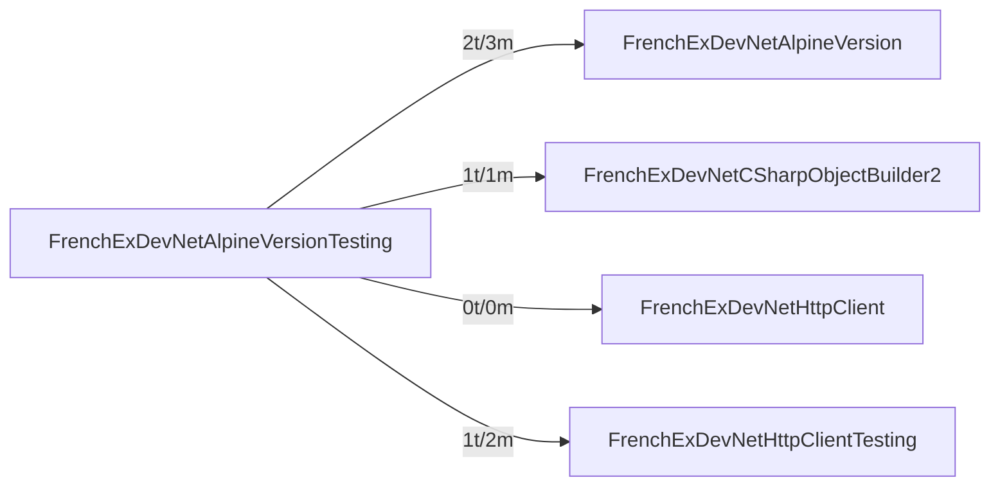


## FrenchExDev.Net.Alpine.Version.Tests

Tip: A -> B means A uses B.
| Target B | Unique Types | Member Uses |
|---|---:|---:|
| FenchExDev.Net.Testing | 1 | 2 |
| FrenchExDev.Net.Alpine.Version | 3 | 12 |
| FrenchExDev.Net.Alpine.Version.Testing | 1 | 2 |
| FrenchExDev.Net.CSharp.Object.Builder2 | 0 | 0 |
| FrenchExDev.Net.HttpClient | 0 | 1 |
| FrenchExDev.Net.HttpClient.Testing | 2 | 15 |

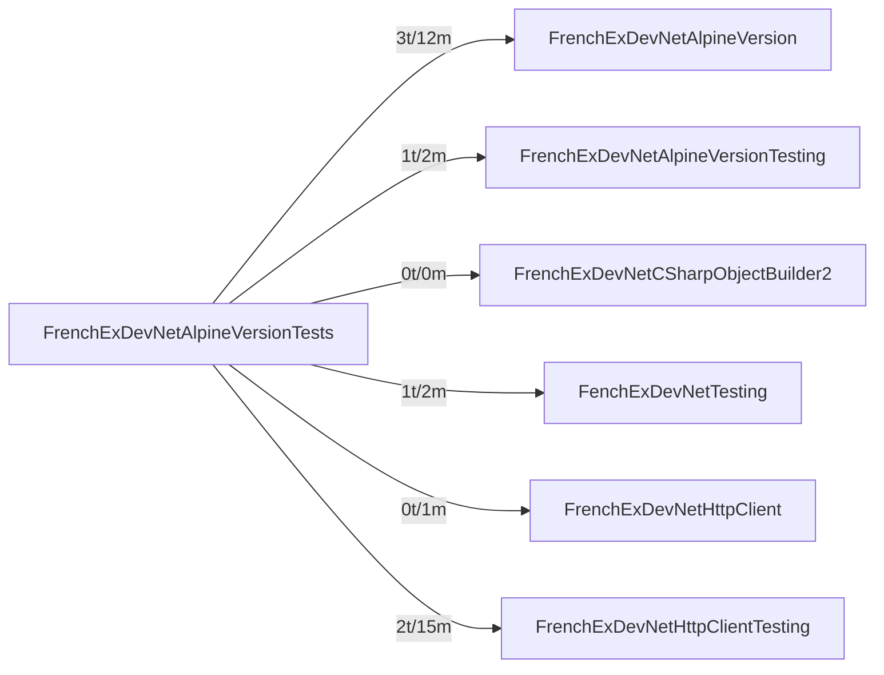


## FrenchExDev.Net.CSharp.ManagedDictionary

Tip: A -> B means A uses B.
| Target B | Unique Types | Member Uses |
|---|---:|---:|

```mermaid
graph LR
```


## FrenchExDev.Net.CSharp.ManagedDictionary.Testing

Tip: A -> B means A uses B.
| Target B | Unique Types | Member Uses |
|---|---:|---:|
| FrenchExDev.Net.CSharp.ManagedDictionary | 0 | 0 |


## FrenchExDev.Net.CSharp.ManagedDictionary.Tests

Tip: A -> B means A uses B.
| Target B | Unique Types | Member Uses |
|---|---:|---:|
| FrenchExDev.Net.CSharp.ManagedDictionary | 0 | 0 |
| FrenchExDev.Net.CSharp.ManagedDictionary.Testing | 0 | 0 |

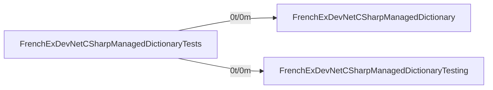


## FrenchExDev.Net.CSharp.ManagedList

Tip: A -> B means A uses B.
| Target B | Unique Types | Member Uses |
|---|---:|---:|

```mermaid
graph LR
```


## FrenchExDev.Net.CSharp.ManagedList.Testing

Tip: A -> B means A uses B.
| Target B | Unique Types | Member Uses |
|---|---:|---:|
| FrenchExDev.Net.CSharp.ManagedList | 1 | 4 |


## FrenchExDev.Net.CSharp.ManagedList.Tests

Tip: A -> B means A uses B.
| Target B | Unique Types | Member Uses |
|---|---:|---:|
| FrenchExDev.Net.CSharp.ManagedList | 3 | 16 |
| FrenchExDev.Net.CSharp.ManagedList.Testing | 1 | 6 |

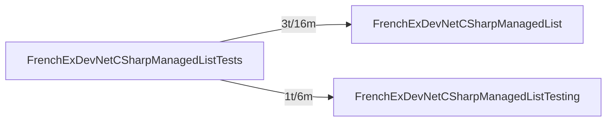


## FrenchExDev.Net.CSharp.Object.Biz

Tip: A -> B means A uses B.
| Target B | Unique Types | Member Uses |
|---|---:|---:|
| FrenchExDev.Net.CSharp.Object.Result | 2 | 5 |


## FrenchExDev.Net.CSharp.Object.Biz.Testing

Tip: A -> B means A uses B.
| Target B | Unique Types | Member Uses |
|---|---:|---:|
| FrenchExDev.Net.CSharp.Object.Biz | 0 | 0 |
| FrenchExDev.Net.CSharp.Object.Result | 0 | 0 |

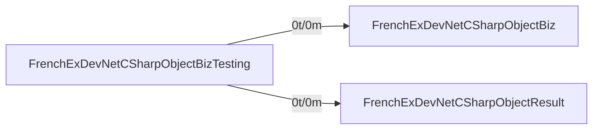


## FrenchExDev.Net.CSharp.Object.Biz.Tests

Tip: A -> B means A uses B.
| Target B | Unique Types | Member Uses |
|---|---:|---:|
| FrenchExDev.Net.CSharp.Object.Biz | 2 | 5 |
| FrenchExDev.Net.CSharp.Object.Biz.Testing | 0 | 0 |
| FrenchExDev.Net.CSharp.Object.Result | 0 | 0 |

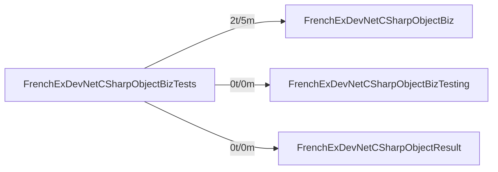


## FrenchExDev.Net.CSharp.Object.Builder2

Tip: A -> B means A uses B.
| Target B | Unique Types | Member Uses |
|---|---:|---:|

```mermaid
graph LR
```


## FrenchExDev.Net.CSharp.Object.Builder2.Testing

Tip: A -> B means A uses B.
| Target B | Unique Types | Member Uses |
|---|---:|---:|
| FrenchExDev.Net.CSharp.Object.Builder2 | 8 | 22 |

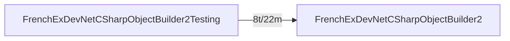


## FrenchExDev.Net.CSharp.Object.Builder2.Tests

Tip: A -> B means A uses B.
| Target B | Unique Types | Member Uses |
|---|---:|---:|
| FrenchExDev.Net.CSharp.Object.Builder2 | 16 | 245 |
| FrenchExDev.Net.CSharp.Object.Builder2.Testing | 2 | 60 |

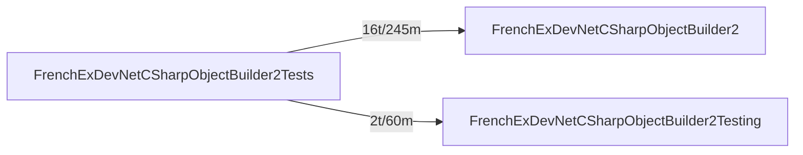


## FrenchExDev.Net.CSharp.Object.Model

Tip: A -> B means A uses B.
| Target B | Unique Types | Member Uses |
|---|---:|---:|
| FrenchExDev.Net.CSharp.Object.Builder2 | 0 | 0 |
| FrenchExDev.Net.CSharp.Object.Model.Abstractions | 0 | 0 |
| FrenchExDev.Net.CSharp.Object.Model.Infrastructure | 0 | 0 |

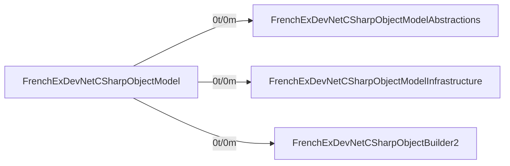


## FrenchExDev.Net.CSharp.Object.Model.Abstractions

Tip: A -> B means A uses B.
| Target B | Unique Types | Member Uses |
|---|---:|---:|
| FrenchExDev.Net.CSharp.Object.Builder2 | 41 | 139 |


## FrenchExDev.Net.CSharp.Object.Model.Infrastructure

Tip: A -> B means A uses B.
| Target B | Unique Types | Member Uses |
|---|---:|---:|
| FrenchExDev.Net.CSharp.Object.Builder2 | 3 | 3 |
| FrenchExDev.Net.CSharp.Object.Model.Abstractions | 0 | 0 |

```mermaid
graph LR
 FrenchExDevNetCSharpObjectModelInfrastructure -->|0t/0m| FrenchExDevNetCSharpObjectModelAbstractions
 FrenchExDevNetCSharpObjectModelInfrastructure -->|3t/3m| FrenchExDevNetCSharpObjectBuilder2
```


## FrenchExDev.Net.CSharp.Object.Model.Testing

Tip: A -> B means A uses B.
| Target B | Unique Types | Member Uses |
|---|---:|---:|
| FrenchExDev.Net.CSharp.Object.Builder2 | 2 | 4 |
| FrenchExDev.Net.CSharp.Object.Model | 0 | 0 |
| FrenchExDev.Net.CSharp.Object.Model.Abstractions | 0 | 0 |
| FrenchExDev.Net.CSharp.Object.Model.Infrastructure | 1 | 2 |

```mermaid
graph LR
 FrenchExDevNetCSharpObjectModelTesting -->|0t/0m| FrenchExDevNetCSharpObjectModel
 FrenchExDevNetCSharpObjectModelTesting -->|0t/0m| FrenchExDevNetCSharpObjectModelAbstractions
 FrenchExDevNetCSharpObjectModelTesting -->|1t/2m| FrenchExDevNetCSharpObjectModelInfrastructure
 FrenchExDevNetCSharpObjectModelTesting -->|2t/4m| FrenchExDevNetCSharpObjectBuilder2
```


## FrenchExDev.Net.CSharp.Object.Model.Tests

Tip: A -> B means A uses B.
| Target B | Unique Types | Member Uses |
|---|---:|---:|
| FrenchExDev.Net.CSharp.Object.Builder2 | 0 | 0 |
| FrenchExDev.Net.CSharp.Object.Model | 0 | 0 |
| FrenchExDev.Net.CSharp.Object.Model.Abstractions | 3 | 10 |
| FrenchExDev.Net.CSharp.Object.Model.Infrastructure | 0 | 0 |
| FrenchExDev.Net.CSharp.Object.Model.Testing | 1 | 2 |

```mermaid
graph LR
 FrenchExDevNetCSharpObjectModelTests -->|0t/0m| FrenchExDevNetCSharpObjectModel
 FrenchExDevNetCSharpObjectModelTests -->|3t/10m| FrenchExDevNetCSharpObjectModelAbstractions
 FrenchExDevNetCSharpObjectModelTests -->|0t/0m| FrenchExDevNetCSharpObjectModelInfrastructure
 FrenchExDevNetCSharpObjectModelTests -->|1t/2m| FrenchExDevNetCSharpObjectModelTesting
 FrenchExDevNetCSharpObjectModelTests -->|0t/0m| FrenchExDevNetCSharpObjectBuilder2
```


## FrenchExDev.Net.CSharp.Object.Result

Tip: A -> B means A uses B.
| Target B | Unique Types | Member Uses |
|---|---:|---:|

```mermaid
graph LR
```


## FrenchExDev.Net.CSharp.Object.Result.Testing

Tip: A -> B means A uses B.
| Target B | Unique Types | Member Uses |
|---|---:|---:|
| FrenchExDev.Net.CSharp.Object.Result | 0 | 0 |

```mermaid
graph LR
 FrenchExDevNetCSharpObjectResultTesting -->|0t/0m| FrenchExDevNetCSharpObjectResult
```


## FrenchExDev.Net.CSharp.Object.Result.Tests

Tip: A -> B means A uses B.
| Target B | Unique Types | Member Uses |
|---|---:|---:|
| FrenchExDev.Net.CSharp.Object.Result | 7 | 66 |
| FrenchExDev.Net.CSharp.Object.Result.Testing | 0 | 0 |

```mermaid
graph LR
 FrenchExDevNetCSharpObjectResultTests -->|7t/66m| FrenchExDevNetCSharpObjectResult
 FrenchExDevNetCSharpObjectResultTests -->|0t/0m| FrenchExDevNetCSharpObjectResultTesting
```


## FrenchExDev.Net.CSharp.ProjectDependency3

Tip: A -> B means A uses B.
| Target B | Unique Types | Member Uses |
|---|---:|---:|
| FrenchExDev.Net.CSharp.ManagedList | 1 | 1 |
| FrenchExDev.Net.CSharp.Object.Result | 2 | 4 |
| FrenchExDev.Net.CSharp.ProjectDependency3.Abstractions | 0 | 0 |

```mermaid
graph LR
 FrenchExDevNetCSharpProjectDependency3 -->|1t/1m| FrenchExDevNetCSharpManagedList
 FrenchExDevNetCSharpProjectDependency3 -->|2t/4m| FrenchExDevNetCSharpObjectResult
 FrenchExDevNetCSharpProjectDependency3 -->|0t/0m| FrenchExDevNetCSharpProjectDependency3Abstractions
```


## FrenchExDev.Net.CSharp.ProjectDependency3.Abstractions

Tip: A -> B means A uses B.
| Target B | Unique Types | Member Uses |
|---|---:|---:|

```mermaid
graph LR
```


## FrenchExDev.Net.CSharp.ProjectDependency3.AppHost

Tip: A -> B means A uses B.
| Target B | Unique Types | Member Uses |
|---|---:|---:|

```mermaid
graph LR
```


## FrenchExDev.Net.CSharp.ProjectDependency3.ServiceDefaults

Tip: A -> B means A uses B.
| Target B | Unique Types | Member Uses |
|---|---:|---:|

```mermaid
graph LR
```


## FrenchExDev.Net.CSharp.ProjectDependency3.Tests

Tip: A -> B means A uses B.
| Target B | Unique Types | Member Uses |
|---|---:|---:|
| FrenchExDev.Net.CSharp.ManagedList | 0 | 0 |
| FrenchExDev.Net.CSharp.Object.Result | 1 | 1 |
| FrenchExDev.Net.CSharp.ProjectDependency3 | 7 | 27 |
| FrenchExDev.Net.CSharp.ProjectDependency3.Abstractions | 0 | 0 |

```mermaid
graph LR
 FrenchExDevNetCSharpProjectDependency3Tests -->|0t/0m| FrenchExDevNetCSharpManagedList
 FrenchExDevNetCSharpProjectDependency3Tests -->|1t/1m| FrenchExDevNetCSharpObjectResult
 FrenchExDevNetCSharpProjectDependency3Tests -->|7t/27m| FrenchExDevNetCSharpProjectDependency3
 FrenchExDevNetCSharpProjectDependency3Tests -->|0t/0m| FrenchExDevNetCSharpProjectDependency3Abstractions
```


## FrenchExDev.Net.CSharp.ProjectDependency3.Viz

Tip: A -> B means A uses B.
| Target B | Unique Types | Member Uses |
|---|---:|---:|
| FrenchExDev.Net.CSharp.Object.Result | 2 | 19 |

```mermaid
graph LR
 FrenchExDevNetCSharpProjectDependency3Viz -->|2t/19m| FrenchExDevNetCSharpObjectResult
```


## FrenchExDev.Net.CSharp.ProjectDependency3.Viz.Api

Tip: A -> B means A uses B.
| Target B | Unique Types | Member Uses |
|---|---:|---:|
| FrenchExDev.Net.CSharp.ProjectDependency3.ServiceDefaults | 1 | 2 |

```mermaid
graph LR
 FrenchExDevNetCSharpProjectDependency3VizApi -->|1t/2m| FrenchExDevNetCSharpProjectDependency3ServiceDefaults
```


## FrenchExDev.Net.CSharp.ProjectDependency3.Worker.Agent

Tip: A -> B means A uses B.
| Target B | Unique Types | Member Uses |
|---|---:|---:|
| FrenchExDev.Net.CSharp.ManagedList | 0 | 0 |
| FrenchExDev.Net.CSharp.Object.Result | 3 | 9 |
| FrenchExDev.Net.CSharp.ProjectDependency3 | 8 | 28 |
| FrenchExDev.Net.CSharp.ProjectDependency3.Abstractions | 0 | 0 |

```mermaid
graph LR
 FrenchExDevNetCSharpProjectDependency3WorkerAgent -->|0t/0m| FrenchExDevNetCSharpManagedList
 FrenchExDevNetCSharpProjectDependency3WorkerAgent -->|3t/9m| FrenchExDevNetCSharpObjectResult
 FrenchExDevNetCSharpProjectDependency3WorkerAgent -->|8t/28m| FrenchExDevNetCSharpProjectDependency3
 FrenchExDevNetCSharpProjectDependency3WorkerAgent -->|0t/0m| FrenchExDevNetCSharpProjectDependency3Abstractions
```


## FrenchExDev.Net.CSharp.ProjectDependency3.Worker.Orchestrator

Tip: A -> B means A uses B.
| Target B | Unique Types | Member Uses |
|---|---:|---:|
| FrenchExDev.Net.CSharp.Object.Result | 2 | 27 |

```mermaid
graph LR
 FrenchExDevNetCSharpProjectDependency3WorkerOrchestrator -->|2t/27m| FrenchExDevNetCSharpObjectResult
```


## FrenchExDev.Net.CSharp.ProjectDependency4.DevAppHost

Tip: A -> B means A uses B.
| Target B | Unique Types | Member Uses |
|---|---:|---:|

```mermaid
graph LR
```


## FrenchExDev.Net.CSharp.ProjectDependency4.Viz

Tip: A -> B means A uses B.
| Target B | Unique Types | Member Uses |
|---|---:|---:|

```mermaid
graph LR
```


## FrenchExDev.Net.CSharp.ProjectDependency4.Viz.Api

Tip: A -> B means A uses B.
| Target B | Unique Types | Member Uses |
|---|---:|---:|

```mermaid
graph LR
```


## FrenchExDev.Net.CSharp.SolutionEngineering

Tip: A -> B means A uses B.
| Target B | Unique Types | Member Uses |
|---|---:|---:|
| FrenchExDev.Net.CSharp.ManagedList | 0 | 0 |

```mermaid
graph LR
 FrenchExDevNetCSharpSolutionEngineering -->|0t/0m| FrenchExDevNetCSharpManagedList
```


## FrenchExDev.Net.CSharp.SolutionEngineering.Testing

Tip: A -> B means A uses B.
| Target B | Unique Types | Member Uses |
|---|---:|---:|
| FrenchExDev.Net.CSharp.ManagedList | 0 | 0 |
| FrenchExDev.Net.CSharp.SolutionEngineering | 0 | 0 |

```mermaid
graph LR
 FrenchExDevNetCSharpSolutionEngineeringTesting -->|0t/0m| FrenchExDevNetCSharpManagedList
 FrenchExDevNetCSharpSolutionEngineeringTesting -->|0t/0m| FrenchExDevNetCSharpSolutionEngineering
```


## FrenchExDev.Net.CSharp.SolutionEngineering.Tests

Tip: A -> B means A uses B.
| Target B | Unique Types | Member Uses |
|---|---:|---:|
| FrenchExDev.Net.CSharp.ManagedList | 0 | 0 |
| FrenchExDev.Net.CSharp.SolutionEngineering | 0 | 0 |
| FrenchExDev.Net.CSharp.SolutionEngineering.Testing | 0 | 0 |

```mermaid
graph LR
 FrenchExDevNetCSharpSolutionEngineeringTests -->|0t/0m| FrenchExDevNetCSharpManagedList
 FrenchExDevNetCSharpSolutionEngineeringTests -->|0t/0m| FrenchExDevNetCSharpSolutionEngineering
 FrenchExDevNetCSharpSolutionEngineeringTests -->|0t/0m| FrenchExDevNetCSharpSolutionEngineeringTesting
```


## FrenchExDev.Net.Dotnet.Project

Tip: A -> B means A uses B.
| Target B | Unique Types | Member Uses |
|---|---:|---:|
| FrenchExDev.Net.CSharp.Object.Builder2 | 0 | 0 |
| FrenchExDev.Net.CSharp.Object.Model.Abstractions | 0 | 0 |
| FrenchExDev.Net.Dotnet.Project.Abstractions | 0 | 0 |
| FrenchExDev.Net.Dotnet.Project.Infrastructure | 0 | 0 |

```mermaid
graph LR
 FrenchExDevNetDotnetProject -->|0t/0m| FrenchExDevNetDotnetProjectAbstractions
 FrenchExDevNetDotnetProject -->|0t/0m| FrenchExDevNetDotnetProjectInfrastructure
 FrenchExDevNetDotnetProject -->|0t/0m| FrenchExDevNetCSharpObjectModelAbstractions
 FrenchExDevNetDotnetProject -->|0t/0m| FrenchExDevNetCSharpObjectBuilder2
```


## FrenchExDev.Net.Dotnet.Project.Abstractions

Tip: A -> B means A uses B.
| Target B | Unique Types | Member Uses |
|---|---:|---:|
| FrenchExDev.Net.CSharp.Object.Builder2 | 10 | 30 |
| FrenchExDev.Net.CSharp.Object.Model.Abstractions | 0 | 0 |

```mermaid
graph LR
 FrenchExDevNetDotnetProjectAbstractions -->|0t/0m| FrenchExDevNetCSharpObjectModelAbstractions
 FrenchExDevNetDotnetProjectAbstractions -->|10t/30m| FrenchExDevNetCSharpObjectBuilder2
```


## FrenchExDev.Net.Dotnet.Project.Infrastructure

Tip: A -> B means A uses B.
| Target B | Unique Types | Member Uses |
|---|---:|---:|
| FrenchExDev.Net.CSharp.Object.Builder2 | 0 | 0 |
| FrenchExDev.Net.CSharp.Object.Model.Abstractions | 0 | 0 |
| FrenchExDev.Net.Dotnet.Project.Abstractions | 0 | 0 |

```mermaid
graph LR
 FrenchExDevNetDotnetProjectInfrastructure -->|0t/0m| FrenchExDevNetDotnetProjectAbstractions
 FrenchExDevNetDotnetProjectInfrastructure -->|0t/0m| FrenchExDevNetCSharpObjectModelAbstractions
 FrenchExDevNetDotnetProjectInfrastructure -->|0t/0m| FrenchExDevNetCSharpObjectBuilder2
```


## FrenchExDev.Net.Dotnet.Project.Testing

Tip: A -> B means A uses B.
| Target B | Unique Types | Member Uses |
|---|---:|---:|
| FrenchExDev.Net.CSharp.Object.Builder2 | 0 | 0 |
| FrenchExDev.Net.CSharp.Object.Model.Abstractions | 0 | 0 |
| FrenchExDev.Net.Dotnet.Project | 0 | 0 |
| FrenchExDev.Net.Dotnet.Project.Abstractions | 0 | 0 |
| FrenchExDev.Net.Dotnet.Project.Infrastructure | 0 | 0 |

```mermaid
graph LR
 FrenchExDevNetDotnetProjectTesting -->|0t/0m| FrenchExDevNetDotnetProject
 FrenchExDevNetDotnetProjectTesting -->|0t/0m| FrenchExDevNetDotnetProjectAbstractions
 FrenchExDevNetDotnetProjectTesting -->|0t/0m| FrenchExDevNetDotnetProjectInfrastructure
 FrenchExDevNetDotnetProjectTesting -->|0t/0m| FrenchExDevNetCSharpObjectModelAbstractions
 FrenchExDevNetDotnetProjectTesting -->|0t/0m| FrenchExDevNetCSharpObjectBuilder2
```


## FrenchExDev.Net.Dotnet.Project.Tests

Tip: A -> B means A uses B.
| Target B | Unique Types | Member Uses |
|---|---:|---:|
| FrenchExDev.Net.CSharp.Object.Builder2 | 2 | 2 |
| FrenchExDev.Net.CSharp.Object.Model.Abstractions | 4 | 12 |
| FrenchExDev.Net.CSharp.Object.Model.Infrastructure | 1 | 2 |
| FrenchExDev.Net.Dotnet.Project | 0 | 0 |
| FrenchExDev.Net.Dotnet.Project.Abstractions | 0 | 0 |
| FrenchExDev.Net.Dotnet.Project.Infrastructure | 0 | 0 |

```mermaid
graph LR
 FrenchExDevNetDotnetProjectTests -->|0t/0m| FrenchExDevNetDotnetProject
 FrenchExDevNetDotnetProjectTests -->|0t/0m| FrenchExDevNetDotnetProjectAbstractions
 FrenchExDevNetDotnetProjectTests -->|0t/0m| FrenchExDevNetDotnetProjectInfrastructure
 FrenchExDevNetDotnetProjectTests -->|4t/12m| FrenchExDevNetCSharpObjectModelAbstractions
 FrenchExDevNetDotnetProjectTests -->|1t/2m| FrenchExDevNetCSharpObjectModelInfrastructure
 FrenchExDevNetDotnetProjectTests -->|2t/2m| FrenchExDevNetCSharpObjectBuilder2
```


## FrenchExDev.Net.Dotnet.Project.Types.ClassProjectType

Tip: A -> B means A uses B.
| Target B | Unique Types | Member Uses |
|---|---:|---:|
| FrenchExDev.Net.CSharp.Object.Builder2 | 2 | 2 |
| FrenchExDev.Net.CSharp.Object.Model.Abstractions | 0 | 0 |
| FrenchExDev.Net.Dotnet.Project.Abstractions | 1 | 23 |
| FrenchExDev.Net.Dotnet.Project.Types.ClassProjectType.Abstractions | 0 | 1 |
| FrenchExDev.Net.Dotnet.Project.Types.ClassProjectType.Infrastructure | 0 | 0 |

```mermaid
graph LR
 FrenchExDevNetDotnetProjectTypesClassProjectType -->|1t/23m| FrenchExDevNetDotnetProjectAbstractions
 FrenchExDevNetDotnetProjectTypesClassProjectType -->|0t/0m| FrenchExDevNetCSharpObjectModelAbstractions
 FrenchExDevNetDotnetProjectTypesClassProjectType -->|0t/1m| FrenchExDevNetDotnetProjectTypesClassProjectTypeAbstractions
 FrenchExDevNetDotnetProjectTypesClassProjectType -->|0t/0m| FrenchExDevNetDotnetProjectTypesClassProjectTypeInfrastructure
 FrenchExDevNetDotnetProjectTypesClassProjectType -->|2t/2m| FrenchExDevNetCSharpObjectBuilder2
```


## FrenchExDev.Net.Dotnet.Project.Types.ClassProjectType.Abstractions

Tip: A -> B means A uses B.
| Target B | Unique Types | Member Uses |
|---|---:|---:|
| FrenchExDev.Net.CSharp.Object.Builder2 | 4 | 16 |
| FrenchExDev.Net.CSharp.Object.Model.Abstractions | 0 | 0 |
| FrenchExDev.Net.Dotnet.Project.Abstractions | 0 | 0 |

```mermaid
graph LR
 FrenchExDevNetDotnetProjectTypesClassProjectTypeAbstractions -->|0t/0m| FrenchExDevNetDotnetProjectAbstractions
 FrenchExDevNetDotnetProjectTypesClassProjectTypeAbstractions -->|0t/0m| FrenchExDevNetCSharpObjectModelAbstractions
 FrenchExDevNetDotnetProjectTypesClassProjectTypeAbstractions -->|4t/16m| FrenchExDevNetCSharpObjectBuilder2
```


## FrenchExDev.Net.Dotnet.Project.Types.ClassProjectType.Infrastructure

Tip: A -> B means A uses B.
| Target B | Unique Types | Member Uses |
|---|---:|---:|
| FrenchExDev.Net.CSharp.Object.Builder2 | 0 | 0 |
| FrenchExDev.Net.CSharp.Object.Model.Abstractions | 0 | 0 |
| FrenchExDev.Net.Dotnet.Project.Abstractions | 0 | 0 |
| FrenchExDev.Net.Dotnet.Project.Types.ClassProjectType.Abstractions | 0 | 0 |

```mermaid
graph LR
 FrenchExDevNetDotnetProjectTypesClassProjectTypeInfrastructure -->|0t/0m| FrenchExDevNetDotnetProjectAbstractions
 FrenchExDevNetDotnetProjectTypesClassProjectTypeInfrastructure -->|0t/0m| FrenchExDevNetCSharpObjectModelAbstractions
 FrenchExDevNetDotnetProjectTypesClassProjectTypeInfrastructure -->|0t/0m| FrenchExDevNetDotnetProjectTypesClassProjectTypeAbstractions
 FrenchExDevNetDotnetProjectTypesClassProjectTypeInfrastructure -->|0t/0m| FrenchExDevNetCSharpObjectBuilder2
```


## FrenchExDev.Net.Dotnet.Project.Types.ClassProjectType.Testing

Tip: A -> B means A uses B.
| Target B | Unique Types | Member Uses |
|---|---:|---:|
| FrenchExDev.Net.CSharp.Object.Builder2 | 2 | 4 |
| FrenchExDev.Net.CSharp.Object.Model.Abstractions | 0 | 0 |
| FrenchExDev.Net.Dotnet.Project.Abstractions | 0 | 0 |
| FrenchExDev.Net.Dotnet.Project.Types.ClassProjectType | 0 | 0 |
| FrenchExDev.Net.Dotnet.Project.Types.ClassProjectType.Abstractions | 0 | 2 |
| FrenchExDev.Net.Dotnet.Project.Types.ClassProjectType.Infrastructure | 0 | 0 |

```mermaid
graph LR
 FrenchExDevNetDotnetProjectTypesClassProjectTypeTesting -->|0t/0m| FrenchExDevNetDotnetProjectAbstractions
 FrenchExDevNetDotnetProjectTypesClassProjectTypeTesting -->|0t/0m| FrenchExDevNetCSharpObjectModelAbstractions
 FrenchExDevNetDotnetProjectTypesClassProjectTypeTesting -->|0t/0m| FrenchExDevNetDotnetProjectTypesClassProjectType
 FrenchExDevNetDotnetProjectTypesClassProjectTypeTesting -->|0t/2m| FrenchExDevNetDotnetProjectTypesClassProjectTypeAbstractions
 FrenchExDevNetDotnetProjectTypesClassProjectTypeTesting -->|0t/0m| FrenchExDevNetDotnetProjectTypesClassProjectTypeInfrastructure
 FrenchExDevNetDotnetProjectTypesClassProjectTypeTesting -->|2t/4m| FrenchExDevNetCSharpObjectBuilder2
```


## FrenchExDev.Net.Dotnet.Project.Types.ClassProjectType.Tests

Tip: A -> B means A uses B.
| Target B | Unique Types | Member Uses |
|---|---:|---:|
| FrenchExDev.Net.CSharp.Object.Builder2 | 0 | 0 |
| FrenchExDev.Net.CSharp.Object.Model.Abstractions | 0 | 0 |
| FrenchExDev.Net.Dotnet.Project.Abstractions | 1 | 12 |
| FrenchExDev.Net.Dotnet.Project.Types.ClassProjectType | 1 | 1 |
| FrenchExDev.Net.Dotnet.Project.Types.ClassProjectType.Abstractions | 0 | 0 |
| FrenchExDev.Net.Dotnet.Project.Types.ClassProjectType.Infrastructure | 0 | 0 |
| FrenchExDev.Net.Dotnet.Project.Types.ClassProjectType.Testing | 1 | 2 |

```mermaid
graph LR
 FrenchExDevNetDotnetProjectTypesClassProjectTypeTests -->|1t/12m| FrenchExDevNetDotnetProjectAbstractions
 FrenchExDevNetDotnetProjectTypesClassProjectTypeTests -->|0t/0m| FrenchExDevNetCSharpObjectModelAbstractions
 FrenchExDevNetDotnetProjectTypesClassProjectTypeTests -->|1t/1m| FrenchExDevNetDotnetProjectTypesClassProjectType
 FrenchExDevNetDotnetProjectTypesClassProjectTypeTests -->|0t/0m| FrenchExDevNetDotnetProjectTypesClassProjectTypeAbstractions
 FrenchExDevNetDotnetProjectTypesClassProjectTypeTests -->|0t/0m| FrenchExDevNetDotnetProjectTypesClassProjectTypeInfrastructure
 FrenchExDevNetDotnetProjectTypesClassProjectTypeTests -->|1t/2m| FrenchExDevNetDotnetProjectTypesClassProjectTypeTesting
 FrenchExDevNetDotnetProjectTypesClassProjectTypeTests -->|0t/0m| FrenchExDevNetCSharpObjectBuilder2
```


## FrenchExDev.Net.Dotnet.Project.Types.CliProjectType

Tip: A -> B means A uses B.
| Target B | Unique Types | Member Uses |
|---|---:|---:|
| FrenchExDev.Net.CSharp.Object.Builder2 | 3 | 3 |
| FrenchExDev.Net.CSharp.Object.Model.Abstractions | 0 | 0 |
| FrenchExDev.Net.Dotnet.Project.Abstractions | 2 | 17 |
| FrenchExDev.Net.Dotnet.Project.Types.CliProjectType.Abstractions | 0 | 2 |
| FrenchExDev.Net.Dotnet.Project.Types.CliProjectType.Infrastructure | 0 | 0 |

```mermaid
graph LR
 FrenchExDevNetDotnetProjectTypesCliProjectType -->|2t/17m| FrenchExDevNetDotnetProjectAbstractions
 FrenchExDevNetDotnetProjectTypesCliProjectType -->|0t/0m| FrenchExDevNetCSharpObjectModelAbstractions
 FrenchExDevNetDotnetProjectTypesCliProjectType -->|0t/2m| FrenchExDevNetDotnetProjectTypesCliProjectTypeAbstractions
 FrenchExDevNetDotnetProjectTypesCliProjectType -->|0t/0m| FrenchExDevNetDotnetProjectTypesCliProjectTypeInfrastructure
 FrenchExDevNetDotnetProjectTypesCliProjectType -->|3t/3m| FrenchExDevNetCSharpObjectBuilder2
```


## FrenchExDev.Net.Dotnet.Project.Types.CliProjectType.Abstractions

Tip: A -> B means A uses B.
| Target B | Unique Types | Member Uses |
|---|---:|---:|
| FrenchExDev.Net.CSharp.Object.Builder2 | 3 | 4 |
| FrenchExDev.Net.CSharp.Object.Model.Abstractions | 0 | 0 |
| FrenchExDev.Net.Dotnet.Project.Abstractions | 1 | 1 |

```mermaid
graph LR
 FrenchExDevNetDotnetProjectTypesCliProjectTypeAbstractions -->|1t/1m| FrenchExDevNetDotnetProjectAbstractions
 FrenchExDevNetDotnetProjectTypesCliProjectTypeAbstractions -->|0t/0m| FrenchExDevNetCSharpObjectModelAbstractions
 FrenchExDevNetDotnetProjectTypesCliProjectTypeAbstractions -->|3t/4m| FrenchExDevNetCSharpObjectBuilder2
```


## FrenchExDev.Net.Dotnet.Project.Types.CliProjectType.Infrastructure

Tip: A -> B means A uses B.
| Target B | Unique Types | Member Uses |
|---|---:|---:|
| FrenchExDev.Net.CSharp.Object.Builder2 | 0 | 0 |
| FrenchExDev.Net.CSharp.Object.Model.Abstractions | 0 | 0 |
| FrenchExDev.Net.Dotnet.Project.Abstractions | 0 | 0 |
| FrenchExDev.Net.Dotnet.Project.Types.CliProjectType.Abstractions | 0 | 0 |

```mermaid
graph LR
 FrenchExDevNetDotnetProjectTypesCliProjectTypeInfrastructure -->|0t/0m| FrenchExDevNetDotnetProjectAbstractions
 FrenchExDevNetDotnetProjectTypesCliProjectTypeInfrastructure -->|0t/0m| FrenchExDevNetCSharpObjectModelAbstractions
 FrenchExDevNetDotnetProjectTypesCliProjectTypeInfrastructure -->|0t/0m| FrenchExDevNetDotnetProjectTypesCliProjectTypeAbstractions
 FrenchExDevNetDotnetProjectTypesCliProjectTypeInfrastructure -->|0t/0m| FrenchExDevNetCSharpObjectBuilder2
```


## FrenchExDev.Net.Dotnet.Project.Types.CliProjectType.Testing

Tip: A -> B means A uses B.
| Target B | Unique Types | Member Uses |
|---|---:|---:|
| FrenchExDev.Net.CSharp.Object.Builder2 | 0 | 0 |
| FrenchExDev.Net.CSharp.Object.Model.Abstractions | 0 | 0 |
| FrenchExDev.Net.Dotnet.Project.Abstractions | 0 | 0 |
| FrenchExDev.Net.Dotnet.Project.Types.CliProjectType | 0 | 0 |
| FrenchExDev.Net.Dotnet.Project.Types.CliProjectType.Abstractions | 0 | 0 |
| FrenchExDev.Net.Dotnet.Project.Types.CliProjectType.Infrastructure | 0 | 0 |

```mermaid
graph LR
 FrenchExDevNetDotnetProjectTypesCliProjectTypeTesting -->|0t/0m| FrenchExDevNetDotnetProjectAbstractions
 FrenchExDevNetDotnetProjectTypesCliProjectTypeTesting -->|0t/0m| FrenchExDevNetCSharpObjectModelAbstractions
 FrenchExDevNetDotnetProjectTypesCliProjectTypeTesting -->|0t/0m| FrenchExDevNetDotnetProjectTypesCliProjectType
 FrenchExDevNetDotnetProjectTypesCliProjectTypeTesting -->|0t/0m| FrenchExDevNetDotnetProjectTypesCliProjectTypeAbstractions
 FrenchExDevNetDotnetProjectTypesCliProjectTypeTesting -->|0t/0m| FrenchExDevNetDotnetProjectTypesCliProjectTypeInfrastructure
 FrenchExDevNetDotnetProjectTypesCliProjectTypeTesting -->|0t/0m| FrenchExDevNetCSharpObjectBuilder2
```


## FrenchExDev.Net.Dotnet.Project.Types.CliProjectType.Tests

Tip: A -> B means A uses B.
| Target B | Unique Types | Member Uses |
|---|---:|---:|

```mermaid
graph LR
```


## FrenchExDev.Net.Dotnet.Project.Types.DesktopProjectType

Tip: A -> B means A uses B.
| Target B | Unique Types | Member Uses |
|---|---:|---:|
| FrenchExDev.Net.CSharp.Object.Builder2 | 1 | 1 |
| FrenchExDev.Net.CSharp.Object.Model.Abstractions | 0 | 0 |
| FrenchExDev.Net.Dotnet.Project.Abstractions | 1 | 15 |
| FrenchExDev.Net.Dotnet.Project.Types.DesktopProjectType.Abstractions | 0 | 2 |
| FrenchExDev.Net.Dotnet.Project.Types.DesktopProjectType.Infrastructure | 0 | 0 |

```mermaid
graph LR
 FrenchExDevNetDotnetProjectTypesDesktopProjectType -->|1t/15m| FrenchExDevNetDotnetProjectAbstractions
 FrenchExDevNetDotnetProjectTypesDesktopProjectType -->|0t/0m| FrenchExDevNetCSharpObjectModelAbstractions
 FrenchExDevNetDotnetProjectTypesDesktopProjectType -->|0t/2m| FrenchExDevNetDotnetProjectTypesDesktopProjectTypeAbstractions
 FrenchExDevNetDotnetProjectTypesDesktopProjectType -->|0t/0m| FrenchExDevNetDotnetProjectTypesDesktopProjectTypeInfrastructure
 FrenchExDevNetDotnetProjectTypesDesktopProjectType -->|1t/1m| FrenchExDevNetCSharpObjectBuilder2
```


## FrenchExDev.Net.Dotnet.Project.Types.DesktopProjectType.Abstractions

Tip: A -> B means A uses B.
| Target B | Unique Types | Member Uses |
|---|---:|---:|
| FrenchExDev.Net.CSharp.Object.Builder2 | 3 | 4 |
| FrenchExDev.Net.CSharp.Object.Model.Abstractions | 0 | 0 |
| FrenchExDev.Net.Dotnet.Project.Abstractions | 1 | 1 |

```mermaid
graph LR
 FrenchExDevNetDotnetProjectTypesDesktopProjectTypeAbstractions -->|1t/1m| FrenchExDevNetDotnetProjectAbstractions
 FrenchExDevNetDotnetProjectTypesDesktopProjectTypeAbstractions -->|0t/0m| FrenchExDevNetCSharpObjectModelAbstractions
 FrenchExDevNetDotnetProjectTypesDesktopProjectTypeAbstractions -->|3t/4m| FrenchExDevNetCSharpObjectBuilder2
```


## FrenchExDev.Net.Dotnet.Project.Types.DesktopProjectType.Infrastructure

Tip: A -> B means A uses B.
| Target B | Unique Types | Member Uses |
|---|---:|---:|

```mermaid
graph LR
```


## FrenchExDev.Net.Dotnet.Project.Types.DesktopProjectType.Testing

Tip: A -> B means A uses B.
| Target B | Unique Types | Member Uses |
|---|---:|---:|

```mermaid
graph LR
```


## FrenchExDev.Net.Dotnet.Project.Types.DesktopProjectType.Tests

Tip: A -> B means A uses B.
| Target B | Unique Types | Member Uses |
|---|---:|---:|

```mermaid
graph LR
```


## FrenchExDev.Net.Dotnet.Project.Types.LibraryProject

Tip: A -> B means A uses B.
| Target B | Unique Types | Member Uses |
|---|---:|---:|
| FrenchExDev.Net.CSharp.Object.Builder2 | 0 | 0 |
| FrenchExDev.Net.CSharp.Object.Model.Abstractions | 0 | 0 |
| FrenchExDev.Net.Dotnet.Project.Abstractions | 0 | 0 |
| FrenchExDev.Net.Dotnet.Project.Types.LibraryProject.Abstractions | 0 | 0 |
| FrenchExDev.Net.Dotnet.Project.Types.LibraryProject.Infrastructure | 0 | 0 |

```mermaid
graph LR
 FrenchExDevNetDotnetProjectTypesLibraryProject -->|0t/0m| FrenchExDevNetDotnetProjectAbstractions
 FrenchExDevNetDotnetProjectTypesLibraryProject -->|0t/0m| FrenchExDevNetCSharpObjectModelAbstractions
 FrenchExDevNetDotnetProjectTypesLibraryProject -->|0t/0m| FrenchExDevNetDotnetProjectTypesLibraryProjectAbstractions
 FrenchExDevNetDotnetProjectTypesLibraryProject -->|0t/0m| FrenchExDevNetDotnetProjectTypesLibraryProjectInfrastructure
 FrenchExDevNetDotnetProjectTypesLibraryProject -->|0t/0m| FrenchExDevNetCSharpObjectBuilder2
```


## FrenchExDev.Net.Dotnet.Project.Types.LibraryProject.Abstractions

Tip: A -> B means A uses B.
| Target B | Unique Types | Member Uses |
|---|---:|---:|
| FrenchExDev.Net.CSharp.Object.Builder2 | 3 | 4 |
| FrenchExDev.Net.CSharp.Object.Model.Abstractions | 0 | 0 |
| FrenchExDev.Net.Dotnet.Project.Abstractions | 1 | 1 |

```mermaid
graph LR
 FrenchExDevNetDotnetProjectTypesLibraryProjectAbstractions -->|1t/1m| FrenchExDevNetDotnetProjectAbstractions
 FrenchExDevNetDotnetProjectTypesLibraryProjectAbstractions -->|0t/0m| FrenchExDevNetCSharpObjectModelAbstractions
 FrenchExDevNetDotnetProjectTypesLibraryProjectAbstractions -->|3t/4m| FrenchExDevNetCSharpObjectBuilder2
```


## FrenchExDev.Net.Dotnet.Project.Types.LibraryProject.Infrastructure

Tip: A -> B means A uses B.
| Target B | Unique Types | Member Uses |
|---|---:|---:|
| FrenchExDev.Net.CSharp.Object.Builder2 | 0 | 0 |
| FrenchExDev.Net.CSharp.Object.Model.Abstractions | 0 | 0 |
| FrenchExDev.Net.Dotnet.Project.Abstractions | 0 | 0 |
| FrenchExDev.Net.Dotnet.Project.Types.LibraryProject.Abstractions | 0 | 0 |

```mermaid
graph LR
 FrenchExDevNetDotnetProjectTypesLibraryProjectInfrastructure -->|0t/0m| FrenchExDevNetDotnetProjectAbstractions
 FrenchExDevNetDotnetProjectTypesLibraryProjectInfrastructure -->|0t/0m| FrenchExDevNetCSharpObjectModelAbstractions
 FrenchExDevNetDotnetProjectTypesLibraryProjectInfrastructure -->|0t/0m| FrenchExDevNetDotnetProjectTypesLibraryProjectAbstractions
 FrenchExDevNetDotnetProjectTypesLibraryProjectInfrastructure -->|0t/0m| FrenchExDevNetCSharpObjectBuilder2
```


## FrenchExDev.Net.Dotnet.Project.Types.LibraryProject.Testing

Tip: A -> B means A uses B.
| Target B | Unique Types | Member Uses |
|---|---:|---:|
| FrenchExDev.Net.CSharp.Object.Builder2 | 0 | 0 |
| FrenchExDev.Net.CSharp.Object.Model.Abstractions | 0 | 0 |
| FrenchExDev.Net.Dotnet.Project.Abstractions | 0 | 0 |
| FrenchExDev.Net.Dotnet.Project.Types.LibraryProject | 0 | 0 |
| FrenchExDev.Net.Dotnet.Project.Types.LibraryProject.Abstractions | 0 | 0 |
| FrenchExDev.Net.Dotnet.Project.Types.LibraryProject.Infrastructure | 0 | 0 |

```mermaid
graph LR
 FrenchExDevNetDotnetProjectTypesLibraryProjectTesting -->|0t/0m| FrenchExDevNetDotnetProjectAbstractions
 FrenchExDevNetDotnetProjectTypesLibraryProjectTesting -->|0t/0m| FrenchExDevNetCSharpObjectModelAbstractions
 FrenchExDevNetDotnetProjectTypesLibraryProjectTesting -->|0t/0m| FrenchExDevNetDotnetProjectTypesLibraryProject
 FrenchExDevNetDotnetProjectTypesLibraryProjectTesting -->|0t/0m| FrenchExDevNetDotnetProjectTypesLibraryProjectAbstractions
 FrenchExDevNetDotnetProjectTypesLibraryProjectTesting -->|0t/0m| FrenchExDevNetDotnetProjectTypesLibraryProjectInfrastructure
 FrenchExDevNetDotnetProjectTypesLibraryProjectTesting -->|0t/0m| FrenchExDevNetCSharpObjectBuilder2
```


## FrenchExDev.Net.Dotnet.Project.Types.LibraryProject.Tests

Tip: A -> B means A uses B.
| Target B | Unique Types | Member Uses |
|---|---:|---:|

```mermaid
graph LR
```


## FrenchExDev.Net.Dotnet.Project.Types.WebApiProjectType

Tip: A -> B means A uses B.
| Target B | Unique Types | Member Uses |
|---|---:|---:|
| FrenchExDev.Net.Dotnet.Project.Types.WebApiProjectType.Abstractions | 0 | 0 |
| FrenchExDev.Net.Dotnet.Project.Types.WebApiProjectType.Infrastructure | 0 | 0 |

```mermaid
graph LR
 FrenchExDevNetDotnetProjectTypesWebApiProjectType -->|0t/0m| FrenchExDevNetDotnetProjectTypesWebApiProjectTypeAbstractions
 FrenchExDevNetDotnetProjectTypesWebApiProjectType -->|0t/0m| FrenchExDevNetDotnetProjectTypesWebApiProjectTypeInfrastructure
```


## FrenchExDev.Net.Dotnet.Project.Types.WebApiProjectType.Abstractions

Tip: A -> B means A uses B.
| Target B | Unique Types | Member Uses |
|---|---:|---:|

```mermaid
graph LR
```


## FrenchExDev.Net.Dotnet.Project.Types.WebApiProjectType.Infrastructure

Tip: A -> B means A uses B.
| Target B | Unique Types | Member Uses |
|---|---:|---:|
| FrenchExDev.Net.Dotnet.Project.Types.WebApiProjectType.Abstractions | 0 | 0 |

```mermaid
graph LR
 FrenchExDevNetDotnetProjectTypesWebApiProjectTypeInfrastructure -->|0t/0m| FrenchExDevNetDotnetProjectTypesWebApiProjectTypeAbstractions
```


## FrenchExDev.Net.Dotnet.Project.Types.WebApiProjectType.Testing

Tip: A -> B means A uses B.
| Target B | Unique Types | Member Uses |
|---|---:|---:|
| FrenchExDev.Net.Dotnet.Project.Types.WebApiProjectType | 0 | 0 |
| FrenchExDev.Net.Dotnet.Project.Types.WebApiProjectType.Abstractions | 0 | 0 |
| FrenchExDev.Net.Dotnet.Project.Types.WebApiProjectType.Infrastructure | 0 | 0 |

```mermaid
graph LR
 FrenchExDevNetDotnetProjectTypesWebApiProjectTypeTesting -->|0t/0m| FrenchExDevNetDotnetProjectTypesWebApiProjectType
 FrenchExDevNetDotnetProjectTypesWebApiProjectTypeTesting -->|0t/0m| FrenchExDevNetDotnetProjectTypesWebApiProjectTypeAbstractions
 FrenchExDevNetDotnetProjectTypesWebApiProjectTypeTesting -->|0t/0m| FrenchExDevNetDotnetProjectTypesWebApiProjectTypeInfrastructure
```


## FrenchExDev.Net.Dotnet.Project.Types.WebApiProjectType.Tests

Tip: A -> B means A uses B.
| Target B | Unique Types | Member Uses |
|---|---:|---:|

```mermaid
graph LR
```


## FrenchExDev.Net.Dotnet.Project.Types.WebWorkerProjectType

Tip: A -> B means A uses B.
| Target B | Unique Types | Member Uses |
|---|---:|---:|
| FrenchExDev.Net.Dotnet.Project.Types.WebWorkerProjectType.Abstractions | 0 | 0 |
| FrenchExDev.Net.Dotnet.Project.Types.WebWorkerProjectType.Infrastructure | 0 | 0 |

```mermaid
graph LR
 FrenchExDevNetDotnetProjectTypesWebWorkerProjectType -->|0t/0m| FrenchExDevNetDotnetProjectTypesWebWorkerProjectTypeAbstractions
 FrenchExDevNetDotnetProjectTypesWebWorkerProjectType -->|0t/0m| FrenchExDevNetDotnetProjectTypesWebWorkerProjectTypeInfrastructure
```


## FrenchExDev.Net.Dotnet.Project.Types.WebWorkerProjectType.Abstractions

Tip: A -> B means A uses B.
| Target B | Unique Types | Member Uses |
|---|---:|---:|

```mermaid
graph LR
```


## FrenchExDev.Net.Dotnet.Project.Types.WebWorkerProjectType.Infrastructure

Tip: A -> B means A uses B.
| Target B | Unique Types | Member Uses |
|---|---:|---:|
| FrenchExDev.Net.Dotnet.Project.Types.WebWorkerProjectType.Abstractions | 0 | 0 |

```mermaid
graph LR
 FrenchExDevNetDotnetProjectTypesWebWorkerProjectTypeInfrastructure -->|0t/0m| FrenchExDevNetDotnetProjectTypesWebWorkerProjectTypeAbstractions
```


## FrenchExDev.Net.Dotnet.Project.Types.WebWorkerProjectType.Testing

Tip: A -> B means A uses B.
| Target B | Unique Types | Member Uses |
|---|---:|---:|
| FrenchExDev.Net.Dotnet.Project.Types.WebWorkerProjectType | 0 | 0 |
| FrenchExDev.Net.Dotnet.Project.Types.WebWorkerProjectType.Abstractions | 0 | 0 |
| FrenchExDev.Net.Dotnet.Project.Types.WebWorkerProjectType.Infrastructure | 0 | 0 |

```mermaid
graph LR
 FrenchExDevNetDotnetProjectTypesWebWorkerProjectTypeTesting -->|0t/0m| FrenchExDevNetDotnetProjectTypesWebWorkerProjectType
 FrenchExDevNetDotnetProjectTypesWebWorkerProjectTypeTesting -->|0t/0m| FrenchExDevNetDotnetProjectTypesWebWorkerProjectTypeAbstractions
 FrenchExDevNetDotnetProjectTypesWebWorkerProjectTypeTesting -->|0t/0m| FrenchExDevNetDotnetProjectTypesWebWorkerProjectTypeInfrastructure
```


## FrenchExDev.Net.Dotnet.Project.Types.WebWorkerProjectType.Tests

Tip: A -> B means A uses B.
| Target B | Unique Types | Member Uses |
|---|---:|---:|
| FrenchExDev.Net.Dotnet.Project.Types.WebWorkerProjectType | 0 | 0 |
| FrenchExDev.Net.Dotnet.Project.Types.WebWorkerProjectType.Abstractions | 0 | 0 |
| FrenchExDev.Net.Dotnet.Project.Types.WebWorkerProjectType.Infrastructure | 0 | 0 |
| FrenchExDev.Net.Dotnet.Project.Types.WebWorkerProjectType.Testing | 0 | 0 |

```mermaid
graph LR
 FrenchExDevNetDotnetProjectTypesWebWorkerProjectTypeTests -->|0t/0m| FrenchExDevNetDotnetProjectTypesWebWorkerProjectType
 FrenchExDevNetDotnetProjectTypesWebWorkerProjectTypeTests -->|0t/0m| FrenchExDevNetDotnetProjectTypesWebWorkerProjectTypeAbstractions
 FrenchExDevNetDotnetProjectTypesWebWorkerProjectTypeTests -->|0t/0m| FrenchExDevNetDotnetProjectTypesWebWorkerProjectTypeInfrastructure
 FrenchExDevNetDotnetProjectTypesWebWorkerProjectTypeTests -->|0t/0m| FrenchExDevNetDotnetProjectTypesWebWorkerProjectTypeTesting
```


## FrenchExDev.Net.Dotnet.Solution

Tip: A -> B means A uses B.
| Target B | Unique Types | Member Uses |
|---|---:|---:|
| FrenchExDev.Net.Dotnet.Solution.Abstractions | 0 | 0 |
| FrenchExDev.Net.Dotnet.Solution.Infrastructure | 0 | 0 |

```mermaid
graph LR
 FrenchExDevNetDotnetSolution -->|0t/0m| FrenchExDevNetDotnetSolutionAbstractions
 FrenchExDevNetDotnetSolution -->|0t/0m| FrenchExDevNetDotnetSolutionInfrastructure
```


## FrenchExDev.Net.Dotnet.Solution.Abstractions

Tip: A -> B means A uses B.
| Target B | Unique Types | Member Uses |
|---|---:|---:|

```mermaid
graph LR
```


## FrenchExDev.Net.Dotnet.Solution.Infrastructure

Tip: A -> B means A uses B.
| Target B | Unique Types | Member Uses |
|---|---:|---:|
| FrenchExDev.Net.Dotnet.Solution.Abstractions | 0 | 0 |

```mermaid
graph LR
 FrenchExDevNetDotnetSolutionInfrastructure -->|0t/0m| FrenchExDevNetDotnetSolutionAbstractions
```


## FrenchExDev.Net.Dotnet.Solution.Testing

Tip: A -> B means A uses B.
| Target B | Unique Types | Member Uses |
|---|---:|---:|
| FrenchExDev.Net.Dotnet.Solution | 0 | 0 |
| FrenchExDev.Net.Dotnet.Solution.Abstractions | 0 | 0 |
| FrenchExDev.Net.Dotnet.Solution.Infrastructure | 0 | 0 |

```mermaid
graph LR
 FrenchExDevNetDotnetSolutionTesting -->|0t/0m| FrenchExDevNetDotnetSolution
 FrenchExDevNetDotnetSolutionTesting -->|0t/0m| FrenchExDevNetDotnetSolutionAbstractions
 FrenchExDevNetDotnetSolutionTesting -->|0t/0m| FrenchExDevNetDotnetSolutionInfrastructure
```


## FrenchExDev.Net.Dotnet.Solution.Tests

Tip: A -> B means A uses B.
| Target B | Unique Types | Member Uses |
|---|---:|---:|

```mermaid
graph LR
```


## FrenchExDev.Net.HttpClient

Tip: A -> B means A uses B.
| Target B | Unique Types | Member Uses |
|---|---:|---:|

```mermaid
graph LR
```


## FrenchExDev.Net.HttpClient.Testing

Tip: A -> B means A uses B.
| Target B | Unique Types | Member Uses |
|---|---:|---:|
| FrenchExDev.Net.CSharp.Object.Builder2 | 1 | 3 |
| FrenchExDev.Net.HttpClient | 0 | 0 |

```mermaid
graph LR
 FrenchExDevNetHttpClientTesting -->|1t/3m| FrenchExDevNetCSharpObjectBuilder2
 FrenchExDevNetHttpClientTesting -->|0t/0m| FrenchExDevNetHttpClient
```


## FrenchExDev.Net.Mm

Tip: A -> B means A uses B.
| Target B | Unique Types | Member Uses |
|---|---:|---:|

```mermaid
graph LR
```


## FrenchExDev.Net.Mm.Abstractions

Tip: A -> B means A uses B.
| Target B | Unique Types | Member Uses |
|---|---:|---:|
| FrenchExDev.Net.CSharp.Object.Builder2 | 1 | 9 |

```mermaid
graph LR
 FrenchExDevNetMmAbstractions -->|1t/9m| FrenchExDevNetCSharpObjectBuilder2
```


## FrenchExDev.Net.Mm.Abstractions.Tests

Tip: A -> B means A uses B.
| Target B | Unique Types | Member Uses |
|---|---:|---:|
| FrenchExDev.Net.CSharp.Object.Builder2 | 0 | 0 |
| FrenchExDev.Net.Mm.Abstractions | 2 | 14 |

```mermaid
graph LR
 FrenchExDevNetMmAbstractionsTests -->|2t/14m| FrenchExDevNetMmAbstractions
 FrenchExDevNetMmAbstractionsTests -->|0t/0m| FrenchExDevNetCSharpObjectBuilder2
```


## FrenchExDev.Net.Mm.App.Cli

Tip: A -> B means A uses B.
| Target B | Unique Types | Member Uses |
|---|---:|---:|

```mermaid
graph LR
```


## FrenchExDev.Net.Mm.App.Cli.Builder.Tests

Tip: A -> B means A uses B.
| Target B | Unique Types | Member Uses |
|---|---:|---:|

```mermaid
graph LR
```


## FrenchExDev.Net.Mm.App.Cli.Generator.Tests

Tip: A -> B means A uses B.
| Target B | Unique Types | Member Uses |
|---|---:|---:|

```mermaid
graph LR
```


## FrenchExDev.Net.Mm.App.Cli.Testing

Tip: A -> B means A uses B.
| Target B | Unique Types | Member Uses |
|---|---:|---:|

```mermaid
graph LR
```


## FrenchExDev.Net.Mm.App.Cli.Tests

Tip: A -> B means A uses B.
| Target B | Unique Types | Member Uses |
|---|---:|---:|

```mermaid
graph LR
```


## FrenchExDev.Net.Mm.App.Desktop

Tip: A -> B means A uses B.
| Target B | Unique Types | Member Uses |
|---|---:|---:|

```mermaid
graph LR
```


## FrenchExDev.Net.Mm.App.Desktop.Abstractions

Tip: A -> B means A uses B.
| Target B | Unique Types | Member Uses |
|---|---:|---:|

```mermaid
graph LR
```


## FrenchExDev.Net.Mm.App.Desktop.Builder

Tip: A -> B means A uses B.
| Target B | Unique Types | Member Uses |
|---|---:|---:|

```mermaid
graph LR
```


## FrenchExDev.Net.Mm.App.Desktop.Builder.Abstractions

Tip: A -> B means A uses B.
| Target B | Unique Types | Member Uses |
|---|---:|---:|

```mermaid
graph LR
```


## FrenchExDev.Net.Mm.App.Desktop.Builder.Infrastructure

Tip: A -> B means A uses B.
| Target B | Unique Types | Member Uses |
|---|---:|---:|

```mermaid
graph LR
```


## FrenchExDev.Net.Mm.App.Desktop.Builder.Testing

Tip: A -> B means A uses B.
| Target B | Unique Types | Member Uses |
|---|---:|---:|

```mermaid
graph LR
```


## FrenchExDev.Net.Mm.App.Desktop.Builder.Tests

Tip: A -> B means A uses B.
| Target B | Unique Types | Member Uses |
|---|---:|---:|

```mermaid
graph LR
```


## FrenchExDev.Net.Mm.App.Desktop.Generator.Tests

Tip: A -> B means A uses B.
| Target B | Unique Types | Member Uses |
|---|---:|---:|

```mermaid
graph LR
```


## FrenchExDev.Net.Mm.App.Desktop.Tests

Tip: A -> B means A uses B.
| Target B | Unique Types | Member Uses |
|---|---:|---:|

```mermaid
graph LR
```


## FrenchExDev.Net.Mm.App.WebApi

Tip: A -> B means A uses B.
| Target B | Unique Types | Member Uses |
|---|---:|---:|

```mermaid
graph LR
```


## FrenchExDev.Net.Mm.App.WebApi.Testing

Tip: A -> B means A uses B.
| Target B | Unique Types | Member Uses |
|---|---:|---:|

```mermaid
graph LR
```


## FrenchExDev.Net.Mm.App.WebApi.Tests

Tip: A -> B means A uses B.
| Target B | Unique Types | Member Uses |
|---|---:|---:|

```mermaid
graph LR
```


## FrenchExDev.Net.Mm.App.WebWorker

Tip: A -> B means A uses B.
| Target B | Unique Types | Member Uses |
|---|---:|---:|

```mermaid
graph LR
```


## FrenchExDev.Net.Mm.App.WebWorker.Testing

Tip: A -> B means A uses B.
| Target B | Unique Types | Member Uses |
|---|---:|---:|

```mermaid
graph LR
```


## FrenchExDev.Net.Mm.App.WebWorker.Tests

Tip: A -> B means A uses B.
| Target B | Unique Types | Member Uses |
|---|---:|---:|

```mermaid
graph LR
```


## FrenchExDev.Net.Mm.Module.Library

Tip: A -> B means A uses B.
| Target B | Unique Types | Member Uses |
|---|---:|---:|
| FrenchExDev.Net.CSharp.Object.Builder2 | 0 | 0 |
| FrenchExDev.Net.Mm.Abstractions | 0 | 0 |
| FrenchExDev.Net.Mm.Module.Library.Abstractions | 4 | 7 |
| FrenchExDev.Net.Mm.Module.Library.Infrastructure | 0 | 0 |

```mermaid
graph LR
 FrenchExDevNetMmModuleLibrary -->|0t/0m| FrenchExDevNetMmAbstractions
 FrenchExDevNetMmModuleLibrary -->|4t/7m| FrenchExDevNetMmModuleLibraryAbstractions
 FrenchExDevNetMmModuleLibrary -->|0t/0m| FrenchExDevNetCSharpObjectBuilder2
 FrenchExDevNetMmModuleLibrary -->|0t/0m| FrenchExDevNetMmModuleLibraryInfrastructure
```


## FrenchExDev.Net.Mm.Module.Library.Abstractions

Tip: A -> B means A uses B.
| Target B | Unique Types | Member Uses |
|---|---:|---:|
| FrenchExDev.Net.CSharp.Object.Builder2 | 0 | 0 |
| FrenchExDev.Net.Mm.Abstractions | 0 | 5 |

```mermaid
graph LR
 FrenchExDevNetMmModuleLibraryAbstractions -->|0t/5m| FrenchExDevNetMmAbstractions
 FrenchExDevNetMmModuleLibraryAbstractions -->|0t/0m| FrenchExDevNetCSharpObjectBuilder2
```


## FrenchExDev.Net.Mm.Module.Library.Builder.Tests

Tip: A -> B means A uses B.
| Target B | Unique Types | Member Uses |
|---|---:|---:|

```mermaid
graph LR
```


## FrenchExDev.Net.Mm.Module.Library.Generator.Tests

Tip: A -> B means A uses B.
| Target B | Unique Types | Member Uses |
|---|---:|---:|

```mermaid
graph LR
```


## FrenchExDev.Net.Mm.Module.Library.Infrastructure

Tip: A -> B means A uses B.
| Target B | Unique Types | Member Uses |
|---|---:|---:|
| FrenchExDev.Net.CSharp.Object.Builder2 | 0 | 0 |
| FrenchExDev.Net.Mm.Abstractions | 0 | 0 |
| FrenchExDev.Net.Mm.Module.Library.Abstractions | 0 | 0 |

```mermaid
graph LR
 FrenchExDevNetMmModuleLibraryInfrastructure -->|0t/0m| FrenchExDevNetMmAbstractions
 FrenchExDevNetMmModuleLibraryInfrastructure -->|0t/0m| FrenchExDevNetMmModuleLibraryAbstractions
 FrenchExDevNetMmModuleLibraryInfrastructure -->|0t/0m| FrenchExDevNetCSharpObjectBuilder2
```


## FrenchExDev.Net.Mm.Module.Library.Testing

Tip: A -> B means A uses B.
| Target B | Unique Types | Member Uses |
|---|---:|---:|
| FrenchExDev.Net.CSharp.Object.Builder2 | 0 | 0 |
| FrenchExDev.Net.Mm.Abstractions | 0 | 0 |
| FrenchExDev.Net.Mm.Module.Library | 0 | 0 |
| FrenchExDev.Net.Mm.Module.Library.Abstractions | 0 | 0 |
| FrenchExDev.Net.Mm.Module.Library.Infrastructure | 0 | 0 |

```mermaid
graph LR
 FrenchExDevNetMmModuleLibraryTesting -->|0t/0m| FrenchExDevNetMmAbstractions
 FrenchExDevNetMmModuleLibraryTesting -->|0t/0m| FrenchExDevNetMmModuleLibrary
 FrenchExDevNetMmModuleLibraryTesting -->|0t/0m| FrenchExDevNetMmModuleLibraryAbstractions
 FrenchExDevNetMmModuleLibraryTesting -->|0t/0m| FrenchExDevNetCSharpObjectBuilder2
 FrenchExDevNetMmModuleLibraryTesting -->|0t/0m| FrenchExDevNetMmModuleLibraryInfrastructure
```


## FrenchExDev.Net.Mm.Module.Library.Tests

Tip: A -> B means A uses B.
| Target B | Unique Types | Member Uses |
|---|---:|---:|
| FrenchExDev.Net.CSharp.Object.Builder2 | 0 | 0 |
| FrenchExDev.Net.Mm.Abstractions | 0 | 12 |
| FrenchExDev.Net.Mm.Module.Library | 2 | 21 |
| FrenchExDev.Net.Mm.Module.Library.Abstractions | 2 | 17 |
| FrenchExDev.Net.Mm.Module.Library.Infrastructure | 0 | 3 |
| FrenchExDev.Net.Mm.Module.Library.Testing | 0 | 0 |

```mermaid
graph LR
 FrenchExDevNetMmModuleLibraryTests -->|0t/12m| FrenchExDevNetMmAbstractions
 FrenchExDevNetMmModuleLibraryTests -->|2t/21m| FrenchExDevNetMmModuleLibrary
 FrenchExDevNetMmModuleLibraryTests -->|2t/17m| FrenchExDevNetMmModuleLibraryAbstractions
 FrenchExDevNetMmModuleLibraryTests -->|0t/0m| FrenchExDevNetMmModuleLibraryTesting
 FrenchExDevNetMmModuleLibraryTests -->|0t/0m| FrenchExDevNetCSharpObjectBuilder2
 FrenchExDevNetMmModuleLibraryTests -->|0t/3m| FrenchExDevNetMmModuleLibraryInfrastructure
```


## FrenchExDev.Net.Packer

Tip: A -> B means A uses B.
| Target B | Unique Types | Member Uses |
|---|---:|---:|

```mermaid
graph LR
```


## FrenchExDev.Net.Packer.Abstractions

Tip: A -> B means A uses B.
| Target B | Unique Types | Member Uses |
|---|---:|---:|
| FrenchExDev.Net.CSharp.Object.Builder2 | 0 | 0 |
| FrenchExDev.Net.Packer.Bundle | 2 | 33 |

```mermaid
graph LR
 FrenchExDevNetPackerAbstractions -->|2t/33m| FrenchExDevNetPackerBundle
 FrenchExDevNetPackerAbstractions -->|0t/0m| FrenchExDevNetCSharpObjectBuilder2
```


## FrenchExDev.Net.Packer.Alpine

Tip: A -> B means A uses B.
| Target B | Unique Types | Member Uses |
|---|---:|---:|
| FrenchExDev.Net.Alpine.Version | 0 | 0 |
| FrenchExDev.Net.CSharp.Object.Builder2 | 0 | 0 |
| FrenchExDev.Net.HttpClient | 0 | 0 |
| FrenchExDev.Net.Packer.Abstractions | 0 | 0 |
| FrenchExDev.Net.Packer.Alpine.Abstractions | 0 | 0 |
| FrenchExDev.Net.Packer.Bundle | 0 | 0 |

```mermaid
graph LR
 FrenchExDevNetPackerAlpine -->|0t/0m| FrenchExDevNetAlpineVersion
 FrenchExDevNetPackerAlpine -->|0t/0m| FrenchExDevNetPackerAbstractions
 FrenchExDevNetPackerAlpine -->|0t/0m| FrenchExDevNetPackerAlpineAbstractions
 FrenchExDevNetPackerAlpine -->|0t/0m| FrenchExDevNetPackerBundle
 FrenchExDevNetPackerAlpine -->|0t/0m| FrenchExDevNetCSharpObjectBuilder2
 FrenchExDevNetPackerAlpine -->|0t/0m| FrenchExDevNetHttpClient
```


## FrenchExDev.Net.Packer.Alpine.Abstractions

Tip: A -> B means A uses B.
| Target B | Unique Types | Member Uses |
|---|---:|---:|
| FrenchExDev.Net.Alpine.Version | 1 | 5 |
| FrenchExDev.Net.CSharp.Object.Builder2 | 5 | 22 |
| FrenchExDev.Net.HttpClient | 0 | 0 |
| FrenchExDev.Net.Packer.Abstractions | 0 | 0 |
| FrenchExDev.Net.Packer.Bundle | 11 | 251 |

```mermaid
graph LR
 FrenchExDevNetPackerAlpineAbstractions -->|1t/5m| FrenchExDevNetAlpineVersion
 FrenchExDevNetPackerAlpineAbstractions -->|0t/0m| FrenchExDevNetPackerAbstractions
 FrenchExDevNetPackerAlpineAbstractions -->|11t/251m| FrenchExDevNetPackerBundle
 FrenchExDevNetPackerAlpineAbstractions -->|5t/22m| FrenchExDevNetCSharpObjectBuilder2
 FrenchExDevNetPackerAlpineAbstractions -->|0t/0m| FrenchExDevNetHttpClient
```


## FrenchExDev.Net.Packer.Alpine.Docker

Tip: A -> B means A uses B.
| Target B | Unique Types | Member Uses |
|---|---:|---:|
| FrenchExDev.Net.Packer.Alpine.Docker.Abstractions | 0 | 0 |
| FrenchExDev.Net.Packer.Alpine.Docker.Infrastructure | 0 | 0 |

```mermaid
graph LR
 FrenchExDevNetPackerAlpineDocker -->|0t/0m| FrenchExDevNetPackerAlpineDockerAbstractions
 FrenchExDevNetPackerAlpineDocker -->|0t/0m| FrenchExDevNetPackerAlpineDockerInfrastructure
```


## FrenchExDev.Net.Packer.Alpine.Docker.Abstractions

Tip: A -> B means A uses B.
| Target B | Unique Types | Member Uses |
|---|---:|---:|

```mermaid
graph LR
```


## FrenchExDev.Net.Packer.Alpine.Docker.Infrastructure

Tip: A -> B means A uses B.
| Target B | Unique Types | Member Uses |
|---|---:|---:|
| FrenchExDev.Net.Packer.Alpine.Docker.Abstractions | 0 | 0 |

```mermaid
graph LR
 FrenchExDevNetPackerAlpineDockerInfrastructure -->|0t/0m| FrenchExDevNetPackerAlpineDockerAbstractions
```


## FrenchExDev.Net.Packer.Alpine.Docker.Testing

Tip: A -> B means A uses B.
| Target B | Unique Types | Member Uses |
|---|---:|---:|
| FrenchExDev.Net.Packer.Alpine.Docker | 0 | 0 |
| FrenchExDev.Net.Packer.Alpine.Docker.Abstractions | 0 | 0 |
| FrenchExDev.Net.Packer.Alpine.Docker.Infrastructure | 0 | 0 |

```mermaid
graph LR
 FrenchExDevNetPackerAlpineDockerTesting -->|0t/0m| FrenchExDevNetPackerAlpineDocker
 FrenchExDevNetPackerAlpineDockerTesting -->|0t/0m| FrenchExDevNetPackerAlpineDockerAbstractions
 FrenchExDevNetPackerAlpineDockerTesting -->|0t/0m| FrenchExDevNetPackerAlpineDockerInfrastructure
```


## FrenchExDev.Net.Packer.Alpine.Docker.Tests

Tip: A -> B means A uses B.
| Target B | Unique Types | Member Uses |
|---|---:|---:|
| FrenchExDev.Net.Packer.Alpine.Docker | 0 | 0 |
| FrenchExDev.Net.Packer.Alpine.Docker.Abstractions | 0 | 0 |
| FrenchExDev.Net.Packer.Alpine.Docker.Infrastructure | 0 | 0 |
| FrenchExDev.Net.Packer.Alpine.Docker.Testing | 0 | 0 |

```mermaid
graph LR
 FrenchExDevNetPackerAlpineDockerTests -->|0t/0m| FrenchExDevNetPackerAlpineDocker
 FrenchExDevNetPackerAlpineDockerTests -->|0t/0m| FrenchExDevNetPackerAlpineDockerAbstractions
 FrenchExDevNetPackerAlpineDockerTests -->|0t/0m| FrenchExDevNetPackerAlpineDockerInfrastructure
 FrenchExDevNetPackerAlpineDockerTests -->|0t/0m| FrenchExDevNetPackerAlpineDockerTesting
```


## FrenchExDev.Net.Packer.Alpine.Kubernetes

Tip: A -> B means A uses B.
| Target B | Unique Types | Member Uses |
|---|---:|---:|

```mermaid
graph LR
```


## FrenchExDev.Net.Packer.Alpine.Kubernetes.Abstractions

Tip: A -> B means A uses B.
| Target B | Unique Types | Member Uses |
|---|---:|---:|

```mermaid
graph LR
```


## FrenchExDev.Net.Packer.Alpine.Kubernetes.Testing

Tip: A -> B means A uses B.
| Target B | Unique Types | Member Uses |
|---|---:|---:|

```mermaid
graph LR
```


## FrenchExDev.Net.Packer.Alpine.Kubernetes.Tests

Tip: A -> B means A uses B.
| Target B | Unique Types | Member Uses |
|---|---:|---:|

```mermaid
graph LR
```


## FrenchExDev.Net.Packer.Alpine.Testing

Tip: A -> B means A uses B.
| Target B | Unique Types | Member Uses |
|---|---:|---:|

```mermaid
graph LR
```


## FrenchExDev.Net.Packer.Alpine.Tests

Tip: A -> B means A uses B.
| Target B | Unique Types | Member Uses |
|---|---:|---:|
| FenchExDev.Net.Testing | 2 | 2 |
| FrenchExDev.Net.Alpine.Version | 1 | 1 |
| FrenchExDev.Net.CSharp.Object.Builder2 | 2 | 2 |
| FrenchExDev.Net.HttpClient | 0 | 0 |
| FrenchExDev.Net.Packer.Abstractions | 0 | 0 |
| FrenchExDev.Net.Packer.Alpine.Abstractions | 1 | 4 |
| FrenchExDev.Net.Packer.Alpine.Testing | 0 | 0 |
| FrenchExDev.Net.Packer.Bundle | 2 | 4 |
| FrenchExDev.Net.Packer.Bundle.Testing | 1 | 1 |

```mermaid
graph LR
 FrenchExDevNetPackerAlpineTests -->|1t/1m| FrenchExDevNetAlpineVersion
 FrenchExDevNetPackerAlpineTests -->|0t/0m| FrenchExDevNetPackerAbstractions
 FrenchExDevNetPackerAlpineTests -->|1t/4m| FrenchExDevNetPackerAlpineAbstractions
 FrenchExDevNetPackerAlpineTests -->|0t/0m| FrenchExDevNetPackerAlpineTesting
 FrenchExDevNetPackerAlpineTests -->|2t/4m| FrenchExDevNetPackerBundle
 FrenchExDevNetPackerAlpineTests -->|1t/1m| FrenchExDevNetPackerBundleTesting
 FrenchExDevNetPackerAlpineTests -->|2t/2m| FrenchExDevNetCSharpObjectBuilder2
 FrenchExDevNetPackerAlpineTests -->|2t/2m| FenchExDevNetTesting
 FrenchExDevNetPackerAlpineTests -->|0t/0m| FrenchExDevNetHttpClient
```


## FrenchExDev.Net.Packer.Bundle

Tip: A -> B means A uses B.
| Target B | Unique Types | Member Uses |
|---|---:|---:|
| FrenchExDev.Net.CSharp.Object.Builder2 | 13 | 79 |

```mermaid
graph LR
 FrenchExDevNetPackerBundle -->|13t/79m| FrenchExDevNetCSharpObjectBuilder2
```


## FrenchExDev.Net.Packer.Bundle.Testing

Tip: A -> B means A uses B.
| Target B | Unique Types | Member Uses |
|---|---:|---:|
| FenchExDev.Net.Testing | 1 | 2 |
| FrenchExDev.Net.CSharp.Object.Builder2 | 2 | 3 |
| FrenchExDev.Net.Packer.Bundle | 1 | 1 |

```mermaid
graph LR
 FrenchExDevNetPackerBundleTesting -->|1t/1m| FrenchExDevNetPackerBundle
 FrenchExDevNetPackerBundleTesting -->|2t/3m| FrenchExDevNetCSharpObjectBuilder2
 FrenchExDevNetPackerBundleTesting -->|1t/2m| FenchExDevNetTesting
```


## FrenchExDev.Net.Packer.Bundle.Tests

Tip: A -> B means A uses B.
| Target B | Unique Types | Member Uses |
|---|---:|---:|
| FenchExDev.Net.Testing | 1 | 1 |
| FrenchExDev.Net.CSharp.Object.Builder2 | 0 | 0 |
| FrenchExDev.Net.Packer.Bundle | 0 | 0 |
| FrenchExDev.Net.Packer.Bundle.Testing | 2 | 2 |

```mermaid
graph LR
 FrenchExDevNetPackerBundleTests -->|0t/0m| FrenchExDevNetPackerBundle
 FrenchExDevNetPackerBundleTests -->|2t/2m| FrenchExDevNetPackerBundleTesting
 FrenchExDevNetPackerBundleTests -->|0t/0m| FrenchExDevNetCSharpObjectBuilder2
 FrenchExDevNetPackerBundleTests -->|1t/1m| FenchExDevNetTesting
```


## FrenchExDev.Net.Packer.Testing

Tip: A -> B means A uses B.
| Target B | Unique Types | Member Uses |
|---|---:|---:|
| FenchExDev.Net.Testing | 0 | 0 |
| FrenchExDev.Net.CSharp.Object.Builder2 | 0 | 0 |
| FrenchExDev.Net.Packer | 0 | 0 |
| FrenchExDev.Net.Packer.Bundle | 0 | 0 |
| FrenchExDev.Net.Packer.Bundle.Testing | 0 | 0 |

```mermaid
graph LR
 FrenchExDevNetPackerTesting -->|0t/0m| FrenchExDevNetPacker
 FrenchExDevNetPackerTesting -->|0t/0m| FrenchExDevNetPackerBundle
 FrenchExDevNetPackerTesting -->|0t/0m| FrenchExDevNetPackerBundleTesting
 FrenchExDevNetPackerTesting -->|0t/0m| FrenchExDevNetCSharpObjectBuilder2
 FrenchExDevNetPackerTesting -->|0t/0m| FenchExDevNetTesting
```


## FrenchExDev.Net.Packer.Tests

Tip: A -> B means A uses B.
| Target B | Unique Types | Member Uses |
|---|---:|---:|

```mermaid
graph LR
```


## FrenchExDev.Net.Ssh.Config

Tip: A -> B means A uses B.
| Target B | Unique Types | Member Uses |
|---|---:|---:|
| FrenchExDev.Net.CSharp.Object.Builder2 | 4 | 66 |

```mermaid
graph LR
 FrenchExDevNetSshConfig -->|4t/66m| FrenchExDevNetCSharpObjectBuilder2
```


## FrenchExDev.Net.Ssh.Config.Testing

Tip: A -> B means A uses B.
| Target B | Unique Types | Member Uses |
|---|---:|---:|
| FrenchExDev.Net.CSharp.Object.Builder2 | 3 | 8 |
| FrenchExDev.Net.Ssh.Config | 0 | 4 |

```mermaid
graph LR
 FrenchExDevNetSshConfigTesting -->|0t/4m| FrenchExDevNetSshConfig
 FrenchExDevNetSshConfigTesting -->|3t/8m| FrenchExDevNetCSharpObjectBuilder2
```


## FrenchExDev.Net.Ssh.Config.Tests

Tip: A -> B means A uses B.
| Target B | Unique Types | Member Uses |
|---|---:|---:|
| FrenchExDev.Net.CSharp.Object.Builder2 | 0 | 0 |
| FrenchExDev.Net.Ssh.Config | 2 | 326 |
| FrenchExDev.Net.Ssh.Config.Testing | 2 | 127 |

```mermaid
graph LR
 FrenchExDevNetSshConfigTests -->|2t/326m| FrenchExDevNetSshConfig
 FrenchExDevNetSshConfigTests -->|2t/127m| FrenchExDevNetSshConfigTesting
 FrenchExDevNetSshConfigTests -->|0t/0m| FrenchExDevNetCSharpObjectBuilder2
```


## FrenchExDev.Net.Vagrant

Tip: A -> B means A uses B.
| Target B | Unique Types | Member Uses |
|---|---:|---:|
| FrenchExDev.Net.CSharp.Object.Builder2 | 1 | 41 |

```mermaid
graph LR
 FrenchExDevNetVagrant -->|1t/41m| FrenchExDevNetCSharpObjectBuilder2
```


## FrenchExDev.Net.Vagrant.Testing

Tip: A -> B means A uses B.
| Target B | Unique Types | Member Uses |
|---|---:|---:|
| FrenchExDev.Net.CSharp.Object.Builder2 | 1 | 3 |
| FrenchExDev.Net.Vagrant | 2 | 2 |

```mermaid
graph LR
 FrenchExDevNetVagrantTesting -->|1t/3m| FrenchExDevNetCSharpObjectBuilder2
 FrenchExDevNetVagrantTesting -->|2t/2m| FrenchExDevNetVagrant
```


## FrenchExDev.Net.Vagrant.Tests

Tip: A -> B means A uses B.
| Target B | Unique Types | Member Uses |
|---|---:|---:|
| FenchExDev.Net.Testing | 0 | 0 |
| FrenchExDev.Net.CSharp.Object.Builder2 | 0 | 0 |
| FrenchExDev.Net.Vagrant | 59 | 253 |
| FrenchExDev.Net.Vagrant.Testing | 32 | 135 |

```mermaid
graph LR
 FrenchExDevNetVagrantTests -->|0t/0m| FrenchExDevNetCSharpObjectBuilder2
 FrenchExDevNetVagrantTests -->|0t/0m| FenchExDevNetTesting
 FrenchExDevNetVagrantTests -->|59t/253m| FrenchExDevNetVagrant
 FrenchExDevNetVagrantTests -->|32t/135m| FrenchExDevNetVagrantTesting
```


## FrenchExDev.Net.VirtualBox.Version

Tip: A -> B means A uses B.
| Target B | Unique Types | Member Uses |
|---|---:|---:|

```mermaid
graph LR
```


## FrenchExDev.Net.VirtualBox.Version.DependencyInjection

Tip: A -> B means A uses B.
| Target B | Unique Types | Member Uses |
|---|---:|---:|
| FrenchExDev.Net.VirtualBox.Version | 0 | 0 |

```mermaid
graph LR
 FrenchExDevNetVirtualBoxVersionDependencyInjection -->|0t/0m| FrenchExDevNetVirtualBoxVersion
```


## FrenchExDev.Net.VirtualBox.Version.Mm

Tip: A -> B means A uses B.
| Target B | Unique Types | Member Uses |
|---|---:|---:|
| FrenchExDev.Net.CSharp.Object.Builder2 | 1 | 1 |
| FrenchExDev.Net.Mm.Abstractions | 1 | 4 |
| FrenchExDev.Net.Mm.Module.Library | 0 | 0 |
| FrenchExDev.Net.Mm.Module.Library.Abstractions | 0 | 0 |
| FrenchExDev.Net.Mm.Module.Library.Infrastructure | 0 | 0 |
| FrenchExDev.Net.VirtualBox.Version | 0 | 0 |

```mermaid
graph LR
 FrenchExDevNetVirtualBoxVersionMm -->|1t/4m| FrenchExDevNetMmAbstractions
 FrenchExDevNetVirtualBoxVersionMm -->|0t/0m| FrenchExDevNetMmModuleLibrary
 FrenchExDevNetVirtualBoxVersionMm -->|0t/0m| FrenchExDevNetMmModuleLibraryAbstractions
 FrenchExDevNetVirtualBoxVersionMm -->|0t/0m| FrenchExDevNetVirtualBoxVersion
 FrenchExDevNetVirtualBoxVersionMm -->|1t/1m| FrenchExDevNetCSharpObjectBuilder2
 FrenchExDevNetVirtualBoxVersionMm -->|0t/0m| FrenchExDevNetMmModuleLibraryInfrastructure
```


## FrenchExDev.Net.VirtualBox.Version.Testing

Tip: A -> B means A uses B.
| Target B | Unique Types | Member Uses |
|---|---:|---:|
| FrenchExDev.Net.VirtualBox.Version | 1 | 2 |

```mermaid
graph LR
 FrenchExDevNetVirtualBoxVersionTesting -->|1t/2m| FrenchExDevNetVirtualBoxVersion
```


## FrenchExDev.Net.VirtualBox.Version.Tests

Tip: A -> B means A uses B.
| Target B | Unique Types | Member Uses |
|---|---:|---:|
| FrenchExDev.Net.VirtualBox.Version | 2 | 4 |
| FrenchExDev.Net.VirtualBox.Version.Testing | 1 | 1 |

```mermaid
graph LR
 FrenchExDevNetVirtualBoxVersionTests -->|2t/4m| FrenchExDevNetVirtualBoxVersion
 FrenchExDevNetVirtualBoxVersionTests -->|1t/1m| FrenchExDevNetVirtualBoxVersionTesting
```


## FrenchExDev.Net.Vos

Tip: A -> B means A uses B.
| Target B | Unique Types | Member Uses |
|---|---:|---:|

```mermaid
graph LR
```


## FrenchExDev.Net.Vos.Abstractions

Tip: A -> B means A uses B.
| Target B | Unique Types | Member Uses |
|---|---:|---:|

```mermaid
graph LR
```


## FrenchExDev.Net.Vos.Alpine

Tip: A -> B means A uses B.
| Target B | Unique Types | Member Uses |
|---|---:|---:|
| FrenchExDev.Net.Vos.Alpine.Abstractions | 0 | 0 |

```mermaid
graph LR
 FrenchExDevNetVosAlpine -->|0t/0m| FrenchExDevNetVosAlpineAbstractions
```


## FrenchExDev.Net.Vos.Alpine.Abstractions

Tip: A -> B means A uses B.
| Target B | Unique Types | Member Uses |
|---|---:|---:|

```mermaid
graph LR
```


## FrenchExDev.Net.Vos.Alpine.Docker

Tip: A -> B means A uses B.
| Target B | Unique Types | Member Uses |
|---|---:|---:|
| FrenchExDev.Net.Vos.Alpine.Docker.Abstractions | 0 | 0 |
| FrenchExDev.Net.Vos.Alpine.Docker.Infrastructure | 0 | 0 |

```mermaid
graph LR
 FrenchExDevNetVosAlpineDocker -->|0t/0m| FrenchExDevNetVosAlpineDockerAbstractions
 FrenchExDevNetVosAlpineDocker -->|0t/0m| FrenchExDevNetVosAlpineDockerInfrastructure
```


## FrenchExDev.Net.Vos.Alpine.Docker.Abstractions

Tip: A -> B means A uses B.
| Target B | Unique Types | Member Uses |
|---|---:|---:|

```mermaid
graph LR
```


## FrenchExDev.Net.Vos.Alpine.Docker.Infrastructure

Tip: A -> B means A uses B.
| Target B | Unique Types | Member Uses |
|---|---:|---:|
| FrenchExDev.Net.Vos.Alpine.Docker.Abstractions | 0 | 0 |

```mermaid
graph LR
 FrenchExDevNetVosAlpineDockerInfrastructure -->|0t/0m| FrenchExDevNetVosAlpineDockerAbstractions
```


## FrenchExDev.Net.Vos.Alpine.Docker.Testing

Tip: A -> B means A uses B.
| Target B | Unique Types | Member Uses |
|---|---:|---:|
| FrenchExDev.Net.Vos.Alpine.Docker | 0 | 0 |
| FrenchExDev.Net.Vos.Alpine.Docker.Abstractions | 0 | 0 |
| FrenchExDev.Net.Vos.Alpine.Docker.Infrastructure | 0 | 0 |

```mermaid
graph LR
 FrenchExDevNetVosAlpineDockerTesting -->|0t/0m| FrenchExDevNetVosAlpineDocker
 FrenchExDevNetVosAlpineDockerTesting -->|0t/0m| FrenchExDevNetVosAlpineDockerAbstractions
 FrenchExDevNetVosAlpineDockerTesting -->|0t/0m| FrenchExDevNetVosAlpineDockerInfrastructure
```


## FrenchExDev.Net.Vos.Alpine.Docker.Tests

Tip: A -> B means A uses B.
| Target B | Unique Types | Member Uses |
|---|---:|---:|
| FrenchExDev.Net.Vos.Alpine.Docker | 0 | 0 |
| FrenchExDev.Net.Vos.Alpine.Docker.Abstractions | 0 | 0 |
| FrenchExDev.Net.Vos.Alpine.Docker.Infrastructure | 0 | 0 |
| FrenchExDev.Net.Vos.Alpine.Docker.Testing | 0 | 0 |

```mermaid
graph LR
 FrenchExDevNetVosAlpineDockerTests -->|0t/0m| FrenchExDevNetVosAlpineDocker
 FrenchExDevNetVosAlpineDockerTests -->|0t/0m| FrenchExDevNetVosAlpineDockerAbstractions
 FrenchExDevNetVosAlpineDockerTests -->|0t/0m| FrenchExDevNetVosAlpineDockerInfrastructure
 FrenchExDevNetVosAlpineDockerTests -->|0t/0m| FrenchExDevNetVosAlpineDockerTesting
```


## FrenchExDev.Net.Vos.Alpine.Kubernetes

Tip: A -> B means A uses B.
| Target B | Unique Types | Member Uses |
|---|---:|---:|
| FrenchExDev.Net.Vos.Alpine.Kubernetes.Abstractions | 0 | 0 |
| FrenchExDev.Net.Vos.Alpine.Kubernetes.Infrastructure | 0 | 0 |

```mermaid
graph LR
 FrenchExDevNetVosAlpineKubernetes -->|0t/0m| FrenchExDevNetVosAlpineKubernetesAbstractions
 FrenchExDevNetVosAlpineKubernetes -->|0t/0m| FrenchExDevNetVosAlpineKubernetesInfrastructure
```


## FrenchExDev.Net.Vos.Alpine.Kubernetes.Abstractions

Tip: A -> B means A uses B.
| Target B | Unique Types | Member Uses |
|---|---:|---:|

```mermaid
graph LR
```


## FrenchExDev.Net.Vos.Alpine.Kubernetes.Infrastructure

Tip: A -> B means A uses B.
| Target B | Unique Types | Member Uses |
|---|---:|---:|
| FrenchExDev.Net.Vos.Alpine.Kubernetes.Abstractions | 0 | 0 |

```mermaid
graph LR
 FrenchExDevNetVosAlpineKubernetesInfrastructure -->|0t/0m| FrenchExDevNetVosAlpineKubernetesAbstractions
```


## FrenchExDev.Net.Vos.Alpine.Kubernetes.Testing

Tip: A -> B means A uses B.
| Target B | Unique Types | Member Uses |
|---|---:|---:|
| FrenchExDev.Net.Vos.Alpine.Kubernetes | 0 | 0 |
| FrenchExDev.Net.Vos.Alpine.Kubernetes.Abstractions | 0 | 0 |
| FrenchExDev.Net.Vos.Alpine.Kubernetes.Infrastructure | 0 | 0 |

```mermaid
graph LR
 FrenchExDevNetVosAlpineKubernetesTesting -->|0t/0m| FrenchExDevNetVosAlpineKubernetes
 FrenchExDevNetVosAlpineKubernetesTesting -->|0t/0m| FrenchExDevNetVosAlpineKubernetesAbstractions
 FrenchExDevNetVosAlpineKubernetesTesting -->|0t/0m| FrenchExDevNetVosAlpineKubernetesInfrastructure
```


## FrenchExDev.Net.Vos.Alpine.Kubernetes.Tests

Tip: A -> B means A uses B.
| Target B | Unique Types | Member Uses |
|---|---:|---:|
| FrenchExDev.Net.Vos.Alpine.Kubernetes | 0 | 0 |
| FrenchExDev.Net.Vos.Alpine.Kubernetes.Abstractions | 0 | 0 |
| FrenchExDev.Net.Vos.Alpine.Kubernetes.Infrastructure | 0 | 0 |

```mermaid
graph LR
 FrenchExDevNetVosAlpineKubernetesTests -->|0t/0m| FrenchExDevNetVosAlpineKubernetes
 FrenchExDevNetVosAlpineKubernetesTests -->|0t/0m| FrenchExDevNetVosAlpineKubernetesAbstractions
 FrenchExDevNetVosAlpineKubernetesTests -->|0t/0m| FrenchExDevNetVosAlpineKubernetesInfrastructure
```


## FrenchExDev.Net.Vos.Alpine.Tests

Tip: A -> B means A uses B.
| Target B | Unique Types | Member Uses |
|---|---:|---:|
| FrenchExDev.Net.Vos.Alpine | 0 | 0 |
| FrenchExDev.Net.Vos.Alpine.Abstractions | 0 | 0 |

```mermaid
graph LR
 FrenchExDevNetVosAlpineTests -->|0t/0m| FrenchExDevNetVosAlpine
 FrenchExDevNetVosAlpineTests -->|0t/0m| FrenchExDevNetVosAlpineAbstractions
```


## FrenchExDev.Net.Vos.Infrastructure

Tip: A -> B means A uses B.
| Target B | Unique Types | Member Uses |
|---|---:|---:|

```mermaid
graph LR
```


## FrenchExDev.Net.Vos.Testing

Tip: A -> B means A uses B.
| Target B | Unique Types | Member Uses |
|---|---:|---:|

```mermaid
graph LR
```


## FrenchExDev.Net.Vos.Tests

Tip: A -> B means A uses B.
| Target B | Unique Types | Member Uses |
|---|---:|---:|

```mermaid
graph LR
```
