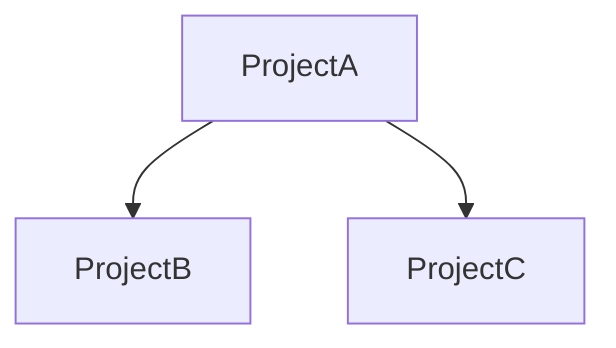
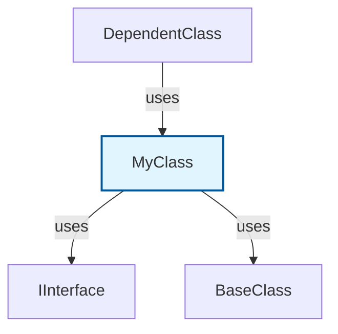

# Mermaid Documentation Analyzer

## Overview

The `MermaidDocumentationAnalyzer` is a new `IProjectAnalyzer` implementation that generates comprehensive Mermaid markdown documentation for projects and their code elements (interfaces, classes, enums, structs, and records).

## Features

### 1. Index Markdown with Project Graph

The analyzer generates an index markdown document that includes:

- **Project Overview Graph**: A Mermaid graph showing all projects and their dependencies
- **Project Summary Table**: Lists all projects with counts of elements, references, and usage

Example Mermaid graph:


### 2. Per-Project Documentation

For each project, the analyzer generates:

- **Project metadata**: Name, path, and element count
- **Project Dependencies Graph**: Shows what the project uses and what uses it
- **Code Elements**: Organized by type (Classes, Interfaces, Enums, Structs, Records)

### 3. Per-Element Documentation

For each public code element (class, interface, enum, struct, record), the analyzer generates:

- **Element metadata**: Name, kind, and full name
- **Mermaid Relationship Graph**: Shows:
  - **Usings**: Types that this element depends on (base classes, interfaces, field/property types, method parameters/returns)
  - **Usages**: Types that depend on this element
- **Dependency Lists**: Detailed lists of dependencies and dependents

Example element graph:


## Usage

### Basic Usage

```csharp
// Create and initialize the workspace
var msBuildRegisteringService = new MsBuildRegisteringService();
msBuildRegisteringService.RegisterIfNeeded();

var defaultProjectCollection = new DefaultProjectCollection();
var msBuildWorkspace = new MsBuildWorkspace(defaultProjectCollection, logger);
msBuildWorkspace.Initialize();

// Load the solution
var solutionResult = await msBuildWorkspace.OpenSolutionAsync("path/to/solution.sln");
var solution = solutionResult.ObjectOrThrow();

// Run the analyzer
var analyzer = new MermaidDocumentationAnalyzer();
var result = await analyzer.AnalyzeAsync(solution);

// Generate markdown documentation
var generator = new MermaidDocumentationReportGenerator();
var sections = generator.Generate((MermaidDocumentationResult)result);

// Create markdown document
var doc = new MarkdownDocument();
foreach (var section in sections)
{
    doc.AddSection(section);
}

var markdown = doc.Render();
await File.WriteAllTextAsync("documentation.md", markdown);
```

### Using with ProjectAnalyzerAggregator

```csharp
var aggregator = new ProjectAnalyzerAggregator()
    .Add(new StructuralCouplingAnalyzer())
    .Add(new ClassicalCouplingAnalyzer())
    .Add(new MermaidDocumentationAnalyzer()); // Add the new analyzer

var results = await aggregator.RunAsync(solution);

// Process results
foreach (var kv in results)
{
    if (kv.Value is MermaidDocumentationResult mermaidResult)
    {
        var generator = new MermaidDocumentationReportGenerator();
        var sections = generator.Generate(mermaidResult);
        // ... process sections
    }
}
```

## Output Structure

The generated markdown document has the following structure:

```
# Projects Overview
- Project dependency graph (Mermaid)
- Project summary table

## Project: ProjectName
- Project metadata
- Project dependencies graph (Mermaid)

### Code Elements

#### Classes
##### ClassName1
- Element metadata
- Relationship graph (Mermaid)
- Dependencies list
- Dependents list

##### ClassName2
...

#### Interfaces
##### InterfaceName1
...

#### Enums
##### EnumName1
...

#### Structs
##### StructName1
...

#### Records
##### RecordName1
...
```

## Implementation Details

### Key Components

1. **MermaidDocumentationAnalyzer**: The main analyzer that:
   - Analyzes project references
   - Uses Roslyn to analyze compilation and extract public types
   - Tracks dependencies (usings) and usages for each element
   - Generates structured documentation data

2. **ProjectDocumentation**: Record containing:
   - Project name and path
   - List of project references
   - List of projects that use this project
   - List of code elements

3. **CodeElementDocumentation**: Record containing:
   - Element name, kind, and full name
   - List of types this element uses
   - List of types that use this element

4. **MermaidDocumentationReportGenerator**: Generates markdown with Mermaid diagrams from the analysis results

### Limitations

- Only analyzes public types and members
- Limits relationship graphs to 20 connections to avoid overcrowding
- Requires successful compilation to analyze code elements
- Does not track cross-assembly dependencies (only in-solution types)

## Testing

A test is provided in `UnitTest1.cs`:

```csharp
[Fact]
public async Task TestMermaidDocumentationAnalyzer()
{
    // ... setup ...
    
    var analyzer = new MermaidDocumentationAnalyzer();
    var result = await analyzer.AnalyzeAsync(solution);
    
    var generator = new MermaidDocumentationReportGenerator();
    var sections = generator.Generate((MermaidDocumentationResult)result);
    
    var doc = new MarkdownDocument();
    foreach (var section in sections)
        doc.AddSection(section);
    
    var markdown = doc.Render();
    await File.WriteAllTextAsync("mermaid_documentation.md", markdown);
}
```

## Future Enhancements

Potential improvements:
- Add support for method-level call graphs
- Include namespace organization
- Add filtering options (e.g., exclude test projects)
- Support for external assembly references
- Generate separate files per project/element
- Add statistics (most used types, most complex types, etc.)
- Support for other diagram types (class diagrams, sequence diagrams)
