## Table of Contents
- [Projects Overview](#projects-overview)
- [Project: FenchExDev.Net.Testing](#project-fenchexdevnettesting)
  - [Code Elements](#code-elements)
    - [Classs](#classs)
      - [FeatureAttribute](#featureattribute)
      - [Integration](#integration)
      - [Internet](#internet)
      - [Kind](#kind)
      - [TestsUsing](#testsusing)
    - [Enums](#enums)
      - [IntegrationKind](#integrationkind)
      - [TestKind](#testkind)
    - [Records](#records)
      - [FeatureName](#featurename)
- [Project: FrenchExDev.Net.Alpine.Version](#project-frenchexdevnetalpineversion)
  - [Code Elements](#code-elements-1)
    - [Classs](#classs-1)
      - [AlpineVersion](#alpineversion)
      - [AlpineVersionBuilder](#alpineversionbuilder)
      - [AlpineVersionList](#alpineversionlist)
      - [AlpineVersionSearcher](#alpineversionsearcher)
      - [AlpineVersionSearchingFilters](#alpineversionsearchingfilters)
      - [AlpineVersionSearchingFiltersBuilder](#alpineversionsearchingfiltersbuilder)
      - [MajorMinorPatchRelationalComparer](#majorminorpatchrelationalcomparer)
    - [Enums](#enums-1)
      - [AlpineArchitectures](#alpinearchitectures)
      - [AlpineFlavors](#alpineflavors)
      - [Operator](#operator)
    - [Interfaces](#interfaces)
      - [IAlpineVersionSearcher](#ialpineversionsearcher)
    - [Records](#records-1)
      - [AlpineVersionArchFlavorRecord](#alpineversionarchflavorrecord)
      - [AlpineVersionArchRecord](#alpineversionarchrecord)
      - [AlpineVersionRecord](#alpineversionrecord)
- [Project: FrenchExDev.Net.Alpine.Version.Testing](#project-frenchexdevnetalpineversiontesting)
  - [Code Elements](#code-elements-2)
    - [Classs](#classs-2)
      - [AlpineVersionSearcherTester](#alpineversionsearchertester)
- [Project: FrenchExDev.Net.Alpine.Version.Tests](#project-frenchexdevnetalpineversiontests)
  - [Code Elements](#code-elements-3)
    - [Classs](#classs-3)
      - [AlpineVersionComparerTests](#alpineversioncomparertests)
      - [AlpineVersionSearcherTests](#alpineversionsearchertests)
- [Project: FrenchExDev.Net.CSharp.ManagedDictionary](#project-frenchexdevnetcsharpmanageddictionary)
  - [Code Elements](#code-elements-4)
    - [Classs](#classs-4)
      - [ClosedManagedDictionary](#closedmanageddictionary)
      - [ManagedDictionary](#manageddictionary)
      - [ManagedDictionaryBuilder](#manageddictionarybuilder)
      - [OnAddList](#onaddlist)
      - [OnClearList](#onclearlist)
      - [OnRemoveList](#onremovelist)
      - [OpenManagedDictionary](#openmanageddictionary)
- [Project: FrenchExDev.Net.CSharp.ManagedDictionary.Testing](#project-frenchexdevnetcsharpmanageddictionarytesting)
  - [Code Elements](#code-elements-5)
    - [Classs](#classs-5)
      - [Class1](#class1)
- [Project: FrenchExDev.Net.CSharp.ManagedDictionary.Tests](#project-frenchexdevnetcsharpmanageddictionarytests)
  - [Code Elements](#code-elements-6)
    - [Classs](#classs-6)
      - [UnitTest1](#unittest1)
- [Project: FrenchExDev.Net.CSharp.ManagedList](#project-frenchexdevnetcsharpmanagedlist)
  - [Code Elements](#code-elements-7)
    - [Classs](#classs-7)
      - [ClosedManagedList](#closedmanagedlist)
      - [ManagedList](#managedlist)
      - [ManagedListBuilder](#managedlistbuilder)
      - [OnAddList](#onaddlist-1)
      - [onClearList](#onclearlist-1)
      - [OnRemoveList](#onremovelist-1)
      - [OpenManagedList](#openmanagedlist)
- [Project: FrenchExDev.Net.CSharp.ManagedList.Testing](#project-frenchexdevnetcsharpmanagedlisttesting)
  - [Code Elements](#code-elements-8)
    - [Classs](#classs-8)
      - [ManagedListTester](#managedlisttester)
- [Project: FrenchExDev.Net.CSharp.ManagedList.Tests](#project-frenchexdevnetcsharpmanagedlisttests)
  - [Code Elements](#code-elements-9)
    - [Classs](#classs-9)
      - [ManagedListTests](#managedlisttests)
- [Project: FrenchExDev.Net.CSharp.Object.Biz](#project-frenchexdevnetcsharpobjectbiz)
  - [Code Elements](#code-elements-10)
    - [Classs](#classs-10)
      - [Facet](#facet)
      - [FacetDictionary](#facetdictionary)
      - [FacetDoesNotExistException](#facetdoesnotexistexception)
      - [FacetObject](#facetobject)
      - [FacetObject](#facetobject-1)
    - [Interfaces](#interfaces-1)
      - [IFacet](#ifacet)
      - [IGenericFacet](#igenericfacet)
      - [ISpecificFacet](#ispecificfacet)
- [Project: FrenchExDev.Net.CSharp.Object.Biz.Testing](#project-frenchexdevnetcsharpobjectbiztesting)
  - [Code Elements](#code-elements-11)
    - [Classs](#classs-11)
      - [Code](#code)
- [Project: FrenchExDev.Net.CSharp.Object.Biz.Tests](#project-frenchexdevnetcsharpobjectbiztests)
  - [Code Elements](#code-elements-12)
    - [Classs](#classs-12)
      - [FacetObjectGenericTests](#facetobjectgenerictests)
      - [FacetObjectTests](#facetobjecttests)
- [Project: FrenchExDev.Net.CSharp.Object.Builder2](#project-frenchexdevnetcsharpobjectbuilder2)
  - [Code Elements](#code-elements-13)
    - [Classs](#classs-13)
      - [AbstractBuilder](#abstractbuilder)
      - [BuilderList](#builderlist)
      - [BuildException](#buildexception)
      - [BuildFailedException](#buildfailedexception)
      - [BuildSucceededException](#buildsucceededexception)
      - [Extensions](#extensions)
      - [FailureResult](#failureresult)
      - [FailuresDictionary](#failuresdictionary)
      - [NotResolvedException](#notresolvedexception)
      - [ReferenceList](#referencelist)
      - [StringIsEmptyOrWhitespaceException](#stringisemptyorwhitespaceexception)
      - [SuccessResult](#successresult)
      - [VisitedObjectDictionary](#visitedobjectdictionary)
    - [Enums](#enums-2)
      - [BuildStatus](#buildstatus)
      - [ValidationStatus](#validationstatus)
    - [Interfaces](#interfaces-2)
      - [IBuilder](#ibuilder)
      - [IReferenceList](#ireferencelist)
      - [IResult](#iresult)
    - [Records](#records-2)
      - [Reference](#reference)
    - [Structs](#structs)
      - [Failure](#failure)
- [Project: FrenchExDev.Net.CSharp.Object.Builder2.Testing](#project-frenchexdevnetcsharpobjectbuilder2testing)
  - [Code Elements](#code-elements-14)
    - [Classs](#classs-14)
      - [Address](#address)
      - [AddressBuilder](#addressbuilder)
      - [AgeMustBeNonNegativeException](#agemustbenonnegativeexception)
      - [AtLeastOneAddressMustBeProvidedException](#atleastoneaddressmustbeprovidedexception)
      - [MustHaveContactException](#musthavecontactexception)
      - [MustKnowAtLeastOnePersonException](#mustknowatleastonepersonexception)
      - [NameCannotBeNullOrEmptyOrWhitespaceException](#namecannotbenulloremptyorwhitespaceexception)
      - [Person](#person)
      - [PersonBuilder](#personbuilder)
      - [PersonBuilderException](#personbuilderexception)
- [Project: FrenchExDev.Net.CSharp.Object.Builder2.Tests](#project-frenchexdevnetcsharpobjectbuilder2tests)
  - [Code Elements](#code-elements-15)
    - [Classs](#classs-15)
      - [Cyclic_Complex_Graph_Tests](#cyclic_complex_graph_tests)
- [Project: FrenchExDev.Net.CSharp.Object.Model](#project-frenchexdevnetcsharpobjectmodel)
- [Project: FrenchExDev.Net.CSharp.Object.Model.Abstractions](#project-frenchexdevnetcsharpobjectmodelabstractions)
  - [Code Elements](#code-elements-16)
    - [Classs](#classs-16)
      - [AttributeDeclarationModel](#attributedeclarationmodel)
      - [AttributeDeclarationModelBuilder](#attributedeclarationmodelbuilder)
      - [ClassDeclarationModel](#classdeclarationmodel)
      - [ClassDeclarationModelBuilder](#classdeclarationmodelbuilder)
      - [ConstructorDeclarationModel](#constructordeclarationmodel)
      - [ConstructorDeclarationModelBuilder](#constructordeclarationmodelbuilder)
      - [DeclarationHaveNoNameException](#declarationhavenonameexception)
      - [DeclarationModelBuilder](#declarationmodelbuilder)
      - [EnumDeclarationModel](#enumdeclarationmodel)
      - [EnumDeclarationModelBuilder](#enumdeclarationmodelbuilder)
      - [EnumMemberDeclarationModel](#enummemberdeclarationmodel)
      - [EnumMemberDeclarationModelBuilder](#enummemberdeclarationmodelbuilder)
      - [EventDeclarationModel](#eventdeclarationmodel)
      - [EventDeclarationModelBuilder](#eventdeclarationmodelbuilder)
      - [FieldDeclarationModel](#fielddeclarationmodel)
      - [FieldDeclarationModelBuilder](#fielddeclarationmodelbuilder)
      - [FreeTypeParameterConstraintDeclarationModel](#freetypeparameterconstraintdeclarationmodel)
      - [FreeTypeParameterConstraintDeclarationModelBuilder](#freetypeparameterconstraintdeclarationmodelbuilder)
      - [InterfaceDeclarationModel](#interfacedeclarationmodel)
      - [InterfaceDeclarationModelBuilder](#interfacedeclarationmodelbuilder)
      - [MethodDeclarationModel](#methoddeclarationmodel)
      - [MethodDeclarationModelBuilder](#methoddeclarationmodelbuilder)
      - [NamespaceDeclarationModel](#namespacedeclarationmodel)
      - [NamespaceDeclarationModelBuilder](#namespacedeclarationmodelbuilder)
      - [ParameterDeclarationModel](#parameterdeclarationmodel)
      - [ParameterDeclarationModelBuilder](#parameterdeclarationmodelbuilder)
      - [PropertyDeclarationModel](#propertydeclarationmodel)
      - [PropertyDeclarationModelBuilder](#propertydeclarationmodelbuilder)
      - [StructDeclarationModel](#structdeclarationmodel)
      - [StructDeclarationModelBuilder](#structdeclarationmodelbuilder)
      - [SuccessObjectBuildResultExtensions](#successobjectbuildresultextensions)
      - [TypeParameterConstraintModel](#typeparameterconstraintmodel)
      - [TypeParameterConstraintModelBuilder](#typeparameterconstraintmodelbuilder)
      - [TypeParameterDeclarationModel](#typeparameterdeclarationmodel)
      - [TypeParameterDeclarationModelBuilder](#typeparameterdeclarationmodelbuilder)
    - [Enums](#enums-3)
      - [ClassModifier](#classmodifier)
      - [EnumModifier](#enummodifier)
      - [InterfaceModifier](#interfacemodifier)
      - [NamespaceScoping](#namespacescoping)
      - [StructModifier](#structmodifier)
      - [TypeParameterConstraintEnum](#typeparameterconstraintenum)
    - [Interfaces](#interfaces-3)
      - [IDeclarationModel](#ideclarationmodel)
      - [IDeclarationModelBuilder](#ideclarationmodelbuilder)
- [Project: FrenchExDev.Net.CSharp.Object.Model.Infrastructure](#project-frenchexdevnetcsharpobjectmodelinfrastructure)
  - [Code Elements](#code-elements-17)
    - [Classs](#classs-17)
      - [ModelRoslynConverter](#modelroslynconverter)
      - [ModelSyntaxExtensions](#modelsyntaxextensions)
    - [Interfaces](#interfaces-4)
      - [IModelRoselynConverter](#imodelroselynconverter)
- [Project: FrenchExDev.Net.CSharp.Object.Model.Testing](#project-frenchexdevnetcsharpobjectmodeltesting)
  - [Code Elements](#code-elements-18)
    - [Classs](#classs-18)
      - [ModelSyntaxCodeTester](#modelsyntaxcodetester)
- [Project: FrenchExDev.Net.CSharp.Object.Model.Tests](#project-frenchexdevnetcsharpobjectmodeltests)
  - [Code Elements](#code-elements-19)
    - [Classs](#classs-19)
      - [NamespaceDeclarationModelSyntaxCodeTests](#namespacedeclarationmodelsyntaxcodetests)
- [Project: FrenchExDev.Net.CSharp.Object.Result](#project-frenchexdevnetcsharpobjectresult)
  - [Code Elements](#code-elements-20)
    - [Classs](#classs-20)
      - [FailureDictionary](#failuredictionary)
      - [FailureDictionaryBuilder](#failuredictionarybuilder)
      - [InvalidResultAccessException](#invalidresultaccessexception)
      - [ResultException](#resultexception)
    - [Interfaces](#interfaces-5)
      - [IResult](#iresult-1)
    - [Structs](#structs-1)
      - [Result](#result)
      - [Result](#result-1)
- [Project: FrenchExDev.Net.CSharp.Object.Result.Testing](#project-frenchexdevnetcsharpobjectresulttesting)
  - [Code Elements](#code-elements-21)
    - [Classs](#classs-21)
      - [ResultTester](#resulttester)
- [Project: FrenchExDev.Net.CSharp.Object.Result.Tests](#project-frenchexdevnetcsharpobjectresulttests)
  - [Code Elements](#code-elements-22)
    - [Classs](#classs-22)
      - [ResultTests](#resulttests)
- [Project: FrenchExDev.Net.CSharp.ProjectDependency](#project-frenchexdevnetcsharpprojectdependency)
  - [Code Elements](#code-elements-23)
    - [Classs](#classs-23)
      - [MsBuildRegisteringService](#msbuildregisteringservice)
      - [MsBuildWorkspace](#msbuildworkspace)
- [Project: FrenchExDev.Net.CSharp.ProjectDependency.Abstractions](#project-frenchexdevnetcsharpprojectdependencyabstractions)
  - [Code Elements](#code-elements-24)
    - [Classs](#classs-24)
      - [DeclarationMermaidGenerator](#declarationmermaidgenerator)
      - [DefaultProjectCollection](#defaultprojectcollection)
      - [GitCliRepository](#gitclirepository)
      - [LibGit2SharpRepository](#libgit2sharprepository)
      - [PackageMermaidGenerator](#packagemermaidgenerator)
      - [Project](#project)
      - [ProjectAnalysisGenerator](#projectanalysisgenerator)
      - [ProjectDependencyMermaidGenerator](#projectdependencymermaidgenerator)
      - [ProjectLoader](#projectloader)
      - [ProjectMarkdownFileGenerator](#projectmarkdownfilegenerator)
      - [ProjectMarkdownGenerator](#projectmarkdowngenerator)
      - [ProjectReferencesMermaidGenerator](#projectreferencesmermaidgenerator)
      - [ProjectsMarkdownGenerator](#projectsmarkdowngenerator)
      - [Solution](#solution)
      - [SolutionAnalysisGenerator](#solutionanalysisgenerator)
      - [SolutionLoader](#solutionloader)
      - [SolutionMarkdownGenerator](#solutionmarkdowngenerator)
    - [Enums](#enums-4)
      - [CouplingLevel](#couplinglevel)
    - [Interfaces](#interfaces-6)
      - [IDeclarationMermaidGenerator](#ideclarationmermaidgenerator)
      - [IDependency](#idependency)
      - [IGitRepository](#igitrepository)
      - [IMarkdownGenerator](#imarkdowngenerator)
      - [IMsBuildRegisteringService](#imsbuildregisteringservice)
      - [IMsBuildWorkspace](#imsbuildworkspace)
      - [IPackageMermaidGenerator](#ipackagemermaidgenerator)
      - [IProjectAnalysisGenerator](#iprojectanalysisgenerator)
      - [IProjectCollection](#iprojectcollection)
      - [IProjectDependencyMermaidGenerator](#iprojectdependencymermaidgenerator)
      - [IProjectMarkdownFileGenerator](#iprojectmarkdownfilegenerator)
      - [IProjectMarkdownGenerator](#iprojectmarkdowngenerator)
      - [IProjectReferencesMermaidGenerator](#iprojectreferencesmermaidgenerator)
      - [ISolutionLoader](#isolutionloader)
    - [Records](#records-3)
      - [DeclarationDescriptor](#declarationdescriptor)
      - [DerivedProjectIndicators](#derivedprojectindicators)
      - [PackageDependency](#packagedependency)
      - [PackageDistributedVersionDependency](#packagedistributedversiondependency)
      - [PackageReference](#packagereference)
      - [PackageVersionDependency](#packageversiondependency)
      - [ProjectAnalysis](#projectanalysis)
      - [ProjectAnalysisGenerationResult](#projectanalysisgenerationresult)
      - [ProjectChurnMetrics](#projectchurnmetrics)
      - [ProjectCodeMetrics](#projectcodemetrics)
      - [ProjectConstructMetrics](#projectconstructmetrics)
      - [ProjectCoreKpis](#projectcorekpis)
      - [ProjectDependency](#projectdependency)
      - [ProjectMetrics](#projectmetrics)
      - [ProjectQualityMetrics](#projectqualitymetrics)
      - [ProjectReference](#projectreference)
      - [ReferenceCoupling](#referencecoupling)
      - [SolutionAnalysis](#solutionanalysis)
      - [SolutionIndicators](#solutionindicators)
- [Project: FrenchExDev.Net.CSharp.ProjectDependency.Testing](#project-frenchexdevnetcsharpprojectdependencytesting)
  - [Code Elements](#code-elements-25)
    - [Classs](#classs-25)
      - [Class1](#class1-1)
- [Project: FrenchExDev.Net.Csharp.ProjectDependency.Tests](#project-frenchexdevnetcsharpprojectdependencytests)
  - [Code Elements](#code-elements-26)
    - [Classs](#classs-26)
      - [ProjectMarkdownFileGeneratorTests](#projectmarkdownfilegeneratortests)
- [Project: FrenchExDev.Net.CSharp.ProjectDependency2](#project-frenchexdevnetcsharpprojectdependency2)
  - [Code Elements](#code-elements-27)
    - [Classs](#classs-27)
      - [AsyncConventionsAnalyzer](#asyncconventionsanalyzer)
      - [AsyncConventionsMarkdownRenderer](#asyncconventionsmarkdownrenderer)
      - [AsyncConventionsReportGenerator](#asyncconventionsreportgenerator)
      - [DefaultProjectCollection](#defaultprojectcollection-1)
      - [ExceptionUsageAnalyzer](#exceptionusageanalyzer)
      - [ExceptionUsageMarkdownRenderer](#exceptionusagemarkdownrenderer)
      - [ExceptionUsageReportGenerator](#exceptionusagereportgenerator)
      - [InterfaceDesignAnalyzer](#interfacedesignanalyzer)
      - [InterfaceDesignMarkdownRenderer](#interfacedesignmarkdownrenderer)
      - [InterfaceDesignReportGenerator](#interfacedesignreportgenerator)
      - [InterfaceTestUsageAnalyzer](#interfacetestusageanalyzer)
      - [InterfaceTestUsageMarkdownRenderer](#interfacetestusagemarkdownrenderer)
      - [InterfaceTestUsageReportGenerator](#interfacetestusagereportgenerator)
      - [MsBuildRegisteringService](#msbuildregisteringservice-1)
      - [MsBuildWorkspace](#msbuildworkspace-1)
      - [Project](#project-1)
      - [ProjectAnalysisCollection](#projectanalysiscollection)
      - [ProjectAnalysisCollection](#projectanalysiscollection-1)
      - [ProjectCollectionLoader](#projectcollectionloader)
      - [ProjectMarkdownFileGenerator](#projectmarkdownfilegenerator-1)
      - [ProjectReferencesAnalyzer](#projectreferencesanalyzer)
      - [ProjectReferencesMarkdownRenderer](#projectreferencesmarkdownrenderer)
      - [ProjectReferencesReportGenerator](#projectreferencesreportgenerator)
      - [PublicApiAnalyzer](#publicapianalyzer)
      - [PublicApiMarkdownRenderer](#publicapimarkdownrenderer)
      - [PublicApiReportGenerator](#publicapireportgenerator)
      - [Solution](#solution-1)
      - [XmlDocCoverageAnalyzer](#xmldoccoverageanalyzer)
      - [XmlDocCoverageMarkdownRenderer](#xmldoccoveragemarkdownrenderer)
      - [XmlDocCoverageReportGenerator](#xmldoccoveragereportgenerator)
    - [Interfaces](#interfaces-7)
      - [IMarkdownReportRenderer](#imarkdownreportrenderer)
      - [IMsBuildRegisteringService](#imsbuildregisteringservice-1)
      - [IMsBuildWorkspace](#imsbuildworkspace-1)
      - [IProjectAnalysisCollection](#iprojectanalysiscollection)
      - [IProjectAnalysisReportGenerator](#iprojectanalysisreportgenerator)
      - [IProjectAnalysisReportResult](#iprojectanalysisreportresult)
      - [IProjectAnalysisResult](#iprojectanalysisresult)
      - [IProjectAnalyzer](#iprojectanalyzer)
      - [IProjectCollection](#iprojectcollection-1)
      - [IProjectDependency](#iprojectdependency)
    - [Records](#records-4)
      - [AsyncConventionsDetailedReport](#asyncconventionsdetailedreport)
      - [AsyncConventionsItem](#asyncconventionsitem)
      - [AsyncConventionsMarkdownReport](#asyncconventionsmarkdownreport)
      - [AsyncConventionsReport](#asyncconventionsreport)
      - [ExceptionUsageDetailedReport](#exceptionusagedetailedreport)
      - [ExceptionUsageItem](#exceptionusageitem)
      - [ExceptionUsageMarkdownReport](#exceptionusagemarkdownreport)
      - [ExceptionUsageReport](#exceptionusagereport)
      - [InterfaceDesignDetailedReport](#interfacedesigndetailedreport)
      - [InterfaceDesignItem](#interfacedesignitem)
      - [InterfaceDesignMarkdownReport](#interfacedesignmarkdownreport)
      - [InterfaceDesignReport](#interfacedesignreport)
      - [InterfaceTestUsageDetailedReport](#interfacetestusagedetailedreport)
      - [InterfaceTestUsageItem](#interfacetestusageitem)
      - [InterfaceTestUsageMarkdownReport](#interfacetestusagemarkdownreport)
      - [InterfaceTestUsageReport](#interfacetestusagereport)
      - [MarkdownSection](#markdownsection)
      - [PackageDependency](#packagedependency-1)
      - [PackageDistributedVersionDependency](#packagedistributedversiondependency-1)
      - [PackageReference](#packagereference-1)
      - [PackageVersionDependency](#packageversiondependency-1)
      - [ProjectAnalysisReportAdapter](#projectanalysisreportadapter)
      - [ProjectDependency](#projectdependency-1)
      - [ProjectReference](#projectreference-1)
      - [ProjectReferenceAnalysis](#projectreferenceanalysis)
      - [ProjectReferenceAnalysis](#projectreferenceanalysis-1)
      - [ProjectReferencesDetailedReport](#projectreferencesdetailedreport)
      - [ProjectReferencesMarkdownReport](#projectreferencesmarkdownreport)
      - [PublicApiDetailedReport](#publicapidetailedreport)
      - [PublicApiMarkdownReport](#publicapimarkdownreport)
      - [PublicApiReport](#publicapireport)
      - [PublicTypeInfo](#publictypeinfo)
      - [XmlDocCoverageDetailedReport](#xmldoccoveragedetailedreport)
      - [XmlDocCoverageItem](#xmldoccoverageitem)
      - [XmlDocCoverageMarkdownReport](#xmldoccoveragemarkdownreport)
      - [XmlDocCoverageReport](#xmldoccoveragereport)
- [Project: FrenchExDev.Net.CSharp.ProjectDependency2.Testing](#project-frenchexdevnetcsharpprojectdependency2testing)
  - [Code Elements](#code-elements-28)
    - [Classs](#classs-28)
      - [Class1](#class1-2)
- [Project: FrenchExDev.Net.CSharp.ProjectDependency2.Tests](#project-frenchexdevnetcsharpprojectdependency2tests)
  - [Code Elements](#code-elements-29)
    - [Classs](#classs-29)
      - [UnitTest1](#unittest1-1)
- [Project: FrenchExDev.Net.CSharp.ProjectDependency3](#project-frenchexdevnetcsharpprojectdependency3)
  - [Code Elements](#code-elements-30)
    - [Classs](#classs-30)
      - [ClassicalCouplingAnalyzer](#classicalcouplinganalyzer)
      - [ClassicalCouplingReportGenerator](#classicalcouplingreportgenerator)
      - [CodeGraphAnalyzer](#codegraphanalyzer)
      - [CodeGraphReportGenerator](#codegraphreportgenerator)
      - [DefaultProjectCollection](#defaultprojectcollection-2)
      - [DirectionalCouplingAnalyzer](#directionalcouplinganalyzer)
      - [DirectionalCouplingReportGenerator](#directionalcouplingreportgenerator)
      - [GraphLink](#graphlink)
      - [GraphModel](#graphmodel)
      - [GraphNode](#graphnode)
      - [MarkdownDocument](#markdowndocument)
      - [MarkdownSection](#markdownsection-1)
      - [MsBuildRegisteringService](#msbuildregisteringservice-2)
      - [MsBuildWorkspace](#msbuildworkspace-2)
      - [Project](#project-2)
      - [ProjectAnalyzerAggregator](#projectanalyzeraggregator)
      - [Solution](#solution-2)
      - [StructuralCouplingAnalyzer](#structuralcouplinganalyzer)
      - [StructuralCouplingReportGenerator](#structuralcouplingreportgenerator)
    - [Interfaces](#interfaces-8)
      - [IMsBuildRegisteringService](#imsbuildregisteringservice-2)
      - [IMsBuildWorkspace](#imsbuildworkspace-2)
      - [IProjectAnalysisResult](#iprojectanalysisresult-1)
      - [IProjectAnalyzer](#iprojectanalyzer-1)
      - [IProjectCollection](#iprojectcollection-2)
      - [IProjectDependency](#iprojectdependency-1)
      - [IReportGenerator](#ireportgenerator)
    - [Records](#records-5)
      - [ClassicalCouplingResult](#classicalcouplingresult)
      - [CodeGraphResult](#codegraphresult)
      - [DirectionalCouplingResult](#directionalcouplingresult)
      - [PackageDependency](#packagedependency-2)
      - [PackageDistributedVersionDependency](#packagedistributedversiondependency-2)
      - [PackageVersionDependency](#packageversiondependency-2)
      - [ProjectDependency](#projectdependency-2)
      - [StructuralCouplingResult](#structuralcouplingresult)
- [Project: FrenchExDev.Net.CSharp.ProjectDependency3.Abstractions](#project-frenchexdevnetcsharpprojectdependency3abstractions)
  - [Code Elements](#code-elements-31)
    - [Classs](#classs-31)
      - [Class1](#class1-3)
- [Project: FrenchExDev.Net.CSharp.ProjectDependency3.AppHost](#project-frenchexdevnetcsharpprojectdependency3apphost)
  - [Code Elements](#code-elements-32)
    - [Classs](#classs-32)
      - [DevAppHost](#devapphost)
      - [DevAppHostExtensions](#devapphostextensions)
      - [FrenchExDev_Net_CSharp_ProjectDependency3_AppHost](#frenchexdev_net_csharp_projectdependency3_apphost)
      - [FrenchExDev_Net_CSharp_ProjectDependency3_Viz](#frenchexdev_net_csharp_projectdependency3_viz)
      - [FrenchExDev_Net_CSharp_ProjectDependency3_Viz_Api](#frenchexdev_net_csharp_projectdependency3_viz_api)
      - [FrenchExDev_Net_CSharp_ProjectDependency3_Worker_Agent](#frenchexdev_net_csharp_projectdependency3_worker_agent)
      - [FrenchExDev_Net_CSharp_ProjectDependency3_Worker_Orchestrator](#frenchexdev_net_csharp_projectdependency3_worker_orchestrator)
    - [Interfaces](#interfaces-9)
      - [IDevAppHost](#idevapphost)
    - [Records](#records-6)
      - [DnsConfiguration](#dnsconfiguration)
      - [PortConfiguration](#portconfiguration)
- [Project: FrenchExDev.Net.CSharp.ProjectDependency3.ServiceDefaults](#project-frenchexdevnetcsharpprojectdependency3servicedefaults)
  - [Code Elements](#code-elements-33)
    - [Classs](#classs-33)
      - [Extensions](#extensions-1)
- [Project: FrenchExDev.Net.CSharp.ProjectDependency3.Testing](#project-frenchexdevnetcsharpprojectdependency3testing)
  - [Code Elements](#code-elements-34)
    - [Classs](#classs-34)
      - [Class1](#class1-4)
- [Project: FrenchExDev.Net.CSharp.ProjectDependency3.Tests](#project-frenchexdevnetcsharpprojectdependency3tests)
  - [Code Elements](#code-elements-35)
    - [Classs](#classs-35)
      - [UnitTest1](#unittest1-2)
- [Project: FrenchExDev.Net.CSharp.ProjectDependency3.Viz](#project-frenchexdevnetcsharpprojectdependency3viz)
  - [Code Elements](#code-elements-36)
    - [Classs](#classs-36)
      - [AnalysisService](#analysisservice)
      - [Program](#program)
      - [SessionManager](#sessionmanager)
    - [Interfaces](#interfaces-10)
      - [IAnalysisService](#ianalysisservice)
      - [ISessionManager](#isessionmanager)
    - [Records](#records-7)
      - [AnalysisRunResult](#analysisrunresult)
- [Project: FrenchExDev.Net.CSharp.ProjectDependency3.Viz.Api](#project-frenchexdevnetcsharpprojectdependency3vizapi)
  - [Code Elements](#code-elements-37)
    - [Classs](#classs-37)
      - [AgentRegistry](#agentregistry)
      - [AgentsController](#agentscontroller)
      - [HomeController](#homecontroller)
      - [OrchestratorRegistry](#orchestratorregistry)
      - [OrchestratorsController](#orchestratorscontroller)
      - [RegistryWebSocketManager](#registrywebsocketmanager)
    - [Enums](#enums-5)
      - [AgentStatus](#agentstatus)
      - [OrchestratorStatus](#orchestratorstatus)
    - [Interfaces](#interfaces-11)
      - [IAgentRegistry](#iagentregistry)
      - [IOrchestratorRegistry](#iorchestratorregistry)
    - [Records](#records-8)
      - [AgentRegistration](#agentregistration)
      - [HeartbeatRequest](#heartbeatrequest)
      - [OrchestratorRegistration](#orchestratorregistration)
      - [RegisterAgentRequest](#registeragentrequest)
      - [RegisterOrchestratorRequest](#registerorchestratorrequest)
- [Project: FrenchExDev.Net.CSharp.ProjectDependency3.Worker.Agent](#project-frenchexdevnetcsharpprojectdependency3workeragent)
  - [Code Elements](#code-elements-38)
    - [Classs](#classs-38)
      - [AgentRegistrationService](#agentregistrationservice)
      - [AgentState](#agentstate)
      - [AnalysisRunner](#analysisrunner)
    - [Interfaces](#interfaces-12)
      - [IAgentRegistrationService](#iagentregistrationservice)
      - [IAnalysisRunner](#ianalysisrunner)
    - [Records](#records-9)
      - [AnalysisArtifacts](#analysisartifacts)
      - [AnalysisJob](#analysisjob)
      - [AnalysisProgress](#analysisprogress)
      - [AnalysisRunnerResult](#analysisrunnerresult)
- [Project: FrenchExDev.Net.CSharp.ProjectDependency3.Worker.Orchestrator](#project-frenchexdevnetcsharpprojectdependency3workerorchestrator)
  - [Code Elements](#code-elements-39)
    - [Classs](#classs-39)
      - [OrchestratorRegistrationService](#orchestratorregistrationservice)
      - [OrchestratorUI](#orchestratorui)
    - [Interfaces](#interfaces-13)
      - [IRegistrationService](#iregistrationservice)
    - [Records](#records-10)
      - [AgentInfo](#agentinfo)
- [Project: FrenchExDev.Net.CSharp.ProjectDependency4.Core](#project-frenchexdevnetcsharpprojectdependency4core)
  - [Code Elements](#code-elements-40)
    - [Classs](#classs-40)
      - [ClassicalCouplingAnalyzer](#classicalcouplinganalyzer-1)
      - [ClassicalCouplingReportGenerator](#classicalcouplingreportgenerator-1)
      - [CodeGraphAnalyzer](#codegraphanalyzer-1)
      - [CodeGraphReportGenerator](#codegraphreportgenerator-1)
      - [DefaultProjectCollection](#defaultprojectcollection-3)
      - [DirectionalCouplingAnalyzer](#directionalcouplinganalyzer-1)
      - [DirectionalCouplingReportGenerator](#directionalcouplingreportgenerator-1)
      - [GraphLink](#graphlink-1)
      - [GraphModel](#graphmodel-1)
      - [GraphNode](#graphnode-1)
      - [MarkdownDocument](#markdowndocument-1)
      - [MarkdownSection](#markdownsection-2)
      - [MermaidDocumentationAnalyzer](#mermaiddocumentationanalyzer)
      - [MermaidDocumentationReportGenerator](#mermaiddocumentationreportgenerator)
      - [MsBuildRegisteringService](#msbuildregisteringservice-3)
      - [MsBuildWorkspace](#msbuildworkspace-3)
      - [Project](#project-3)
      - [ProjectAnalyzerAggregator](#projectanalyzeraggregator-1)
      - [Solution](#solution-3)
      - [StructuralCouplingAnalyzer](#structuralcouplinganalyzer-1)
      - [StructuralCouplingReportGenerator](#structuralcouplingreportgenerator-1)
    - [Interfaces](#interfaces-14)
      - [IMsBuildRegisteringService](#imsbuildregisteringservice-3)
      - [IMsBuildWorkspace](#imsbuildworkspace-3)
      - [IProjectAnalysisResult](#iprojectanalysisresult-2)
      - [IProjectAnalyzer](#iprojectanalyzer-2)
      - [IProjectCollection](#iprojectcollection-3)
      - [IProjectDependency](#iprojectdependency-2)
      - [IReportGenerator](#ireportgenerator-1)
    - [Records](#records-11)
      - [ClassicalCouplingResult](#classicalcouplingresult-1)
      - [CodeElementDocumentation](#codeelementdocumentation)
      - [CodeGraphResult](#codegraphresult-1)
      - [DirectionalCouplingResult](#directionalcouplingresult-1)
      - [MermaidDocumentationResult](#mermaiddocumentationresult)
      - [PackageDependency](#packagedependency-3)
      - [PackageDistributedVersionDependency](#packagedistributedversiondependency-3)
      - [PackageVersionDependency](#packageversiondependency-3)
      - [ProjectDependency](#projectdependency-3)
      - [ProjectDocumentation](#projectdocumentation)
      - [StructuralCouplingResult](#structuralcouplingresult-1)
- [Project: FrenchExDev.Net.CSharp.SolutionEngineering](#project-frenchexdevnetcsharpsolutionengineering)
  - [Code Elements](#code-elements-41)
    - [Classs](#classs-41)
      - [ProjectParameterDictionary](#projectparameterdictionary)
      - [Solution](#solution-4)
      - [SolutionParameterDictionary](#solutionparameterdictionary)
      - [SolutionProject](#solutionproject)
      - [SolutionProjectList](#solutionprojectlist)
    - [Enums](#enums-6)
      - [ApplicationTargets](#applicationtargets)
      - [ProgrammingLanguages](#programminglanguages)
    - [Interfaces](#interfaces-15)
      - [IProject](#iproject)
      - [ISolution](#isolution)
    - [Records](#records-12)
      - [ProgrammingLanguage](#programminglanguage)
- [Project: FrenchExDev.Net.CSharp.SolutionEngineering.Testing](#project-frenchexdevnetcsharpsolutionengineeringtesting)
  - [Code Elements](#code-elements-42)
    - [Classs](#classs-42)
      - [Class1](#class1-5)
- [Project: FrenchExDev.Net.CSharp.SolutionEngineering.Tests](#project-frenchexdevnetcsharpsolutionengineeringtests)
  - [Code Elements](#code-elements-43)
    - [Classs](#classs-43)
      - [UnitTest1](#unittest1-3)
- [Project: FrenchExDev.Net.Dotnet.Project](#project-frenchexdevnetdotnetproject)
  - [Code Elements](#code-elements-44)
    - [Classs](#classs-44)
      - [Class1](#class1-6)
- [Project: FrenchExDev.Net.Dotnet.Project.Abstractions](#project-frenchexdevnetdotnetprojectabstractions)
  - [Code Elements](#code-elements-45)
    - [Classs](#classs-45)
      - [AbstractProjectModel](#abstractprojectmodel)
      - [AbstractProjectModelBuilder](#abstractprojectmodelbuilder)
      - [MissingVersionException](#missingversionexception)
      - [PackageNameBuilder](#packagenamebuilder)
      - [PackageReferenceBuilder](#packagereferencebuilder)
      - [PackageVersionBuilder](#packageversionbuilder)
      - [ProjectModelGenerator](#projectmodelgenerator)
      - [ProjectReferenceBuilder](#projectreferencebuilder)
    - [Interfaces](#interfaces-16)
      - [IPackageReference](#ipackagereference)
      - [IPackageVersion](#ipackageversion)
      - [IProjectModel](#iprojectmodel)
    - [Records](#records-13)
      - [PackageName](#packagename)
      - [PackageReference](#packagereference-2)
      - [PackageVersion](#packageversion)
      - [PackageVersionReference](#packageversionreference)
      - [ProjectReference](#projectreference-2)
- [Project: FrenchExDev.Net.Dotnet.Project.Infrastructure](#project-frenchexdevnetdotnetprojectinfrastructure)
  - [Code Elements](#code-elements-46)
    - [Classs](#classs-46)
      - [AbstractProjectModelExtensions](#abstractprojectmodelextensions)
- [Project: FrenchExDev.Net.Dotnet.Project.Testing](#project-frenchexdevnetdotnetprojecttesting)
  - [Code Elements](#code-elements-47)
    - [Classs](#classs-47)
      - [Class1](#class1-7)
- [Project: FrenchExDev.Net.Dotnet.Project.Tests](#project-frenchexdevnetdotnetprojecttests)
  - [Code Elements](#code-elements-48)
    - [Classs](#classs-48)
      - [UnitTest1](#unittest1-4)
- [Project: FrenchExDev.Net.Dotnet.Project.Types.ClassProjectType](#project-frenchexdevnetdotnetprojecttypesclassprojecttype)
  - [Code Elements](#code-elements-49)
    - [Classs](#classs-49)
      - [ClassProjectType](#classprojecttype)
- [Project: FrenchExDev.Net.Dotnet.Project.Types.ClassProjectType.Abstractions](#project-frenchexdevnetdotnetprojecttypesclassprojecttypeabstractions)
  - [Code Elements](#code-elements-50)
    - [Classs](#classs-50)
      - [ClassProjectModel](#classprojectmodel)
      - [ClassProjectModelBuilder](#classprojectmodelbuilder)
- [Project: FrenchExDev.Net.Dotnet.Project.Types.ClassProjectType.Infrastructure](#project-frenchexdevnetdotnetprojecttypesclassprojecttypeinfrastructure)
  - [Code Elements](#code-elements-51)
    - [Classs](#classs-51)
      - [Class1](#class1-8)
- [Project: FrenchExDev.Net.Dotnet.Project.Types.ClassProjectType.Testing](#project-frenchexdevnetdotnetprojecttypesclassprojecttypetesting)
  - [Code Elements](#code-elements-52)
    - [Classs](#classs-52)
      - [ClassProjectTypeTester](#classprojecttypetester)
- [Project: FrenchExDev.Net.Dotnet.Project.Types.ClassProjectType.Tests](#project-frenchexdevnetdotnetprojecttypesclassprojecttypetests)
  - [Code Elements](#code-elements-53)
    - [Classs](#classs-53)
      - [ClassProjectTypeTests](#classprojecttypetests)
- [Project: FrenchExDev.Net.Dotnet.Project.Types.CliProjectType](#project-frenchexdevnetdotnetprojecttypescliprojecttype)
  - [Code Elements](#code-elements-54)
    - [Classs](#classs-54)
      - [CliProjectTypeBuilder](#cliprojecttypebuilder)
- [Project: FrenchExDev.Net.Dotnet.Project.Types.CliProjectType.Abstractions](#project-frenchexdevnetdotnetprojecttypescliprojecttypeabstractions)
  - [Code Elements](#code-elements-55)
    - [Classs](#classs-55)
      - [CliProjectModel](#cliprojectmodel)
      - [CliProjectModelBuilder](#cliprojectmodelbuilder)
- [Project: FrenchExDev.Net.Dotnet.Project.Types.CliProjectType.Infrastructure](#project-frenchexdevnetdotnetprojecttypescliprojecttypeinfrastructure)
  - [Code Elements](#code-elements-56)
    - [Classs](#classs-56)
      - [Class1](#class1-9)
- [Project: FrenchExDev.Net.Dotnet.Project.Types.CliProjectType.Testing](#project-frenchexdevnetdotnetprojecttypescliprojecttypetesting)
  - [Code Elements](#code-elements-57)
    - [Classs](#classs-57)
      - [Class1](#class1-10)
- [Project: FrenchExDev.Net.Dotnet.Project.Types.CliProjectType.Tests](#project-frenchexdevnetdotnetprojecttypescliprojecttypetests)
  - [Code Elements](#code-elements-58)
    - [Classs](#classs-58)
      - [UnitTest1](#unittest1-5)
- [Project: FrenchExDev.Net.Dotnet.Project.Types.DesktopProjectType](#project-frenchexdevnetdotnetprojecttypesdesktopprojecttype)
  - [Code Elements](#code-elements-59)
    - [Classs](#classs-59)
      - [DesktopProjectTypeBuilder](#desktopprojecttypebuilder)
- [Project: FrenchExDev.Net.Dotnet.Project.Types.DesktopProjectType.Abstractions](#project-frenchexdevnetdotnetprojecttypesdesktopprojecttypeabstractions)
  - [Code Elements](#code-elements-60)
    - [Classs](#classs-60)
      - [DesktopProjectModel](#desktopprojectmodel)
      - [DesktopProjectModelBuilder](#desktopprojectmodelbuilder)
- [Project: FrenchExDev.Net.Dotnet.Project.Types.DesktopProjectType.Infrastructure](#project-frenchexdevnetdotnetprojecttypesdesktopprojecttypeinfrastructure)
  - [Code Elements](#code-elements-61)
    - [Classs](#classs-61)
      - [Class1](#class1-11)
- [Project: FrenchExDev.Net.Dotnet.Project.Types.DesktopProjectType.Testing](#project-frenchexdevnetdotnetprojecttypesdesktopprojecttypetesting)
  - [Code Elements](#code-elements-62)
    - [Classs](#classs-62)
      - [Class1](#class1-12)
- [Project: FrenchExDev.Net.Dotnet.Project.Types.DesktopProjectType.Tests](#project-frenchexdevnetdotnetprojecttypesdesktopprojecttypetests)
  - [Code Elements](#code-elements-63)
    - [Classs](#classs-63)
      - [UnitTest1](#unittest1-6)
- [Project: FrenchExDev.Net.Dotnet.Project.Types.LibraryProject](#project-frenchexdevnetdotnetprojecttypeslibraryproject)
  - [Code Elements](#code-elements-64)
    - [Classs](#classs-64)
      - [Class1](#class1-13)
- [Project: FrenchExDev.Net.Dotnet.Project.Types.LibraryProject.Abstractions](#project-frenchexdevnetdotnetprojecttypeslibraryprojectabstractions)
  - [Code Elements](#code-elements-65)
    - [Classs](#classs-65)
      - [LibraryProjectModel](#libraryprojectmodel)
      - [LibraryProjectModelBuilder](#libraryprojectmodelbuilder)
- [Project: FrenchExDev.Net.Dotnet.Project.Types.LibraryProject.Infrastructure](#project-frenchexdevnetdotnetprojecttypeslibraryprojectinfrastructure)
  - [Code Elements](#code-elements-66)
    - [Classs](#classs-66)
      - [Class1](#class1-14)
- [Project: FrenchExDev.Net.Dotnet.Project.Types.LibraryProject.Testing](#project-frenchexdevnetdotnetprojecttypeslibraryprojecttesting)
  - [Code Elements](#code-elements-67)
    - [Classs](#classs-67)
      - [Class1](#class1-15)
- [Project: FrenchExDev.Net.Dotnet.Project.Types.LibraryProject.Tests](#project-frenchexdevnetdotnetprojecttypeslibraryprojecttests)
  - [Code Elements](#code-elements-68)
    - [Classs](#classs-68)
      - [Class1](#class1-16)
- [Project: FrenchExDev.Net.Dotnet.Project.Types.WebApiProjectType](#project-frenchexdevnetdotnetprojecttypeswebapiprojecttype)
  - [Code Elements](#code-elements-69)
    - [Classs](#classs-69)
      - [Class1](#class1-17)
- [Project: FrenchExDev.Net.Dotnet.Project.Types.WebApiProjectType.Abstractions](#project-frenchexdevnetdotnetprojecttypeswebapiprojecttypeabstractions)
  - [Code Elements](#code-elements-70)
    - [Classs](#classs-70)
      - [Class1](#class1-18)
- [Project: FrenchExDev.Net.Dotnet.Project.Types.WebApiProjectType.Infrastructure](#project-frenchexdevnetdotnetprojecttypeswebapiprojecttypeinfrastructure)
  - [Code Elements](#code-elements-71)
    - [Classs](#classs-71)
      - [Class1](#class1-19)
- [Project: FrenchExDev.Net.Dotnet.Project.Types.WebApiProjectType.Testing](#project-frenchexdevnetdotnetprojecttypeswebapiprojecttypetesting)
  - [Code Elements](#code-elements-72)
    - [Classs](#classs-72)
      - [Class1](#class1-20)
- [Project: FrenchExDev.Net.Dotnet.Project.Types.WebApiProjectType.Tests](#project-frenchexdevnetdotnetprojecttypeswebapiprojecttypetests)
  - [Code Elements](#code-elements-73)
    - [Classs](#classs-73)
      - [UnitTest1](#unittest1-7)
- [Project: FrenchExDev.Net.Dotnet.Project.Types.WebWorkerProjectType](#project-frenchexdevnetdotnetprojecttypeswebworkerprojecttype)
  - [Code Elements](#code-elements-74)
    - [Classs](#classs-74)
      - [Class1](#class1-21)
- [Project: FrenchExDev.Net.Dotnet.Project.Types.WebWorkerProjectType.Abstractions](#project-frenchexdevnetdotnetprojecttypeswebworkerprojecttypeabstractions)
  - [Code Elements](#code-elements-75)
    - [Classs](#classs-75)
      - [Class1](#class1-22)
- [Project: FrenchExDev.Net.Dotnet.Project.Types.WebWorkerProjectType.Infrastructure](#project-frenchexdevnetdotnetprojecttypeswebworkerprojecttypeinfrastructure)
  - [Code Elements](#code-elements-76)
    - [Classs](#classs-76)
      - [Class1](#class1-23)
- [Project: FrenchExDev.Net.Dotnet.Project.Types.WebWorkerProjectType.Testing](#project-frenchexdevnetdotnetprojecttypeswebworkerprojecttypetesting)
  - [Code Elements](#code-elements-77)
    - [Classs](#classs-77)
      - [Class1](#class1-24)
- [Project: FrenchExDev.Net.Dotnet.Project.Types.WebWorkerProjectType.Tests](#project-frenchexdevnetdotnetprojecttypeswebworkerprojecttypetests)
  - [Code Elements](#code-elements-78)
    - [Classs](#classs-78)
      - [UnitTest1](#unittest1-8)
- [Project: FrenchExDev.Net.Dotnet.Solution](#project-frenchexdevnetdotnetsolution)
  - [Code Elements](#code-elements-79)
    - [Classs](#classs-79)
      - [Class1](#class1-25)
- [Project: FrenchExDev.Net.Dotnet.Solution.Abstractions](#project-frenchexdevnetdotnetsolutionabstractions)
  - [Code Elements](#code-elements-80)
    - [Classs](#classs-80)
      - [Class1](#class1-26)
- [Project: FrenchExDev.Net.Dotnet.Solution.Infrastructure](#project-frenchexdevnetdotnetsolutioninfrastructure)
  - [Code Elements](#code-elements-81)
    - [Classs](#classs-81)
      - [Class1](#class1-27)
- [Project: FrenchExDev.Net.Dotnet.Solution.Testing](#project-frenchexdevnetdotnetsolutiontesting)
  - [Code Elements](#code-elements-82)
    - [Classs](#classs-82)
      - [Class1](#class1-28)
- [Project: FrenchExDev.Net.Dotnet.Solution.Tests](#project-frenchexdevnetdotnetsolutiontests)
  - [Code Elements](#code-elements-83)
    - [Classs](#classs-83)
      - [UnitTest1](#unittest1-9)
- [Project: FrenchExDev.Net.HttpClient](#project-frenchexdevnethttpclient)
  - [Code Elements](#code-elements-84)
    - [Classs](#classs-84)
      - [HttpClient](#httpclient)
    - [Interfaces](#interfaces-17)
      - [IHttpClient](#ihttpclient)
- [Project: FrenchExDev.Net.HttpClient.Testing](#project-frenchexdevnethttpclienttesting)
  - [Code Elements](#code-elements-85)
    - [Classs](#classs-85)
      - [FakeHttpClient](#fakehttpclient)
      - [FakeHttpClientBuilder](#fakehttpclientbuilder)
      - [HttpResponseMessageBuilder](#httpresponsemessagebuilder)
- [Project: FrenchExDev.Net.Mm](#project-frenchexdevnetmm)
- [Project: FrenchExDev.Net.Mm.Abstractions](#project-frenchexdevnetmmabstractions)
  - [Code Elements](#code-elements-86)
    - [Classs](#classs-86)
      - [BasicModuleInformation](#basicmoduleinformation)
      - [BasicModuleInformationBuilder](#basicmoduleinformationbuilder)
      - [MajorMinorPatchModuleVersion](#majorminorpatchmoduleversion)
      - [MajorMinorPatchModuleVersionBuilder](#majorminorpatchmoduleversionbuilder)
      - [MajorMinorPatchModuleVersionComparer](#majorminorpatchmoduleversioncomparer)
      - [SemanticModuleVersion](#semanticmoduleversion)
      - [SemanticModuleVersionBuilder](#semanticmoduleversionbuilder)
      - [SemanticModuleVersionComparer](#semanticmoduleversioncomparer)
    - [Enums](#enums-7)
      - [Part](#part)
      - [Part](#part-1)
    - [Interfaces](#interfaces-18)
      - [IModule](#imodule)
      - [IModuleInformation](#imoduleinformation)
      - [IModuleVersion](#imoduleversion)
    - [Records](#records-14)
      - [ModuleId](#moduleid)
      - [ModuleVersion](#moduleversion)
- [Project: FrenchExDev.Net.Mm.Abstractions.Tests](#project-frenchexdevnetmmabstractionstests)
  - [Code Elements](#code-elements-87)
    - [Classs](#classs-87)
      - [VersionTests](#versiontests)
- [Project: FrenchExDev.Net.Mm.App.Cli](#project-frenchexdevnetmmappcli)
  - [Code Elements](#code-elements-88)
    - [Classs](#classs-88)
      - [Class1](#class1-29)
- [Project: FrenchExDev.Net.Mm.App.Cli.Builder.Tests](#project-frenchexdevnetmmappclibuildertests)
  - [Code Elements](#code-elements-89)
    - [Classs](#classs-89)
      - [UnitTest1](#unittest1-10)
- [Project: FrenchExDev.Net.Mm.App.Cli.Generator.Tests](#project-frenchexdevnetmmappcligeneratortests)
  - [Code Elements](#code-elements-90)
    - [Classs](#classs-90)
      - [UnitTest1](#unittest1-11)
- [Project: FrenchExDev.Net.Mm.App.Cli.Testing](#project-frenchexdevnetmmappclitesting)
  - [Code Elements](#code-elements-91)
    - [Classs](#classs-91)
      - [Class1](#class1-30)
- [Project: FrenchExDev.Net.Mm.App.Cli.Tests](#project-frenchexdevnetmmappclitests)
  - [Code Elements](#code-elements-92)
    - [Classs](#classs-92)
      - [UnitTest1](#unittest1-12)
- [Project: FrenchExDev.Net.Mm.App.Desktop](#project-frenchexdevnetmmappdesktop)
  - [Code Elements](#code-elements-93)
    - [Classs](#classs-93)
      - [Class1](#class1-31)
- [Project: FrenchExDev.Net.Mm.App.Desktop.Abstractions](#project-frenchexdevnetmmappdesktopabstractions)
  - [Code Elements](#code-elements-94)
    - [Classs](#classs-94)
      - [Class1](#class1-32)
- [Project: FrenchExDev.Net.Mm.App.Desktop.Builder](#project-frenchexdevnetmmappdesktopbuilder)
  - [Code Elements](#code-elements-95)
    - [Classs](#classs-95)
      - [Class1](#class1-33)
- [Project: FrenchExDev.Net.Mm.App.Desktop.Builder.Abstractions](#project-frenchexdevnetmmappdesktopbuilderabstractions)
  - [Code Elements](#code-elements-96)
    - [Classs](#classs-96)
      - [Class1](#class1-34)
- [Project: FrenchExDev.Net.Mm.App.Desktop.Builder.Infrastructure](#project-frenchexdevnetmmappdesktopbuilderinfrastructure)
  - [Code Elements](#code-elements-97)
    - [Classs](#classs-97)
      - [Class1](#class1-35)
- [Project: FrenchExDev.Net.Mm.App.Desktop.Builder.Testing](#project-frenchexdevnetmmappdesktopbuildertesting)
  - [Code Elements](#code-elements-98)
    - [Classs](#classs-98)
      - [Class1](#class1-36)
- [Project: FrenchExDev.Net.Mm.App.Desktop.Builder.Tests](#project-frenchexdevnetmmappdesktopbuildertests)
  - [Code Elements](#code-elements-99)
    - [Classs](#classs-99)
      - [UnitTest1](#unittest1-13)
- [Project: FrenchExDev.Net.Mm.App.Desktop.Generator.Tests](#project-frenchexdevnetmmappdesktopgeneratortests)
  - [Code Elements](#code-elements-100)
    - [Classs](#classs-100)
      - [UnitTest1](#unittest1-14)
- [Project: FrenchExDev.Net.Mm.App.Desktop.Tests](#project-frenchexdevnetmmappdesktoptests)
  - [Code Elements](#code-elements-101)
    - [Classs](#classs-101)
      - [UnitTest1](#unittest1-15)
- [Project: FrenchExDev.Net.Mm.App.WebApi](#project-frenchexdevnetmmappwebapi)
  - [Code Elements](#code-elements-102)
    - [Classs](#classs-102)
      - [Class1](#class1-37)
- [Project: FrenchExDev.Net.Mm.App.WebApi.Testing](#project-frenchexdevnetmmappwebapitesting)
  - [Code Elements](#code-elements-103)
    - [Classs](#classs-103)
      - [Class1](#class1-38)
- [Project: FrenchExDev.Net.Mm.App.WebApi.Tests](#project-frenchexdevnetmmappwebapitests)
  - [Code Elements](#code-elements-104)
    - [Classs](#classs-104)
      - [UnitTest1](#unittest1-16)
- [Project: FrenchExDev.Net.Mm.App.WebWorker](#project-frenchexdevnetmmappwebworker)
  - [Code Elements](#code-elements-105)
    - [Classs](#classs-105)
      - [Class1](#class1-39)
- [Project: FrenchExDev.Net.Mm.App.WebWorker.Testing](#project-frenchexdevnetmmappwebworkertesting)
  - [Code Elements](#code-elements-106)
    - [Classs](#classs-106)
      - [Class1](#class1-40)
- [Project: FrenchExDev.Net.Mm.App.WebWorker.Tests](#project-frenchexdevnetmmappwebworkertests)
  - [Code Elements](#code-elements-107)
    - [Classs](#classs-107)
      - [UnitTest1](#unittest1-17)
- [Project: FrenchExDev.Net.Mm.Module.Library](#project-frenchexdevnetmmmodulelibrary)
  - [Code Elements](#code-elements-108)
    - [Classs](#classs-108)
      - [HostEnvironment](#hostenvironment)
      - [LibraryModule](#librarymodule)
      - [LibraryModuleConfigurator](#librarymoduleconfigurator)
      - [LibraryModuleLoader](#librarymoduleloader)
- [Project: FrenchExDev.Net.Mm.Module.Library.Abstractions](#project-frenchexdevnetmmmodulelibraryabstractions)
  - [Code Elements](#code-elements-109)
    - [Classs](#classs-109)
      - [LibraryModuleDependenciesDictionary](#librarymoduledependenciesdictionary)
      - [LoadableLibraryModules](#loadablelibrarymodules)
      - [LoadedModules](#loadedmodules)
    - [Interfaces](#interfaces-19)
      - [ILibraryModule](#ilibrarymodule)
      - [ILibraryModuleConfigurator](#ilibrarymoduleconfigurator)
      - [ILibraryModuleLoader](#ilibrarymoduleloader)
      - [ILibraryModuleMediatorConfigurator](#ilibrarymodulemediatorconfigurator)
- [Project: FrenchExDev.Net.Mm.Module.Library.Builder.Tests](#project-frenchexdevnetmmmodulelibrarybuildertests)
  - [Code Elements](#code-elements-110)
    - [Classs](#classs-110)
      - [UnitTest1](#unittest1-18)
- [Project: FrenchExDev.Net.Mm.Module.Library.Generator.Tests](#project-frenchexdevnetmmmodulelibrarygeneratortests)
  - [Code Elements](#code-elements-111)
    - [Classs](#classs-111)
      - [UnitTest1](#unittest1-19)
- [Project: FrenchExDev.Net.Mm.Module.Library.Infrastructure](#project-frenchexdevnetmmmodulelibraryinfrastructure)
  - [Code Elements](#code-elements-112)
    - [Classs](#classs-112)
      - [LibraryModuleMediatorConfigurator](#librarymodulemediatorconfigurator)
- [Project: FrenchExDev.Net.Mm.Module.Library.Testing](#project-frenchexdevnetmmmodulelibrarytesting)
- [Project: FrenchExDev.Net.Mm.Module.Library.Tests](#project-frenchexdevnetmmmodulelibrarytests)
  - [Code Elements](#code-elements-113)
    - [Classs](#classs-113)
      - [LibraryModuleLoaderTests](#librarymoduleloadertests)
- [Project: FrenchExDev.Net.Packer](#project-frenchexdevnetpacker)
  - [Code Elements](#code-elements-114)
    - [Classs](#classs-114)
      - [PackerBuildCommand](#packerbuildcommand)
      - [PackerBuildCommandBuilder](#packerbuildcommandbuilder)
      - [PackerCommandExtensions](#packercommandextensions)
      - [PackerInstallPluginCommand](#packerinstallplugincommand)
      - [PackerInstallPluginCommandBuilder](#packerinstallplugincommandbuilder)
    - [Enums](#enums-8)
      - [OnErrorStrategy](#onerrorstrategy)
    - [Interfaces](#interfaces-20)
      - [IBuilder](#ibuilder-1)
      - [IPackerCommand](#ipackercommand)
- [Project: FrenchExDev.Net.Packer.Abstractions](#project-frenchexdevnetpackerabstractions)
  - [Code Elements](#code-elements-115)
    - [Classs](#classs-115)
      - [ModifyPropertyList](#modifypropertylist)
      - [ModifyVmIfList](#modifyvmiflist)
      - [ModifyVmList](#modifyvmlist)
      - [PackerBuilderBootCommandList](#packerbuilderbootcommandlist)
      - [PackerVagrantPublicKey](#packervagrantpublickey)
      - [PackerVirtualBoxExtraDataDictionary](#packervirtualboxextradatadictionary)
      - [PackerVirtualBoxIsoBuilder](#packervirtualboxisobuilder)
      - [PackerVirtualBoxIsoUrlList](#packervirtualboxisourllist)
      - [PackerVirtualBoxModifyPropertyList](#packervirtualboxmodifypropertylist)
      - [PackerVirtualBoxModifyStorageAttachList](#packervirtualboxmodifystorageattachlist)
      - [PackerVirtualBoxModifyStorageControllerList](#packervirtualboxmodifystoragecontrollerlist)
      - [PackerVirtualBoxModifyVmIfList](#packervirtualboxmodifyvmiflist)
      - [PackerVirtualBoxModifyVmList](#packervirtualboxmodifyvmlist)
      - [PackerVirtualBoxSettings](#packervirtualboxsettings)
    - [Enums](#enums-9)
      - [Profiles](#profiles)
      - [Profiles](#profiles-1)
      - [Profiles](#profiles-2)
    - [Records](#records-15)
      - [PackerVirtualBoxModifyStorageAttach](#packervirtualboxmodifystorageattach)
      - [PackerVirtualBoxModifyStorageController](#packervirtualboxmodifystoragecontroller)
      - [PackerVirtualBoxModifyVmIf](#packervirtualboxmodifyvmif)
- [Project: FrenchExDev.Net.Packer.Alpine](#project-frenchexdevnetpackeralpine)
  - [Code Elements](#code-elements-116)
    - [Classs](#classs-116)
      - [Class1](#class1-41)
- [Project: FrenchExDev.Net.Packer.Alpine.Abstractions](#project-frenchexdevnetpackeralpineabstractions)
  - [Code Elements](#code-elements-117)
    - [Classs](#classs-117)
      - [AlpinePackerVagrantBundleCommand](#alpinepackervagrantbundlecommand)
      - [AlpinePackerVagrantBundleCommandBuilder](#alpinepackervagrantbundlecommandbuilder)
      - [AlpineSettings](#alpinesettings)
      - [PackerAlpineVirtualBoxVagrantBundleBuilder](#packeralpinevirtualboxvagrantbundlebuilder)
- [Project: FrenchExDev.Net.Packer.Alpine.Docker](#project-frenchexdevnetpackeralpinedocker)
  - [Code Elements](#code-elements-118)
    - [Classs](#classs-118)
      - [Class1](#class1-42)
- [Project: FrenchExDev.Net.Packer.Alpine.Docker.Abstractions](#project-frenchexdevnetpackeralpinedockerabstractions)
  - [Code Elements](#code-elements-119)
    - [Classs](#classs-119)
      - [Class1](#class1-43)
- [Project: FrenchExDev.Net.Packer.Alpine.Docker.Infrastructure](#project-frenchexdevnetpackeralpinedockerinfrastructure)
  - [Code Elements](#code-elements-120)
    - [Classs](#classs-120)
      - [Class1](#class1-44)
- [Project: FrenchExDev.Net.Packer.Alpine.Docker.Testing](#project-frenchexdevnetpackeralpinedockertesting)
  - [Code Elements](#code-elements-121)
    - [Classs](#classs-121)
      - [Class1](#class1-45)
- [Project: FrenchExDev.Net.Packer.Alpine.Docker.Tests](#project-frenchexdevnetpackeralpinedockertests)
  - [Code Elements](#code-elements-122)
    - [Classs](#classs-122)
      - [UnitTest1](#unittest1-20)
- [Project: FrenchExDev.Net.Packer.Alpine.Kubernetes](#project-frenchexdevnetpackeralpinekubernetes)
  - [Code Elements](#code-elements-123)
    - [Classs](#classs-123)
      - [Class1](#class1-46)
- [Project: FrenchExDev.Net.Packer.Alpine.Kubernetes.Abstractions](#project-frenchexdevnetpackeralpinekubernetesabstractions)
  - [Code Elements](#code-elements-124)
    - [Classs](#classs-124)
      - [Class1](#class1-47)
- [Project: FrenchExDev.Net.Packer.Alpine.Kubernetes.Testing](#project-frenchexdevnetpackeralpinekubernetestesting)
  - [Code Elements](#code-elements-125)
    - [Classs](#classs-125)
      - [Class1](#class1-48)
- [Project: FrenchExDev.Net.Packer.Alpine.Kubernetes.Tests](#project-frenchexdevnetpackeralpinekubernetestests)
  - [Code Elements](#code-elements-126)
    - [Classs](#classs-126)
      - [UnitTest1](#unittest1-21)
- [Project: FrenchExDev.Net.Packer.Alpine.Testing](#project-frenchexdevnetpackeralpinetesting)
  - [Code Elements](#code-elements-127)
    - [Classs](#classs-127)
      - [Class1](#class1-49)
- [Project: FrenchExDev.Net.Packer.Alpine.Tests](#project-frenchexdevnetpackeralpinetests)
  - [Code Elements](#code-elements-128)
    - [Classs](#classs-128)
      - [PackerBundlerTests](#packerbundlertests)
- [Project: FrenchExDev.Net.Packer.Bundle](#project-frenchexdevnetpackerbundle)
  - [Code Elements](#code-elements-129)
    - [Classs](#classs-129)
      - [DirectoryList](#directorylist)
      - [File](#file)
      - [FileBuilder](#filebuilder)
      - [HttpDirectory](#httpdirectory)
      - [HttpDirectoryBuilder](#httpdirectorybuilder)
      - [PackerBuilder](#packerbuilder)
      - [PackerBuilderBuilder](#packerbuilderbuilder)
      - [PackerBundle](#packerbundle)
      - [PackerBundleBuilder](#packerbundlebuilder)
      - [PackerBundleExtensions](#packerbundleextensions)
      - [PackerBundleWriter](#packerbundlewriter)
      - [PackerFile](#packerfile)
      - [PackerFileBuilder](#packerfilebuilder)
      - [PackerFileExtensions](#packerfileextensions)
      - [PluginList](#pluginlist)
      - [PostProcessor](#postprocessor)
      - [PostProcessorBuilder](#postprocessorbuilder)
      - [Provisioner](#provisioner)
      - [ProvisionerBuilder](#provisionerbuilder)
      - [ProvisionerOverride](#provisioneroverride)
      - [ProvisionerOverrideBuilder](#provisioneroverridebuilder)
      - [ScriptDictionary](#scriptdictionary)
      - [ShellScript](#shellscript)
      - [ShellScriptBuilder](#shellscriptbuilder)
      - [ShellScriptBuildersDictionary](#shellscriptbuildersdictionary)
      - [VagrantDirectory](#vagrantdirectory)
      - [VagrantDirectoryBuilder](#vagrantdirectorybuilder)
      - [VirtualBoxIsoProvisionerOverride](#virtualboxisoprovisioneroverride)
      - [VirtualBoxIsoProvisionerOverrideBuilder](#virtualboxisoprovisioneroverridebuilder)
    - [Interfaces](#interfaces-21)
      - [IFile](#ifile)
      - [IPackerBundleWriter](#ipackerbundlewriter)
      - [IScript](#iscript)
    - [Records](#records-16)
      - [PackerBundleWritingContext](#packerbundlewritingcontext)
      - [WorkingDirectory](#workingdirectory)
- [Project: FrenchExDev.Net.Packer.Bundle.Testing](#project-frenchexdevnetpackerbundletesting)
  - [Code Elements](#code-elements-130)
    - [Classs](#classs-130)
      - [PackerBundlerTester](#packerbundlertester)
      - [PackerBundlerTests](#packerbundlertests-1)
- [Project: FrenchExDev.Net.Packer.Bundle.Tests](#project-frenchexdevnetpackerbundletests)
  - [Code Elements](#code-elements-131)
    - [Classs](#classs-131)
      - [PackerBundlerTests](#packerbundlertests-2)
- [Project: FrenchExDev.Net.Packer.Testing](#project-frenchexdevnetpackertesting)
  - [Code Elements](#code-elements-132)
    - [Classs](#classs-132)
      - [Class1](#class1-50)
- [Project: FrenchExDev.Net.Packer.Tests](#project-frenchexdevnetpackertests)
  - [Code Elements](#code-elements-133)
    - [Classs](#classs-133)
      - [UnitTest1](#unittest1-22)
- [Project: FrenchExDev.Net.Ssh.Config](#project-frenchexdevnetsshconfig)
  - [Code Elements](#code-elements-134)
    - [Classs](#classs-134)
      - [AddressFamilyStringBuilder](#addressfamilystringbuilder)
      - [ControlMasterEnumReader](#controlmasterenumreader)
      - [ControlMasterEnumStringBuilder](#controlmasterenumstringbuilder)
      - [SshConfigFile](#sshconfigfile)
      - [SshConfigFileBuilder](#sshconfigfilebuilder)
      - [SshConfigFileReader](#sshconfigfilereader)
      - [SshConfigFileWriter](#sshconfigfilewriter)
      - [SshConfigHost](#sshconfighost)
      - [SshConfigHostBuilder](#sshconfighostbuilder)
      - [SshConfigHostReader](#sshconfighostreader)
      - [SshConfigHostStrings](#sshconfighoststrings)
      - [SshConfigHostWriter](#sshconfighostwriter)
      - [TunnelEnumReader](#tunnelenumreader)
      - [TunnelEnumStringBuilder](#tunnelenumstringbuilder)
      - [YesNoAskEnumReader](#yesnoaskenumreader)
      - [YesNoAskEnumStringBuilder](#yesnoaskenumstringbuilder)
    - [Enums](#enums-10)
      - [AddressFamilyEnum](#addressfamilyenum)
      - [ControlMasterEnum](#controlmasterenum)
      - [TunnelEnum](#tunnelenum)
      - [YesNoAskEnum](#yesnoaskenum)
    - [Interfaces](#interfaces-22)
      - [IEnumStringBuilder](#ienumstringbuilder)
      - [IReader](#ireader)
      - [IWriter](#iwriter)
- [Project: FrenchExDev.Net.Ssh.Config.Testing](#project-frenchexdevnetsshconfigtesting)
  - [Code Elements](#code-elements-135)
    - [Classs](#classs-135)
      - [FileTestter](#filetestter)
      - [HostEntryTester](#hostentrytester)
      - [SshConfigTesting](#sshconfigtesting)
- [Project: FrenchExDev.Net.Ssh.Config.Tests](#project-frenchexdevnetsshconfigtests)
  - [Code Elements](#code-elements-136)
    - [Classs](#classs-136)
      - [SshConfigFileTests](#sshconfigfiletests)
      - [SshConfigHostTests](#sshconfighosttests)
- [Project: FrenchExDev.Net.Vagrant](#project-frenchexdevnetvagrant)
  - [Code Elements](#code-elements-137)
    - [Classs](#classs-137)
      - [BoxAddCommandBuilder](#boxaddcommandbuilder)
      - [BoxCommandBuilder](#boxcommandbuilder)
      - [BoxListCommandBuilder](#boxlistcommandbuilder)
      - [BoxOutdatedCommandBuilder](#boxoutdatedcommandbuilder)
      - [BoxPruneCommandBuilder](#boxprunecommandbuilder)
      - [BoxRemoveCommandBuilder](#boxremovecommandbuilder)
      - [BoxRepackageCommandBuilder](#boxrepackagecommandbuilder)
      - [BoxUpdateCommandBuilder](#boxupdatecommandbuilder)
      - [DestroyCommandBuilder](#destroycommandbuilder)
      - [GlobalStatusCommandBuilder](#globalstatuscommandbuilder)
      - [HaltCommandBuilder](#haltcommandbuilder)
      - [HelpCommandBuilder](#helpcommandbuilder)
      - [InitCommandBuilder](#initcommandbuilder)
      - [LoginCommandBuilder](#logincommandbuilder)
      - [LogoutCommandBuilder](#logoutcommandbuilder)
      - [PackageCommandBuilder](#packagecommandbuilder)
      - [PluginExpungeCommandBuilder](#pluginexpungecommandbuilder)
      - [PluginInstallCommandBuilder](#plugininstallcommandbuilder)
      - [PluginListCommandBuilder](#pluginlistcommandbuilder)
      - [PluginUninstallCommandBuilder](#pluginuninstallcommandbuilder)
      - [PluginUpdateCommandBuilder](#pluginupdatecommandbuilder)
      - [PortCommandBuilder](#portcommandbuilder)
      - [ProvisionCommandBuilder](#provisioncommandbuilder)
      - [PushCommandBuilder](#pushcommandbuilder)
      - [RdpCommandBuilder](#rdpcommandbuilder)
      - [ReloadCommandBuilder](#reloadcommandbuilder)
      - [ResumeCommandBuilder](#resumecommandbuilder)
      - [RsyncCommandBuilder](#rsynccommandbuilder)
      - [ShareCommandBuilder](#sharecommandbuilder)
      - [SnapshotDeleteCommandBuilder](#snapshotdeletecommandbuilder)
      - [SnapshotListCommandBuilder](#snapshotlistcommandbuilder)
      - [SnapshotPopCommandBuilder](#snapshotpopcommandbuilder)
      - [SnapshotPushCommandBuilder](#snapshotpushcommandbuilder)
      - [SnapshotRestoreCommandBuilder](#snapshotrestorecommandbuilder)
      - [SnapshotSaveCommandBuilder](#snapshotsavecommandbuilder)
      - [SshCommandBuilder](#sshcommandbuilder)
      - [SshConfigCommandBuilder](#sshconfigcommandbuilder)
      - [StatusCommandBuilder](#statuscommandbuilder)
      - [StdErr](#stderr)
      - [StdOut](#stdout)
      - [SuspendCommandBuilder](#suspendcommandbuilder)
      - [UpCommandBuilder](#upcommandbuilder)
      - [VagrantCommandBuilder](#vagrantcommandbuilder)
      - [VersionCommandBuilder](#versioncommandbuilder)
    - [Interfaces](#interfaces-23)
      - [IVagrantCommand](#ivagrantcommand)
    - [Records](#records-17)
      - [BoxAddCommand](#boxaddcommand)
      - [BoxCommand](#boxcommand)
      - [BoxListCommand](#boxlistcommand)
      - [BoxOutdatedCommand](#boxoutdatedcommand)
      - [BoxPruneCommand](#boxprunecommand)
      - [BoxRemoveCommand](#boxremovecommand)
      - [BoxRepackageCommand](#boxrepackagecommand)
      - [BoxUpdateCommand](#boxupdatecommand)
      - [DestroyCommand](#destroycommand)
      - [Execution](#execution)
      - [GlobalStatusCommand](#globalstatuscommand)
      - [HaltCommand](#haltcommand)
      - [HelpCommand](#helpcommand)
      - [InitCommand](#initcommand)
      - [LoginCommand](#logincommand)
      - [LogoutCommand](#logoutcommand)
      - [PackageCommand](#packagecommand)
      - [PluginCommand](#plugincommand)
      - [PluginExpungeCommand](#pluginexpungecommand)
      - [PluginInstallCommand](#plugininstallcommand)
      - [PluginListCommand](#pluginlistcommand)
      - [PluginUninstallCommand](#pluginuninstallcommand)
      - [PluginUpdateCommand](#pluginupdatecommand)
      - [PortCommand](#portcommand)
      - [ProvisionCommand](#provisioncommand)
      - [PushCommand](#pushcommand)
      - [RdpCommand](#rdpcommand)
      - [ReloadCommand](#reloadcommand)
      - [ResumeCommand](#resumecommand)
      - [RsyncCommand](#rsynccommand)
      - [ShareCommand](#sharecommand)
      - [SnapshotCommand](#snapshotcommand)
      - [SnapshotDeleteCommand](#snapshotdeletecommand)
      - [SnapshotListCommand](#snapshotlistcommand)
      - [SnapshotPopCommand](#snapshotpopcommand)
      - [SnapshotPushCommand](#snapshotpushcommand)
      - [SnapshotRestoreCommand](#snapshotrestorecommand)
      - [SnapshotSaveCommand](#snapshotsavecommand)
      - [SshCommand](#sshcommand)
      - [SshConfigCommand](#sshconfigcommand)
      - [StatusCommand](#statuscommand)
      - [SuspendCommand](#suspendcommand)
      - [UpCommand](#upcommand)
      - [VagrantCommandBase](#vagrantcommandbase)
      - [ValidateCommand](#validatecommand)
      - [VersionCommand](#versioncommand)
- [Project: FrenchExDev.Net.Vagrant.Testing](#project-frenchexdevnetvagranttesting)
  - [Code Elements](#code-elements-138)
    - [Classs](#classs-138)
      - [BoxAddCommandExecutionTester](#boxaddcommandexecutiontester)
      - [BoxListCommandExecutionTester](#boxlistcommandexecutiontester)
      - [BoxOutdatedCommandExecutionTester](#boxoutdatedcommandexecutiontester)
      - [BoxPruneCommandExecutionTester](#boxprunecommandexecutiontester)
      - [BoxRemoveCommandExecutionTester](#boxremovecommandexecutiontester)
      - [BoxRepackageCommandExecutionTester](#boxrepackagecommandexecutiontester)
      - [BoxUpdateCommandExecutionTester](#boxupdatecommandexecutiontester)
      - [CommandBuilderTester](#commandbuildertester)
      - [CommandExecutionTester](#commandexecutiontester)
      - [DestroyCommandExecutionTester](#destroycommandexecutiontester)
      - [GlobalStatusCommandExecutionTester](#globalstatuscommandexecutiontester)
      - [HaltCommandExecutionTester](#haltcommandexecutiontester)
      - [InitCommandExecutionTester](#initcommandexecutiontester)
      - [PluginInstallCommandExecutionTester](#plugininstallcommandexecutiontester)
      - [PluginListCommandExecutionTester](#pluginlistcommandexecutiontester)
      - [PluginUninstallCommandExecutionTester](#pluginuninstallcommandexecutiontester)
      - [ProvisionCommandExecutionTester](#provisioncommandexecutiontester)
      - [ReloadCommandExecutionTester](#reloadcommandexecutiontester)
      - [ResumeCommandExecutionTester](#resumecommandexecutiontester)
      - [SnapshotDeleteCommandExecutionTester](#snapshotdeletecommandexecutiontester)
      - [SnapshotListCommandExecutionTester](#snapshotlistcommandexecutiontester)
      - [SnapshotPopCommandExecutionTester](#snapshotpopcommandexecutiontester)
      - [SnapshotPushCommandExecutionTester](#snapshotpushcommandexecutiontester)
      - [SnapshotRestoreCommandExecutionTester](#snapshotrestorecommandexecutiontester)
      - [SnapshotSaveCommandExecutionTester](#snapshotsavecommandexecutiontester)
      - [SshCommandExecutionTester](#sshcommandexecutiontester)
      - [SshConfigCommandExecutionTester](#sshconfigcommandexecutiontester)
      - [StatusCommandExecutionTester](#statuscommandexecutiontester)
      - [SuspendCommandExecutionTester](#suspendcommandexecutiontester)
      - [UpCommandExecutionTester](#upcommandexecutiontester)
      - [VersionCommandExecutionTester](#versioncommandexecutiontester)
- [Project: FrenchExDev.Net.Vagrant.Tests](#project-frenchexdevnetvagranttests)
  - [Code Elements](#code-elements-139)
    - [Classs](#classs-139)
      - [BoxAddCommandBuilderTests](#boxaddcommandbuildertests)
      - [BoxListCommandBuilderTests](#boxlistcommandbuildertests)
      - [BoxOutdatedCommandBuilderTests](#boxoutdatedcommandbuildertests)
      - [BoxPruneCommandBuilderTests](#boxprunecommandbuildertests)
      - [BoxRemoveCommandBuilderTests](#boxremovecommandbuildertests)
      - [BoxRepackageCommandBuilderTests](#boxrepackagecommandbuildertests)
      - [BoxUpdateCommandBuilderTests](#boxupdatecommandbuildertests)
      - [DestroyCommandBuilderTests](#destroycommandbuildertests)
      - [GlobalStatusCommandBuilderTests](#globalstatuscommandbuildertests)
      - [HaltCommandBuilderTests](#haltcommandbuildertests)
      - [HelpCommandBuilderTests](#helpcommandbuildertests)
      - [InitCommandBuilderTests](#initcommandbuildertests)
      - [LoginCommandBuilderTests](#logincommandbuildertests)
      - [LogoutCommandBuilderTests](#logoutcommandbuildertests)
      - [PackageCommandBuilderTests](#packagecommandbuildertests)
      - [PluginExpungeCommandBuilderTests](#pluginexpungecommandbuildertests)
      - [PluginInstallCommandBuilderTests](#plugininstallcommandbuildertests)
      - [PluginListCommandBuilderTests](#pluginlistcommandbuildertests)
      - [PluginUninstallCommandBuilderTests](#pluginuninstallcommandbuildertests)
      - [PluginUpdateCommandBuilderTests](#pluginupdatecommandbuildertests)
      - [PortCommandBuilderTests](#portcommandbuildertests)
      - [ProvisionCommandBuilderTests](#provisioncommandbuildertests)
      - [PushCommandBuilderTests](#pushcommandbuildertests)
      - [RdpCommandBuilderTests](#rdpcommandbuildertests)
      - [ReloadCommandBuilderTests](#reloadcommandbuildertests)
      - [ResumeCommandBuilderTests](#resumecommandbuildertests)
      - [RsyncCommandBuilderTests](#rsynccommandbuildertests)
      - [ShareCommandBuilderTests](#sharecommandbuildertests)
      - [SnapshotDeleteCommandBuilderTests](#snapshotdeletecommandbuildertests)
      - [SnapshoteSaveCommandBuilderTests](#snapshotesavecommandbuildertests)
      - [SnapshotPopCommandBuilderTests](#snapshotpopcommandbuildertests)
      - [SnapshotPushCommandBuilderTests](#snapshotpushcommandbuildertests)
      - [SnapshotRestoreCommandBuilderTests](#snapshotrestorecommandbuildertests)
      - [SshCommandBuilderTests](#sshcommandbuildertests)
      - [SshConfigCommandBuilderTests](#sshconfigcommandbuildertests)
      - [StatusCommandBuilderTests](#statuscommandbuildertests)
      - [SuspendCommandBuilderTests](#suspendcommandbuildertests)
      - [UpCommandBuilderTests](#upcommandbuildertests)
      - [VersionCommandBuilderTests](#versioncommandbuildertests)
- [Project: FrenchExDev.Net.VirtualBox.Version](#project-frenchexdevnetvirtualboxversion)
  - [Code Elements](#code-elements-140)
    - [Classs](#classs-140)
      - [VirtualBoxSystemVersionDiscoverer](#virtualboxsystemversiondiscoverer)
      - [VirtualBoxVersionInformationSearcher](#virtualboxversioninformationsearcher)
    - [Interfaces](#interfaces-24)
      - [IVirtualBoxSystemVersionDiscoverer](#ivirtualboxsystemversiondiscoverer)
      - [IVirtualBoxVersionInformationSearcher](#ivirtualboxversioninformationsearcher)
    - [Records](#records-18)
      - [VirtualBoxVersionInformationSearchingFilters](#virtualboxversioninformationsearchingfilters)
      - [VirtualBoxVersionInfos](#virtualboxversioninfos)
      - [VirtualBoxVersionRecord](#virtualboxversionrecord)
- [Project: FrenchExDev.Net.VirtualBox.Version.DependencyInjection](#project-frenchexdevnetvirtualboxversiondependencyinjection)
  - [Code Elements](#code-elements-141)
    - [Classs](#classs-141)
      - [Extensions](#extensions-2)
- [Project: FrenchExDev.Net.VirtualBox.Version.Mm](#project-frenchexdevnetvirtualboxversionmm)
  - [Code Elements](#code-elements-142)
    - [Classs](#classs-142)
      - [VirtualBoxVersionModule](#virtualboxversionmodule)
- [Project: FrenchExDev.Net.VirtualBox.Version.Testing](#project-frenchexdevnetvirtualboxversiontesting)
  - [Code Elements](#code-elements-143)
    - [Classs](#classs-143)
      - [VirtualBoxVersionInformationSearcherTester](#virtualboxversioninformationsearchertester)
- [Project: FrenchExDev.Net.VirtualBox.Version.Tests](#project-frenchexdevnetvirtualboxversiontests)
  - [Code Elements](#code-elements-144)
    - [Classs](#classs-144)
      - [VirtualBoxVersionInformationSearcherTests](#virtualboxversioninformationsearchertests)
- [Project: FrenchExDev.Net.Vos](#project-frenchexdevnetvos)
  - [Code Elements](#code-elements-145)
    - [Classs](#classs-145)
      - [Class1](#class1-51)
- [Project: FrenchExDev.Net.Vos.Abstractions](#project-frenchexdevnetvosabstractions)
  - [Code Elements](#code-elements-146)
    - [Classs](#classs-146)
      - [Class1](#class1-52)
- [Project: FrenchExDev.Net.Vos.Alpine](#project-frenchexdevnetvosalpine)
  - [Code Elements](#code-elements-147)
    - [Classs](#classs-147)
      - [Class1](#class1-53)
- [Project: FrenchExDev.Net.Vos.Alpine.Abstractions](#project-frenchexdevnetvosalpineabstractions)
  - [Code Elements](#code-elements-148)
    - [Classs](#classs-148)
      - [Class1](#class1-54)
- [Project: FrenchExDev.Net.Vos.Alpine.Docker](#project-frenchexdevnetvosalpinedocker)
  - [Code Elements](#code-elements-149)
    - [Classs](#classs-149)
      - [Class1](#class1-55)
- [Project: FrenchExDev.Net.Vos.Alpine.Docker.Abstractions](#project-frenchexdevnetvosalpinedockerabstractions)
  - [Code Elements](#code-elements-150)
    - [Classs](#classs-150)
      - [Class1](#class1-56)
- [Project: FrenchExDev.Net.Vos.Alpine.Docker.Infrastructure](#project-frenchexdevnetvosalpinedockerinfrastructure)
  - [Code Elements](#code-elements-151)
    - [Classs](#classs-151)
      - [Class1](#class1-57)
- [Project: FrenchExDev.Net.Vos.Alpine.Docker.Testing](#project-frenchexdevnetvosalpinedockertesting)
  - [Code Elements](#code-elements-152)
    - [Classs](#classs-152)
      - [Class1](#class1-58)
- [Project: FrenchExDev.Net.Vos.Alpine.Docker.Tests](#project-frenchexdevnetvosalpinedockertests)
  - [Code Elements](#code-elements-153)
    - [Classs](#classs-153)
      - [UnitTest1](#unittest1-23)
- [Project: FrenchExDev.Net.Vos.Alpine.Kubernetes](#project-frenchexdevnetvosalpinekubernetes)
  - [Code Elements](#code-elements-154)
    - [Classs](#classs-154)
      - [Class1](#class1-59)
- [Project: FrenchExDev.Net.Vos.Alpine.Kubernetes.Abstractions](#project-frenchexdevnetvosalpinekubernetesabstractions)
  - [Code Elements](#code-elements-155)
    - [Classs](#classs-155)
      - [Class1](#class1-60)
- [Project: FrenchExDev.Net.Vos.Alpine.Kubernetes.Infrastructure](#project-frenchexdevnetvosalpinekubernetesinfrastructure)
  - [Code Elements](#code-elements-156)
    - [Classs](#classs-156)
      - [Class1](#class1-61)
- [Project: FrenchExDev.Net.Vos.Alpine.Kubernetes.Testing](#project-frenchexdevnetvosalpinekubernetestesting)
  - [Code Elements](#code-elements-157)
    - [Classs](#classs-157)
      - [Class1](#class1-62)
- [Project: FrenchExDev.Net.Vos.Alpine.Kubernetes.Tests](#project-frenchexdevnetvosalpinekubernetestests)
  - [Code Elements](#code-elements-158)
    - [Classs](#classs-158)
      - [UnitTest1](#unittest1-24)
- [Project: FrenchExDev.Net.Vos.Alpine.Tests](#project-frenchexdevnetvosalpinetests)
  - [Code Elements](#code-elements-159)
    - [Classs](#classs-159)
      - [UnitTest1](#unittest1-25)
- [Project: FrenchExDev.Net.Vos.Infrastructure](#project-frenchexdevnetvosinfrastructure)
  - [Code Elements](#code-elements-160)
    - [Classs](#classs-160)
      - [Class1](#class1-63)
- [Project: FrenchExDev.Net.Vos.Testing](#project-frenchexdevnetvostesting)
  - [Code Elements](#code-elements-161)
    - [Classs](#classs-161)
      - [Class1](#class1-64)
- [Project: FrenchExDev.Net.Vos.Tests](#project-frenchexdevnetvostests)
  - [Code Elements](#code-elements-162)
    - [Classs](#classs-162)
      - [UnitTest1](#unittest1-26)

# Projects Overview

This section provides an overview of all projects in the solution and their relationships.
```mermaid
graph TD
  FrenchExDev_Net_Mm["FrenchExDev.Net.Mm"]
  FrenchExDev_Net_Mm_Abstractions["FrenchExDev.Net.Mm.Abstractions"]
  FrenchExDev_Net_Mm_App_Cli["FrenchExDev.Net.Mm.App.Cli"]
  FrenchExDev_Net_Mm_App_Cli_Testing["FrenchExDev.Net.Mm.App.Cli.Testing"]
  FrenchExDev_Net_Mm_App_WebApi["FrenchExDev.Net.Mm.App.WebApi"]
  FrenchExDev_Net_Mm_App_WebApi_Testing["FrenchExDev.Net.Mm.App.WebApi.Testing"]
  FrenchExDev_Net_Mm_App_WebWorker["FrenchExDev.Net.Mm.App.WebWorker"]
  FrenchExDev_Net_Mm_App_WebWorker_Testing["FrenchExDev.Net.Mm.App.WebWorker.Testing"]
  FrenchExDev_Net_Mm_Module_Library["FrenchExDev.Net.Mm.Module.Library"]
  FrenchExDev_Net_Mm_Module_Library_Abstractions["FrenchExDev.Net.Mm.Module.Library.Abstractions"]
  FrenchExDev_Net_Mm_Module_Library_Testing["FrenchExDev.Net.Mm.Module.Library.Testing"]
  FrenchExDev_Net_Mm_Abstractions_Tests["FrenchExDev.Net.Mm.Abstractions.Tests"]
  FrenchExDev_Net_Mm_App_Cli_Tests["FrenchExDev.Net.Mm.App.Cli.Tests"]
  FrenchExDev_Net_Mm_App_WebApi_Tests["FrenchExDev.Net.Mm.App.WebApi.Tests"]
  FrenchExDev_Net_Mm_App_WebWorker_Tests["FrenchExDev.Net.Mm.App.WebWorker.Tests"]
  FrenchExDev_Net_Mm_Module_Library_Tests["FrenchExDev.Net.Mm.Module.Library.Tests"]
  FrenchExDev_Net_Mm_App_Cli_Builder_Tests["FrenchExDev.Net.Mm.App.Cli.Builder.Tests"]
  FrenchExDev_Net_Mm_App_Cli_Generator_Tests["FrenchExDev.Net.Mm.App.Cli.Generator.Tests"]
  FrenchExDev_Net_Mm_App_Desktop_Builder_Tests["FrenchExDev.Net.Mm.App.Desktop.Builder.Tests"]
  FrenchExDev_Net_Mm_App_Desktop_Generator_Tests["FrenchExDev.Net.Mm.App.Desktop.Generator.Tests"]
  FrenchExDev_Net_Mm_App_Desktop_Tests["FrenchExDev.Net.Mm.App.Desktop.Tests"]
  FrenchExDev_Net_Mm_Module_Library_Builder_Tests["FrenchExDev.Net.Mm.Module.Library.Builder.Tests"]
  FrenchExDev_Net_Mm_Module_Library_Generator_Tests["FrenchExDev.Net.Mm.Module.Library.Generator.Tests"]
  FrenchExDev_Net_Dotnet_Project["FrenchExDev.Net.Dotnet.Project"]
  FrenchExDev_Net_Dotnet_Project_Abstractions["FrenchExDev.Net.Dotnet.Project.Abstractions"]
  FrenchExDev_Net_Dotnet_Project_Infrastructure["FrenchExDev.Net.Dotnet.Project.Infrastructure"]
  FrenchExDev_Net_Dotnet_Project_Testing["FrenchExDev.Net.Dotnet.Project.Testing"]
  FrenchExDev_Net_Dotnet_Project_Tests["FrenchExDev.Net.Dotnet.Project.Tests"]
  FrenchExDev_Net_Dotnet_Solution["FrenchExDev.Net.Dotnet.Solution"]
  FrenchExDev_Net_Dotnet_Solution_Abstractions["FrenchExDev.Net.Dotnet.Solution.Abstractions"]
  FrenchExDev_Net_Dotnet_Solution_Infrastructure["FrenchExDev.Net.Dotnet.Solution.Infrastructure"]
  FrenchExDev_Net_Dotnet_Solution_Testing["FrenchExDev.Net.Dotnet.Solution.Testing"]
  FrenchExDev_Net_Dotnet_Solution_Tests["FrenchExDev.Net.Dotnet.Solution.Tests"]
  FrenchExDev_Net_Mm_App_Desktop["FrenchExDev.Net.Mm.App.Desktop"]
  FrenchExDev_Net_Mm_App_Desktop_Abstractions["FrenchExDev.Net.Mm.App.Desktop.Abstractions"]
  FrenchExDev_Net_Mm_App_Desktop_Builder["FrenchExDev.Net.Mm.App.Desktop.Builder"]
  FrenchExDev_Net_Mm_App_Desktop_Builder_Abstractions["FrenchExDev.Net.Mm.App.Desktop.Builder.Abstractions"]
  FrenchExDev_Net_Mm_App_Desktop_Builder_Infrastructure["FrenchExDev.Net.Mm.App.Desktop.Builder.Infrastructure"]
  FrenchExDev_Net_Mm_App_Desktop_Builder_Testing["FrenchExDev.Net.Mm.App.Desktop.Builder.Testing"]
  FrenchExDev_Net_Alpine_Version["FrenchExDev.Net.Alpine.Version"]
  FrenchExDev_Net_Alpine_Version_Testing["FrenchExDev.Net.Alpine.Version.Testing"]
  FrenchExDev_Net_Alpine_Version_Tests["FrenchExDev.Net.Alpine.Version.Tests"]
  FrenchExDev_Net_Packer["FrenchExDev.Net.Packer"]
  FrenchExDev_Net_Packer_Abstractions["FrenchExDev.Net.Packer.Abstractions"]
  FrenchExDev_Net_Packer_Testing["FrenchExDev.Net.Packer.Testing"]
  FrenchExDev_Net_Packer_Tests["FrenchExDev.Net.Packer.Tests"]
  FrenchExDev_Net_Packer_Alpine["FrenchExDev.Net.Packer.Alpine"]
  FrenchExDev_Net_Packer_Alpine_Abstractions["FrenchExDev.Net.Packer.Alpine.Abstractions"]
  FrenchExDev_Net_Packer_Alpine_Testing["FrenchExDev.Net.Packer.Alpine.Testing"]
  FrenchExDev_Net_Packer_Alpine_Tests["FrenchExDev.Net.Packer.Alpine.Tests"]
  FrenchExDev_Net_Packer_Alpine_Docker["FrenchExDev.Net.Packer.Alpine.Docker"]
  FrenchExDev_Net_Packer_Alpine_Docker_Abstractions["FrenchExDev.Net.Packer.Alpine.Docker.Abstractions"]
  FrenchExDev_Net_Packer_Alpine_Docker_Infrastructure["FrenchExDev.Net.Packer.Alpine.Docker.Infrastructure"]
  FrenchExDev_Net_Packer_Alpine_Docker_Testing["FrenchExDev.Net.Packer.Alpine.Docker.Testing"]
  FrenchExDev_Net_Packer_Alpine_Docker_Tests["FrenchExDev.Net.Packer.Alpine.Docker.Tests"]
  FrenchExDev_Net_Packer_Alpine_Kubernetes["FrenchExDev.Net.Packer.Alpine.Kubernetes"]
  FrenchExDev_Net_Packer_Alpine_Kubernetes_Abstractions["FrenchExDev.Net.Packer.Alpine.Kubernetes.Abstractions"]
  FrenchExDev_Net_Packer_Alpine_Kubernetes_Testing["FrenchExDev.Net.Packer.Alpine.Kubernetes.Testing"]
  FrenchExDev_Net_Packer_Alpine_Kubernetes_Tests["FrenchExDev.Net.Packer.Alpine.Kubernetes.Tests"]
  FrenchExDev_Net_Vos_Alpine["FrenchExDev.Net.Vos.Alpine"]
  FrenchExDev_Net_Vos_Alpine_Abstractions["FrenchExDev.Net.Vos.Alpine.Abstractions"]
  FrenchExDev_Net_Vos_Alpine_Tests["FrenchExDev.Net.Vos.Alpine.Tests"]
  FrenchExDev_Net_Vos_Alpine_Docker["FrenchExDev.Net.Vos.Alpine.Docker"]
  FrenchExDev_Net_Vos_Alpine_Docker_Abstractions["FrenchExDev.Net.Vos.Alpine.Docker.Abstractions"]
  FrenchExDev_Net_Vos_Alpine_Docker_Infrastructure["FrenchExDev.Net.Vos.Alpine.Docker.Infrastructure"]
  FrenchExDev_Net_Vos_Alpine_Docker_Testing["FrenchExDev.Net.Vos.Alpine.Docker.Testing"]
  FrenchExDev_Net_Vos_Alpine_Docker_Tests["FrenchExDev.Net.Vos.Alpine.Docker.Tests"]
  FrenchExDev_Net_Vos_Alpine_Kubernetes["FrenchExDev.Net.Vos.Alpine.Kubernetes"]
  FrenchExDev_Net_Vos_Alpine_Kubernetes_Abstractions["FrenchExDev.Net.Vos.Alpine.Kubernetes.Abstractions"]
  FrenchExDev_Net_Vos_Alpine_Kubernetes_Infrastructure["FrenchExDev.Net.Vos.Alpine.Kubernetes.Infrastructure"]
  FrenchExDev_Net_Vos_Alpine_Kubernetes_Testing["FrenchExDev.Net.Vos.Alpine.Kubernetes.Testing"]
  FrenchExDev_Net_Vos_Alpine_Kubernetes_Tests["FrenchExDev.Net.Vos.Alpine.Kubernetes.Tests"]
  FrenchExDev_Net_Vos["FrenchExDev.Net.Vos"]
  FrenchExDev_Net_Vos_Abstractions["FrenchExDev.Net.Vos.Abstractions"]
  FrenchExDev_Net_Vos_Infrastructure["FrenchExDev.Net.Vos.Infrastructure"]
  FrenchExDev_Net_Vos_Testing["FrenchExDev.Net.Vos.Testing"]
  FrenchExDev_Net_Vos_Tests["FrenchExDev.Net.Vos.Tests"]
  FrenchExDev_Net_CSharp_Object_Model["FrenchExDev.Net.CSharp.Object.Model"]
  FrenchExDev_Net_CSharp_Object_Model_Abstractions["FrenchExDev.Net.CSharp.Object.Model.Abstractions"]
  FrenchExDev_Net_CSharp_Object_Model_Infrastructure["FrenchExDev.Net.CSharp.Object.Model.Infrastructure"]
  FrenchExDev_Net_CSharp_Object_Model_Testing["FrenchExDev.Net.CSharp.Object.Model.Testing"]
  FrenchExDev_Net_CSharp_Object_Model_Tests["FrenchExDev.Net.CSharp.Object.Model.Tests"]
  FrenchExDev_Net_Dotnet_Project_Types_ClassProjectType["FrenchExDev.Net.Dotnet.Project.Types.ClassProjectType"]
  FrenchExDev_Net_Dotnet_Project_Types_ClassProjectType_Abstractions["FrenchExDev.Net.Dotnet.Project.Types.ClassProjectType.Abstractions"]
  FrenchExDev_Net_Dotnet_Project_Types_ClassProjectType_Infrastructure["FrenchExDev.Net.Dotnet.Project.Types.ClassProjectType.Infrastructure"]
  FrenchExDev_Net_Dotnet_Project_Types_ClassProjectType_Testing["FrenchExDev.Net.Dotnet.Project.Types.ClassProjectType.Testing"]
  FrenchExDev_Net_Dotnet_Project_Types_CliProjectType["FrenchExDev.Net.Dotnet.Project.Types.CliProjectType"]
  FrenchExDev_Net_Dotnet_Project_Types_CliProjectType_Abstractions["FrenchExDev.Net.Dotnet.Project.Types.CliProjectType.Abstractions"]
  FrenchExDev_Net_Dotnet_Project_Types_CliProjectType_Infrastructure["FrenchExDev.Net.Dotnet.Project.Types.CliProjectType.Infrastructure"]
  FrenchExDev_Net_Dotnet_Project_Types_CliProjectType_Testing["FrenchExDev.Net.Dotnet.Project.Types.CliProjectType.Testing"]
  FrenchExDev_Net_Dotnet_Project_Types_DesktopProjectType["FrenchExDev.Net.Dotnet.Project.Types.DesktopProjectType"]
  FrenchExDev_Net_Dotnet_Project_Types_DesktopProjectType_Abstractions["FrenchExDev.Net.Dotnet.Project.Types.DesktopProjectType.Abstractions"]
  FrenchExDev_Net_Dotnet_Project_Types_DesktopProjectType_Infrastructure["FrenchExDev.Net.Dotnet.Project.Types.DesktopProjectType.Infrastructure"]
  FrenchExDev_Net_Dotnet_Project_Types_DesktopProjectType_Testing["FrenchExDev.Net.Dotnet.Project.Types.DesktopProjectType.Testing"]
  FrenchExDev_Net_Dotnet_Project_Types_LibraryProject["FrenchExDev.Net.Dotnet.Project.Types.LibraryProject"]
  FrenchExDev_Net_Dotnet_Project_Types_LibraryProject_Abstractions["FrenchExDev.Net.Dotnet.Project.Types.LibraryProject.Abstractions"]
  FrenchExDev_Net_Dotnet_Project_Types_LibraryProject_Infrastructure["FrenchExDev.Net.Dotnet.Project.Types.LibraryProject.Infrastructure"]
  FrenchExDev_Net_Dotnet_Project_Types_LibraryProject_Testing["FrenchExDev.Net.Dotnet.Project.Types.LibraryProject.Testing"]
  FrenchExDev_Net_Dotnet_Project_Types_WebApiProjectType["FrenchExDev.Net.Dotnet.Project.Types.WebApiProjectType"]
  FrenchExDev_Net_Dotnet_Project_Types_WebApiProjectType_Abstractions["FrenchExDev.Net.Dotnet.Project.Types.WebApiProjectType.Abstractions"]
  FrenchExDev_Net_Dotnet_Project_Types_WebApiProjectType_Infrastructure["FrenchExDev.Net.Dotnet.Project.Types.WebApiProjectType.Infrastructure"]
  FrenchExDev_Net_Dotnet_Project_Types_WebApiProjectType_Testing["FrenchExDev.Net.Dotnet.Project.Types.WebApiProjectType.Testing"]
  FrenchExDev_Net_Dotnet_Project_Types_WebWorkerProjectType["FrenchExDev.Net.Dotnet.Project.Types.WebWorkerProjectType"]
  FrenchExDev_Net_Dotnet_Project_Types_WebWorkerProjectType_Abstractions["FrenchExDev.Net.Dotnet.Project.Types.WebWorkerProjectType.Abstractions"]
  FrenchExDev_Net_Dotnet_Project_Types_WebWorkerProjectType_Infrastructure["FrenchExDev.Net.Dotnet.Project.Types.WebWorkerProjectType.Infrastructure"]
  FrenchExDev_Net_Dotnet_Project_Types_WebWorkerProjectType_Testing["FrenchExDev.Net.Dotnet.Project.Types.WebWorkerProjectType.Testing"]
  FrenchExDev_Net_Dotnet_Project_Types_ClassProjectType_Tests["FrenchExDev.Net.Dotnet.Project.Types.ClassProjectType.Tests"]
  FrenchExDev_Net_Dotnet_Project_Types_CliProjectType_Tests["FrenchExDev.Net.Dotnet.Project.Types.CliProjectType.Tests"]
  FrenchExDev_Net_Dotnet_Project_Types_DesktopProjectType_Tests["FrenchExDev.Net.Dotnet.Project.Types.DesktopProjectType.Tests"]
  FrenchExDev_Net_Dotnet_Project_Types_LibraryProject_Tests["FrenchExDev.Net.Dotnet.Project.Types.LibraryProject.Tests"]
  FrenchExDev_Net_Dotnet_Project_Types_WebApiProjectType_Tests["FrenchExDev.Net.Dotnet.Project.Types.WebApiProjectType.Tests"]
  FrenchExDev_Net_Dotnet_Project_Types_WebWorkerProjectType_Tests["FrenchExDev.Net.Dotnet.Project.Types.WebWorkerProjectType.Tests"]
  FrenchExDev_Net_VirtualBox_Version["FrenchExDev.Net.VirtualBox.Version"]
  FrenchExDev_Net_VirtualBox_Version_Testing["FrenchExDev.Net.VirtualBox.Version.Testing"]
  FrenchExDev_Net_VirtualBox_Version_Tests["FrenchExDev.Net.VirtualBox.Version.Tests"]
  FrenchExDev_Net_VirtualBox_Version_DependencyInjection["FrenchExDev.Net.VirtualBox.Version.DependencyInjection"]
  FrenchExDev_Net_Ssh_Config["FrenchExDev.Net.Ssh.Config"]
  FrenchExDev_Net_Ssh_Config_Testing["FrenchExDev.Net.Ssh.Config.Testing"]
  FrenchExDev_Net_Ssh_Config_Tests["FrenchExDev.Net.Ssh.Config.Tests"]
  FrenchExDev_Net_VirtualBox_Version_Mm["FrenchExDev.Net.VirtualBox.Version.Mm"]
  FrenchExDev_Net_Packer_Bundle["FrenchExDev.Net.Packer.Bundle"]
  FrenchExDev_Net_Packer_Bundle_Testing["FrenchExDev.Net.Packer.Bundle.Testing"]
  FrenchExDev_Net_Packer_Bundle_Tests["FrenchExDev.Net.Packer.Bundle.Tests"]
  FrenchExDev_Net_CSharp_Object_Builder2["FrenchExDev.Net.CSharp.Object.Builder2"]
  FrenchExDev_Net_CSharp_Object_Builder2_Tests["FrenchExDev.Net.CSharp.Object.Builder2.Tests"]
  FrenchExDev_Net_CSharp_Object_Builder2_Testing["FrenchExDev.Net.CSharp.Object.Builder2.Testing"]
  FenchExDev_Net_Testing["FenchExDev.Net.Testing"]
  FrenchExDev_Net_HttpClient["FrenchExDev.Net.HttpClient"]
  FrenchExDev_Net_HttpClient_Testing["FrenchExDev.Net.HttpClient.Testing"]
  FrenchExDev_Net_CSharp_Object_Biz["FrenchExDev.Net.CSharp.Object.Biz"]
  FrenchExDev_Net_CSharp_Object_Biz_Tests["FrenchExDev.Net.CSharp.Object.Biz.Tests"]
  FrenchExDev_Net_CSharp_Object_Biz_Testing["FrenchExDev.Net.CSharp.Object.Biz.Testing"]
  FrenchExDev_Net_CSharp_ManagedList["FrenchExDev.Net.CSharp.ManagedList"]
  FrenchExDev_Net_CSharp_ManagedList_Tests["FrenchExDev.Net.CSharp.ManagedList.Tests"]
  FrenchExDev_Net_CSharp_ManagedList_Testing["FrenchExDev.Net.CSharp.ManagedList.Testing"]
  FrenchExDev_Net_CSharp_Object_Result["FrenchExDev.Net.CSharp.Object.Result"]
  FrenchExDev_Net_CSharp_Object_Result_Testing["FrenchExDev.Net.CSharp.Object.Result.Testing"]
  FrenchExDev_Net_CSharp_Object_Result_Tests["FrenchExDev.Net.CSharp.Object.Result.Tests"]
  FrenchExDev_Net_CSharp_SolutionEngineering["FrenchExDev.Net.CSharp.SolutionEngineering"]
  FrenchExDev_Net_CSharp_SolutionEngineering_Tests["FrenchExDev.Net.CSharp.SolutionEngineering.Tests"]
  FrenchExDev_Net_Vagrant["FrenchExDev.Net.Vagrant"]
  FrenchExDev_Net_Vagrant_Testing["FrenchExDev.Net.Vagrant.Testing"]
  FrenchExDev_Net_Vagrant_Tests["FrenchExDev.Net.Vagrant.Tests"]
  FrenchExDev_Net_CSharp_SolutionEngineering_Testing["FrenchExDev.Net.CSharp.SolutionEngineering.Testing"]
  FrenchExDev_Net_CSharp_ManagedDictionary["FrenchExDev.Net.CSharp.ManagedDictionary"]
  FrenchExDev_Net_CSharp_ManagedDictionary_Testing["FrenchExDev.Net.CSharp.ManagedDictionary.Testing"]
  FrenchExDev_Net_CSharp_ManagedDictionary_Tests["FrenchExDev.Net.CSharp.ManagedDictionary.Tests"]
  FrenchExDev_Net_CSharp_ProjectDependency["FrenchExDev.Net.CSharp.ProjectDependency"]
  FrenchExDev_Net_CSharp_ProjectDependency_Abstractions["FrenchExDev.Net.CSharp.ProjectDependency.Abstractions"]
  FrenchExDev_Net_CSharp_ProjectDependency_Testing["FrenchExDev.Net.CSharp.ProjectDependency.Testing"]
  FrenchExDev_Net_Csharp_ProjectDependency_Tests["FrenchExDev.Net.Csharp.ProjectDependency.Tests"]
  FrenchExDev_Net_CSharp_ProjectDependency2["FrenchExDev.Net.CSharp.ProjectDependency2"]
  FrenchExDev_Net_CSharp_ProjectDependency2_Testing["FrenchExDev.Net.CSharp.ProjectDependency2.Testing"]
  FrenchExDev_Net_CSharp_ProjectDependency2_Tests["FrenchExDev.Net.CSharp.ProjectDependency2.Tests"]
  FrenchExDev_Net_CSharp_ProjectDependency3["FrenchExDev.Net.CSharp.ProjectDependency3"]
  FrenchExDev_Net_CSharp_ProjectDependency3_Testing["FrenchExDev.Net.CSharp.ProjectDependency3.Testing"]
  FrenchExDev_Net_CSharp_ProjectDependency3_Tests["FrenchExDev.Net.CSharp.ProjectDependency3.Tests"]
  FrenchExDev_Net_CSharp_ProjectDependency3_Abstractions["FrenchExDev.Net.CSharp.ProjectDependency3.Abstractions"]
  FrenchExDev_Net_CSharp_ProjectDependency3_AppHost["FrenchExDev.Net.CSharp.ProjectDependency3.AppHost"]
  FrenchExDev_Net_CSharp_ProjectDependency3_ServiceDefaults["FrenchExDev.Net.CSharp.ProjectDependency3.ServiceDefaults"]
  FrenchExDev_Net_CSharp_ProjectDependency3_Viz["FrenchExDev.Net.CSharp.ProjectDependency3.Viz"]
  FrenchExDev_Net_CSharp_ProjectDependency3_Worker_Agent["FrenchExDev.Net.CSharp.ProjectDependency3.Worker.Agent"]
  FrenchExDev_Net_CSharp_ProjectDependency3_Worker_Orchestrator["FrenchExDev.Net.CSharp.ProjectDependency3.Worker.Orchestrator"]
  FrenchExDev_Net_CSharp_ProjectDependency3_Viz_Api["FrenchExDev.Net.CSharp.ProjectDependency3.Viz.Api"]
  FrenchExDev_Net_CSharp_ProjectDependency4_Core["FrenchExDev.Net.CSharp.ProjectDependency4.Core"]
  FrenchExDev_Net_Mm_Module_Library_Infrastructure["FrenchExDev.Net.Mm.Module.Library.Infrastructure"]
    FrenchExDev_Net_Mm_Abstractions --> FrenchExDev_Net_CSharp_Object_Builder2
    FrenchExDev_Net_Mm_Module_Library --> FrenchExDev_Net_Mm_Module_Library_Abstractions
    FrenchExDev_Net_Mm_Module_Library --> FrenchExDev_Net_Mm_Module_Library_Infrastructure
    FrenchExDev_Net_Mm_Module_Library_Abstractions --> FrenchExDev_Net_Mm_Abstractions
    FrenchExDev_Net_Mm_Module_Library_Testing --> FrenchExDev_Net_Mm_Module_Library
    FrenchExDev_Net_Mm_Abstractions_Tests --> FrenchExDev_Net_Mm_Abstractions
    FrenchExDev_Net_Mm_Module_Library_Tests --> FrenchExDev_Net_Mm_Module_Library_Testing
    FrenchExDev_Net_Dotnet_Project --> FrenchExDev_Net_Dotnet_Project_Infrastructure
    FrenchExDev_Net_Dotnet_Project_Abstractions --> FrenchExDev_Net_CSharp_Object_Builder2
    FrenchExDev_Net_Dotnet_Project_Abstractions --> FrenchExDev_Net_CSharp_Object_Model_Abstractions
    FrenchExDev_Net_Dotnet_Project_Infrastructure --> FrenchExDev_Net_Dotnet_Project_Abstractions
    FrenchExDev_Net_Dotnet_Project_Testing --> FrenchExDev_Net_Dotnet_Project
    FrenchExDev_Net_Dotnet_Project_Tests --> FrenchExDev_Net_CSharp_Object_Model_Infrastructure
    FrenchExDev_Net_Dotnet_Project_Tests --> FrenchExDev_Net_Dotnet_Project
    FrenchExDev_Net_Dotnet_Solution --> FrenchExDev_Net_Dotnet_Solution_Abstractions
    FrenchExDev_Net_Dotnet_Solution --> FrenchExDev_Net_Dotnet_Solution_Infrastructure
    FrenchExDev_Net_Dotnet_Solution_Infrastructure --> FrenchExDev_Net_Dotnet_Solution_Abstractions
    FrenchExDev_Net_Dotnet_Solution_Testing --> FrenchExDev_Net_Dotnet_Solution
    FrenchExDev_Net_Alpine_Version --> FrenchExDev_Net_HttpClient
    FrenchExDev_Net_Alpine_Version_Testing --> FrenchExDev_Net_CSharp_Object_Builder2
    FrenchExDev_Net_Alpine_Version_Testing --> FrenchExDev_Net_HttpClient_Testing
    FrenchExDev_Net_Alpine_Version_Testing --> FrenchExDev_Net_Alpine_Version
    FrenchExDev_Net_Alpine_Version_Tests --> FrenchExDev_Net_CSharp_Object_Builder2
    FrenchExDev_Net_Alpine_Version_Tests --> FenchExDev_Net_Testing
    FrenchExDev_Net_Alpine_Version_Tests --> FrenchExDev_Net_Alpine_Version_Testing
    FrenchExDev_Net_Packer_Abstractions --> FrenchExDev_Net_Packer_Bundle
    FrenchExDev_Net_Packer_Testing --> FrenchExDev_Net_Packer_Bundle_Testing
    FrenchExDev_Net_Packer_Testing --> FrenchExDev_Net_Packer
    FrenchExDev_Net_Packer_Alpine --> FrenchExDev_Net_Packer_Alpine_Abstractions
    FrenchExDev_Net_Packer_Alpine_Abstractions --> FrenchExDev_Net_Alpine_Version
    FrenchExDev_Net_Packer_Alpine_Abstractions --> FrenchExDev_Net_Packer_Abstractions
    FrenchExDev_Net_Packer_Alpine_Abstractions --> FrenchExDev_Net_Packer_Bundle
    FrenchExDev_Net_Packer_Alpine_Tests --> FrenchExDev_Net_Packer_Bundle_Testing
    FrenchExDev_Net_Packer_Alpine_Tests --> FrenchExDev_Net_Packer_Bundle
    FrenchExDev_Net_Packer_Alpine_Tests --> FrenchExDev_Net_Packer_Alpine_Abstractions
    FrenchExDev_Net_Packer_Alpine_Tests --> FrenchExDev_Net_Packer_Alpine_Testing
    FrenchExDev_Net_Packer_Alpine_Docker --> FrenchExDev_Net_Packer_Alpine_Docker_Infrastructure
    FrenchExDev_Net_Packer_Alpine_Docker_Infrastructure --> FrenchExDev_Net_Packer_Alpine_Docker_Abstractions
    FrenchExDev_Net_Packer_Alpine_Docker_Testing --> FrenchExDev_Net_Packer_Alpine_Docker
    FrenchExDev_Net_Packer_Alpine_Docker_Tests --> FrenchExDev_Net_Packer_Alpine_Docker_Testing
    FrenchExDev_Net_Vos_Alpine --> FrenchExDev_Net_Vos_Alpine_Abstractions
    FrenchExDev_Net_Vos_Alpine_Tests --> FrenchExDev_Net_Vos_Alpine
    FrenchExDev_Net_Vos_Alpine_Docker --> FrenchExDev_Net_Vos_Alpine_Docker_Infrastructure
    FrenchExDev_Net_Vos_Alpine_Docker_Infrastructure --> FrenchExDev_Net_Vos_Alpine_Docker_Abstractions
    FrenchExDev_Net_Vos_Alpine_Docker_Testing --> FrenchExDev_Net_Vos_Alpine_Docker
    FrenchExDev_Net_Vos_Alpine_Docker_Tests --> FrenchExDev_Net_Vos_Alpine_Docker_Testing
    FrenchExDev_Net_Vos_Alpine_Kubernetes --> FrenchExDev_Net_Vos_Alpine_Kubernetes_Infrastructure
    FrenchExDev_Net_Vos_Alpine_Kubernetes_Infrastructure --> FrenchExDev_Net_Vos_Alpine_Kubernetes_Abstractions
    FrenchExDev_Net_Vos_Alpine_Kubernetes_Testing --> FrenchExDev_Net_Vos_Alpine_Kubernetes
    FrenchExDev_Net_Vos_Alpine_Kubernetes_Tests --> FrenchExDev_Net_Vos_Alpine_Kubernetes
    FrenchExDev_Net_CSharp_Object_Model --> FrenchExDev_Net_CSharp_Object_Model_Infrastructure
    FrenchExDev_Net_CSharp_Object_Model_Abstractions --> FrenchExDev_Net_CSharp_Object_Builder2
    FrenchExDev_Net_CSharp_Object_Model_Infrastructure --> FrenchExDev_Net_CSharp_Object_Model_Abstractions
    FrenchExDev_Net_CSharp_Object_Model_Testing --> FrenchExDev_Net_CSharp_Object_Model
    FrenchExDev_Net_CSharp_Object_Model_Tests --> FrenchExDev_Net_CSharp_Object_Model_Testing
    FrenchExDev_Net_Dotnet_Project_Types_ClassProjectType --> FrenchExDev_Net_Dotnet_Project_Types_ClassProjectType_Infrastructure
    FrenchExDev_Net_Dotnet_Project_Types_ClassProjectType_Abstractions --> FrenchExDev_Net_Dotnet_Project_Abstractions
    FrenchExDev_Net_Dotnet_Project_Types_ClassProjectType_Infrastructure --> FrenchExDev_Net_Dotnet_Project_Types_ClassProjectType_Abstractions
    FrenchExDev_Net_Dotnet_Project_Types_ClassProjectType_Testing --> FrenchExDev_Net_Dotnet_Project_Types_ClassProjectType
    FrenchExDev_Net_Dotnet_Project_Types_CliProjectType --> FrenchExDev_Net_Dotnet_Project_Types_CliProjectType_Infrastructure
    FrenchExDev_Net_Dotnet_Project_Types_CliProjectType_Abstractions --> FrenchExDev_Net_Dotnet_Project_Abstractions
    FrenchExDev_Net_Dotnet_Project_Types_CliProjectType_Infrastructure --> FrenchExDev_Net_Dotnet_Project_Types_CliProjectType_Abstractions
    FrenchExDev_Net_Dotnet_Project_Types_CliProjectType_Testing --> FrenchExDev_Net_Dotnet_Project_Types_CliProjectType
    FrenchExDev_Net_Dotnet_Project_Types_DesktopProjectType --> FrenchExDev_Net_Dotnet_Project_Types_DesktopProjectType_Abstractions
    FrenchExDev_Net_Dotnet_Project_Types_DesktopProjectType --> FrenchExDev_Net_Dotnet_Project_Types_DesktopProjectType_Infrastructure
    FrenchExDev_Net_Dotnet_Project_Types_DesktopProjectType_Abstractions --> FrenchExDev_Net_Dotnet_Project_Abstractions
    FrenchExDev_Net_Dotnet_Project_Types_LibraryProject --> FrenchExDev_Net_Dotnet_Project_Types_LibraryProject_Infrastructure
    FrenchExDev_Net_Dotnet_Project_Types_LibraryProject_Abstractions --> FrenchExDev_Net_Dotnet_Project_Abstractions
    FrenchExDev_Net_Dotnet_Project_Types_LibraryProject_Infrastructure --> FrenchExDev_Net_Dotnet_Project_Types_LibraryProject_Abstractions
    FrenchExDev_Net_Dotnet_Project_Types_LibraryProject_Testing --> FrenchExDev_Net_Dotnet_Project_Types_LibraryProject
    FrenchExDev_Net_Dotnet_Project_Types_WebApiProjectType --> FrenchExDev_Net_Dotnet_Project_Types_WebApiProjectType_Infrastructure
    FrenchExDev_Net_Dotnet_Project_Types_WebApiProjectType_Infrastructure --> FrenchExDev_Net_Dotnet_Project_Types_WebApiProjectType_Abstractions
    FrenchExDev_Net_Dotnet_Project_Types_WebApiProjectType_Testing --> FrenchExDev_Net_Dotnet_Project_Types_WebApiProjectType
    FrenchExDev_Net_Dotnet_Project_Types_WebWorkerProjectType --> FrenchExDev_Net_Dotnet_Project_Types_WebWorkerProjectType_Infrastructure
    FrenchExDev_Net_Dotnet_Project_Types_WebWorkerProjectType_Infrastructure --> FrenchExDev_Net_Dotnet_Project_Types_WebWorkerProjectType_Abstractions
    FrenchExDev_Net_Dotnet_Project_Types_WebWorkerProjectType_Testing --> FrenchExDev_Net_Dotnet_Project_Types_WebWorkerProjectType
    FrenchExDev_Net_Dotnet_Project_Types_ClassProjectType_Tests --> FrenchExDev_Net_Dotnet_Project_Types_ClassProjectType_Testing
    FrenchExDev_Net_Dotnet_Project_Types_WebWorkerProjectType_Tests --> FrenchExDev_Net_Dotnet_Project_Types_WebWorkerProjectType_Testing
    FrenchExDev_Net_VirtualBox_Version_Testing --> FrenchExDev_Net_VirtualBox_Version
    FrenchExDev_Net_VirtualBox_Version_Tests --> FrenchExDev_Net_VirtualBox_Version_Testing
    FrenchExDev_Net_VirtualBox_Version_DependencyInjection --> FrenchExDev_Net_VirtualBox_Version
    FrenchExDev_Net_Ssh_Config --> FrenchExDev_Net_CSharp_Object_Builder2
    FrenchExDev_Net_Ssh_Config_Testing --> FrenchExDev_Net_Ssh_Config
    FrenchExDev_Net_Ssh_Config_Tests --> FrenchExDev_Net_Ssh_Config_Testing
    FrenchExDev_Net_VirtualBox_Version_Mm --> FrenchExDev_Net_Mm_Module_Library
    FrenchExDev_Net_VirtualBox_Version_Mm --> FrenchExDev_Net_VirtualBox_Version
    FrenchExDev_Net_Packer_Bundle --> FrenchExDev_Net_CSharp_Object_Builder2
    FrenchExDev_Net_Packer_Bundle_Testing --> FenchExDev_Net_Testing
    FrenchExDev_Net_Packer_Bundle_Testing --> FrenchExDev_Net_Packer_Bundle
    FrenchExDev_Net_Packer_Bundle_Tests --> FenchExDev_Net_Testing
    FrenchExDev_Net_Packer_Bundle_Tests --> FrenchExDev_Net_Packer_Bundle_Testing
    FrenchExDev_Net_CSharp_Object_Builder2_Tests --> FrenchExDev_Net_CSharp_Object_Builder2_Testing
    FrenchExDev_Net_CSharp_Object_Builder2_Testing --> FrenchExDev_Net_CSharp_Object_Builder2
    FrenchExDev_Net_HttpClient_Testing --> FrenchExDev_Net_CSharp_Object_Builder2
    FrenchExDev_Net_HttpClient_Testing --> FrenchExDev_Net_HttpClient
    FrenchExDev_Net_CSharp_Object_Biz --> FrenchExDev_Net_CSharp_Object_Result
    FrenchExDev_Net_CSharp_Object_Biz_Tests --> FrenchExDev_Net_CSharp_Object_Result
    FrenchExDev_Net_CSharp_Object_Biz_Tests --> FrenchExDev_Net_CSharp_Object_Biz_Testing
    FrenchExDev_Net_CSharp_Object_Biz_Testing --> FrenchExDev_Net_CSharp_Object_Biz
    FrenchExDev_Net_CSharp_ManagedList_Tests --> FrenchExDev_Net_CSharp_ManagedList_Testing
    FrenchExDev_Net_CSharp_ManagedList_Testing --> FrenchExDev_Net_CSharp_ManagedList
    FrenchExDev_Net_CSharp_Object_Result_Testing --> FrenchExDev_Net_CSharp_Object_Result
    FrenchExDev_Net_CSharp_Object_Result_Tests --> FrenchExDev_Net_CSharp_Object_Result_Testing
    FrenchExDev_Net_CSharp_SolutionEngineering --> FrenchExDev_Net_CSharp_ManagedList
    FrenchExDev_Net_CSharp_SolutionEngineering_Tests --> FrenchExDev_Net_CSharp_SolutionEngineering_Testing
    FrenchExDev_Net_Vagrant --> FrenchExDev_Net_CSharp_Object_Builder2
    FrenchExDev_Net_Vagrant_Testing --> FrenchExDev_Net_Vagrant
    FrenchExDev_Net_Vagrant_Tests --> FenchExDev_Net_Testing
    FrenchExDev_Net_Vagrant_Tests --> FrenchExDev_Net_Vagrant_Testing
    FrenchExDev_Net_CSharp_SolutionEngineering_Testing --> FrenchExDev_Net_CSharp_SolutionEngineering
    FrenchExDev_Net_CSharp_ManagedDictionary_Testing --> FrenchExDev_Net_CSharp_ManagedDictionary
    FrenchExDev_Net_CSharp_ManagedDictionary_Tests --> FrenchExDev_Net_CSharp_ManagedDictionary_Testing
    FrenchExDev_Net_CSharp_ProjectDependency --> FrenchExDev_Net_CSharp_ManagedList
    FrenchExDev_Net_CSharp_ProjectDependency --> FrenchExDev_Net_CSharp_Object_Result
    FrenchExDev_Net_CSharp_ProjectDependency --> FrenchExDev_Net_CSharp_ProjectDependency_Abstractions
    FrenchExDev_Net_CSharp_ProjectDependency_Abstractions --> FrenchExDev_Net_CSharp_ManagedDictionary
    FrenchExDev_Net_CSharp_ProjectDependency_Abstractions --> FrenchExDev_Net_CSharp_ManagedList
    FrenchExDev_Net_CSharp_ProjectDependency_Abstractions --> FrenchExDev_Net_CSharp_Object_Result
    FrenchExDev_Net_CSharp_ProjectDependency_Testing --> FrenchExDev_Net_Dotnet_Project
    FrenchExDev_Net_Csharp_ProjectDependency_Tests --> FrenchExDev_Net_Dotnet_Project_Testing
    FrenchExDev_Net_Csharp_ProjectDependency_Tests --> FrenchExDev_Net_CSharp_ProjectDependency_Abstractions
    FrenchExDev_Net_Csharp_ProjectDependency_Tests --> FrenchExDev_Net_CSharp_ProjectDependency
    FrenchExDev_Net_CSharp_ProjectDependency2 --> FrenchExDev_Net_CSharp_ManagedDictionary
    FrenchExDev_Net_CSharp_ProjectDependency2 --> FrenchExDev_Net_CSharp_ManagedList
    FrenchExDev_Net_CSharp_ProjectDependency2 --> FrenchExDev_Net_CSharp_Object_Result
    FrenchExDev_Net_CSharp_ProjectDependency2_Testing --> FrenchExDev_Net_CSharp_ProjectDependency2
    FrenchExDev_Net_CSharp_ProjectDependency2_Tests --> FrenchExDev_Net_CSharp_ProjectDependency2_Testing
    FrenchExDev_Net_CSharp_ProjectDependency3 --> FrenchExDev_Net_CSharp_ManagedList
    FrenchExDev_Net_CSharp_ProjectDependency3 --> FrenchExDev_Net_CSharp_Object_Result
    FrenchExDev_Net_CSharp_ProjectDependency3 --> FrenchExDev_Net_CSharp_ProjectDependency3_Abstractions
    FrenchExDev_Net_CSharp_ProjectDependency3_Testing --> FrenchExDev_Net_CSharp_ProjectDependency3
    FrenchExDev_Net_CSharp_ProjectDependency3_Tests --> FrenchExDev_Net_CSharp_ProjectDependency3_Testing
    FrenchExDev_Net_CSharp_ProjectDependency3_AppHost --> FrenchExDev_Net_CSharp_ProjectDependency3_Viz_Api
    FrenchExDev_Net_CSharp_ProjectDependency3_AppHost --> FrenchExDev_Net_CSharp_ProjectDependency3_Viz
    FrenchExDev_Net_CSharp_ProjectDependency3_AppHost --> FrenchExDev_Net_CSharp_ProjectDependency3_Worker_Agent
    FrenchExDev_Net_CSharp_ProjectDependency3_AppHost --> FrenchExDev_Net_CSharp_ProjectDependency3_Worker_Orchestrator
    FrenchExDev_Net_CSharp_ProjectDependency3_AppHost --> FrenchExDev_Net_CSharp_ProjectDependency3_Viz
    FrenchExDev_Net_CSharp_ProjectDependency3_Viz --> FrenchExDev_Net_CSharp_Object_Result
    FrenchExDev_Net_CSharp_ProjectDependency3_Worker_Agent --> FrenchExDev_Net_CSharp_ProjectDependency3
    FrenchExDev_Net_CSharp_ProjectDependency3_Worker_Agent --> FrenchExDev_Net_CSharp_ProjectDependency3_Abstractions
    FrenchExDev_Net_CSharp_ProjectDependency3_Worker_Orchestrator --> FrenchExDev_Net_CSharp_Object_Result
    FrenchExDev_Net_CSharp_ProjectDependency3_Viz_Api --> FrenchExDev_Net_CSharp_ProjectDependency3_ServiceDefaults
    FrenchExDev_Net_CSharp_ProjectDependency4_Core --> FrenchExDev_Net_CSharp_ManagedList
    FrenchExDev_Net_CSharp_ProjectDependency4_Core --> FrenchExDev_Net_CSharp_Object_Result
    FrenchExDev_Net_Mm_Module_Library_Infrastructure --> FrenchExDev_Net_Mm_Module_Library_Abstractions
```

| Project | Elements | References | Used By |
|---------|----------|------------|---------|
| FenchExDev.Net.Testing | 8 | 0 | 4 |
| FrenchExDev.Net.Alpine.Version | 14 | 1 | 2 |
| FrenchExDev.Net.Alpine.Version.Testing | 1 | 3 | 1 |
| FrenchExDev.Net.Alpine.Version.Tests | 2 | 3 | 0 |
| FrenchExDev.Net.CSharp.ManagedDictionary | 7 | 0 | 3 |
| FrenchExDev.Net.CSharp.ManagedDictionary.Testing | 1 | 1 | 1 |
| FrenchExDev.Net.CSharp.ManagedDictionary.Tests | 1 | 1 | 0 |
| FrenchExDev.Net.CSharp.ManagedList | 7 | 0 | 7 |
| FrenchExDev.Net.CSharp.ManagedList.Testing | 1 | 1 | 1 |
| FrenchExDev.Net.CSharp.ManagedList.Tests | 1 | 1 | 0 |
| FrenchExDev.Net.CSharp.Object.Biz | 8 | 1 | 1 |
| FrenchExDev.Net.CSharp.Object.Biz.Testing | 1 | 1 | 1 |
| FrenchExDev.Net.CSharp.Object.Biz.Tests | 2 | 2 | 0 |
| FrenchExDev.Net.CSharp.Object.Builder2 | 20 | 0 | 10 |
| FrenchExDev.Net.CSharp.Object.Builder2.Testing | 10 | 1 | 1 |
| FrenchExDev.Net.CSharp.Object.Builder2.Tests | 1 | 1 | 0 |
| FrenchExDev.Net.CSharp.Object.Model | 0 | 1 | 1 |
| FrenchExDev.Net.CSharp.Object.Model.Abstractions | 43 | 1 | 2 |
| FrenchExDev.Net.CSharp.Object.Model.Infrastructure | 3 | 1 | 2 |
| FrenchExDev.Net.CSharp.Object.Model.Testing | 1 | 1 | 1 |
| FrenchExDev.Net.CSharp.Object.Model.Tests | 1 | 1 | 0 |
| FrenchExDev.Net.CSharp.Object.Result | 7 | 0 | 10 |
| FrenchExDev.Net.CSharp.Object.Result.Testing | 1 | 1 | 1 |
| FrenchExDev.Net.CSharp.Object.Result.Tests | 1 | 1 | 0 |
| FrenchExDev.Net.CSharp.ProjectDependency | 2 | 3 | 1 |
| FrenchExDev.Net.CSharp.ProjectDependency.Abstractions | 51 | 3 | 2 |
| FrenchExDev.Net.CSharp.ProjectDependency.Testing | 1 | 1 | 0 |
| FrenchExDev.Net.Csharp.ProjectDependency.Tests | 1 | 3 | 0 |
| FrenchExDev.Net.CSharp.ProjectDependency2 | 76 | 3 | 1 |
| FrenchExDev.Net.CSharp.ProjectDependency2.Testing | 1 | 1 | 1 |
| FrenchExDev.Net.CSharp.ProjectDependency2.Tests | 1 | 1 | 0 |
| FrenchExDev.Net.CSharp.ProjectDependency3 | 34 | 3 | 2 |
| FrenchExDev.Net.CSharp.ProjectDependency3.Abstractions | 1 | 0 | 2 |
| FrenchExDev.Net.CSharp.ProjectDependency3.AppHost | 10 | 5 | 0 |
| FrenchExDev.Net.CSharp.ProjectDependency3.ServiceDefaults | 1 | 0 | 1 |
| FrenchExDev.Net.CSharp.ProjectDependency3.Testing | 1 | 1 | 1 |
| FrenchExDev.Net.CSharp.ProjectDependency3.Tests | 1 | 1 | 0 |
| FrenchExDev.Net.CSharp.ProjectDependency3.Viz | 6 | 1 | 1 |
| FrenchExDev.Net.CSharp.ProjectDependency3.Viz.Api | 15 | 1 | 1 |
| FrenchExDev.Net.CSharp.ProjectDependency3.Worker.Agent | 9 | 2 | 1 |
| FrenchExDev.Net.CSharp.ProjectDependency3.Worker.Orchestrator | 4 | 1 | 1 |
| FrenchExDev.Net.CSharp.ProjectDependency4.Core | 39 | 2 | 0 |
| FrenchExDev.Net.CSharp.SolutionEngineering | 10 | 1 | 1 |
| FrenchExDev.Net.CSharp.SolutionEngineering.Testing | 1 | 1 | 1 |
| FrenchExDev.Net.CSharp.SolutionEngineering.Tests | 1 | 1 | 0 |
| FrenchExDev.Net.Dotnet.Project | 1 | 1 | 3 |
| FrenchExDev.Net.Dotnet.Project.Abstractions | 16 | 2 | 5 |
| FrenchExDev.Net.Dotnet.Project.Infrastructure | 1 | 1 | 1 |
| FrenchExDev.Net.Dotnet.Project.Testing | 1 | 1 | 1 |
| FrenchExDev.Net.Dotnet.Project.Tests | 1 | 2 | 0 |
| FrenchExDev.Net.Dotnet.Project.Types.ClassProjectType | 1 | 1 | 1 |
| FrenchExDev.Net.Dotnet.Project.Types.ClassProjectType.Abstractions | 2 | 1 | 1 |
| FrenchExDev.Net.Dotnet.Project.Types.ClassProjectType.Infrastructure | 1 | 1 | 1 |
| FrenchExDev.Net.Dotnet.Project.Types.ClassProjectType.Testing | 1 | 1 | 1 |
| FrenchExDev.Net.Dotnet.Project.Types.ClassProjectType.Tests | 1 | 1 | 0 |
| FrenchExDev.Net.Dotnet.Project.Types.CliProjectType | 1 | 1 | 1 |
| FrenchExDev.Net.Dotnet.Project.Types.CliProjectType.Abstractions | 2 | 1 | 1 |
| FrenchExDev.Net.Dotnet.Project.Types.CliProjectType.Infrastructure | 1 | 1 | 1 |
| FrenchExDev.Net.Dotnet.Project.Types.CliProjectType.Testing | 1 | 1 | 0 |
| FrenchExDev.Net.Dotnet.Project.Types.CliProjectType.Tests | 1 | 0 | 0 |
| FrenchExDev.Net.Dotnet.Project.Types.DesktopProjectType | 1 | 2 | 0 |
| FrenchExDev.Net.Dotnet.Project.Types.DesktopProjectType.Abstractions | 2 | 1 | 1 |
| FrenchExDev.Net.Dotnet.Project.Types.DesktopProjectType.Infrastructure | 1 | 0 | 1 |
| FrenchExDev.Net.Dotnet.Project.Types.DesktopProjectType.Testing | 1 | 0 | 0 |
| FrenchExDev.Net.Dotnet.Project.Types.DesktopProjectType.Tests | 1 | 0 | 0 |
| FrenchExDev.Net.Dotnet.Project.Types.LibraryProject | 1 | 1 | 1 |
| FrenchExDev.Net.Dotnet.Project.Types.LibraryProject.Abstractions | 2 | 1 | 1 |
| FrenchExDev.Net.Dotnet.Project.Types.LibraryProject.Infrastructure | 1 | 1 | 1 |
| FrenchExDev.Net.Dotnet.Project.Types.LibraryProject.Testing | 1 | 1 | 0 |
| FrenchExDev.Net.Dotnet.Project.Types.LibraryProject.Tests | 1 | 0 | 0 |
| FrenchExDev.Net.Dotnet.Project.Types.WebApiProjectType | 1 | 1 | 1 |
| FrenchExDev.Net.Dotnet.Project.Types.WebApiProjectType.Abstractions | 1 | 0 | 1 |
| FrenchExDev.Net.Dotnet.Project.Types.WebApiProjectType.Infrastructure | 1 | 1 | 1 |
| FrenchExDev.Net.Dotnet.Project.Types.WebApiProjectType.Testing | 1 | 1 | 0 |
| FrenchExDev.Net.Dotnet.Project.Types.WebApiProjectType.Tests | 1 | 0 | 0 |
| FrenchExDev.Net.Dotnet.Project.Types.WebWorkerProjectType | 1 | 1 | 1 |
| FrenchExDev.Net.Dotnet.Project.Types.WebWorkerProjectType.Abstractions | 1 | 0 | 1 |
| FrenchExDev.Net.Dotnet.Project.Types.WebWorkerProjectType.Infrastructure | 1 | 1 | 1 |
| FrenchExDev.Net.Dotnet.Project.Types.WebWorkerProjectType.Testing | 1 | 1 | 1 |
| FrenchExDev.Net.Dotnet.Project.Types.WebWorkerProjectType.Tests | 1 | 1 | 0 |
| FrenchExDev.Net.Dotnet.Solution | 1 | 2 | 1 |
| FrenchExDev.Net.Dotnet.Solution.Abstractions | 1 | 0 | 2 |
| FrenchExDev.Net.Dotnet.Solution.Infrastructure | 1 | 1 | 1 |
| FrenchExDev.Net.Dotnet.Solution.Testing | 1 | 1 | 0 |
| FrenchExDev.Net.Dotnet.Solution.Tests | 1 | 0 | 0 |
| FrenchExDev.Net.HttpClient | 2 | 0 | 2 |
| FrenchExDev.Net.HttpClient.Testing | 3 | 2 | 1 |
| FrenchExDev.Net.Mm | 0 | 0 | 0 |
| FrenchExDev.Net.Mm.Abstractions | 15 | 1 | 2 |
| FrenchExDev.Net.Mm.Abstractions.Tests | 1 | 1 | 0 |
| FrenchExDev.Net.Mm.App.Cli | 1 | 0 | 0 |
| FrenchExDev.Net.Mm.App.Cli.Builder.Tests | 1 | 0 | 0 |
| FrenchExDev.Net.Mm.App.Cli.Generator.Tests | 1 | 0 | 0 |
| FrenchExDev.Net.Mm.App.Cli.Testing | 1 | 0 | 0 |
| FrenchExDev.Net.Mm.App.Cli.Tests | 1 | 0 | 0 |
| FrenchExDev.Net.Mm.App.Desktop | 1 | 0 | 0 |
| FrenchExDev.Net.Mm.App.Desktop.Abstractions | 1 | 0 | 0 |
| FrenchExDev.Net.Mm.App.Desktop.Builder | 1 | 0 | 0 |
| FrenchExDev.Net.Mm.App.Desktop.Builder.Abstractions | 1 | 0 | 0 |
| FrenchExDev.Net.Mm.App.Desktop.Builder.Infrastructure | 1 | 0 | 0 |
| FrenchExDev.Net.Mm.App.Desktop.Builder.Testing | 1 | 0 | 0 |
| FrenchExDev.Net.Mm.App.Desktop.Builder.Tests | 1 | 0 | 0 |
| FrenchExDev.Net.Mm.App.Desktop.Generator.Tests | 1 | 0 | 0 |
| FrenchExDev.Net.Mm.App.Desktop.Tests | 1 | 0 | 0 |
| FrenchExDev.Net.Mm.App.WebApi | 1 | 0 | 0 |
| FrenchExDev.Net.Mm.App.WebApi.Testing | 1 | 0 | 0 |
| FrenchExDev.Net.Mm.App.WebApi.Tests | 1 | 0 | 0 |
| FrenchExDev.Net.Mm.App.WebWorker | 1 | 0 | 0 |
| FrenchExDev.Net.Mm.App.WebWorker.Testing | 1 | 0 | 0 |
| FrenchExDev.Net.Mm.App.WebWorker.Tests | 1 | 0 | 0 |
| FrenchExDev.Net.Mm.Module.Library | 4 | 2 | 2 |
| FrenchExDev.Net.Mm.Module.Library.Abstractions | 7 | 1 | 2 |
| FrenchExDev.Net.Mm.Module.Library.Builder.Tests | 1 | 0 | 0 |
| FrenchExDev.Net.Mm.Module.Library.Generator.Tests | 1 | 0 | 0 |
| FrenchExDev.Net.Mm.Module.Library.Infrastructure | 1 | 1 | 1 |
| FrenchExDev.Net.Mm.Module.Library.Testing | 0 | 1 | 1 |
| FrenchExDev.Net.Mm.Module.Library.Tests | 1 | 1 | 0 |
| FrenchExDev.Net.Packer | 8 | 0 | 1 |
| FrenchExDev.Net.Packer.Abstractions | 20 | 1 | 1 |
| FrenchExDev.Net.Packer.Alpine | 1 | 1 | 0 |
| FrenchExDev.Net.Packer.Alpine.Abstractions | 4 | 3 | 2 |
| FrenchExDev.Net.Packer.Alpine.Docker | 1 | 1 | 1 |
| FrenchExDev.Net.Packer.Alpine.Docker.Abstractions | 1 | 0 | 1 |
| FrenchExDev.Net.Packer.Alpine.Docker.Infrastructure | 1 | 1 | 1 |
| FrenchExDev.Net.Packer.Alpine.Docker.Testing | 1 | 1 | 1 |
| FrenchExDev.Net.Packer.Alpine.Docker.Tests | 1 | 1 | 0 |
| FrenchExDev.Net.Packer.Alpine.Kubernetes | 1 | 0 | 0 |
| FrenchExDev.Net.Packer.Alpine.Kubernetes.Abstractions | 1 | 0 | 0 |
| FrenchExDev.Net.Packer.Alpine.Kubernetes.Testing | 1 | 0 | 0 |
| FrenchExDev.Net.Packer.Alpine.Kubernetes.Tests | 1 | 0 | 0 |
| FrenchExDev.Net.Packer.Alpine.Testing | 1 | 0 | 1 |
| FrenchExDev.Net.Packer.Alpine.Tests | 1 | 4 | 0 |
| FrenchExDev.Net.Packer.Bundle | 34 | 1 | 4 |
| FrenchExDev.Net.Packer.Bundle.Testing | 2 | 2 | 3 |
| FrenchExDev.Net.Packer.Bundle.Tests | 1 | 2 | 0 |
| FrenchExDev.Net.Packer.Testing | 1 | 2 | 0 |
| FrenchExDev.Net.Packer.Tests | 1 | 0 | 0 |
| FrenchExDev.Net.Ssh.Config | 23 | 1 | 1 |
| FrenchExDev.Net.Ssh.Config.Testing | 3 | 1 | 1 |
| FrenchExDev.Net.Ssh.Config.Tests | 2 | 1 | 0 |
| FrenchExDev.Net.Vagrant | 91 | 1 | 1 |
| FrenchExDev.Net.Vagrant.Testing | 31 | 1 | 1 |
| FrenchExDev.Net.Vagrant.Tests | 39 | 2 | 0 |
| FrenchExDev.Net.VirtualBox.Version | 7 | 0 | 3 |
| FrenchExDev.Net.VirtualBox.Version.DependencyInjection | 1 | 1 | 0 |
| FrenchExDev.Net.VirtualBox.Version.Mm | 1 | 2 | 0 |
| FrenchExDev.Net.VirtualBox.Version.Testing | 1 | 1 | 1 |
| FrenchExDev.Net.VirtualBox.Version.Tests | 1 | 1 | 0 |
| FrenchExDev.Net.Vos | 1 | 0 | 0 |
| FrenchExDev.Net.Vos.Abstractions | 1 | 0 | 0 |
| FrenchExDev.Net.Vos.Alpine | 1 | 1 | 1 |
| FrenchExDev.Net.Vos.Alpine.Abstractions | 1 | 0 | 1 |
| FrenchExDev.Net.Vos.Alpine.Docker | 1 | 1 | 1 |
| FrenchExDev.Net.Vos.Alpine.Docker.Abstractions | 1 | 0 | 1 |
| FrenchExDev.Net.Vos.Alpine.Docker.Infrastructure | 1 | 1 | 1 |
| FrenchExDev.Net.Vos.Alpine.Docker.Testing | 1 | 1 | 1 |
| FrenchExDev.Net.Vos.Alpine.Docker.Tests | 1 | 1 | 0 |
| FrenchExDev.Net.Vos.Alpine.Kubernetes | 1 | 1 | 2 |
| FrenchExDev.Net.Vos.Alpine.Kubernetes.Abstractions | 1 | 0 | 1 |
| FrenchExDev.Net.Vos.Alpine.Kubernetes.Infrastructure | 1 | 1 | 1 |
| FrenchExDev.Net.Vos.Alpine.Kubernetes.Testing | 1 | 1 | 0 |
| FrenchExDev.Net.Vos.Alpine.Kubernetes.Tests | 1 | 1 | 0 |
| FrenchExDev.Net.Vos.Alpine.Tests | 1 | 1 | 0 |
| FrenchExDev.Net.Vos.Infrastructure | 1 | 0 | 0 |
| FrenchExDev.Net.Vos.Testing | 1 | 0 | 0 |
| FrenchExDev.Net.Vos.Tests | 1 | 0 | 0 |


# Project: FenchExDev.Net.Testing

**Path:** `C:\code\FrenchExDev.Net\FrenchExDev.Net_i2\FrenchExDev.Net\Testing\src\FenchExDev.Net.Testing\FenchExDev.Net.Testing.csproj`
**Public Elements:** 8
### Project Dependencies
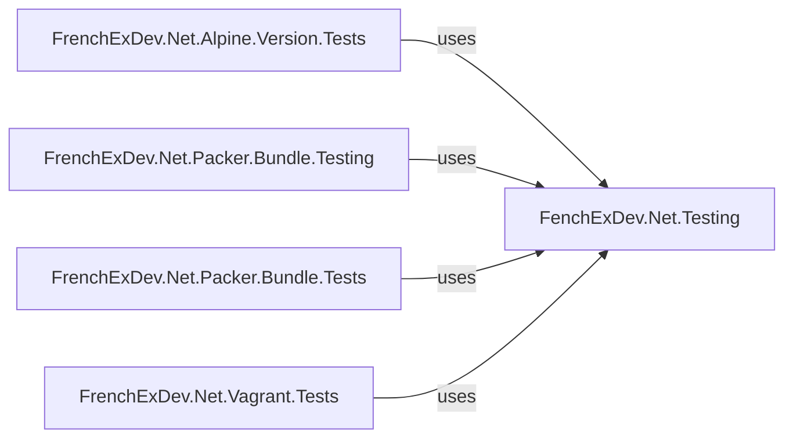


## Code Elements

### Classs

#### FeatureAttribute

**Type:** `class`
**Full Name:** `FeatureAttribute`
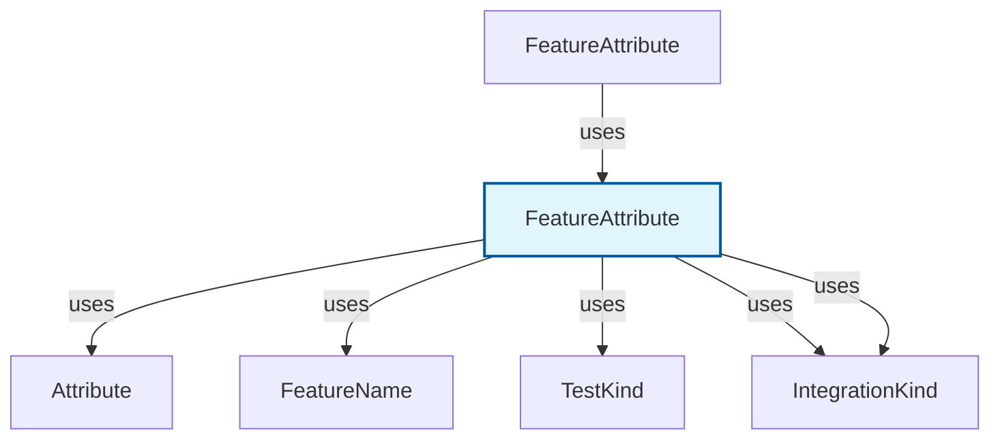

**Dependencies (Uses):**
- `Attribute`
- `FeatureName`
- `IntegrationKind`
- `IntegrationKind?`
- `TestKind`

**Used By:**
- `FenchExDev.Net.Testing.FeatureAttribute`


#### Integration

**Type:** `class`
**Full Name:** `Integration`

#### Internet

**Type:** `class`
**Full Name:** `Internet`

#### Kind

**Type:** `class`
**Full Name:** `Kind`

#### TestsUsing

**Type:** `class`
**Full Name:** `TestsUsing<TCommandTester>`
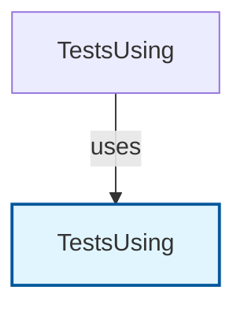

**Used By:**
- `FenchExDev.Net.Testing.TestsUsing`


### Enums

#### IntegrationKind

**Type:** `enum`
**Full Name:** `IntegrationKind`
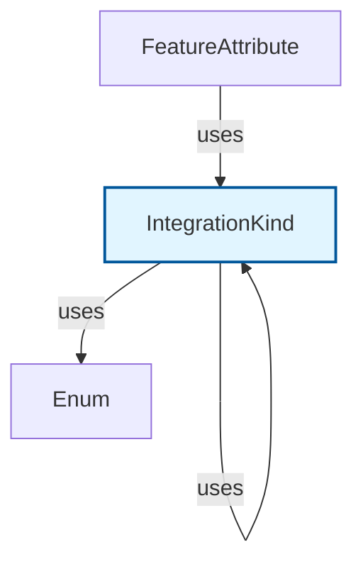

**Dependencies (Uses):**
- `Enum`
- `IntegrationKind`

**Used By:**
- `FenchExDev.Net.Testing.FeatureAttribute`


#### TestKind

**Type:** `enum`
**Full Name:** `TestKind`
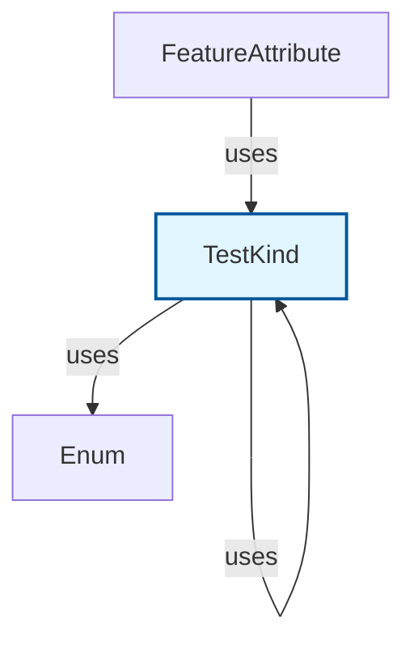

**Dependencies (Uses):**
- `Enum`
- `TestKind`

**Used By:**
- `FenchExDev.Net.Testing.FeatureAttribute`


### Records

#### FeatureName

**Type:** `record`
**Full Name:** `FeatureName`
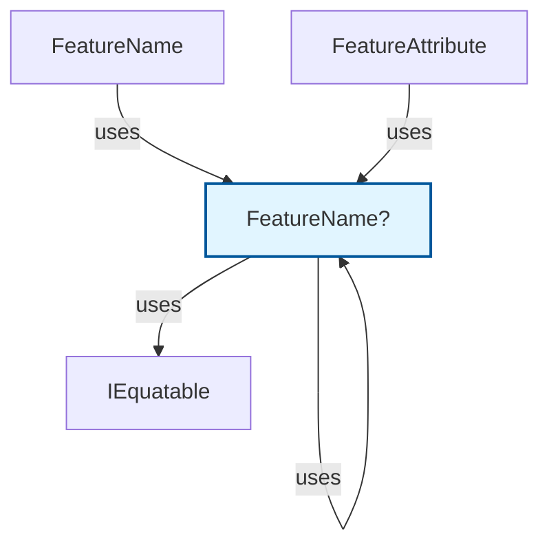

**Dependencies (Uses):**
- `FeatureName`
- `FeatureName?`
- `IEquatable<FeatureName>`

**Used By:**
- `FenchExDev.Net.Testing.FeatureAttribute`
- `FenchExDev.Net.Testing.FeatureName`


# Project: FrenchExDev.Net.Alpine.Version

**Path:** `C:\code\FrenchExDev.Net\FrenchExDev.Net_i2\FrenchExDev.Net\Alpine\src\FrenchExDev.Net.Alpine.Version\FrenchExDev.Net.Alpine.Version.csproj`
**Public Elements:** 14
### Project Dependencies
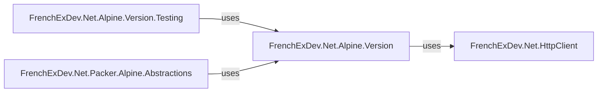


## Code Elements

### Classs

#### AlpineVersion

**Type:** `class`
**Full Name:** `AlpineVersion`
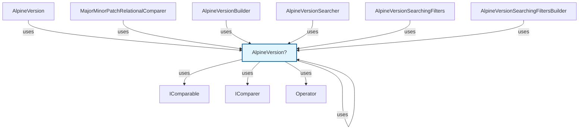

**Dependencies (Uses):**
- `AlpineVersion`
- `AlpineVersion?`
- `IComparable<AlpineVersion>`
- `IComparer<AlpineVersion>`
- `Operator`

**Used By:**
- `FrenchExDev.Net.Alpine.Version.AlpineVersion`
- `FrenchExDev.Net.Alpine.Version.AlpineVersionBuilder`
- `FrenchExDev.Net.Alpine.Version.AlpineVersionSearcher`
- `FrenchExDev.Net.Alpine.Version.AlpineVersionSearchingFilters`
- `FrenchExDev.Net.Alpine.Version.AlpineVersionSearchingFiltersBuilder`
- `FrenchExDev.Net.Alpine.Version.MajorMinorPatchRelationalComparer`


#### AlpineVersionBuilder

**Type:** `class`
**Full Name:** `AlpineVersionBuilder`
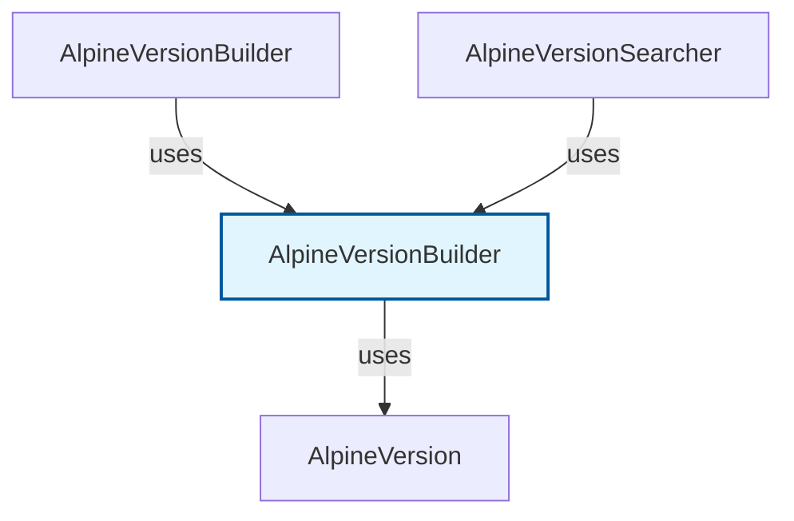

**Dependencies (Uses):**
- `AlpineVersion`

**Used By:**
- `FrenchExDev.Net.Alpine.Version.AlpineVersionBuilder`
- `FrenchExDev.Net.Alpine.Version.AlpineVersionSearcher`


#### AlpineVersionList

**Type:** `class`
**Full Name:** `AlpineVersionList`
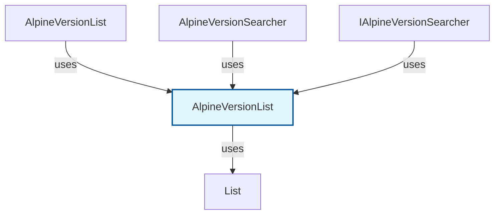

**Dependencies (Uses):**
- `List<AlpineVersionArchFlavorRecord>`

**Used By:**
- `FrenchExDev.Net.Alpine.Version.AlpineVersionList`
- `FrenchExDev.Net.Alpine.Version.AlpineVersionSearcher`
- `FrenchExDev.Net.Alpine.Version.IAlpineVersionSearcher`


#### AlpineVersionSearcher

**Type:** `class`
**Full Name:** `AlpineVersionSearcher`
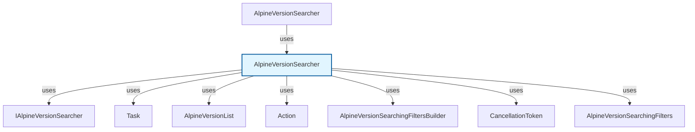

**Dependencies (Uses):**
- `Action<AlpineVersionSearchingFiltersBuilder>`
- `AlpineVersionList`
- `AlpineVersionSearchingFilters`
- `AlpineVersionSearchingFiltersBuilder`
- `CancellationToken`
- `IAlpineVersionSearcher`
- `Task<AlpineVersionList>`

**Used By:**
- `FrenchExDev.Net.Alpine.Version.AlpineVersionSearcher`


#### AlpineVersionSearchingFilters

**Type:** `class`
**Full Name:** `AlpineVersionSearchingFilters`
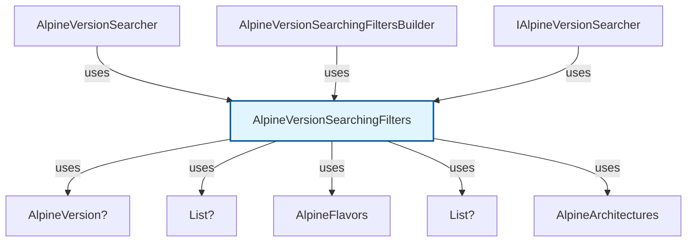

**Dependencies (Uses):**
- `AlpineArchitectures`
- `AlpineFlavors`
- `AlpineVersion?`
- `List<AlpineArchitectures>?`
- `List<AlpineFlavors>?`

**Used By:**
- `FrenchExDev.Net.Alpine.Version.AlpineVersionSearcher`
- `FrenchExDev.Net.Alpine.Version.AlpineVersionSearchingFiltersBuilder`
- `FrenchExDev.Net.Alpine.Version.IAlpineVersionSearcher`


#### AlpineVersionSearchingFiltersBuilder

**Type:** `class`
**Full Name:** `AlpineVersionSearchingFiltersBuilder`
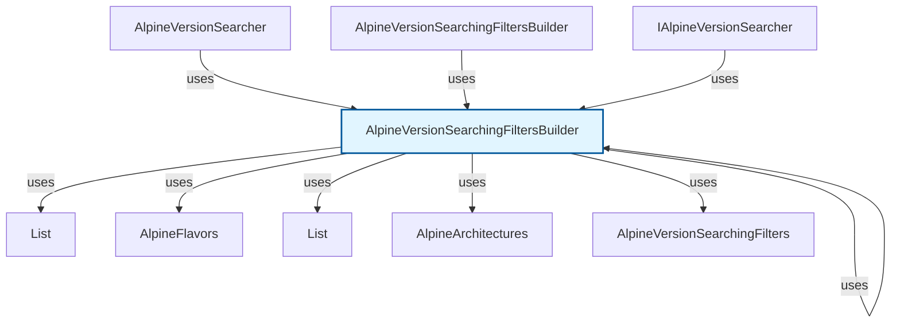

**Dependencies (Uses):**
- `AlpineArchitectures`
- `AlpineFlavors`
- `AlpineVersionSearchingFilters`
- `AlpineVersionSearchingFiltersBuilder`
- `List<AlpineArchitectures>`
- `List<AlpineFlavors>`

**Used By:**
- `FrenchExDev.Net.Alpine.Version.AlpineVersionSearcher`
- `FrenchExDev.Net.Alpine.Version.AlpineVersionSearchingFiltersBuilder`
- `FrenchExDev.Net.Alpine.Version.IAlpineVersionSearcher`


#### MajorMinorPatchRelationalComparer

**Type:** `class`
**Full Name:** `MajorMinorPatchRelationalComparer`
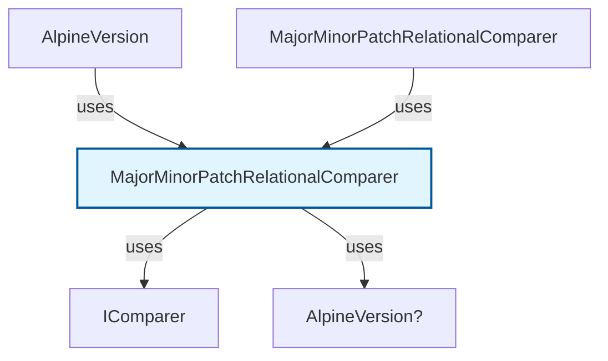

**Dependencies (Uses):**
- `AlpineVersion?`
- `IComparer<AlpineVersion>`

**Used By:**
- `FrenchExDev.Net.Alpine.Version.AlpineVersion`
- `FrenchExDev.Net.Alpine.Version.MajorMinorPatchRelationalComparer`


### Enums

#### AlpineArchitectures

**Type:** `enum`
**Full Name:** `AlpineArchitectures`
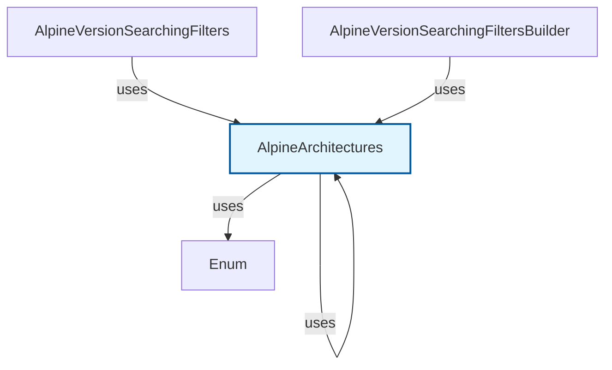

**Dependencies (Uses):**
- `AlpineArchitectures`
- `Enum`

**Used By:**
- `FrenchExDev.Net.Alpine.Version.AlpineVersionSearchingFilters`
- `FrenchExDev.Net.Alpine.Version.AlpineVersionSearchingFiltersBuilder`


#### AlpineFlavors

**Type:** `enum`
**Full Name:** `AlpineFlavors`
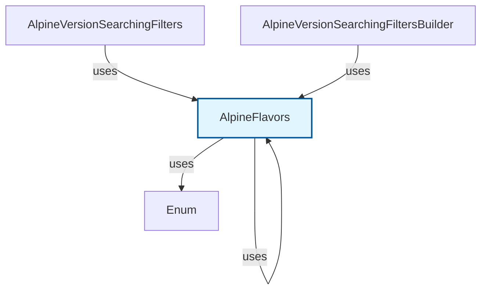

**Dependencies (Uses):**
- `AlpineFlavors`
- `Enum`

**Used By:**
- `FrenchExDev.Net.Alpine.Version.AlpineVersionSearchingFilters`
- `FrenchExDev.Net.Alpine.Version.AlpineVersionSearchingFiltersBuilder`


#### Operator

**Type:** `enum`
**Full Name:** `Operator`
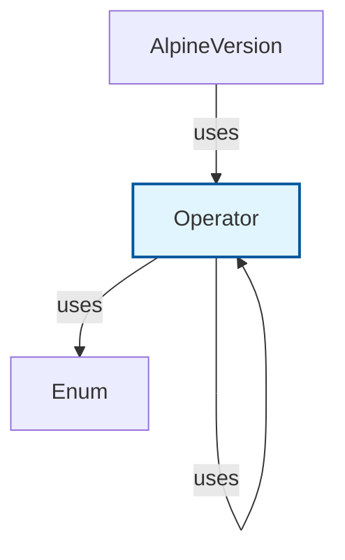

**Dependencies (Uses):**
- `Enum`
- `Operator`

**Used By:**
- `FrenchExDev.Net.Alpine.Version.AlpineVersion`


### Interfaces

#### IAlpineVersionSearcher

**Type:** `interface`
**Full Name:** `IAlpineVersionSearcher`
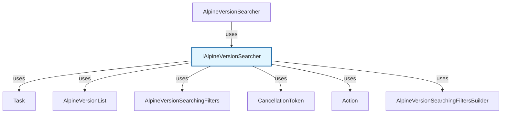

**Dependencies (Uses):**
- `Action<AlpineVersionSearchingFiltersBuilder>`
- `AlpineVersionList`
- `AlpineVersionSearchingFilters`
- `AlpineVersionSearchingFiltersBuilder`
- `CancellationToken`
- `Task<AlpineVersionList>`

**Used By:**
- `FrenchExDev.Net.Alpine.Version.AlpineVersionSearcher`


### Records

#### AlpineVersionArchFlavorRecord

**Type:** `record`
**Full Name:** `AlpineVersionArchFlavorRecord`
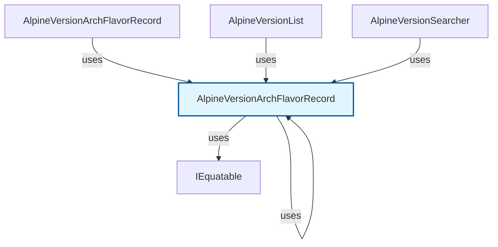

**Dependencies (Uses):**
- `AlpineVersionArchFlavorRecord`
- `AlpineVersionArchFlavorRecord?`
- `IEquatable<AlpineVersionArchFlavorRecord>`

**Used By:**
- `FrenchExDev.Net.Alpine.Version.AlpineVersionArchFlavorRecord`
- `FrenchExDev.Net.Alpine.Version.AlpineVersionList`
- `FrenchExDev.Net.Alpine.Version.AlpineVersionSearcher`


#### AlpineVersionArchRecord

**Type:** `record`
**Full Name:** `AlpineVersionArchRecord`
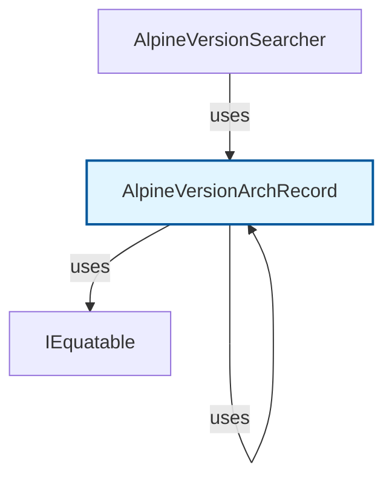

**Dependencies (Uses):**
- `AlpineVersionArchRecord`
- `AlpineVersionArchRecord?`
- `IEquatable<AlpineVersionArchRecord>`

**Used By:**
- `FrenchExDev.Net.Alpine.Version.AlpineVersionSearcher`


#### AlpineVersionRecord

**Type:** `record`
**Full Name:** `AlpineVersionRecord`
```mermaid
graph TD
  AlpineVersionRecord["AlpineVersionRecord"]
    style AlpineVersionRecord fill:#e1f5ff,stroke:#01579b,stroke-width:2px
  IEquatableAlpineVersionRecord["IEquatable<AlpineVersionRecord>"]
    AlpineVersionRecord -->|uses| IEquatableAlpineVersionRecord
  AlpineVersionRecord["AlpineVersionRecord?"]
    AlpineVersionRecord -->|uses| AlpineVersionRecord
  AlpineVersionRecord["AlpineVersionRecord"]
    AlpineVersionRecord -->|uses| AlpineVersionRecord
    FrenchExDev_Net_Alpine_Version_AlpineVersionSearcher["AlpineVersionSearcher"]
    FrenchExDev_Net_Alpine_Version_AlpineVersionSearcher -->|uses| AlpineVersionRecord
```

**Dependencies (Uses):**
- `AlpineVersionRecord`
- `AlpineVersionRecord?`
- `IEquatable<AlpineVersionRecord>`

**Used By:**
- `FrenchExDev.Net.Alpine.Version.AlpineVersionSearcher`


# Project: FrenchExDev.Net.Alpine.Version.Testing

**Path:** `C:\code\FrenchExDev.Net\FrenchExDev.Net_i2\FrenchExDev.Net\Alpine\src\FrenchExDev.Net.Alpine.Version.Testing\FrenchExDev.Net.Alpine.Version.Testing.csproj`
**Public Elements:** 1
### Project Dependencies
```mermaid
graph LR
    FrenchExDev_Net_Alpine_Version_Testing["FrenchExDev.Net.Alpine.Version.Testing"]
    FrenchExDev_Net_Alpine_Version_Testing -->|uses| FrenchExDev_Net_CSharp_Object_Builder2["FrenchExDev.Net.CSharp.Object.Builder2"]
    FrenchExDev_Net_Alpine_Version_Testing -->|uses| FrenchExDev_Net_HttpClient_Testing["FrenchExDev.Net.HttpClient.Testing"]
    FrenchExDev_Net_Alpine_Version_Testing -->|uses| FrenchExDev_Net_Alpine_Version["FrenchExDev.Net.Alpine.Version"]
    FrenchExDev_Net_Alpine_Version_Tests["FrenchExDev.Net.Alpine.Version.Tests"] -->|uses| FrenchExDev_Net_Alpine_Version_Testing
```


## Code Elements

### Classs

#### AlpineVersionSearcherTester

**Type:** `class`
**Full Name:** `AlpineVersionSearcherTester`
```mermaid
graph TD
  AlpineVersionSearcherTester["AlpineVersionSearcherTester"]
    style AlpineVersionSearcherTester fill:#e1f5ff,stroke:#01579b,stroke-width:2px
  Task["Task"]
    AlpineVersionSearcherTester -->|uses| Task
  IAlpineVersionSearcher["IAlpineVersionSearcher"]
    AlpineVersionSearcherTester -->|uses| IAlpineVersionSearcher
  ActionAlpineVersionSearchingFiltersBuilder["Action<AlpineVersionSearchingFiltersBuilder>"]
    AlpineVersionSearcherTester -->|uses| ActionAlpineVersionSearchingFiltersBuilder
  AlpineVersionSearchingFiltersBuilder["AlpineVersionSearchingFiltersBuilder"]
    AlpineVersionSearcherTester -->|uses| AlpineVersionSearchingFiltersBuilder
  ActionAlpineVersionList["Action<AlpineVersionList>"]
    AlpineVersionSearcherTester -->|uses| ActionAlpineVersionList
  AlpineVersionList["AlpineVersionList"]
    AlpineVersionSearcherTester -->|uses| AlpineVersionList
  CancellationToken["CancellationToken"]
    AlpineVersionSearcherTester -->|uses| CancellationToken
  ActionFakeHttpClientBuilder["Action<FakeHttpClientBuilder>"]
    AlpineVersionSearcherTester -->|uses| ActionFakeHttpClientBuilder
  FakeHttpClientBuilder["FakeHttpClientBuilder"]
    AlpineVersionSearcherTester -->|uses| FakeHttpClientBuilder
    FrenchExDev_Net_Alpine_Version_Testing_AlpineVersionSearcherTester["AlpineVersionSearcherTester"]
    FrenchExDev_Net_Alpine_Version_Testing_AlpineVersionSearcherTester -->|uses| AlpineVersionSearcherTester
```

**Dependencies (Uses):**
- `Action<AlpineVersionList>`
- `Action<AlpineVersionSearchingFiltersBuilder>`
- `Action<FakeHttpClientBuilder>`
- `AlpineVersionList`
- `AlpineVersionSearchingFiltersBuilder`
- `CancellationToken`
- `FakeHttpClientBuilder`
- `IAlpineVersionSearcher`
- `Task`

**Used By:**
- `FrenchExDev.Net.Alpine.Version.Testing.AlpineVersionSearcherTester`


# Project: FrenchExDev.Net.Alpine.Version.Tests

**Path:** `C:\code\FrenchExDev.Net\FrenchExDev.Net_i2\FrenchExDev.Net\Alpine\test\FrenchExDev.Net.Alpine.Version.Tests\FrenchExDev.Net.Alpine.Version.Tests.csproj`
**Public Elements:** 2
### Project Dependencies
```mermaid
graph LR
    FrenchExDev_Net_Alpine_Version_Tests["FrenchExDev.Net.Alpine.Version.Tests"]
    FrenchExDev_Net_Alpine_Version_Tests -->|uses| FrenchExDev_Net_CSharp_Object_Builder2["FrenchExDev.Net.CSharp.Object.Builder2"]
    FrenchExDev_Net_Alpine_Version_Tests -->|uses| FenchExDev_Net_Testing["FenchExDev.Net.Testing"]
    FrenchExDev_Net_Alpine_Version_Tests -->|uses| FrenchExDev_Net_Alpine_Version_Testing["FrenchExDev.Net.Alpine.Version.Testing"]
```


## Code Elements

### Classs

#### AlpineVersionComparerTests

**Type:** `class`
**Full Name:** `AlpineVersionComparerTests`
```mermaid
graph TD
  AlpineVersionComparerTests["AlpineVersionComparerTests"]
    style AlpineVersionComparerTests fill:#e1f5ff,stroke:#01579b,stroke-width:2px
  Operator["Operator"]
    AlpineVersionComparerTests -->|uses| Operator
    FrenchExDev_Net_Alpine_Version_Tests_AlpineVersionComparerTests["AlpineVersionComparerTests"]
    FrenchExDev_Net_Alpine_Version_Tests_AlpineVersionComparerTests -->|uses| AlpineVersionComparerTests
```

**Dependencies (Uses):**
- `Operator`

**Used By:**
- `FrenchExDev.Net.Alpine.Version.Tests.AlpineVersionComparerTests`


#### AlpineVersionSearcherTests

**Type:** `class`
**Full Name:** `AlpineVersionSearcherTests`
```mermaid
graph TD
  AlpineVersionSearcherTests["AlpineVersionSearcherTests"]
    style AlpineVersionSearcherTests fill:#e1f5ff,stroke:#01579b,stroke-width:2px
  Task["Task"]
    AlpineVersionSearcherTests -->|uses| Task
  AlpineFlavors["AlpineFlavors"]
    AlpineVersionSearcherTests -->|uses| AlpineFlavors
  AlpineArchitectures["AlpineArchitectures"]
    AlpineVersionSearcherTests -->|uses| AlpineArchitectures
    FrenchExDev_Net_Alpine_Version_Tests_AlpineVersionSearcherTests["AlpineVersionSearcherTests"]
    FrenchExDev_Net_Alpine_Version_Tests_AlpineVersionSearcherTests -->|uses| AlpineVersionSearcherTests
```

**Dependencies (Uses):**
- `AlpineArchitectures`
- `AlpineFlavors`
- `Task`

**Used By:**
- `FrenchExDev.Net.Alpine.Version.Tests.AlpineVersionSearcherTests`


# Project: FrenchExDev.Net.CSharp.ManagedDictionary

**Path:** `C:\code\FrenchExDev.Net\FrenchExDev.Net_i2\FrenchExDev.Net\CSharp.ManagedDictionary\src\FrenchExDev.Net.CSharp.ManagedDictionary\FrenchExDev.Net.CSharp.ManagedDictionary.csproj`
**Public Elements:** 7
### Project Dependencies
```mermaid
graph LR
    FrenchExDev_Net_CSharp_ManagedDictionary["FrenchExDev.Net.CSharp.ManagedDictionary"]
    FrenchExDev_Net_CSharp_ManagedDictionary_Testing["FrenchExDev.Net.CSharp.ManagedDictionary.Testing"] -->|uses| FrenchExDev_Net_CSharp_ManagedDictionary
    FrenchExDev_Net_CSharp_ProjectDependency_Abstractions["FrenchExDev.Net.CSharp.ProjectDependency.Abstractions"] -->|uses| FrenchExDev_Net_CSharp_ManagedDictionary
    FrenchExDev_Net_CSharp_ProjectDependency2["FrenchExDev.Net.CSharp.ProjectDependency2"] -->|uses| FrenchExDev_Net_CSharp_ManagedDictionary
```


## Code Elements

### Classs

#### ClosedManagedDictionary

**Type:** `class`
**Full Name:** `ClosedManagedDictionary<TKey, TValue>`
```mermaid
graph TD
  ClosedManagedDictionaryTKeyTValue["ClosedManagedDictionary"]
    style ClosedManagedDictionaryTKeyTValue fill:#e1f5ff,stroke:#01579b,stroke-width:2px
  ManagedDictionaryTKeyTValue["ManagedDictionary<TKey, TValue>"]
    ClosedManagedDictionaryTKeyTValue -->|uses| ManagedDictionaryTKeyTValue
    FrenchExDev_Net_CSharp_ManagedDictionary_ClosedManagedDictionary["ClosedManagedDictionary"]
    FrenchExDev_Net_CSharp_ManagedDictionary_ClosedManagedDictionary -->|uses| ClosedManagedDictionaryTKeyTValue
```

**Dependencies (Uses):**
- `ManagedDictionary<TKey, TValue>`

**Used By:**
- `FrenchExDev.Net.CSharp.ManagedDictionary.ClosedManagedDictionary`


#### ManagedDictionary

**Type:** `class`
**Full Name:** `ManagedDictionary<TKey, TValue>`
```mermaid
graph TD
  ManagedDictionaryTKeyTValue["ManagedDictionary"]
    style ManagedDictionaryTKeyTValue fill:#e1f5ff,stroke:#01579b,stroke-width:2px
  IDictionaryTKeyTValue["IDictionary<TKey, TValue>"]
    ManagedDictionaryTKeyTValue -->|uses| IDictionaryTKeyTValue
  IReadOnlyDictionaryTKeyTValue["IReadOnlyDictionary<TKey, TValue>"]
    ManagedDictionaryTKeyTValue -->|uses| IReadOnlyDictionaryTKeyTValue
  ICollectionTKey["ICollection<TKey>"]
    ManagedDictionaryTKeyTValue -->|uses| ICollectionTKey
  ICollectionTValue["ICollection<TValue>"]
    ManagedDictionaryTKeyTValue -->|uses| ICollectionTValue
  KeyValuePairTKeyTValue["KeyValuePair<TKey, TValue>"]
    ManagedDictionaryTKeyTValue -->|uses| KeyValuePairTKeyTValue
  IEnumeratorKeyValuePairTKeyTValue["IEnumerator<KeyValuePair<TKey, TValue>>"]
    ManagedDictionaryTKeyTValue -->|uses| IEnumeratorKeyValuePairTKeyTValue
    FrenchExDev_Net_CSharp_ManagedDictionary_ManagedDictionary["ManagedDictionary"]
    FrenchExDev_Net_CSharp_ManagedDictionary_ManagedDictionary -->|uses| ManagedDictionaryTKeyTValue
```

**Dependencies (Uses):**
- `ICollection<TKey>`
- `ICollection<TValue>`
- `IDictionary<TKey, TValue>`
- `IEnumerator<KeyValuePair<TKey, TValue>>`
- `IReadOnlyDictionary<TKey, TValue>`
- `KeyValuePair<TKey, TValue>`

**Used By:**
- `FrenchExDev.Net.CSharp.ManagedDictionary.ManagedDictionary`


#### ManagedDictionaryBuilder

**Type:** `class`
**Full Name:** `ManagedDictionaryBuilder<TKey, TValue>`
```mermaid
graph TD
  ManagedDictionaryBuilderTKeyTValue["ManagedDictionaryBuilder"]
    style ManagedDictionaryBuilderTKeyTValue fill:#e1f5ff,stroke:#01579b,stroke-width:2px
  IDictionaryTKeyTValue["IDictionary<TKey, TValue>"]
    ManagedDictionaryBuilderTKeyTValue -->|uses| IDictionaryTKeyTValue
  ManagedDictionaryBuilderTKeyTValue["ManagedDictionaryBuilder<TKey, TValue>"]
    ManagedDictionaryBuilderTKeyTValue -->|uses| ManagedDictionaryBuilderTKeyTValue
  ActionTKeyTValue["Action<TKey, TValue>"]
    ManagedDictionaryBuilderTKeyTValue -->|uses| ActionTKeyTValue
  Action["Action"]
    ManagedDictionaryBuilderTKeyTValue -->|uses| Action
  ManagedDictionaryTKeyTValue["ManagedDictionary<TKey, TValue>"]
    ManagedDictionaryBuilderTKeyTValue -->|uses| ManagedDictionaryTKeyTValue
  ClosedManagedDictionaryTKeyTValue["ClosedManagedDictionary<TKey, TValue>"]
    ManagedDictionaryBuilderTKeyTValue -->|uses| ClosedManagedDictionaryTKeyTValue
    FrenchExDev_Net_CSharp_ManagedDictionary_ManagedDictionaryBuilder["ManagedDictionaryBuilder"]
    FrenchExDev_Net_CSharp_ManagedDictionary_ManagedDictionaryBuilder -->|uses| ManagedDictionaryBuilderTKeyTValue
```

**Dependencies (Uses):**
- `Action`
- `Action<TKey, TValue>`
- `ClosedManagedDictionary<TKey, TValue>`
- `IDictionary<TKey, TValue>`
- `ManagedDictionary<TKey, TValue>`
- `ManagedDictionaryBuilder<TKey, TValue>`

**Used By:**
- `FrenchExDev.Net.CSharp.ManagedDictionary.ManagedDictionaryBuilder`


#### OnAddList

**Type:** `class`
**Full Name:** `OnAddList<TKey, TValue>`
```mermaid
graph TD
  OnAddListTKeyTValue["OnAddList"]
    style OnAddListTKeyTValue fill:#e1f5ff,stroke:#01579b,stroke-width:2px
  ListActionTKeyTValue["List<Action<TKey, TValue>>"]
    OnAddListTKeyTValue -->|uses| ListActionTKeyTValue
    FrenchExDev_Net_CSharp_ManagedDictionary_OnAddList["OnAddList"]
    FrenchExDev_Net_CSharp_ManagedDictionary_OnAddList -->|uses| OnAddListTKeyTValue
```

**Dependencies (Uses):**
- `List<Action<TKey, TValue>>`

**Used By:**
- `FrenchExDev.Net.CSharp.ManagedDictionary.OnAddList`


#### OnClearList

**Type:** `class`
**Full Name:** `OnClearList`
```mermaid
graph TD
  OnClearList["OnClearList"]
    style OnClearList fill:#e1f5ff,stroke:#01579b,stroke-width:2px
  ListAction["List<Action>"]
    OnClearList -->|uses| ListAction
    FrenchExDev_Net_CSharp_ManagedDictionary_ManagedDictionaryBuilder["ManagedDictionaryBuilder"]
    FrenchExDev_Net_CSharp_ManagedDictionary_ManagedDictionaryBuilder -->|uses| OnClearList
    FrenchExDev_Net_CSharp_ManagedDictionary_OpenManagedDictionary["OpenManagedDictionary"]
    FrenchExDev_Net_CSharp_ManagedDictionary_OpenManagedDictionary -->|uses| OnClearList
    FrenchExDev_Net_CSharp_ManagedDictionary_ClosedManagedDictionary["ClosedManagedDictionary"]
    FrenchExDev_Net_CSharp_ManagedDictionary_ClosedManagedDictionary -->|uses| OnClearList
    FrenchExDev_Net_CSharp_ManagedDictionary_ManagedDictionary["ManagedDictionary"]
    FrenchExDev_Net_CSharp_ManagedDictionary_ManagedDictionary -->|uses| OnClearList
```

**Dependencies (Uses):**
- `List<Action>`

**Used By:**
- `FrenchExDev.Net.CSharp.ManagedDictionary.ClosedManagedDictionary`
- `FrenchExDev.Net.CSharp.ManagedDictionary.ManagedDictionary`
- `FrenchExDev.Net.CSharp.ManagedDictionary.ManagedDictionaryBuilder`
- `FrenchExDev.Net.CSharp.ManagedDictionary.OpenManagedDictionary`


#### OnRemoveList

**Type:** `class`
**Full Name:** `OnRemoveList<TKey, TValue>`
```mermaid
graph TD
  OnRemoveListTKeyTValue["OnRemoveList"]
    style OnRemoveListTKeyTValue fill:#e1f5ff,stroke:#01579b,stroke-width:2px
  ListActionTKeyTValue["List<Action<TKey, TValue>>"]
    OnRemoveListTKeyTValue -->|uses| ListActionTKeyTValue
    FrenchExDev_Net_CSharp_ManagedDictionary_OnRemoveList["OnRemoveList"]
    FrenchExDev_Net_CSharp_ManagedDictionary_OnRemoveList -->|uses| OnRemoveListTKeyTValue
```

**Dependencies (Uses):**
- `List<Action<TKey, TValue>>`

**Used By:**
- `FrenchExDev.Net.CSharp.ManagedDictionary.OnRemoveList`


#### OpenManagedDictionary

**Type:** `class`
**Full Name:** `OpenManagedDictionary<TKey, TValue>`
```mermaid
graph TD
  OpenManagedDictionaryTKeyTValue["OpenManagedDictionary"]
    style OpenManagedDictionaryTKeyTValue fill:#e1f5ff,stroke:#01579b,stroke-width:2px
  ManagedDictionaryTKeyTValue["ManagedDictionary<TKey, TValue>"]
    OpenManagedDictionaryTKeyTValue -->|uses| ManagedDictionaryTKeyTValue
  OpenManagedDictionaryTKeyTValue["OpenManagedDictionary<TKey, TValue>"]
    OpenManagedDictionaryTKeyTValue -->|uses| OpenManagedDictionaryTKeyTValue
  ActionTKeyTValue["Action<TKey, TValue>"]
    OpenManagedDictionaryTKeyTValue -->|uses| ActionTKeyTValue
  Action["Action"]
    OpenManagedDictionaryTKeyTValue -->|uses| Action
    FrenchExDev_Net_CSharp_ManagedDictionary_OpenManagedDictionary["OpenManagedDictionary"]
    FrenchExDev_Net_CSharp_ManagedDictionary_OpenManagedDictionary -->|uses| OpenManagedDictionaryTKeyTValue
```

**Dependencies (Uses):**
- `Action`
- `Action<TKey, TValue>`
- `ManagedDictionary<TKey, TValue>`
- `OpenManagedDictionary<TKey, TValue>`

**Used By:**
- `FrenchExDev.Net.CSharp.ManagedDictionary.OpenManagedDictionary`


# Project: FrenchExDev.Net.CSharp.ManagedDictionary.Testing

**Path:** `C:\code\FrenchExDev.Net\FrenchExDev.Net_i2\FrenchExDev.Net\CSharp.ManagedDictionary\src\FrenchExDev.Net.CSharp.ManagedDictionary.Testing\FrenchExDev.Net.CSharp.ManagedDictionary.Testing.csproj`
**Public Elements:** 1
### Project Dependencies
```mermaid
graph LR
    FrenchExDev_Net_CSharp_ManagedDictionary_Testing["FrenchExDev.Net.CSharp.ManagedDictionary.Testing"]
    FrenchExDev_Net_CSharp_ManagedDictionary_Testing -->|uses| FrenchExDev_Net_CSharp_ManagedDictionary["FrenchExDev.Net.CSharp.ManagedDictionary"]
    FrenchExDev_Net_CSharp_ManagedDictionary_Tests["FrenchExDev.Net.CSharp.ManagedDictionary.Tests"] -->|uses| FrenchExDev_Net_CSharp_ManagedDictionary_Testing
```


## Code Elements

### Classs

#### Class1

**Type:** `class`
**Full Name:** `Class1`

# Project: FrenchExDev.Net.CSharp.ManagedDictionary.Tests

**Path:** `C:\code\FrenchExDev.Net\FrenchExDev.Net_i2\FrenchExDev.Net\CSharp.ManagedDictionary\test\FrenchExDev.Net.CSharp.ManagedDictionary.Tests\FrenchExDev.Net.CSharp.ManagedDictionary.Tests.csproj`
**Public Elements:** 1
### Project Dependencies
```mermaid
graph LR
    FrenchExDev_Net_CSharp_ManagedDictionary_Tests["FrenchExDev.Net.CSharp.ManagedDictionary.Tests"]
    FrenchExDev_Net_CSharp_ManagedDictionary_Tests -->|uses| FrenchExDev_Net_CSharp_ManagedDictionary_Testing["FrenchExDev.Net.CSharp.ManagedDictionary.Testing"]
```


## Code Elements

### Classs

#### UnitTest1

**Type:** `class`
**Full Name:** `UnitTest1`

# Project: FrenchExDev.Net.CSharp.ManagedList

**Path:** `C:\code\FrenchExDev.Net\FrenchExDev.Net_i2\FrenchExDev.Net\CSharp.ManagedList\src\FrenchExDev.Net.CSharp.ManagedList\FrenchExDev.Net.CSharp.ManagedList.csproj`
**Public Elements:** 7
### Project Dependencies
```mermaid
graph LR
    FrenchExDev_Net_CSharp_ManagedList["FrenchExDev.Net.CSharp.ManagedList"]
    FrenchExDev_Net_CSharp_ManagedList_Testing["FrenchExDev.Net.CSharp.ManagedList.Testing"] -->|uses| FrenchExDev_Net_CSharp_ManagedList
    FrenchExDev_Net_CSharp_SolutionEngineering["FrenchExDev.Net.CSharp.SolutionEngineering"] -->|uses| FrenchExDev_Net_CSharp_ManagedList
    FrenchExDev_Net_CSharp_ProjectDependency["FrenchExDev.Net.CSharp.ProjectDependency"] -->|uses| FrenchExDev_Net_CSharp_ManagedList
    FrenchExDev_Net_CSharp_ProjectDependency_Abstractions["FrenchExDev.Net.CSharp.ProjectDependency.Abstractions"] -->|uses| FrenchExDev_Net_CSharp_ManagedList
    FrenchExDev_Net_CSharp_ProjectDependency2["FrenchExDev.Net.CSharp.ProjectDependency2"] -->|uses| FrenchExDev_Net_CSharp_ManagedList
    FrenchExDev_Net_CSharp_ProjectDependency3["FrenchExDev.Net.CSharp.ProjectDependency3"] -->|uses| FrenchExDev_Net_CSharp_ManagedList
    FrenchExDev_Net_CSharp_ProjectDependency4_Core["FrenchExDev.Net.CSharp.ProjectDependency4.Core"] -->|uses| FrenchExDev_Net_CSharp_ManagedList
```


## Code Elements

### Classs

#### ClosedManagedList

**Type:** `class`
**Full Name:** `ClosedManagedList<T>`
```mermaid
graph TD
  ClosedManagedListT["ClosedManagedList"]
    style ClosedManagedListT fill:#e1f5ff,stroke:#01579b,stroke-width:2px
  ManagedListT["ManagedList<T>"]
    ClosedManagedListT -->|uses| ManagedListT
    FrenchExDev_Net_CSharp_ManagedList_ClosedManagedList["ClosedManagedList"]
    FrenchExDev_Net_CSharp_ManagedList_ClosedManagedList -->|uses| ClosedManagedListT
```

**Dependencies (Uses):**
- `ManagedList<T>`

**Used By:**
- `FrenchExDev.Net.CSharp.ManagedList.ClosedManagedList`


#### ManagedList

**Type:** `class`
**Full Name:** `ManagedList<T>`
```mermaid
graph TD
  ManagedListT["ManagedList"]
    style ManagedListT fill:#e1f5ff,stroke:#01579b,stroke-width:2px
  IListT["IList<T>"]
    ManagedListT -->|uses| IListT
  IEnumeratorT["IEnumerator<T>"]
    ManagedListT -->|uses| IEnumeratorT
    FrenchExDev_Net_CSharp_ManagedList_ManagedList["ManagedList"]
    FrenchExDev_Net_CSharp_ManagedList_ManagedList -->|uses| ManagedListT
```

**Dependencies (Uses):**
- `IEnumerator<T>`
- `IList<T>`

**Used By:**
- `FrenchExDev.Net.CSharp.ManagedList.ManagedList`


#### ManagedListBuilder

**Type:** `class`
**Full Name:** `ManagedListBuilder<T>`
```mermaid
graph TD
  ManagedListBuilderT["ManagedListBuilder"]
    style ManagedListBuilderT fill:#e1f5ff,stroke:#01579b,stroke-width:2px
  ManagedListBuilderT["ManagedListBuilder<T>"]
    ManagedListBuilderT -->|uses| ManagedListBuilderT
  ActionT["Action<T>"]
    ManagedListBuilderT -->|uses| ActionT
  ClosedManagedListT["ClosedManagedList<T>"]
    ManagedListBuilderT -->|uses| ClosedManagedListT
  OpenManagedListT["OpenManagedList<T>"]
    ManagedListBuilderT -->|uses| OpenManagedListT
    FrenchExDev_Net_CSharp_ManagedList_ManagedListBuilder["ManagedListBuilder"]
    FrenchExDev_Net_CSharp_ManagedList_ManagedListBuilder -->|uses| ManagedListBuilderT
```

**Dependencies (Uses):**
- `Action<T>`
- `ClosedManagedList<T>`
- `ManagedListBuilder<T>`
- `OpenManagedList<T>`

**Used By:**
- `FrenchExDev.Net.CSharp.ManagedList.ManagedListBuilder`


#### OnAddList

**Type:** `class`
**Full Name:** `OnAddList<T>`
```mermaid
graph TD
  OnAddListT["OnAddList"]
    style OnAddListT fill:#e1f5ff,stroke:#01579b,stroke-width:2px
  ListActionT["List<Action<T>>"]
    OnAddListT -->|uses| ListActionT
    FrenchExDev_Net_CSharp_ManagedList_OnAddList["OnAddList"]
    FrenchExDev_Net_CSharp_ManagedList_OnAddList -->|uses| OnAddListT
```

**Dependencies (Uses):**
- `List<Action<T>>`

**Used By:**
- `FrenchExDev.Net.CSharp.ManagedList.OnAddList`


#### onClearList

**Type:** `class`
**Full Name:** `onClearList<T>`
```mermaid
graph TD
  onClearListT["onClearList"]
    style onClearListT fill:#e1f5ff,stroke:#01579b,stroke-width:2px
  ListActionT["List<Action<T>>"]
    onClearListT -->|uses| ListActionT
    FrenchExDev_Net_CSharp_ManagedList_onClearList["onClearList"]
    FrenchExDev_Net_CSharp_ManagedList_onClearList -->|uses| onClearListT
```

**Dependencies (Uses):**
- `List<Action<T>>`

**Used By:**
- `FrenchExDev.Net.CSharp.ManagedList.onClearList`


#### OnRemoveList

**Type:** `class`
**Full Name:** `OnRemoveList<T>`
```mermaid
graph TD
  OnRemoveListT["OnRemoveList"]
    style OnRemoveListT fill:#e1f5ff,stroke:#01579b,stroke-width:2px
  ListActionT["List<Action<T>>"]
    OnRemoveListT -->|uses| ListActionT
    FrenchExDev_Net_CSharp_ManagedList_OnRemoveList["OnRemoveList"]
    FrenchExDev_Net_CSharp_ManagedList_OnRemoveList -->|uses| OnRemoveListT
```

**Dependencies (Uses):**
- `List<Action<T>>`

**Used By:**
- `FrenchExDev.Net.CSharp.ManagedList.OnRemoveList`


#### OpenManagedList

**Type:** `class`
**Full Name:** `OpenManagedList<T>`
```mermaid
graph TD
  OpenManagedListT["OpenManagedList"]
    style OpenManagedListT fill:#e1f5ff,stroke:#01579b,stroke-width:2px
  ManagedListT["ManagedList<T>"]
    OpenManagedListT -->|uses| ManagedListT
  OpenManagedListT["OpenManagedList<T>"]
    OpenManagedListT -->|uses| OpenManagedListT
  ActionT["Action<T>"]
    OpenManagedListT -->|uses| ActionT
    FrenchExDev_Net_CSharp_ManagedList_OpenManagedList["OpenManagedList"]
    FrenchExDev_Net_CSharp_ManagedList_OpenManagedList -->|uses| OpenManagedListT
```

**Dependencies (Uses):**
- `Action<T>`
- `ManagedList<T>`
- `OpenManagedList<T>`

**Used By:**
- `FrenchExDev.Net.CSharp.ManagedList.OpenManagedList`


# Project: FrenchExDev.Net.CSharp.ManagedList.Testing

**Path:** `C:\code\FrenchExDev.Net\FrenchExDev.Net_i2\FrenchExDev.Net\CSharp.ManagedList\src\FrenchExDev.Net.CSharp.ManagedList.Testing\FrenchExDev.Net.CSharp.ManagedList.Testing.csproj`
**Public Elements:** 1
### Project Dependencies
```mermaid
graph LR
    FrenchExDev_Net_CSharp_ManagedList_Testing["FrenchExDev.Net.CSharp.ManagedList.Testing"]
    FrenchExDev_Net_CSharp_ManagedList_Testing -->|uses| FrenchExDev_Net_CSharp_ManagedList["FrenchExDev.Net.CSharp.ManagedList"]
    FrenchExDev_Net_CSharp_ManagedList_Tests["FrenchExDev.Net.CSharp.ManagedList.Tests"] -->|uses| FrenchExDev_Net_CSharp_ManagedList_Testing
```


## Code Elements

### Classs

#### ManagedListTester

**Type:** `class`
**Full Name:** `ManagedListTester`
```mermaid
graph TD
  ManagedListTester["ManagedListTester"]
    style ManagedListTester fill:#e1f5ff,stroke:#01579b,stroke-width:2px
  ActionManagedListBuilderT["Action<ManagedListBuilder<T>>"]
    ManagedListTester -->|uses| ActionManagedListBuilderT
  ManagedListBuilderT["ManagedListBuilder<T>"]
    ManagedListTester -->|uses| ManagedListBuilderT
  ActionClosedManagedListT["Action<ClosedManagedList<T>>"]
    ManagedListTester -->|uses| ActionClosedManagedListT
  ClosedManagedListT["ClosedManagedList<T>"]
    ManagedListTester -->|uses| ClosedManagedListT
  ActionOpenManagedListT["Action<OpenManagedList<T>>"]
    ManagedListTester -->|uses| ActionOpenManagedListT
  OpenManagedListT["OpenManagedList<T>"]
    ManagedListTester -->|uses| OpenManagedListT
    FrenchExDev_Net_CSharp_ManagedList_Testing_ManagedListTester["ManagedListTester"]
    FrenchExDev_Net_CSharp_ManagedList_Testing_ManagedListTester -->|uses| ManagedListTester
```

**Dependencies (Uses):**
- `Action<ClosedManagedList<T>>`
- `Action<ManagedListBuilder<T>>`
- `Action<OpenManagedList<T>>`
- `ClosedManagedList<T>`
- `ManagedListBuilder<T>`
- `OpenManagedList<T>`

**Used By:**
- `FrenchExDev.Net.CSharp.ManagedList.Testing.ManagedListTester`


# Project: FrenchExDev.Net.CSharp.ManagedList.Tests

**Path:** `C:\code\FrenchExDev.Net\FrenchExDev.Net_i2\FrenchExDev.Net\CSharp.ManagedList\test\FrenchExDev.Net.CSharp.ManagedList.Tests\FrenchExDev.Net.CSharp.ManagedList.Tests.csproj`
**Public Elements:** 1
### Project Dependencies
```mermaid
graph LR
    FrenchExDev_Net_CSharp_ManagedList_Tests["FrenchExDev.Net.CSharp.ManagedList.Tests"]
    FrenchExDev_Net_CSharp_ManagedList_Tests -->|uses| FrenchExDev_Net_CSharp_ManagedList_Testing["FrenchExDev.Net.CSharp.ManagedList.Testing"]
```


## Code Elements

### Classs

#### ManagedListTests

**Type:** `class`
**Full Name:** `ManagedListTests`
```mermaid
graph TD
  ManagedListTests["ManagedListTests"]
    style ManagedListTests fill:#e1f5ff,stroke:#01579b,stroke-width:2px
    FrenchExDev_Net_CSharp_ManagedList_Tests_ManagedListTests["ManagedListTests"]
    FrenchExDev_Net_CSharp_ManagedList_Tests_ManagedListTests -->|uses| ManagedListTests
```

**Used By:**
- `FrenchExDev.Net.CSharp.ManagedList.Tests.ManagedListTests`


# Project: FrenchExDev.Net.CSharp.Object.Biz

**Path:** `C:\code\FrenchExDev.Net\FrenchExDev.Net_i2\FrenchExDev.Net\Object.Biz\src\FrenchExDev.Net.CSharp.Object.Biz\FrenchExDev.Net.CSharp.Object.Biz.csproj`
**Public Elements:** 8
### Project Dependencies
```mermaid
graph LR
    FrenchExDev_Net_CSharp_Object_Biz["FrenchExDev.Net.CSharp.Object.Biz"]
    FrenchExDev_Net_CSharp_Object_Biz -->|uses| FrenchExDev_Net_CSharp_Object_Result["FrenchExDev.Net.CSharp.Object.Result"]
    FrenchExDev_Net_CSharp_Object_Biz_Testing["FrenchExDev.Net.CSharp.Object.Biz.Testing"] -->|uses| FrenchExDev_Net_CSharp_Object_Biz
```


## Code Elements

### Classs

#### Facet

**Type:** `class`
**Full Name:** `Facet`
```mermaid
graph TD
  Facet["Facet"]
    style Facet fill:#e1f5ff,stroke:#01579b,stroke-width:2px
    FrenchExDev_Net_CSharp_Object_Biz_Facet["Facet"]
    FrenchExDev_Net_CSharp_Object_Biz_Facet -->|uses| Facet
```

**Used By:**
- `FrenchExDev.Net.CSharp.Object.Biz.Facet`


#### FacetDictionary

**Type:** `class`
**Full Name:** `FacetDictionary`
```mermaid
graph TD
  FacetDictionary["FacetDictionary"]
    style FacetDictionary fill:#e1f5ff,stroke:#01579b,stroke-width:2px
  Dictionarystringobject["Dictionary<string, object>"]
    FacetDictionary -->|uses| Dictionarystringobject
    FrenchExDev_Net_CSharp_Object_Biz_FacetObject["FacetObject"]
    FrenchExDev_Net_CSharp_Object_Biz_FacetObject -->|uses| FacetDictionary
```

**Dependencies (Uses):**
- `Dictionary<string, object>`

**Used By:**
- `FrenchExDev.Net.CSharp.Object.Biz.FacetObject`


#### FacetDoesNotExistException

**Type:** `class`
**Full Name:** `FacetDoesNotExistException`
```mermaid
graph TD
  FacetDoesNotExistException["FacetDoesNotExistException"]
    style FacetDoesNotExistException fill:#e1f5ff,stroke:#01579b,stroke-width:2px
  Exception["Exception"]
    FacetDoesNotExistException -->|uses| Exception
    FrenchExDev_Net_CSharp_Object_Biz_FacetDoesNotExistException["FacetDoesNotExistException"]
    FrenchExDev_Net_CSharp_Object_Biz_FacetDoesNotExistException -->|uses| FacetDoesNotExistException
    FrenchExDev_Net_CSharp_Object_Biz_FacetObject["FacetObject"]
    FrenchExDev_Net_CSharp_Object_Biz_FacetObject -->|uses| FacetDoesNotExistException
```

**Dependencies (Uses):**
- `Exception`

**Used By:**
- `FrenchExDev.Net.CSharp.Object.Biz.FacetDoesNotExistException`
- `FrenchExDev.Net.CSharp.Object.Biz.FacetObject`


#### FacetObject

**Type:** `class`
**Full Name:** `FacetObject<TClass, TFacet>`
```mermaid
graph TD
  FacetObjectTClassTFacet["FacetObject"]
    style FacetObjectTClassTFacet fill:#e1f5ff,stroke:#01579b,stroke-width:2px
  ResultTFacet["Result<TFacet>"]
    FacetObjectTClassTFacet -->|uses| ResultTFacet
  FacetObjectTClassTFacet["FacetObject<TClass, TFacet>"]
    FacetObjectTClassTFacet -->|uses| FacetObjectTClassTFacet
    FrenchExDev_Net_CSharp_Object_Biz_FacetObject["FacetObject"]
    FrenchExDev_Net_CSharp_Object_Biz_FacetObject -->|uses| FacetObjectTClassTFacet
```

**Dependencies (Uses):**
- `FacetObject<TClass, TFacet>`
- `Result<TFacet>`

**Used By:**
- `FrenchExDev.Net.CSharp.Object.Biz.FacetObject`


#### FacetObject

**Type:** `class`
**Full Name:** `FacetObject`
```mermaid
graph TD
  FacetObject["FacetObject"]
    style FacetObject fill:#e1f5ff,stroke:#01579b,stroke-width:2px
  ResultTFacet["Result<TFacet>"]
    FacetObject -->|uses| ResultTFacet
  FacetObject["FacetObject"]
    FacetObject -->|uses| FacetObject
    FrenchExDev_Net_CSharp_Object_Biz_FacetObject["FacetObject"]
    FrenchExDev_Net_CSharp_Object_Biz_FacetObject -->|uses| FacetObject
```

**Dependencies (Uses):**
- `FacetObject`
- `Result<TFacet>`

**Used By:**
- `FrenchExDev.Net.CSharp.Object.Biz.FacetObject`


### Interfaces

#### IFacet

**Type:** `interface`
**Full Name:** `IFacet`
```mermaid
graph TD
  IFacet["IFacet"]
    style IFacet fill:#e1f5ff,stroke:#01579b,stroke-width:2px
    FrenchExDev_Net_CSharp_Object_Biz_IGenericFacet["IGenericFacet"]
    FrenchExDev_Net_CSharp_Object_Biz_IGenericFacet -->|uses| IFacet
    FrenchExDev_Net_CSharp_Object_Biz_FacetObject["FacetObject"]
    FrenchExDev_Net_CSharp_Object_Biz_FacetObject -->|uses| IFacet
```

**Used By:**
- `FrenchExDev.Net.CSharp.Object.Biz.FacetObject`
- `FrenchExDev.Net.CSharp.Object.Biz.IGenericFacet`


#### IGenericFacet

**Type:** `interface`
**Full Name:** `IGenericFacet<TClass>`
```mermaid
graph TD
  IGenericFacetTClass["IGenericFacet"]
    style IGenericFacetTClass fill:#e1f5ff,stroke:#01579b,stroke-width:2px
  IFacet["IFacet"]
    IGenericFacetTClass -->|uses| IFacet
    FrenchExDev_Net_CSharp_Object_Biz_IGenericFacet["IGenericFacet"]
    FrenchExDev_Net_CSharp_Object_Biz_IGenericFacet -->|uses| IGenericFacetTClass
```

**Dependencies (Uses):**
- `IFacet`

**Used By:**
- `FrenchExDev.Net.CSharp.Object.Biz.IGenericFacet`


#### ISpecificFacet

**Type:** `interface`
**Full Name:** `ISpecificFacet`
```mermaid
graph TD
  ISpecificFacet["ISpecificFacet"]
    style ISpecificFacet fill:#e1f5ff,stroke:#01579b,stroke-width:2px
    FrenchExDev_Net_CSharp_Object_Biz_ISpecificFacet["ISpecificFacet"]
    FrenchExDev_Net_CSharp_Object_Biz_ISpecificFacet -->|uses| ISpecificFacet
```

**Used By:**
- `FrenchExDev.Net.CSharp.Object.Biz.ISpecificFacet`


# Project: FrenchExDev.Net.CSharp.Object.Biz.Testing

**Path:** `C:\code\FrenchExDev.Net\FrenchExDev.Net_i2\FrenchExDev.Net\Object.Biz\src\FrenchExDev.Net.CSharp.Object.Biz.Testing\FrenchExDev.Net.CSharp.Object.Biz.Testing.csproj`
**Public Elements:** 1
### Project Dependencies
```mermaid
graph LR
    FrenchExDev_Net_CSharp_Object_Biz_Testing["FrenchExDev.Net.CSharp.Object.Biz.Testing"]
    FrenchExDev_Net_CSharp_Object_Biz_Testing -->|uses| FrenchExDev_Net_CSharp_Object_Biz["FrenchExDev.Net.CSharp.Object.Biz"]
    FrenchExDev_Net_CSharp_Object_Biz_Tests["FrenchExDev.Net.CSharp.Object.Biz.Tests"] -->|uses| FrenchExDev_Net_CSharp_Object_Biz_Testing
```


## Code Elements

### Classs

#### Code

**Type:** `class`
**Full Name:** `Code`

# Project: FrenchExDev.Net.CSharp.Object.Biz.Tests

**Path:** `C:\code\FrenchExDev.Net\FrenchExDev.Net_i2\FrenchExDev.Net\Object.Biz\test\FrenchExDev.Net.CSharp.Object.Biz.Tests\FrenchExDev.Net.CSharp.Object.Biz.Tests.csproj`
**Public Elements:** 2
### Project Dependencies
```mermaid
graph LR
    FrenchExDev_Net_CSharp_Object_Biz_Tests["FrenchExDev.Net.CSharp.Object.Biz.Tests"]
    FrenchExDev_Net_CSharp_Object_Biz_Tests -->|uses| FrenchExDev_Net_CSharp_Object_Result["FrenchExDev.Net.CSharp.Object.Result"]
    FrenchExDev_Net_CSharp_Object_Biz_Tests -->|uses| FrenchExDev_Net_CSharp_Object_Biz_Testing["FrenchExDev.Net.CSharp.Object.Biz.Testing"]
```


## Code Elements

### Classs

#### FacetObjectGenericTests

**Type:** `class`
**Full Name:** `FacetObjectGenericTests`
```mermaid
graph TD
  FacetObjectGenericTests["FacetObjectGenericTests"]
    style FacetObjectGenericTests fill:#e1f5ff,stroke:#01579b,stroke-width:2px
    FrenchExDev_Net_CSharp_Object_Biz_Tests_ICarFacet["ICarFacet"]
    FrenchExDev_Net_CSharp_Object_Biz_Tests_ICarFacet -->|uses| FacetObjectGenericTests
    FrenchExDev_Net_CSharp_Object_Biz_Tests_Car["Car"]
    FrenchExDev_Net_CSharp_Object_Biz_Tests_Car -->|uses| FacetObjectGenericTests
    FrenchExDev_Net_CSharp_Object_Biz_Tests_CarFacet["CarFacet"]
    FrenchExDev_Net_CSharp_Object_Biz_Tests_CarFacet -->|uses| FacetObjectGenericTests
    FrenchExDev_Net_CSharp_Object_Biz_Tests_FacetObjectGenericTests["FacetObjectGenericTests"]
    FrenchExDev_Net_CSharp_Object_Biz_Tests_FacetObjectGenericTests -->|uses| FacetObjectGenericTests
```

**Used By:**
- `FrenchExDev.Net.CSharp.Object.Biz.Tests.Car`
- `FrenchExDev.Net.CSharp.Object.Biz.Tests.CarFacet`
- `FrenchExDev.Net.CSharp.Object.Biz.Tests.FacetObjectGenericTests`
- `FrenchExDev.Net.CSharp.Object.Biz.Tests.ICarFacet`


#### FacetObjectTests

**Type:** `class`
**Full Name:** `FacetObjectTests`
```mermaid
graph TD
  FacetObjectTests["FacetObjectTests"]
    style FacetObjectTests fill:#e1f5ff,stroke:#01579b,stroke-width:2px
    FrenchExDev_Net_CSharp_Object_Biz_Tests_FacetObjectTests["FacetObjectTests"]
    FrenchExDev_Net_CSharp_Object_Biz_Tests_FacetObjectTests -->|uses| FacetObjectTests
```

**Used By:**
- `FrenchExDev.Net.CSharp.Object.Biz.Tests.FacetObjectTests`


# Project: FrenchExDev.Net.CSharp.Object.Builder2

**Path:** `C:\code\FrenchExDev.Net\FrenchExDev.Net_i2\FrenchExDev.Net\CSharp.Object.Builder2\src\FrenchExDev.Net.CSharp.Object.Builder2\FrenchExDev.Net.CSharp.Object.Builder2.csproj`
**Public Elements:** 20
### Project Dependencies
```mermaid
graph LR
    FrenchExDev_Net_CSharp_Object_Builder2["FrenchExDev.Net.CSharp.Object.Builder2"]
    FrenchExDev_Net_Mm_Abstractions["FrenchExDev.Net.Mm.Abstractions"] -->|uses| FrenchExDev_Net_CSharp_Object_Builder2
    FrenchExDev_Net_Dotnet_Project_Abstractions["FrenchExDev.Net.Dotnet.Project.Abstractions"] -->|uses| FrenchExDev_Net_CSharp_Object_Builder2
    FrenchExDev_Net_Alpine_Version_Testing["FrenchExDev.Net.Alpine.Version.Testing"] -->|uses| FrenchExDev_Net_CSharp_Object_Builder2
    FrenchExDev_Net_Alpine_Version_Tests["FrenchExDev.Net.Alpine.Version.Tests"] -->|uses| FrenchExDev_Net_CSharp_Object_Builder2
    FrenchExDev_Net_CSharp_Object_Model_Abstractions["FrenchExDev.Net.CSharp.Object.Model.Abstractions"] -->|uses| FrenchExDev_Net_CSharp_Object_Builder2
    FrenchExDev_Net_Ssh_Config["FrenchExDev.Net.Ssh.Config"] -->|uses| FrenchExDev_Net_CSharp_Object_Builder2
    FrenchExDev_Net_Packer_Bundle["FrenchExDev.Net.Packer.Bundle"] -->|uses| FrenchExDev_Net_CSharp_Object_Builder2
    FrenchExDev_Net_CSharp_Object_Builder2_Testing["FrenchExDev.Net.CSharp.Object.Builder2.Testing"] -->|uses| FrenchExDev_Net_CSharp_Object_Builder2
    FrenchExDev_Net_HttpClient_Testing["FrenchExDev.Net.HttpClient.Testing"] -->|uses| FrenchExDev_Net_CSharp_Object_Builder2
    FrenchExDev_Net_Vagrant["FrenchExDev.Net.Vagrant"] -->|uses| FrenchExDev_Net_CSharp_Object_Builder2
```


## Code Elements

### Classs

#### AbstractBuilder

**Type:** `class`
**Full Name:** `AbstractBuilder<TClass>`
```mermaid
graph TD
  AbstractBuilderTClass["AbstractBuilder"]
    style AbstractBuilderTClass fill:#e1f5ff,stroke:#01579b,stroke-width:2px
  IBuilderTClass["IBuilder<TClass>"]
    AbstractBuilderTClass -->|uses| IBuilderTClass
  Guid["Guid"]
    AbstractBuilderTClass -->|uses| Guid
  ReferenceTClass["Reference<TClass>"]
    AbstractBuilderTClass -->|uses| ReferenceTClass
  IResult["IResult?"]
    AbstractBuilderTClass -->|uses| IResult
  ValidationStatus["ValidationStatus"]
    AbstractBuilderTClass -->|uses| ValidationStatus
  BuildStatus["BuildStatus"]
    AbstractBuilderTClass -->|uses| BuildStatus
  IResult["IResult"]
    AbstractBuilderTClass -->|uses| IResult
  VisitedObjectDictionary["VisitedObjectDictionary?"]
    AbstractBuilderTClass -->|uses| VisitedObjectDictionary
  VisitedObjectDictionary["VisitedObjectDictionary"]
    AbstractBuilderTClass -->|uses| VisitedObjectDictionary
  FailuresDictionary["FailuresDictionary"]
    AbstractBuilderTClass -->|uses| FailuresDictionary
    FrenchExDev_Net_CSharp_Object_Builder2_AbstractBuilder["AbstractBuilder"]
    FrenchExDev_Net_CSharp_Object_Builder2_AbstractBuilder -->|uses| AbstractBuilderTClass
```

**Dependencies (Uses):**
- `BuildStatus`
- `FailuresDictionary`
- `Guid`
- `IBuilder<TClass>`
- `IResult`
- `IResult?`
- `Reference<TClass>`
- `ValidationStatus`
- `VisitedObjectDictionary`
- `VisitedObjectDictionary?`

**Used By:**
- `FrenchExDev.Net.CSharp.Object.Builder2.AbstractBuilder`


#### BuilderList

**Type:** `class`
**Full Name:** `BuilderList<TClass, TBuilder>`
```mermaid
graph TD
  BuilderListTClassTBuilder["BuilderList"]
    style BuilderListTClassTBuilder fill:#e1f5ff,stroke:#01579b,stroke-width:2px
  ListTBuilder["List<TBuilder>"]
    BuilderListTClassTBuilder -->|uses| ListTBuilder
  ReferenceListTClass["ReferenceList<TClass>"]
    BuilderListTClassTBuilder -->|uses| ReferenceListTClass
  BuilderListTClassTBuilder["BuilderList<TClass, TBuilder>"]
    BuilderListTClassTBuilder -->|uses| BuilderListTClassTBuilder
  ActionTBuilder["Action<TBuilder>"]
    BuilderListTClassTBuilder -->|uses| ActionTBuilder
  ListTClass["List<TClass>"]
    BuilderListTClassTBuilder -->|uses| ListTClass
  ListFailuresDictionary["List<FailuresDictionary>"]
    BuilderListTClassTBuilder -->|uses| ListFailuresDictionary
  FailuresDictionary["FailuresDictionary"]
    BuilderListTClassTBuilder -->|uses| FailuresDictionary
    FrenchExDev_Net_CSharp_Object_Builder2_BuilderList["BuilderList"]
    FrenchExDev_Net_CSharp_Object_Builder2_BuilderList -->|uses| BuilderListTClassTBuilder
```

**Dependencies (Uses):**
- `Action<TBuilder>`
- `BuilderList<TClass, TBuilder>`
- `FailuresDictionary`
- `List<FailuresDictionary>`
- `List<TBuilder>`
- `List<TClass>`
- `ReferenceList<TClass>`

**Used By:**
- `FrenchExDev.Net.CSharp.Object.Builder2.BuilderList`


#### BuildException

**Type:** `class`
**Full Name:** `BuildException`
```mermaid
graph TD
  BuildException["BuildException"]
    style BuildException fill:#e1f5ff,stroke:#01579b,stroke-width:2px
  Exception["Exception"]
    BuildException -->|uses| Exception
    FrenchExDev_Net_CSharp_Object_Builder2_BuildException["BuildException"]
    FrenchExDev_Net_CSharp_Object_Builder2_BuildException -->|uses| BuildException
    FrenchExDev_Net_CSharp_Object_Builder2_StringIsEmptyOrWhitespaceException["StringIsEmptyOrWhitespaceException"]
    FrenchExDev_Net_CSharp_Object_Builder2_StringIsEmptyOrWhitespaceException -->|uses| BuildException
    FrenchExDev_Net_CSharp_Object_Builder2_BuildFailedException["BuildFailedException"]
    FrenchExDev_Net_CSharp_Object_Builder2_BuildFailedException -->|uses| BuildException
    FrenchExDev_Net_CSharp_Object_Builder2_BuildSucceededException["BuildSucceededException"]
    FrenchExDev_Net_CSharp_Object_Builder2_BuildSucceededException -->|uses| BuildException
```

**Dependencies (Uses):**
- `Exception`

**Used By:**
- `FrenchExDev.Net.CSharp.Object.Builder2.BuildException`
- `FrenchExDev.Net.CSharp.Object.Builder2.BuildFailedException`
- `FrenchExDev.Net.CSharp.Object.Builder2.BuildSucceededException`
- `FrenchExDev.Net.CSharp.Object.Builder2.StringIsEmptyOrWhitespaceException`


#### BuildFailedException

**Type:** `class`
**Full Name:** `BuildFailedException`
```mermaid
graph TD
  BuildFailedException["BuildFailedException"]
    style BuildFailedException fill:#e1f5ff,stroke:#01579b,stroke-width:2px
  BuildException["BuildException"]
    BuildFailedException -->|uses| BuildException
  FailuresDictionary["FailuresDictionary"]
    BuildFailedException -->|uses| FailuresDictionary
    FrenchExDev_Net_CSharp_Object_Builder2_BuildFailedException["BuildFailedException"]
    FrenchExDev_Net_CSharp_Object_Builder2_BuildFailedException -->|uses| BuildFailedException
    FrenchExDev_Net_CSharp_Object_Builder2_Extensions["Extensions"]
    FrenchExDev_Net_CSharp_Object_Builder2_Extensions -->|uses| BuildFailedException
```

**Dependencies (Uses):**
- `BuildException`
- `FailuresDictionary`

**Used By:**
- `FrenchExDev.Net.CSharp.Object.Builder2.BuildFailedException`
- `FrenchExDev.Net.CSharp.Object.Builder2.Extensions`


#### BuildSucceededException

**Type:** `class`
**Full Name:** `BuildSucceededException`
```mermaid
graph TD
  BuildSucceededException["BuildSucceededException"]
    style BuildSucceededException fill:#e1f5ff,stroke:#01579b,stroke-width:2px
  BuildException["BuildException"]
    BuildSucceededException -->|uses| BuildException
    FrenchExDev_Net_CSharp_Object_Builder2_BuildSucceededException["BuildSucceededException"]
    FrenchExDev_Net_CSharp_Object_Builder2_BuildSucceededException -->|uses| BuildSucceededException
    FrenchExDev_Net_CSharp_Object_Builder2_Extensions["Extensions"]
    FrenchExDev_Net_CSharp_Object_Builder2_Extensions -->|uses| BuildSucceededException
```

**Dependencies (Uses):**
- `BuildException`

**Used By:**
- `FrenchExDev.Net.CSharp.Object.Builder2.BuildSucceededException`
- `FrenchExDev.Net.CSharp.Object.Builder2.Extensions`


#### Extensions

**Type:** `class`
**Full Name:** `Extensions`
```mermaid
graph TD
  Extensions["Extensions"]
    style Extensions fill:#e1f5ff,stroke:#01579b,stroke-width:2px
  IResult["IResult"]
    Extensions -->|uses| IResult
  FailuresDictionary["FailuresDictionary"]
    Extensions -->|uses| FailuresDictionary
    FrenchExDev_Net_CSharp_Object_Builder2_Extensions["Extensions"]
    FrenchExDev_Net_CSharp_Object_Builder2_Extensions -->|uses| Extensions
    FrenchExDev_Net_CSharp_Object_Builder2_BuilderList["BuilderList"]
    FrenchExDev_Net_CSharp_Object_Builder2_BuilderList -->|uses| Extensions
```

**Dependencies (Uses):**
- `FailuresDictionary`
- `IResult`

**Used By:**
- `FrenchExDev.Net.CSharp.Object.Builder2.BuilderList`
- `FrenchExDev.Net.CSharp.Object.Builder2.Extensions`


#### FailureResult

**Type:** `class`
**Full Name:** `FailureResult`
```mermaid
graph TD
  FailureResult["FailureResult"]
    style FailureResult fill:#e1f5ff,stroke:#01579b,stroke-width:2px
  IResult["IResult"]
    FailureResult -->|uses| IResult
  FailuresDictionary["FailuresDictionary"]
    FailureResult -->|uses| FailuresDictionary
    FrenchExDev_Net_CSharp_Object_Builder2_FailureResult["FailureResult"]
    FrenchExDev_Net_CSharp_Object_Builder2_FailureResult -->|uses| FailureResult
    FrenchExDev_Net_CSharp_Object_Builder2_AbstractBuilder["AbstractBuilder"]
    FrenchExDev_Net_CSharp_Object_Builder2_AbstractBuilder -->|uses| FailureResult
    FrenchExDev_Net_CSharp_Object_Builder2_Extensions["Extensions"]
    FrenchExDev_Net_CSharp_Object_Builder2_Extensions -->|uses| FailureResult
```

**Dependencies (Uses):**
- `FailuresDictionary`
- `IResult`

**Used By:**
- `FrenchExDev.Net.CSharp.Object.Builder2.AbstractBuilder`
- `FrenchExDev.Net.CSharp.Object.Builder2.Extensions`
- `FrenchExDev.Net.CSharp.Object.Builder2.FailureResult`


#### FailuresDictionary

**Type:** `class`
**Full Name:** `FailuresDictionary`
```mermaid
graph TD
  FailuresDictionary["FailuresDictionary"]
    style FailuresDictionary fill:#e1f5ff,stroke:#01579b,stroke-width:2px
  DictionarystringListFailure["Dictionary<string, List<Failure>>"]
    FailuresDictionary -->|uses| DictionarystringListFailure
  FailuresDictionary["FailuresDictionary"]
    FailuresDictionary -->|uses| FailuresDictionary
  Failure["Failure"]
    FailuresDictionary -->|uses| Failure
    FrenchExDev_Net_CSharp_Object_Builder2_Failure["Failure"]
    FrenchExDev_Net_CSharp_Object_Builder2_Failure -->|uses| FailuresDictionary
    FrenchExDev_Net_CSharp_Object_Builder2_FailuresDictionary["FailuresDictionary"]
    FrenchExDev_Net_CSharp_Object_Builder2_FailuresDictionary -->|uses| FailuresDictionary
    FrenchExDev_Net_CSharp_Object_Builder2_FailureResult["FailureResult"]
    FrenchExDev_Net_CSharp_Object_Builder2_FailureResult -->|uses| FailuresDictionary
    FrenchExDev_Net_CSharp_Object_Builder2_IBuilder["IBuilder"]
    FrenchExDev_Net_CSharp_Object_Builder2_IBuilder -->|uses| FailuresDictionary
    FrenchExDev_Net_CSharp_Object_Builder2_AbstractBuilder["AbstractBuilder"]
    FrenchExDev_Net_CSharp_Object_Builder2_AbstractBuilder -->|uses| FailuresDictionary
    FrenchExDev_Net_CSharp_Object_Builder2_BuildFailedException["BuildFailedException"]
    FrenchExDev_Net_CSharp_Object_Builder2_BuildFailedException -->|uses| FailuresDictionary
    FrenchExDev_Net_CSharp_Object_Builder2_Extensions["Extensions"]
    FrenchExDev_Net_CSharp_Object_Builder2_Extensions -->|uses| FailuresDictionary
    FrenchExDev_Net_CSharp_Object_Builder2_BuilderList["BuilderList"]
    FrenchExDev_Net_CSharp_Object_Builder2_BuilderList -->|uses| FailuresDictionary
```

**Dependencies (Uses):**
- `Dictionary<string, List<Failure>>`
- `Failure`
- `FailuresDictionary`

**Used By:**
- `FrenchExDev.Net.CSharp.Object.Builder2.AbstractBuilder`
- `FrenchExDev.Net.CSharp.Object.Builder2.BuilderList`
- `FrenchExDev.Net.CSharp.Object.Builder2.BuildFailedException`
- `FrenchExDev.Net.CSharp.Object.Builder2.Extensions`
- `FrenchExDev.Net.CSharp.Object.Builder2.Failure`
- `FrenchExDev.Net.CSharp.Object.Builder2.FailureResult`
- `FrenchExDev.Net.CSharp.Object.Builder2.FailuresDictionary`
- `FrenchExDev.Net.CSharp.Object.Builder2.IBuilder`


#### NotResolvedException

**Type:** `class`
**Full Name:** `NotResolvedException`
```mermaid
graph TD
  NotResolvedException["NotResolvedException"]
    style NotResolvedException fill:#e1f5ff,stroke:#01579b,stroke-width:2px
  Exception["Exception"]
    NotResolvedException -->|uses| Exception
    FrenchExDev_Net_CSharp_Object_Builder2_NotResolvedException["NotResolvedException"]
    FrenchExDev_Net_CSharp_Object_Builder2_NotResolvedException -->|uses| NotResolvedException
    FrenchExDev_Net_CSharp_Object_Builder2_Reference["Reference"]
    FrenchExDev_Net_CSharp_Object_Builder2_Reference -->|uses| NotResolvedException
    FrenchExDev_Net_CSharp_Object_Builder2_ReferenceList["ReferenceList"]
    FrenchExDev_Net_CSharp_Object_Builder2_ReferenceList -->|uses| NotResolvedException
```

**Dependencies (Uses):**
- `Exception`

**Used By:**
- `FrenchExDev.Net.CSharp.Object.Builder2.NotResolvedException`
- `FrenchExDev.Net.CSharp.Object.Builder2.Reference`
- `FrenchExDev.Net.CSharp.Object.Builder2.ReferenceList`


#### ReferenceList

**Type:** `class`
**Full Name:** `ReferenceList<TClass>`
```mermaid
graph TD
  ReferenceListTClass["ReferenceList"]
    style ReferenceListTClass fill:#e1f5ff,stroke:#01579b,stroke-width:2px
  IReferenceListTClass["IReferenceList<TClass>"]
    ReferenceListTClass -->|uses| IReferenceListTClass
  IEnumerableTClass["IEnumerable<TClass>"]
    ReferenceListTClass -->|uses| IEnumerableTClass
  ReferenceTClass["Reference<TClass>"]
    ReferenceListTClass -->|uses| ReferenceTClass
  IQueryableTClass["IQueryable<TClass>"]
    ReferenceListTClass -->|uses| IQueryableTClass
  FuncTClassbool["Func<TClass, bool>"]
    ReferenceListTClass -->|uses| FuncTClassbool
  IEnumerableTOtherClass["IEnumerable<TOtherClass>"]
    ReferenceListTClass -->|uses| IEnumerableTOtherClass
  FuncTClassTOtherClass["Func<TClass, TOtherClass>"]
    ReferenceListTClass -->|uses| FuncTClassTOtherClass
  IEnumeratorTClass["IEnumerator<TClass>"]
    ReferenceListTClass -->|uses| IEnumeratorTClass
    FrenchExDev_Net_CSharp_Object_Builder2_ReferenceList["ReferenceList"]
    FrenchExDev_Net_CSharp_Object_Builder2_ReferenceList -->|uses| ReferenceListTClass
```

**Dependencies (Uses):**
- `Func<TClass, bool>`
- `Func<TClass, TOtherClass>`
- `IEnumerable<TClass>`
- `IEnumerable<TOtherClass>`
- `IEnumerator<TClass>`
- `IQueryable<TClass>`
- `IReferenceList<TClass>`
- `Reference<TClass>`

**Used By:**
- `FrenchExDev.Net.CSharp.Object.Builder2.ReferenceList`


#### StringIsEmptyOrWhitespaceException

**Type:** `class`
**Full Name:** `StringIsEmptyOrWhitespaceException`
```mermaid
graph TD
  StringIsEmptyOrWhitespaceException["StringIsEmptyOrWhitespaceException"]
    style StringIsEmptyOrWhitespaceException fill:#e1f5ff,stroke:#01579b,stroke-width:2px
  BuildException["BuildException"]
    StringIsEmptyOrWhitespaceException -->|uses| BuildException
    FrenchExDev_Net_CSharp_Object_Builder2_StringIsEmptyOrWhitespaceException["StringIsEmptyOrWhitespaceException"]
    FrenchExDev_Net_CSharp_Object_Builder2_StringIsEmptyOrWhitespaceException -->|uses| StringIsEmptyOrWhitespaceException
```

**Dependencies (Uses):**
- `BuildException`

**Used By:**
- `FrenchExDev.Net.CSharp.Object.Builder2.StringIsEmptyOrWhitespaceException`


#### SuccessResult

**Type:** `class`
**Full Name:** `SuccessResult<TClass>`
```mermaid
graph TD
  SuccessResultTClass["SuccessResult"]
    style SuccessResultTClass fill:#e1f5ff,stroke:#01579b,stroke-width:2px
  IResult["IResult"]
    SuccessResultTClass -->|uses| IResult
    FrenchExDev_Net_CSharp_Object_Builder2_SuccessResult["SuccessResult"]
    FrenchExDev_Net_CSharp_Object_Builder2_SuccessResult -->|uses| SuccessResultTClass
```

**Dependencies (Uses):**
- `IResult`

**Used By:**
- `FrenchExDev.Net.CSharp.Object.Builder2.SuccessResult`


#### VisitedObjectDictionary

**Type:** `class`
**Full Name:** `VisitedObjectDictionary`
```mermaid
graph TD
  VisitedObjectDictionary["VisitedObjectDictionary"]
    style VisitedObjectDictionary fill:#e1f5ff,stroke:#01579b,stroke-width:2px
  DictionaryGuidobject["Dictionary<Guid, object>"]
    VisitedObjectDictionary -->|uses| DictionaryGuidobject
    FrenchExDev_Net_CSharp_Object_Builder2_IBuilder["IBuilder"]
    FrenchExDev_Net_CSharp_Object_Builder2_IBuilder -->|uses| VisitedObjectDictionary
    FrenchExDev_Net_CSharp_Object_Builder2_AbstractBuilder["AbstractBuilder"]
    FrenchExDev_Net_CSharp_Object_Builder2_AbstractBuilder -->|uses| VisitedObjectDictionary
    FrenchExDev_Net_CSharp_Object_Builder2_BuilderList["BuilderList"]
    FrenchExDev_Net_CSharp_Object_Builder2_BuilderList -->|uses| VisitedObjectDictionary
```

**Dependencies (Uses):**
- `Dictionary<Guid, object>`

**Used By:**
- `FrenchExDev.Net.CSharp.Object.Builder2.AbstractBuilder`
- `FrenchExDev.Net.CSharp.Object.Builder2.BuilderList`
- `FrenchExDev.Net.CSharp.Object.Builder2.IBuilder`


### Enums

#### BuildStatus

**Type:** `enum`
**Full Name:** `BuildStatus`
```mermaid
graph TD
  BuildStatus["BuildStatus"]
    style BuildStatus fill:#e1f5ff,stroke:#01579b,stroke-width:2px
  Enum["Enum"]
    BuildStatus -->|uses| Enum
  BuildStatus["BuildStatus"]
    BuildStatus -->|uses| BuildStatus
    FrenchExDev_Net_CSharp_Object_Builder2_IBuilder["IBuilder"]
    FrenchExDev_Net_CSharp_Object_Builder2_IBuilder -->|uses| BuildStatus
    FrenchExDev_Net_CSharp_Object_Builder2_AbstractBuilder["AbstractBuilder"]
    FrenchExDev_Net_CSharp_Object_Builder2_AbstractBuilder -->|uses| BuildStatus
```

**Dependencies (Uses):**
- `BuildStatus`
- `Enum`

**Used By:**
- `FrenchExDev.Net.CSharp.Object.Builder2.AbstractBuilder`
- `FrenchExDev.Net.CSharp.Object.Builder2.IBuilder`


#### ValidationStatus

**Type:** `enum`
**Full Name:** `ValidationStatus`
```mermaid
graph TD
  ValidationStatus["ValidationStatus"]
    style ValidationStatus fill:#e1f5ff,stroke:#01579b,stroke-width:2px
  Enum["Enum"]
    ValidationStatus -->|uses| Enum
  ValidationStatus["ValidationStatus"]
    ValidationStatus -->|uses| ValidationStatus
    FrenchExDev_Net_CSharp_Object_Builder2_IBuilder["IBuilder"]
    FrenchExDev_Net_CSharp_Object_Builder2_IBuilder -->|uses| ValidationStatus
    FrenchExDev_Net_CSharp_Object_Builder2_AbstractBuilder["AbstractBuilder"]
    FrenchExDev_Net_CSharp_Object_Builder2_AbstractBuilder -->|uses| ValidationStatus
```

**Dependencies (Uses):**
- `Enum`
- `ValidationStatus`

**Used By:**
- `FrenchExDev.Net.CSharp.Object.Builder2.AbstractBuilder`
- `FrenchExDev.Net.CSharp.Object.Builder2.IBuilder`


### Interfaces

#### IBuilder

**Type:** `interface`
**Full Name:** `IBuilder<TClass>`
```mermaid
graph TD
  IBuilderTClass["IBuilder"]
    style IBuilderTClass fill:#e1f5ff,stroke:#01579b,stroke-width:2px
  Guid["Guid"]
    IBuilderTClass -->|uses| Guid
  IResult["IResult?"]
    IBuilderTClass -->|uses| IResult
  BuildStatus["BuildStatus"]
    IBuilderTClass -->|uses| BuildStatus
  ValidationStatus["ValidationStatus"]
    IBuilderTClass -->|uses| ValidationStatus
  VisitedObjectDictionary["VisitedObjectDictionary"]
    IBuilderTClass -->|uses| VisitedObjectDictionary
  FailuresDictionary["FailuresDictionary"]
    IBuilderTClass -->|uses| FailuresDictionary
  ReferenceTClass["Reference<TClass>"]
    IBuilderTClass -->|uses| ReferenceTClass
  IBuilderTClass["IBuilder<TClass>"]
    IBuilderTClass -->|uses| IBuilderTClass
  IResult["IResult"]
    IBuilderTClass -->|uses| IResult
  VisitedObjectDictionary["VisitedObjectDictionary?"]
    IBuilderTClass -->|uses| VisitedObjectDictionary
    FrenchExDev_Net_CSharp_Object_Builder2_IBuilder["IBuilder"]
    FrenchExDev_Net_CSharp_Object_Builder2_IBuilder -->|uses| IBuilderTClass
```

**Dependencies (Uses):**
- `BuildStatus`
- `FailuresDictionary`
- `Guid`
- `IBuilder<TClass>`
- `IResult`
- `IResult?`
- `Reference<TClass>`
- `ValidationStatus`
- `VisitedObjectDictionary`
- `VisitedObjectDictionary?`

**Used By:**
- `FrenchExDev.Net.CSharp.Object.Builder2.IBuilder`


#### IReferenceList

**Type:** `interface`
**Full Name:** `IReferenceList<TClass>`
```mermaid
graph TD
  IReferenceListTClass["IReferenceList"]
    style IReferenceListTClass fill:#e1f5ff,stroke:#01579b,stroke-width:2px
  IListTClass["IList<TClass>"]
    IReferenceListTClass -->|uses| IListTClass
  IEnumerableTClass["IEnumerable<TClass>"]
    IReferenceListTClass -->|uses| IEnumerableTClass
  IQueryableTClass["IQueryable<TClass>"]
    IReferenceListTClass -->|uses| IQueryableTClass
  FuncTClassbool["Func<TClass, bool>"]
    IReferenceListTClass -->|uses| FuncTClassbool
  ReferenceTClass["Reference<TClass>"]
    IReferenceListTClass -->|uses| ReferenceTClass
    FrenchExDev_Net_CSharp_Object_Builder2_IReferenceList["IReferenceList"]
    FrenchExDev_Net_CSharp_Object_Builder2_IReferenceList -->|uses| IReferenceListTClass
```

**Dependencies (Uses):**
- `Func<TClass, bool>`
- `IEnumerable<TClass>`
- `IList<TClass>`
- `IQueryable<TClass>`
- `Reference<TClass>`

**Used By:**
- `FrenchExDev.Net.CSharp.Object.Builder2.IReferenceList`


#### IResult

**Type:** `interface`
**Full Name:** `IResult`
```mermaid
graph TD
  IResult["IResult"]
    style IResult fill:#e1f5ff,stroke:#01579b,stroke-width:2px
    FrenchExDev_Net_CSharp_Object_Builder2_SuccessResult["SuccessResult"]
    FrenchExDev_Net_CSharp_Object_Builder2_SuccessResult -->|uses| IResult
    FrenchExDev_Net_CSharp_Object_Builder2_FailureResult["FailureResult"]
    FrenchExDev_Net_CSharp_Object_Builder2_FailureResult -->|uses| IResult
    FrenchExDev_Net_CSharp_Object_Builder2_IBuilder["IBuilder"]
    FrenchExDev_Net_CSharp_Object_Builder2_IBuilder -->|uses| IResult
    FrenchExDev_Net_CSharp_Object_Builder2_Reference["Reference"]
    FrenchExDev_Net_CSharp_Object_Builder2_Reference -->|uses| IResult
    FrenchExDev_Net_CSharp_Object_Builder2_AbstractBuilder["AbstractBuilder"]
    FrenchExDev_Net_CSharp_Object_Builder2_AbstractBuilder -->|uses| IResult
    FrenchExDev_Net_CSharp_Object_Builder2_Extensions["Extensions"]
    FrenchExDev_Net_CSharp_Object_Builder2_Extensions -->|uses| IResult
```

**Used By:**
- `FrenchExDev.Net.CSharp.Object.Builder2.AbstractBuilder`
- `FrenchExDev.Net.CSharp.Object.Builder2.Extensions`
- `FrenchExDev.Net.CSharp.Object.Builder2.FailureResult`
- `FrenchExDev.Net.CSharp.Object.Builder2.IBuilder`
- `FrenchExDev.Net.CSharp.Object.Builder2.Reference`
- `FrenchExDev.Net.CSharp.Object.Builder2.SuccessResult`


### Records

#### Reference

**Type:** `record`
**Full Name:** `Reference<TClass>`
```mermaid
graph TD
  ReferenceTClass["Reference"]
    style ReferenceTClass fill:#e1f5ff,stroke:#01579b,stroke-width:2px
  IResult["IResult"]
    ReferenceTClass -->|uses| IResult
  IEquatableReferenceTClass["IEquatable<Reference<TClass>>"]
    ReferenceTClass -->|uses| IEquatableReferenceTClass
  ReferenceTClass["Reference<TClass>"]
    ReferenceTClass -->|uses| ReferenceTClass
  ReferenceTClass["Reference<TClass>?"]
    ReferenceTClass -->|uses| ReferenceTClass
    FrenchExDev_Net_CSharp_Object_Builder2_Reference["Reference"]
    FrenchExDev_Net_CSharp_Object_Builder2_Reference -->|uses| ReferenceTClass
```

**Dependencies (Uses):**
- `IEquatable<Reference<TClass>>`
- `IResult`
- `Reference<TClass>`
- `Reference<TClass>?`

**Used By:**
- `FrenchExDev.Net.CSharp.Object.Builder2.Reference`


### Structs

#### Failure

**Type:** `struct`
**Full Name:** `Failure`
```mermaid
graph TD
  Failure["Failure"]
    style Failure fill:#e1f5ff,stroke:#01579b,stroke-width:2px
  ValueType["ValueType"]
    Failure -->|uses| ValueType
  IEquatableFailure["IEquatable<Failure>"]
    Failure -->|uses| IEquatableFailure
  Failure["Failure"]
    Failure -->|uses| Failure
  Exception["Exception"]
    Failure -->|uses| Exception
  FailuresDictionary["FailuresDictionary"]
    Failure -->|uses| FailuresDictionary
    FrenchExDev_Net_CSharp_Object_Builder2_Failure["Failure"]
    FrenchExDev_Net_CSharp_Object_Builder2_Failure -->|uses| Failure
    FrenchExDev_Net_CSharp_Object_Builder2_FailuresDictionary["FailuresDictionary"]
    FrenchExDev_Net_CSharp_Object_Builder2_FailuresDictionary -->|uses| Failure
    FrenchExDev_Net_CSharp_Object_Builder2_AbstractBuilder["AbstractBuilder"]
    FrenchExDev_Net_CSharp_Object_Builder2_AbstractBuilder -->|uses| Failure
```

**Dependencies (Uses):**
- `Exception`
- `Failure`
- `FailuresDictionary`
- `IEquatable<Failure>`
- `ValueType`

**Used By:**
- `FrenchExDev.Net.CSharp.Object.Builder2.AbstractBuilder`
- `FrenchExDev.Net.CSharp.Object.Builder2.Failure`
- `FrenchExDev.Net.CSharp.Object.Builder2.FailuresDictionary`


# Project: FrenchExDev.Net.CSharp.Object.Builder2.Testing

**Path:** `C:\code\FrenchExDev.Net\FrenchExDev.Net_i2\FrenchExDev.Net\CSharp.Object.Builder2\src\FrenchExDev.Net.CSharp.Object.Builder2.Testing\FrenchExDev.Net.CSharp.Object.Builder2.Testing.csproj`
**Public Elements:** 10
### Project Dependencies
```mermaid
graph LR
    FrenchExDev_Net_CSharp_Object_Builder2_Testing["FrenchExDev.Net.CSharp.Object.Builder2.Testing"]
    FrenchExDev_Net_CSharp_Object_Builder2_Testing -->|uses| FrenchExDev_Net_CSharp_Object_Builder2["FrenchExDev.Net.CSharp.Object.Builder2"]
    FrenchExDev_Net_CSharp_Object_Builder2_Tests["FrenchExDev.Net.CSharp.Object.Builder2.Tests"] -->|uses| FrenchExDev_Net_CSharp_Object_Builder2_Testing
```


## Code Elements

### Classs

#### Address

**Type:** `class`
**Full Name:** `Address`
```mermaid
graph TD
  Address["Address"]
    style Address fill:#e1f5ff,stroke:#01579b,stroke-width:2px
    FrenchExDev_Net_CSharp_Object_Builder2_Testing_Person["Person"]
    FrenchExDev_Net_CSharp_Object_Builder2_Testing_Person -->|uses| Address
    FrenchExDev_Net_CSharp_Object_Builder2_Testing_Address["Address"]
    FrenchExDev_Net_CSharp_Object_Builder2_Testing_Address -->|uses| Address
    FrenchExDev_Net_CSharp_Object_Builder2_Testing_PersonBuilder["PersonBuilder"]
    FrenchExDev_Net_CSharp_Object_Builder2_Testing_PersonBuilder -->|uses| Address
    FrenchExDev_Net_CSharp_Object_Builder2_Testing_AddressBuilder["AddressBuilder"]
    FrenchExDev_Net_CSharp_Object_Builder2_Testing_AddressBuilder -->|uses| Address
```

**Used By:**
- `FrenchExDev.Net.CSharp.Object.Builder2.Testing.Address`
- `FrenchExDev.Net.CSharp.Object.Builder2.Testing.AddressBuilder`
- `FrenchExDev.Net.CSharp.Object.Builder2.Testing.Person`
- `FrenchExDev.Net.CSharp.Object.Builder2.Testing.PersonBuilder`


#### AddressBuilder

**Type:** `class`
**Full Name:** `AddressBuilder`
```mermaid
graph TD
  AddressBuilder["AddressBuilder"]
    style AddressBuilder fill:#e1f5ff,stroke:#01579b,stroke-width:2px
  AbstractBuilderAddress["AbstractBuilder<Address>"]
    AddressBuilder -->|uses| AbstractBuilderAddress
  AddressBuilder["AddressBuilder"]
    AddressBuilder -->|uses| AddressBuilder
    FrenchExDev_Net_CSharp_Object_Builder2_Testing_PersonBuilder["PersonBuilder"]
    FrenchExDev_Net_CSharp_Object_Builder2_Testing_PersonBuilder -->|uses| AddressBuilder
    FrenchExDev_Net_CSharp_Object_Builder2_Testing_AddressBuilder["AddressBuilder"]
    FrenchExDev_Net_CSharp_Object_Builder2_Testing_AddressBuilder -->|uses| AddressBuilder
```

**Dependencies (Uses):**
- `AbstractBuilder<Address>`
- `AddressBuilder`

**Used By:**
- `FrenchExDev.Net.CSharp.Object.Builder2.Testing.AddressBuilder`
- `FrenchExDev.Net.CSharp.Object.Builder2.Testing.PersonBuilder`


#### AgeMustBeNonNegativeException

**Type:** `class`
**Full Name:** `AgeMustBeNonNegativeException`
```mermaid
graph TD
  AgeMustBeNonNegativeException["AgeMustBeNonNegativeException"]
    style AgeMustBeNonNegativeException fill:#e1f5ff,stroke:#01579b,stroke-width:2px
  PersonBuilderException["PersonBuilderException"]
    AgeMustBeNonNegativeException -->|uses| PersonBuilderException
    FrenchExDev_Net_CSharp_Object_Builder2_Testing_PersonBuilder["PersonBuilder"]
    FrenchExDev_Net_CSharp_Object_Builder2_Testing_PersonBuilder -->|uses| AgeMustBeNonNegativeException
```

**Dependencies (Uses):**
- `PersonBuilderException`

**Used By:**
- `FrenchExDev.Net.CSharp.Object.Builder2.Testing.PersonBuilder`


#### AtLeastOneAddressMustBeProvidedException

**Type:** `class`
**Full Name:** `AtLeastOneAddressMustBeProvidedException`
```mermaid
graph TD
  AtLeastOneAddressMustBeProvidedException["AtLeastOneAddressMustBeProvidedException"]
    style AtLeastOneAddressMustBeProvidedException fill:#e1f5ff,stroke:#01579b,stroke-width:2px
  PersonBuilderException["PersonBuilderException"]
    AtLeastOneAddressMustBeProvidedException -->|uses| PersonBuilderException
    FrenchExDev_Net_CSharp_Object_Builder2_Testing_PersonBuilder["PersonBuilder"]
    FrenchExDev_Net_CSharp_Object_Builder2_Testing_PersonBuilder -->|uses| AtLeastOneAddressMustBeProvidedException
```

**Dependencies (Uses):**
- `PersonBuilderException`

**Used By:**
- `FrenchExDev.Net.CSharp.Object.Builder2.Testing.PersonBuilder`


#### MustHaveContactException

**Type:** `class`
**Full Name:** `MustHaveContactException`
```mermaid
graph TD
  MustHaveContactException["MustHaveContactException"]
    style MustHaveContactException fill:#e1f5ff,stroke:#01579b,stroke-width:2px
  PersonBuilderException["PersonBuilderException"]
    MustHaveContactException -->|uses| PersonBuilderException
    FrenchExDev_Net_CSharp_Object_Builder2_Testing_PersonBuilder["PersonBuilder"]
    FrenchExDev_Net_CSharp_Object_Builder2_Testing_PersonBuilder -->|uses| MustHaveContactException
```

**Dependencies (Uses):**
- `PersonBuilderException`

**Used By:**
- `FrenchExDev.Net.CSharp.Object.Builder2.Testing.PersonBuilder`


#### MustKnowAtLeastOnePersonException

**Type:** `class`
**Full Name:** `MustKnowAtLeastOnePersonException`
```mermaid
graph TD
  MustKnowAtLeastOnePersonException["MustKnowAtLeastOnePersonException"]
    style MustKnowAtLeastOnePersonException fill:#e1f5ff,stroke:#01579b,stroke-width:2px
  PersonBuilderException["PersonBuilderException"]
    MustKnowAtLeastOnePersonException -->|uses| PersonBuilderException
    FrenchExDev_Net_CSharp_Object_Builder2_Testing_PersonBuilder["PersonBuilder"]
    FrenchExDev_Net_CSharp_Object_Builder2_Testing_PersonBuilder -->|uses| MustKnowAtLeastOnePersonException
```

**Dependencies (Uses):**
- `PersonBuilderException`

**Used By:**
- `FrenchExDev.Net.CSharp.Object.Builder2.Testing.PersonBuilder`


#### NameCannotBeNullOrEmptyOrWhitespaceException

**Type:** `class`
**Full Name:** `NameCannotBeNullOrEmptyOrWhitespaceException`
```mermaid
graph TD
  NameCannotBeNullOrEmptyOrWhitespaceException["NameCannotBeNullOrEmptyOrWhitespaceException"]
    style NameCannotBeNullOrEmptyOrWhitespaceException fill:#e1f5ff,stroke:#01579b,stroke-width:2px
  PersonBuilderException["PersonBuilderException"]
    NameCannotBeNullOrEmptyOrWhitespaceException -->|uses| PersonBuilderException
    FrenchExDev_Net_CSharp_Object_Builder2_Testing_PersonBuilder["PersonBuilder"]
    FrenchExDev_Net_CSharp_Object_Builder2_Testing_PersonBuilder -->|uses| NameCannotBeNullOrEmptyOrWhitespaceException
```

**Dependencies (Uses):**
- `PersonBuilderException`

**Used By:**
- `FrenchExDev.Net.CSharp.Object.Builder2.Testing.PersonBuilder`


#### Person

**Type:** `class`
**Full Name:** `Person`
```mermaid
graph TD
  Person["Person"]
    style Person fill:#e1f5ff,stroke:#01579b,stroke-width:2px
  Person["Person"]
    Person -->|uses| Person
  IEnumerableAddress["IEnumerable<Address>"]
    Person -->|uses| IEnumerableAddress
  Address["Address"]
    Person -->|uses| Address
  IEnumerablePerson["IEnumerable<Person>"]
    Person -->|uses| IEnumerablePerson
    FrenchExDev_Net_CSharp_Object_Builder2_Testing_Person["Person"]
    FrenchExDev_Net_CSharp_Object_Builder2_Testing_Person -->|uses| Person
    FrenchExDev_Net_CSharp_Object_Builder2_Testing_PersonBuilder["PersonBuilder"]
    FrenchExDev_Net_CSharp_Object_Builder2_Testing_PersonBuilder -->|uses| Person
```

**Dependencies (Uses):**
- `Address`
- `IEnumerable<Address>`
- `IEnumerable<Person>`
- `Person`

**Used By:**
- `FrenchExDev.Net.CSharp.Object.Builder2.Testing.Person`
- `FrenchExDev.Net.CSharp.Object.Builder2.Testing.PersonBuilder`


#### PersonBuilder

**Type:** `class`
**Full Name:** `PersonBuilder`
```mermaid
graph TD
  PersonBuilder["PersonBuilder"]
    style PersonBuilder fill:#e1f5ff,stroke:#01579b,stroke-width:2px
  AbstractBuilderPerson["AbstractBuilder<Person>"]
    PersonBuilder -->|uses| AbstractBuilderPerson
  PersonBuilder["PersonBuilder"]
    PersonBuilder -->|uses| PersonBuilder
  int["int?"]
    PersonBuilder -->|uses| int
  PersonBuilder["PersonBuilder?"]
    PersonBuilder -->|uses| PersonBuilder
  AddressBuilder["AddressBuilder"]
    PersonBuilder -->|uses| AddressBuilder
    FrenchExDev_Net_CSharp_Object_Builder2_Testing_PersonBuilder["PersonBuilder"]
    FrenchExDev_Net_CSharp_Object_Builder2_Testing_PersonBuilder -->|uses| PersonBuilder
    FrenchExDev_Net_CSharp_Object_Builder2_Testing_NameCannotBeNullOrEmptyOrWhitespaceException["NameCannotBeNullOrEmptyOrWhitespaceException"]
    FrenchExDev_Net_CSharp_Object_Builder2_Testing_NameCannotBeNullOrEmptyOrWhitespaceException -->|uses| PersonBuilder
    FrenchExDev_Net_CSharp_Object_Builder2_Testing_AgeMustBeNonNegativeException["AgeMustBeNonNegativeException"]
    FrenchExDev_Net_CSharp_Object_Builder2_Testing_AgeMustBeNonNegativeException -->|uses| PersonBuilder
    FrenchExDev_Net_CSharp_Object_Builder2_Testing_AtLeastOneAddressMustBeProvidedException["AtLeastOneAddressMustBeProvidedException"]
    FrenchExDev_Net_CSharp_Object_Builder2_Testing_AtLeastOneAddressMustBeProvidedException -->|uses| PersonBuilder
    FrenchExDev_Net_CSharp_Object_Builder2_Testing_MustHaveContactException["MustHaveContactException"]
    FrenchExDev_Net_CSharp_Object_Builder2_Testing_MustHaveContactException -->|uses| PersonBuilder
    FrenchExDev_Net_CSharp_Object_Builder2_Testing_MustKnowAtLeastOnePersonException["MustKnowAtLeastOnePersonException"]
    FrenchExDev_Net_CSharp_Object_Builder2_Testing_MustKnowAtLeastOnePersonException -->|uses| PersonBuilder
```

**Dependencies (Uses):**
- `AbstractBuilder<Person>`
- `AddressBuilder`
- `int?`
- `PersonBuilder`
- `PersonBuilder?`

**Used By:**
- `FrenchExDev.Net.CSharp.Object.Builder2.Testing.AgeMustBeNonNegativeException`
- `FrenchExDev.Net.CSharp.Object.Builder2.Testing.AtLeastOneAddressMustBeProvidedException`
- `FrenchExDev.Net.CSharp.Object.Builder2.Testing.MustHaveContactException`
- `FrenchExDev.Net.CSharp.Object.Builder2.Testing.MustKnowAtLeastOnePersonException`
- `FrenchExDev.Net.CSharp.Object.Builder2.Testing.NameCannotBeNullOrEmptyOrWhitespaceException`
- `FrenchExDev.Net.CSharp.Object.Builder2.Testing.PersonBuilder`


#### PersonBuilderException

**Type:** `class`
**Full Name:** `PersonBuilderException`
```mermaid
graph TD
  PersonBuilderException["PersonBuilderException"]
    style PersonBuilderException fill:#e1f5ff,stroke:#01579b,stroke-width:2px
  Exception["Exception"]
    PersonBuilderException -->|uses| Exception
    FrenchExDev_Net_CSharp_Object_Builder2_Testing_PersonBuilderException["PersonBuilderException"]
    FrenchExDev_Net_CSharp_Object_Builder2_Testing_PersonBuilderException -->|uses| PersonBuilderException
    FrenchExDev_Net_CSharp_Object_Builder2_Testing_NameCannotBeNullOrEmptyOrWhitespaceException["NameCannotBeNullOrEmptyOrWhitespaceException"]
    FrenchExDev_Net_CSharp_Object_Builder2_Testing_NameCannotBeNullOrEmptyOrWhitespaceException -->|uses| PersonBuilderException
    FrenchExDev_Net_CSharp_Object_Builder2_Testing_AgeMustBeNonNegativeException["AgeMustBeNonNegativeException"]
    FrenchExDev_Net_CSharp_Object_Builder2_Testing_AgeMustBeNonNegativeException -->|uses| PersonBuilderException
    FrenchExDev_Net_CSharp_Object_Builder2_Testing_AtLeastOneAddressMustBeProvidedException["AtLeastOneAddressMustBeProvidedException"]
    FrenchExDev_Net_CSharp_Object_Builder2_Testing_AtLeastOneAddressMustBeProvidedException -->|uses| PersonBuilderException
    FrenchExDev_Net_CSharp_Object_Builder2_Testing_MustHaveContactException["MustHaveContactException"]
    FrenchExDev_Net_CSharp_Object_Builder2_Testing_MustHaveContactException -->|uses| PersonBuilderException
    FrenchExDev_Net_CSharp_Object_Builder2_Testing_MustKnowAtLeastOnePersonException["MustKnowAtLeastOnePersonException"]
    FrenchExDev_Net_CSharp_Object_Builder2_Testing_MustKnowAtLeastOnePersonException -->|uses| PersonBuilderException
```

**Dependencies (Uses):**
- `Exception`

**Used By:**
- `FrenchExDev.Net.CSharp.Object.Builder2.Testing.AgeMustBeNonNegativeException`
- `FrenchExDev.Net.CSharp.Object.Builder2.Testing.AtLeastOneAddressMustBeProvidedException`
- `FrenchExDev.Net.CSharp.Object.Builder2.Testing.MustHaveContactException`
- `FrenchExDev.Net.CSharp.Object.Builder2.Testing.MustKnowAtLeastOnePersonException`
- `FrenchExDev.Net.CSharp.Object.Builder2.Testing.NameCannotBeNullOrEmptyOrWhitespaceException`
- `FrenchExDev.Net.CSharp.Object.Builder2.Testing.PersonBuilderException`


# Project: FrenchExDev.Net.CSharp.Object.Builder2.Tests

**Path:** `C:\code\FrenchExDev.Net\FrenchExDev.Net_i2\FrenchExDev.Net\CSharp.Object.Builder2\test\FrenchExDev.Net.CSharp.Object.Builder2.Tests\FrenchExDev.Net.CSharp.Object.Builder2.Tests.csproj`
**Public Elements:** 1
### Project Dependencies
```mermaid
graph LR
    FrenchExDev_Net_CSharp_Object_Builder2_Tests["FrenchExDev.Net.CSharp.Object.Builder2.Tests"]
    FrenchExDev_Net_CSharp_Object_Builder2_Tests -->|uses| FrenchExDev_Net_CSharp_Object_Builder2_Testing["FrenchExDev.Net.CSharp.Object.Builder2.Testing"]
```


## Code Elements

### Classs

#### Cyclic_Complex_Graph_Tests

**Type:** `class`
**Full Name:** `Cyclic_Complex_Graph_Tests`
```mermaid
graph TD
  Cyclic_Complex_Graph_Tests["Cyclic_Complex_Graph_Tests"]
    style Cyclic_Complex_Graph_Tests fill:#e1f5ff,stroke:#01579b,stroke-width:2px
    FrenchExDev_Net_CSharp_Object_Builder2_Tests_Cyclic_Complex_Graph_Tests["Cyclic_Complex_Graph_Tests"]
    FrenchExDev_Net_CSharp_Object_Builder2_Tests_Cyclic_Complex_Graph_Tests -->|uses| Cyclic_Complex_Graph_Tests
```

**Used By:**
- `FrenchExDev.Net.CSharp.Object.Builder2.Tests.Cyclic_Complex_Graph_Tests`


# Project: FrenchExDev.Net.CSharp.Object.Model

**Path:** `C:\code\FrenchExDev.Net\FrenchExDev.Net_i2\FrenchExDev.Net\CSharp.Object.Model\src\FrenchExDev.Net.CSharp.Object.Model\FrenchExDev.Net.CSharp.Object.Model.csproj`
**Public Elements:** 0
### Project Dependencies
```mermaid
graph LR
    FrenchExDev_Net_CSharp_Object_Model["FrenchExDev.Net.CSharp.Object.Model"]
    FrenchExDev_Net_CSharp_Object_Model -->|uses| FrenchExDev_Net_CSharp_Object_Model_Infrastructure["FrenchExDev.Net.CSharp.Object.Model.Infrastructure"]
    FrenchExDev_Net_CSharp_Object_Model_Testing["FrenchExDev.Net.CSharp.Object.Model.Testing"] -->|uses| FrenchExDev_Net_CSharp_Object_Model
```


# Project: FrenchExDev.Net.CSharp.Object.Model.Abstractions

**Path:** `C:\code\FrenchExDev.Net\FrenchExDev.Net_i2\FrenchExDev.Net\CSharp.Object.Model\src\FrenchExDev.Net.CSharp.Object.Model.Abstractions\FrenchExDev.Net.CSharp.Object.Model.Abstractions.csproj`
**Public Elements:** 43
### Project Dependencies
```mermaid
graph LR
    FrenchExDev_Net_CSharp_Object_Model_Abstractions["FrenchExDev.Net.CSharp.Object.Model.Abstractions"]
    FrenchExDev_Net_CSharp_Object_Model_Abstractions -->|uses| FrenchExDev_Net_CSharp_Object_Builder2["FrenchExDev.Net.CSharp.Object.Builder2"]
    FrenchExDev_Net_Dotnet_Project_Abstractions["FrenchExDev.Net.Dotnet.Project.Abstractions"] -->|uses| FrenchExDev_Net_CSharp_Object_Model_Abstractions
    FrenchExDev_Net_CSharp_Object_Model_Infrastructure["FrenchExDev.Net.CSharp.Object.Model.Infrastructure"] -->|uses| FrenchExDev_Net_CSharp_Object_Model_Abstractions
```


## Code Elements

### Classs

#### AttributeDeclarationModel

**Type:** `class`
**Full Name:** `AttributeDeclarationModel`
```mermaid
graph TD
  AttributeDeclarationModel["AttributeDeclarationModel"]
    style AttributeDeclarationModel fill:#e1f5ff,stroke:#01579b,stroke-width:2px
  IDeclarationModel["IDeclarationModel"]
    AttributeDeclarationModel -->|uses| IDeclarationModel
  Liststring["List<string>"]
    AttributeDeclarationModel -->|uses| Liststring
    FrenchExDev_Net_CSharp_Object_Model_Abstractions_AttributeDeclarationModelBuilder["AttributeDeclarationModelBuilder"]
    FrenchExDev_Net_CSharp_Object_Model_Abstractions_AttributeDeclarationModelBuilder -->|uses| AttributeDeclarationModel
    FrenchExDev_Net_CSharp_Object_Model_Abstractions_ClassDeclarationModel["ClassDeclarationModel"]
    FrenchExDev_Net_CSharp_Object_Model_Abstractions_ClassDeclarationModel -->|uses| AttributeDeclarationModel
    FrenchExDev_Net_CSharp_Object_Model_Abstractions_ClassDeclarationModelBuilder["ClassDeclarationModelBuilder"]
    FrenchExDev_Net_CSharp_Object_Model_Abstractions_ClassDeclarationModelBuilder -->|uses| AttributeDeclarationModel
    FrenchExDev_Net_CSharp_Object_Model_Abstractions_EnumDeclarationModel["EnumDeclarationModel"]
    FrenchExDev_Net_CSharp_Object_Model_Abstractions_EnumDeclarationModel -->|uses| AttributeDeclarationModel
    FrenchExDev_Net_CSharp_Object_Model_Abstractions_EnumDeclarationModelBuilder["EnumDeclarationModelBuilder"]
    FrenchExDev_Net_CSharp_Object_Model_Abstractions_EnumDeclarationModelBuilder -->|uses| AttributeDeclarationModel
    FrenchExDev_Net_CSharp_Object_Model_Abstractions_EnumMemberDeclarationModel["EnumMemberDeclarationModel"]
    FrenchExDev_Net_CSharp_Object_Model_Abstractions_EnumMemberDeclarationModel -->|uses| AttributeDeclarationModel
    FrenchExDev_Net_CSharp_Object_Model_Abstractions_EnumMemberDeclarationModelBuilder["EnumMemberDeclarationModelBuilder"]
    FrenchExDev_Net_CSharp_Object_Model_Abstractions_EnumMemberDeclarationModelBuilder -->|uses| AttributeDeclarationModel
    FrenchExDev_Net_CSharp_Object_Model_Abstractions_EventDeclarationModel["EventDeclarationModel"]
    FrenchExDev_Net_CSharp_Object_Model_Abstractions_EventDeclarationModel -->|uses| AttributeDeclarationModel
    FrenchExDev_Net_CSharp_Object_Model_Abstractions_EventDeclarationModelBuilder["EventDeclarationModelBuilder"]
    FrenchExDev_Net_CSharp_Object_Model_Abstractions_EventDeclarationModelBuilder -->|uses| AttributeDeclarationModel
    FrenchExDev_Net_CSharp_Object_Model_Abstractions_InterfaceDeclarationModel["InterfaceDeclarationModel"]
    FrenchExDev_Net_CSharp_Object_Model_Abstractions_InterfaceDeclarationModel -->|uses| AttributeDeclarationModel
    FrenchExDev_Net_CSharp_Object_Model_Abstractions_InterfaceDeclarationModelBuilder["InterfaceDeclarationModelBuilder"]
    FrenchExDev_Net_CSharp_Object_Model_Abstractions_InterfaceDeclarationModelBuilder -->|uses| AttributeDeclarationModel
    FrenchExDev_Net_CSharp_Object_Model_Abstractions_MethodDeclarationModel["MethodDeclarationModel"]
    FrenchExDev_Net_CSharp_Object_Model_Abstractions_MethodDeclarationModel -->|uses| AttributeDeclarationModel
    FrenchExDev_Net_CSharp_Object_Model_Abstractions_MethodDeclarationModelBuilder["MethodDeclarationModelBuilder"]
    FrenchExDev_Net_CSharp_Object_Model_Abstractions_MethodDeclarationModelBuilder -->|uses| AttributeDeclarationModel
    FrenchExDev_Net_CSharp_Object_Model_Abstractions_StructDeclarationModel["StructDeclarationModel"]
    FrenchExDev_Net_CSharp_Object_Model_Abstractions_StructDeclarationModel -->|uses| AttributeDeclarationModel
    FrenchExDev_Net_CSharp_Object_Model_Abstractions_StructDeclarationModelBuilder["StructDeclarationModelBuilder"]
    FrenchExDev_Net_CSharp_Object_Model_Abstractions_StructDeclarationModelBuilder -->|uses| AttributeDeclarationModel
```

**Dependencies (Uses):**
- `IDeclarationModel`
- `List<string>`

**Used By:**
- `FrenchExDev.Net.CSharp.Object.Model.Abstractions.AttributeDeclarationModelBuilder`
- `FrenchExDev.Net.CSharp.Object.Model.Abstractions.ClassDeclarationModel`
- `FrenchExDev.Net.CSharp.Object.Model.Abstractions.ClassDeclarationModelBuilder`
- `FrenchExDev.Net.CSharp.Object.Model.Abstractions.EnumDeclarationModel`
- `FrenchExDev.Net.CSharp.Object.Model.Abstractions.EnumDeclarationModelBuilder`
- `FrenchExDev.Net.CSharp.Object.Model.Abstractions.EnumMemberDeclarationModel`
- `FrenchExDev.Net.CSharp.Object.Model.Abstractions.EnumMemberDeclarationModelBuilder`
- `FrenchExDev.Net.CSharp.Object.Model.Abstractions.EventDeclarationModel`
- `FrenchExDev.Net.CSharp.Object.Model.Abstractions.EventDeclarationModelBuilder`
- `FrenchExDev.Net.CSharp.Object.Model.Abstractions.InterfaceDeclarationModel`
- `FrenchExDev.Net.CSharp.Object.Model.Abstractions.InterfaceDeclarationModelBuilder`
- `FrenchExDev.Net.CSharp.Object.Model.Abstractions.MethodDeclarationModel`
- `FrenchExDev.Net.CSharp.Object.Model.Abstractions.MethodDeclarationModelBuilder`
- `FrenchExDev.Net.CSharp.Object.Model.Abstractions.StructDeclarationModel`
- `FrenchExDev.Net.CSharp.Object.Model.Abstractions.StructDeclarationModelBuilder`


#### AttributeDeclarationModelBuilder

**Type:** `class`
**Full Name:** `AttributeDeclarationModelBuilder`
```mermaid
graph TD
  AttributeDeclarationModelBuilder["AttributeDeclarationModelBuilder"]
    style AttributeDeclarationModelBuilder fill:#e1f5ff,stroke:#01579b,stroke-width:2px
  AbstractBuilderAttributeDeclarationModel["AbstractBuilder<AttributeDeclarationModel>"]
    AttributeDeclarationModelBuilder -->|uses| AbstractBuilderAttributeDeclarationModel
  IDeclarationModelBuilder["IDeclarationModelBuilder"]
    AttributeDeclarationModelBuilder -->|uses| IDeclarationModelBuilder
  AttributeDeclarationModelBuilder["AttributeDeclarationModelBuilder"]
    AttributeDeclarationModelBuilder -->|uses| AttributeDeclarationModelBuilder
    FrenchExDev_Net_CSharp_Object_Model_Abstractions_AttributeDeclarationModelBuilder["AttributeDeclarationModelBuilder"]
    FrenchExDev_Net_CSharp_Object_Model_Abstractions_AttributeDeclarationModelBuilder -->|uses| AttributeDeclarationModelBuilder
    FrenchExDev_Net_CSharp_Object_Model_Abstractions_ClassDeclarationModelBuilder["ClassDeclarationModelBuilder"]
    FrenchExDev_Net_CSharp_Object_Model_Abstractions_ClassDeclarationModelBuilder -->|uses| AttributeDeclarationModelBuilder
    FrenchExDev_Net_CSharp_Object_Model_Abstractions_DeclarationModelBuilder["DeclarationModelBuilder"]
    FrenchExDev_Net_CSharp_Object_Model_Abstractions_DeclarationModelBuilder -->|uses| AttributeDeclarationModelBuilder
    FrenchExDev_Net_CSharp_Object_Model_Abstractions_EnumDeclarationModelBuilder["EnumDeclarationModelBuilder"]
    FrenchExDev_Net_CSharp_Object_Model_Abstractions_EnumDeclarationModelBuilder -->|uses| AttributeDeclarationModelBuilder
    FrenchExDev_Net_CSharp_Object_Model_Abstractions_EventDeclarationModelBuilder["EventDeclarationModelBuilder"]
    FrenchExDev_Net_CSharp_Object_Model_Abstractions_EventDeclarationModelBuilder -->|uses| AttributeDeclarationModelBuilder
    FrenchExDev_Net_CSharp_Object_Model_Abstractions_InterfaceDeclarationModelBuilder["InterfaceDeclarationModelBuilder"]
    FrenchExDev_Net_CSharp_Object_Model_Abstractions_InterfaceDeclarationModelBuilder -->|uses| AttributeDeclarationModelBuilder
    FrenchExDev_Net_CSharp_Object_Model_Abstractions_MethodDeclarationModelBuilder["MethodDeclarationModelBuilder"]
    FrenchExDev_Net_CSharp_Object_Model_Abstractions_MethodDeclarationModelBuilder -->|uses| AttributeDeclarationModelBuilder
```

**Dependencies (Uses):**
- `AbstractBuilder<AttributeDeclarationModel>`
- `AttributeDeclarationModelBuilder`
- `IDeclarationModelBuilder`

**Used By:**
- `FrenchExDev.Net.CSharp.Object.Model.Abstractions.AttributeDeclarationModelBuilder`
- `FrenchExDev.Net.CSharp.Object.Model.Abstractions.ClassDeclarationModelBuilder`
- `FrenchExDev.Net.CSharp.Object.Model.Abstractions.DeclarationModelBuilder`
- `FrenchExDev.Net.CSharp.Object.Model.Abstractions.EnumDeclarationModelBuilder`
- `FrenchExDev.Net.CSharp.Object.Model.Abstractions.EventDeclarationModelBuilder`
- `FrenchExDev.Net.CSharp.Object.Model.Abstractions.InterfaceDeclarationModelBuilder`
- `FrenchExDev.Net.CSharp.Object.Model.Abstractions.MethodDeclarationModelBuilder`


#### ClassDeclarationModel

**Type:** `class`
**Full Name:** `ClassDeclarationModel`
```mermaid
graph TD
  ClassDeclarationModel["ClassDeclarationModel"]
    style ClassDeclarationModel fill:#e1f5ff,stroke:#01579b,stroke-width:2px
  IDeclarationModel["IDeclarationModel"]
    ClassDeclarationModel -->|uses| IDeclarationModel
  IEnumerableClassModifier["IEnumerable<ClassModifier>"]
    ClassDeclarationModel -->|uses| IEnumerableClassModifier
  ClassModifier["ClassModifier"]
    ClassDeclarationModel -->|uses| ClassModifier
  IEnumerableAttributeDeclarationModel["IEnumerable<AttributeDeclarationModel>"]
    ClassDeclarationModel -->|uses| IEnumerableAttributeDeclarationModel
  AttributeDeclarationModel["AttributeDeclarationModel"]
    ClassDeclarationModel -->|uses| AttributeDeclarationModel
  ClassDeclarationModel["ClassDeclarationModel?"]
    ClassDeclarationModel -->|uses| ClassDeclarationModel
  IEnumerableInterfaceDeclarationModel["IEnumerable<InterfaceDeclarationModel>"]
    ClassDeclarationModel -->|uses| IEnumerableInterfaceDeclarationModel
  InterfaceDeclarationModel["InterfaceDeclarationModel"]
    ClassDeclarationModel -->|uses| InterfaceDeclarationModel
  IEnumerableTypeParameterDeclarationModel["IEnumerable<TypeParameterDeclarationModel>"]
    ClassDeclarationModel -->|uses| IEnumerableTypeParameterDeclarationModel
  TypeParameterDeclarationModel["TypeParameterDeclarationModel"]
    ClassDeclarationModel -->|uses| TypeParameterDeclarationModel
  IEnumerableTypeParameterConstraintModel["IEnumerable<TypeParameterConstraintModel>"]
    ClassDeclarationModel -->|uses| IEnumerableTypeParameterConstraintModel
  TypeParameterConstraintModel["TypeParameterConstraintModel"]
    ClassDeclarationModel -->|uses| TypeParameterConstraintModel
  IEnumerableFieldDeclarationModel["IEnumerable<FieldDeclarationModel>"]
    ClassDeclarationModel -->|uses| IEnumerableFieldDeclarationModel
  FieldDeclarationModel["FieldDeclarationModel"]
    ClassDeclarationModel -->|uses| FieldDeclarationModel
  IEnumerablePropertyDeclarationModel["IEnumerable<PropertyDeclarationModel>"]
    ClassDeclarationModel -->|uses| IEnumerablePropertyDeclarationModel
  PropertyDeclarationModel["PropertyDeclarationModel"]
    ClassDeclarationModel -->|uses| PropertyDeclarationModel
  IEnumerableMethodDeclarationModel["IEnumerable<MethodDeclarationModel>"]
    ClassDeclarationModel -->|uses| IEnumerableMethodDeclarationModel
  MethodDeclarationModel["MethodDeclarationModel"]
    ClassDeclarationModel -->|uses| MethodDeclarationModel
  IEnumerableConstructorDeclarationModel["IEnumerable<ConstructorDeclarationModel>"]
    ClassDeclarationModel -->|uses| IEnumerableConstructorDeclarationModel
  ConstructorDeclarationModel["ConstructorDeclarationModel"]
    ClassDeclarationModel -->|uses| ConstructorDeclarationModel
    more_usings["...and 3 more"]
    ClassDeclarationModel -.-> more_usings
    FrenchExDev_Net_CSharp_Object_Model_Abstractions_ClassDeclarationModel["ClassDeclarationModel"]
    FrenchExDev_Net_CSharp_Object_Model_Abstractions_ClassDeclarationModel -->|uses| ClassDeclarationModel
    FrenchExDev_Net_CSharp_Object_Model_Abstractions_ClassDeclarationModelBuilder["ClassDeclarationModelBuilder"]
    FrenchExDev_Net_CSharp_Object_Model_Abstractions_ClassDeclarationModelBuilder -->|uses| ClassDeclarationModel
    FrenchExDev_Net_CSharp_Object_Model_Abstractions_NamespaceDeclarationModel["NamespaceDeclarationModel"]
    FrenchExDev_Net_CSharp_Object_Model_Abstractions_NamespaceDeclarationModel -->|uses| ClassDeclarationModel
    FrenchExDev_Net_CSharp_Object_Model_Abstractions_NamespaceDeclarationModelBuilder["NamespaceDeclarationModelBuilder"]
    FrenchExDev_Net_CSharp_Object_Model_Abstractions_NamespaceDeclarationModelBuilder -->|uses| ClassDeclarationModel
```

**Dependencies (Uses):**
- `AttributeDeclarationModel`
- `ClassDeclarationModel`
- `ClassDeclarationModel?`
- `ClassModifier`
- `ConstructorDeclarationModel`
- `FieldDeclarationModel`
- `IDeclarationModel`
- `IEnumerable<AttributeDeclarationModel>`
- `IEnumerable<ClassDeclarationModel>`
- `IEnumerable<ClassModifier>`
- `IEnumerable<ConstructorDeclarationModel>`
- `IEnumerable<FieldDeclarationModel>`
- `IEnumerable<InterfaceDeclarationModel>`
- `IEnumerable<MethodDeclarationModel>`
- `IEnumerable<PropertyDeclarationModel>`
- `IEnumerable<TypeParameterConstraintModel>`
- `IEnumerable<TypeParameterDeclarationModel>`
- `InterfaceDeclarationModel`
- `MethodDeclarationModel`
- `PropertyDeclarationModel`
- `ReferenceList<ClassDeclarationModel>`
- `TypeParameterConstraintModel`
- `TypeParameterDeclarationModel`

**Used By:**
- `FrenchExDev.Net.CSharp.Object.Model.Abstractions.ClassDeclarationModel`
- `FrenchExDev.Net.CSharp.Object.Model.Abstractions.ClassDeclarationModelBuilder`
- `FrenchExDev.Net.CSharp.Object.Model.Abstractions.NamespaceDeclarationModel`
- `FrenchExDev.Net.CSharp.Object.Model.Abstractions.NamespaceDeclarationModelBuilder`


#### ClassDeclarationModelBuilder

**Type:** `class`
**Full Name:** `ClassDeclarationModelBuilder`
```mermaid
graph TD
  ClassDeclarationModelBuilder["ClassDeclarationModelBuilder"]
    style ClassDeclarationModelBuilder fill:#e1f5ff,stroke:#01579b,stroke-width:2px
  AbstractBuilderClassDeclarationModel["AbstractBuilder<ClassDeclarationModel>"]
    ClassDeclarationModelBuilder -->|uses| AbstractBuilderClassDeclarationModel
  IDeclarationModelBuilder["IDeclarationModelBuilder"]
    ClassDeclarationModelBuilder -->|uses| IDeclarationModelBuilder
  ClassDeclarationModelBuilder["ClassDeclarationModelBuilder"]
    ClassDeclarationModelBuilder -->|uses| ClassDeclarationModelBuilder
  ClassModifier["ClassModifier"]
    ClassDeclarationModelBuilder -->|uses| ClassModifier
  ActionAttributeDeclarationModelBuilder["Action<AttributeDeclarationModelBuilder>"]
    ClassDeclarationModelBuilder -->|uses| ActionAttributeDeclarationModelBuilder
  AttributeDeclarationModelBuilder["AttributeDeclarationModelBuilder"]
    ClassDeclarationModelBuilder -->|uses| AttributeDeclarationModelBuilder
  InterfaceDeclarationModelBuilder["InterfaceDeclarationModelBuilder"]
    ClassDeclarationModelBuilder -->|uses| InterfaceDeclarationModelBuilder
  TypeParameterDeclarationModelBuilder["TypeParameterDeclarationModelBuilder"]
    ClassDeclarationModelBuilder -->|uses| TypeParameterDeclarationModelBuilder
  TypeParameterConstraintModelBuilder["TypeParameterConstraintModelBuilder"]
    ClassDeclarationModelBuilder -->|uses| TypeParameterConstraintModelBuilder
  ActionFieldDeclarationModelBuilder["Action<FieldDeclarationModelBuilder>"]
    ClassDeclarationModelBuilder -->|uses| ActionFieldDeclarationModelBuilder
  FieldDeclarationModelBuilder["FieldDeclarationModelBuilder"]
    ClassDeclarationModelBuilder -->|uses| FieldDeclarationModelBuilder
  PropertyDeclarationModelBuilder["PropertyDeclarationModelBuilder"]
    ClassDeclarationModelBuilder -->|uses| PropertyDeclarationModelBuilder
  MethodDeclarationModelBuilder["MethodDeclarationModelBuilder"]
    ClassDeclarationModelBuilder -->|uses| MethodDeclarationModelBuilder
  ConstructorDeclarationModelBuilder["ConstructorDeclarationModelBuilder"]
    ClassDeclarationModelBuilder -->|uses| ConstructorDeclarationModelBuilder
    FrenchExDev_Net_CSharp_Object_Model_Abstractions_ClassDeclarationModelBuilder["ClassDeclarationModelBuilder"]
    FrenchExDev_Net_CSharp_Object_Model_Abstractions_ClassDeclarationModelBuilder -->|uses| ClassDeclarationModelBuilder
    FrenchExDev_Net_CSharp_Object_Model_Abstractions_DeclarationModelBuilder["DeclarationModelBuilder"]
    FrenchExDev_Net_CSharp_Object_Model_Abstractions_DeclarationModelBuilder -->|uses| ClassDeclarationModelBuilder
    FrenchExDev_Net_CSharp_Object_Model_Abstractions_NamespaceDeclarationModelBuilder["NamespaceDeclarationModelBuilder"]
    FrenchExDev_Net_CSharp_Object_Model_Abstractions_NamespaceDeclarationModelBuilder -->|uses| ClassDeclarationModelBuilder
```

**Dependencies (Uses):**
- `AbstractBuilder<ClassDeclarationModel>`
- `Action<AttributeDeclarationModelBuilder>`
- `Action<FieldDeclarationModelBuilder>`
- `AttributeDeclarationModelBuilder`
- `ClassDeclarationModelBuilder`
- `ClassModifier`
- `ConstructorDeclarationModelBuilder`
- `FieldDeclarationModelBuilder`
- `IDeclarationModelBuilder`
- `InterfaceDeclarationModelBuilder`
- `MethodDeclarationModelBuilder`
- `PropertyDeclarationModelBuilder`
- `TypeParameterConstraintModelBuilder`
- `TypeParameterDeclarationModelBuilder`

**Used By:**
- `FrenchExDev.Net.CSharp.Object.Model.Abstractions.ClassDeclarationModelBuilder`
- `FrenchExDev.Net.CSharp.Object.Model.Abstractions.DeclarationModelBuilder`
- `FrenchExDev.Net.CSharp.Object.Model.Abstractions.NamespaceDeclarationModelBuilder`


#### ConstructorDeclarationModel

**Type:** `class`
**Full Name:** `ConstructorDeclarationModel`
```mermaid
graph TD
  ConstructorDeclarationModel["ConstructorDeclarationModel"]
    style ConstructorDeclarationModel fill:#e1f5ff,stroke:#01579b,stroke-width:2px
  IDeclarationModel["IDeclarationModel"]
    ConstructorDeclarationModel -->|uses| IDeclarationModel
  Liststring["List<string>"]
    ConstructorDeclarationModel -->|uses| Liststring
  ReferenceListParameterDeclarationModel["ReferenceList<ParameterDeclarationModel>"]
    ConstructorDeclarationModel -->|uses| ReferenceListParameterDeclarationModel
  ParameterDeclarationModel["ParameterDeclarationModel"]
    ConstructorDeclarationModel -->|uses| ParameterDeclarationModel
    FrenchExDev_Net_CSharp_Object_Model_Abstractions_ClassDeclarationModel["ClassDeclarationModel"]
    FrenchExDev_Net_CSharp_Object_Model_Abstractions_ClassDeclarationModel -->|uses| ConstructorDeclarationModel
    FrenchExDev_Net_CSharp_Object_Model_Abstractions_ClassDeclarationModelBuilder["ClassDeclarationModelBuilder"]
    FrenchExDev_Net_CSharp_Object_Model_Abstractions_ClassDeclarationModelBuilder -->|uses| ConstructorDeclarationModel
    FrenchExDev_Net_CSharp_Object_Model_Abstractions_ConstructorDeclarationModelBuilder["ConstructorDeclarationModelBuilder"]
    FrenchExDev_Net_CSharp_Object_Model_Abstractions_ConstructorDeclarationModelBuilder -->|uses| ConstructorDeclarationModel
```

**Dependencies (Uses):**
- `IDeclarationModel`
- `List<string>`
- `ParameterDeclarationModel`
- `ReferenceList<ParameterDeclarationModel>`

**Used By:**
- `FrenchExDev.Net.CSharp.Object.Model.Abstractions.ClassDeclarationModel`
- `FrenchExDev.Net.CSharp.Object.Model.Abstractions.ClassDeclarationModelBuilder`
- `FrenchExDev.Net.CSharp.Object.Model.Abstractions.ConstructorDeclarationModelBuilder`


#### ConstructorDeclarationModelBuilder

**Type:** `class`
**Full Name:** `ConstructorDeclarationModelBuilder`
```mermaid
graph TD
  ConstructorDeclarationModelBuilder["ConstructorDeclarationModelBuilder"]
    style ConstructorDeclarationModelBuilder fill:#e1f5ff,stroke:#01579b,stroke-width:2px
  AbstractBuilderConstructorDeclarationModel["AbstractBuilder<ConstructorDeclarationModel>"]
    ConstructorDeclarationModelBuilder -->|uses| AbstractBuilderConstructorDeclarationModel
  IDeclarationModelBuilder["IDeclarationModelBuilder"]
    ConstructorDeclarationModelBuilder -->|uses| IDeclarationModelBuilder
  Liststring["List<string>"]
    ConstructorDeclarationModelBuilder -->|uses| Liststring
  ConstructorDeclarationModelBuilder["ConstructorDeclarationModelBuilder"]
    ConstructorDeclarationModelBuilder -->|uses| ConstructorDeclarationModelBuilder
  ActionParameterDeclarationModelBuilder["Action<ParameterDeclarationModelBuilder>"]
    ConstructorDeclarationModelBuilder -->|uses| ActionParameterDeclarationModelBuilder
  ParameterDeclarationModelBuilder["ParameterDeclarationModelBuilder"]
    ConstructorDeclarationModelBuilder -->|uses| ParameterDeclarationModelBuilder
    FrenchExDev_Net_CSharp_Object_Model_Abstractions_ClassDeclarationModelBuilder["ClassDeclarationModelBuilder"]
    FrenchExDev_Net_CSharp_Object_Model_Abstractions_ClassDeclarationModelBuilder -->|uses| ConstructorDeclarationModelBuilder
    FrenchExDev_Net_CSharp_Object_Model_Abstractions_ConstructorDeclarationModelBuilder["ConstructorDeclarationModelBuilder"]
    FrenchExDev_Net_CSharp_Object_Model_Abstractions_ConstructorDeclarationModelBuilder -->|uses| ConstructorDeclarationModelBuilder
    FrenchExDev_Net_CSharp_Object_Model_Abstractions_DeclarationModelBuilder["DeclarationModelBuilder"]
    FrenchExDev_Net_CSharp_Object_Model_Abstractions_DeclarationModelBuilder -->|uses| ConstructorDeclarationModelBuilder
```

**Dependencies (Uses):**
- `AbstractBuilder<ConstructorDeclarationModel>`
- `Action<ParameterDeclarationModelBuilder>`
- `ConstructorDeclarationModelBuilder`
- `IDeclarationModelBuilder`
- `List<string>`
- `ParameterDeclarationModelBuilder`

**Used By:**
- `FrenchExDev.Net.CSharp.Object.Model.Abstractions.ClassDeclarationModelBuilder`
- `FrenchExDev.Net.CSharp.Object.Model.Abstractions.ConstructorDeclarationModelBuilder`
- `FrenchExDev.Net.CSharp.Object.Model.Abstractions.DeclarationModelBuilder`


#### DeclarationHaveNoNameException

**Type:** `class`
**Full Name:** `DeclarationHaveNoNameException`
```mermaid
graph TD
  DeclarationHaveNoNameException["DeclarationHaveNoNameException"]
    style DeclarationHaveNoNameException fill:#e1f5ff,stroke:#01579b,stroke-width:2px
  Exception["Exception"]
    DeclarationHaveNoNameException -->|uses| Exception
    FrenchExDev_Net_CSharp_Object_Model_Abstractions_AttributeDeclarationModelBuilder["AttributeDeclarationModelBuilder"]
    FrenchExDev_Net_CSharp_Object_Model_Abstractions_AttributeDeclarationModelBuilder -->|uses| DeclarationHaveNoNameException
    FrenchExDev_Net_CSharp_Object_Model_Abstractions_ClassDeclarationModelBuilder["ClassDeclarationModelBuilder"]
    FrenchExDev_Net_CSharp_Object_Model_Abstractions_ClassDeclarationModelBuilder -->|uses| DeclarationHaveNoNameException
    FrenchExDev_Net_CSharp_Object_Model_Abstractions_ConstructorDeclarationModelBuilder["ConstructorDeclarationModelBuilder"]
    FrenchExDev_Net_CSharp_Object_Model_Abstractions_ConstructorDeclarationModelBuilder -->|uses| DeclarationHaveNoNameException
    FrenchExDev_Net_CSharp_Object_Model_Abstractions_InterfaceDeclarationModel["InterfaceDeclarationModel"]
    FrenchExDev_Net_CSharp_Object_Model_Abstractions_InterfaceDeclarationModel -->|uses| DeclarationHaveNoNameException
    FrenchExDev_Net_CSharp_Object_Model_Abstractions_InterfaceDeclarationModelBuilder["InterfaceDeclarationModelBuilder"]
    FrenchExDev_Net_CSharp_Object_Model_Abstractions_InterfaceDeclarationModelBuilder -->|uses| DeclarationHaveNoNameException
    FrenchExDev_Net_CSharp_Object_Model_Abstractions_MethodDeclarationModelBuilder["MethodDeclarationModelBuilder"]
    FrenchExDev_Net_CSharp_Object_Model_Abstractions_MethodDeclarationModelBuilder -->|uses| DeclarationHaveNoNameException
```

**Dependencies (Uses):**
- `Exception`

**Used By:**
- `FrenchExDev.Net.CSharp.Object.Model.Abstractions.AttributeDeclarationModelBuilder`
- `FrenchExDev.Net.CSharp.Object.Model.Abstractions.ClassDeclarationModelBuilder`
- `FrenchExDev.Net.CSharp.Object.Model.Abstractions.ConstructorDeclarationModelBuilder`
- `FrenchExDev.Net.CSharp.Object.Model.Abstractions.InterfaceDeclarationModel`
- `FrenchExDev.Net.CSharp.Object.Model.Abstractions.InterfaceDeclarationModelBuilder`
- `FrenchExDev.Net.CSharp.Object.Model.Abstractions.MethodDeclarationModelBuilder`


#### DeclarationModelBuilder

**Type:** `class`
**Full Name:** `DeclarationModelBuilder`
```mermaid
graph TD
  DeclarationModelBuilder["DeclarationModelBuilder"]
    style DeclarationModelBuilder fill:#e1f5ff,stroke:#01579b,stroke-width:2px
  IBuilderIDeclarationModel["IBuilder<IDeclarationModel>"]
    DeclarationModelBuilder -->|uses| IBuilderIDeclarationModel
  Guid["Guid"]
    DeclarationModelBuilder -->|uses| Guid
  IDeclarationModelBuilder["IDeclarationModelBuilder"]
    DeclarationModelBuilder -->|uses| IDeclarationModelBuilder
  IResult["IResult?"]
    DeclarationModelBuilder -->|uses| IResult
  BuildStatus["BuildStatus"]
    DeclarationModelBuilder -->|uses| BuildStatus
  ValidationStatus["ValidationStatus"]
    DeclarationModelBuilder -->|uses| ValidationStatus
  ReferenceIDeclarationModel["Reference<IDeclarationModel>"]
    DeclarationModelBuilder -->|uses| ReferenceIDeclarationModel
  IDeclarationModel["IDeclarationModel"]
    DeclarationModelBuilder -->|uses| IDeclarationModel
  IResult["IResult"]
    DeclarationModelBuilder -->|uses| IResult
  VisitedObjectDictionary["VisitedObjectDictionary?"]
    DeclarationModelBuilder -->|uses| VisitedObjectDictionary
  ActionIDeclarationModel["Action<IDeclarationModel>"]
    DeclarationModelBuilder -->|uses| ActionIDeclarationModel
  NamespaceDeclarationModelBuilder["NamespaceDeclarationModelBuilder"]
    DeclarationModelBuilder -->|uses| NamespaceDeclarationModelBuilder
  InterfaceDeclarationModelBuilder["InterfaceDeclarationModelBuilder"]
    DeclarationModelBuilder -->|uses| InterfaceDeclarationModelBuilder
  ClassDeclarationModelBuilder["ClassDeclarationModelBuilder"]
    DeclarationModelBuilder -->|uses| ClassDeclarationModelBuilder
  StructDeclarationModelBuilder["StructDeclarationModelBuilder"]
    DeclarationModelBuilder -->|uses| StructDeclarationModelBuilder
  EnumDeclarationModelBuilder["EnumDeclarationModelBuilder"]
    DeclarationModelBuilder -->|uses| EnumDeclarationModelBuilder
  AttributeDeclarationModelBuilder["AttributeDeclarationModelBuilder"]
    DeclarationModelBuilder -->|uses| AttributeDeclarationModelBuilder
  VisitedObjectDictionary["VisitedObjectDictionary"]
    DeclarationModelBuilder -->|uses| VisitedObjectDictionary
  FailuresDictionary["FailuresDictionary"]
    DeclarationModelBuilder -->|uses| FailuresDictionary
    FrenchExDev_Net_CSharp_Object_Model_Abstractions_DeclarationModelBuilder["DeclarationModelBuilder"]
    FrenchExDev_Net_CSharp_Object_Model_Abstractions_DeclarationModelBuilder -->|uses| DeclarationModelBuilder
```

**Dependencies (Uses):**
- `Action<IDeclarationModel>`
- `AttributeDeclarationModelBuilder`
- `BuildStatus`
- `ClassDeclarationModelBuilder`
- `EnumDeclarationModelBuilder`
- `FailuresDictionary`
- `Guid`
- `IBuilder<IDeclarationModel>`
- `IDeclarationModel`
- `IDeclarationModelBuilder`
- `InterfaceDeclarationModelBuilder`
- `IResult`
- `IResult?`
- `NamespaceDeclarationModelBuilder`
- `Reference<IDeclarationModel>`
- `StructDeclarationModelBuilder`
- `ValidationStatus`
- `VisitedObjectDictionary`
- `VisitedObjectDictionary?`

**Used By:**
- `FrenchExDev.Net.CSharp.Object.Model.Abstractions.DeclarationModelBuilder`


#### EnumDeclarationModel

**Type:** `class`
**Full Name:** `EnumDeclarationModel`
```mermaid
graph TD
  EnumDeclarationModel["EnumDeclarationModel"]
    style EnumDeclarationModel fill:#e1f5ff,stroke:#01579b,stroke-width:2px
  IDeclarationModel["IDeclarationModel"]
    EnumDeclarationModel -->|uses| IDeclarationModel
  ListEnumModifier["List<EnumModifier>"]
    EnumDeclarationModel -->|uses| ListEnumModifier
  EnumModifier["EnumModifier"]
    EnumDeclarationModel -->|uses| EnumModifier
  ReferenceListAttributeDeclarationModel["ReferenceList<AttributeDeclarationModel>"]
    EnumDeclarationModel -->|uses| ReferenceListAttributeDeclarationModel
  AttributeDeclarationModel["AttributeDeclarationModel"]
    EnumDeclarationModel -->|uses| AttributeDeclarationModel
  ReferenceListEnumMemberDeclarationModel["ReferenceList<EnumMemberDeclarationModel>"]
    EnumDeclarationModel -->|uses| ReferenceListEnumMemberDeclarationModel
  EnumMemberDeclarationModel["EnumMemberDeclarationModel"]
    EnumDeclarationModel -->|uses| EnumMemberDeclarationModel
    FrenchExDev_Net_CSharp_Object_Model_Abstractions_EnumDeclarationModel["EnumDeclarationModel"]
    FrenchExDev_Net_CSharp_Object_Model_Abstractions_EnumDeclarationModel -->|uses| EnumDeclarationModel
    FrenchExDev_Net_CSharp_Object_Model_Abstractions_EnumDeclarationModelBuilder["EnumDeclarationModelBuilder"]
    FrenchExDev_Net_CSharp_Object_Model_Abstractions_EnumDeclarationModelBuilder -->|uses| EnumDeclarationModel
    FrenchExDev_Net_CSharp_Object_Model_Abstractions_NamespaceDeclarationModel["NamespaceDeclarationModel"]
    FrenchExDev_Net_CSharp_Object_Model_Abstractions_NamespaceDeclarationModel -->|uses| EnumDeclarationModel
    FrenchExDev_Net_CSharp_Object_Model_Abstractions_NamespaceDeclarationModelBuilder["NamespaceDeclarationModelBuilder"]
    FrenchExDev_Net_CSharp_Object_Model_Abstractions_NamespaceDeclarationModelBuilder -->|uses| EnumDeclarationModel
```

**Dependencies (Uses):**
- `AttributeDeclarationModel`
- `EnumMemberDeclarationModel`
- `EnumModifier`
- `IDeclarationModel`
- `List<EnumModifier>`
- `ReferenceList<AttributeDeclarationModel>`
- `ReferenceList<EnumMemberDeclarationModel>`

**Used By:**
- `FrenchExDev.Net.CSharp.Object.Model.Abstractions.EnumDeclarationModel`
- `FrenchExDev.Net.CSharp.Object.Model.Abstractions.EnumDeclarationModelBuilder`
- `FrenchExDev.Net.CSharp.Object.Model.Abstractions.NamespaceDeclarationModel`
- `FrenchExDev.Net.CSharp.Object.Model.Abstractions.NamespaceDeclarationModelBuilder`


#### EnumDeclarationModelBuilder

**Type:** `class`
**Full Name:** `EnumDeclarationModelBuilder`
```mermaid
graph TD
  EnumDeclarationModelBuilder["EnumDeclarationModelBuilder"]
    style EnumDeclarationModelBuilder fill:#e1f5ff,stroke:#01579b,stroke-width:2px
  AbstractBuilderEnumDeclarationModel["AbstractBuilder<EnumDeclarationModel>"]
    EnumDeclarationModelBuilder -->|uses| AbstractBuilderEnumDeclarationModel
  IDeclarationModelBuilder["IDeclarationModelBuilder"]
    EnumDeclarationModelBuilder -->|uses| IDeclarationModelBuilder
  ListEnumModifier["List<EnumModifier>"]
    EnumDeclarationModelBuilder -->|uses| ListEnumModifier
  EnumModifier["EnumModifier"]
    EnumDeclarationModelBuilder -->|uses| EnumModifier
  EnumDeclarationModelBuilder["EnumDeclarationModelBuilder"]
    EnumDeclarationModelBuilder -->|uses| EnumDeclarationModelBuilder
  AttributeDeclarationModelBuilder["AttributeDeclarationModelBuilder"]
    EnumDeclarationModelBuilder -->|uses| AttributeDeclarationModelBuilder
  EnumMemberDeclarationModelBuilder["EnumMemberDeclarationModelBuilder"]
    EnumDeclarationModelBuilder -->|uses| EnumMemberDeclarationModelBuilder
    FrenchExDev_Net_CSharp_Object_Model_Abstractions_DeclarationModelBuilder["DeclarationModelBuilder"]
    FrenchExDev_Net_CSharp_Object_Model_Abstractions_DeclarationModelBuilder -->|uses| EnumDeclarationModelBuilder
    FrenchExDev_Net_CSharp_Object_Model_Abstractions_EnumDeclarationModelBuilder["EnumDeclarationModelBuilder"]
    FrenchExDev_Net_CSharp_Object_Model_Abstractions_EnumDeclarationModelBuilder -->|uses| EnumDeclarationModelBuilder
    FrenchExDev_Net_CSharp_Object_Model_Abstractions_NamespaceDeclarationModelBuilder["NamespaceDeclarationModelBuilder"]
    FrenchExDev_Net_CSharp_Object_Model_Abstractions_NamespaceDeclarationModelBuilder -->|uses| EnumDeclarationModelBuilder
```

**Dependencies (Uses):**
- `AbstractBuilder<EnumDeclarationModel>`
- `AttributeDeclarationModelBuilder`
- `EnumDeclarationModelBuilder`
- `EnumMemberDeclarationModelBuilder`
- `EnumModifier`
- `IDeclarationModelBuilder`
- `List<EnumModifier>`

**Used By:**
- `FrenchExDev.Net.CSharp.Object.Model.Abstractions.DeclarationModelBuilder`
- `FrenchExDev.Net.CSharp.Object.Model.Abstractions.EnumDeclarationModelBuilder`
- `FrenchExDev.Net.CSharp.Object.Model.Abstractions.NamespaceDeclarationModelBuilder`


#### EnumMemberDeclarationModel

**Type:** `class`
**Full Name:** `EnumMemberDeclarationModel`
```mermaid
graph TD
  EnumMemberDeclarationModel["EnumMemberDeclarationModel"]
    style EnumMemberDeclarationModel fill:#e1f5ff,stroke:#01579b,stroke-width:2px
  IDeclarationModel["IDeclarationModel"]
    EnumMemberDeclarationModel -->|uses| IDeclarationModel
  ListAttributeDeclarationModel["List<AttributeDeclarationModel>"]
    EnumMemberDeclarationModel -->|uses| ListAttributeDeclarationModel
  AttributeDeclarationModel["AttributeDeclarationModel"]
    EnumMemberDeclarationModel -->|uses| AttributeDeclarationModel
    FrenchExDev_Net_CSharp_Object_Model_Abstractions_EnumDeclarationModel["EnumDeclarationModel"]
    FrenchExDev_Net_CSharp_Object_Model_Abstractions_EnumDeclarationModel -->|uses| EnumMemberDeclarationModel
    FrenchExDev_Net_CSharp_Object_Model_Abstractions_EnumDeclarationModelBuilder["EnumDeclarationModelBuilder"]
    FrenchExDev_Net_CSharp_Object_Model_Abstractions_EnumDeclarationModelBuilder -->|uses| EnumMemberDeclarationModel
    FrenchExDev_Net_CSharp_Object_Model_Abstractions_EnumMemberDeclarationModel["EnumMemberDeclarationModel"]
    FrenchExDev_Net_CSharp_Object_Model_Abstractions_EnumMemberDeclarationModel -->|uses| EnumMemberDeclarationModel
    FrenchExDev_Net_CSharp_Object_Model_Abstractions_EnumMemberDeclarationModelBuilder["EnumMemberDeclarationModelBuilder"]
    FrenchExDev_Net_CSharp_Object_Model_Abstractions_EnumMemberDeclarationModelBuilder -->|uses| EnumMemberDeclarationModel
```

**Dependencies (Uses):**
- `AttributeDeclarationModel`
- `IDeclarationModel`
- `List<AttributeDeclarationModel>`

**Used By:**
- `FrenchExDev.Net.CSharp.Object.Model.Abstractions.EnumDeclarationModel`
- `FrenchExDev.Net.CSharp.Object.Model.Abstractions.EnumDeclarationModelBuilder`
- `FrenchExDev.Net.CSharp.Object.Model.Abstractions.EnumMemberDeclarationModel`
- `FrenchExDev.Net.CSharp.Object.Model.Abstractions.EnumMemberDeclarationModelBuilder`


#### EnumMemberDeclarationModelBuilder

**Type:** `class`
**Full Name:** `EnumMemberDeclarationModelBuilder`
```mermaid
graph TD
  EnumMemberDeclarationModelBuilder["EnumMemberDeclarationModelBuilder"]
    style EnumMemberDeclarationModelBuilder fill:#e1f5ff,stroke:#01579b,stroke-width:2px
  AbstractBuilderEnumMemberDeclarationModel["AbstractBuilder<EnumMemberDeclarationModel>"]
    EnumMemberDeclarationModelBuilder -->|uses| AbstractBuilderEnumMemberDeclarationModel
  IDeclarationModelBuilder["IDeclarationModelBuilder"]
    EnumMemberDeclarationModelBuilder -->|uses| IDeclarationModelBuilder
  EnumMemberDeclarationModelBuilder["EnumMemberDeclarationModelBuilder"]
    EnumMemberDeclarationModelBuilder -->|uses| EnumMemberDeclarationModelBuilder
  AttributeDeclarationModel["AttributeDeclarationModel"]
    EnumMemberDeclarationModelBuilder -->|uses| AttributeDeclarationModel
    FrenchExDev_Net_CSharp_Object_Model_Abstractions_DeclarationModelBuilder["DeclarationModelBuilder"]
    FrenchExDev_Net_CSharp_Object_Model_Abstractions_DeclarationModelBuilder -->|uses| EnumMemberDeclarationModelBuilder
    FrenchExDev_Net_CSharp_Object_Model_Abstractions_EnumDeclarationModelBuilder["EnumDeclarationModelBuilder"]
    FrenchExDev_Net_CSharp_Object_Model_Abstractions_EnumDeclarationModelBuilder -->|uses| EnumMemberDeclarationModelBuilder
    FrenchExDev_Net_CSharp_Object_Model_Abstractions_EnumMemberDeclarationModelBuilder["EnumMemberDeclarationModelBuilder"]
    FrenchExDev_Net_CSharp_Object_Model_Abstractions_EnumMemberDeclarationModelBuilder -->|uses| EnumMemberDeclarationModelBuilder
```

**Dependencies (Uses):**
- `AbstractBuilder<EnumMemberDeclarationModel>`
- `AttributeDeclarationModel`
- `EnumMemberDeclarationModelBuilder`
- `IDeclarationModelBuilder`

**Used By:**
- `FrenchExDev.Net.CSharp.Object.Model.Abstractions.DeclarationModelBuilder`
- `FrenchExDev.Net.CSharp.Object.Model.Abstractions.EnumDeclarationModelBuilder`
- `FrenchExDev.Net.CSharp.Object.Model.Abstractions.EnumMemberDeclarationModelBuilder`


#### EventDeclarationModel

**Type:** `class`
**Full Name:** `EventDeclarationModel`
```mermaid
graph TD
  EventDeclarationModel["EventDeclarationModel"]
    style EventDeclarationModel fill:#e1f5ff,stroke:#01579b,stroke-width:2px
  IDeclarationModel["IDeclarationModel"]
    EventDeclarationModel -->|uses| IDeclarationModel
  Liststring["List<string>"]
    EventDeclarationModel -->|uses| Liststring
  IEnumerableAttributeDeclarationModel["IEnumerable<AttributeDeclarationModel>"]
    EventDeclarationModel -->|uses| IEnumerableAttributeDeclarationModel
  AttributeDeclarationModel["AttributeDeclarationModel"]
    EventDeclarationModel -->|uses| AttributeDeclarationModel
    FrenchExDev_Net_CSharp_Object_Model_Abstractions_EventDeclarationModel["EventDeclarationModel"]
    FrenchExDev_Net_CSharp_Object_Model_Abstractions_EventDeclarationModel -->|uses| EventDeclarationModel
    FrenchExDev_Net_CSharp_Object_Model_Abstractions_EventDeclarationModelBuilder["EventDeclarationModelBuilder"]
    FrenchExDev_Net_CSharp_Object_Model_Abstractions_EventDeclarationModelBuilder -->|uses| EventDeclarationModel
    FrenchExDev_Net_CSharp_Object_Model_Abstractions_InterfaceDeclarationModel["InterfaceDeclarationModel"]
    FrenchExDev_Net_CSharp_Object_Model_Abstractions_InterfaceDeclarationModel -->|uses| EventDeclarationModel
    FrenchExDev_Net_CSharp_Object_Model_Abstractions_InterfaceDeclarationModelBuilder["InterfaceDeclarationModelBuilder"]
    FrenchExDev_Net_CSharp_Object_Model_Abstractions_InterfaceDeclarationModelBuilder -->|uses| EventDeclarationModel
```

**Dependencies (Uses):**
- `AttributeDeclarationModel`
- `IDeclarationModel`
- `IEnumerable<AttributeDeclarationModel>`
- `List<string>`

**Used By:**
- `FrenchExDev.Net.CSharp.Object.Model.Abstractions.EventDeclarationModel`
- `FrenchExDev.Net.CSharp.Object.Model.Abstractions.EventDeclarationModelBuilder`
- `FrenchExDev.Net.CSharp.Object.Model.Abstractions.InterfaceDeclarationModel`
- `FrenchExDev.Net.CSharp.Object.Model.Abstractions.InterfaceDeclarationModelBuilder`


#### EventDeclarationModelBuilder

**Type:** `class`
**Full Name:** `EventDeclarationModelBuilder`
```mermaid
graph TD
  EventDeclarationModelBuilder["EventDeclarationModelBuilder"]
    style EventDeclarationModelBuilder fill:#e1f5ff,stroke:#01579b,stroke-width:2px
  AbstractBuilderEventDeclarationModel["AbstractBuilder<EventDeclarationModel>"]
    EventDeclarationModelBuilder -->|uses| AbstractBuilderEventDeclarationModel
  IDeclarationModelBuilder["IDeclarationModelBuilder"]
    EventDeclarationModelBuilder -->|uses| IDeclarationModelBuilder
  EventDeclarationModelBuilder["EventDeclarationModelBuilder"]
    EventDeclarationModelBuilder -->|uses| EventDeclarationModelBuilder
  ActionAttributeDeclarationModelBuilder["Action<AttributeDeclarationModelBuilder>"]
    EventDeclarationModelBuilder -->|uses| ActionAttributeDeclarationModelBuilder
  AttributeDeclarationModelBuilder["AttributeDeclarationModelBuilder"]
    EventDeclarationModelBuilder -->|uses| AttributeDeclarationModelBuilder
    FrenchExDev_Net_CSharp_Object_Model_Abstractions_DeclarationModelBuilder["DeclarationModelBuilder"]
    FrenchExDev_Net_CSharp_Object_Model_Abstractions_DeclarationModelBuilder -->|uses| EventDeclarationModelBuilder
    FrenchExDev_Net_CSharp_Object_Model_Abstractions_EventDeclarationModelBuilder["EventDeclarationModelBuilder"]
    FrenchExDev_Net_CSharp_Object_Model_Abstractions_EventDeclarationModelBuilder -->|uses| EventDeclarationModelBuilder
    FrenchExDev_Net_CSharp_Object_Model_Abstractions_InterfaceDeclarationModelBuilder["InterfaceDeclarationModelBuilder"]
    FrenchExDev_Net_CSharp_Object_Model_Abstractions_InterfaceDeclarationModelBuilder -->|uses| EventDeclarationModelBuilder
```

**Dependencies (Uses):**
- `AbstractBuilder<EventDeclarationModel>`
- `Action<AttributeDeclarationModelBuilder>`
- `AttributeDeclarationModelBuilder`
- `EventDeclarationModelBuilder`
- `IDeclarationModelBuilder`

**Used By:**
- `FrenchExDev.Net.CSharp.Object.Model.Abstractions.DeclarationModelBuilder`
- `FrenchExDev.Net.CSharp.Object.Model.Abstractions.EventDeclarationModelBuilder`
- `FrenchExDev.Net.CSharp.Object.Model.Abstractions.InterfaceDeclarationModelBuilder`


#### FieldDeclarationModel

**Type:** `class`
**Full Name:** `FieldDeclarationModel`
```mermaid
graph TD
  FieldDeclarationModel["FieldDeclarationModel"]
    style FieldDeclarationModel fill:#e1f5ff,stroke:#01579b,stroke-width:2px
  IDeclarationModel["IDeclarationModel"]
    FieldDeclarationModel -->|uses| IDeclarationModel
  Liststring["List<string>"]
    FieldDeclarationModel -->|uses| Liststring
    FrenchExDev_Net_CSharp_Object_Model_Abstractions_ClassDeclarationModel["ClassDeclarationModel"]
    FrenchExDev_Net_CSharp_Object_Model_Abstractions_ClassDeclarationModel -->|uses| FieldDeclarationModel
    FrenchExDev_Net_CSharp_Object_Model_Abstractions_ClassDeclarationModelBuilder["ClassDeclarationModelBuilder"]
    FrenchExDev_Net_CSharp_Object_Model_Abstractions_ClassDeclarationModelBuilder -->|uses| FieldDeclarationModel
    FrenchExDev_Net_CSharp_Object_Model_Abstractions_FieldDeclarationModel["FieldDeclarationModel"]
    FrenchExDev_Net_CSharp_Object_Model_Abstractions_FieldDeclarationModel -->|uses| FieldDeclarationModel
    FrenchExDev_Net_CSharp_Object_Model_Abstractions_FieldDeclarationModelBuilder["FieldDeclarationModelBuilder"]
    FrenchExDev_Net_CSharp_Object_Model_Abstractions_FieldDeclarationModelBuilder -->|uses| FieldDeclarationModel
```

**Dependencies (Uses):**
- `IDeclarationModel`
- `List<string>`

**Used By:**
- `FrenchExDev.Net.CSharp.Object.Model.Abstractions.ClassDeclarationModel`
- `FrenchExDev.Net.CSharp.Object.Model.Abstractions.ClassDeclarationModelBuilder`
- `FrenchExDev.Net.CSharp.Object.Model.Abstractions.FieldDeclarationModel`
- `FrenchExDev.Net.CSharp.Object.Model.Abstractions.FieldDeclarationModelBuilder`


#### FieldDeclarationModelBuilder

**Type:** `class`
**Full Name:** `FieldDeclarationModelBuilder`
```mermaid
graph TD
  FieldDeclarationModelBuilder["FieldDeclarationModelBuilder"]
    style FieldDeclarationModelBuilder fill:#e1f5ff,stroke:#01579b,stroke-width:2px
  AbstractBuilderFieldDeclarationModel["AbstractBuilder<FieldDeclarationModel>"]
    FieldDeclarationModelBuilder -->|uses| AbstractBuilderFieldDeclarationModel
  IDeclarationModelBuilder["IDeclarationModelBuilder"]
    FieldDeclarationModelBuilder -->|uses| IDeclarationModelBuilder
  FieldDeclarationModelBuilder["FieldDeclarationModelBuilder"]
    FieldDeclarationModelBuilder -->|uses| FieldDeclarationModelBuilder
    FrenchExDev_Net_CSharp_Object_Model_Abstractions_ClassDeclarationModelBuilder["ClassDeclarationModelBuilder"]
    FrenchExDev_Net_CSharp_Object_Model_Abstractions_ClassDeclarationModelBuilder -->|uses| FieldDeclarationModelBuilder
    FrenchExDev_Net_CSharp_Object_Model_Abstractions_DeclarationModelBuilder["DeclarationModelBuilder"]
    FrenchExDev_Net_CSharp_Object_Model_Abstractions_DeclarationModelBuilder -->|uses| FieldDeclarationModelBuilder
    FrenchExDev_Net_CSharp_Object_Model_Abstractions_FieldDeclarationModelBuilder["FieldDeclarationModelBuilder"]
    FrenchExDev_Net_CSharp_Object_Model_Abstractions_FieldDeclarationModelBuilder -->|uses| FieldDeclarationModelBuilder
```

**Dependencies (Uses):**
- `AbstractBuilder<FieldDeclarationModel>`
- `FieldDeclarationModelBuilder`
- `IDeclarationModelBuilder`

**Used By:**
- `FrenchExDev.Net.CSharp.Object.Model.Abstractions.ClassDeclarationModelBuilder`
- `FrenchExDev.Net.CSharp.Object.Model.Abstractions.DeclarationModelBuilder`
- `FrenchExDev.Net.CSharp.Object.Model.Abstractions.FieldDeclarationModelBuilder`


#### FreeTypeParameterConstraintDeclarationModel

**Type:** `class`
**Full Name:** `FreeTypeParameterConstraintDeclarationModel`
```mermaid
graph TD
  FreeTypeParameterConstraintDeclarationModel["FreeTypeParameterConstraintDeclarationModel"]
    style FreeTypeParameterConstraintDeclarationModel fill:#e1f5ff,stroke:#01579b,stroke-width:2px
  IDeclarationModel["IDeclarationModel"]
    FreeTypeParameterConstraintDeclarationModel -->|uses| IDeclarationModel
  TypeParameterConstraintEnum["TypeParameterConstraintEnum?"]
    FreeTypeParameterConstraintDeclarationModel -->|uses| TypeParameterConstraintEnum
  TypeParameterConstraintEnum["TypeParameterConstraintEnum"]
    FreeTypeParameterConstraintDeclarationModel -->|uses| TypeParameterConstraintEnum
  Liststring["List<string>"]
    FreeTypeParameterConstraintDeclarationModel -->|uses| Liststring
    FrenchExDev_Net_CSharp_Object_Model_Abstractions_FreeTypeParameterConstraintDeclarationModel["FreeTypeParameterConstraintDeclarationModel"]
    FrenchExDev_Net_CSharp_Object_Model_Abstractions_FreeTypeParameterConstraintDeclarationModel -->|uses| FreeTypeParameterConstraintDeclarationModel
    FrenchExDev_Net_CSharp_Object_Model_Abstractions_FreeTypeParameterConstraintDeclarationModelBuilder["FreeTypeParameterConstraintDeclarationModelBuilder"]
    FrenchExDev_Net_CSharp_Object_Model_Abstractions_FreeTypeParameterConstraintDeclarationModelBuilder -->|uses| FreeTypeParameterConstraintDeclarationModel
    FrenchExDev_Net_CSharp_Object_Model_Abstractions_TypeParameterConstraintModel["TypeParameterConstraintModel"]
    FrenchExDev_Net_CSharp_Object_Model_Abstractions_TypeParameterConstraintModel -->|uses| FreeTypeParameterConstraintDeclarationModel
    FrenchExDev_Net_CSharp_Object_Model_Abstractions_TypeParameterConstraintModelBuilder["TypeParameterConstraintModelBuilder"]
    FrenchExDev_Net_CSharp_Object_Model_Abstractions_TypeParameterConstraintModelBuilder -->|uses| FreeTypeParameterConstraintDeclarationModel
```

**Dependencies (Uses):**
- `IDeclarationModel`
- `List<string>`
- `TypeParameterConstraintEnum`
- `TypeParameterConstraintEnum?`

**Used By:**
- `FrenchExDev.Net.CSharp.Object.Model.Abstractions.FreeTypeParameterConstraintDeclarationModel`
- `FrenchExDev.Net.CSharp.Object.Model.Abstractions.FreeTypeParameterConstraintDeclarationModelBuilder`
- `FrenchExDev.Net.CSharp.Object.Model.Abstractions.TypeParameterConstraintModel`
- `FrenchExDev.Net.CSharp.Object.Model.Abstractions.TypeParameterConstraintModelBuilder`


#### FreeTypeParameterConstraintDeclarationModelBuilder

**Type:** `class`
**Full Name:** `FreeTypeParameterConstraintDeclarationModelBuilder`
```mermaid
graph TD
  FreeTypeParameterConstraintDeclarationModelBuilder["FreeTypeParameterConstraintDeclarationModelBuilder"]
    style FreeTypeParameterConstraintDeclarationModelBuilder fill:#e1f5ff,stroke:#01579b,stroke-width:2px
  AbstractBuilderFreeTypeParameterConstraintDeclarationModel["AbstractBuilder<FreeTypeParameterConstraintDeclarationModel>"]
    FreeTypeParameterConstraintDeclarationModelBuilder -->|uses| AbstractBuilderFreeTypeParameterConstraintDeclarationModel
  IDeclarationModelBuilder["IDeclarationModelBuilder"]
    FreeTypeParameterConstraintDeclarationModelBuilder -->|uses| IDeclarationModelBuilder
  FreeTypeParameterConstraintDeclarationModelBuilder["FreeTypeParameterConstraintDeclarationModelBuilder"]
    FreeTypeParameterConstraintDeclarationModelBuilder -->|uses| FreeTypeParameterConstraintDeclarationModelBuilder
  TypeParameterConstraintEnum["TypeParameterConstraintEnum"]
    FreeTypeParameterConstraintDeclarationModelBuilder -->|uses| TypeParameterConstraintEnum
    FrenchExDev_Net_CSharp_Object_Model_Abstractions_DeclarationModelBuilder["DeclarationModelBuilder"]
    FrenchExDev_Net_CSharp_Object_Model_Abstractions_DeclarationModelBuilder -->|uses| FreeTypeParameterConstraintDeclarationModelBuilder
    FrenchExDev_Net_CSharp_Object_Model_Abstractions_FreeTypeParameterConstraintDeclarationModelBuilder["FreeTypeParameterConstraintDeclarationModelBuilder"]
    FrenchExDev_Net_CSharp_Object_Model_Abstractions_FreeTypeParameterConstraintDeclarationModelBuilder -->|uses| FreeTypeParameterConstraintDeclarationModelBuilder
```

**Dependencies (Uses):**
- `AbstractBuilder<FreeTypeParameterConstraintDeclarationModel>`
- `FreeTypeParameterConstraintDeclarationModelBuilder`
- `IDeclarationModelBuilder`
- `TypeParameterConstraintEnum`

**Used By:**
- `FrenchExDev.Net.CSharp.Object.Model.Abstractions.DeclarationModelBuilder`
- `FrenchExDev.Net.CSharp.Object.Model.Abstractions.FreeTypeParameterConstraintDeclarationModelBuilder`


#### InterfaceDeclarationModel

**Type:** `class`
**Full Name:** `InterfaceDeclarationModel`
```mermaid
graph TD
  InterfaceDeclarationModel["InterfaceDeclarationModel"]
    style InterfaceDeclarationModel fill:#e1f5ff,stroke:#01579b,stroke-width:2px
  IDeclarationModel["IDeclarationModel"]
    InterfaceDeclarationModel -->|uses| IDeclarationModel
  IEnumerableInterfaceModifier["IEnumerable<InterfaceModifier>"]
    InterfaceDeclarationModel -->|uses| IEnumerableInterfaceModifier
  InterfaceModifier["InterfaceModifier"]
    InterfaceDeclarationModel -->|uses| InterfaceModifier
  IEnumerableAttributeDeclarationModel["IEnumerable<AttributeDeclarationModel>"]
    InterfaceDeclarationModel -->|uses| IEnumerableAttributeDeclarationModel
  AttributeDeclarationModel["AttributeDeclarationModel"]
    InterfaceDeclarationModel -->|uses| AttributeDeclarationModel
  IEnumerableInterfaceDeclarationModel["IEnumerable<InterfaceDeclarationModel>"]
    InterfaceDeclarationModel -->|uses| IEnumerableInterfaceDeclarationModel
  InterfaceDeclarationModel["InterfaceDeclarationModel"]
    InterfaceDeclarationModel -->|uses| InterfaceDeclarationModel
  IEnumerableTypeParameterDeclarationModel["IEnumerable<TypeParameterDeclarationModel>"]
    InterfaceDeclarationModel -->|uses| IEnumerableTypeParameterDeclarationModel
  TypeParameterDeclarationModel["TypeParameterDeclarationModel"]
    InterfaceDeclarationModel -->|uses| TypeParameterDeclarationModel
  IEnumerableTypeParameterConstraintModel["IEnumerable<TypeParameterConstraintModel>"]
    InterfaceDeclarationModel -->|uses| IEnumerableTypeParameterConstraintModel
  TypeParameterConstraintModel["TypeParameterConstraintModel"]
    InterfaceDeclarationModel -->|uses| TypeParameterConstraintModel
  IEnumerablePropertyDeclarationModel["IEnumerable<PropertyDeclarationModel>"]
    InterfaceDeclarationModel -->|uses| IEnumerablePropertyDeclarationModel
  PropertyDeclarationModel["PropertyDeclarationModel"]
    InterfaceDeclarationModel -->|uses| PropertyDeclarationModel
  IEnumerableMethodDeclarationModel["IEnumerable<MethodDeclarationModel>"]
    InterfaceDeclarationModel -->|uses| IEnumerableMethodDeclarationModel
  MethodDeclarationModel["MethodDeclarationModel"]
    InterfaceDeclarationModel -->|uses| MethodDeclarationModel
  IEnumerableEventDeclarationModel["IEnumerable<EventDeclarationModel>"]
    InterfaceDeclarationModel -->|uses| IEnumerableEventDeclarationModel
  EventDeclarationModel["EventDeclarationModel"]
    InterfaceDeclarationModel -->|uses| EventDeclarationModel
    FrenchExDev_Net_CSharp_Object_Model_Abstractions_ClassDeclarationModel["ClassDeclarationModel"]
    FrenchExDev_Net_CSharp_Object_Model_Abstractions_ClassDeclarationModel -->|uses| InterfaceDeclarationModel
    FrenchExDev_Net_CSharp_Object_Model_Abstractions_ClassDeclarationModelBuilder["ClassDeclarationModelBuilder"]
    FrenchExDev_Net_CSharp_Object_Model_Abstractions_ClassDeclarationModelBuilder -->|uses| InterfaceDeclarationModel
    FrenchExDev_Net_CSharp_Object_Model_Abstractions_InterfaceDeclarationModel["InterfaceDeclarationModel"]
    FrenchExDev_Net_CSharp_Object_Model_Abstractions_InterfaceDeclarationModel -->|uses| InterfaceDeclarationModel
    FrenchExDev_Net_CSharp_Object_Model_Abstractions_InterfaceDeclarationModelBuilder["InterfaceDeclarationModelBuilder"]
    FrenchExDev_Net_CSharp_Object_Model_Abstractions_InterfaceDeclarationModelBuilder -->|uses| InterfaceDeclarationModel
    FrenchExDev_Net_CSharp_Object_Model_Abstractions_NamespaceDeclarationModel["NamespaceDeclarationModel"]
    FrenchExDev_Net_CSharp_Object_Model_Abstractions_NamespaceDeclarationModel -->|uses| InterfaceDeclarationModel
    FrenchExDev_Net_CSharp_Object_Model_Abstractions_NamespaceDeclarationModelBuilder["NamespaceDeclarationModelBuilder"]
    FrenchExDev_Net_CSharp_Object_Model_Abstractions_NamespaceDeclarationModelBuilder -->|uses| InterfaceDeclarationModel
```

**Dependencies (Uses):**
- `AttributeDeclarationModel`
- `EventDeclarationModel`
- `IDeclarationModel`
- `IEnumerable<AttributeDeclarationModel>`
- `IEnumerable<EventDeclarationModel>`
- `IEnumerable<InterfaceDeclarationModel>`
- `IEnumerable<InterfaceModifier>`
- `IEnumerable<MethodDeclarationModel>`
- `IEnumerable<PropertyDeclarationModel>`
- `IEnumerable<TypeParameterConstraintModel>`
- `IEnumerable<TypeParameterDeclarationModel>`
- `InterfaceDeclarationModel`
- `InterfaceModifier`
- `MethodDeclarationModel`
- `PropertyDeclarationModel`
- `TypeParameterConstraintModel`
- `TypeParameterDeclarationModel`

**Used By:**
- `FrenchExDev.Net.CSharp.Object.Model.Abstractions.ClassDeclarationModel`
- `FrenchExDev.Net.CSharp.Object.Model.Abstractions.ClassDeclarationModelBuilder`
- `FrenchExDev.Net.CSharp.Object.Model.Abstractions.InterfaceDeclarationModel`
- `FrenchExDev.Net.CSharp.Object.Model.Abstractions.InterfaceDeclarationModelBuilder`
- `FrenchExDev.Net.CSharp.Object.Model.Abstractions.NamespaceDeclarationModel`
- `FrenchExDev.Net.CSharp.Object.Model.Abstractions.NamespaceDeclarationModelBuilder`


#### InterfaceDeclarationModelBuilder

**Type:** `class`
**Full Name:** `InterfaceDeclarationModelBuilder`
```mermaid
graph TD
  InterfaceDeclarationModelBuilder["InterfaceDeclarationModelBuilder"]
    style InterfaceDeclarationModelBuilder fill:#e1f5ff,stroke:#01579b,stroke-width:2px
  AbstractBuilderInterfaceDeclarationModel["AbstractBuilder<InterfaceDeclarationModel>"]
    InterfaceDeclarationModelBuilder -->|uses| AbstractBuilderInterfaceDeclarationModel
  IDeclarationModelBuilder["IDeclarationModelBuilder"]
    InterfaceDeclarationModelBuilder -->|uses| IDeclarationModelBuilder
  InterfaceDeclarationModelBuilder["InterfaceDeclarationModelBuilder"]
    InterfaceDeclarationModelBuilder -->|uses| InterfaceDeclarationModelBuilder
  InterfaceModifier["InterfaceModifier"]
    InterfaceDeclarationModelBuilder -->|uses| InterfaceModifier
  ActionAttributeDeclarationModelBuilder["Action<AttributeDeclarationModelBuilder>"]
    InterfaceDeclarationModelBuilder -->|uses| ActionAttributeDeclarationModelBuilder
  AttributeDeclarationModelBuilder["AttributeDeclarationModelBuilder"]
    InterfaceDeclarationModelBuilder -->|uses| AttributeDeclarationModelBuilder
  ActionTypeParameterDeclarationModelBuilder["Action<TypeParameterDeclarationModelBuilder>"]
    InterfaceDeclarationModelBuilder -->|uses| ActionTypeParameterDeclarationModelBuilder
  TypeParameterDeclarationModelBuilder["TypeParameterDeclarationModelBuilder"]
    InterfaceDeclarationModelBuilder -->|uses| TypeParameterDeclarationModelBuilder
  ActionTypeParameterConstraintModelBuilder["Action<TypeParameterConstraintModelBuilder>"]
    InterfaceDeclarationModelBuilder -->|uses| ActionTypeParameterConstraintModelBuilder
  TypeParameterConstraintModelBuilder["TypeParameterConstraintModelBuilder"]
    InterfaceDeclarationModelBuilder -->|uses| TypeParameterConstraintModelBuilder
  ActionPropertyDeclarationModelBuilder["Action<PropertyDeclarationModelBuilder>"]
    InterfaceDeclarationModelBuilder -->|uses| ActionPropertyDeclarationModelBuilder
  PropertyDeclarationModelBuilder["PropertyDeclarationModelBuilder"]
    InterfaceDeclarationModelBuilder -->|uses| PropertyDeclarationModelBuilder
  ActionMethodDeclarationModelBuilder["Action<MethodDeclarationModelBuilder>"]
    InterfaceDeclarationModelBuilder -->|uses| ActionMethodDeclarationModelBuilder
  MethodDeclarationModelBuilder["MethodDeclarationModelBuilder"]
    InterfaceDeclarationModelBuilder -->|uses| MethodDeclarationModelBuilder
  ActionEventDeclarationModelBuilder["Action<EventDeclarationModelBuilder>"]
    InterfaceDeclarationModelBuilder -->|uses| ActionEventDeclarationModelBuilder
  EventDeclarationModelBuilder["EventDeclarationModelBuilder"]
    InterfaceDeclarationModelBuilder -->|uses| EventDeclarationModelBuilder
  ActionInterfaceDeclarationModelBuilder["Action<InterfaceDeclarationModelBuilder>"]
    InterfaceDeclarationModelBuilder -->|uses| ActionInterfaceDeclarationModelBuilder
    FrenchExDev_Net_CSharp_Object_Model_Abstractions_ClassDeclarationModelBuilder["ClassDeclarationModelBuilder"]
    FrenchExDev_Net_CSharp_Object_Model_Abstractions_ClassDeclarationModelBuilder -->|uses| InterfaceDeclarationModelBuilder
    FrenchExDev_Net_CSharp_Object_Model_Abstractions_DeclarationModelBuilder["DeclarationModelBuilder"]
    FrenchExDev_Net_CSharp_Object_Model_Abstractions_DeclarationModelBuilder -->|uses| InterfaceDeclarationModelBuilder
    FrenchExDev_Net_CSharp_Object_Model_Abstractions_InterfaceDeclarationModelBuilder["InterfaceDeclarationModelBuilder"]
    FrenchExDev_Net_CSharp_Object_Model_Abstractions_InterfaceDeclarationModelBuilder -->|uses| InterfaceDeclarationModelBuilder
    FrenchExDev_Net_CSharp_Object_Model_Abstractions_NamespaceDeclarationModelBuilder["NamespaceDeclarationModelBuilder"]
    FrenchExDev_Net_CSharp_Object_Model_Abstractions_NamespaceDeclarationModelBuilder -->|uses| InterfaceDeclarationModelBuilder
```

**Dependencies (Uses):**
- `AbstractBuilder<InterfaceDeclarationModel>`
- `Action<AttributeDeclarationModelBuilder>`
- `Action<EventDeclarationModelBuilder>`
- `Action<InterfaceDeclarationModelBuilder>`
- `Action<MethodDeclarationModelBuilder>`
- `Action<PropertyDeclarationModelBuilder>`
- `Action<TypeParameterConstraintModelBuilder>`
- `Action<TypeParameterDeclarationModelBuilder>`
- `AttributeDeclarationModelBuilder`
- `EventDeclarationModelBuilder`
- `IDeclarationModelBuilder`
- `InterfaceDeclarationModelBuilder`
- `InterfaceModifier`
- `MethodDeclarationModelBuilder`
- `PropertyDeclarationModelBuilder`
- `TypeParameterConstraintModelBuilder`
- `TypeParameterDeclarationModelBuilder`

**Used By:**
- `FrenchExDev.Net.CSharp.Object.Model.Abstractions.ClassDeclarationModelBuilder`
- `FrenchExDev.Net.CSharp.Object.Model.Abstractions.DeclarationModelBuilder`
- `FrenchExDev.Net.CSharp.Object.Model.Abstractions.InterfaceDeclarationModelBuilder`
- `FrenchExDev.Net.CSharp.Object.Model.Abstractions.NamespaceDeclarationModelBuilder`


#### MethodDeclarationModel

**Type:** `class`
**Full Name:** `MethodDeclarationModel`
```mermaid
graph TD
  MethodDeclarationModel["MethodDeclarationModel"]
    style MethodDeclarationModel fill:#e1f5ff,stroke:#01579b,stroke-width:2px
  IDeclarationModel["IDeclarationModel"]
    MethodDeclarationModel -->|uses| IDeclarationModel
  IEnumerablestring["IEnumerable<string>"]
    MethodDeclarationModel -->|uses| IEnumerablestring
  IEnumerableParameterDeclarationModel["IEnumerable<ParameterDeclarationModel>"]
    MethodDeclarationModel -->|uses| IEnumerableParameterDeclarationModel
  ParameterDeclarationModel["ParameterDeclarationModel"]
    MethodDeclarationModel -->|uses| ParameterDeclarationModel
  IEnumerableAttributeDeclarationModel["IEnumerable<AttributeDeclarationModel>"]
    MethodDeclarationModel -->|uses| IEnumerableAttributeDeclarationModel
  AttributeDeclarationModel["AttributeDeclarationModel"]
    MethodDeclarationModel -->|uses| AttributeDeclarationModel
    FrenchExDev_Net_CSharp_Object_Model_Abstractions_ClassDeclarationModel["ClassDeclarationModel"]
    FrenchExDev_Net_CSharp_Object_Model_Abstractions_ClassDeclarationModel -->|uses| MethodDeclarationModel
    FrenchExDev_Net_CSharp_Object_Model_Abstractions_ClassDeclarationModelBuilder["ClassDeclarationModelBuilder"]
    FrenchExDev_Net_CSharp_Object_Model_Abstractions_ClassDeclarationModelBuilder -->|uses| MethodDeclarationModel
    FrenchExDev_Net_CSharp_Object_Model_Abstractions_InterfaceDeclarationModel["InterfaceDeclarationModel"]
    FrenchExDev_Net_CSharp_Object_Model_Abstractions_InterfaceDeclarationModel -->|uses| MethodDeclarationModel
    FrenchExDev_Net_CSharp_Object_Model_Abstractions_InterfaceDeclarationModelBuilder["InterfaceDeclarationModelBuilder"]
    FrenchExDev_Net_CSharp_Object_Model_Abstractions_InterfaceDeclarationModelBuilder -->|uses| MethodDeclarationModel
    FrenchExDev_Net_CSharp_Object_Model_Abstractions_MethodDeclarationModel["MethodDeclarationModel"]
    FrenchExDev_Net_CSharp_Object_Model_Abstractions_MethodDeclarationModel -->|uses| MethodDeclarationModel
    FrenchExDev_Net_CSharp_Object_Model_Abstractions_MethodDeclarationModelBuilder["MethodDeclarationModelBuilder"]
    FrenchExDev_Net_CSharp_Object_Model_Abstractions_MethodDeclarationModelBuilder -->|uses| MethodDeclarationModel
```

**Dependencies (Uses):**
- `AttributeDeclarationModel`
- `IDeclarationModel`
- `IEnumerable<AttributeDeclarationModel>`
- `IEnumerable<ParameterDeclarationModel>`
- `IEnumerable<string>`
- `ParameterDeclarationModel`

**Used By:**
- `FrenchExDev.Net.CSharp.Object.Model.Abstractions.ClassDeclarationModel`
- `FrenchExDev.Net.CSharp.Object.Model.Abstractions.ClassDeclarationModelBuilder`
- `FrenchExDev.Net.CSharp.Object.Model.Abstractions.InterfaceDeclarationModel`
- `FrenchExDev.Net.CSharp.Object.Model.Abstractions.InterfaceDeclarationModelBuilder`
- `FrenchExDev.Net.CSharp.Object.Model.Abstractions.MethodDeclarationModel`
- `FrenchExDev.Net.CSharp.Object.Model.Abstractions.MethodDeclarationModelBuilder`


#### MethodDeclarationModelBuilder

**Type:** `class`
**Full Name:** `MethodDeclarationModelBuilder`
```mermaid
graph TD
  MethodDeclarationModelBuilder["MethodDeclarationModelBuilder"]
    style MethodDeclarationModelBuilder fill:#e1f5ff,stroke:#01579b,stroke-width:2px
  AbstractBuilderMethodDeclarationModel["AbstractBuilder<MethodDeclarationModel>"]
    MethodDeclarationModelBuilder -->|uses| AbstractBuilderMethodDeclarationModel
  MethodDeclarationModelBuilder["MethodDeclarationModelBuilder"]
    MethodDeclarationModelBuilder -->|uses| MethodDeclarationModelBuilder
  ActionParameterDeclarationModelBuilder["Action<ParameterDeclarationModelBuilder>"]
    MethodDeclarationModelBuilder -->|uses| ActionParameterDeclarationModelBuilder
  ParameterDeclarationModelBuilder["ParameterDeclarationModelBuilder"]
    MethodDeclarationModelBuilder -->|uses| ParameterDeclarationModelBuilder
  ActionAttributeDeclarationModelBuilder["Action<AttributeDeclarationModelBuilder>"]
    MethodDeclarationModelBuilder -->|uses| ActionAttributeDeclarationModelBuilder
  AttributeDeclarationModelBuilder["AttributeDeclarationModelBuilder"]
    MethodDeclarationModelBuilder -->|uses| AttributeDeclarationModelBuilder
    FrenchExDev_Net_CSharp_Object_Model_Abstractions_ClassDeclarationModelBuilder["ClassDeclarationModelBuilder"]
    FrenchExDev_Net_CSharp_Object_Model_Abstractions_ClassDeclarationModelBuilder -->|uses| MethodDeclarationModelBuilder
    FrenchExDev_Net_CSharp_Object_Model_Abstractions_InterfaceDeclarationModelBuilder["InterfaceDeclarationModelBuilder"]
    FrenchExDev_Net_CSharp_Object_Model_Abstractions_InterfaceDeclarationModelBuilder -->|uses| MethodDeclarationModelBuilder
    FrenchExDev_Net_CSharp_Object_Model_Abstractions_MethodDeclarationModelBuilder["MethodDeclarationModelBuilder"]
    FrenchExDev_Net_CSharp_Object_Model_Abstractions_MethodDeclarationModelBuilder -->|uses| MethodDeclarationModelBuilder
```

**Dependencies (Uses):**
- `AbstractBuilder<MethodDeclarationModel>`
- `Action<AttributeDeclarationModelBuilder>`
- `Action<ParameterDeclarationModelBuilder>`
- `AttributeDeclarationModelBuilder`
- `MethodDeclarationModelBuilder`
- `ParameterDeclarationModelBuilder`

**Used By:**
- `FrenchExDev.Net.CSharp.Object.Model.Abstractions.ClassDeclarationModelBuilder`
- `FrenchExDev.Net.CSharp.Object.Model.Abstractions.InterfaceDeclarationModelBuilder`
- `FrenchExDev.Net.CSharp.Object.Model.Abstractions.MethodDeclarationModelBuilder`


#### NamespaceDeclarationModel

**Type:** `class`
**Full Name:** `NamespaceDeclarationModel`
```mermaid
graph TD
  NamespaceDeclarationModel["NamespaceDeclarationModel"]
    style NamespaceDeclarationModel fill:#e1f5ff,stroke:#01579b,stroke-width:2px
  IDeclarationModel["IDeclarationModel"]
    NamespaceDeclarationModel -->|uses| IDeclarationModel
  NamespaceScoping["NamespaceScoping?"]
    NamespaceDeclarationModel -->|uses| NamespaceScoping
  NamespaceScoping["NamespaceScoping"]
    NamespaceDeclarationModel -->|uses| NamespaceScoping
  IEnumerableInterfaceDeclarationModel["IEnumerable<InterfaceDeclarationModel>"]
    NamespaceDeclarationModel -->|uses| IEnumerableInterfaceDeclarationModel
  InterfaceDeclarationModel["InterfaceDeclarationModel"]
    NamespaceDeclarationModel -->|uses| InterfaceDeclarationModel
  IEnumerableClassDeclarationModel["IEnumerable<ClassDeclarationModel>"]
    NamespaceDeclarationModel -->|uses| IEnumerableClassDeclarationModel
  ClassDeclarationModel["ClassDeclarationModel"]
    NamespaceDeclarationModel -->|uses| ClassDeclarationModel
  IEnumerableEnumDeclarationModel["IEnumerable<EnumDeclarationModel>"]
    NamespaceDeclarationModel -->|uses| IEnumerableEnumDeclarationModel
  EnumDeclarationModel["EnumDeclarationModel"]
    NamespaceDeclarationModel -->|uses| EnumDeclarationModel
  IEnumerableStructDeclarationModel["IEnumerable<StructDeclarationModel>"]
    NamespaceDeclarationModel -->|uses| IEnumerableStructDeclarationModel
  StructDeclarationModel["StructDeclarationModel"]
    NamespaceDeclarationModel -->|uses| StructDeclarationModel
  IEnumerableNamespaceDeclarationModel["IEnumerable<NamespaceDeclarationModel>"]
    NamespaceDeclarationModel -->|uses| IEnumerableNamespaceDeclarationModel
  NamespaceDeclarationModel["NamespaceDeclarationModel"]
    NamespaceDeclarationModel -->|uses| NamespaceDeclarationModel
    FrenchExDev_Net_CSharp_Object_Model_Abstractions_NamespaceDeclarationModel["NamespaceDeclarationModel"]
    FrenchExDev_Net_CSharp_Object_Model_Abstractions_NamespaceDeclarationModel -->|uses| NamespaceDeclarationModel
    FrenchExDev_Net_CSharp_Object_Model_Abstractions_NamespaceDeclarationModelBuilder["NamespaceDeclarationModelBuilder"]
    FrenchExDev_Net_CSharp_Object_Model_Abstractions_NamespaceDeclarationModelBuilder -->|uses| NamespaceDeclarationModel
```

**Dependencies (Uses):**
- `ClassDeclarationModel`
- `EnumDeclarationModel`
- `IDeclarationModel`
- `IEnumerable<ClassDeclarationModel>`
- `IEnumerable<EnumDeclarationModel>`
- `IEnumerable<InterfaceDeclarationModel>`
- `IEnumerable<NamespaceDeclarationModel>`
- `IEnumerable<StructDeclarationModel>`
- `InterfaceDeclarationModel`
- `NamespaceDeclarationModel`
- `NamespaceScoping`
- `NamespaceScoping?`
- `StructDeclarationModel`

**Used By:**
- `FrenchExDev.Net.CSharp.Object.Model.Abstractions.NamespaceDeclarationModel`
- `FrenchExDev.Net.CSharp.Object.Model.Abstractions.NamespaceDeclarationModelBuilder`


#### NamespaceDeclarationModelBuilder

**Type:** `class`
**Full Name:** `NamespaceDeclarationModelBuilder`
```mermaid
graph TD
  NamespaceDeclarationModelBuilder["NamespaceDeclarationModelBuilder"]
    style NamespaceDeclarationModelBuilder fill:#e1f5ff,stroke:#01579b,stroke-width:2px
  AbstractBuilderNamespaceDeclarationModel["AbstractBuilder<NamespaceDeclarationModel>"]
    NamespaceDeclarationModelBuilder -->|uses| AbstractBuilderNamespaceDeclarationModel
  IDeclarationModelBuilder["IDeclarationModelBuilder"]
    NamespaceDeclarationModelBuilder -->|uses| IDeclarationModelBuilder
  NamespaceDeclarationModelBuilder["NamespaceDeclarationModelBuilder"]
    NamespaceDeclarationModelBuilder -->|uses| NamespaceDeclarationModelBuilder
  ActionInterfaceDeclarationModelBuilder["Action<InterfaceDeclarationModelBuilder>"]
    NamespaceDeclarationModelBuilder -->|uses| ActionInterfaceDeclarationModelBuilder
  InterfaceDeclarationModelBuilder["InterfaceDeclarationModelBuilder"]
    NamespaceDeclarationModelBuilder -->|uses| InterfaceDeclarationModelBuilder
  ActionClassDeclarationModelBuilder["Action<ClassDeclarationModelBuilder>"]
    NamespaceDeclarationModelBuilder -->|uses| ActionClassDeclarationModelBuilder
  ClassDeclarationModelBuilder["ClassDeclarationModelBuilder"]
    NamespaceDeclarationModelBuilder -->|uses| ClassDeclarationModelBuilder
  ActionEnumDeclarationModelBuilder["Action<EnumDeclarationModelBuilder>"]
    NamespaceDeclarationModelBuilder -->|uses| ActionEnumDeclarationModelBuilder
  EnumDeclarationModelBuilder["EnumDeclarationModelBuilder"]
    NamespaceDeclarationModelBuilder -->|uses| EnumDeclarationModelBuilder
  ActionStructDeclarationModelBuilder["Action<StructDeclarationModelBuilder>"]
    NamespaceDeclarationModelBuilder -->|uses| ActionStructDeclarationModelBuilder
  StructDeclarationModelBuilder["StructDeclarationModelBuilder"]
    NamespaceDeclarationModelBuilder -->|uses| StructDeclarationModelBuilder
  ActionNamespaceDeclarationModelBuilder["Action<NamespaceDeclarationModelBuilder>"]
    NamespaceDeclarationModelBuilder -->|uses| ActionNamespaceDeclarationModelBuilder
    FrenchExDev_Net_CSharp_Object_Model_Abstractions_DeclarationModelBuilder["DeclarationModelBuilder"]
    FrenchExDev_Net_CSharp_Object_Model_Abstractions_DeclarationModelBuilder -->|uses| NamespaceDeclarationModelBuilder
    FrenchExDev_Net_CSharp_Object_Model_Abstractions_NamespaceDeclarationModelBuilder["NamespaceDeclarationModelBuilder"]
    FrenchExDev_Net_CSharp_Object_Model_Abstractions_NamespaceDeclarationModelBuilder -->|uses| NamespaceDeclarationModelBuilder
```

**Dependencies (Uses):**
- `AbstractBuilder<NamespaceDeclarationModel>`
- `Action<ClassDeclarationModelBuilder>`
- `Action<EnumDeclarationModelBuilder>`
- `Action<InterfaceDeclarationModelBuilder>`
- `Action<NamespaceDeclarationModelBuilder>`
- `Action<StructDeclarationModelBuilder>`
- `ClassDeclarationModelBuilder`
- `EnumDeclarationModelBuilder`
- `IDeclarationModelBuilder`
- `InterfaceDeclarationModelBuilder`
- `NamespaceDeclarationModelBuilder`
- `StructDeclarationModelBuilder`

**Used By:**
- `FrenchExDev.Net.CSharp.Object.Model.Abstractions.DeclarationModelBuilder`
- `FrenchExDev.Net.CSharp.Object.Model.Abstractions.NamespaceDeclarationModelBuilder`


#### ParameterDeclarationModel

**Type:** `class`
**Full Name:** `ParameterDeclarationModel`
```mermaid
graph TD
  ParameterDeclarationModel["ParameterDeclarationModel"]
    style ParameterDeclarationModel fill:#e1f5ff,stroke:#01579b,stroke-width:2px
  IDeclarationModel["IDeclarationModel"]
    ParameterDeclarationModel -->|uses| IDeclarationModel
    FrenchExDev_Net_CSharp_Object_Model_Abstractions_ConstructorDeclarationModel["ConstructorDeclarationModel"]
    FrenchExDev_Net_CSharp_Object_Model_Abstractions_ConstructorDeclarationModel -->|uses| ParameterDeclarationModel
    FrenchExDev_Net_CSharp_Object_Model_Abstractions_ConstructorDeclarationModelBuilder["ConstructorDeclarationModelBuilder"]
    FrenchExDev_Net_CSharp_Object_Model_Abstractions_ConstructorDeclarationModelBuilder -->|uses| ParameterDeclarationModel
    FrenchExDev_Net_CSharp_Object_Model_Abstractions_MethodDeclarationModel["MethodDeclarationModel"]
    FrenchExDev_Net_CSharp_Object_Model_Abstractions_MethodDeclarationModel -->|uses| ParameterDeclarationModel
    FrenchExDev_Net_CSharp_Object_Model_Abstractions_MethodDeclarationModelBuilder["MethodDeclarationModelBuilder"]
    FrenchExDev_Net_CSharp_Object_Model_Abstractions_MethodDeclarationModelBuilder -->|uses| ParameterDeclarationModel
    FrenchExDev_Net_CSharp_Object_Model_Abstractions_ParameterDeclarationModel["ParameterDeclarationModel"]
    FrenchExDev_Net_CSharp_Object_Model_Abstractions_ParameterDeclarationModel -->|uses| ParameterDeclarationModel
    FrenchExDev_Net_CSharp_Object_Model_Abstractions_ParameterDeclarationModelBuilder["ParameterDeclarationModelBuilder"]
    FrenchExDev_Net_CSharp_Object_Model_Abstractions_ParameterDeclarationModelBuilder -->|uses| ParameterDeclarationModel
```

**Dependencies (Uses):**
- `IDeclarationModel`

**Used By:**
- `FrenchExDev.Net.CSharp.Object.Model.Abstractions.ConstructorDeclarationModel`
- `FrenchExDev.Net.CSharp.Object.Model.Abstractions.ConstructorDeclarationModelBuilder`
- `FrenchExDev.Net.CSharp.Object.Model.Abstractions.MethodDeclarationModel`
- `FrenchExDev.Net.CSharp.Object.Model.Abstractions.MethodDeclarationModelBuilder`
- `FrenchExDev.Net.CSharp.Object.Model.Abstractions.ParameterDeclarationModel`
- `FrenchExDev.Net.CSharp.Object.Model.Abstractions.ParameterDeclarationModelBuilder`


#### ParameterDeclarationModelBuilder

**Type:** `class`
**Full Name:** `ParameterDeclarationModelBuilder`
```mermaid
graph TD
  ParameterDeclarationModelBuilder["ParameterDeclarationModelBuilder"]
    style ParameterDeclarationModelBuilder fill:#e1f5ff,stroke:#01579b,stroke-width:2px
  AbstractBuilderParameterDeclarationModel["AbstractBuilder<ParameterDeclarationModel>"]
    ParameterDeclarationModelBuilder -->|uses| AbstractBuilderParameterDeclarationModel
  ParameterDeclarationModelBuilder["ParameterDeclarationModelBuilder"]
    ParameterDeclarationModelBuilder -->|uses| ParameterDeclarationModelBuilder
    FrenchExDev_Net_CSharp_Object_Model_Abstractions_ConstructorDeclarationModelBuilder["ConstructorDeclarationModelBuilder"]
    FrenchExDev_Net_CSharp_Object_Model_Abstractions_ConstructorDeclarationModelBuilder -->|uses| ParameterDeclarationModelBuilder
    FrenchExDev_Net_CSharp_Object_Model_Abstractions_MethodDeclarationModelBuilder["MethodDeclarationModelBuilder"]
    FrenchExDev_Net_CSharp_Object_Model_Abstractions_MethodDeclarationModelBuilder -->|uses| ParameterDeclarationModelBuilder
    FrenchExDev_Net_CSharp_Object_Model_Abstractions_ParameterDeclarationModelBuilder["ParameterDeclarationModelBuilder"]
    FrenchExDev_Net_CSharp_Object_Model_Abstractions_ParameterDeclarationModelBuilder -->|uses| ParameterDeclarationModelBuilder
```

**Dependencies (Uses):**
- `AbstractBuilder<ParameterDeclarationModel>`
- `ParameterDeclarationModelBuilder`

**Used By:**
- `FrenchExDev.Net.CSharp.Object.Model.Abstractions.ConstructorDeclarationModelBuilder`
- `FrenchExDev.Net.CSharp.Object.Model.Abstractions.MethodDeclarationModelBuilder`
- `FrenchExDev.Net.CSharp.Object.Model.Abstractions.ParameterDeclarationModelBuilder`


#### PropertyDeclarationModel

**Type:** `class`
**Full Name:** `PropertyDeclarationModel`
```mermaid
graph TD
  PropertyDeclarationModel["PropertyDeclarationModel"]
    style PropertyDeclarationModel fill:#e1f5ff,stroke:#01579b,stroke-width:2px
  IDeclarationModel["IDeclarationModel"]
    PropertyDeclarationModel -->|uses| IDeclarationModel
  Liststring["List<string>"]
    PropertyDeclarationModel -->|uses| Liststring
    FrenchExDev_Net_CSharp_Object_Model_Abstractions_ClassDeclarationModel["ClassDeclarationModel"]
    FrenchExDev_Net_CSharp_Object_Model_Abstractions_ClassDeclarationModel -->|uses| PropertyDeclarationModel
    FrenchExDev_Net_CSharp_Object_Model_Abstractions_ClassDeclarationModelBuilder["ClassDeclarationModelBuilder"]
    FrenchExDev_Net_CSharp_Object_Model_Abstractions_ClassDeclarationModelBuilder -->|uses| PropertyDeclarationModel
    FrenchExDev_Net_CSharp_Object_Model_Abstractions_InterfaceDeclarationModel["InterfaceDeclarationModel"]
    FrenchExDev_Net_CSharp_Object_Model_Abstractions_InterfaceDeclarationModel -->|uses| PropertyDeclarationModel
    FrenchExDev_Net_CSharp_Object_Model_Abstractions_InterfaceDeclarationModelBuilder["InterfaceDeclarationModelBuilder"]
    FrenchExDev_Net_CSharp_Object_Model_Abstractions_InterfaceDeclarationModelBuilder -->|uses| PropertyDeclarationModel
    FrenchExDev_Net_CSharp_Object_Model_Abstractions_PropertyDeclarationModel["PropertyDeclarationModel"]
    FrenchExDev_Net_CSharp_Object_Model_Abstractions_PropertyDeclarationModel -->|uses| PropertyDeclarationModel
    FrenchExDev_Net_CSharp_Object_Model_Abstractions_PropertyDeclarationModelBuilder["PropertyDeclarationModelBuilder"]
    FrenchExDev_Net_CSharp_Object_Model_Abstractions_PropertyDeclarationModelBuilder -->|uses| PropertyDeclarationModel
```

**Dependencies (Uses):**
- `IDeclarationModel`
- `List<string>`

**Used By:**
- `FrenchExDev.Net.CSharp.Object.Model.Abstractions.ClassDeclarationModel`
- `FrenchExDev.Net.CSharp.Object.Model.Abstractions.ClassDeclarationModelBuilder`
- `FrenchExDev.Net.CSharp.Object.Model.Abstractions.InterfaceDeclarationModel`
- `FrenchExDev.Net.CSharp.Object.Model.Abstractions.InterfaceDeclarationModelBuilder`
- `FrenchExDev.Net.CSharp.Object.Model.Abstractions.PropertyDeclarationModel`
- `FrenchExDev.Net.CSharp.Object.Model.Abstractions.PropertyDeclarationModelBuilder`


#### PropertyDeclarationModelBuilder

**Type:** `class`
**Full Name:** `PropertyDeclarationModelBuilder`
```mermaid
graph TD
  PropertyDeclarationModelBuilder["PropertyDeclarationModelBuilder"]
    style PropertyDeclarationModelBuilder fill:#e1f5ff,stroke:#01579b,stroke-width:2px
  AbstractBuilderPropertyDeclarationModel["AbstractBuilder<PropertyDeclarationModel>"]
    PropertyDeclarationModelBuilder -->|uses| AbstractBuilderPropertyDeclarationModel
  PropertyDeclarationModelBuilder["PropertyDeclarationModelBuilder"]
    PropertyDeclarationModelBuilder -->|uses| PropertyDeclarationModelBuilder
    FrenchExDev_Net_CSharp_Object_Model_Abstractions_ClassDeclarationModelBuilder["ClassDeclarationModelBuilder"]
    FrenchExDev_Net_CSharp_Object_Model_Abstractions_ClassDeclarationModelBuilder -->|uses| PropertyDeclarationModelBuilder
    FrenchExDev_Net_CSharp_Object_Model_Abstractions_InterfaceDeclarationModelBuilder["InterfaceDeclarationModelBuilder"]
    FrenchExDev_Net_CSharp_Object_Model_Abstractions_InterfaceDeclarationModelBuilder -->|uses| PropertyDeclarationModelBuilder
    FrenchExDev_Net_CSharp_Object_Model_Abstractions_PropertyDeclarationModelBuilder["PropertyDeclarationModelBuilder"]
    FrenchExDev_Net_CSharp_Object_Model_Abstractions_PropertyDeclarationModelBuilder -->|uses| PropertyDeclarationModelBuilder
```

**Dependencies (Uses):**
- `AbstractBuilder<PropertyDeclarationModel>`
- `PropertyDeclarationModelBuilder`

**Used By:**
- `FrenchExDev.Net.CSharp.Object.Model.Abstractions.ClassDeclarationModelBuilder`
- `FrenchExDev.Net.CSharp.Object.Model.Abstractions.InterfaceDeclarationModelBuilder`
- `FrenchExDev.Net.CSharp.Object.Model.Abstractions.PropertyDeclarationModelBuilder`


#### StructDeclarationModel

**Type:** `class`
**Full Name:** `StructDeclarationModel`
```mermaid
graph TD
  StructDeclarationModel["StructDeclarationModel"]
    style StructDeclarationModel fill:#e1f5ff,stroke:#01579b,stroke-width:2px
  IDeclarationModel["IDeclarationModel"]
    StructDeclarationModel -->|uses| IDeclarationModel
  ListStructModifier["List<StructModifier>"]
    StructDeclarationModel -->|uses| ListStructModifier
  StructModifier["StructModifier"]
    StructDeclarationModel -->|uses| StructModifier
  ListAttributeDeclarationModel["List<AttributeDeclarationModel>"]
    StructDeclarationModel -->|uses| ListAttributeDeclarationModel
  AttributeDeclarationModel["AttributeDeclarationModel"]
    StructDeclarationModel -->|uses| AttributeDeclarationModel
    FrenchExDev_Net_CSharp_Object_Model_Abstractions_NamespaceDeclarationModel["NamespaceDeclarationModel"]
    FrenchExDev_Net_CSharp_Object_Model_Abstractions_NamespaceDeclarationModel -->|uses| StructDeclarationModel
    FrenchExDev_Net_CSharp_Object_Model_Abstractions_NamespaceDeclarationModelBuilder["NamespaceDeclarationModelBuilder"]
    FrenchExDev_Net_CSharp_Object_Model_Abstractions_NamespaceDeclarationModelBuilder -->|uses| StructDeclarationModel
    FrenchExDev_Net_CSharp_Object_Model_Abstractions_StructDeclarationModel["StructDeclarationModel"]
    FrenchExDev_Net_CSharp_Object_Model_Abstractions_StructDeclarationModel -->|uses| StructDeclarationModel
    FrenchExDev_Net_CSharp_Object_Model_Abstractions_StructDeclarationModelBuilder["StructDeclarationModelBuilder"]
    FrenchExDev_Net_CSharp_Object_Model_Abstractions_StructDeclarationModelBuilder -->|uses| StructDeclarationModel
```

**Dependencies (Uses):**
- `AttributeDeclarationModel`
- `IDeclarationModel`
- `List<AttributeDeclarationModel>`
- `List<StructModifier>`
- `StructModifier`

**Used By:**
- `FrenchExDev.Net.CSharp.Object.Model.Abstractions.NamespaceDeclarationModel`
- `FrenchExDev.Net.CSharp.Object.Model.Abstractions.NamespaceDeclarationModelBuilder`
- `FrenchExDev.Net.CSharp.Object.Model.Abstractions.StructDeclarationModel`
- `FrenchExDev.Net.CSharp.Object.Model.Abstractions.StructDeclarationModelBuilder`


#### StructDeclarationModelBuilder

**Type:** `class`
**Full Name:** `StructDeclarationModelBuilder`
```mermaid
graph TD
  StructDeclarationModelBuilder["StructDeclarationModelBuilder"]
    style StructDeclarationModelBuilder fill:#e1f5ff,stroke:#01579b,stroke-width:2px
  AbstractBuilderStructDeclarationModel["AbstractBuilder<StructDeclarationModel>"]
    StructDeclarationModelBuilder -->|uses| AbstractBuilderStructDeclarationModel
  IDeclarationModelBuilder["IDeclarationModelBuilder"]
    StructDeclarationModelBuilder -->|uses| IDeclarationModelBuilder
  ListStructModifier["List<StructModifier>"]
    StructDeclarationModelBuilder -->|uses| ListStructModifier
  StructModifier["StructModifier"]
    StructDeclarationModelBuilder -->|uses| StructModifier
  StructDeclarationModelBuilder["StructDeclarationModelBuilder"]
    StructDeclarationModelBuilder -->|uses| StructDeclarationModelBuilder
  AttributeDeclarationModel["AttributeDeclarationModel"]
    StructDeclarationModelBuilder -->|uses| AttributeDeclarationModel
    FrenchExDev_Net_CSharp_Object_Model_Abstractions_DeclarationModelBuilder["DeclarationModelBuilder"]
    FrenchExDev_Net_CSharp_Object_Model_Abstractions_DeclarationModelBuilder -->|uses| StructDeclarationModelBuilder
    FrenchExDev_Net_CSharp_Object_Model_Abstractions_NamespaceDeclarationModelBuilder["NamespaceDeclarationModelBuilder"]
    FrenchExDev_Net_CSharp_Object_Model_Abstractions_NamespaceDeclarationModelBuilder -->|uses| StructDeclarationModelBuilder
    FrenchExDev_Net_CSharp_Object_Model_Abstractions_StructDeclarationModelBuilder["StructDeclarationModelBuilder"]
    FrenchExDev_Net_CSharp_Object_Model_Abstractions_StructDeclarationModelBuilder -->|uses| StructDeclarationModelBuilder
```

**Dependencies (Uses):**
- `AbstractBuilder<StructDeclarationModel>`
- `AttributeDeclarationModel`
- `IDeclarationModelBuilder`
- `List<StructModifier>`
- `StructDeclarationModelBuilder`
- `StructModifier`

**Used By:**
- `FrenchExDev.Net.CSharp.Object.Model.Abstractions.DeclarationModelBuilder`
- `FrenchExDev.Net.CSharp.Object.Model.Abstractions.NamespaceDeclarationModelBuilder`
- `FrenchExDev.Net.CSharp.Object.Model.Abstractions.StructDeclarationModelBuilder`


#### SuccessObjectBuildResultExtensions

**Type:** `class`
**Full Name:** `SuccessObjectBuildResultExtensions`
```mermaid
graph TD
  SuccessObjectBuildResultExtensions["SuccessObjectBuildResultExtensions"]
    style SuccessObjectBuildResultExtensions fill:#e1f5ff,stroke:#01579b,stroke-width:2px
  ListTClass["List<TClass>"]
    SuccessObjectBuildResultExtensions -->|uses| ListTClass
  IEnumerableIResult["IEnumerable<IResult>"]
    SuccessObjectBuildResultExtensions -->|uses| IEnumerableIResult
  IResult["IResult"]
    SuccessObjectBuildResultExtensions -->|uses| IResult
    FrenchExDev_Net_CSharp_Object_Model_Abstractions_SuccessObjectBuildResultExtensions["SuccessObjectBuildResultExtensions"]
    FrenchExDev_Net_CSharp_Object_Model_Abstractions_SuccessObjectBuildResultExtensions -->|uses| SuccessObjectBuildResultExtensions
```

**Dependencies (Uses):**
- `IEnumerable<IResult>`
- `IResult`
- `List<TClass>`

**Used By:**
- `FrenchExDev.Net.CSharp.Object.Model.Abstractions.SuccessObjectBuildResultExtensions`


#### TypeParameterConstraintModel

**Type:** `class`
**Full Name:** `TypeParameterConstraintModel`
```mermaid
graph TD
  TypeParameterConstraintModel["TypeParameterConstraintModel"]
    style TypeParameterConstraintModel fill:#e1f5ff,stroke:#01579b,stroke-width:2px
  IDeclarationModel["IDeclarationModel"]
    TypeParameterConstraintModel -->|uses| IDeclarationModel
  ListFreeTypeParameterConstraintDeclarationModel["List<FreeTypeParameterConstraintDeclarationModel>"]
    TypeParameterConstraintModel -->|uses| ListFreeTypeParameterConstraintDeclarationModel
  FreeTypeParameterConstraintDeclarationModel["FreeTypeParameterConstraintDeclarationModel"]
    TypeParameterConstraintModel -->|uses| FreeTypeParameterConstraintDeclarationModel
    FrenchExDev_Net_CSharp_Object_Model_Abstractions_ClassDeclarationModel["ClassDeclarationModel"]
    FrenchExDev_Net_CSharp_Object_Model_Abstractions_ClassDeclarationModel -->|uses| TypeParameterConstraintModel
    FrenchExDev_Net_CSharp_Object_Model_Abstractions_ClassDeclarationModelBuilder["ClassDeclarationModelBuilder"]
    FrenchExDev_Net_CSharp_Object_Model_Abstractions_ClassDeclarationModelBuilder -->|uses| TypeParameterConstraintModel
    FrenchExDev_Net_CSharp_Object_Model_Abstractions_InterfaceDeclarationModel["InterfaceDeclarationModel"]
    FrenchExDev_Net_CSharp_Object_Model_Abstractions_InterfaceDeclarationModel -->|uses| TypeParameterConstraintModel
    FrenchExDev_Net_CSharp_Object_Model_Abstractions_InterfaceDeclarationModelBuilder["InterfaceDeclarationModelBuilder"]
    FrenchExDev_Net_CSharp_Object_Model_Abstractions_InterfaceDeclarationModelBuilder -->|uses| TypeParameterConstraintModel
    FrenchExDev_Net_CSharp_Object_Model_Abstractions_TypeParameterConstraintModel["TypeParameterConstraintModel"]
    FrenchExDev_Net_CSharp_Object_Model_Abstractions_TypeParameterConstraintModel -->|uses| TypeParameterConstraintModel
    FrenchExDev_Net_CSharp_Object_Model_Abstractions_TypeParameterConstraintModelBuilder["TypeParameterConstraintModelBuilder"]
    FrenchExDev_Net_CSharp_Object_Model_Abstractions_TypeParameterConstraintModelBuilder -->|uses| TypeParameterConstraintModel
```

**Dependencies (Uses):**
- `FreeTypeParameterConstraintDeclarationModel`
- `IDeclarationModel`
- `List<FreeTypeParameterConstraintDeclarationModel>`

**Used By:**
- `FrenchExDev.Net.CSharp.Object.Model.Abstractions.ClassDeclarationModel`
- `FrenchExDev.Net.CSharp.Object.Model.Abstractions.ClassDeclarationModelBuilder`
- `FrenchExDev.Net.CSharp.Object.Model.Abstractions.InterfaceDeclarationModel`
- `FrenchExDev.Net.CSharp.Object.Model.Abstractions.InterfaceDeclarationModelBuilder`
- `FrenchExDev.Net.CSharp.Object.Model.Abstractions.TypeParameterConstraintModel`
- `FrenchExDev.Net.CSharp.Object.Model.Abstractions.TypeParameterConstraintModelBuilder`


#### TypeParameterConstraintModelBuilder

**Type:** `class`
**Full Name:** `TypeParameterConstraintModelBuilder`
```mermaid
graph TD
  TypeParameterConstraintModelBuilder["TypeParameterConstraintModelBuilder"]
    style TypeParameterConstraintModelBuilder fill:#e1f5ff,stroke:#01579b,stroke-width:2px
  AbstractBuilderTypeParameterConstraintModel["AbstractBuilder<TypeParameterConstraintModel>"]
    TypeParameterConstraintModelBuilder -->|uses| AbstractBuilderTypeParameterConstraintModel
  TypeParameterConstraintModelBuilder["TypeParameterConstraintModelBuilder"]
    TypeParameterConstraintModelBuilder -->|uses| TypeParameterConstraintModelBuilder
  FreeTypeParameterConstraintDeclarationModel["FreeTypeParameterConstraintDeclarationModel"]
    TypeParameterConstraintModelBuilder -->|uses| FreeTypeParameterConstraintDeclarationModel
    FrenchExDev_Net_CSharp_Object_Model_Abstractions_ClassDeclarationModelBuilder["ClassDeclarationModelBuilder"]
    FrenchExDev_Net_CSharp_Object_Model_Abstractions_ClassDeclarationModelBuilder -->|uses| TypeParameterConstraintModelBuilder
    FrenchExDev_Net_CSharp_Object_Model_Abstractions_InterfaceDeclarationModelBuilder["InterfaceDeclarationModelBuilder"]
    FrenchExDev_Net_CSharp_Object_Model_Abstractions_InterfaceDeclarationModelBuilder -->|uses| TypeParameterConstraintModelBuilder
    FrenchExDev_Net_CSharp_Object_Model_Abstractions_TypeParameterConstraintModelBuilder["TypeParameterConstraintModelBuilder"]
    FrenchExDev_Net_CSharp_Object_Model_Abstractions_TypeParameterConstraintModelBuilder -->|uses| TypeParameterConstraintModelBuilder
```

**Dependencies (Uses):**
- `AbstractBuilder<TypeParameterConstraintModel>`
- `FreeTypeParameterConstraintDeclarationModel`
- `TypeParameterConstraintModelBuilder`

**Used By:**
- `FrenchExDev.Net.CSharp.Object.Model.Abstractions.ClassDeclarationModelBuilder`
- `FrenchExDev.Net.CSharp.Object.Model.Abstractions.InterfaceDeclarationModelBuilder`
- `FrenchExDev.Net.CSharp.Object.Model.Abstractions.TypeParameterConstraintModelBuilder`


#### TypeParameterDeclarationModel

**Type:** `class`
**Full Name:** `TypeParameterDeclarationModel`
```mermaid
graph TD
  TypeParameterDeclarationModel["TypeParameterDeclarationModel"]
    style TypeParameterDeclarationModel fill:#e1f5ff,stroke:#01579b,stroke-width:2px
  IDeclarationModel["IDeclarationModel"]
    TypeParameterDeclarationModel -->|uses| IDeclarationModel
    FrenchExDev_Net_CSharp_Object_Model_Abstractions_ClassDeclarationModel["ClassDeclarationModel"]
    FrenchExDev_Net_CSharp_Object_Model_Abstractions_ClassDeclarationModel -->|uses| TypeParameterDeclarationModel
    FrenchExDev_Net_CSharp_Object_Model_Abstractions_ClassDeclarationModelBuilder["ClassDeclarationModelBuilder"]
    FrenchExDev_Net_CSharp_Object_Model_Abstractions_ClassDeclarationModelBuilder -->|uses| TypeParameterDeclarationModel
    FrenchExDev_Net_CSharp_Object_Model_Abstractions_InterfaceDeclarationModel["InterfaceDeclarationModel"]
    FrenchExDev_Net_CSharp_Object_Model_Abstractions_InterfaceDeclarationModel -->|uses| TypeParameterDeclarationModel
    FrenchExDev_Net_CSharp_Object_Model_Abstractions_InterfaceDeclarationModelBuilder["InterfaceDeclarationModelBuilder"]
    FrenchExDev_Net_CSharp_Object_Model_Abstractions_InterfaceDeclarationModelBuilder -->|uses| TypeParameterDeclarationModel
    FrenchExDev_Net_CSharp_Object_Model_Abstractions_TypeParameterDeclarationModel["TypeParameterDeclarationModel"]
    FrenchExDev_Net_CSharp_Object_Model_Abstractions_TypeParameterDeclarationModel -->|uses| TypeParameterDeclarationModel
    FrenchExDev_Net_CSharp_Object_Model_Abstractions_TypeParameterDeclarationModelBuilder["TypeParameterDeclarationModelBuilder"]
    FrenchExDev_Net_CSharp_Object_Model_Abstractions_TypeParameterDeclarationModelBuilder -->|uses| TypeParameterDeclarationModel
```

**Dependencies (Uses):**
- `IDeclarationModel`

**Used By:**
- `FrenchExDev.Net.CSharp.Object.Model.Abstractions.ClassDeclarationModel`
- `FrenchExDev.Net.CSharp.Object.Model.Abstractions.ClassDeclarationModelBuilder`
- `FrenchExDev.Net.CSharp.Object.Model.Abstractions.InterfaceDeclarationModel`
- `FrenchExDev.Net.CSharp.Object.Model.Abstractions.InterfaceDeclarationModelBuilder`
- `FrenchExDev.Net.CSharp.Object.Model.Abstractions.TypeParameterDeclarationModel`
- `FrenchExDev.Net.CSharp.Object.Model.Abstractions.TypeParameterDeclarationModelBuilder`


#### TypeParameterDeclarationModelBuilder

**Type:** `class`
**Full Name:** `TypeParameterDeclarationModelBuilder`
```mermaid
graph TD
  TypeParameterDeclarationModelBuilder["TypeParameterDeclarationModelBuilder"]
    style TypeParameterDeclarationModelBuilder fill:#e1f5ff,stroke:#01579b,stroke-width:2px
  AbstractBuilderTypeParameterDeclarationModel["AbstractBuilder<TypeParameterDeclarationModel>"]
    TypeParameterDeclarationModelBuilder -->|uses| AbstractBuilderTypeParameterDeclarationModel
  TypeParameterDeclarationModelBuilder["TypeParameterDeclarationModelBuilder"]
    TypeParameterDeclarationModelBuilder -->|uses| TypeParameterDeclarationModelBuilder
    FrenchExDev_Net_CSharp_Object_Model_Abstractions_ClassDeclarationModelBuilder["ClassDeclarationModelBuilder"]
    FrenchExDev_Net_CSharp_Object_Model_Abstractions_ClassDeclarationModelBuilder -->|uses| TypeParameterDeclarationModelBuilder
    FrenchExDev_Net_CSharp_Object_Model_Abstractions_InterfaceDeclarationModelBuilder["InterfaceDeclarationModelBuilder"]
    FrenchExDev_Net_CSharp_Object_Model_Abstractions_InterfaceDeclarationModelBuilder -->|uses| TypeParameterDeclarationModelBuilder
    FrenchExDev_Net_CSharp_Object_Model_Abstractions_TypeParameterDeclarationModelBuilder["TypeParameterDeclarationModelBuilder"]
    FrenchExDev_Net_CSharp_Object_Model_Abstractions_TypeParameterDeclarationModelBuilder -->|uses| TypeParameterDeclarationModelBuilder
```

**Dependencies (Uses):**
- `AbstractBuilder<TypeParameterDeclarationModel>`
- `TypeParameterDeclarationModelBuilder`

**Used By:**
- `FrenchExDev.Net.CSharp.Object.Model.Abstractions.ClassDeclarationModelBuilder`
- `FrenchExDev.Net.CSharp.Object.Model.Abstractions.InterfaceDeclarationModelBuilder`
- `FrenchExDev.Net.CSharp.Object.Model.Abstractions.TypeParameterDeclarationModelBuilder`


### Enums

#### ClassModifier

**Type:** `enum`
**Full Name:** `ClassModifier`
```mermaid
graph TD
  ClassModifier["ClassModifier"]
    style ClassModifier fill:#e1f5ff,stroke:#01579b,stroke-width:2px
  Enum["Enum"]
    ClassModifier -->|uses| Enum
  ClassModifier["ClassModifier"]
    ClassModifier -->|uses| ClassModifier
    FrenchExDev_Net_CSharp_Object_Model_Abstractions_ClassDeclarationModel["ClassDeclarationModel"]
    FrenchExDev_Net_CSharp_Object_Model_Abstractions_ClassDeclarationModel -->|uses| ClassModifier
    FrenchExDev_Net_CSharp_Object_Model_Abstractions_ClassDeclarationModelBuilder["ClassDeclarationModelBuilder"]
    FrenchExDev_Net_CSharp_Object_Model_Abstractions_ClassDeclarationModelBuilder -->|uses| ClassModifier
```

**Dependencies (Uses):**
- `ClassModifier`
- `Enum`

**Used By:**
- `FrenchExDev.Net.CSharp.Object.Model.Abstractions.ClassDeclarationModel`
- `FrenchExDev.Net.CSharp.Object.Model.Abstractions.ClassDeclarationModelBuilder`


#### EnumModifier

**Type:** `enum`
**Full Name:** `EnumModifier`
```mermaid
graph TD
  EnumModifier["EnumModifier"]
    style EnumModifier fill:#e1f5ff,stroke:#01579b,stroke-width:2px
  Enum["Enum"]
    EnumModifier -->|uses| Enum
  EnumModifier["EnumModifier"]
    EnumModifier -->|uses| EnumModifier
    FrenchExDev_Net_CSharp_Object_Model_Abstractions_EnumDeclarationModel["EnumDeclarationModel"]
    FrenchExDev_Net_CSharp_Object_Model_Abstractions_EnumDeclarationModel -->|uses| EnumModifier
    FrenchExDev_Net_CSharp_Object_Model_Abstractions_EnumDeclarationModelBuilder["EnumDeclarationModelBuilder"]
    FrenchExDev_Net_CSharp_Object_Model_Abstractions_EnumDeclarationModelBuilder -->|uses| EnumModifier
```

**Dependencies (Uses):**
- `Enum`
- `EnumModifier`

**Used By:**
- `FrenchExDev.Net.CSharp.Object.Model.Abstractions.EnumDeclarationModel`
- `FrenchExDev.Net.CSharp.Object.Model.Abstractions.EnumDeclarationModelBuilder`


#### InterfaceModifier

**Type:** `enum`
**Full Name:** `InterfaceModifier`
```mermaid
graph TD
  InterfaceModifier["InterfaceModifier"]
    style InterfaceModifier fill:#e1f5ff,stroke:#01579b,stroke-width:2px
  Enum["Enum"]
    InterfaceModifier -->|uses| Enum
  InterfaceModifier["InterfaceModifier"]
    InterfaceModifier -->|uses| InterfaceModifier
    FrenchExDev_Net_CSharp_Object_Model_Abstractions_InterfaceDeclarationModel["InterfaceDeclarationModel"]
    FrenchExDev_Net_CSharp_Object_Model_Abstractions_InterfaceDeclarationModel -->|uses| InterfaceModifier
    FrenchExDev_Net_CSharp_Object_Model_Abstractions_InterfaceDeclarationModelBuilder["InterfaceDeclarationModelBuilder"]
    FrenchExDev_Net_CSharp_Object_Model_Abstractions_InterfaceDeclarationModelBuilder -->|uses| InterfaceModifier
```

**Dependencies (Uses):**
- `Enum`
- `InterfaceModifier`

**Used By:**
- `FrenchExDev.Net.CSharp.Object.Model.Abstractions.InterfaceDeclarationModel`
- `FrenchExDev.Net.CSharp.Object.Model.Abstractions.InterfaceDeclarationModelBuilder`


#### NamespaceScoping

**Type:** `enum`
**Full Name:** `NamespaceScoping`
```mermaid
graph TD
  NamespaceScoping["NamespaceScoping"]
    style NamespaceScoping fill:#e1f5ff,stroke:#01579b,stroke-width:2px
  Enum["Enum"]
    NamespaceScoping -->|uses| Enum
  NamespaceScoping["NamespaceScoping"]
    NamespaceScoping -->|uses| NamespaceScoping
    FrenchExDev_Net_CSharp_Object_Model_Abstractions_NamespaceDeclarationModel["NamespaceDeclarationModel"]
    FrenchExDev_Net_CSharp_Object_Model_Abstractions_NamespaceDeclarationModel -->|uses| NamespaceScoping
    FrenchExDev_Net_CSharp_Object_Model_Abstractions_NamespaceDeclarationModelBuilder["NamespaceDeclarationModelBuilder"]
    FrenchExDev_Net_CSharp_Object_Model_Abstractions_NamespaceDeclarationModelBuilder -->|uses| NamespaceScoping
```

**Dependencies (Uses):**
- `Enum`
- `NamespaceScoping`

**Used By:**
- `FrenchExDev.Net.CSharp.Object.Model.Abstractions.NamespaceDeclarationModel`
- `FrenchExDev.Net.CSharp.Object.Model.Abstractions.NamespaceDeclarationModelBuilder`


#### StructModifier

**Type:** `enum`
**Full Name:** `StructModifier`
```mermaid
graph TD
  StructModifier["StructModifier"]
    style StructModifier fill:#e1f5ff,stroke:#01579b,stroke-width:2px
  Enum["Enum"]
    StructModifier -->|uses| Enum
  StructModifier["StructModifier"]
    StructModifier -->|uses| StructModifier
    FrenchExDev_Net_CSharp_Object_Model_Abstractions_StructDeclarationModel["StructDeclarationModel"]
    FrenchExDev_Net_CSharp_Object_Model_Abstractions_StructDeclarationModel -->|uses| StructModifier
    FrenchExDev_Net_CSharp_Object_Model_Abstractions_StructDeclarationModelBuilder["StructDeclarationModelBuilder"]
    FrenchExDev_Net_CSharp_Object_Model_Abstractions_StructDeclarationModelBuilder -->|uses| StructModifier
```

**Dependencies (Uses):**
- `Enum`
- `StructModifier`

**Used By:**
- `FrenchExDev.Net.CSharp.Object.Model.Abstractions.StructDeclarationModel`
- `FrenchExDev.Net.CSharp.Object.Model.Abstractions.StructDeclarationModelBuilder`


#### TypeParameterConstraintEnum

**Type:** `enum`
**Full Name:** `TypeParameterConstraintEnum`
```mermaid
graph TD
  TypeParameterConstraintEnum["TypeParameterConstraintEnum"]
    style TypeParameterConstraintEnum fill:#e1f5ff,stroke:#01579b,stroke-width:2px
  Enum["Enum"]
    TypeParameterConstraintEnum -->|uses| Enum
  TypeParameterConstraintEnum["TypeParameterConstraintEnum"]
    TypeParameterConstraintEnum -->|uses| TypeParameterConstraintEnum
    FrenchExDev_Net_CSharp_Object_Model_Abstractions_FreeTypeParameterConstraintDeclarationModel["FreeTypeParameterConstraintDeclarationModel"]
    FrenchExDev_Net_CSharp_Object_Model_Abstractions_FreeTypeParameterConstraintDeclarationModel -->|uses| TypeParameterConstraintEnum
    FrenchExDev_Net_CSharp_Object_Model_Abstractions_FreeTypeParameterConstraintDeclarationModelBuilder["FreeTypeParameterConstraintDeclarationModelBuilder"]
    FrenchExDev_Net_CSharp_Object_Model_Abstractions_FreeTypeParameterConstraintDeclarationModelBuilder -->|uses| TypeParameterConstraintEnum
```

**Dependencies (Uses):**
- `Enum`
- `TypeParameterConstraintEnum`

**Used By:**
- `FrenchExDev.Net.CSharp.Object.Model.Abstractions.FreeTypeParameterConstraintDeclarationModel`
- `FrenchExDev.Net.CSharp.Object.Model.Abstractions.FreeTypeParameterConstraintDeclarationModelBuilder`


### Interfaces

#### IDeclarationModel

**Type:** `interface`
**Full Name:** `IDeclarationModel`
```mermaid
graph TD
  IDeclarationModel["IDeclarationModel"]
    style IDeclarationModel fill:#e1f5ff,stroke:#01579b,stroke-width:2px
    FrenchExDev_Net_CSharp_Object_Model_Abstractions_AttributeDeclarationModel["AttributeDeclarationModel"]
    FrenchExDev_Net_CSharp_Object_Model_Abstractions_AttributeDeclarationModel -->|uses| IDeclarationModel
    FrenchExDev_Net_CSharp_Object_Model_Abstractions_ClassDeclarationModel["ClassDeclarationModel"]
    FrenchExDev_Net_CSharp_Object_Model_Abstractions_ClassDeclarationModel -->|uses| IDeclarationModel
    FrenchExDev_Net_CSharp_Object_Model_Abstractions_ConstructorDeclarationModel["ConstructorDeclarationModel"]
    FrenchExDev_Net_CSharp_Object_Model_Abstractions_ConstructorDeclarationModel -->|uses| IDeclarationModel
    FrenchExDev_Net_CSharp_Object_Model_Abstractions_DeclarationModelBuilder["DeclarationModelBuilder"]
    FrenchExDev_Net_CSharp_Object_Model_Abstractions_DeclarationModelBuilder -->|uses| IDeclarationModel
    FrenchExDev_Net_CSharp_Object_Model_Abstractions_EnumDeclarationModel["EnumDeclarationModel"]
    FrenchExDev_Net_CSharp_Object_Model_Abstractions_EnumDeclarationModel -->|uses| IDeclarationModel
    FrenchExDev_Net_CSharp_Object_Model_Abstractions_EnumMemberDeclarationModel["EnumMemberDeclarationModel"]
    FrenchExDev_Net_CSharp_Object_Model_Abstractions_EnumMemberDeclarationModel -->|uses| IDeclarationModel
    FrenchExDev_Net_CSharp_Object_Model_Abstractions_EventDeclarationModel["EventDeclarationModel"]
    FrenchExDev_Net_CSharp_Object_Model_Abstractions_EventDeclarationModel -->|uses| IDeclarationModel
    FrenchExDev_Net_CSharp_Object_Model_Abstractions_FieldDeclarationModel["FieldDeclarationModel"]
    FrenchExDev_Net_CSharp_Object_Model_Abstractions_FieldDeclarationModel -->|uses| IDeclarationModel
    FrenchExDev_Net_CSharp_Object_Model_Abstractions_FreeTypeParameterConstraintDeclarationModel["FreeTypeParameterConstraintDeclarationModel"]
    FrenchExDev_Net_CSharp_Object_Model_Abstractions_FreeTypeParameterConstraintDeclarationModel -->|uses| IDeclarationModel
    FrenchExDev_Net_CSharp_Object_Model_Abstractions_InterfaceDeclarationModel["InterfaceDeclarationModel"]
    FrenchExDev_Net_CSharp_Object_Model_Abstractions_InterfaceDeclarationModel -->|uses| IDeclarationModel
    FrenchExDev_Net_CSharp_Object_Model_Abstractions_MethodDeclarationModel["MethodDeclarationModel"]
    FrenchExDev_Net_CSharp_Object_Model_Abstractions_MethodDeclarationModel -->|uses| IDeclarationModel
    FrenchExDev_Net_CSharp_Object_Model_Abstractions_NamespaceDeclarationModel["NamespaceDeclarationModel"]
    FrenchExDev_Net_CSharp_Object_Model_Abstractions_NamespaceDeclarationModel -->|uses| IDeclarationModel
    FrenchExDev_Net_CSharp_Object_Model_Abstractions_ParameterDeclarationModel["ParameterDeclarationModel"]
    FrenchExDev_Net_CSharp_Object_Model_Abstractions_ParameterDeclarationModel -->|uses| IDeclarationModel
    FrenchExDev_Net_CSharp_Object_Model_Abstractions_PropertyDeclarationModel["PropertyDeclarationModel"]
    FrenchExDev_Net_CSharp_Object_Model_Abstractions_PropertyDeclarationModel -->|uses| IDeclarationModel
    FrenchExDev_Net_CSharp_Object_Model_Abstractions_StructDeclarationModel["StructDeclarationModel"]
    FrenchExDev_Net_CSharp_Object_Model_Abstractions_StructDeclarationModel -->|uses| IDeclarationModel
    FrenchExDev_Net_CSharp_Object_Model_Abstractions_TypeParameterConstraintModel["TypeParameterConstraintModel"]
    FrenchExDev_Net_CSharp_Object_Model_Abstractions_TypeParameterConstraintModel -->|uses| IDeclarationModel
    FrenchExDev_Net_CSharp_Object_Model_Abstractions_TypeParameterDeclarationModel["TypeParameterDeclarationModel"]
    FrenchExDev_Net_CSharp_Object_Model_Abstractions_TypeParameterDeclarationModel -->|uses| IDeclarationModel
```

**Used By:**
- `FrenchExDev.Net.CSharp.Object.Model.Abstractions.AttributeDeclarationModel`
- `FrenchExDev.Net.CSharp.Object.Model.Abstractions.ClassDeclarationModel`
- `FrenchExDev.Net.CSharp.Object.Model.Abstractions.ConstructorDeclarationModel`
- `FrenchExDev.Net.CSharp.Object.Model.Abstractions.DeclarationModelBuilder`
- `FrenchExDev.Net.CSharp.Object.Model.Abstractions.EnumDeclarationModel`
- `FrenchExDev.Net.CSharp.Object.Model.Abstractions.EnumMemberDeclarationModel`
- `FrenchExDev.Net.CSharp.Object.Model.Abstractions.EventDeclarationModel`
- `FrenchExDev.Net.CSharp.Object.Model.Abstractions.FieldDeclarationModel`
- `FrenchExDev.Net.CSharp.Object.Model.Abstractions.FreeTypeParameterConstraintDeclarationModel`
- `FrenchExDev.Net.CSharp.Object.Model.Abstractions.InterfaceDeclarationModel`
- `FrenchExDev.Net.CSharp.Object.Model.Abstractions.MethodDeclarationModel`
- `FrenchExDev.Net.CSharp.Object.Model.Abstractions.NamespaceDeclarationModel`
- `FrenchExDev.Net.CSharp.Object.Model.Abstractions.ParameterDeclarationModel`
- `FrenchExDev.Net.CSharp.Object.Model.Abstractions.PropertyDeclarationModel`
- `FrenchExDev.Net.CSharp.Object.Model.Abstractions.StructDeclarationModel`
- `FrenchExDev.Net.CSharp.Object.Model.Abstractions.TypeParameterConstraintModel`
- `FrenchExDev.Net.CSharp.Object.Model.Abstractions.TypeParameterDeclarationModel`


#### IDeclarationModelBuilder

**Type:** `interface`
**Full Name:** `IDeclarationModelBuilder`
```mermaid
graph TD
  IDeclarationModelBuilder["IDeclarationModelBuilder"]
    style IDeclarationModelBuilder fill:#e1f5ff,stroke:#01579b,stroke-width:2px
    FrenchExDev_Net_CSharp_Object_Model_Abstractions_AttributeDeclarationModelBuilder["AttributeDeclarationModelBuilder"]
    FrenchExDev_Net_CSharp_Object_Model_Abstractions_AttributeDeclarationModelBuilder -->|uses| IDeclarationModelBuilder
    FrenchExDev_Net_CSharp_Object_Model_Abstractions_ClassDeclarationModelBuilder["ClassDeclarationModelBuilder"]
    FrenchExDev_Net_CSharp_Object_Model_Abstractions_ClassDeclarationModelBuilder -->|uses| IDeclarationModelBuilder
    FrenchExDev_Net_CSharp_Object_Model_Abstractions_ConstructorDeclarationModelBuilder["ConstructorDeclarationModelBuilder"]
    FrenchExDev_Net_CSharp_Object_Model_Abstractions_ConstructorDeclarationModelBuilder -->|uses| IDeclarationModelBuilder
    FrenchExDev_Net_CSharp_Object_Model_Abstractions_DeclarationModelBuilder["DeclarationModelBuilder"]
    FrenchExDev_Net_CSharp_Object_Model_Abstractions_DeclarationModelBuilder -->|uses| IDeclarationModelBuilder
    FrenchExDev_Net_CSharp_Object_Model_Abstractions_EnumDeclarationModelBuilder["EnumDeclarationModelBuilder"]
    FrenchExDev_Net_CSharp_Object_Model_Abstractions_EnumDeclarationModelBuilder -->|uses| IDeclarationModelBuilder
    FrenchExDev_Net_CSharp_Object_Model_Abstractions_EnumMemberDeclarationModelBuilder["EnumMemberDeclarationModelBuilder"]
    FrenchExDev_Net_CSharp_Object_Model_Abstractions_EnumMemberDeclarationModelBuilder -->|uses| IDeclarationModelBuilder
    FrenchExDev_Net_CSharp_Object_Model_Abstractions_EventDeclarationModelBuilder["EventDeclarationModelBuilder"]
    FrenchExDev_Net_CSharp_Object_Model_Abstractions_EventDeclarationModelBuilder -->|uses| IDeclarationModelBuilder
    FrenchExDev_Net_CSharp_Object_Model_Abstractions_FieldDeclarationModelBuilder["FieldDeclarationModelBuilder"]
    FrenchExDev_Net_CSharp_Object_Model_Abstractions_FieldDeclarationModelBuilder -->|uses| IDeclarationModelBuilder
    FrenchExDev_Net_CSharp_Object_Model_Abstractions_FreeTypeParameterConstraintDeclarationModelBuilder["FreeTypeParameterConstraintDeclarationModelBuilder"]
    FrenchExDev_Net_CSharp_Object_Model_Abstractions_FreeTypeParameterConstraintDeclarationModelBuilder -->|uses| IDeclarationModelBuilder
    FrenchExDev_Net_CSharp_Object_Model_Abstractions_InterfaceDeclarationModelBuilder["InterfaceDeclarationModelBuilder"]
    FrenchExDev_Net_CSharp_Object_Model_Abstractions_InterfaceDeclarationModelBuilder -->|uses| IDeclarationModelBuilder
    FrenchExDev_Net_CSharp_Object_Model_Abstractions_NamespaceDeclarationModelBuilder["NamespaceDeclarationModelBuilder"]
    FrenchExDev_Net_CSharp_Object_Model_Abstractions_NamespaceDeclarationModelBuilder -->|uses| IDeclarationModelBuilder
    FrenchExDev_Net_CSharp_Object_Model_Abstractions_StructDeclarationModelBuilder["StructDeclarationModelBuilder"]
    FrenchExDev_Net_CSharp_Object_Model_Abstractions_StructDeclarationModelBuilder -->|uses| IDeclarationModelBuilder
```

**Used By:**
- `FrenchExDev.Net.CSharp.Object.Model.Abstractions.AttributeDeclarationModelBuilder`
- `FrenchExDev.Net.CSharp.Object.Model.Abstractions.ClassDeclarationModelBuilder`
- `FrenchExDev.Net.CSharp.Object.Model.Abstractions.ConstructorDeclarationModelBuilder`
- `FrenchExDev.Net.CSharp.Object.Model.Abstractions.DeclarationModelBuilder`
- `FrenchExDev.Net.CSharp.Object.Model.Abstractions.EnumDeclarationModelBuilder`
- `FrenchExDev.Net.CSharp.Object.Model.Abstractions.EnumMemberDeclarationModelBuilder`
- `FrenchExDev.Net.CSharp.Object.Model.Abstractions.EventDeclarationModelBuilder`
- `FrenchExDev.Net.CSharp.Object.Model.Abstractions.FieldDeclarationModelBuilder`
- `FrenchExDev.Net.CSharp.Object.Model.Abstractions.FreeTypeParameterConstraintDeclarationModelBuilder`
- `FrenchExDev.Net.CSharp.Object.Model.Abstractions.InterfaceDeclarationModelBuilder`
- `FrenchExDev.Net.CSharp.Object.Model.Abstractions.NamespaceDeclarationModelBuilder`
- `FrenchExDev.Net.CSharp.Object.Model.Abstractions.StructDeclarationModelBuilder`


# Project: FrenchExDev.Net.CSharp.Object.Model.Infrastructure

**Path:** `C:\code\FrenchExDev.Net\FrenchExDev.Net_i2\FrenchExDev.Net\CSharp.Object.Model\src\FrenchExDev.Net.CSharp.Object.Model.Infrastructure\FrenchExDev.Net.CSharp.Object.Model.Infrastructure.csproj`
**Public Elements:** 3
### Project Dependencies
```mermaid
graph LR
    FrenchExDev_Net_CSharp_Object_Model_Infrastructure["FrenchExDev.Net.CSharp.Object.Model.Infrastructure"]
    FrenchExDev_Net_CSharp_Object_Model_Infrastructure -->|uses| FrenchExDev_Net_CSharp_Object_Model_Abstractions["FrenchExDev.Net.CSharp.Object.Model.Abstractions"]
    FrenchExDev_Net_Dotnet_Project_Tests["FrenchExDev.Net.Dotnet.Project.Tests"] -->|uses| FrenchExDev_Net_CSharp_Object_Model_Infrastructure
    FrenchExDev_Net_CSharp_Object_Model["FrenchExDev.Net.CSharp.Object.Model"] -->|uses| FrenchExDev_Net_CSharp_Object_Model_Infrastructure
```


## Code Elements

### Classs

#### ModelRoslynConverter

**Type:** `class`
**Full Name:** `ModelRoslynConverter`
```mermaid
graph TD
  ModelRoslynConverter["ModelRoslynConverter"]
    style ModelRoslynConverter fill:#e1f5ff,stroke:#01579b,stroke-width:2px
  IModelRoselynConverter["IModelRoselynConverter"]
    ModelRoslynConverter -->|uses| IModelRoselynConverter
  MemberDeclarationSyntax["MemberDeclarationSyntax"]
    ModelRoslynConverter -->|uses| MemberDeclarationSyntax
  IDeclarationModel["IDeclarationModel"]
    ModelRoslynConverter -->|uses| IDeclarationModel
  NamespaceDeclarationSyntax["NamespaceDeclarationSyntax"]
    ModelRoslynConverter -->|uses| NamespaceDeclarationSyntax
  NamespaceDeclarationModel["NamespaceDeclarationModel"]
    ModelRoslynConverter -->|uses| NamespaceDeclarationModel
  ClassDeclarationSyntax["ClassDeclarationSyntax"]
    ModelRoslynConverter -->|uses| ClassDeclarationSyntax
  ClassDeclarationModel["ClassDeclarationModel"]
    ModelRoslynConverter -->|uses| ClassDeclarationModel
  PropertyDeclarationSyntax["PropertyDeclarationSyntax"]
    ModelRoslynConverter -->|uses| PropertyDeclarationSyntax
  PropertyDeclarationModel["PropertyDeclarationModel"]
    ModelRoslynConverter -->|uses| PropertyDeclarationModel
  InterfaceDeclarationSyntax["InterfaceDeclarationSyntax"]
    ModelRoslynConverter -->|uses| InterfaceDeclarationSyntax
  InterfaceDeclarationModel["InterfaceDeclarationModel"]
    ModelRoslynConverter -->|uses| InterfaceDeclarationModel
  EventDeclarationSyntax["EventDeclarationSyntax"]
    ModelRoslynConverter -->|uses| EventDeclarationSyntax
  EventDeclarationModel["EventDeclarationModel"]
    ModelRoslynConverter -->|uses| EventDeclarationModel
  EnumDeclarationSyntax["EnumDeclarationSyntax"]
    ModelRoslynConverter -->|uses| EnumDeclarationSyntax
  EnumDeclarationModel["EnumDeclarationModel"]
    ModelRoslynConverter -->|uses| EnumDeclarationModel
  StructDeclarationSyntax["StructDeclarationSyntax"]
    ModelRoslynConverter -->|uses| StructDeclarationSyntax
  StructDeclarationModel["StructDeclarationModel"]
    ModelRoslynConverter -->|uses| StructDeclarationModel
  ConstructorDeclarationSyntax["ConstructorDeclarationSyntax"]
    ModelRoslynConverter -->|uses| ConstructorDeclarationSyntax
  ConstructorDeclarationModel["ConstructorDeclarationModel"]
    ModelRoslynConverter -->|uses| ConstructorDeclarationModel
  FieldDeclarationSyntax["FieldDeclarationSyntax"]
    ModelRoslynConverter -->|uses| FieldDeclarationSyntax
    more_usings["...and 4 more"]
    ModelRoslynConverter -.-> more_usings
    FrenchExDev_Net_CSharp_Object_Model_Infrastructure_ModelRoslynConverter["ModelRoslynConverter"]
    FrenchExDev_Net_CSharp_Object_Model_Infrastructure_ModelRoslynConverter -->|uses| ModelRoslynConverter
    FrenchExDev_Net_CSharp_Object_Model_Infrastructure_ModelSyntaxExtensions["ModelSyntaxExtensions"]
    FrenchExDev_Net_CSharp_Object_Model_Infrastructure_ModelSyntaxExtensions -->|uses| ModelRoslynConverter
```

**Dependencies (Uses):**
- `ClassDeclarationModel`
- `ClassDeclarationSyntax`
- `ClassModifier`
- `ConstructorDeclarationModel`
- `ConstructorDeclarationSyntax`
- `EnumDeclarationModel`
- `EnumDeclarationSyntax`
- `EventDeclarationModel`
- `EventDeclarationSyntax`
- `FieldDeclarationModel`
- `FieldDeclarationSyntax`
- `IDeclarationModel`
- `IModelRoselynConverter`
- `InterfaceDeclarationModel`
- `InterfaceDeclarationSyntax`
- `MemberDeclarationSyntax`
- `MethodDeclarationModel`
- `MethodDeclarationSyntax`
- `NamespaceDeclarationModel`
- `NamespaceDeclarationSyntax`
- `PropertyDeclarationModel`
- `PropertyDeclarationSyntax`
- `StructDeclarationModel`
- `StructDeclarationSyntax`

**Used By:**
- `FrenchExDev.Net.CSharp.Object.Model.Infrastructure.ModelRoslynConverter`
- `FrenchExDev.Net.CSharp.Object.Model.Infrastructure.ModelSyntaxExtensions`


#### ModelSyntaxExtensions

**Type:** `class`
**Full Name:** `ModelSyntaxExtensions`
```mermaid
graph TD
  ModelSyntaxExtensions["ModelSyntaxExtensions"]
    style ModelSyntaxExtensions fill:#e1f5ff,stroke:#01579b,stroke-width:2px
  MemberDeclarationSyntax["MemberDeclarationSyntax"]
    ModelSyntaxExtensions -->|uses| MemberDeclarationSyntax
  IDeclarationModel["IDeclarationModel"]
    ModelSyntaxExtensions -->|uses| IDeclarationModel
    FrenchExDev_Net_CSharp_Object_Model_Infrastructure_ModelSyntaxExtensions["ModelSyntaxExtensions"]
    FrenchExDev_Net_CSharp_Object_Model_Infrastructure_ModelSyntaxExtensions -->|uses| ModelSyntaxExtensions
```

**Dependencies (Uses):**
- `IDeclarationModel`
- `MemberDeclarationSyntax`

**Used By:**
- `FrenchExDev.Net.CSharp.Object.Model.Infrastructure.ModelSyntaxExtensions`


### Interfaces

#### IModelRoselynConverter

**Type:** `interface`
**Full Name:** `IModelRoselynConverter`
```mermaid
graph TD
  IModelRoselynConverter["IModelRoselynConverter"]
    style IModelRoselynConverter fill:#e1f5ff,stroke:#01579b,stroke-width:2px
  MemberDeclarationSyntax["MemberDeclarationSyntax"]
    IModelRoselynConverter -->|uses| MemberDeclarationSyntax
  IDeclarationModel["IDeclarationModel"]
    IModelRoselynConverter -->|uses| IDeclarationModel
  NamespaceDeclarationSyntax["NamespaceDeclarationSyntax"]
    IModelRoselynConverter -->|uses| NamespaceDeclarationSyntax
  NamespaceDeclarationModel["NamespaceDeclarationModel"]
    IModelRoselynConverter -->|uses| NamespaceDeclarationModel
  ClassDeclarationSyntax["ClassDeclarationSyntax"]
    IModelRoselynConverter -->|uses| ClassDeclarationSyntax
  ClassDeclarationModel["ClassDeclarationModel"]
    IModelRoselynConverter -->|uses| ClassDeclarationModel
  PropertyDeclarationSyntax["PropertyDeclarationSyntax"]
    IModelRoselynConverter -->|uses| PropertyDeclarationSyntax
  PropertyDeclarationModel["PropertyDeclarationModel"]
    IModelRoselynConverter -->|uses| PropertyDeclarationModel
  InterfaceDeclarationSyntax["InterfaceDeclarationSyntax"]
    IModelRoselynConverter -->|uses| InterfaceDeclarationSyntax
  InterfaceDeclarationModel["InterfaceDeclarationModel"]
    IModelRoselynConverter -->|uses| InterfaceDeclarationModel
  EnumDeclarationSyntax["EnumDeclarationSyntax"]
    IModelRoselynConverter -->|uses| EnumDeclarationSyntax
  EnumDeclarationModel["EnumDeclarationModel"]
    IModelRoselynConverter -->|uses| EnumDeclarationModel
  ConstructorDeclarationSyntax["ConstructorDeclarationSyntax"]
    IModelRoselynConverter -->|uses| ConstructorDeclarationSyntax
  ConstructorDeclarationModel["ConstructorDeclarationModel"]
    IModelRoselynConverter -->|uses| ConstructorDeclarationModel
  EventDeclarationSyntax["EventDeclarationSyntax"]
    IModelRoselynConverter -->|uses| EventDeclarationSyntax
  EventDeclarationModel["EventDeclarationModel"]
    IModelRoselynConverter -->|uses| EventDeclarationModel
    FrenchExDev_Net_CSharp_Object_Model_Infrastructure_ModelRoslynConverter["ModelRoslynConverter"]
    FrenchExDev_Net_CSharp_Object_Model_Infrastructure_ModelRoslynConverter -->|uses| IModelRoselynConverter
```

**Dependencies (Uses):**
- `ClassDeclarationModel`
- `ClassDeclarationSyntax`
- `ConstructorDeclarationModel`
- `ConstructorDeclarationSyntax`
- `EnumDeclarationModel`
- `EnumDeclarationSyntax`
- `EventDeclarationModel`
- `EventDeclarationSyntax`
- `IDeclarationModel`
- `InterfaceDeclarationModel`
- `InterfaceDeclarationSyntax`
- `MemberDeclarationSyntax`
- `NamespaceDeclarationModel`
- `NamespaceDeclarationSyntax`
- `PropertyDeclarationModel`
- `PropertyDeclarationSyntax`

**Used By:**
- `FrenchExDev.Net.CSharp.Object.Model.Infrastructure.ModelRoslynConverter`


# Project: FrenchExDev.Net.CSharp.Object.Model.Testing

**Path:** `C:\code\FrenchExDev.Net\FrenchExDev.Net_i2\FrenchExDev.Net\CSharp.Object.Model\src\FrenchExDev.Net.CSharp.Object.Model.Testing\FrenchExDev.Net.CSharp.Object.Model.Testing.csproj`
**Public Elements:** 1
### Project Dependencies
```mermaid
graph LR
    FrenchExDev_Net_CSharp_Object_Model_Testing["FrenchExDev.Net.CSharp.Object.Model.Testing"]
    FrenchExDev_Net_CSharp_Object_Model_Testing -->|uses| FrenchExDev_Net_CSharp_Object_Model["FrenchExDev.Net.CSharp.Object.Model"]
    FrenchExDev_Net_CSharp_Object_Model_Tests["FrenchExDev.Net.CSharp.Object.Model.Tests"] -->|uses| FrenchExDev_Net_CSharp_Object_Model_Testing
```


## Code Elements

### Classs

#### ModelSyntaxCodeTester

**Type:** `class`
**Full Name:** `ModelSyntaxCodeTester`
```mermaid
graph TD
  ModelSyntaxCodeTester["ModelSyntaxCodeTester"]
    style ModelSyntaxCodeTester fill:#e1f5ff,stroke:#01579b,stroke-width:2px
  ActionTBuilder["Action<TBuilder>"]
    ModelSyntaxCodeTester -->|uses| ActionTBuilder
  ActionTModel["Action<TModel>"]
    ModelSyntaxCodeTester -->|uses| ActionTModel
  Actionstring["Action<string>"]
    ModelSyntaxCodeTester -->|uses| Actionstring
  ActionFailuresDictionary["Action<FailuresDictionary>"]
    ModelSyntaxCodeTester -->|uses| ActionFailuresDictionary
  FailuresDictionary["FailuresDictionary"]
    ModelSyntaxCodeTester -->|uses| FailuresDictionary
    FrenchExDev_Net_CSharp_Object_Model_Testing_ModelSyntaxCodeTester["ModelSyntaxCodeTester"]
    FrenchExDev_Net_CSharp_Object_Model_Testing_ModelSyntaxCodeTester -->|uses| ModelSyntaxCodeTester
```

**Dependencies (Uses):**
- `Action<FailuresDictionary>`
- `Action<string>`
- `Action<TBuilder>`
- `Action<TModel>`
- `FailuresDictionary`

**Used By:**
- `FrenchExDev.Net.CSharp.Object.Model.Testing.ModelSyntaxCodeTester`


# Project: FrenchExDev.Net.CSharp.Object.Model.Tests

**Path:** `C:\code\FrenchExDev.Net\FrenchExDev.Net_i2\FrenchExDev.Net\CSharp.Object.Model\test\FrenchExDev.Net.CSharp.Object.Model.Tests\FrenchExDev.Net.CSharp.Object.Model.Tests.csproj`
**Public Elements:** 1
### Project Dependencies
```mermaid
graph LR
    FrenchExDev_Net_CSharp_Object_Model_Tests["FrenchExDev.Net.CSharp.Object.Model.Tests"]
    FrenchExDev_Net_CSharp_Object_Model_Tests -->|uses| FrenchExDev_Net_CSharp_Object_Model_Testing["FrenchExDev.Net.CSharp.Object.Model.Testing"]
```


## Code Elements

### Classs

#### NamespaceDeclarationModelSyntaxCodeTests

**Type:** `class`
**Full Name:** `NamespaceDeclarationModelSyntaxCodeTests`
```mermaid
graph TD
  NamespaceDeclarationModelSyntaxCodeTests["NamespaceDeclarationModelSyntaxCodeTests"]
    style NamespaceDeclarationModelSyntaxCodeTests fill:#e1f5ff,stroke:#01579b,stroke-width:2px
    FrenchExDev_Net_CSharp_Object_Model_Tests_NamespaceDeclarationModelSyntaxCodeTests["NamespaceDeclarationModelSyntaxCodeTests"]
    FrenchExDev_Net_CSharp_Object_Model_Tests_NamespaceDeclarationModelSyntaxCodeTests -->|uses| NamespaceDeclarationModelSyntaxCodeTests
```

**Used By:**
- `FrenchExDev.Net.CSharp.Object.Model.Tests.NamespaceDeclarationModelSyntaxCodeTests`


# Project: FrenchExDev.Net.CSharp.Object.Result

**Path:** `C:\code\FrenchExDev.Net\FrenchExDev.Net_i2\FrenchExDev.Net\CSharp.Object.Result\src\FrenchExDev.Net.CSharp.Object.Result\FrenchExDev.Net.CSharp.Object.Result.csproj`
**Public Elements:** 7
### Project Dependencies
```mermaid
graph LR
    FrenchExDev_Net_CSharp_Object_Result["FrenchExDev.Net.CSharp.Object.Result"]
    FrenchExDev_Net_CSharp_Object_Biz["FrenchExDev.Net.CSharp.Object.Biz"] -->|uses| FrenchExDev_Net_CSharp_Object_Result
    FrenchExDev_Net_CSharp_Object_Biz_Tests["FrenchExDev.Net.CSharp.Object.Biz.Tests"] -->|uses| FrenchExDev_Net_CSharp_Object_Result
    FrenchExDev_Net_CSharp_Object_Result_Testing["FrenchExDev.Net.CSharp.Object.Result.Testing"] -->|uses| FrenchExDev_Net_CSharp_Object_Result
    FrenchExDev_Net_CSharp_ProjectDependency["FrenchExDev.Net.CSharp.ProjectDependency"] -->|uses| FrenchExDev_Net_CSharp_Object_Result
    FrenchExDev_Net_CSharp_ProjectDependency_Abstractions["FrenchExDev.Net.CSharp.ProjectDependency.Abstractions"] -->|uses| FrenchExDev_Net_CSharp_Object_Result
    FrenchExDev_Net_CSharp_ProjectDependency2["FrenchExDev.Net.CSharp.ProjectDependency2"] -->|uses| FrenchExDev_Net_CSharp_Object_Result
    FrenchExDev_Net_CSharp_ProjectDependency3["FrenchExDev.Net.CSharp.ProjectDependency3"] -->|uses| FrenchExDev_Net_CSharp_Object_Result
    FrenchExDev_Net_CSharp_ProjectDependency3_Viz["FrenchExDev.Net.CSharp.ProjectDependency3.Viz"] -->|uses| FrenchExDev_Net_CSharp_Object_Result
    FrenchExDev_Net_CSharp_ProjectDependency3_Worker_Orchestrator["FrenchExDev.Net.CSharp.ProjectDependency3.Worker.Orchestrator"] -->|uses| FrenchExDev_Net_CSharp_Object_Result
    FrenchExDev_Net_CSharp_ProjectDependency4_Core["FrenchExDev.Net.CSharp.ProjectDependency4.Core"] -->|uses| FrenchExDev_Net_CSharp_Object_Result
```


## Code Elements

### Classs

#### FailureDictionary

**Type:** `class`
**Full Name:** `FailureDictionary`
```mermaid
graph TD
  FailureDictionary["FailureDictionary"]
    style FailureDictionary fill:#e1f5ff,stroke:#01579b,stroke-width:2px
  DictionarystringListobject["Dictionary<string, List<object>>"]
    FailureDictionary -->|uses| DictionarystringListobject
  FailureDictionary["FailureDictionary"]
    FailureDictionary -->|uses| FailureDictionary
    FrenchExDev_Net_CSharp_Object_Result_Result["Result"]
    FrenchExDev_Net_CSharp_Object_Result_Result -->|uses| FailureDictionary
    FrenchExDev_Net_CSharp_Object_Result_FailureDictionary["FailureDictionary"]
    FrenchExDev_Net_CSharp_Object_Result_FailureDictionary -->|uses| FailureDictionary
    FrenchExDev_Net_CSharp_Object_Result_FailureDictionaryBuilder["FailureDictionaryBuilder"]
    FrenchExDev_Net_CSharp_Object_Result_FailureDictionaryBuilder -->|uses| FailureDictionary
```

**Dependencies (Uses):**
- `Dictionary<string, List<object>>`
- `FailureDictionary`

**Used By:**
- `FrenchExDev.Net.CSharp.Object.Result.FailureDictionary`
- `FrenchExDev.Net.CSharp.Object.Result.FailureDictionaryBuilder`
- `FrenchExDev.Net.CSharp.Object.Result.Result`


#### FailureDictionaryBuilder

**Type:** `class`
**Full Name:** `FailureDictionaryBuilder`
```mermaid
graph TD
  FailureDictionaryBuilder["FailureDictionaryBuilder"]
    style FailureDictionaryBuilder fill:#e1f5ff,stroke:#01579b,stroke-width:2px
  FailureDictionaryBuilder["FailureDictionaryBuilder"]
    FailureDictionaryBuilder -->|uses| FailureDictionaryBuilder
  FailureDictionary["FailureDictionary"]
    FailureDictionaryBuilder -->|uses| FailureDictionary
    FrenchExDev_Net_CSharp_Object_Result_Result["Result"]
    FrenchExDev_Net_CSharp_Object_Result_Result -->|uses| FailureDictionaryBuilder
    FrenchExDev_Net_CSharp_Object_Result_FailureDictionaryBuilder["FailureDictionaryBuilder"]
    FrenchExDev_Net_CSharp_Object_Result_FailureDictionaryBuilder -->|uses| FailureDictionaryBuilder
```

**Dependencies (Uses):**
- `FailureDictionary`
- `FailureDictionaryBuilder`

**Used By:**
- `FrenchExDev.Net.CSharp.Object.Result.FailureDictionaryBuilder`
- `FrenchExDev.Net.CSharp.Object.Result.Result`


#### InvalidResultAccessException

**Type:** `class`
**Full Name:** `InvalidResultAccessException`
```mermaid
graph TD
  InvalidResultAccessException["InvalidResultAccessException"]
    style InvalidResultAccessException fill:#e1f5ff,stroke:#01579b,stroke-width:2px
  ResultException["ResultException"]
    InvalidResultAccessException -->|uses| ResultException
    FrenchExDev_Net_CSharp_Object_Result_Result["Result"]
    FrenchExDev_Net_CSharp_Object_Result_Result -->|uses| InvalidResultAccessException
```

**Dependencies (Uses):**
- `ResultException`

**Used By:**
- `FrenchExDev.Net.CSharp.Object.Result.Result`


#### ResultException

**Type:** `class`
**Full Name:** `ResultException`
```mermaid
graph TD
  ResultException["ResultException"]
    style ResultException fill:#e1f5ff,stroke:#01579b,stroke-width:2px
  Exception["Exception"]
    ResultException -->|uses| Exception
    FrenchExDev_Net_CSharp_Object_Result_InvalidResultAccessException["InvalidResultAccessException"]
    FrenchExDev_Net_CSharp_Object_Result_InvalidResultAccessException -->|uses| ResultException
```

**Dependencies (Uses):**
- `Exception`

**Used By:**
- `FrenchExDev.Net.CSharp.Object.Result.InvalidResultAccessException`


### Interfaces

#### IResult

**Type:** `interface`
**Full Name:** `IResult`
```mermaid
graph TD
  IResult["IResult"]
    style IResult fill:#e1f5ff,stroke:#01579b,stroke-width:2px
    FrenchExDev_Net_CSharp_Object_Result_Result["Result"]
    FrenchExDev_Net_CSharp_Object_Result_Result -->|uses| IResult
```

**Used By:**
- `FrenchExDev.Net.CSharp.Object.Result.Result`


### Structs

#### Result

**Type:** `struct`
**Full Name:** `Result`
```mermaid
graph TD
  Result["Result"]
    style Result fill:#e1f5ff,stroke:#01579b,stroke-width:2px
  ValueType["ValueType"]
    Result -->|uses| ValueType
  IResult["IResult"]
    Result -->|uses| IResult
  Result["Result"]
    Result -->|uses| Result
    FrenchExDev_Net_CSharp_Object_Result_Result["Result"]
    FrenchExDev_Net_CSharp_Object_Result_Result -->|uses| Result
```

**Dependencies (Uses):**
- `IResult`
- `Result`
- `ValueType`

**Used By:**
- `FrenchExDev.Net.CSharp.Object.Result.Result`


#### Result

**Type:** `struct`
**Full Name:** `Result<T>`
```mermaid
graph TD
  ResultT["Result"]
    style ResultT fill:#e1f5ff,stroke:#01579b,stroke-width:2px
  ValueType["ValueType"]
    ResultT -->|uses| ValueType
  IResult["IResult"]
    ResultT -->|uses| IResult
  FailureDictionary["FailureDictionary?"]
    ResultT -->|uses| FailureDictionary
  FailureDictionary["FailureDictionary"]
    ResultT -->|uses| FailureDictionary
  ResultT["Result<T>"]
    ResultT -->|uses| ResultT
  ActionFailureDictionaryBuilder["Action<FailureDictionaryBuilder>"]
    ResultT -->|uses| ActionFailureDictionaryBuilder
  FailureDictionaryBuilder["FailureDictionaryBuilder"]
    ResultT -->|uses| FailureDictionaryBuilder
  Exception["Exception"]
    ResultT -->|uses| Exception
    FrenchExDev_Net_CSharp_Object_Result_Result["Result"]
    FrenchExDev_Net_CSharp_Object_Result_Result -->|uses| ResultT
```

**Dependencies (Uses):**
- `Action<FailureDictionaryBuilder>`
- `Exception`
- `FailureDictionary`
- `FailureDictionary?`
- `FailureDictionaryBuilder`
- `IResult`
- `Result<T>`
- `ValueType`

**Used By:**
- `FrenchExDev.Net.CSharp.Object.Result.Result`


# Project: FrenchExDev.Net.CSharp.Object.Result.Testing

**Path:** `C:\code\FrenchExDev.Net\FrenchExDev.Net_i2\FrenchExDev.Net\CSharp.Object.Result\src\FrenchExDev.Net.CSharp.Object.Result.Testing\FrenchExDev.Net.CSharp.Object.Result.Testing.csproj`
**Public Elements:** 1
### Project Dependencies
```mermaid
graph LR
    FrenchExDev_Net_CSharp_Object_Result_Testing["FrenchExDev.Net.CSharp.Object.Result.Testing"]
    FrenchExDev_Net_CSharp_Object_Result_Testing -->|uses| FrenchExDev_Net_CSharp_Object_Result["FrenchExDev.Net.CSharp.Object.Result"]
    FrenchExDev_Net_CSharp_Object_Result_Tests["FrenchExDev.Net.CSharp.Object.Result.Tests"] -->|uses| FrenchExDev_Net_CSharp_Object_Result_Testing
```


## Code Elements

### Classs

#### ResultTester

**Type:** `class`
**Full Name:** `ResultTester`

# Project: FrenchExDev.Net.CSharp.Object.Result.Tests

**Path:** `C:\code\FrenchExDev.Net\FrenchExDev.Net_i2\FrenchExDev.Net\CSharp.Object.Result\test\FrenchExDev.Net.CSharp.Object.Result.Tests\FrenchExDev.Net.CSharp.Object.Result.Tests.csproj`
**Public Elements:** 1
### Project Dependencies
```mermaid
graph LR
    FrenchExDev_Net_CSharp_Object_Result_Tests["FrenchExDev.Net.CSharp.Object.Result.Tests"]
    FrenchExDev_Net_CSharp_Object_Result_Tests -->|uses| FrenchExDev_Net_CSharp_Object_Result_Testing["FrenchExDev.Net.CSharp.Object.Result.Testing"]
```


## Code Elements

### Classs

#### ResultTests

**Type:** `class`
**Full Name:** `ResultTests`

# Project: FrenchExDev.Net.CSharp.ProjectDependency

**Path:** `C:\code\FrenchExDev.Net\FrenchExDev.Net_i2\FrenchExDev.Net\CSharp.ProjectDependency\src\FrenchExDev.Net.CSharp.ProjectDependency\FrenchExDev.Net.CSharp.ProjectDependency.csproj`
**Public Elements:** 2
### Project Dependencies
```mermaid
graph LR
    FrenchExDev_Net_CSharp_ProjectDependency["FrenchExDev.Net.CSharp.ProjectDependency"]
    FrenchExDev_Net_CSharp_ProjectDependency -->|uses| FrenchExDev_Net_CSharp_ManagedList["FrenchExDev.Net.CSharp.ManagedList"]
    FrenchExDev_Net_CSharp_ProjectDependency -->|uses| FrenchExDev_Net_CSharp_Object_Result["FrenchExDev.Net.CSharp.Object.Result"]
    FrenchExDev_Net_CSharp_ProjectDependency -->|uses| FrenchExDev_Net_CSharp_ProjectDependency_Abstractions["FrenchExDev.Net.CSharp.ProjectDependency.Abstractions"]
    FrenchExDev_Net_Csharp_ProjectDependency_Tests["FrenchExDev.Net.Csharp.ProjectDependency.Tests"] -->|uses| FrenchExDev_Net_CSharp_ProjectDependency
```


## Code Elements

### Classs

#### MsBuildRegisteringService

**Type:** `class`
**Full Name:** `MsBuildRegisteringService`
```mermaid
graph TD
  MsBuildRegisteringService["MsBuildRegisteringService"]
    style MsBuildRegisteringService fill:#e1f5ff,stroke:#01579b,stroke-width:2px
  IMsBuildRegisteringService["IMsBuildRegisteringService"]
    MsBuildRegisteringService -->|uses| IMsBuildRegisteringService
    FrenchExDev_Net_CSharp_ProjectDependency_MsBuildRegisteringService["MsBuildRegisteringService"]
    FrenchExDev_Net_CSharp_ProjectDependency_MsBuildRegisteringService -->|uses| MsBuildRegisteringService
```

**Dependencies (Uses):**
- `IMsBuildRegisteringService`

**Used By:**
- `FrenchExDev.Net.CSharp.ProjectDependency.MsBuildRegisteringService`


#### MsBuildWorkspace

**Type:** `class`
**Full Name:** `MsBuildWorkspace`
```mermaid
graph TD
  MsBuildWorkspace["MsBuildWorkspace"]
    style MsBuildWorkspace fill:#e1f5ff,stroke:#01579b,stroke-width:2px
  IMsBuildWorkspace["IMsBuildWorkspace"]
    MsBuildWorkspace -->|uses| IMsBuildWorkspace
  IDisposable["IDisposable"]
    MsBuildWorkspace -->|uses| IDisposable
  MSBuildWorkspace["MSBuildWorkspace"]
    MsBuildWorkspace -->|uses| MSBuildWorkspace
  ICollectionProject["ICollection<Project>"]
    MsBuildWorkspace -->|uses| ICollectionProject
  Project["Project"]
    MsBuildWorkspace -->|uses| Project
  IProjectCollection["IProjectCollection"]
    MsBuildWorkspace -->|uses| IProjectCollection
  TaskResultProject["Task<Result<Project>>"]
    MsBuildWorkspace -->|uses| TaskResultProject
  ResultProject["Result<Project>"]
    MsBuildWorkspace -->|uses| ResultProject
  IProgressProjectLoadProgress["IProgress<ProjectLoadProgress>?"]
    MsBuildWorkspace -->|uses| IProgressProjectLoadProgress
  ProjectLoadProgress["ProjectLoadProgress"]
    MsBuildWorkspace -->|uses| ProjectLoadProgress
  CancellationToken["CancellationToken"]
    MsBuildWorkspace -->|uses| CancellationToken
  TaskResultSolution["Task<Result<Solution>>"]
    MsBuildWorkspace -->|uses| TaskResultSolution
  ResultSolution["Result<Solution>"]
    MsBuildWorkspace -->|uses| ResultSolution
  Solution["Solution"]
    MsBuildWorkspace -->|uses| Solution
    FrenchExDev_Net_CSharp_ProjectDependency_MsBuildWorkspace["MsBuildWorkspace"]
    FrenchExDev_Net_CSharp_ProjectDependency_MsBuildWorkspace -->|uses| MsBuildWorkspace
```

**Dependencies (Uses):**
- `CancellationToken`
- `ICollection<Project>`
- `IDisposable`
- `IMsBuildWorkspace`
- `IProgress<ProjectLoadProgress>?`
- `IProjectCollection`
- `MSBuildWorkspace`
- `Project`
- `ProjectLoadProgress`
- `Result<Project>`
- `Result<Solution>`
- `Solution`
- `Task<Result<Project>>`
- `Task<Result<Solution>>`

**Used By:**
- `FrenchExDev.Net.CSharp.ProjectDependency.MsBuildWorkspace`


# Project: FrenchExDev.Net.CSharp.ProjectDependency.Abstractions

**Path:** `C:\code\FrenchExDev.Net\FrenchExDev.Net_i2\FrenchExDev.Net\CSharp.ProjectDependency\src\FrenchExDev.Net.CSharp.ProjectDependency.Abstractions\FrenchExDev.Net.CSharp.ProjectDependency.Abstractions.csproj`
**Public Elements:** 51
### Project Dependencies
```mermaid
graph LR
    FrenchExDev_Net_CSharp_ProjectDependency_Abstractions["FrenchExDev.Net.CSharp.ProjectDependency.Abstractions"]
    FrenchExDev_Net_CSharp_ProjectDependency_Abstractions -->|uses| FrenchExDev_Net_CSharp_ManagedDictionary["FrenchExDev.Net.CSharp.ManagedDictionary"]
    FrenchExDev_Net_CSharp_ProjectDependency_Abstractions -->|uses| FrenchExDev_Net_CSharp_ManagedList["FrenchExDev.Net.CSharp.ManagedList"]
    FrenchExDev_Net_CSharp_ProjectDependency_Abstractions -->|uses| FrenchExDev_Net_CSharp_Object_Result["FrenchExDev.Net.CSharp.Object.Result"]
    FrenchExDev_Net_CSharp_ProjectDependency["FrenchExDev.Net.CSharp.ProjectDependency"] -->|uses| FrenchExDev_Net_CSharp_ProjectDependency_Abstractions
    FrenchExDev_Net_Csharp_ProjectDependency_Tests["FrenchExDev.Net.Csharp.ProjectDependency.Tests"] -->|uses| FrenchExDev_Net_CSharp_ProjectDependency_Abstractions
```


## Code Elements

### Classs

#### DeclarationMermaidGenerator

**Type:** `class`
**Full Name:** `DeclarationMermaidGenerator`
```mermaid
graph TD
  DeclarationMermaidGenerator["DeclarationMermaidGenerator"]
    style DeclarationMermaidGenerator fill:#e1f5ff,stroke:#01579b,stroke-width:2px
  IDeclarationMermaidGenerator["IDeclarationMermaidGenerator"]
    DeclarationMermaidGenerator -->|uses| IDeclarationMermaidGenerator
  ProjectAnalysis["ProjectAnalysis"]
    DeclarationMermaidGenerator -->|uses| ProjectAnalysis
    FrenchExDev_Net_CSharp_ProjectDependency_Abstractions_DeclarationMermaidGenerator["DeclarationMermaidGenerator"]
    FrenchExDev_Net_CSharp_ProjectDependency_Abstractions_DeclarationMermaidGenerator -->|uses| DeclarationMermaidGenerator
    FrenchExDev_Net_CSharp_ProjectDependency_Abstractions_ProjectMarkdownFileGenerator["ProjectMarkdownFileGenerator"]
    FrenchExDev_Net_CSharp_ProjectDependency_Abstractions_ProjectMarkdownFileGenerator -->|uses| DeclarationMermaidGenerator
    FrenchExDev_Net_CSharp_ProjectDependency_Abstractions_ProjectMarkdownGenerator["ProjectMarkdownGenerator"]
    FrenchExDev_Net_CSharp_ProjectDependency_Abstractions_ProjectMarkdownGenerator -->|uses| DeclarationMermaidGenerator
```

**Dependencies (Uses):**
- `IDeclarationMermaidGenerator`
- `ProjectAnalysis`

**Used By:**
- `FrenchExDev.Net.CSharp.ProjectDependency.Abstractions.DeclarationMermaidGenerator`
- `FrenchExDev.Net.CSharp.ProjectDependency.Abstractions.ProjectMarkdownFileGenerator`
- `FrenchExDev.Net.CSharp.ProjectDependency.Abstractions.ProjectMarkdownGenerator`


#### DefaultProjectCollection

**Type:** `class`
**Full Name:** `DefaultProjectCollection`
```mermaid
graph TD
  DefaultProjectCollection["DefaultProjectCollection"]
    style DefaultProjectCollection fill:#e1f5ff,stroke:#01579b,stroke-width:2px
  IProjectCollection["IProjectCollection"]
    DefaultProjectCollection -->|uses| IProjectCollection
  Project["Project"]
    DefaultProjectCollection -->|uses| Project
    FrenchExDev_Net_CSharp_ProjectDependency_Abstractions_DefaultProjectCollection["DefaultProjectCollection"]
    FrenchExDev_Net_CSharp_ProjectDependency_Abstractions_DefaultProjectCollection -->|uses| DefaultProjectCollection
```

**Dependencies (Uses):**
- `IProjectCollection`
- `Project`

**Used By:**
- `FrenchExDev.Net.CSharp.ProjectDependency.Abstractions.DefaultProjectCollection`


#### GitCliRepository

**Type:** `class`
**Full Name:** `GitCliRepository`
```mermaid
graph TD
  GitCliRepository["GitCliRepository"]
    style GitCliRepository fill:#e1f5ff,stroke:#01579b,stroke-width:2px
  IGitRepository["IGitRepository"]
    GitCliRepository -->|uses| IGitRepository
  Resultint["Result<int>"]
    GitCliRepository -->|uses| Resultint
  ResultDateTimeOffset["Result<DateTimeOffset>"]
    GitCliRepository -->|uses| ResultDateTimeOffset
  DateTimeOffset["DateTimeOffset"]
    GitCliRepository -->|uses| DateTimeOffset
    FrenchExDev_Net_CSharp_ProjectDependency_Abstractions_GitCliRepository["GitCliRepository"]
    FrenchExDev_Net_CSharp_ProjectDependency_Abstractions_GitCliRepository -->|uses| GitCliRepository
    FrenchExDev_Net_CSharp_ProjectDependency_Abstractions_ProjectAnalysisGenerator["ProjectAnalysisGenerator"]
    FrenchExDev_Net_CSharp_ProjectDependency_Abstractions_ProjectAnalysisGenerator -->|uses| GitCliRepository
    FrenchExDev_Net_CSharp_ProjectDependency_Abstractions_SolutionAnalysisGenerator["SolutionAnalysisGenerator"]
    FrenchExDev_Net_CSharp_ProjectDependency_Abstractions_SolutionAnalysisGenerator -->|uses| GitCliRepository
```

**Dependencies (Uses):**
- `DateTimeOffset`
- `IGitRepository`
- `Result<DateTimeOffset>`
- `Result<int>`

**Used By:**
- `FrenchExDev.Net.CSharp.ProjectDependency.Abstractions.GitCliRepository`
- `FrenchExDev.Net.CSharp.ProjectDependency.Abstractions.ProjectAnalysisGenerator`
- `FrenchExDev.Net.CSharp.ProjectDependency.Abstractions.SolutionAnalysisGenerator`


#### LibGit2SharpRepository

**Type:** `class`
**Full Name:** `LibGit2SharpRepository`
```mermaid
graph TD
  LibGit2SharpRepository["LibGit2SharpRepository"]
    style LibGit2SharpRepository fill:#e1f5ff,stroke:#01579b,stroke-width:2px
  IGitRepository["IGitRepository"]
    LibGit2SharpRepository -->|uses| IGitRepository
  Resultint["Result<int>"]
    LibGit2SharpRepository -->|uses| Resultint
  ResultDateTimeOffset["Result<DateTimeOffset>"]
    LibGit2SharpRepository -->|uses| ResultDateTimeOffset
  DateTimeOffset["DateTimeOffset"]
    LibGit2SharpRepository -->|uses| DateTimeOffset
    FrenchExDev_Net_CSharp_ProjectDependency_Abstractions_LibGit2SharpRepository["LibGit2SharpRepository"]
    FrenchExDev_Net_CSharp_ProjectDependency_Abstractions_LibGit2SharpRepository -->|uses| LibGit2SharpRepository
```

**Dependencies (Uses):**
- `DateTimeOffset`
- `IGitRepository`
- `Result<DateTimeOffset>`
- `Result<int>`

**Used By:**
- `FrenchExDev.Net.CSharp.ProjectDependency.Abstractions.LibGit2SharpRepository`


#### PackageMermaidGenerator

**Type:** `class`
**Full Name:** `PackageMermaidGenerator`
```mermaid
graph TD
  PackageMermaidGenerator["PackageMermaidGenerator"]
    style PackageMermaidGenerator fill:#e1f5ff,stroke:#01579b,stroke-width:2px
  IPackageMermaidGenerator["IPackageMermaidGenerator"]
    PackageMermaidGenerator -->|uses| IPackageMermaidGenerator
  ProjectAnalysis["ProjectAnalysis"]
    PackageMermaidGenerator -->|uses| ProjectAnalysis
    FrenchExDev_Net_CSharp_ProjectDependency_Abstractions_PackageMermaidGenerator["PackageMermaidGenerator"]
    FrenchExDev_Net_CSharp_ProjectDependency_Abstractions_PackageMermaidGenerator -->|uses| PackageMermaidGenerator
    FrenchExDev_Net_CSharp_ProjectDependency_Abstractions_ProjectMarkdownFileGenerator["ProjectMarkdownFileGenerator"]
    FrenchExDev_Net_CSharp_ProjectDependency_Abstractions_ProjectMarkdownFileGenerator -->|uses| PackageMermaidGenerator
    FrenchExDev_Net_CSharp_ProjectDependency_Abstractions_ProjectMarkdownGenerator["ProjectMarkdownGenerator"]
    FrenchExDev_Net_CSharp_ProjectDependency_Abstractions_ProjectMarkdownGenerator -->|uses| PackageMermaidGenerator
```

**Dependencies (Uses):**
- `IPackageMermaidGenerator`
- `ProjectAnalysis`

**Used By:**
- `FrenchExDev.Net.CSharp.ProjectDependency.Abstractions.PackageMermaidGenerator`
- `FrenchExDev.Net.CSharp.ProjectDependency.Abstractions.ProjectMarkdownFileGenerator`
- `FrenchExDev.Net.CSharp.ProjectDependency.Abstractions.ProjectMarkdownGenerator`


#### Project

**Type:** `class`
**Full Name:** `Project`
```mermaid
graph TD
  Project["Project"]
    style Project fill:#e1f5ff,stroke:#01579b,stroke-width:2px
  Project["Project"]
    Project -->|uses| Project
  ICollectionIDependency["ICollection<IDependency>"]
    Project -->|uses| ICollectionIDependency
  IDependency["IDependency"]
    Project -->|uses| IDependency
    FrenchExDev_Net_CSharp_ProjectDependency_Abstractions_ProjectReference["ProjectReference"]
    FrenchExDev_Net_CSharp_ProjectDependency_Abstractions_ProjectReference -->|uses| Project
    FrenchExDev_Net_CSharp_ProjectDependency_Abstractions_ProjectLoader["ProjectLoader"]
    FrenchExDev_Net_CSharp_ProjectDependency_Abstractions_ProjectLoader -->|uses| Project
    FrenchExDev_Net_CSharp_ProjectDependency_Abstractions_IMsBuildWorkspace["IMsBuildWorkspace"]
    FrenchExDev_Net_CSharp_ProjectDependency_Abstractions_IMsBuildWorkspace -->|uses| Project
    FrenchExDev_Net_CSharp_ProjectDependency_Abstractions_Project["Project"]
    FrenchExDev_Net_CSharp_ProjectDependency_Abstractions_Project -->|uses| Project
    FrenchExDev_Net_CSharp_ProjectDependency_Abstractions_ProjectDependency["ProjectDependency"]
    FrenchExDev_Net_CSharp_ProjectDependency_Abstractions_ProjectDependency -->|uses| Project
    FrenchExDev_Net_CSharp_ProjectDependency_Abstractions_ProjectAnalysisGenerator["ProjectAnalysisGenerator"]
    FrenchExDev_Net_CSharp_ProjectDependency_Abstractions_ProjectAnalysisGenerator -->|uses| Project
    FrenchExDev_Net_CSharp_ProjectDependency_Abstractions_ProjectDependencyMermaidGenerator["ProjectDependencyMermaidGenerator"]
    FrenchExDev_Net_CSharp_ProjectDependency_Abstractions_ProjectDependencyMermaidGenerator -->|uses| Project
    FrenchExDev_Net_CSharp_ProjectDependency_Abstractions_ProjectMarkdownGenerator["ProjectMarkdownGenerator"]
    FrenchExDev_Net_CSharp_ProjectDependency_Abstractions_ProjectMarkdownGenerator -->|uses| Project
    FrenchExDev_Net_CSharp_ProjectDependency_Abstractions_ProjectReferencesMermaidGenerator["ProjectReferencesMermaidGenerator"]
    FrenchExDev_Net_CSharp_ProjectDependency_Abstractions_ProjectReferencesMermaidGenerator -->|uses| Project
    FrenchExDev_Net_CSharp_ProjectDependency_Abstractions_Solution["Solution"]
    FrenchExDev_Net_CSharp_ProjectDependency_Abstractions_Solution -->|uses| Project
    FrenchExDev_Net_CSharp_ProjectDependency_Abstractions_SolutionAnalysisGenerator["SolutionAnalysisGenerator"]
    FrenchExDev_Net_CSharp_ProjectDependency_Abstractions_SolutionAnalysisGenerator -->|uses| Project
```

**Dependencies (Uses):**
- `ICollection<IDependency>`
- `IDependency`
- `Project`

**Used By:**
- `FrenchExDev.Net.CSharp.ProjectDependency.Abstractions.IMsBuildWorkspace`
- `FrenchExDev.Net.CSharp.ProjectDependency.Abstractions.Project`
- `FrenchExDev.Net.CSharp.ProjectDependency.Abstractions.ProjectAnalysisGenerator`
- `FrenchExDev.Net.CSharp.ProjectDependency.Abstractions.ProjectDependency`
- `FrenchExDev.Net.CSharp.ProjectDependency.Abstractions.ProjectDependencyMermaidGenerator`
- `FrenchExDev.Net.CSharp.ProjectDependency.Abstractions.ProjectLoader`
- `FrenchExDev.Net.CSharp.ProjectDependency.Abstractions.ProjectMarkdownGenerator`
- `FrenchExDev.Net.CSharp.ProjectDependency.Abstractions.ProjectReference`
- `FrenchExDev.Net.CSharp.ProjectDependency.Abstractions.ProjectReferencesMermaidGenerator`
- `FrenchExDev.Net.CSharp.ProjectDependency.Abstractions.Solution`
- `FrenchExDev.Net.CSharp.ProjectDependency.Abstractions.SolutionAnalysisGenerator`


#### ProjectAnalysisGenerator

**Type:** `class`
**Full Name:** `ProjectAnalysisGenerator`
```mermaid
graph TD
  ProjectAnalysisGenerator["ProjectAnalysisGenerator"]
    style ProjectAnalysisGenerator fill:#e1f5ff,stroke:#01579b,stroke-width:2px
  IProjectAnalysisGenerator["IProjectAnalysisGenerator"]
    ProjectAnalysisGenerator -->|uses| IProjectAnalysisGenerator
  TaskProjectAnalysisGenerationResult["Task<ProjectAnalysisGenerationResult>"]
    ProjectAnalysisGenerator -->|uses| TaskProjectAnalysisGenerationResult
  ProjectAnalysisGenerationResult["ProjectAnalysisGenerationResult"]
    ProjectAnalysisGenerator -->|uses| ProjectAnalysisGenerationResult
  Solution["Solution"]
    ProjectAnalysisGenerator -->|uses| Solution
  IProjectCollection["IProjectCollection"]
    ProjectAnalysisGenerator -->|uses| IProjectCollection
    FrenchExDev_Net_CSharp_ProjectDependency_Abstractions_ProjectAnalysisGenerator["ProjectAnalysisGenerator"]
    FrenchExDev_Net_CSharp_ProjectDependency_Abstractions_ProjectAnalysisGenerator -->|uses| ProjectAnalysisGenerator
```

**Dependencies (Uses):**
- `IProjectAnalysisGenerator`
- `IProjectCollection`
- `ProjectAnalysisGenerationResult`
- `Solution`
- `Task<ProjectAnalysisGenerationResult>`

**Used By:**
- `FrenchExDev.Net.CSharp.ProjectDependency.Abstractions.ProjectAnalysisGenerator`


#### ProjectDependencyMermaidGenerator

**Type:** `class`
**Full Name:** `ProjectDependencyMermaidGenerator`
```mermaid
graph TD
  ProjectDependencyMermaidGenerator["ProjectDependencyMermaidGenerator"]
    style ProjectDependencyMermaidGenerator fill:#e1f5ff,stroke:#01579b,stroke-width:2px
  IProjectDependencyMermaidGenerator["IProjectDependencyMermaidGenerator"]
    ProjectDependencyMermaidGenerator -->|uses| IProjectDependencyMermaidGenerator
  SolutionAnalysis["SolutionAnalysis"]
    ProjectDependencyMermaidGenerator -->|uses| SolutionAnalysis
    FrenchExDev_Net_CSharp_ProjectDependency_Abstractions_ProjectDependencyMermaidGenerator["ProjectDependencyMermaidGenerator"]
    FrenchExDev_Net_CSharp_ProjectDependency_Abstractions_ProjectDependencyMermaidGenerator -->|uses| ProjectDependencyMermaidGenerator
    FrenchExDev_Net_CSharp_ProjectDependency_Abstractions_SolutionMarkdownGenerator["SolutionMarkdownGenerator"]
    FrenchExDev_Net_CSharp_ProjectDependency_Abstractions_SolutionMarkdownGenerator -->|uses| ProjectDependencyMermaidGenerator
```

**Dependencies (Uses):**
- `IProjectDependencyMermaidGenerator`
- `SolutionAnalysis`

**Used By:**
- `FrenchExDev.Net.CSharp.ProjectDependency.Abstractions.ProjectDependencyMermaidGenerator`
- `FrenchExDev.Net.CSharp.ProjectDependency.Abstractions.SolutionMarkdownGenerator`


#### ProjectLoader

**Type:** `class`
**Full Name:** `ProjectLoader`
```mermaid
graph TD
  ProjectLoader["ProjectLoader"]
    style ProjectLoader fill:#e1f5ff,stroke:#01579b,stroke-width:2px
  TaskResultProject["Task<Result<Project>>"]
    ProjectLoader -->|uses| TaskResultProject
  ResultProject["Result<Project>"]
    ProjectLoader -->|uses| ResultProject
  Project["Project"]
    ProjectLoader -->|uses| Project
  IMsBuildWorkspace["IMsBuildWorkspace"]
    ProjectLoader -->|uses| IMsBuildWorkspace
  IProgressProjectLoadProgress["IProgress<ProjectLoadProgress>?"]
    ProjectLoader -->|uses| IProgressProjectLoadProgress
  ProjectLoadProgress["ProjectLoadProgress"]
    ProjectLoader -->|uses| ProjectLoadProgress
  CancellationToken["CancellationToken"]
    ProjectLoader -->|uses| CancellationToken
    FrenchExDev_Net_CSharp_ProjectDependency_Abstractions_ProjectLoader["ProjectLoader"]
    FrenchExDev_Net_CSharp_ProjectDependency_Abstractions_ProjectLoader -->|uses| ProjectLoader
```

**Dependencies (Uses):**
- `CancellationToken`
- `IMsBuildWorkspace`
- `IProgress<ProjectLoadProgress>?`
- `Project`
- `ProjectLoadProgress`
- `Result<Project>`
- `Task<Result<Project>>`

**Used By:**
- `FrenchExDev.Net.CSharp.ProjectDependency.Abstractions.ProjectLoader`


#### ProjectMarkdownFileGenerator

**Type:** `class`
**Full Name:** `ProjectMarkdownFileGenerator`
```mermaid
graph TD
  ProjectMarkdownFileGenerator["ProjectMarkdownFileGenerator"]
    style ProjectMarkdownFileGenerator fill:#e1f5ff,stroke:#01579b,stroke-width:2px
  IProjectMarkdownFileGenerator["IProjectMarkdownFileGenerator"]
    ProjectMarkdownFileGenerator -->|uses| IProjectMarkdownFileGenerator
  ProjectAnalysis["ProjectAnalysis"]
    ProjectMarkdownFileGenerator -->|uses| ProjectAnalysis
    FrenchExDev_Net_CSharp_ProjectDependency_Abstractions_ProjectMarkdownFileGenerator["ProjectMarkdownFileGenerator"]
    FrenchExDev_Net_CSharp_ProjectDependency_Abstractions_ProjectMarkdownFileGenerator -->|uses| ProjectMarkdownFileGenerator
```

**Dependencies (Uses):**
- `IProjectMarkdownFileGenerator`
- `ProjectAnalysis`

**Used By:**
- `FrenchExDev.Net.CSharp.ProjectDependency.Abstractions.ProjectMarkdownFileGenerator`


#### ProjectMarkdownGenerator

**Type:** `class`
**Full Name:** `ProjectMarkdownGenerator`
```mermaid
graph TD
  ProjectMarkdownGenerator["ProjectMarkdownGenerator"]
    style ProjectMarkdownGenerator fill:#e1f5ff,stroke:#01579b,stroke-width:2px
  IProjectMarkdownGenerator["IProjectMarkdownGenerator"]
    ProjectMarkdownGenerator -->|uses| IProjectMarkdownGenerator
  ProjectAnalysis["ProjectAnalysis"]
    ProjectMarkdownGenerator -->|uses| ProjectAnalysis
    FrenchExDev_Net_CSharp_ProjectDependency_Abstractions_ProjectMarkdownFileGenerator["ProjectMarkdownFileGenerator"]
    FrenchExDev_Net_CSharp_ProjectDependency_Abstractions_ProjectMarkdownFileGenerator -->|uses| ProjectMarkdownGenerator
    FrenchExDev_Net_CSharp_ProjectDependency_Abstractions_ProjectMarkdownGenerator["ProjectMarkdownGenerator"]
    FrenchExDev_Net_CSharp_ProjectDependency_Abstractions_ProjectMarkdownGenerator -->|uses| ProjectMarkdownGenerator
    FrenchExDev_Net_CSharp_ProjectDependency_Abstractions_SolutionMarkdownGenerator["SolutionMarkdownGenerator"]
    FrenchExDev_Net_CSharp_ProjectDependency_Abstractions_SolutionMarkdownGenerator -->|uses| ProjectMarkdownGenerator
```

**Dependencies (Uses):**
- `IProjectMarkdownGenerator`
- `ProjectAnalysis`

**Used By:**
- `FrenchExDev.Net.CSharp.ProjectDependency.Abstractions.ProjectMarkdownFileGenerator`
- `FrenchExDev.Net.CSharp.ProjectDependency.Abstractions.ProjectMarkdownGenerator`
- `FrenchExDev.Net.CSharp.ProjectDependency.Abstractions.SolutionMarkdownGenerator`


#### ProjectReferencesMermaidGenerator

**Type:** `class`
**Full Name:** `ProjectReferencesMermaidGenerator`
```mermaid
graph TD
  ProjectReferencesMermaidGenerator["ProjectReferencesMermaidGenerator"]
    style ProjectReferencesMermaidGenerator fill:#e1f5ff,stroke:#01579b,stroke-width:2px
  IProjectReferencesMermaidGenerator["IProjectReferencesMermaidGenerator"]
    ProjectReferencesMermaidGenerator -->|uses| IProjectReferencesMermaidGenerator
  ProjectAnalysis["ProjectAnalysis"]
    ProjectReferencesMermaidGenerator -->|uses| ProjectAnalysis
    FrenchExDev_Net_CSharp_ProjectDependency_Abstractions_ProjectMarkdownFileGenerator["ProjectMarkdownFileGenerator"]
    FrenchExDev_Net_CSharp_ProjectDependency_Abstractions_ProjectMarkdownFileGenerator -->|uses| ProjectReferencesMermaidGenerator
    FrenchExDev_Net_CSharp_ProjectDependency_Abstractions_ProjectMarkdownGenerator["ProjectMarkdownGenerator"]
    FrenchExDev_Net_CSharp_ProjectDependency_Abstractions_ProjectMarkdownGenerator -->|uses| ProjectReferencesMermaidGenerator
    FrenchExDev_Net_CSharp_ProjectDependency_Abstractions_ProjectReferencesMermaidGenerator["ProjectReferencesMermaidGenerator"]
    FrenchExDev_Net_CSharp_ProjectDependency_Abstractions_ProjectReferencesMermaidGenerator -->|uses| ProjectReferencesMermaidGenerator
```

**Dependencies (Uses):**
- `IProjectReferencesMermaidGenerator`
- `ProjectAnalysis`

**Used By:**
- `FrenchExDev.Net.CSharp.ProjectDependency.Abstractions.ProjectMarkdownFileGenerator`
- `FrenchExDev.Net.CSharp.ProjectDependency.Abstractions.ProjectMarkdownGenerator`
- `FrenchExDev.Net.CSharp.ProjectDependency.Abstractions.ProjectReferencesMermaidGenerator`


#### ProjectsMarkdownGenerator

**Type:** `class`
**Full Name:** `ProjectsMarkdownGenerator`
```mermaid
graph TD
  ProjectsMarkdownGenerator["ProjectsMarkdownGenerator"]
    style ProjectsMarkdownGenerator fill:#e1f5ff,stroke:#01579b,stroke-width:2px
  IMarkdownGeneratorIEnumerableProjectAnalysis["IMarkdownGenerator<IEnumerable<ProjectAnalysis>>"]
    ProjectsMarkdownGenerator -->|uses| IMarkdownGeneratorIEnumerableProjectAnalysis
  IEnumerableProjectAnalysis["IEnumerable<ProjectAnalysis>"]
    ProjectsMarkdownGenerator -->|uses| IEnumerableProjectAnalysis
  ProjectAnalysis["ProjectAnalysis"]
    ProjectsMarkdownGenerator -->|uses| ProjectAnalysis
  SolutionAnalysis["SolutionAnalysis"]
    ProjectsMarkdownGenerator -->|uses| SolutionAnalysis
    FrenchExDev_Net_CSharp_ProjectDependency_Abstractions_ProjectsMarkdownGenerator["ProjectsMarkdownGenerator"]
    FrenchExDev_Net_CSharp_ProjectDependency_Abstractions_ProjectsMarkdownGenerator -->|uses| ProjectsMarkdownGenerator
```

**Dependencies (Uses):**
- `IEnumerable<ProjectAnalysis>`
- `IMarkdownGenerator<IEnumerable<ProjectAnalysis>>`
- `ProjectAnalysis`
- `SolutionAnalysis`

**Used By:**
- `FrenchExDev.Net.CSharp.ProjectDependency.Abstractions.ProjectsMarkdownGenerator`


#### Solution

**Type:** `class`
**Full Name:** `Solution`
```mermaid
graph TD
  Solution["Solution"]
    style Solution fill:#e1f5ff,stroke:#01579b,stroke-width:2px
  Solution["Solution"]
    Solution -->|uses| Solution
  IReadOnlyDictionarystringProject["IReadOnlyDictionary<string, Project>"]
    Solution -->|uses| IReadOnlyDictionarystringProject
  Project["Project"]
    Solution -->|uses| Project
  IProjectCollection["IProjectCollection"]
    Solution -->|uses| IProjectCollection
  IAsyncEnumerableProjectAnalysis["IAsyncEnumerable<ProjectAnalysis>"]
    Solution -->|uses| IAsyncEnumerableProjectAnalysis
  ProjectAnalysis["ProjectAnalysis"]
    Solution -->|uses| ProjectAnalysis
    FrenchExDev_Net_CSharp_ProjectDependency_Abstractions_ISolutionLoader["ISolutionLoader"]
    FrenchExDev_Net_CSharp_ProjectDependency_Abstractions_ISolutionLoader -->|uses| Solution
    FrenchExDev_Net_CSharp_ProjectDependency_Abstractions_SolutionLoader["SolutionLoader"]
    FrenchExDev_Net_CSharp_ProjectDependency_Abstractions_SolutionLoader -->|uses| Solution
    FrenchExDev_Net_CSharp_ProjectDependency_Abstractions_IMsBuildWorkspace["IMsBuildWorkspace"]
    FrenchExDev_Net_CSharp_ProjectDependency_Abstractions_IMsBuildWorkspace -->|uses| Solution
    FrenchExDev_Net_CSharp_ProjectDependency_Abstractions_IProjectAnalysisGenerator["IProjectAnalysisGenerator"]
    FrenchExDev_Net_CSharp_ProjectDependency_Abstractions_IProjectAnalysisGenerator -->|uses| Solution
    FrenchExDev_Net_CSharp_ProjectDependency_Abstractions_ProjectAnalysisGenerator["ProjectAnalysisGenerator"]
    FrenchExDev_Net_CSharp_ProjectDependency_Abstractions_ProjectAnalysisGenerator -->|uses| Solution
    FrenchExDev_Net_CSharp_ProjectDependency_Abstractions_Solution["Solution"]
    FrenchExDev_Net_CSharp_ProjectDependency_Abstractions_Solution -->|uses| Solution
    FrenchExDev_Net_CSharp_ProjectDependency_Abstractions_SolutionAnalysisGenerator["SolutionAnalysisGenerator"]
    FrenchExDev_Net_CSharp_ProjectDependency_Abstractions_SolutionAnalysisGenerator -->|uses| Solution
```

**Dependencies (Uses):**
- `IAsyncEnumerable<ProjectAnalysis>`
- `IProjectCollection`
- `IReadOnlyDictionary<string, Project>`
- `Project`
- `ProjectAnalysis`
- `Solution`

**Used By:**
- `FrenchExDev.Net.CSharp.ProjectDependency.Abstractions.IMsBuildWorkspace`
- `FrenchExDev.Net.CSharp.ProjectDependency.Abstractions.IProjectAnalysisGenerator`
- `FrenchExDev.Net.CSharp.ProjectDependency.Abstractions.ISolutionLoader`
- `FrenchExDev.Net.CSharp.ProjectDependency.Abstractions.ProjectAnalysisGenerator`
- `FrenchExDev.Net.CSharp.ProjectDependency.Abstractions.Solution`
- `FrenchExDev.Net.CSharp.ProjectDependency.Abstractions.SolutionAnalysisGenerator`
- `FrenchExDev.Net.CSharp.ProjectDependency.Abstractions.SolutionLoader`


#### SolutionAnalysisGenerator

**Type:** `class`
**Full Name:** `SolutionAnalysisGenerator`
```mermaid
graph TD
  SolutionAnalysisGenerator["SolutionAnalysisGenerator"]
    style SolutionAnalysisGenerator fill:#e1f5ff,stroke:#01579b,stroke-width:2px
  TaskSolutionAnalysis["Task<SolutionAnalysis>"]
    SolutionAnalysisGenerator -->|uses| TaskSolutionAnalysis
  SolutionAnalysis["SolutionAnalysis"]
    SolutionAnalysisGenerator -->|uses| SolutionAnalysis
  Solution["Solution"]
    SolutionAnalysisGenerator -->|uses| Solution
  IProjectCollection["IProjectCollection"]
    SolutionAnalysisGenerator -->|uses| IProjectCollection
    FrenchExDev_Net_CSharp_ProjectDependency_Abstractions_SolutionAnalysisGenerator["SolutionAnalysisGenerator"]
    FrenchExDev_Net_CSharp_ProjectDependency_Abstractions_SolutionAnalysisGenerator -->|uses| SolutionAnalysisGenerator
```

**Dependencies (Uses):**
- `IProjectCollection`
- `Solution`
- `SolutionAnalysis`
- `Task<SolutionAnalysis>`

**Used By:**
- `FrenchExDev.Net.CSharp.ProjectDependency.Abstractions.SolutionAnalysisGenerator`


#### SolutionLoader

**Type:** `class`
**Full Name:** `SolutionLoader`
```mermaid
graph TD
  SolutionLoader["SolutionLoader"]
    style SolutionLoader fill:#e1f5ff,stroke:#01579b,stroke-width:2px
  ISolutionLoader["ISolutionLoader"]
    SolutionLoader -->|uses| ISolutionLoader
  TaskResultSolution["Task<Result<Solution>>"]
    SolutionLoader -->|uses| TaskResultSolution
  ResultSolution["Result<Solution>"]
    SolutionLoader -->|uses| ResultSolution
  Solution["Solution"]
    SolutionLoader -->|uses| Solution
  IProgressProjectLoadProgress["IProgress<ProjectLoadProgress>?"]
    SolutionLoader -->|uses| IProgressProjectLoadProgress
  ProjectLoadProgress["ProjectLoadProgress"]
    SolutionLoader -->|uses| ProjectLoadProgress
  CancellationToken["CancellationToken"]
    SolutionLoader -->|uses| CancellationToken
    FrenchExDev_Net_CSharp_ProjectDependency_Abstractions_SolutionLoader["SolutionLoader"]
    FrenchExDev_Net_CSharp_ProjectDependency_Abstractions_SolutionLoader -->|uses| SolutionLoader
```

**Dependencies (Uses):**
- `CancellationToken`
- `IProgress<ProjectLoadProgress>?`
- `ISolutionLoader`
- `ProjectLoadProgress`
- `Result<Solution>`
- `Solution`
- `Task<Result<Solution>>`

**Used By:**
- `FrenchExDev.Net.CSharp.ProjectDependency.Abstractions.SolutionLoader`


#### SolutionMarkdownGenerator

**Type:** `class`
**Full Name:** `SolutionMarkdownGenerator`
```mermaid
graph TD
  SolutionMarkdownGenerator["SolutionMarkdownGenerator"]
    style SolutionMarkdownGenerator fill:#e1f5ff,stroke:#01579b,stroke-width:2px
  IMarkdownGeneratorSolutionAnalysis["IMarkdownGenerator<SolutionAnalysis>"]
    SolutionMarkdownGenerator -->|uses| IMarkdownGeneratorSolutionAnalysis
  SolutionAnalysis["SolutionAnalysis"]
    SolutionMarkdownGenerator -->|uses| SolutionAnalysis
    FrenchExDev_Net_CSharp_ProjectDependency_Abstractions_SolutionMarkdownGenerator["SolutionMarkdownGenerator"]
    FrenchExDev_Net_CSharp_ProjectDependency_Abstractions_SolutionMarkdownGenerator -->|uses| SolutionMarkdownGenerator
```

**Dependencies (Uses):**
- `IMarkdownGenerator<SolutionAnalysis>`
- `SolutionAnalysis`

**Used By:**
- `FrenchExDev.Net.CSharp.ProjectDependency.Abstractions.SolutionMarkdownGenerator`


### Enums

#### CouplingLevel

**Type:** `enum`
**Full Name:** `CouplingLevel`
```mermaid
graph TD
  CouplingLevel["CouplingLevel"]
    style CouplingLevel fill:#e1f5ff,stroke:#01579b,stroke-width:2px
  Enum["Enum"]
    CouplingLevel -->|uses| Enum
  CouplingLevel["CouplingLevel"]
    CouplingLevel -->|uses| CouplingLevel
    FrenchExDev_Net_CSharp_ProjectDependency_Abstractions_ReferenceCoupling["ReferenceCoupling"]
    FrenchExDev_Net_CSharp_ProjectDependency_Abstractions_ReferenceCoupling -->|uses| CouplingLevel
    FrenchExDev_Net_CSharp_ProjectDependency_Abstractions_Solution["Solution"]
    FrenchExDev_Net_CSharp_ProjectDependency_Abstractions_Solution -->|uses| CouplingLevel
```

**Dependencies (Uses):**
- `CouplingLevel`
- `Enum`

**Used By:**
- `FrenchExDev.Net.CSharp.ProjectDependency.Abstractions.ReferenceCoupling`
- `FrenchExDev.Net.CSharp.ProjectDependency.Abstractions.Solution`


### Interfaces

#### IDeclarationMermaidGenerator

**Type:** `interface`
**Full Name:** `IDeclarationMermaidGenerator`
```mermaid
graph TD
  IDeclarationMermaidGenerator["IDeclarationMermaidGenerator"]
    style IDeclarationMermaidGenerator fill:#e1f5ff,stroke:#01579b,stroke-width:2px
  ProjectAnalysis["ProjectAnalysis"]
    IDeclarationMermaidGenerator -->|uses| ProjectAnalysis
    FrenchExDev_Net_CSharp_ProjectDependency_Abstractions_DeclarationMermaidGenerator["DeclarationMermaidGenerator"]
    FrenchExDev_Net_CSharp_ProjectDependency_Abstractions_DeclarationMermaidGenerator -->|uses| IDeclarationMermaidGenerator
    FrenchExDev_Net_CSharp_ProjectDependency_Abstractions_ProjectMarkdownFileGenerator["ProjectMarkdownFileGenerator"]
    FrenchExDev_Net_CSharp_ProjectDependency_Abstractions_ProjectMarkdownFileGenerator -->|uses| IDeclarationMermaidGenerator
    FrenchExDev_Net_CSharp_ProjectDependency_Abstractions_ProjectsMarkdownGenerator["ProjectsMarkdownGenerator"]
    FrenchExDev_Net_CSharp_ProjectDependency_Abstractions_ProjectsMarkdownGenerator -->|uses| IDeclarationMermaidGenerator
```

**Dependencies (Uses):**
- `ProjectAnalysis`

**Used By:**
- `FrenchExDev.Net.CSharp.ProjectDependency.Abstractions.DeclarationMermaidGenerator`
- `FrenchExDev.Net.CSharp.ProjectDependency.Abstractions.ProjectMarkdownFileGenerator`
- `FrenchExDev.Net.CSharp.ProjectDependency.Abstractions.ProjectsMarkdownGenerator`


#### IDependency

**Type:** `interface`
**Full Name:** `IDependency`
```mermaid
graph TD
  IDependency["IDependency"]
    style IDependency fill:#e1f5ff,stroke:#01579b,stroke-width:2px
    FrenchExDev_Net_CSharp_ProjectDependency_Abstractions_Project["Project"]
    FrenchExDev_Net_CSharp_ProjectDependency_Abstractions_Project -->|uses| IDependency
    FrenchExDev_Net_CSharp_ProjectDependency_Abstractions_ProjectDependency["ProjectDependency"]
    FrenchExDev_Net_CSharp_ProjectDependency_Abstractions_ProjectDependency -->|uses| IDependency
    FrenchExDev_Net_CSharp_ProjectDependency_Abstractions_PackageDependency["PackageDependency"]
    FrenchExDev_Net_CSharp_ProjectDependency_Abstractions_PackageDependency -->|uses| IDependency
```

**Used By:**
- `FrenchExDev.Net.CSharp.ProjectDependency.Abstractions.PackageDependency`
- `FrenchExDev.Net.CSharp.ProjectDependency.Abstractions.Project`
- `FrenchExDev.Net.CSharp.ProjectDependency.Abstractions.ProjectDependency`


#### IGitRepository

**Type:** `interface`
**Full Name:** `IGitRepository`
```mermaid
graph TD
  IGitRepository["IGitRepository"]
    style IGitRepository fill:#e1f5ff,stroke:#01579b,stroke-width:2px
  Resultint["Result<int>"]
    IGitRepository -->|uses| Resultint
  ResultDateTimeOffset["Result<DateTimeOffset>"]
    IGitRepository -->|uses| ResultDateTimeOffset
  DateTimeOffset["DateTimeOffset"]
    IGitRepository -->|uses| DateTimeOffset
    FrenchExDev_Net_CSharp_ProjectDependency_Abstractions_GitCliRepository["GitCliRepository"]
    FrenchExDev_Net_CSharp_ProjectDependency_Abstractions_GitCliRepository -->|uses| IGitRepository
    FrenchExDev_Net_CSharp_ProjectDependency_Abstractions_LibGit2SharpRepository["LibGit2SharpRepository"]
    FrenchExDev_Net_CSharp_ProjectDependency_Abstractions_LibGit2SharpRepository -->|uses| IGitRepository
    FrenchExDev_Net_CSharp_ProjectDependency_Abstractions_ProjectAnalysisGenerator["ProjectAnalysisGenerator"]
    FrenchExDev_Net_CSharp_ProjectDependency_Abstractions_ProjectAnalysisGenerator -->|uses| IGitRepository
    FrenchExDev_Net_CSharp_ProjectDependency_Abstractions_SolutionAnalysisGenerator["SolutionAnalysisGenerator"]
    FrenchExDev_Net_CSharp_ProjectDependency_Abstractions_SolutionAnalysisGenerator -->|uses| IGitRepository
```

**Dependencies (Uses):**
- `DateTimeOffset`
- `Result<DateTimeOffset>`
- `Result<int>`

**Used By:**
- `FrenchExDev.Net.CSharp.ProjectDependency.Abstractions.GitCliRepository`
- `FrenchExDev.Net.CSharp.ProjectDependency.Abstractions.LibGit2SharpRepository`
- `FrenchExDev.Net.CSharp.ProjectDependency.Abstractions.ProjectAnalysisGenerator`
- `FrenchExDev.Net.CSharp.ProjectDependency.Abstractions.SolutionAnalysisGenerator`


#### IMarkdownGenerator

**Type:** `interface`
**Full Name:** `IMarkdownGenerator<T>`
```mermaid
graph TD
  IMarkdownGeneratorT["IMarkdownGenerator"]
    style IMarkdownGeneratorT fill:#e1f5ff,stroke:#01579b,stroke-width:2px
    FrenchExDev_Net_CSharp_ProjectDependency_Abstractions_IMarkdownGenerator["IMarkdownGenerator"]
    FrenchExDev_Net_CSharp_ProjectDependency_Abstractions_IMarkdownGenerator -->|uses| IMarkdownGeneratorT
```

**Used By:**
- `FrenchExDev.Net.CSharp.ProjectDependency.Abstractions.IMarkdownGenerator`


#### IMsBuildRegisteringService

**Type:** `interface`
**Full Name:** `IMsBuildRegisteringService`
```mermaid
graph TD
  IMsBuildRegisteringService["IMsBuildRegisteringService"]
    style IMsBuildRegisteringService fill:#e1f5ff,stroke:#01579b,stroke-width:2px
    FrenchExDev_Net_CSharp_ProjectDependency_Abstractions_SolutionLoader["SolutionLoader"]
    FrenchExDev_Net_CSharp_ProjectDependency_Abstractions_SolutionLoader -->|uses| IMsBuildRegisteringService
```

**Used By:**
- `FrenchExDev.Net.CSharp.ProjectDependency.Abstractions.SolutionLoader`


#### IMsBuildWorkspace

**Type:** `interface`
**Full Name:** `IMsBuildWorkspace`
```mermaid
graph TD
  IMsBuildWorkspace["IMsBuildWorkspace"]
    style IMsBuildWorkspace fill:#e1f5ff,stroke:#01579b,stroke-width:2px
  TaskResultProject["Task<Result<Project>>"]
    IMsBuildWorkspace -->|uses| TaskResultProject
  ResultProject["Result<Project>"]
    IMsBuildWorkspace -->|uses| ResultProject
  Project["Project"]
    IMsBuildWorkspace -->|uses| Project
  IProgressProjectLoadProgress["IProgress<ProjectLoadProgress>?"]
    IMsBuildWorkspace -->|uses| IProgressProjectLoadProgress
  ProjectLoadProgress["ProjectLoadProgress"]
    IMsBuildWorkspace -->|uses| ProjectLoadProgress
  CancellationToken["CancellationToken"]
    IMsBuildWorkspace -->|uses| CancellationToken
  TaskResultSolution["Task<Result<Solution>>"]
    IMsBuildWorkspace -->|uses| TaskResultSolution
  ResultSolution["Result<Solution>"]
    IMsBuildWorkspace -->|uses| ResultSolution
  Solution["Solution"]
    IMsBuildWorkspace -->|uses| Solution
    FrenchExDev_Net_CSharp_ProjectDependency_Abstractions_SolutionLoader["SolutionLoader"]
    FrenchExDev_Net_CSharp_ProjectDependency_Abstractions_SolutionLoader -->|uses| IMsBuildWorkspace
    FrenchExDev_Net_CSharp_ProjectDependency_Abstractions_ProjectLoader["ProjectLoader"]
    FrenchExDev_Net_CSharp_ProjectDependency_Abstractions_ProjectLoader -->|uses| IMsBuildWorkspace
```

**Dependencies (Uses):**
- `CancellationToken`
- `IProgress<ProjectLoadProgress>?`
- `Project`
- `ProjectLoadProgress`
- `Result<Project>`
- `Result<Solution>`
- `Solution`
- `Task<Result<Project>>`
- `Task<Result<Solution>>`

**Used By:**
- `FrenchExDev.Net.CSharp.ProjectDependency.Abstractions.ProjectLoader`
- `FrenchExDev.Net.CSharp.ProjectDependency.Abstractions.SolutionLoader`


#### IPackageMermaidGenerator

**Type:** `interface`
**Full Name:** `IPackageMermaidGenerator`
```mermaid
graph TD
  IPackageMermaidGenerator["IPackageMermaidGenerator"]
    style IPackageMermaidGenerator fill:#e1f5ff,stroke:#01579b,stroke-width:2px
  ProjectAnalysis["ProjectAnalysis"]
    IPackageMermaidGenerator -->|uses| ProjectAnalysis
    FrenchExDev_Net_CSharp_ProjectDependency_Abstractions_PackageMermaidGenerator["PackageMermaidGenerator"]
    FrenchExDev_Net_CSharp_ProjectDependency_Abstractions_PackageMermaidGenerator -->|uses| IPackageMermaidGenerator
    FrenchExDev_Net_CSharp_ProjectDependency_Abstractions_ProjectMarkdownFileGenerator["ProjectMarkdownFileGenerator"]
    FrenchExDev_Net_CSharp_ProjectDependency_Abstractions_ProjectMarkdownFileGenerator -->|uses| IPackageMermaidGenerator
    FrenchExDev_Net_CSharp_ProjectDependency_Abstractions_ProjectsMarkdownGenerator["ProjectsMarkdownGenerator"]
    FrenchExDev_Net_CSharp_ProjectDependency_Abstractions_ProjectsMarkdownGenerator -->|uses| IPackageMermaidGenerator
```

**Dependencies (Uses):**
- `ProjectAnalysis`

**Used By:**
- `FrenchExDev.Net.CSharp.ProjectDependency.Abstractions.PackageMermaidGenerator`
- `FrenchExDev.Net.CSharp.ProjectDependency.Abstractions.ProjectMarkdownFileGenerator`
- `FrenchExDev.Net.CSharp.ProjectDependency.Abstractions.ProjectsMarkdownGenerator`


#### IProjectAnalysisGenerator

**Type:** `interface`
**Full Name:** `IProjectAnalysisGenerator`
```mermaid
graph TD
  IProjectAnalysisGenerator["IProjectAnalysisGenerator"]
    style IProjectAnalysisGenerator fill:#e1f5ff,stroke:#01579b,stroke-width:2px
  TaskProjectAnalysisGenerationResult["Task<ProjectAnalysisGenerationResult>"]
    IProjectAnalysisGenerator -->|uses| TaskProjectAnalysisGenerationResult
  ProjectAnalysisGenerationResult["ProjectAnalysisGenerationResult"]
    IProjectAnalysisGenerator -->|uses| ProjectAnalysisGenerationResult
  Solution["Solution"]
    IProjectAnalysisGenerator -->|uses| Solution
  IProjectCollection["IProjectCollection"]
    IProjectAnalysisGenerator -->|uses| IProjectCollection
    FrenchExDev_Net_CSharp_ProjectDependency_Abstractions_ProjectAnalysisGenerator["ProjectAnalysisGenerator"]
    FrenchExDev_Net_CSharp_ProjectDependency_Abstractions_ProjectAnalysisGenerator -->|uses| IProjectAnalysisGenerator
```

**Dependencies (Uses):**
- `IProjectCollection`
- `ProjectAnalysisGenerationResult`
- `Solution`
- `Task<ProjectAnalysisGenerationResult>`

**Used By:**
- `FrenchExDev.Net.CSharp.ProjectDependency.Abstractions.ProjectAnalysisGenerator`


#### IProjectCollection

**Type:** `interface`
**Full Name:** `IProjectCollection`
```mermaid
graph TD
  IProjectCollection["IProjectCollection"]
    style IProjectCollection fill:#e1f5ff,stroke:#01579b,stroke-width:2px
  Project["Project"]
    IProjectCollection -->|uses| Project
    FrenchExDev_Net_CSharp_ProjectDependency_Abstractions_DefaultProjectCollection["DefaultProjectCollection"]
    FrenchExDev_Net_CSharp_ProjectDependency_Abstractions_DefaultProjectCollection -->|uses| IProjectCollection
    FrenchExDev_Net_CSharp_ProjectDependency_Abstractions_IProjectAnalysisGenerator["IProjectAnalysisGenerator"]
    FrenchExDev_Net_CSharp_ProjectDependency_Abstractions_IProjectAnalysisGenerator -->|uses| IProjectCollection
    FrenchExDev_Net_CSharp_ProjectDependency_Abstractions_ProjectAnalysisGenerator["ProjectAnalysisGenerator"]
    FrenchExDev_Net_CSharp_ProjectDependency_Abstractions_ProjectAnalysisGenerator -->|uses| IProjectCollection
    FrenchExDev_Net_CSharp_ProjectDependency_Abstractions_Solution["Solution"]
    FrenchExDev_Net_CSharp_ProjectDependency_Abstractions_Solution -->|uses| IProjectCollection
    FrenchExDev_Net_CSharp_ProjectDependency_Abstractions_SolutionAnalysisGenerator["SolutionAnalysisGenerator"]
    FrenchExDev_Net_CSharp_ProjectDependency_Abstractions_SolutionAnalysisGenerator -->|uses| IProjectCollection
```

**Dependencies (Uses):**
- `Project`

**Used By:**
- `FrenchExDev.Net.CSharp.ProjectDependency.Abstractions.DefaultProjectCollection`
- `FrenchExDev.Net.CSharp.ProjectDependency.Abstractions.IProjectAnalysisGenerator`
- `FrenchExDev.Net.CSharp.ProjectDependency.Abstractions.ProjectAnalysisGenerator`
- `FrenchExDev.Net.CSharp.ProjectDependency.Abstractions.Solution`
- `FrenchExDev.Net.CSharp.ProjectDependency.Abstractions.SolutionAnalysisGenerator`


#### IProjectDependencyMermaidGenerator

**Type:** `interface`
**Full Name:** `IProjectDependencyMermaidGenerator`
```mermaid
graph TD
  IProjectDependencyMermaidGenerator["IProjectDependencyMermaidGenerator"]
    style IProjectDependencyMermaidGenerator fill:#e1f5ff,stroke:#01579b,stroke-width:2px
  SolutionAnalysis["SolutionAnalysis"]
    IProjectDependencyMermaidGenerator -->|uses| SolutionAnalysis
    FrenchExDev_Net_CSharp_ProjectDependency_Abstractions_ProjectDependencyMermaidGenerator["ProjectDependencyMermaidGenerator"]
    FrenchExDev_Net_CSharp_ProjectDependency_Abstractions_ProjectDependencyMermaidGenerator -->|uses| IProjectDependencyMermaidGenerator
    FrenchExDev_Net_CSharp_ProjectDependency_Abstractions_ProjectsMarkdownGenerator["ProjectsMarkdownGenerator"]
    FrenchExDev_Net_CSharp_ProjectDependency_Abstractions_ProjectsMarkdownGenerator -->|uses| IProjectDependencyMermaidGenerator
    FrenchExDev_Net_CSharp_ProjectDependency_Abstractions_SolutionMarkdownGenerator["SolutionMarkdownGenerator"]
    FrenchExDev_Net_CSharp_ProjectDependency_Abstractions_SolutionMarkdownGenerator -->|uses| IProjectDependencyMermaidGenerator
```

**Dependencies (Uses):**
- `SolutionAnalysis`

**Used By:**
- `FrenchExDev.Net.CSharp.ProjectDependency.Abstractions.ProjectDependencyMermaidGenerator`
- `FrenchExDev.Net.CSharp.ProjectDependency.Abstractions.ProjectsMarkdownGenerator`
- `FrenchExDev.Net.CSharp.ProjectDependency.Abstractions.SolutionMarkdownGenerator`


#### IProjectMarkdownFileGenerator

**Type:** `interface`
**Full Name:** `IProjectMarkdownFileGenerator`
```mermaid
graph TD
  IProjectMarkdownFileGenerator["IProjectMarkdownFileGenerator"]
    style IProjectMarkdownFileGenerator fill:#e1f5ff,stroke:#01579b,stroke-width:2px
  ProjectAnalysis["ProjectAnalysis"]
    IProjectMarkdownFileGenerator -->|uses| ProjectAnalysis
    FrenchExDev_Net_CSharp_ProjectDependency_Abstractions_ProjectMarkdownFileGenerator["ProjectMarkdownFileGenerator"]
    FrenchExDev_Net_CSharp_ProjectDependency_Abstractions_ProjectMarkdownFileGenerator -->|uses| IProjectMarkdownFileGenerator
```

**Dependencies (Uses):**
- `ProjectAnalysis`

**Used By:**
- `FrenchExDev.Net.CSharp.ProjectDependency.Abstractions.ProjectMarkdownFileGenerator`


#### IProjectMarkdownGenerator

**Type:** `interface`
**Full Name:** `IProjectMarkdownGenerator`
```mermaid
graph TD
  IProjectMarkdownGenerator["IProjectMarkdownGenerator"]
    style IProjectMarkdownGenerator fill:#e1f5ff,stroke:#01579b,stroke-width:2px
  IMarkdownGeneratorProjectAnalysis["IMarkdownGenerator<ProjectAnalysis>"]
    IProjectMarkdownGenerator -->|uses| IMarkdownGeneratorProjectAnalysis
    FrenchExDev_Net_CSharp_ProjectDependency_Abstractions_ProjectMarkdownFileGenerator["ProjectMarkdownFileGenerator"]
    FrenchExDev_Net_CSharp_ProjectDependency_Abstractions_ProjectMarkdownFileGenerator -->|uses| IProjectMarkdownGenerator
    FrenchExDev_Net_CSharp_ProjectDependency_Abstractions_ProjectMarkdownGenerator["ProjectMarkdownGenerator"]
    FrenchExDev_Net_CSharp_ProjectDependency_Abstractions_ProjectMarkdownGenerator -->|uses| IProjectMarkdownGenerator
    FrenchExDev_Net_CSharp_ProjectDependency_Abstractions_ProjectsMarkdownGenerator["ProjectsMarkdownGenerator"]
    FrenchExDev_Net_CSharp_ProjectDependency_Abstractions_ProjectsMarkdownGenerator -->|uses| IProjectMarkdownGenerator
```

**Dependencies (Uses):**
- `IMarkdownGenerator<ProjectAnalysis>`

**Used By:**
- `FrenchExDev.Net.CSharp.ProjectDependency.Abstractions.ProjectMarkdownFileGenerator`
- `FrenchExDev.Net.CSharp.ProjectDependency.Abstractions.ProjectMarkdownGenerator`
- `FrenchExDev.Net.CSharp.ProjectDependency.Abstractions.ProjectsMarkdownGenerator`


#### IProjectReferencesMermaidGenerator

**Type:** `interface`
**Full Name:** `IProjectReferencesMermaidGenerator`
```mermaid
graph TD
  IProjectReferencesMermaidGenerator["IProjectReferencesMermaidGenerator"]
    style IProjectReferencesMermaidGenerator fill:#e1f5ff,stroke:#01579b,stroke-width:2px
  ProjectAnalysis["ProjectAnalysis"]
    IProjectReferencesMermaidGenerator -->|uses| ProjectAnalysis
    FrenchExDev_Net_CSharp_ProjectDependency_Abstractions_ProjectMarkdownFileGenerator["ProjectMarkdownFileGenerator"]
    FrenchExDev_Net_CSharp_ProjectDependency_Abstractions_ProjectMarkdownFileGenerator -->|uses| IProjectReferencesMermaidGenerator
    FrenchExDev_Net_CSharp_ProjectDependency_Abstractions_ProjectReferencesMermaidGenerator["ProjectReferencesMermaidGenerator"]
    FrenchExDev_Net_CSharp_ProjectDependency_Abstractions_ProjectReferencesMermaidGenerator -->|uses| IProjectReferencesMermaidGenerator
    FrenchExDev_Net_CSharp_ProjectDependency_Abstractions_ProjectsMarkdownGenerator["ProjectsMarkdownGenerator"]
    FrenchExDev_Net_CSharp_ProjectDependency_Abstractions_ProjectsMarkdownGenerator -->|uses| IProjectReferencesMermaidGenerator
```

**Dependencies (Uses):**
- `ProjectAnalysis`

**Used By:**
- `FrenchExDev.Net.CSharp.ProjectDependency.Abstractions.ProjectMarkdownFileGenerator`
- `FrenchExDev.Net.CSharp.ProjectDependency.Abstractions.ProjectReferencesMermaidGenerator`
- `FrenchExDev.Net.CSharp.ProjectDependency.Abstractions.ProjectsMarkdownGenerator`


#### ISolutionLoader

**Type:** `interface`
**Full Name:** `ISolutionLoader`
```mermaid
graph TD
  ISolutionLoader["ISolutionLoader"]
    style ISolutionLoader fill:#e1f5ff,stroke:#01579b,stroke-width:2px
  TaskResultSolution["Task<Result<Solution>>"]
    ISolutionLoader -->|uses| TaskResultSolution
  ResultSolution["Result<Solution>"]
    ISolutionLoader -->|uses| ResultSolution
  Solution["Solution"]
    ISolutionLoader -->|uses| Solution
  IProgressProjectLoadProgress["IProgress<ProjectLoadProgress>?"]
    ISolutionLoader -->|uses| IProgressProjectLoadProgress
  ProjectLoadProgress["ProjectLoadProgress"]
    ISolutionLoader -->|uses| ProjectLoadProgress
  CancellationToken["CancellationToken"]
    ISolutionLoader -->|uses| CancellationToken
    FrenchExDev_Net_CSharp_ProjectDependency_Abstractions_SolutionLoader["SolutionLoader"]
    FrenchExDev_Net_CSharp_ProjectDependency_Abstractions_SolutionLoader -->|uses| ISolutionLoader
```

**Dependencies (Uses):**
- `CancellationToken`
- `IProgress<ProjectLoadProgress>?`
- `ProjectLoadProgress`
- `Result<Solution>`
- `Solution`
- `Task<Result<Solution>>`

**Used By:**
- `FrenchExDev.Net.CSharp.ProjectDependency.Abstractions.SolutionLoader`


### Records

#### DeclarationDescriptor

**Type:** `record`
**Full Name:** `DeclarationDescriptor`
```mermaid
graph TD
  DeclarationDescriptor["DeclarationDescriptor"]
    style DeclarationDescriptor fill:#e1f5ff,stroke:#01579b,stroke-width:2px
  IEquatableDeclarationDescriptor["IEquatable<DeclarationDescriptor>"]
    DeclarationDescriptor -->|uses| IEquatableDeclarationDescriptor
  DeclarationDescriptor["DeclarationDescriptor?"]
    DeclarationDescriptor -->|uses| DeclarationDescriptor
  DeclarationDescriptor["DeclarationDescriptor"]
    DeclarationDescriptor -->|uses| DeclarationDescriptor
    FrenchExDev_Net_CSharp_ProjectDependency_Abstractions_ProjectAnalysis["ProjectAnalysis"]
    FrenchExDev_Net_CSharp_ProjectDependency_Abstractions_ProjectAnalysis -->|uses| DeclarationDescriptor
    FrenchExDev_Net_CSharp_ProjectDependency_Abstractions_DeclarationMermaidGenerator["DeclarationMermaidGenerator"]
    FrenchExDev_Net_CSharp_ProjectDependency_Abstractions_DeclarationMermaidGenerator -->|uses| DeclarationDescriptor
    FrenchExDev_Net_CSharp_ProjectDependency_Abstractions_Solution["Solution"]
    FrenchExDev_Net_CSharp_ProjectDependency_Abstractions_Solution -->|uses| DeclarationDescriptor
```

**Dependencies (Uses):**
- `DeclarationDescriptor`
- `DeclarationDescriptor?`
- `IEquatable<DeclarationDescriptor>`

**Used By:**
- `FrenchExDev.Net.CSharp.ProjectDependency.Abstractions.DeclarationMermaidGenerator`
- `FrenchExDev.Net.CSharp.ProjectDependency.Abstractions.ProjectAnalysis`
- `FrenchExDev.Net.CSharp.ProjectDependency.Abstractions.Solution`


#### DerivedProjectIndicators

**Type:** `record`
**Full Name:** `DerivedProjectIndicators`
```mermaid
graph TD
  DerivedProjectIndicators["DerivedProjectIndicators"]
    style DerivedProjectIndicators fill:#e1f5ff,stroke:#01579b,stroke-width:2px
  IEquatableDerivedProjectIndicators["IEquatable<DerivedProjectIndicators>"]
    DerivedProjectIndicators -->|uses| IEquatableDerivedProjectIndicators
  DerivedProjectIndicators["DerivedProjectIndicators?"]
    DerivedProjectIndicators -->|uses| DerivedProjectIndicators
  DerivedProjectIndicators["DerivedProjectIndicators"]
    DerivedProjectIndicators -->|uses| DerivedProjectIndicators
    FrenchExDev_Net_CSharp_ProjectDependency_Abstractions_ProjectAnalysis["ProjectAnalysis"]
    FrenchExDev_Net_CSharp_ProjectDependency_Abstractions_ProjectAnalysis -->|uses| DerivedProjectIndicators
    FrenchExDev_Net_CSharp_ProjectDependency_Abstractions_ProjectAnalysisGenerator["ProjectAnalysisGenerator"]
    FrenchExDev_Net_CSharp_ProjectDependency_Abstractions_ProjectAnalysisGenerator -->|uses| DerivedProjectIndicators
    FrenchExDev_Net_CSharp_ProjectDependency_Abstractions_ProjectMarkdownGenerator["ProjectMarkdownGenerator"]
    FrenchExDev_Net_CSharp_ProjectDependency_Abstractions_ProjectMarkdownGenerator -->|uses| DerivedProjectIndicators
    FrenchExDev_Net_CSharp_ProjectDependency_Abstractions_SolutionAnalysisGenerator["SolutionAnalysisGenerator"]
    FrenchExDev_Net_CSharp_ProjectDependency_Abstractions_SolutionAnalysisGenerator -->|uses| DerivedProjectIndicators
```

**Dependencies (Uses):**
- `DerivedProjectIndicators`
- `DerivedProjectIndicators?`
- `IEquatable<DerivedProjectIndicators>`

**Used By:**
- `FrenchExDev.Net.CSharp.ProjectDependency.Abstractions.ProjectAnalysis`
- `FrenchExDev.Net.CSharp.ProjectDependency.Abstractions.ProjectAnalysisGenerator`
- `FrenchExDev.Net.CSharp.ProjectDependency.Abstractions.ProjectMarkdownGenerator`
- `FrenchExDev.Net.CSharp.ProjectDependency.Abstractions.SolutionAnalysisGenerator`


#### PackageDependency

**Type:** `record`
**Full Name:** `PackageDependency`
```mermaid
graph TD
  PackageDependency["PackageDependency"]
    style PackageDependency fill:#e1f5ff,stroke:#01579b,stroke-width:2px
  IDependency["IDependency"]
    PackageDependency -->|uses| IDependency
  IEquatablePackageDependency["IEquatable<PackageDependency>"]
    PackageDependency -->|uses| IEquatablePackageDependency
  PackageDependency["PackageDependency?"]
    PackageDependency -->|uses| PackageDependency
  PackageDependency["PackageDependency"]
    PackageDependency -->|uses| PackageDependency
    FrenchExDev_Net_CSharp_ProjectDependency_Abstractions_PackageVersionDependency["PackageVersionDependency"]
    FrenchExDev_Net_CSharp_ProjectDependency_Abstractions_PackageVersionDependency -->|uses| PackageDependency
    FrenchExDev_Net_CSharp_ProjectDependency_Abstractions_PackageDistributedVersionDependency["PackageDistributedVersionDependency"]
    FrenchExDev_Net_CSharp_ProjectDependency_Abstractions_PackageDistributedVersionDependency -->|uses| PackageDependency
```

**Dependencies (Uses):**
- `IDependency`
- `IEquatable<PackageDependency>`
- `PackageDependency`
- `PackageDependency?`

**Used By:**
- `FrenchExDev.Net.CSharp.ProjectDependency.Abstractions.PackageDistributedVersionDependency`
- `FrenchExDev.Net.CSharp.ProjectDependency.Abstractions.PackageVersionDependency`


#### PackageDistributedVersionDependency

**Type:** `record`
**Full Name:** `PackageDistributedVersionDependency`
```mermaid
graph TD
  PackageDistributedVersionDependency["PackageDistributedVersionDependency"]
    style PackageDistributedVersionDependency fill:#e1f5ff,stroke:#01579b,stroke-width:2px
  PackageDependency["PackageDependency"]
    PackageDistributedVersionDependency -->|uses| PackageDependency
  IEquatablePackageDistributedVersionDependency["IEquatable<PackageDistributedVersionDependency>"]
    PackageDistributedVersionDependency -->|uses| IEquatablePackageDistributedVersionDependency
  PackageDistributedVersionDependency["PackageDistributedVersionDependency?"]
    PackageDistributedVersionDependency -->|uses| PackageDistributedVersionDependency
  PackageDependency["PackageDependency?"]
    PackageDistributedVersionDependency -->|uses| PackageDependency
  PackageDistributedVersionDependency["PackageDistributedVersionDependency"]
    PackageDistributedVersionDependency -->|uses| PackageDistributedVersionDependency
```

**Dependencies (Uses):**
- `IEquatable<PackageDistributedVersionDependency>`
- `PackageDependency`
- `PackageDependency?`
- `PackageDistributedVersionDependency`
- `PackageDistributedVersionDependency?`


#### PackageReference

**Type:** `record`
**Full Name:** `PackageReference`
```mermaid
graph TD
  PackageReference["PackageReference"]
    style PackageReference fill:#e1f5ff,stroke:#01579b,stroke-width:2px
  IEquatablePackageReference["IEquatable<PackageReference>"]
    PackageReference -->|uses| IEquatablePackageReference
  PackageReference["PackageReference?"]
    PackageReference -->|uses| PackageReference
  PackageReference["PackageReference"]
    PackageReference -->|uses| PackageReference
    FrenchExDev_Net_CSharp_ProjectDependency_Abstractions_ProjectAnalysis["ProjectAnalysis"]
    FrenchExDev_Net_CSharp_ProjectDependency_Abstractions_ProjectAnalysis -->|uses| PackageReference
    FrenchExDev_Net_CSharp_ProjectDependency_Abstractions_PackageMermaidGenerator["PackageMermaidGenerator"]
    FrenchExDev_Net_CSharp_ProjectDependency_Abstractions_PackageMermaidGenerator -->|uses| PackageReference
    FrenchExDev_Net_CSharp_ProjectDependency_Abstractions_ProjectMarkdownGenerator["ProjectMarkdownGenerator"]
    FrenchExDev_Net_CSharp_ProjectDependency_Abstractions_ProjectMarkdownGenerator -->|uses| PackageReference
    FrenchExDev_Net_CSharp_ProjectDependency_Abstractions_Solution["Solution"]
    FrenchExDev_Net_CSharp_ProjectDependency_Abstractions_Solution -->|uses| PackageReference
    FrenchExDev_Net_CSharp_ProjectDependency_Abstractions_SolutionAnalysisGenerator["SolutionAnalysisGenerator"]
    FrenchExDev_Net_CSharp_ProjectDependency_Abstractions_SolutionAnalysisGenerator -->|uses| PackageReference
```

**Dependencies (Uses):**
- `IEquatable<PackageReference>`
- `PackageReference`
- `PackageReference?`

**Used By:**
- `FrenchExDev.Net.CSharp.ProjectDependency.Abstractions.PackageMermaidGenerator`
- `FrenchExDev.Net.CSharp.ProjectDependency.Abstractions.ProjectAnalysis`
- `FrenchExDev.Net.CSharp.ProjectDependency.Abstractions.ProjectMarkdownGenerator`
- `FrenchExDev.Net.CSharp.ProjectDependency.Abstractions.Solution`
- `FrenchExDev.Net.CSharp.ProjectDependency.Abstractions.SolutionAnalysisGenerator`


#### PackageVersionDependency

**Type:** `record`
**Full Name:** `PackageVersionDependency`
```mermaid
graph TD
  PackageVersionDependency["PackageVersionDependency"]
    style PackageVersionDependency fill:#e1f5ff,stroke:#01579b,stroke-width:2px
  PackageDependency["PackageDependency"]
    PackageVersionDependency -->|uses| PackageDependency
  IEquatablePackageVersionDependency["IEquatable<PackageVersionDependency>"]
    PackageVersionDependency -->|uses| IEquatablePackageVersionDependency
  Version["Version"]
    PackageVersionDependency -->|uses| Version
  PackageVersionDependency["PackageVersionDependency?"]
    PackageVersionDependency -->|uses| PackageVersionDependency
  PackageDependency["PackageDependency?"]
    PackageVersionDependency -->|uses| PackageDependency
  PackageVersionDependency["PackageVersionDependency"]
    PackageVersionDependency -->|uses| PackageVersionDependency
```

**Dependencies (Uses):**
- `IEquatable<PackageVersionDependency>`
- `PackageDependency`
- `PackageDependency?`
- `PackageVersionDependency`
- `PackageVersionDependency?`
- `Version`


#### ProjectAnalysis

**Type:** `record`
**Full Name:** `ProjectAnalysis`
```mermaid
graph TD
  ProjectAnalysis["ProjectAnalysis"]
    style ProjectAnalysis fill:#e1f5ff,stroke:#01579b,stroke-width:2px
  IEquatableProjectAnalysis["IEquatable<ProjectAnalysis>"]
    ProjectAnalysis -->|uses| IEquatableProjectAnalysis
  IReadOnlyCollectionPackageReference["IReadOnlyCollection<PackageReference>"]
    ProjectAnalysis -->|uses| IReadOnlyCollectionPackageReference
  PackageReference["PackageReference"]
    ProjectAnalysis -->|uses| PackageReference
  IReadOnlyCollectionProjectReference["IReadOnlyCollection<ProjectReference>"]
    ProjectAnalysis -->|uses| IReadOnlyCollectionProjectReference
  ProjectReference["ProjectReference"]
    ProjectAnalysis -->|uses| ProjectReference
  IReadOnlyCollectionReferenceCoupling["IReadOnlyCollection<ReferenceCoupling>?"]
    ProjectAnalysis -->|uses| IReadOnlyCollectionReferenceCoupling
  ReferenceCoupling["ReferenceCoupling"]
    ProjectAnalysis -->|uses| ReferenceCoupling
  ProjectConstructMetrics["ProjectConstructMetrics?"]
    ProjectAnalysis -->|uses| ProjectConstructMetrics
  ProjectCoreKpis["ProjectCoreKpis?"]
    ProjectAnalysis -->|uses| ProjectCoreKpis
  ProjectCodeMetrics["ProjectCodeMetrics?"]
    ProjectAnalysis -->|uses| ProjectCodeMetrics
  ProjectQualityMetrics["ProjectQualityMetrics?"]
    ProjectAnalysis -->|uses| ProjectQualityMetrics
  ProjectChurnMetrics["ProjectChurnMetrics?"]
    ProjectAnalysis -->|uses| ProjectChurnMetrics
  DerivedProjectIndicators["DerivedProjectIndicators?"]
    ProjectAnalysis -->|uses| DerivedProjectIndicators
  IReadOnlyCollectionDeclarationDescriptor["IReadOnlyCollection<DeclarationDescriptor>?"]
    ProjectAnalysis -->|uses| IReadOnlyCollectionDeclarationDescriptor
  DeclarationDescriptor["DeclarationDescriptor"]
    ProjectAnalysis -->|uses| DeclarationDescriptor
  ProjectAnalysis["ProjectAnalysis?"]
    ProjectAnalysis -->|uses| ProjectAnalysis
  ProjectAnalysis["ProjectAnalysis"]
    ProjectAnalysis -->|uses| ProjectAnalysis
    FrenchExDev_Net_CSharp_ProjectDependency_Abstractions_DeclarationMermaidGenerator["DeclarationMermaidGenerator"]
    FrenchExDev_Net_CSharp_ProjectDependency_Abstractions_DeclarationMermaidGenerator -->|uses| ProjectAnalysis
    FrenchExDev_Net_CSharp_ProjectDependency_Abstractions_IDeclarationMermaidGenerator["IDeclarationMermaidGenerator"]
    FrenchExDev_Net_CSharp_ProjectDependency_Abstractions_IDeclarationMermaidGenerator -->|uses| ProjectAnalysis
    FrenchExDev_Net_CSharp_ProjectDependency_Abstractions_IPackageMermaidGenerator["IPackageMermaidGenerator"]
    FrenchExDev_Net_CSharp_ProjectDependency_Abstractions_IPackageMermaidGenerator -->|uses| ProjectAnalysis
    FrenchExDev_Net_CSharp_ProjectDependency_Abstractions_IProjectMarkdownFileGenerator["IProjectMarkdownFileGenerator"]
    FrenchExDev_Net_CSharp_ProjectDependency_Abstractions_IProjectMarkdownFileGenerator -->|uses| ProjectAnalysis
    FrenchExDev_Net_CSharp_ProjectDependency_Abstractions_IProjectReferencesMermaidGenerator["IProjectReferencesMermaidGenerator"]
    FrenchExDev_Net_CSharp_ProjectDependency_Abstractions_IProjectReferencesMermaidGenerator -->|uses| ProjectAnalysis
    FrenchExDev_Net_CSharp_ProjectDependency_Abstractions_PackageMermaidGenerator["PackageMermaidGenerator"]
    FrenchExDev_Net_CSharp_ProjectDependency_Abstractions_PackageMermaidGenerator -->|uses| ProjectAnalysis
    FrenchExDev_Net_CSharp_ProjectDependency_Abstractions_ProjectAnalysisGenerationResult["ProjectAnalysisGenerationResult"]
    FrenchExDev_Net_CSharp_ProjectDependency_Abstractions_ProjectAnalysisGenerationResult -->|uses| ProjectAnalysis
    FrenchExDev_Net_CSharp_ProjectDependency_Abstractions_ProjectAnalysisGenerator["ProjectAnalysisGenerator"]
    FrenchExDev_Net_CSharp_ProjectDependency_Abstractions_ProjectAnalysisGenerator -->|uses| ProjectAnalysis
    FrenchExDev_Net_CSharp_ProjectDependency_Abstractions_ProjectDependencyMermaidGenerator["ProjectDependencyMermaidGenerator"]
    FrenchExDev_Net_CSharp_ProjectDependency_Abstractions_ProjectDependencyMermaidGenerator -->|uses| ProjectAnalysis
    FrenchExDev_Net_CSharp_ProjectDependency_Abstractions_ProjectMarkdownFileGenerator["ProjectMarkdownFileGenerator"]
    FrenchExDev_Net_CSharp_ProjectDependency_Abstractions_ProjectMarkdownFileGenerator -->|uses| ProjectAnalysis
    FrenchExDev_Net_CSharp_ProjectDependency_Abstractions_IProjectMarkdownGenerator["IProjectMarkdownGenerator"]
    FrenchExDev_Net_CSharp_ProjectDependency_Abstractions_IProjectMarkdownGenerator -->|uses| ProjectAnalysis
    FrenchExDev_Net_CSharp_ProjectDependency_Abstractions_ProjectMarkdownGenerator["ProjectMarkdownGenerator"]
    FrenchExDev_Net_CSharp_ProjectDependency_Abstractions_ProjectMarkdownGenerator -->|uses| ProjectAnalysis
    FrenchExDev_Net_CSharp_ProjectDependency_Abstractions_ProjectReferencesMermaidGenerator["ProjectReferencesMermaidGenerator"]
    FrenchExDev_Net_CSharp_ProjectDependency_Abstractions_ProjectReferencesMermaidGenerator -->|uses| ProjectAnalysis
    FrenchExDev_Net_CSharp_ProjectDependency_Abstractions_ProjectsMarkdownGenerator["ProjectsMarkdownGenerator"]
    FrenchExDev_Net_CSharp_ProjectDependency_Abstractions_ProjectsMarkdownGenerator -->|uses| ProjectAnalysis
    FrenchExDev_Net_CSharp_ProjectDependency_Abstractions_Solution["Solution"]
    FrenchExDev_Net_CSharp_ProjectDependency_Abstractions_Solution -->|uses| ProjectAnalysis
    FrenchExDev_Net_CSharp_ProjectDependency_Abstractions_SolutionAnalysis["SolutionAnalysis"]
    FrenchExDev_Net_CSharp_ProjectDependency_Abstractions_SolutionAnalysis -->|uses| ProjectAnalysis
    FrenchExDev_Net_CSharp_ProjectDependency_Abstractions_SolutionAnalysisGenerator["SolutionAnalysisGenerator"]
    FrenchExDev_Net_CSharp_ProjectDependency_Abstractions_SolutionAnalysisGenerator -->|uses| ProjectAnalysis
    FrenchExDev_Net_CSharp_ProjectDependency_Abstractions_SolutionMarkdownGenerator["SolutionMarkdownGenerator"]
    FrenchExDev_Net_CSharp_ProjectDependency_Abstractions_SolutionMarkdownGenerator -->|uses| ProjectAnalysis
```

**Dependencies (Uses):**
- `DeclarationDescriptor`
- `DerivedProjectIndicators?`
- `IEquatable<ProjectAnalysis>`
- `IReadOnlyCollection<DeclarationDescriptor>?`
- `IReadOnlyCollection<PackageReference>`
- `IReadOnlyCollection<ProjectReference>`
- `IReadOnlyCollection<ReferenceCoupling>?`
- `PackageReference`
- `ProjectAnalysis`
- `ProjectAnalysis?`
- `ProjectChurnMetrics?`
- `ProjectCodeMetrics?`
- `ProjectConstructMetrics?`
- `ProjectCoreKpis?`
- `ProjectQualityMetrics?`
- `ProjectReference`
- `ReferenceCoupling`

**Used By:**
- `FrenchExDev.Net.CSharp.ProjectDependency.Abstractions.DeclarationMermaidGenerator`
- `FrenchExDev.Net.CSharp.ProjectDependency.Abstractions.IDeclarationMermaidGenerator`
- `FrenchExDev.Net.CSharp.ProjectDependency.Abstractions.IPackageMermaidGenerator`
- `FrenchExDev.Net.CSharp.ProjectDependency.Abstractions.IProjectMarkdownFileGenerator`
- `FrenchExDev.Net.CSharp.ProjectDependency.Abstractions.IProjectMarkdownGenerator`
- `FrenchExDev.Net.CSharp.ProjectDependency.Abstractions.IProjectReferencesMermaidGenerator`
- `FrenchExDev.Net.CSharp.ProjectDependency.Abstractions.PackageMermaidGenerator`
- `FrenchExDev.Net.CSharp.ProjectDependency.Abstractions.ProjectAnalysisGenerationResult`
- `FrenchExDev.Net.CSharp.ProjectDependency.Abstractions.ProjectAnalysisGenerator`
- `FrenchExDev.Net.CSharp.ProjectDependency.Abstractions.ProjectDependencyMermaidGenerator`
- `FrenchExDev.Net.CSharp.ProjectDependency.Abstractions.ProjectMarkdownFileGenerator`
- `FrenchExDev.Net.CSharp.ProjectDependency.Abstractions.ProjectMarkdownGenerator`
- `FrenchExDev.Net.CSharp.ProjectDependency.Abstractions.ProjectReferencesMermaidGenerator`
- `FrenchExDev.Net.CSharp.ProjectDependency.Abstractions.ProjectsMarkdownGenerator`
- `FrenchExDev.Net.CSharp.ProjectDependency.Abstractions.Solution`
- `FrenchExDev.Net.CSharp.ProjectDependency.Abstractions.SolutionAnalysis`
- `FrenchExDev.Net.CSharp.ProjectDependency.Abstractions.SolutionAnalysisGenerator`
- `FrenchExDev.Net.CSharp.ProjectDependency.Abstractions.SolutionMarkdownGenerator`


#### ProjectAnalysisGenerationResult

**Type:** `record`
**Full Name:** `ProjectAnalysisGenerationResult`
```mermaid
graph TD
  ProjectAnalysisGenerationResult["ProjectAnalysisGenerationResult"]
    style ProjectAnalysisGenerationResult fill:#e1f5ff,stroke:#01579b,stroke-width:2px
  IEquatableProjectAnalysisGenerationResult["IEquatable<ProjectAnalysisGenerationResult>"]
    ProjectAnalysisGenerationResult -->|uses| IEquatableProjectAnalysisGenerationResult
  IReadOnlyListProjectAnalysis["IReadOnlyList<ProjectAnalysis>"]
    ProjectAnalysisGenerationResult -->|uses| IReadOnlyListProjectAnalysis
  ProjectAnalysis["ProjectAnalysis"]
    ProjectAnalysisGenerationResult -->|uses| ProjectAnalysis
  IReadOnlyDictionarystringProjectMetrics["IReadOnlyDictionary<string, ProjectMetrics>"]
    ProjectAnalysisGenerationResult -->|uses| IReadOnlyDictionarystringProjectMetrics
  ProjectMetrics["ProjectMetrics"]
    ProjectAnalysisGenerationResult -->|uses| ProjectMetrics
  ProjectAnalysisGenerationResult["ProjectAnalysisGenerationResult?"]
    ProjectAnalysisGenerationResult -->|uses| ProjectAnalysisGenerationResult
  ProjectAnalysisGenerationResult["ProjectAnalysisGenerationResult"]
    ProjectAnalysisGenerationResult -->|uses| ProjectAnalysisGenerationResult
    FrenchExDev_Net_CSharp_ProjectDependency_Abstractions_IProjectAnalysisGenerator["IProjectAnalysisGenerator"]
    FrenchExDev_Net_CSharp_ProjectDependency_Abstractions_IProjectAnalysisGenerator -->|uses| ProjectAnalysisGenerationResult
    FrenchExDev_Net_CSharp_ProjectDependency_Abstractions_ProjectAnalysisGenerator["ProjectAnalysisGenerator"]
    FrenchExDev_Net_CSharp_ProjectDependency_Abstractions_ProjectAnalysisGenerator -->|uses| ProjectAnalysisGenerationResult
```

**Dependencies (Uses):**
- `IEquatable<ProjectAnalysisGenerationResult>`
- `IReadOnlyDictionary<string, ProjectMetrics>`
- `IReadOnlyList<ProjectAnalysis>`
- `ProjectAnalysis`
- `ProjectAnalysisGenerationResult`
- `ProjectAnalysisGenerationResult?`
- `ProjectMetrics`

**Used By:**
- `FrenchExDev.Net.CSharp.ProjectDependency.Abstractions.IProjectAnalysisGenerator`
- `FrenchExDev.Net.CSharp.ProjectDependency.Abstractions.ProjectAnalysisGenerator`


#### ProjectChurnMetrics

**Type:** `record`
**Full Name:** `ProjectChurnMetrics`
```mermaid
graph TD
  ProjectChurnMetrics["ProjectChurnMetrics"]
    style ProjectChurnMetrics fill:#e1f5ff,stroke:#01579b,stroke-width:2px
  IEquatableProjectChurnMetrics["IEquatable<ProjectChurnMetrics>"]
    ProjectChurnMetrics -->|uses| IEquatableProjectChurnMetrics
  DateTimeOffset["DateTimeOffset?"]
    ProjectChurnMetrics -->|uses| DateTimeOffset
  DateTimeOffset["DateTimeOffset"]
    ProjectChurnMetrics -->|uses| DateTimeOffset
  ProjectChurnMetrics["ProjectChurnMetrics?"]
    ProjectChurnMetrics -->|uses| ProjectChurnMetrics
  ProjectChurnMetrics["ProjectChurnMetrics"]
    ProjectChurnMetrics -->|uses| ProjectChurnMetrics
    FrenchExDev_Net_CSharp_ProjectDependency_Abstractions_ProjectAnalysis["ProjectAnalysis"]
    FrenchExDev_Net_CSharp_ProjectDependency_Abstractions_ProjectAnalysis -->|uses| ProjectChurnMetrics
    FrenchExDev_Net_CSharp_ProjectDependency_Abstractions_ProjectAnalysisGenerator["ProjectAnalysisGenerator"]
    FrenchExDev_Net_CSharp_ProjectDependency_Abstractions_ProjectAnalysisGenerator -->|uses| ProjectChurnMetrics
    FrenchExDev_Net_CSharp_ProjectDependency_Abstractions_ProjectMarkdownGenerator["ProjectMarkdownGenerator"]
    FrenchExDev_Net_CSharp_ProjectDependency_Abstractions_ProjectMarkdownGenerator -->|uses| ProjectChurnMetrics
    FrenchExDev_Net_CSharp_ProjectDependency_Abstractions_SolutionAnalysisGenerator["SolutionAnalysisGenerator"]
    FrenchExDev_Net_CSharp_ProjectDependency_Abstractions_SolutionAnalysisGenerator -->|uses| ProjectChurnMetrics
```

**Dependencies (Uses):**
- `DateTimeOffset`
- `DateTimeOffset?`
- `IEquatable<ProjectChurnMetrics>`
- `ProjectChurnMetrics`
- `ProjectChurnMetrics?`

**Used By:**
- `FrenchExDev.Net.CSharp.ProjectDependency.Abstractions.ProjectAnalysis`
- `FrenchExDev.Net.CSharp.ProjectDependency.Abstractions.ProjectAnalysisGenerator`
- `FrenchExDev.Net.CSharp.ProjectDependency.Abstractions.ProjectMarkdownGenerator`
- `FrenchExDev.Net.CSharp.ProjectDependency.Abstractions.SolutionAnalysisGenerator`


#### ProjectCodeMetrics

**Type:** `record`
**Full Name:** `ProjectCodeMetrics`
```mermaid
graph TD
  ProjectCodeMetrics["ProjectCodeMetrics"]
    style ProjectCodeMetrics fill:#e1f5ff,stroke:#01579b,stroke-width:2px
  IEquatableProjectCodeMetrics["IEquatable<ProjectCodeMetrics>"]
    ProjectCodeMetrics -->|uses| IEquatableProjectCodeMetrics
  ProjectCodeMetrics["ProjectCodeMetrics?"]
    ProjectCodeMetrics -->|uses| ProjectCodeMetrics
  ProjectCodeMetrics["ProjectCodeMetrics"]
    ProjectCodeMetrics -->|uses| ProjectCodeMetrics
    FrenchExDev_Net_CSharp_ProjectDependency_Abstractions_ProjectAnalysis["ProjectAnalysis"]
    FrenchExDev_Net_CSharp_ProjectDependency_Abstractions_ProjectAnalysis -->|uses| ProjectCodeMetrics
    FrenchExDev_Net_CSharp_ProjectDependency_Abstractions_ProjectAnalysisGenerator["ProjectAnalysisGenerator"]
    FrenchExDev_Net_CSharp_ProjectDependency_Abstractions_ProjectAnalysisGenerator -->|uses| ProjectCodeMetrics
    FrenchExDev_Net_CSharp_ProjectDependency_Abstractions_ProjectMarkdownGenerator["ProjectMarkdownGenerator"]
    FrenchExDev_Net_CSharp_ProjectDependency_Abstractions_ProjectMarkdownGenerator -->|uses| ProjectCodeMetrics
    FrenchExDev_Net_CSharp_ProjectDependency_Abstractions_SolutionAnalysisGenerator["SolutionAnalysisGenerator"]
    FrenchExDev_Net_CSharp_ProjectDependency_Abstractions_SolutionAnalysisGenerator -->|uses| ProjectCodeMetrics
```

**Dependencies (Uses):**
- `IEquatable<ProjectCodeMetrics>`
- `ProjectCodeMetrics`
- `ProjectCodeMetrics?`

**Used By:**
- `FrenchExDev.Net.CSharp.ProjectDependency.Abstractions.ProjectAnalysis`
- `FrenchExDev.Net.CSharp.ProjectDependency.Abstractions.ProjectAnalysisGenerator`
- `FrenchExDev.Net.CSharp.ProjectDependency.Abstractions.ProjectMarkdownGenerator`
- `FrenchExDev.Net.CSharp.ProjectDependency.Abstractions.SolutionAnalysisGenerator`


#### ProjectConstructMetrics

**Type:** `record`
**Full Name:** `ProjectConstructMetrics`
```mermaid
graph TD
  ProjectConstructMetrics["ProjectConstructMetrics"]
    style ProjectConstructMetrics fill:#e1f5ff,stroke:#01579b,stroke-width:2px
  IEquatableProjectConstructMetrics["IEquatable<ProjectConstructMetrics>"]
    ProjectConstructMetrics -->|uses| IEquatableProjectConstructMetrics
  ProjectConstructMetrics["ProjectConstructMetrics?"]
    ProjectConstructMetrics -->|uses| ProjectConstructMetrics
  ProjectConstructMetrics["ProjectConstructMetrics"]
    ProjectConstructMetrics -->|uses| ProjectConstructMetrics
    FrenchExDev_Net_CSharp_ProjectDependency_Abstractions_ProjectAnalysis["ProjectAnalysis"]
    FrenchExDev_Net_CSharp_ProjectDependency_Abstractions_ProjectAnalysis -->|uses| ProjectConstructMetrics
    FrenchExDev_Net_CSharp_ProjectDependency_Abstractions_ProjectAnalysisGenerator["ProjectAnalysisGenerator"]
    FrenchExDev_Net_CSharp_ProjectDependency_Abstractions_ProjectAnalysisGenerator -->|uses| ProjectConstructMetrics
    FrenchExDev_Net_CSharp_ProjectDependency_Abstractions_ProjectMarkdownGenerator["ProjectMarkdownGenerator"]
    FrenchExDev_Net_CSharp_ProjectDependency_Abstractions_ProjectMarkdownGenerator -->|uses| ProjectConstructMetrics
    FrenchExDev_Net_CSharp_ProjectDependency_Abstractions_Solution["Solution"]
    FrenchExDev_Net_CSharp_ProjectDependency_Abstractions_Solution -->|uses| ProjectConstructMetrics
    FrenchExDev_Net_CSharp_ProjectDependency_Abstractions_SolutionAnalysisGenerator["SolutionAnalysisGenerator"]
    FrenchExDev_Net_CSharp_ProjectDependency_Abstractions_SolutionAnalysisGenerator -->|uses| ProjectConstructMetrics
```

**Dependencies (Uses):**
- `IEquatable<ProjectConstructMetrics>`
- `ProjectConstructMetrics`
- `ProjectConstructMetrics?`

**Used By:**
- `FrenchExDev.Net.CSharp.ProjectDependency.Abstractions.ProjectAnalysis`
- `FrenchExDev.Net.CSharp.ProjectDependency.Abstractions.ProjectAnalysisGenerator`
- `FrenchExDev.Net.CSharp.ProjectDependency.Abstractions.ProjectMarkdownGenerator`
- `FrenchExDev.Net.CSharp.ProjectDependency.Abstractions.Solution`
- `FrenchExDev.Net.CSharp.ProjectDependency.Abstractions.SolutionAnalysisGenerator`


#### ProjectCoreKpis

**Type:** `record`
**Full Name:** `ProjectCoreKpis`
```mermaid
graph TD
  ProjectCoreKpis["ProjectCoreKpis"]
    style ProjectCoreKpis fill:#e1f5ff,stroke:#01579b,stroke-width:2px
  IEquatableProjectCoreKpis["IEquatable<ProjectCoreKpis>"]
    ProjectCoreKpis -->|uses| IEquatableProjectCoreKpis
  ProjectCoreKpis["ProjectCoreKpis?"]
    ProjectCoreKpis -->|uses| ProjectCoreKpis
  ProjectCoreKpis["ProjectCoreKpis"]
    ProjectCoreKpis -->|uses| ProjectCoreKpis
    FrenchExDev_Net_CSharp_ProjectDependency_Abstractions_ProjectAnalysis["ProjectAnalysis"]
    FrenchExDev_Net_CSharp_ProjectDependency_Abstractions_ProjectAnalysis -->|uses| ProjectCoreKpis
    FrenchExDev_Net_CSharp_ProjectDependency_Abstractions_ProjectAnalysisGenerator["ProjectAnalysisGenerator"]
    FrenchExDev_Net_CSharp_ProjectDependency_Abstractions_ProjectAnalysisGenerator -->|uses| ProjectCoreKpis
    FrenchExDev_Net_CSharp_ProjectDependency_Abstractions_ProjectMarkdownGenerator["ProjectMarkdownGenerator"]
    FrenchExDev_Net_CSharp_ProjectDependency_Abstractions_ProjectMarkdownGenerator -->|uses| ProjectCoreKpis
    FrenchExDev_Net_CSharp_ProjectDependency_Abstractions_SolutionAnalysisGenerator["SolutionAnalysisGenerator"]
    FrenchExDev_Net_CSharp_ProjectDependency_Abstractions_SolutionAnalysisGenerator -->|uses| ProjectCoreKpis
```

**Dependencies (Uses):**
- `IEquatable<ProjectCoreKpis>`
- `ProjectCoreKpis`
- `ProjectCoreKpis?`

**Used By:**
- `FrenchExDev.Net.CSharp.ProjectDependency.Abstractions.ProjectAnalysis`
- `FrenchExDev.Net.CSharp.ProjectDependency.Abstractions.ProjectAnalysisGenerator`
- `FrenchExDev.Net.CSharp.ProjectDependency.Abstractions.ProjectMarkdownGenerator`
- `FrenchExDev.Net.CSharp.ProjectDependency.Abstractions.SolutionAnalysisGenerator`


#### ProjectDependency

**Type:** `record`
**Full Name:** `ProjectDependency`
```mermaid
graph TD
  ProjectDependency["ProjectDependency"]
    style ProjectDependency fill:#e1f5ff,stroke:#01579b,stroke-width:2px
  IDependency["IDependency"]
    ProjectDependency -->|uses| IDependency
  IEquatableProjectDependency["IEquatable<ProjectDependency>"]
    ProjectDependency -->|uses| IEquatableProjectDependency
  Project["Project"]
    ProjectDependency -->|uses| Project
  ProjectDependency["ProjectDependency?"]
    ProjectDependency -->|uses| ProjectDependency
  ProjectDependency["ProjectDependency"]
    ProjectDependency -->|uses| ProjectDependency
```

**Dependencies (Uses):**
- `IDependency`
- `IEquatable<ProjectDependency>`
- `Project`
- `ProjectDependency`
- `ProjectDependency?`


#### ProjectMetrics

**Type:** `record`
**Full Name:** `ProjectMetrics`
```mermaid
graph TD
  ProjectMetrics["ProjectMetrics"]
    style ProjectMetrics fill:#e1f5ff,stroke:#01579b,stroke-width:2px
  IEquatableProjectMetrics["IEquatable<ProjectMetrics>"]
    ProjectMetrics -->|uses| IEquatableProjectMetrics
  DateTimeOffset["DateTimeOffset?"]
    ProjectMetrics -->|uses| DateTimeOffset
  DateTimeOffset["DateTimeOffset"]
    ProjectMetrics -->|uses| DateTimeOffset
  ProjectMetrics["ProjectMetrics?"]
    ProjectMetrics -->|uses| ProjectMetrics
  ProjectMetrics["ProjectMetrics"]
    ProjectMetrics -->|uses| ProjectMetrics
    FrenchExDev_Net_CSharp_ProjectDependency_Abstractions_ProjectAnalysisGenerationResult["ProjectAnalysisGenerationResult"]
    FrenchExDev_Net_CSharp_ProjectDependency_Abstractions_ProjectAnalysisGenerationResult -->|uses| ProjectMetrics
    FrenchExDev_Net_CSharp_ProjectDependency_Abstractions_ProjectAnalysisGenerator["ProjectAnalysisGenerator"]
    FrenchExDev_Net_CSharp_ProjectDependency_Abstractions_ProjectAnalysisGenerator -->|uses| ProjectMetrics
    FrenchExDev_Net_CSharp_ProjectDependency_Abstractions_ProjectsMarkdownGenerator["ProjectsMarkdownGenerator"]
    FrenchExDev_Net_CSharp_ProjectDependency_Abstractions_ProjectsMarkdownGenerator -->|uses| ProjectMetrics
    FrenchExDev_Net_CSharp_ProjectDependency_Abstractions_SolutionAnalysis["SolutionAnalysis"]
    FrenchExDev_Net_CSharp_ProjectDependency_Abstractions_SolutionAnalysis -->|uses| ProjectMetrics
    FrenchExDev_Net_CSharp_ProjectDependency_Abstractions_SolutionAnalysisGenerator["SolutionAnalysisGenerator"]
    FrenchExDev_Net_CSharp_ProjectDependency_Abstractions_SolutionAnalysisGenerator -->|uses| ProjectMetrics
```

**Dependencies (Uses):**
- `DateTimeOffset`
- `DateTimeOffset?`
- `IEquatable<ProjectMetrics>`
- `ProjectMetrics`
- `ProjectMetrics?`

**Used By:**
- `FrenchExDev.Net.CSharp.ProjectDependency.Abstractions.ProjectAnalysisGenerationResult`
- `FrenchExDev.Net.CSharp.ProjectDependency.Abstractions.ProjectAnalysisGenerator`
- `FrenchExDev.Net.CSharp.ProjectDependency.Abstractions.ProjectsMarkdownGenerator`
- `FrenchExDev.Net.CSharp.ProjectDependency.Abstractions.SolutionAnalysis`
- `FrenchExDev.Net.CSharp.ProjectDependency.Abstractions.SolutionAnalysisGenerator`


#### ProjectQualityMetrics

**Type:** `record`
**Full Name:** `ProjectQualityMetrics`
```mermaid
graph TD
  ProjectQualityMetrics["ProjectQualityMetrics"]
    style ProjectQualityMetrics fill:#e1f5ff,stroke:#01579b,stroke-width:2px
  IEquatableProjectQualityMetrics["IEquatable<ProjectQualityMetrics>"]
    ProjectQualityMetrics -->|uses| IEquatableProjectQualityMetrics
  ProjectQualityMetrics["ProjectQualityMetrics?"]
    ProjectQualityMetrics -->|uses| ProjectQualityMetrics
  ProjectQualityMetrics["ProjectQualityMetrics"]
    ProjectQualityMetrics -->|uses| ProjectQualityMetrics
    FrenchExDev_Net_CSharp_ProjectDependency_Abstractions_ProjectAnalysis["ProjectAnalysis"]
    FrenchExDev_Net_CSharp_ProjectDependency_Abstractions_ProjectAnalysis -->|uses| ProjectQualityMetrics
    FrenchExDev_Net_CSharp_ProjectDependency_Abstractions_ProjectAnalysisGenerator["ProjectAnalysisGenerator"]
    FrenchExDev_Net_CSharp_ProjectDependency_Abstractions_ProjectAnalysisGenerator -->|uses| ProjectQualityMetrics
    FrenchExDev_Net_CSharp_ProjectDependency_Abstractions_ProjectMarkdownGenerator["ProjectMarkdownGenerator"]
    FrenchExDev_Net_CSharp_ProjectDependency_Abstractions_ProjectMarkdownGenerator -->|uses| ProjectQualityMetrics
    FrenchExDev_Net_CSharp_ProjectDependency_Abstractions_SolutionAnalysisGenerator["SolutionAnalysisGenerator"]
    FrenchExDev_Net_CSharp_ProjectDependency_Abstractions_SolutionAnalysisGenerator -->|uses| ProjectQualityMetrics
```

**Dependencies (Uses):**
- `IEquatable<ProjectQualityMetrics>`
- `ProjectQualityMetrics`
- `ProjectQualityMetrics?`

**Used By:**
- `FrenchExDev.Net.CSharp.ProjectDependency.Abstractions.ProjectAnalysis`
- `FrenchExDev.Net.CSharp.ProjectDependency.Abstractions.ProjectAnalysisGenerator`
- `FrenchExDev.Net.CSharp.ProjectDependency.Abstractions.ProjectMarkdownGenerator`
- `FrenchExDev.Net.CSharp.ProjectDependency.Abstractions.SolutionAnalysisGenerator`


#### ProjectReference

**Type:** `record`
**Full Name:** `ProjectReference`
```mermaid
graph TD
  ProjectReference["ProjectReference"]
    style ProjectReference fill:#e1f5ff,stroke:#01579b,stroke-width:2px
  IEquatableProjectReference["IEquatable<ProjectReference>"]
    ProjectReference -->|uses| IEquatableProjectReference
  Project["Project"]
    ProjectReference -->|uses| Project
  ProjectReference["ProjectReference?"]
    ProjectReference -->|uses| ProjectReference
  ProjectReference["ProjectReference"]
    ProjectReference -->|uses| ProjectReference
    FrenchExDev_Net_CSharp_ProjectDependency_Abstractions_ProjectAnalysis["ProjectAnalysis"]
    FrenchExDev_Net_CSharp_ProjectDependency_Abstractions_ProjectAnalysis -->|uses| ProjectReference
    FrenchExDev_Net_CSharp_ProjectDependency_Abstractions_ProjectDependencyMermaidGenerator["ProjectDependencyMermaidGenerator"]
    FrenchExDev_Net_CSharp_ProjectDependency_Abstractions_ProjectDependencyMermaidGenerator -->|uses| ProjectReference
    FrenchExDev_Net_CSharp_ProjectDependency_Abstractions_ProjectMarkdownGenerator["ProjectMarkdownGenerator"]
    FrenchExDev_Net_CSharp_ProjectDependency_Abstractions_ProjectMarkdownGenerator -->|uses| ProjectReference
    FrenchExDev_Net_CSharp_ProjectDependency_Abstractions_ProjectReferencesMermaidGenerator["ProjectReferencesMermaidGenerator"]
    FrenchExDev_Net_CSharp_ProjectDependency_Abstractions_ProjectReferencesMermaidGenerator -->|uses| ProjectReference
    FrenchExDev_Net_CSharp_ProjectDependency_Abstractions_Solution["Solution"]
    FrenchExDev_Net_CSharp_ProjectDependency_Abstractions_Solution -->|uses| ProjectReference
    FrenchExDev_Net_CSharp_ProjectDependency_Abstractions_SolutionAnalysisGenerator["SolutionAnalysisGenerator"]
    FrenchExDev_Net_CSharp_ProjectDependency_Abstractions_SolutionAnalysisGenerator -->|uses| ProjectReference
```

**Dependencies (Uses):**
- `IEquatable<ProjectReference>`
- `Project`
- `ProjectReference`
- `ProjectReference?`

**Used By:**
- `FrenchExDev.Net.CSharp.ProjectDependency.Abstractions.ProjectAnalysis`
- `FrenchExDev.Net.CSharp.ProjectDependency.Abstractions.ProjectDependencyMermaidGenerator`
- `FrenchExDev.Net.CSharp.ProjectDependency.Abstractions.ProjectMarkdownGenerator`
- `FrenchExDev.Net.CSharp.ProjectDependency.Abstractions.ProjectReferencesMermaidGenerator`
- `FrenchExDev.Net.CSharp.ProjectDependency.Abstractions.Solution`
- `FrenchExDev.Net.CSharp.ProjectDependency.Abstractions.SolutionAnalysisGenerator`


#### ReferenceCoupling

**Type:** `record`
**Full Name:** `ReferenceCoupling`
```mermaid
graph TD
  ReferenceCoupling["ReferenceCoupling"]
    style ReferenceCoupling fill:#e1f5ff,stroke:#01579b,stroke-width:2px
  IEquatableReferenceCoupling["IEquatable<ReferenceCoupling>"]
    ReferenceCoupling -->|uses| IEquatableReferenceCoupling
  CouplingLevel["CouplingLevel"]
    ReferenceCoupling -->|uses| CouplingLevel
  ReferenceCoupling["ReferenceCoupling?"]
    ReferenceCoupling -->|uses| ReferenceCoupling
  ReferenceCoupling["ReferenceCoupling"]
    ReferenceCoupling -->|uses| ReferenceCoupling
    FrenchExDev_Net_CSharp_ProjectDependency_Abstractions_ProjectAnalysis["ProjectAnalysis"]
    FrenchExDev_Net_CSharp_ProjectDependency_Abstractions_ProjectAnalysis -->|uses| ReferenceCoupling
    FrenchExDev_Net_CSharp_ProjectDependency_Abstractions_ProjectMarkdownGenerator["ProjectMarkdownGenerator"]
    FrenchExDev_Net_CSharp_ProjectDependency_Abstractions_ProjectMarkdownGenerator -->|uses| ReferenceCoupling
    FrenchExDev_Net_CSharp_ProjectDependency_Abstractions_Solution["Solution"]
    FrenchExDev_Net_CSharp_ProjectDependency_Abstractions_Solution -->|uses| ReferenceCoupling
```

**Dependencies (Uses):**
- `CouplingLevel`
- `IEquatable<ReferenceCoupling>`
- `ReferenceCoupling`
- `ReferenceCoupling?`

**Used By:**
- `FrenchExDev.Net.CSharp.ProjectDependency.Abstractions.ProjectAnalysis`
- `FrenchExDev.Net.CSharp.ProjectDependency.Abstractions.ProjectMarkdownGenerator`
- `FrenchExDev.Net.CSharp.ProjectDependency.Abstractions.Solution`


#### SolutionAnalysis

**Type:** `record`
**Full Name:** `SolutionAnalysis`
```mermaid
graph TD
  SolutionAnalysis["SolutionAnalysis"]
    style SolutionAnalysis fill:#e1f5ff,stroke:#01579b,stroke-width:2px
  IEquatableSolutionAnalysis["IEquatable<SolutionAnalysis>"]
    SolutionAnalysis -->|uses| IEquatableSolutionAnalysis
  IReadOnlyListProjectAnalysis["IReadOnlyList<ProjectAnalysis>"]
    SolutionAnalysis -->|uses| IReadOnlyListProjectAnalysis
  ProjectAnalysis["ProjectAnalysis"]
    SolutionAnalysis -->|uses| ProjectAnalysis
  IReadOnlyDictionarystringint["IReadOnlyDictionary<string, int>"]
    SolutionAnalysis -->|uses| IReadOnlyDictionarystringint
  IReadOnlyDictionarystringProjectMetrics["IReadOnlyDictionary<string, ProjectMetrics>"]
    SolutionAnalysis -->|uses| IReadOnlyDictionarystringProjectMetrics
  ProjectMetrics["ProjectMetrics"]
    SolutionAnalysis -->|uses| ProjectMetrics
  SolutionIndicators["SolutionIndicators"]
    SolutionAnalysis -->|uses| SolutionIndicators
  SolutionAnalysis["SolutionAnalysis?"]
    SolutionAnalysis -->|uses| SolutionAnalysis
  SolutionAnalysis["SolutionAnalysis"]
    SolutionAnalysis -->|uses| SolutionAnalysis
    FrenchExDev_Net_CSharp_ProjectDependency_Abstractions_IProjectDependencyMermaidGenerator["IProjectDependencyMermaidGenerator"]
    FrenchExDev_Net_CSharp_ProjectDependency_Abstractions_IProjectDependencyMermaidGenerator -->|uses| SolutionAnalysis
    FrenchExDev_Net_CSharp_ProjectDependency_Abstractions_ProjectDependencyMermaidGenerator["ProjectDependencyMermaidGenerator"]
    FrenchExDev_Net_CSharp_ProjectDependency_Abstractions_ProjectDependencyMermaidGenerator -->|uses| SolutionAnalysis
    FrenchExDev_Net_CSharp_ProjectDependency_Abstractions_ProjectsMarkdownGenerator["ProjectsMarkdownGenerator"]
    FrenchExDev_Net_CSharp_ProjectDependency_Abstractions_ProjectsMarkdownGenerator -->|uses| SolutionAnalysis
    FrenchExDev_Net_CSharp_ProjectDependency_Abstractions_SolutionAnalysisGenerator["SolutionAnalysisGenerator"]
    FrenchExDev_Net_CSharp_ProjectDependency_Abstractions_SolutionAnalysisGenerator -->|uses| SolutionAnalysis
    FrenchExDev_Net_CSharp_ProjectDependency_Abstractions_SolutionMarkdownGenerator["SolutionMarkdownGenerator"]
    FrenchExDev_Net_CSharp_ProjectDependency_Abstractions_SolutionMarkdownGenerator -->|uses| SolutionAnalysis
```

**Dependencies (Uses):**
- `IEquatable<SolutionAnalysis>`
- `IReadOnlyDictionary<string, int>`
- `IReadOnlyDictionary<string, ProjectMetrics>`
- `IReadOnlyList<ProjectAnalysis>`
- `ProjectAnalysis`
- `ProjectMetrics`
- `SolutionAnalysis`
- `SolutionAnalysis?`
- `SolutionIndicators`

**Used By:**
- `FrenchExDev.Net.CSharp.ProjectDependency.Abstractions.IProjectDependencyMermaidGenerator`
- `FrenchExDev.Net.CSharp.ProjectDependency.Abstractions.ProjectDependencyMermaidGenerator`
- `FrenchExDev.Net.CSharp.ProjectDependency.Abstractions.ProjectsMarkdownGenerator`
- `FrenchExDev.Net.CSharp.ProjectDependency.Abstractions.SolutionAnalysisGenerator`
- `FrenchExDev.Net.CSharp.ProjectDependency.Abstractions.SolutionMarkdownGenerator`


#### SolutionIndicators

**Type:** `record`
**Full Name:** `SolutionIndicators`
```mermaid
graph TD
  SolutionIndicators["SolutionIndicators"]
    style SolutionIndicators fill:#e1f5ff,stroke:#01579b,stroke-width:2px
  IEquatableSolutionIndicators["IEquatable<SolutionIndicators>"]
    SolutionIndicators -->|uses| IEquatableSolutionIndicators
  SolutionIndicators["SolutionIndicators?"]
    SolutionIndicators -->|uses| SolutionIndicators
  SolutionIndicators["SolutionIndicators"]
    SolutionIndicators -->|uses| SolutionIndicators
    FrenchExDev_Net_CSharp_ProjectDependency_Abstractions_SolutionAnalysis["SolutionAnalysis"]
    FrenchExDev_Net_CSharp_ProjectDependency_Abstractions_SolutionAnalysis -->|uses| SolutionIndicators
    FrenchExDev_Net_CSharp_ProjectDependency_Abstractions_SolutionAnalysisGenerator["SolutionAnalysisGenerator"]
    FrenchExDev_Net_CSharp_ProjectDependency_Abstractions_SolutionAnalysisGenerator -->|uses| SolutionIndicators
```

**Dependencies (Uses):**
- `IEquatable<SolutionIndicators>`
- `SolutionIndicators`
- `SolutionIndicators?`

**Used By:**
- `FrenchExDev.Net.CSharp.ProjectDependency.Abstractions.SolutionAnalysis`
- `FrenchExDev.Net.CSharp.ProjectDependency.Abstractions.SolutionAnalysisGenerator`


# Project: FrenchExDev.Net.CSharp.ProjectDependency.Testing

**Path:** `C:\code\FrenchExDev.Net\FrenchExDev.Net_i2\FrenchExDev.Net\CSharp.ProjectDependency\src\FrenchExDev.Net.CSharp.ProjectDependency.Testing\FrenchExDev.Net.CSharp.ProjectDependency.Testing.csproj`
**Public Elements:** 1
### Project Dependencies
```mermaid
graph LR
    FrenchExDev_Net_CSharp_ProjectDependency_Testing["FrenchExDev.Net.CSharp.ProjectDependency.Testing"]
    FrenchExDev_Net_CSharp_ProjectDependency_Testing -->|uses| FrenchExDev_Net_Dotnet_Project["FrenchExDev.Net.Dotnet.Project"]
```


## Code Elements

### Classs

#### Class1

**Type:** `class`
**Full Name:** `Class1`

# Project: FrenchExDev.Net.Csharp.ProjectDependency.Tests

**Path:** `C:\code\FrenchExDev.Net\FrenchExDev.Net_i2\FrenchExDev.Net\CSharp.ProjectDependency\test\FrenchExDev.Net.Csharp.ProjectDependency.Tests\FrenchExDev.Net.Csharp.ProjectDependency.Tests.csproj`
**Public Elements:** 1
### Project Dependencies
```mermaid
graph LR
    FrenchExDev_Net_Csharp_ProjectDependency_Tests["FrenchExDev.Net.Csharp.ProjectDependency.Tests"]
    FrenchExDev_Net_Csharp_ProjectDependency_Tests -->|uses| FrenchExDev_Net_Dotnet_Project_Testing["FrenchExDev.Net.Dotnet.Project.Testing"]
    FrenchExDev_Net_Csharp_ProjectDependency_Tests -->|uses| FrenchExDev_Net_CSharp_ProjectDependency_Abstractions["FrenchExDev.Net.CSharp.ProjectDependency.Abstractions"]
    FrenchExDev_Net_Csharp_ProjectDependency_Tests -->|uses| FrenchExDev_Net_CSharp_ProjectDependency["FrenchExDev.Net.CSharp.ProjectDependency"]
```


## Code Elements

### Classs

#### ProjectMarkdownFileGeneratorTests

**Type:** `class`
**Full Name:** `ProjectMarkdownFileGeneratorTests`
```mermaid
graph TD
  ProjectMarkdownFileGeneratorTests["ProjectMarkdownFileGeneratorTests"]
    style ProjectMarkdownFileGeneratorTests fill:#e1f5ff,stroke:#01579b,stroke-width:2px
  Task["Task"]
    ProjectMarkdownFileGeneratorTests -->|uses| Task
    FrenchExDev_Net_Csharp_ProjectDependency_Tests_ProjectMarkdownFileGeneratorTests["ProjectMarkdownFileGeneratorTests"]
    FrenchExDev_Net_Csharp_ProjectDependency_Tests_ProjectMarkdownFileGeneratorTests -->|uses| ProjectMarkdownFileGeneratorTests
```

**Dependencies (Uses):**
- `Task`

**Used By:**
- `FrenchExDev.Net.Csharp.ProjectDependency.Tests.ProjectMarkdownFileGeneratorTests`


# Project: FrenchExDev.Net.CSharp.ProjectDependency2

**Path:** `C:\code\FrenchExDev.Net\FrenchExDev.Net_i2\FrenchExDev.Net\CSharp.ProjectDependency2\src\FrenchExDev.Net.CSharp.ProjectDependency2\FrenchExDev.Net.CSharp.ProjectDependency2.csproj`
**Public Elements:** 76
### Project Dependencies
```mermaid
graph LR
    FrenchExDev_Net_CSharp_ProjectDependency2["FrenchExDev.Net.CSharp.ProjectDependency2"]
    FrenchExDev_Net_CSharp_ProjectDependency2 -->|uses| FrenchExDev_Net_CSharp_ManagedDictionary["FrenchExDev.Net.CSharp.ManagedDictionary"]
    FrenchExDev_Net_CSharp_ProjectDependency2 -->|uses| FrenchExDev_Net_CSharp_ManagedList["FrenchExDev.Net.CSharp.ManagedList"]
    FrenchExDev_Net_CSharp_ProjectDependency2 -->|uses| FrenchExDev_Net_CSharp_Object_Result["FrenchExDev.Net.CSharp.Object.Result"]
    FrenchExDev_Net_CSharp_ProjectDependency2_Testing["FrenchExDev.Net.CSharp.ProjectDependency2.Testing"] -->|uses| FrenchExDev_Net_CSharp_ProjectDependency2
```


## Code Elements

### Classs

#### AsyncConventionsAnalyzer

**Type:** `class`
**Full Name:** `AsyncConventionsAnalyzer`
```mermaid
graph TD
  AsyncConventionsAnalyzer["AsyncConventionsAnalyzer"]
    style AsyncConventionsAnalyzer fill:#e1f5ff,stroke:#01579b,stroke-width:2px
  IProjectAnalyzer["IProjectAnalyzer"]
    AsyncConventionsAnalyzer -->|uses| IProjectAnalyzer
  ResultIProjectAnalysisResult["Result<IProjectAnalysisResult>"]
    AsyncConventionsAnalyzer -->|uses| ResultIProjectAnalysisResult
  IProjectAnalysisResult["IProjectAnalysisResult"]
    AsyncConventionsAnalyzer -->|uses| IProjectAnalysisResult
  Project["Project"]
    AsyncConventionsAnalyzer -->|uses| Project
  Solution["Solution"]
    AsyncConventionsAnalyzer -->|uses| Solution
    FrenchExDev_Net_CSharp_ProjectDependency2_Analysis_CodeQuality_AsyncConventionsAnalyzer["AsyncConventionsAnalyzer"]
    FrenchExDev_Net_CSharp_ProjectDependency2_Analysis_CodeQuality_AsyncConventionsAnalyzer -->|uses| AsyncConventionsAnalyzer
    FrenchExDev_Net_CSharp_ProjectDependency2_Analysis_CodeQuality_AsyncConventionsReportGenerator["AsyncConventionsReportGenerator"]
    FrenchExDev_Net_CSharp_ProjectDependency2_Analysis_CodeQuality_AsyncConventionsReportGenerator -->|uses| AsyncConventionsAnalyzer
```

**Dependencies (Uses):**
- `IProjectAnalysisResult`
- `IProjectAnalyzer`
- `Project`
- `Result<IProjectAnalysisResult>`
- `Solution`

**Used By:**
- `FrenchExDev.Net.CSharp.ProjectDependency2.Analysis.CodeQuality.AsyncConventionsAnalyzer`
- `FrenchExDev.Net.CSharp.ProjectDependency2.Analysis.CodeQuality.AsyncConventionsReportGenerator`


#### AsyncConventionsMarkdownRenderer

**Type:** `class`
**Full Name:** `AsyncConventionsMarkdownRenderer`
```mermaid
graph TD
  AsyncConventionsMarkdownRenderer["AsyncConventionsMarkdownRenderer"]
    style AsyncConventionsMarkdownRenderer fill:#e1f5ff,stroke:#01579b,stroke-width:2px
  IMarkdownReportRenderer["IMarkdownReportRenderer"]
    AsyncConventionsMarkdownRenderer -->|uses| IMarkdownReportRenderer
  IProjectAnalysisReportResult["IProjectAnalysisReportResult"]
    AsyncConventionsMarkdownRenderer -->|uses| IProjectAnalysisReportResult
  MarkdownSection["MarkdownSection"]
    AsyncConventionsMarkdownRenderer -->|uses| MarkdownSection
    FrenchExDev_Net_CSharp_ProjectDependency2_Analysis_Markdown_AsyncConventionsMarkdownRenderer["AsyncConventionsMarkdownRenderer"]
    FrenchExDev_Net_CSharp_ProjectDependency2_Analysis_Markdown_AsyncConventionsMarkdownRenderer -->|uses| AsyncConventionsMarkdownRenderer
    FrenchExDev_Net_CSharp_ProjectDependency2_Analysis_Markdown_ProjectMarkdownFileGenerator["ProjectMarkdownFileGenerator"]
    FrenchExDev_Net_CSharp_ProjectDependency2_Analysis_Markdown_ProjectMarkdownFileGenerator -->|uses| AsyncConventionsMarkdownRenderer
```

**Dependencies (Uses):**
- `IMarkdownReportRenderer`
- `IProjectAnalysisReportResult`
- `MarkdownSection`

**Used By:**
- `FrenchExDev.Net.CSharp.ProjectDependency2.Analysis.Markdown.AsyncConventionsMarkdownRenderer`
- `FrenchExDev.Net.CSharp.ProjectDependency2.Analysis.Markdown.ProjectMarkdownFileGenerator`


#### AsyncConventionsReportGenerator

**Type:** `class`
**Full Name:** `AsyncConventionsReportGenerator`
```mermaid
graph TD
  AsyncConventionsReportGenerator["AsyncConventionsReportGenerator"]
    style AsyncConventionsReportGenerator fill:#e1f5ff,stroke:#01579b,stroke-width:2px
  IProjectAnalysisReportGenerator["IProjectAnalysisReportGenerator"]
    AsyncConventionsReportGenerator -->|uses| IProjectAnalysisReportGenerator
  ResultIProjectAnalysisReportResult["Result<IProjectAnalysisReportResult>"]
    AsyncConventionsReportGenerator -->|uses| ResultIProjectAnalysisReportResult
  IProjectAnalysisReportResult["IProjectAnalysisReportResult"]
    AsyncConventionsReportGenerator -->|uses| IProjectAnalysisReportResult
  Project["Project"]
    AsyncConventionsReportGenerator -->|uses| Project
  Solution["Solution"]
    AsyncConventionsReportGenerator -->|uses| Solution
    FrenchExDev_Net_CSharp_ProjectDependency2_Analysis_CodeQuality_AsyncConventionsReportGenerator["AsyncConventionsReportGenerator"]
    FrenchExDev_Net_CSharp_ProjectDependency2_Analysis_CodeQuality_AsyncConventionsReportGenerator -->|uses| AsyncConventionsReportGenerator
```

**Dependencies (Uses):**
- `IProjectAnalysisReportGenerator`
- `IProjectAnalysisReportResult`
- `Project`
- `Result<IProjectAnalysisReportResult>`
- `Solution`

**Used By:**
- `FrenchExDev.Net.CSharp.ProjectDependency2.Analysis.CodeQuality.AsyncConventionsReportGenerator`


#### DefaultProjectCollection

**Type:** `class`
**Full Name:** `DefaultProjectCollection`
```mermaid
graph TD
  DefaultProjectCollection["DefaultProjectCollection"]
    style DefaultProjectCollection fill:#e1f5ff,stroke:#01579b,stroke-width:2px
  IProjectCollection["IProjectCollection"]
    DefaultProjectCollection -->|uses| IProjectCollection
  Project["Project"]
    DefaultProjectCollection -->|uses| Project
    FrenchExDev_Net_CSharp_ProjectDependency2_DefaultProjectCollection["DefaultProjectCollection"]
    FrenchExDev_Net_CSharp_ProjectDependency2_DefaultProjectCollection -->|uses| DefaultProjectCollection
```

**Dependencies (Uses):**
- `IProjectCollection`
- `Project`

**Used By:**
- `FrenchExDev.Net.CSharp.ProjectDependency2.DefaultProjectCollection`


#### ExceptionUsageAnalyzer

**Type:** `class`
**Full Name:** `ExceptionUsageAnalyzer`
```mermaid
graph TD
  ExceptionUsageAnalyzer["ExceptionUsageAnalyzer"]
    style ExceptionUsageAnalyzer fill:#e1f5ff,stroke:#01579b,stroke-width:2px
  IProjectAnalyzer["IProjectAnalyzer"]
    ExceptionUsageAnalyzer -->|uses| IProjectAnalyzer
  ResultIProjectAnalysisResult["Result<IProjectAnalysisResult>"]
    ExceptionUsageAnalyzer -->|uses| ResultIProjectAnalysisResult
  IProjectAnalysisResult["IProjectAnalysisResult"]
    ExceptionUsageAnalyzer -->|uses| IProjectAnalysisResult
  Project["Project"]
    ExceptionUsageAnalyzer -->|uses| Project
  Solution["Solution"]
    ExceptionUsageAnalyzer -->|uses| Solution
    FrenchExDev_Net_CSharp_ProjectDependency2_Analysis_CodeQuality_ExceptionUsageAnalyzer["ExceptionUsageAnalyzer"]
    FrenchExDev_Net_CSharp_ProjectDependency2_Analysis_CodeQuality_ExceptionUsageAnalyzer -->|uses| ExceptionUsageAnalyzer
    FrenchExDev_Net_CSharp_ProjectDependency2_Analysis_CodeQuality_ExceptionUsageReportGenerator["ExceptionUsageReportGenerator"]
    FrenchExDev_Net_CSharp_ProjectDependency2_Analysis_CodeQuality_ExceptionUsageReportGenerator -->|uses| ExceptionUsageAnalyzer
```

**Dependencies (Uses):**
- `IProjectAnalysisResult`
- `IProjectAnalyzer`
- `Project`
- `Result<IProjectAnalysisResult>`
- `Solution`

**Used By:**
- `FrenchExDev.Net.CSharp.ProjectDependency2.Analysis.CodeQuality.ExceptionUsageAnalyzer`
- `FrenchExDev.Net.CSharp.ProjectDependency2.Analysis.CodeQuality.ExceptionUsageReportGenerator`


#### ExceptionUsageMarkdownRenderer

**Type:** `class`
**Full Name:** `ExceptionUsageMarkdownRenderer`
```mermaid
graph TD
  ExceptionUsageMarkdownRenderer["ExceptionUsageMarkdownRenderer"]
    style ExceptionUsageMarkdownRenderer fill:#e1f5ff,stroke:#01579b,stroke-width:2px
  IMarkdownReportRenderer["IMarkdownReportRenderer"]
    ExceptionUsageMarkdownRenderer -->|uses| IMarkdownReportRenderer
  IProjectAnalysisReportResult["IProjectAnalysisReportResult"]
    ExceptionUsageMarkdownRenderer -->|uses| IProjectAnalysisReportResult
  MarkdownSection["MarkdownSection"]
    ExceptionUsageMarkdownRenderer -->|uses| MarkdownSection
    FrenchExDev_Net_CSharp_ProjectDependency2_Analysis_Markdown_ExceptionUsageMarkdownRenderer["ExceptionUsageMarkdownRenderer"]
    FrenchExDev_Net_CSharp_ProjectDependency2_Analysis_Markdown_ExceptionUsageMarkdownRenderer -->|uses| ExceptionUsageMarkdownRenderer
    FrenchExDev_Net_CSharp_ProjectDependency2_Analysis_Markdown_ProjectMarkdownFileGenerator["ProjectMarkdownFileGenerator"]
    FrenchExDev_Net_CSharp_ProjectDependency2_Analysis_Markdown_ProjectMarkdownFileGenerator -->|uses| ExceptionUsageMarkdownRenderer
```

**Dependencies (Uses):**
- `IMarkdownReportRenderer`
- `IProjectAnalysisReportResult`
- `MarkdownSection`

**Used By:**
- `FrenchExDev.Net.CSharp.ProjectDependency2.Analysis.Markdown.ExceptionUsageMarkdownRenderer`
- `FrenchExDev.Net.CSharp.ProjectDependency2.Analysis.Markdown.ProjectMarkdownFileGenerator`


#### ExceptionUsageReportGenerator

**Type:** `class`
**Full Name:** `ExceptionUsageReportGenerator`
```mermaid
graph TD
  ExceptionUsageReportGenerator["ExceptionUsageReportGenerator"]
    style ExceptionUsageReportGenerator fill:#e1f5ff,stroke:#01579b,stroke-width:2px
  IProjectAnalysisReportGenerator["IProjectAnalysisReportGenerator"]
    ExceptionUsageReportGenerator -->|uses| IProjectAnalysisReportGenerator
  ResultIProjectAnalysisReportResult["Result<IProjectAnalysisReportResult>"]
    ExceptionUsageReportGenerator -->|uses| ResultIProjectAnalysisReportResult
  IProjectAnalysisReportResult["IProjectAnalysisReportResult"]
    ExceptionUsageReportGenerator -->|uses| IProjectAnalysisReportResult
  Project["Project"]
    ExceptionUsageReportGenerator -->|uses| Project
  Solution["Solution"]
    ExceptionUsageReportGenerator -->|uses| Solution
    FrenchExDev_Net_CSharp_ProjectDependency2_Analysis_CodeQuality_ExceptionUsageReportGenerator["ExceptionUsageReportGenerator"]
    FrenchExDev_Net_CSharp_ProjectDependency2_Analysis_CodeQuality_ExceptionUsageReportGenerator -->|uses| ExceptionUsageReportGenerator
```

**Dependencies (Uses):**
- `IProjectAnalysisReportGenerator`
- `IProjectAnalysisReportResult`
- `Project`
- `Result<IProjectAnalysisReportResult>`
- `Solution`

**Used By:**
- `FrenchExDev.Net.CSharp.ProjectDependency2.Analysis.CodeQuality.ExceptionUsageReportGenerator`


#### InterfaceDesignAnalyzer

**Type:** `class`
**Full Name:** `InterfaceDesignAnalyzer`
```mermaid
graph TD
  InterfaceDesignAnalyzer["InterfaceDesignAnalyzer"]
    style InterfaceDesignAnalyzer fill:#e1f5ff,stroke:#01579b,stroke-width:2px
  IProjectAnalyzer["IProjectAnalyzer"]
    InterfaceDesignAnalyzer -->|uses| IProjectAnalyzer
  ResultIProjectAnalysisResult["Result<IProjectAnalysisResult>"]
    InterfaceDesignAnalyzer -->|uses| ResultIProjectAnalysisResult
  IProjectAnalysisResult["IProjectAnalysisResult"]
    InterfaceDesignAnalyzer -->|uses| IProjectAnalysisResult
  Project["Project"]
    InterfaceDesignAnalyzer -->|uses| Project
  Solution["Solution"]
    InterfaceDesignAnalyzer -->|uses| Solution
    FrenchExDev_Net_CSharp_ProjectDependency2_Analysis_Api_InterfaceDesignAnalyzer["InterfaceDesignAnalyzer"]
    FrenchExDev_Net_CSharp_ProjectDependency2_Analysis_Api_InterfaceDesignAnalyzer -->|uses| InterfaceDesignAnalyzer
    FrenchExDev_Net_CSharp_ProjectDependency2_Analysis_Api_InterfaceDesignReportGenerator["InterfaceDesignReportGenerator"]
    FrenchExDev_Net_CSharp_ProjectDependency2_Analysis_Api_InterfaceDesignReportGenerator -->|uses| InterfaceDesignAnalyzer
```

**Dependencies (Uses):**
- `IProjectAnalysisResult`
- `IProjectAnalyzer`
- `Project`
- `Result<IProjectAnalysisResult>`
- `Solution`

**Used By:**
- `FrenchExDev.Net.CSharp.ProjectDependency2.Analysis.Api.InterfaceDesignAnalyzer`
- `FrenchExDev.Net.CSharp.ProjectDependency2.Analysis.Api.InterfaceDesignReportGenerator`


#### InterfaceDesignMarkdownRenderer

**Type:** `class`
**Full Name:** `InterfaceDesignMarkdownRenderer`
```mermaid
graph TD
  InterfaceDesignMarkdownRenderer["InterfaceDesignMarkdownRenderer"]
    style InterfaceDesignMarkdownRenderer fill:#e1f5ff,stroke:#01579b,stroke-width:2px
  IMarkdownReportRenderer["IMarkdownReportRenderer"]
    InterfaceDesignMarkdownRenderer -->|uses| IMarkdownReportRenderer
  IProjectAnalysisReportResult["IProjectAnalysisReportResult"]
    InterfaceDesignMarkdownRenderer -->|uses| IProjectAnalysisReportResult
  MarkdownSection["MarkdownSection"]
    InterfaceDesignMarkdownRenderer -->|uses| MarkdownSection
    FrenchExDev_Net_CSharp_ProjectDependency2_Analysis_Markdown_InterfaceDesignMarkdownRenderer["InterfaceDesignMarkdownRenderer"]
    FrenchExDev_Net_CSharp_ProjectDependency2_Analysis_Markdown_InterfaceDesignMarkdownRenderer -->|uses| InterfaceDesignMarkdownRenderer
    FrenchExDev_Net_CSharp_ProjectDependency2_Analysis_Markdown_ProjectMarkdownFileGenerator["ProjectMarkdownFileGenerator"]
    FrenchExDev_Net_CSharp_ProjectDependency2_Analysis_Markdown_ProjectMarkdownFileGenerator -->|uses| InterfaceDesignMarkdownRenderer
```

**Dependencies (Uses):**
- `IMarkdownReportRenderer`
- `IProjectAnalysisReportResult`
- `MarkdownSection`

**Used By:**
- `FrenchExDev.Net.CSharp.ProjectDependency2.Analysis.Markdown.InterfaceDesignMarkdownRenderer`
- `FrenchExDev.Net.CSharp.ProjectDependency2.Analysis.Markdown.ProjectMarkdownFileGenerator`


#### InterfaceDesignReportGenerator

**Type:** `class`
**Full Name:** `InterfaceDesignReportGenerator`
```mermaid
graph TD
  InterfaceDesignReportGenerator["InterfaceDesignReportGenerator"]
    style InterfaceDesignReportGenerator fill:#e1f5ff,stroke:#01579b,stroke-width:2px
  IProjectAnalysisReportGenerator["IProjectAnalysisReportGenerator"]
    InterfaceDesignReportGenerator -->|uses| IProjectAnalysisReportGenerator
  ResultIProjectAnalysisReportResult["Result<IProjectAnalysisReportResult>"]
    InterfaceDesignReportGenerator -->|uses| ResultIProjectAnalysisReportResult
  IProjectAnalysisReportResult["IProjectAnalysisReportResult"]
    InterfaceDesignReportGenerator -->|uses| IProjectAnalysisReportResult
  Project["Project"]
    InterfaceDesignReportGenerator -->|uses| Project
  Solution["Solution"]
    InterfaceDesignReportGenerator -->|uses| Solution
    FrenchExDev_Net_CSharp_ProjectDependency2_Analysis_Api_InterfaceDesignReportGenerator["InterfaceDesignReportGenerator"]
    FrenchExDev_Net_CSharp_ProjectDependency2_Analysis_Api_InterfaceDesignReportGenerator -->|uses| InterfaceDesignReportGenerator
```

**Dependencies (Uses):**
- `IProjectAnalysisReportGenerator`
- `IProjectAnalysisReportResult`
- `Project`
- `Result<IProjectAnalysisReportResult>`
- `Solution`

**Used By:**
- `FrenchExDev.Net.CSharp.ProjectDependency2.Analysis.Api.InterfaceDesignReportGenerator`


#### InterfaceTestUsageAnalyzer

**Type:** `class`
**Full Name:** `InterfaceTestUsageAnalyzer`
```mermaid
graph TD
  InterfaceTestUsageAnalyzer["InterfaceTestUsageAnalyzer"]
    style InterfaceTestUsageAnalyzer fill:#e1f5ff,stroke:#01579b,stroke-width:2px
  IProjectAnalyzer["IProjectAnalyzer"]
    InterfaceTestUsageAnalyzer -->|uses| IProjectAnalyzer
  ResultIProjectAnalysisResult["Result<IProjectAnalysisResult>"]
    InterfaceTestUsageAnalyzer -->|uses| ResultIProjectAnalysisResult
  IProjectAnalysisResult["IProjectAnalysisResult"]
    InterfaceTestUsageAnalyzer -->|uses| IProjectAnalysisResult
  Project["Project"]
    InterfaceTestUsageAnalyzer -->|uses| Project
  Solution["Solution"]
    InterfaceTestUsageAnalyzer -->|uses| Solution
    FrenchExDev_Net_CSharp_ProjectDependency2_Analysis_Tests_InterfaceTestUsageAnalyzer["InterfaceTestUsageAnalyzer"]
    FrenchExDev_Net_CSharp_ProjectDependency2_Analysis_Tests_InterfaceTestUsageAnalyzer -->|uses| InterfaceTestUsageAnalyzer
    FrenchExDev_Net_CSharp_ProjectDependency2_Analysis_Tests_InterfaceTestUsageReportGenerator["InterfaceTestUsageReportGenerator"]
    FrenchExDev_Net_CSharp_ProjectDependency2_Analysis_Tests_InterfaceTestUsageReportGenerator -->|uses| InterfaceTestUsageAnalyzer
```

**Dependencies (Uses):**
- `IProjectAnalysisResult`
- `IProjectAnalyzer`
- `Project`
- `Result<IProjectAnalysisResult>`
- `Solution`

**Used By:**
- `FrenchExDev.Net.CSharp.ProjectDependency2.Analysis.Tests.InterfaceTestUsageAnalyzer`
- `FrenchExDev.Net.CSharp.ProjectDependency2.Analysis.Tests.InterfaceTestUsageReportGenerator`


#### InterfaceTestUsageMarkdownRenderer

**Type:** `class`
**Full Name:** `InterfaceTestUsageMarkdownRenderer`
```mermaid
graph TD
  InterfaceTestUsageMarkdownRenderer["InterfaceTestUsageMarkdownRenderer"]
    style InterfaceTestUsageMarkdownRenderer fill:#e1f5ff,stroke:#01579b,stroke-width:2px
  IMarkdownReportRenderer["IMarkdownReportRenderer"]
    InterfaceTestUsageMarkdownRenderer -->|uses| IMarkdownReportRenderer
  IProjectAnalysisReportResult["IProjectAnalysisReportResult"]
    InterfaceTestUsageMarkdownRenderer -->|uses| IProjectAnalysisReportResult
  MarkdownSection["MarkdownSection"]
    InterfaceTestUsageMarkdownRenderer -->|uses| MarkdownSection
    FrenchExDev_Net_CSharp_ProjectDependency2_Analysis_Markdown_InterfaceTestUsageMarkdownRenderer["InterfaceTestUsageMarkdownRenderer"]
    FrenchExDev_Net_CSharp_ProjectDependency2_Analysis_Markdown_InterfaceTestUsageMarkdownRenderer -->|uses| InterfaceTestUsageMarkdownRenderer
    FrenchExDev_Net_CSharp_ProjectDependency2_Analysis_Markdown_ProjectMarkdownFileGenerator["ProjectMarkdownFileGenerator"]
    FrenchExDev_Net_CSharp_ProjectDependency2_Analysis_Markdown_ProjectMarkdownFileGenerator -->|uses| InterfaceTestUsageMarkdownRenderer
```

**Dependencies (Uses):**
- `IMarkdownReportRenderer`
- `IProjectAnalysisReportResult`
- `MarkdownSection`

**Used By:**
- `FrenchExDev.Net.CSharp.ProjectDependency2.Analysis.Markdown.InterfaceTestUsageMarkdownRenderer`
- `FrenchExDev.Net.CSharp.ProjectDependency2.Analysis.Markdown.ProjectMarkdownFileGenerator`


#### InterfaceTestUsageReportGenerator

**Type:** `class`
**Full Name:** `InterfaceTestUsageReportGenerator`
```mermaid
graph TD
  InterfaceTestUsageReportGenerator["InterfaceTestUsageReportGenerator"]
    style InterfaceTestUsageReportGenerator fill:#e1f5ff,stroke:#01579b,stroke-width:2px
  IProjectAnalysisReportGenerator["IProjectAnalysisReportGenerator"]
    InterfaceTestUsageReportGenerator -->|uses| IProjectAnalysisReportGenerator
  ResultIProjectAnalysisReportResult["Result<IProjectAnalysisReportResult>"]
    InterfaceTestUsageReportGenerator -->|uses| ResultIProjectAnalysisReportResult
  IProjectAnalysisReportResult["IProjectAnalysisReportResult"]
    InterfaceTestUsageReportGenerator -->|uses| IProjectAnalysisReportResult
  Project["Project"]
    InterfaceTestUsageReportGenerator -->|uses| Project
  Solution["Solution"]
    InterfaceTestUsageReportGenerator -->|uses| Solution
    FrenchExDev_Net_CSharp_ProjectDependency2_Analysis_Tests_InterfaceTestUsageReportGenerator["InterfaceTestUsageReportGenerator"]
    FrenchExDev_Net_CSharp_ProjectDependency2_Analysis_Tests_InterfaceTestUsageReportGenerator -->|uses| InterfaceTestUsageReportGenerator
```

**Dependencies (Uses):**
- `IProjectAnalysisReportGenerator`
- `IProjectAnalysisReportResult`
- `Project`
- `Result<IProjectAnalysisReportResult>`
- `Solution`

**Used By:**
- `FrenchExDev.Net.CSharp.ProjectDependency2.Analysis.Tests.InterfaceTestUsageReportGenerator`


#### MsBuildRegisteringService

**Type:** `class`
**Full Name:** `MsBuildRegisteringService`
```mermaid
graph TD
  MsBuildRegisteringService["MsBuildRegisteringService"]
    style MsBuildRegisteringService fill:#e1f5ff,stroke:#01579b,stroke-width:2px
  IMsBuildRegisteringService["IMsBuildRegisteringService"]
    MsBuildRegisteringService -->|uses| IMsBuildRegisteringService
    FrenchExDev_Net_CSharp_ProjectDependency2_MsBuildRegisteringService["MsBuildRegisteringService"]
    FrenchExDev_Net_CSharp_ProjectDependency2_MsBuildRegisteringService -->|uses| MsBuildRegisteringService
```

**Dependencies (Uses):**
- `IMsBuildRegisteringService`

**Used By:**
- `FrenchExDev.Net.CSharp.ProjectDependency2.MsBuildRegisteringService`


#### MsBuildWorkspace

**Type:** `class`
**Full Name:** `MsBuildWorkspace`
```mermaid
graph TD
  MsBuildWorkspace["MsBuildWorkspace"]
    style MsBuildWorkspace fill:#e1f5ff,stroke:#01579b,stroke-width:2px
  IMsBuildWorkspace["IMsBuildWorkspace"]
    MsBuildWorkspace -->|uses| IMsBuildWorkspace
  IDisposable["IDisposable"]
    MsBuildWorkspace -->|uses| IDisposable
  MSBuildWorkspace["MSBuildWorkspace"]
    MsBuildWorkspace -->|uses| MSBuildWorkspace
  ICollectionProject["ICollection<Project>"]
    MsBuildWorkspace -->|uses| ICollectionProject
  Project["Project"]
    MsBuildWorkspace -->|uses| Project
  IProjectCollection["IProjectCollection"]
    MsBuildWorkspace -->|uses| IProjectCollection
  TaskResultProject["Task<Result<Project>>"]
    MsBuildWorkspace -->|uses| TaskResultProject
  ResultProject["Result<Project>"]
    MsBuildWorkspace -->|uses| ResultProject
  IProgressProjectLoadProgress["IProgress<ProjectLoadProgress>?"]
    MsBuildWorkspace -->|uses| IProgressProjectLoadProgress
  ProjectLoadProgress["ProjectLoadProgress"]
    MsBuildWorkspace -->|uses| ProjectLoadProgress
  CancellationToken["CancellationToken"]
    MsBuildWorkspace -->|uses| CancellationToken
  TaskResultSolution["Task<Result<Solution>>"]
    MsBuildWorkspace -->|uses| TaskResultSolution
  ResultSolution["Result<Solution>"]
    MsBuildWorkspace -->|uses| ResultSolution
  Solution["Solution"]
    MsBuildWorkspace -->|uses| Solution
    FrenchExDev_Net_CSharp_ProjectDependency2_MsBuildWorkspace["MsBuildWorkspace"]
    FrenchExDev_Net_CSharp_ProjectDependency2_MsBuildWorkspace -->|uses| MsBuildWorkspace
```

**Dependencies (Uses):**
- `CancellationToken`
- `ICollection<Project>`
- `IDisposable`
- `IMsBuildWorkspace`
- `IProgress<ProjectLoadProgress>?`
- `IProjectCollection`
- `MSBuildWorkspace`
- `Project`
- `ProjectLoadProgress`
- `Result<Project>`
- `Result<Solution>`
- `Solution`
- `Task<Result<Project>>`
- `Task<Result<Solution>>`

**Used By:**
- `FrenchExDev.Net.CSharp.ProjectDependency2.MsBuildWorkspace`


#### Project

**Type:** `class`
**Full Name:** `Project`
```mermaid
graph TD
  Project["Project"]
    style Project fill:#e1f5ff,stroke:#01579b,stroke-width:2px
  Project["Project"]
    Project -->|uses| Project
  ICollectionIProjectDependency["ICollection<IProjectDependency>"]
    Project -->|uses| ICollectionIProjectDependency
  IProjectDependency["IProjectDependency"]
    Project -->|uses| IProjectDependency
    FrenchExDev_Net_CSharp_ProjectDependency2_Analysis_Api_InterfaceDesignAnalyzer["InterfaceDesignAnalyzer"]
    FrenchExDev_Net_CSharp_ProjectDependency2_Analysis_Api_InterfaceDesignAnalyzer -->|uses| Project
    FrenchExDev_Net_CSharp_ProjectDependency2_Analysis_Api_InterfaceDesignReportGenerator["InterfaceDesignReportGenerator"]
    FrenchExDev_Net_CSharp_ProjectDependency2_Analysis_Api_InterfaceDesignReportGenerator -->|uses| Project
    FrenchExDev_Net_CSharp_ProjectDependency2_Analysis_Api_PublicApiAnalyzer["PublicApiAnalyzer"]
    FrenchExDev_Net_CSharp_ProjectDependency2_Analysis_Api_PublicApiAnalyzer -->|uses| Project
    FrenchExDev_Net_CSharp_ProjectDependency2_Analysis_Api_PublicApiReportGenerator["PublicApiReportGenerator"]
    FrenchExDev_Net_CSharp_ProjectDependency2_Analysis_Api_PublicApiReportGenerator -->|uses| Project
    FrenchExDev_Net_CSharp_ProjectDependency2_Analysis_Api_XmlDocCoverageAnalyzer["XmlDocCoverageAnalyzer"]
    FrenchExDev_Net_CSharp_ProjectDependency2_Analysis_Api_XmlDocCoverageAnalyzer -->|uses| Project
    FrenchExDev_Net_CSharp_ProjectDependency2_Analysis_Api_XmlDocCoverageReportGenerator["XmlDocCoverageReportGenerator"]
    FrenchExDev_Net_CSharp_ProjectDependency2_Analysis_Api_XmlDocCoverageReportGenerator -->|uses| Project
    FrenchExDev_Net_CSharp_ProjectDependency2_Analysis_CodeQuality_AsyncConventionsAnalyzer["AsyncConventionsAnalyzer"]
    FrenchExDev_Net_CSharp_ProjectDependency2_Analysis_CodeQuality_AsyncConventionsAnalyzer -->|uses| Project
    FrenchExDev_Net_CSharp_ProjectDependency2_Analysis_CodeQuality_AsyncConventionsReportGenerator["AsyncConventionsReportGenerator"]
    FrenchExDev_Net_CSharp_ProjectDependency2_Analysis_CodeQuality_AsyncConventionsReportGenerator -->|uses| Project
    FrenchExDev_Net_CSharp_ProjectDependency2_Analysis_CodeQuality_ExceptionUsageAnalyzer["ExceptionUsageAnalyzer"]
    FrenchExDev_Net_CSharp_ProjectDependency2_Analysis_CodeQuality_ExceptionUsageAnalyzer -->|uses| Project
    FrenchExDev_Net_CSharp_ProjectDependency2_Analysis_CodeQuality_ExceptionUsageReportGenerator["ExceptionUsageReportGenerator"]
    FrenchExDev_Net_CSharp_ProjectDependency2_Analysis_CodeQuality_ExceptionUsageReportGenerator -->|uses| Project
    FrenchExDev_Net_CSharp_ProjectDependency2_Analysis_Dependencies_ProjectReferencesReportGenerator["ProjectReferencesReportGenerator"]
    FrenchExDev_Net_CSharp_ProjectDependency2_Analysis_Dependencies_ProjectReferencesReportGenerator -->|uses| Project
    FrenchExDev_Net_CSharp_ProjectDependency2_Analysis_References_ProjectReferencesAnalyzer["ProjectReferencesAnalyzer"]
    FrenchExDev_Net_CSharp_ProjectDependency2_Analysis_References_ProjectReferencesAnalyzer -->|uses| Project
    FrenchExDev_Net_CSharp_ProjectDependency2_Analysis_Shared_IProjectAnalysisReportGenerator["IProjectAnalysisReportGenerator"]
    FrenchExDev_Net_CSharp_ProjectDependency2_Analysis_Shared_IProjectAnalysisReportGenerator -->|uses| Project
    FrenchExDev_Net_CSharp_ProjectDependency2_Analysis_Shared_IProjectAnalyzer["IProjectAnalyzer"]
    FrenchExDev_Net_CSharp_ProjectDependency2_Analysis_Shared_IProjectAnalyzer -->|uses| Project
    FrenchExDev_Net_CSharp_ProjectDependency2_Analysis_Shared_ProjectAnalysisCollection["ProjectAnalysisCollection"]
    FrenchExDev_Net_CSharp_ProjectDependency2_Analysis_Shared_ProjectAnalysisCollection -->|uses| Project
    FrenchExDev_Net_CSharp_ProjectDependency2_Analysis_Tests_InterfaceTestUsageAnalyzer["InterfaceTestUsageAnalyzer"]
    FrenchExDev_Net_CSharp_ProjectDependency2_Analysis_Tests_InterfaceTestUsageAnalyzer -->|uses| Project
    FrenchExDev_Net_CSharp_ProjectDependency2_Analysis_Tests_InterfaceTestUsageReportGenerator["InterfaceTestUsageReportGenerator"]
    FrenchExDev_Net_CSharp_ProjectDependency2_Analysis_Tests_InterfaceTestUsageReportGenerator -->|uses| Project
    FrenchExDev_Net_CSharp_ProjectDependency2_IMsBuildWorkspace["IMsBuildWorkspace"]
    FrenchExDev_Net_CSharp_ProjectDependency2_IMsBuildWorkspace -->|uses| Project
    FrenchExDev_Net_CSharp_ProjectDependency2_IProjectAnalysisCollection["IProjectAnalysisCollection"]
    FrenchExDev_Net_CSharp_ProjectDependency2_IProjectAnalysisCollection -->|uses| Project
    FrenchExDev_Net_CSharp_ProjectDependency2_MsBuildWorkspace["MsBuildWorkspace"]
    FrenchExDev_Net_CSharp_ProjectDependency2_MsBuildWorkspace -->|uses| Project
    more_usages["...and 4 more"]
    more_usages -.-> Project
```

**Dependencies (Uses):**
- `ICollection<IProjectDependency>`
- `IProjectDependency`
- `Project`

**Used By:**
- `FrenchExDev.Net.CSharp.ProjectDependency2.Analysis.Api.InterfaceDesignAnalyzer`
- `FrenchExDev.Net.CSharp.ProjectDependency2.Analysis.Api.InterfaceDesignReportGenerator`
- `FrenchExDev.Net.CSharp.ProjectDependency2.Analysis.Api.PublicApiAnalyzer`
- `FrenchExDev.Net.CSharp.ProjectDependency2.Analysis.Api.PublicApiReportGenerator`
- `FrenchExDev.Net.CSharp.ProjectDependency2.Analysis.Api.XmlDocCoverageAnalyzer`
- `FrenchExDev.Net.CSharp.ProjectDependency2.Analysis.Api.XmlDocCoverageReportGenerator`
- `FrenchExDev.Net.CSharp.ProjectDependency2.Analysis.CodeQuality.AsyncConventionsAnalyzer`
- `FrenchExDev.Net.CSharp.ProjectDependency2.Analysis.CodeQuality.AsyncConventionsReportGenerator`
- `FrenchExDev.Net.CSharp.ProjectDependency2.Analysis.CodeQuality.ExceptionUsageAnalyzer`
- `FrenchExDev.Net.CSharp.ProjectDependency2.Analysis.CodeQuality.ExceptionUsageReportGenerator`
- `FrenchExDev.Net.CSharp.ProjectDependency2.Analysis.Dependencies.ProjectReferencesReportGenerator`
- `FrenchExDev.Net.CSharp.ProjectDependency2.Analysis.References.ProjectReferencesAnalyzer`
- `FrenchExDev.Net.CSharp.ProjectDependency2.Analysis.Shared.IProjectAnalysisReportGenerator`
- `FrenchExDev.Net.CSharp.ProjectDependency2.Analysis.Shared.IProjectAnalyzer`
- `FrenchExDev.Net.CSharp.ProjectDependency2.Analysis.Shared.ProjectAnalysisCollection`
- `FrenchExDev.Net.CSharp.ProjectDependency2.Analysis.Tests.InterfaceTestUsageAnalyzer`
- `FrenchExDev.Net.CSharp.ProjectDependency2.Analysis.Tests.InterfaceTestUsageReportGenerator`
- `FrenchExDev.Net.CSharp.ProjectDependency2.IMsBuildWorkspace`
- `FrenchExDev.Net.CSharp.ProjectDependency2.IProjectAnalysisCollection`
- `FrenchExDev.Net.CSharp.ProjectDependency2.MsBuildWorkspace`
- `FrenchExDev.Net.CSharp.ProjectDependency2.Project`
- `FrenchExDev.Net.CSharp.ProjectDependency2.ProjectAnalysisCollection`
- `FrenchExDev.Net.CSharp.ProjectDependency2.ProjectCollectionLoader`
- `FrenchExDev.Net.CSharp.ProjectDependency2.ProjectDependency`


#### ProjectAnalysisCollection

**Type:** `class`
**Full Name:** `ProjectAnalysisCollection`
```mermaid
graph TD
  ProjectAnalysisCollection["ProjectAnalysisCollection"]
    style ProjectAnalysisCollection fill:#e1f5ff,stroke:#01579b,stroke-width:2px
  IProjectAnalysisCollection["IProjectAnalysisCollection"]
    ProjectAnalysisCollection -->|uses| IProjectAnalysisCollection
  IProjectAnalyzer["IProjectAnalyzer"]
    ProjectAnalysisCollection -->|uses| IProjectAnalyzer
  ResultListResultIProjectAnalysisResult["Result<List<Result<IProjectAnalysisResult>>>"]
    ProjectAnalysisCollection -->|uses| ResultListResultIProjectAnalysisResult
  ListResultIProjectAnalysisResult["List<Result<IProjectAnalysisResult>>"]
    ProjectAnalysisCollection -->|uses| ListResultIProjectAnalysisResult
  ResultIProjectAnalysisResult["Result<IProjectAnalysisResult>"]
    ProjectAnalysisCollection -->|uses| ResultIProjectAnalysisResult
  IProjectAnalysisResult["IProjectAnalysisResult"]
    ProjectAnalysisCollection -->|uses| IProjectAnalysisResult
  Project["Project"]
    ProjectAnalysisCollection -->|uses| Project
  Solution["Solution"]
    ProjectAnalysisCollection -->|uses| Solution
    FrenchExDev_Net_CSharp_ProjectDependency2_Analysis_Shared_ProjectAnalysisCollection["ProjectAnalysisCollection"]
    FrenchExDev_Net_CSharp_ProjectDependency2_Analysis_Shared_ProjectAnalysisCollection -->|uses| ProjectAnalysisCollection
```

**Dependencies (Uses):**
- `IProjectAnalysisCollection`
- `IProjectAnalysisResult`
- `IProjectAnalyzer`
- `List<Result<IProjectAnalysisResult>>`
- `Project`
- `Result<IProjectAnalysisResult>`
- `Result<List<Result<IProjectAnalysisResult>>>`
- `Solution`

**Used By:**
- `FrenchExDev.Net.CSharp.ProjectDependency2.Analysis.Shared.ProjectAnalysisCollection`


#### ProjectAnalysisCollection

**Type:** `class`
**Full Name:** `ProjectAnalysisCollection`
```mermaid
graph TD
  ProjectAnalysisCollection["ProjectAnalysisCollection"]
    style ProjectAnalysisCollection fill:#e1f5ff,stroke:#01579b,stroke-width:2px
  IProjectAnalysisCollection["IProjectAnalysisCollection"]
    ProjectAnalysisCollection -->|uses| IProjectAnalysisCollection
  IProjectAnalyzer["IProjectAnalyzer"]
    ProjectAnalysisCollection -->|uses| IProjectAnalyzer
  ResultListResultIProjectAnalysisResult["Result<List<Result<IProjectAnalysisResult>>>"]
    ProjectAnalysisCollection -->|uses| ResultListResultIProjectAnalysisResult
  ListResultIProjectAnalysisResult["List<Result<IProjectAnalysisResult>>"]
    ProjectAnalysisCollection -->|uses| ListResultIProjectAnalysisResult
  ResultIProjectAnalysisResult["Result<IProjectAnalysisResult>"]
    ProjectAnalysisCollection -->|uses| ResultIProjectAnalysisResult
  IProjectAnalysisResult["IProjectAnalysisResult"]
    ProjectAnalysisCollection -->|uses| IProjectAnalysisResult
  Project["Project"]
    ProjectAnalysisCollection -->|uses| Project
  Solution["Solution"]
    ProjectAnalysisCollection -->|uses| Solution
    FrenchExDev_Net_CSharp_ProjectDependency2_ProjectAnalysisCollection["ProjectAnalysisCollection"]
    FrenchExDev_Net_CSharp_ProjectDependency2_ProjectAnalysisCollection -->|uses| ProjectAnalysisCollection
```

**Dependencies (Uses):**
- `IProjectAnalysisCollection`
- `IProjectAnalysisResult`
- `IProjectAnalyzer`
- `List<Result<IProjectAnalysisResult>>`
- `Project`
- `Result<IProjectAnalysisResult>`
- `Result<List<Result<IProjectAnalysisResult>>>`
- `Solution`

**Used By:**
- `FrenchExDev.Net.CSharp.ProjectDependency2.ProjectAnalysisCollection`


#### ProjectCollectionLoader

**Type:** `class`
**Full Name:** `ProjectCollectionLoader`
```mermaid
graph TD
  ProjectCollectionLoader["ProjectCollectionLoader"]
    style ProjectCollectionLoader fill:#e1f5ff,stroke:#01579b,stroke-width:2px
  ResultOpenManagedDictionarystringResultProject["Result<OpenManagedDictionary<string, Result<Project>>>"]
    ProjectCollectionLoader -->|uses| ResultOpenManagedDictionarystringResultProject
  OpenManagedDictionarystringResultProject["OpenManagedDictionary<string, Result<Project>>"]
    ProjectCollectionLoader -->|uses| OpenManagedDictionarystringResultProject
  ResultProject["Result<Project>"]
    ProjectCollectionLoader -->|uses| ResultProject
  Project["Project"]
    ProjectCollectionLoader -->|uses| Project
  IProjectCollection["IProjectCollection"]
    ProjectCollectionLoader -->|uses| IProjectCollection
  IEnumerableProject["IEnumerable<Project>"]
    ProjectCollectionLoader -->|uses| IEnumerableProject
    FrenchExDev_Net_CSharp_ProjectDependency2_ProjectCollectionLoader["ProjectCollectionLoader"]
    FrenchExDev_Net_CSharp_ProjectDependency2_ProjectCollectionLoader -->|uses| ProjectCollectionLoader
```

**Dependencies (Uses):**
- `IEnumerable<Project>`
- `IProjectCollection`
- `OpenManagedDictionary<string, Result<Project>>`
- `Project`
- `Result<OpenManagedDictionary<string, Result<Project>>>`
- `Result<Project>`

**Used By:**
- `FrenchExDev.Net.CSharp.ProjectDependency2.ProjectCollectionLoader`


#### ProjectMarkdownFileGenerator

**Type:** `class`
**Full Name:** `ProjectMarkdownFileGenerator`
```mermaid
graph TD
  ProjectMarkdownFileGenerator["ProjectMarkdownFileGenerator"]
    style ProjectMarkdownFileGenerator fill:#e1f5ff,stroke:#01579b,stroke-width:2px
  Resultstring["Result<string>"]
    ProjectMarkdownFileGenerator -->|uses| Resultstring
  IEnumerableIProjectAnalysisReportResult["IEnumerable<IProjectAnalysisReportResult>"]
    ProjectMarkdownFileGenerator -->|uses| IEnumerableIProjectAnalysisReportResult
  IProjectAnalysisReportResult["IProjectAnalysisReportResult"]
    ProjectMarkdownFileGenerator -->|uses| IProjectAnalysisReportResult
    FrenchExDev_Net_CSharp_ProjectDependency2_Analysis_Markdown_ProjectMarkdownFileGenerator["ProjectMarkdownFileGenerator"]
    FrenchExDev_Net_CSharp_ProjectDependency2_Analysis_Markdown_ProjectMarkdownFileGenerator -->|uses| ProjectMarkdownFileGenerator
```

**Dependencies (Uses):**
- `IEnumerable<IProjectAnalysisReportResult>`
- `IProjectAnalysisReportResult`
- `Result<string>`

**Used By:**
- `FrenchExDev.Net.CSharp.ProjectDependency2.Analysis.Markdown.ProjectMarkdownFileGenerator`


#### ProjectReferencesAnalyzer

**Type:** `class`
**Full Name:** `ProjectReferencesAnalyzer`
```mermaid
graph TD
  ProjectReferencesAnalyzer["ProjectReferencesAnalyzer"]
    style ProjectReferencesAnalyzer fill:#e1f5ff,stroke:#01579b,stroke-width:2px
  IProjectAnalyzer["IProjectAnalyzer"]
    ProjectReferencesAnalyzer -->|uses| IProjectAnalyzer
  ResultIProjectAnalysisResult["Result<IProjectAnalysisResult>"]
    ProjectReferencesAnalyzer -->|uses| ResultIProjectAnalysisResult
  IProjectAnalysisResult["IProjectAnalysisResult"]
    ProjectReferencesAnalyzer -->|uses| IProjectAnalysisResult
  Project["Project"]
    ProjectReferencesAnalyzer -->|uses| Project
  Solution["Solution"]
    ProjectReferencesAnalyzer -->|uses| Solution
  ResultIProjectAnalysisReportResult["Result<IProjectAnalysisReportResult>"]
    ProjectReferencesAnalyzer -->|uses| ResultIProjectAnalysisReportResult
  IProjectAnalysisReportResult["IProjectAnalysisReportResult"]
    ProjectReferencesAnalyzer -->|uses| IProjectAnalysisReportResult
  ProjectReferenceAnalysis["ProjectReferenceAnalysis"]
    ProjectReferencesAnalyzer -->|uses| ProjectReferenceAnalysis
    FrenchExDev_Net_CSharp_ProjectDependency2_Analysis_Dependencies_ProjectReferencesReportGenerator["ProjectReferencesReportGenerator"]
    FrenchExDev_Net_CSharp_ProjectDependency2_Analysis_Dependencies_ProjectReferencesReportGenerator -->|uses| ProjectReferencesAnalyzer
    FrenchExDev_Net_CSharp_ProjectDependency2_Analysis_References_ProjectReferencesAnalyzer["ProjectReferencesAnalyzer"]
    FrenchExDev_Net_CSharp_ProjectDependency2_Analysis_References_ProjectReferencesAnalyzer -->|uses| ProjectReferencesAnalyzer
```

**Dependencies (Uses):**
- `IProjectAnalysisReportResult`
- `IProjectAnalysisResult`
- `IProjectAnalyzer`
- `Project`
- `ProjectReferenceAnalysis`
- `Result<IProjectAnalysisReportResult>`
- `Result<IProjectAnalysisResult>`
- `Solution`

**Used By:**
- `FrenchExDev.Net.CSharp.ProjectDependency2.Analysis.Dependencies.ProjectReferencesReportGenerator`
- `FrenchExDev.Net.CSharp.ProjectDependency2.Analysis.References.ProjectReferencesAnalyzer`


#### ProjectReferencesMarkdownRenderer

**Type:** `class`
**Full Name:** `ProjectReferencesMarkdownRenderer`
```mermaid
graph TD
  ProjectReferencesMarkdownRenderer["ProjectReferencesMarkdownRenderer"]
    style ProjectReferencesMarkdownRenderer fill:#e1f5ff,stroke:#01579b,stroke-width:2px
  IMarkdownReportRenderer["IMarkdownReportRenderer"]
    ProjectReferencesMarkdownRenderer -->|uses| IMarkdownReportRenderer
  IProjectAnalysisReportResult["IProjectAnalysisReportResult"]
    ProjectReferencesMarkdownRenderer -->|uses| IProjectAnalysisReportResult
  MarkdownSection["MarkdownSection"]
    ProjectReferencesMarkdownRenderer -->|uses| MarkdownSection
    FrenchExDev_Net_CSharp_ProjectDependency2_Analysis_Markdown_ProjectMarkdownFileGenerator["ProjectMarkdownFileGenerator"]
    FrenchExDev_Net_CSharp_ProjectDependency2_Analysis_Markdown_ProjectMarkdownFileGenerator -->|uses| ProjectReferencesMarkdownRenderer
    FrenchExDev_Net_CSharp_ProjectDependency2_Analysis_Markdown_ProjectReferencesMarkdownRenderer["ProjectReferencesMarkdownRenderer"]
    FrenchExDev_Net_CSharp_ProjectDependency2_Analysis_Markdown_ProjectReferencesMarkdownRenderer -->|uses| ProjectReferencesMarkdownRenderer
```

**Dependencies (Uses):**
- `IMarkdownReportRenderer`
- `IProjectAnalysisReportResult`
- `MarkdownSection`

**Used By:**
- `FrenchExDev.Net.CSharp.ProjectDependency2.Analysis.Markdown.ProjectMarkdownFileGenerator`
- `FrenchExDev.Net.CSharp.ProjectDependency2.Analysis.Markdown.ProjectReferencesMarkdownRenderer`


#### ProjectReferencesReportGenerator

**Type:** `class`
**Full Name:** `ProjectReferencesReportGenerator`
```mermaid
graph TD
  ProjectReferencesReportGenerator["ProjectReferencesReportGenerator"]
    style ProjectReferencesReportGenerator fill:#e1f5ff,stroke:#01579b,stroke-width:2px
  IProjectAnalysisReportGenerator["IProjectAnalysisReportGenerator"]
    ProjectReferencesReportGenerator -->|uses| IProjectAnalysisReportGenerator
  ResultIProjectAnalysisReportResult["Result<IProjectAnalysisReportResult>"]
    ProjectReferencesReportGenerator -->|uses| ResultIProjectAnalysisReportResult
  IProjectAnalysisReportResult["IProjectAnalysisReportResult"]
    ProjectReferencesReportGenerator -->|uses| IProjectAnalysisReportResult
  Project["Project"]
    ProjectReferencesReportGenerator -->|uses| Project
  Solution["Solution"]
    ProjectReferencesReportGenerator -->|uses| Solution
    FrenchExDev_Net_CSharp_ProjectDependency2_Analysis_Dependencies_ProjectReferencesReportGenerator["ProjectReferencesReportGenerator"]
    FrenchExDev_Net_CSharp_ProjectDependency2_Analysis_Dependencies_ProjectReferencesReportGenerator -->|uses| ProjectReferencesReportGenerator
```

**Dependencies (Uses):**
- `IProjectAnalysisReportGenerator`
- `IProjectAnalysisReportResult`
- `Project`
- `Result<IProjectAnalysisReportResult>`
- `Solution`

**Used By:**
- `FrenchExDev.Net.CSharp.ProjectDependency2.Analysis.Dependencies.ProjectReferencesReportGenerator`


#### PublicApiAnalyzer

**Type:** `class`
**Full Name:** `PublicApiAnalyzer`
```mermaid
graph TD
  PublicApiAnalyzer["PublicApiAnalyzer"]
    style PublicApiAnalyzer fill:#e1f5ff,stroke:#01579b,stroke-width:2px
  IProjectAnalyzer["IProjectAnalyzer"]
    PublicApiAnalyzer -->|uses| IProjectAnalyzer
  ResultIProjectAnalysisResult["Result<IProjectAnalysisResult>"]
    PublicApiAnalyzer -->|uses| ResultIProjectAnalysisResult
  IProjectAnalysisResult["IProjectAnalysisResult"]
    PublicApiAnalyzer -->|uses| IProjectAnalysisResult
  Project["Project"]
    PublicApiAnalyzer -->|uses| Project
  Solution["Solution"]
    PublicApiAnalyzer -->|uses| Solution
    FrenchExDev_Net_CSharp_ProjectDependency2_Analysis_Api_PublicApiAnalyzer["PublicApiAnalyzer"]
    FrenchExDev_Net_CSharp_ProjectDependency2_Analysis_Api_PublicApiAnalyzer -->|uses| PublicApiAnalyzer
    FrenchExDev_Net_CSharp_ProjectDependency2_Analysis_Api_PublicApiReportGenerator["PublicApiReportGenerator"]
    FrenchExDev_Net_CSharp_ProjectDependency2_Analysis_Api_PublicApiReportGenerator -->|uses| PublicApiAnalyzer
```

**Dependencies (Uses):**
- `IProjectAnalysisResult`
- `IProjectAnalyzer`
- `Project`
- `Result<IProjectAnalysisResult>`
- `Solution`

**Used By:**
- `FrenchExDev.Net.CSharp.ProjectDependency2.Analysis.Api.PublicApiAnalyzer`
- `FrenchExDev.Net.CSharp.ProjectDependency2.Analysis.Api.PublicApiReportGenerator`


#### PublicApiMarkdownRenderer

**Type:** `class`
**Full Name:** `PublicApiMarkdownRenderer`
```mermaid
graph TD
  PublicApiMarkdownRenderer["PublicApiMarkdownRenderer"]
    style PublicApiMarkdownRenderer fill:#e1f5ff,stroke:#01579b,stroke-width:2px
  IMarkdownReportRenderer["IMarkdownReportRenderer"]
    PublicApiMarkdownRenderer -->|uses| IMarkdownReportRenderer
  IProjectAnalysisReportResult["IProjectAnalysisReportResult"]
    PublicApiMarkdownRenderer -->|uses| IProjectAnalysisReportResult
  MarkdownSection["MarkdownSection"]
    PublicApiMarkdownRenderer -->|uses| MarkdownSection
    FrenchExDev_Net_CSharp_ProjectDependency2_Analysis_Markdown_ProjectMarkdownFileGenerator["ProjectMarkdownFileGenerator"]
    FrenchExDev_Net_CSharp_ProjectDependency2_Analysis_Markdown_ProjectMarkdownFileGenerator -->|uses| PublicApiMarkdownRenderer
    FrenchExDev_Net_CSharp_ProjectDependency2_Analysis_Markdown_PublicApiMarkdownRenderer["PublicApiMarkdownRenderer"]
    FrenchExDev_Net_CSharp_ProjectDependency2_Analysis_Markdown_PublicApiMarkdownRenderer -->|uses| PublicApiMarkdownRenderer
```

**Dependencies (Uses):**
- `IMarkdownReportRenderer`
- `IProjectAnalysisReportResult`
- `MarkdownSection`

**Used By:**
- `FrenchExDev.Net.CSharp.ProjectDependency2.Analysis.Markdown.ProjectMarkdownFileGenerator`
- `FrenchExDev.Net.CSharp.ProjectDependency2.Analysis.Markdown.PublicApiMarkdownRenderer`


#### PublicApiReportGenerator

**Type:** `class`
**Full Name:** `PublicApiReportGenerator`
```mermaid
graph TD
  PublicApiReportGenerator["PublicApiReportGenerator"]
    style PublicApiReportGenerator fill:#e1f5ff,stroke:#01579b,stroke-width:2px
  IProjectAnalysisReportGenerator["IProjectAnalysisReportGenerator"]
    PublicApiReportGenerator -->|uses| IProjectAnalysisReportGenerator
  ResultIProjectAnalysisReportResult["Result<IProjectAnalysisReportResult>"]
    PublicApiReportGenerator -->|uses| ResultIProjectAnalysisReportResult
  IProjectAnalysisReportResult["IProjectAnalysisReportResult"]
    PublicApiReportGenerator -->|uses| IProjectAnalysisReportResult
  Project["Project"]
    PublicApiReportGenerator -->|uses| Project
  Solution["Solution"]
    PublicApiReportGenerator -->|uses| Solution
    FrenchExDev_Net_CSharp_ProjectDependency2_Analysis_Api_PublicApiReportGenerator["PublicApiReportGenerator"]
    FrenchExDev_Net_CSharp_ProjectDependency2_Analysis_Api_PublicApiReportGenerator -->|uses| PublicApiReportGenerator
```

**Dependencies (Uses):**
- `IProjectAnalysisReportGenerator`
- `IProjectAnalysisReportResult`
- `Project`
- `Result<IProjectAnalysisReportResult>`
- `Solution`

**Used By:**
- `FrenchExDev.Net.CSharp.ProjectDependency2.Analysis.Api.PublicApiReportGenerator`


#### Solution

**Type:** `class`
**Full Name:** `Solution`
```mermaid
graph TD
  Solution["Solution"]
    style Solution fill:#e1f5ff,stroke:#01579b,stroke-width:2px
  ICollectionProject["ICollection<Project>"]
    Solution -->|uses| ICollectionProject
  Project["Project"]
    Solution -->|uses| Project
    FrenchExDev_Net_CSharp_ProjectDependency2_Analysis_Api_InterfaceDesignAnalyzer["InterfaceDesignAnalyzer"]
    FrenchExDev_Net_CSharp_ProjectDependency2_Analysis_Api_InterfaceDesignAnalyzer -->|uses| Solution
    FrenchExDev_Net_CSharp_ProjectDependency2_Analysis_Api_InterfaceDesignReportGenerator["InterfaceDesignReportGenerator"]
    FrenchExDev_Net_CSharp_ProjectDependency2_Analysis_Api_InterfaceDesignReportGenerator -->|uses| Solution
    FrenchExDev_Net_CSharp_ProjectDependency2_Analysis_Api_PublicApiAnalyzer["PublicApiAnalyzer"]
    FrenchExDev_Net_CSharp_ProjectDependency2_Analysis_Api_PublicApiAnalyzer -->|uses| Solution
    FrenchExDev_Net_CSharp_ProjectDependency2_Analysis_Api_PublicApiReportGenerator["PublicApiReportGenerator"]
    FrenchExDev_Net_CSharp_ProjectDependency2_Analysis_Api_PublicApiReportGenerator -->|uses| Solution
    FrenchExDev_Net_CSharp_ProjectDependency2_Analysis_Api_XmlDocCoverageAnalyzer["XmlDocCoverageAnalyzer"]
    FrenchExDev_Net_CSharp_ProjectDependency2_Analysis_Api_XmlDocCoverageAnalyzer -->|uses| Solution
    FrenchExDev_Net_CSharp_ProjectDependency2_Analysis_Api_XmlDocCoverageReportGenerator["XmlDocCoverageReportGenerator"]
    FrenchExDev_Net_CSharp_ProjectDependency2_Analysis_Api_XmlDocCoverageReportGenerator -->|uses| Solution
    FrenchExDev_Net_CSharp_ProjectDependency2_Analysis_CodeQuality_AsyncConventionsAnalyzer["AsyncConventionsAnalyzer"]
    FrenchExDev_Net_CSharp_ProjectDependency2_Analysis_CodeQuality_AsyncConventionsAnalyzer -->|uses| Solution
    FrenchExDev_Net_CSharp_ProjectDependency2_Analysis_CodeQuality_AsyncConventionsReportGenerator["AsyncConventionsReportGenerator"]
    FrenchExDev_Net_CSharp_ProjectDependency2_Analysis_CodeQuality_AsyncConventionsReportGenerator -->|uses| Solution
    FrenchExDev_Net_CSharp_ProjectDependency2_Analysis_CodeQuality_ExceptionUsageAnalyzer["ExceptionUsageAnalyzer"]
    FrenchExDev_Net_CSharp_ProjectDependency2_Analysis_CodeQuality_ExceptionUsageAnalyzer -->|uses| Solution
    FrenchExDev_Net_CSharp_ProjectDependency2_Analysis_CodeQuality_ExceptionUsageReportGenerator["ExceptionUsageReportGenerator"]
    FrenchExDev_Net_CSharp_ProjectDependency2_Analysis_CodeQuality_ExceptionUsageReportGenerator -->|uses| Solution
    FrenchExDev_Net_CSharp_ProjectDependency2_Analysis_Dependencies_ProjectReferencesReportGenerator["ProjectReferencesReportGenerator"]
    FrenchExDev_Net_CSharp_ProjectDependency2_Analysis_Dependencies_ProjectReferencesReportGenerator -->|uses| Solution
    FrenchExDev_Net_CSharp_ProjectDependency2_Analysis_References_ProjectReferencesAnalyzer["ProjectReferencesAnalyzer"]
    FrenchExDev_Net_CSharp_ProjectDependency2_Analysis_References_ProjectReferencesAnalyzer -->|uses| Solution
    FrenchExDev_Net_CSharp_ProjectDependency2_Analysis_Shared_IProjectAnalysisReportGenerator["IProjectAnalysisReportGenerator"]
    FrenchExDev_Net_CSharp_ProjectDependency2_Analysis_Shared_IProjectAnalysisReportGenerator -->|uses| Solution
    FrenchExDev_Net_CSharp_ProjectDependency2_Analysis_Shared_IProjectAnalyzer["IProjectAnalyzer"]
    FrenchExDev_Net_CSharp_ProjectDependency2_Analysis_Shared_IProjectAnalyzer -->|uses| Solution
    FrenchExDev_Net_CSharp_ProjectDependency2_Analysis_Shared_ProjectAnalysisCollection["ProjectAnalysisCollection"]
    FrenchExDev_Net_CSharp_ProjectDependency2_Analysis_Shared_ProjectAnalysisCollection -->|uses| Solution
    FrenchExDev_Net_CSharp_ProjectDependency2_Analysis_Tests_InterfaceTestUsageAnalyzer["InterfaceTestUsageAnalyzer"]
    FrenchExDev_Net_CSharp_ProjectDependency2_Analysis_Tests_InterfaceTestUsageAnalyzer -->|uses| Solution
    FrenchExDev_Net_CSharp_ProjectDependency2_Analysis_Tests_InterfaceTestUsageReportGenerator["InterfaceTestUsageReportGenerator"]
    FrenchExDev_Net_CSharp_ProjectDependency2_Analysis_Tests_InterfaceTestUsageReportGenerator -->|uses| Solution
    FrenchExDev_Net_CSharp_ProjectDependency2_IMsBuildWorkspace["IMsBuildWorkspace"]
    FrenchExDev_Net_CSharp_ProjectDependency2_IMsBuildWorkspace -->|uses| Solution
    FrenchExDev_Net_CSharp_ProjectDependency2_IProjectAnalysisCollection["IProjectAnalysisCollection"]
    FrenchExDev_Net_CSharp_ProjectDependency2_IProjectAnalysisCollection -->|uses| Solution
    FrenchExDev_Net_CSharp_ProjectDependency2_MsBuildWorkspace["MsBuildWorkspace"]
    FrenchExDev_Net_CSharp_ProjectDependency2_MsBuildWorkspace -->|uses| Solution
    more_usages["...and 2 more"]
    more_usages -.-> Solution
```

**Dependencies (Uses):**
- `ICollection<Project>`
- `Project`

**Used By:**
- `FrenchExDev.Net.CSharp.ProjectDependency2.Analysis.Api.InterfaceDesignAnalyzer`
- `FrenchExDev.Net.CSharp.ProjectDependency2.Analysis.Api.InterfaceDesignReportGenerator`
- `FrenchExDev.Net.CSharp.ProjectDependency2.Analysis.Api.PublicApiAnalyzer`
- `FrenchExDev.Net.CSharp.ProjectDependency2.Analysis.Api.PublicApiReportGenerator`
- `FrenchExDev.Net.CSharp.ProjectDependency2.Analysis.Api.XmlDocCoverageAnalyzer`
- `FrenchExDev.Net.CSharp.ProjectDependency2.Analysis.Api.XmlDocCoverageReportGenerator`
- `FrenchExDev.Net.CSharp.ProjectDependency2.Analysis.CodeQuality.AsyncConventionsAnalyzer`
- `FrenchExDev.Net.CSharp.ProjectDependency2.Analysis.CodeQuality.AsyncConventionsReportGenerator`
- `FrenchExDev.Net.CSharp.ProjectDependency2.Analysis.CodeQuality.ExceptionUsageAnalyzer`
- `FrenchExDev.Net.CSharp.ProjectDependency2.Analysis.CodeQuality.ExceptionUsageReportGenerator`
- `FrenchExDev.Net.CSharp.ProjectDependency2.Analysis.Dependencies.ProjectReferencesReportGenerator`
- `FrenchExDev.Net.CSharp.ProjectDependency2.Analysis.References.ProjectReferencesAnalyzer`
- `FrenchExDev.Net.CSharp.ProjectDependency2.Analysis.Shared.IProjectAnalysisReportGenerator`
- `FrenchExDev.Net.CSharp.ProjectDependency2.Analysis.Shared.IProjectAnalyzer`
- `FrenchExDev.Net.CSharp.ProjectDependency2.Analysis.Shared.ProjectAnalysisCollection`
- `FrenchExDev.Net.CSharp.ProjectDependency2.Analysis.Tests.InterfaceTestUsageAnalyzer`
- `FrenchExDev.Net.CSharp.ProjectDependency2.Analysis.Tests.InterfaceTestUsageReportGenerator`
- `FrenchExDev.Net.CSharp.ProjectDependency2.IMsBuildWorkspace`
- `FrenchExDev.Net.CSharp.ProjectDependency2.IProjectAnalysisCollection`
- `FrenchExDev.Net.CSharp.ProjectDependency2.MsBuildWorkspace`
- `FrenchExDev.Net.CSharp.ProjectDependency2.ProjectAnalysisCollection`
- `FrenchExDev.Net.CSharp.ProjectDependency2.Solution`


#### XmlDocCoverageAnalyzer

**Type:** `class`
**Full Name:** `XmlDocCoverageAnalyzer`
```mermaid
graph TD
  XmlDocCoverageAnalyzer["XmlDocCoverageAnalyzer"]
    style XmlDocCoverageAnalyzer fill:#e1f5ff,stroke:#01579b,stroke-width:2px
  IProjectAnalyzer["IProjectAnalyzer"]
    XmlDocCoverageAnalyzer -->|uses| IProjectAnalyzer
  ResultIProjectAnalysisResult["Result<IProjectAnalysisResult>"]
    XmlDocCoverageAnalyzer -->|uses| ResultIProjectAnalysisResult
  IProjectAnalysisResult["IProjectAnalysisResult"]
    XmlDocCoverageAnalyzer -->|uses| IProjectAnalysisResult
  Project["Project"]
    XmlDocCoverageAnalyzer -->|uses| Project
  Solution["Solution"]
    XmlDocCoverageAnalyzer -->|uses| Solution
    FrenchExDev_Net_CSharp_ProjectDependency2_Analysis_Api_XmlDocCoverageAnalyzer["XmlDocCoverageAnalyzer"]
    FrenchExDev_Net_CSharp_ProjectDependency2_Analysis_Api_XmlDocCoverageAnalyzer -->|uses| XmlDocCoverageAnalyzer
    FrenchExDev_Net_CSharp_ProjectDependency2_Analysis_Api_XmlDocCoverageReportGenerator["XmlDocCoverageReportGenerator"]
    FrenchExDev_Net_CSharp_ProjectDependency2_Analysis_Api_XmlDocCoverageReportGenerator -->|uses| XmlDocCoverageAnalyzer
```

**Dependencies (Uses):**
- `IProjectAnalysisResult`
- `IProjectAnalyzer`
- `Project`
- `Result<IProjectAnalysisResult>`
- `Solution`

**Used By:**
- `FrenchExDev.Net.CSharp.ProjectDependency2.Analysis.Api.XmlDocCoverageAnalyzer`
- `FrenchExDev.Net.CSharp.ProjectDependency2.Analysis.Api.XmlDocCoverageReportGenerator`


#### XmlDocCoverageMarkdownRenderer

**Type:** `class`
**Full Name:** `XmlDocCoverageMarkdownRenderer`
```mermaid
graph TD
  XmlDocCoverageMarkdownRenderer["XmlDocCoverageMarkdownRenderer"]
    style XmlDocCoverageMarkdownRenderer fill:#e1f5ff,stroke:#01579b,stroke-width:2px
  IMarkdownReportRenderer["IMarkdownReportRenderer"]
    XmlDocCoverageMarkdownRenderer -->|uses| IMarkdownReportRenderer
  IProjectAnalysisReportResult["IProjectAnalysisReportResult"]
    XmlDocCoverageMarkdownRenderer -->|uses| IProjectAnalysisReportResult
  MarkdownSection["MarkdownSection"]
    XmlDocCoverageMarkdownRenderer -->|uses| MarkdownSection
    FrenchExDev_Net_CSharp_ProjectDependency2_Analysis_Markdown_ProjectMarkdownFileGenerator["ProjectMarkdownFileGenerator"]
    FrenchExDev_Net_CSharp_ProjectDependency2_Analysis_Markdown_ProjectMarkdownFileGenerator -->|uses| XmlDocCoverageMarkdownRenderer
    FrenchExDev_Net_CSharp_ProjectDependency2_Analysis_Markdown_XmlDocCoverageMarkdownRenderer["XmlDocCoverageMarkdownRenderer"]
    FrenchExDev_Net_CSharp_ProjectDependency2_Analysis_Markdown_XmlDocCoverageMarkdownRenderer -->|uses| XmlDocCoverageMarkdownRenderer
```

**Dependencies (Uses):**
- `IMarkdownReportRenderer`
- `IProjectAnalysisReportResult`
- `MarkdownSection`

**Used By:**
- `FrenchExDev.Net.CSharp.ProjectDependency2.Analysis.Markdown.ProjectMarkdownFileGenerator`
- `FrenchExDev.Net.CSharp.ProjectDependency2.Analysis.Markdown.XmlDocCoverageMarkdownRenderer`


#### XmlDocCoverageReportGenerator

**Type:** `class`
**Full Name:** `XmlDocCoverageReportGenerator`
```mermaid
graph TD
  XmlDocCoverageReportGenerator["XmlDocCoverageReportGenerator"]
    style XmlDocCoverageReportGenerator fill:#e1f5ff,stroke:#01579b,stroke-width:2px
  IProjectAnalysisReportGenerator["IProjectAnalysisReportGenerator"]
    XmlDocCoverageReportGenerator -->|uses| IProjectAnalysisReportGenerator
  ResultIProjectAnalysisReportResult["Result<IProjectAnalysisReportResult>"]
    XmlDocCoverageReportGenerator -->|uses| ResultIProjectAnalysisReportResult
  IProjectAnalysisReportResult["IProjectAnalysisReportResult"]
    XmlDocCoverageReportGenerator -->|uses| IProjectAnalysisReportResult
  Project["Project"]
    XmlDocCoverageReportGenerator -->|uses| Project
  Solution["Solution"]
    XmlDocCoverageReportGenerator -->|uses| Solution
    FrenchExDev_Net_CSharp_ProjectDependency2_Analysis_Api_XmlDocCoverageReportGenerator["XmlDocCoverageReportGenerator"]
    FrenchExDev_Net_CSharp_ProjectDependency2_Analysis_Api_XmlDocCoverageReportGenerator -->|uses| XmlDocCoverageReportGenerator
```

**Dependencies (Uses):**
- `IProjectAnalysisReportGenerator`
- `IProjectAnalysisReportResult`
- `Project`
- `Result<IProjectAnalysisReportResult>`
- `Solution`

**Used By:**
- `FrenchExDev.Net.CSharp.ProjectDependency2.Analysis.Api.XmlDocCoverageReportGenerator`


### Interfaces

#### IMarkdownReportRenderer

**Type:** `interface`
**Full Name:** `IMarkdownReportRenderer`
```mermaid
graph TD
  IMarkdownReportRenderer["IMarkdownReportRenderer"]
    style IMarkdownReportRenderer fill:#e1f5ff,stroke:#01579b,stroke-width:2px
  IProjectAnalysisReportResult["IProjectAnalysisReportResult"]
    IMarkdownReportRenderer -->|uses| IProjectAnalysisReportResult
  MarkdownSection["MarkdownSection"]
    IMarkdownReportRenderer -->|uses| MarkdownSection
    FrenchExDev_Net_CSharp_ProjectDependency2_Analysis_Markdown_AsyncConventionsMarkdownRenderer["AsyncConventionsMarkdownRenderer"]
    FrenchExDev_Net_CSharp_ProjectDependency2_Analysis_Markdown_AsyncConventionsMarkdownRenderer -->|uses| IMarkdownReportRenderer
    FrenchExDev_Net_CSharp_ProjectDependency2_Analysis_Markdown_ExceptionUsageMarkdownRenderer["ExceptionUsageMarkdownRenderer"]
    FrenchExDev_Net_CSharp_ProjectDependency2_Analysis_Markdown_ExceptionUsageMarkdownRenderer -->|uses| IMarkdownReportRenderer
    FrenchExDev_Net_CSharp_ProjectDependency2_Analysis_Markdown_InterfaceDesignMarkdownRenderer["InterfaceDesignMarkdownRenderer"]
    FrenchExDev_Net_CSharp_ProjectDependency2_Analysis_Markdown_InterfaceDesignMarkdownRenderer -->|uses| IMarkdownReportRenderer
    FrenchExDev_Net_CSharp_ProjectDependency2_Analysis_Markdown_InterfaceTestUsageMarkdownRenderer["InterfaceTestUsageMarkdownRenderer"]
    FrenchExDev_Net_CSharp_ProjectDependency2_Analysis_Markdown_InterfaceTestUsageMarkdownRenderer -->|uses| IMarkdownReportRenderer
    FrenchExDev_Net_CSharp_ProjectDependency2_Analysis_Markdown_ProjectMarkdownFileGenerator["ProjectMarkdownFileGenerator"]
    FrenchExDev_Net_CSharp_ProjectDependency2_Analysis_Markdown_ProjectMarkdownFileGenerator -->|uses| IMarkdownReportRenderer
    FrenchExDev_Net_CSharp_ProjectDependency2_Analysis_Markdown_ProjectReferencesMarkdownRenderer["ProjectReferencesMarkdownRenderer"]
    FrenchExDev_Net_CSharp_ProjectDependency2_Analysis_Markdown_ProjectReferencesMarkdownRenderer -->|uses| IMarkdownReportRenderer
    FrenchExDev_Net_CSharp_ProjectDependency2_Analysis_Markdown_PublicApiMarkdownRenderer["PublicApiMarkdownRenderer"]
    FrenchExDev_Net_CSharp_ProjectDependency2_Analysis_Markdown_PublicApiMarkdownRenderer -->|uses| IMarkdownReportRenderer
    FrenchExDev_Net_CSharp_ProjectDependency2_Analysis_Markdown_XmlDocCoverageMarkdownRenderer["XmlDocCoverageMarkdownRenderer"]
    FrenchExDev_Net_CSharp_ProjectDependency2_Analysis_Markdown_XmlDocCoverageMarkdownRenderer -->|uses| IMarkdownReportRenderer
```

**Dependencies (Uses):**
- `IProjectAnalysisReportResult`
- `MarkdownSection`

**Used By:**
- `FrenchExDev.Net.CSharp.ProjectDependency2.Analysis.Markdown.AsyncConventionsMarkdownRenderer`
- `FrenchExDev.Net.CSharp.ProjectDependency2.Analysis.Markdown.ExceptionUsageMarkdownRenderer`
- `FrenchExDev.Net.CSharp.ProjectDependency2.Analysis.Markdown.InterfaceDesignMarkdownRenderer`
- `FrenchExDev.Net.CSharp.ProjectDependency2.Analysis.Markdown.InterfaceTestUsageMarkdownRenderer`
- `FrenchExDev.Net.CSharp.ProjectDependency2.Analysis.Markdown.ProjectMarkdownFileGenerator`
- `FrenchExDev.Net.CSharp.ProjectDependency2.Analysis.Markdown.ProjectReferencesMarkdownRenderer`
- `FrenchExDev.Net.CSharp.ProjectDependency2.Analysis.Markdown.PublicApiMarkdownRenderer`
- `FrenchExDev.Net.CSharp.ProjectDependency2.Analysis.Markdown.XmlDocCoverageMarkdownRenderer`


#### IMsBuildRegisteringService

**Type:** `interface`
**Full Name:** `IMsBuildRegisteringService`
```mermaid
graph TD
  IMsBuildRegisteringService["IMsBuildRegisteringService"]
    style IMsBuildRegisteringService fill:#e1f5ff,stroke:#01579b,stroke-width:2px
    FrenchExDev_Net_CSharp_ProjectDependency2_MsBuildRegisteringService["MsBuildRegisteringService"]
    FrenchExDev_Net_CSharp_ProjectDependency2_MsBuildRegisteringService -->|uses| IMsBuildRegisteringService
```

**Used By:**
- `FrenchExDev.Net.CSharp.ProjectDependency2.MsBuildRegisteringService`


#### IMsBuildWorkspace

**Type:** `interface`
**Full Name:** `IMsBuildWorkspace`
```mermaid
graph TD
  IMsBuildWorkspace["IMsBuildWorkspace"]
    style IMsBuildWorkspace fill:#e1f5ff,stroke:#01579b,stroke-width:2px
  TaskResultProject["Task<Result<Project>>"]
    IMsBuildWorkspace -->|uses| TaskResultProject
  ResultProject["Result<Project>"]
    IMsBuildWorkspace -->|uses| ResultProject
  Project["Project"]
    IMsBuildWorkspace -->|uses| Project
  IProgressProjectLoadProgress["IProgress<ProjectLoadProgress>?"]
    IMsBuildWorkspace -->|uses| IProgressProjectLoadProgress
  ProjectLoadProgress["ProjectLoadProgress"]
    IMsBuildWorkspace -->|uses| ProjectLoadProgress
  CancellationToken["CancellationToken"]
    IMsBuildWorkspace -->|uses| CancellationToken
  TaskResultSolution["Task<Result<Solution>>"]
    IMsBuildWorkspace -->|uses| TaskResultSolution
  ResultSolution["Result<Solution>"]
    IMsBuildWorkspace -->|uses| ResultSolution
  Solution["Solution"]
    IMsBuildWorkspace -->|uses| Solution
    FrenchExDev_Net_CSharp_ProjectDependency2_MsBuildWorkspace["MsBuildWorkspace"]
    FrenchExDev_Net_CSharp_ProjectDependency2_MsBuildWorkspace -->|uses| IMsBuildWorkspace
```

**Dependencies (Uses):**
- `CancellationToken`
- `IProgress<ProjectLoadProgress>?`
- `Project`
- `ProjectLoadProgress`
- `Result<Project>`
- `Result<Solution>`
- `Solution`
- `Task<Result<Project>>`
- `Task<Result<Solution>>`

**Used By:**
- `FrenchExDev.Net.CSharp.ProjectDependency2.MsBuildWorkspace`


#### IProjectAnalysisCollection

**Type:** `interface`
**Full Name:** `IProjectAnalysisCollection`
```mermaid
graph TD
  IProjectAnalysisCollection["IProjectAnalysisCollection"]
    style IProjectAnalysisCollection fill:#e1f5ff,stroke:#01579b,stroke-width:2px
  IProjectAnalysisCollection["IProjectAnalysisCollection"]
    IProjectAnalysisCollection -->|uses| IProjectAnalysisCollection
  IProjectAnalyzer["IProjectAnalyzer"]
    IProjectAnalysisCollection -->|uses| IProjectAnalyzer
  ResultListResultIProjectAnalysisResult["Result<List<Result<IProjectAnalysisResult>>>"]
    IProjectAnalysisCollection -->|uses| ResultListResultIProjectAnalysisResult
  ListResultIProjectAnalysisResult["List<Result<IProjectAnalysisResult>>"]
    IProjectAnalysisCollection -->|uses| ListResultIProjectAnalysisResult
  ResultIProjectAnalysisResult["Result<IProjectAnalysisResult>"]
    IProjectAnalysisCollection -->|uses| ResultIProjectAnalysisResult
  IProjectAnalysisResult["IProjectAnalysisResult"]
    IProjectAnalysisCollection -->|uses| IProjectAnalysisResult
  Project["Project"]
    IProjectAnalysisCollection -->|uses| Project
  Solution["Solution"]
    IProjectAnalysisCollection -->|uses| Solution
    FrenchExDev_Net_CSharp_ProjectDependency2_Analysis_Shared_ProjectAnalysisCollection["ProjectAnalysisCollection"]
    FrenchExDev_Net_CSharp_ProjectDependency2_Analysis_Shared_ProjectAnalysisCollection -->|uses| IProjectAnalysisCollection
    FrenchExDev_Net_CSharp_ProjectDependency2_IProjectAnalysisCollection["IProjectAnalysisCollection"]
    FrenchExDev_Net_CSharp_ProjectDependency2_IProjectAnalysisCollection -->|uses| IProjectAnalysisCollection
    FrenchExDev_Net_CSharp_ProjectDependency2_ProjectAnalysisCollection["ProjectAnalysisCollection"]
    FrenchExDev_Net_CSharp_ProjectDependency2_ProjectAnalysisCollection -->|uses| IProjectAnalysisCollection
```

**Dependencies (Uses):**
- `IProjectAnalysisCollection`
- `IProjectAnalysisResult`
- `IProjectAnalyzer`
- `List<Result<IProjectAnalysisResult>>`
- `Project`
- `Result<IProjectAnalysisResult>`
- `Result<List<Result<IProjectAnalysisResult>>>`
- `Solution`

**Used By:**
- `FrenchExDev.Net.CSharp.ProjectDependency2.Analysis.Shared.ProjectAnalysisCollection`
- `FrenchExDev.Net.CSharp.ProjectDependency2.IProjectAnalysisCollection`
- `FrenchExDev.Net.CSharp.ProjectDependency2.ProjectAnalysisCollection`


#### IProjectAnalysisReportGenerator

**Type:** `interface`
**Full Name:** `IProjectAnalysisReportGenerator`
```mermaid
graph TD
  IProjectAnalysisReportGenerator["IProjectAnalysisReportGenerator"]
    style IProjectAnalysisReportGenerator fill:#e1f5ff,stroke:#01579b,stroke-width:2px
  ResultIProjectAnalysisReportResult["Result<IProjectAnalysisReportResult>"]
    IProjectAnalysisReportGenerator -->|uses| ResultIProjectAnalysisReportResult
  IProjectAnalysisReportResult["IProjectAnalysisReportResult"]
    IProjectAnalysisReportGenerator -->|uses| IProjectAnalysisReportResult
  Project["Project"]
    IProjectAnalysisReportGenerator -->|uses| Project
  Solution["Solution"]
    IProjectAnalysisReportGenerator -->|uses| Solution
    FrenchExDev_Net_CSharp_ProjectDependency2_Analysis_Api_InterfaceDesignReportGenerator["InterfaceDesignReportGenerator"]
    FrenchExDev_Net_CSharp_ProjectDependency2_Analysis_Api_InterfaceDesignReportGenerator -->|uses| IProjectAnalysisReportGenerator
    FrenchExDev_Net_CSharp_ProjectDependency2_Analysis_Api_PublicApiReportGenerator["PublicApiReportGenerator"]
    FrenchExDev_Net_CSharp_ProjectDependency2_Analysis_Api_PublicApiReportGenerator -->|uses| IProjectAnalysisReportGenerator
    FrenchExDev_Net_CSharp_ProjectDependency2_Analysis_Api_XmlDocCoverageReportGenerator["XmlDocCoverageReportGenerator"]
    FrenchExDev_Net_CSharp_ProjectDependency2_Analysis_Api_XmlDocCoverageReportGenerator -->|uses| IProjectAnalysisReportGenerator
    FrenchExDev_Net_CSharp_ProjectDependency2_Analysis_CodeQuality_AsyncConventionsReportGenerator["AsyncConventionsReportGenerator"]
    FrenchExDev_Net_CSharp_ProjectDependency2_Analysis_CodeQuality_AsyncConventionsReportGenerator -->|uses| IProjectAnalysisReportGenerator
    FrenchExDev_Net_CSharp_ProjectDependency2_Analysis_CodeQuality_ExceptionUsageReportGenerator["ExceptionUsageReportGenerator"]
    FrenchExDev_Net_CSharp_ProjectDependency2_Analysis_CodeQuality_ExceptionUsageReportGenerator -->|uses| IProjectAnalysisReportGenerator
    FrenchExDev_Net_CSharp_ProjectDependency2_Analysis_Dependencies_ProjectReferencesReportGenerator["ProjectReferencesReportGenerator"]
    FrenchExDev_Net_CSharp_ProjectDependency2_Analysis_Dependencies_ProjectReferencesReportGenerator -->|uses| IProjectAnalysisReportGenerator
    FrenchExDev_Net_CSharp_ProjectDependency2_Analysis_Tests_InterfaceTestUsageReportGenerator["InterfaceTestUsageReportGenerator"]
    FrenchExDev_Net_CSharp_ProjectDependency2_Analysis_Tests_InterfaceTestUsageReportGenerator -->|uses| IProjectAnalysisReportGenerator
```

**Dependencies (Uses):**
- `IProjectAnalysisReportResult`
- `Project`
- `Result<IProjectAnalysisReportResult>`
- `Solution`

**Used By:**
- `FrenchExDev.Net.CSharp.ProjectDependency2.Analysis.Api.InterfaceDesignReportGenerator`
- `FrenchExDev.Net.CSharp.ProjectDependency2.Analysis.Api.PublicApiReportGenerator`
- `FrenchExDev.Net.CSharp.ProjectDependency2.Analysis.Api.XmlDocCoverageReportGenerator`
- `FrenchExDev.Net.CSharp.ProjectDependency2.Analysis.CodeQuality.AsyncConventionsReportGenerator`
- `FrenchExDev.Net.CSharp.ProjectDependency2.Analysis.CodeQuality.ExceptionUsageReportGenerator`
- `FrenchExDev.Net.CSharp.ProjectDependency2.Analysis.Dependencies.ProjectReferencesReportGenerator`
- `FrenchExDev.Net.CSharp.ProjectDependency2.Analysis.Tests.InterfaceTestUsageReportGenerator`


#### IProjectAnalysisReportResult

**Type:** `interface`
**Full Name:** `IProjectAnalysisReportResult`
```mermaid
graph TD
  IProjectAnalysisReportResult["IProjectAnalysisReportResult"]
    style IProjectAnalysisReportResult fill:#e1f5ff,stroke:#01579b,stroke-width:2px
    FrenchExDev_Net_CSharp_ProjectDependency2_Analysis_Api_InterfaceDesignDetailedReport["InterfaceDesignDetailedReport"]
    FrenchExDev_Net_CSharp_ProjectDependency2_Analysis_Api_InterfaceDesignDetailedReport -->|uses| IProjectAnalysisReportResult
    FrenchExDev_Net_CSharp_ProjectDependency2_Analysis_Api_InterfaceDesignMarkdownReport["InterfaceDesignMarkdownReport"]
    FrenchExDev_Net_CSharp_ProjectDependency2_Analysis_Api_InterfaceDesignMarkdownReport -->|uses| IProjectAnalysisReportResult
    FrenchExDev_Net_CSharp_ProjectDependency2_Analysis_Api_InterfaceDesignReportGenerator["InterfaceDesignReportGenerator"]
    FrenchExDev_Net_CSharp_ProjectDependency2_Analysis_Api_InterfaceDesignReportGenerator -->|uses| IProjectAnalysisReportResult
    FrenchExDev_Net_CSharp_ProjectDependency2_Analysis_Api_PublicApiDetailedReport["PublicApiDetailedReport"]
    FrenchExDev_Net_CSharp_ProjectDependency2_Analysis_Api_PublicApiDetailedReport -->|uses| IProjectAnalysisReportResult
    FrenchExDev_Net_CSharp_ProjectDependency2_Analysis_Api_PublicApiMarkdownReport["PublicApiMarkdownReport"]
    FrenchExDev_Net_CSharp_ProjectDependency2_Analysis_Api_PublicApiMarkdownReport -->|uses| IProjectAnalysisReportResult
    FrenchExDev_Net_CSharp_ProjectDependency2_Analysis_Api_PublicApiReportGenerator["PublicApiReportGenerator"]
    FrenchExDev_Net_CSharp_ProjectDependency2_Analysis_Api_PublicApiReportGenerator -->|uses| IProjectAnalysisReportResult
    FrenchExDev_Net_CSharp_ProjectDependency2_Analysis_Api_XmlDocCoverageDetailedReport["XmlDocCoverageDetailedReport"]
    FrenchExDev_Net_CSharp_ProjectDependency2_Analysis_Api_XmlDocCoverageDetailedReport -->|uses| IProjectAnalysisReportResult
    FrenchExDev_Net_CSharp_ProjectDependency2_Analysis_Api_XmlDocCoverageMarkdownReport["XmlDocCoverageMarkdownReport"]
    FrenchExDev_Net_CSharp_ProjectDependency2_Analysis_Api_XmlDocCoverageMarkdownReport -->|uses| IProjectAnalysisReportResult
    FrenchExDev_Net_CSharp_ProjectDependency2_Analysis_Api_XmlDocCoverageReportGenerator["XmlDocCoverageReportGenerator"]
    FrenchExDev_Net_CSharp_ProjectDependency2_Analysis_Api_XmlDocCoverageReportGenerator -->|uses| IProjectAnalysisReportResult
    FrenchExDev_Net_CSharp_ProjectDependency2_Analysis_CodeQuality_AsyncConventionsDetailedReport["AsyncConventionsDetailedReport"]
    FrenchExDev_Net_CSharp_ProjectDependency2_Analysis_CodeQuality_AsyncConventionsDetailedReport -->|uses| IProjectAnalysisReportResult
    FrenchExDev_Net_CSharp_ProjectDependency2_Analysis_CodeQuality_AsyncConventionsMarkdownReport["AsyncConventionsMarkdownReport"]
    FrenchExDev_Net_CSharp_ProjectDependency2_Analysis_CodeQuality_AsyncConventionsMarkdownReport -->|uses| IProjectAnalysisReportResult
    FrenchExDev_Net_CSharp_ProjectDependency2_Analysis_CodeQuality_AsyncConventionsReportGenerator["AsyncConventionsReportGenerator"]
    FrenchExDev_Net_CSharp_ProjectDependency2_Analysis_CodeQuality_AsyncConventionsReportGenerator -->|uses| IProjectAnalysisReportResult
    FrenchExDev_Net_CSharp_ProjectDependency2_Analysis_CodeQuality_ExceptionUsageDetailedReport["ExceptionUsageDetailedReport"]
    FrenchExDev_Net_CSharp_ProjectDependency2_Analysis_CodeQuality_ExceptionUsageDetailedReport -->|uses| IProjectAnalysisReportResult
    FrenchExDev_Net_CSharp_ProjectDependency2_Analysis_CodeQuality_ExceptionUsageMarkdownReport["ExceptionUsageMarkdownReport"]
    FrenchExDev_Net_CSharp_ProjectDependency2_Analysis_CodeQuality_ExceptionUsageMarkdownReport -->|uses| IProjectAnalysisReportResult
    FrenchExDev_Net_CSharp_ProjectDependency2_Analysis_CodeQuality_ExceptionUsageReportGenerator["ExceptionUsageReportGenerator"]
    FrenchExDev_Net_CSharp_ProjectDependency2_Analysis_CodeQuality_ExceptionUsageReportGenerator -->|uses| IProjectAnalysisReportResult
    FrenchExDev_Net_CSharp_ProjectDependency2_Analysis_Dependencies_ProjectReferencesMarkdownReport["ProjectReferencesMarkdownReport"]
    FrenchExDev_Net_CSharp_ProjectDependency2_Analysis_Dependencies_ProjectReferencesMarkdownReport -->|uses| IProjectAnalysisReportResult
    FrenchExDev_Net_CSharp_ProjectDependency2_Analysis_Dependencies_ProjectReferencesReportGenerator["ProjectReferencesReportGenerator"]
    FrenchExDev_Net_CSharp_ProjectDependency2_Analysis_Dependencies_ProjectReferencesReportGenerator -->|uses| IProjectAnalysisReportResult
    FrenchExDev_Net_CSharp_ProjectDependency2_Analysis_Markdown_AsyncConventionsMarkdownRenderer["AsyncConventionsMarkdownRenderer"]
    FrenchExDev_Net_CSharp_ProjectDependency2_Analysis_Markdown_AsyncConventionsMarkdownRenderer -->|uses| IProjectAnalysisReportResult
    FrenchExDev_Net_CSharp_ProjectDependency2_Analysis_Markdown_ExceptionUsageMarkdownRenderer["ExceptionUsageMarkdownRenderer"]
    FrenchExDev_Net_CSharp_ProjectDependency2_Analysis_Markdown_ExceptionUsageMarkdownRenderer -->|uses| IProjectAnalysisReportResult
    FrenchExDev_Net_CSharp_ProjectDependency2_Analysis_Markdown_IMarkdownReportRenderer["IMarkdownReportRenderer"]
    FrenchExDev_Net_CSharp_ProjectDependency2_Analysis_Markdown_IMarkdownReportRenderer -->|uses| IProjectAnalysisReportResult
    more_usages["...and 13 more"]
    more_usages -.-> IProjectAnalysisReportResult
```

**Used By:**
- `FrenchExDev.Net.CSharp.ProjectDependency2.Analysis.Api.InterfaceDesignDetailedReport`
- `FrenchExDev.Net.CSharp.ProjectDependency2.Analysis.Api.InterfaceDesignMarkdownReport`
- `FrenchExDev.Net.CSharp.ProjectDependency2.Analysis.Api.InterfaceDesignReportGenerator`
- `FrenchExDev.Net.CSharp.ProjectDependency2.Analysis.Api.PublicApiDetailedReport`
- `FrenchExDev.Net.CSharp.ProjectDependency2.Analysis.Api.PublicApiMarkdownReport`
- `FrenchExDev.Net.CSharp.ProjectDependency2.Analysis.Api.PublicApiReportGenerator`
- `FrenchExDev.Net.CSharp.ProjectDependency2.Analysis.Api.XmlDocCoverageDetailedReport`
- `FrenchExDev.Net.CSharp.ProjectDependency2.Analysis.Api.XmlDocCoverageMarkdownReport`
- `FrenchExDev.Net.CSharp.ProjectDependency2.Analysis.Api.XmlDocCoverageReportGenerator`
- `FrenchExDev.Net.CSharp.ProjectDependency2.Analysis.CodeQuality.AsyncConventionsDetailedReport`
- `FrenchExDev.Net.CSharp.ProjectDependency2.Analysis.CodeQuality.AsyncConventionsMarkdownReport`
- `FrenchExDev.Net.CSharp.ProjectDependency2.Analysis.CodeQuality.AsyncConventionsReportGenerator`
- `FrenchExDev.Net.CSharp.ProjectDependency2.Analysis.CodeQuality.ExceptionUsageDetailedReport`
- `FrenchExDev.Net.CSharp.ProjectDependency2.Analysis.CodeQuality.ExceptionUsageMarkdownReport`
- `FrenchExDev.Net.CSharp.ProjectDependency2.Analysis.CodeQuality.ExceptionUsageReportGenerator`
- `FrenchExDev.Net.CSharp.ProjectDependency2.Analysis.Dependencies.ProjectReferencesMarkdownReport`
- `FrenchExDev.Net.CSharp.ProjectDependency2.Analysis.Dependencies.ProjectReferencesReportGenerator`
- `FrenchExDev.Net.CSharp.ProjectDependency2.Analysis.Markdown.AsyncConventionsMarkdownRenderer`
- `FrenchExDev.Net.CSharp.ProjectDependency2.Analysis.Markdown.ExceptionUsageMarkdownRenderer`
- `FrenchExDev.Net.CSharp.ProjectDependency2.Analysis.Markdown.IMarkdownReportRenderer`
- `FrenchExDev.Net.CSharp.ProjectDependency2.Analysis.Markdown.InterfaceDesignMarkdownRenderer`
- `FrenchExDev.Net.CSharp.ProjectDependency2.Analysis.Markdown.InterfaceTestUsageMarkdownRenderer`
- `FrenchExDev.Net.CSharp.ProjectDependency2.Analysis.Markdown.ProjectMarkdownFileGenerator`
- `FrenchExDev.Net.CSharp.ProjectDependency2.Analysis.Markdown.ProjectReferencesMarkdownRenderer`
- `FrenchExDev.Net.CSharp.ProjectDependency2.Analysis.Markdown.PublicApiMarkdownRenderer`
- `FrenchExDev.Net.CSharp.ProjectDependency2.Analysis.Markdown.XmlDocCoverageMarkdownRenderer`
- `FrenchExDev.Net.CSharp.ProjectDependency2.Analysis.References.ProjectReferencesAnalyzer`
- `FrenchExDev.Net.CSharp.ProjectDependency2.Analysis.References.ProjectReferencesDetailedReport`
- `FrenchExDev.Net.CSharp.ProjectDependency2.Analysis.Shared.IProjectAnalysisReportGenerator`
- `FrenchExDev.Net.CSharp.ProjectDependency2.Analysis.Shared.ProjectAnalysisReportAdapter`
- `FrenchExDev.Net.CSharp.ProjectDependency2.Analysis.Tests.InterfaceTestUsageDetailedReport`
- `FrenchExDev.Net.CSharp.ProjectDependency2.Analysis.Tests.InterfaceTestUsageMarkdownReport`
- `FrenchExDev.Net.CSharp.ProjectDependency2.Analysis.Tests.InterfaceTestUsageReportGenerator`


#### IProjectAnalysisResult

**Type:** `interface`
**Full Name:** `IProjectAnalysisResult`
```mermaid
graph TD
  IProjectAnalysisResult["IProjectAnalysisResult"]
    style IProjectAnalysisResult fill:#e1f5ff,stroke:#01579b,stroke-width:2px
    FrenchExDev_Net_CSharp_ProjectDependency2_Analysis_Api_InterfaceDesignAnalyzer["InterfaceDesignAnalyzer"]
    FrenchExDev_Net_CSharp_ProjectDependency2_Analysis_Api_InterfaceDesignAnalyzer -->|uses| IProjectAnalysisResult
    FrenchExDev_Net_CSharp_ProjectDependency2_Analysis_Api_InterfaceDesignReport["InterfaceDesignReport"]
    FrenchExDev_Net_CSharp_ProjectDependency2_Analysis_Api_InterfaceDesignReport -->|uses| IProjectAnalysisResult
    FrenchExDev_Net_CSharp_ProjectDependency2_Analysis_Api_PublicApiReport["PublicApiReport"]
    FrenchExDev_Net_CSharp_ProjectDependency2_Analysis_Api_PublicApiReport -->|uses| IProjectAnalysisResult
    FrenchExDev_Net_CSharp_ProjectDependency2_Analysis_Api_PublicApiAnalyzer["PublicApiAnalyzer"]
    FrenchExDev_Net_CSharp_ProjectDependency2_Analysis_Api_PublicApiAnalyzer -->|uses| IProjectAnalysisResult
    FrenchExDev_Net_CSharp_ProjectDependency2_Analysis_Api_XmlDocCoverageReport["XmlDocCoverageReport"]
    FrenchExDev_Net_CSharp_ProjectDependency2_Analysis_Api_XmlDocCoverageReport -->|uses| IProjectAnalysisResult
    FrenchExDev_Net_CSharp_ProjectDependency2_Analysis_Api_XmlDocCoverageAnalyzer["XmlDocCoverageAnalyzer"]
    FrenchExDev_Net_CSharp_ProjectDependency2_Analysis_Api_XmlDocCoverageAnalyzer -->|uses| IProjectAnalysisResult
    FrenchExDev_Net_CSharp_ProjectDependency2_Analysis_CodeQuality_AsyncConventionsReport["AsyncConventionsReport"]
    FrenchExDev_Net_CSharp_ProjectDependency2_Analysis_CodeQuality_AsyncConventionsReport -->|uses| IProjectAnalysisResult
    FrenchExDev_Net_CSharp_ProjectDependency2_Analysis_CodeQuality_AsyncConventionsAnalyzer["AsyncConventionsAnalyzer"]
    FrenchExDev_Net_CSharp_ProjectDependency2_Analysis_CodeQuality_AsyncConventionsAnalyzer -->|uses| IProjectAnalysisResult
    FrenchExDev_Net_CSharp_ProjectDependency2_Analysis_CodeQuality_ExceptionUsageReport["ExceptionUsageReport"]
    FrenchExDev_Net_CSharp_ProjectDependency2_Analysis_CodeQuality_ExceptionUsageReport -->|uses| IProjectAnalysisResult
    FrenchExDev_Net_CSharp_ProjectDependency2_Analysis_CodeQuality_ExceptionUsageAnalyzer["ExceptionUsageAnalyzer"]
    FrenchExDev_Net_CSharp_ProjectDependency2_Analysis_CodeQuality_ExceptionUsageAnalyzer -->|uses| IProjectAnalysisResult
    FrenchExDev_Net_CSharp_ProjectDependency2_Analysis_Dependencies_ProjectReferenceAnalysis["ProjectReferenceAnalysis"]
    FrenchExDev_Net_CSharp_ProjectDependency2_Analysis_Dependencies_ProjectReferenceAnalysis -->|uses| IProjectAnalysisResult
    FrenchExDev_Net_CSharp_ProjectDependency2_Analysis_References_ProjectReferenceAnalysis["ProjectReferenceAnalysis"]
    FrenchExDev_Net_CSharp_ProjectDependency2_Analysis_References_ProjectReferenceAnalysis -->|uses| IProjectAnalysisResult
    FrenchExDev_Net_CSharp_ProjectDependency2_Analysis_References_ProjectReferencesAnalyzer["ProjectReferencesAnalyzer"]
    FrenchExDev_Net_CSharp_ProjectDependency2_Analysis_References_ProjectReferencesAnalyzer -->|uses| IProjectAnalysisResult
    FrenchExDev_Net_CSharp_ProjectDependency2_Analysis_Shared_IProjectAnalyzer["IProjectAnalyzer"]
    FrenchExDev_Net_CSharp_ProjectDependency2_Analysis_Shared_IProjectAnalyzer -->|uses| IProjectAnalysisResult
    FrenchExDev_Net_CSharp_ProjectDependency2_Analysis_Shared_ProjectAnalysisCollection["ProjectAnalysisCollection"]
    FrenchExDev_Net_CSharp_ProjectDependency2_Analysis_Shared_ProjectAnalysisCollection -->|uses| IProjectAnalysisResult
    FrenchExDev_Net_CSharp_ProjectDependency2_Analysis_Shared_ProjectAnalysisReportAdapter["ProjectAnalysisReportAdapter"]
    FrenchExDev_Net_CSharp_ProjectDependency2_Analysis_Shared_ProjectAnalysisReportAdapter -->|uses| IProjectAnalysisResult
    FrenchExDev_Net_CSharp_ProjectDependency2_Analysis_Tests_InterfaceTestUsageReport["InterfaceTestUsageReport"]
    FrenchExDev_Net_CSharp_ProjectDependency2_Analysis_Tests_InterfaceTestUsageReport -->|uses| IProjectAnalysisResult
    FrenchExDev_Net_CSharp_ProjectDependency2_Analysis_Tests_InterfaceTestUsageAnalyzer["InterfaceTestUsageAnalyzer"]
    FrenchExDev_Net_CSharp_ProjectDependency2_Analysis_Tests_InterfaceTestUsageAnalyzer -->|uses| IProjectAnalysisResult
    FrenchExDev_Net_CSharp_ProjectDependency2_IProjectAnalysisCollection["IProjectAnalysisCollection"]
    FrenchExDev_Net_CSharp_ProjectDependency2_IProjectAnalysisCollection -->|uses| IProjectAnalysisResult
    FrenchExDev_Net_CSharp_ProjectDependency2_ProjectAnalysisCollection["ProjectAnalysisCollection"]
    FrenchExDev_Net_CSharp_ProjectDependency2_ProjectAnalysisCollection -->|uses| IProjectAnalysisResult
```

**Used By:**
- `FrenchExDev.Net.CSharp.ProjectDependency2.Analysis.Api.InterfaceDesignAnalyzer`
- `FrenchExDev.Net.CSharp.ProjectDependency2.Analysis.Api.InterfaceDesignReport`
- `FrenchExDev.Net.CSharp.ProjectDependency2.Analysis.Api.PublicApiAnalyzer`
- `FrenchExDev.Net.CSharp.ProjectDependency2.Analysis.Api.PublicApiReport`
- `FrenchExDev.Net.CSharp.ProjectDependency2.Analysis.Api.XmlDocCoverageAnalyzer`
- `FrenchExDev.Net.CSharp.ProjectDependency2.Analysis.Api.XmlDocCoverageReport`
- `FrenchExDev.Net.CSharp.ProjectDependency2.Analysis.CodeQuality.AsyncConventionsAnalyzer`
- `FrenchExDev.Net.CSharp.ProjectDependency2.Analysis.CodeQuality.AsyncConventionsReport`
- `FrenchExDev.Net.CSharp.ProjectDependency2.Analysis.CodeQuality.ExceptionUsageAnalyzer`
- `FrenchExDev.Net.CSharp.ProjectDependency2.Analysis.CodeQuality.ExceptionUsageReport`
- `FrenchExDev.Net.CSharp.ProjectDependency2.Analysis.Dependencies.ProjectReferenceAnalysis`
- `FrenchExDev.Net.CSharp.ProjectDependency2.Analysis.References.ProjectReferenceAnalysis`
- `FrenchExDev.Net.CSharp.ProjectDependency2.Analysis.References.ProjectReferencesAnalyzer`
- `FrenchExDev.Net.CSharp.ProjectDependency2.Analysis.Shared.IProjectAnalyzer`
- `FrenchExDev.Net.CSharp.ProjectDependency2.Analysis.Shared.ProjectAnalysisCollection`
- `FrenchExDev.Net.CSharp.ProjectDependency2.Analysis.Shared.ProjectAnalysisReportAdapter`
- `FrenchExDev.Net.CSharp.ProjectDependency2.Analysis.Tests.InterfaceTestUsageAnalyzer`
- `FrenchExDev.Net.CSharp.ProjectDependency2.Analysis.Tests.InterfaceTestUsageReport`
- `FrenchExDev.Net.CSharp.ProjectDependency2.IProjectAnalysisCollection`
- `FrenchExDev.Net.CSharp.ProjectDependency2.ProjectAnalysisCollection`


#### IProjectAnalyzer

**Type:** `interface`
**Full Name:** `IProjectAnalyzer`
```mermaid
graph TD
  IProjectAnalyzer["IProjectAnalyzer"]
    style IProjectAnalyzer fill:#e1f5ff,stroke:#01579b,stroke-width:2px
  ResultIProjectAnalysisResult["Result<IProjectAnalysisResult>"]
    IProjectAnalyzer -->|uses| ResultIProjectAnalysisResult
  IProjectAnalysisResult["IProjectAnalysisResult"]
    IProjectAnalyzer -->|uses| IProjectAnalysisResult
  Project["Project"]
    IProjectAnalyzer -->|uses| Project
  Solution["Solution"]
    IProjectAnalyzer -->|uses| Solution
    FrenchExDev_Net_CSharp_ProjectDependency2_Analysis_Api_InterfaceDesignAnalyzer["InterfaceDesignAnalyzer"]
    FrenchExDev_Net_CSharp_ProjectDependency2_Analysis_Api_InterfaceDesignAnalyzer -->|uses| IProjectAnalyzer
    FrenchExDev_Net_CSharp_ProjectDependency2_Analysis_Api_PublicApiAnalyzer["PublicApiAnalyzer"]
    FrenchExDev_Net_CSharp_ProjectDependency2_Analysis_Api_PublicApiAnalyzer -->|uses| IProjectAnalyzer
    FrenchExDev_Net_CSharp_ProjectDependency2_Analysis_Api_XmlDocCoverageAnalyzer["XmlDocCoverageAnalyzer"]
    FrenchExDev_Net_CSharp_ProjectDependency2_Analysis_Api_XmlDocCoverageAnalyzer -->|uses| IProjectAnalyzer
    FrenchExDev_Net_CSharp_ProjectDependency2_Analysis_CodeQuality_AsyncConventionsAnalyzer["AsyncConventionsAnalyzer"]
    FrenchExDev_Net_CSharp_ProjectDependency2_Analysis_CodeQuality_AsyncConventionsAnalyzer -->|uses| IProjectAnalyzer
    FrenchExDev_Net_CSharp_ProjectDependency2_Analysis_CodeQuality_ExceptionUsageAnalyzer["ExceptionUsageAnalyzer"]
    FrenchExDev_Net_CSharp_ProjectDependency2_Analysis_CodeQuality_ExceptionUsageAnalyzer -->|uses| IProjectAnalyzer
    FrenchExDev_Net_CSharp_ProjectDependency2_Analysis_References_ProjectReferencesAnalyzer["ProjectReferencesAnalyzer"]
    FrenchExDev_Net_CSharp_ProjectDependency2_Analysis_References_ProjectReferencesAnalyzer -->|uses| IProjectAnalyzer
    FrenchExDev_Net_CSharp_ProjectDependency2_Analysis_Shared_ProjectAnalysisCollection["ProjectAnalysisCollection"]
    FrenchExDev_Net_CSharp_ProjectDependency2_Analysis_Shared_ProjectAnalysisCollection -->|uses| IProjectAnalyzer
    FrenchExDev_Net_CSharp_ProjectDependency2_Analysis_Tests_InterfaceTestUsageAnalyzer["InterfaceTestUsageAnalyzer"]
    FrenchExDev_Net_CSharp_ProjectDependency2_Analysis_Tests_InterfaceTestUsageAnalyzer -->|uses| IProjectAnalyzer
    FrenchExDev_Net_CSharp_ProjectDependency2_IProjectAnalysisCollection["IProjectAnalysisCollection"]
    FrenchExDev_Net_CSharp_ProjectDependency2_IProjectAnalysisCollection -->|uses| IProjectAnalyzer
    FrenchExDev_Net_CSharp_ProjectDependency2_ProjectAnalysisCollection["ProjectAnalysisCollection"]
    FrenchExDev_Net_CSharp_ProjectDependency2_ProjectAnalysisCollection -->|uses| IProjectAnalyzer
```

**Dependencies (Uses):**
- `IProjectAnalysisResult`
- `Project`
- `Result<IProjectAnalysisResult>`
- `Solution`

**Used By:**
- `FrenchExDev.Net.CSharp.ProjectDependency2.Analysis.Api.InterfaceDesignAnalyzer`
- `FrenchExDev.Net.CSharp.ProjectDependency2.Analysis.Api.PublicApiAnalyzer`
- `FrenchExDev.Net.CSharp.ProjectDependency2.Analysis.Api.XmlDocCoverageAnalyzer`
- `FrenchExDev.Net.CSharp.ProjectDependency2.Analysis.CodeQuality.AsyncConventionsAnalyzer`
- `FrenchExDev.Net.CSharp.ProjectDependency2.Analysis.CodeQuality.ExceptionUsageAnalyzer`
- `FrenchExDev.Net.CSharp.ProjectDependency2.Analysis.References.ProjectReferencesAnalyzer`
- `FrenchExDev.Net.CSharp.ProjectDependency2.Analysis.Shared.ProjectAnalysisCollection`
- `FrenchExDev.Net.CSharp.ProjectDependency2.Analysis.Tests.InterfaceTestUsageAnalyzer`
- `FrenchExDev.Net.CSharp.ProjectDependency2.IProjectAnalysisCollection`
- `FrenchExDev.Net.CSharp.ProjectDependency2.ProjectAnalysisCollection`


#### IProjectCollection

**Type:** `interface`
**Full Name:** `IProjectCollection`
```mermaid
graph TD
  IProjectCollection["IProjectCollection"]
    style IProjectCollection fill:#e1f5ff,stroke:#01579b,stroke-width:2px
  Project["Project"]
    IProjectCollection -->|uses| Project
    FrenchExDev_Net_CSharp_ProjectDependency2_DefaultProjectCollection["DefaultProjectCollection"]
    FrenchExDev_Net_CSharp_ProjectDependency2_DefaultProjectCollection -->|uses| IProjectCollection
    FrenchExDev_Net_CSharp_ProjectDependency2_MsBuildWorkspace["MsBuildWorkspace"]
    FrenchExDev_Net_CSharp_ProjectDependency2_MsBuildWorkspace -->|uses| IProjectCollection
    FrenchExDev_Net_CSharp_ProjectDependency2_ProjectCollectionLoader["ProjectCollectionLoader"]
    FrenchExDev_Net_CSharp_ProjectDependency2_ProjectCollectionLoader -->|uses| IProjectCollection
```

**Dependencies (Uses):**
- `Project`

**Used By:**
- `FrenchExDev.Net.CSharp.ProjectDependency2.DefaultProjectCollection`
- `FrenchExDev.Net.CSharp.ProjectDependency2.MsBuildWorkspace`
- `FrenchExDev.Net.CSharp.ProjectDependency2.ProjectCollectionLoader`


#### IProjectDependency

**Type:** `interface`
**Full Name:** `IProjectDependency`
```mermaid
graph TD
  IProjectDependency["IProjectDependency"]
    style IProjectDependency fill:#e1f5ff,stroke:#01579b,stroke-width:2px
    FrenchExDev_Net_CSharp_ProjectDependency2_Analysis_References_PackageDependency["PackageDependency"]
    FrenchExDev_Net_CSharp_ProjectDependency2_Analysis_References_PackageDependency -->|uses| IProjectDependency
    FrenchExDev_Net_CSharp_ProjectDependency2_Project["Project"]
    FrenchExDev_Net_CSharp_ProjectDependency2_Project -->|uses| IProjectDependency
    FrenchExDev_Net_CSharp_ProjectDependency2_ProjectDependency["ProjectDependency"]
    FrenchExDev_Net_CSharp_ProjectDependency2_ProjectDependency -->|uses| IProjectDependency
```

**Used By:**
- `FrenchExDev.Net.CSharp.ProjectDependency2.Analysis.References.PackageDependency`
- `FrenchExDev.Net.CSharp.ProjectDependency2.Project`
- `FrenchExDev.Net.CSharp.ProjectDependency2.ProjectDependency`


### Records

#### AsyncConventionsDetailedReport

**Type:** `record`
**Full Name:** `AsyncConventionsDetailedReport`
```mermaid
graph TD
  AsyncConventionsDetailedReport["AsyncConventionsDetailedReport"]
    style AsyncConventionsDetailedReport fill:#e1f5ff,stroke:#01579b,stroke-width:2px
  IProjectAnalysisReportResult["IProjectAnalysisReportResult"]
    AsyncConventionsDetailedReport -->|uses| IProjectAnalysisReportResult
  IEquatableAsyncConventionsDetailedReport["IEquatable<AsyncConventionsDetailedReport>"]
    AsyncConventionsDetailedReport -->|uses| IEquatableAsyncConventionsDetailedReport
  IReadOnlyListAsyncConventionsItem["IReadOnlyList<AsyncConventionsItem>"]
    AsyncConventionsDetailedReport -->|uses| IReadOnlyListAsyncConventionsItem
  AsyncConventionsItem["AsyncConventionsItem"]
    AsyncConventionsDetailedReport -->|uses| AsyncConventionsItem
  AsyncConventionsDetailedReport["AsyncConventionsDetailedReport?"]
    AsyncConventionsDetailedReport -->|uses| AsyncConventionsDetailedReport
  AsyncConventionsDetailedReport["AsyncConventionsDetailedReport"]
    AsyncConventionsDetailedReport -->|uses| AsyncConventionsDetailedReport
    FrenchExDev_Net_CSharp_ProjectDependency2_Analysis_CodeQuality_AsyncConventionsReportGenerator["AsyncConventionsReportGenerator"]
    FrenchExDev_Net_CSharp_ProjectDependency2_Analysis_CodeQuality_AsyncConventionsReportGenerator -->|uses| AsyncConventionsDetailedReport
    FrenchExDev_Net_CSharp_ProjectDependency2_Analysis_Markdown_AsyncConventionsMarkdownRenderer["AsyncConventionsMarkdownRenderer"]
    FrenchExDev_Net_CSharp_ProjectDependency2_Analysis_Markdown_AsyncConventionsMarkdownRenderer -->|uses| AsyncConventionsDetailedReport
```

**Dependencies (Uses):**
- `AsyncConventionsDetailedReport`
- `AsyncConventionsDetailedReport?`
- `AsyncConventionsItem`
- `IEquatable<AsyncConventionsDetailedReport>`
- `IProjectAnalysisReportResult`
- `IReadOnlyList<AsyncConventionsItem>`

**Used By:**
- `FrenchExDev.Net.CSharp.ProjectDependency2.Analysis.CodeQuality.AsyncConventionsReportGenerator`
- `FrenchExDev.Net.CSharp.ProjectDependency2.Analysis.Markdown.AsyncConventionsMarkdownRenderer`


#### AsyncConventionsItem

**Type:** `record`
**Full Name:** `AsyncConventionsItem`
```mermaid
graph TD
  AsyncConventionsItem["AsyncConventionsItem"]
    style AsyncConventionsItem fill:#e1f5ff,stroke:#01579b,stroke-width:2px
  IEquatableAsyncConventionsItem["IEquatable<AsyncConventionsItem>"]
    AsyncConventionsItem -->|uses| IEquatableAsyncConventionsItem
  AsyncConventionsItem["AsyncConventionsItem?"]
    AsyncConventionsItem -->|uses| AsyncConventionsItem
  AsyncConventionsItem["AsyncConventionsItem"]
    AsyncConventionsItem -->|uses| AsyncConventionsItem
    FrenchExDev_Net_CSharp_ProjectDependency2_Analysis_CodeQuality_AsyncConventionsDetailedReport["AsyncConventionsDetailedReport"]
    FrenchExDev_Net_CSharp_ProjectDependency2_Analysis_CodeQuality_AsyncConventionsDetailedReport -->|uses| AsyncConventionsItem
    FrenchExDev_Net_CSharp_ProjectDependency2_Analysis_CodeQuality_AsyncConventionsReport["AsyncConventionsReport"]
    FrenchExDev_Net_CSharp_ProjectDependency2_Analysis_CodeQuality_AsyncConventionsReport -->|uses| AsyncConventionsItem
    FrenchExDev_Net_CSharp_ProjectDependency2_Analysis_CodeQuality_AsyncConventionsAnalyzer["AsyncConventionsAnalyzer"]
    FrenchExDev_Net_CSharp_ProjectDependency2_Analysis_CodeQuality_AsyncConventionsAnalyzer -->|uses| AsyncConventionsItem
    FrenchExDev_Net_CSharp_ProjectDependency2_Analysis_Markdown_AsyncConventionsMarkdownRenderer["AsyncConventionsMarkdownRenderer"]
    FrenchExDev_Net_CSharp_ProjectDependency2_Analysis_Markdown_AsyncConventionsMarkdownRenderer -->|uses| AsyncConventionsItem
```

**Dependencies (Uses):**
- `AsyncConventionsItem`
- `AsyncConventionsItem?`
- `IEquatable<AsyncConventionsItem>`

**Used By:**
- `FrenchExDev.Net.CSharp.ProjectDependency2.Analysis.CodeQuality.AsyncConventionsAnalyzer`
- `FrenchExDev.Net.CSharp.ProjectDependency2.Analysis.CodeQuality.AsyncConventionsDetailedReport`
- `FrenchExDev.Net.CSharp.ProjectDependency2.Analysis.CodeQuality.AsyncConventionsReport`
- `FrenchExDev.Net.CSharp.ProjectDependency2.Analysis.Markdown.AsyncConventionsMarkdownRenderer`


#### AsyncConventionsMarkdownReport

**Type:** `record`
**Full Name:** `AsyncConventionsMarkdownReport`
```mermaid
graph TD
  AsyncConventionsMarkdownReport["AsyncConventionsMarkdownReport"]
    style AsyncConventionsMarkdownReport fill:#e1f5ff,stroke:#01579b,stroke-width:2px
  IProjectAnalysisReportResult["IProjectAnalysisReportResult"]
    AsyncConventionsMarkdownReport -->|uses| IProjectAnalysisReportResult
  IEquatableAsyncConventionsMarkdownReport["IEquatable<AsyncConventionsMarkdownReport>"]
    AsyncConventionsMarkdownReport -->|uses| IEquatableAsyncConventionsMarkdownReport
  AsyncConventionsMarkdownReport["AsyncConventionsMarkdownReport?"]
    AsyncConventionsMarkdownReport -->|uses| AsyncConventionsMarkdownReport
  AsyncConventionsMarkdownReport["AsyncConventionsMarkdownReport"]
    AsyncConventionsMarkdownReport -->|uses| AsyncConventionsMarkdownReport
```

**Dependencies (Uses):**
- `AsyncConventionsMarkdownReport`
- `AsyncConventionsMarkdownReport?`
- `IEquatable<AsyncConventionsMarkdownReport>`
- `IProjectAnalysisReportResult`


#### AsyncConventionsReport

**Type:** `record`
**Full Name:** `AsyncConventionsReport`
```mermaid
graph TD
  AsyncConventionsReport["AsyncConventionsReport"]
    style AsyncConventionsReport fill:#e1f5ff,stroke:#01579b,stroke-width:2px
  IProjectAnalysisResult["IProjectAnalysisResult"]
    AsyncConventionsReport -->|uses| IProjectAnalysisResult
  IEquatableAsyncConventionsReport["IEquatable<AsyncConventionsReport>"]
    AsyncConventionsReport -->|uses| IEquatableAsyncConventionsReport
  IReadOnlyListAsyncConventionsItem["IReadOnlyList<AsyncConventionsItem>"]
    AsyncConventionsReport -->|uses| IReadOnlyListAsyncConventionsItem
  AsyncConventionsItem["AsyncConventionsItem"]
    AsyncConventionsReport -->|uses| AsyncConventionsItem
  AsyncConventionsReport["AsyncConventionsReport?"]
    AsyncConventionsReport -->|uses| AsyncConventionsReport
  AsyncConventionsReport["AsyncConventionsReport"]
    AsyncConventionsReport -->|uses| AsyncConventionsReport
    FrenchExDev_Net_CSharp_ProjectDependency2_Analysis_CodeQuality_AsyncConventionsAnalyzer["AsyncConventionsAnalyzer"]
    FrenchExDev_Net_CSharp_ProjectDependency2_Analysis_CodeQuality_AsyncConventionsAnalyzer -->|uses| AsyncConventionsReport
    FrenchExDev_Net_CSharp_ProjectDependency2_Analysis_CodeQuality_AsyncConventionsReportGenerator["AsyncConventionsReportGenerator"]
    FrenchExDev_Net_CSharp_ProjectDependency2_Analysis_CodeQuality_AsyncConventionsReportGenerator -->|uses| AsyncConventionsReport
```

**Dependencies (Uses):**
- `AsyncConventionsItem`
- `AsyncConventionsReport`
- `AsyncConventionsReport?`
- `IEquatable<AsyncConventionsReport>`
- `IProjectAnalysisResult`
- `IReadOnlyList<AsyncConventionsItem>`

**Used By:**
- `FrenchExDev.Net.CSharp.ProjectDependency2.Analysis.CodeQuality.AsyncConventionsAnalyzer`
- `FrenchExDev.Net.CSharp.ProjectDependency2.Analysis.CodeQuality.AsyncConventionsReportGenerator`


#### ExceptionUsageDetailedReport

**Type:** `record`
**Full Name:** `ExceptionUsageDetailedReport`
```mermaid
graph TD
  ExceptionUsageDetailedReport["ExceptionUsageDetailedReport"]
    style ExceptionUsageDetailedReport fill:#e1f5ff,stroke:#01579b,stroke-width:2px
  IProjectAnalysisReportResult["IProjectAnalysisReportResult"]
    ExceptionUsageDetailedReport -->|uses| IProjectAnalysisReportResult
  IEquatableExceptionUsageDetailedReport["IEquatable<ExceptionUsageDetailedReport>"]
    ExceptionUsageDetailedReport -->|uses| IEquatableExceptionUsageDetailedReport
  IReadOnlyListExceptionUsageItem["IReadOnlyList<ExceptionUsageItem>"]
    ExceptionUsageDetailedReport -->|uses| IReadOnlyListExceptionUsageItem
  ExceptionUsageItem["ExceptionUsageItem"]
    ExceptionUsageDetailedReport -->|uses| ExceptionUsageItem
  ExceptionUsageDetailedReport["ExceptionUsageDetailedReport?"]
    ExceptionUsageDetailedReport -->|uses| ExceptionUsageDetailedReport
  ExceptionUsageDetailedReport["ExceptionUsageDetailedReport"]
    ExceptionUsageDetailedReport -->|uses| ExceptionUsageDetailedReport
    FrenchExDev_Net_CSharp_ProjectDependency2_Analysis_CodeQuality_ExceptionUsageReportGenerator["ExceptionUsageReportGenerator"]
    FrenchExDev_Net_CSharp_ProjectDependency2_Analysis_CodeQuality_ExceptionUsageReportGenerator -->|uses| ExceptionUsageDetailedReport
    FrenchExDev_Net_CSharp_ProjectDependency2_Analysis_Markdown_ExceptionUsageMarkdownRenderer["ExceptionUsageMarkdownRenderer"]
    FrenchExDev_Net_CSharp_ProjectDependency2_Analysis_Markdown_ExceptionUsageMarkdownRenderer -->|uses| ExceptionUsageDetailedReport
```

**Dependencies (Uses):**
- `ExceptionUsageDetailedReport`
- `ExceptionUsageDetailedReport?`
- `ExceptionUsageItem`
- `IEquatable<ExceptionUsageDetailedReport>`
- `IProjectAnalysisReportResult`
- `IReadOnlyList<ExceptionUsageItem>`

**Used By:**
- `FrenchExDev.Net.CSharp.ProjectDependency2.Analysis.CodeQuality.ExceptionUsageReportGenerator`
- `FrenchExDev.Net.CSharp.ProjectDependency2.Analysis.Markdown.ExceptionUsageMarkdownRenderer`


#### ExceptionUsageItem

**Type:** `record`
**Full Name:** `ExceptionUsageItem`
```mermaid
graph TD
  ExceptionUsageItem["ExceptionUsageItem"]
    style ExceptionUsageItem fill:#e1f5ff,stroke:#01579b,stroke-width:2px
  IEquatableExceptionUsageItem["IEquatable<ExceptionUsageItem>"]
    ExceptionUsageItem -->|uses| IEquatableExceptionUsageItem
  ExceptionUsageItem["ExceptionUsageItem?"]
    ExceptionUsageItem -->|uses| ExceptionUsageItem
  ExceptionUsageItem["ExceptionUsageItem"]
    ExceptionUsageItem -->|uses| ExceptionUsageItem
    FrenchExDev_Net_CSharp_ProjectDependency2_Analysis_CodeQuality_ExceptionUsageDetailedReport["ExceptionUsageDetailedReport"]
    FrenchExDev_Net_CSharp_ProjectDependency2_Analysis_CodeQuality_ExceptionUsageDetailedReport -->|uses| ExceptionUsageItem
    FrenchExDev_Net_CSharp_ProjectDependency2_Analysis_CodeQuality_ExceptionUsageReport["ExceptionUsageReport"]
    FrenchExDev_Net_CSharp_ProjectDependency2_Analysis_CodeQuality_ExceptionUsageReport -->|uses| ExceptionUsageItem
    FrenchExDev_Net_CSharp_ProjectDependency2_Analysis_CodeQuality_ExceptionUsageAnalyzer["ExceptionUsageAnalyzer"]
    FrenchExDev_Net_CSharp_ProjectDependency2_Analysis_CodeQuality_ExceptionUsageAnalyzer -->|uses| ExceptionUsageItem
    FrenchExDev_Net_CSharp_ProjectDependency2_Analysis_Markdown_ExceptionUsageMarkdownRenderer["ExceptionUsageMarkdownRenderer"]
    FrenchExDev_Net_CSharp_ProjectDependency2_Analysis_Markdown_ExceptionUsageMarkdownRenderer -->|uses| ExceptionUsageItem
```

**Dependencies (Uses):**
- `ExceptionUsageItem`
- `ExceptionUsageItem?`
- `IEquatable<ExceptionUsageItem>`

**Used By:**
- `FrenchExDev.Net.CSharp.ProjectDependency2.Analysis.CodeQuality.ExceptionUsageAnalyzer`
- `FrenchExDev.Net.CSharp.ProjectDependency2.Analysis.CodeQuality.ExceptionUsageDetailedReport`
- `FrenchExDev.Net.CSharp.ProjectDependency2.Analysis.CodeQuality.ExceptionUsageReport`
- `FrenchExDev.Net.CSharp.ProjectDependency2.Analysis.Markdown.ExceptionUsageMarkdownRenderer`


#### ExceptionUsageMarkdownReport

**Type:** `record`
**Full Name:** `ExceptionUsageMarkdownReport`
```mermaid
graph TD
  ExceptionUsageMarkdownReport["ExceptionUsageMarkdownReport"]
    style ExceptionUsageMarkdownReport fill:#e1f5ff,stroke:#01579b,stroke-width:2px
  IProjectAnalysisReportResult["IProjectAnalysisReportResult"]
    ExceptionUsageMarkdownReport -->|uses| IProjectAnalysisReportResult
  IEquatableExceptionUsageMarkdownReport["IEquatable<ExceptionUsageMarkdownReport>"]
    ExceptionUsageMarkdownReport -->|uses| IEquatableExceptionUsageMarkdownReport
  ExceptionUsageMarkdownReport["ExceptionUsageMarkdownReport?"]
    ExceptionUsageMarkdownReport -->|uses| ExceptionUsageMarkdownReport
  ExceptionUsageMarkdownReport["ExceptionUsageMarkdownReport"]
    ExceptionUsageMarkdownReport -->|uses| ExceptionUsageMarkdownReport
```

**Dependencies (Uses):**
- `ExceptionUsageMarkdownReport`
- `ExceptionUsageMarkdownReport?`
- `IEquatable<ExceptionUsageMarkdownReport>`
- `IProjectAnalysisReportResult`


#### ExceptionUsageReport

**Type:** `record`
**Full Name:** `ExceptionUsageReport`
```mermaid
graph TD
  ExceptionUsageReport["ExceptionUsageReport"]
    style ExceptionUsageReport fill:#e1f5ff,stroke:#01579b,stroke-width:2px
  IProjectAnalysisResult["IProjectAnalysisResult"]
    ExceptionUsageReport -->|uses| IProjectAnalysisResult
  IEquatableExceptionUsageReport["IEquatable<ExceptionUsageReport>"]
    ExceptionUsageReport -->|uses| IEquatableExceptionUsageReport
  IReadOnlyListExceptionUsageItem["IReadOnlyList<ExceptionUsageItem>"]
    ExceptionUsageReport -->|uses| IReadOnlyListExceptionUsageItem
  ExceptionUsageItem["ExceptionUsageItem"]
    ExceptionUsageReport -->|uses| ExceptionUsageItem
  ExceptionUsageReport["ExceptionUsageReport?"]
    ExceptionUsageReport -->|uses| ExceptionUsageReport
  ExceptionUsageReport["ExceptionUsageReport"]
    ExceptionUsageReport -->|uses| ExceptionUsageReport
    FrenchExDev_Net_CSharp_ProjectDependency2_Analysis_CodeQuality_ExceptionUsageAnalyzer["ExceptionUsageAnalyzer"]
    FrenchExDev_Net_CSharp_ProjectDependency2_Analysis_CodeQuality_ExceptionUsageAnalyzer -->|uses| ExceptionUsageReport
    FrenchExDev_Net_CSharp_ProjectDependency2_Analysis_CodeQuality_ExceptionUsageReportGenerator["ExceptionUsageReportGenerator"]
    FrenchExDev_Net_CSharp_ProjectDependency2_Analysis_CodeQuality_ExceptionUsageReportGenerator -->|uses| ExceptionUsageReport
```

**Dependencies (Uses):**
- `ExceptionUsageItem`
- `ExceptionUsageReport`
- `ExceptionUsageReport?`
- `IEquatable<ExceptionUsageReport>`
- `IProjectAnalysisResult`
- `IReadOnlyList<ExceptionUsageItem>`

**Used By:**
- `FrenchExDev.Net.CSharp.ProjectDependency2.Analysis.CodeQuality.ExceptionUsageAnalyzer`
- `FrenchExDev.Net.CSharp.ProjectDependency2.Analysis.CodeQuality.ExceptionUsageReportGenerator`


#### InterfaceDesignDetailedReport

**Type:** `record`
**Full Name:** `InterfaceDesignDetailedReport`
```mermaid
graph TD
  InterfaceDesignDetailedReport["InterfaceDesignDetailedReport"]
    style InterfaceDesignDetailedReport fill:#e1f5ff,stroke:#01579b,stroke-width:2px
  IProjectAnalysisReportResult["IProjectAnalysisReportResult"]
    InterfaceDesignDetailedReport -->|uses| IProjectAnalysisReportResult
  IEquatableInterfaceDesignDetailedReport["IEquatable<InterfaceDesignDetailedReport>"]
    InterfaceDesignDetailedReport -->|uses| IEquatableInterfaceDesignDetailedReport
  IReadOnlyListInterfaceDesignItem["IReadOnlyList<InterfaceDesignItem>"]
    InterfaceDesignDetailedReport -->|uses| IReadOnlyListInterfaceDesignItem
  InterfaceDesignItem["InterfaceDesignItem"]
    InterfaceDesignDetailedReport -->|uses| InterfaceDesignItem
  InterfaceDesignDetailedReport["InterfaceDesignDetailedReport?"]
    InterfaceDesignDetailedReport -->|uses| InterfaceDesignDetailedReport
  InterfaceDesignDetailedReport["InterfaceDesignDetailedReport"]
    InterfaceDesignDetailedReport -->|uses| InterfaceDesignDetailedReport
    FrenchExDev_Net_CSharp_ProjectDependency2_Analysis_Api_InterfaceDesignReportGenerator["InterfaceDesignReportGenerator"]
    FrenchExDev_Net_CSharp_ProjectDependency2_Analysis_Api_InterfaceDesignReportGenerator -->|uses| InterfaceDesignDetailedReport
    FrenchExDev_Net_CSharp_ProjectDependency2_Analysis_Markdown_InterfaceDesignMarkdownRenderer["InterfaceDesignMarkdownRenderer"]
    FrenchExDev_Net_CSharp_ProjectDependency2_Analysis_Markdown_InterfaceDesignMarkdownRenderer -->|uses| InterfaceDesignDetailedReport
```

**Dependencies (Uses):**
- `IEquatable<InterfaceDesignDetailedReport>`
- `InterfaceDesignDetailedReport`
- `InterfaceDesignDetailedReport?`
- `InterfaceDesignItem`
- `IProjectAnalysisReportResult`
- `IReadOnlyList<InterfaceDesignItem>`

**Used By:**
- `FrenchExDev.Net.CSharp.ProjectDependency2.Analysis.Api.InterfaceDesignReportGenerator`
- `FrenchExDev.Net.CSharp.ProjectDependency2.Analysis.Markdown.InterfaceDesignMarkdownRenderer`


#### InterfaceDesignItem

**Type:** `record`
**Full Name:** `InterfaceDesignItem`
```mermaid
graph TD
  InterfaceDesignItem["InterfaceDesignItem"]
    style InterfaceDesignItem fill:#e1f5ff,stroke:#01579b,stroke-width:2px
  IEquatableInterfaceDesignItem["IEquatable<InterfaceDesignItem>"]
    InterfaceDesignItem -->|uses| IEquatableInterfaceDesignItem
  InterfaceDesignItem["InterfaceDesignItem?"]
    InterfaceDesignItem -->|uses| InterfaceDesignItem
  InterfaceDesignItem["InterfaceDesignItem"]
    InterfaceDesignItem -->|uses| InterfaceDesignItem
    FrenchExDev_Net_CSharp_ProjectDependency2_Analysis_Api_InterfaceDesignAnalyzer["InterfaceDesignAnalyzer"]
    FrenchExDev_Net_CSharp_ProjectDependency2_Analysis_Api_InterfaceDesignAnalyzer -->|uses| InterfaceDesignItem
    FrenchExDev_Net_CSharp_ProjectDependency2_Analysis_Api_InterfaceDesignDetailedReport["InterfaceDesignDetailedReport"]
    FrenchExDev_Net_CSharp_ProjectDependency2_Analysis_Api_InterfaceDesignDetailedReport -->|uses| InterfaceDesignItem
    FrenchExDev_Net_CSharp_ProjectDependency2_Analysis_Api_InterfaceDesignReport["InterfaceDesignReport"]
    FrenchExDev_Net_CSharp_ProjectDependency2_Analysis_Api_InterfaceDesignReport -->|uses| InterfaceDesignItem
    FrenchExDev_Net_CSharp_ProjectDependency2_Analysis_Markdown_InterfaceDesignMarkdownRenderer["InterfaceDesignMarkdownRenderer"]
    FrenchExDev_Net_CSharp_ProjectDependency2_Analysis_Markdown_InterfaceDesignMarkdownRenderer -->|uses| InterfaceDesignItem
```

**Dependencies (Uses):**
- `IEquatable<InterfaceDesignItem>`
- `InterfaceDesignItem`
- `InterfaceDesignItem?`

**Used By:**
- `FrenchExDev.Net.CSharp.ProjectDependency2.Analysis.Api.InterfaceDesignAnalyzer`
- `FrenchExDev.Net.CSharp.ProjectDependency2.Analysis.Api.InterfaceDesignDetailedReport`
- `FrenchExDev.Net.CSharp.ProjectDependency2.Analysis.Api.InterfaceDesignReport`
- `FrenchExDev.Net.CSharp.ProjectDependency2.Analysis.Markdown.InterfaceDesignMarkdownRenderer`


#### InterfaceDesignMarkdownReport

**Type:** `record`
**Full Name:** `InterfaceDesignMarkdownReport`
```mermaid
graph TD
  InterfaceDesignMarkdownReport["InterfaceDesignMarkdownReport"]
    style InterfaceDesignMarkdownReport fill:#e1f5ff,stroke:#01579b,stroke-width:2px
  IProjectAnalysisReportResult["IProjectAnalysisReportResult"]
    InterfaceDesignMarkdownReport -->|uses| IProjectAnalysisReportResult
  IEquatableInterfaceDesignMarkdownReport["IEquatable<InterfaceDesignMarkdownReport>"]
    InterfaceDesignMarkdownReport -->|uses| IEquatableInterfaceDesignMarkdownReport
  InterfaceDesignMarkdownReport["InterfaceDesignMarkdownReport?"]
    InterfaceDesignMarkdownReport -->|uses| InterfaceDesignMarkdownReport
  InterfaceDesignMarkdownReport["InterfaceDesignMarkdownReport"]
    InterfaceDesignMarkdownReport -->|uses| InterfaceDesignMarkdownReport
```

**Dependencies (Uses):**
- `IEquatable<InterfaceDesignMarkdownReport>`
- `InterfaceDesignMarkdownReport`
- `InterfaceDesignMarkdownReport?`
- `IProjectAnalysisReportResult`


#### InterfaceDesignReport

**Type:** `record`
**Full Name:** `InterfaceDesignReport`
```mermaid
graph TD
  InterfaceDesignReport["InterfaceDesignReport"]
    style InterfaceDesignReport fill:#e1f5ff,stroke:#01579b,stroke-width:2px
  IProjectAnalysisResult["IProjectAnalysisResult"]
    InterfaceDesignReport -->|uses| IProjectAnalysisResult
  IEquatableInterfaceDesignReport["IEquatable<InterfaceDesignReport>"]
    InterfaceDesignReport -->|uses| IEquatableInterfaceDesignReport
  IReadOnlyListInterfaceDesignItem["IReadOnlyList<InterfaceDesignItem>"]
    InterfaceDesignReport -->|uses| IReadOnlyListInterfaceDesignItem
  InterfaceDesignItem["InterfaceDesignItem"]
    InterfaceDesignReport -->|uses| InterfaceDesignItem
  InterfaceDesignReport["InterfaceDesignReport?"]
    InterfaceDesignReport -->|uses| InterfaceDesignReport
  InterfaceDesignReport["InterfaceDesignReport"]
    InterfaceDesignReport -->|uses| InterfaceDesignReport
    FrenchExDev_Net_CSharp_ProjectDependency2_Analysis_Api_InterfaceDesignAnalyzer["InterfaceDesignAnalyzer"]
    FrenchExDev_Net_CSharp_ProjectDependency2_Analysis_Api_InterfaceDesignAnalyzer -->|uses| InterfaceDesignReport
    FrenchExDev_Net_CSharp_ProjectDependency2_Analysis_Api_InterfaceDesignReportGenerator["InterfaceDesignReportGenerator"]
    FrenchExDev_Net_CSharp_ProjectDependency2_Analysis_Api_InterfaceDesignReportGenerator -->|uses| InterfaceDesignReport
```

**Dependencies (Uses):**
- `IEquatable<InterfaceDesignReport>`
- `InterfaceDesignItem`
- `InterfaceDesignReport`
- `InterfaceDesignReport?`
- `IProjectAnalysisResult`
- `IReadOnlyList<InterfaceDesignItem>`

**Used By:**
- `FrenchExDev.Net.CSharp.ProjectDependency2.Analysis.Api.InterfaceDesignAnalyzer`
- `FrenchExDev.Net.CSharp.ProjectDependency2.Analysis.Api.InterfaceDesignReportGenerator`


#### InterfaceTestUsageDetailedReport

**Type:** `record`
**Full Name:** `InterfaceTestUsageDetailedReport`
```mermaid
graph TD
  InterfaceTestUsageDetailedReport["InterfaceTestUsageDetailedReport"]
    style InterfaceTestUsageDetailedReport fill:#e1f5ff,stroke:#01579b,stroke-width:2px
  IProjectAnalysisReportResult["IProjectAnalysisReportResult"]
    InterfaceTestUsageDetailedReport -->|uses| IProjectAnalysisReportResult
  IEquatableInterfaceTestUsageDetailedReport["IEquatable<InterfaceTestUsageDetailedReport>"]
    InterfaceTestUsageDetailedReport -->|uses| IEquatableInterfaceTestUsageDetailedReport
  IReadOnlyListInterfaceTestUsageItem["IReadOnlyList<InterfaceTestUsageItem>"]
    InterfaceTestUsageDetailedReport -->|uses| IReadOnlyListInterfaceTestUsageItem
  InterfaceTestUsageItem["InterfaceTestUsageItem"]
    InterfaceTestUsageDetailedReport -->|uses| InterfaceTestUsageItem
  InterfaceTestUsageDetailedReport["InterfaceTestUsageDetailedReport?"]
    InterfaceTestUsageDetailedReport -->|uses| InterfaceTestUsageDetailedReport
  InterfaceTestUsageDetailedReport["InterfaceTestUsageDetailedReport"]
    InterfaceTestUsageDetailedReport -->|uses| InterfaceTestUsageDetailedReport
    FrenchExDev_Net_CSharp_ProjectDependency2_Analysis_Markdown_InterfaceTestUsageMarkdownRenderer["InterfaceTestUsageMarkdownRenderer"]
    FrenchExDev_Net_CSharp_ProjectDependency2_Analysis_Markdown_InterfaceTestUsageMarkdownRenderer -->|uses| InterfaceTestUsageDetailedReport
    FrenchExDev_Net_CSharp_ProjectDependency2_Analysis_Tests_InterfaceTestUsageReportGenerator["InterfaceTestUsageReportGenerator"]
    FrenchExDev_Net_CSharp_ProjectDependency2_Analysis_Tests_InterfaceTestUsageReportGenerator -->|uses| InterfaceTestUsageDetailedReport
```

**Dependencies (Uses):**
- `IEquatable<InterfaceTestUsageDetailedReport>`
- `InterfaceTestUsageDetailedReport`
- `InterfaceTestUsageDetailedReport?`
- `InterfaceTestUsageItem`
- `IProjectAnalysisReportResult`
- `IReadOnlyList<InterfaceTestUsageItem>`

**Used By:**
- `FrenchExDev.Net.CSharp.ProjectDependency2.Analysis.Markdown.InterfaceTestUsageMarkdownRenderer`
- `FrenchExDev.Net.CSharp.ProjectDependency2.Analysis.Tests.InterfaceTestUsageReportGenerator`


#### InterfaceTestUsageItem

**Type:** `record`
**Full Name:** `InterfaceTestUsageItem`
```mermaid
graph TD
  InterfaceTestUsageItem["InterfaceTestUsageItem"]
    style InterfaceTestUsageItem fill:#e1f5ff,stroke:#01579b,stroke-width:2px
  IEquatableInterfaceTestUsageItem["IEquatable<InterfaceTestUsageItem>"]
    InterfaceTestUsageItem -->|uses| IEquatableInterfaceTestUsageItem
  IReadOnlyListstring["IReadOnlyList<string>"]
    InterfaceTestUsageItem -->|uses| IReadOnlyListstring
  InterfaceTestUsageItem["InterfaceTestUsageItem?"]
    InterfaceTestUsageItem -->|uses| InterfaceTestUsageItem
  InterfaceTestUsageItem["InterfaceTestUsageItem"]
    InterfaceTestUsageItem -->|uses| InterfaceTestUsageItem
    FrenchExDev_Net_CSharp_ProjectDependency2_Analysis_Markdown_InterfaceTestUsageMarkdownRenderer["InterfaceTestUsageMarkdownRenderer"]
    FrenchExDev_Net_CSharp_ProjectDependency2_Analysis_Markdown_InterfaceTestUsageMarkdownRenderer -->|uses| InterfaceTestUsageItem
    FrenchExDev_Net_CSharp_ProjectDependency2_Analysis_Tests_InterfaceTestUsageDetailedReport["InterfaceTestUsageDetailedReport"]
    FrenchExDev_Net_CSharp_ProjectDependency2_Analysis_Tests_InterfaceTestUsageDetailedReport -->|uses| InterfaceTestUsageItem
    FrenchExDev_Net_CSharp_ProjectDependency2_Analysis_Tests_InterfaceTestUsageReport["InterfaceTestUsageReport"]
    FrenchExDev_Net_CSharp_ProjectDependency2_Analysis_Tests_InterfaceTestUsageReport -->|uses| InterfaceTestUsageItem
    FrenchExDev_Net_CSharp_ProjectDependency2_Analysis_Tests_InterfaceTestUsageAnalyzer["InterfaceTestUsageAnalyzer"]
    FrenchExDev_Net_CSharp_ProjectDependency2_Analysis_Tests_InterfaceTestUsageAnalyzer -->|uses| InterfaceTestUsageItem
```

**Dependencies (Uses):**
- `IEquatable<InterfaceTestUsageItem>`
- `InterfaceTestUsageItem`
- `InterfaceTestUsageItem?`
- `IReadOnlyList<string>`

**Used By:**
- `FrenchExDev.Net.CSharp.ProjectDependency2.Analysis.Markdown.InterfaceTestUsageMarkdownRenderer`
- `FrenchExDev.Net.CSharp.ProjectDependency2.Analysis.Tests.InterfaceTestUsageAnalyzer`
- `FrenchExDev.Net.CSharp.ProjectDependency2.Analysis.Tests.InterfaceTestUsageDetailedReport`
- `FrenchExDev.Net.CSharp.ProjectDependency2.Analysis.Tests.InterfaceTestUsageReport`


#### InterfaceTestUsageMarkdownReport

**Type:** `record`
**Full Name:** `InterfaceTestUsageMarkdownReport`
```mermaid
graph TD
  InterfaceTestUsageMarkdownReport["InterfaceTestUsageMarkdownReport"]
    style InterfaceTestUsageMarkdownReport fill:#e1f5ff,stroke:#01579b,stroke-width:2px
  IProjectAnalysisReportResult["IProjectAnalysisReportResult"]
    InterfaceTestUsageMarkdownReport -->|uses| IProjectAnalysisReportResult
  IEquatableInterfaceTestUsageMarkdownReport["IEquatable<InterfaceTestUsageMarkdownReport>"]
    InterfaceTestUsageMarkdownReport -->|uses| IEquatableInterfaceTestUsageMarkdownReport
  InterfaceTestUsageMarkdownReport["InterfaceTestUsageMarkdownReport?"]
    InterfaceTestUsageMarkdownReport -->|uses| InterfaceTestUsageMarkdownReport
  InterfaceTestUsageMarkdownReport["InterfaceTestUsageMarkdownReport"]
    InterfaceTestUsageMarkdownReport -->|uses| InterfaceTestUsageMarkdownReport
```

**Dependencies (Uses):**
- `IEquatable<InterfaceTestUsageMarkdownReport>`
- `InterfaceTestUsageMarkdownReport`
- `InterfaceTestUsageMarkdownReport?`
- `IProjectAnalysisReportResult`


#### InterfaceTestUsageReport

**Type:** `record`
**Full Name:** `InterfaceTestUsageReport`
```mermaid
graph TD
  InterfaceTestUsageReport["InterfaceTestUsageReport"]
    style InterfaceTestUsageReport fill:#e1f5ff,stroke:#01579b,stroke-width:2px
  IProjectAnalysisResult["IProjectAnalysisResult"]
    InterfaceTestUsageReport -->|uses| IProjectAnalysisResult
  IEquatableInterfaceTestUsageReport["IEquatable<InterfaceTestUsageReport>"]
    InterfaceTestUsageReport -->|uses| IEquatableInterfaceTestUsageReport
  IReadOnlyListInterfaceTestUsageItem["IReadOnlyList<InterfaceTestUsageItem>"]
    InterfaceTestUsageReport -->|uses| IReadOnlyListInterfaceTestUsageItem
  InterfaceTestUsageItem["InterfaceTestUsageItem"]
    InterfaceTestUsageReport -->|uses| InterfaceTestUsageItem
  InterfaceTestUsageReport["InterfaceTestUsageReport?"]
    InterfaceTestUsageReport -->|uses| InterfaceTestUsageReport
  InterfaceTestUsageReport["InterfaceTestUsageReport"]
    InterfaceTestUsageReport -->|uses| InterfaceTestUsageReport
    FrenchExDev_Net_CSharp_ProjectDependency2_Analysis_Tests_InterfaceTestUsageAnalyzer["InterfaceTestUsageAnalyzer"]
    FrenchExDev_Net_CSharp_ProjectDependency2_Analysis_Tests_InterfaceTestUsageAnalyzer -->|uses| InterfaceTestUsageReport
    FrenchExDev_Net_CSharp_ProjectDependency2_Analysis_Tests_InterfaceTestUsageReportGenerator["InterfaceTestUsageReportGenerator"]
    FrenchExDev_Net_CSharp_ProjectDependency2_Analysis_Tests_InterfaceTestUsageReportGenerator -->|uses| InterfaceTestUsageReport
```

**Dependencies (Uses):**
- `IEquatable<InterfaceTestUsageReport>`
- `InterfaceTestUsageItem`
- `InterfaceTestUsageReport`
- `InterfaceTestUsageReport?`
- `IProjectAnalysisResult`
- `IReadOnlyList<InterfaceTestUsageItem>`

**Used By:**
- `FrenchExDev.Net.CSharp.ProjectDependency2.Analysis.Tests.InterfaceTestUsageAnalyzer`
- `FrenchExDev.Net.CSharp.ProjectDependency2.Analysis.Tests.InterfaceTestUsageReportGenerator`


#### MarkdownSection

**Type:** `record`
**Full Name:** `MarkdownSection`
```mermaid
graph TD
  MarkdownSection["MarkdownSection"]
    style MarkdownSection fill:#e1f5ff,stroke:#01579b,stroke-width:2px
  IEquatableMarkdownSection["IEquatable<MarkdownSection>"]
    MarkdownSection -->|uses| IEquatableMarkdownSection
  MarkdownSection["MarkdownSection?"]
    MarkdownSection -->|uses| MarkdownSection
  MarkdownSection["MarkdownSection"]
    MarkdownSection -->|uses| MarkdownSection
    FrenchExDev_Net_CSharp_ProjectDependency2_Analysis_Markdown_AsyncConventionsMarkdownRenderer["AsyncConventionsMarkdownRenderer"]
    FrenchExDev_Net_CSharp_ProjectDependency2_Analysis_Markdown_AsyncConventionsMarkdownRenderer -->|uses| MarkdownSection
    FrenchExDev_Net_CSharp_ProjectDependency2_Analysis_Markdown_ExceptionUsageMarkdownRenderer["ExceptionUsageMarkdownRenderer"]
    FrenchExDev_Net_CSharp_ProjectDependency2_Analysis_Markdown_ExceptionUsageMarkdownRenderer -->|uses| MarkdownSection
    FrenchExDev_Net_CSharp_ProjectDependency2_Analysis_Markdown_IMarkdownReportRenderer["IMarkdownReportRenderer"]
    FrenchExDev_Net_CSharp_ProjectDependency2_Analysis_Markdown_IMarkdownReportRenderer -->|uses| MarkdownSection
    FrenchExDev_Net_CSharp_ProjectDependency2_Analysis_Markdown_InterfaceDesignMarkdownRenderer["InterfaceDesignMarkdownRenderer"]
    FrenchExDev_Net_CSharp_ProjectDependency2_Analysis_Markdown_InterfaceDesignMarkdownRenderer -->|uses| MarkdownSection
    FrenchExDev_Net_CSharp_ProjectDependency2_Analysis_Markdown_InterfaceTestUsageMarkdownRenderer["InterfaceTestUsageMarkdownRenderer"]
    FrenchExDev_Net_CSharp_ProjectDependency2_Analysis_Markdown_InterfaceTestUsageMarkdownRenderer -->|uses| MarkdownSection
    FrenchExDev_Net_CSharp_ProjectDependency2_Analysis_Markdown_ProjectMarkdownFileGenerator["ProjectMarkdownFileGenerator"]
    FrenchExDev_Net_CSharp_ProjectDependency2_Analysis_Markdown_ProjectMarkdownFileGenerator -->|uses| MarkdownSection
    FrenchExDev_Net_CSharp_ProjectDependency2_Analysis_Markdown_ProjectReferencesMarkdownRenderer["ProjectReferencesMarkdownRenderer"]
    FrenchExDev_Net_CSharp_ProjectDependency2_Analysis_Markdown_ProjectReferencesMarkdownRenderer -->|uses| MarkdownSection
    FrenchExDev_Net_CSharp_ProjectDependency2_Analysis_Markdown_PublicApiMarkdownRenderer["PublicApiMarkdownRenderer"]
    FrenchExDev_Net_CSharp_ProjectDependency2_Analysis_Markdown_PublicApiMarkdownRenderer -->|uses| MarkdownSection
    FrenchExDev_Net_CSharp_ProjectDependency2_Analysis_Markdown_XmlDocCoverageMarkdownRenderer["XmlDocCoverageMarkdownRenderer"]
    FrenchExDev_Net_CSharp_ProjectDependency2_Analysis_Markdown_XmlDocCoverageMarkdownRenderer -->|uses| MarkdownSection
```

**Dependencies (Uses):**
- `IEquatable<MarkdownSection>`
- `MarkdownSection`
- `MarkdownSection?`

**Used By:**
- `FrenchExDev.Net.CSharp.ProjectDependency2.Analysis.Markdown.AsyncConventionsMarkdownRenderer`
- `FrenchExDev.Net.CSharp.ProjectDependency2.Analysis.Markdown.ExceptionUsageMarkdownRenderer`
- `FrenchExDev.Net.CSharp.ProjectDependency2.Analysis.Markdown.IMarkdownReportRenderer`
- `FrenchExDev.Net.CSharp.ProjectDependency2.Analysis.Markdown.InterfaceDesignMarkdownRenderer`
- `FrenchExDev.Net.CSharp.ProjectDependency2.Analysis.Markdown.InterfaceTestUsageMarkdownRenderer`
- `FrenchExDev.Net.CSharp.ProjectDependency2.Analysis.Markdown.ProjectMarkdownFileGenerator`
- `FrenchExDev.Net.CSharp.ProjectDependency2.Analysis.Markdown.ProjectReferencesMarkdownRenderer`
- `FrenchExDev.Net.CSharp.ProjectDependency2.Analysis.Markdown.PublicApiMarkdownRenderer`
- `FrenchExDev.Net.CSharp.ProjectDependency2.Analysis.Markdown.XmlDocCoverageMarkdownRenderer`


#### PackageDependency

**Type:** `record`
**Full Name:** `PackageDependency`
```mermaid
graph TD
  PackageDependency["PackageDependency"]
    style PackageDependency fill:#e1f5ff,stroke:#01579b,stroke-width:2px
  IProjectDependency["IProjectDependency"]
    PackageDependency -->|uses| IProjectDependency
  IEquatablePackageDependency["IEquatable<PackageDependency>"]
    PackageDependency -->|uses| IEquatablePackageDependency
  PackageDependency["PackageDependency?"]
    PackageDependency -->|uses| PackageDependency
  PackageDependency["PackageDependency"]
    PackageDependency -->|uses| PackageDependency
    FrenchExDev_Net_CSharp_ProjectDependency2_Analysis_Dependencies_ProjectReferencesReportGenerator["ProjectReferencesReportGenerator"]
    FrenchExDev_Net_CSharp_ProjectDependency2_Analysis_Dependencies_ProjectReferencesReportGenerator -->|uses| PackageDependency
    FrenchExDev_Net_CSharp_ProjectDependency2_Analysis_References_PackageVersionDependency["PackageVersionDependency"]
    FrenchExDev_Net_CSharp_ProjectDependency2_Analysis_References_PackageVersionDependency -->|uses| PackageDependency
    FrenchExDev_Net_CSharp_ProjectDependency2_Analysis_References_ProjectReferencesAnalyzer["ProjectReferencesAnalyzer"]
    FrenchExDev_Net_CSharp_ProjectDependency2_Analysis_References_ProjectReferencesAnalyzer -->|uses| PackageDependency
    FrenchExDev_Net_CSharp_ProjectDependency2_Analysis_Shared_PackageReference["PackageReference"]
    FrenchExDev_Net_CSharp_ProjectDependency2_Analysis_Shared_PackageReference -->|uses| PackageDependency
    FrenchExDev_Net_CSharp_ProjectDependency2_PackageDistributedVersionDependency["PackageDistributedVersionDependency"]
    FrenchExDev_Net_CSharp_ProjectDependency2_PackageDistributedVersionDependency -->|uses| PackageDependency
```

**Dependencies (Uses):**
- `IEquatable<PackageDependency>`
- `IProjectDependency`
- `PackageDependency`
- `PackageDependency?`

**Used By:**
- `FrenchExDev.Net.CSharp.ProjectDependency2.Analysis.Dependencies.ProjectReferencesReportGenerator`
- `FrenchExDev.Net.CSharp.ProjectDependency2.Analysis.References.PackageVersionDependency`
- `FrenchExDev.Net.CSharp.ProjectDependency2.Analysis.References.ProjectReferencesAnalyzer`
- `FrenchExDev.Net.CSharp.ProjectDependency2.Analysis.Shared.PackageReference`
- `FrenchExDev.Net.CSharp.ProjectDependency2.PackageDistributedVersionDependency`


#### PackageDistributedVersionDependency

**Type:** `record`
**Full Name:** `PackageDistributedVersionDependency`
```mermaid
graph TD
  PackageDistributedVersionDependency["PackageDistributedVersionDependency"]
    style PackageDistributedVersionDependency fill:#e1f5ff,stroke:#01579b,stroke-width:2px
  PackageDependency["PackageDependency"]
    PackageDistributedVersionDependency -->|uses| PackageDependency
  IEquatablePackageDistributedVersionDependency["IEquatable<PackageDistributedVersionDependency>"]
    PackageDistributedVersionDependency -->|uses| IEquatablePackageDistributedVersionDependency
  PackageDistributedVersionDependency["PackageDistributedVersionDependency?"]
    PackageDistributedVersionDependency -->|uses| PackageDistributedVersionDependency
  PackageDependency["PackageDependency?"]
    PackageDistributedVersionDependency -->|uses| PackageDependency
  PackageDistributedVersionDependency["PackageDistributedVersionDependency"]
    PackageDistributedVersionDependency -->|uses| PackageDistributedVersionDependency
    FrenchExDev_Net_CSharp_ProjectDependency2_Analysis_References_ProjectReferencesAnalyzer["ProjectReferencesAnalyzer"]
    FrenchExDev_Net_CSharp_ProjectDependency2_Analysis_References_ProjectReferencesAnalyzer -->|uses| PackageDistributedVersionDependency
```

**Dependencies (Uses):**
- `IEquatable<PackageDistributedVersionDependency>`
- `PackageDependency`
- `PackageDependency?`
- `PackageDistributedVersionDependency`
- `PackageDistributedVersionDependency?`

**Used By:**
- `FrenchExDev.Net.CSharp.ProjectDependency2.Analysis.References.ProjectReferencesAnalyzer`


#### PackageReference

**Type:** `record`
**Full Name:** `PackageReference`
```mermaid
graph TD
  PackageReference["PackageReference"]
    style PackageReference fill:#e1f5ff,stroke:#01579b,stroke-width:2px
  IEquatablePackageReference["IEquatable<PackageReference>"]
    PackageReference -->|uses| IEquatablePackageReference
  PackageDependency["PackageDependency"]
    PackageReference -->|uses| PackageDependency
  PackageReference["PackageReference?"]
    PackageReference -->|uses| PackageReference
  PackageReference["PackageReference"]
    PackageReference -->|uses| PackageReference
    FrenchExDev_Net_CSharp_ProjectDependency2_Analysis_Dependencies_ProjectReferenceAnalysis["ProjectReferenceAnalysis"]
    FrenchExDev_Net_CSharp_ProjectDependency2_Analysis_Dependencies_ProjectReferenceAnalysis -->|uses| PackageReference
    FrenchExDev_Net_CSharp_ProjectDependency2_Analysis_Dependencies_ProjectReferencesReportGenerator["ProjectReferencesReportGenerator"]
    FrenchExDev_Net_CSharp_ProjectDependency2_Analysis_Dependencies_ProjectReferencesReportGenerator -->|uses| PackageReference
    FrenchExDev_Net_CSharp_ProjectDependency2_Analysis_References_ProjectReferenceAnalysis["ProjectReferenceAnalysis"]
    FrenchExDev_Net_CSharp_ProjectDependency2_Analysis_References_ProjectReferenceAnalysis -->|uses| PackageReference
    FrenchExDev_Net_CSharp_ProjectDependency2_Analysis_References_ProjectReferencesAnalyzer["ProjectReferencesAnalyzer"]
    FrenchExDev_Net_CSharp_ProjectDependency2_Analysis_References_ProjectReferencesAnalyzer -->|uses| PackageReference
```

**Dependencies (Uses):**
- `IEquatable<PackageReference>`
- `PackageDependency`
- `PackageReference`
- `PackageReference?`

**Used By:**
- `FrenchExDev.Net.CSharp.ProjectDependency2.Analysis.Dependencies.ProjectReferenceAnalysis`
- `FrenchExDev.Net.CSharp.ProjectDependency2.Analysis.Dependencies.ProjectReferencesReportGenerator`
- `FrenchExDev.Net.CSharp.ProjectDependency2.Analysis.References.ProjectReferenceAnalysis`
- `FrenchExDev.Net.CSharp.ProjectDependency2.Analysis.References.ProjectReferencesAnalyzer`


#### PackageVersionDependency

**Type:** `record`
**Full Name:** `PackageVersionDependency`
```mermaid
graph TD
  PackageVersionDependency["PackageVersionDependency"]
    style PackageVersionDependency fill:#e1f5ff,stroke:#01579b,stroke-width:2px
  PackageDependency["PackageDependency"]
    PackageVersionDependency -->|uses| PackageDependency
  IEquatablePackageVersionDependency["IEquatable<PackageVersionDependency>"]
    PackageVersionDependency -->|uses| IEquatablePackageVersionDependency
  Version["Version"]
    PackageVersionDependency -->|uses| Version
  PackageVersionDependency["PackageVersionDependency?"]
    PackageVersionDependency -->|uses| PackageVersionDependency
  PackageDependency["PackageDependency?"]
    PackageVersionDependency -->|uses| PackageDependency
  PackageVersionDependency["PackageVersionDependency"]
    PackageVersionDependency -->|uses| PackageVersionDependency
    FrenchExDev_Net_CSharp_ProjectDependency2_Analysis_References_ProjectReferencesAnalyzer["ProjectReferencesAnalyzer"]
    FrenchExDev_Net_CSharp_ProjectDependency2_Analysis_References_ProjectReferencesAnalyzer -->|uses| PackageVersionDependency
```

**Dependencies (Uses):**
- `IEquatable<PackageVersionDependency>`
- `PackageDependency`
- `PackageDependency?`
- `PackageVersionDependency`
- `PackageVersionDependency?`
- `Version`

**Used By:**
- `FrenchExDev.Net.CSharp.ProjectDependency2.Analysis.References.ProjectReferencesAnalyzer`


#### ProjectAnalysisReportAdapter

**Type:** `record`
**Full Name:** `ProjectAnalysisReportAdapter`
```mermaid
graph TD
  ProjectAnalysisReportAdapter["ProjectAnalysisReportAdapter"]
    style ProjectAnalysisReportAdapter fill:#e1f5ff,stroke:#01579b,stroke-width:2px
  IProjectAnalysisReportResult["IProjectAnalysisReportResult"]
    ProjectAnalysisReportAdapter -->|uses| IProjectAnalysisReportResult
  IEquatableProjectAnalysisReportAdapter["IEquatable<ProjectAnalysisReportAdapter>"]
    ProjectAnalysisReportAdapter -->|uses| IEquatableProjectAnalysisReportAdapter
  IProjectAnalysisResult["IProjectAnalysisResult"]
    ProjectAnalysisReportAdapter -->|uses| IProjectAnalysisResult
  ProjectAnalysisReportAdapter["ProjectAnalysisReportAdapter?"]
    ProjectAnalysisReportAdapter -->|uses| ProjectAnalysisReportAdapter
  ProjectAnalysisReportAdapter["ProjectAnalysisReportAdapter"]
    ProjectAnalysisReportAdapter -->|uses| ProjectAnalysisReportAdapter
```

**Dependencies (Uses):**
- `IEquatable<ProjectAnalysisReportAdapter>`
- `IProjectAnalysisReportResult`
- `IProjectAnalysisResult`
- `ProjectAnalysisReportAdapter`
- `ProjectAnalysisReportAdapter?`


#### ProjectDependency

**Type:** `record`
**Full Name:** `ProjectDependency`
```mermaid
graph TD
  ProjectDependency["ProjectDependency"]
    style ProjectDependency fill:#e1f5ff,stroke:#01579b,stroke-width:2px
  IProjectDependency["IProjectDependency"]
    ProjectDependency -->|uses| IProjectDependency
  IEquatableProjectDependency["IEquatable<ProjectDependency>"]
    ProjectDependency -->|uses| IEquatableProjectDependency
  Project["Project"]
    ProjectDependency -->|uses| Project
  ProjectDependency["ProjectDependency?"]
    ProjectDependency -->|uses| ProjectDependency
  ProjectDependency["ProjectDependency"]
    ProjectDependency -->|uses| ProjectDependency
```

**Dependencies (Uses):**
- `IEquatable<ProjectDependency>`
- `IProjectDependency`
- `Project`
- `ProjectDependency`
- `ProjectDependency?`


#### ProjectReference

**Type:** `record`
**Full Name:** `ProjectReference`
```mermaid
graph TD
  ProjectReference["ProjectReference"]
    style ProjectReference fill:#e1f5ff,stroke:#01579b,stroke-width:2px
  IEquatableProjectReference["IEquatable<ProjectReference>"]
    ProjectReference -->|uses| IEquatableProjectReference
  ProjectReference["ProjectReference?"]
    ProjectReference -->|uses| ProjectReference
  ProjectReference["ProjectReference"]
    ProjectReference -->|uses| ProjectReference
    FrenchExDev_Net_CSharp_ProjectDependency2_Analysis_Dependencies_ProjectReferenceAnalysis["ProjectReferenceAnalysis"]
    FrenchExDev_Net_CSharp_ProjectDependency2_Analysis_Dependencies_ProjectReferenceAnalysis -->|uses| ProjectReference
    FrenchExDev_Net_CSharp_ProjectDependency2_Analysis_Dependencies_ProjectReferencesReportGenerator["ProjectReferencesReportGenerator"]
    FrenchExDev_Net_CSharp_ProjectDependency2_Analysis_Dependencies_ProjectReferencesReportGenerator -->|uses| ProjectReference
    FrenchExDev_Net_CSharp_ProjectDependency2_Analysis_References_ProjectReferenceAnalysis["ProjectReferenceAnalysis"]
    FrenchExDev_Net_CSharp_ProjectDependency2_Analysis_References_ProjectReferenceAnalysis -->|uses| ProjectReference
    FrenchExDev_Net_CSharp_ProjectDependency2_Analysis_References_ProjectReferencesAnalyzer["ProjectReferencesAnalyzer"]
    FrenchExDev_Net_CSharp_ProjectDependency2_Analysis_References_ProjectReferencesAnalyzer -->|uses| ProjectReference
```

**Dependencies (Uses):**
- `IEquatable<ProjectReference>`
- `ProjectReference`
- `ProjectReference?`

**Used By:**
- `FrenchExDev.Net.CSharp.ProjectDependency2.Analysis.Dependencies.ProjectReferenceAnalysis`
- `FrenchExDev.Net.CSharp.ProjectDependency2.Analysis.Dependencies.ProjectReferencesReportGenerator`
- `FrenchExDev.Net.CSharp.ProjectDependency2.Analysis.References.ProjectReferenceAnalysis`
- `FrenchExDev.Net.CSharp.ProjectDependency2.Analysis.References.ProjectReferencesAnalyzer`


#### ProjectReferenceAnalysis

**Type:** `record`
**Full Name:** `ProjectReferenceAnalysis`
```mermaid
graph TD
  ProjectReferenceAnalysis["ProjectReferenceAnalysis"]
    style ProjectReferenceAnalysis fill:#e1f5ff,stroke:#01579b,stroke-width:2px
  IProjectAnalysisResult["IProjectAnalysisResult"]
    ProjectReferenceAnalysis -->|uses| IProjectAnalysisResult
  IEquatableProjectReferenceAnalysis["IEquatable<ProjectReferenceAnalysis>"]
    ProjectReferenceAnalysis -->|uses| IEquatableProjectReferenceAnalysis
  ListPackageReference["List<PackageReference>"]
    ProjectReferenceAnalysis -->|uses| ListPackageReference
  PackageReference["PackageReference"]
    ProjectReferenceAnalysis -->|uses| PackageReference
  ListProjectReference["List<ProjectReference>"]
    ProjectReferenceAnalysis -->|uses| ListProjectReference
  ProjectReference["ProjectReference"]
    ProjectReferenceAnalysis -->|uses| ProjectReference
  ProjectReferenceAnalysis["ProjectReferenceAnalysis?"]
    ProjectReferenceAnalysis -->|uses| ProjectReferenceAnalysis
  ProjectReferenceAnalysis["ProjectReferenceAnalysis"]
    ProjectReferenceAnalysis -->|uses| ProjectReferenceAnalysis
    FrenchExDev_Net_CSharp_ProjectDependency2_Analysis_Dependencies_ProjectReferencesReportGenerator["ProjectReferencesReportGenerator"]
    FrenchExDev_Net_CSharp_ProjectDependency2_Analysis_Dependencies_ProjectReferencesReportGenerator -->|uses| ProjectReferenceAnalysis
```

**Dependencies (Uses):**
- `IEquatable<ProjectReferenceAnalysis>`
- `IProjectAnalysisResult`
- `List<PackageReference>`
- `List<ProjectReference>`
- `PackageReference`
- `ProjectReference`
- `ProjectReferenceAnalysis`
- `ProjectReferenceAnalysis?`

**Used By:**
- `FrenchExDev.Net.CSharp.ProjectDependency2.Analysis.Dependencies.ProjectReferencesReportGenerator`


#### ProjectReferenceAnalysis

**Type:** `record`
**Full Name:** `ProjectReferenceAnalysis`
```mermaid
graph TD
  ProjectReferenceAnalysis["ProjectReferenceAnalysis"]
    style ProjectReferenceAnalysis fill:#e1f5ff,stroke:#01579b,stroke-width:2px
  IProjectAnalysisResult["IProjectAnalysisResult"]
    ProjectReferenceAnalysis -->|uses| IProjectAnalysisResult
  IEquatableProjectReferenceAnalysis["IEquatable<ProjectReferenceAnalysis>"]
    ProjectReferenceAnalysis -->|uses| IEquatableProjectReferenceAnalysis
  ListPackageReference["List<PackageReference>"]
    ProjectReferenceAnalysis -->|uses| ListPackageReference
  PackageReference["PackageReference"]
    ProjectReferenceAnalysis -->|uses| PackageReference
  ListProjectReference["List<ProjectReference>"]
    ProjectReferenceAnalysis -->|uses| ListProjectReference
  ProjectReference["ProjectReference"]
    ProjectReferenceAnalysis -->|uses| ProjectReference
  ProjectReferenceAnalysis["ProjectReferenceAnalysis?"]
    ProjectReferenceAnalysis -->|uses| ProjectReferenceAnalysis
  ProjectReferenceAnalysis["ProjectReferenceAnalysis"]
    ProjectReferenceAnalysis -->|uses| ProjectReferenceAnalysis
    FrenchExDev_Net_CSharp_ProjectDependency2_Analysis_References_ProjectReferencesAnalyzer["ProjectReferencesAnalyzer"]
    FrenchExDev_Net_CSharp_ProjectDependency2_Analysis_References_ProjectReferencesAnalyzer -->|uses| ProjectReferenceAnalysis
```

**Dependencies (Uses):**
- `IEquatable<ProjectReferenceAnalysis>`
- `IProjectAnalysisResult`
- `List<PackageReference>`
- `List<ProjectReference>`
- `PackageReference`
- `ProjectReference`
- `ProjectReferenceAnalysis`
- `ProjectReferenceAnalysis?`

**Used By:**
- `FrenchExDev.Net.CSharp.ProjectDependency2.Analysis.References.ProjectReferencesAnalyzer`


#### ProjectReferencesDetailedReport

**Type:** `record`
**Full Name:** `ProjectReferencesDetailedReport`
```mermaid
graph TD
  ProjectReferencesDetailedReport["ProjectReferencesDetailedReport"]
    style ProjectReferencesDetailedReport fill:#e1f5ff,stroke:#01579b,stroke-width:2px
  IProjectAnalysisReportResult["IProjectAnalysisReportResult"]
    ProjectReferencesDetailedReport -->|uses| IProjectAnalysisReportResult
  IEquatableProjectReferencesDetailedReport["IEquatable<ProjectReferencesDetailedReport>"]
    ProjectReferencesDetailedReport -->|uses| IEquatableProjectReferencesDetailedReport
  IReadOnlyListstring["IReadOnlyList<string>"]
    ProjectReferencesDetailedReport -->|uses| IReadOnlyListstring
  ProjectReferencesDetailedReport["ProjectReferencesDetailedReport?"]
    ProjectReferencesDetailedReport -->|uses| ProjectReferencesDetailedReport
  ProjectReferencesDetailedReport["ProjectReferencesDetailedReport"]
    ProjectReferencesDetailedReport -->|uses| ProjectReferencesDetailedReport
    FrenchExDev_Net_CSharp_ProjectDependency2_Analysis_Markdown_ProjectReferencesMarkdownRenderer["ProjectReferencesMarkdownRenderer"]
    FrenchExDev_Net_CSharp_ProjectDependency2_Analysis_Markdown_ProjectReferencesMarkdownRenderer -->|uses| ProjectReferencesDetailedReport
    FrenchExDev_Net_CSharp_ProjectDependency2_Analysis_References_ProjectReferencesAnalyzer["ProjectReferencesAnalyzer"]
    FrenchExDev_Net_CSharp_ProjectDependency2_Analysis_References_ProjectReferencesAnalyzer -->|uses| ProjectReferencesDetailedReport
```

**Dependencies (Uses):**
- `IEquatable<ProjectReferencesDetailedReport>`
- `IProjectAnalysisReportResult`
- `IReadOnlyList<string>`
- `ProjectReferencesDetailedReport`
- `ProjectReferencesDetailedReport?`

**Used By:**
- `FrenchExDev.Net.CSharp.ProjectDependency2.Analysis.Markdown.ProjectReferencesMarkdownRenderer`
- `FrenchExDev.Net.CSharp.ProjectDependency2.Analysis.References.ProjectReferencesAnalyzer`


#### ProjectReferencesMarkdownReport

**Type:** `record`
**Full Name:** `ProjectReferencesMarkdownReport`
```mermaid
graph TD
  ProjectReferencesMarkdownReport["ProjectReferencesMarkdownReport"]
    style ProjectReferencesMarkdownReport fill:#e1f5ff,stroke:#01579b,stroke-width:2px
  IProjectAnalysisReportResult["IProjectAnalysisReportResult"]
    ProjectReferencesMarkdownReport -->|uses| IProjectAnalysisReportResult
  IEquatableProjectReferencesMarkdownReport["IEquatable<ProjectReferencesMarkdownReport>"]
    ProjectReferencesMarkdownReport -->|uses| IEquatableProjectReferencesMarkdownReport
  ProjectReferencesMarkdownReport["ProjectReferencesMarkdownReport?"]
    ProjectReferencesMarkdownReport -->|uses| ProjectReferencesMarkdownReport
  ProjectReferencesMarkdownReport["ProjectReferencesMarkdownReport"]
    ProjectReferencesMarkdownReport -->|uses| ProjectReferencesMarkdownReport
    FrenchExDev_Net_CSharp_ProjectDependency2_Analysis_Dependencies_ProjectReferencesReportGenerator["ProjectReferencesReportGenerator"]
    FrenchExDev_Net_CSharp_ProjectDependency2_Analysis_Dependencies_ProjectReferencesReportGenerator -->|uses| ProjectReferencesMarkdownReport
```

**Dependencies (Uses):**
- `IEquatable<ProjectReferencesMarkdownReport>`
- `IProjectAnalysisReportResult`
- `ProjectReferencesMarkdownReport`
- `ProjectReferencesMarkdownReport?`

**Used By:**
- `FrenchExDev.Net.CSharp.ProjectDependency2.Analysis.Dependencies.ProjectReferencesReportGenerator`


#### PublicApiDetailedReport

**Type:** `record`
**Full Name:** `PublicApiDetailedReport`
```mermaid
graph TD
  PublicApiDetailedReport["PublicApiDetailedReport"]
    style PublicApiDetailedReport fill:#e1f5ff,stroke:#01579b,stroke-width:2px
  IProjectAnalysisReportResult["IProjectAnalysisReportResult"]
    PublicApiDetailedReport -->|uses| IProjectAnalysisReportResult
  IEquatablePublicApiDetailedReport["IEquatable<PublicApiDetailedReport>"]
    PublicApiDetailedReport -->|uses| IEquatablePublicApiDetailedReport
  IReadOnlyListPublicTypeInfo["IReadOnlyList<PublicTypeInfo>"]
    PublicApiDetailedReport -->|uses| IReadOnlyListPublicTypeInfo
  PublicTypeInfo["PublicTypeInfo"]
    PublicApiDetailedReport -->|uses| PublicTypeInfo
  PublicApiDetailedReport["PublicApiDetailedReport?"]
    PublicApiDetailedReport -->|uses| PublicApiDetailedReport
  PublicApiDetailedReport["PublicApiDetailedReport"]
    PublicApiDetailedReport -->|uses| PublicApiDetailedReport
    FrenchExDev_Net_CSharp_ProjectDependency2_Analysis_Api_PublicApiReportGenerator["PublicApiReportGenerator"]
    FrenchExDev_Net_CSharp_ProjectDependency2_Analysis_Api_PublicApiReportGenerator -->|uses| PublicApiDetailedReport
    FrenchExDev_Net_CSharp_ProjectDependency2_Analysis_Markdown_PublicApiMarkdownRenderer["PublicApiMarkdownRenderer"]
    FrenchExDev_Net_CSharp_ProjectDependency2_Analysis_Markdown_PublicApiMarkdownRenderer -->|uses| PublicApiDetailedReport
```

**Dependencies (Uses):**
- `IEquatable<PublicApiDetailedReport>`
- `IProjectAnalysisReportResult`
- `IReadOnlyList<PublicTypeInfo>`
- `PublicApiDetailedReport`
- `PublicApiDetailedReport?`
- `PublicTypeInfo`

**Used By:**
- `FrenchExDev.Net.CSharp.ProjectDependency2.Analysis.Api.PublicApiReportGenerator`
- `FrenchExDev.Net.CSharp.ProjectDependency2.Analysis.Markdown.PublicApiMarkdownRenderer`


#### PublicApiMarkdownReport

**Type:** `record`
**Full Name:** `PublicApiMarkdownReport`
```mermaid
graph TD
  PublicApiMarkdownReport["PublicApiMarkdownReport"]
    style PublicApiMarkdownReport fill:#e1f5ff,stroke:#01579b,stroke-width:2px
  IProjectAnalysisReportResult["IProjectAnalysisReportResult"]
    PublicApiMarkdownReport -->|uses| IProjectAnalysisReportResult
  IEquatablePublicApiMarkdownReport["IEquatable<PublicApiMarkdownReport>"]
    PublicApiMarkdownReport -->|uses| IEquatablePublicApiMarkdownReport
  PublicApiMarkdownReport["PublicApiMarkdownReport?"]
    PublicApiMarkdownReport -->|uses| PublicApiMarkdownReport
  PublicApiMarkdownReport["PublicApiMarkdownReport"]
    PublicApiMarkdownReport -->|uses| PublicApiMarkdownReport
```

**Dependencies (Uses):**
- `IEquatable<PublicApiMarkdownReport>`
- `IProjectAnalysisReportResult`
- `PublicApiMarkdownReport`
- `PublicApiMarkdownReport?`


#### PublicApiReport

**Type:** `record`
**Full Name:** `PublicApiReport`
```mermaid
graph TD
  PublicApiReport["PublicApiReport"]
    style PublicApiReport fill:#e1f5ff,stroke:#01579b,stroke-width:2px
  IProjectAnalysisResult["IProjectAnalysisResult"]
    PublicApiReport -->|uses| IProjectAnalysisResult
  IEquatablePublicApiReport["IEquatable<PublicApiReport>"]
    PublicApiReport -->|uses| IEquatablePublicApiReport
  IReadOnlyListPublicTypeInfo["IReadOnlyList<PublicTypeInfo>"]
    PublicApiReport -->|uses| IReadOnlyListPublicTypeInfo
  PublicTypeInfo["PublicTypeInfo"]
    PublicApiReport -->|uses| PublicTypeInfo
  PublicApiReport["PublicApiReport?"]
    PublicApiReport -->|uses| PublicApiReport
  PublicApiReport["PublicApiReport"]
    PublicApiReport -->|uses| PublicApiReport
    FrenchExDev_Net_CSharp_ProjectDependency2_Analysis_Api_PublicApiReport["PublicApiReport"]
    FrenchExDev_Net_CSharp_ProjectDependency2_Analysis_Api_PublicApiReport -->|uses| PublicApiReport
    FrenchExDev_Net_CSharp_ProjectDependency2_Analysis_Api_PublicApiAnalyzer["PublicApiAnalyzer"]
    FrenchExDev_Net_CSharp_ProjectDependency2_Analysis_Api_PublicApiAnalyzer -->|uses| PublicApiReport
    FrenchExDev_Net_CSharp_ProjectDependency2_Analysis_Api_PublicApiReportGenerator["PublicApiReportGenerator"]
    FrenchExDev_Net_CSharp_ProjectDependency2_Analysis_Api_PublicApiReportGenerator -->|uses| PublicApiReport
```

**Dependencies (Uses):**
- `IEquatable<PublicApiReport>`
- `IProjectAnalysisResult`
- `IReadOnlyList<PublicTypeInfo>`
- `PublicApiReport`
- `PublicApiReport?`
- `PublicTypeInfo`

**Used By:**
- `FrenchExDev.Net.CSharp.ProjectDependency2.Analysis.Api.PublicApiAnalyzer`
- `FrenchExDev.Net.CSharp.ProjectDependency2.Analysis.Api.PublicApiReport`
- `FrenchExDev.Net.CSharp.ProjectDependency2.Analysis.Api.PublicApiReportGenerator`


#### PublicTypeInfo

**Type:** `record`
**Full Name:** `PublicTypeInfo`
```mermaid
graph TD
  PublicTypeInfo["PublicTypeInfo"]
    style PublicTypeInfo fill:#e1f5ff,stroke:#01579b,stroke-width:2px
  IEquatablePublicTypeInfo["IEquatable<PublicTypeInfo>"]
    PublicTypeInfo -->|uses| IEquatablePublicTypeInfo
  IReadOnlyListstring["IReadOnlyList<string>"]
    PublicTypeInfo -->|uses| IReadOnlyListstring
  PublicTypeInfo["PublicTypeInfo?"]
    PublicTypeInfo -->|uses| PublicTypeInfo
  PublicTypeInfo["PublicTypeInfo"]
    PublicTypeInfo -->|uses| PublicTypeInfo
    FrenchExDev_Net_CSharp_ProjectDependency2_Analysis_Api_PublicApiDetailedReport["PublicApiDetailedReport"]
    FrenchExDev_Net_CSharp_ProjectDependency2_Analysis_Api_PublicApiDetailedReport -->|uses| PublicTypeInfo
    FrenchExDev_Net_CSharp_ProjectDependency2_Analysis_Api_PublicApiReport["PublicApiReport"]
    FrenchExDev_Net_CSharp_ProjectDependency2_Analysis_Api_PublicApiReport -->|uses| PublicTypeInfo
    FrenchExDev_Net_CSharp_ProjectDependency2_Analysis_Api_PublicApiAnalyzer["PublicApiAnalyzer"]
    FrenchExDev_Net_CSharp_ProjectDependency2_Analysis_Api_PublicApiAnalyzer -->|uses| PublicTypeInfo
    FrenchExDev_Net_CSharp_ProjectDependency2_Analysis_Markdown_PublicApiMarkdownRenderer["PublicApiMarkdownRenderer"]
    FrenchExDev_Net_CSharp_ProjectDependency2_Analysis_Markdown_PublicApiMarkdownRenderer -->|uses| PublicTypeInfo
```

**Dependencies (Uses):**
- `IEquatable<PublicTypeInfo>`
- `IReadOnlyList<string>`
- `PublicTypeInfo`
- `PublicTypeInfo?`

**Used By:**
- `FrenchExDev.Net.CSharp.ProjectDependency2.Analysis.Api.PublicApiAnalyzer`
- `FrenchExDev.Net.CSharp.ProjectDependency2.Analysis.Api.PublicApiDetailedReport`
- `FrenchExDev.Net.CSharp.ProjectDependency2.Analysis.Api.PublicApiReport`
- `FrenchExDev.Net.CSharp.ProjectDependency2.Analysis.Markdown.PublicApiMarkdownRenderer`


#### XmlDocCoverageDetailedReport

**Type:** `record`
**Full Name:** `XmlDocCoverageDetailedReport`
```mermaid
graph TD
  XmlDocCoverageDetailedReport["XmlDocCoverageDetailedReport"]
    style XmlDocCoverageDetailedReport fill:#e1f5ff,stroke:#01579b,stroke-width:2px
  IProjectAnalysisReportResult["IProjectAnalysisReportResult"]
    XmlDocCoverageDetailedReport -->|uses| IProjectAnalysisReportResult
  IEquatableXmlDocCoverageDetailedReport["IEquatable<XmlDocCoverageDetailedReport>"]
    XmlDocCoverageDetailedReport -->|uses| IEquatableXmlDocCoverageDetailedReport
  IReadOnlyListXmlDocCoverageItem["IReadOnlyList<XmlDocCoverageItem>"]
    XmlDocCoverageDetailedReport -->|uses| IReadOnlyListXmlDocCoverageItem
  XmlDocCoverageItem["XmlDocCoverageItem"]
    XmlDocCoverageDetailedReport -->|uses| XmlDocCoverageItem
  XmlDocCoverageDetailedReport["XmlDocCoverageDetailedReport?"]
    XmlDocCoverageDetailedReport -->|uses| XmlDocCoverageDetailedReport
  XmlDocCoverageDetailedReport["XmlDocCoverageDetailedReport"]
    XmlDocCoverageDetailedReport -->|uses| XmlDocCoverageDetailedReport
    FrenchExDev_Net_CSharp_ProjectDependency2_Analysis_Api_XmlDocCoverageReportGenerator["XmlDocCoverageReportGenerator"]
    FrenchExDev_Net_CSharp_ProjectDependency2_Analysis_Api_XmlDocCoverageReportGenerator -->|uses| XmlDocCoverageDetailedReport
    FrenchExDev_Net_CSharp_ProjectDependency2_Analysis_Markdown_XmlDocCoverageMarkdownRenderer["XmlDocCoverageMarkdownRenderer"]
    FrenchExDev_Net_CSharp_ProjectDependency2_Analysis_Markdown_XmlDocCoverageMarkdownRenderer -->|uses| XmlDocCoverageDetailedReport
```

**Dependencies (Uses):**
- `IEquatable<XmlDocCoverageDetailedReport>`
- `IProjectAnalysisReportResult`
- `IReadOnlyList<XmlDocCoverageItem>`
- `XmlDocCoverageDetailedReport`
- `XmlDocCoverageDetailedReport?`
- `XmlDocCoverageItem`

**Used By:**
- `FrenchExDev.Net.CSharp.ProjectDependency2.Analysis.Api.XmlDocCoverageReportGenerator`
- `FrenchExDev.Net.CSharp.ProjectDependency2.Analysis.Markdown.XmlDocCoverageMarkdownRenderer`


#### XmlDocCoverageItem

**Type:** `record`
**Full Name:** `XmlDocCoverageItem`
```mermaid
graph TD
  XmlDocCoverageItem["XmlDocCoverageItem"]
    style XmlDocCoverageItem fill:#e1f5ff,stroke:#01579b,stroke-width:2px
  IEquatableXmlDocCoverageItem["IEquatable<XmlDocCoverageItem>"]
    XmlDocCoverageItem -->|uses| IEquatableXmlDocCoverageItem
  XmlDocCoverageItem["XmlDocCoverageItem?"]
    XmlDocCoverageItem -->|uses| XmlDocCoverageItem
  XmlDocCoverageItem["XmlDocCoverageItem"]
    XmlDocCoverageItem -->|uses| XmlDocCoverageItem
    FrenchExDev_Net_CSharp_ProjectDependency2_Analysis_Api_XmlDocCoverageDetailedReport["XmlDocCoverageDetailedReport"]
    FrenchExDev_Net_CSharp_ProjectDependency2_Analysis_Api_XmlDocCoverageDetailedReport -->|uses| XmlDocCoverageItem
    FrenchExDev_Net_CSharp_ProjectDependency2_Analysis_Api_XmlDocCoverageReport["XmlDocCoverageReport"]
    FrenchExDev_Net_CSharp_ProjectDependency2_Analysis_Api_XmlDocCoverageReport -->|uses| XmlDocCoverageItem
    FrenchExDev_Net_CSharp_ProjectDependency2_Analysis_Api_XmlDocCoverageAnalyzer["XmlDocCoverageAnalyzer"]
    FrenchExDev_Net_CSharp_ProjectDependency2_Analysis_Api_XmlDocCoverageAnalyzer -->|uses| XmlDocCoverageItem
    FrenchExDev_Net_CSharp_ProjectDependency2_Analysis_Api_XmlDocCoverageReportGenerator["XmlDocCoverageReportGenerator"]
    FrenchExDev_Net_CSharp_ProjectDependency2_Analysis_Api_XmlDocCoverageReportGenerator -->|uses| XmlDocCoverageItem
    FrenchExDev_Net_CSharp_ProjectDependency2_Analysis_Markdown_XmlDocCoverageMarkdownRenderer["XmlDocCoverageMarkdownRenderer"]
    FrenchExDev_Net_CSharp_ProjectDependency2_Analysis_Markdown_XmlDocCoverageMarkdownRenderer -->|uses| XmlDocCoverageItem
```

**Dependencies (Uses):**
- `IEquatable<XmlDocCoverageItem>`
- `XmlDocCoverageItem`
- `XmlDocCoverageItem?`

**Used By:**
- `FrenchExDev.Net.CSharp.ProjectDependency2.Analysis.Api.XmlDocCoverageAnalyzer`
- `FrenchExDev.Net.CSharp.ProjectDependency2.Analysis.Api.XmlDocCoverageDetailedReport`
- `FrenchExDev.Net.CSharp.ProjectDependency2.Analysis.Api.XmlDocCoverageReport`
- `FrenchExDev.Net.CSharp.ProjectDependency2.Analysis.Api.XmlDocCoverageReportGenerator`
- `FrenchExDev.Net.CSharp.ProjectDependency2.Analysis.Markdown.XmlDocCoverageMarkdownRenderer`


#### XmlDocCoverageMarkdownReport

**Type:** `record`
**Full Name:** `XmlDocCoverageMarkdownReport`
```mermaid
graph TD
  XmlDocCoverageMarkdownReport["XmlDocCoverageMarkdownReport"]
    style XmlDocCoverageMarkdownReport fill:#e1f5ff,stroke:#01579b,stroke-width:2px
  IProjectAnalysisReportResult["IProjectAnalysisReportResult"]
    XmlDocCoverageMarkdownReport -->|uses| IProjectAnalysisReportResult
  IEquatableXmlDocCoverageMarkdownReport["IEquatable<XmlDocCoverageMarkdownReport>"]
    XmlDocCoverageMarkdownReport -->|uses| IEquatableXmlDocCoverageMarkdownReport
  XmlDocCoverageMarkdownReport["XmlDocCoverageMarkdownReport?"]
    XmlDocCoverageMarkdownReport -->|uses| XmlDocCoverageMarkdownReport
  XmlDocCoverageMarkdownReport["XmlDocCoverageMarkdownReport"]
    XmlDocCoverageMarkdownReport -->|uses| XmlDocCoverageMarkdownReport
```

**Dependencies (Uses):**
- `IEquatable<XmlDocCoverageMarkdownReport>`
- `IProjectAnalysisReportResult`
- `XmlDocCoverageMarkdownReport`
- `XmlDocCoverageMarkdownReport?`


#### XmlDocCoverageReport

**Type:** `record`
**Full Name:** `XmlDocCoverageReport`
```mermaid
graph TD
  XmlDocCoverageReport["XmlDocCoverageReport"]
    style XmlDocCoverageReport fill:#e1f5ff,stroke:#01579b,stroke-width:2px
  IProjectAnalysisResult["IProjectAnalysisResult"]
    XmlDocCoverageReport -->|uses| IProjectAnalysisResult
  IEquatableXmlDocCoverageReport["IEquatable<XmlDocCoverageReport>"]
    XmlDocCoverageReport -->|uses| IEquatableXmlDocCoverageReport
  IReadOnlyListXmlDocCoverageItem["IReadOnlyList<XmlDocCoverageItem>"]
    XmlDocCoverageReport -->|uses| IReadOnlyListXmlDocCoverageItem
  XmlDocCoverageItem["XmlDocCoverageItem"]
    XmlDocCoverageReport -->|uses| XmlDocCoverageItem
  XmlDocCoverageReport["XmlDocCoverageReport?"]
    XmlDocCoverageReport -->|uses| XmlDocCoverageReport
  XmlDocCoverageReport["XmlDocCoverageReport"]
    XmlDocCoverageReport -->|uses| XmlDocCoverageReport
    FrenchExDev_Net_CSharp_ProjectDependency2_Analysis_Api_XmlDocCoverageAnalyzer["XmlDocCoverageAnalyzer"]
    FrenchExDev_Net_CSharp_ProjectDependency2_Analysis_Api_XmlDocCoverageAnalyzer -->|uses| XmlDocCoverageReport
    FrenchExDev_Net_CSharp_ProjectDependency2_Analysis_Api_XmlDocCoverageReportGenerator["XmlDocCoverageReportGenerator"]
    FrenchExDev_Net_CSharp_ProjectDependency2_Analysis_Api_XmlDocCoverageReportGenerator -->|uses| XmlDocCoverageReport
```

**Dependencies (Uses):**
- `IEquatable<XmlDocCoverageReport>`
- `IProjectAnalysisResult`
- `IReadOnlyList<XmlDocCoverageItem>`
- `XmlDocCoverageItem`
- `XmlDocCoverageReport`
- `XmlDocCoverageReport?`

**Used By:**
- `FrenchExDev.Net.CSharp.ProjectDependency2.Analysis.Api.XmlDocCoverageAnalyzer`
- `FrenchExDev.Net.CSharp.ProjectDependency2.Analysis.Api.XmlDocCoverageReportGenerator`


# Project: FrenchExDev.Net.CSharp.ProjectDependency2.Testing

**Path:** `C:\code\FrenchExDev.Net\FrenchExDev.Net_i2\FrenchExDev.Net\CSharp.ProjectDependency2\src\FrenchExDev.Net.CSharp.ProjectDependency2.Testing\FrenchExDev.Net.CSharp.ProjectDependency2.Testing.csproj`
**Public Elements:** 1
### Project Dependencies
```mermaid
graph LR
    FrenchExDev_Net_CSharp_ProjectDependency2_Testing["FrenchExDev.Net.CSharp.ProjectDependency2.Testing"]
    FrenchExDev_Net_CSharp_ProjectDependency2_Testing -->|uses| FrenchExDev_Net_CSharp_ProjectDependency2["FrenchExDev.Net.CSharp.ProjectDependency2"]
    FrenchExDev_Net_CSharp_ProjectDependency2_Tests["FrenchExDev.Net.CSharp.ProjectDependency2.Tests"] -->|uses| FrenchExDev_Net_CSharp_ProjectDependency2_Testing
```


## Code Elements

### Classs

#### Class1

**Type:** `class`
**Full Name:** `Class1`

# Project: FrenchExDev.Net.CSharp.ProjectDependency2.Tests

**Path:** `C:\code\FrenchExDev.Net\FrenchExDev.Net_i2\FrenchExDev.Net\CSharp.ProjectDependency2\test\FrenchExDev.Net.CSharp.ProjectDependency2.Tests\FrenchExDev.Net.CSharp.ProjectDependency2.Tests.csproj`
**Public Elements:** 1
### Project Dependencies
```mermaid
graph LR
    FrenchExDev_Net_CSharp_ProjectDependency2_Tests["FrenchExDev.Net.CSharp.ProjectDependency2.Tests"]
    FrenchExDev_Net_CSharp_ProjectDependency2_Tests -->|uses| FrenchExDev_Net_CSharp_ProjectDependency2_Testing["FrenchExDev.Net.CSharp.ProjectDependency2.Testing"]
```


## Code Elements

### Classs

#### UnitTest1

**Type:** `class`
**Full Name:** `UnitTest1`
```mermaid
graph TD
  UnitTest1["UnitTest1"]
    style UnitTest1 fill:#e1f5ff,stroke:#01579b,stroke-width:2px
  Task["Task"]
    UnitTest1 -->|uses| Task
    FrenchExDev_Net_CSharp_ProjectDependency2_Tests_UnitTest1["UnitTest1"]
    FrenchExDev_Net_CSharp_ProjectDependency2_Tests_UnitTest1 -->|uses| UnitTest1
```

**Dependencies (Uses):**
- `Task`

**Used By:**
- `FrenchExDev.Net.CSharp.ProjectDependency2.Tests.UnitTest1`


# Project: FrenchExDev.Net.CSharp.ProjectDependency3

**Path:** `C:\code\FrenchExDev.Net\FrenchExDev.Net_i2\FrenchExDev.Net\CSharp.ProjectDependency3\src\FrenchExDev.Net.CSharp.ProjectDependency3\FrenchExDev.Net.CSharp.ProjectDependency3.csproj`
**Public Elements:** 34
### Project Dependencies
```mermaid
graph LR
    FrenchExDev_Net_CSharp_ProjectDependency3["FrenchExDev.Net.CSharp.ProjectDependency3"]
    FrenchExDev_Net_CSharp_ProjectDependency3 -->|uses| FrenchExDev_Net_CSharp_ManagedList["FrenchExDev.Net.CSharp.ManagedList"]
    FrenchExDev_Net_CSharp_ProjectDependency3 -->|uses| FrenchExDev_Net_CSharp_Object_Result["FrenchExDev.Net.CSharp.Object.Result"]
    FrenchExDev_Net_CSharp_ProjectDependency3 -->|uses| FrenchExDev_Net_CSharp_ProjectDependency3_Abstractions["FrenchExDev.Net.CSharp.ProjectDependency3.Abstractions"]
    FrenchExDev_Net_CSharp_ProjectDependency3_Testing["FrenchExDev.Net.CSharp.ProjectDependency3.Testing"] -->|uses| FrenchExDev_Net_CSharp_ProjectDependency3
    FrenchExDev_Net_CSharp_ProjectDependency3_Worker_Agent["FrenchExDev.Net.CSharp.ProjectDependency3.Worker.Agent"] -->|uses| FrenchExDev_Net_CSharp_ProjectDependency3
```


## Code Elements

### Classs

#### ClassicalCouplingAnalyzer

**Type:** `class`
**Full Name:** `ClassicalCouplingAnalyzer`
```mermaid
graph TD
  ClassicalCouplingAnalyzer["ClassicalCouplingAnalyzer"]
    style ClassicalCouplingAnalyzer fill:#e1f5ff,stroke:#01579b,stroke-width:2px
  IProjectAnalyzer["IProjectAnalyzer"]
    ClassicalCouplingAnalyzer -->|uses| IProjectAnalyzer
  TaskIProjectAnalysisResult["Task<IProjectAnalysisResult>"]
    ClassicalCouplingAnalyzer -->|uses| TaskIProjectAnalysisResult
  IProjectAnalysisResult["IProjectAnalysisResult"]
    ClassicalCouplingAnalyzer -->|uses| IProjectAnalysisResult
  Solution["Solution"]
    ClassicalCouplingAnalyzer -->|uses| Solution
  CancellationToken["CancellationToken"]
    ClassicalCouplingAnalyzer -->|uses| CancellationToken
    FrenchExDev_Net_CSharp_ProjectDependency3_ClassicalCouplingAnalyzer["ClassicalCouplingAnalyzer"]
    FrenchExDev_Net_CSharp_ProjectDependency3_ClassicalCouplingAnalyzer -->|uses| ClassicalCouplingAnalyzer
```

**Dependencies (Uses):**
- `CancellationToken`
- `IProjectAnalysisResult`
- `IProjectAnalyzer`
- `Solution`
- `Task<IProjectAnalysisResult>`

**Used By:**
- `FrenchExDev.Net.CSharp.ProjectDependency3.ClassicalCouplingAnalyzer`


#### ClassicalCouplingReportGenerator

**Type:** `class`
**Full Name:** `ClassicalCouplingReportGenerator`
```mermaid
graph TD
  ClassicalCouplingReportGenerator["ClassicalCouplingReportGenerator"]
    style ClassicalCouplingReportGenerator fill:#e1f5ff,stroke:#01579b,stroke-width:2px
  IReportGeneratorClassicalCouplingResult["IReportGenerator<ClassicalCouplingResult>"]
    ClassicalCouplingReportGenerator -->|uses| IReportGeneratorClassicalCouplingResult
  MarkdownSection["MarkdownSection"]
    ClassicalCouplingReportGenerator -->|uses| MarkdownSection
  ClassicalCouplingResult["ClassicalCouplingResult"]
    ClassicalCouplingReportGenerator -->|uses| ClassicalCouplingResult
    FrenchExDev_Net_CSharp_ProjectDependency3_Reporting_ClassicalCouplingReportGenerator["ClassicalCouplingReportGenerator"]
    FrenchExDev_Net_CSharp_ProjectDependency3_Reporting_ClassicalCouplingReportGenerator -->|uses| ClassicalCouplingReportGenerator
```

**Dependencies (Uses):**
- `ClassicalCouplingResult`
- `IReportGenerator<ClassicalCouplingResult>`
- `MarkdownSection`

**Used By:**
- `FrenchExDev.Net.CSharp.ProjectDependency3.Reporting.ClassicalCouplingReportGenerator`


#### CodeGraphAnalyzer

**Type:** `class`
**Full Name:** `CodeGraphAnalyzer`
```mermaid
graph TD
  CodeGraphAnalyzer["CodeGraphAnalyzer"]
    style CodeGraphAnalyzer fill:#e1f5ff,stroke:#01579b,stroke-width:2px
  IProjectAnalyzer["IProjectAnalyzer"]
    CodeGraphAnalyzer -->|uses| IProjectAnalyzer
  TaskIProjectAnalysisResult["Task<IProjectAnalysisResult>"]
    CodeGraphAnalyzer -->|uses| TaskIProjectAnalysisResult
  IProjectAnalysisResult["IProjectAnalysisResult"]
    CodeGraphAnalyzer -->|uses| IProjectAnalysisResult
  Solution["Solution"]
    CodeGraphAnalyzer -->|uses| Solution
  CancellationToken["CancellationToken"]
    CodeGraphAnalyzer -->|uses| CancellationToken
    FrenchExDev_Net_CSharp_ProjectDependency3_Analysis_CodeGraphAnalyzer["CodeGraphAnalyzer"]
    FrenchExDev_Net_CSharp_ProjectDependency3_Analysis_CodeGraphAnalyzer -->|uses| CodeGraphAnalyzer
```

**Dependencies (Uses):**
- `CancellationToken`
- `IProjectAnalysisResult`
- `IProjectAnalyzer`
- `Solution`
- `Task<IProjectAnalysisResult>`

**Used By:**
- `FrenchExDev.Net.CSharp.ProjectDependency3.Analysis.CodeGraphAnalyzer`


#### CodeGraphReportGenerator

**Type:** `class`
**Full Name:** `CodeGraphReportGenerator`
```mermaid
graph TD
  CodeGraphReportGenerator["CodeGraphReportGenerator"]
    style CodeGraphReportGenerator fill:#e1f5ff,stroke:#01579b,stroke-width:2px
  IReportGeneratorCodeGraphResult["IReportGenerator<CodeGraphResult>"]
    CodeGraphReportGenerator -->|uses| IReportGeneratorCodeGraphResult
  MarkdownSection["MarkdownSection"]
    CodeGraphReportGenerator -->|uses| MarkdownSection
  CodeGraphResult["CodeGraphResult"]
    CodeGraphReportGenerator -->|uses| CodeGraphResult
    FrenchExDev_Net_CSharp_ProjectDependency3_Reporting_CodeGraphReportGenerator["CodeGraphReportGenerator"]
    FrenchExDev_Net_CSharp_ProjectDependency3_Reporting_CodeGraphReportGenerator -->|uses| CodeGraphReportGenerator
```

**Dependencies (Uses):**
- `CodeGraphResult`
- `IReportGenerator<CodeGraphResult>`
- `MarkdownSection`

**Used By:**
- `FrenchExDev.Net.CSharp.ProjectDependency3.Reporting.CodeGraphReportGenerator`


#### DefaultProjectCollection

**Type:** `class`
**Full Name:** `DefaultProjectCollection`
```mermaid
graph TD
  DefaultProjectCollection["DefaultProjectCollection"]
    style DefaultProjectCollection fill:#e1f5ff,stroke:#01579b,stroke-width:2px
  IProjectCollection["IProjectCollection"]
    DefaultProjectCollection -->|uses| IProjectCollection
  Project["Project"]
    DefaultProjectCollection -->|uses| Project
    FrenchExDev_Net_CSharp_ProjectDependency3_DefaultProjectCollection["DefaultProjectCollection"]
    FrenchExDev_Net_CSharp_ProjectDependency3_DefaultProjectCollection -->|uses| DefaultProjectCollection
```

**Dependencies (Uses):**
- `IProjectCollection`
- `Project`

**Used By:**
- `FrenchExDev.Net.CSharp.ProjectDependency3.DefaultProjectCollection`


#### DirectionalCouplingAnalyzer

**Type:** `class`
**Full Name:** `DirectionalCouplingAnalyzer`
```mermaid
graph TD
  DirectionalCouplingAnalyzer["DirectionalCouplingAnalyzer"]
    style DirectionalCouplingAnalyzer fill:#e1f5ff,stroke:#01579b,stroke-width:2px
  IProjectAnalyzer["IProjectAnalyzer"]
    DirectionalCouplingAnalyzer -->|uses| IProjectAnalyzer
  TaskIProjectAnalysisResult["Task<IProjectAnalysisResult>"]
    DirectionalCouplingAnalyzer -->|uses| TaskIProjectAnalysisResult
  IProjectAnalysisResult["IProjectAnalysisResult"]
    DirectionalCouplingAnalyzer -->|uses| IProjectAnalysisResult
  Solution["Solution"]
    DirectionalCouplingAnalyzer -->|uses| Solution
  CancellationToken["CancellationToken"]
    DirectionalCouplingAnalyzer -->|uses| CancellationToken
    FrenchExDev_Net_CSharp_ProjectDependency3_DirectionalCouplingAnalyzer["DirectionalCouplingAnalyzer"]
    FrenchExDev_Net_CSharp_ProjectDependency3_DirectionalCouplingAnalyzer -->|uses| DirectionalCouplingAnalyzer
```

**Dependencies (Uses):**
- `CancellationToken`
- `IProjectAnalysisResult`
- `IProjectAnalyzer`
- `Solution`
- `Task<IProjectAnalysisResult>`

**Used By:**
- `FrenchExDev.Net.CSharp.ProjectDependency3.DirectionalCouplingAnalyzer`


#### DirectionalCouplingReportGenerator

**Type:** `class`
**Full Name:** `DirectionalCouplingReportGenerator`
```mermaid
graph TD
  DirectionalCouplingReportGenerator["DirectionalCouplingReportGenerator"]
    style DirectionalCouplingReportGenerator fill:#e1f5ff,stroke:#01579b,stroke-width:2px
  IReportGeneratorDirectionalCouplingResult["IReportGenerator<DirectionalCouplingResult>"]
    DirectionalCouplingReportGenerator -->|uses| IReportGeneratorDirectionalCouplingResult
  MarkdownSection["MarkdownSection"]
    DirectionalCouplingReportGenerator -->|uses| MarkdownSection
  DirectionalCouplingResult["DirectionalCouplingResult"]
    DirectionalCouplingReportGenerator -->|uses| DirectionalCouplingResult
    FrenchExDev_Net_CSharp_ProjectDependency3_Reporting_DirectionalCouplingReportGenerator["DirectionalCouplingReportGenerator"]
    FrenchExDev_Net_CSharp_ProjectDependency3_Reporting_DirectionalCouplingReportGenerator -->|uses| DirectionalCouplingReportGenerator
```

**Dependencies (Uses):**
- `DirectionalCouplingResult`
- `IReportGenerator<DirectionalCouplingResult>`
- `MarkdownSection`

**Used By:**
- `FrenchExDev.Net.CSharp.ProjectDependency3.Reporting.DirectionalCouplingReportGenerator`


#### GraphLink

**Type:** `class`
**Full Name:** `GraphLink`
```mermaid
graph TD
  GraphLink["GraphLink"]
    style GraphLink fill:#e1f5ff,stroke:#01579b,stroke-width:2px
    FrenchExDev_Net_CSharp_ProjectDependency3_Analysis_CodeGraphAnalyzer["CodeGraphAnalyzer"]
    FrenchExDev_Net_CSharp_ProjectDependency3_Analysis_CodeGraphAnalyzer -->|uses| GraphLink
    FrenchExDev_Net_CSharp_ProjectDependency3_Analysis_GraphModel["GraphModel"]
    FrenchExDev_Net_CSharp_ProjectDependency3_Analysis_GraphModel -->|uses| GraphLink
    FrenchExDev_Net_CSharp_ProjectDependency3_Reporting_CodeGraphReportGenerator["CodeGraphReportGenerator"]
    FrenchExDev_Net_CSharp_ProjectDependency3_Reporting_CodeGraphReportGenerator -->|uses| GraphLink
```

**Used By:**
- `FrenchExDev.Net.CSharp.ProjectDependency3.Analysis.CodeGraphAnalyzer`
- `FrenchExDev.Net.CSharp.ProjectDependency3.Analysis.GraphModel`
- `FrenchExDev.Net.CSharp.ProjectDependency3.Reporting.CodeGraphReportGenerator`


#### GraphModel

**Type:** `class`
**Full Name:** `GraphModel`
```mermaid
graph TD
  GraphModel["GraphModel"]
    style GraphModel fill:#e1f5ff,stroke:#01579b,stroke-width:2px
  ListGraphNode["List<GraphNode>"]
    GraphModel -->|uses| ListGraphNode
  GraphNode["GraphNode"]
    GraphModel -->|uses| GraphNode
  ListGraphLink["List<GraphLink>"]
    GraphModel -->|uses| ListGraphLink
  GraphLink["GraphLink"]
    GraphModel -->|uses| GraphLink
    FrenchExDev_Net_CSharp_ProjectDependency3_Analysis_CodeGraphAnalyzer["CodeGraphAnalyzer"]
    FrenchExDev_Net_CSharp_ProjectDependency3_Analysis_CodeGraphAnalyzer -->|uses| GraphModel
    FrenchExDev_Net_CSharp_ProjectDependency3_Analysis_CodeGraphResult["CodeGraphResult"]
    FrenchExDev_Net_CSharp_ProjectDependency3_Analysis_CodeGraphResult -->|uses| GraphModel
    FrenchExDev_Net_CSharp_ProjectDependency3_Reporting_CodeGraphReportGenerator["CodeGraphReportGenerator"]
    FrenchExDev_Net_CSharp_ProjectDependency3_Reporting_CodeGraphReportGenerator -->|uses| GraphModel
```

**Dependencies (Uses):**
- `GraphLink`
- `GraphNode`
- `List<GraphLink>`
- `List<GraphNode>`

**Used By:**
- `FrenchExDev.Net.CSharp.ProjectDependency3.Analysis.CodeGraphAnalyzer`
- `FrenchExDev.Net.CSharp.ProjectDependency3.Analysis.CodeGraphResult`
- `FrenchExDev.Net.CSharp.ProjectDependency3.Reporting.CodeGraphReportGenerator`


#### GraphNode

**Type:** `class`
**Full Name:** `GraphNode`
```mermaid
graph TD
  GraphNode["GraphNode"]
    style GraphNode fill:#e1f5ff,stroke:#01579b,stroke-width:2px
    FrenchExDev_Net_CSharp_ProjectDependency3_Analysis_CodeGraphAnalyzer["CodeGraphAnalyzer"]
    FrenchExDev_Net_CSharp_ProjectDependency3_Analysis_CodeGraphAnalyzer -->|uses| GraphNode
    FrenchExDev_Net_CSharp_ProjectDependency3_Analysis_GraphModel["GraphModel"]
    FrenchExDev_Net_CSharp_ProjectDependency3_Analysis_GraphModel -->|uses| GraphNode
    FrenchExDev_Net_CSharp_ProjectDependency3_Reporting_CodeGraphReportGenerator["CodeGraphReportGenerator"]
    FrenchExDev_Net_CSharp_ProjectDependency3_Reporting_CodeGraphReportGenerator -->|uses| GraphNode
```

**Used By:**
- `FrenchExDev.Net.CSharp.ProjectDependency3.Analysis.CodeGraphAnalyzer`
- `FrenchExDev.Net.CSharp.ProjectDependency3.Analysis.GraphModel`
- `FrenchExDev.Net.CSharp.ProjectDependency3.Reporting.CodeGraphReportGenerator`


#### MarkdownDocument

**Type:** `class`
**Full Name:** `MarkdownDocument`
```mermaid
graph TD
  MarkdownDocument["MarkdownDocument"]
    style MarkdownDocument fill:#e1f5ff,stroke:#01579b,stroke-width:2px
  ListMarkdownSection["List<MarkdownSection>"]
    MarkdownDocument -->|uses| ListMarkdownSection
  MarkdownSection["MarkdownSection"]
    MarkdownDocument -->|uses| MarkdownSection
  MarkdownDocument["MarkdownDocument"]
    MarkdownDocument -->|uses| MarkdownDocument
    FrenchExDev_Net_CSharp_ProjectDependency3_Markdown_MarkdownDocument["MarkdownDocument"]
    FrenchExDev_Net_CSharp_ProjectDependency3_Markdown_MarkdownDocument -->|uses| MarkdownDocument
```

**Dependencies (Uses):**
- `List<MarkdownSection>`
- `MarkdownDocument`
- `MarkdownSection`

**Used By:**
- `FrenchExDev.Net.CSharp.ProjectDependency3.Markdown.MarkdownDocument`


#### MarkdownSection

**Type:** `class`
**Full Name:** `MarkdownSection`
```mermaid
graph TD
  MarkdownSection["MarkdownSection"]
    style MarkdownSection fill:#e1f5ff,stroke:#01579b,stroke-width:2px
  ListMarkdownSection["List<MarkdownSection>"]
    MarkdownSection -->|uses| ListMarkdownSection
  MarkdownSection["MarkdownSection"]
    MarkdownSection -->|uses| MarkdownSection
  Liststring["List<string>"]
    MarkdownSection -->|uses| Liststring
    FrenchExDev_Net_CSharp_ProjectDependency3_Markdown_MarkdownDocument["MarkdownDocument"]
    FrenchExDev_Net_CSharp_ProjectDependency3_Markdown_MarkdownDocument -->|uses| MarkdownSection
    FrenchExDev_Net_CSharp_ProjectDependency3_Markdown_MarkdownSection["MarkdownSection"]
    FrenchExDev_Net_CSharp_ProjectDependency3_Markdown_MarkdownSection -->|uses| MarkdownSection
    FrenchExDev_Net_CSharp_ProjectDependency3_Reporting_ClassicalCouplingReportGenerator["ClassicalCouplingReportGenerator"]
    FrenchExDev_Net_CSharp_ProjectDependency3_Reporting_ClassicalCouplingReportGenerator -->|uses| MarkdownSection
    FrenchExDev_Net_CSharp_ProjectDependency3_Reporting_CodeGraphReportGenerator["CodeGraphReportGenerator"]
    FrenchExDev_Net_CSharp_ProjectDependency3_Reporting_CodeGraphReportGenerator -->|uses| MarkdownSection
    FrenchExDev_Net_CSharp_ProjectDependency3_Reporting_DirectionalCouplingReportGenerator["DirectionalCouplingReportGenerator"]
    FrenchExDev_Net_CSharp_ProjectDependency3_Reporting_DirectionalCouplingReportGenerator -->|uses| MarkdownSection
    FrenchExDev_Net_CSharp_ProjectDependency3_Reporting_IReportGenerator["IReportGenerator"]
    FrenchExDev_Net_CSharp_ProjectDependency3_Reporting_IReportGenerator -->|uses| MarkdownSection
    FrenchExDev_Net_CSharp_ProjectDependency3_Reporting_StructuralCouplingReportGenerator["StructuralCouplingReportGenerator"]
    FrenchExDev_Net_CSharp_ProjectDependency3_Reporting_StructuralCouplingReportGenerator -->|uses| MarkdownSection
```

**Dependencies (Uses):**
- `List<MarkdownSection>`
- `List<string>`
- `MarkdownSection`

**Used By:**
- `FrenchExDev.Net.CSharp.ProjectDependency3.Markdown.MarkdownDocument`
- `FrenchExDev.Net.CSharp.ProjectDependency3.Markdown.MarkdownSection`
- `FrenchExDev.Net.CSharp.ProjectDependency3.Reporting.ClassicalCouplingReportGenerator`
- `FrenchExDev.Net.CSharp.ProjectDependency3.Reporting.CodeGraphReportGenerator`
- `FrenchExDev.Net.CSharp.ProjectDependency3.Reporting.DirectionalCouplingReportGenerator`
- `FrenchExDev.Net.CSharp.ProjectDependency3.Reporting.IReportGenerator`
- `FrenchExDev.Net.CSharp.ProjectDependency3.Reporting.StructuralCouplingReportGenerator`


#### MsBuildRegisteringService

**Type:** `class`
**Full Name:** `MsBuildRegisteringService`
```mermaid
graph TD
  MsBuildRegisteringService["MsBuildRegisteringService"]
    style MsBuildRegisteringService fill:#e1f5ff,stroke:#01579b,stroke-width:2px
  IMsBuildRegisteringService["IMsBuildRegisteringService"]
    MsBuildRegisteringService -->|uses| IMsBuildRegisteringService
    FrenchExDev_Net_CSharp_ProjectDependency3_MsBuildRegisteringService["MsBuildRegisteringService"]
    FrenchExDev_Net_CSharp_ProjectDependency3_MsBuildRegisteringService -->|uses| MsBuildRegisteringService
```

**Dependencies (Uses):**
- `IMsBuildRegisteringService`

**Used By:**
- `FrenchExDev.Net.CSharp.ProjectDependency3.MsBuildRegisteringService`


#### MsBuildWorkspace

**Type:** `class`
**Full Name:** `MsBuildWorkspace`
```mermaid
graph TD
  MsBuildWorkspace["MsBuildWorkspace"]
    style MsBuildWorkspace fill:#e1f5ff,stroke:#01579b,stroke-width:2px
  IMsBuildWorkspace["IMsBuildWorkspace"]
    MsBuildWorkspace -->|uses| IMsBuildWorkspace
  IDisposable["IDisposable"]
    MsBuildWorkspace -->|uses| IDisposable
  MSBuildWorkspace["MSBuildWorkspace"]
    MsBuildWorkspace -->|uses| MSBuildWorkspace
  ICollectionProject["ICollection<Project>"]
    MsBuildWorkspace -->|uses| ICollectionProject
  Project["Project"]
    MsBuildWorkspace -->|uses| Project
  TaskResultProject["Task<Result<Project>>"]
    MsBuildWorkspace -->|uses| TaskResultProject
  ResultProject["Result<Project>"]
    MsBuildWorkspace -->|uses| ResultProject
  IProgressProjectLoadProgress["IProgress<ProjectLoadProgress>?"]
    MsBuildWorkspace -->|uses| IProgressProjectLoadProgress
  ProjectLoadProgress["ProjectLoadProgress"]
    MsBuildWorkspace -->|uses| ProjectLoadProgress
  CancellationToken["CancellationToken"]
    MsBuildWorkspace -->|uses| CancellationToken
  TaskResultSolution["Task<Result<Solution>>"]
    MsBuildWorkspace -->|uses| TaskResultSolution
  ResultSolution["Result<Solution>"]
    MsBuildWorkspace -->|uses| ResultSolution
  Solution["Solution"]
    MsBuildWorkspace -->|uses| Solution
    FrenchExDev_Net_CSharp_ProjectDependency3_MsBuildWorkspace["MsBuildWorkspace"]
    FrenchExDev_Net_CSharp_ProjectDependency3_MsBuildWorkspace -->|uses| MsBuildWorkspace
```

**Dependencies (Uses):**
- `CancellationToken`
- `ICollection<Project>`
- `IDisposable`
- `IMsBuildWorkspace`
- `IProgress<ProjectLoadProgress>?`
- `MSBuildWorkspace`
- `Project`
- `ProjectLoadProgress`
- `Result<Project>`
- `Result<Solution>`
- `Solution`
- `Task<Result<Project>>`
- `Task<Result<Solution>>`

**Used By:**
- `FrenchExDev.Net.CSharp.ProjectDependency3.MsBuildWorkspace`


#### Project

**Type:** `class`
**Full Name:** `Project`
```mermaid
graph TD
  Project["Project"]
    style Project fill:#e1f5ff,stroke:#01579b,stroke-width:2px
  Project["Project"]
    Project -->|uses| Project
  ICollectionIProjectDependency["ICollection<IProjectDependency>"]
    Project -->|uses| ICollectionIProjectDependency
  IProjectDependency["IProjectDependency"]
    Project -->|uses| IProjectDependency
    FrenchExDev_Net_CSharp_ProjectDependency3_ClassicalCouplingAnalyzer["ClassicalCouplingAnalyzer"]
    FrenchExDev_Net_CSharp_ProjectDependency3_ClassicalCouplingAnalyzer -->|uses| Project
    FrenchExDev_Net_CSharp_ProjectDependency3_StructuralCouplingAnalyzer["StructuralCouplingAnalyzer"]
    FrenchExDev_Net_CSharp_ProjectDependency3_StructuralCouplingAnalyzer -->|uses| Project
    FrenchExDev_Net_CSharp_ProjectDependency3_IMsBuildWorkspace["IMsBuildWorkspace"]
    FrenchExDev_Net_CSharp_ProjectDependency3_IMsBuildWorkspace -->|uses| Project
    FrenchExDev_Net_CSharp_ProjectDependency3_MsBuildWorkspace["MsBuildWorkspace"]
    FrenchExDev_Net_CSharp_ProjectDependency3_MsBuildWorkspace -->|uses| Project
    FrenchExDev_Net_CSharp_ProjectDependency3_Project["Project"]
    FrenchExDev_Net_CSharp_ProjectDependency3_Project -->|uses| Project
    FrenchExDev_Net_CSharp_ProjectDependency3_ProjectDependency["ProjectDependency"]
    FrenchExDev_Net_CSharp_ProjectDependency3_ProjectDependency -->|uses| Project
    FrenchExDev_Net_CSharp_ProjectDependency3_Solution["Solution"]
    FrenchExDev_Net_CSharp_ProjectDependency3_Solution -->|uses| Project
```

**Dependencies (Uses):**
- `ICollection<IProjectDependency>`
- `IProjectDependency`
- `Project`

**Used By:**
- `FrenchExDev.Net.CSharp.ProjectDependency3.ClassicalCouplingAnalyzer`
- `FrenchExDev.Net.CSharp.ProjectDependency3.IMsBuildWorkspace`
- `FrenchExDev.Net.CSharp.ProjectDependency3.MsBuildWorkspace`
- `FrenchExDev.Net.CSharp.ProjectDependency3.Project`
- `FrenchExDev.Net.CSharp.ProjectDependency3.ProjectDependency`
- `FrenchExDev.Net.CSharp.ProjectDependency3.Solution`
- `FrenchExDev.Net.CSharp.ProjectDependency3.StructuralCouplingAnalyzer`


#### ProjectAnalyzerAggregator

**Type:** `class`
**Full Name:** `ProjectAnalyzerAggregator`
```mermaid
graph TD
  ProjectAnalyzerAggregator["ProjectAnalyzerAggregator"]
    style ProjectAnalyzerAggregator fill:#e1f5ff,stroke:#01579b,stroke-width:2px
  ProjectAnalyzerAggregator["ProjectAnalyzerAggregator"]
    ProjectAnalyzerAggregator -->|uses| ProjectAnalyzerAggregator
  IProjectAnalyzer["IProjectAnalyzer"]
    ProjectAnalyzerAggregator -->|uses| IProjectAnalyzer
  TaskDictionarystringobject["Task<Dictionary<string, object>>"]
    ProjectAnalyzerAggregator -->|uses| TaskDictionarystringobject
  Dictionarystringobject["Dictionary<string, object>"]
    ProjectAnalyzerAggregator -->|uses| Dictionarystringobject
  Solution["Solution"]
    ProjectAnalyzerAggregator -->|uses| Solution
  CancellationToken["CancellationToken"]
    ProjectAnalyzerAggregator -->|uses| CancellationToken
    FrenchExDev_Net_CSharp_ProjectDependency3_ProjectAnalyzerAggregator["ProjectAnalyzerAggregator"]
    FrenchExDev_Net_CSharp_ProjectDependency3_ProjectAnalyzerAggregator -->|uses| ProjectAnalyzerAggregator
```

**Dependencies (Uses):**
- `CancellationToken`
- `Dictionary<string, object>`
- `IProjectAnalyzer`
- `ProjectAnalyzerAggregator`
- `Solution`
- `Task<Dictionary<string, object>>`

**Used By:**
- `FrenchExDev.Net.CSharp.ProjectDependency3.ProjectAnalyzerAggregator`


#### Solution

**Type:** `class`
**Full Name:** `Solution`
```mermaid
graph TD
  Solution["Solution"]
    style Solution fill:#e1f5ff,stroke:#01579b,stroke-width:2px
  ICollectionProject["ICollection<Project>"]
    Solution -->|uses| ICollectionProject
  Project["Project"]
    Solution -->|uses| Project
  Solution["Solution"]
    Solution -->|uses| Solution
    FrenchExDev_Net_CSharp_ProjectDependency3_ClassicalCouplingAnalyzer["ClassicalCouplingAnalyzer"]
    FrenchExDev_Net_CSharp_ProjectDependency3_ClassicalCouplingAnalyzer -->|uses| Solution
    FrenchExDev_Net_CSharp_ProjectDependency3_Analysis_CodeGraphAnalyzer["CodeGraphAnalyzer"]
    FrenchExDev_Net_CSharp_ProjectDependency3_Analysis_CodeGraphAnalyzer -->|uses| Solution
    FrenchExDev_Net_CSharp_ProjectDependency3_DirectionalCouplingAnalyzer["DirectionalCouplingAnalyzer"]
    FrenchExDev_Net_CSharp_ProjectDependency3_DirectionalCouplingAnalyzer -->|uses| Solution
    FrenchExDev_Net_CSharp_ProjectDependency3_IProjectAnalyzer["IProjectAnalyzer"]
    FrenchExDev_Net_CSharp_ProjectDependency3_IProjectAnalyzer -->|uses| Solution
    FrenchExDev_Net_CSharp_ProjectDependency3_ProjectAnalyzerAggregator["ProjectAnalyzerAggregator"]
    FrenchExDev_Net_CSharp_ProjectDependency3_ProjectAnalyzerAggregator -->|uses| Solution
    FrenchExDev_Net_CSharp_ProjectDependency3_StructuralCouplingAnalyzer["StructuralCouplingAnalyzer"]
    FrenchExDev_Net_CSharp_ProjectDependency3_StructuralCouplingAnalyzer -->|uses| Solution
    FrenchExDev_Net_CSharp_ProjectDependency3_IMsBuildWorkspace["IMsBuildWorkspace"]
    FrenchExDev_Net_CSharp_ProjectDependency3_IMsBuildWorkspace -->|uses| Solution
    FrenchExDev_Net_CSharp_ProjectDependency3_MsBuildWorkspace["MsBuildWorkspace"]
    FrenchExDev_Net_CSharp_ProjectDependency3_MsBuildWorkspace -->|uses| Solution
    FrenchExDev_Net_CSharp_ProjectDependency3_Solution["Solution"]
    FrenchExDev_Net_CSharp_ProjectDependency3_Solution -->|uses| Solution
```

**Dependencies (Uses):**
- `ICollection<Project>`
- `Project`
- `Solution`

**Used By:**
- `FrenchExDev.Net.CSharp.ProjectDependency3.Analysis.CodeGraphAnalyzer`
- `FrenchExDev.Net.CSharp.ProjectDependency3.ClassicalCouplingAnalyzer`
- `FrenchExDev.Net.CSharp.ProjectDependency3.DirectionalCouplingAnalyzer`
- `FrenchExDev.Net.CSharp.ProjectDependency3.IMsBuildWorkspace`
- `FrenchExDev.Net.CSharp.ProjectDependency3.IProjectAnalyzer`
- `FrenchExDev.Net.CSharp.ProjectDependency3.MsBuildWorkspace`
- `FrenchExDev.Net.CSharp.ProjectDependency3.ProjectAnalyzerAggregator`
- `FrenchExDev.Net.CSharp.ProjectDependency3.Solution`
- `FrenchExDev.Net.CSharp.ProjectDependency3.StructuralCouplingAnalyzer`


#### StructuralCouplingAnalyzer

**Type:** `class`
**Full Name:** `StructuralCouplingAnalyzer`
```mermaid
graph TD
  StructuralCouplingAnalyzer["StructuralCouplingAnalyzer"]
    style StructuralCouplingAnalyzer fill:#e1f5ff,stroke:#01579b,stroke-width:2px
  IProjectAnalyzer["IProjectAnalyzer"]
    StructuralCouplingAnalyzer -->|uses| IProjectAnalyzer
  TaskIProjectAnalysisResult["Task<IProjectAnalysisResult>"]
    StructuralCouplingAnalyzer -->|uses| TaskIProjectAnalysisResult
  IProjectAnalysisResult["IProjectAnalysisResult"]
    StructuralCouplingAnalyzer -->|uses| IProjectAnalysisResult
  Solution["Solution"]
    StructuralCouplingAnalyzer -->|uses| Solution
  CancellationToken["CancellationToken"]
    StructuralCouplingAnalyzer -->|uses| CancellationToken
    FrenchExDev_Net_CSharp_ProjectDependency3_StructuralCouplingAnalyzer["StructuralCouplingAnalyzer"]
    FrenchExDev_Net_CSharp_ProjectDependency3_StructuralCouplingAnalyzer -->|uses| StructuralCouplingAnalyzer
```

**Dependencies (Uses):**
- `CancellationToken`
- `IProjectAnalysisResult`
- `IProjectAnalyzer`
- `Solution`
- `Task<IProjectAnalysisResult>`

**Used By:**
- `FrenchExDev.Net.CSharp.ProjectDependency3.StructuralCouplingAnalyzer`


#### StructuralCouplingReportGenerator

**Type:** `class`
**Full Name:** `StructuralCouplingReportGenerator`
```mermaid
graph TD
  StructuralCouplingReportGenerator["StructuralCouplingReportGenerator"]
    style StructuralCouplingReportGenerator fill:#e1f5ff,stroke:#01579b,stroke-width:2px
  IReportGeneratorStructuralCouplingResult["IReportGenerator<StructuralCouplingResult>"]
    StructuralCouplingReportGenerator -->|uses| IReportGeneratorStructuralCouplingResult
  MarkdownSection["MarkdownSection"]
    StructuralCouplingReportGenerator -->|uses| MarkdownSection
  StructuralCouplingResult["StructuralCouplingResult"]
    StructuralCouplingReportGenerator -->|uses| StructuralCouplingResult
    FrenchExDev_Net_CSharp_ProjectDependency3_Reporting_StructuralCouplingReportGenerator["StructuralCouplingReportGenerator"]
    FrenchExDev_Net_CSharp_ProjectDependency3_Reporting_StructuralCouplingReportGenerator -->|uses| StructuralCouplingReportGenerator
```

**Dependencies (Uses):**
- `IReportGenerator<StructuralCouplingResult>`
- `MarkdownSection`
- `StructuralCouplingResult`

**Used By:**
- `FrenchExDev.Net.CSharp.ProjectDependency3.Reporting.StructuralCouplingReportGenerator`


### Interfaces

#### IMsBuildRegisteringService

**Type:** `interface`
**Full Name:** `IMsBuildRegisteringService`
```mermaid
graph TD
  IMsBuildRegisteringService["IMsBuildRegisteringService"]
    style IMsBuildRegisteringService fill:#e1f5ff,stroke:#01579b,stroke-width:2px
    FrenchExDev_Net_CSharp_ProjectDependency3_MsBuildRegisteringService["MsBuildRegisteringService"]
    FrenchExDev_Net_CSharp_ProjectDependency3_MsBuildRegisteringService -->|uses| IMsBuildRegisteringService
```

**Used By:**
- `FrenchExDev.Net.CSharp.ProjectDependency3.MsBuildRegisteringService`


#### IMsBuildWorkspace

**Type:** `interface`
**Full Name:** `IMsBuildWorkspace`
```mermaid
graph TD
  IMsBuildWorkspace["IMsBuildWorkspace"]
    style IMsBuildWorkspace fill:#e1f5ff,stroke:#01579b,stroke-width:2px
  TaskResultProject["Task<Result<Project>>"]
    IMsBuildWorkspace -->|uses| TaskResultProject
  ResultProject["Result<Project>"]
    IMsBuildWorkspace -->|uses| ResultProject
  Project["Project"]
    IMsBuildWorkspace -->|uses| Project
  IProgressProjectLoadProgress["IProgress<ProjectLoadProgress>?"]
    IMsBuildWorkspace -->|uses| IProgressProjectLoadProgress
  ProjectLoadProgress["ProjectLoadProgress"]
    IMsBuildWorkspace -->|uses| ProjectLoadProgress
  CancellationToken["CancellationToken"]
    IMsBuildWorkspace -->|uses| CancellationToken
  TaskResultSolution["Task<Result<Solution>>"]
    IMsBuildWorkspace -->|uses| TaskResultSolution
  ResultSolution["Result<Solution>"]
    IMsBuildWorkspace -->|uses| ResultSolution
  Solution["Solution"]
    IMsBuildWorkspace -->|uses| Solution
    FrenchExDev_Net_CSharp_ProjectDependency3_MsBuildWorkspace["MsBuildWorkspace"]
    FrenchExDev_Net_CSharp_ProjectDependency3_MsBuildWorkspace -->|uses| IMsBuildWorkspace
```

**Dependencies (Uses):**
- `CancellationToken`
- `IProgress<ProjectLoadProgress>?`
- `Project`
- `ProjectLoadProgress`
- `Result<Project>`
- `Result<Solution>`
- `Solution`
- `Task<Result<Project>>`
- `Task<Result<Solution>>`

**Used By:**
- `FrenchExDev.Net.CSharp.ProjectDependency3.MsBuildWorkspace`


#### IProjectAnalysisResult

**Type:** `interface`
**Full Name:** `IProjectAnalysisResult`
```mermaid
graph TD
  IProjectAnalysisResult["IProjectAnalysisResult"]
    style IProjectAnalysisResult fill:#e1f5ff,stroke:#01579b,stroke-width:2px
    FrenchExDev_Net_CSharp_ProjectDependency3_ClassicalCouplingAnalyzer["ClassicalCouplingAnalyzer"]
    FrenchExDev_Net_CSharp_ProjectDependency3_ClassicalCouplingAnalyzer -->|uses| IProjectAnalysisResult
    FrenchExDev_Net_CSharp_ProjectDependency3_Analysis_CodeGraphAnalyzer["CodeGraphAnalyzer"]
    FrenchExDev_Net_CSharp_ProjectDependency3_Analysis_CodeGraphAnalyzer -->|uses| IProjectAnalysisResult
    FrenchExDev_Net_CSharp_ProjectDependency3_DirectionalCouplingAnalyzer["DirectionalCouplingAnalyzer"]
    FrenchExDev_Net_CSharp_ProjectDependency3_DirectionalCouplingAnalyzer -->|uses| IProjectAnalysisResult
    FrenchExDev_Net_CSharp_ProjectDependency3_IProjectAnalyzer["IProjectAnalyzer"]
    FrenchExDev_Net_CSharp_ProjectDependency3_IProjectAnalyzer -->|uses| IProjectAnalysisResult
    FrenchExDev_Net_CSharp_ProjectDependency3_Analysis_StructuralCouplingResult["StructuralCouplingResult"]
    FrenchExDev_Net_CSharp_ProjectDependency3_Analysis_StructuralCouplingResult -->|uses| IProjectAnalysisResult
    FrenchExDev_Net_CSharp_ProjectDependency3_Analysis_ClassicalCouplingResult["ClassicalCouplingResult"]
    FrenchExDev_Net_CSharp_ProjectDependency3_Analysis_ClassicalCouplingResult -->|uses| IProjectAnalysisResult
    FrenchExDev_Net_CSharp_ProjectDependency3_Analysis_DirectionalCouplingResult["DirectionalCouplingResult"]
    FrenchExDev_Net_CSharp_ProjectDependency3_Analysis_DirectionalCouplingResult -->|uses| IProjectAnalysisResult
    FrenchExDev_Net_CSharp_ProjectDependency3_Analysis_CodeGraphResult["CodeGraphResult"]
    FrenchExDev_Net_CSharp_ProjectDependency3_Analysis_CodeGraphResult -->|uses| IProjectAnalysisResult
    FrenchExDev_Net_CSharp_ProjectDependency3_StructuralCouplingAnalyzer["StructuralCouplingAnalyzer"]
    FrenchExDev_Net_CSharp_ProjectDependency3_StructuralCouplingAnalyzer -->|uses| IProjectAnalysisResult
    FrenchExDev_Net_CSharp_ProjectDependency3_Reporting_IReportGenerator["IReportGenerator"]
    FrenchExDev_Net_CSharp_ProjectDependency3_Reporting_IReportGenerator -->|uses| IProjectAnalysisResult
```

**Used By:**
- `FrenchExDev.Net.CSharp.ProjectDependency3.Analysis.ClassicalCouplingResult`
- `FrenchExDev.Net.CSharp.ProjectDependency3.Analysis.CodeGraphAnalyzer`
- `FrenchExDev.Net.CSharp.ProjectDependency3.Analysis.CodeGraphResult`
- `FrenchExDev.Net.CSharp.ProjectDependency3.Analysis.DirectionalCouplingResult`
- `FrenchExDev.Net.CSharp.ProjectDependency3.Analysis.StructuralCouplingResult`
- `FrenchExDev.Net.CSharp.ProjectDependency3.ClassicalCouplingAnalyzer`
- `FrenchExDev.Net.CSharp.ProjectDependency3.DirectionalCouplingAnalyzer`
- `FrenchExDev.Net.CSharp.ProjectDependency3.IProjectAnalyzer`
- `FrenchExDev.Net.CSharp.ProjectDependency3.Reporting.IReportGenerator`
- `FrenchExDev.Net.CSharp.ProjectDependency3.StructuralCouplingAnalyzer`


#### IProjectAnalyzer

**Type:** `interface`
**Full Name:** `IProjectAnalyzer`
```mermaid
graph TD
  IProjectAnalyzer["IProjectAnalyzer"]
    style IProjectAnalyzer fill:#e1f5ff,stroke:#01579b,stroke-width:2px
  TaskIProjectAnalysisResult["Task<IProjectAnalysisResult>"]
    IProjectAnalyzer -->|uses| TaskIProjectAnalysisResult
  IProjectAnalysisResult["IProjectAnalysisResult"]
    IProjectAnalyzer -->|uses| IProjectAnalysisResult
  Solution["Solution"]
    IProjectAnalyzer -->|uses| Solution
  CancellationToken["CancellationToken"]
    IProjectAnalyzer -->|uses| CancellationToken
    FrenchExDev_Net_CSharp_ProjectDependency3_ClassicalCouplingAnalyzer["ClassicalCouplingAnalyzer"]
    FrenchExDev_Net_CSharp_ProjectDependency3_ClassicalCouplingAnalyzer -->|uses| IProjectAnalyzer
    FrenchExDev_Net_CSharp_ProjectDependency3_Analysis_CodeGraphAnalyzer["CodeGraphAnalyzer"]
    FrenchExDev_Net_CSharp_ProjectDependency3_Analysis_CodeGraphAnalyzer -->|uses| IProjectAnalyzer
    FrenchExDev_Net_CSharp_ProjectDependency3_DirectionalCouplingAnalyzer["DirectionalCouplingAnalyzer"]
    FrenchExDev_Net_CSharp_ProjectDependency3_DirectionalCouplingAnalyzer -->|uses| IProjectAnalyzer
    FrenchExDev_Net_CSharp_ProjectDependency3_ProjectAnalyzerAggregator["ProjectAnalyzerAggregator"]
    FrenchExDev_Net_CSharp_ProjectDependency3_ProjectAnalyzerAggregator -->|uses| IProjectAnalyzer
    FrenchExDev_Net_CSharp_ProjectDependency3_StructuralCouplingAnalyzer["StructuralCouplingAnalyzer"]
    FrenchExDev_Net_CSharp_ProjectDependency3_StructuralCouplingAnalyzer -->|uses| IProjectAnalyzer
```

**Dependencies (Uses):**
- `CancellationToken`
- `IProjectAnalysisResult`
- `Solution`
- `Task<IProjectAnalysisResult>`

**Used By:**
- `FrenchExDev.Net.CSharp.ProjectDependency3.Analysis.CodeGraphAnalyzer`
- `FrenchExDev.Net.CSharp.ProjectDependency3.ClassicalCouplingAnalyzer`
- `FrenchExDev.Net.CSharp.ProjectDependency3.DirectionalCouplingAnalyzer`
- `FrenchExDev.Net.CSharp.ProjectDependency3.ProjectAnalyzerAggregator`
- `FrenchExDev.Net.CSharp.ProjectDependency3.StructuralCouplingAnalyzer`


#### IProjectCollection

**Type:** `interface`
**Full Name:** `IProjectCollection`
```mermaid
graph TD
  IProjectCollection["IProjectCollection"]
    style IProjectCollection fill:#e1f5ff,stroke:#01579b,stroke-width:2px
  Project["Project"]
    IProjectCollection -->|uses| Project
    FrenchExDev_Net_CSharp_ProjectDependency3_DefaultProjectCollection["DefaultProjectCollection"]
    FrenchExDev_Net_CSharp_ProjectDependency3_DefaultProjectCollection -->|uses| IProjectCollection
    FrenchExDev_Net_CSharp_ProjectDependency3_MsBuildWorkspace["MsBuildWorkspace"]
    FrenchExDev_Net_CSharp_ProjectDependency3_MsBuildWorkspace -->|uses| IProjectCollection
```

**Dependencies (Uses):**
- `Project`

**Used By:**
- `FrenchExDev.Net.CSharp.ProjectDependency3.DefaultProjectCollection`
- `FrenchExDev.Net.CSharp.ProjectDependency3.MsBuildWorkspace`


#### IProjectDependency

**Type:** `interface`
**Full Name:** `IProjectDependency`
```mermaid
graph TD
  IProjectDependency["IProjectDependency"]
    style IProjectDependency fill:#e1f5ff,stroke:#01579b,stroke-width:2px
    FrenchExDev_Net_CSharp_ProjectDependency3_PackageDependency["PackageDependency"]
    FrenchExDev_Net_CSharp_ProjectDependency3_PackageDependency -->|uses| IProjectDependency
    FrenchExDev_Net_CSharp_ProjectDependency3_Project["Project"]
    FrenchExDev_Net_CSharp_ProjectDependency3_Project -->|uses| IProjectDependency
    FrenchExDev_Net_CSharp_ProjectDependency3_ProjectDependency["ProjectDependency"]
    FrenchExDev_Net_CSharp_ProjectDependency3_ProjectDependency -->|uses| IProjectDependency
```

**Used By:**
- `FrenchExDev.Net.CSharp.ProjectDependency3.PackageDependency`
- `FrenchExDev.Net.CSharp.ProjectDependency3.Project`
- `FrenchExDev.Net.CSharp.ProjectDependency3.ProjectDependency`


#### IReportGenerator

**Type:** `interface`
**Full Name:** `IReportGenerator<T>`
```mermaid
graph TD
  IReportGeneratorT["IReportGenerator"]
    style IReportGeneratorT fill:#e1f5ff,stroke:#01579b,stroke-width:2px
  MarkdownSection["MarkdownSection"]
    IReportGeneratorT -->|uses| MarkdownSection
    FrenchExDev_Net_CSharp_ProjectDependency3_Reporting_IReportGenerator["IReportGenerator"]
    FrenchExDev_Net_CSharp_ProjectDependency3_Reporting_IReportGenerator -->|uses| IReportGeneratorT
```

**Dependencies (Uses):**
- `MarkdownSection`

**Used By:**
- `FrenchExDev.Net.CSharp.ProjectDependency3.Reporting.IReportGenerator`


### Records

#### ClassicalCouplingResult

**Type:** `record`
**Full Name:** `ClassicalCouplingResult`
```mermaid
graph TD
  ClassicalCouplingResult["ClassicalCouplingResult"]
    style ClassicalCouplingResult fill:#e1f5ff,stroke:#01579b,stroke-width:2px
  IProjectAnalysisResult["IProjectAnalysisResult"]
    ClassicalCouplingResult -->|uses| IProjectAnalysisResult
  IEquatableClassicalCouplingResult["IEquatable<ClassicalCouplingResult>"]
    ClassicalCouplingResult -->|uses| IEquatableClassicalCouplingResult
  IReadOnlyDictionarystringintCaintCedoubleInstability["IReadOnlyDictionary<string, (int Ca, int Ce, double Instability)>"]
    ClassicalCouplingResult -->|uses| IReadOnlyDictionarystringintCaintCedoubleInstability
  intCaintCedoubleInstability["(int Ca, int Ce, double Instability)"]
    ClassicalCouplingResult -->|uses| intCaintCedoubleInstability
  IReadOnlyDictionarystringIReadOnlyListstring["IReadOnlyDictionary<string, IReadOnlyList<string>>"]
    ClassicalCouplingResult -->|uses| IReadOnlyDictionarystringIReadOnlyListstring
  IReadOnlyListstring["IReadOnlyList<string>"]
    ClassicalCouplingResult -->|uses| IReadOnlyListstring
  ClassicalCouplingResult["ClassicalCouplingResult?"]
    ClassicalCouplingResult -->|uses| ClassicalCouplingResult
  ClassicalCouplingResult["ClassicalCouplingResult"]
    ClassicalCouplingResult -->|uses| ClassicalCouplingResult
    FrenchExDev_Net_CSharp_ProjectDependency3_ClassicalCouplingAnalyzer["ClassicalCouplingAnalyzer"]
    FrenchExDev_Net_CSharp_ProjectDependency3_ClassicalCouplingAnalyzer -->|uses| ClassicalCouplingResult
    FrenchExDev_Net_CSharp_ProjectDependency3_Reporting_ClassicalCouplingReportGenerator["ClassicalCouplingReportGenerator"]
    FrenchExDev_Net_CSharp_ProjectDependency3_Reporting_ClassicalCouplingReportGenerator -->|uses| ClassicalCouplingResult
```

**Dependencies (Uses):**
- `(int Ca, int Ce, double Instability)`
- `ClassicalCouplingResult`
- `ClassicalCouplingResult?`
- `IEquatable<ClassicalCouplingResult>`
- `IProjectAnalysisResult`
- `IReadOnlyDictionary<string, (int Ca, int Ce, double Instability)>`
- `IReadOnlyDictionary<string, IReadOnlyList<string>>`
- `IReadOnlyList<string>`

**Used By:**
- `FrenchExDev.Net.CSharp.ProjectDependency3.ClassicalCouplingAnalyzer`
- `FrenchExDev.Net.CSharp.ProjectDependency3.Reporting.ClassicalCouplingReportGenerator`


#### CodeGraphResult

**Type:** `record`
**Full Name:** `CodeGraphResult`
```mermaid
graph TD
  CodeGraphResult["CodeGraphResult"]
    style CodeGraphResult fill:#e1f5ff,stroke:#01579b,stroke-width:2px
  IProjectAnalysisResult["IProjectAnalysisResult"]
    CodeGraphResult -->|uses| IProjectAnalysisResult
  IEquatableCodeGraphResult["IEquatable<CodeGraphResult>"]
    CodeGraphResult -->|uses| IEquatableCodeGraphResult
  GraphModel["GraphModel"]
    CodeGraphResult -->|uses| GraphModel
  CodeGraphResult["CodeGraphResult?"]
    CodeGraphResult -->|uses| CodeGraphResult
  CodeGraphResult["CodeGraphResult"]
    CodeGraphResult -->|uses| CodeGraphResult
    FrenchExDev_Net_CSharp_ProjectDependency3_Analysis_CodeGraphAnalyzer["CodeGraphAnalyzer"]
    FrenchExDev_Net_CSharp_ProjectDependency3_Analysis_CodeGraphAnalyzer -->|uses| CodeGraphResult
    FrenchExDev_Net_CSharp_ProjectDependency3_Reporting_CodeGraphReportGenerator["CodeGraphReportGenerator"]
    FrenchExDev_Net_CSharp_ProjectDependency3_Reporting_CodeGraphReportGenerator -->|uses| CodeGraphResult
```

**Dependencies (Uses):**
- `CodeGraphResult`
- `CodeGraphResult?`
- `GraphModel`
- `IEquatable<CodeGraphResult>`
- `IProjectAnalysisResult`

**Used By:**
- `FrenchExDev.Net.CSharp.ProjectDependency3.Analysis.CodeGraphAnalyzer`
- `FrenchExDev.Net.CSharp.ProjectDependency3.Reporting.CodeGraphReportGenerator`


#### DirectionalCouplingResult

**Type:** `record`
**Full Name:** `DirectionalCouplingResult`
```mermaid
graph TD
  DirectionalCouplingResult["DirectionalCouplingResult"]
    style DirectionalCouplingResult fill:#e1f5ff,stroke:#01579b,stroke-width:2px
  IProjectAnalysisResult["IProjectAnalysisResult"]
    DirectionalCouplingResult -->|uses| IProjectAnalysisResult
  IEquatableDirectionalCouplingResult["IEquatable<DirectionalCouplingResult>"]
    DirectionalCouplingResult -->|uses| IEquatableDirectionalCouplingResult
  IReadOnlyDictionarystringIReadOnlyDictionarystringintUniqueTypesintMemberUses["IReadOnlyDictionary<string, IReadOnlyDictionary<string, (int UniqueTypes, int MemberUses)>>"]
    DirectionalCouplingResult -->|uses| IReadOnlyDictionarystringIReadOnlyDictionarystringintUniqueTypesintMemberUses
  IReadOnlyDictionarystringintUniqueTypesintMemberUses["IReadOnlyDictionary<string, (int UniqueTypes, int MemberUses)>"]
    DirectionalCouplingResult -->|uses| IReadOnlyDictionarystringintUniqueTypesintMemberUses
  intUniqueTypesintMemberUses["(int UniqueTypes, int MemberUses)"]
    DirectionalCouplingResult -->|uses| intUniqueTypesintMemberUses
  DirectionalCouplingResult["DirectionalCouplingResult?"]
    DirectionalCouplingResult -->|uses| DirectionalCouplingResult
  DirectionalCouplingResult["DirectionalCouplingResult"]
    DirectionalCouplingResult -->|uses| DirectionalCouplingResult
    FrenchExDev_Net_CSharp_ProjectDependency3_DirectionalCouplingAnalyzer["DirectionalCouplingAnalyzer"]
    FrenchExDev_Net_CSharp_ProjectDependency3_DirectionalCouplingAnalyzer -->|uses| DirectionalCouplingResult
    FrenchExDev_Net_CSharp_ProjectDependency3_Reporting_DirectionalCouplingReportGenerator["DirectionalCouplingReportGenerator"]
    FrenchExDev_Net_CSharp_ProjectDependency3_Reporting_DirectionalCouplingReportGenerator -->|uses| DirectionalCouplingResult
```

**Dependencies (Uses):**
- `(int UniqueTypes, int MemberUses)`
- `DirectionalCouplingResult`
- `DirectionalCouplingResult?`
- `IEquatable<DirectionalCouplingResult>`
- `IProjectAnalysisResult`
- `IReadOnlyDictionary<string, (int UniqueTypes, int MemberUses)>`
- `IReadOnlyDictionary<string, IReadOnlyDictionary<string, (int UniqueTypes, int MemberUses)>>`

**Used By:**
- `FrenchExDev.Net.CSharp.ProjectDependency3.DirectionalCouplingAnalyzer`
- `FrenchExDev.Net.CSharp.ProjectDependency3.Reporting.DirectionalCouplingReportGenerator`


#### PackageDependency

**Type:** `record`
**Full Name:** `PackageDependency`
```mermaid
graph TD
  PackageDependency["PackageDependency"]
    style PackageDependency fill:#e1f5ff,stroke:#01579b,stroke-width:2px
  IProjectDependency["IProjectDependency"]
    PackageDependency -->|uses| IProjectDependency
  IEquatablePackageDependency["IEquatable<PackageDependency>"]
    PackageDependency -->|uses| IEquatablePackageDependency
  PackageDependency["PackageDependency?"]
    PackageDependency -->|uses| PackageDependency
  PackageDependency["PackageDependency"]
    PackageDependency -->|uses| PackageDependency
    FrenchExDev_Net_CSharp_ProjectDependency3_PackageDistributedVersionDependency["PackageDistributedVersionDependency"]
    FrenchExDev_Net_CSharp_ProjectDependency3_PackageDistributedVersionDependency -->|uses| PackageDependency
    FrenchExDev_Net_CSharp_ProjectDependency3_PackageVersionDependency["PackageVersionDependency"]
    FrenchExDev_Net_CSharp_ProjectDependency3_PackageVersionDependency -->|uses| PackageDependency
```

**Dependencies (Uses):**
- `IEquatable<PackageDependency>`
- `IProjectDependency`
- `PackageDependency`
- `PackageDependency?`

**Used By:**
- `FrenchExDev.Net.CSharp.ProjectDependency3.PackageDistributedVersionDependency`
- `FrenchExDev.Net.CSharp.ProjectDependency3.PackageVersionDependency`


#### PackageDistributedVersionDependency

**Type:** `record`
**Full Name:** `PackageDistributedVersionDependency`
```mermaid
graph TD
  PackageDistributedVersionDependency["PackageDistributedVersionDependency"]
    style PackageDistributedVersionDependency fill:#e1f5ff,stroke:#01579b,stroke-width:2px
  PackageDependency["PackageDependency"]
    PackageDistributedVersionDependency -->|uses| PackageDependency
  IEquatablePackageDistributedVersionDependency["IEquatable<PackageDistributedVersionDependency>"]
    PackageDistributedVersionDependency -->|uses| IEquatablePackageDistributedVersionDependency
  PackageDistributedVersionDependency["PackageDistributedVersionDependency?"]
    PackageDistributedVersionDependency -->|uses| PackageDistributedVersionDependency
  PackageDependency["PackageDependency?"]
    PackageDistributedVersionDependency -->|uses| PackageDependency
  PackageDistributedVersionDependency["PackageDistributedVersionDependency"]
    PackageDistributedVersionDependency -->|uses| PackageDistributedVersionDependency
```

**Dependencies (Uses):**
- `IEquatable<PackageDistributedVersionDependency>`
- `PackageDependency`
- `PackageDependency?`
- `PackageDistributedVersionDependency`
- `PackageDistributedVersionDependency?`


#### PackageVersionDependency

**Type:** `record`
**Full Name:** `PackageVersionDependency`
```mermaid
graph TD
  PackageVersionDependency["PackageVersionDependency"]
    style PackageVersionDependency fill:#e1f5ff,stroke:#01579b,stroke-width:2px
  PackageDependency["PackageDependency"]
    PackageVersionDependency -->|uses| PackageDependency
  IEquatablePackageVersionDependency["IEquatable<PackageVersionDependency>"]
    PackageVersionDependency -->|uses| IEquatablePackageVersionDependency
  Version["Version"]
    PackageVersionDependency -->|uses| Version
  PackageVersionDependency["PackageVersionDependency?"]
    PackageVersionDependency -->|uses| PackageVersionDependency
  PackageDependency["PackageDependency?"]
    PackageVersionDependency -->|uses| PackageDependency
  PackageVersionDependency["PackageVersionDependency"]
    PackageVersionDependency -->|uses| PackageVersionDependency
```

**Dependencies (Uses):**
- `IEquatable<PackageVersionDependency>`
- `PackageDependency`
- `PackageDependency?`
- `PackageVersionDependency`
- `PackageVersionDependency?`
- `Version`


#### ProjectDependency

**Type:** `record`
**Full Name:** `ProjectDependency`
```mermaid
graph TD
  ProjectDependency["ProjectDependency"]
    style ProjectDependency fill:#e1f5ff,stroke:#01579b,stroke-width:2px
  IProjectDependency["IProjectDependency"]
    ProjectDependency -->|uses| IProjectDependency
  IEquatableProjectDependency["IEquatable<ProjectDependency>"]
    ProjectDependency -->|uses| IEquatableProjectDependency
  Project["Project"]
    ProjectDependency -->|uses| Project
  ProjectDependency["ProjectDependency?"]
    ProjectDependency -->|uses| ProjectDependency
  ProjectDependency["ProjectDependency"]
    ProjectDependency -->|uses| ProjectDependency
```

**Dependencies (Uses):**
- `IEquatable<ProjectDependency>`
- `IProjectDependency`
- `Project`
- `ProjectDependency`
- `ProjectDependency?`


#### StructuralCouplingResult

**Type:** `record`
**Full Name:** `StructuralCouplingResult`
```mermaid
graph TD
  StructuralCouplingResult["StructuralCouplingResult"]
    style StructuralCouplingResult fill:#e1f5ff,stroke:#01579b,stroke-width:2px
  IProjectAnalysisResult["IProjectAnalysisResult"]
    StructuralCouplingResult -->|uses| IProjectAnalysisResult
  IEquatableStructuralCouplingResult["IEquatable<StructuralCouplingResult>"]
    StructuralCouplingResult -->|uses| IEquatableStructuralCouplingResult
  IReadOnlyDictionarystringIReadOnlyListstring["IReadOnlyDictionary<string, IReadOnlyList<string>>"]
    StructuralCouplingResult -->|uses| IReadOnlyDictionarystringIReadOnlyListstring
  IReadOnlyListstring["IReadOnlyList<string>"]
    StructuralCouplingResult -->|uses| IReadOnlyListstring
  StructuralCouplingResult["StructuralCouplingResult?"]
    StructuralCouplingResult -->|uses| StructuralCouplingResult
  StructuralCouplingResult["StructuralCouplingResult"]
    StructuralCouplingResult -->|uses| StructuralCouplingResult
    FrenchExDev_Net_CSharp_ProjectDependency3_StructuralCouplingAnalyzer["StructuralCouplingAnalyzer"]
    FrenchExDev_Net_CSharp_ProjectDependency3_StructuralCouplingAnalyzer -->|uses| StructuralCouplingResult
    FrenchExDev_Net_CSharp_ProjectDependency3_Reporting_StructuralCouplingReportGenerator["StructuralCouplingReportGenerator"]
    FrenchExDev_Net_CSharp_ProjectDependency3_Reporting_StructuralCouplingReportGenerator -->|uses| StructuralCouplingResult
```

**Dependencies (Uses):**
- `IEquatable<StructuralCouplingResult>`
- `IProjectAnalysisResult`
- `IReadOnlyDictionary<string, IReadOnlyList<string>>`
- `IReadOnlyList<string>`
- `StructuralCouplingResult`
- `StructuralCouplingResult?`

**Used By:**
- `FrenchExDev.Net.CSharp.ProjectDependency3.Reporting.StructuralCouplingReportGenerator`
- `FrenchExDev.Net.CSharp.ProjectDependency3.StructuralCouplingAnalyzer`


# Project: FrenchExDev.Net.CSharp.ProjectDependency3.Abstractions

**Path:** `C:\code\FrenchExDev.Net\FrenchExDev.Net_i2\FrenchExDev.Net\CSharp.ProjectDependency3\src\FrenchExDev.Net.CSharp.ProjectDependency3.Abstractions\FrenchExDev.Net.CSharp.ProjectDependency3.Abstractions.csproj`
**Public Elements:** 1
### Project Dependencies
```mermaid
graph LR
    FrenchExDev_Net_CSharp_ProjectDependency3_Abstractions["FrenchExDev.Net.CSharp.ProjectDependency3.Abstractions"]
    FrenchExDev_Net_CSharp_ProjectDependency3["FrenchExDev.Net.CSharp.ProjectDependency3"] -->|uses| FrenchExDev_Net_CSharp_ProjectDependency3_Abstractions
    FrenchExDev_Net_CSharp_ProjectDependency3_Worker_Agent["FrenchExDev.Net.CSharp.ProjectDependency3.Worker.Agent"] -->|uses| FrenchExDev_Net_CSharp_ProjectDependency3_Abstractions
```


## Code Elements

### Classs

#### Class1

**Type:** `class`
**Full Name:** `Class1`

# Project: FrenchExDev.Net.CSharp.ProjectDependency3.AppHost

**Path:** `C:\code\FrenchExDev.Net\FrenchExDev.Net_i2\FrenchExDev.Net\CSharp.ProjectDependency3\src\FrenchExDev.Net.CSharp.ProjectDependency3.AppHost\FrenchExDev.Net.CSharp.ProjectDependency3.AppHost.csproj`
**Public Elements:** 10
### Project Dependencies
```mermaid
graph LR
    FrenchExDev_Net_CSharp_ProjectDependency3_AppHost["FrenchExDev.Net.CSharp.ProjectDependency3.AppHost"]
    FrenchExDev_Net_CSharp_ProjectDependency3_AppHost -->|uses| FrenchExDev_Net_CSharp_ProjectDependency3_Viz_Api["FrenchExDev.Net.CSharp.ProjectDependency3.Viz.Api"]
    FrenchExDev_Net_CSharp_ProjectDependency3_AppHost -->|uses| FrenchExDev_Net_CSharp_ProjectDependency3_Viz["FrenchExDev.Net.CSharp.ProjectDependency3.Viz"]
    FrenchExDev_Net_CSharp_ProjectDependency3_AppHost -->|uses| FrenchExDev_Net_CSharp_ProjectDependency3_Worker_Agent["FrenchExDev.Net.CSharp.ProjectDependency3.Worker.Agent"]
    FrenchExDev_Net_CSharp_ProjectDependency3_AppHost -->|uses| FrenchExDev_Net_CSharp_ProjectDependency3_Worker_Orchestrator["FrenchExDev.Net.CSharp.ProjectDependency3.Worker.Orchestrator"]
    FrenchExDev_Net_CSharp_ProjectDependency3_AppHost -->|uses| FrenchExDev_Net_CSharp_ProjectDependency3_Viz["FrenchExDev.Net.CSharp.ProjectDependency3.Viz"]
```


## Code Elements

### Classs

#### DevAppHost

**Type:** `class`
**Full Name:** `DevAppHost`
```mermaid
graph TD
  DevAppHost["DevAppHost"]
    style DevAppHost fill:#e1f5ff,stroke:#01579b,stroke-width:2px
  IDevAppHost["IDevAppHost"]
    DevAppHost -->|uses| IDevAppHost
  DnsConfiguration["DnsConfiguration"]
    DevAppHost -->|uses| DnsConfiguration
  DnsConfiguration["DnsConfiguration?"]
    DevAppHost -->|uses| DnsConfiguration
    DevAppHostExtensions["DevAppHostExtensions"]
    DevAppHostExtensions -->|uses| DevAppHost
```

**Dependencies (Uses):**
- `DnsConfiguration`
- `DnsConfiguration?`
- `IDevAppHost`

**Used By:**
- `DevAppHostExtensions`


#### DevAppHostExtensions

**Type:** `class`
**Full Name:** `DevAppHostExtensions`
```mermaid
graph TD
  DevAppHostExtensions["DevAppHostExtensions"]
    style DevAppHostExtensions fill:#e1f5ff,stroke:#01579b,stroke-width:2px
  IDistributedApplicationBuilder["IDistributedApplicationBuilder"]
    DevAppHostExtensions -->|uses| IDistributedApplicationBuilder
  DnsConfiguration["DnsConfiguration"]
    DevAppHostExtensions -->|uses| DnsConfiguration
  ILogger["ILogger"]
    DevAppHostExtensions -->|uses| ILogger
```

**Dependencies (Uses):**
- `DnsConfiguration`
- `IDistributedApplicationBuilder`
- `ILogger`


#### FrenchExDev_Net_CSharp_ProjectDependency3_AppHost

**Type:** `class`
**Full Name:** `FrenchExDev_Net_CSharp_ProjectDependency3_AppHost`

#### FrenchExDev_Net_CSharp_ProjectDependency3_Viz

**Type:** `class`
**Full Name:** `FrenchExDev_Net_CSharp_ProjectDependency3_Viz`
```mermaid
graph TD
  FrenchExDev_Net_CSharp_ProjectDependency3_Viz["FrenchExDev_Net_CSharp_ProjectDependency3_Viz"]
    style FrenchExDev_Net_CSharp_ProjectDependency3_Viz fill:#e1f5ff,stroke:#01579b,stroke-width:2px
  IProjectMetadata["IProjectMetadata"]
    FrenchExDev_Net_CSharp_ProjectDependency3_Viz -->|uses| IProjectMetadata
```

**Dependencies (Uses):**
- `IProjectMetadata`


#### FrenchExDev_Net_CSharp_ProjectDependency3_Viz_Api

**Type:** `class`
**Full Name:** `FrenchExDev_Net_CSharp_ProjectDependency3_Viz_Api`
```mermaid
graph TD
  FrenchExDev_Net_CSharp_ProjectDependency3_Viz_Api["FrenchExDev_Net_CSharp_ProjectDependency3_Viz_Api"]
    style FrenchExDev_Net_CSharp_ProjectDependency3_Viz_Api fill:#e1f5ff,stroke:#01579b,stroke-width:2px
  IProjectMetadata["IProjectMetadata"]
    FrenchExDev_Net_CSharp_ProjectDependency3_Viz_Api -->|uses| IProjectMetadata
```

**Dependencies (Uses):**
- `IProjectMetadata`


#### FrenchExDev_Net_CSharp_ProjectDependency3_Worker_Agent

**Type:** `class`
**Full Name:** `FrenchExDev_Net_CSharp_ProjectDependency3_Worker_Agent`
```mermaid
graph TD
  FrenchExDev_Net_CSharp_ProjectDependency3_Worker_Agent["FrenchExDev_Net_CSharp_ProjectDependency3_Worker_Agent"]
    style FrenchExDev_Net_CSharp_ProjectDependency3_Worker_Agent fill:#e1f5ff,stroke:#01579b,stroke-width:2px
  IProjectMetadata["IProjectMetadata"]
    FrenchExDev_Net_CSharp_ProjectDependency3_Worker_Agent -->|uses| IProjectMetadata
```

**Dependencies (Uses):**
- `IProjectMetadata`


#### FrenchExDev_Net_CSharp_ProjectDependency3_Worker_Orchestrator

**Type:** `class`
**Full Name:** `FrenchExDev_Net_CSharp_ProjectDependency3_Worker_Orchestrator`
```mermaid
graph TD
  FrenchExDev_Net_CSharp_ProjectDependency3_Worker_Orchestrator["FrenchExDev_Net_CSharp_ProjectDependency3_Worker_Orchestrator"]
    style FrenchExDev_Net_CSharp_ProjectDependency3_Worker_Orchestrator fill:#e1f5ff,stroke:#01579b,stroke-width:2px
  IProjectMetadata["IProjectMetadata"]
    FrenchExDev_Net_CSharp_ProjectDependency3_Worker_Orchestrator -->|uses| IProjectMetadata
```

**Dependencies (Uses):**
- `IProjectMetadata`


### Interfaces

#### IDevAppHost

**Type:** `interface`
**Full Name:** `IDevAppHost`
```mermaid
graph TD
  IDevAppHost["IDevAppHost"]
    style IDevAppHost fill:#e1f5ff,stroke:#01579b,stroke-width:2px
  DnsConfiguration["DnsConfiguration"]
    IDevAppHost -->|uses| DnsConfiguration
  DnsConfiguration["DnsConfiguration?"]
    IDevAppHost -->|uses| DnsConfiguration
    DevAppHost["DevAppHost"]
    DevAppHost -->|uses| IDevAppHost
    DevAppHostExtensions["DevAppHostExtensions"]
    DevAppHostExtensions -->|uses| IDevAppHost
```

**Dependencies (Uses):**
- `DnsConfiguration`
- `DnsConfiguration?`

**Used By:**
- `DevAppHost`
- `DevAppHostExtensions`


### Records

#### DnsConfiguration

**Type:** `record`
**Full Name:** `DnsConfiguration`
```mermaid
graph TD
  DnsConfiguration["DnsConfiguration"]
    style DnsConfiguration fill:#e1f5ff,stroke:#01579b,stroke-width:2px
  IEquatableDnsConfiguration["IEquatable<DnsConfiguration>"]
    DnsConfiguration -->|uses| IEquatableDnsConfiguration
  PortConfiguration["PortConfiguration"]
    DnsConfiguration -->|uses| PortConfiguration
  IEnumerablestring["IEnumerable<string>"]
    DnsConfiguration -->|uses| IEnumerablestring
  DnsConfiguration["DnsConfiguration?"]
    DnsConfiguration -->|uses| DnsConfiguration
  DnsConfiguration["DnsConfiguration"]
    DnsConfiguration -->|uses| DnsConfiguration
    DevAppHost["DevAppHost"]
    DevAppHost -->|uses| DnsConfiguration
    DevAppHostExtensions["DevAppHostExtensions"]
    DevAppHostExtensions -->|uses| DnsConfiguration
    FrenchExDev_Net_CSharp_ProjectDependency3_AppHost_DnsConfiguration["DnsConfiguration"]
    FrenchExDev_Net_CSharp_ProjectDependency3_AppHost_DnsConfiguration -->|uses| DnsConfiguration
    IDevAppHost["IDevAppHost"]
    IDevAppHost -->|uses| DnsConfiguration
```

**Dependencies (Uses):**
- `DnsConfiguration`
- `DnsConfiguration?`
- `IEnumerable<string>`
- `IEquatable<DnsConfiguration>`
- `PortConfiguration`

**Used By:**
- `DevAppHost`
- `DevAppHostExtensions`
- `FrenchExDev.Net.CSharp.ProjectDependency3.AppHost.DnsConfiguration`
- `IDevAppHost`


#### PortConfiguration

**Type:** `record`
**Full Name:** `PortConfiguration`
```mermaid
graph TD
  PortConfiguration["PortConfiguration"]
    style PortConfiguration fill:#e1f5ff,stroke:#01579b,stroke-width:2px
  IEquatablePortConfiguration["IEquatable<PortConfiguration>"]
    PortConfiguration -->|uses| IEquatablePortConfiguration
  PortConfiguration["PortConfiguration?"]
    PortConfiguration -->|uses| PortConfiguration
  PortConfiguration["PortConfiguration"]
    PortConfiguration -->|uses| PortConfiguration
    FrenchExDev_Net_CSharp_ProjectDependency3_AppHost_DnsConfiguration["DnsConfiguration"]
    FrenchExDev_Net_CSharp_ProjectDependency3_AppHost_DnsConfiguration -->|uses| PortConfiguration
```

**Dependencies (Uses):**
- `IEquatable<PortConfiguration>`
- `PortConfiguration`
- `PortConfiguration?`

**Used By:**
- `FrenchExDev.Net.CSharp.ProjectDependency3.AppHost.DnsConfiguration`


# Project: FrenchExDev.Net.CSharp.ProjectDependency3.ServiceDefaults

**Path:** `C:\code\FrenchExDev.Net\FrenchExDev.Net_i2\FrenchExDev.Net\CSharp.ProjectDependency3\src\FrenchExDev.Net.CSharp.ProjectDependency3.ServiceDefaults\FrenchExDev.Net.CSharp.ProjectDependency3.ServiceDefaults.csproj`
**Public Elements:** 1
### Project Dependencies
```mermaid
graph LR
    FrenchExDev_Net_CSharp_ProjectDependency3_ServiceDefaults["FrenchExDev.Net.CSharp.ProjectDependency3.ServiceDefaults"]
    FrenchExDev_Net_CSharp_ProjectDependency3_Viz_Api["FrenchExDev.Net.CSharp.ProjectDependency3.Viz.Api"] -->|uses| FrenchExDev_Net_CSharp_ProjectDependency3_ServiceDefaults
```


## Code Elements

### Classs

#### Extensions

**Type:** `class`
**Full Name:** `Extensions`
```mermaid
graph TD
  Extensions["Extensions"]
    style Extensions fill:#e1f5ff,stroke:#01579b,stroke-width:2px
  WebApplication["WebApplication"]
    Extensions -->|uses| WebApplication
    Microsoft_Extensions_Hosting_Extensions["Extensions"]
    Microsoft_Extensions_Hosting_Extensions -->|uses| Extensions
```

**Dependencies (Uses):**
- `WebApplication`

**Used By:**
- `Microsoft.Extensions.Hosting.Extensions`


# Project: FrenchExDev.Net.CSharp.ProjectDependency3.Testing

**Path:** `C:\code\FrenchExDev.Net\FrenchExDev.Net_i2\FrenchExDev.Net\CSharp.ProjectDependency2\src\FrenchExDev.Net.CSharp.ProjectDependency3.Testing\FrenchExDev.Net.CSharp.ProjectDependency3.Testing.csproj`
**Public Elements:** 1
### Project Dependencies
```mermaid
graph LR
    FrenchExDev_Net_CSharp_ProjectDependency3_Testing["FrenchExDev.Net.CSharp.ProjectDependency3.Testing"]
    FrenchExDev_Net_CSharp_ProjectDependency3_Testing -->|uses| FrenchExDev_Net_CSharp_ProjectDependency3["FrenchExDev.Net.CSharp.ProjectDependency3"]
    FrenchExDev_Net_CSharp_ProjectDependency3_Tests["FrenchExDev.Net.CSharp.ProjectDependency3.Tests"] -->|uses| FrenchExDev_Net_CSharp_ProjectDependency3_Testing
```


## Code Elements

### Classs

#### Class1

**Type:** `class`
**Full Name:** `Class1`

# Project: FrenchExDev.Net.CSharp.ProjectDependency3.Tests

**Path:** `C:\code\FrenchExDev.Net\FrenchExDev.Net_i2\FrenchExDev.Net\CSharp.ProjectDependency3\test\FrenchExDev.Net.CSharp.ProjectDependency3.Tests\FrenchExDev.Net.CSharp.ProjectDependency3.Tests.csproj`
**Public Elements:** 1
### Project Dependencies
```mermaid
graph LR
    FrenchExDev_Net_CSharp_ProjectDependency3_Tests["FrenchExDev.Net.CSharp.ProjectDependency3.Tests"]
    FrenchExDev_Net_CSharp_ProjectDependency3_Tests -->|uses| FrenchExDev_Net_CSharp_ProjectDependency3_Testing["FrenchExDev.Net.CSharp.ProjectDependency3.Testing"]
```


## Code Elements

### Classs

#### UnitTest1

**Type:** `class`
**Full Name:** `UnitTest1`
```mermaid
graph TD
  UnitTest1["UnitTest1"]
    style UnitTest1 fill:#e1f5ff,stroke:#01579b,stroke-width:2px
  Task["Task"]
    UnitTest1 -->|uses| Task
    FrenchExDev_Net_CSharp_ProjectDependency3_Tests_UnitTest1["UnitTest1"]
    FrenchExDev_Net_CSharp_ProjectDependency3_Tests_UnitTest1 -->|uses| UnitTest1
```

**Dependencies (Uses):**
- `Task`

**Used By:**
- `FrenchExDev.Net.CSharp.ProjectDependency3.Tests.UnitTest1`


# Project: FrenchExDev.Net.CSharp.ProjectDependency3.Viz

**Path:** `C:\code\FrenchExDev.Net\FrenchExDev.Net_i2\FrenchExDev.Net\CSharp.ProjectDependency3\src\FrenchExDev.Net.CSharp.ProjectDependency3.Viz\FrenchExDev.Net.CSharp.ProjectDependency3.Viz.csproj`
**Public Elements:** 6
### Project Dependencies
```mermaid
graph LR
    FrenchExDev_Net_CSharp_ProjectDependency3_Viz["FrenchExDev.Net.CSharp.ProjectDependency3.Viz"]
    FrenchExDev_Net_CSharp_ProjectDependency3_Viz -->|uses| FrenchExDev_Net_CSharp_Object_Result["FrenchExDev.Net.CSharp.Object.Result"]
    FrenchExDev_Net_CSharp_ProjectDependency3_AppHost["FrenchExDev.Net.CSharp.ProjectDependency3.AppHost"] -->|uses| FrenchExDev_Net_CSharp_ProjectDependency3_Viz
```


## Code Elements

### Classs

#### AnalysisService

**Type:** `class`
**Full Name:** `AnalysisService`
```mermaid
graph TD
  AnalysisService["AnalysisService"]
    style AnalysisService fill:#e1f5ff,stroke:#01579b,stroke-width:2px
  IAnalysisService["IAnalysisService"]
    AnalysisService -->|uses| IAnalysisService
  TaskAnalysisRunResult["Task<AnalysisRunResult>"]
    AnalysisService -->|uses| TaskAnalysisRunResult
  AnalysisRunResult["AnalysisRunResult"]
    AnalysisService -->|uses| AnalysisRunResult
  CancellationToken["CancellationToken"]
    AnalysisService -->|uses| CancellationToken
    FrenchExDev_Net_CSharp_ProjectDependency3_Viz_Program["Program"]
    FrenchExDev_Net_CSharp_ProjectDependency3_Viz_Program -->|uses| AnalysisService
    FrenchExDev_Net_CSharp_ProjectDependency3_Viz_Services_AnalysisService["AnalysisService"]
    FrenchExDev_Net_CSharp_ProjectDependency3_Viz_Services_AnalysisService -->|uses| AnalysisService
```

**Dependencies (Uses):**
- `AnalysisRunResult`
- `CancellationToken`
- `IAnalysisService`
- `Task<AnalysisRunResult>`

**Used By:**
- `FrenchExDev.Net.CSharp.ProjectDependency3.Viz.Program`
- `FrenchExDev.Net.CSharp.ProjectDependency3.Viz.Services.AnalysisService`


#### Program

**Type:** `class`
**Full Name:** `Program`
```mermaid
graph TD
  Program["Program"]
    style Program fill:#e1f5ff,stroke:#01579b,stroke-width:2px
  Task["Task"]
    Program -->|uses| Task
    FrenchExDev_Net_CSharp_ProjectDependency3_Viz_Program["Program"]
    FrenchExDev_Net_CSharp_ProjectDependency3_Viz_Program -->|uses| Program
```

**Dependencies (Uses):**
- `Task`

**Used By:**
- `FrenchExDev.Net.CSharp.ProjectDependency3.Viz.Program`


#### SessionManager

**Type:** `class`
**Full Name:** `SessionManager`
```mermaid
graph TD
  SessionManager["SessionManager"]
    style SessionManager fill:#e1f5ff,stroke:#01579b,stroke-width:2px
  ISessionManager["ISessionManager"]
    SessionManager -->|uses| ISessionManager
  Task["Task"]
    SessionManager -->|uses| Task
  Taskstring["Task<string?>"]
    SessionManager -->|uses| Taskstring
    FrenchExDev_Net_CSharp_ProjectDependency3_Viz_Program["Program"]
    FrenchExDev_Net_CSharp_ProjectDependency3_Viz_Program -->|uses| SessionManager
    FrenchExDev_Net_CSharp_ProjectDependency3_Viz_Services_SessionManager["SessionManager"]
    FrenchExDev_Net_CSharp_ProjectDependency3_Viz_Services_SessionManager -->|uses| SessionManager
```

**Dependencies (Uses):**
- `ISessionManager`
- `Task`
- `Task<string?>`

**Used By:**
- `FrenchExDev.Net.CSharp.ProjectDependency3.Viz.Program`
- `FrenchExDev.Net.CSharp.ProjectDependency3.Viz.Services.SessionManager`


### Interfaces

#### IAnalysisService

**Type:** `interface`
**Full Name:** `IAnalysisService`
```mermaid
graph TD
  IAnalysisService["IAnalysisService"]
    style IAnalysisService fill:#e1f5ff,stroke:#01579b,stroke-width:2px
  TaskAnalysisRunResult["Task<AnalysisRunResult>"]
    IAnalysisService -->|uses| TaskAnalysisRunResult
  AnalysisRunResult["AnalysisRunResult"]
    IAnalysisService -->|uses| AnalysisRunResult
  CancellationToken["CancellationToken"]
    IAnalysisService -->|uses| CancellationToken
    FrenchExDev_Net_CSharp_ProjectDependency3_Viz_Program["Program"]
    FrenchExDev_Net_CSharp_ProjectDependency3_Viz_Program -->|uses| IAnalysisService
    FrenchExDev_Net_CSharp_ProjectDependency3_Viz_Services_AnalysisService["AnalysisService"]
    FrenchExDev_Net_CSharp_ProjectDependency3_Viz_Services_AnalysisService -->|uses| IAnalysisService
```

**Dependencies (Uses):**
- `AnalysisRunResult`
- `CancellationToken`
- `Task<AnalysisRunResult>`

**Used By:**
- `FrenchExDev.Net.CSharp.ProjectDependency3.Viz.Program`
- `FrenchExDev.Net.CSharp.ProjectDependency3.Viz.Services.AnalysisService`


#### ISessionManager

**Type:** `interface`
**Full Name:** `ISessionManager`
```mermaid
graph TD
  ISessionManager["ISessionManager"]
    style ISessionManager fill:#e1f5ff,stroke:#01579b,stroke-width:2px
  Task["Task"]
    ISessionManager -->|uses| Task
  Taskstring["Task<string?>"]
    ISessionManager -->|uses| Taskstring
    FrenchExDev_Net_CSharp_ProjectDependency3_Viz_Program["Program"]
    FrenchExDev_Net_CSharp_ProjectDependency3_Viz_Program -->|uses| ISessionManager
    FrenchExDev_Net_CSharp_ProjectDependency3_Viz_Services_AnalysisService["AnalysisService"]
    FrenchExDev_Net_CSharp_ProjectDependency3_Viz_Services_AnalysisService -->|uses| ISessionManager
    FrenchExDev_Net_CSharp_ProjectDependency3_Viz_Services_SessionManager["SessionManager"]
    FrenchExDev_Net_CSharp_ProjectDependency3_Viz_Services_SessionManager -->|uses| ISessionManager
```

**Dependencies (Uses):**
- `Task`
- `Task<string?>`

**Used By:**
- `FrenchExDev.Net.CSharp.ProjectDependency3.Viz.Program`
- `FrenchExDev.Net.CSharp.ProjectDependency3.Viz.Services.AnalysisService`
- `FrenchExDev.Net.CSharp.ProjectDependency3.Viz.Services.SessionManager`


### Records

#### AnalysisRunResult

**Type:** `record`
**Full Name:** `AnalysisRunResult`
```mermaid
graph TD
  AnalysisRunResult["AnalysisRunResult"]
    style AnalysisRunResult fill:#e1f5ff,stroke:#01579b,stroke-width:2px
  IEquatableAnalysisRunResult["IEquatable<AnalysisRunResult>"]
    AnalysisRunResult -->|uses| IEquatableAnalysisRunResult
  AnalysisRunResult["AnalysisRunResult?"]
    AnalysisRunResult -->|uses| AnalysisRunResult
  AnalysisRunResult["AnalysisRunResult"]
    AnalysisRunResult -->|uses| AnalysisRunResult
    FrenchExDev_Net_CSharp_ProjectDependency3_Viz_Services_AnalysisService["AnalysisService"]
    FrenchExDev_Net_CSharp_ProjectDependency3_Viz_Services_AnalysisService -->|uses| AnalysisRunResult
    FrenchExDev_Net_CSharp_ProjectDependency3_Viz_Services_IAnalysisService["IAnalysisService"]
    FrenchExDev_Net_CSharp_ProjectDependency3_Viz_Services_IAnalysisService -->|uses| AnalysisRunResult
```

**Dependencies (Uses):**
- `AnalysisRunResult`
- `AnalysisRunResult?`
- `IEquatable<AnalysisRunResult>`

**Used By:**
- `FrenchExDev.Net.CSharp.ProjectDependency3.Viz.Services.AnalysisService`
- `FrenchExDev.Net.CSharp.ProjectDependency3.Viz.Services.IAnalysisService`


# Project: FrenchExDev.Net.CSharp.ProjectDependency3.Viz.Api

**Path:** `C:\code\FrenchExDev.Net\FrenchExDev.Net_i2\FrenchExDev.Net\CSharp.ProjectDependency3\src\FrenchExDev.Net.CSharp.ProjectDependency3.Viz.Api\FrenchExDev.Net.CSharp.ProjectDependency3.Viz.Api.csproj`
**Public Elements:** 15
### Project Dependencies
```mermaid
graph LR
    FrenchExDev_Net_CSharp_ProjectDependency3_Viz_Api["FrenchExDev.Net.CSharp.ProjectDependency3.Viz.Api"]
    FrenchExDev_Net_CSharp_ProjectDependency3_Viz_Api -->|uses| FrenchExDev_Net_CSharp_ProjectDependency3_ServiceDefaults["FrenchExDev.Net.CSharp.ProjectDependency3.ServiceDefaults"]
    FrenchExDev_Net_CSharp_ProjectDependency3_AppHost["FrenchExDev.Net.CSharp.ProjectDependency3.AppHost"] -->|uses| FrenchExDev_Net_CSharp_ProjectDependency3_Viz_Api
```


## Code Elements

### Classs

#### AgentRegistry

**Type:** `class`
**Full Name:** `AgentRegistry`
```mermaid
graph TD
  AgentRegistry["AgentRegistry"]
    style AgentRegistry fill:#e1f5ff,stroke:#01579b,stroke-width:2px
  IAgentRegistry["IAgentRegistry"]
    AgentRegistry -->|uses| IAgentRegistry
  EventHandlerAgentRegistration["EventHandler<AgentRegistration>?"]
    AgentRegistry -->|uses| EventHandlerAgentRegistration
  AgentRegistration["AgentRegistration"]
    AgentRegistry -->|uses| AgentRegistration
  AgentStatus["AgentStatus"]
    AgentRegistry -->|uses| AgentStatus
  AgentRegistration["AgentRegistration?"]
    AgentRegistry -->|uses| AgentRegistration
  IReadOnlyCollectionAgentRegistration["IReadOnlyCollection<AgentRegistration>"]
    AgentRegistry -->|uses| IReadOnlyCollectionAgentRegistration
    FrenchExDev_Net_CSharp_ProjectDependency3_Viz_Api_Services_AgentRegistry["AgentRegistry"]
    FrenchExDev_Net_CSharp_ProjectDependency3_Viz_Api_Services_AgentRegistry -->|uses| AgentRegistry
```

**Dependencies (Uses):**
- `AgentRegistration`
- `AgentRegistration?`
- `AgentStatus`
- `EventHandler<AgentRegistration>?`
- `IAgentRegistry`
- `IReadOnlyCollection<AgentRegistration>`

**Used By:**
- `FrenchExDev.Net.CSharp.ProjectDependency3.Viz.Api.Services.AgentRegistry`


#### AgentsController

**Type:** `class`
**Full Name:** `AgentsController`
```mermaid
graph TD
  AgentsController["AgentsController"]
    style AgentsController fill:#e1f5ff,stroke:#01579b,stroke-width:2px
  Controller["Controller"]
    AgentsController -->|uses| Controller
  IActionResult["IActionResult"]
    AgentsController -->|uses| IActionResult
  AgentStatus["AgentStatus"]
    AgentsController -->|uses| AgentStatus
    FrenchExDev_Net_CSharp_ProjectDependency3_Viz_Api_Controllers_AgentsController["AgentsController"]
    FrenchExDev_Net_CSharp_ProjectDependency3_Viz_Api_Controllers_AgentsController -->|uses| AgentsController
```

**Dependencies (Uses):**
- `AgentStatus`
- `Controller`
- `IActionResult`

**Used By:**
- `FrenchExDev.Net.CSharp.ProjectDependency3.Viz.Api.Controllers.AgentsController`


#### HomeController

**Type:** `class`
**Full Name:** `HomeController`
```mermaid
graph TD
  HomeController["HomeController"]
    style HomeController fill:#e1f5ff,stroke:#01579b,stroke-width:2px
  Controller["Controller"]
    HomeController -->|uses| Controller
  IActionResult["IActionResult"]
    HomeController -->|uses| IActionResult
    FrenchExDev_Net_CSharp_ProjectDependency3_Viz_Api_Controllers_HomeController["HomeController"]
    FrenchExDev_Net_CSharp_ProjectDependency3_Viz_Api_Controllers_HomeController -->|uses| HomeController
```

**Dependencies (Uses):**
- `Controller`
- `IActionResult`

**Used By:**
- `FrenchExDev.Net.CSharp.ProjectDependency3.Viz.Api.Controllers.HomeController`


#### OrchestratorRegistry

**Type:** `class`
**Full Name:** `OrchestratorRegistry`
```mermaid
graph TD
  OrchestratorRegistry["OrchestratorRegistry"]
    style OrchestratorRegistry fill:#e1f5ff,stroke:#01579b,stroke-width:2px
  IOrchestratorRegistry["IOrchestratorRegistry"]
    OrchestratorRegistry -->|uses| IOrchestratorRegistry
  EventHandlerOrchestratorRegistration["EventHandler<OrchestratorRegistration>?"]
    OrchestratorRegistry -->|uses| EventHandlerOrchestratorRegistration
  OrchestratorRegistration["OrchestratorRegistration"]
    OrchestratorRegistry -->|uses| OrchestratorRegistration
  OrchestratorStatus["OrchestratorStatus"]
    OrchestratorRegistry -->|uses| OrchestratorStatus
  OrchestratorRegistration["OrchestratorRegistration?"]
    OrchestratorRegistry -->|uses| OrchestratorRegistration
  IReadOnlyCollectionOrchestratorRegistration["IReadOnlyCollection<OrchestratorRegistration>"]
    OrchestratorRegistry -->|uses| IReadOnlyCollectionOrchestratorRegistration
    FrenchExDev_Net_CSharp_ProjectDependency3_Viz_Api_Services_OrchestratorRegistry["OrchestratorRegistry"]
    FrenchExDev_Net_CSharp_ProjectDependency3_Viz_Api_Services_OrchestratorRegistry -->|uses| OrchestratorRegistry
```

**Dependencies (Uses):**
- `EventHandler<OrchestratorRegistration>?`
- `IOrchestratorRegistry`
- `IReadOnlyCollection<OrchestratorRegistration>`
- `OrchestratorRegistration`
- `OrchestratorRegistration?`
- `OrchestratorStatus`

**Used By:**
- `FrenchExDev.Net.CSharp.ProjectDependency3.Viz.Api.Services.OrchestratorRegistry`


#### OrchestratorsController

**Type:** `class`
**Full Name:** `OrchestratorsController`
```mermaid
graph TD
  OrchestratorsController["OrchestratorsController"]
    style OrchestratorsController fill:#e1f5ff,stroke:#01579b,stroke-width:2px
  Controller["Controller"]
    OrchestratorsController -->|uses| Controller
  IActionResult["IActionResult"]
    OrchestratorsController -->|uses| IActionResult
  OrchestratorStatus["OrchestratorStatus"]
    OrchestratorsController -->|uses| OrchestratorStatus
    FrenchExDev_Net_CSharp_ProjectDependency3_Viz_Api_Controllers_OrchestratorsController["OrchestratorsController"]
    FrenchExDev_Net_CSharp_ProjectDependency3_Viz_Api_Controllers_OrchestratorsController -->|uses| OrchestratorsController
```

**Dependencies (Uses):**
- `Controller`
- `IActionResult`
- `OrchestratorStatus`

**Used By:**
- `FrenchExDev.Net.CSharp.ProjectDependency3.Viz.Api.Controllers.OrchestratorsController`


#### RegistryWebSocketManager

**Type:** `class`
**Full Name:** `RegistryWebSocketManager`
```mermaid
graph TD
  RegistryWebSocketManager["RegistryWebSocketManager"]
    style RegistryWebSocketManager fill:#e1f5ff,stroke:#01579b,stroke-width:2px
  Task["Task"]
    RegistryWebSocketManager -->|uses| Task
  WebSocket["WebSocket"]
    RegistryWebSocketManager -->|uses| WebSocket
    FrenchExDev_Net_CSharp_ProjectDependency3_Viz_Api_Services_RegistryWebSocketManager["RegistryWebSocketManager"]
    FrenchExDev_Net_CSharp_ProjectDependency3_Viz_Api_Services_RegistryWebSocketManager -->|uses| RegistryWebSocketManager
```

**Dependencies (Uses):**
- `Task`
- `WebSocket`

**Used By:**
- `FrenchExDev.Net.CSharp.ProjectDependency3.Viz.Api.Services.RegistryWebSocketManager`


### Enums

#### AgentStatus

**Type:** `enum`
**Full Name:** `AgentStatus`
```mermaid
graph TD
  AgentStatus["AgentStatus"]
    style AgentStatus fill:#e1f5ff,stroke:#01579b,stroke-width:2px
  Enum["Enum"]
    AgentStatus -->|uses| Enum
  AgentStatus["AgentStatus"]
    AgentStatus -->|uses| AgentStatus
    FrenchExDev_Net_CSharp_ProjectDependency3_Viz_Api_Controllers_AgentsController["AgentsController"]
    FrenchExDev_Net_CSharp_ProjectDependency3_Viz_Api_Controllers_AgentsController -->|uses| AgentStatus
    FrenchExDev_Net_CSharp_ProjectDependency3_Viz_Api_Controllers_HomeController["HomeController"]
    FrenchExDev_Net_CSharp_ProjectDependency3_Viz_Api_Controllers_HomeController -->|uses| AgentStatus
    FrenchExDev_Net_CSharp_ProjectDependency3_Viz_Api_Models_AgentRegistration["AgentRegistration"]
    FrenchExDev_Net_CSharp_ProjectDependency3_Viz_Api_Models_AgentRegistration -->|uses| AgentStatus
    FrenchExDev_Net_CSharp_ProjectDependency3_Viz_Api_Services_IAgentRegistry["IAgentRegistry"]
    FrenchExDev_Net_CSharp_ProjectDependency3_Viz_Api_Services_IAgentRegistry -->|uses| AgentStatus
    FrenchExDev_Net_CSharp_ProjectDependency3_Viz_Api_Services_AgentRegistry["AgentRegistry"]
    FrenchExDev_Net_CSharp_ProjectDependency3_Viz_Api_Services_AgentRegistry -->|uses| AgentStatus
```

**Dependencies (Uses):**
- `AgentStatus`
- `Enum`

**Used By:**
- `FrenchExDev.Net.CSharp.ProjectDependency3.Viz.Api.Controllers.AgentsController`
- `FrenchExDev.Net.CSharp.ProjectDependency3.Viz.Api.Controllers.HomeController`
- `FrenchExDev.Net.CSharp.ProjectDependency3.Viz.Api.Models.AgentRegistration`
- `FrenchExDev.Net.CSharp.ProjectDependency3.Viz.Api.Services.AgentRegistry`
- `FrenchExDev.Net.CSharp.ProjectDependency3.Viz.Api.Services.IAgentRegistry`


#### OrchestratorStatus

**Type:** `enum`
**Full Name:** `OrchestratorStatus`
```mermaid
graph TD
  OrchestratorStatus["OrchestratorStatus"]
    style OrchestratorStatus fill:#e1f5ff,stroke:#01579b,stroke-width:2px
  Enum["Enum"]
    OrchestratorStatus -->|uses| Enum
  OrchestratorStatus["OrchestratorStatus"]
    OrchestratorStatus -->|uses| OrchestratorStatus
    FrenchExDev_Net_CSharp_ProjectDependency3_Viz_Api_Controllers_HomeController["HomeController"]
    FrenchExDev_Net_CSharp_ProjectDependency3_Viz_Api_Controllers_HomeController -->|uses| OrchestratorStatus
    FrenchExDev_Net_CSharp_ProjectDependency3_Viz_Api_Controllers_OrchestratorsController["OrchestratorsController"]
    FrenchExDev_Net_CSharp_ProjectDependency3_Viz_Api_Controllers_OrchestratorsController -->|uses| OrchestratorStatus
    FrenchExDev_Net_CSharp_ProjectDependency3_Viz_Api_Models_OrchestratorRegistration["OrchestratorRegistration"]
    FrenchExDev_Net_CSharp_ProjectDependency3_Viz_Api_Models_OrchestratorRegistration -->|uses| OrchestratorStatus
    FrenchExDev_Net_CSharp_ProjectDependency3_Viz_Api_Services_IOrchestratorRegistry["IOrchestratorRegistry"]
    FrenchExDev_Net_CSharp_ProjectDependency3_Viz_Api_Services_IOrchestratorRegistry -->|uses| OrchestratorStatus
    FrenchExDev_Net_CSharp_ProjectDependency3_Viz_Api_Services_OrchestratorRegistry["OrchestratorRegistry"]
    FrenchExDev_Net_CSharp_ProjectDependency3_Viz_Api_Services_OrchestratorRegistry -->|uses| OrchestratorStatus
```

**Dependencies (Uses):**
- `Enum`
- `OrchestratorStatus`

**Used By:**
- `FrenchExDev.Net.CSharp.ProjectDependency3.Viz.Api.Controllers.HomeController`
- `FrenchExDev.Net.CSharp.ProjectDependency3.Viz.Api.Controllers.OrchestratorsController`
- `FrenchExDev.Net.CSharp.ProjectDependency3.Viz.Api.Models.OrchestratorRegistration`
- `FrenchExDev.Net.CSharp.ProjectDependency3.Viz.Api.Services.IOrchestratorRegistry`
- `FrenchExDev.Net.CSharp.ProjectDependency3.Viz.Api.Services.OrchestratorRegistry`


### Interfaces

#### IAgentRegistry

**Type:** `interface`
**Full Name:** `IAgentRegistry`
```mermaid
graph TD
  IAgentRegistry["IAgentRegistry"]
    style IAgentRegistry fill:#e1f5ff,stroke:#01579b,stroke-width:2px
  AgentStatus["AgentStatus"]
    IAgentRegistry -->|uses| AgentStatus
  AgentRegistration["AgentRegistration?"]
    IAgentRegistry -->|uses| AgentRegistration
  IReadOnlyCollectionAgentRegistration["IReadOnlyCollection<AgentRegistration>"]
    IAgentRegistry -->|uses| IReadOnlyCollectionAgentRegistration
  AgentRegistration["AgentRegistration"]
    IAgentRegistry -->|uses| AgentRegistration
    FrenchExDev_Net_CSharp_ProjectDependency3_Viz_Api_Controllers_AgentsController["AgentsController"]
    FrenchExDev_Net_CSharp_ProjectDependency3_Viz_Api_Controllers_AgentsController -->|uses| IAgentRegistry
    FrenchExDev_Net_CSharp_ProjectDependency3_Viz_Api_Controllers_HomeController["HomeController"]
    FrenchExDev_Net_CSharp_ProjectDependency3_Viz_Api_Controllers_HomeController -->|uses| IAgentRegistry
    FrenchExDev_Net_CSharp_ProjectDependency3_Viz_Api_Controllers_OrchestratorsController["OrchestratorsController"]
    FrenchExDev_Net_CSharp_ProjectDependency3_Viz_Api_Controllers_OrchestratorsController -->|uses| IAgentRegistry
    FrenchExDev_Net_CSharp_ProjectDependency3_Viz_Api_Services_AgentRegistry["AgentRegistry"]
    FrenchExDev_Net_CSharp_ProjectDependency3_Viz_Api_Services_AgentRegistry -->|uses| IAgentRegistry
```

**Dependencies (Uses):**
- `AgentRegistration`
- `AgentRegistration?`
- `AgentStatus`
- `IReadOnlyCollection<AgentRegistration>`

**Used By:**
- `FrenchExDev.Net.CSharp.ProjectDependency3.Viz.Api.Controllers.AgentsController`
- `FrenchExDev.Net.CSharp.ProjectDependency3.Viz.Api.Controllers.HomeController`
- `FrenchExDev.Net.CSharp.ProjectDependency3.Viz.Api.Controllers.OrchestratorsController`
- `FrenchExDev.Net.CSharp.ProjectDependency3.Viz.Api.Services.AgentRegistry`


#### IOrchestratorRegistry

**Type:** `interface`
**Full Name:** `IOrchestratorRegistry`
```mermaid
graph TD
  IOrchestratorRegistry["IOrchestratorRegistry"]
    style IOrchestratorRegistry fill:#e1f5ff,stroke:#01579b,stroke-width:2px
  OrchestratorStatus["OrchestratorStatus"]
    IOrchestratorRegistry -->|uses| OrchestratorStatus
  OrchestratorRegistration["OrchestratorRegistration?"]
    IOrchestratorRegistry -->|uses| OrchestratorRegistration
  IReadOnlyCollectionOrchestratorRegistration["IReadOnlyCollection<OrchestratorRegistration>"]
    IOrchestratorRegistry -->|uses| IReadOnlyCollectionOrchestratorRegistration
  OrchestratorRegistration["OrchestratorRegistration"]
    IOrchestratorRegistry -->|uses| OrchestratorRegistration
    FrenchExDev_Net_CSharp_ProjectDependency3_Viz_Api_Controllers_AgentsController["AgentsController"]
    FrenchExDev_Net_CSharp_ProjectDependency3_Viz_Api_Controllers_AgentsController -->|uses| IOrchestratorRegistry
    FrenchExDev_Net_CSharp_ProjectDependency3_Viz_Api_Controllers_HomeController["HomeController"]
    FrenchExDev_Net_CSharp_ProjectDependency3_Viz_Api_Controllers_HomeController -->|uses| IOrchestratorRegistry
    FrenchExDev_Net_CSharp_ProjectDependency3_Viz_Api_Controllers_OrchestratorsController["OrchestratorsController"]
    FrenchExDev_Net_CSharp_ProjectDependency3_Viz_Api_Controllers_OrchestratorsController -->|uses| IOrchestratorRegistry
    FrenchExDev_Net_CSharp_ProjectDependency3_Viz_Api_Services_OrchestratorRegistry["OrchestratorRegistry"]
    FrenchExDev_Net_CSharp_ProjectDependency3_Viz_Api_Services_OrchestratorRegistry -->|uses| IOrchestratorRegistry
```

**Dependencies (Uses):**
- `IReadOnlyCollection<OrchestratorRegistration>`
- `OrchestratorRegistration`
- `OrchestratorRegistration?`
- `OrchestratorStatus`

**Used By:**
- `FrenchExDev.Net.CSharp.ProjectDependency3.Viz.Api.Controllers.AgentsController`
- `FrenchExDev.Net.CSharp.ProjectDependency3.Viz.Api.Controllers.HomeController`
- `FrenchExDev.Net.CSharp.ProjectDependency3.Viz.Api.Controllers.OrchestratorsController`
- `FrenchExDev.Net.CSharp.ProjectDependency3.Viz.Api.Services.OrchestratorRegistry`


### Records

#### AgentRegistration

**Type:** `record`
**Full Name:** `AgentRegistration`
```mermaid
graph TD
  AgentRegistration["AgentRegistration"]
    style AgentRegistration fill:#e1f5ff,stroke:#01579b,stroke-width:2px
  IEquatableAgentRegistration["IEquatable<AgentRegistration>"]
    AgentRegistration -->|uses| IEquatableAgentRegistration
  AgentStatus["AgentStatus"]
    AgentRegistration -->|uses| AgentStatus
  AgentRegistration["AgentRegistration?"]
    AgentRegistration -->|uses| AgentRegistration
  AgentRegistration["AgentRegistration"]
    AgentRegistration -->|uses| AgentRegistration
    FrenchExDev_Net_CSharp_ProjectDependency3_Viz_Api_Controllers_AgentsController["AgentsController"]
    FrenchExDev_Net_CSharp_ProjectDependency3_Viz_Api_Controllers_AgentsController -->|uses| AgentRegistration
    FrenchExDev_Net_CSharp_ProjectDependency3_Viz_Api_Controllers_HomeController["HomeController"]
    FrenchExDev_Net_CSharp_ProjectDependency3_Viz_Api_Controllers_HomeController -->|uses| AgentRegistration
    FrenchExDev_Net_CSharp_ProjectDependency3_Viz_Api_Services_IAgentRegistry["IAgentRegistry"]
    FrenchExDev_Net_CSharp_ProjectDependency3_Viz_Api_Services_IAgentRegistry -->|uses| AgentRegistration
    FrenchExDev_Net_CSharp_ProjectDependency3_Viz_Api_Services_AgentRegistry["AgentRegistry"]
    FrenchExDev_Net_CSharp_ProjectDependency3_Viz_Api_Services_AgentRegistry -->|uses| AgentRegistration
```

**Dependencies (Uses):**
- `AgentRegistration`
- `AgentRegistration?`
- `AgentStatus`
- `IEquatable<AgentRegistration>`

**Used By:**
- `FrenchExDev.Net.CSharp.ProjectDependency3.Viz.Api.Controllers.AgentsController`
- `FrenchExDev.Net.CSharp.ProjectDependency3.Viz.Api.Controllers.HomeController`
- `FrenchExDev.Net.CSharp.ProjectDependency3.Viz.Api.Services.AgentRegistry`
- `FrenchExDev.Net.CSharp.ProjectDependency3.Viz.Api.Services.IAgentRegistry`


#### HeartbeatRequest

**Type:** `record`
**Full Name:** `HeartbeatRequest`
```mermaid
graph TD
  HeartbeatRequest["HeartbeatRequest"]
    style HeartbeatRequest fill:#e1f5ff,stroke:#01579b,stroke-width:2px
  IEquatableHeartbeatRequest["IEquatable<HeartbeatRequest>"]
    HeartbeatRequest -->|uses| IEquatableHeartbeatRequest
  HeartbeatRequest["HeartbeatRequest?"]
    HeartbeatRequest -->|uses| HeartbeatRequest
  HeartbeatRequest["HeartbeatRequest"]
    HeartbeatRequest -->|uses| HeartbeatRequest
```

**Dependencies (Uses):**
- `HeartbeatRequest`
- `HeartbeatRequest?`
- `IEquatable<HeartbeatRequest>`


#### OrchestratorRegistration

**Type:** `record`
**Full Name:** `OrchestratorRegistration`
```mermaid
graph TD
  OrchestratorRegistration["OrchestratorRegistration"]
    style OrchestratorRegistration fill:#e1f5ff,stroke:#01579b,stroke-width:2px
  IEquatableOrchestratorRegistration["IEquatable<OrchestratorRegistration>"]
    OrchestratorRegistration -->|uses| IEquatableOrchestratorRegistration
  OrchestratorStatus["OrchestratorStatus"]
    OrchestratorRegistration -->|uses| OrchestratorStatus
  OrchestratorRegistration["OrchestratorRegistration?"]
    OrchestratorRegistration -->|uses| OrchestratorRegistration
  OrchestratorRegistration["OrchestratorRegistration"]
    OrchestratorRegistration -->|uses| OrchestratorRegistration
    FrenchExDev_Net_CSharp_ProjectDependency3_Viz_Api_Controllers_AgentsController["AgentsController"]
    FrenchExDev_Net_CSharp_ProjectDependency3_Viz_Api_Controllers_AgentsController -->|uses| OrchestratorRegistration
    FrenchExDev_Net_CSharp_ProjectDependency3_Viz_Api_Controllers_HomeController["HomeController"]
    FrenchExDev_Net_CSharp_ProjectDependency3_Viz_Api_Controllers_HomeController -->|uses| OrchestratorRegistration
    FrenchExDev_Net_CSharp_ProjectDependency3_Viz_Api_Controllers_OrchestratorsController["OrchestratorsController"]
    FrenchExDev_Net_CSharp_ProjectDependency3_Viz_Api_Controllers_OrchestratorsController -->|uses| OrchestratorRegistration
    FrenchExDev_Net_CSharp_ProjectDependency3_Viz_Api_Services_IOrchestratorRegistry["IOrchestratorRegistry"]
    FrenchExDev_Net_CSharp_ProjectDependency3_Viz_Api_Services_IOrchestratorRegistry -->|uses| OrchestratorRegistration
    FrenchExDev_Net_CSharp_ProjectDependency3_Viz_Api_Services_OrchestratorRegistry["OrchestratorRegistry"]
    FrenchExDev_Net_CSharp_ProjectDependency3_Viz_Api_Services_OrchestratorRegistry -->|uses| OrchestratorRegistration
```

**Dependencies (Uses):**
- `IEquatable<OrchestratorRegistration>`
- `OrchestratorRegistration`
- `OrchestratorRegistration?`
- `OrchestratorStatus`

**Used By:**
- `FrenchExDev.Net.CSharp.ProjectDependency3.Viz.Api.Controllers.AgentsController`
- `FrenchExDev.Net.CSharp.ProjectDependency3.Viz.Api.Controllers.HomeController`
- `FrenchExDev.Net.CSharp.ProjectDependency3.Viz.Api.Controllers.OrchestratorsController`
- `FrenchExDev.Net.CSharp.ProjectDependency3.Viz.Api.Services.IOrchestratorRegistry`
- `FrenchExDev.Net.CSharp.ProjectDependency3.Viz.Api.Services.OrchestratorRegistry`


#### RegisterAgentRequest

**Type:** `record`
**Full Name:** `RegisterAgentRequest`
```mermaid
graph TD
  RegisterAgentRequest["RegisterAgentRequest"]
    style RegisterAgentRequest fill:#e1f5ff,stroke:#01579b,stroke-width:2px
  IEquatableRegisterAgentRequest["IEquatable<RegisterAgentRequest>"]
    RegisterAgentRequest -->|uses| IEquatableRegisterAgentRequest
  RegisterAgentRequest["RegisterAgentRequest?"]
    RegisterAgentRequest -->|uses| RegisterAgentRequest
  RegisterAgentRequest["RegisterAgentRequest"]
    RegisterAgentRequest -->|uses| RegisterAgentRequest
```

**Dependencies (Uses):**
- `IEquatable<RegisterAgentRequest>`
- `RegisterAgentRequest`
- `RegisterAgentRequest?`


#### RegisterOrchestratorRequest

**Type:** `record`
**Full Name:** `RegisterOrchestratorRequest`
```mermaid
graph TD
  RegisterOrchestratorRequest["RegisterOrchestratorRequest"]
    style RegisterOrchestratorRequest fill:#e1f5ff,stroke:#01579b,stroke-width:2px
  IEquatableRegisterOrchestratorRequest["IEquatable<RegisterOrchestratorRequest>"]
    RegisterOrchestratorRequest -->|uses| IEquatableRegisterOrchestratorRequest
  RegisterOrchestratorRequest["RegisterOrchestratorRequest?"]
    RegisterOrchestratorRequest -->|uses| RegisterOrchestratorRequest
  RegisterOrchestratorRequest["RegisterOrchestratorRequest"]
    RegisterOrchestratorRequest -->|uses| RegisterOrchestratorRequest
```

**Dependencies (Uses):**
- `IEquatable<RegisterOrchestratorRequest>`
- `RegisterOrchestratorRequest`
- `RegisterOrchestratorRequest?`


# Project: FrenchExDev.Net.CSharp.ProjectDependency3.Worker.Agent

**Path:** `C:\code\FrenchExDev.Net\FrenchExDev.Net_i2\FrenchExDev.Net\CSharp.ProjectDependency3\src\FrenchExDev.Net.CSharp.ProjectDependency3.Worker.Agent\FrenchExDev.Net.CSharp.ProjectDependency3.Worker.Agent.csproj`
**Public Elements:** 9
### Project Dependencies
```mermaid
graph LR
    FrenchExDev_Net_CSharp_ProjectDependency3_Worker_Agent["FrenchExDev.Net.CSharp.ProjectDependency3.Worker.Agent"]
    FrenchExDev_Net_CSharp_ProjectDependency3_Worker_Agent -->|uses| FrenchExDev_Net_CSharp_ProjectDependency3["FrenchExDev.Net.CSharp.ProjectDependency3"]
    FrenchExDev_Net_CSharp_ProjectDependency3_Worker_Agent -->|uses| FrenchExDev_Net_CSharp_ProjectDependency3_Abstractions["FrenchExDev.Net.CSharp.ProjectDependency3.Abstractions"]
    FrenchExDev_Net_CSharp_ProjectDependency3_AppHost["FrenchExDev.Net.CSharp.ProjectDependency3.AppHost"] -->|uses| FrenchExDev_Net_CSharp_ProjectDependency3_Worker_Agent
```


## Code Elements

### Classs

#### AgentRegistrationService

**Type:** `class`
**Full Name:** `AgentRegistrationService`
```mermaid
graph TD
  AgentRegistrationService["AgentRegistrationService"]
    style AgentRegistrationService fill:#e1f5ff,stroke:#01579b,stroke-width:2px
  BackgroundService["BackgroundService"]
    AgentRegistrationService -->|uses| BackgroundService
  IAgentRegistrationService["IAgentRegistrationService"]
    AgentRegistrationService -->|uses| IAgentRegistrationService
  Taskstring["Task<string?>"]
    AgentRegistrationService -->|uses| Taskstring
  Task["Task"]
    AgentRegistrationService -->|uses| Task
  CancellationToken["CancellationToken"]
    AgentRegistrationService -->|uses| CancellationToken
    FrenchExDev_Net_CSharp_ProjectDependency3_Worker_Agent_Services_AgentRegistrationService["AgentRegistrationService"]
    FrenchExDev_Net_CSharp_ProjectDependency3_Worker_Agent_Services_AgentRegistrationService -->|uses| AgentRegistrationService
```

**Dependencies (Uses):**
- `BackgroundService`
- `CancellationToken`
- `IAgentRegistrationService`
- `Task`
- `Task<string?>`

**Used By:**
- `FrenchExDev.Net.CSharp.ProjectDependency3.Worker.Agent.Services.AgentRegistrationService`


#### AgentState

**Type:** `class`
**Full Name:** `AgentState`
```mermaid
graph TD
  AgentState["AgentState"]
    style AgentState fill:#e1f5ff,stroke:#01579b,stroke-width:2px
  AnalysisArtifacts["AnalysisArtifacts"]
    AgentState -->|uses| AnalysisArtifacts
  AnalysisArtifacts["AnalysisArtifacts?"]
    AgentState -->|uses| AnalysisArtifacts
  AnalysisJob["AnalysisJob?"]
    AgentState -->|uses| AnalysisJob
    FrenchExDev_Net_CSharp_ProjectDependency3_Worker_Agent_Analysis_AgentState["AgentState"]
    FrenchExDev_Net_CSharp_ProjectDependency3_Worker_Agent_Analysis_AgentState -->|uses| AgentState
```

**Dependencies (Uses):**
- `AnalysisArtifacts`
- `AnalysisArtifacts?`
- `AnalysisJob?`

**Used By:**
- `FrenchExDev.Net.CSharp.ProjectDependency3.Worker.Agent.Analysis.AgentState`


#### AnalysisRunner

**Type:** `class`
**Full Name:** `AnalysisRunner`
```mermaid
graph TD
  AnalysisRunner["AnalysisRunner"]
    style AnalysisRunner fill:#e1f5ff,stroke:#01579b,stroke-width:2px
  IAnalysisRunner["IAnalysisRunner"]
    AnalysisRunner -->|uses| IAnalysisRunner
  TaskResultAnalysisRunnerResult["Task<Result<AnalysisRunnerResult>>"]
    AnalysisRunner -->|uses| TaskResultAnalysisRunnerResult
  ResultAnalysisRunnerResult["Result<AnalysisRunnerResult>"]
    AnalysisRunner -->|uses| ResultAnalysisRunnerResult
  AnalysisRunnerResult["AnalysisRunnerResult"]
    AnalysisRunner -->|uses| AnalysisRunnerResult
  IProgressAnalysisProgress["IProgress<AnalysisProgress>?"]
    AnalysisRunner -->|uses| IProgressAnalysisProgress
  AnalysisProgress["AnalysisProgress"]
    AnalysisRunner -->|uses| AnalysisProgress
  CancellationToken["CancellationToken"]
    AnalysisRunner -->|uses| CancellationToken
    FrenchExDev_Net_CSharp_ProjectDependency3_Worker_Agent_Analysis_AnalysisRunner["AnalysisRunner"]
    FrenchExDev_Net_CSharp_ProjectDependency3_Worker_Agent_Analysis_AnalysisRunner -->|uses| AnalysisRunner
```

**Dependencies (Uses):**
- `AnalysisProgress`
- `AnalysisRunnerResult`
- `CancellationToken`
- `IAnalysisRunner`
- `IProgress<AnalysisProgress>?`
- `Result<AnalysisRunnerResult>`
- `Task<Result<AnalysisRunnerResult>>`

**Used By:**
- `FrenchExDev.Net.CSharp.ProjectDependency3.Worker.Agent.Analysis.AnalysisRunner`


### Interfaces

#### IAgentRegistrationService

**Type:** `interface`
**Full Name:** `IAgentRegistrationService`
```mermaid
graph TD
  IAgentRegistrationService["IAgentRegistrationService"]
    style IAgentRegistrationService fill:#e1f5ff,stroke:#01579b,stroke-width:2px
  Taskstring["Task<string?>"]
    IAgentRegistrationService -->|uses| Taskstring
  Task["Task"]
    IAgentRegistrationService -->|uses| Task
  CancellationToken["CancellationToken"]
    IAgentRegistrationService -->|uses| CancellationToken
    FrenchExDev_Net_CSharp_ProjectDependency3_Worker_Agent_Services_AgentRegistrationService["AgentRegistrationService"]
    FrenchExDev_Net_CSharp_ProjectDependency3_Worker_Agent_Services_AgentRegistrationService -->|uses| IAgentRegistrationService
```

**Dependencies (Uses):**
- `CancellationToken`
- `Task`
- `Task<string?>`

**Used By:**
- `FrenchExDev.Net.CSharp.ProjectDependency3.Worker.Agent.Services.AgentRegistrationService`


#### IAnalysisRunner

**Type:** `interface`
**Full Name:** `IAnalysisRunner`
```mermaid
graph TD
  IAnalysisRunner["IAnalysisRunner"]
    style IAnalysisRunner fill:#e1f5ff,stroke:#01579b,stroke-width:2px
  TaskResultAnalysisRunnerResult["Task<Result<AnalysisRunnerResult>>"]
    IAnalysisRunner -->|uses| TaskResultAnalysisRunnerResult
  ResultAnalysisRunnerResult["Result<AnalysisRunnerResult>"]
    IAnalysisRunner -->|uses| ResultAnalysisRunnerResult
  AnalysisRunnerResult["AnalysisRunnerResult"]
    IAnalysisRunner -->|uses| AnalysisRunnerResult
  IProgressAnalysisProgress["IProgress<AnalysisProgress>?"]
    IAnalysisRunner -->|uses| IProgressAnalysisProgress
  AnalysisProgress["AnalysisProgress"]
    IAnalysisRunner -->|uses| AnalysisProgress
  CancellationToken["CancellationToken"]
    IAnalysisRunner -->|uses| CancellationToken
    FrenchExDev_Net_CSharp_ProjectDependency3_Worker_Agent_Analysis_AnalysisRunner["AnalysisRunner"]
    FrenchExDev_Net_CSharp_ProjectDependency3_Worker_Agent_Analysis_AnalysisRunner -->|uses| IAnalysisRunner
```

**Dependencies (Uses):**
- `AnalysisProgress`
- `AnalysisRunnerResult`
- `CancellationToken`
- `IProgress<AnalysisProgress>?`
- `Result<AnalysisRunnerResult>`
- `Task<Result<AnalysisRunnerResult>>`

**Used By:**
- `FrenchExDev.Net.CSharp.ProjectDependency3.Worker.Agent.Analysis.AnalysisRunner`


### Records

#### AnalysisArtifacts

**Type:** `record`
**Full Name:** `AnalysisArtifacts`
```mermaid
graph TD
  AnalysisArtifacts["AnalysisArtifacts"]
    style AnalysisArtifacts fill:#e1f5ff,stroke:#01579b,stroke-width:2px
  IEquatableAnalysisArtifacts["IEquatable<AnalysisArtifacts>"]
    AnalysisArtifacts -->|uses| IEquatableAnalysisArtifacts
  DateTimeOffset["DateTimeOffset"]
    AnalysisArtifacts -->|uses| DateTimeOffset
  AnalysisArtifacts["AnalysisArtifacts?"]
    AnalysisArtifacts -->|uses| AnalysisArtifacts
  AnalysisArtifacts["AnalysisArtifacts"]
    AnalysisArtifacts -->|uses| AnalysisArtifacts
    FrenchExDev_Net_CSharp_ProjectDependency3_Worker_Agent_Analysis_AgentState["AgentState"]
    FrenchExDev_Net_CSharp_ProjectDependency3_Worker_Agent_Analysis_AgentState -->|uses| AnalysisArtifacts
```

**Dependencies (Uses):**
- `AnalysisArtifacts`
- `AnalysisArtifacts?`
- `DateTimeOffset`
- `IEquatable<AnalysisArtifacts>`

**Used By:**
- `FrenchExDev.Net.CSharp.ProjectDependency3.Worker.Agent.Analysis.AgentState`


#### AnalysisJob

**Type:** `record`
**Full Name:** `AnalysisJob`
```mermaid
graph TD
  AnalysisJob["AnalysisJob"]
    style AnalysisJob fill:#e1f5ff,stroke:#01579b,stroke-width:2px
  IEquatableAnalysisJob["IEquatable<AnalysisJob>"]
    AnalysisJob -->|uses| IEquatableAnalysisJob
  DateTimeOffset["DateTimeOffset"]
    AnalysisJob -->|uses| DateTimeOffset
  DateTimeOffset["DateTimeOffset?"]
    AnalysisJob -->|uses| DateTimeOffset
  AnalysisJob["AnalysisJob?"]
    AnalysisJob -->|uses| AnalysisJob
  AnalysisJob["AnalysisJob"]
    AnalysisJob -->|uses| AnalysisJob
    FrenchExDev_Net_CSharp_ProjectDependency3_Worker_Agent_Analysis_AgentState["AgentState"]
    FrenchExDev_Net_CSharp_ProjectDependency3_Worker_Agent_Analysis_AgentState -->|uses| AnalysisJob
```

**Dependencies (Uses):**
- `AnalysisJob`
- `AnalysisJob?`
- `DateTimeOffset`
- `DateTimeOffset?`
- `IEquatable<AnalysisJob>`

**Used By:**
- `FrenchExDev.Net.CSharp.ProjectDependency3.Worker.Agent.Analysis.AgentState`


#### AnalysisProgress

**Type:** `record`
**Full Name:** `AnalysisProgress`
```mermaid
graph TD
  AnalysisProgress["AnalysisProgress"]
    style AnalysisProgress fill:#e1f5ff,stroke:#01579b,stroke-width:2px
  IEquatableAnalysisProgress["IEquatable<AnalysisProgress>"]
    AnalysisProgress -->|uses| IEquatableAnalysisProgress
  AnalysisProgress["AnalysisProgress?"]
    AnalysisProgress -->|uses| AnalysisProgress
  AnalysisProgress["AnalysisProgress"]
    AnalysisProgress -->|uses| AnalysisProgress
    FrenchExDev_Net_CSharp_ProjectDependency3_Worker_Agent_Analysis_IAnalysisRunner["IAnalysisRunner"]
    FrenchExDev_Net_CSharp_ProjectDependency3_Worker_Agent_Analysis_IAnalysisRunner -->|uses| AnalysisProgress
    FrenchExDev_Net_CSharp_ProjectDependency3_Worker_Agent_Analysis_AnalysisRunner["AnalysisRunner"]
    FrenchExDev_Net_CSharp_ProjectDependency3_Worker_Agent_Analysis_AnalysisRunner -->|uses| AnalysisProgress
```

**Dependencies (Uses):**
- `AnalysisProgress`
- `AnalysisProgress?`
- `IEquatable<AnalysisProgress>`

**Used By:**
- `FrenchExDev.Net.CSharp.ProjectDependency3.Worker.Agent.Analysis.AnalysisRunner`
- `FrenchExDev.Net.CSharp.ProjectDependency3.Worker.Agent.Analysis.IAnalysisRunner`


#### AnalysisRunnerResult

**Type:** `record`
**Full Name:** `AnalysisRunnerResult`
```mermaid
graph TD
  AnalysisRunnerResult["AnalysisRunnerResult"]
    style AnalysisRunnerResult fill:#e1f5ff,stroke:#01579b,stroke-width:2px
  IEquatableAnalysisRunnerResult["IEquatable<AnalysisRunnerResult>"]
    AnalysisRunnerResult -->|uses| IEquatableAnalysisRunnerResult
  AnalysisRunnerResult["AnalysisRunnerResult?"]
    AnalysisRunnerResult -->|uses| AnalysisRunnerResult
  AnalysisRunnerResult["AnalysisRunnerResult"]
    AnalysisRunnerResult -->|uses| AnalysisRunnerResult
    FrenchExDev_Net_CSharp_ProjectDependency3_Worker_Agent_Analysis_IAnalysisRunner["IAnalysisRunner"]
    FrenchExDev_Net_CSharp_ProjectDependency3_Worker_Agent_Analysis_IAnalysisRunner -->|uses| AnalysisRunnerResult
    FrenchExDev_Net_CSharp_ProjectDependency3_Worker_Agent_Analysis_AnalysisRunner["AnalysisRunner"]
    FrenchExDev_Net_CSharp_ProjectDependency3_Worker_Agent_Analysis_AnalysisRunner -->|uses| AnalysisRunnerResult
```

**Dependencies (Uses):**
- `AnalysisRunnerResult`
- `AnalysisRunnerResult?`
- `IEquatable<AnalysisRunnerResult>`

**Used By:**
- `FrenchExDev.Net.CSharp.ProjectDependency3.Worker.Agent.Analysis.AnalysisRunner`
- `FrenchExDev.Net.CSharp.ProjectDependency3.Worker.Agent.Analysis.IAnalysisRunner`


# Project: FrenchExDev.Net.CSharp.ProjectDependency3.Worker.Orchestrator

**Path:** `C:\code\FrenchExDev.Net\FrenchExDev.Net_i2\FrenchExDev.Net\CSharp.ProjectDependency3\src\FrenchExDev.Net.CSharp.ProjectDependency3.Worker.Orchestrator\FrenchExDev.Net.CSharp.ProjectDependency3.Worker.Orchestrator.csproj`
**Public Elements:** 4
### Project Dependencies
```mermaid
graph LR
    FrenchExDev_Net_CSharp_ProjectDependency3_Worker_Orchestrator["FrenchExDev.Net.CSharp.ProjectDependency3.Worker.Orchestrator"]
    FrenchExDev_Net_CSharp_ProjectDependency3_Worker_Orchestrator -->|uses| FrenchExDev_Net_CSharp_Object_Result["FrenchExDev.Net.CSharp.Object.Result"]
    FrenchExDev_Net_CSharp_ProjectDependency3_AppHost["FrenchExDev.Net.CSharp.ProjectDependency3.AppHost"] -->|uses| FrenchExDev_Net_CSharp_ProjectDependency3_Worker_Orchestrator
```


## Code Elements

### Classs

#### OrchestratorRegistrationService

**Type:** `class`
**Full Name:** `OrchestratorRegistrationService`
```mermaid
graph TD
  OrchestratorRegistrationService["OrchestratorRegistrationService"]
    style OrchestratorRegistrationService fill:#e1f5ff,stroke:#01579b,stroke-width:2px
  BackgroundService["BackgroundService"]
    OrchestratorRegistrationService -->|uses| BackgroundService
  IRegistrationService["IRegistrationService"]
    OrchestratorRegistrationService -->|uses| IRegistrationService
  TaskResultstring["Task<Result<string>>"]
    OrchestratorRegistrationService -->|uses| TaskResultstring
  Resultstring["Result<string>"]
    OrchestratorRegistrationService -->|uses| Resultstring
  Task["Task"]
    OrchestratorRegistrationService -->|uses| Task
  CancellationToken["CancellationToken"]
    OrchestratorRegistrationService -->|uses| CancellationToken
    FrenchExDev_Net_CSharp_ProjectDependency3_Worker_Orchestrator_Services_OrchestratorRegistrationService["OrchestratorRegistrationService"]
    FrenchExDev_Net_CSharp_ProjectDependency3_Worker_Orchestrator_Services_OrchestratorRegistrationService -->|uses| OrchestratorRegistrationService
```

**Dependencies (Uses):**
- `BackgroundService`
- `CancellationToken`
- `IRegistrationService`
- `Result<string>`
- `Task`
- `Task<Result<string>>`

**Used By:**
- `FrenchExDev.Net.CSharp.ProjectDependency3.Worker.Orchestrator.Services.OrchestratorRegistrationService`


#### OrchestratorUI

**Type:** `class`
**Full Name:** `OrchestratorUI`
```mermaid
graph TD
  OrchestratorUI["OrchestratorUI"]
    style OrchestratorUI fill:#e1f5ff,stroke:#01579b,stroke-width:2px
  ConcurrentDictionarystringAgentInfo["ConcurrentDictionary<string, AgentInfo>"]
    OrchestratorUI -->|uses| ConcurrentDictionarystringAgentInfo
  AgentInfo["AgentInfo"]
    OrchestratorUI -->|uses| AgentInfo
  ConcurrentDictionarystringstringagentIdstringsolution["ConcurrentDictionary<string, (string agentId, string? solution)>"]
    OrchestratorUI -->|uses| ConcurrentDictionarystringstringagentIdstringsolution
  stringagentIdstringsolution["(string agentId, string? solution)"]
    OrchestratorUI -->|uses| stringagentIdstringsolution
    FrenchExDev_Net_CSharp_ProjectDependency3_Worker_Orchestrator_OrchestratorUI["OrchestratorUI"]
    FrenchExDev_Net_CSharp_ProjectDependency3_Worker_Orchestrator_OrchestratorUI -->|uses| OrchestratorUI
```

**Dependencies (Uses):**
- `(string agentId, string? solution)`
- `AgentInfo`
- `ConcurrentDictionary<string, (string agentId, string? solution)>`
- `ConcurrentDictionary<string, AgentInfo>`

**Used By:**
- `FrenchExDev.Net.CSharp.ProjectDependency3.Worker.Orchestrator.OrchestratorUI`


### Interfaces

#### IRegistrationService

**Type:** `interface`
**Full Name:** `IRegistrationService`
```mermaid
graph TD
  IRegistrationService["IRegistrationService"]
    style IRegistrationService fill:#e1f5ff,stroke:#01579b,stroke-width:2px
  TaskResultstring["Task<Result<string>>"]
    IRegistrationService -->|uses| TaskResultstring
  Resultstring["Result<string>"]
    IRegistrationService -->|uses| Resultstring
  Task["Task"]
    IRegistrationService -->|uses| Task
  CancellationToken["CancellationToken"]
    IRegistrationService -->|uses| CancellationToken
    FrenchExDev_Net_CSharp_ProjectDependency3_Worker_Orchestrator_Services_OrchestratorRegistrationService["OrchestratorRegistrationService"]
    FrenchExDev_Net_CSharp_ProjectDependency3_Worker_Orchestrator_Services_OrchestratorRegistrationService -->|uses| IRegistrationService
```

**Dependencies (Uses):**
- `CancellationToken`
- `Result<string>`
- `Task`
- `Task<Result<string>>`

**Used By:**
- `FrenchExDev.Net.CSharp.ProjectDependency3.Worker.Orchestrator.Services.OrchestratorRegistrationService`


### Records

#### AgentInfo

**Type:** `record`
**Full Name:** `AgentInfo`
```mermaid
graph TD
  AgentInfo["AgentInfo"]
    style AgentInfo fill:#e1f5ff,stroke:#01579b,stroke-width:2px
  IEquatableAgentInfo["IEquatable<AgentInfo>"]
    AgentInfo -->|uses| IEquatableAgentInfo
  Uri["Uri"]
    AgentInfo -->|uses| Uri
  DateTimeOffset["DateTimeOffset"]
    AgentInfo -->|uses| DateTimeOffset
  AgentInfo["AgentInfo?"]
    AgentInfo -->|uses| AgentInfo
  AgentInfo["AgentInfo"]
    AgentInfo -->|uses| AgentInfo
    FrenchExDev_Net_CSharp_ProjectDependency3_Worker_Orchestrator_OrchestratorUI["OrchestratorUI"]
    FrenchExDev_Net_CSharp_ProjectDependency3_Worker_Orchestrator_OrchestratorUI -->|uses| AgentInfo
```

**Dependencies (Uses):**
- `AgentInfo`
- `AgentInfo?`
- `DateTimeOffset`
- `IEquatable<AgentInfo>`
- `Uri`

**Used By:**
- `FrenchExDev.Net.CSharp.ProjectDependency3.Worker.Orchestrator.OrchestratorUI`


# Project: FrenchExDev.Net.CSharp.ProjectDependency4.Core

**Path:** `C:\code\FrenchExDev.Net\FrenchExDev.Net_i2\FrenchExDev.Net\CSharp.ProjectDependency4\src\FrenchExDev.Net.CSharp.ProjectDependency4.Core\FrenchExDev.Net.CSharp.ProjectDependency4.Core.csproj`
**Public Elements:** 39
### Project Dependencies
```mermaid
graph LR
    FrenchExDev_Net_CSharp_ProjectDependency4_Core["FrenchExDev.Net.CSharp.ProjectDependency4.Core"]
    FrenchExDev_Net_CSharp_ProjectDependency4_Core -->|uses| FrenchExDev_Net_CSharp_ManagedList["FrenchExDev.Net.CSharp.ManagedList"]
    FrenchExDev_Net_CSharp_ProjectDependency4_Core -->|uses| FrenchExDev_Net_CSharp_Object_Result["FrenchExDev.Net.CSharp.Object.Result"]
```


## Code Elements

### Classs

#### ClassicalCouplingAnalyzer

**Type:** `class`
**Full Name:** `ClassicalCouplingAnalyzer`
```mermaid
graph TD
  ClassicalCouplingAnalyzer["ClassicalCouplingAnalyzer"]
    style ClassicalCouplingAnalyzer fill:#e1f5ff,stroke:#01579b,stroke-width:2px
  IProjectAnalyzer["IProjectAnalyzer"]
    ClassicalCouplingAnalyzer -->|uses| IProjectAnalyzer
  TaskIProjectAnalysisResult["Task<IProjectAnalysisResult>"]
    ClassicalCouplingAnalyzer -->|uses| TaskIProjectAnalysisResult
  IProjectAnalysisResult["IProjectAnalysisResult"]
    ClassicalCouplingAnalyzer -->|uses| IProjectAnalysisResult
  Solution["Solution"]
    ClassicalCouplingAnalyzer -->|uses| Solution
  CancellationToken["CancellationToken"]
    ClassicalCouplingAnalyzer -->|uses| CancellationToken
    FrenchExDev_Net_CSharp_ProjectDependency4_Core_Analysis_ClassicalCouplingAnalyzer["ClassicalCouplingAnalyzer"]
    FrenchExDev_Net_CSharp_ProjectDependency4_Core_Analysis_ClassicalCouplingAnalyzer -->|uses| ClassicalCouplingAnalyzer
```

**Dependencies (Uses):**
- `CancellationToken`
- `IProjectAnalysisResult`
- `IProjectAnalyzer`
- `Solution`
- `Task<IProjectAnalysisResult>`

**Used By:**
- `FrenchExDev.Net.CSharp.ProjectDependency4.Core.Analysis.ClassicalCouplingAnalyzer`


#### ClassicalCouplingReportGenerator

**Type:** `class`
**Full Name:** `ClassicalCouplingReportGenerator`
```mermaid
graph TD
  ClassicalCouplingReportGenerator["ClassicalCouplingReportGenerator"]
    style ClassicalCouplingReportGenerator fill:#e1f5ff,stroke:#01579b,stroke-width:2px
  IReportGeneratorClassicalCouplingResult["IReportGenerator<ClassicalCouplingResult>"]
    ClassicalCouplingReportGenerator -->|uses| IReportGeneratorClassicalCouplingResult
  MarkdownSection["MarkdownSection"]
    ClassicalCouplingReportGenerator -->|uses| MarkdownSection
  ClassicalCouplingResult["ClassicalCouplingResult"]
    ClassicalCouplingReportGenerator -->|uses| ClassicalCouplingResult
    FrenchExDev_Net_CSharp_ProjectDependency4_Core_Reporting_ClassicalCouplingReportGenerator["ClassicalCouplingReportGenerator"]
    FrenchExDev_Net_CSharp_ProjectDependency4_Core_Reporting_ClassicalCouplingReportGenerator -->|uses| ClassicalCouplingReportGenerator
```

**Dependencies (Uses):**
- `ClassicalCouplingResult`
- `IReportGenerator<ClassicalCouplingResult>`
- `MarkdownSection`

**Used By:**
- `FrenchExDev.Net.CSharp.ProjectDependency4.Core.Reporting.ClassicalCouplingReportGenerator`


#### CodeGraphAnalyzer

**Type:** `class`
**Full Name:** `CodeGraphAnalyzer`
```mermaid
graph TD
  CodeGraphAnalyzer["CodeGraphAnalyzer"]
    style CodeGraphAnalyzer fill:#e1f5ff,stroke:#01579b,stroke-width:2px
  IProjectAnalyzer["IProjectAnalyzer"]
    CodeGraphAnalyzer -->|uses| IProjectAnalyzer
  TaskIProjectAnalysisResult["Task<IProjectAnalysisResult>"]
    CodeGraphAnalyzer -->|uses| TaskIProjectAnalysisResult
  IProjectAnalysisResult["IProjectAnalysisResult"]
    CodeGraphAnalyzer -->|uses| IProjectAnalysisResult
  Solution["Solution"]
    CodeGraphAnalyzer -->|uses| Solution
  CancellationToken["CancellationToken"]
    CodeGraphAnalyzer -->|uses| CancellationToken
    FrenchExDev_Net_CSharp_ProjectDependency4_Core_Analysis_CodeGraphAnalyzer["CodeGraphAnalyzer"]
    FrenchExDev_Net_CSharp_ProjectDependency4_Core_Analysis_CodeGraphAnalyzer -->|uses| CodeGraphAnalyzer
```

**Dependencies (Uses):**
- `CancellationToken`
- `IProjectAnalysisResult`
- `IProjectAnalyzer`
- `Solution`
- `Task<IProjectAnalysisResult>`

**Used By:**
- `FrenchExDev.Net.CSharp.ProjectDependency4.Core.Analysis.CodeGraphAnalyzer`


#### CodeGraphReportGenerator

**Type:** `class`
**Full Name:** `CodeGraphReportGenerator`
```mermaid
graph TD
  CodeGraphReportGenerator["CodeGraphReportGenerator"]
    style CodeGraphReportGenerator fill:#e1f5ff,stroke:#01579b,stroke-width:2px
  IReportGeneratorCodeGraphResult["IReportGenerator<CodeGraphResult>"]
    CodeGraphReportGenerator -->|uses| IReportGeneratorCodeGraphResult
  MarkdownSection["MarkdownSection"]
    CodeGraphReportGenerator -->|uses| MarkdownSection
  CodeGraphResult["CodeGraphResult"]
    CodeGraphReportGenerator -->|uses| CodeGraphResult
    FrenchExDev_Net_CSharp_ProjectDependency4_Core_Reporting_CodeGraphReportGenerator["CodeGraphReportGenerator"]
    FrenchExDev_Net_CSharp_ProjectDependency4_Core_Reporting_CodeGraphReportGenerator -->|uses| CodeGraphReportGenerator
```

**Dependencies (Uses):**
- `CodeGraphResult`
- `IReportGenerator<CodeGraphResult>`
- `MarkdownSection`

**Used By:**
- `FrenchExDev.Net.CSharp.ProjectDependency4.Core.Reporting.CodeGraphReportGenerator`


#### DefaultProjectCollection

**Type:** `class`
**Full Name:** `DefaultProjectCollection`
```mermaid
graph TD
  DefaultProjectCollection["DefaultProjectCollection"]
    style DefaultProjectCollection fill:#e1f5ff,stroke:#01579b,stroke-width:2px
  IProjectCollection["IProjectCollection"]
    DefaultProjectCollection -->|uses| IProjectCollection
  Project["Project"]
    DefaultProjectCollection -->|uses| Project
    FrenchExDev_Net_CSharp_ProjectDependency4_Core_DefaultProjectCollection["DefaultProjectCollection"]
    FrenchExDev_Net_CSharp_ProjectDependency4_Core_DefaultProjectCollection -->|uses| DefaultProjectCollection
```

**Dependencies (Uses):**
- `IProjectCollection`
- `Project`

**Used By:**
- `FrenchExDev.Net.CSharp.ProjectDependency4.Core.DefaultProjectCollection`


#### DirectionalCouplingAnalyzer

**Type:** `class`
**Full Name:** `DirectionalCouplingAnalyzer`
```mermaid
graph TD
  DirectionalCouplingAnalyzer["DirectionalCouplingAnalyzer"]
    style DirectionalCouplingAnalyzer fill:#e1f5ff,stroke:#01579b,stroke-width:2px
  IProjectAnalyzer["IProjectAnalyzer"]
    DirectionalCouplingAnalyzer -->|uses| IProjectAnalyzer
  TaskIProjectAnalysisResult["Task<IProjectAnalysisResult>"]
    DirectionalCouplingAnalyzer -->|uses| TaskIProjectAnalysisResult
  IProjectAnalysisResult["IProjectAnalysisResult"]
    DirectionalCouplingAnalyzer -->|uses| IProjectAnalysisResult
  Solution["Solution"]
    DirectionalCouplingAnalyzer -->|uses| Solution
  CancellationToken["CancellationToken"]
    DirectionalCouplingAnalyzer -->|uses| CancellationToken
    FrenchExDev_Net_CSharp_ProjectDependency4_Core_Analysis_DirectionalCouplingAnalyzer["DirectionalCouplingAnalyzer"]
    FrenchExDev_Net_CSharp_ProjectDependency4_Core_Analysis_DirectionalCouplingAnalyzer -->|uses| DirectionalCouplingAnalyzer
```

**Dependencies (Uses):**
- `CancellationToken`
- `IProjectAnalysisResult`
- `IProjectAnalyzer`
- `Solution`
- `Task<IProjectAnalysisResult>`

**Used By:**
- `FrenchExDev.Net.CSharp.ProjectDependency4.Core.Analysis.DirectionalCouplingAnalyzer`


#### DirectionalCouplingReportGenerator

**Type:** `class`
**Full Name:** `DirectionalCouplingReportGenerator`
```mermaid
graph TD
  DirectionalCouplingReportGenerator["DirectionalCouplingReportGenerator"]
    style DirectionalCouplingReportGenerator fill:#e1f5ff,stroke:#01579b,stroke-width:2px
  IReportGeneratorDirectionalCouplingResult["IReportGenerator<DirectionalCouplingResult>"]
    DirectionalCouplingReportGenerator -->|uses| IReportGeneratorDirectionalCouplingResult
  MarkdownSection["MarkdownSection"]
    DirectionalCouplingReportGenerator -->|uses| MarkdownSection
  DirectionalCouplingResult["DirectionalCouplingResult"]
    DirectionalCouplingReportGenerator -->|uses| DirectionalCouplingResult
    FrenchExDev_Net_CSharp_ProjectDependency4_Core_Reporting_DirectionalCouplingReportGenerator["DirectionalCouplingReportGenerator"]
    FrenchExDev_Net_CSharp_ProjectDependency4_Core_Reporting_DirectionalCouplingReportGenerator -->|uses| DirectionalCouplingReportGenerator
```

**Dependencies (Uses):**
- `DirectionalCouplingResult`
- `IReportGenerator<DirectionalCouplingResult>`
- `MarkdownSection`

**Used By:**
- `FrenchExDev.Net.CSharp.ProjectDependency4.Core.Reporting.DirectionalCouplingReportGenerator`


#### GraphLink

**Type:** `class`
**Full Name:** `GraphLink`
```mermaid
graph TD
  GraphLink["GraphLink"]
    style GraphLink fill:#e1f5ff,stroke:#01579b,stroke-width:2px
    FrenchExDev_Net_CSharp_ProjectDependency4_Core_Analysis_CodeGraphAnalyzer["CodeGraphAnalyzer"]
    FrenchExDev_Net_CSharp_ProjectDependency4_Core_Analysis_CodeGraphAnalyzer -->|uses| GraphLink
    FrenchExDev_Net_CSharp_ProjectDependency4_Core_Analysis_GraphModel["GraphModel"]
    FrenchExDev_Net_CSharp_ProjectDependency4_Core_Analysis_GraphModel -->|uses| GraphLink
    FrenchExDev_Net_CSharp_ProjectDependency4_Core_Reporting_CodeGraphReportGenerator["CodeGraphReportGenerator"]
    FrenchExDev_Net_CSharp_ProjectDependency4_Core_Reporting_CodeGraphReportGenerator -->|uses| GraphLink
```

**Used By:**
- `FrenchExDev.Net.CSharp.ProjectDependency4.Core.Analysis.CodeGraphAnalyzer`
- `FrenchExDev.Net.CSharp.ProjectDependency4.Core.Analysis.GraphModel`
- `FrenchExDev.Net.CSharp.ProjectDependency4.Core.Reporting.CodeGraphReportGenerator`


#### GraphModel

**Type:** `class`
**Full Name:** `GraphModel`
```mermaid
graph TD
  GraphModel["GraphModel"]
    style GraphModel fill:#e1f5ff,stroke:#01579b,stroke-width:2px
  ListGraphNode["List<GraphNode>"]
    GraphModel -->|uses| ListGraphNode
  GraphNode["GraphNode"]
    GraphModel -->|uses| GraphNode
  ListGraphLink["List<GraphLink>"]
    GraphModel -->|uses| ListGraphLink
  GraphLink["GraphLink"]
    GraphModel -->|uses| GraphLink
    FrenchExDev_Net_CSharp_ProjectDependency4_Core_Analysis_CodeGraphAnalyzer["CodeGraphAnalyzer"]
    FrenchExDev_Net_CSharp_ProjectDependency4_Core_Analysis_CodeGraphAnalyzer -->|uses| GraphModel
    FrenchExDev_Net_CSharp_ProjectDependency4_Core_Analysis_CodeGraphResult["CodeGraphResult"]
    FrenchExDev_Net_CSharp_ProjectDependency4_Core_Analysis_CodeGraphResult -->|uses| GraphModel
    FrenchExDev_Net_CSharp_ProjectDependency4_Core_Reporting_CodeGraphReportGenerator["CodeGraphReportGenerator"]
    FrenchExDev_Net_CSharp_ProjectDependency4_Core_Reporting_CodeGraphReportGenerator -->|uses| GraphModel
```

**Dependencies (Uses):**
- `GraphLink`
- `GraphNode`
- `List<GraphLink>`
- `List<GraphNode>`

**Used By:**
- `FrenchExDev.Net.CSharp.ProjectDependency4.Core.Analysis.CodeGraphAnalyzer`
- `FrenchExDev.Net.CSharp.ProjectDependency4.Core.Analysis.CodeGraphResult`
- `FrenchExDev.Net.CSharp.ProjectDependency4.Core.Reporting.CodeGraphReportGenerator`


#### GraphNode

**Type:** `class`
**Full Name:** `GraphNode`
```mermaid
graph TD
  GraphNode["GraphNode"]
    style GraphNode fill:#e1f5ff,stroke:#01579b,stroke-width:2px
    FrenchExDev_Net_CSharp_ProjectDependency4_Core_Analysis_CodeGraphAnalyzer["CodeGraphAnalyzer"]
    FrenchExDev_Net_CSharp_ProjectDependency4_Core_Analysis_CodeGraphAnalyzer -->|uses| GraphNode
    FrenchExDev_Net_CSharp_ProjectDependency4_Core_Analysis_GraphModel["GraphModel"]
    FrenchExDev_Net_CSharp_ProjectDependency4_Core_Analysis_GraphModel -->|uses| GraphNode
    FrenchExDev_Net_CSharp_ProjectDependency4_Core_Reporting_CodeGraphReportGenerator["CodeGraphReportGenerator"]
    FrenchExDev_Net_CSharp_ProjectDependency4_Core_Reporting_CodeGraphReportGenerator -->|uses| GraphNode
```

**Used By:**
- `FrenchExDev.Net.CSharp.ProjectDependency4.Core.Analysis.CodeGraphAnalyzer`
- `FrenchExDev.Net.CSharp.ProjectDependency4.Core.Analysis.GraphModel`
- `FrenchExDev.Net.CSharp.ProjectDependency4.Core.Reporting.CodeGraphReportGenerator`


#### MarkdownDocument

**Type:** `class`
**Full Name:** `MarkdownDocument`
```mermaid
graph TD
  MarkdownDocument["MarkdownDocument"]
    style MarkdownDocument fill:#e1f5ff,stroke:#01579b,stroke-width:2px
  ListMarkdownSection["List<MarkdownSection>"]
    MarkdownDocument -->|uses| ListMarkdownSection
  MarkdownSection["MarkdownSection"]
    MarkdownDocument -->|uses| MarkdownSection
  MarkdownDocument["MarkdownDocument"]
    MarkdownDocument -->|uses| MarkdownDocument
    FrenchExDev_Net_CSharp_ProjectDependency4_Core_Markdown_MarkdownDocument["MarkdownDocument"]
    FrenchExDev_Net_CSharp_ProjectDependency4_Core_Markdown_MarkdownDocument -->|uses| MarkdownDocument
```

**Dependencies (Uses):**
- `List<MarkdownSection>`
- `MarkdownDocument`
- `MarkdownSection`

**Used By:**
- `FrenchExDev.Net.CSharp.ProjectDependency4.Core.Markdown.MarkdownDocument`


#### MarkdownSection

**Type:** `class`
**Full Name:** `MarkdownSection`
```mermaid
graph TD
  MarkdownSection["MarkdownSection"]
    style MarkdownSection fill:#e1f5ff,stroke:#01579b,stroke-width:2px
  ListMarkdownSection["List<MarkdownSection>"]
    MarkdownSection -->|uses| ListMarkdownSection
  MarkdownSection["MarkdownSection"]
    MarkdownSection -->|uses| MarkdownSection
  Liststring["List<string>"]
    MarkdownSection -->|uses| Liststring
    FrenchExDev_Net_CSharp_ProjectDependency4_Core_Markdown_MarkdownDocument["MarkdownDocument"]
    FrenchExDev_Net_CSharp_ProjectDependency4_Core_Markdown_MarkdownDocument -->|uses| MarkdownSection
    FrenchExDev_Net_CSharp_ProjectDependency4_Core_Markdown_MarkdownSection["MarkdownSection"]
    FrenchExDev_Net_CSharp_ProjectDependency4_Core_Markdown_MarkdownSection -->|uses| MarkdownSection
    FrenchExDev_Net_CSharp_ProjectDependency4_Core_Reporting_ClassicalCouplingReportGenerator["ClassicalCouplingReportGenerator"]
    FrenchExDev_Net_CSharp_ProjectDependency4_Core_Reporting_ClassicalCouplingReportGenerator -->|uses| MarkdownSection
    FrenchExDev_Net_CSharp_ProjectDependency4_Core_Reporting_CodeGraphReportGenerator["CodeGraphReportGenerator"]
    FrenchExDev_Net_CSharp_ProjectDependency4_Core_Reporting_CodeGraphReportGenerator -->|uses| MarkdownSection
    FrenchExDev_Net_CSharp_ProjectDependency4_Core_Reporting_DirectionalCouplingReportGenerator["DirectionalCouplingReportGenerator"]
    FrenchExDev_Net_CSharp_ProjectDependency4_Core_Reporting_DirectionalCouplingReportGenerator -->|uses| MarkdownSection
    FrenchExDev_Net_CSharp_ProjectDependency4_Core_Reporting_IReportGenerator["IReportGenerator"]
    FrenchExDev_Net_CSharp_ProjectDependency4_Core_Reporting_IReportGenerator -->|uses| MarkdownSection
    FrenchExDev_Net_CSharp_ProjectDependency4_Core_Reporting_MermaidDocumentationReportGenerator["MermaidDocumentationReportGenerator"]
    FrenchExDev_Net_CSharp_ProjectDependency4_Core_Reporting_MermaidDocumentationReportGenerator -->|uses| MarkdownSection
    FrenchExDev_Net_CSharp_ProjectDependency4_Core_Reporting_StructuralCouplingReportGenerator["StructuralCouplingReportGenerator"]
    FrenchExDev_Net_CSharp_ProjectDependency4_Core_Reporting_StructuralCouplingReportGenerator -->|uses| MarkdownSection
```

**Dependencies (Uses):**
- `List<MarkdownSection>`
- `List<string>`
- `MarkdownSection`

**Used By:**
- `FrenchExDev.Net.CSharp.ProjectDependency4.Core.Markdown.MarkdownDocument`
- `FrenchExDev.Net.CSharp.ProjectDependency4.Core.Markdown.MarkdownSection`
- `FrenchExDev.Net.CSharp.ProjectDependency4.Core.Reporting.ClassicalCouplingReportGenerator`
- `FrenchExDev.Net.CSharp.ProjectDependency4.Core.Reporting.CodeGraphReportGenerator`
- `FrenchExDev.Net.CSharp.ProjectDependency4.Core.Reporting.DirectionalCouplingReportGenerator`
- `FrenchExDev.Net.CSharp.ProjectDependency4.Core.Reporting.IReportGenerator`
- `FrenchExDev.Net.CSharp.ProjectDependency4.Core.Reporting.MermaidDocumentationReportGenerator`
- `FrenchExDev.Net.CSharp.ProjectDependency4.Core.Reporting.StructuralCouplingReportGenerator`


#### MermaidDocumentationAnalyzer

**Type:** `class`
**Full Name:** `MermaidDocumentationAnalyzer`
```mermaid
graph TD
  MermaidDocumentationAnalyzer["MermaidDocumentationAnalyzer"]
    style MermaidDocumentationAnalyzer fill:#e1f5ff,stroke:#01579b,stroke-width:2px
  IProjectAnalyzer["IProjectAnalyzer"]
    MermaidDocumentationAnalyzer -->|uses| IProjectAnalyzer
  TaskIProjectAnalysisResult["Task<IProjectAnalysisResult>"]
    MermaidDocumentationAnalyzer -->|uses| TaskIProjectAnalysisResult
  IProjectAnalysisResult["IProjectAnalysisResult"]
    MermaidDocumentationAnalyzer -->|uses| IProjectAnalysisResult
  Solution["Solution"]
    MermaidDocumentationAnalyzer -->|uses| Solution
  CancellationToken["CancellationToken"]
    MermaidDocumentationAnalyzer -->|uses| CancellationToken
    FrenchExDev_Net_CSharp_ProjectDependency4_Core_Analysis_MermaidDocumentationAnalyzer["MermaidDocumentationAnalyzer"]
    FrenchExDev_Net_CSharp_ProjectDependency4_Core_Analysis_MermaidDocumentationAnalyzer -->|uses| MermaidDocumentationAnalyzer
```

**Dependencies (Uses):**
- `CancellationToken`
- `IProjectAnalysisResult`
- `IProjectAnalyzer`
- `Solution`
- `Task<IProjectAnalysisResult>`

**Used By:**
- `FrenchExDev.Net.CSharp.ProjectDependency4.Core.Analysis.MermaidDocumentationAnalyzer`


#### MermaidDocumentationReportGenerator

**Type:** `class`
**Full Name:** `MermaidDocumentationReportGenerator`
```mermaid
graph TD
  MermaidDocumentationReportGenerator["MermaidDocumentationReportGenerator"]
    style MermaidDocumentationReportGenerator fill:#e1f5ff,stroke:#01579b,stroke-width:2px
  IReportGeneratorMermaidDocumentationResult["IReportGenerator<MermaidDocumentationResult>"]
    MermaidDocumentationReportGenerator -->|uses| IReportGeneratorMermaidDocumentationResult
  MarkdownSection["MarkdownSection"]
    MermaidDocumentationReportGenerator -->|uses| MarkdownSection
  MermaidDocumentationResult["MermaidDocumentationResult"]
    MermaidDocumentationReportGenerator -->|uses| MermaidDocumentationResult
    FrenchExDev_Net_CSharp_ProjectDependency4_Core_Reporting_MermaidDocumentationReportGenerator["MermaidDocumentationReportGenerator"]
    FrenchExDev_Net_CSharp_ProjectDependency4_Core_Reporting_MermaidDocumentationReportGenerator -->|uses| MermaidDocumentationReportGenerator
```

**Dependencies (Uses):**
- `IReportGenerator<MermaidDocumentationResult>`
- `MarkdownSection`
- `MermaidDocumentationResult`

**Used By:**
- `FrenchExDev.Net.CSharp.ProjectDependency4.Core.Reporting.MermaidDocumentationReportGenerator`


#### MsBuildRegisteringService

**Type:** `class`
**Full Name:** `MsBuildRegisteringService`
```mermaid
graph TD
  MsBuildRegisteringService["MsBuildRegisteringService"]
    style MsBuildRegisteringService fill:#e1f5ff,stroke:#01579b,stroke-width:2px
  IMsBuildRegisteringService["IMsBuildRegisteringService"]
    MsBuildRegisteringService -->|uses| IMsBuildRegisteringService
    FrenchExDev_Net_CSharp_ProjectDependency4_Core_MsBuildRegisteringService["MsBuildRegisteringService"]
    FrenchExDev_Net_CSharp_ProjectDependency4_Core_MsBuildRegisteringService -->|uses| MsBuildRegisteringService
```

**Dependencies (Uses):**
- `IMsBuildRegisteringService`

**Used By:**
- `FrenchExDev.Net.CSharp.ProjectDependency4.Core.MsBuildRegisteringService`


#### MsBuildWorkspace

**Type:** `class`
**Full Name:** `MsBuildWorkspace`
```mermaid
graph TD
  MsBuildWorkspace["MsBuildWorkspace"]
    style MsBuildWorkspace fill:#e1f5ff,stroke:#01579b,stroke-width:2px
  IMsBuildWorkspace["IMsBuildWorkspace"]
    MsBuildWorkspace -->|uses| IMsBuildWorkspace
  IDisposable["IDisposable"]
    MsBuildWorkspace -->|uses| IDisposable
  MSBuildWorkspace["MSBuildWorkspace"]
    MsBuildWorkspace -->|uses| MSBuildWorkspace
  ICollectionProject["ICollection<Project>"]
    MsBuildWorkspace -->|uses| ICollectionProject
  Project["Project"]
    MsBuildWorkspace -->|uses| Project
  TaskResultProject["Task<Result<Project>>"]
    MsBuildWorkspace -->|uses| TaskResultProject
  ResultProject["Result<Project>"]
    MsBuildWorkspace -->|uses| ResultProject
  IProgressProjectLoadProgress["IProgress<ProjectLoadProgress>?"]
    MsBuildWorkspace -->|uses| IProgressProjectLoadProgress
  ProjectLoadProgress["ProjectLoadProgress"]
    MsBuildWorkspace -->|uses| ProjectLoadProgress
  CancellationToken["CancellationToken"]
    MsBuildWorkspace -->|uses| CancellationToken
  TaskResultSolution["Task<Result<Solution>>"]
    MsBuildWorkspace -->|uses| TaskResultSolution
  ResultSolution["Result<Solution>"]
    MsBuildWorkspace -->|uses| ResultSolution
  Solution["Solution"]
    MsBuildWorkspace -->|uses| Solution
    FrenchExDev_Net_CSharp_ProjectDependency4_Core_MsBuildWorkspace["MsBuildWorkspace"]
    FrenchExDev_Net_CSharp_ProjectDependency4_Core_MsBuildWorkspace -->|uses| MsBuildWorkspace
```

**Dependencies (Uses):**
- `CancellationToken`
- `ICollection<Project>`
- `IDisposable`
- `IMsBuildWorkspace`
- `IProgress<ProjectLoadProgress>?`
- `MSBuildWorkspace`
- `Project`
- `ProjectLoadProgress`
- `Result<Project>`
- `Result<Solution>`
- `Solution`
- `Task<Result<Project>>`
- `Task<Result<Solution>>`

**Used By:**
- `FrenchExDev.Net.CSharp.ProjectDependency4.Core.MsBuildWorkspace`


#### Project

**Type:** `class`
**Full Name:** `Project`
```mermaid
graph TD
  Project["Project"]
    style Project fill:#e1f5ff,stroke:#01579b,stroke-width:2px
  Project["Project"]
    Project -->|uses| Project
  ICollectionIProjectDependency["ICollection<IProjectDependency>"]
    Project -->|uses| ICollectionIProjectDependency
  IProjectDependency["IProjectDependency"]
    Project -->|uses| IProjectDependency
    FrenchExDev_Net_CSharp_ProjectDependency4_Core_Analysis_ClassicalCouplingAnalyzer["ClassicalCouplingAnalyzer"]
    FrenchExDev_Net_CSharp_ProjectDependency4_Core_Analysis_ClassicalCouplingAnalyzer -->|uses| Project
    FrenchExDev_Net_CSharp_ProjectDependency4_Core_Analysis_MermaidDocumentationAnalyzer["MermaidDocumentationAnalyzer"]
    FrenchExDev_Net_CSharp_ProjectDependency4_Core_Analysis_MermaidDocumentationAnalyzer -->|uses| Project
    FrenchExDev_Net_CSharp_ProjectDependency4_Core_Analysis_StructuralCouplingAnalyzer["StructuralCouplingAnalyzer"]
    FrenchExDev_Net_CSharp_ProjectDependency4_Core_Analysis_StructuralCouplingAnalyzer -->|uses| Project
    FrenchExDev_Net_CSharp_ProjectDependency4_Core_IMsBuildWorkspace["IMsBuildWorkspace"]
    FrenchExDev_Net_CSharp_ProjectDependency4_Core_IMsBuildWorkspace -->|uses| Project
    FrenchExDev_Net_CSharp_ProjectDependency4_Core_MsBuildWorkspace["MsBuildWorkspace"]
    FrenchExDev_Net_CSharp_ProjectDependency4_Core_MsBuildWorkspace -->|uses| Project
    FrenchExDev_Net_CSharp_ProjectDependency4_Core_Project["Project"]
    FrenchExDev_Net_CSharp_ProjectDependency4_Core_Project -->|uses| Project
    FrenchExDev_Net_CSharp_ProjectDependency4_Core_ProjectDependency["ProjectDependency"]
    FrenchExDev_Net_CSharp_ProjectDependency4_Core_ProjectDependency -->|uses| Project
    FrenchExDev_Net_CSharp_ProjectDependency4_Core_Solution["Solution"]
    FrenchExDev_Net_CSharp_ProjectDependency4_Core_Solution -->|uses| Project
```

**Dependencies (Uses):**
- `ICollection<IProjectDependency>`
- `IProjectDependency`
- `Project`

**Used By:**
- `FrenchExDev.Net.CSharp.ProjectDependency4.Core.Analysis.ClassicalCouplingAnalyzer`
- `FrenchExDev.Net.CSharp.ProjectDependency4.Core.Analysis.MermaidDocumentationAnalyzer`
- `FrenchExDev.Net.CSharp.ProjectDependency4.Core.Analysis.StructuralCouplingAnalyzer`
- `FrenchExDev.Net.CSharp.ProjectDependency4.Core.IMsBuildWorkspace`
- `FrenchExDev.Net.CSharp.ProjectDependency4.Core.MsBuildWorkspace`
- `FrenchExDev.Net.CSharp.ProjectDependency4.Core.Project`
- `FrenchExDev.Net.CSharp.ProjectDependency4.Core.ProjectDependency`
- `FrenchExDev.Net.CSharp.ProjectDependency4.Core.Solution`


#### ProjectAnalyzerAggregator

**Type:** `class`
**Full Name:** `ProjectAnalyzerAggregator`
```mermaid
graph TD
  ProjectAnalyzerAggregator["ProjectAnalyzerAggregator"]
    style ProjectAnalyzerAggregator fill:#e1f5ff,stroke:#01579b,stroke-width:2px
  ProjectAnalyzerAggregator["ProjectAnalyzerAggregator"]
    ProjectAnalyzerAggregator -->|uses| ProjectAnalyzerAggregator
  IProjectAnalyzer["IProjectAnalyzer"]
    ProjectAnalyzerAggregator -->|uses| IProjectAnalyzer
  TaskDictionarystringobject["Task<Dictionary<string, object>>"]
    ProjectAnalyzerAggregator -->|uses| TaskDictionarystringobject
  Dictionarystringobject["Dictionary<string, object>"]
    ProjectAnalyzerAggregator -->|uses| Dictionarystringobject
  Solution["Solution"]
    ProjectAnalyzerAggregator -->|uses| Solution
  CancellationToken["CancellationToken"]
    ProjectAnalyzerAggregator -->|uses| CancellationToken
    FrenchExDev_Net_CSharp_ProjectDependency4_Core_Analysis_ProjectAnalyzerAggregator["ProjectAnalyzerAggregator"]
    FrenchExDev_Net_CSharp_ProjectDependency4_Core_Analysis_ProjectAnalyzerAggregator -->|uses| ProjectAnalyzerAggregator
```

**Dependencies (Uses):**
- `CancellationToken`
- `Dictionary<string, object>`
- `IProjectAnalyzer`
- `ProjectAnalyzerAggregator`
- `Solution`
- `Task<Dictionary<string, object>>`

**Used By:**
- `FrenchExDev.Net.CSharp.ProjectDependency4.Core.Analysis.ProjectAnalyzerAggregator`


#### Solution

**Type:** `class`
**Full Name:** `Solution`
```mermaid
graph TD
  Solution["Solution"]
    style Solution fill:#e1f5ff,stroke:#01579b,stroke-width:2px
  ICollectionProject["ICollection<Project>"]
    Solution -->|uses| ICollectionProject
  Project["Project"]
    Solution -->|uses| Project
  Solution["Solution"]
    Solution -->|uses| Solution
    FrenchExDev_Net_CSharp_ProjectDependency4_Core_Analysis_ClassicalCouplingAnalyzer["ClassicalCouplingAnalyzer"]
    FrenchExDev_Net_CSharp_ProjectDependency4_Core_Analysis_ClassicalCouplingAnalyzer -->|uses| Solution
    FrenchExDev_Net_CSharp_ProjectDependency4_Core_Analysis_CodeGraphAnalyzer["CodeGraphAnalyzer"]
    FrenchExDev_Net_CSharp_ProjectDependency4_Core_Analysis_CodeGraphAnalyzer -->|uses| Solution
    FrenchExDev_Net_CSharp_ProjectDependency4_Core_Analysis_DirectionalCouplingAnalyzer["DirectionalCouplingAnalyzer"]
    FrenchExDev_Net_CSharp_ProjectDependency4_Core_Analysis_DirectionalCouplingAnalyzer -->|uses| Solution
    FrenchExDev_Net_CSharp_ProjectDependency4_Core_Analysis_IProjectAnalyzer["IProjectAnalyzer"]
    FrenchExDev_Net_CSharp_ProjectDependency4_Core_Analysis_IProjectAnalyzer -->|uses| Solution
    FrenchExDev_Net_CSharp_ProjectDependency4_Core_Analysis_MermaidDocumentationAnalyzer["MermaidDocumentationAnalyzer"]
    FrenchExDev_Net_CSharp_ProjectDependency4_Core_Analysis_MermaidDocumentationAnalyzer -->|uses| Solution
    FrenchExDev_Net_CSharp_ProjectDependency4_Core_Analysis_ProjectAnalyzerAggregator["ProjectAnalyzerAggregator"]
    FrenchExDev_Net_CSharp_ProjectDependency4_Core_Analysis_ProjectAnalyzerAggregator -->|uses| Solution
    FrenchExDev_Net_CSharp_ProjectDependency4_Core_Analysis_StructuralCouplingAnalyzer["StructuralCouplingAnalyzer"]
    FrenchExDev_Net_CSharp_ProjectDependency4_Core_Analysis_StructuralCouplingAnalyzer -->|uses| Solution
    FrenchExDev_Net_CSharp_ProjectDependency4_Core_IMsBuildWorkspace["IMsBuildWorkspace"]
    FrenchExDev_Net_CSharp_ProjectDependency4_Core_IMsBuildWorkspace -->|uses| Solution
    FrenchExDev_Net_CSharp_ProjectDependency4_Core_MsBuildWorkspace["MsBuildWorkspace"]
    FrenchExDev_Net_CSharp_ProjectDependency4_Core_MsBuildWorkspace -->|uses| Solution
    FrenchExDev_Net_CSharp_ProjectDependency4_Core_Solution["Solution"]
    FrenchExDev_Net_CSharp_ProjectDependency4_Core_Solution -->|uses| Solution
```

**Dependencies (Uses):**
- `ICollection<Project>`
- `Project`
- `Solution`

**Used By:**
- `FrenchExDev.Net.CSharp.ProjectDependency4.Core.Analysis.ClassicalCouplingAnalyzer`
- `FrenchExDev.Net.CSharp.ProjectDependency4.Core.Analysis.CodeGraphAnalyzer`
- `FrenchExDev.Net.CSharp.ProjectDependency4.Core.Analysis.DirectionalCouplingAnalyzer`
- `FrenchExDev.Net.CSharp.ProjectDependency4.Core.Analysis.IProjectAnalyzer`
- `FrenchExDev.Net.CSharp.ProjectDependency4.Core.Analysis.MermaidDocumentationAnalyzer`
- `FrenchExDev.Net.CSharp.ProjectDependency4.Core.Analysis.ProjectAnalyzerAggregator`
- `FrenchExDev.Net.CSharp.ProjectDependency4.Core.Analysis.StructuralCouplingAnalyzer`
- `FrenchExDev.Net.CSharp.ProjectDependency4.Core.IMsBuildWorkspace`
- `FrenchExDev.Net.CSharp.ProjectDependency4.Core.MsBuildWorkspace`
- `FrenchExDev.Net.CSharp.ProjectDependency4.Core.Solution`


#### StructuralCouplingAnalyzer

**Type:** `class`
**Full Name:** `StructuralCouplingAnalyzer`
```mermaid
graph TD
  StructuralCouplingAnalyzer["StructuralCouplingAnalyzer"]
    style StructuralCouplingAnalyzer fill:#e1f5ff,stroke:#01579b,stroke-width:2px
  IProjectAnalyzer["IProjectAnalyzer"]
    StructuralCouplingAnalyzer -->|uses| IProjectAnalyzer
  TaskIProjectAnalysisResult["Task<IProjectAnalysisResult>"]
    StructuralCouplingAnalyzer -->|uses| TaskIProjectAnalysisResult
  IProjectAnalysisResult["IProjectAnalysisResult"]
    StructuralCouplingAnalyzer -->|uses| IProjectAnalysisResult
  Solution["Solution"]
    StructuralCouplingAnalyzer -->|uses| Solution
  CancellationToken["CancellationToken"]
    StructuralCouplingAnalyzer -->|uses| CancellationToken
    FrenchExDev_Net_CSharp_ProjectDependency4_Core_Analysis_StructuralCouplingAnalyzer["StructuralCouplingAnalyzer"]
    FrenchExDev_Net_CSharp_ProjectDependency4_Core_Analysis_StructuralCouplingAnalyzer -->|uses| StructuralCouplingAnalyzer
```

**Dependencies (Uses):**
- `CancellationToken`
- `IProjectAnalysisResult`
- `IProjectAnalyzer`
- `Solution`
- `Task<IProjectAnalysisResult>`

**Used By:**
- `FrenchExDev.Net.CSharp.ProjectDependency4.Core.Analysis.StructuralCouplingAnalyzer`


#### StructuralCouplingReportGenerator

**Type:** `class`
**Full Name:** `StructuralCouplingReportGenerator`
```mermaid
graph TD
  StructuralCouplingReportGenerator["StructuralCouplingReportGenerator"]
    style StructuralCouplingReportGenerator fill:#e1f5ff,stroke:#01579b,stroke-width:2px
  IReportGeneratorStructuralCouplingResult["IReportGenerator<StructuralCouplingResult>"]
    StructuralCouplingReportGenerator -->|uses| IReportGeneratorStructuralCouplingResult
  MarkdownSection["MarkdownSection"]
    StructuralCouplingReportGenerator -->|uses| MarkdownSection
  StructuralCouplingResult["StructuralCouplingResult"]
    StructuralCouplingReportGenerator -->|uses| StructuralCouplingResult
    FrenchExDev_Net_CSharp_ProjectDependency4_Core_Reporting_StructuralCouplingReportGenerator["StructuralCouplingReportGenerator"]
    FrenchExDev_Net_CSharp_ProjectDependency4_Core_Reporting_StructuralCouplingReportGenerator -->|uses| StructuralCouplingReportGenerator
```

**Dependencies (Uses):**
- `IReportGenerator<StructuralCouplingResult>`
- `MarkdownSection`
- `StructuralCouplingResult`

**Used By:**
- `FrenchExDev.Net.CSharp.ProjectDependency4.Core.Reporting.StructuralCouplingReportGenerator`


### Interfaces

#### IMsBuildRegisteringService

**Type:** `interface`
**Full Name:** `IMsBuildRegisteringService`
```mermaid
graph TD
  IMsBuildRegisteringService["IMsBuildRegisteringService"]
    style IMsBuildRegisteringService fill:#e1f5ff,stroke:#01579b,stroke-width:2px
    FrenchExDev_Net_CSharp_ProjectDependency4_Core_MsBuildRegisteringService["MsBuildRegisteringService"]
    FrenchExDev_Net_CSharp_ProjectDependency4_Core_MsBuildRegisteringService -->|uses| IMsBuildRegisteringService
```

**Used By:**
- `FrenchExDev.Net.CSharp.ProjectDependency4.Core.MsBuildRegisteringService`


#### IMsBuildWorkspace

**Type:** `interface`
**Full Name:** `IMsBuildWorkspace`
```mermaid
graph TD
  IMsBuildWorkspace["IMsBuildWorkspace"]
    style IMsBuildWorkspace fill:#e1f5ff,stroke:#01579b,stroke-width:2px
  TaskResultProject["Task<Result<Project>>"]
    IMsBuildWorkspace -->|uses| TaskResultProject
  ResultProject["Result<Project>"]
    IMsBuildWorkspace -->|uses| ResultProject
  Project["Project"]
    IMsBuildWorkspace -->|uses| Project
  IProgressProjectLoadProgress["IProgress<ProjectLoadProgress>?"]
    IMsBuildWorkspace -->|uses| IProgressProjectLoadProgress
  ProjectLoadProgress["ProjectLoadProgress"]
    IMsBuildWorkspace -->|uses| ProjectLoadProgress
  CancellationToken["CancellationToken"]
    IMsBuildWorkspace -->|uses| CancellationToken
  TaskResultSolution["Task<Result<Solution>>"]
    IMsBuildWorkspace -->|uses| TaskResultSolution
  ResultSolution["Result<Solution>"]
    IMsBuildWorkspace -->|uses| ResultSolution
  Solution["Solution"]
    IMsBuildWorkspace -->|uses| Solution
    FrenchExDev_Net_CSharp_ProjectDependency4_Core_MsBuildWorkspace["MsBuildWorkspace"]
    FrenchExDev_Net_CSharp_ProjectDependency4_Core_MsBuildWorkspace -->|uses| IMsBuildWorkspace
```

**Dependencies (Uses):**
- `CancellationToken`
- `IProgress<ProjectLoadProgress>?`
- `Project`
- `ProjectLoadProgress`
- `Result<Project>`
- `Result<Solution>`
- `Solution`
- `Task<Result<Project>>`
- `Task<Result<Solution>>`

**Used By:**
- `FrenchExDev.Net.CSharp.ProjectDependency4.Core.MsBuildWorkspace`


#### IProjectAnalysisResult

**Type:** `interface`
**Full Name:** `IProjectAnalysisResult`
```mermaid
graph TD
  IProjectAnalysisResult["IProjectAnalysisResult"]
    style IProjectAnalysisResult fill:#e1f5ff,stroke:#01579b,stroke-width:2px
    FrenchExDev_Net_CSharp_ProjectDependency4_Core_Analysis_ClassicalCouplingAnalyzer["ClassicalCouplingAnalyzer"]
    FrenchExDev_Net_CSharp_ProjectDependency4_Core_Analysis_ClassicalCouplingAnalyzer -->|uses| IProjectAnalysisResult
    FrenchExDev_Net_CSharp_ProjectDependency4_Core_Analysis_CodeGraphAnalyzer["CodeGraphAnalyzer"]
    FrenchExDev_Net_CSharp_ProjectDependency4_Core_Analysis_CodeGraphAnalyzer -->|uses| IProjectAnalysisResult
    FrenchExDev_Net_CSharp_ProjectDependency4_Core_Analysis_DirectionalCouplingAnalyzer["DirectionalCouplingAnalyzer"]
    FrenchExDev_Net_CSharp_ProjectDependency4_Core_Analysis_DirectionalCouplingAnalyzer -->|uses| IProjectAnalysisResult
    FrenchExDev_Net_CSharp_ProjectDependency4_Core_Analysis_IProjectAnalyzer["IProjectAnalyzer"]
    FrenchExDev_Net_CSharp_ProjectDependency4_Core_Analysis_IProjectAnalyzer -->|uses| IProjectAnalysisResult
    FrenchExDev_Net_CSharp_ProjectDependency4_Core_Analysis_MermaidDocumentationAnalyzer["MermaidDocumentationAnalyzer"]
    FrenchExDev_Net_CSharp_ProjectDependency4_Core_Analysis_MermaidDocumentationAnalyzer -->|uses| IProjectAnalysisResult
    FrenchExDev_Net_CSharp_ProjectDependency4_Core_Analysis_StructuralCouplingResult["StructuralCouplingResult"]
    FrenchExDev_Net_CSharp_ProjectDependency4_Core_Analysis_StructuralCouplingResult -->|uses| IProjectAnalysisResult
    FrenchExDev_Net_CSharp_ProjectDependency4_Core_Analysis_ClassicalCouplingResult["ClassicalCouplingResult"]
    FrenchExDev_Net_CSharp_ProjectDependency4_Core_Analysis_ClassicalCouplingResult -->|uses| IProjectAnalysisResult
    FrenchExDev_Net_CSharp_ProjectDependency4_Core_Analysis_DirectionalCouplingResult["DirectionalCouplingResult"]
    FrenchExDev_Net_CSharp_ProjectDependency4_Core_Analysis_DirectionalCouplingResult -->|uses| IProjectAnalysisResult
    FrenchExDev_Net_CSharp_ProjectDependency4_Core_Analysis_CodeGraphResult["CodeGraphResult"]
    FrenchExDev_Net_CSharp_ProjectDependency4_Core_Analysis_CodeGraphResult -->|uses| IProjectAnalysisResult
    FrenchExDev_Net_CSharp_ProjectDependency4_Core_Analysis_MermaidDocumentationResult["MermaidDocumentationResult"]
    FrenchExDev_Net_CSharp_ProjectDependency4_Core_Analysis_MermaidDocumentationResult -->|uses| IProjectAnalysisResult
    FrenchExDev_Net_CSharp_ProjectDependency4_Core_Analysis_StructuralCouplingAnalyzer["StructuralCouplingAnalyzer"]
    FrenchExDev_Net_CSharp_ProjectDependency4_Core_Analysis_StructuralCouplingAnalyzer -->|uses| IProjectAnalysisResult
    FrenchExDev_Net_CSharp_ProjectDependency4_Core_Reporting_IReportGenerator["IReportGenerator"]
    FrenchExDev_Net_CSharp_ProjectDependency4_Core_Reporting_IReportGenerator -->|uses| IProjectAnalysisResult
```

**Used By:**
- `FrenchExDev.Net.CSharp.ProjectDependency4.Core.Analysis.ClassicalCouplingAnalyzer`
- `FrenchExDev.Net.CSharp.ProjectDependency4.Core.Analysis.ClassicalCouplingResult`
- `FrenchExDev.Net.CSharp.ProjectDependency4.Core.Analysis.CodeGraphAnalyzer`
- `FrenchExDev.Net.CSharp.ProjectDependency4.Core.Analysis.CodeGraphResult`
- `FrenchExDev.Net.CSharp.ProjectDependency4.Core.Analysis.DirectionalCouplingAnalyzer`
- `FrenchExDev.Net.CSharp.ProjectDependency4.Core.Analysis.DirectionalCouplingResult`
- `FrenchExDev.Net.CSharp.ProjectDependency4.Core.Analysis.IProjectAnalyzer`
- `FrenchExDev.Net.CSharp.ProjectDependency4.Core.Analysis.MermaidDocumentationAnalyzer`
- `FrenchExDev.Net.CSharp.ProjectDependency4.Core.Analysis.MermaidDocumentationResult`
- `FrenchExDev.Net.CSharp.ProjectDependency4.Core.Analysis.StructuralCouplingAnalyzer`
- `FrenchExDev.Net.CSharp.ProjectDependency4.Core.Analysis.StructuralCouplingResult`
- `FrenchExDev.Net.CSharp.ProjectDependency4.Core.Reporting.IReportGenerator`


#### IProjectAnalyzer

**Type:** `interface`
**Full Name:** `IProjectAnalyzer`
```mermaid
graph TD
  IProjectAnalyzer["IProjectAnalyzer"]
    style IProjectAnalyzer fill:#e1f5ff,stroke:#01579b,stroke-width:2px
  TaskIProjectAnalysisResult["Task<IProjectAnalysisResult>"]
    IProjectAnalyzer -->|uses| TaskIProjectAnalysisResult
  IProjectAnalysisResult["IProjectAnalysisResult"]
    IProjectAnalyzer -->|uses| IProjectAnalysisResult
  Solution["Solution"]
    IProjectAnalyzer -->|uses| Solution
  CancellationToken["CancellationToken"]
    IProjectAnalyzer -->|uses| CancellationToken
    FrenchExDev_Net_CSharp_ProjectDependency4_Core_Analysis_ClassicalCouplingAnalyzer["ClassicalCouplingAnalyzer"]
    FrenchExDev_Net_CSharp_ProjectDependency4_Core_Analysis_ClassicalCouplingAnalyzer -->|uses| IProjectAnalyzer
    FrenchExDev_Net_CSharp_ProjectDependency4_Core_Analysis_CodeGraphAnalyzer["CodeGraphAnalyzer"]
    FrenchExDev_Net_CSharp_ProjectDependency4_Core_Analysis_CodeGraphAnalyzer -->|uses| IProjectAnalyzer
    FrenchExDev_Net_CSharp_ProjectDependency4_Core_Analysis_DirectionalCouplingAnalyzer["DirectionalCouplingAnalyzer"]
    FrenchExDev_Net_CSharp_ProjectDependency4_Core_Analysis_DirectionalCouplingAnalyzer -->|uses| IProjectAnalyzer
    FrenchExDev_Net_CSharp_ProjectDependency4_Core_Analysis_MermaidDocumentationAnalyzer["MermaidDocumentationAnalyzer"]
    FrenchExDev_Net_CSharp_ProjectDependency4_Core_Analysis_MermaidDocumentationAnalyzer -->|uses| IProjectAnalyzer
    FrenchExDev_Net_CSharp_ProjectDependency4_Core_Analysis_ProjectAnalyzerAggregator["ProjectAnalyzerAggregator"]
    FrenchExDev_Net_CSharp_ProjectDependency4_Core_Analysis_ProjectAnalyzerAggregator -->|uses| IProjectAnalyzer
    FrenchExDev_Net_CSharp_ProjectDependency4_Core_Analysis_StructuralCouplingAnalyzer["StructuralCouplingAnalyzer"]
    FrenchExDev_Net_CSharp_ProjectDependency4_Core_Analysis_StructuralCouplingAnalyzer -->|uses| IProjectAnalyzer
```

**Dependencies (Uses):**
- `CancellationToken`
- `IProjectAnalysisResult`
- `Solution`
- `Task<IProjectAnalysisResult>`

**Used By:**
- `FrenchExDev.Net.CSharp.ProjectDependency4.Core.Analysis.ClassicalCouplingAnalyzer`
- `FrenchExDev.Net.CSharp.ProjectDependency4.Core.Analysis.CodeGraphAnalyzer`
- `FrenchExDev.Net.CSharp.ProjectDependency4.Core.Analysis.DirectionalCouplingAnalyzer`
- `FrenchExDev.Net.CSharp.ProjectDependency4.Core.Analysis.MermaidDocumentationAnalyzer`
- `FrenchExDev.Net.CSharp.ProjectDependency4.Core.Analysis.ProjectAnalyzerAggregator`
- `FrenchExDev.Net.CSharp.ProjectDependency4.Core.Analysis.StructuralCouplingAnalyzer`


#### IProjectCollection

**Type:** `interface`
**Full Name:** `IProjectCollection`
```mermaid
graph TD
  IProjectCollection["IProjectCollection"]
    style IProjectCollection fill:#e1f5ff,stroke:#01579b,stroke-width:2px
  Project["Project"]
    IProjectCollection -->|uses| Project
    FrenchExDev_Net_CSharp_ProjectDependency4_Core_DefaultProjectCollection["DefaultProjectCollection"]
    FrenchExDev_Net_CSharp_ProjectDependency4_Core_DefaultProjectCollection -->|uses| IProjectCollection
    FrenchExDev_Net_CSharp_ProjectDependency4_Core_MsBuildWorkspace["MsBuildWorkspace"]
    FrenchExDev_Net_CSharp_ProjectDependency4_Core_MsBuildWorkspace -->|uses| IProjectCollection
```

**Dependencies (Uses):**
- `Project`

**Used By:**
- `FrenchExDev.Net.CSharp.ProjectDependency4.Core.DefaultProjectCollection`
- `FrenchExDev.Net.CSharp.ProjectDependency4.Core.MsBuildWorkspace`


#### IProjectDependency

**Type:** `interface`
**Full Name:** `IProjectDependency`
```mermaid
graph TD
  IProjectDependency["IProjectDependency"]
    style IProjectDependency fill:#e1f5ff,stroke:#01579b,stroke-width:2px
    FrenchExDev_Net_CSharp_ProjectDependency4_Core_PackageDependency["PackageDependency"]
    FrenchExDev_Net_CSharp_ProjectDependency4_Core_PackageDependency -->|uses| IProjectDependency
    FrenchExDev_Net_CSharp_ProjectDependency4_Core_Project["Project"]
    FrenchExDev_Net_CSharp_ProjectDependency4_Core_Project -->|uses| IProjectDependency
    FrenchExDev_Net_CSharp_ProjectDependency4_Core_ProjectDependency["ProjectDependency"]
    FrenchExDev_Net_CSharp_ProjectDependency4_Core_ProjectDependency -->|uses| IProjectDependency
```

**Used By:**
- `FrenchExDev.Net.CSharp.ProjectDependency4.Core.PackageDependency`
- `FrenchExDev.Net.CSharp.ProjectDependency4.Core.Project`
- `FrenchExDev.Net.CSharp.ProjectDependency4.Core.ProjectDependency`


#### IReportGenerator

**Type:** `interface`
**Full Name:** `IReportGenerator<T>`
```mermaid
graph TD
  IReportGeneratorT["IReportGenerator"]
    style IReportGeneratorT fill:#e1f5ff,stroke:#01579b,stroke-width:2px
  MarkdownSection["MarkdownSection"]
    IReportGeneratorT -->|uses| MarkdownSection
    FrenchExDev_Net_CSharp_ProjectDependency4_Core_Reporting_IReportGenerator["IReportGenerator"]
    FrenchExDev_Net_CSharp_ProjectDependency4_Core_Reporting_IReportGenerator -->|uses| IReportGeneratorT
```

**Dependencies (Uses):**
- `MarkdownSection`

**Used By:**
- `FrenchExDev.Net.CSharp.ProjectDependency4.Core.Reporting.IReportGenerator`


### Records

#### ClassicalCouplingResult

**Type:** `record`
**Full Name:** `ClassicalCouplingResult`
```mermaid
graph TD
  ClassicalCouplingResult["ClassicalCouplingResult"]
    style ClassicalCouplingResult fill:#e1f5ff,stroke:#01579b,stroke-width:2px
  IProjectAnalysisResult["IProjectAnalysisResult"]
    ClassicalCouplingResult -->|uses| IProjectAnalysisResult
  IEquatableClassicalCouplingResult["IEquatable<ClassicalCouplingResult>"]
    ClassicalCouplingResult -->|uses| IEquatableClassicalCouplingResult
  IReadOnlyDictionarystringintCaintCedoubleInstability["IReadOnlyDictionary<string, (int Ca, int Ce, double Instability)>"]
    ClassicalCouplingResult -->|uses| IReadOnlyDictionarystringintCaintCedoubleInstability
  intCaintCedoubleInstability["(int Ca, int Ce, double Instability)"]
    ClassicalCouplingResult -->|uses| intCaintCedoubleInstability
  IReadOnlyDictionarystringIReadOnlyListstring["IReadOnlyDictionary<string, IReadOnlyList<string>>"]
    ClassicalCouplingResult -->|uses| IReadOnlyDictionarystringIReadOnlyListstring
  IReadOnlyListstring["IReadOnlyList<string>"]
    ClassicalCouplingResult -->|uses| IReadOnlyListstring
  ClassicalCouplingResult["ClassicalCouplingResult?"]
    ClassicalCouplingResult -->|uses| ClassicalCouplingResult
  ClassicalCouplingResult["ClassicalCouplingResult"]
    ClassicalCouplingResult -->|uses| ClassicalCouplingResult
    FrenchExDev_Net_CSharp_ProjectDependency4_Core_Analysis_ClassicalCouplingAnalyzer["ClassicalCouplingAnalyzer"]
    FrenchExDev_Net_CSharp_ProjectDependency4_Core_Analysis_ClassicalCouplingAnalyzer -->|uses| ClassicalCouplingResult
    FrenchExDev_Net_CSharp_ProjectDependency4_Core_Reporting_ClassicalCouplingReportGenerator["ClassicalCouplingReportGenerator"]
    FrenchExDev_Net_CSharp_ProjectDependency4_Core_Reporting_ClassicalCouplingReportGenerator -->|uses| ClassicalCouplingResult
```

**Dependencies (Uses):**
- `(int Ca, int Ce, double Instability)`
- `ClassicalCouplingResult`
- `ClassicalCouplingResult?`
- `IEquatable<ClassicalCouplingResult>`
- `IProjectAnalysisResult`
- `IReadOnlyDictionary<string, (int Ca, int Ce, double Instability)>`
- `IReadOnlyDictionary<string, IReadOnlyList<string>>`
- `IReadOnlyList<string>`

**Used By:**
- `FrenchExDev.Net.CSharp.ProjectDependency4.Core.Analysis.ClassicalCouplingAnalyzer`
- `FrenchExDev.Net.CSharp.ProjectDependency4.Core.Reporting.ClassicalCouplingReportGenerator`


#### CodeElementDocumentation

**Type:** `record`
**Full Name:** `CodeElementDocumentation`
```mermaid
graph TD
  CodeElementDocumentation["CodeElementDocumentation"]
    style CodeElementDocumentation fill:#e1f5ff,stroke:#01579b,stroke-width:2px
  IEquatableCodeElementDocumentation["IEquatable<CodeElementDocumentation>"]
    CodeElementDocumentation -->|uses| IEquatableCodeElementDocumentation
  IReadOnlyListstring["IReadOnlyList<string>"]
    CodeElementDocumentation -->|uses| IReadOnlyListstring
  CodeElementDocumentation["CodeElementDocumentation?"]
    CodeElementDocumentation -->|uses| CodeElementDocumentation
  CodeElementDocumentation["CodeElementDocumentation"]
    CodeElementDocumentation -->|uses| CodeElementDocumentation
    FrenchExDev_Net_CSharp_ProjectDependency4_Core_Analysis_MermaidDocumentationAnalyzer["MermaidDocumentationAnalyzer"]
    FrenchExDev_Net_CSharp_ProjectDependency4_Core_Analysis_MermaidDocumentationAnalyzer -->|uses| CodeElementDocumentation
    FrenchExDev_Net_CSharp_ProjectDependency4_Core_Analysis_ProjectDocumentation["ProjectDocumentation"]
    FrenchExDev_Net_CSharp_ProjectDependency4_Core_Analysis_ProjectDocumentation -->|uses| CodeElementDocumentation
    FrenchExDev_Net_CSharp_ProjectDependency4_Core_Reporting_MermaidDocumentationReportGenerator["MermaidDocumentationReportGenerator"]
    FrenchExDev_Net_CSharp_ProjectDependency4_Core_Reporting_MermaidDocumentationReportGenerator -->|uses| CodeElementDocumentation
```

**Dependencies (Uses):**
- `CodeElementDocumentation`
- `CodeElementDocumentation?`
- `IEquatable<CodeElementDocumentation>`
- `IReadOnlyList<string>`

**Used By:**
- `FrenchExDev.Net.CSharp.ProjectDependency4.Core.Analysis.MermaidDocumentationAnalyzer`
- `FrenchExDev.Net.CSharp.ProjectDependency4.Core.Analysis.ProjectDocumentation`
- `FrenchExDev.Net.CSharp.ProjectDependency4.Core.Reporting.MermaidDocumentationReportGenerator`


#### CodeGraphResult

**Type:** `record`
**Full Name:** `CodeGraphResult`
```mermaid
graph TD
  CodeGraphResult["CodeGraphResult"]
    style CodeGraphResult fill:#e1f5ff,stroke:#01579b,stroke-width:2px
  IProjectAnalysisResult["IProjectAnalysisResult"]
    CodeGraphResult -->|uses| IProjectAnalysisResult
  IEquatableCodeGraphResult["IEquatable<CodeGraphResult>"]
    CodeGraphResult -->|uses| IEquatableCodeGraphResult
  GraphModel["GraphModel"]
    CodeGraphResult -->|uses| GraphModel
  CodeGraphResult["CodeGraphResult?"]
    CodeGraphResult -->|uses| CodeGraphResult
  CodeGraphResult["CodeGraphResult"]
    CodeGraphResult -->|uses| CodeGraphResult
    FrenchExDev_Net_CSharp_ProjectDependency4_Core_Analysis_CodeGraphAnalyzer["CodeGraphAnalyzer"]
    FrenchExDev_Net_CSharp_ProjectDependency4_Core_Analysis_CodeGraphAnalyzer -->|uses| CodeGraphResult
    FrenchExDev_Net_CSharp_ProjectDependency4_Core_Reporting_CodeGraphReportGenerator["CodeGraphReportGenerator"]
    FrenchExDev_Net_CSharp_ProjectDependency4_Core_Reporting_CodeGraphReportGenerator -->|uses| CodeGraphResult
```

**Dependencies (Uses):**
- `CodeGraphResult`
- `CodeGraphResult?`
- `GraphModel`
- `IEquatable<CodeGraphResult>`
- `IProjectAnalysisResult`

**Used By:**
- `FrenchExDev.Net.CSharp.ProjectDependency4.Core.Analysis.CodeGraphAnalyzer`
- `FrenchExDev.Net.CSharp.ProjectDependency4.Core.Reporting.CodeGraphReportGenerator`


#### DirectionalCouplingResult

**Type:** `record`
**Full Name:** `DirectionalCouplingResult`
```mermaid
graph TD
  DirectionalCouplingResult["DirectionalCouplingResult"]
    style DirectionalCouplingResult fill:#e1f5ff,stroke:#01579b,stroke-width:2px
  IProjectAnalysisResult["IProjectAnalysisResult"]
    DirectionalCouplingResult -->|uses| IProjectAnalysisResult
  IEquatableDirectionalCouplingResult["IEquatable<DirectionalCouplingResult>"]
    DirectionalCouplingResult -->|uses| IEquatableDirectionalCouplingResult
  IReadOnlyDictionarystringIReadOnlyDictionarystringintUniqueTypesintMemberUses["IReadOnlyDictionary<string, IReadOnlyDictionary<string, (int UniqueTypes, int MemberUses)>>"]
    DirectionalCouplingResult -->|uses| IReadOnlyDictionarystringIReadOnlyDictionarystringintUniqueTypesintMemberUses
  IReadOnlyDictionarystringintUniqueTypesintMemberUses["IReadOnlyDictionary<string, (int UniqueTypes, int MemberUses)>"]
    DirectionalCouplingResult -->|uses| IReadOnlyDictionarystringintUniqueTypesintMemberUses
  intUniqueTypesintMemberUses["(int UniqueTypes, int MemberUses)"]
    DirectionalCouplingResult -->|uses| intUniqueTypesintMemberUses
  DirectionalCouplingResult["DirectionalCouplingResult?"]
    DirectionalCouplingResult -->|uses| DirectionalCouplingResult
  DirectionalCouplingResult["DirectionalCouplingResult"]
    DirectionalCouplingResult -->|uses| DirectionalCouplingResult
    FrenchExDev_Net_CSharp_ProjectDependency4_Core_Analysis_DirectionalCouplingAnalyzer["DirectionalCouplingAnalyzer"]
    FrenchExDev_Net_CSharp_ProjectDependency4_Core_Analysis_DirectionalCouplingAnalyzer -->|uses| DirectionalCouplingResult
    FrenchExDev_Net_CSharp_ProjectDependency4_Core_Reporting_DirectionalCouplingReportGenerator["DirectionalCouplingReportGenerator"]
    FrenchExDev_Net_CSharp_ProjectDependency4_Core_Reporting_DirectionalCouplingReportGenerator -->|uses| DirectionalCouplingResult
```

**Dependencies (Uses):**
- `(int UniqueTypes, int MemberUses)`
- `DirectionalCouplingResult`
- `DirectionalCouplingResult?`
- `IEquatable<DirectionalCouplingResult>`
- `IProjectAnalysisResult`
- `IReadOnlyDictionary<string, (int UniqueTypes, int MemberUses)>`
- `IReadOnlyDictionary<string, IReadOnlyDictionary<string, (int UniqueTypes, int MemberUses)>>`

**Used By:**
- `FrenchExDev.Net.CSharp.ProjectDependency4.Core.Analysis.DirectionalCouplingAnalyzer`
- `FrenchExDev.Net.CSharp.ProjectDependency4.Core.Reporting.DirectionalCouplingReportGenerator`


#### MermaidDocumentationResult

**Type:** `record`
**Full Name:** `MermaidDocumentationResult`
```mermaid
graph TD
  MermaidDocumentationResult["MermaidDocumentationResult"]
    style MermaidDocumentationResult fill:#e1f5ff,stroke:#01579b,stroke-width:2px
  IProjectAnalysisResult["IProjectAnalysisResult"]
    MermaidDocumentationResult -->|uses| IProjectAnalysisResult
  IEquatableMermaidDocumentationResult["IEquatable<MermaidDocumentationResult>"]
    MermaidDocumentationResult -->|uses| IEquatableMermaidDocumentationResult
  IReadOnlyListProjectDocumentation["IReadOnlyList<ProjectDocumentation>"]
    MermaidDocumentationResult -->|uses| IReadOnlyListProjectDocumentation
  ProjectDocumentation["ProjectDocumentation"]
    MermaidDocumentationResult -->|uses| ProjectDocumentation
  MermaidDocumentationResult["MermaidDocumentationResult?"]
    MermaidDocumentationResult -->|uses| MermaidDocumentationResult
  MermaidDocumentationResult["MermaidDocumentationResult"]
    MermaidDocumentationResult -->|uses| MermaidDocumentationResult
    FrenchExDev_Net_CSharp_ProjectDependency4_Core_Analysis_MermaidDocumentationAnalyzer["MermaidDocumentationAnalyzer"]
    FrenchExDev_Net_CSharp_ProjectDependency4_Core_Analysis_MermaidDocumentationAnalyzer -->|uses| MermaidDocumentationResult
    FrenchExDev_Net_CSharp_ProjectDependency4_Core_Reporting_MermaidDocumentationReportGenerator["MermaidDocumentationReportGenerator"]
    FrenchExDev_Net_CSharp_ProjectDependency4_Core_Reporting_MermaidDocumentationReportGenerator -->|uses| MermaidDocumentationResult
```

**Dependencies (Uses):**
- `IEquatable<MermaidDocumentationResult>`
- `IProjectAnalysisResult`
- `IReadOnlyList<ProjectDocumentation>`
- `MermaidDocumentationResult`
- `MermaidDocumentationResult?`
- `ProjectDocumentation`

**Used By:**
- `FrenchExDev.Net.CSharp.ProjectDependency4.Core.Analysis.MermaidDocumentationAnalyzer`
- `FrenchExDev.Net.CSharp.ProjectDependency4.Core.Reporting.MermaidDocumentationReportGenerator`


#### PackageDependency

**Type:** `record`
**Full Name:** `PackageDependency`
```mermaid
graph TD
  PackageDependency["PackageDependency"]
    style PackageDependency fill:#e1f5ff,stroke:#01579b,stroke-width:2px
  IProjectDependency["IProjectDependency"]
    PackageDependency -->|uses| IProjectDependency
  IEquatablePackageDependency["IEquatable<PackageDependency>"]
    PackageDependency -->|uses| IEquatablePackageDependency
  PackageDependency["PackageDependency?"]
    PackageDependency -->|uses| PackageDependency
  PackageDependency["PackageDependency"]
    PackageDependency -->|uses| PackageDependency
    FrenchExDev_Net_CSharp_ProjectDependency4_Core_PackageDistributedVersionDependency["PackageDistributedVersionDependency"]
    FrenchExDev_Net_CSharp_ProjectDependency4_Core_PackageDistributedVersionDependency -->|uses| PackageDependency
    FrenchExDev_Net_CSharp_ProjectDependency4_Core_PackageVersionDependency["PackageVersionDependency"]
    FrenchExDev_Net_CSharp_ProjectDependency4_Core_PackageVersionDependency -->|uses| PackageDependency
```

**Dependencies (Uses):**
- `IEquatable<PackageDependency>`
- `IProjectDependency`
- `PackageDependency`
- `PackageDependency?`

**Used By:**
- `FrenchExDev.Net.CSharp.ProjectDependency4.Core.PackageDistributedVersionDependency`
- `FrenchExDev.Net.CSharp.ProjectDependency4.Core.PackageVersionDependency`


#### PackageDistributedVersionDependency

**Type:** `record`
**Full Name:** `PackageDistributedVersionDependency`
```mermaid
graph TD
  PackageDistributedVersionDependency["PackageDistributedVersionDependency"]
    style PackageDistributedVersionDependency fill:#e1f5ff,stroke:#01579b,stroke-width:2px
  PackageDependency["PackageDependency"]
    PackageDistributedVersionDependency -->|uses| PackageDependency
  IEquatablePackageDistributedVersionDependency["IEquatable<PackageDistributedVersionDependency>"]
    PackageDistributedVersionDependency -->|uses| IEquatablePackageDistributedVersionDependency
  PackageDistributedVersionDependency["PackageDistributedVersionDependency?"]
    PackageDistributedVersionDependency -->|uses| PackageDistributedVersionDependency
  PackageDependency["PackageDependency?"]
    PackageDistributedVersionDependency -->|uses| PackageDependency
  PackageDistributedVersionDependency["PackageDistributedVersionDependency"]
    PackageDistributedVersionDependency -->|uses| PackageDistributedVersionDependency
```

**Dependencies (Uses):**
- `IEquatable<PackageDistributedVersionDependency>`
- `PackageDependency`
- `PackageDependency?`
- `PackageDistributedVersionDependency`
- `PackageDistributedVersionDependency?`


#### PackageVersionDependency

**Type:** `record`
**Full Name:** `PackageVersionDependency`
```mermaid
graph TD
  PackageVersionDependency["PackageVersionDependency"]
    style PackageVersionDependency fill:#e1f5ff,stroke:#01579b,stroke-width:2px
  PackageDependency["PackageDependency"]
    PackageVersionDependency -->|uses| PackageDependency
  IEquatablePackageVersionDependency["IEquatable<PackageVersionDependency>"]
    PackageVersionDependency -->|uses| IEquatablePackageVersionDependency
  Version["Version"]
    PackageVersionDependency -->|uses| Version
  PackageVersionDependency["PackageVersionDependency?"]
    PackageVersionDependency -->|uses| PackageVersionDependency
  PackageDependency["PackageDependency?"]
    PackageVersionDependency -->|uses| PackageDependency
  PackageVersionDependency["PackageVersionDependency"]
    PackageVersionDependency -->|uses| PackageVersionDependency
```

**Dependencies (Uses):**
- `IEquatable<PackageVersionDependency>`
- `PackageDependency`
- `PackageDependency?`
- `PackageVersionDependency`
- `PackageVersionDependency?`
- `Version`


#### ProjectDependency

**Type:** `record`
**Full Name:** `ProjectDependency`
```mermaid
graph TD
  ProjectDependency["ProjectDependency"]
    style ProjectDependency fill:#e1f5ff,stroke:#01579b,stroke-width:2px
  IProjectDependency["IProjectDependency"]
    ProjectDependency -->|uses| IProjectDependency
  IEquatableProjectDependency["IEquatable<ProjectDependency>"]
    ProjectDependency -->|uses| IEquatableProjectDependency
  Project["Project"]
    ProjectDependency -->|uses| Project
  ProjectDependency["ProjectDependency?"]
    ProjectDependency -->|uses| ProjectDependency
  ProjectDependency["ProjectDependency"]
    ProjectDependency -->|uses| ProjectDependency
```

**Dependencies (Uses):**
- `IEquatable<ProjectDependency>`
- `IProjectDependency`
- `Project`
- `ProjectDependency`
- `ProjectDependency?`


#### ProjectDocumentation

**Type:** `record`
**Full Name:** `ProjectDocumentation`
```mermaid
graph TD
  ProjectDocumentation["ProjectDocumentation"]
    style ProjectDocumentation fill:#e1f5ff,stroke:#01579b,stroke-width:2px
  IEquatableProjectDocumentation["IEquatable<ProjectDocumentation>"]
    ProjectDocumentation -->|uses| IEquatableProjectDocumentation
  IReadOnlyListstring["IReadOnlyList<string>"]
    ProjectDocumentation -->|uses| IReadOnlyListstring
  IReadOnlyListCodeElementDocumentation["IReadOnlyList<CodeElementDocumentation>"]
    ProjectDocumentation -->|uses| IReadOnlyListCodeElementDocumentation
  CodeElementDocumentation["CodeElementDocumentation"]
    ProjectDocumentation -->|uses| CodeElementDocumentation
  ProjectDocumentation["ProjectDocumentation?"]
    ProjectDocumentation -->|uses| ProjectDocumentation
  ProjectDocumentation["ProjectDocumentation"]
    ProjectDocumentation -->|uses| ProjectDocumentation
    FrenchExDev_Net_CSharp_ProjectDependency4_Core_Analysis_MermaidDocumentationAnalyzer["MermaidDocumentationAnalyzer"]
    FrenchExDev_Net_CSharp_ProjectDependency4_Core_Analysis_MermaidDocumentationAnalyzer -->|uses| ProjectDocumentation
    FrenchExDev_Net_CSharp_ProjectDependency4_Core_Analysis_MermaidDocumentationResult["MermaidDocumentationResult"]
    FrenchExDev_Net_CSharp_ProjectDependency4_Core_Analysis_MermaidDocumentationResult -->|uses| ProjectDocumentation
    FrenchExDev_Net_CSharp_ProjectDependency4_Core_Reporting_MermaidDocumentationReportGenerator["MermaidDocumentationReportGenerator"]
    FrenchExDev_Net_CSharp_ProjectDependency4_Core_Reporting_MermaidDocumentationReportGenerator -->|uses| ProjectDocumentation
```

**Dependencies (Uses):**
- `CodeElementDocumentation`
- `IEquatable<ProjectDocumentation>`
- `IReadOnlyList<CodeElementDocumentation>`
- `IReadOnlyList<string>`
- `ProjectDocumentation`
- `ProjectDocumentation?`

**Used By:**
- `FrenchExDev.Net.CSharp.ProjectDependency4.Core.Analysis.MermaidDocumentationAnalyzer`
- `FrenchExDev.Net.CSharp.ProjectDependency4.Core.Analysis.MermaidDocumentationResult`
- `FrenchExDev.Net.CSharp.ProjectDependency4.Core.Reporting.MermaidDocumentationReportGenerator`


#### StructuralCouplingResult

**Type:** `record`
**Full Name:** `StructuralCouplingResult`
```mermaid
graph TD
  StructuralCouplingResult["StructuralCouplingResult"]
    style StructuralCouplingResult fill:#e1f5ff,stroke:#01579b,stroke-width:2px
  IProjectAnalysisResult["IProjectAnalysisResult"]
    StructuralCouplingResult -->|uses| IProjectAnalysisResult
  IEquatableStructuralCouplingResult["IEquatable<StructuralCouplingResult>"]
    StructuralCouplingResult -->|uses| IEquatableStructuralCouplingResult
  IReadOnlyDictionarystringIReadOnlyListstring["IReadOnlyDictionary<string, IReadOnlyList<string>>"]
    StructuralCouplingResult -->|uses| IReadOnlyDictionarystringIReadOnlyListstring
  IReadOnlyListstring["IReadOnlyList<string>"]
    StructuralCouplingResult -->|uses| IReadOnlyListstring
  StructuralCouplingResult["StructuralCouplingResult?"]
    StructuralCouplingResult -->|uses| StructuralCouplingResult
  StructuralCouplingResult["StructuralCouplingResult"]
    StructuralCouplingResult -->|uses| StructuralCouplingResult
    FrenchExDev_Net_CSharp_ProjectDependency4_Core_Analysis_StructuralCouplingAnalyzer["StructuralCouplingAnalyzer"]
    FrenchExDev_Net_CSharp_ProjectDependency4_Core_Analysis_StructuralCouplingAnalyzer -->|uses| StructuralCouplingResult
    FrenchExDev_Net_CSharp_ProjectDependency4_Core_Reporting_StructuralCouplingReportGenerator["StructuralCouplingReportGenerator"]
    FrenchExDev_Net_CSharp_ProjectDependency4_Core_Reporting_StructuralCouplingReportGenerator -->|uses| StructuralCouplingResult
```

**Dependencies (Uses):**
- `IEquatable<StructuralCouplingResult>`
- `IProjectAnalysisResult`
- `IReadOnlyDictionary<string, IReadOnlyList<string>>`
- `IReadOnlyList<string>`
- `StructuralCouplingResult`
- `StructuralCouplingResult?`

**Used By:**
- `FrenchExDev.Net.CSharp.ProjectDependency4.Core.Analysis.StructuralCouplingAnalyzer`
- `FrenchExDev.Net.CSharp.ProjectDependency4.Core.Reporting.StructuralCouplingReportGenerator`


# Project: FrenchExDev.Net.CSharp.SolutionEngineering

**Path:** `C:\code\FrenchExDev.Net\FrenchExDev.Net_i2\FrenchExDev.Net\CSharp.SolutionEngineering\src\FrenchExDev.Net.CSharp.SolutionEngineering\FrenchExDev.Net.CSharp.SolutionEngineering.csproj`
**Public Elements:** 10
### Project Dependencies
```mermaid
graph LR
    FrenchExDev_Net_CSharp_SolutionEngineering["FrenchExDev.Net.CSharp.SolutionEngineering"]
    FrenchExDev_Net_CSharp_SolutionEngineering -->|uses| FrenchExDev_Net_CSharp_ManagedList["FrenchExDev.Net.CSharp.ManagedList"]
    FrenchExDev_Net_CSharp_SolutionEngineering_Testing["FrenchExDev.Net.CSharp.SolutionEngineering.Testing"] -->|uses| FrenchExDev_Net_CSharp_SolutionEngineering
```


## Code Elements

### Classs

#### ProjectParameterDictionary

**Type:** `class`
**Full Name:** `ProjectParameterDictionary`
```mermaid
graph TD
  ProjectParameterDictionary["ProjectParameterDictionary"]
    style ProjectParameterDictionary fill:#e1f5ff,stroke:#01579b,stroke-width:2px
  Dictionarystringobject["Dictionary<string, object>"]
    ProjectParameterDictionary -->|uses| Dictionarystringobject
  ProjectParameterDictionary["ProjectParameterDictionary"]
    ProjectParameterDictionary -->|uses| ProjectParameterDictionary
  IProject["IProject"]
    ProjectParameterDictionary -->|uses| IProject
  ISolution["ISolution"]
    ProjectParameterDictionary -->|uses| ISolution
    FrenchExDev_Net_CSharp_SolutionEngineering_SolutionProject["SolutionProject"]
    FrenchExDev_Net_CSharp_SolutionEngineering_SolutionProject -->|uses| ProjectParameterDictionary
    FrenchExDev_Net_CSharp_SolutionEngineering_ProjectParameterDictionary["ProjectParameterDictionary"]
    FrenchExDev_Net_CSharp_SolutionEngineering_ProjectParameterDictionary -->|uses| ProjectParameterDictionary
```

**Dependencies (Uses):**
- `Dictionary<string, object>`
- `IProject`
- `ISolution`
- `ProjectParameterDictionary`

**Used By:**
- `FrenchExDev.Net.CSharp.SolutionEngineering.ProjectParameterDictionary`
- `FrenchExDev.Net.CSharp.SolutionEngineering.SolutionProject`


#### Solution

**Type:** `class`
**Full Name:** `Solution`
```mermaid
graph TD
  Solution["Solution"]
    style Solution fill:#e1f5ff,stroke:#01579b,stroke-width:2px
  ISolution["ISolution"]
    Solution -->|uses| ISolution
  SolutionParameterDictionary["SolutionParameterDictionary"]
    Solution -->|uses| SolutionParameterDictionary
  SolutionProjectList["SolutionProjectList"]
    Solution -->|uses| SolutionProjectList
    FrenchExDev_Net_CSharp_SolutionEngineering_Solution["Solution"]
    FrenchExDev_Net_CSharp_SolutionEngineering_Solution -->|uses| Solution
```

**Dependencies (Uses):**
- `ISolution`
- `SolutionParameterDictionary`
- `SolutionProjectList`

**Used By:**
- `FrenchExDev.Net.CSharp.SolutionEngineering.Solution`


#### SolutionParameterDictionary

**Type:** `class`
**Full Name:** `SolutionParameterDictionary`
```mermaid
graph TD
  SolutionParameterDictionary["SolutionParameterDictionary"]
    style SolutionParameterDictionary fill:#e1f5ff,stroke:#01579b,stroke-width:2px
  Dictionarystringobject["Dictionary<string, object>"]
    SolutionParameterDictionary -->|uses| Dictionarystringobject
  SolutionParameterDictionary["SolutionParameterDictionary"]
    SolutionParameterDictionary -->|uses| SolutionParameterDictionary
  ISolution["ISolution"]
    SolutionParameterDictionary -->|uses| ISolution
    FrenchExDev_Net_CSharp_SolutionEngineering_ISolution["ISolution"]
    FrenchExDev_Net_CSharp_SolutionEngineering_ISolution -->|uses| SolutionParameterDictionary
    FrenchExDev_Net_CSharp_SolutionEngineering_Solution["Solution"]
    FrenchExDev_Net_CSharp_SolutionEngineering_Solution -->|uses| SolutionParameterDictionary
    FrenchExDev_Net_CSharp_SolutionEngineering_SolutionParameterDictionary["SolutionParameterDictionary"]
    FrenchExDev_Net_CSharp_SolutionEngineering_SolutionParameterDictionary -->|uses| SolutionParameterDictionary
```

**Dependencies (Uses):**
- `Dictionary<string, object>`
- `ISolution`
- `SolutionParameterDictionary`

**Used By:**
- `FrenchExDev.Net.CSharp.SolutionEngineering.ISolution`
- `FrenchExDev.Net.CSharp.SolutionEngineering.Solution`
- `FrenchExDev.Net.CSharp.SolutionEngineering.SolutionParameterDictionary`


#### SolutionProject

**Type:** `class`
**Full Name:** `SolutionProject`
```mermaid
graph TD
  SolutionProject["SolutionProject"]
    style SolutionProject fill:#e1f5ff,stroke:#01579b,stroke-width:2px
  ISolution["ISolution"]
    SolutionProject -->|uses| ISolution
  IProject["IProject"]
    SolutionProject -->|uses| IProject
  ProjectParameterDictionary["ProjectParameterDictionary"]
    SolutionProject -->|uses| ProjectParameterDictionary
    FrenchExDev_Net_CSharp_SolutionEngineering_SolutionProjectList["SolutionProjectList"]
    FrenchExDev_Net_CSharp_SolutionEngineering_SolutionProjectList -->|uses| SolutionProject
    FrenchExDev_Net_CSharp_SolutionEngineering_SolutionProject["SolutionProject"]
    FrenchExDev_Net_CSharp_SolutionEngineering_SolutionProject -->|uses| SolutionProject
```

**Dependencies (Uses):**
- `IProject`
- `ISolution`
- `ProjectParameterDictionary`

**Used By:**
- `FrenchExDev.Net.CSharp.SolutionEngineering.SolutionProject`
- `FrenchExDev.Net.CSharp.SolutionEngineering.SolutionProjectList`


#### SolutionProjectList

**Type:** `class`
**Full Name:** `SolutionProjectList`
```mermaid
graph TD
  SolutionProjectList["SolutionProjectList"]
    style SolutionProjectList fill:#e1f5ff,stroke:#01579b,stroke-width:2px
  OpenManagedListSolutionProject["OpenManagedList<SolutionProject>"]
    SolutionProjectList -->|uses| OpenManagedListSolutionProject
    FrenchExDev_Net_CSharp_SolutionEngineering_ISolution["ISolution"]
    FrenchExDev_Net_CSharp_SolutionEngineering_ISolution -->|uses| SolutionProjectList
    FrenchExDev_Net_CSharp_SolutionEngineering_Solution["Solution"]
    FrenchExDev_Net_CSharp_SolutionEngineering_Solution -->|uses| SolutionProjectList
```

**Dependencies (Uses):**
- `OpenManagedList<SolutionProject>`

**Used By:**
- `FrenchExDev.Net.CSharp.SolutionEngineering.ISolution`
- `FrenchExDev.Net.CSharp.SolutionEngineering.Solution`


### Enums

#### ApplicationTargets

**Type:** `enum`
**Full Name:** `ApplicationTargets`
```mermaid
graph TD
  ApplicationTargets["ApplicationTargets"]
    style ApplicationTargets fill:#e1f5ff,stroke:#01579b,stroke-width:2px
  Enum["Enum"]
    ApplicationTargets -->|uses| Enum
  ApplicationTargets["ApplicationTargets"]
    ApplicationTargets -->|uses| ApplicationTargets
```

**Dependencies (Uses):**
- `ApplicationTargets`
- `Enum`


#### ProgrammingLanguages

**Type:** `enum`
**Full Name:** `ProgrammingLanguages`
```mermaid
graph TD
  ProgrammingLanguages["ProgrammingLanguages"]
    style ProgrammingLanguages fill:#e1f5ff,stroke:#01579b,stroke-width:2px
  Enum["Enum"]
    ProgrammingLanguages -->|uses| Enum
  ProgrammingLanguages["ProgrammingLanguages"]
    ProgrammingLanguages -->|uses| ProgrammingLanguages
```

**Dependencies (Uses):**
- `Enum`
- `ProgrammingLanguages`


### Interfaces

#### IProject

**Type:** `interface`
**Full Name:** `IProject`
```mermaid
graph TD
  IProject["IProject"]
    style IProject fill:#e1f5ff,stroke:#01579b,stroke-width:2px
  ProgrammingLanguage["ProgrammingLanguage"]
    IProject -->|uses| ProgrammingLanguage
    FrenchExDev_Net_CSharp_SolutionEngineering_SolutionProject["SolutionProject"]
    FrenchExDev_Net_CSharp_SolutionEngineering_SolutionProject -->|uses| IProject
    FrenchExDev_Net_CSharp_SolutionEngineering_ProjectParameterDictionary["ProjectParameterDictionary"]
    FrenchExDev_Net_CSharp_SolutionEngineering_ProjectParameterDictionary -->|uses| IProject
```

**Dependencies (Uses):**
- `ProgrammingLanguage`

**Used By:**
- `FrenchExDev.Net.CSharp.SolutionEngineering.ProjectParameterDictionary`
- `FrenchExDev.Net.CSharp.SolutionEngineering.SolutionProject`


#### ISolution

**Type:** `interface`
**Full Name:** `ISolution`
```mermaid
graph TD
  ISolution["ISolution"]
    style ISolution fill:#e1f5ff,stroke:#01579b,stroke-width:2px
  SolutionParameterDictionary["SolutionParameterDictionary"]
    ISolution -->|uses| SolutionParameterDictionary
  SolutionProjectList["SolutionProjectList"]
    ISolution -->|uses| SolutionProjectList
    FrenchExDev_Net_CSharp_SolutionEngineering_Solution["Solution"]
    FrenchExDev_Net_CSharp_SolutionEngineering_Solution -->|uses| ISolution
    FrenchExDev_Net_CSharp_SolutionEngineering_SolutionParameterDictionary["SolutionParameterDictionary"]
    FrenchExDev_Net_CSharp_SolutionEngineering_SolutionParameterDictionary -->|uses| ISolution
    FrenchExDev_Net_CSharp_SolutionEngineering_SolutionProject["SolutionProject"]
    FrenchExDev_Net_CSharp_SolutionEngineering_SolutionProject -->|uses| ISolution
    FrenchExDev_Net_CSharp_SolutionEngineering_ProjectParameterDictionary["ProjectParameterDictionary"]
    FrenchExDev_Net_CSharp_SolutionEngineering_ProjectParameterDictionary -->|uses| ISolution
```

**Dependencies (Uses):**
- `SolutionParameterDictionary`
- `SolutionProjectList`

**Used By:**
- `FrenchExDev.Net.CSharp.SolutionEngineering.ProjectParameterDictionary`
- `FrenchExDev.Net.CSharp.SolutionEngineering.Solution`
- `FrenchExDev.Net.CSharp.SolutionEngineering.SolutionParameterDictionary`
- `FrenchExDev.Net.CSharp.SolutionEngineering.SolutionProject`


### Records

#### ProgrammingLanguage

**Type:** `record`
**Full Name:** `ProgrammingLanguage`
```mermaid
graph TD
  ProgrammingLanguage["ProgrammingLanguage"]
    style ProgrammingLanguage fill:#e1f5ff,stroke:#01579b,stroke-width:2px
  IEquatableProgrammingLanguage["IEquatable<ProgrammingLanguage>"]
    ProgrammingLanguage -->|uses| IEquatableProgrammingLanguage
  ProgrammingLanguage["ProgrammingLanguage"]
    ProgrammingLanguage -->|uses| ProgrammingLanguage
  ProgrammingLanguage["ProgrammingLanguage?"]
    ProgrammingLanguage -->|uses| ProgrammingLanguage
    FrenchExDev_Net_CSharp_SolutionEngineering_IProject["IProject"]
    FrenchExDev_Net_CSharp_SolutionEngineering_IProject -->|uses| ProgrammingLanguage
    FrenchExDev_Net_CSharp_SolutionEngineering_ProgrammingLanguage["ProgrammingLanguage"]
    FrenchExDev_Net_CSharp_SolutionEngineering_ProgrammingLanguage -->|uses| ProgrammingLanguage
```

**Dependencies (Uses):**
- `IEquatable<ProgrammingLanguage>`
- `ProgrammingLanguage`
- `ProgrammingLanguage?`

**Used By:**
- `FrenchExDev.Net.CSharp.SolutionEngineering.IProject`
- `FrenchExDev.Net.CSharp.SolutionEngineering.ProgrammingLanguage`


# Project: FrenchExDev.Net.CSharp.SolutionEngineering.Testing

**Path:** `C:\code\FrenchExDev.Net\FrenchExDev.Net_i2\FrenchExDev.Net\CSharp.SolutionEngineering\src\FrenchExDev.Net.CSharp.SolutionEngineering.Testing\FrenchExDev.Net.CSharp.SolutionEngineering.Testing.csproj`
**Public Elements:** 1
### Project Dependencies
```mermaid
graph LR
    FrenchExDev_Net_CSharp_SolutionEngineering_Testing["FrenchExDev.Net.CSharp.SolutionEngineering.Testing"]
    FrenchExDev_Net_CSharp_SolutionEngineering_Testing -->|uses| FrenchExDev_Net_CSharp_SolutionEngineering["FrenchExDev.Net.CSharp.SolutionEngineering"]
    FrenchExDev_Net_CSharp_SolutionEngineering_Tests["FrenchExDev.Net.CSharp.SolutionEngineering.Tests"] -->|uses| FrenchExDev_Net_CSharp_SolutionEngineering_Testing
```


## Code Elements

### Classs

#### Class1

**Type:** `class`
**Full Name:** `Class1`

# Project: FrenchExDev.Net.CSharp.SolutionEngineering.Tests

**Path:** `C:\code\FrenchExDev.Net\FrenchExDev.Net_i2\FrenchExDev.Net\CSharp.SolutionEngineering\test\FrenchExDev.Net.CSharp.SolutionEngineering.Tests\FrenchExDev.Net.CSharp.SolutionEngineering.Tests.csproj`
**Public Elements:** 1
### Project Dependencies
```mermaid
graph LR
    FrenchExDev_Net_CSharp_SolutionEngineering_Tests["FrenchExDev.Net.CSharp.SolutionEngineering.Tests"]
    FrenchExDev_Net_CSharp_SolutionEngineering_Tests -->|uses| FrenchExDev_Net_CSharp_SolutionEngineering_Testing["FrenchExDev.Net.CSharp.SolutionEngineering.Testing"]
```


## Code Elements

### Classs

#### UnitTest1

**Type:** `class`
**Full Name:** `UnitTest1`

# Project: FrenchExDev.Net.Dotnet.Project

**Path:** `C:\code\FrenchExDev.Net\FrenchExDev.Net_i2\FrenchExDev.Net\Dotnet\Project\src\FrenchExDev.Net.Dotnet.Project\FrenchExDev.Net.Dotnet.Project.csproj`
**Public Elements:** 1
### Project Dependencies
```mermaid
graph LR
    FrenchExDev_Net_Dotnet_Project["FrenchExDev.Net.Dotnet.Project"]
    FrenchExDev_Net_Dotnet_Project -->|uses| FrenchExDev_Net_Dotnet_Project_Infrastructure["FrenchExDev.Net.Dotnet.Project.Infrastructure"]
    FrenchExDev_Net_Dotnet_Project_Testing["FrenchExDev.Net.Dotnet.Project.Testing"] -->|uses| FrenchExDev_Net_Dotnet_Project
    FrenchExDev_Net_Dotnet_Project_Tests["FrenchExDev.Net.Dotnet.Project.Tests"] -->|uses| FrenchExDev_Net_Dotnet_Project
    FrenchExDev_Net_CSharp_ProjectDependency_Testing["FrenchExDev.Net.CSharp.ProjectDependency.Testing"] -->|uses| FrenchExDev_Net_Dotnet_Project
```


## Code Elements

### Classs

#### Class1

**Type:** `class`
**Full Name:** `Class1`

# Project: FrenchExDev.Net.Dotnet.Project.Abstractions

**Path:** `C:\code\FrenchExDev.Net\FrenchExDev.Net_i2\FrenchExDev.Net\Dotnet\Project\src\FrenchExDev.Net.Dotnet.Project.Abstractions\FrenchExDev.Net.Dotnet.Project.Abstractions.csproj`
**Public Elements:** 16
### Project Dependencies
```mermaid
graph LR
    FrenchExDev_Net_Dotnet_Project_Abstractions["FrenchExDev.Net.Dotnet.Project.Abstractions"]
    FrenchExDev_Net_Dotnet_Project_Abstractions -->|uses| FrenchExDev_Net_CSharp_Object_Builder2["FrenchExDev.Net.CSharp.Object.Builder2"]
    FrenchExDev_Net_Dotnet_Project_Abstractions -->|uses| FrenchExDev_Net_CSharp_Object_Model_Abstractions["FrenchExDev.Net.CSharp.Object.Model.Abstractions"]
    FrenchExDev_Net_Dotnet_Project_Infrastructure["FrenchExDev.Net.Dotnet.Project.Infrastructure"] -->|uses| FrenchExDev_Net_Dotnet_Project_Abstractions
    FrenchExDev_Net_Dotnet_Project_Types_ClassProjectType_Abstractions["FrenchExDev.Net.Dotnet.Project.Types.ClassProjectType.Abstractions"] -->|uses| FrenchExDev_Net_Dotnet_Project_Abstractions
    FrenchExDev_Net_Dotnet_Project_Types_CliProjectType_Abstractions["FrenchExDev.Net.Dotnet.Project.Types.CliProjectType.Abstractions"] -->|uses| FrenchExDev_Net_Dotnet_Project_Abstractions
    FrenchExDev_Net_Dotnet_Project_Types_DesktopProjectType_Abstractions["FrenchExDev.Net.Dotnet.Project.Types.DesktopProjectType.Abstractions"] -->|uses| FrenchExDev_Net_Dotnet_Project_Abstractions
    FrenchExDev_Net_Dotnet_Project_Types_LibraryProject_Abstractions["FrenchExDev.Net.Dotnet.Project.Types.LibraryProject.Abstractions"] -->|uses| FrenchExDev_Net_Dotnet_Project_Abstractions
```


## Code Elements

### Classs

#### AbstractProjectModel

**Type:** `class`
**Full Name:** `AbstractProjectModel<T>`
```mermaid
graph TD
  AbstractProjectModelT["AbstractProjectModel"]
    style AbstractProjectModelT fill:#e1f5ff,stroke:#01579b,stroke-width:2px
  IProjectModel["IProjectModel"]
    AbstractProjectModelT -->|uses| IProjectModel
  bool["bool?"]
    AbstractProjectModelT -->|uses| bool
  IPackageVersion["IPackageVersion"]
    AbstractProjectModelT -->|uses| IPackageVersion
  Liststring["List<string>?"]
    AbstractProjectModelT -->|uses| Liststring
  IEnumerableProjectReference["IEnumerable<ProjectReference>"]
    AbstractProjectModelT -->|uses| IEnumerableProjectReference
  ProjectReference["ProjectReference"]
    AbstractProjectModelT -->|uses| ProjectReference
  IEnumerableIPackageReference["IEnumerable<IPackageReference>"]
    AbstractProjectModelT -->|uses| IEnumerableIPackageReference
  IPackageReference["IPackageReference"]
    AbstractProjectModelT -->|uses| IPackageReference
  IEnumerableIPackageReference["IEnumerable<IPackageReference>?"]
    AbstractProjectModelT -->|uses| IEnumerableIPackageReference
  Dictionarystringobject["Dictionary<string, object>?"]
    AbstractProjectModelT -->|uses| Dictionarystringobject
  IEnumerableIDeclarationModel["IEnumerable<IDeclarationModel>?"]
    AbstractProjectModelT -->|uses| IEnumerableIDeclarationModel
  IDeclarationModel["IDeclarationModel"]
    AbstractProjectModelT -->|uses| IDeclarationModel
    FrenchExDev_Net_Dotnet_Project_Abstractions_AbstractProjectModel["AbstractProjectModel"]
    FrenchExDev_Net_Dotnet_Project_Abstractions_AbstractProjectModel -->|uses| AbstractProjectModelT
```

**Dependencies (Uses):**
- `bool?`
- `Dictionary<string, object>?`
- `IDeclarationModel`
- `IEnumerable<IDeclarationModel>?`
- `IEnumerable<IPackageReference>`
- `IEnumerable<IPackageReference>?`
- `IEnumerable<ProjectReference>`
- `IPackageReference`
- `IPackageVersion`
- `IProjectModel`
- `List<string>?`
- `ProjectReference`

**Used By:**
- `FrenchExDev.Net.Dotnet.Project.Abstractions.AbstractProjectModel`


#### AbstractProjectModelBuilder

**Type:** `class`
**Full Name:** `AbstractProjectModelBuilder<TProjectModel, TBuilder>`
```mermaid
graph TD
  AbstractProjectModelBuilderTProjectModelTBuilder["AbstractProjectModelBuilder"]
    style AbstractProjectModelBuilderTProjectModelTBuilder fill:#e1f5ff,stroke:#01579b,stroke-width:2px
  AbstractBuilderTProjectModel["AbstractBuilder<TProjectModel>"]
    AbstractProjectModelBuilderTProjectModelTBuilder -->|uses| AbstractBuilderTProjectModel
  ActionPackageVersionBuilder["Action<PackageVersionBuilder>"]
    AbstractProjectModelBuilderTProjectModelTBuilder -->|uses| ActionPackageVersionBuilder
  PackageVersionBuilder["PackageVersionBuilder"]
    AbstractProjectModelBuilderTProjectModelTBuilder -->|uses| PackageVersionBuilder
  bool["bool?"]
    AbstractProjectModelBuilderTProjectModelTBuilder -->|uses| bool
  ProjectReferenceBuilder["ProjectReferenceBuilder"]
    AbstractProjectModelBuilderTProjectModelTBuilder -->|uses| ProjectReferenceBuilder
  PackageReferenceBuilder["PackageReferenceBuilder"]
    AbstractProjectModelBuilderTProjectModelTBuilder -->|uses| PackageReferenceBuilder
  ReferenceDictionarystringobject["Reference<Dictionary<string, object>>"]
    AbstractProjectModelBuilderTProjectModelTBuilder -->|uses| ReferenceDictionarystringobject
  Dictionarystringobject["Dictionary<string, object>"]
    AbstractProjectModelBuilderTProjectModelTBuilder -->|uses| Dictionarystringobject
  Dictionarystringobject["Dictionary<string, object>?"]
    AbstractProjectModelBuilderTProjectModelTBuilder -->|uses| Dictionarystringobject
  DeclarationModelBuilder["DeclarationModelBuilder"]
    AbstractProjectModelBuilderTProjectModelTBuilder -->|uses| DeclarationModelBuilder
  IEnumerableIPackageReference["IEnumerable<IPackageReference>"]
    AbstractProjectModelBuilderTProjectModelTBuilder -->|uses| IEnumerableIPackageReference
  IPackageReference["IPackageReference"]
    AbstractProjectModelBuilderTProjectModelTBuilder -->|uses| IPackageReference
  ActionBuilderListIPackageReferencePackageReferenceBuilder["Action<BuilderList<IPackageReference, PackageReferenceBuilder>>"]
    AbstractProjectModelBuilderTProjectModelTBuilder -->|uses| ActionBuilderListIPackageReferencePackageReferenceBuilder
  BuilderListIPackageReferencePackageReferenceBuilder["BuilderList<IPackageReference, PackageReferenceBuilder>"]
    AbstractProjectModelBuilderTProjectModelTBuilder -->|uses| BuilderListIPackageReferencePackageReferenceBuilder
  IEnumerableProjectReference["IEnumerable<ProjectReference>"]
    AbstractProjectModelBuilderTProjectModelTBuilder -->|uses| IEnumerableProjectReference
  ProjectReference["ProjectReference"]
    AbstractProjectModelBuilderTProjectModelTBuilder -->|uses| ProjectReference
    FrenchExDev_Net_Dotnet_Project_Abstractions_AbstractProjectModelBuilder["AbstractProjectModelBuilder"]
    FrenchExDev_Net_Dotnet_Project_Abstractions_AbstractProjectModelBuilder -->|uses| AbstractProjectModelBuilderTProjectModelTBuilder
```

**Dependencies (Uses):**
- `AbstractBuilder<TProjectModel>`
- `Action<BuilderList<IPackageReference, PackageReferenceBuilder>>`
- `Action<PackageVersionBuilder>`
- `bool?`
- `BuilderList<IPackageReference, PackageReferenceBuilder>`
- `DeclarationModelBuilder`
- `Dictionary<string, object>`
- `Dictionary<string, object>?`
- `IEnumerable<IPackageReference>`
- `IEnumerable<ProjectReference>`
- `IPackageReference`
- `PackageReferenceBuilder`
- `PackageVersionBuilder`
- `ProjectReference`
- `ProjectReferenceBuilder`
- `Reference<Dictionary<string, object>>`

**Used By:**
- `FrenchExDev.Net.Dotnet.Project.Abstractions.AbstractProjectModelBuilder`


#### MissingVersionException

**Type:** `class`
**Full Name:** `MissingVersionException`
```mermaid
graph TD
  MissingVersionException["MissingVersionException"]
    style MissingVersionException fill:#e1f5ff,stroke:#01579b,stroke-width:2px
  Exception["Exception"]
    MissingVersionException -->|uses| Exception
    FrenchExDev_Net_Dotnet_Project_Abstractions_PackageVersionBuilder["PackageVersionBuilder"]
    FrenchExDev_Net_Dotnet_Project_Abstractions_PackageVersionBuilder -->|uses| MissingVersionException
```

**Dependencies (Uses):**
- `Exception`

**Used By:**
- `FrenchExDev.Net.Dotnet.Project.Abstractions.PackageVersionBuilder`


#### PackageNameBuilder

**Type:** `class`
**Full Name:** `PackageNameBuilder`
```mermaid
graph TD
  PackageNameBuilder["PackageNameBuilder"]
    style PackageNameBuilder fill:#e1f5ff,stroke:#01579b,stroke-width:2px
  AbstractBuilderPackageName["AbstractBuilder<PackageName>"]
    PackageNameBuilder -->|uses| AbstractBuilderPackageName
  PackageNameBuilder["PackageNameBuilder"]
    PackageNameBuilder -->|uses| PackageNameBuilder
    FrenchExDev_Net_Dotnet_Project_Abstractions_PackageNameBuilder["PackageNameBuilder"]
    FrenchExDev_Net_Dotnet_Project_Abstractions_PackageNameBuilder -->|uses| PackageNameBuilder
```

**Dependencies (Uses):**
- `AbstractBuilder<PackageName>`
- `PackageNameBuilder`

**Used By:**
- `FrenchExDev.Net.Dotnet.Project.Abstractions.PackageNameBuilder`


#### PackageReferenceBuilder

**Type:** `class`
**Full Name:** `PackageReferenceBuilder`
```mermaid
graph TD
  PackageReferenceBuilder["PackageReferenceBuilder"]
    style PackageReferenceBuilder fill:#e1f5ff,stroke:#01579b,stroke-width:2px
  AbstractBuilderIPackageReference["AbstractBuilder<IPackageReference>"]
    PackageReferenceBuilder -->|uses| AbstractBuilderIPackageReference
  PackageReferenceBuilder["PackageReferenceBuilder"]
    PackageReferenceBuilder -->|uses| PackageReferenceBuilder
  ActionPackageVersionBuilder["Action<PackageVersionBuilder>"]
    PackageReferenceBuilder -->|uses| ActionPackageVersionBuilder
  PackageVersionBuilder["PackageVersionBuilder"]
    PackageReferenceBuilder -->|uses| PackageVersionBuilder
    FrenchExDev_Net_Dotnet_Project_Abstractions_AbstractProjectModelBuilder["AbstractProjectModelBuilder"]
    FrenchExDev_Net_Dotnet_Project_Abstractions_AbstractProjectModelBuilder -->|uses| PackageReferenceBuilder
    FrenchExDev_Net_Dotnet_Project_Abstractions_PackageReferenceBuilder["PackageReferenceBuilder"]
    FrenchExDev_Net_Dotnet_Project_Abstractions_PackageReferenceBuilder -->|uses| PackageReferenceBuilder
```

**Dependencies (Uses):**
- `AbstractBuilder<IPackageReference>`
- `Action<PackageVersionBuilder>`
- `PackageReferenceBuilder`
- `PackageVersionBuilder`

**Used By:**
- `FrenchExDev.Net.Dotnet.Project.Abstractions.AbstractProjectModelBuilder`
- `FrenchExDev.Net.Dotnet.Project.Abstractions.PackageReferenceBuilder`


#### PackageVersionBuilder

**Type:** `class`
**Full Name:** `PackageVersionBuilder`
```mermaid
graph TD
  PackageVersionBuilder["PackageVersionBuilder"]
    style PackageVersionBuilder fill:#e1f5ff,stroke:#01579b,stroke-width:2px
  AbstractBuilderIPackageVersion["AbstractBuilder<IPackageVersion>"]
    PackageVersionBuilder -->|uses| AbstractBuilderIPackageVersion
  PackageVersionBuilder["PackageVersionBuilder"]
    PackageVersionBuilder -->|uses| PackageVersionBuilder
    FrenchExDev_Net_Dotnet_Project_Abstractions_AbstractProjectModelBuilder["AbstractProjectModelBuilder"]
    FrenchExDev_Net_Dotnet_Project_Abstractions_AbstractProjectModelBuilder -->|uses| PackageVersionBuilder
    FrenchExDev_Net_Dotnet_Project_Abstractions_PackageReferenceBuilder["PackageReferenceBuilder"]
    FrenchExDev_Net_Dotnet_Project_Abstractions_PackageReferenceBuilder -->|uses| PackageVersionBuilder
    FrenchExDev_Net_Dotnet_Project_Abstractions_PackageVersionBuilder["PackageVersionBuilder"]
    FrenchExDev_Net_Dotnet_Project_Abstractions_PackageVersionBuilder -->|uses| PackageVersionBuilder
```

**Dependencies (Uses):**
- `AbstractBuilder<IPackageVersion>`
- `PackageVersionBuilder`

**Used By:**
- `FrenchExDev.Net.Dotnet.Project.Abstractions.AbstractProjectModelBuilder`
- `FrenchExDev.Net.Dotnet.Project.Abstractions.PackageReferenceBuilder`
- `FrenchExDev.Net.Dotnet.Project.Abstractions.PackageVersionBuilder`


#### ProjectModelGenerator

**Type:** `class`
**Full Name:** `ProjectModelGenerator`

#### ProjectReferenceBuilder

**Type:** `class`
**Full Name:** `ProjectReferenceBuilder`
```mermaid
graph TD
  ProjectReferenceBuilder["ProjectReferenceBuilder"]
    style ProjectReferenceBuilder fill:#e1f5ff,stroke:#01579b,stroke-width:2px
  AbstractBuilderProjectReference["AbstractBuilder<ProjectReference>"]
    ProjectReferenceBuilder -->|uses| AbstractBuilderProjectReference
  ProjectReferenceBuilder["ProjectReferenceBuilder"]
    ProjectReferenceBuilder -->|uses| ProjectReferenceBuilder
  ReferenceIProjectModel["Reference<IProjectModel>"]
    ProjectReferenceBuilder -->|uses| ReferenceIProjectModel
  IProjectModel["IProjectModel"]
    ProjectReferenceBuilder -->|uses| IProjectModel
    FrenchExDev_Net_Dotnet_Project_Abstractions_AbstractProjectModelBuilder["AbstractProjectModelBuilder"]
    FrenchExDev_Net_Dotnet_Project_Abstractions_AbstractProjectModelBuilder -->|uses| ProjectReferenceBuilder
    FrenchExDev_Net_Dotnet_Project_Abstractions_ProjectReferenceBuilder["ProjectReferenceBuilder"]
    FrenchExDev_Net_Dotnet_Project_Abstractions_ProjectReferenceBuilder -->|uses| ProjectReferenceBuilder
```

**Dependencies (Uses):**
- `AbstractBuilder<ProjectReference>`
- `IProjectModel`
- `ProjectReferenceBuilder`
- `Reference<IProjectModel>`

**Used By:**
- `FrenchExDev.Net.Dotnet.Project.Abstractions.AbstractProjectModelBuilder`
- `FrenchExDev.Net.Dotnet.Project.Abstractions.ProjectReferenceBuilder`


### Interfaces

#### IPackageReference

**Type:** `interface`
**Full Name:** `IPackageReference`
```mermaid
graph TD
  IPackageReference["IPackageReference"]
    style IPackageReference fill:#e1f5ff,stroke:#01579b,stroke-width:2px
    FrenchExDev_Net_Dotnet_Project_Abstractions_AbstractProjectModel["AbstractProjectModel"]
    FrenchExDev_Net_Dotnet_Project_Abstractions_AbstractProjectModel -->|uses| IPackageReference
    FrenchExDev_Net_Dotnet_Project_Abstractions_AbstractProjectModelBuilder["AbstractProjectModelBuilder"]
    FrenchExDev_Net_Dotnet_Project_Abstractions_AbstractProjectModelBuilder -->|uses| IPackageReference
    FrenchExDev_Net_Dotnet_Project_Abstractions_PackageReference["PackageReference"]
    FrenchExDev_Net_Dotnet_Project_Abstractions_PackageReference -->|uses| IPackageReference
    FrenchExDev_Net_Dotnet_Project_Abstractions_PackageReferenceBuilder["PackageReferenceBuilder"]
    FrenchExDev_Net_Dotnet_Project_Abstractions_PackageReferenceBuilder -->|uses| IPackageReference
    FrenchExDev_Net_Dotnet_Project_Abstractions_PackageVersionReference["PackageVersionReference"]
    FrenchExDev_Net_Dotnet_Project_Abstractions_PackageVersionReference -->|uses| IPackageReference
```

**Used By:**
- `FrenchExDev.Net.Dotnet.Project.Abstractions.AbstractProjectModel`
- `FrenchExDev.Net.Dotnet.Project.Abstractions.AbstractProjectModelBuilder`
- `FrenchExDev.Net.Dotnet.Project.Abstractions.PackageReference`
- `FrenchExDev.Net.Dotnet.Project.Abstractions.PackageReferenceBuilder`
- `FrenchExDev.Net.Dotnet.Project.Abstractions.PackageVersionReference`


#### IPackageVersion

**Type:** `interface`
**Full Name:** `IPackageVersion`
```mermaid
graph TD
  IPackageVersion["IPackageVersion"]
    style IPackageVersion fill:#e1f5ff,stroke:#01579b,stroke-width:2px
    FrenchExDev_Net_Dotnet_Project_Abstractions_AbstractProjectModel["AbstractProjectModel"]
    FrenchExDev_Net_Dotnet_Project_Abstractions_AbstractProjectModel -->|uses| IPackageVersion
    FrenchExDev_Net_Dotnet_Project_Abstractions_AbstractProjectModelBuilder["AbstractProjectModelBuilder"]
    FrenchExDev_Net_Dotnet_Project_Abstractions_AbstractProjectModelBuilder -->|uses| IPackageVersion
    FrenchExDev_Net_Dotnet_Project_Abstractions_PackageVersion["PackageVersion"]
    FrenchExDev_Net_Dotnet_Project_Abstractions_PackageVersion -->|uses| IPackageVersion
    FrenchExDev_Net_Dotnet_Project_Abstractions_PackageVersionBuilder["PackageVersionBuilder"]
    FrenchExDev_Net_Dotnet_Project_Abstractions_PackageVersionBuilder -->|uses| IPackageVersion
    FrenchExDev_Net_Dotnet_Project_Abstractions_PackageVersionReference["PackageVersionReference"]
    FrenchExDev_Net_Dotnet_Project_Abstractions_PackageVersionReference -->|uses| IPackageVersion
```

**Used By:**
- `FrenchExDev.Net.Dotnet.Project.Abstractions.AbstractProjectModel`
- `FrenchExDev.Net.Dotnet.Project.Abstractions.AbstractProjectModelBuilder`
- `FrenchExDev.Net.Dotnet.Project.Abstractions.PackageVersion`
- `FrenchExDev.Net.Dotnet.Project.Abstractions.PackageVersionBuilder`
- `FrenchExDev.Net.Dotnet.Project.Abstractions.PackageVersionReference`


#### IProjectModel

**Type:** `interface`
**Full Name:** `IProjectModel`
```mermaid
graph TD
  IProjectModel["IProjectModel"]
    style IProjectModel fill:#e1f5ff,stroke:#01579b,stroke-width:2px
  bool["bool?"]
    IProjectModel -->|uses| bool
  Liststring["List<string>?"]
    IProjectModel -->|uses| Liststring
    FrenchExDev_Net_Dotnet_Project_Abstractions_AbstractProjectModel["AbstractProjectModel"]
    FrenchExDev_Net_Dotnet_Project_Abstractions_AbstractProjectModel -->|uses| IProjectModel
    FrenchExDev_Net_Dotnet_Project_Abstractions_AbstractProjectModelBuilder["AbstractProjectModelBuilder"]
    FrenchExDev_Net_Dotnet_Project_Abstractions_AbstractProjectModelBuilder -->|uses| IProjectModel
    FrenchExDev_Net_Dotnet_Project_Abstractions_ProjectReference["ProjectReference"]
    FrenchExDev_Net_Dotnet_Project_Abstractions_ProjectReference -->|uses| IProjectModel
    FrenchExDev_Net_Dotnet_Project_Abstractions_ProjectReferenceBuilder["ProjectReferenceBuilder"]
    FrenchExDev_Net_Dotnet_Project_Abstractions_ProjectReferenceBuilder -->|uses| IProjectModel
```

**Dependencies (Uses):**
- `bool?`
- `List<string>?`

**Used By:**
- `FrenchExDev.Net.Dotnet.Project.Abstractions.AbstractProjectModel`
- `FrenchExDev.Net.Dotnet.Project.Abstractions.AbstractProjectModelBuilder`
- `FrenchExDev.Net.Dotnet.Project.Abstractions.ProjectReference`
- `FrenchExDev.Net.Dotnet.Project.Abstractions.ProjectReferenceBuilder`


### Records

#### PackageName

**Type:** `record`
**Full Name:** `PackageName`
```mermaid
graph TD
  PackageName["PackageName"]
    style PackageName fill:#e1f5ff,stroke:#01579b,stroke-width:2px
  IEquatablePackageName["IEquatable<PackageName>"]
    PackageName -->|uses| IEquatablePackageName
  PackageName["PackageName?"]
    PackageName -->|uses| PackageName
  PackageName["PackageName"]
    PackageName -->|uses| PackageName
    FrenchExDev_Net_Dotnet_Project_Abstractions_PackageNameBuilder["PackageNameBuilder"]
    FrenchExDev_Net_Dotnet_Project_Abstractions_PackageNameBuilder -->|uses| PackageName
    FrenchExDev_Net_Dotnet_Project_Abstractions_PackageReference["PackageReference"]
    FrenchExDev_Net_Dotnet_Project_Abstractions_PackageReference -->|uses| PackageName
    FrenchExDev_Net_Dotnet_Project_Abstractions_PackageReferenceBuilder["PackageReferenceBuilder"]
    FrenchExDev_Net_Dotnet_Project_Abstractions_PackageReferenceBuilder -->|uses| PackageName
    FrenchExDev_Net_Dotnet_Project_Abstractions_PackageVersionReference["PackageVersionReference"]
    FrenchExDev_Net_Dotnet_Project_Abstractions_PackageVersionReference -->|uses| PackageName
```

**Dependencies (Uses):**
- `IEquatable<PackageName>`
- `PackageName`
- `PackageName?`

**Used By:**
- `FrenchExDev.Net.Dotnet.Project.Abstractions.PackageNameBuilder`
- `FrenchExDev.Net.Dotnet.Project.Abstractions.PackageReference`
- `FrenchExDev.Net.Dotnet.Project.Abstractions.PackageReferenceBuilder`
- `FrenchExDev.Net.Dotnet.Project.Abstractions.PackageVersionReference`


#### PackageReference

**Type:** `record`
**Full Name:** `PackageReference`
```mermaid
graph TD
  PackageReference["PackageReference"]
    style PackageReference fill:#e1f5ff,stroke:#01579b,stroke-width:2px
  IPackageReference["IPackageReference"]
    PackageReference -->|uses| IPackageReference
  IEquatablePackageReference["IEquatable<PackageReference>"]
    PackageReference -->|uses| IEquatablePackageReference
  PackageName["PackageName"]
    PackageReference -->|uses| PackageName
  PackageReference["PackageReference?"]
    PackageReference -->|uses| PackageReference
  PackageReference["PackageReference"]
    PackageReference -->|uses| PackageReference
    FrenchExDev_Net_Dotnet_Project_Abstractions_PackageReferenceBuilder["PackageReferenceBuilder"]
    FrenchExDev_Net_Dotnet_Project_Abstractions_PackageReferenceBuilder -->|uses| PackageReference
```

**Dependencies (Uses):**
- `IEquatable<PackageReference>`
- `IPackageReference`
- `PackageName`
- `PackageReference`
- `PackageReference?`

**Used By:**
- `FrenchExDev.Net.Dotnet.Project.Abstractions.PackageReferenceBuilder`


#### PackageVersion

**Type:** `record`
**Full Name:** `PackageVersion`
```mermaid
graph TD
  PackageVersion["PackageVersion"]
    style PackageVersion fill:#e1f5ff,stroke:#01579b,stroke-width:2px
  IPackageVersion["IPackageVersion"]
    PackageVersion -->|uses| IPackageVersion
  IEquatablePackageVersion["IEquatable<PackageVersion>"]
    PackageVersion -->|uses| IEquatablePackageVersion
  PackageVersion["PackageVersion?"]
    PackageVersion -->|uses| PackageVersion
  PackageVersion["PackageVersion"]
    PackageVersion -->|uses| PackageVersion
    FrenchExDev_Net_Dotnet_Project_Abstractions_PackageVersionBuilder["PackageVersionBuilder"]
    FrenchExDev_Net_Dotnet_Project_Abstractions_PackageVersionBuilder -->|uses| PackageVersion
```

**Dependencies (Uses):**
- `IEquatable<PackageVersion>`
- `IPackageVersion`
- `PackageVersion`
- `PackageVersion?`

**Used By:**
- `FrenchExDev.Net.Dotnet.Project.Abstractions.PackageVersionBuilder`


#### PackageVersionReference

**Type:** `record`
**Full Name:** `PackageVersionReference`
```mermaid
graph TD
  PackageVersionReference["PackageVersionReference"]
    style PackageVersionReference fill:#e1f5ff,stroke:#01579b,stroke-width:2px
  IPackageReference["IPackageReference"]
    PackageVersionReference -->|uses| IPackageReference
  IEquatablePackageVersionReference["IEquatable<PackageVersionReference>"]
    PackageVersionReference -->|uses| IEquatablePackageVersionReference
  PackageName["PackageName"]
    PackageVersionReference -->|uses| PackageName
  ReferenceIPackageVersion["Reference<IPackageVersion>"]
    PackageVersionReference -->|uses| ReferenceIPackageVersion
  IPackageVersion["IPackageVersion"]
    PackageVersionReference -->|uses| IPackageVersion
  PackageVersionReference["PackageVersionReference?"]
    PackageVersionReference -->|uses| PackageVersionReference
  PackageVersionReference["PackageVersionReference"]
    PackageVersionReference -->|uses| PackageVersionReference
    FrenchExDev_Net_Dotnet_Project_Abstractions_PackageReferenceBuilder["PackageReferenceBuilder"]
    FrenchExDev_Net_Dotnet_Project_Abstractions_PackageReferenceBuilder -->|uses| PackageVersionReference
```

**Dependencies (Uses):**
- `IEquatable<PackageVersionReference>`
- `IPackageReference`
- `IPackageVersion`
- `PackageName`
- `PackageVersionReference`
- `PackageVersionReference?`
- `Reference<IPackageVersion>`

**Used By:**
- `FrenchExDev.Net.Dotnet.Project.Abstractions.PackageReferenceBuilder`


#### ProjectReference

**Type:** `record`
**Full Name:** `ProjectReference`
```mermaid
graph TD
  ProjectReference["ProjectReference"]
    style ProjectReference fill:#e1f5ff,stroke:#01579b,stroke-width:2px
  IEquatableProjectReference["IEquatable<ProjectReference>"]
    ProjectReference -->|uses| IEquatableProjectReference
  IProjectModel["IProjectModel"]
    ProjectReference -->|uses| IProjectModel
  ProjectReference["ProjectReference?"]
    ProjectReference -->|uses| ProjectReference
  ProjectReference["ProjectReference"]
    ProjectReference -->|uses| ProjectReference
    FrenchExDev_Net_Dotnet_Project_Abstractions_AbstractProjectModel["AbstractProjectModel"]
    FrenchExDev_Net_Dotnet_Project_Abstractions_AbstractProjectModel -->|uses| ProjectReference
    FrenchExDev_Net_Dotnet_Project_Abstractions_AbstractProjectModelBuilder["AbstractProjectModelBuilder"]
    FrenchExDev_Net_Dotnet_Project_Abstractions_AbstractProjectModelBuilder -->|uses| ProjectReference
    FrenchExDev_Net_Dotnet_Project_Abstractions_ProjectReferenceBuilder["ProjectReferenceBuilder"]
    FrenchExDev_Net_Dotnet_Project_Abstractions_ProjectReferenceBuilder -->|uses| ProjectReference
```

**Dependencies (Uses):**
- `IEquatable<ProjectReference>`
- `IProjectModel`
- `ProjectReference`
- `ProjectReference?`

**Used By:**
- `FrenchExDev.Net.Dotnet.Project.Abstractions.AbstractProjectModel`
- `FrenchExDev.Net.Dotnet.Project.Abstractions.AbstractProjectModelBuilder`
- `FrenchExDev.Net.Dotnet.Project.Abstractions.ProjectReferenceBuilder`


# Project: FrenchExDev.Net.Dotnet.Project.Infrastructure

**Path:** `C:\code\FrenchExDev.Net\FrenchExDev.Net_i2\FrenchExDev.Net\Dotnet\Project\src\FrenchExDev.Net.Dotnet.Project.Infrastructure\FrenchExDev.Net.Dotnet.Project.Infrastructure.csproj`
**Public Elements:** 1
### Project Dependencies
```mermaid
graph LR
    FrenchExDev_Net_Dotnet_Project_Infrastructure["FrenchExDev.Net.Dotnet.Project.Infrastructure"]
    FrenchExDev_Net_Dotnet_Project_Infrastructure -->|uses| FrenchExDev_Net_Dotnet_Project_Abstractions["FrenchExDev.Net.Dotnet.Project.Abstractions"]
    FrenchExDev_Net_Dotnet_Project["FrenchExDev.Net.Dotnet.Project"] -->|uses| FrenchExDev_Net_Dotnet_Project_Infrastructure
```


## Code Elements

### Classs

#### AbstractProjectModelExtensions

**Type:** `class`
**Full Name:** `AbstractProjectModelExtensions`
```mermaid
graph TD
  AbstractProjectModelExtensions["AbstractProjectModelExtensions"]
    style AbstractProjectModelExtensions fill:#e1f5ff,stroke:#01579b,stroke-width:2px
  ProjectRootElement["ProjectRootElement"]
    AbstractProjectModelExtensions -->|uses| ProjectRootElement
  IProjectModel["IProjectModel"]
    AbstractProjectModelExtensions -->|uses| IProjectModel
    FrenchExDev_Net_Dotnet_Project_Infrastructure_AbstractProjectModelExtensions["AbstractProjectModelExtensions"]
    FrenchExDev_Net_Dotnet_Project_Infrastructure_AbstractProjectModelExtensions -->|uses| AbstractProjectModelExtensions
```

**Dependencies (Uses):**
- `IProjectModel`
- `ProjectRootElement`

**Used By:**
- `FrenchExDev.Net.Dotnet.Project.Infrastructure.AbstractProjectModelExtensions`


# Project: FrenchExDev.Net.Dotnet.Project.Testing

**Path:** `C:\code\FrenchExDev.Net\FrenchExDev.Net_i2\FrenchExDev.Net\Dotnet\Project\src\FrenchExDev.Net.Dotnet.Project.Testing\FrenchExDev.Net.Dotnet.Project.Testing.csproj`
**Public Elements:** 1
### Project Dependencies
```mermaid
graph LR
    FrenchExDev_Net_Dotnet_Project_Testing["FrenchExDev.Net.Dotnet.Project.Testing"]
    FrenchExDev_Net_Dotnet_Project_Testing -->|uses| FrenchExDev_Net_Dotnet_Project["FrenchExDev.Net.Dotnet.Project"]
    FrenchExDev_Net_Csharp_ProjectDependency_Tests["FrenchExDev.Net.Csharp.ProjectDependency.Tests"] -->|uses| FrenchExDev_Net_Dotnet_Project_Testing
```


## Code Elements

### Classs

#### Class1

**Type:** `class`
**Full Name:** `Class1`

# Project: FrenchExDev.Net.Dotnet.Project.Tests

**Path:** `C:\code\FrenchExDev.Net\FrenchExDev.Net_i2\FrenchExDev.Net\Dotnet\Project\test\FrenchExDev.Net.Dotnet.Project.Tests\FrenchExDev.Net.Dotnet.Project.Tests.csproj`
**Public Elements:** 1
### Project Dependencies
```mermaid
graph LR
    FrenchExDev_Net_Dotnet_Project_Tests["FrenchExDev.Net.Dotnet.Project.Tests"]
    FrenchExDev_Net_Dotnet_Project_Tests -->|uses| FrenchExDev_Net_CSharp_Object_Model_Infrastructure["FrenchExDev.Net.CSharp.Object.Model.Infrastructure"]
    FrenchExDev_Net_Dotnet_Project_Tests -->|uses| FrenchExDev_Net_Dotnet_Project["FrenchExDev.Net.Dotnet.Project"]
```


## Code Elements

### Classs

#### UnitTest1

**Type:** `class`
**Full Name:** `UnitTest1`
```mermaid
graph TD
  UnitTest1["UnitTest1"]
    style UnitTest1 fill:#e1f5ff,stroke:#01579b,stroke-width:2px
    FrenchExDev_Net_Dotnet_Project_Tests_UnitTest1["UnitTest1"]
    FrenchExDev_Net_Dotnet_Project_Tests_UnitTest1 -->|uses| UnitTest1
```

**Used By:**
- `FrenchExDev.Net.Dotnet.Project.Tests.UnitTest1`


# Project: FrenchExDev.Net.Dotnet.Project.Types.ClassProjectType

**Path:** `C:\code\FrenchExDev.Net\FrenchExDev.Net_i2\FrenchExDev.Net\Dotnet\Project\src\FrenchExDev.Net.Dotnet.Project.Types.ClassProjectType\FrenchExDev.Net.Dotnet.Project.Types.ClassProjectType.csproj`
**Public Elements:** 1
### Project Dependencies
```mermaid
graph LR
    FrenchExDev_Net_Dotnet_Project_Types_ClassProjectType["FrenchExDev.Net.Dotnet.Project.Types.ClassProjectType"]
    FrenchExDev_Net_Dotnet_Project_Types_ClassProjectType -->|uses| FrenchExDev_Net_Dotnet_Project_Types_ClassProjectType_Infrastructure["FrenchExDev.Net.Dotnet.Project.Types.ClassProjectType.Infrastructure"]
    FrenchExDev_Net_Dotnet_Project_Types_ClassProjectType_Testing["FrenchExDev.Net.Dotnet.Project.Types.ClassProjectType.Testing"] -->|uses| FrenchExDev_Net_Dotnet_Project_Types_ClassProjectType
```


## Code Elements

### Classs

#### ClassProjectType

**Type:** `class`
**Full Name:** `ClassProjectType`
```mermaid
graph TD
  ClassProjectType["ClassProjectType"]
    style ClassProjectType fill:#e1f5ff,stroke:#01579b,stroke-width:2px
  ClassProjectModel["ClassProjectModel"]
    ClassProjectType -->|uses| ClassProjectModel
  ClassProjectModelBuilder["ClassProjectModelBuilder"]
    ClassProjectType -->|uses| ClassProjectModelBuilder
    FrenchExDev_Net_Dotnet_Project_Types_ClassProjectType_ClassProjectType["ClassProjectType"]
    FrenchExDev_Net_Dotnet_Project_Types_ClassProjectType_ClassProjectType -->|uses| ClassProjectType
```

**Dependencies (Uses):**
- `ClassProjectModel`
- `ClassProjectModelBuilder`

**Used By:**
- `FrenchExDev.Net.Dotnet.Project.Types.ClassProjectType.ClassProjectType`


# Project: FrenchExDev.Net.Dotnet.Project.Types.ClassProjectType.Abstractions

**Path:** `C:\code\FrenchExDev.Net\FrenchExDev.Net_i2\FrenchExDev.Net\Dotnet\Project\src\FrenchExDev.Net.Dotnet.Project.Types.ClassProjectType.Abstractions\FrenchExDev.Net.Dotnet.Project.Types.ClassProjectType.Abstractions.csproj`
**Public Elements:** 2
### Project Dependencies
```mermaid
graph LR
    FrenchExDev_Net_Dotnet_Project_Types_ClassProjectType_Abstractions["FrenchExDev.Net.Dotnet.Project.Types.ClassProjectType.Abstractions"]
    FrenchExDev_Net_Dotnet_Project_Types_ClassProjectType_Abstractions -->|uses| FrenchExDev_Net_Dotnet_Project_Abstractions["FrenchExDev.Net.Dotnet.Project.Abstractions"]
    FrenchExDev_Net_Dotnet_Project_Types_ClassProjectType_Infrastructure["FrenchExDev.Net.Dotnet.Project.Types.ClassProjectType.Infrastructure"] -->|uses| FrenchExDev_Net_Dotnet_Project_Types_ClassProjectType_Abstractions
```


## Code Elements

### Classs

#### ClassProjectModel

**Type:** `class`
**Full Name:** `ClassProjectModel`
```mermaid
graph TD
  ClassProjectModel["ClassProjectModel"]
    style ClassProjectModel fill:#e1f5ff,stroke:#01579b,stroke-width:2px
  AbstractProjectModelClassProjectModel["AbstractProjectModel<ClassProjectModel>"]
    ClassProjectModel -->|uses| AbstractProjectModelClassProjectModel
    FrenchExDev_Net_Dotnet_Project_Types_ClassProjectType_Abstractions_ClassProjectModel["ClassProjectModel"]
    FrenchExDev_Net_Dotnet_Project_Types_ClassProjectType_Abstractions_ClassProjectModel -->|uses| ClassProjectModel
    FrenchExDev_Net_Dotnet_Project_Types_ClassProjectType_Abstractions_ClassProjectModelBuilder["ClassProjectModelBuilder"]
    FrenchExDev_Net_Dotnet_Project_Types_ClassProjectType_Abstractions_ClassProjectModelBuilder -->|uses| ClassProjectModel
```

**Dependencies (Uses):**
- `AbstractProjectModel<ClassProjectModel>`

**Used By:**
- `FrenchExDev.Net.Dotnet.Project.Types.ClassProjectType.Abstractions.ClassProjectModel`
- `FrenchExDev.Net.Dotnet.Project.Types.ClassProjectType.Abstractions.ClassProjectModelBuilder`


#### ClassProjectModelBuilder

**Type:** `class`
**Full Name:** `ClassProjectModelBuilder`
```mermaid
graph TD
  ClassProjectModelBuilder["ClassProjectModelBuilder"]
    style ClassProjectModelBuilder fill:#e1f5ff,stroke:#01579b,stroke-width:2px
  AbstractProjectModelBuilderClassProjectModelClassProjectModelBuilder["AbstractProjectModelBuilder<ClassProjectModel, ClassProjectModelBuilder>"]
    ClassProjectModelBuilder -->|uses| AbstractProjectModelBuilderClassProjectModelClassProjectModelBuilder
  IBuilderClassProjectModel["IBuilder<ClassProjectModel>"]
    ClassProjectModelBuilder -->|uses| IBuilderClassProjectModel
    FrenchExDev_Net_Dotnet_Project_Types_ClassProjectType_Abstractions_ClassProjectModelBuilder["ClassProjectModelBuilder"]
    FrenchExDev_Net_Dotnet_Project_Types_ClassProjectType_Abstractions_ClassProjectModelBuilder -->|uses| ClassProjectModelBuilder
```

**Dependencies (Uses):**
- `AbstractProjectModelBuilder<ClassProjectModel, ClassProjectModelBuilder>`
- `IBuilder<ClassProjectModel>`

**Used By:**
- `FrenchExDev.Net.Dotnet.Project.Types.ClassProjectType.Abstractions.ClassProjectModelBuilder`


# Project: FrenchExDev.Net.Dotnet.Project.Types.ClassProjectType.Infrastructure

**Path:** `C:\code\FrenchExDev.Net\FrenchExDev.Net_i2\FrenchExDev.Net\Dotnet\Project\src\FrenchExDev.Net.Dotnet.Project.Types.ClassProjectType.Infrastructure\FrenchExDev.Net.Dotnet.Project.Types.ClassProjectType.Infrastructure.csproj`
**Public Elements:** 1
### Project Dependencies
```mermaid
graph LR
    FrenchExDev_Net_Dotnet_Project_Types_ClassProjectType_Infrastructure["FrenchExDev.Net.Dotnet.Project.Types.ClassProjectType.Infrastructure"]
    FrenchExDev_Net_Dotnet_Project_Types_ClassProjectType_Infrastructure -->|uses| FrenchExDev_Net_Dotnet_Project_Types_ClassProjectType_Abstractions["FrenchExDev.Net.Dotnet.Project.Types.ClassProjectType.Abstractions"]
    FrenchExDev_Net_Dotnet_Project_Types_ClassProjectType["FrenchExDev.Net.Dotnet.Project.Types.ClassProjectType"] -->|uses| FrenchExDev_Net_Dotnet_Project_Types_ClassProjectType_Infrastructure
```


## Code Elements

### Classs

#### Class1

**Type:** `class`
**Full Name:** `Class1`

# Project: FrenchExDev.Net.Dotnet.Project.Types.ClassProjectType.Testing

**Path:** `C:\code\FrenchExDev.Net\FrenchExDev.Net_i2\FrenchExDev.Net\Dotnet\Project\src\FrenchExDev.Net.Dotnet.Project.Types.ClassProjectType.Testing\FrenchExDev.Net.Dotnet.Project.Types.ClassProjectType.Testing.csproj`
**Public Elements:** 1
### Project Dependencies
```mermaid
graph LR
    FrenchExDev_Net_Dotnet_Project_Types_ClassProjectType_Testing["FrenchExDev.Net.Dotnet.Project.Types.ClassProjectType.Testing"]
    FrenchExDev_Net_Dotnet_Project_Types_ClassProjectType_Testing -->|uses| FrenchExDev_Net_Dotnet_Project_Types_ClassProjectType["FrenchExDev.Net.Dotnet.Project.Types.ClassProjectType"]
    FrenchExDev_Net_Dotnet_Project_Types_ClassProjectType_Tests["FrenchExDev.Net.Dotnet.Project.Types.ClassProjectType.Tests"] -->|uses| FrenchExDev_Net_Dotnet_Project_Types_ClassProjectType_Testing
```


## Code Elements

### Classs

#### ClassProjectTypeTester

**Type:** `class`
**Full Name:** `ClassProjectTypeTester`
```mermaid
graph TD
  ClassProjectTypeTester["ClassProjectTypeTester"]
    style ClassProjectTypeTester fill:#e1f5ff,stroke:#01579b,stroke-width:2px
  ActionClassProjectModelBuilder["Action<ClassProjectModelBuilder>"]
    ClassProjectTypeTester -->|uses| ActionClassProjectModelBuilder
  ClassProjectModelBuilder["ClassProjectModelBuilder"]
    ClassProjectTypeTester -->|uses| ClassProjectModelBuilder
  ActionClassProjectModel["Action<ClassProjectModel>"]
    ClassProjectTypeTester -->|uses| ActionClassProjectModel
  ClassProjectModel["ClassProjectModel"]
    ClassProjectTypeTester -->|uses| ClassProjectModel
  ActionFailuresDictionary["Action<FailuresDictionary>"]
    ClassProjectTypeTester -->|uses| ActionFailuresDictionary
  FailuresDictionary["FailuresDictionary"]
    ClassProjectTypeTester -->|uses| FailuresDictionary
    FrenchExDev_Net_Dotnet_Project_Types_ClassProjectType_Testing_ClassProjectTypeTester["ClassProjectTypeTester"]
    FrenchExDev_Net_Dotnet_Project_Types_ClassProjectType_Testing_ClassProjectTypeTester -->|uses| ClassProjectTypeTester
```

**Dependencies (Uses):**
- `Action<ClassProjectModel>`
- `Action<ClassProjectModelBuilder>`
- `Action<FailuresDictionary>`
- `ClassProjectModel`
- `ClassProjectModelBuilder`
- `FailuresDictionary`

**Used By:**
- `FrenchExDev.Net.Dotnet.Project.Types.ClassProjectType.Testing.ClassProjectTypeTester`


# Project: FrenchExDev.Net.Dotnet.Project.Types.ClassProjectType.Tests

**Path:** `C:\code\FrenchExDev.Net\FrenchExDev.Net_i2\FrenchExDev.Net\Dotnet\Project\test\FrenchExDev.Net.Dotnet.Project.Types.ClassProjectType.Tests\FrenchExDev.Net.Dotnet.Project.Types.ClassProjectType.Tests.csproj`
**Public Elements:** 1
### Project Dependencies
```mermaid
graph LR
    FrenchExDev_Net_Dotnet_Project_Types_ClassProjectType_Tests["FrenchExDev.Net.Dotnet.Project.Types.ClassProjectType.Tests"]
    FrenchExDev_Net_Dotnet_Project_Types_ClassProjectType_Tests -->|uses| FrenchExDev_Net_Dotnet_Project_Types_ClassProjectType_Testing["FrenchExDev.Net.Dotnet.Project.Types.ClassProjectType.Testing"]
```


## Code Elements

### Classs

#### ClassProjectTypeTests

**Type:** `class`
**Full Name:** `ClassProjectTypeTests`
```mermaid
graph TD
  ClassProjectTypeTests["ClassProjectTypeTests"]
    style ClassProjectTypeTests fill:#e1f5ff,stroke:#01579b,stroke-width:2px
    FrenchExDev_Net_Dotnet_Project_Types_ClassProjectType_Tests_ClassProjectTypeTests["ClassProjectTypeTests"]
    FrenchExDev_Net_Dotnet_Project_Types_ClassProjectType_Tests_ClassProjectTypeTests -->|uses| ClassProjectTypeTests
```

**Used By:**
- `FrenchExDev.Net.Dotnet.Project.Types.ClassProjectType.Tests.ClassProjectTypeTests`


# Project: FrenchExDev.Net.Dotnet.Project.Types.CliProjectType

**Path:** `C:\code\FrenchExDev.Net\FrenchExDev.Net_i2\FrenchExDev.Net\Dotnet\Project\src\FrenchExDev.Net.Dotnet.Project.Types.CliProjectType\FrenchExDev.Net.Dotnet.Project.Types.CliProjectType.csproj`
**Public Elements:** 1
### Project Dependencies
```mermaid
graph LR
    FrenchExDev_Net_Dotnet_Project_Types_CliProjectType["FrenchExDev.Net.Dotnet.Project.Types.CliProjectType"]
    FrenchExDev_Net_Dotnet_Project_Types_CliProjectType -->|uses| FrenchExDev_Net_Dotnet_Project_Types_CliProjectType_Infrastructure["FrenchExDev.Net.Dotnet.Project.Types.CliProjectType.Infrastructure"]
    FrenchExDev_Net_Dotnet_Project_Types_CliProjectType_Testing["FrenchExDev.Net.Dotnet.Project.Types.CliProjectType.Testing"] -->|uses| FrenchExDev_Net_Dotnet_Project_Types_CliProjectType
```


## Code Elements

### Classs

#### CliProjectTypeBuilder

**Type:** `class`
**Full Name:** `CliProjectTypeBuilder`
```mermaid
graph TD
  CliProjectTypeBuilder["CliProjectTypeBuilder"]
    style CliProjectTypeBuilder fill:#e1f5ff,stroke:#01579b,stroke-width:2px
  CliProjectModel["CliProjectModel"]
    CliProjectTypeBuilder -->|uses| CliProjectModel
  CliProjectModelBuilder["CliProjectModelBuilder"]
    CliProjectTypeBuilder -->|uses| CliProjectModelBuilder
    FrenchExDev_Net_Dotnet_Project_Types_CliProjectType_CliProjectTypeBuilder["CliProjectTypeBuilder"]
    FrenchExDev_Net_Dotnet_Project_Types_CliProjectType_CliProjectTypeBuilder -->|uses| CliProjectTypeBuilder
```

**Dependencies (Uses):**
- `CliProjectModel`
- `CliProjectModelBuilder`

**Used By:**
- `FrenchExDev.Net.Dotnet.Project.Types.CliProjectType.CliProjectTypeBuilder`


# Project: FrenchExDev.Net.Dotnet.Project.Types.CliProjectType.Abstractions

**Path:** `C:\code\FrenchExDev.Net\FrenchExDev.Net_i2\FrenchExDev.Net\Dotnet\Project\src\FrenchExDev.Net.Dotnet.Project.Types.CliProjectType.Abstractions\FrenchExDev.Net.Dotnet.Project.Types.CliProjectType.Abstractions.csproj`
**Public Elements:** 2
### Project Dependencies
```mermaid
graph LR
    FrenchExDev_Net_Dotnet_Project_Types_CliProjectType_Abstractions["FrenchExDev.Net.Dotnet.Project.Types.CliProjectType.Abstractions"]
    FrenchExDev_Net_Dotnet_Project_Types_CliProjectType_Abstractions -->|uses| FrenchExDev_Net_Dotnet_Project_Abstractions["FrenchExDev.Net.Dotnet.Project.Abstractions"]
    FrenchExDev_Net_Dotnet_Project_Types_CliProjectType_Infrastructure["FrenchExDev.Net.Dotnet.Project.Types.CliProjectType.Infrastructure"] -->|uses| FrenchExDev_Net_Dotnet_Project_Types_CliProjectType_Abstractions
```


## Code Elements

### Classs

#### CliProjectModel

**Type:** `class`
**Full Name:** `CliProjectModel`
```mermaid
graph TD
  CliProjectModel["CliProjectModel"]
    style CliProjectModel fill:#e1f5ff,stroke:#01579b,stroke-width:2px
  AbstractProjectModelCliProjectModel["AbstractProjectModel<CliProjectModel>"]
    CliProjectModel -->|uses| AbstractProjectModelCliProjectModel
    FrenchExDev_Net_Dotnet_Project_Types_CliProjectType_Abstractions_CliProjectModel["CliProjectModel"]
    FrenchExDev_Net_Dotnet_Project_Types_CliProjectType_Abstractions_CliProjectModel -->|uses| CliProjectModel
    FrenchExDev_Net_Dotnet_Project_Types_CliProjectType_Abstractions_CliProjectModelBuilder["CliProjectModelBuilder"]
    FrenchExDev_Net_Dotnet_Project_Types_CliProjectType_Abstractions_CliProjectModelBuilder -->|uses| CliProjectModel
```

**Dependencies (Uses):**
- `AbstractProjectModel<CliProjectModel>`

**Used By:**
- `FrenchExDev.Net.Dotnet.Project.Types.CliProjectType.Abstractions.CliProjectModel`
- `FrenchExDev.Net.Dotnet.Project.Types.CliProjectType.Abstractions.CliProjectModelBuilder`


#### CliProjectModelBuilder

**Type:** `class`
**Full Name:** `CliProjectModelBuilder`
```mermaid
graph TD
  CliProjectModelBuilder["CliProjectModelBuilder"]
    style CliProjectModelBuilder fill:#e1f5ff,stroke:#01579b,stroke-width:2px
  AbstractProjectModelBuilderCliProjectModelCliProjectModelBuilder["AbstractProjectModelBuilder<CliProjectModel, CliProjectModelBuilder>"]
    CliProjectModelBuilder -->|uses| AbstractProjectModelBuilderCliProjectModelCliProjectModelBuilder
  IBuilderCliProjectModel["IBuilder<CliProjectModel>"]
    CliProjectModelBuilder -->|uses| IBuilderCliProjectModel
    FrenchExDev_Net_Dotnet_Project_Types_CliProjectType_Abstractions_CliProjectModelBuilder["CliProjectModelBuilder"]
    FrenchExDev_Net_Dotnet_Project_Types_CliProjectType_Abstractions_CliProjectModelBuilder -->|uses| CliProjectModelBuilder
```

**Dependencies (Uses):**
- `AbstractProjectModelBuilder<CliProjectModel, CliProjectModelBuilder>`
- `IBuilder<CliProjectModel>`

**Used By:**
- `FrenchExDev.Net.Dotnet.Project.Types.CliProjectType.Abstractions.CliProjectModelBuilder`


# Project: FrenchExDev.Net.Dotnet.Project.Types.CliProjectType.Infrastructure

**Path:** `C:\code\FrenchExDev.Net\FrenchExDev.Net_i2\FrenchExDev.Net\Dotnet\Project\src\FrenchExDev.Net.Dotnet.Project.Types.CliProjectType.Infrastructure\FrenchExDev.Net.Dotnet.Project.Types.CliProjectType.Infrastructure.csproj`
**Public Elements:** 1
### Project Dependencies
```mermaid
graph LR
    FrenchExDev_Net_Dotnet_Project_Types_CliProjectType_Infrastructure["FrenchExDev.Net.Dotnet.Project.Types.CliProjectType.Infrastructure"]
    FrenchExDev_Net_Dotnet_Project_Types_CliProjectType_Infrastructure -->|uses| FrenchExDev_Net_Dotnet_Project_Types_CliProjectType_Abstractions["FrenchExDev.Net.Dotnet.Project.Types.CliProjectType.Abstractions"]
    FrenchExDev_Net_Dotnet_Project_Types_CliProjectType["FrenchExDev.Net.Dotnet.Project.Types.CliProjectType"] -->|uses| FrenchExDev_Net_Dotnet_Project_Types_CliProjectType_Infrastructure
```


## Code Elements

### Classs

#### Class1

**Type:** `class`
**Full Name:** `Class1`

# Project: FrenchExDev.Net.Dotnet.Project.Types.CliProjectType.Testing

**Path:** `C:\code\FrenchExDev.Net\FrenchExDev.Net_i2\FrenchExDev.Net\Dotnet\Project\src\FrenchExDev.Net.Dotnet.Project.Types.CliProjectType.Testing\FrenchExDev.Net.Dotnet.Project.Types.CliProjectType.Testing.csproj`
**Public Elements:** 1
### Project Dependencies
```mermaid
graph LR
    FrenchExDev_Net_Dotnet_Project_Types_CliProjectType_Testing["FrenchExDev.Net.Dotnet.Project.Types.CliProjectType.Testing"]
    FrenchExDev_Net_Dotnet_Project_Types_CliProjectType_Testing -->|uses| FrenchExDev_Net_Dotnet_Project_Types_CliProjectType["FrenchExDev.Net.Dotnet.Project.Types.CliProjectType"]
```


## Code Elements

### Classs

#### Class1

**Type:** `class`
**Full Name:** `Class1`

# Project: FrenchExDev.Net.Dotnet.Project.Types.CliProjectType.Tests

**Path:** `C:\code\FrenchExDev.Net\FrenchExDev.Net_i2\FrenchExDev.Net\Dotnet\Project\test\FrenchExDev.Net.Dotnet.Project.Types.CliProjectType.Tests\FrenchExDev.Net.Dotnet.Project.Types.CliProjectType.Tests.csproj`
**Public Elements:** 1

## Code Elements

### Classs

#### UnitTest1

**Type:** `class`
**Full Name:** `UnitTest1`

# Project: FrenchExDev.Net.Dotnet.Project.Types.DesktopProjectType

**Path:** `C:\code\FrenchExDev.Net\FrenchExDev.Net_i2\FrenchExDev.Net\Dotnet\Project\src\FrenchExDev.Net.Dotnet.Project.Types.DesktopProjectType\FrenchExDev.Net.Dotnet.Project.Types.DesktopProjectType.csproj`
**Public Elements:** 1
### Project Dependencies
```mermaid
graph LR
    FrenchExDev_Net_Dotnet_Project_Types_DesktopProjectType["FrenchExDev.Net.Dotnet.Project.Types.DesktopProjectType"]
    FrenchExDev_Net_Dotnet_Project_Types_DesktopProjectType -->|uses| FrenchExDev_Net_Dotnet_Project_Types_DesktopProjectType_Abstractions["FrenchExDev.Net.Dotnet.Project.Types.DesktopProjectType.Abstractions"]
    FrenchExDev_Net_Dotnet_Project_Types_DesktopProjectType -->|uses| FrenchExDev_Net_Dotnet_Project_Types_DesktopProjectType_Infrastructure["FrenchExDev.Net.Dotnet.Project.Types.DesktopProjectType.Infrastructure"]
```


## Code Elements

### Classs

#### DesktopProjectTypeBuilder

**Type:** `class`
**Full Name:** `DesktopProjectTypeBuilder`
```mermaid
graph TD
  DesktopProjectTypeBuilder["DesktopProjectTypeBuilder"]
    style DesktopProjectTypeBuilder fill:#e1f5ff,stroke:#01579b,stroke-width:2px
  DesktopProjectModel["DesktopProjectModel"]
    DesktopProjectTypeBuilder -->|uses| DesktopProjectModel
  DesktopProjectModelBuilder["DesktopProjectModelBuilder"]
    DesktopProjectTypeBuilder -->|uses| DesktopProjectModelBuilder
    FrenchExDev_Net_Dotnet_Project_Types_DesktopProjectType_DesktopProjectTypeBuilder["DesktopProjectTypeBuilder"]
    FrenchExDev_Net_Dotnet_Project_Types_DesktopProjectType_DesktopProjectTypeBuilder -->|uses| DesktopProjectTypeBuilder
```

**Dependencies (Uses):**
- `DesktopProjectModel`
- `DesktopProjectModelBuilder`

**Used By:**
- `FrenchExDev.Net.Dotnet.Project.Types.DesktopProjectType.DesktopProjectTypeBuilder`


# Project: FrenchExDev.Net.Dotnet.Project.Types.DesktopProjectType.Abstractions

**Path:** `C:\code\FrenchExDev.Net\FrenchExDev.Net_i2\FrenchExDev.Net\Dotnet\Project\src\FrenchExDev.Net.Dotnet.Project.Types.DesktopProjectType.Abstractions\FrenchExDev.Net.Dotnet.Project.Types.DesktopProjectType.Abstractions.csproj`
**Public Elements:** 2
### Project Dependencies
```mermaid
graph LR
    FrenchExDev_Net_Dotnet_Project_Types_DesktopProjectType_Abstractions["FrenchExDev.Net.Dotnet.Project.Types.DesktopProjectType.Abstractions"]
    FrenchExDev_Net_Dotnet_Project_Types_DesktopProjectType_Abstractions -->|uses| FrenchExDev_Net_Dotnet_Project_Abstractions["FrenchExDev.Net.Dotnet.Project.Abstractions"]
    FrenchExDev_Net_Dotnet_Project_Types_DesktopProjectType["FrenchExDev.Net.Dotnet.Project.Types.DesktopProjectType"] -->|uses| FrenchExDev_Net_Dotnet_Project_Types_DesktopProjectType_Abstractions
```


## Code Elements

### Classs

#### DesktopProjectModel

**Type:** `class`
**Full Name:** `DesktopProjectModel`
```mermaid
graph TD
  DesktopProjectModel["DesktopProjectModel"]
    style DesktopProjectModel fill:#e1f5ff,stroke:#01579b,stroke-width:2px
  AbstractProjectModelDesktopProjectModel["AbstractProjectModel<DesktopProjectModel>"]
    DesktopProjectModel -->|uses| AbstractProjectModelDesktopProjectModel
    FrenchExDev_Net_Dotnet_Project_Types_DesktopProjectType_Abstractions_DesktopProjectModel["DesktopProjectModel"]
    FrenchExDev_Net_Dotnet_Project_Types_DesktopProjectType_Abstractions_DesktopProjectModel -->|uses| DesktopProjectModel
    FrenchExDev_Net_Dotnet_Project_Types_DesktopProjectType_Abstractions_DesktopProjectModelBuilder["DesktopProjectModelBuilder"]
    FrenchExDev_Net_Dotnet_Project_Types_DesktopProjectType_Abstractions_DesktopProjectModelBuilder -->|uses| DesktopProjectModel
```

**Dependencies (Uses):**
- `AbstractProjectModel<DesktopProjectModel>`

**Used By:**
- `FrenchExDev.Net.Dotnet.Project.Types.DesktopProjectType.Abstractions.DesktopProjectModel`
- `FrenchExDev.Net.Dotnet.Project.Types.DesktopProjectType.Abstractions.DesktopProjectModelBuilder`


#### DesktopProjectModelBuilder

**Type:** `class`
**Full Name:** `DesktopProjectModelBuilder`
```mermaid
graph TD
  DesktopProjectModelBuilder["DesktopProjectModelBuilder"]
    style DesktopProjectModelBuilder fill:#e1f5ff,stroke:#01579b,stroke-width:2px
  AbstractProjectModelBuilderDesktopProjectModelDesktopProjectModelBuilder["AbstractProjectModelBuilder<DesktopProjectModel, DesktopProjectModelBuilder>"]
    DesktopProjectModelBuilder -->|uses| AbstractProjectModelBuilderDesktopProjectModelDesktopProjectModelBuilder
  IBuilderDesktopProjectModel["IBuilder<DesktopProjectModel>"]
    DesktopProjectModelBuilder -->|uses| IBuilderDesktopProjectModel
    FrenchExDev_Net_Dotnet_Project_Types_DesktopProjectType_Abstractions_DesktopProjectModelBuilder["DesktopProjectModelBuilder"]
    FrenchExDev_Net_Dotnet_Project_Types_DesktopProjectType_Abstractions_DesktopProjectModelBuilder -->|uses| DesktopProjectModelBuilder
```

**Dependencies (Uses):**
- `AbstractProjectModelBuilder<DesktopProjectModel, DesktopProjectModelBuilder>`
- `IBuilder<DesktopProjectModel>`

**Used By:**
- `FrenchExDev.Net.Dotnet.Project.Types.DesktopProjectType.Abstractions.DesktopProjectModelBuilder`


# Project: FrenchExDev.Net.Dotnet.Project.Types.DesktopProjectType.Infrastructure

**Path:** `C:\code\FrenchExDev.Net\FrenchExDev.Net_i2\FrenchExDev.Net\Dotnet\Project\src\FrenchExDev.Net.Dotnet.Project.Types.DesktopProjectType.Infrastructure\FrenchExDev.Net.Dotnet.Project.Types.DesktopProjectType.Infrastructure.csproj`
**Public Elements:** 1
### Project Dependencies
```mermaid
graph LR
    FrenchExDev_Net_Dotnet_Project_Types_DesktopProjectType_Infrastructure["FrenchExDev.Net.Dotnet.Project.Types.DesktopProjectType.Infrastructure"]
    FrenchExDev_Net_Dotnet_Project_Types_DesktopProjectType["FrenchExDev.Net.Dotnet.Project.Types.DesktopProjectType"] -->|uses| FrenchExDev_Net_Dotnet_Project_Types_DesktopProjectType_Infrastructure
```


## Code Elements

### Classs

#### Class1

**Type:** `class`
**Full Name:** `Class1`

# Project: FrenchExDev.Net.Dotnet.Project.Types.DesktopProjectType.Testing

**Path:** `C:\code\FrenchExDev.Net\FrenchExDev.Net_i2\FrenchExDev.Net\Dotnet\Project\src\FrenchExDev.Net.Dotnet.Project.Types.DesktopProjectType.Testing\FrenchExDev.Net.Dotnet.Project.Types.DesktopProjectType.Testing.csproj`
**Public Elements:** 1

## Code Elements

### Classs

#### Class1

**Type:** `class`
**Full Name:** `Class1`

# Project: FrenchExDev.Net.Dotnet.Project.Types.DesktopProjectType.Tests

**Path:** `C:\code\FrenchExDev.Net\FrenchExDev.Net_i2\FrenchExDev.Net\Dotnet\Project\test\FrenchExDev.Net.Dotnet.Project.Types.DesktopProjectType.Tests\FrenchExDev.Net.Dotnet.Project.Types.DesktopProjectType.Tests.csproj`
**Public Elements:** 1

## Code Elements

### Classs

#### UnitTest1

**Type:** `class`
**Full Name:** `UnitTest1`

# Project: FrenchExDev.Net.Dotnet.Project.Types.LibraryProject

**Path:** `C:\code\FrenchExDev.Net\FrenchExDev.Net_i2\FrenchExDev.Net\Dotnet\Project\src\FrenchExDev.Net.Dotnet.Project.Types.LibraryProject\FrenchExDev.Net.Dotnet.Project.Types.LibraryProject.csproj`
**Public Elements:** 1
### Project Dependencies
```mermaid
graph LR
    FrenchExDev_Net_Dotnet_Project_Types_LibraryProject["FrenchExDev.Net.Dotnet.Project.Types.LibraryProject"]
    FrenchExDev_Net_Dotnet_Project_Types_LibraryProject -->|uses| FrenchExDev_Net_Dotnet_Project_Types_LibraryProject_Infrastructure["FrenchExDev.Net.Dotnet.Project.Types.LibraryProject.Infrastructure"]
    FrenchExDev_Net_Dotnet_Project_Types_LibraryProject_Testing["FrenchExDev.Net.Dotnet.Project.Types.LibraryProject.Testing"] -->|uses| FrenchExDev_Net_Dotnet_Project_Types_LibraryProject
```


## Code Elements

### Classs

#### Class1

**Type:** `class`
**Full Name:** `Class1`

# Project: FrenchExDev.Net.Dotnet.Project.Types.LibraryProject.Abstractions

**Path:** `C:\code\FrenchExDev.Net\FrenchExDev.Net_i2\FrenchExDev.Net\Dotnet\Project\src\FrenchExDev.Net.Dotnet.Project.Types.LibraryProject.Abstractions\FrenchExDev.Net.Dotnet.Project.Types.LibraryProject.Abstractions.csproj`
**Public Elements:** 2
### Project Dependencies
```mermaid
graph LR
    FrenchExDev_Net_Dotnet_Project_Types_LibraryProject_Abstractions["FrenchExDev.Net.Dotnet.Project.Types.LibraryProject.Abstractions"]
    FrenchExDev_Net_Dotnet_Project_Types_LibraryProject_Abstractions -->|uses| FrenchExDev_Net_Dotnet_Project_Abstractions["FrenchExDev.Net.Dotnet.Project.Abstractions"]
    FrenchExDev_Net_Dotnet_Project_Types_LibraryProject_Infrastructure["FrenchExDev.Net.Dotnet.Project.Types.LibraryProject.Infrastructure"] -->|uses| FrenchExDev_Net_Dotnet_Project_Types_LibraryProject_Abstractions
```


## Code Elements

### Classs

#### LibraryProjectModel

**Type:** `class`
**Full Name:** `LibraryProjectModel`
```mermaid
graph TD
  LibraryProjectModel["LibraryProjectModel"]
    style LibraryProjectModel fill:#e1f5ff,stroke:#01579b,stroke-width:2px
  AbstractProjectModelLibraryProjectModel["AbstractProjectModel<LibraryProjectModel>"]
    LibraryProjectModel -->|uses| AbstractProjectModelLibraryProjectModel
    FrenchExDev_Net_Dotnet_Project_Types_LibraryProject_Abstractions_LibraryProjectModel["LibraryProjectModel"]
    FrenchExDev_Net_Dotnet_Project_Types_LibraryProject_Abstractions_LibraryProjectModel -->|uses| LibraryProjectModel
    FrenchExDev_Net_Dotnet_Project_Types_LibraryProject_Abstractions_LibraryProjectModelBuilder["LibraryProjectModelBuilder"]
    FrenchExDev_Net_Dotnet_Project_Types_LibraryProject_Abstractions_LibraryProjectModelBuilder -->|uses| LibraryProjectModel
```

**Dependencies (Uses):**
- `AbstractProjectModel<LibraryProjectModel>`

**Used By:**
- `FrenchExDev.Net.Dotnet.Project.Types.LibraryProject.Abstractions.LibraryProjectModel`
- `FrenchExDev.Net.Dotnet.Project.Types.LibraryProject.Abstractions.LibraryProjectModelBuilder`


#### LibraryProjectModelBuilder

**Type:** `class`
**Full Name:** `LibraryProjectModelBuilder`
```mermaid
graph TD
  LibraryProjectModelBuilder["LibraryProjectModelBuilder"]
    style LibraryProjectModelBuilder fill:#e1f5ff,stroke:#01579b,stroke-width:2px
  AbstractProjectModelBuilderLibraryProjectModelLibraryProjectModelBuilder["AbstractProjectModelBuilder<LibraryProjectModel, LibraryProjectModelBuilder>"]
    LibraryProjectModelBuilder -->|uses| AbstractProjectModelBuilderLibraryProjectModelLibraryProjectModelBuilder
  IBuilderLibraryProjectModel["IBuilder<LibraryProjectModel>"]
    LibraryProjectModelBuilder -->|uses| IBuilderLibraryProjectModel
    FrenchExDev_Net_Dotnet_Project_Types_LibraryProject_Abstractions_LibraryProjectModelBuilder["LibraryProjectModelBuilder"]
    FrenchExDev_Net_Dotnet_Project_Types_LibraryProject_Abstractions_LibraryProjectModelBuilder -->|uses| LibraryProjectModelBuilder
```

**Dependencies (Uses):**
- `AbstractProjectModelBuilder<LibraryProjectModel, LibraryProjectModelBuilder>`
- `IBuilder<LibraryProjectModel>`

**Used By:**
- `FrenchExDev.Net.Dotnet.Project.Types.LibraryProject.Abstractions.LibraryProjectModelBuilder`


# Project: FrenchExDev.Net.Dotnet.Project.Types.LibraryProject.Infrastructure

**Path:** `C:\code\FrenchExDev.Net\FrenchExDev.Net_i2\FrenchExDev.Net\Dotnet\Project\src\FrenchExDev.Net.Dotnet.Project.Types.LibraryProject.Infrastructure\FrenchExDev.Net.Dotnet.Project.Types.LibraryProject.Infrastructure.csproj`
**Public Elements:** 1
### Project Dependencies
```mermaid
graph LR
    FrenchExDev_Net_Dotnet_Project_Types_LibraryProject_Infrastructure["FrenchExDev.Net.Dotnet.Project.Types.LibraryProject.Infrastructure"]
    FrenchExDev_Net_Dotnet_Project_Types_LibraryProject_Infrastructure -->|uses| FrenchExDev_Net_Dotnet_Project_Types_LibraryProject_Abstractions["FrenchExDev.Net.Dotnet.Project.Types.LibraryProject.Abstractions"]
    FrenchExDev_Net_Dotnet_Project_Types_LibraryProject["FrenchExDev.Net.Dotnet.Project.Types.LibraryProject"] -->|uses| FrenchExDev_Net_Dotnet_Project_Types_LibraryProject_Infrastructure
```


## Code Elements

### Classs

#### Class1

**Type:** `class`
**Full Name:** `Class1`

# Project: FrenchExDev.Net.Dotnet.Project.Types.LibraryProject.Testing

**Path:** `C:\code\FrenchExDev.Net\FrenchExDev.Net_i2\FrenchExDev.Net\Dotnet\Project\src\FrenchExDev.Net.Dotnet.Project.Types.LibraryProject.Testing\FrenchExDev.Net.Dotnet.Project.Types.LibraryProject.Testing.csproj`
**Public Elements:** 1
### Project Dependencies
```mermaid
graph LR
    FrenchExDev_Net_Dotnet_Project_Types_LibraryProject_Testing["FrenchExDev.Net.Dotnet.Project.Types.LibraryProject.Testing"]
    FrenchExDev_Net_Dotnet_Project_Types_LibraryProject_Testing -->|uses| FrenchExDev_Net_Dotnet_Project_Types_LibraryProject["FrenchExDev.Net.Dotnet.Project.Types.LibraryProject"]
```


## Code Elements

### Classs

#### Class1

**Type:** `class`
**Full Name:** `Class1`

# Project: FrenchExDev.Net.Dotnet.Project.Types.LibraryProject.Tests

**Path:** `C:\code\FrenchExDev.Net\FrenchExDev.Net_i2\FrenchExDev.Net\Dotnet\Project\test\FrenchExDev.Net.Dotnet.Project.Types.LibraryProject.Tests\FrenchExDev.Net.Dotnet.Project.Types.LibraryProject.Tests.csproj`
**Public Elements:** 1

## Code Elements

### Classs

#### Class1

**Type:** `class`
**Full Name:** `Class1`

# Project: FrenchExDev.Net.Dotnet.Project.Types.WebApiProjectType

**Path:** `C:\code\FrenchExDev.Net\FrenchExDev.Net_i2\FrenchExDev.Net\Dotnet\Project\src\FrenchExDev.Net.Dotnet.Project.Types.WebApiProjectType\FrenchExDev.Net.Dotnet.Project.Types.WebApiProjectType.csproj`
**Public Elements:** 1
### Project Dependencies
```mermaid
graph LR
    FrenchExDev_Net_Dotnet_Project_Types_WebApiProjectType["FrenchExDev.Net.Dotnet.Project.Types.WebApiProjectType"]
    FrenchExDev_Net_Dotnet_Project_Types_WebApiProjectType -->|uses| FrenchExDev_Net_Dotnet_Project_Types_WebApiProjectType_Infrastructure["FrenchExDev.Net.Dotnet.Project.Types.WebApiProjectType.Infrastructure"]
    FrenchExDev_Net_Dotnet_Project_Types_WebApiProjectType_Testing["FrenchExDev.Net.Dotnet.Project.Types.WebApiProjectType.Testing"] -->|uses| FrenchExDev_Net_Dotnet_Project_Types_WebApiProjectType
```


## Code Elements

### Classs

#### Class1

**Type:** `class`
**Full Name:** `Class1`

# Project: FrenchExDev.Net.Dotnet.Project.Types.WebApiProjectType.Abstractions

**Path:** `C:\code\FrenchExDev.Net\FrenchExDev.Net_i2\FrenchExDev.Net\Dotnet\Project\src\FrenchExDev.Net.Dotnet.Project.Types.WebApiProjectType.Abstractions\FrenchExDev.Net.Dotnet.Project.Types.WebApiProjectType.Abstractions.csproj`
**Public Elements:** 1
### Project Dependencies
```mermaid
graph LR
    FrenchExDev_Net_Dotnet_Project_Types_WebApiProjectType_Abstractions["FrenchExDev.Net.Dotnet.Project.Types.WebApiProjectType.Abstractions"]
    FrenchExDev_Net_Dotnet_Project_Types_WebApiProjectType_Infrastructure["FrenchExDev.Net.Dotnet.Project.Types.WebApiProjectType.Infrastructure"] -->|uses| FrenchExDev_Net_Dotnet_Project_Types_WebApiProjectType_Abstractions
```


## Code Elements

### Classs

#### Class1

**Type:** `class`
**Full Name:** `Class1`

# Project: FrenchExDev.Net.Dotnet.Project.Types.WebApiProjectType.Infrastructure

**Path:** `C:\code\FrenchExDev.Net\FrenchExDev.Net_i2\FrenchExDev.Net\Dotnet\Project\src\FrenchExDev.Net.Dotnet.Project.Types.WebApiProjectType.Infrastructure\FrenchExDev.Net.Dotnet.Project.Types.WebApiProjectType.Infrastructure.csproj`
**Public Elements:** 1
### Project Dependencies
```mermaid
graph LR
    FrenchExDev_Net_Dotnet_Project_Types_WebApiProjectType_Infrastructure["FrenchExDev.Net.Dotnet.Project.Types.WebApiProjectType.Infrastructure"]
    FrenchExDev_Net_Dotnet_Project_Types_WebApiProjectType_Infrastructure -->|uses| FrenchExDev_Net_Dotnet_Project_Types_WebApiProjectType_Abstractions["FrenchExDev.Net.Dotnet.Project.Types.WebApiProjectType.Abstractions"]
    FrenchExDev_Net_Dotnet_Project_Types_WebApiProjectType["FrenchExDev.Net.Dotnet.Project.Types.WebApiProjectType"] -->|uses| FrenchExDev_Net_Dotnet_Project_Types_WebApiProjectType_Infrastructure
```


## Code Elements

### Classs

#### Class1

**Type:** `class`
**Full Name:** `Class1`

# Project: FrenchExDev.Net.Dotnet.Project.Types.WebApiProjectType.Testing

**Path:** `C:\code\FrenchExDev.Net\FrenchExDev.Net_i2\FrenchExDev.Net\Dotnet\Project\src\FrenchExDev.Net.Dotnet.Project.Types.WebApiProjectType.Testing\FrenchExDev.Net.Dotnet.Project.Types.WebApiProjectType.Testing.csproj`
**Public Elements:** 1
### Project Dependencies
```mermaid
graph LR
    FrenchExDev_Net_Dotnet_Project_Types_WebApiProjectType_Testing["FrenchExDev.Net.Dotnet.Project.Types.WebApiProjectType.Testing"]
    FrenchExDev_Net_Dotnet_Project_Types_WebApiProjectType_Testing -->|uses| FrenchExDev_Net_Dotnet_Project_Types_WebApiProjectType["FrenchExDev.Net.Dotnet.Project.Types.WebApiProjectType"]
```


## Code Elements

### Classs

#### Class1

**Type:** `class`
**Full Name:** `Class1`

# Project: FrenchExDev.Net.Dotnet.Project.Types.WebApiProjectType.Tests

**Path:** `C:\code\FrenchExDev.Net\FrenchExDev.Net_i2\FrenchExDev.Net\Dotnet\Project\test\FrenchExDev.Net.Dotnet.Project.Types.WebApiProjectType.Tests\FrenchExDev.Net.Dotnet.Project.Types.WebApiProjectType.Tests.csproj`
**Public Elements:** 1

## Code Elements

### Classs

#### UnitTest1

**Type:** `class`
**Full Name:** `UnitTest1`

# Project: FrenchExDev.Net.Dotnet.Project.Types.WebWorkerProjectType

**Path:** `C:\code\FrenchExDev.Net\FrenchExDev.Net_i2\FrenchExDev.Net\Dotnet\Project\src\FrenchExDev.Net.Dotnet.Project.Types.WebWorkerProjectType\FrenchExDev.Net.Dotnet.Project.Types.WebWorkerProjectType.csproj`
**Public Elements:** 1
### Project Dependencies
```mermaid
graph LR
    FrenchExDev_Net_Dotnet_Project_Types_WebWorkerProjectType["FrenchExDev.Net.Dotnet.Project.Types.WebWorkerProjectType"]
    FrenchExDev_Net_Dotnet_Project_Types_WebWorkerProjectType -->|uses| FrenchExDev_Net_Dotnet_Project_Types_WebWorkerProjectType_Infrastructure["FrenchExDev.Net.Dotnet.Project.Types.WebWorkerProjectType.Infrastructure"]
    FrenchExDev_Net_Dotnet_Project_Types_WebWorkerProjectType_Testing["FrenchExDev.Net.Dotnet.Project.Types.WebWorkerProjectType.Testing"] -->|uses| FrenchExDev_Net_Dotnet_Project_Types_WebWorkerProjectType
```


## Code Elements

### Classs

#### Class1

**Type:** `class`
**Full Name:** `Class1`

# Project: FrenchExDev.Net.Dotnet.Project.Types.WebWorkerProjectType.Abstractions

**Path:** `C:\code\FrenchExDev.Net\FrenchExDev.Net_i2\FrenchExDev.Net\Dotnet\Project\src\FrenchExDev.Net.Dotnet.Project.Types.WebWorkerProjectType.Abstractions\FrenchExDev.Net.Dotnet.Project.Types.WebWorkerProjectType.Abstractions.csproj`
**Public Elements:** 1
### Project Dependencies
```mermaid
graph LR
    FrenchExDev_Net_Dotnet_Project_Types_WebWorkerProjectType_Abstractions["FrenchExDev.Net.Dotnet.Project.Types.WebWorkerProjectType.Abstractions"]
    FrenchExDev_Net_Dotnet_Project_Types_WebWorkerProjectType_Infrastructure["FrenchExDev.Net.Dotnet.Project.Types.WebWorkerProjectType.Infrastructure"] -->|uses| FrenchExDev_Net_Dotnet_Project_Types_WebWorkerProjectType_Abstractions
```


## Code Elements

### Classs

#### Class1

**Type:** `class`
**Full Name:** `Class1`

# Project: FrenchExDev.Net.Dotnet.Project.Types.WebWorkerProjectType.Infrastructure

**Path:** `C:\code\FrenchExDev.Net\FrenchExDev.Net_i2\FrenchExDev.Net\Dotnet\Project\src\FrenchExDev.Net.Dotnet.Project.Types.WebWorkerProjectType.Infrastructure\FrenchExDev.Net.Dotnet.Project.Types.WebWorkerProjectType.Infrastructure.csproj`
**Public Elements:** 1
### Project Dependencies
```mermaid
graph LR
    FrenchExDev_Net_Dotnet_Project_Types_WebWorkerProjectType_Infrastructure["FrenchExDev.Net.Dotnet.Project.Types.WebWorkerProjectType.Infrastructure"]
    FrenchExDev_Net_Dotnet_Project_Types_WebWorkerProjectType_Infrastructure -->|uses| FrenchExDev_Net_Dotnet_Project_Types_WebWorkerProjectType_Abstractions["FrenchExDev.Net.Dotnet.Project.Types.WebWorkerProjectType.Abstractions"]
    FrenchExDev_Net_Dotnet_Project_Types_WebWorkerProjectType["FrenchExDev.Net.Dotnet.Project.Types.WebWorkerProjectType"] -->|uses| FrenchExDev_Net_Dotnet_Project_Types_WebWorkerProjectType_Infrastructure
```


## Code Elements

### Classs

#### Class1

**Type:** `class`
**Full Name:** `Class1`

# Project: FrenchExDev.Net.Dotnet.Project.Types.WebWorkerProjectType.Testing

**Path:** `C:\code\FrenchExDev.Net\FrenchExDev.Net_i2\FrenchExDev.Net\Dotnet\Project\src\FrenchExDev.Net.Dotnet.Project.Types.WebWorkerProjectType.Testing\FrenchExDev.Net.Dotnet.Project.Types.WebWorkerProjectType.Testing.csproj`
**Public Elements:** 1
### Project Dependencies
```mermaid
graph LR
    FrenchExDev_Net_Dotnet_Project_Types_WebWorkerProjectType_Testing["FrenchExDev.Net.Dotnet.Project.Types.WebWorkerProjectType.Testing"]
    FrenchExDev_Net_Dotnet_Project_Types_WebWorkerProjectType_Testing -->|uses| FrenchExDev_Net_Dotnet_Project_Types_WebWorkerProjectType["FrenchExDev.Net.Dotnet.Project.Types.WebWorkerProjectType"]
    FrenchExDev_Net_Dotnet_Project_Types_WebWorkerProjectType_Tests["FrenchExDev.Net.Dotnet.Project.Types.WebWorkerProjectType.Tests"] -->|uses| FrenchExDev_Net_Dotnet_Project_Types_WebWorkerProjectType_Testing
```


## Code Elements

### Classs

#### Class1

**Type:** `class`
**Full Name:** `Class1`

# Project: FrenchExDev.Net.Dotnet.Project.Types.WebWorkerProjectType.Tests

**Path:** `C:\code\FrenchExDev.Net\FrenchExDev.Net_i2\FrenchExDev.Net\Dotnet\Project\test\FrenchExDev.Net.Dotnet.Project.Types.WebWorkerProjectType.Tests\FrenchExDev.Net.Dotnet.Project.Types.WebWorkerProjectType.Tests.csproj`
**Public Elements:** 1
### Project Dependencies
```mermaid
graph LR
    FrenchExDev_Net_Dotnet_Project_Types_WebWorkerProjectType_Tests["FrenchExDev.Net.Dotnet.Project.Types.WebWorkerProjectType.Tests"]
    FrenchExDev_Net_Dotnet_Project_Types_WebWorkerProjectType_Tests -->|uses| FrenchExDev_Net_Dotnet_Project_Types_WebWorkerProjectType_Testing["FrenchExDev.Net.Dotnet.Project.Types.WebWorkerProjectType.Testing"]
```


## Code Elements

### Classs

#### UnitTest1

**Type:** `class`
**Full Name:** `UnitTest1`

# Project: FrenchExDev.Net.Dotnet.Solution

**Path:** `C:\code\FrenchExDev.Net\FrenchExDev.Net_i2\FrenchExDev.Net\Dotnet\Solution\src\FrenchExDev.Net.Dotnet.Solution\FrenchExDev.Net.Dotnet.Solution.csproj`
**Public Elements:** 1
### Project Dependencies
```mermaid
graph LR
    FrenchExDev_Net_Dotnet_Solution["FrenchExDev.Net.Dotnet.Solution"]
    FrenchExDev_Net_Dotnet_Solution -->|uses| FrenchExDev_Net_Dotnet_Solution_Abstractions["FrenchExDev.Net.Dotnet.Solution.Abstractions"]
    FrenchExDev_Net_Dotnet_Solution -->|uses| FrenchExDev_Net_Dotnet_Solution_Infrastructure["FrenchExDev.Net.Dotnet.Solution.Infrastructure"]
    FrenchExDev_Net_Dotnet_Solution_Testing["FrenchExDev.Net.Dotnet.Solution.Testing"] -->|uses| FrenchExDev_Net_Dotnet_Solution
```


## Code Elements

### Classs

#### Class1

**Type:** `class`
**Full Name:** `Class1`

# Project: FrenchExDev.Net.Dotnet.Solution.Abstractions

**Path:** `C:\code\FrenchExDev.Net\FrenchExDev.Net_i2\FrenchExDev.Net\Dotnet\Solution\src\FrenchExDev.Net.Dotnet.Solution.Abstractions\FrenchExDev.Net.Dotnet.Solution.Abstractions.csproj`
**Public Elements:** 1
### Project Dependencies
```mermaid
graph LR
    FrenchExDev_Net_Dotnet_Solution_Abstractions["FrenchExDev.Net.Dotnet.Solution.Abstractions"]
    FrenchExDev_Net_Dotnet_Solution["FrenchExDev.Net.Dotnet.Solution"] -->|uses| FrenchExDev_Net_Dotnet_Solution_Abstractions
    FrenchExDev_Net_Dotnet_Solution_Infrastructure["FrenchExDev.Net.Dotnet.Solution.Infrastructure"] -->|uses| FrenchExDev_Net_Dotnet_Solution_Abstractions
```


## Code Elements

### Classs

#### Class1

**Type:** `class`
**Full Name:** `Class1`

# Project: FrenchExDev.Net.Dotnet.Solution.Infrastructure

**Path:** `C:\code\FrenchExDev.Net\FrenchExDev.Net_i2\FrenchExDev.Net\Dotnet\Solution\src\FrenchExDev.Net.Dotnet.Solution.Infrastructure\FrenchExDev.Net.Dotnet.Solution.Infrastructure.csproj`
**Public Elements:** 1
### Project Dependencies
```mermaid
graph LR
    FrenchExDev_Net_Dotnet_Solution_Infrastructure["FrenchExDev.Net.Dotnet.Solution.Infrastructure"]
    FrenchExDev_Net_Dotnet_Solution_Infrastructure -->|uses| FrenchExDev_Net_Dotnet_Solution_Abstractions["FrenchExDev.Net.Dotnet.Solution.Abstractions"]
    FrenchExDev_Net_Dotnet_Solution["FrenchExDev.Net.Dotnet.Solution"] -->|uses| FrenchExDev_Net_Dotnet_Solution_Infrastructure
```


## Code Elements

### Classs

#### Class1

**Type:** `class`
**Full Name:** `Class1`

# Project: FrenchExDev.Net.Dotnet.Solution.Testing

**Path:** `C:\code\FrenchExDev.Net\FrenchExDev.Net_i2\FrenchExDev.Net\Dotnet\Solution\src\FrenchExDev.Net.Dotnet.Solution.Testing\FrenchExDev.Net.Dotnet.Solution.Testing.csproj`
**Public Elements:** 1
### Project Dependencies
```mermaid
graph LR
    FrenchExDev_Net_Dotnet_Solution_Testing["FrenchExDev.Net.Dotnet.Solution.Testing"]
    FrenchExDev_Net_Dotnet_Solution_Testing -->|uses| FrenchExDev_Net_Dotnet_Solution["FrenchExDev.Net.Dotnet.Solution"]
```


## Code Elements

### Classs

#### Class1

**Type:** `class`
**Full Name:** `Class1`

# Project: FrenchExDev.Net.Dotnet.Solution.Tests

**Path:** `C:\code\FrenchExDev.Net\FrenchExDev.Net_i2\FrenchExDev.Net\Dotnet\Solution\test\FrenchExDev.Net.Dotnet.Solution.Tests\FrenchExDev.Net.Dotnet.Solution.Tests.csproj`
**Public Elements:** 1

## Code Elements

### Classs

#### UnitTest1

**Type:** `class`
**Full Name:** `UnitTest1`

# Project: FrenchExDev.Net.HttpClient

**Path:** `C:\code\FrenchExDev.Net\FrenchExDev.Net_i2\FrenchExDev.Net\HttpClient\src\FrenchExDev.Net.HttpClient\FrenchExDev.Net.HttpClient.csproj`
**Public Elements:** 2
### Project Dependencies
```mermaid
graph LR
    FrenchExDev_Net_HttpClient["FrenchExDev.Net.HttpClient"]
    FrenchExDev_Net_Alpine_Version["FrenchExDev.Net.Alpine.Version"] -->|uses| FrenchExDev_Net_HttpClient
    FrenchExDev_Net_HttpClient_Testing["FrenchExDev.Net.HttpClient.Testing"] -->|uses| FrenchExDev_Net_HttpClient
```


## Code Elements

### Classs

#### HttpClient

**Type:** `class`
**Full Name:** `HttpClient`
```mermaid
graph TD
  HttpClient["HttpClient"]
    style HttpClient fill:#e1f5ff,stroke:#01579b,stroke-width:2px
  IHttpClient["IHttpClient"]
    HttpClient -->|uses| IHttpClient
  TaskHttpResponseMessage["Task<HttpResponseMessage>"]
    HttpClient -->|uses| TaskHttpResponseMessage
  HttpResponseMessage["HttpResponseMessage"]
    HttpClient -->|uses| HttpResponseMessage
  CancellationToken["CancellationToken"]
    HttpClient -->|uses| CancellationToken
    FrenchExDev_Net_HttpClient_HttpClient["HttpClient"]
    FrenchExDev_Net_HttpClient_HttpClient -->|uses| HttpClient
```

**Dependencies (Uses):**
- `CancellationToken`
- `HttpResponseMessage`
- `IHttpClient`
- `Task<HttpResponseMessage>`

**Used By:**
- `FrenchExDev.Net.HttpClient.HttpClient`


### Interfaces

#### IHttpClient

**Type:** `interface`
**Full Name:** `IHttpClient`
```mermaid
graph TD
  IHttpClient["IHttpClient"]
    style IHttpClient fill:#e1f5ff,stroke:#01579b,stroke-width:2px
  TaskHttpResponseMessage["Task<HttpResponseMessage>"]
    IHttpClient -->|uses| TaskHttpResponseMessage
  HttpResponseMessage["HttpResponseMessage"]
    IHttpClient -->|uses| HttpResponseMessage
  CancellationToken["CancellationToken"]
    IHttpClient -->|uses| CancellationToken
    FrenchExDev_Net_HttpClient_HttpClient["HttpClient"]
    FrenchExDev_Net_HttpClient_HttpClient -->|uses| IHttpClient
```

**Dependencies (Uses):**
- `CancellationToken`
- `HttpResponseMessage`
- `Task<HttpResponseMessage>`

**Used By:**
- `FrenchExDev.Net.HttpClient.HttpClient`


# Project: FrenchExDev.Net.HttpClient.Testing

**Path:** `C:\code\FrenchExDev.Net\FrenchExDev.Net_i2\FrenchExDev.Net\HttpClient\src\FrenchExDev.Net.HttpClient.Testing\FrenchExDev.Net.HttpClient.Testing.csproj`
**Public Elements:** 3
### Project Dependencies
```mermaid
graph LR
    FrenchExDev_Net_HttpClient_Testing["FrenchExDev.Net.HttpClient.Testing"]
    FrenchExDev_Net_HttpClient_Testing -->|uses| FrenchExDev_Net_CSharp_Object_Builder2["FrenchExDev.Net.CSharp.Object.Builder2"]
    FrenchExDev_Net_HttpClient_Testing -->|uses| FrenchExDev_Net_HttpClient["FrenchExDev.Net.HttpClient"]
    FrenchExDev_Net_Alpine_Version_Testing["FrenchExDev.Net.Alpine.Version.Testing"] -->|uses| FrenchExDev_Net_HttpClient_Testing
```


## Code Elements

### Classs

#### FakeHttpClient

**Type:** `class`
**Full Name:** `FakeHttpClient`
```mermaid
graph TD
  FakeHttpClient["FakeHttpClient"]
    style FakeHttpClient fill:#e1f5ff,stroke:#01579b,stroke-width:2px
  IHttpClient["IHttpClient"]
    FakeHttpClient -->|uses| IHttpClient
  FakeHttpClient["FakeHttpClient"]
    FakeHttpClient -->|uses| FakeHttpClient
  HttpResponseMessage["HttpResponseMessage"]
    FakeHttpClient -->|uses| HttpResponseMessage
  TaskHttpResponseMessage["Task<HttpResponseMessage>"]
    FakeHttpClient -->|uses| TaskHttpResponseMessage
  CancellationToken["CancellationToken"]
    FakeHttpClient -->|uses| CancellationToken
    FrenchExDev_Net_HttpClient_Testing_FakeHttpClient["FakeHttpClient"]
    FrenchExDev_Net_HttpClient_Testing_FakeHttpClient -->|uses| FakeHttpClient
    FrenchExDev_Net_HttpClient_Testing_FakeHttpClientBuilder["FakeHttpClientBuilder"]
    FrenchExDev_Net_HttpClient_Testing_FakeHttpClientBuilder -->|uses| FakeHttpClient
```

**Dependencies (Uses):**
- `CancellationToken`
- `FakeHttpClient`
- `HttpResponseMessage`
- `IHttpClient`
- `Task<HttpResponseMessage>`

**Used By:**
- `FrenchExDev.Net.HttpClient.Testing.FakeHttpClient`
- `FrenchExDev.Net.HttpClient.Testing.FakeHttpClientBuilder`


#### FakeHttpClientBuilder

**Type:** `class`
**Full Name:** `FakeHttpClientBuilder`
```mermaid
graph TD
  FakeHttpClientBuilder["FakeHttpClientBuilder"]
    style FakeHttpClientBuilder fill:#e1f5ff,stroke:#01579b,stroke-width:2px
  IBuilderIHttpClient["IBuilder<IHttpClient>"]
    FakeHttpClientBuilder -->|uses| IBuilderIHttpClient
  Guid["Guid"]
    FakeHttpClientBuilder -->|uses| Guid
  IResult["IResult"]
    FakeHttpClientBuilder -->|uses| IResult
  BuildStatus["BuildStatus"]
    FakeHttpClientBuilder -->|uses| BuildStatus
  ValidationStatus["ValidationStatus"]
    FakeHttpClientBuilder -->|uses| ValidationStatus
  FakeHttpClientBuilder["FakeHttpClientBuilder"]
    FakeHttpClientBuilder -->|uses| FakeHttpClientBuilder
  ActionHttpResponseMessageBuilder["Action<HttpResponseMessageBuilder>"]
    FakeHttpClientBuilder -->|uses| ActionHttpResponseMessageBuilder
  HttpResponseMessageBuilder["HttpResponseMessageBuilder"]
    FakeHttpClientBuilder -->|uses| HttpResponseMessageBuilder
  VisitedObjectDictionary["VisitedObjectDictionary?"]
    FakeHttpClientBuilder -->|uses| VisitedObjectDictionary
  ReferenceIHttpClient["Reference<IHttpClient>"]
    FakeHttpClientBuilder -->|uses| ReferenceIHttpClient
  IHttpClient["IHttpClient"]
    FakeHttpClientBuilder -->|uses| IHttpClient
  ActionIHttpClient["Action<IHttpClient>"]
    FakeHttpClientBuilder -->|uses| ActionIHttpClient
  VisitedObjectDictionary["VisitedObjectDictionary"]
    FakeHttpClientBuilder -->|uses| VisitedObjectDictionary
  FailuresDictionary["FailuresDictionary"]
    FakeHttpClientBuilder -->|uses| FailuresDictionary
    FrenchExDev_Net_HttpClient_Testing_FakeHttpClientBuilder["FakeHttpClientBuilder"]
    FrenchExDev_Net_HttpClient_Testing_FakeHttpClientBuilder -->|uses| FakeHttpClientBuilder
```

**Dependencies (Uses):**
- `Action<HttpResponseMessageBuilder>`
- `Action<IHttpClient>`
- `BuildStatus`
- `FailuresDictionary`
- `FakeHttpClientBuilder`
- `Guid`
- `HttpResponseMessageBuilder`
- `IBuilder<IHttpClient>`
- `IHttpClient`
- `IResult`
- `Reference<IHttpClient>`
- `ValidationStatus`
- `VisitedObjectDictionary`
- `VisitedObjectDictionary?`

**Used By:**
- `FrenchExDev.Net.HttpClient.Testing.FakeHttpClientBuilder`


#### HttpResponseMessageBuilder

**Type:** `class`
**Full Name:** `HttpResponseMessageBuilder`
```mermaid
graph TD
  HttpResponseMessageBuilder["HttpResponseMessageBuilder"]
    style HttpResponseMessageBuilder fill:#e1f5ff,stroke:#01579b,stroke-width:2px
  IBuilderHttpResponseMessage["IBuilder<HttpResponseMessage>"]
    HttpResponseMessageBuilder -->|uses| IBuilderHttpResponseMessage
  Guid["Guid"]
    HttpResponseMessageBuilder -->|uses| Guid
  IResult["IResult?"]
    HttpResponseMessageBuilder -->|uses| IResult
  BuildStatus["BuildStatus"]
    HttpResponseMessageBuilder -->|uses| BuildStatus
  ValidationStatus["ValidationStatus"]
    HttpResponseMessageBuilder -->|uses| ValidationStatus
  HttpResponseMessageBuilder["HttpResponseMessageBuilder"]
    HttpResponseMessageBuilder -->|uses| HttpResponseMessageBuilder
  HttpStatusCode["HttpStatusCode"]
    HttpResponseMessageBuilder -->|uses| HttpStatusCode
  IResult["IResult"]
    HttpResponseMessageBuilder -->|uses| IResult
  VisitedObjectDictionary["VisitedObjectDictionary?"]
    HttpResponseMessageBuilder -->|uses| VisitedObjectDictionary
  ActionHttpResponseMessage["Action<HttpResponseMessage>"]
    HttpResponseMessageBuilder -->|uses| ActionHttpResponseMessage
  HttpResponseMessage["HttpResponseMessage"]
    HttpResponseMessageBuilder -->|uses| HttpResponseMessage
  ReferenceHttpResponseMessage["Reference<HttpResponseMessage>"]
    HttpResponseMessageBuilder -->|uses| ReferenceHttpResponseMessage
  VisitedObjectDictionary["VisitedObjectDictionary"]
    HttpResponseMessageBuilder -->|uses| VisitedObjectDictionary
  FailuresDictionary["FailuresDictionary"]
    HttpResponseMessageBuilder -->|uses| FailuresDictionary
    FrenchExDev_Net_HttpClient_Testing_FakeHttpClientBuilder["FakeHttpClientBuilder"]
    FrenchExDev_Net_HttpClient_Testing_FakeHttpClientBuilder -->|uses| HttpResponseMessageBuilder
    FrenchExDev_Net_HttpClient_Testing_HttpResponseMessageBuilder["HttpResponseMessageBuilder"]
    FrenchExDev_Net_HttpClient_Testing_HttpResponseMessageBuilder -->|uses| HttpResponseMessageBuilder
```

**Dependencies (Uses):**
- `Action<HttpResponseMessage>`
- `BuildStatus`
- `FailuresDictionary`
- `Guid`
- `HttpResponseMessage`
- `HttpResponseMessageBuilder`
- `HttpStatusCode`
- `IBuilder<HttpResponseMessage>`
- `IResult`
- `IResult?`
- `Reference<HttpResponseMessage>`
- `ValidationStatus`
- `VisitedObjectDictionary`
- `VisitedObjectDictionary?`

**Used By:**
- `FrenchExDev.Net.HttpClient.Testing.FakeHttpClientBuilder`
- `FrenchExDev.Net.HttpClient.Testing.HttpResponseMessageBuilder`


# Project: FrenchExDev.Net.Mm

**Path:** `C:\code\FrenchExDev.Net\FrenchExDev.Net_i2\FrenchExDev.Net\Mm\src\FrenchExDev.Net.Mm\FrenchExDev.Net.Mm.csproj`
**Public Elements:** 0

# Project: FrenchExDev.Net.Mm.Abstractions

**Path:** `C:\code\FrenchExDev.Net\FrenchExDev.Net_i2\FrenchExDev.Net\Mm\src\FrenchExDev.Net.Mm.Abstractions\FrenchExDev.Net.Mm.Abstractions.csproj`
**Public Elements:** 15
### Project Dependencies
```mermaid
graph LR
    FrenchExDev_Net_Mm_Abstractions["FrenchExDev.Net.Mm.Abstractions"]
    FrenchExDev_Net_Mm_Abstractions -->|uses| FrenchExDev_Net_CSharp_Object_Builder2["FrenchExDev.Net.CSharp.Object.Builder2"]
    FrenchExDev_Net_Mm_Module_Library_Abstractions["FrenchExDev.Net.Mm.Module.Library.Abstractions"] -->|uses| FrenchExDev_Net_Mm_Abstractions
    FrenchExDev_Net_Mm_Abstractions_Tests["FrenchExDev.Net.Mm.Abstractions.Tests"] -->|uses| FrenchExDev_Net_Mm_Abstractions
```


## Code Elements

### Classs

#### BasicModuleInformation

**Type:** `class`
**Full Name:** `BasicModuleInformation`
```mermaid
graph TD
  BasicModuleInformation["BasicModuleInformation"]
    style BasicModuleInformation fill:#e1f5ff,stroke:#01579b,stroke-width:2px
  IModuleInformation["IModuleInformation"]
    BasicModuleInformation -->|uses| IModuleInformation
    FrenchExDev_Net_Mm_Abstractions_BasicModuleInformation["BasicModuleInformation"]
    FrenchExDev_Net_Mm_Abstractions_BasicModuleInformation -->|uses| BasicModuleInformation
    FrenchExDev_Net_Mm_Abstractions_BasicModuleInformationBuilder["BasicModuleInformationBuilder"]
    FrenchExDev_Net_Mm_Abstractions_BasicModuleInformationBuilder -->|uses| BasicModuleInformation
```

**Dependencies (Uses):**
- `IModuleInformation`

**Used By:**
- `FrenchExDev.Net.Mm.Abstractions.BasicModuleInformation`
- `FrenchExDev.Net.Mm.Abstractions.BasicModuleInformationBuilder`


#### BasicModuleInformationBuilder

**Type:** `class`
**Full Name:** `BasicModuleInformationBuilder`
```mermaid
graph TD
  BasicModuleInformationBuilder["BasicModuleInformationBuilder"]
    style BasicModuleInformationBuilder fill:#e1f5ff,stroke:#01579b,stroke-width:2px
  AbstractBuilderBasicModuleInformation["AbstractBuilder<BasicModuleInformation>"]
    BasicModuleInformationBuilder -->|uses| AbstractBuilderBasicModuleInformation
  BasicModuleInformationBuilder["BasicModuleInformationBuilder"]
    BasicModuleInformationBuilder -->|uses| BasicModuleInformationBuilder
    FrenchExDev_Net_Mm_Abstractions_BasicModuleInformationBuilder["BasicModuleInformationBuilder"]
    FrenchExDev_Net_Mm_Abstractions_BasicModuleInformationBuilder -->|uses| BasicModuleInformationBuilder
```

**Dependencies (Uses):**
- `AbstractBuilder<BasicModuleInformation>`
- `BasicModuleInformationBuilder`

**Used By:**
- `FrenchExDev.Net.Mm.Abstractions.BasicModuleInformationBuilder`


#### MajorMinorPatchModuleVersion

**Type:** `class`
**Full Name:** `MajorMinorPatchModuleVersion`
```mermaid
graph TD
  MajorMinorPatchModuleVersion["MajorMinorPatchModuleVersion"]
    style MajorMinorPatchModuleVersion fill:#e1f5ff,stroke:#01579b,stroke-width:2px
  IModuleVersion["IModuleVersion"]
    MajorMinorPatchModuleVersion -->|uses| IModuleVersion
  Part["Part"]
    MajorMinorPatchModuleVersion -->|uses| Part
    FrenchExDev_Net_Mm_Abstractions_MajorMinorPatchModuleVersion["MajorMinorPatchModuleVersion"]
    FrenchExDev_Net_Mm_Abstractions_MajorMinorPatchModuleVersion -->|uses| MajorMinorPatchModuleVersion
    FrenchExDev_Net_Mm_Abstractions_MajorMinorPatchModuleVersionBuilder["MajorMinorPatchModuleVersionBuilder"]
    FrenchExDev_Net_Mm_Abstractions_MajorMinorPatchModuleVersionBuilder -->|uses| MajorMinorPatchModuleVersion
    FrenchExDev_Net_Mm_Abstractions_MajorMinorPatchModuleVersionComparer["MajorMinorPatchModuleVersionComparer"]
    FrenchExDev_Net_Mm_Abstractions_MajorMinorPatchModuleVersionComparer -->|uses| MajorMinorPatchModuleVersion
```

**Dependencies (Uses):**
- `IModuleVersion`
- `Part`

**Used By:**
- `FrenchExDev.Net.Mm.Abstractions.MajorMinorPatchModuleVersion`
- `FrenchExDev.Net.Mm.Abstractions.MajorMinorPatchModuleVersionBuilder`
- `FrenchExDev.Net.Mm.Abstractions.MajorMinorPatchModuleVersionComparer`


#### MajorMinorPatchModuleVersionBuilder

**Type:** `class`
**Full Name:** `MajorMinorPatchModuleVersionBuilder`
```mermaid
graph TD
  MajorMinorPatchModuleVersionBuilder["MajorMinorPatchModuleVersionBuilder"]
    style MajorMinorPatchModuleVersionBuilder fill:#e1f5ff,stroke:#01579b,stroke-width:2px
  AbstractBuilderMajorMinorPatchModuleVersion["AbstractBuilder<MajorMinorPatchModuleVersion>"]
    MajorMinorPatchModuleVersionBuilder -->|uses| AbstractBuilderMajorMinorPatchModuleVersion
  MajorMinorPatchModuleVersionBuilder["MajorMinorPatchModuleVersionBuilder"]
    MajorMinorPatchModuleVersionBuilder -->|uses| MajorMinorPatchModuleVersionBuilder
    FrenchExDev_Net_Mm_Abstractions_MajorMinorPatchModuleVersionBuilder["MajorMinorPatchModuleVersionBuilder"]
    FrenchExDev_Net_Mm_Abstractions_MajorMinorPatchModuleVersionBuilder -->|uses| MajorMinorPatchModuleVersionBuilder
```

**Dependencies (Uses):**
- `AbstractBuilder<MajorMinorPatchModuleVersion>`
- `MajorMinorPatchModuleVersionBuilder`

**Used By:**
- `FrenchExDev.Net.Mm.Abstractions.MajorMinorPatchModuleVersionBuilder`


#### MajorMinorPatchModuleVersionComparer

**Type:** `class`
**Full Name:** `MajorMinorPatchModuleVersionComparer`
```mermaid
graph TD
  MajorMinorPatchModuleVersionComparer["MajorMinorPatchModuleVersionComparer"]
    style MajorMinorPatchModuleVersionComparer fill:#e1f5ff,stroke:#01579b,stroke-width:2px
  IEqualityComparerMajorMinorPatchModuleVersion["IEqualityComparer<MajorMinorPatchModuleVersion>"]
    MajorMinorPatchModuleVersionComparer -->|uses| IEqualityComparerMajorMinorPatchModuleVersion
  MajorMinorPatchModuleVersion["MajorMinorPatchModuleVersion?"]
    MajorMinorPatchModuleVersionComparer -->|uses| MajorMinorPatchModuleVersion
  MajorMinorPatchModuleVersion["MajorMinorPatchModuleVersion"]
    MajorMinorPatchModuleVersionComparer -->|uses| MajorMinorPatchModuleVersion
    FrenchExDev_Net_Mm_Abstractions_MajorMinorPatchModuleVersionComparer["MajorMinorPatchModuleVersionComparer"]
    FrenchExDev_Net_Mm_Abstractions_MajorMinorPatchModuleVersionComparer -->|uses| MajorMinorPatchModuleVersionComparer
```

**Dependencies (Uses):**
- `IEqualityComparer<MajorMinorPatchModuleVersion>`
- `MajorMinorPatchModuleVersion`
- `MajorMinorPatchModuleVersion?`

**Used By:**
- `FrenchExDev.Net.Mm.Abstractions.MajorMinorPatchModuleVersionComparer`


#### SemanticModuleVersion

**Type:** `class`
**Full Name:** `SemanticModuleVersion`
```mermaid
graph TD
  SemanticModuleVersion["SemanticModuleVersion"]
    style SemanticModuleVersion fill:#e1f5ff,stroke:#01579b,stroke-width:2px
  IModuleVersion["IModuleVersion"]
    SemanticModuleVersion -->|uses| IModuleVersion
  Part["Part"]
    SemanticModuleVersion -->|uses| Part
    FrenchExDev_Net_Mm_Abstractions_SemanticModuleVersion["SemanticModuleVersion"]
    FrenchExDev_Net_Mm_Abstractions_SemanticModuleVersion -->|uses| SemanticModuleVersion
    FrenchExDev_Net_Mm_Abstractions_SemanticModuleVersionBuilder["SemanticModuleVersionBuilder"]
    FrenchExDev_Net_Mm_Abstractions_SemanticModuleVersionBuilder -->|uses| SemanticModuleVersion
    FrenchExDev_Net_Mm_Abstractions_SemanticModuleVersionComparer["SemanticModuleVersionComparer"]
    FrenchExDev_Net_Mm_Abstractions_SemanticModuleVersionComparer -->|uses| SemanticModuleVersion
```

**Dependencies (Uses):**
- `IModuleVersion`
- `Part`

**Used By:**
- `FrenchExDev.Net.Mm.Abstractions.SemanticModuleVersion`
- `FrenchExDev.Net.Mm.Abstractions.SemanticModuleVersionBuilder`
- `FrenchExDev.Net.Mm.Abstractions.SemanticModuleVersionComparer`


#### SemanticModuleVersionBuilder

**Type:** `class`
**Full Name:** `SemanticModuleVersionBuilder`
```mermaid
graph TD
  SemanticModuleVersionBuilder["SemanticModuleVersionBuilder"]
    style SemanticModuleVersionBuilder fill:#e1f5ff,stroke:#01579b,stroke-width:2px
  AbstractBuilderSemanticModuleVersion["AbstractBuilder<SemanticModuleVersion>"]
    SemanticModuleVersionBuilder -->|uses| AbstractBuilderSemanticModuleVersion
  SemanticModuleVersionBuilder["SemanticModuleVersionBuilder"]
    SemanticModuleVersionBuilder -->|uses| SemanticModuleVersionBuilder
    FrenchExDev_Net_Mm_Abstractions_SemanticModuleVersionBuilder["SemanticModuleVersionBuilder"]
    FrenchExDev_Net_Mm_Abstractions_SemanticModuleVersionBuilder -->|uses| SemanticModuleVersionBuilder
```

**Dependencies (Uses):**
- `AbstractBuilder<SemanticModuleVersion>`
- `SemanticModuleVersionBuilder`

**Used By:**
- `FrenchExDev.Net.Mm.Abstractions.SemanticModuleVersionBuilder`


#### SemanticModuleVersionComparer

**Type:** `class`
**Full Name:** `SemanticModuleVersionComparer`
```mermaid
graph TD
  SemanticModuleVersionComparer["SemanticModuleVersionComparer"]
    style SemanticModuleVersionComparer fill:#e1f5ff,stroke:#01579b,stroke-width:2px
  IEqualityComparerSemanticModuleVersion["IEqualityComparer<SemanticModuleVersion>"]
    SemanticModuleVersionComparer -->|uses| IEqualityComparerSemanticModuleVersion
  SemanticModuleVersion["SemanticModuleVersion?"]
    SemanticModuleVersionComparer -->|uses| SemanticModuleVersion
  SemanticModuleVersion["SemanticModuleVersion"]
    SemanticModuleVersionComparer -->|uses| SemanticModuleVersion
    FrenchExDev_Net_Mm_Abstractions_SemanticModuleVersionComparer["SemanticModuleVersionComparer"]
    FrenchExDev_Net_Mm_Abstractions_SemanticModuleVersionComparer -->|uses| SemanticModuleVersionComparer
```

**Dependencies (Uses):**
- `IEqualityComparer<SemanticModuleVersion>`
- `SemanticModuleVersion`
- `SemanticModuleVersion?`

**Used By:**
- `FrenchExDev.Net.Mm.Abstractions.SemanticModuleVersionComparer`


### Enums

#### Part

**Type:** `enum`
**Full Name:** `Part`
```mermaid
graph TD
  Part["Part"]
    style Part fill:#e1f5ff,stroke:#01579b,stroke-width:2px
  Enum["Enum"]
    Part -->|uses| Enum
  Part["Part"]
    Part -->|uses| Part
    FrenchExDev_Net_Mm_Abstractions_MajorMinorPatchModuleVersion["MajorMinorPatchModuleVersion"]
    FrenchExDev_Net_Mm_Abstractions_MajorMinorPatchModuleVersion -->|uses| Part
```

**Dependencies (Uses):**
- `Enum`
- `Part`

**Used By:**
- `FrenchExDev.Net.Mm.Abstractions.MajorMinorPatchModuleVersion`


#### Part

**Type:** `enum`
**Full Name:** `Part`
```mermaid
graph TD
  Part["Part"]
    style Part fill:#e1f5ff,stroke:#01579b,stroke-width:2px
  Enum["Enum"]
    Part -->|uses| Enum
  Part["Part"]
    Part -->|uses| Part
    FrenchExDev_Net_Mm_Abstractions_SemanticModuleVersion["SemanticModuleVersion"]
    FrenchExDev_Net_Mm_Abstractions_SemanticModuleVersion -->|uses| Part
```

**Dependencies (Uses):**
- `Enum`
- `Part`

**Used By:**
- `FrenchExDev.Net.Mm.Abstractions.SemanticModuleVersion`


### Interfaces

#### IModule

**Type:** `interface`
**Full Name:** `IModule`
```mermaid
graph TD
  IModule["IModule"]
    style IModule fill:#e1f5ff,stroke:#01579b,stroke-width:2px
  ModuleId["ModuleId"]
    IModule -->|uses| ModuleId
  IModuleVersion["IModuleVersion"]
    IModule -->|uses| IModuleVersion
  IModuleInformation["IModuleInformation"]
    IModule -->|uses| IModuleInformation
```

**Dependencies (Uses):**
- `IModuleInformation`
- `IModuleVersion`
- `ModuleId`


#### IModuleInformation

**Type:** `interface`
**Full Name:** `IModuleInformation`
```mermaid
graph TD
  IModuleInformation["IModuleInformation"]
    style IModuleInformation fill:#e1f5ff,stroke:#01579b,stroke-width:2px
    FrenchExDev_Net_Mm_Abstractions_BasicModuleInformation["BasicModuleInformation"]
    FrenchExDev_Net_Mm_Abstractions_BasicModuleInformation -->|uses| IModuleInformation
    FrenchExDev_Net_Mm_Abstractions_IModule["IModule"]
    FrenchExDev_Net_Mm_Abstractions_IModule -->|uses| IModuleInformation
```

**Used By:**
- `FrenchExDev.Net.Mm.Abstractions.BasicModuleInformation`
- `FrenchExDev.Net.Mm.Abstractions.IModule`


#### IModuleVersion

**Type:** `interface`
**Full Name:** `IModuleVersion`
```mermaid
graph TD
  IModuleVersion["IModuleVersion"]
    style IModuleVersion fill:#e1f5ff,stroke:#01579b,stroke-width:2px
    FrenchExDev_Net_Mm_Abstractions_IModule["IModule"]
    FrenchExDev_Net_Mm_Abstractions_IModule -->|uses| IModuleVersion
    FrenchExDev_Net_Mm_Abstractions_MajorMinorPatchModuleVersion["MajorMinorPatchModuleVersion"]
    FrenchExDev_Net_Mm_Abstractions_MajorMinorPatchModuleVersion -->|uses| IModuleVersion
    FrenchExDev_Net_Mm_Abstractions_ModuleVersion["ModuleVersion"]
    FrenchExDev_Net_Mm_Abstractions_ModuleVersion -->|uses| IModuleVersion
    FrenchExDev_Net_Mm_Abstractions_SemanticModuleVersion["SemanticModuleVersion"]
    FrenchExDev_Net_Mm_Abstractions_SemanticModuleVersion -->|uses| IModuleVersion
```

**Used By:**
- `FrenchExDev.Net.Mm.Abstractions.IModule`
- `FrenchExDev.Net.Mm.Abstractions.MajorMinorPatchModuleVersion`
- `FrenchExDev.Net.Mm.Abstractions.ModuleVersion`
- `FrenchExDev.Net.Mm.Abstractions.SemanticModuleVersion`


### Records

#### ModuleId

**Type:** `record`
**Full Name:** `ModuleId`
```mermaid
graph TD
  ModuleId["ModuleId"]
    style ModuleId fill:#e1f5ff,stroke:#01579b,stroke-width:2px
  IEquatableModuleId["IEquatable<ModuleId>"]
    ModuleId -->|uses| IEquatableModuleId
  Guid["Guid"]
    ModuleId -->|uses| Guid
  ModuleId["ModuleId?"]
    ModuleId -->|uses| ModuleId
  ModuleId["ModuleId"]
    ModuleId -->|uses| ModuleId
    FrenchExDev_Net_Mm_Abstractions_IModule["IModule"]
    FrenchExDev_Net_Mm_Abstractions_IModule -->|uses| ModuleId
```

**Dependencies (Uses):**
- `Guid`
- `IEquatable<ModuleId>`
- `ModuleId`
- `ModuleId?`

**Used By:**
- `FrenchExDev.Net.Mm.Abstractions.IModule`


#### ModuleVersion

**Type:** `record`
**Full Name:** `ModuleVersion`
```mermaid
graph TD
  ModuleVersion["ModuleVersion"]
    style ModuleVersion fill:#e1f5ff,stroke:#01579b,stroke-width:2px
  IEquatableModuleVersion["IEquatable<ModuleVersion>"]
    ModuleVersion -->|uses| IEquatableModuleVersion
  IModuleVersion["IModuleVersion"]
    ModuleVersion -->|uses| IModuleVersion
  ModuleVersion["ModuleVersion?"]
    ModuleVersion -->|uses| ModuleVersion
  ModuleVersion["ModuleVersion"]
    ModuleVersion -->|uses| ModuleVersion
```

**Dependencies (Uses):**
- `IEquatable<ModuleVersion>`
- `IModuleVersion`
- `ModuleVersion`
- `ModuleVersion?`


# Project: FrenchExDev.Net.Mm.Abstractions.Tests

**Path:** `C:\code\FrenchExDev.Net\FrenchExDev.Net_i2\FrenchExDev.Net\Mm\test\FrenchExDev.Net.Mm.Abstractions.Tests\FrenchExDev.Net.Mm.Abstractions.Tests.csproj`
**Public Elements:** 1
### Project Dependencies
```mermaid
graph LR
    FrenchExDev_Net_Mm_Abstractions_Tests["FrenchExDev.Net.Mm.Abstractions.Tests"]
    FrenchExDev_Net_Mm_Abstractions_Tests -->|uses| FrenchExDev_Net_Mm_Abstractions["FrenchExDev.Net.Mm.Abstractions"]
```


## Code Elements

### Classs

#### VersionTests

**Type:** `class`
**Full Name:** `VersionTests`
```mermaid
graph TD
  VersionTests["VersionTests"]
    style VersionTests fill:#e1f5ff,stroke:#01579b,stroke-width:2px
    FrenchExDev_Net_Mm_Abstractions_Tests_VersionTests["VersionTests"]
    FrenchExDev_Net_Mm_Abstractions_Tests_VersionTests -->|uses| VersionTests
```

**Used By:**
- `FrenchExDev.Net.Mm.Abstractions.Tests.VersionTests`


# Project: FrenchExDev.Net.Mm.App.Cli

**Path:** `C:\code\FrenchExDev.Net\FrenchExDev.Net_i2\FrenchExDev.Net\Mm\src\FrenchExDev.Net.Mm.App.Cli\FrenchExDev.Net.Mm.App.Cli.csproj`
**Public Elements:** 1

## Code Elements

### Classs

#### Class1

**Type:** `class`
**Full Name:** `Class1`

# Project: FrenchExDev.Net.Mm.App.Cli.Builder.Tests

**Path:** `C:\code\FrenchExDev.Net\FrenchExDev.Net_i2\FrenchExDev.Net\Mm\test\FrenchExDev.Net.Mm.App.Cli.Builder.Tests\FrenchExDev.Net.Mm.App.Cli.Builder.Tests.csproj`
**Public Elements:** 1

## Code Elements

### Classs

#### UnitTest1

**Type:** `class`
**Full Name:** `UnitTest1`

# Project: FrenchExDev.Net.Mm.App.Cli.Generator.Tests

**Path:** `C:\code\FrenchExDev.Net\FrenchExDev.Net_i2\FrenchExDev.Net\Mm\test\FrenchExDev.Net.Mm.App.Cli.Generator.Tests\FrenchExDev.Net.Mm.App.Cli.Generator.Tests.csproj`
**Public Elements:** 1

## Code Elements

### Classs

#### UnitTest1

**Type:** `class`
**Full Name:** `UnitTest1`

# Project: FrenchExDev.Net.Mm.App.Cli.Testing

**Path:** `C:\code\FrenchExDev.Net\FrenchExDev.Net_i2\FrenchExDev.Net\Mm\src\FrenchExDev.Net.Mm.App.Cli.Testing\FrenchExDev.Net.Mm.App.Cli.Testing.csproj`
**Public Elements:** 1

## Code Elements

### Classs

#### Class1

**Type:** `class`
**Full Name:** `Class1`

# Project: FrenchExDev.Net.Mm.App.Cli.Tests

**Path:** `C:\code\FrenchExDev.Net\FrenchExDev.Net_i2\FrenchExDev.Net\Mm\test\FrenchExDev.Net.Mm.App.Cli.Tests\FrenchExDev.Net.Mm.App.Cli.Tests.csproj`
**Public Elements:** 1

## Code Elements

### Classs

#### UnitTest1

**Type:** `class`
**Full Name:** `UnitTest1`

# Project: FrenchExDev.Net.Mm.App.Desktop

**Path:** `C:\code\FrenchExDev.Net\FrenchExDev.Net_i2\FrenchExDev.Net\Mm\src\FrenchExDev.Net.Mm.App.Desktop\FrenchExDev.Net.Mm.App.Desktop.csproj`
**Public Elements:** 1

## Code Elements

### Classs

#### Class1

**Type:** `class`
**Full Name:** `Class1`

# Project: FrenchExDev.Net.Mm.App.Desktop.Abstractions

**Path:** `C:\code\FrenchExDev.Net\FrenchExDev.Net_i2\FrenchExDev.Net\Mm\src\FrenchExDev.Net.Mm.App.Desktop.Abstractions\FrenchExDev.Net.Mm.App.Desktop.Abstractions.csproj`
**Public Elements:** 1

## Code Elements

### Classs

#### Class1

**Type:** `class`
**Full Name:** `Class1`

# Project: FrenchExDev.Net.Mm.App.Desktop.Builder

**Path:** `C:\code\FrenchExDev.Net\FrenchExDev.Net_i2\FrenchExDev.Net\Mm\src\FrenchExDev.Net.Mm.App.Desktop.Builder\FrenchExDev.Net.Mm.App.Desktop.Builder.csproj`
**Public Elements:** 1

## Code Elements

### Classs

#### Class1

**Type:** `class`
**Full Name:** `Class1`

# Project: FrenchExDev.Net.Mm.App.Desktop.Builder.Abstractions

**Path:** `C:\code\FrenchExDev.Net\FrenchExDev.Net_i2\FrenchExDev.Net\Mm\src\FrenchExDev.Net.Mm.App.Desktop.Builder.Abstractions\FrenchExDev.Net.Mm.App.Desktop.Builder.Abstractions.csproj`
**Public Elements:** 1

## Code Elements

### Classs

#### Class1

**Type:** `class`
**Full Name:** `Class1`

# Project: FrenchExDev.Net.Mm.App.Desktop.Builder.Infrastructure

**Path:** `C:\code\FrenchExDev.Net\FrenchExDev.Net_i2\FrenchExDev.Net\Mm\src\FrenchExDev.Net.Mm.App.Desktop.Builder.Infrastructure\FrenchExDev.Net.Mm.App.Desktop.Builder.Infrastructure.csproj`
**Public Elements:** 1

## Code Elements

### Classs

#### Class1

**Type:** `class`
**Full Name:** `Class1`

# Project: FrenchExDev.Net.Mm.App.Desktop.Builder.Testing

**Path:** `C:\code\FrenchExDev.Net\FrenchExDev.Net_i2\FrenchExDev.Net\Mm\src\FrenchExDev.Net.Mm.App.Desktop.Builder.Testing\FrenchExDev.Net.Mm.App.Desktop.Builder.Testing.csproj`
**Public Elements:** 1

## Code Elements

### Classs

#### Class1

**Type:** `class`
**Full Name:** `Class1`

# Project: FrenchExDev.Net.Mm.App.Desktop.Builder.Tests

**Path:** `C:\code\FrenchExDev.Net\FrenchExDev.Net_i2\FrenchExDev.Net\Mm\test\FrenchExDev.Net.Mm.App.Desktop.Builder.Tests\FrenchExDev.Net.Mm.App.Desktop.Builder.Tests.csproj`
**Public Elements:** 1

## Code Elements

### Classs

#### UnitTest1

**Type:** `class`
**Full Name:** `UnitTest1`

# Project: FrenchExDev.Net.Mm.App.Desktop.Generator.Tests

**Path:** `C:\code\FrenchExDev.Net\FrenchExDev.Net_i2\FrenchExDev.Net\Mm\test\FrenchExDev.Net.Mm.App.Desktop.Generator.Tests\FrenchExDev.Net.Mm.App.Desktop.Generator.Tests.csproj`
**Public Elements:** 1

## Code Elements

### Classs

#### UnitTest1

**Type:** `class`
**Full Name:** `UnitTest1`

# Project: FrenchExDev.Net.Mm.App.Desktop.Tests

**Path:** `C:\code\FrenchExDev.Net\FrenchExDev.Net_i2\FrenchExDev.Net\Mm\test\FrenchExDev.Net.Mm.App.Desktop.Tests\FrenchExDev.Net.Mm.App.Desktop.Tests.csproj`
**Public Elements:** 1

## Code Elements

### Classs

#### UnitTest1

**Type:** `class`
**Full Name:** `UnitTest1`

# Project: FrenchExDev.Net.Mm.App.WebApi

**Path:** `C:\code\FrenchExDev.Net\FrenchExDev.Net_i2\FrenchExDev.Net\Mm\src\FrenchExDev.Net.Mm.App.WebApi\FrenchExDev.Net.Mm.App.WebApi.csproj`
**Public Elements:** 1

## Code Elements

### Classs

#### Class1

**Type:** `class`
**Full Name:** `Class1`

# Project: FrenchExDev.Net.Mm.App.WebApi.Testing

**Path:** `C:\code\FrenchExDev.Net\FrenchExDev.Net_i2\FrenchExDev.Net\Mm\src\FrenchExDev.Net.Mm.App.WebApi.Testing\FrenchExDev.Net.Mm.App.WebApi.Testing.csproj`
**Public Elements:** 1

## Code Elements

### Classs

#### Class1

**Type:** `class`
**Full Name:** `Class1`

# Project: FrenchExDev.Net.Mm.App.WebApi.Tests

**Path:** `C:\code\FrenchExDev.Net\FrenchExDev.Net_i2\FrenchExDev.Net\Mm\test\FrenchExDev.Net.Mm.App.WebApi.Tests\FrenchExDev.Net.Mm.App.WebApi.Tests.csproj`
**Public Elements:** 1

## Code Elements

### Classs

#### UnitTest1

**Type:** `class`
**Full Name:** `UnitTest1`

# Project: FrenchExDev.Net.Mm.App.WebWorker

**Path:** `C:\code\FrenchExDev.Net\FrenchExDev.Net_i2\FrenchExDev.Net\Mm\src\FrenchExDev.Net.Mm.App.WebWorker\FrenchExDev.Net.Mm.App.WebWorker.csproj`
**Public Elements:** 1

## Code Elements

### Classs

#### Class1

**Type:** `class`
**Full Name:** `Class1`

# Project: FrenchExDev.Net.Mm.App.WebWorker.Testing

**Path:** `C:\code\FrenchExDev.Net\FrenchExDev.Net_i2\FrenchExDev.Net\Mm\src\FrenchExDev.Net.Mm.App.WebWorker.Testing\FrenchExDev.Net.Mm.App.WebWorker.Testing.csproj`
**Public Elements:** 1

## Code Elements

### Classs

#### Class1

**Type:** `class`
**Full Name:** `Class1`

# Project: FrenchExDev.Net.Mm.App.WebWorker.Tests

**Path:** `C:\code\FrenchExDev.Net\FrenchExDev.Net_i2\FrenchExDev.Net\Mm\test\FrenchExDev.Net.Mm.App.WebWorker.Tests\FrenchExDev.Net.Mm.App.WebWorker.Tests.csproj`
**Public Elements:** 1

## Code Elements

### Classs

#### UnitTest1

**Type:** `class`
**Full Name:** `UnitTest1`

# Project: FrenchExDev.Net.Mm.Module.Library

**Path:** `C:\code\FrenchExDev.Net\FrenchExDev.Net_i2\FrenchExDev.Net\Mm\src\FrenchExDev.Net.Mm.Module.Library\FrenchExDev.Net.Mm.Module.Library.csproj`
**Public Elements:** 4
### Project Dependencies
```mermaid
graph LR
    FrenchExDev_Net_Mm_Module_Library["FrenchExDev.Net.Mm.Module.Library"]
    FrenchExDev_Net_Mm_Module_Library -->|uses| FrenchExDev_Net_Mm_Module_Library_Abstractions["FrenchExDev.Net.Mm.Module.Library.Abstractions"]
    FrenchExDev_Net_Mm_Module_Library -->|uses| FrenchExDev_Net_Mm_Module_Library_Infrastructure["FrenchExDev.Net.Mm.Module.Library.Infrastructure"]
    FrenchExDev_Net_Mm_Module_Library_Testing["FrenchExDev.Net.Mm.Module.Library.Testing"] -->|uses| FrenchExDev_Net_Mm_Module_Library
    FrenchExDev_Net_VirtualBox_Version_Mm["FrenchExDev.Net.VirtualBox.Version.Mm"] -->|uses| FrenchExDev_Net_Mm_Module_Library
```


## Code Elements

### Classs

#### HostEnvironment

**Type:** `class`
**Full Name:** `HostEnvironment`
```mermaid
graph TD
  HostEnvironment["HostEnvironment"]
    style HostEnvironment fill:#e1f5ff,stroke:#01579b,stroke-width:2px
  IHostEnvironment["IHostEnvironment"]
    HostEnvironment -->|uses| IHostEnvironment
  IFileProvider["IFileProvider"]
    HostEnvironment -->|uses| IFileProvider
```

**Dependencies (Uses):**
- `IFileProvider`
- `IHostEnvironment`


#### LibraryModule

**Type:** `class`
**Full Name:** `LibraryModule`
```mermaid
graph TD
  LibraryModule["LibraryModule"]
    style LibraryModule fill:#e1f5ff,stroke:#01579b,stroke-width:2px
  ILibraryModule["ILibraryModule"]
    LibraryModule -->|uses| ILibraryModule
  ModuleId["ModuleId"]
    LibraryModule -->|uses| ModuleId
  IModuleVersion["IModuleVersion"]
    LibraryModule -->|uses| IModuleVersion
  IModuleInformation["IModuleInformation"]
    LibraryModule -->|uses| IModuleInformation
  TaskIEnumerableType["Task<IEnumerable<Type>>"]
    LibraryModule -->|uses| TaskIEnumerableType
  IEnumerableType["IEnumerable<Type>"]
    LibraryModule -->|uses| IEnumerableType
  Type["Type"]
    LibraryModule -->|uses| Type
  Task["Task"]
    LibraryModule -->|uses| Task
  IConfigurationManager["IConfigurationManager"]
    LibraryModule -->|uses| IConfigurationManager
  IHostEnvironment["IHostEnvironment"]
    LibraryModule -->|uses| IHostEnvironment
  CancellationToken["CancellationToken"]
    LibraryModule -->|uses| CancellationToken
  IServiceCollection["IServiceCollection"]
    LibraryModule -->|uses| IServiceCollection
  ILibraryModuleLoader["ILibraryModuleLoader"]
    LibraryModule -->|uses| ILibraryModuleLoader
    FrenchExDev_Net_Mm_Module_Library_LibraryModule["LibraryModule"]
    FrenchExDev_Net_Mm_Module_Library_LibraryModule -->|uses| LibraryModule
```

**Dependencies (Uses):**
- `CancellationToken`
- `IConfigurationManager`
- `IEnumerable<Type>`
- `IHostEnvironment`
- `ILibraryModule`
- `ILibraryModuleLoader`
- `IModuleInformation`
- `IModuleVersion`
- `IServiceCollection`
- `ModuleId`
- `Task`
- `Task<IEnumerable<Type>>`
- `Type`

**Used By:**
- `FrenchExDev.Net.Mm.Module.Library.LibraryModule`


#### LibraryModuleConfigurator

**Type:** `class`
**Full Name:** `LibraryModuleConfigurator`
```mermaid
graph TD
  LibraryModuleConfigurator["LibraryModuleConfigurator"]
    style LibraryModuleConfigurator fill:#e1f5ff,stroke:#01579b,stroke-width:2px
  ILibraryModuleConfigurator["ILibraryModuleConfigurator"]
    LibraryModuleConfigurator -->|uses| ILibraryModuleConfigurator
  Task["Task"]
    LibraryModuleConfigurator -->|uses| Task
  ILibraryModule["ILibraryModule"]
    LibraryModuleConfigurator -->|uses| ILibraryModule
  ILibraryModuleLoader["ILibraryModuleLoader"]
    LibraryModuleConfigurator -->|uses| ILibraryModuleLoader
  IConfigurationManager["IConfigurationManager"]
    LibraryModuleConfigurator -->|uses| IConfigurationManager
  IServiceCollection["IServiceCollection"]
    LibraryModuleConfigurator -->|uses| IServiceCollection
  IHostEnvironment["IHostEnvironment"]
    LibraryModuleConfigurator -->|uses| IHostEnvironment
  CancellationToken["CancellationToken"]
    LibraryModuleConfigurator -->|uses| CancellationToken
    FrenchExDev_Net_Mm_Module_Library_LibraryModule["LibraryModule"]
    FrenchExDev_Net_Mm_Module_Library_LibraryModule -->|uses| LibraryModuleConfigurator
    FrenchExDev_Net_Mm_Module_Library_LibraryModuleConfigurator["LibraryModuleConfigurator"]
    FrenchExDev_Net_Mm_Module_Library_LibraryModuleConfigurator -->|uses| LibraryModuleConfigurator
```

**Dependencies (Uses):**
- `CancellationToken`
- `IConfigurationManager`
- `IHostEnvironment`
- `ILibraryModule`
- `ILibraryModuleConfigurator`
- `ILibraryModuleLoader`
- `IServiceCollection`
- `Task`

**Used By:**
- `FrenchExDev.Net.Mm.Module.Library.LibraryModule`
- `FrenchExDev.Net.Mm.Module.Library.LibraryModuleConfigurator`


#### LibraryModuleLoader

**Type:** `class`
**Full Name:** `LibraryModuleLoader`
```mermaid
graph TD
  LibraryModuleLoader["LibraryModuleLoader"]
    style LibraryModuleLoader fill:#e1f5ff,stroke:#01579b,stroke-width:2px
  ILibraryModuleLoader["ILibraryModuleLoader"]
    LibraryModuleLoader -->|uses| ILibraryModuleLoader
  LoadedModules["LoadedModules"]
    LibraryModuleLoader -->|uses| LoadedModules
  Task["Task"]
    LibraryModuleLoader -->|uses| Task
  LoadableLibraryModules["LoadableLibraryModules"]
    LibraryModuleLoader -->|uses| LoadableLibraryModules
  IServiceCollection["IServiceCollection"]
    LibraryModuleLoader -->|uses| IServiceCollection
  IConfigurationManager["IConfigurationManager"]
    LibraryModuleLoader -->|uses| IConfigurationManager
  IHostEnvironment["IHostEnvironment"]
    LibraryModuleLoader -->|uses| IHostEnvironment
  CancellationToken["CancellationToken"]
    LibraryModuleLoader -->|uses| CancellationToken
    FrenchExDev_Net_Mm_Module_Library_LibraryModule["LibraryModule"]
    FrenchExDev_Net_Mm_Module_Library_LibraryModule -->|uses| LibraryModuleLoader
    FrenchExDev_Net_Mm_Module_Library_LibraryModuleLoader["LibraryModuleLoader"]
    FrenchExDev_Net_Mm_Module_Library_LibraryModuleLoader -->|uses| LibraryModuleLoader
```

**Dependencies (Uses):**
- `CancellationToken`
- `IConfigurationManager`
- `IHostEnvironment`
- `ILibraryModuleLoader`
- `IServiceCollection`
- `LoadableLibraryModules`
- `LoadedModules`
- `Task`

**Used By:**
- `FrenchExDev.Net.Mm.Module.Library.LibraryModule`
- `FrenchExDev.Net.Mm.Module.Library.LibraryModuleLoader`


# Project: FrenchExDev.Net.Mm.Module.Library.Abstractions

**Path:** `C:\code\FrenchExDev.Net\FrenchExDev.Net_i2\FrenchExDev.Net\Mm\src\FrenchExDev.Net.Mm.Module.Library.Abstractions\FrenchExDev.Net.Mm.Module.Library.Abstractions.csproj`
**Public Elements:** 7
### Project Dependencies
```mermaid
graph LR
    FrenchExDev_Net_Mm_Module_Library_Abstractions["FrenchExDev.Net.Mm.Module.Library.Abstractions"]
    FrenchExDev_Net_Mm_Module_Library_Abstractions -->|uses| FrenchExDev_Net_Mm_Abstractions["FrenchExDev.Net.Mm.Abstractions"]
    FrenchExDev_Net_Mm_Module_Library["FrenchExDev.Net.Mm.Module.Library"] -->|uses| FrenchExDev_Net_Mm_Module_Library_Abstractions
    FrenchExDev_Net_Mm_Module_Library_Infrastructure["FrenchExDev.Net.Mm.Module.Library.Infrastructure"] -->|uses| FrenchExDev_Net_Mm_Module_Library_Abstractions
```


## Code Elements

### Classs

#### LibraryModuleDependenciesDictionary

**Type:** `class`
**Full Name:** `LibraryModuleDependenciesDictionary`
```mermaid
graph TD
  LibraryModuleDependenciesDictionary["LibraryModuleDependenciesDictionary"]
    style LibraryModuleDependenciesDictionary fill:#e1f5ff,stroke:#01579b,stroke-width:2px
  DictionaryModuleIdFuncILibraryModule["Dictionary<ModuleId, Func<ILibraryModule>>"]
    LibraryModuleDependenciesDictionary -->|uses| DictionaryModuleIdFuncILibraryModule
    FrenchExDev_Net_Mm_Module_Library_Abstractions_LibraryModuleDependenciesDictionary["LibraryModuleDependenciesDictionary"]
    FrenchExDev_Net_Mm_Module_Library_Abstractions_LibraryModuleDependenciesDictionary -->|uses| LibraryModuleDependenciesDictionary
```

**Dependencies (Uses):**
- `Dictionary<ModuleId, Func<ILibraryModule>>`

**Used By:**
- `FrenchExDev.Net.Mm.Module.Library.Abstractions.LibraryModuleDependenciesDictionary`


#### LoadableLibraryModules

**Type:** `class`
**Full Name:** `LoadableLibraryModules`
```mermaid
graph TD
  LoadableLibraryModules["LoadableLibraryModules"]
    style LoadableLibraryModules fill:#e1f5ff,stroke:#01579b,stroke-width:2px
  DictionaryModuleIdFuncILibraryModule["Dictionary<ModuleId, Func<ILibraryModule>>"]
    LoadableLibraryModules -->|uses| DictionaryModuleIdFuncILibraryModule
  LoadableLibraryModules["LoadableLibraryModules"]
    LoadableLibraryModules -->|uses| LoadableLibraryModules
  Guid["Guid"]
    LoadableLibraryModules -->|uses| Guid
  FuncILibraryModule["Func<ILibraryModule>"]
    LoadableLibraryModules -->|uses| FuncILibraryModule
  ILibraryModule["ILibraryModule"]
    LoadableLibraryModules -->|uses| ILibraryModule
    FrenchExDev_Net_Mm_Module_Library_Abstractions_ILibraryModuleLoader["ILibraryModuleLoader"]
    FrenchExDev_Net_Mm_Module_Library_Abstractions_ILibraryModuleLoader -->|uses| LoadableLibraryModules
    FrenchExDev_Net_Mm_Module_Library_Abstractions_LoadableLibraryModules["LoadableLibraryModules"]
    FrenchExDev_Net_Mm_Module_Library_Abstractions_LoadableLibraryModules -->|uses| LoadableLibraryModules
```

**Dependencies (Uses):**
- `Dictionary<ModuleId, Func<ILibraryModule>>`
- `Func<ILibraryModule>`
- `Guid`
- `ILibraryModule`
- `LoadableLibraryModules`

**Used By:**
- `FrenchExDev.Net.Mm.Module.Library.Abstractions.ILibraryModuleLoader`
- `FrenchExDev.Net.Mm.Module.Library.Abstractions.LoadableLibraryModules`


#### LoadedModules

**Type:** `class`
**Full Name:** `LoadedModules`
```mermaid
graph TD
  LoadedModules["LoadedModules"]
    style LoadedModules fill:#e1f5ff,stroke:#01579b,stroke-width:2px
  DictionaryModuleIdILibraryModule["Dictionary<ModuleId, ILibraryModule>"]
    LoadedModules -->|uses| DictionaryModuleIdILibraryModule
  LoadedModules["LoadedModules"]
    LoadedModules -->|uses| LoadedModules
  Guid["Guid"]
    LoadedModules -->|uses| Guid
  ILibraryModule["ILibraryModule"]
    LoadedModules -->|uses| ILibraryModule
  ModuleId["ModuleId"]
    LoadedModules -->|uses| ModuleId
    FrenchExDev_Net_Mm_Module_Library_Abstractions_LoadedModules["LoadedModules"]
    FrenchExDev_Net_Mm_Module_Library_Abstractions_LoadedModules -->|uses| LoadedModules
```

**Dependencies (Uses):**
- `Dictionary<ModuleId, ILibraryModule>`
- `Guid`
- `ILibraryModule`
- `LoadedModules`
- `ModuleId`

**Used By:**
- `FrenchExDev.Net.Mm.Module.Library.Abstractions.LoadedModules`


### Interfaces

#### ILibraryModule

**Type:** `interface`
**Full Name:** `ILibraryModule`
```mermaid
graph TD
  ILibraryModule["ILibraryModule"]
    style ILibraryModule fill:#e1f5ff,stroke:#01579b,stroke-width:2px
  IModule["IModule"]
    ILibraryModule -->|uses| IModule
  TaskIEnumerableType["Task<IEnumerable<Type>>"]
    ILibraryModule -->|uses| TaskIEnumerableType
  IEnumerableType["IEnumerable<Type>"]
    ILibraryModule -->|uses| IEnumerableType
  Type["Type"]
    ILibraryModule -->|uses| Type
  Task["Task"]
    ILibraryModule -->|uses| Task
  ILibraryModuleLoader["ILibraryModuleLoader"]
    ILibraryModule -->|uses| ILibraryModuleLoader
  IServiceCollection["IServiceCollection"]
    ILibraryModule -->|uses| IServiceCollection
  IConfigurationManager["IConfigurationManager"]
    ILibraryModule -->|uses| IConfigurationManager
  IHostEnvironment["IHostEnvironment"]
    ILibraryModule -->|uses| IHostEnvironment
  CancellationToken["CancellationToken"]
    ILibraryModule -->|uses| CancellationToken
    FrenchExDev_Net_Mm_Module_Library_Abstractions_ILibraryModuleConfigurator["ILibraryModuleConfigurator"]
    FrenchExDev_Net_Mm_Module_Library_Abstractions_ILibraryModuleConfigurator -->|uses| ILibraryModule
    FrenchExDev_Net_Mm_Module_Library_Abstractions_ILibraryModuleMediatorConfigurator["ILibraryModuleMediatorConfigurator"]
    FrenchExDev_Net_Mm_Module_Library_Abstractions_ILibraryModuleMediatorConfigurator -->|uses| ILibraryModule
    FrenchExDev_Net_Mm_Module_Library_Abstractions_LibraryModuleDependenciesDictionary["LibraryModuleDependenciesDictionary"]
    FrenchExDev_Net_Mm_Module_Library_Abstractions_LibraryModuleDependenciesDictionary -->|uses| ILibraryModule
    FrenchExDev_Net_Mm_Module_Library_Abstractions_LoadableLibraryModules["LoadableLibraryModules"]
    FrenchExDev_Net_Mm_Module_Library_Abstractions_LoadableLibraryModules -->|uses| ILibraryModule
    FrenchExDev_Net_Mm_Module_Library_Abstractions_LoadedModules["LoadedModules"]
    FrenchExDev_Net_Mm_Module_Library_Abstractions_LoadedModules -->|uses| ILibraryModule
```

**Dependencies (Uses):**
- `CancellationToken`
- `IConfigurationManager`
- `IEnumerable<Type>`
- `IHostEnvironment`
- `ILibraryModuleLoader`
- `IModule`
- `IServiceCollection`
- `Task`
- `Task<IEnumerable<Type>>`
- `Type`

**Used By:**
- `FrenchExDev.Net.Mm.Module.Library.Abstractions.ILibraryModuleConfigurator`
- `FrenchExDev.Net.Mm.Module.Library.Abstractions.ILibraryModuleMediatorConfigurator`
- `FrenchExDev.Net.Mm.Module.Library.Abstractions.LibraryModuleDependenciesDictionary`
- `FrenchExDev.Net.Mm.Module.Library.Abstractions.LoadableLibraryModules`
- `FrenchExDev.Net.Mm.Module.Library.Abstractions.LoadedModules`


#### ILibraryModuleConfigurator

**Type:** `interface`
**Full Name:** `ILibraryModuleConfigurator`
```mermaid
graph TD
  ILibraryModuleConfigurator["ILibraryModuleConfigurator"]
    style ILibraryModuleConfigurator fill:#e1f5ff,stroke:#01579b,stroke-width:2px
  Task["Task"]
    ILibraryModuleConfigurator -->|uses| Task
  ILibraryModule["ILibraryModule"]
    ILibraryModuleConfigurator -->|uses| ILibraryModule
  ILibraryModuleLoader["ILibraryModuleLoader"]
    ILibraryModuleConfigurator -->|uses| ILibraryModuleLoader
  IConfigurationManager["IConfigurationManager"]
    ILibraryModuleConfigurator -->|uses| IConfigurationManager
  IServiceCollection["IServiceCollection"]
    ILibraryModuleConfigurator -->|uses| IServiceCollection
  IHostEnvironment["IHostEnvironment"]
    ILibraryModuleConfigurator -->|uses| IHostEnvironment
  CancellationToken["CancellationToken"]
    ILibraryModuleConfigurator -->|uses| CancellationToken
```

**Dependencies (Uses):**
- `CancellationToken`
- `IConfigurationManager`
- `IHostEnvironment`
- `ILibraryModule`
- `ILibraryModuleLoader`
- `IServiceCollection`
- `Task`


#### ILibraryModuleLoader

**Type:** `interface`
**Full Name:** `ILibraryModuleLoader`
```mermaid
graph TD
  ILibraryModuleLoader["ILibraryModuleLoader"]
    style ILibraryModuleLoader fill:#e1f5ff,stroke:#01579b,stroke-width:2px
  Task["Task"]
    ILibraryModuleLoader -->|uses| Task
  LoadableLibraryModules["LoadableLibraryModules"]
    ILibraryModuleLoader -->|uses| LoadableLibraryModules
  IServiceCollection["IServiceCollection"]
    ILibraryModuleLoader -->|uses| IServiceCollection
  IConfigurationManager["IConfigurationManager"]
    ILibraryModuleLoader -->|uses| IConfigurationManager
  IHostEnvironment["IHostEnvironment"]
    ILibraryModuleLoader -->|uses| IHostEnvironment
  CancellationToken["CancellationToken"]
    ILibraryModuleLoader -->|uses| CancellationToken
    FrenchExDev_Net_Mm_Module_Library_Abstractions_ILibraryModule["ILibraryModule"]
    FrenchExDev_Net_Mm_Module_Library_Abstractions_ILibraryModule -->|uses| ILibraryModuleLoader
    FrenchExDev_Net_Mm_Module_Library_Abstractions_ILibraryModuleConfigurator["ILibraryModuleConfigurator"]
    FrenchExDev_Net_Mm_Module_Library_Abstractions_ILibraryModuleConfigurator -->|uses| ILibraryModuleLoader
```

**Dependencies (Uses):**
- `CancellationToken`
- `IConfigurationManager`
- `IHostEnvironment`
- `IServiceCollection`
- `LoadableLibraryModules`
- `Task`

**Used By:**
- `FrenchExDev.Net.Mm.Module.Library.Abstractions.ILibraryModule`
- `FrenchExDev.Net.Mm.Module.Library.Abstractions.ILibraryModuleConfigurator`


#### ILibraryModuleMediatorConfigurator

**Type:** `interface`
**Full Name:** `ILibraryModuleMediatorConfigurator`
```mermaid
graph TD
  ILibraryModuleMediatorConfigurator["ILibraryModuleMediatorConfigurator"]
    style ILibraryModuleMediatorConfigurator fill:#e1f5ff,stroke:#01579b,stroke-width:2px
  Task["Task"]
    ILibraryModuleMediatorConfigurator -->|uses| Task
  IServiceCollection["IServiceCollection"]
    ILibraryModuleMediatorConfigurator -->|uses| IServiceCollection
  IListILibraryModule["IList<ILibraryModule>"]
    ILibraryModuleMediatorConfigurator -->|uses| IListILibraryModule
  ILibraryModule["ILibraryModule"]
    ILibraryModuleMediatorConfigurator -->|uses| ILibraryModule
```

**Dependencies (Uses):**
- `ILibraryModule`
- `IList<ILibraryModule>`
- `IServiceCollection`
- `Task`


# Project: FrenchExDev.Net.Mm.Module.Library.Builder.Tests

**Path:** `C:\code\FrenchExDev.Net\FrenchExDev.Net_i2\FrenchExDev.Net\Mm\test\FrenchExDev.Net.Mm.Module.Library.Builder.Tests\FrenchExDev.Net.Mm.Module.Library.Builder.Tests.csproj`
**Public Elements:** 1

## Code Elements

### Classs

#### UnitTest1

**Type:** `class`
**Full Name:** `UnitTest1`

# Project: FrenchExDev.Net.Mm.Module.Library.Generator.Tests

**Path:** `C:\code\FrenchExDev.Net\FrenchExDev.Net_i2\FrenchExDev.Net\Mm\test\FrenchExDev.Net.Mm.Module.Library.Generator.Tests\FrenchExDev.Net.Mm.Module.Library.Generator.Tests.csproj`
**Public Elements:** 1

## Code Elements

### Classs

#### UnitTest1

**Type:** `class`
**Full Name:** `UnitTest1`

# Project: FrenchExDev.Net.Mm.Module.Library.Infrastructure

**Path:** `C:\code\FrenchExDev.Net\FrenchExDev.Net_i2\FrenchExDev.Net\Mm\src\FrenchExDev.Net.Mm.Module.Library.Infrastructure\FrenchExDev.Net.Mm.Module.Library.Infrastructure.csproj`
**Public Elements:** 1
### Project Dependencies
```mermaid
graph LR
    FrenchExDev_Net_Mm_Module_Library_Infrastructure["FrenchExDev.Net.Mm.Module.Library.Infrastructure"]
    FrenchExDev_Net_Mm_Module_Library_Infrastructure -->|uses| FrenchExDev_Net_Mm_Module_Library_Abstractions["FrenchExDev.Net.Mm.Module.Library.Abstractions"]
    FrenchExDev_Net_Mm_Module_Library["FrenchExDev.Net.Mm.Module.Library"] -->|uses| FrenchExDev_Net_Mm_Module_Library_Infrastructure
```


## Code Elements

### Classs

#### LibraryModuleMediatorConfigurator

**Type:** `class`
**Full Name:** `LibraryModuleMediatorConfigurator`
```mermaid
graph TD
  LibraryModuleMediatorConfigurator["LibraryModuleMediatorConfigurator"]
    style LibraryModuleMediatorConfigurator fill:#e1f5ff,stroke:#01579b,stroke-width:2px
  ILibraryModuleMediatorConfigurator["ILibraryModuleMediatorConfigurator"]
    LibraryModuleMediatorConfigurator -->|uses| ILibraryModuleMediatorConfigurator
  Task["Task"]
    LibraryModuleMediatorConfigurator -->|uses| Task
  IServiceCollection["IServiceCollection"]
    LibraryModuleMediatorConfigurator -->|uses| IServiceCollection
  IListILibraryModule["IList<ILibraryModule>"]
    LibraryModuleMediatorConfigurator -->|uses| IListILibraryModule
  ILibraryModule["ILibraryModule"]
    LibraryModuleMediatorConfigurator -->|uses| ILibraryModule
    FrenchExDev_Net_Mm_Module_Library_Infrastructure_LibraryModuleMediatorConfigurator["LibraryModuleMediatorConfigurator"]
    FrenchExDev_Net_Mm_Module_Library_Infrastructure_LibraryModuleMediatorConfigurator -->|uses| LibraryModuleMediatorConfigurator
```

**Dependencies (Uses):**
- `ILibraryModule`
- `ILibraryModuleMediatorConfigurator`
- `IList<ILibraryModule>`
- `IServiceCollection`
- `Task`

**Used By:**
- `FrenchExDev.Net.Mm.Module.Library.Infrastructure.LibraryModuleMediatorConfigurator`


# Project: FrenchExDev.Net.Mm.Module.Library.Testing

**Path:** `C:\code\FrenchExDev.Net\FrenchExDev.Net_i2\FrenchExDev.Net\Mm\src\FrenchExDev.Net.Mm.Module.Library.Testing\FrenchExDev.Net.Mm.Module.Library.Testing.csproj`
**Public Elements:** 0
### Project Dependencies
```mermaid
graph LR
    FrenchExDev_Net_Mm_Module_Library_Testing["FrenchExDev.Net.Mm.Module.Library.Testing"]
    FrenchExDev_Net_Mm_Module_Library_Testing -->|uses| FrenchExDev_Net_Mm_Module_Library["FrenchExDev.Net.Mm.Module.Library"]
    FrenchExDev_Net_Mm_Module_Library_Tests["FrenchExDev.Net.Mm.Module.Library.Tests"] -->|uses| FrenchExDev_Net_Mm_Module_Library_Testing
```


# Project: FrenchExDev.Net.Mm.Module.Library.Tests

**Path:** `C:\code\FrenchExDev.Net\FrenchExDev.Net_i2\FrenchExDev.Net\Mm\test\FrenchExDev.Net.Mm.Module.Library.Tests\FrenchExDev.Net.Mm.Module.Library.Tests.csproj`
**Public Elements:** 1
### Project Dependencies
```mermaid
graph LR
    FrenchExDev_Net_Mm_Module_Library_Tests["FrenchExDev.Net.Mm.Module.Library.Tests"]
    FrenchExDev_Net_Mm_Module_Library_Tests -->|uses| FrenchExDev_Net_Mm_Module_Library_Testing["FrenchExDev.Net.Mm.Module.Library.Testing"]
```


## Code Elements

### Classs

#### LibraryModuleLoaderTests

**Type:** `class`
**Full Name:** `LibraryModuleLoaderTests`
```mermaid
graph TD
  LibraryModuleLoaderTests["LibraryModuleLoaderTests"]
    style LibraryModuleLoaderTests fill:#e1f5ff,stroke:#01579b,stroke-width:2px
  Task["Task"]
    LibraryModuleLoaderTests -->|uses| Task
    FrenchExDev_Net_Mm_Module_Library_Tests_ModuleA["ModuleA"]
    FrenchExDev_Net_Mm_Module_Library_Tests_ModuleA -->|uses| LibraryModuleLoaderTests
    FrenchExDev_Net_Mm_Module_Library_Tests_ModuleB["ModuleB"]
    FrenchExDev_Net_Mm_Module_Library_Tests_ModuleB -->|uses| LibraryModuleLoaderTests
    FrenchExDev_Net_Mm_Module_Library_Tests_ModuleC["ModuleC"]
    FrenchExDev_Net_Mm_Module_Library_Tests_ModuleC -->|uses| LibraryModuleLoaderTests
    FrenchExDev_Net_Mm_Module_Library_Tests_LibraryModuleLoaderTests["LibraryModuleLoaderTests"]
    FrenchExDev_Net_Mm_Module_Library_Tests_LibraryModuleLoaderTests -->|uses| LibraryModuleLoaderTests
```

**Dependencies (Uses):**
- `Task`

**Used By:**
- `FrenchExDev.Net.Mm.Module.Library.Tests.LibraryModuleLoaderTests`
- `FrenchExDev.Net.Mm.Module.Library.Tests.ModuleA`
- `FrenchExDev.Net.Mm.Module.Library.Tests.ModuleB`
- `FrenchExDev.Net.Mm.Module.Library.Tests.ModuleC`


# Project: FrenchExDev.Net.Packer

**Path:** `C:\code\FrenchExDev.Net\FrenchExDev.Net_i2\FrenchExDev.Net\Packer\src\FrenchExDev.Net.Packer\FrenchExDev.Net.Packer.csproj`
**Public Elements:** 8
### Project Dependencies
```mermaid
graph LR
    FrenchExDev_Net_Packer["FrenchExDev.Net.Packer"]
    FrenchExDev_Net_Packer_Testing["FrenchExDev.Net.Packer.Testing"] -->|uses| FrenchExDev_Net_Packer
```


## Code Elements

### Classs

#### PackerBuildCommand

**Type:** `class`
**Full Name:** `PackerBuildCommand`
```mermaid
graph TD
  PackerBuildCommand["PackerBuildCommand"]
    style PackerBuildCommand fill:#e1f5ff,stroke:#01579b,stroke-width:2px
  IPackerCommand["IPackerCommand"]
    PackerBuildCommand -->|uses| IPackerCommand
  int["int?"]
    PackerBuildCommand -->|uses| int
  OnErrorStrategy["OnErrorStrategy"]
    PackerBuildCommand -->|uses| OnErrorStrategy
  PackerBuildCommand["PackerBuildCommand"]
    PackerBuildCommand -->|uses| PackerBuildCommand
  IReadOnlyListstring["IReadOnlyList<string>"]
    PackerBuildCommand -->|uses| IReadOnlyListstring
    FrenchExDev_Net_Packer_Commands_PackerBuildCommandBuilder["PackerBuildCommandBuilder"]
    FrenchExDev_Net_Packer_Commands_PackerBuildCommandBuilder -->|uses| PackerBuildCommand
    FrenchExDev_Net_Packer_Commands_PackerBuildCommand["PackerBuildCommand"]
    FrenchExDev_Net_Packer_Commands_PackerBuildCommand -->|uses| PackerBuildCommand
```

**Dependencies (Uses):**
- `int?`
- `IPackerCommand`
- `IReadOnlyList<string>`
- `OnErrorStrategy`
- `PackerBuildCommand`

**Used By:**
- `FrenchExDev.Net.Packer.Commands.PackerBuildCommand`
- `FrenchExDev.Net.Packer.Commands.PackerBuildCommandBuilder`


#### PackerBuildCommandBuilder

**Type:** `class`
**Full Name:** `PackerBuildCommandBuilder`
```mermaid
graph TD
  PackerBuildCommandBuilder["PackerBuildCommandBuilder"]
    style PackerBuildCommandBuilder fill:#e1f5ff,stroke:#01579b,stroke-width:2px
  IBuilderPackerBuildCommand["IBuilder<PackerBuildCommand>"]
    PackerBuildCommandBuilder -->|uses| IBuilderPackerBuildCommand
  PackerBuildCommandBuilder["PackerBuildCommandBuilder"]
    PackerBuildCommandBuilder -->|uses| PackerBuildCommandBuilder
  bool["bool?"]
    PackerBuildCommandBuilder -->|uses| bool
  OnErrorStrategy["OnErrorStrategy"]
    PackerBuildCommandBuilder -->|uses| OnErrorStrategy
  int["int?"]
    PackerBuildCommandBuilder -->|uses| int
  PackerBuildCommand["PackerBuildCommand"]
    PackerBuildCommandBuilder -->|uses| PackerBuildCommand
    FrenchExDev_Net_Packer_Commands_PackerBuildCommandBuilder["PackerBuildCommandBuilder"]
    FrenchExDev_Net_Packer_Commands_PackerBuildCommandBuilder -->|uses| PackerBuildCommandBuilder
```

**Dependencies (Uses):**
- `bool?`
- `IBuilder<PackerBuildCommand>`
- `int?`
- `OnErrorStrategy`
- `PackerBuildCommand`
- `PackerBuildCommandBuilder`

**Used By:**
- `FrenchExDev.Net.Packer.Commands.PackerBuildCommandBuilder`


#### PackerCommandExtensions

**Type:** `class`
**Full Name:** `PackerCommandExtensions`
```mermaid
graph TD
  PackerCommandExtensions["PackerCommandExtensions"]
    style PackerCommandExtensions fill:#e1f5ff,stroke:#01579b,stroke-width:2px
  IPackerCommand["IPackerCommand"]
    PackerCommandExtensions -->|uses| IPackerCommand
  Process["Process"]
    PackerCommandExtensions -->|uses| Process
  Actionstring["Action<string?>?"]
    PackerCommandExtensions -->|uses| Actionstring
  Taskbool["Task<bool>"]
    PackerCommandExtensions -->|uses| Taskbool
    FrenchExDev_Net_Packer_Commands_PackerCommandExtensions["PackerCommandExtensions"]
    FrenchExDev_Net_Packer_Commands_PackerCommandExtensions -->|uses| PackerCommandExtensions
```

**Dependencies (Uses):**
- `Action<string?>?`
- `IPackerCommand`
- `Process`
- `Task<bool>`

**Used By:**
- `FrenchExDev.Net.Packer.Commands.PackerCommandExtensions`


#### PackerInstallPluginCommand

**Type:** `class`
**Full Name:** `PackerInstallPluginCommand`
```mermaid
graph TD
  PackerInstallPluginCommand["PackerInstallPluginCommand"]
    style PackerInstallPluginCommand fill:#e1f5ff,stroke:#01579b,stroke-width:2px
  IPackerCommand["IPackerCommand"]
    PackerInstallPluginCommand -->|uses| IPackerCommand
  PackerInstallPluginCommand["PackerInstallPluginCommand"]
    PackerInstallPluginCommand -->|uses| PackerInstallPluginCommand
  IReadOnlyListstring["IReadOnlyList<string>"]
    PackerInstallPluginCommand -->|uses| IReadOnlyListstring
    FrenchExDev_Net_Packer_Commands_PackerInstallPluginCommandBuilder["PackerInstallPluginCommandBuilder"]
    FrenchExDev_Net_Packer_Commands_PackerInstallPluginCommandBuilder -->|uses| PackerInstallPluginCommand
    FrenchExDev_Net_Packer_Commands_PackerInstallPluginCommand["PackerInstallPluginCommand"]
    FrenchExDev_Net_Packer_Commands_PackerInstallPluginCommand -->|uses| PackerInstallPluginCommand
```

**Dependencies (Uses):**
- `IPackerCommand`
- `IReadOnlyList<string>`
- `PackerInstallPluginCommand`

**Used By:**
- `FrenchExDev.Net.Packer.Commands.PackerInstallPluginCommand`
- `FrenchExDev.Net.Packer.Commands.PackerInstallPluginCommandBuilder`


#### PackerInstallPluginCommandBuilder

**Type:** `class`
**Full Name:** `PackerInstallPluginCommandBuilder`
```mermaid
graph TD
  PackerInstallPluginCommandBuilder["PackerInstallPluginCommandBuilder"]
    style PackerInstallPluginCommandBuilder fill:#e1f5ff,stroke:#01579b,stroke-width:2px
  IBuilderPackerInstallPluginCommand["IBuilder<PackerInstallPluginCommand>"]
    PackerInstallPluginCommandBuilder -->|uses| IBuilderPackerInstallPluginCommand
  PackerInstallPluginCommandBuilder["PackerInstallPluginCommandBuilder"]
    PackerInstallPluginCommandBuilder -->|uses| PackerInstallPluginCommandBuilder
  bool["bool?"]
    PackerInstallPluginCommandBuilder -->|uses| bool
  PackerInstallPluginCommand["PackerInstallPluginCommand"]
    PackerInstallPluginCommandBuilder -->|uses| PackerInstallPluginCommand
    FrenchExDev_Net_Packer_Commands_PackerInstallPluginCommandBuilder["PackerInstallPluginCommandBuilder"]
    FrenchExDev_Net_Packer_Commands_PackerInstallPluginCommandBuilder -->|uses| PackerInstallPluginCommandBuilder
```

**Dependencies (Uses):**
- `bool?`
- `IBuilder<PackerInstallPluginCommand>`
- `PackerInstallPluginCommand`
- `PackerInstallPluginCommandBuilder`

**Used By:**
- `FrenchExDev.Net.Packer.Commands.PackerInstallPluginCommandBuilder`


### Enums

#### OnErrorStrategy

**Type:** `enum`
**Full Name:** `OnErrorStrategy`
```mermaid
graph TD
  OnErrorStrategy["OnErrorStrategy"]
    style OnErrorStrategy fill:#e1f5ff,stroke:#01579b,stroke-width:2px
  Enum["Enum"]
    OnErrorStrategy -->|uses| Enum
  OnErrorStrategy["OnErrorStrategy"]
    OnErrorStrategy -->|uses| OnErrorStrategy
    FrenchExDev_Net_Packer_Commands_PackerBuildCommandBuilder["PackerBuildCommandBuilder"]
    FrenchExDev_Net_Packer_Commands_PackerBuildCommandBuilder -->|uses| OnErrorStrategy
    FrenchExDev_Net_Packer_Commands_PackerBuildCommand["PackerBuildCommand"]
    FrenchExDev_Net_Packer_Commands_PackerBuildCommand -->|uses| OnErrorStrategy
```

**Dependencies (Uses):**
- `Enum`
- `OnErrorStrategy`

**Used By:**
- `FrenchExDev.Net.Packer.Commands.PackerBuildCommand`
- `FrenchExDev.Net.Packer.Commands.PackerBuildCommandBuilder`


### Interfaces

#### IBuilder

**Type:** `interface`
**Full Name:** `IBuilder<TClass>`
```mermaid
graph TD
  IBuilderTClass["IBuilder"]
    style IBuilderTClass fill:#e1f5ff,stroke:#01579b,stroke-width:2px
    FrenchExDev_Net_Packer_Commands_IBuilder["IBuilder"]
    FrenchExDev_Net_Packer_Commands_IBuilder -->|uses| IBuilderTClass
```

**Used By:**
- `FrenchExDev.Net.Packer.Commands.IBuilder`


#### IPackerCommand

**Type:** `interface`
**Full Name:** `IPackerCommand`
```mermaid
graph TD
  IPackerCommand["IPackerCommand"]
    style IPackerCommand fill:#e1f5ff,stroke:#01579b,stroke-width:2px
  IReadOnlyListstring["IReadOnlyList<string>"]
    IPackerCommand -->|uses| IReadOnlyListstring
  ProcessStartInfo["ProcessStartInfo"]
    IPackerCommand -->|uses| ProcessStartInfo
  IReadOnlyDictionarystringstring["IReadOnlyDictionary<string, string>"]
    IPackerCommand -->|uses| IReadOnlyDictionarystringstring
    FrenchExDev_Net_Packer_Commands_IPackerCommand["IPackerCommand"]
    FrenchExDev_Net_Packer_Commands_IPackerCommand -->|uses| IPackerCommand
    FrenchExDev_Net_Packer_Commands_PackerBuildCommand["PackerBuildCommand"]
    FrenchExDev_Net_Packer_Commands_PackerBuildCommand -->|uses| IPackerCommand
    FrenchExDev_Net_Packer_Commands_PackerInstallPluginCommand["PackerInstallPluginCommand"]
    FrenchExDev_Net_Packer_Commands_PackerInstallPluginCommand -->|uses| IPackerCommand
    FrenchExDev_Net_Packer_Commands_PackerCommandExtensions["PackerCommandExtensions"]
    FrenchExDev_Net_Packer_Commands_PackerCommandExtensions -->|uses| IPackerCommand
```

**Dependencies (Uses):**
- `IReadOnlyDictionary<string, string>`
- `IReadOnlyList<string>`
- `ProcessStartInfo`

**Used By:**
- `FrenchExDev.Net.Packer.Commands.IPackerCommand`
- `FrenchExDev.Net.Packer.Commands.PackerBuildCommand`
- `FrenchExDev.Net.Packer.Commands.PackerCommandExtensions`
- `FrenchExDev.Net.Packer.Commands.PackerInstallPluginCommand`


# Project: FrenchExDev.Net.Packer.Abstractions

**Path:** `C:\code\FrenchExDev.Net\FrenchExDev.Net_i2\FrenchExDev.Net\Packer\src\FrenchExDev.Net.Packer.Abstractions\FrenchExDev.Net.Packer.Abstractions.csproj`
**Public Elements:** 20
### Project Dependencies
```mermaid
graph LR
    FrenchExDev_Net_Packer_Abstractions["FrenchExDev.Net.Packer.Abstractions"]
    FrenchExDev_Net_Packer_Abstractions -->|uses| FrenchExDev_Net_Packer_Bundle["FrenchExDev.Net.Packer.Bundle"]
    FrenchExDev_Net_Packer_Alpine_Abstractions["FrenchExDev.Net.Packer.Alpine.Abstractions"] -->|uses| FrenchExDev_Net_Packer_Abstractions
```


## Code Elements

### Classs

#### ModifyPropertyList

**Type:** `class`
**Full Name:** `ModifyPropertyList`
```mermaid
graph TD
  ModifyPropertyList["ModifyPropertyList"]
    style ModifyPropertyList fill:#e1f5ff,stroke:#01579b,stroke-width:2px
  PackerVirtualBoxModifyPropertyList["PackerVirtualBoxModifyPropertyList"]
    ModifyPropertyList -->|uses| PackerVirtualBoxModifyPropertyList
  Profiles["Profiles"]
    ModifyPropertyList -->|uses| Profiles
    FrenchExDev_Net_Packer_Abstractions_ModifyPropertyList["ModifyPropertyList"]
    FrenchExDev_Net_Packer_Abstractions_ModifyPropertyList -->|uses| ModifyPropertyList
    FrenchExDev_Net_Packer_Abstractions_PackerVirtualBoxIsoBuilder["PackerVirtualBoxIsoBuilder"]
    FrenchExDev_Net_Packer_Abstractions_PackerVirtualBoxIsoBuilder -->|uses| ModifyPropertyList
```

**Dependencies (Uses):**
- `PackerVirtualBoxModifyPropertyList`
- `Profiles`

**Used By:**
- `FrenchExDev.Net.Packer.Abstractions.ModifyPropertyList`
- `FrenchExDev.Net.Packer.Abstractions.PackerVirtualBoxIsoBuilder`


#### ModifyVmIfList

**Type:** `class`
**Full Name:** `ModifyVmIfList`
```mermaid
graph TD
  ModifyVmIfList["ModifyVmIfList"]
    style ModifyVmIfList fill:#e1f5ff,stroke:#01579b,stroke-width:2px
  PackerVirtualBoxModifyVmIfList["PackerVirtualBoxModifyVmIfList"]
    ModifyVmIfList -->|uses| PackerVirtualBoxModifyVmIfList
  Profiles["Profiles"]
    ModifyVmIfList -->|uses| Profiles
    FrenchExDev_Net_Packer_Abstractions_ModifyVmIfList["ModifyVmIfList"]
    FrenchExDev_Net_Packer_Abstractions_ModifyVmIfList -->|uses| ModifyVmIfList
    FrenchExDev_Net_Packer_Abstractions_PackerVirtualBoxIsoBuilder["PackerVirtualBoxIsoBuilder"]
    FrenchExDev_Net_Packer_Abstractions_PackerVirtualBoxIsoBuilder -->|uses| ModifyVmIfList
```

**Dependencies (Uses):**
- `PackerVirtualBoxModifyVmIfList`
- `Profiles`

**Used By:**
- `FrenchExDev.Net.Packer.Abstractions.ModifyVmIfList`
- `FrenchExDev.Net.Packer.Abstractions.PackerVirtualBoxIsoBuilder`


#### ModifyVmList

**Type:** `class`
**Full Name:** `ModifyVmList`
```mermaid
graph TD
  ModifyVmList["ModifyVmList"]
    style ModifyVmList fill:#e1f5ff,stroke:#01579b,stroke-width:2px
  PackerVirtualBoxModifyVmList["PackerVirtualBoxModifyVmList"]
    ModifyVmList -->|uses| PackerVirtualBoxModifyVmList
  Profiles["Profiles"]
    ModifyVmList -->|uses| Profiles
    FrenchExDev_Net_Packer_Abstractions_ModifyVmList["ModifyVmList"]
    FrenchExDev_Net_Packer_Abstractions_ModifyVmList -->|uses| ModifyVmList
    FrenchExDev_Net_Packer_Abstractions_PackerVirtualBoxIsoBuilder["PackerVirtualBoxIsoBuilder"]
    FrenchExDev_Net_Packer_Abstractions_PackerVirtualBoxIsoBuilder -->|uses| ModifyVmList
```

**Dependencies (Uses):**
- `PackerVirtualBoxModifyVmList`
- `Profiles`

**Used By:**
- `FrenchExDev.Net.Packer.Abstractions.ModifyVmList`
- `FrenchExDev.Net.Packer.Abstractions.PackerVirtualBoxIsoBuilder`


#### PackerBuilderBootCommandList

**Type:** `class`
**Full Name:** `PackerBuilderBootCommandList`
```mermaid
graph TD
  PackerBuilderBootCommandList["PackerBuilderBootCommandList"]
    style PackerBuilderBootCommandList fill:#e1f5ff,stroke:#01579b,stroke-width:2px
  Liststring["List<string>"]
    PackerBuilderBootCommandList -->|uses| Liststring
    FrenchExDev_Net_Packer_Abstractions_PackerVirtualBoxIsoBuilder["PackerVirtualBoxIsoBuilder"]
    FrenchExDev_Net_Packer_Abstractions_PackerVirtualBoxIsoBuilder -->|uses| PackerBuilderBootCommandList
```

**Dependencies (Uses):**
- `List<string>`

**Used By:**
- `FrenchExDev.Net.Packer.Abstractions.PackerVirtualBoxIsoBuilder`


#### PackerVagrantPublicKey

**Type:** `class`
**Full Name:** `PackerVagrantPublicKey`
```mermaid
graph TD
  PackerVagrantPublicKey["PackerVagrantPublicKey"]
    style PackerVagrantPublicKey fill:#e1f5ff,stroke:#01579b,stroke-width:2px
  FuncFileBuilder["Func<FileBuilder>"]
    PackerVagrantPublicKey -->|uses| FuncFileBuilder
  FileBuilder["FileBuilder"]
    PackerVagrantPublicKey -->|uses| FileBuilder
```

**Dependencies (Uses):**
- `FileBuilder`
- `Func<FileBuilder>`


#### PackerVirtualBoxExtraDataDictionary

**Type:** `class`
**Full Name:** `PackerVirtualBoxExtraDataDictionary`
```mermaid
graph TD
  PackerVirtualBoxExtraDataDictionary["PackerVirtualBoxExtraDataDictionary"]
    style PackerVirtualBoxExtraDataDictionary fill:#e1f5ff,stroke:#01579b,stroke-width:2px
  Dictionarystringobject["Dictionary<string, object>"]
    PackerVirtualBoxExtraDataDictionary -->|uses| Dictionarystringobject
    FrenchExDev_Net_Packer_Abstractions_PackerVirtualBoxIsoBuilder["PackerVirtualBoxIsoBuilder"]
    FrenchExDev_Net_Packer_Abstractions_PackerVirtualBoxIsoBuilder -->|uses| PackerVirtualBoxExtraDataDictionary
```

**Dependencies (Uses):**
- `Dictionary<string, object>`

**Used By:**
- `FrenchExDev.Net.Packer.Abstractions.PackerVirtualBoxIsoBuilder`


#### PackerVirtualBoxIsoBuilder

**Type:** `class`
**Full Name:** `PackerVirtualBoxIsoBuilder`
```mermaid
graph TD
  PackerVirtualBoxIsoBuilder["PackerVirtualBoxIsoBuilder"]
    style PackerVirtualBoxIsoBuilder fill:#e1f5ff,stroke:#01579b,stroke-width:2px
  FuncboolPackerVirtualBoxIsoBuilder["Func<bool, PackerVirtualBoxIsoBuilder>"]
    PackerVirtualBoxIsoBuilder -->|uses| FuncboolPackerVirtualBoxIsoBuilder
  PackerVirtualBoxIsoBuilder["PackerVirtualBoxIsoBuilder"]
    PackerVirtualBoxIsoBuilder -->|uses| PackerVirtualBoxIsoBuilder
  FuncPackerVirtualBoxIsoBuilderPackerVirtualBoxIsoBuilder["Func<PackerVirtualBoxIsoBuilder, PackerVirtualBoxIsoBuilder>"]
    PackerVirtualBoxIsoBuilder -->|uses| FuncPackerVirtualBoxIsoBuilderPackerVirtualBoxIsoBuilder
  bool["bool?"]
    PackerVirtualBoxIsoBuilder -->|uses| bool
  Dictionarystringobject["Dictionary<string, object>"]
    PackerVirtualBoxIsoBuilder -->|uses| Dictionarystringobject
  Dictionarystringstring["Dictionary<string, string>"]
    PackerVirtualBoxIsoBuilder -->|uses| Dictionarystringstring
  Liststring["List<string>"]
    PackerVirtualBoxIsoBuilder -->|uses| Liststring
  Funcbool["Func<bool>"]
    PackerVirtualBoxIsoBuilder -->|uses| Funcbool
  PackerVirtualBoxModifyVmIfList["PackerVirtualBoxModifyVmIfList"]
    PackerVirtualBoxIsoBuilder -->|uses| PackerVirtualBoxModifyVmIfList
  PackerBuilderBuilder["PackerBuilderBuilder"]
    PackerVirtualBoxIsoBuilder -->|uses| PackerBuilderBuilder
    FrenchExDev_Net_Packer_Abstractions_PackerVirtualBoxIsoBuilder["PackerVirtualBoxIsoBuilder"]
    FrenchExDev_Net_Packer_Abstractions_PackerVirtualBoxIsoBuilder -->|uses| PackerVirtualBoxIsoBuilder
```

**Dependencies (Uses):**
- `bool?`
- `Dictionary<string, object>`
- `Dictionary<string, string>`
- `Func<bool, PackerVirtualBoxIsoBuilder>`
- `Func<bool>`
- `Func<PackerVirtualBoxIsoBuilder, PackerVirtualBoxIsoBuilder>`
- `List<string>`
- `PackerBuilderBuilder`
- `PackerVirtualBoxIsoBuilder`
- `PackerVirtualBoxModifyVmIfList`

**Used By:**
- `FrenchExDev.Net.Packer.Abstractions.PackerVirtualBoxIsoBuilder`


#### PackerVirtualBoxIsoUrlList

**Type:** `class`
**Full Name:** `PackerVirtualBoxIsoUrlList`
```mermaid
graph TD
  PackerVirtualBoxIsoUrlList["PackerVirtualBoxIsoUrlList"]
    style PackerVirtualBoxIsoUrlList fill:#e1f5ff,stroke:#01579b,stroke-width:2px
  Liststring["List<string>"]
    PackerVirtualBoxIsoUrlList -->|uses| Liststring
    FrenchExDev_Net_Packer_Abstractions_PackerVirtualBoxIsoBuilder["PackerVirtualBoxIsoBuilder"]
    FrenchExDev_Net_Packer_Abstractions_PackerVirtualBoxIsoBuilder -->|uses| PackerVirtualBoxIsoUrlList
```

**Dependencies (Uses):**
- `List<string>`

**Used By:**
- `FrenchExDev.Net.Packer.Abstractions.PackerVirtualBoxIsoBuilder`


#### PackerVirtualBoxModifyPropertyList

**Type:** `class`
**Full Name:** `PackerVirtualBoxModifyPropertyList`
```mermaid
graph TD
  PackerVirtualBoxModifyPropertyList["PackerVirtualBoxModifyPropertyList"]
    style PackerVirtualBoxModifyPropertyList fill:#e1f5ff,stroke:#01579b,stroke-width:2px
  Dictionarystringobject["Dictionary<string, object>"]
    PackerVirtualBoxModifyPropertyList -->|uses| Dictionarystringobject
    FrenchExDev_Net_Packer_Abstractions_ModifyPropertyList["ModifyPropertyList"]
    FrenchExDev_Net_Packer_Abstractions_ModifyPropertyList -->|uses| PackerVirtualBoxModifyPropertyList
    FrenchExDev_Net_Packer_Abstractions_PackerVirtualBoxModifyPropertyList["PackerVirtualBoxModifyPropertyList"]
    FrenchExDev_Net_Packer_Abstractions_PackerVirtualBoxModifyPropertyList -->|uses| PackerVirtualBoxModifyPropertyList
    FrenchExDev_Net_Packer_Abstractions_PackerVirtualBoxIsoBuilder["PackerVirtualBoxIsoBuilder"]
    FrenchExDev_Net_Packer_Abstractions_PackerVirtualBoxIsoBuilder -->|uses| PackerVirtualBoxModifyPropertyList
```

**Dependencies (Uses):**
- `Dictionary<string, object>`

**Used By:**
- `FrenchExDev.Net.Packer.Abstractions.ModifyPropertyList`
- `FrenchExDev.Net.Packer.Abstractions.PackerVirtualBoxIsoBuilder`
- `FrenchExDev.Net.Packer.Abstractions.PackerVirtualBoxModifyPropertyList`


#### PackerVirtualBoxModifyStorageAttachList

**Type:** `class`
**Full Name:** `PackerVirtualBoxModifyStorageAttachList`
```mermaid
graph TD
  PackerVirtualBoxModifyStorageAttachList["PackerVirtualBoxModifyStorageAttachList"]
    style PackerVirtualBoxModifyStorageAttachList fill:#e1f5ff,stroke:#01579b,stroke-width:2px
  ListPackerVirtualBoxModifyStorageAttach["List<PackerVirtualBoxModifyStorageAttach>"]
    PackerVirtualBoxModifyStorageAttachList -->|uses| ListPackerVirtualBoxModifyStorageAttach
    FrenchExDev_Net_Packer_Abstractions_PackerVirtualBoxIsoBuilder["PackerVirtualBoxIsoBuilder"]
    FrenchExDev_Net_Packer_Abstractions_PackerVirtualBoxIsoBuilder -->|uses| PackerVirtualBoxModifyStorageAttachList
```

**Dependencies (Uses):**
- `List<PackerVirtualBoxModifyStorageAttach>`

**Used By:**
- `FrenchExDev.Net.Packer.Abstractions.PackerVirtualBoxIsoBuilder`


#### PackerVirtualBoxModifyStorageControllerList

**Type:** `class`
**Full Name:** `PackerVirtualBoxModifyStorageControllerList`
```mermaid
graph TD
  PackerVirtualBoxModifyStorageControllerList["PackerVirtualBoxModifyStorageControllerList"]
    style PackerVirtualBoxModifyStorageControllerList fill:#e1f5ff,stroke:#01579b,stroke-width:2px
  ListPackerVirtualBoxModifyStorageController["List<PackerVirtualBoxModifyStorageController>"]
    PackerVirtualBoxModifyStorageControllerList -->|uses| ListPackerVirtualBoxModifyStorageController
    FrenchExDev_Net_Packer_Abstractions_PackerVirtualBoxIsoBuilder["PackerVirtualBoxIsoBuilder"]
    FrenchExDev_Net_Packer_Abstractions_PackerVirtualBoxIsoBuilder -->|uses| PackerVirtualBoxModifyStorageControllerList
```

**Dependencies (Uses):**
- `List<PackerVirtualBoxModifyStorageController>`

**Used By:**
- `FrenchExDev.Net.Packer.Abstractions.PackerVirtualBoxIsoBuilder`


#### PackerVirtualBoxModifyVmIfList

**Type:** `class`
**Full Name:** `PackerVirtualBoxModifyVmIfList`
```mermaid
graph TD
  PackerVirtualBoxModifyVmIfList["PackerVirtualBoxModifyVmIfList"]
    style PackerVirtualBoxModifyVmIfList fill:#e1f5ff,stroke:#01579b,stroke-width:2px
  ListPackerVirtualBoxModifyVmIf["List<PackerVirtualBoxModifyVmIf>"]
    PackerVirtualBoxModifyVmIfList -->|uses| ListPackerVirtualBoxModifyVmIf
    FrenchExDev_Net_Packer_Abstractions_ModifyVmIfList["ModifyVmIfList"]
    FrenchExDev_Net_Packer_Abstractions_ModifyVmIfList -->|uses| PackerVirtualBoxModifyVmIfList
    FrenchExDev_Net_Packer_Abstractions_PackerVirtualBoxIsoBuilder["PackerVirtualBoxIsoBuilder"]
    FrenchExDev_Net_Packer_Abstractions_PackerVirtualBoxIsoBuilder -->|uses| PackerVirtualBoxModifyVmIfList
```

**Dependencies (Uses):**
- `List<PackerVirtualBoxModifyVmIf>`

**Used By:**
- `FrenchExDev.Net.Packer.Abstractions.ModifyVmIfList`
- `FrenchExDev.Net.Packer.Abstractions.PackerVirtualBoxIsoBuilder`


#### PackerVirtualBoxModifyVmList

**Type:** `class`
**Full Name:** `PackerVirtualBoxModifyVmList`
```mermaid
graph TD
  PackerVirtualBoxModifyVmList["PackerVirtualBoxModifyVmList"]
    style PackerVirtualBoxModifyVmList fill:#e1f5ff,stroke:#01579b,stroke-width:2px
  Dictionarystringstring["Dictionary<string, string>"]
    PackerVirtualBoxModifyVmList -->|uses| Dictionarystringstring
    FrenchExDev_Net_Packer_Abstractions_ModifyVmList["ModifyVmList"]
    FrenchExDev_Net_Packer_Abstractions_ModifyVmList -->|uses| PackerVirtualBoxModifyVmList
    FrenchExDev_Net_Packer_Abstractions_PackerVirtualBoxModifyVmList["PackerVirtualBoxModifyVmList"]
    FrenchExDev_Net_Packer_Abstractions_PackerVirtualBoxModifyVmList -->|uses| PackerVirtualBoxModifyVmList
    FrenchExDev_Net_Packer_Abstractions_PackerVirtualBoxIsoBuilder["PackerVirtualBoxIsoBuilder"]
    FrenchExDev_Net_Packer_Abstractions_PackerVirtualBoxIsoBuilder -->|uses| PackerVirtualBoxModifyVmList
```

**Dependencies (Uses):**
- `Dictionary<string, string>`

**Used By:**
- `FrenchExDev.Net.Packer.Abstractions.ModifyVmList`
- `FrenchExDev.Net.Packer.Abstractions.PackerVirtualBoxIsoBuilder`
- `FrenchExDev.Net.Packer.Abstractions.PackerVirtualBoxModifyVmList`


#### PackerVirtualBoxSettings

**Type:** `class`
**Full Name:** `PackerVirtualBoxSettings`
```mermaid
graph TD
  PackerVirtualBoxSettings["PackerVirtualBoxSettings"]
    style PackerVirtualBoxSettings fill:#e1f5ff,stroke:#01579b,stroke-width:2px
    FrenchExDev_Net_Packer_Abstractions_PackerVirtualBoxIsoBuilder["PackerVirtualBoxIsoBuilder"]
    FrenchExDev_Net_Packer_Abstractions_PackerVirtualBoxIsoBuilder -->|uses| PackerVirtualBoxSettings
```

**Used By:**
- `FrenchExDev.Net.Packer.Abstractions.PackerVirtualBoxIsoBuilder`


### Enums

#### Profiles

**Type:** `enum`
**Full Name:** `Profiles`
```mermaid
graph TD
  Profiles["Profiles"]
    style Profiles fill:#e1f5ff,stroke:#01579b,stroke-width:2px
  Enum["Enum"]
    Profiles -->|uses| Enum
  Profiles["Profiles"]
    Profiles -->|uses| Profiles
    FrenchExDev_Net_Packer_Abstractions_ModifyVmList["ModifyVmList"]
    FrenchExDev_Net_Packer_Abstractions_ModifyVmList -->|uses| Profiles
```

**Dependencies (Uses):**
- `Enum`
- `Profiles`

**Used By:**
- `FrenchExDev.Net.Packer.Abstractions.ModifyVmList`


#### Profiles

**Type:** `enum`
**Full Name:** `Profiles`
```mermaid
graph TD
  Profiles["Profiles"]
    style Profiles fill:#e1f5ff,stroke:#01579b,stroke-width:2px
  Enum["Enum"]
    Profiles -->|uses| Enum
  Profiles["Profiles"]
    Profiles -->|uses| Profiles
    FrenchExDev_Net_Packer_Abstractions_ModifyPropertyList["ModifyPropertyList"]
    FrenchExDev_Net_Packer_Abstractions_ModifyPropertyList -->|uses| Profiles
```

**Dependencies (Uses):**
- `Enum`
- `Profiles`

**Used By:**
- `FrenchExDev.Net.Packer.Abstractions.ModifyPropertyList`


#### Profiles

**Type:** `enum`
**Full Name:** `Profiles`
```mermaid
graph TD
  Profiles["Profiles"]
    style Profiles fill:#e1f5ff,stroke:#01579b,stroke-width:2px
  Enum["Enum"]
    Profiles -->|uses| Enum
  Profiles["Profiles"]
    Profiles -->|uses| Profiles
    FrenchExDev_Net_Packer_Abstractions_ModifyVmIfList["ModifyVmIfList"]
    FrenchExDev_Net_Packer_Abstractions_ModifyVmIfList -->|uses| Profiles
```

**Dependencies (Uses):**
- `Enum`
- `Profiles`

**Used By:**
- `FrenchExDev.Net.Packer.Abstractions.ModifyVmIfList`


### Records

#### PackerVirtualBoxModifyStorageAttach

**Type:** `record`
**Full Name:** `PackerVirtualBoxModifyStorageAttach`
```mermaid
graph TD
  PackerVirtualBoxModifyStorageAttach["PackerVirtualBoxModifyStorageAttach"]
    style PackerVirtualBoxModifyStorageAttach fill:#e1f5ff,stroke:#01579b,stroke-width:2px
  IEquatablePackerVirtualBoxModifyStorageAttach["IEquatable<PackerVirtualBoxModifyStorageAttach>"]
    PackerVirtualBoxModifyStorageAttach -->|uses| IEquatablePackerVirtualBoxModifyStorageAttach
  PackerVirtualBoxModifyStorageAttach["PackerVirtualBoxModifyStorageAttach?"]
    PackerVirtualBoxModifyStorageAttach -->|uses| PackerVirtualBoxModifyStorageAttach
  PackerVirtualBoxModifyStorageAttach["PackerVirtualBoxModifyStorageAttach"]
    PackerVirtualBoxModifyStorageAttach -->|uses| PackerVirtualBoxModifyStorageAttach
    FrenchExDev_Net_Packer_Abstractions_PackerVirtualBoxModifyStorageAttachList["PackerVirtualBoxModifyStorageAttachList"]
    FrenchExDev_Net_Packer_Abstractions_PackerVirtualBoxModifyStorageAttachList -->|uses| PackerVirtualBoxModifyStorageAttach
    FrenchExDev_Net_Packer_Abstractions_PackerVirtualBoxIsoBuilder["PackerVirtualBoxIsoBuilder"]
    FrenchExDev_Net_Packer_Abstractions_PackerVirtualBoxIsoBuilder -->|uses| PackerVirtualBoxModifyStorageAttach
```

**Dependencies (Uses):**
- `IEquatable<PackerVirtualBoxModifyStorageAttach>`
- `PackerVirtualBoxModifyStorageAttach`
- `PackerVirtualBoxModifyStorageAttach?`

**Used By:**
- `FrenchExDev.Net.Packer.Abstractions.PackerVirtualBoxIsoBuilder`
- `FrenchExDev.Net.Packer.Abstractions.PackerVirtualBoxModifyStorageAttachList`


#### PackerVirtualBoxModifyStorageController

**Type:** `record`
**Full Name:** `PackerVirtualBoxModifyStorageController`
```mermaid
graph TD
  PackerVirtualBoxModifyStorageController["PackerVirtualBoxModifyStorageController"]
    style PackerVirtualBoxModifyStorageController fill:#e1f5ff,stroke:#01579b,stroke-width:2px
  IEquatablePackerVirtualBoxModifyStorageController["IEquatable<PackerVirtualBoxModifyStorageController>"]
    PackerVirtualBoxModifyStorageController -->|uses| IEquatablePackerVirtualBoxModifyStorageController
  PackerVirtualBoxModifyStorageController["PackerVirtualBoxModifyStorageController?"]
    PackerVirtualBoxModifyStorageController -->|uses| PackerVirtualBoxModifyStorageController
  PackerVirtualBoxModifyStorageController["PackerVirtualBoxModifyStorageController"]
    PackerVirtualBoxModifyStorageController -->|uses| PackerVirtualBoxModifyStorageController
    FrenchExDev_Net_Packer_Abstractions_PackerVirtualBoxModifyStorageControllerList["PackerVirtualBoxModifyStorageControllerList"]
    FrenchExDev_Net_Packer_Abstractions_PackerVirtualBoxModifyStorageControllerList -->|uses| PackerVirtualBoxModifyStorageController
    FrenchExDev_Net_Packer_Abstractions_PackerVirtualBoxIsoBuilder["PackerVirtualBoxIsoBuilder"]
    FrenchExDev_Net_Packer_Abstractions_PackerVirtualBoxIsoBuilder -->|uses| PackerVirtualBoxModifyStorageController
```

**Dependencies (Uses):**
- `IEquatable<PackerVirtualBoxModifyStorageController>`
- `PackerVirtualBoxModifyStorageController`
- `PackerVirtualBoxModifyStorageController?`

**Used By:**
- `FrenchExDev.Net.Packer.Abstractions.PackerVirtualBoxIsoBuilder`
- `FrenchExDev.Net.Packer.Abstractions.PackerVirtualBoxModifyStorageControllerList`


#### PackerVirtualBoxModifyVmIf

**Type:** `record`
**Full Name:** `PackerVirtualBoxModifyVmIf`
```mermaid
graph TD
  PackerVirtualBoxModifyVmIf["PackerVirtualBoxModifyVmIf"]
    style PackerVirtualBoxModifyVmIf fill:#e1f5ff,stroke:#01579b,stroke-width:2px
  IEquatablePackerVirtualBoxModifyVmIf["IEquatable<PackerVirtualBoxModifyVmIf>"]
    PackerVirtualBoxModifyVmIf -->|uses| IEquatablePackerVirtualBoxModifyVmIf
  Funcbool["Func<bool>"]
    PackerVirtualBoxModifyVmIf -->|uses| Funcbool
  PackerVirtualBoxModifyVmIf["PackerVirtualBoxModifyVmIf?"]
    PackerVirtualBoxModifyVmIf -->|uses| PackerVirtualBoxModifyVmIf
  PackerVirtualBoxModifyVmIf["PackerVirtualBoxModifyVmIf"]
    PackerVirtualBoxModifyVmIf -->|uses| PackerVirtualBoxModifyVmIf
    FrenchExDev_Net_Packer_Abstractions_ModifyVmIfList["ModifyVmIfList"]
    FrenchExDev_Net_Packer_Abstractions_ModifyVmIfList -->|uses| PackerVirtualBoxModifyVmIf
    FrenchExDev_Net_Packer_Abstractions_PackerVirtualBoxModifyVmIfList["PackerVirtualBoxModifyVmIfList"]
    FrenchExDev_Net_Packer_Abstractions_PackerVirtualBoxModifyVmIfList -->|uses| PackerVirtualBoxModifyVmIf
    FrenchExDev_Net_Packer_Abstractions_PackerVirtualBoxIsoBuilder["PackerVirtualBoxIsoBuilder"]
    FrenchExDev_Net_Packer_Abstractions_PackerVirtualBoxIsoBuilder -->|uses| PackerVirtualBoxModifyVmIf
```

**Dependencies (Uses):**
- `Func<bool>`
- `IEquatable<PackerVirtualBoxModifyVmIf>`
- `PackerVirtualBoxModifyVmIf`
- `PackerVirtualBoxModifyVmIf?`

**Used By:**
- `FrenchExDev.Net.Packer.Abstractions.ModifyVmIfList`
- `FrenchExDev.Net.Packer.Abstractions.PackerVirtualBoxIsoBuilder`
- `FrenchExDev.Net.Packer.Abstractions.PackerVirtualBoxModifyVmIfList`


# Project: FrenchExDev.Net.Packer.Alpine

**Path:** `C:\code\FrenchExDev.Net\FrenchExDev.Net_i2\FrenchExDev.Net\Packer.Alpine\src\FrenchExDev.Net.Packer.Alpine\FrenchExDev.Net.Packer.Alpine.csproj`
**Public Elements:** 1
### Project Dependencies
```mermaid
graph LR
    FrenchExDev_Net_Packer_Alpine["FrenchExDev.Net.Packer.Alpine"]
    FrenchExDev_Net_Packer_Alpine -->|uses| FrenchExDev_Net_Packer_Alpine_Abstractions["FrenchExDev.Net.Packer.Alpine.Abstractions"]
```


## Code Elements

### Classs

#### Class1

**Type:** `class`
**Full Name:** `Class1`

# Project: FrenchExDev.Net.Packer.Alpine.Abstractions

**Path:** `C:\code\FrenchExDev.Net\FrenchExDev.Net_i2\FrenchExDev.Net\Packer.Alpine\src\FrenchExDev.Net.Packer.Alpine.Abstractions\FrenchExDev.Net.Packer.Alpine.Abstractions.csproj`
**Public Elements:** 4
### Project Dependencies
```mermaid
graph LR
    FrenchExDev_Net_Packer_Alpine_Abstractions["FrenchExDev.Net.Packer.Alpine.Abstractions"]
    FrenchExDev_Net_Packer_Alpine_Abstractions -->|uses| FrenchExDev_Net_Alpine_Version["FrenchExDev.Net.Alpine.Version"]
    FrenchExDev_Net_Packer_Alpine_Abstractions -->|uses| FrenchExDev_Net_Packer_Abstractions["FrenchExDev.Net.Packer.Abstractions"]
    FrenchExDev_Net_Packer_Alpine_Abstractions -->|uses| FrenchExDev_Net_Packer_Bundle["FrenchExDev.Net.Packer.Bundle"]
    FrenchExDev_Net_Packer_Alpine["FrenchExDev.Net.Packer.Alpine"] -->|uses| FrenchExDev_Net_Packer_Alpine_Abstractions
    FrenchExDev_Net_Packer_Alpine_Tests["FrenchExDev.Net.Packer.Alpine.Tests"] -->|uses| FrenchExDev_Net_Packer_Alpine_Abstractions
```


## Code Elements

### Classs

#### AlpinePackerVagrantBundleCommand

**Type:** `class`
**Full Name:** `AlpinePackerVagrantBundleCommand`
```mermaid
graph TD
  AlpinePackerVagrantBundleCommand["AlpinePackerVagrantBundleCommand"]
    style AlpinePackerVagrantBundleCommand fill:#e1f5ff,stroke:#01579b,stroke-width:2px
  AlpineVersion["AlpineVersion"]
    AlpinePackerVagrantBundleCommand -->|uses| AlpineVersion
    FrenchExDev_Net_Packer_Alpine_Abstractions_AlpinePackerVagrantBundleCommandBuilder["AlpinePackerVagrantBundleCommandBuilder"]
    FrenchExDev_Net_Packer_Alpine_Abstractions_AlpinePackerVagrantBundleCommandBuilder -->|uses| AlpinePackerVagrantBundleCommand
    FrenchExDev_Net_Packer_Alpine_Abstractions_PackerAlpineVirtualBoxVagrantBundleBuilder["PackerAlpineVirtualBoxVagrantBundleBuilder"]
    FrenchExDev_Net_Packer_Alpine_Abstractions_PackerAlpineVirtualBoxVagrantBundleBuilder -->|uses| AlpinePackerVagrantBundleCommand
```

**Dependencies (Uses):**
- `AlpineVersion`

**Used By:**
- `FrenchExDev.Net.Packer.Alpine.Abstractions.AlpinePackerVagrantBundleCommandBuilder`
- `FrenchExDev.Net.Packer.Alpine.Abstractions.PackerAlpineVirtualBoxVagrantBundleBuilder`


#### AlpinePackerVagrantBundleCommandBuilder

**Type:** `class`
**Full Name:** `AlpinePackerVagrantBundleCommandBuilder`
```mermaid
graph TD
  AlpinePackerVagrantBundleCommandBuilder["AlpinePackerVagrantBundleCommandBuilder"]
    style AlpinePackerVagrantBundleCommandBuilder fill:#e1f5ff,stroke:#01579b,stroke-width:2px
  AbstractBuilderAlpinePackerVagrantBundleCommand["AbstractBuilder<AlpinePackerVagrantBundleCommand>"]
    AlpinePackerVagrantBundleCommandBuilder -->|uses| AbstractBuilderAlpinePackerVagrantBundleCommand
  AlpinePackerVagrantBundleCommandBuilder["AlpinePackerVagrantBundleCommandBuilder"]
    AlpinePackerVagrantBundleCommandBuilder -->|uses| AlpinePackerVagrantBundleCommandBuilder
  AlpineVersion["AlpineVersion"]
    AlpinePackerVagrantBundleCommandBuilder -->|uses| AlpineVersion
    FrenchExDev_Net_Packer_Alpine_Abstractions_AlpinePackerVagrantBundleCommandBuilder["AlpinePackerVagrantBundleCommandBuilder"]
    FrenchExDev_Net_Packer_Alpine_Abstractions_AlpinePackerVagrantBundleCommandBuilder -->|uses| AlpinePackerVagrantBundleCommandBuilder
```

**Dependencies (Uses):**
- `AbstractBuilder<AlpinePackerVagrantBundleCommand>`
- `AlpinePackerVagrantBundleCommandBuilder`
- `AlpineVersion`

**Used By:**
- `FrenchExDev.Net.Packer.Alpine.Abstractions.AlpinePackerVagrantBundleCommandBuilder`


#### AlpineSettings

**Type:** `class`
**Full Name:** `AlpineSettings`
```mermaid
graph TD
  AlpineSettings["AlpineSettings"]
    style AlpineSettings fill:#e1f5ff,stroke:#01579b,stroke-width:2px
  PackerBuilderBootCommandList["PackerBuilderBootCommandList"]
    AlpineSettings -->|uses| PackerBuilderBootCommandList
  FileBuilder["FileBuilder"]
    AlpineSettings -->|uses| FileBuilder
  FuncFileBuilder["Func<FileBuilder>"]
    AlpineSettings -->|uses| FuncFileBuilder
  FuncAlpineVersionPackerBundleBuilderPackerBundleBuilder["Func<AlpineVersion, PackerBundleBuilder, PackerBundleBuilder>"]
    AlpineSettings -->|uses| FuncAlpineVersionPackerBundleBuilderPackerBundleBuilder
  AlpineVersion["AlpineVersion"]
    AlpineSettings -->|uses| AlpineVersion
  PackerBundleBuilder["PackerBundleBuilder"]
    AlpineSettings -->|uses| PackerBundleBuilder
  FuncAlpineVersionPackerBundleBuilder["Func<AlpineVersion, PackerBundleBuilder>"]
    AlpineSettings -->|uses| FuncAlpineVersionPackerBundleBuilder
    FrenchExDev_Net_Packer_Alpine_Abstractions_AlpineSettings["AlpineSettings"]
    FrenchExDev_Net_Packer_Alpine_Abstractions_AlpineSettings -->|uses| AlpineSettings
```

**Dependencies (Uses):**
- `AlpineVersion`
- `FileBuilder`
- `Func<AlpineVersion, PackerBundleBuilder, PackerBundleBuilder>`
- `Func<AlpineVersion, PackerBundleBuilder>`
- `Func<FileBuilder>`
- `PackerBuilderBootCommandList`
- `PackerBundleBuilder`

**Used By:**
- `FrenchExDev.Net.Packer.Alpine.Abstractions.AlpineSettings`


#### PackerAlpineVirtualBoxVagrantBundleBuilder

**Type:** `class`
**Full Name:** `PackerAlpineVirtualBoxVagrantBundleBuilder`
```mermaid
graph TD
  PackerAlpineVirtualBoxVagrantBundleBuilder["PackerAlpineVirtualBoxVagrantBundleBuilder"]
    style PackerAlpineVirtualBoxVagrantBundleBuilder fill:#e1f5ff,stroke:#01579b,stroke-width:2px
  AbstractBuilderPackerBundle["AbstractBuilder<PackerBundle>"]
    PackerAlpineVirtualBoxVagrantBundleBuilder -->|uses| AbstractBuilderPackerBundle
  PackerAlpineVirtualBoxVagrantBundleBuilder["PackerAlpineVirtualBoxVagrantBundleBuilder"]
    PackerAlpineVirtualBoxVagrantBundleBuilder -->|uses| PackerAlpineVirtualBoxVagrantBundleBuilder
  AlpinePackerVagrantBundleCommand["AlpinePackerVagrantBundleCommand"]
    PackerAlpineVirtualBoxVagrantBundleBuilder -->|uses| AlpinePackerVagrantBundleCommand
  PackerBundleBuilder["PackerBundleBuilder"]
    PackerAlpineVirtualBoxVagrantBundleBuilder -->|uses| PackerBundleBuilder
  ActionPackerBundleBuilder["Action<PackerBundleBuilder>"]
    PackerAlpineVirtualBoxVagrantBundleBuilder -->|uses| ActionPackerBundleBuilder
    FrenchExDev_Net_Packer_Alpine_Abstractions_PackerAlpineVirtualBoxVagrantBundleBuilder["PackerAlpineVirtualBoxVagrantBundleBuilder"]
    FrenchExDev_Net_Packer_Alpine_Abstractions_PackerAlpineVirtualBoxVagrantBundleBuilder -->|uses| PackerAlpineVirtualBoxVagrantBundleBuilder
```

**Dependencies (Uses):**
- `AbstractBuilder<PackerBundle>`
- `Action<PackerBundleBuilder>`
- `AlpinePackerVagrantBundleCommand`
- `PackerAlpineVirtualBoxVagrantBundleBuilder`
- `PackerBundleBuilder`

**Used By:**
- `FrenchExDev.Net.Packer.Alpine.Abstractions.PackerAlpineVirtualBoxVagrantBundleBuilder`


# Project: FrenchExDev.Net.Packer.Alpine.Docker

**Path:** `C:\code\FrenchExDev.Net\FrenchExDev.Net_i2\FrenchExDev.Net\Packer.Alpine.Docker\src\FrenchExDev.Net.Packer.Alpine.Docker\FrenchExDev.Net.Packer.Alpine.Docker.csproj`
**Public Elements:** 1
### Project Dependencies
```mermaid
graph LR
    FrenchExDev_Net_Packer_Alpine_Docker["FrenchExDev.Net.Packer.Alpine.Docker"]
    FrenchExDev_Net_Packer_Alpine_Docker -->|uses| FrenchExDev_Net_Packer_Alpine_Docker_Infrastructure["FrenchExDev.Net.Packer.Alpine.Docker.Infrastructure"]
    FrenchExDev_Net_Packer_Alpine_Docker_Testing["FrenchExDev.Net.Packer.Alpine.Docker.Testing"] -->|uses| FrenchExDev_Net_Packer_Alpine_Docker
```


## Code Elements

### Classs

#### Class1

**Type:** `class`
**Full Name:** `Class1`

# Project: FrenchExDev.Net.Packer.Alpine.Docker.Abstractions

**Path:** `C:\code\FrenchExDev.Net\FrenchExDev.Net_i2\FrenchExDev.Net\Packer.Alpine.Docker\src\FrenchExDev.Net.Packer.Alpine.Docker.Abstractions\FrenchExDev.Net.Packer.Alpine.Docker.Abstractions.csproj`
**Public Elements:** 1
### Project Dependencies
```mermaid
graph LR
    FrenchExDev_Net_Packer_Alpine_Docker_Abstractions["FrenchExDev.Net.Packer.Alpine.Docker.Abstractions"]
    FrenchExDev_Net_Packer_Alpine_Docker_Infrastructure["FrenchExDev.Net.Packer.Alpine.Docker.Infrastructure"] -->|uses| FrenchExDev_Net_Packer_Alpine_Docker_Abstractions
```


## Code Elements

### Classs

#### Class1

**Type:** `class`
**Full Name:** `Class1`

# Project: FrenchExDev.Net.Packer.Alpine.Docker.Infrastructure

**Path:** `C:\code\FrenchExDev.Net\FrenchExDev.Net_i2\FrenchExDev.Net\Packer.Alpine.Docker\src\FrenchExDev.Net.Packer.Alpine.Docker.Infrastructure\FrenchExDev.Net.Packer.Alpine.Docker.Infrastructure.csproj`
**Public Elements:** 1
### Project Dependencies
```mermaid
graph LR
    FrenchExDev_Net_Packer_Alpine_Docker_Infrastructure["FrenchExDev.Net.Packer.Alpine.Docker.Infrastructure"]
    FrenchExDev_Net_Packer_Alpine_Docker_Infrastructure -->|uses| FrenchExDev_Net_Packer_Alpine_Docker_Abstractions["FrenchExDev.Net.Packer.Alpine.Docker.Abstractions"]
    FrenchExDev_Net_Packer_Alpine_Docker["FrenchExDev.Net.Packer.Alpine.Docker"] -->|uses| FrenchExDev_Net_Packer_Alpine_Docker_Infrastructure
```


## Code Elements

### Classs

#### Class1

**Type:** `class`
**Full Name:** `Class1`

# Project: FrenchExDev.Net.Packer.Alpine.Docker.Testing

**Path:** `C:\code\FrenchExDev.Net\FrenchExDev.Net_i2\FrenchExDev.Net\Packer.Alpine.Docker\src\FrenchExDev.Net.Packer.Alpine.Docker.Testing\FrenchExDev.Net.Packer.Alpine.Docker.Testing.csproj`
**Public Elements:** 1
### Project Dependencies
```mermaid
graph LR
    FrenchExDev_Net_Packer_Alpine_Docker_Testing["FrenchExDev.Net.Packer.Alpine.Docker.Testing"]
    FrenchExDev_Net_Packer_Alpine_Docker_Testing -->|uses| FrenchExDev_Net_Packer_Alpine_Docker["FrenchExDev.Net.Packer.Alpine.Docker"]
    FrenchExDev_Net_Packer_Alpine_Docker_Tests["FrenchExDev.Net.Packer.Alpine.Docker.Tests"] -->|uses| FrenchExDev_Net_Packer_Alpine_Docker_Testing
```


## Code Elements

### Classs

#### Class1

**Type:** `class`
**Full Name:** `Class1`

# Project: FrenchExDev.Net.Packer.Alpine.Docker.Tests

**Path:** `C:\code\FrenchExDev.Net\FrenchExDev.Net_i2\FrenchExDev.Net\Packer.Alpine.Docker\test\FrenchExDev.Net.Packer.Alpine.Docker.Tests\FrenchExDev.Net.Packer.Alpine.Docker.Tests.csproj`
**Public Elements:** 1
### Project Dependencies
```mermaid
graph LR
    FrenchExDev_Net_Packer_Alpine_Docker_Tests["FrenchExDev.Net.Packer.Alpine.Docker.Tests"]
    FrenchExDev_Net_Packer_Alpine_Docker_Tests -->|uses| FrenchExDev_Net_Packer_Alpine_Docker_Testing["FrenchExDev.Net.Packer.Alpine.Docker.Testing"]
```


## Code Elements

### Classs

#### UnitTest1

**Type:** `class`
**Full Name:** `UnitTest1`

# Project: FrenchExDev.Net.Packer.Alpine.Kubernetes

**Path:** `C:\code\FrenchExDev.Net\FrenchExDev.Net_i2\FrenchExDev.Net\Packer.Alpine.Kubernetes\src\FrenchExDev.Net.Packer.Alpine.Kubernetes\FrenchExDev.Net.Packer.Alpine.Kubernetes.csproj`
**Public Elements:** 1

## Code Elements

### Classs

#### Class1

**Type:** `class`
**Full Name:** `Class1`

# Project: FrenchExDev.Net.Packer.Alpine.Kubernetes.Abstractions

**Path:** `C:\code\FrenchExDev.Net\FrenchExDev.Net_i2\FrenchExDev.Net\Packer.Alpine.Kubernetes\src\FrenchExDev.Net.Packer.Alpine.Kubernetes.Abstractions\FrenchExDev.Net.Packer.Alpine.Kubernetes.Abstractions.csproj`
**Public Elements:** 1

## Code Elements

### Classs

#### Class1

**Type:** `class`
**Full Name:** `Class1`

# Project: FrenchExDev.Net.Packer.Alpine.Kubernetes.Testing

**Path:** `C:\code\FrenchExDev.Net\FrenchExDev.Net_i2\FrenchExDev.Net\Packer.Alpine.Kubernetes\src\FrenchExDev.Net.Packer.Alpine.Kubernetes.Testing\FrenchExDev.Net.Packer.Alpine.Kubernetes.Testing.csproj`
**Public Elements:** 1

## Code Elements

### Classs

#### Class1

**Type:** `class`
**Full Name:** `Class1`

# Project: FrenchExDev.Net.Packer.Alpine.Kubernetes.Tests

**Path:** `C:\code\FrenchExDev.Net\FrenchExDev.Net_i2\FrenchExDev.Net\Packer.Alpine.Kubernetes\test\FrenchExDev.Net.Packer.Alpine.Kubernetes.Tests\FrenchExDev.Net.Packer.Alpine.Kubernetes.Tests.csproj`
**Public Elements:** 1

## Code Elements

### Classs

#### UnitTest1

**Type:** `class`
**Full Name:** `UnitTest1`

# Project: FrenchExDev.Net.Packer.Alpine.Testing

**Path:** `C:\code\FrenchExDev.Net\FrenchExDev.Net_i2\FrenchExDev.Net\Packer.Alpine\src\FrenchExDev.Net.Packer.Alpine.Testing\FrenchExDev.Net.Packer.Alpine.Testing.csproj`
**Public Elements:** 1
### Project Dependencies
```mermaid
graph LR
    FrenchExDev_Net_Packer_Alpine_Testing["FrenchExDev.Net.Packer.Alpine.Testing"]
    FrenchExDev_Net_Packer_Alpine_Tests["FrenchExDev.Net.Packer.Alpine.Tests"] -->|uses| FrenchExDev_Net_Packer_Alpine_Testing
```


## Code Elements

### Classs

#### Class1

**Type:** `class`
**Full Name:** `Class1`

# Project: FrenchExDev.Net.Packer.Alpine.Tests

**Path:** `C:\code\FrenchExDev.Net\FrenchExDev.Net_i2\FrenchExDev.Net\Packer.Alpine\test\FrenchExDev.Net.Packer.Alpine.Tests\FrenchExDev.Net.Packer.Alpine.Tests.csproj`
**Public Elements:** 1
### Project Dependencies
```mermaid
graph LR
    FrenchExDev_Net_Packer_Alpine_Tests["FrenchExDev.Net.Packer.Alpine.Tests"]
    FrenchExDev_Net_Packer_Alpine_Tests -->|uses| FrenchExDev_Net_Packer_Bundle_Testing["FrenchExDev.Net.Packer.Bundle.Testing"]
    FrenchExDev_Net_Packer_Alpine_Tests -->|uses| FrenchExDev_Net_Packer_Bundle["FrenchExDev.Net.Packer.Bundle"]
    FrenchExDev_Net_Packer_Alpine_Tests -->|uses| FrenchExDev_Net_Packer_Alpine_Abstractions["FrenchExDev.Net.Packer.Alpine.Abstractions"]
    FrenchExDev_Net_Packer_Alpine_Tests -->|uses| FrenchExDev_Net_Packer_Alpine_Testing["FrenchExDev.Net.Packer.Alpine.Testing"]
```


## Code Elements

### Classs

#### PackerBundlerTests

**Type:** `class`
**Full Name:** `PackerBundlerTests`
```mermaid
graph TD
  PackerBundlerTests["PackerBundlerTests"]
    style PackerBundlerTests fill:#e1f5ff,stroke:#01579b,stroke-width:2px
  TestsUsingPackerBundlerTester["TestsUsing<PackerBundlerTester>"]
    PackerBundlerTests -->|uses| TestsUsingPackerBundlerTester
    FrenchExDev_Net_Packer_Alpine_Tests_PackerBundlerTests["PackerBundlerTests"]
    FrenchExDev_Net_Packer_Alpine_Tests_PackerBundlerTests -->|uses| PackerBundlerTests
```

**Dependencies (Uses):**
- `TestsUsing<PackerBundlerTester>`

**Used By:**
- `FrenchExDev.Net.Packer.Alpine.Tests.PackerBundlerTests`


# Project: FrenchExDev.Net.Packer.Bundle

**Path:** `C:\code\FrenchExDev.Net\FrenchExDev.Net_i2\FrenchExDev.Net\Packer\src\FrenchExDev.Net.Packer.Bundle\FrenchExDev.Net.Packer.Bundle.csproj`
**Public Elements:** 34
### Project Dependencies
```mermaid
graph LR
    FrenchExDev_Net_Packer_Bundle["FrenchExDev.Net.Packer.Bundle"]
    FrenchExDev_Net_Packer_Bundle -->|uses| FrenchExDev_Net_CSharp_Object_Builder2["FrenchExDev.Net.CSharp.Object.Builder2"]
    FrenchExDev_Net_Packer_Abstractions["FrenchExDev.Net.Packer.Abstractions"] -->|uses| FrenchExDev_Net_Packer_Bundle
    FrenchExDev_Net_Packer_Alpine_Abstractions["FrenchExDev.Net.Packer.Alpine.Abstractions"] -->|uses| FrenchExDev_Net_Packer_Bundle
    FrenchExDev_Net_Packer_Alpine_Tests["FrenchExDev.Net.Packer.Alpine.Tests"] -->|uses| FrenchExDev_Net_Packer_Bundle
    FrenchExDev_Net_Packer_Bundle_Testing["FrenchExDev.Net.Packer.Bundle.Testing"] -->|uses| FrenchExDev_Net_Packer_Bundle
```


## Code Elements

### Classs

#### DirectoryList

**Type:** `class`
**Full Name:** `DirectoryList`
```mermaid
graph TD
  DirectoryList["DirectoryList"]
    style DirectoryList fill:#e1f5ff,stroke:#01579b,stroke-width:2px
  Liststring["List<string>"]
    DirectoryList -->|uses| Liststring
    FrenchExDev_Net_Packer_Bundle_PackerBundle["PackerBundle"]
    FrenchExDev_Net_Packer_Bundle_PackerBundle -->|uses| DirectoryList
    FrenchExDev_Net_Packer_Bundle_DirectoryList["DirectoryList"]
    FrenchExDev_Net_Packer_Bundle_DirectoryList -->|uses| DirectoryList
```

**Dependencies (Uses):**
- `List<string>`

**Used By:**
- `FrenchExDev.Net.Packer.Bundle.DirectoryList`
- `FrenchExDev.Net.Packer.Bundle.PackerBundle`


#### File

**Type:** `class`
**Full Name:** `File`
```mermaid
graph TD
  File["File"]
    style File fill:#e1f5ff,stroke:#01579b,stroke-width:2px
  IFile["IFile"]
    File -->|uses| IFile
  Liststring["List<string>"]
    File -->|uses| Liststring
  File["File"]
    File -->|uses| File
    FrenchExDev_Net_Packer_Bundle_FileBuilder["FileBuilder"]
    FrenchExDev_Net_Packer_Bundle_FileBuilder -->|uses| File
    FrenchExDev_Net_Packer_Bundle_File["File"]
    FrenchExDev_Net_Packer_Bundle_File -->|uses| File
    FrenchExDev_Net_Packer_Bundle_PackerBundleWriter["PackerBundleWriter"]
    FrenchExDev_Net_Packer_Bundle_PackerBundleWriter -->|uses| File
```

**Dependencies (Uses):**
- `File`
- `IFile`
- `List<string>`

**Used By:**
- `FrenchExDev.Net.Packer.Bundle.File`
- `FrenchExDev.Net.Packer.Bundle.FileBuilder`
- `FrenchExDev.Net.Packer.Bundle.PackerBundleWriter`


#### FileBuilder

**Type:** `class`
**Full Name:** `FileBuilder`
```mermaid
graph TD
  FileBuilder["FileBuilder"]
    style FileBuilder fill:#e1f5ff,stroke:#01579b,stroke-width:2px
  AbstractBuilderFile["AbstractBuilder<File>"]
    FileBuilder -->|uses| AbstractBuilderFile
  FileBuilder["FileBuilder"]
    FileBuilder -->|uses| FileBuilder
  Liststring["List<string>"]
    FileBuilder -->|uses| Liststring
    FrenchExDev_Net_Packer_Bundle_FileBuilder["FileBuilder"]
    FrenchExDev_Net_Packer_Bundle_FileBuilder -->|uses| FileBuilder
```

**Dependencies (Uses):**
- `AbstractBuilder<File>`
- `FileBuilder`
- `List<string>`

**Used By:**
- `FrenchExDev.Net.Packer.Bundle.FileBuilder`


#### HttpDirectory

**Type:** `class`
**Full Name:** `HttpDirectory`
```mermaid
graph TD
  HttpDirectory["HttpDirectory"]
    style HttpDirectory fill:#e1f5ff,stroke:#01579b,stroke-width:2px
  DictionarystringIFile["Dictionary<string, IFile>"]
    HttpDirectory -->|uses| DictionarystringIFile
  IFile["IFile"]
    HttpDirectory -->|uses| IFile
    FrenchExDev_Net_Packer_Bundle_HttpDirectoryBuilder["HttpDirectoryBuilder"]
    FrenchExDev_Net_Packer_Bundle_HttpDirectoryBuilder -->|uses| HttpDirectory
    FrenchExDev_Net_Packer_Bundle_PackerBundle["PackerBundle"]
    FrenchExDev_Net_Packer_Bundle_PackerBundle -->|uses| HttpDirectory
    FrenchExDev_Net_Packer_Bundle_PackerBundleBuilder["PackerBundleBuilder"]
    FrenchExDev_Net_Packer_Bundle_PackerBundleBuilder -->|uses| HttpDirectory
    FrenchExDev_Net_Packer_Bundle_PackerBundleWriter["PackerBundleWriter"]
    FrenchExDev_Net_Packer_Bundle_PackerBundleWriter -->|uses| HttpDirectory
```

**Dependencies (Uses):**
- `Dictionary<string, IFile>`
- `IFile`

**Used By:**
- `FrenchExDev.Net.Packer.Bundle.HttpDirectoryBuilder`
- `FrenchExDev.Net.Packer.Bundle.PackerBundle`
- `FrenchExDev.Net.Packer.Bundle.PackerBundleBuilder`
- `FrenchExDev.Net.Packer.Bundle.PackerBundleWriter`


#### HttpDirectoryBuilder

**Type:** `class`
**Full Name:** `HttpDirectoryBuilder`
```mermaid
graph TD
  HttpDirectoryBuilder["HttpDirectoryBuilder"]
    style HttpDirectoryBuilder fill:#e1f5ff,stroke:#01579b,stroke-width:2px
  AbstractBuilderHttpDirectory["AbstractBuilder<HttpDirectory>"]
    HttpDirectoryBuilder -->|uses| AbstractBuilderHttpDirectory
  HttpDirectoryBuilder["HttpDirectoryBuilder"]
    HttpDirectoryBuilder -->|uses| HttpDirectoryBuilder
  IFile["IFile"]
    HttpDirectoryBuilder -->|uses| IFile
    FrenchExDev_Net_Packer_Bundle_HttpDirectoryBuilder["HttpDirectoryBuilder"]
    FrenchExDev_Net_Packer_Bundle_HttpDirectoryBuilder -->|uses| HttpDirectoryBuilder
    FrenchExDev_Net_Packer_Bundle_PackerBundleBuilder["PackerBundleBuilder"]
    FrenchExDev_Net_Packer_Bundle_PackerBundleBuilder -->|uses| HttpDirectoryBuilder
```

**Dependencies (Uses):**
- `AbstractBuilder<HttpDirectory>`
- `HttpDirectoryBuilder`
- `IFile`

**Used By:**
- `FrenchExDev.Net.Packer.Bundle.HttpDirectoryBuilder`
- `FrenchExDev.Net.Packer.Bundle.PackerBundleBuilder`


#### PackerBuilder

**Type:** `class`
**Full Name:** `PackerBuilder`
```mermaid
graph TD
  PackerBuilder["PackerBuilder"]
    style PackerBuilder fill:#e1f5ff,stroke:#01579b,stroke-width:2px
  Liststring["List<string>?"]
    PackerBuilder -->|uses| Liststring
  bool["bool?"]
    PackerBuilder -->|uses| bool
  ListListstring["List<List<string>>?"]
    PackerBuilder -->|uses| ListListstring
  Liststring["List<string>"]
    PackerBuilder -->|uses| Liststring
    FrenchExDev_Net_Packer_Bundle_PackerBuilderBuilder["PackerBuilderBuilder"]
    FrenchExDev_Net_Packer_Bundle_PackerBuilderBuilder -->|uses| PackerBuilder
    FrenchExDev_Net_Packer_Bundle_PackerFile["PackerFile"]
    FrenchExDev_Net_Packer_Bundle_PackerFile -->|uses| PackerBuilder
    FrenchExDev_Net_Packer_Bundle_PackerFileBuilder["PackerFileBuilder"]
    FrenchExDev_Net_Packer_Bundle_PackerFileBuilder -->|uses| PackerBuilder
```

**Dependencies (Uses):**
- `bool?`
- `List<List<string>>?`
- `List<string>`
- `List<string>?`

**Used By:**
- `FrenchExDev.Net.Packer.Bundle.PackerBuilderBuilder`
- `FrenchExDev.Net.Packer.Bundle.PackerFile`
- `FrenchExDev.Net.Packer.Bundle.PackerFileBuilder`


#### PackerBuilderBuilder

**Type:** `class`
**Full Name:** `PackerBuilderBuilder`
```mermaid
graph TD
  PackerBuilderBuilder["PackerBuilderBuilder"]
    style PackerBuilderBuilder fill:#e1f5ff,stroke:#01579b,stroke-width:2px
  AbstractBuilderPackerBuilder["AbstractBuilder<PackerBuilder>"]
    PackerBuilderBuilder -->|uses| AbstractBuilderPackerBuilder
  PackerBuilderBuilder["PackerBuilderBuilder"]
    PackerBuilderBuilder -->|uses| PackerBuilderBuilder
  bool["bool?"]
    PackerBuilderBuilder -->|uses| bool
  Funcbool["Func<bool>"]
    PackerBuilderBuilder -->|uses| Funcbool
    FrenchExDev_Net_Packer_Bundle_PackerBuilderBuilder["PackerBuilderBuilder"]
    FrenchExDev_Net_Packer_Bundle_PackerBuilderBuilder -->|uses| PackerBuilderBuilder
    FrenchExDev_Net_Packer_Bundle_PackerFileBuilder["PackerFileBuilder"]
    FrenchExDev_Net_Packer_Bundle_PackerFileBuilder -->|uses| PackerBuilderBuilder
```

**Dependencies (Uses):**
- `AbstractBuilder<PackerBuilder>`
- `bool?`
- `Func<bool>`
- `PackerBuilderBuilder`

**Used By:**
- `FrenchExDev.Net.Packer.Bundle.PackerBuilderBuilder`
- `FrenchExDev.Net.Packer.Bundle.PackerFileBuilder`


#### PackerBundle

**Type:** `class`
**Full Name:** `PackerBundle`
```mermaid
graph TD
  PackerBundle["PackerBundle"]
    style PackerBundle fill:#e1f5ff,stroke:#01579b,stroke-width:2px
  PackerFile["PackerFile"]
    PackerBundle -->|uses| PackerFile
  HttpDirectory["HttpDirectory"]
    PackerBundle -->|uses| HttpDirectory
  VagrantDirectory["VagrantDirectory"]
    PackerBundle -->|uses| VagrantDirectory
  DirectoryList["DirectoryList"]
    PackerBundle -->|uses| DirectoryList
  ScriptDictionary["ScriptDictionary"]
    PackerBundle -->|uses| ScriptDictionary
  PluginList["PluginList"]
    PackerBundle -->|uses| PluginList
    FrenchExDev_Net_Packer_Bundle_IPackerBundleWriter["IPackerBundleWriter"]
    FrenchExDev_Net_Packer_Bundle_IPackerBundleWriter -->|uses| PackerBundle
    FrenchExDev_Net_Packer_Bundle_PackerBundleBuilder["PackerBundleBuilder"]
    FrenchExDev_Net_Packer_Bundle_PackerBundleBuilder -->|uses| PackerBundle
    FrenchExDev_Net_Packer_Bundle_PackerBundleExtensions["PackerBundleExtensions"]
    FrenchExDev_Net_Packer_Bundle_PackerBundleExtensions -->|uses| PackerBundle
    FrenchExDev_Net_Packer_Bundle_PackerBundleWriter["PackerBundleWriter"]
    FrenchExDev_Net_Packer_Bundle_PackerBundleWriter -->|uses| PackerBundle
```

**Dependencies (Uses):**
- `DirectoryList`
- `HttpDirectory`
- `PackerFile`
- `PluginList`
- `ScriptDictionary`
- `VagrantDirectory`

**Used By:**
- `FrenchExDev.Net.Packer.Bundle.IPackerBundleWriter`
- `FrenchExDev.Net.Packer.Bundle.PackerBundleBuilder`
- `FrenchExDev.Net.Packer.Bundle.PackerBundleExtensions`
- `FrenchExDev.Net.Packer.Bundle.PackerBundleWriter`


#### PackerBundleBuilder

**Type:** `class`
**Full Name:** `PackerBundleBuilder`
```mermaid
graph TD
  PackerBundleBuilder["PackerBundleBuilder"]
    style PackerBundleBuilder fill:#e1f5ff,stroke:#01579b,stroke-width:2px
  AbstractBuilderPackerBundle["AbstractBuilder<PackerBundle>"]
    PackerBundleBuilder -->|uses| AbstractBuilderPackerBundle
  PackerBundleBuilder["PackerBundleBuilder"]
    PackerBundleBuilder -->|uses| PackerBundleBuilder
  DictionarystringActionShellScriptBuilder["Dictionary<string, Action<ShellScriptBuilder>>"]
    PackerBundleBuilder -->|uses| DictionarystringActionShellScriptBuilder
  ActionShellScriptBuilder["Action<ShellScriptBuilder>"]
    PackerBundleBuilder -->|uses| ActionShellScriptBuilder
  ShellScriptBuilder["ShellScriptBuilder"]
    PackerBundleBuilder -->|uses| ShellScriptBuilder
  ActionVagrantDirectoryBuilder["Action<VagrantDirectoryBuilder>"]
    PackerBundleBuilder -->|uses| ActionVagrantDirectoryBuilder
  VagrantDirectoryBuilder["VagrantDirectoryBuilder"]
    PackerBundleBuilder -->|uses| VagrantDirectoryBuilder
  ActionHttpDirectoryBuilder["Action<HttpDirectoryBuilder>"]
    PackerBundleBuilder -->|uses| ActionHttpDirectoryBuilder
  HttpDirectoryBuilder["HttpDirectoryBuilder"]
    PackerBundleBuilder -->|uses| HttpDirectoryBuilder
  ActionPackerFileBuilder["Action<PackerFileBuilder>"]
    PackerBundleBuilder -->|uses| ActionPackerFileBuilder
  PackerFileBuilder["PackerFileBuilder"]
    PackerBundleBuilder -->|uses| PackerFileBuilder
    FrenchExDev_Net_Packer_Bundle_PackerBundleBuilder["PackerBundleBuilder"]
    FrenchExDev_Net_Packer_Bundle_PackerBundleBuilder -->|uses| PackerBundleBuilder
```

**Dependencies (Uses):**
- `AbstractBuilder<PackerBundle>`
- `Action<HttpDirectoryBuilder>`
- `Action<PackerFileBuilder>`
- `Action<ShellScriptBuilder>`
- `Action<VagrantDirectoryBuilder>`
- `Dictionary<string, Action<ShellScriptBuilder>>`
- `HttpDirectoryBuilder`
- `PackerBundleBuilder`
- `PackerFileBuilder`
- `ShellScriptBuilder`
- `VagrantDirectoryBuilder`

**Used By:**
- `FrenchExDev.Net.Packer.Bundle.PackerBundleBuilder`


#### PackerBundleExtensions

**Type:** `class`
**Full Name:** `PackerBundleExtensions`
```mermaid
graph TD
  PackerBundleExtensions["PackerBundleExtensions"]
    style PackerBundleExtensions fill:#e1f5ff,stroke:#01579b,stroke-width:2px
  PackerBundle["PackerBundle"]
    PackerBundleExtensions -->|uses| PackerBundle
  ActionProvisionerBuilderDictionarystringIScript["Action<ProvisionerBuilder, Dictionary<string, IScript>>"]
    PackerBundleExtensions -->|uses| ActionProvisionerBuilderDictionarystringIScript
  ProvisionerBuilder["ProvisionerBuilder"]
    PackerBundleExtensions -->|uses| ProvisionerBuilder
  DictionarystringIScript["Dictionary<string, IScript>"]
    PackerBundleExtensions -->|uses| DictionarystringIScript
  IScript["IScript"]
    PackerBundleExtensions -->|uses| IScript
    FrenchExDev_Net_Packer_Bundle_PackerBundleExtensions["PackerBundleExtensions"]
    FrenchExDev_Net_Packer_Bundle_PackerBundleExtensions -->|uses| PackerBundleExtensions
```

**Dependencies (Uses):**
- `Action<ProvisionerBuilder, Dictionary<string, IScript>>`
- `Dictionary<string, IScript>`
- `IScript`
- `PackerBundle`
- `ProvisionerBuilder`

**Used By:**
- `FrenchExDev.Net.Packer.Bundle.PackerBundleExtensions`


#### PackerBundleWriter

**Type:** `class`
**Full Name:** `PackerBundleWriter`
```mermaid
graph TD
  PackerBundleWriter["PackerBundleWriter"]
    style PackerBundleWriter fill:#e1f5ff,stroke:#01579b,stroke-width:2px
  IPackerBundleWriter["IPackerBundleWriter"]
    PackerBundleWriter -->|uses| IPackerBundleWriter
  Task["Task"]
    PackerBundleWriter -->|uses| Task
  PackerBundle["PackerBundle"]
    PackerBundleWriter -->|uses| PackerBundle
  PackerBundleWritingContext["PackerBundleWritingContext"]
    PackerBundleWriter -->|uses| PackerBundleWritingContext
  CancellationToken["CancellationToken"]
    PackerBundleWriter -->|uses| CancellationToken
    FrenchExDev_Net_Packer_Bundle_PackerBundleWriter["PackerBundleWriter"]
    FrenchExDev_Net_Packer_Bundle_PackerBundleWriter -->|uses| PackerBundleWriter
```

**Dependencies (Uses):**
- `CancellationToken`
- `IPackerBundleWriter`
- `PackerBundle`
- `PackerBundleWritingContext`
- `Task`

**Used By:**
- `FrenchExDev.Net.Packer.Bundle.PackerBundleWriter`


#### PackerFile

**Type:** `class`
**Full Name:** `PackerFile`
```mermaid
graph TD
  PackerFile["PackerFile"]
    style PackerFile fill:#e1f5ff,stroke:#01579b,stroke-width:2px
  ListPackerBuilder["List<PackerBuilder>?"]
    PackerFile -->|uses| ListPackerBuilder
  PackerBuilder["PackerBuilder"]
    PackerFile -->|uses| PackerBuilder
  ListProvisioner["List<Provisioner>?"]
    PackerFile -->|uses| ListProvisioner
  Provisioner["Provisioner"]
    PackerFile -->|uses| Provisioner
  ListPostProcessor["List<PostProcessor>?"]
    PackerFile -->|uses| ListPostProcessor
  PostProcessor["PostProcessor"]
    PackerFile -->|uses| PostProcessor
  Dictionarystringstring["Dictionary<string, string>?"]
    PackerFile -->|uses| Dictionarystringstring
    FrenchExDev_Net_Packer_Bundle_PackerBundle["PackerBundle"]
    FrenchExDev_Net_Packer_Bundle_PackerBundle -->|uses| PackerFile
    FrenchExDev_Net_Packer_Bundle_PackerBundleBuilder["PackerBundleBuilder"]
    FrenchExDev_Net_Packer_Bundle_PackerBundleBuilder -->|uses| PackerFile
    FrenchExDev_Net_Packer_Bundle_PackerBundleExtensions["PackerBundleExtensions"]
    FrenchExDev_Net_Packer_Bundle_PackerBundleExtensions -->|uses| PackerFile
    FrenchExDev_Net_Packer_Bundle_PackerFile["PackerFile"]
    FrenchExDev_Net_Packer_Bundle_PackerFile -->|uses| PackerFile
    FrenchExDev_Net_Packer_Bundle_PackerFileBuilder["PackerFileBuilder"]
    FrenchExDev_Net_Packer_Bundle_PackerFileBuilder -->|uses| PackerFile
    FrenchExDev_Net_Packer_Bundle_PackerFileExtensions["PackerFileExtensions"]
    FrenchExDev_Net_Packer_Bundle_PackerFileExtensions -->|uses| PackerFile
```

**Dependencies (Uses):**
- `Dictionary<string, string>?`
- `List<PackerBuilder>?`
- `List<PostProcessor>?`
- `List<Provisioner>?`
- `PackerBuilder`
- `PostProcessor`
- `Provisioner`

**Used By:**
- `FrenchExDev.Net.Packer.Bundle.PackerBundle`
- `FrenchExDev.Net.Packer.Bundle.PackerBundleBuilder`
- `FrenchExDev.Net.Packer.Bundle.PackerBundleExtensions`
- `FrenchExDev.Net.Packer.Bundle.PackerFile`
- `FrenchExDev.Net.Packer.Bundle.PackerFileBuilder`
- `FrenchExDev.Net.Packer.Bundle.PackerFileExtensions`


#### PackerFileBuilder

**Type:** `class`
**Full Name:** `PackerFileBuilder`
```mermaid
graph TD
  PackerFileBuilder["PackerFileBuilder"]
    style PackerFileBuilder fill:#e1f5ff,stroke:#01579b,stroke-width:2px
  AbstractBuilderPackerFile["AbstractBuilder<PackerFile>"]
    PackerFileBuilder -->|uses| AbstractBuilderPackerFile
  PackerFileBuilder["PackerFileBuilder"]
    PackerFileBuilder -->|uses| PackerFileBuilder
  PackerBuilderBuilder["PackerBuilderBuilder"]
    PackerFileBuilder -->|uses| PackerBuilderBuilder
  ActionPackerBuilderBuilder["Action<PackerBuilderBuilder>"]
    PackerFileBuilder -->|uses| ActionPackerBuilderBuilder
  PackerBuilderBuilder["PackerBuilderBuilder?"]
    PackerFileBuilder -->|uses| PackerBuilderBuilder
  FuncPackerBuilderBuilderbool["Func<PackerBuilderBuilder, bool>"]
    PackerFileBuilder -->|uses| FuncPackerBuilderBuilderbool
  ProvisionerBuilder["ProvisionerBuilder"]
    PackerFileBuilder -->|uses| ProvisionerBuilder
  ActionProvisionerBuilder["Action<ProvisionerBuilder>"]
    PackerFileBuilder -->|uses| ActionProvisionerBuilder
  ProvisionerBuilder["ProvisionerBuilder?"]
    PackerFileBuilder -->|uses| ProvisionerBuilder
  FuncProvisionerBuilderbool["Func<ProvisionerBuilder, bool>"]
    PackerFileBuilder -->|uses| FuncProvisionerBuilderbool
  PostProcessorBuilder["PostProcessorBuilder"]
    PackerFileBuilder -->|uses| PostProcessorBuilder
  ActionPostProcessorBuilder["Action<PostProcessorBuilder>"]
    PackerFileBuilder -->|uses| ActionPostProcessorBuilder
  PostProcessorBuilder["PostProcessorBuilder?"]
    PackerFileBuilder -->|uses| PostProcessorBuilder
  FuncPostProcessorBuilderbool["Func<PostProcessorBuilder, bool>"]
    PackerFileBuilder -->|uses| FuncPostProcessorBuilderbool
    FrenchExDev_Net_Packer_Bundle_PackerBundleBuilder["PackerBundleBuilder"]
    FrenchExDev_Net_Packer_Bundle_PackerBundleBuilder -->|uses| PackerFileBuilder
    FrenchExDev_Net_Packer_Bundle_PackerFileBuilder["PackerFileBuilder"]
    FrenchExDev_Net_Packer_Bundle_PackerFileBuilder -->|uses| PackerFileBuilder
```

**Dependencies (Uses):**
- `AbstractBuilder<PackerFile>`
- `Action<PackerBuilderBuilder>`
- `Action<PostProcessorBuilder>`
- `Action<ProvisionerBuilder>`
- `Func<PackerBuilderBuilder, bool>`
- `Func<PostProcessorBuilder, bool>`
- `Func<ProvisionerBuilder, bool>`
- `PackerBuilderBuilder`
- `PackerBuilderBuilder?`
- `PackerFileBuilder`
- `PostProcessorBuilder`
- `PostProcessorBuilder?`
- `ProvisionerBuilder`
- `ProvisionerBuilder?`

**Used By:**
- `FrenchExDev.Net.Packer.Bundle.PackerBundleBuilder`
- `FrenchExDev.Net.Packer.Bundle.PackerFileBuilder`


#### PackerFileExtensions

**Type:** `class`
**Full Name:** `PackerFileExtensions`
```mermaid
graph TD
  PackerFileExtensions["PackerFileExtensions"]
    style PackerFileExtensions fill:#e1f5ff,stroke:#01579b,stroke-width:2px
  PackerFile["PackerFile"]
    PackerFileExtensions -->|uses| PackerFile
    FrenchExDev_Net_Packer_Bundle_PackerBundleWriter["PackerBundleWriter"]
    FrenchExDev_Net_Packer_Bundle_PackerBundleWriter -->|uses| PackerFileExtensions
    FrenchExDev_Net_Packer_Bundle_PackerFileExtensions["PackerFileExtensions"]
    FrenchExDev_Net_Packer_Bundle_PackerFileExtensions -->|uses| PackerFileExtensions
```

**Dependencies (Uses):**
- `PackerFile`

**Used By:**
- `FrenchExDev.Net.Packer.Bundle.PackerBundleWriter`
- `FrenchExDev.Net.Packer.Bundle.PackerFileExtensions`


#### PluginList

**Type:** `class`
**Full Name:** `PluginList`
```mermaid
graph TD
  PluginList["PluginList"]
    style PluginList fill:#e1f5ff,stroke:#01579b,stroke-width:2px
  Liststring["List<string>"]
    PluginList -->|uses| Liststring
    FrenchExDev_Net_Packer_Bundle_PackerBundle["PackerBundle"]
    FrenchExDev_Net_Packer_Bundle_PackerBundle -->|uses| PluginList
    FrenchExDev_Net_Packer_Bundle_PluginList["PluginList"]
    FrenchExDev_Net_Packer_Bundle_PluginList -->|uses| PluginList
```

**Dependencies (Uses):**
- `List<string>`

**Used By:**
- `FrenchExDev.Net.Packer.Bundle.PackerBundle`
- `FrenchExDev.Net.Packer.Bundle.PluginList`


#### PostProcessor

**Type:** `class`
**Full Name:** `PostProcessor`
```mermaid
graph TD
  PostProcessor["PostProcessor"]
    style PostProcessor fill:#e1f5ff,stroke:#01579b,stroke-width:2px
  int["int?"]
    PostProcessor -->|uses| int
    FrenchExDev_Net_Packer_Bundle_PackerFile["PackerFile"]
    FrenchExDev_Net_Packer_Bundle_PackerFile -->|uses| PostProcessor
    FrenchExDev_Net_Packer_Bundle_PackerFileBuilder["PackerFileBuilder"]
    FrenchExDev_Net_Packer_Bundle_PackerFileBuilder -->|uses| PostProcessor
    FrenchExDev_Net_Packer_Bundle_PostProcessorBuilder["PostProcessorBuilder"]
    FrenchExDev_Net_Packer_Bundle_PostProcessorBuilder -->|uses| PostProcessor
```

**Dependencies (Uses):**
- `int?`

**Used By:**
- `FrenchExDev.Net.Packer.Bundle.PackerFile`
- `FrenchExDev.Net.Packer.Bundle.PackerFileBuilder`
- `FrenchExDev.Net.Packer.Bundle.PostProcessorBuilder`


#### PostProcessorBuilder

**Type:** `class`
**Full Name:** `PostProcessorBuilder`
```mermaid
graph TD
  PostProcessorBuilder["PostProcessorBuilder"]
    style PostProcessorBuilder fill:#e1f5ff,stroke:#01579b,stroke-width:2px
  AbstractBuilderPostProcessor["AbstractBuilder<PostProcessor>"]
    PostProcessorBuilder -->|uses| AbstractBuilderPostProcessor
  PostProcessorBuilder["PostProcessorBuilder"]
    PostProcessorBuilder -->|uses| PostProcessorBuilder
    FrenchExDev_Net_Packer_Bundle_PackerFileBuilder["PackerFileBuilder"]
    FrenchExDev_Net_Packer_Bundle_PackerFileBuilder -->|uses| PostProcessorBuilder
    FrenchExDev_Net_Packer_Bundle_PostProcessorBuilder["PostProcessorBuilder"]
    FrenchExDev_Net_Packer_Bundle_PostProcessorBuilder -->|uses| PostProcessorBuilder
```

**Dependencies (Uses):**
- `AbstractBuilder<PostProcessor>`
- `PostProcessorBuilder`

**Used By:**
- `FrenchExDev.Net.Packer.Bundle.PackerFileBuilder`
- `FrenchExDev.Net.Packer.Bundle.PostProcessorBuilder`


#### Provisioner

**Type:** `class`
**Full Name:** `Provisioner`
```mermaid
graph TD
  Provisioner["Provisioner"]
    style Provisioner fill:#e1f5ff,stroke:#01579b,stroke-width:2px
  Liststring["List<string>?"]
    Provisioner -->|uses| Liststring
  ProvisionerOverride["ProvisionerOverride?"]
    Provisioner -->|uses| ProvisionerOverride
    FrenchExDev_Net_Packer_Bundle_PackerBundleExtensions["PackerBundleExtensions"]
    FrenchExDev_Net_Packer_Bundle_PackerBundleExtensions -->|uses| Provisioner
    FrenchExDev_Net_Packer_Bundle_PackerFile["PackerFile"]
    FrenchExDev_Net_Packer_Bundle_PackerFile -->|uses| Provisioner
    FrenchExDev_Net_Packer_Bundle_PackerFileBuilder["PackerFileBuilder"]
    FrenchExDev_Net_Packer_Bundle_PackerFileBuilder -->|uses| Provisioner
    FrenchExDev_Net_Packer_Bundle_Provisioner["Provisioner"]
    FrenchExDev_Net_Packer_Bundle_Provisioner -->|uses| Provisioner
    FrenchExDev_Net_Packer_Bundle_ProvisionerBuilder["ProvisionerBuilder"]
    FrenchExDev_Net_Packer_Bundle_ProvisionerBuilder -->|uses| Provisioner
```

**Dependencies (Uses):**
- `List<string>?`
- `ProvisionerOverride?`

**Used By:**
- `FrenchExDev.Net.Packer.Bundle.PackerBundleExtensions`
- `FrenchExDev.Net.Packer.Bundle.PackerFile`
- `FrenchExDev.Net.Packer.Bundle.PackerFileBuilder`
- `FrenchExDev.Net.Packer.Bundle.Provisioner`
- `FrenchExDev.Net.Packer.Bundle.ProvisionerBuilder`


#### ProvisionerBuilder

**Type:** `class`
**Full Name:** `ProvisionerBuilder`
```mermaid
graph TD
  ProvisionerBuilder["ProvisionerBuilder"]
    style ProvisionerBuilder fill:#e1f5ff,stroke:#01579b,stroke-width:2px
  AbstractBuilderProvisioner["AbstractBuilder<Provisioner>"]
    ProvisionerBuilder -->|uses| AbstractBuilderProvisioner
  ProvisionerBuilder["ProvisionerBuilder"]
    ProvisionerBuilder -->|uses| ProvisionerBuilder
  ProvisionerOverride["ProvisionerOverride?"]
    ProvisionerBuilder -->|uses| ProvisionerOverride
    FrenchExDev_Net_Packer_Bundle_PackerBundleExtensions["PackerBundleExtensions"]
    FrenchExDev_Net_Packer_Bundle_PackerBundleExtensions -->|uses| ProvisionerBuilder
    FrenchExDev_Net_Packer_Bundle_PackerFileBuilder["PackerFileBuilder"]
    FrenchExDev_Net_Packer_Bundle_PackerFileBuilder -->|uses| ProvisionerBuilder
    FrenchExDev_Net_Packer_Bundle_ProvisionerBuilder["ProvisionerBuilder"]
    FrenchExDev_Net_Packer_Bundle_ProvisionerBuilder -->|uses| ProvisionerBuilder
```

**Dependencies (Uses):**
- `AbstractBuilder<Provisioner>`
- `ProvisionerBuilder`
- `ProvisionerOverride?`

**Used By:**
- `FrenchExDev.Net.Packer.Bundle.PackerBundleExtensions`
- `FrenchExDev.Net.Packer.Bundle.PackerFileBuilder`
- `FrenchExDev.Net.Packer.Bundle.ProvisionerBuilder`


#### ProvisionerOverride

**Type:** `class`
**Full Name:** `ProvisionerOverride`
```mermaid
graph TD
  ProvisionerOverride["ProvisionerOverride"]
    style ProvisionerOverride fill:#e1f5ff,stroke:#01579b,stroke-width:2px
  VirtualBoxIsoProvisionerOverride["VirtualBoxIsoProvisionerOverride?"]
    ProvisionerOverride -->|uses| VirtualBoxIsoProvisionerOverride
    FrenchExDev_Net_Packer_Bundle_Provisioner["Provisioner"]
    FrenchExDev_Net_Packer_Bundle_Provisioner -->|uses| ProvisionerOverride
    FrenchExDev_Net_Packer_Bundle_ProvisionerBuilder["ProvisionerBuilder"]
    FrenchExDev_Net_Packer_Bundle_ProvisionerBuilder -->|uses| ProvisionerOverride
    FrenchExDev_Net_Packer_Bundle_ProvisionerOverrideBuilder["ProvisionerOverrideBuilder"]
    FrenchExDev_Net_Packer_Bundle_ProvisionerOverrideBuilder -->|uses| ProvisionerOverride
```

**Dependencies (Uses):**
- `VirtualBoxIsoProvisionerOverride?`

**Used By:**
- `FrenchExDev.Net.Packer.Bundle.Provisioner`
- `FrenchExDev.Net.Packer.Bundle.ProvisionerBuilder`
- `FrenchExDev.Net.Packer.Bundle.ProvisionerOverrideBuilder`


#### ProvisionerOverrideBuilder

**Type:** `class`
**Full Name:** `ProvisionerOverrideBuilder`
```mermaid
graph TD
  ProvisionerOverrideBuilder["ProvisionerOverrideBuilder"]
    style ProvisionerOverrideBuilder fill:#e1f5ff,stroke:#01579b,stroke-width:2px
  AbstractBuilderProvisionerOverride["AbstractBuilder<ProvisionerOverride>"]
    ProvisionerOverrideBuilder -->|uses| AbstractBuilderProvisionerOverride
  ProvisionerOverrideBuilder["ProvisionerOverrideBuilder"]
    ProvisionerOverrideBuilder -->|uses| ProvisionerOverrideBuilder
  VirtualBoxIsoProvisionerOverride["VirtualBoxIsoProvisionerOverride?"]
    ProvisionerOverrideBuilder -->|uses| VirtualBoxIsoProvisionerOverride
    FrenchExDev_Net_Packer_Bundle_ProvisionerOverrideBuilder["ProvisionerOverrideBuilder"]
    FrenchExDev_Net_Packer_Bundle_ProvisionerOverrideBuilder -->|uses| ProvisionerOverrideBuilder
```

**Dependencies (Uses):**
- `AbstractBuilder<ProvisionerOverride>`
- `ProvisionerOverrideBuilder`
- `VirtualBoxIsoProvisionerOverride?`

**Used By:**
- `FrenchExDev.Net.Packer.Bundle.ProvisionerOverrideBuilder`


#### ScriptDictionary

**Type:** `class`
**Full Name:** `ScriptDictionary`
```mermaid
graph TD
  ScriptDictionary["ScriptDictionary"]
    style ScriptDictionary fill:#e1f5ff,stroke:#01579b,stroke-width:2px
  DictionarystringIScript["Dictionary<string, IScript>"]
    ScriptDictionary -->|uses| DictionarystringIScript
    FrenchExDev_Net_Packer_Bundle_PackerBundle["PackerBundle"]
    FrenchExDev_Net_Packer_Bundle_PackerBundle -->|uses| ScriptDictionary
    FrenchExDev_Net_Packer_Bundle_ScriptDictionary["ScriptDictionary"]
    FrenchExDev_Net_Packer_Bundle_ScriptDictionary -->|uses| ScriptDictionary
    FrenchExDev_Net_Packer_Bundle_ShellScriptBuildersDictionary["ShellScriptBuildersDictionary"]
    FrenchExDev_Net_Packer_Bundle_ShellScriptBuildersDictionary -->|uses| ScriptDictionary
```

**Dependencies (Uses):**
- `Dictionary<string, IScript>`

**Used By:**
- `FrenchExDev.Net.Packer.Bundle.PackerBundle`
- `FrenchExDev.Net.Packer.Bundle.ScriptDictionary`
- `FrenchExDev.Net.Packer.Bundle.ShellScriptBuildersDictionary`


#### ShellScript

**Type:** `class`
**Full Name:** `ShellScript`
```mermaid
graph TD
  ShellScript["ShellScript"]
    style ShellScript fill:#e1f5ff,stroke:#01579b,stroke-width:2px
  IScript["IScript"]
    ShellScript -->|uses| IScript
  Liststring["List<string>"]
    ShellScript -->|uses| Liststring
    FrenchExDev_Net_Packer_Bundle_PackerBundleWriter["PackerBundleWriter"]
    FrenchExDev_Net_Packer_Bundle_PackerBundleWriter -->|uses| ShellScript
    FrenchExDev_Net_Packer_Bundle_ShellScriptBuilder["ShellScriptBuilder"]
    FrenchExDev_Net_Packer_Bundle_ShellScriptBuilder -->|uses| ShellScript
    FrenchExDev_Net_Packer_Bundle_ShellScriptBuildersDictionary["ShellScriptBuildersDictionary"]
    FrenchExDev_Net_Packer_Bundle_ShellScriptBuildersDictionary -->|uses| ShellScript
```

**Dependencies (Uses):**
- `IScript`
- `List<string>`

**Used By:**
- `FrenchExDev.Net.Packer.Bundle.PackerBundleWriter`
- `FrenchExDev.Net.Packer.Bundle.ShellScriptBuilder`
- `FrenchExDev.Net.Packer.Bundle.ShellScriptBuildersDictionary`


#### ShellScriptBuilder

**Type:** `class`
**Full Name:** `ShellScriptBuilder`
```mermaid
graph TD
  ShellScriptBuilder["ShellScriptBuilder"]
    style ShellScriptBuilder fill:#e1f5ff,stroke:#01579b,stroke-width:2px
  AbstractBuilderShellScript["AbstractBuilder<ShellScript>"]
    ShellScriptBuilder -->|uses| AbstractBuilderShellScript
  ShellScriptBuilder["ShellScriptBuilder"]
    ShellScriptBuilder -->|uses| ShellScriptBuilder
    FrenchExDev_Net_Packer_Bundle_PackerBundleBuilder["PackerBundleBuilder"]
    FrenchExDev_Net_Packer_Bundle_PackerBundleBuilder -->|uses| ShellScriptBuilder
    FrenchExDev_Net_Packer_Bundle_ShellScriptBuilder["ShellScriptBuilder"]
    FrenchExDev_Net_Packer_Bundle_ShellScriptBuilder -->|uses| ShellScriptBuilder
    FrenchExDev_Net_Packer_Bundle_ShellScriptBuildersDictionary["ShellScriptBuildersDictionary"]
    FrenchExDev_Net_Packer_Bundle_ShellScriptBuildersDictionary -->|uses| ShellScriptBuilder
```

**Dependencies (Uses):**
- `AbstractBuilder<ShellScript>`
- `ShellScriptBuilder`

**Used By:**
- `FrenchExDev.Net.Packer.Bundle.PackerBundleBuilder`
- `FrenchExDev.Net.Packer.Bundle.ShellScriptBuilder`
- `FrenchExDev.Net.Packer.Bundle.ShellScriptBuildersDictionary`


#### ShellScriptBuildersDictionary

**Type:** `class`
**Full Name:** `ShellScriptBuildersDictionary`
```mermaid
graph TD
  ShellScriptBuildersDictionary["ShellScriptBuildersDictionary"]
    style ShellScriptBuildersDictionary fill:#e1f5ff,stroke:#01579b,stroke-width:2px
  DictionarystringShellScriptBuilder["Dictionary<string, ShellScriptBuilder>"]
    ShellScriptBuildersDictionary -->|uses| DictionarystringShellScriptBuilder
  ScriptDictionary["ScriptDictionary"]
    ShellScriptBuildersDictionary -->|uses| ScriptDictionary
    FrenchExDev_Net_Packer_Bundle_PackerBundleBuilder["PackerBundleBuilder"]
    FrenchExDev_Net_Packer_Bundle_PackerBundleBuilder -->|uses| ShellScriptBuildersDictionary
    FrenchExDev_Net_Packer_Bundle_ShellScriptBuildersDictionary["ShellScriptBuildersDictionary"]
    FrenchExDev_Net_Packer_Bundle_ShellScriptBuildersDictionary -->|uses| ShellScriptBuildersDictionary
```

**Dependencies (Uses):**
- `Dictionary<string, ShellScriptBuilder>`
- `ScriptDictionary`

**Used By:**
- `FrenchExDev.Net.Packer.Bundle.PackerBundleBuilder`
- `FrenchExDev.Net.Packer.Bundle.ShellScriptBuildersDictionary`


#### VagrantDirectory

**Type:** `class`
**Full Name:** `VagrantDirectory`
```mermaid
graph TD
  VagrantDirectory["VagrantDirectory"]
    style VagrantDirectory fill:#e1f5ff,stroke:#01579b,stroke-width:2px
  DictionarystringIFile["Dictionary<string, IFile>"]
    VagrantDirectory -->|uses| DictionarystringIFile
  IFile["IFile"]
    VagrantDirectory -->|uses| IFile
    FrenchExDev_Net_Packer_Bundle_PackerBundle["PackerBundle"]
    FrenchExDev_Net_Packer_Bundle_PackerBundle -->|uses| VagrantDirectory
    FrenchExDev_Net_Packer_Bundle_PackerBundleBuilder["PackerBundleBuilder"]
    FrenchExDev_Net_Packer_Bundle_PackerBundleBuilder -->|uses| VagrantDirectory
    FrenchExDev_Net_Packer_Bundle_PackerBundleWriter["PackerBundleWriter"]
    FrenchExDev_Net_Packer_Bundle_PackerBundleWriter -->|uses| VagrantDirectory
    FrenchExDev_Net_Packer_Bundle_VagrantDirectoryBuilder["VagrantDirectoryBuilder"]
    FrenchExDev_Net_Packer_Bundle_VagrantDirectoryBuilder -->|uses| VagrantDirectory
```

**Dependencies (Uses):**
- `Dictionary<string, IFile>`
- `IFile`

**Used By:**
- `FrenchExDev.Net.Packer.Bundle.PackerBundle`
- `FrenchExDev.Net.Packer.Bundle.PackerBundleBuilder`
- `FrenchExDev.Net.Packer.Bundle.PackerBundleWriter`
- `FrenchExDev.Net.Packer.Bundle.VagrantDirectoryBuilder`


#### VagrantDirectoryBuilder

**Type:** `class`
**Full Name:** `VagrantDirectoryBuilder`
```mermaid
graph TD
  VagrantDirectoryBuilder["VagrantDirectoryBuilder"]
    style VagrantDirectoryBuilder fill:#e1f5ff,stroke:#01579b,stroke-width:2px
  AbstractBuilderVagrantDirectory["AbstractBuilder<VagrantDirectory>"]
    VagrantDirectoryBuilder -->|uses| AbstractBuilderVagrantDirectory
  VagrantDirectoryBuilder["VagrantDirectoryBuilder"]
    VagrantDirectoryBuilder -->|uses| VagrantDirectoryBuilder
  IFile["IFile"]
    VagrantDirectoryBuilder -->|uses| IFile
    FrenchExDev_Net_Packer_Bundle_PackerBundleBuilder["PackerBundleBuilder"]
    FrenchExDev_Net_Packer_Bundle_PackerBundleBuilder -->|uses| VagrantDirectoryBuilder
    FrenchExDev_Net_Packer_Bundle_VagrantDirectoryBuilder["VagrantDirectoryBuilder"]
    FrenchExDev_Net_Packer_Bundle_VagrantDirectoryBuilder -->|uses| VagrantDirectoryBuilder
```

**Dependencies (Uses):**
- `AbstractBuilder<VagrantDirectory>`
- `IFile`
- `VagrantDirectoryBuilder`

**Used By:**
- `FrenchExDev.Net.Packer.Bundle.PackerBundleBuilder`
- `FrenchExDev.Net.Packer.Bundle.VagrantDirectoryBuilder`


#### VirtualBoxIsoProvisionerOverride

**Type:** `class`
**Full Name:** `VirtualBoxIsoProvisionerOverride`
```mermaid
graph TD
  VirtualBoxIsoProvisionerOverride["VirtualBoxIsoProvisionerOverride"]
    style VirtualBoxIsoProvisionerOverride fill:#e1f5ff,stroke:#01579b,stroke-width:2px
    FrenchExDev_Net_Packer_Bundle_ProvisionerOverride["ProvisionerOverride"]
    FrenchExDev_Net_Packer_Bundle_ProvisionerOverride -->|uses| VirtualBoxIsoProvisionerOverride
    FrenchExDev_Net_Packer_Bundle_ProvisionerOverrideBuilder["ProvisionerOverrideBuilder"]
    FrenchExDev_Net_Packer_Bundle_ProvisionerOverrideBuilder -->|uses| VirtualBoxIsoProvisionerOverride
    FrenchExDev_Net_Packer_Bundle_VirtualBoxIsoProvisionerOverride["VirtualBoxIsoProvisionerOverride"]
    FrenchExDev_Net_Packer_Bundle_VirtualBoxIsoProvisionerOverride -->|uses| VirtualBoxIsoProvisionerOverride
    FrenchExDev_Net_Packer_Bundle_VirtualBoxIsoProvisionerOverrideBuilder["VirtualBoxIsoProvisionerOverrideBuilder"]
    FrenchExDev_Net_Packer_Bundle_VirtualBoxIsoProvisionerOverrideBuilder -->|uses| VirtualBoxIsoProvisionerOverride
```

**Used By:**
- `FrenchExDev.Net.Packer.Bundle.ProvisionerOverride`
- `FrenchExDev.Net.Packer.Bundle.ProvisionerOverrideBuilder`
- `FrenchExDev.Net.Packer.Bundle.VirtualBoxIsoProvisionerOverride`
- `FrenchExDev.Net.Packer.Bundle.VirtualBoxIsoProvisionerOverrideBuilder`


#### VirtualBoxIsoProvisionerOverrideBuilder

**Type:** `class`
**Full Name:** `VirtualBoxIsoProvisionerOverrideBuilder`
```mermaid
graph TD
  VirtualBoxIsoProvisionerOverrideBuilder["VirtualBoxIsoProvisionerOverrideBuilder"]
    style VirtualBoxIsoProvisionerOverrideBuilder fill:#e1f5ff,stroke:#01579b,stroke-width:2px
  AbstractBuilderVirtualBoxIsoProvisionerOverride["AbstractBuilder<VirtualBoxIsoProvisionerOverride>"]
    VirtualBoxIsoProvisionerOverrideBuilder -->|uses| AbstractBuilderVirtualBoxIsoProvisionerOverride
  VirtualBoxIsoProvisionerOverrideBuilder["VirtualBoxIsoProvisionerOverrideBuilder"]
    VirtualBoxIsoProvisionerOverrideBuilder -->|uses| VirtualBoxIsoProvisionerOverrideBuilder
    FrenchExDev_Net_Packer_Bundle_VirtualBoxIsoProvisionerOverrideBuilder["VirtualBoxIsoProvisionerOverrideBuilder"]
    FrenchExDev_Net_Packer_Bundle_VirtualBoxIsoProvisionerOverrideBuilder -->|uses| VirtualBoxIsoProvisionerOverrideBuilder
```

**Dependencies (Uses):**
- `AbstractBuilder<VirtualBoxIsoProvisionerOverride>`
- `VirtualBoxIsoProvisionerOverrideBuilder`

**Used By:**
- `FrenchExDev.Net.Packer.Bundle.VirtualBoxIsoProvisionerOverrideBuilder`


### Interfaces

#### IFile

**Type:** `interface`
**Full Name:** `IFile`
```mermaid
graph TD
  IFile["IFile"]
    style IFile fill:#e1f5ff,stroke:#01579b,stroke-width:2px
    FrenchExDev_Net_Packer_Bundle_File["File"]
    FrenchExDev_Net_Packer_Bundle_File -->|uses| IFile
    FrenchExDev_Net_Packer_Bundle_HttpDirectory["HttpDirectory"]
    FrenchExDev_Net_Packer_Bundle_HttpDirectory -->|uses| IFile
    FrenchExDev_Net_Packer_Bundle_HttpDirectoryBuilder["HttpDirectoryBuilder"]
    FrenchExDev_Net_Packer_Bundle_HttpDirectoryBuilder -->|uses| IFile
    FrenchExDev_Net_Packer_Bundle_VagrantDirectory["VagrantDirectory"]
    FrenchExDev_Net_Packer_Bundle_VagrantDirectory -->|uses| IFile
    FrenchExDev_Net_Packer_Bundle_VagrantDirectoryBuilder["VagrantDirectoryBuilder"]
    FrenchExDev_Net_Packer_Bundle_VagrantDirectoryBuilder -->|uses| IFile
```

**Used By:**
- `FrenchExDev.Net.Packer.Bundle.File`
- `FrenchExDev.Net.Packer.Bundle.HttpDirectory`
- `FrenchExDev.Net.Packer.Bundle.HttpDirectoryBuilder`
- `FrenchExDev.Net.Packer.Bundle.VagrantDirectory`
- `FrenchExDev.Net.Packer.Bundle.VagrantDirectoryBuilder`


#### IPackerBundleWriter

**Type:** `interface`
**Full Name:** `IPackerBundleWriter`
```mermaid
graph TD
  IPackerBundleWriter["IPackerBundleWriter"]
    style IPackerBundleWriter fill:#e1f5ff,stroke:#01579b,stroke-width:2px
  Task["Task"]
    IPackerBundleWriter -->|uses| Task
  PackerBundle["PackerBundle"]
    IPackerBundleWriter -->|uses| PackerBundle
  PackerBundleWritingContext["PackerBundleWritingContext"]
    IPackerBundleWriter -->|uses| PackerBundleWritingContext
  CancellationToken["CancellationToken"]
    IPackerBundleWriter -->|uses| CancellationToken
    FrenchExDev_Net_Packer_Bundle_PackerBundleWriter["PackerBundleWriter"]
    FrenchExDev_Net_Packer_Bundle_PackerBundleWriter -->|uses| IPackerBundleWriter
```

**Dependencies (Uses):**
- `CancellationToken`
- `PackerBundle`
- `PackerBundleWritingContext`
- `Task`

**Used By:**
- `FrenchExDev.Net.Packer.Bundle.PackerBundleWriter`


#### IScript

**Type:** `interface`
**Full Name:** `IScript`
```mermaid
graph TD
  IScript["IScript"]
    style IScript fill:#e1f5ff,stroke:#01579b,stroke-width:2px
    FrenchExDev_Net_Packer_Bundle_ScriptDictionary["ScriptDictionary"]
    FrenchExDev_Net_Packer_Bundle_ScriptDictionary -->|uses| IScript
    FrenchExDev_Net_Packer_Bundle_PackerBundleExtensions["PackerBundleExtensions"]
    FrenchExDev_Net_Packer_Bundle_PackerBundleExtensions -->|uses| IScript
    FrenchExDev_Net_Packer_Bundle_ShellScript["ShellScript"]
    FrenchExDev_Net_Packer_Bundle_ShellScript -->|uses| IScript
```

**Used By:**
- `FrenchExDev.Net.Packer.Bundle.PackerBundleExtensions`
- `FrenchExDev.Net.Packer.Bundle.ScriptDictionary`
- `FrenchExDev.Net.Packer.Bundle.ShellScript`


### Records

#### PackerBundleWritingContext

**Type:** `record`
**Full Name:** `PackerBundleWritingContext`
```mermaid
graph TD
  PackerBundleWritingContext["PackerBundleWritingContext"]
    style PackerBundleWritingContext fill:#e1f5ff,stroke:#01579b,stroke-width:2px
  IEquatablePackerBundleWritingContext["IEquatable<PackerBundleWritingContext>"]
    PackerBundleWritingContext -->|uses| IEquatablePackerBundleWritingContext
  PackerBundleWritingContext["PackerBundleWritingContext?"]
    PackerBundleWritingContext -->|uses| PackerBundleWritingContext
  PackerBundleWritingContext["PackerBundleWritingContext"]
    PackerBundleWritingContext -->|uses| PackerBundleWritingContext
    FrenchExDev_Net_Packer_Bundle_IPackerBundleWriter["IPackerBundleWriter"]
    FrenchExDev_Net_Packer_Bundle_IPackerBundleWriter -->|uses| PackerBundleWritingContext
    FrenchExDev_Net_Packer_Bundle_PackerBundleWriter["PackerBundleWriter"]
    FrenchExDev_Net_Packer_Bundle_PackerBundleWriter -->|uses| PackerBundleWritingContext
```

**Dependencies (Uses):**
- `IEquatable<PackerBundleWritingContext>`
- `PackerBundleWritingContext`
- `PackerBundleWritingContext?`

**Used By:**
- `FrenchExDev.Net.Packer.Bundle.IPackerBundleWriter`
- `FrenchExDev.Net.Packer.Bundle.PackerBundleWriter`


#### WorkingDirectory

**Type:** `record`
**Full Name:** `WorkingDirectory`
```mermaid
graph TD
  WorkingDirectory["WorkingDirectory"]
    style WorkingDirectory fill:#e1f5ff,stroke:#01579b,stroke-width:2px
  IEquatableWorkingDirectory["IEquatable<WorkingDirectory>"]
    WorkingDirectory -->|uses| IEquatableWorkingDirectory
  WorkingDirectory["WorkingDirectory?"]
    WorkingDirectory -->|uses| WorkingDirectory
  WorkingDirectory["WorkingDirectory"]
    WorkingDirectory -->|uses| WorkingDirectory
```

**Dependencies (Uses):**
- `IEquatable<WorkingDirectory>`
- `WorkingDirectory`
- `WorkingDirectory?`


# Project: FrenchExDev.Net.Packer.Bundle.Testing

**Path:** `C:\code\FrenchExDev.Net\FrenchExDev.Net_i2\FrenchExDev.Net\Packer\src\FrenchExDev.Net.Packer.Bundle.Testing\FrenchExDev.Net.Packer.Bundle.Testing.csproj`
**Public Elements:** 2
### Project Dependencies
```mermaid
graph LR
    FrenchExDev_Net_Packer_Bundle_Testing["FrenchExDev.Net.Packer.Bundle.Testing"]
    FrenchExDev_Net_Packer_Bundle_Testing -->|uses| FenchExDev_Net_Testing["FenchExDev.Net.Testing"]
    FrenchExDev_Net_Packer_Bundle_Testing -->|uses| FrenchExDev_Net_Packer_Bundle["FrenchExDev.Net.Packer.Bundle"]
    FrenchExDev_Net_Packer_Testing["FrenchExDev.Net.Packer.Testing"] -->|uses| FrenchExDev_Net_Packer_Bundle_Testing
    FrenchExDev_Net_Packer_Alpine_Tests["FrenchExDev.Net.Packer.Alpine.Tests"] -->|uses| FrenchExDev_Net_Packer_Bundle_Testing
    FrenchExDev_Net_Packer_Bundle_Tests["FrenchExDev.Net.Packer.Bundle.Tests"] -->|uses| FrenchExDev_Net_Packer_Bundle_Testing
```


## Code Elements

### Classs

#### PackerBundlerTester

**Type:** `class`
**Full Name:** `PackerBundlerTester`
```mermaid
graph TD
  PackerBundlerTester["PackerBundlerTester"]
    style PackerBundlerTester fill:#e1f5ff,stroke:#01579b,stroke-width:2px
  ActionPackerBundleBuilder["Action<PackerBundleBuilder>"]
    PackerBundlerTester -->|uses| ActionPackerBundleBuilder
  PackerBundleBuilder["PackerBundleBuilder"]
    PackerBundlerTester -->|uses| PackerBundleBuilder
  ActionPackerBundle["Action<PackerBundle>"]
    PackerBundlerTester -->|uses| ActionPackerBundle
  PackerBundle["PackerBundle"]
    PackerBundlerTester -->|uses| PackerBundle
  Actionstring["Action<string>"]
    PackerBundlerTester -->|uses| Actionstring
  ActionFailuresDictionary["Action<FailuresDictionary>"]
    PackerBundlerTester -->|uses| ActionFailuresDictionary
  FailuresDictionary["FailuresDictionary"]
    PackerBundlerTester -->|uses| FailuresDictionary
    FrenchExDev_Net_Packer_Bundle_Testing_PackerBundlerTester["PackerBundlerTester"]
    FrenchExDev_Net_Packer_Bundle_Testing_PackerBundlerTester -->|uses| PackerBundlerTester
```

**Dependencies (Uses):**
- `Action<FailuresDictionary>`
- `Action<PackerBundle>`
- `Action<PackerBundleBuilder>`
- `Action<string>`
- `FailuresDictionary`
- `PackerBundle`
- `PackerBundleBuilder`

**Used By:**
- `FrenchExDev.Net.Packer.Bundle.Testing.PackerBundlerTester`


#### PackerBundlerTests

**Type:** `class`
**Full Name:** `PackerBundlerTests<TCommandTester>`
```mermaid
graph TD
  PackerBundlerTestsTCommandTester["PackerBundlerTests"]
    style PackerBundlerTestsTCommandTester fill:#e1f5ff,stroke:#01579b,stroke-width:2px
    FrenchExDev_Net_Packer_Bundle_Testing_PackerBundlerTests["PackerBundlerTests"]
    FrenchExDev_Net_Packer_Bundle_Testing_PackerBundlerTests -->|uses| PackerBundlerTestsTCommandTester
```

**Used By:**
- `FrenchExDev.Net.Packer.Bundle.Testing.PackerBundlerTests`


# Project: FrenchExDev.Net.Packer.Bundle.Tests

**Path:** `C:\code\FrenchExDev.Net\FrenchExDev.Net_i2\FrenchExDev.Net\Packer\test\FrenchExDev.Net.Packer.Bundle.Tests\FrenchExDev.Net.Packer.Bundle.Tests.csproj`
**Public Elements:** 1
### Project Dependencies
```mermaid
graph LR
    FrenchExDev_Net_Packer_Bundle_Tests["FrenchExDev.Net.Packer.Bundle.Tests"]
    FrenchExDev_Net_Packer_Bundle_Tests -->|uses| FenchExDev_Net_Testing["FenchExDev.Net.Testing"]
    FrenchExDev_Net_Packer_Bundle_Tests -->|uses| FrenchExDev_Net_Packer_Bundle_Testing["FrenchExDev.Net.Packer.Bundle.Testing"]
```


## Code Elements

### Classs

#### PackerBundlerTests

**Type:** `class`
**Full Name:** `PackerBundlerTests`
```mermaid
graph TD
  PackerBundlerTests["PackerBundlerTests"]
    style PackerBundlerTests fill:#e1f5ff,stroke:#01579b,stroke-width:2px
  PackerBundlerTestsPackerBundlerTester["PackerBundlerTests<PackerBundlerTester>"]
    PackerBundlerTests -->|uses| PackerBundlerTestsPackerBundlerTester
    FrenchExDev_Net_Packer_Bundle_Tests_PackerBundlerTests["PackerBundlerTests"]
    FrenchExDev_Net_Packer_Bundle_Tests_PackerBundlerTests -->|uses| PackerBundlerTests
```

**Dependencies (Uses):**
- `PackerBundlerTests<PackerBundlerTester>`

**Used By:**
- `FrenchExDev.Net.Packer.Bundle.Tests.PackerBundlerTests`


# Project: FrenchExDev.Net.Packer.Testing

**Path:** `C:\code\FrenchExDev.Net\FrenchExDev.Net_i2\FrenchExDev.Net\Packer\src\FrenchExDev.Net.Packer.Testing\FrenchExDev.Net.Packer.Testing.csproj`
**Public Elements:** 1
### Project Dependencies
```mermaid
graph LR
    FrenchExDev_Net_Packer_Testing["FrenchExDev.Net.Packer.Testing"]
    FrenchExDev_Net_Packer_Testing -->|uses| FrenchExDev_Net_Packer_Bundle_Testing["FrenchExDev.Net.Packer.Bundle.Testing"]
    FrenchExDev_Net_Packer_Testing -->|uses| FrenchExDev_Net_Packer["FrenchExDev.Net.Packer"]
```


## Code Elements

### Classs

#### Class1

**Type:** `class`
**Full Name:** `Class1`

# Project: FrenchExDev.Net.Packer.Tests

**Path:** `C:\code\FrenchExDev.Net\FrenchExDev.Net_i2\FrenchExDev.Net\Packer\test\FrenchExDev.Net.Packer.Tests\FrenchExDev.Net.Packer.Tests.csproj`
**Public Elements:** 1

## Code Elements

### Classs

#### UnitTest1

**Type:** `class`
**Full Name:** `UnitTest1`

# Project: FrenchExDev.Net.Ssh.Config

**Path:** `C:\code\FrenchExDev.Net\FrenchExDev.Net_i2\FrenchExDev.Net\Ssh.Config\src\FrenchExDev.Net.Ssh.Config\FrenchExDev.Net.Ssh.Config.csproj`
**Public Elements:** 23
### Project Dependencies
```mermaid
graph LR
    FrenchExDev_Net_Ssh_Config["FrenchExDev.Net.Ssh.Config"]
    FrenchExDev_Net_Ssh_Config -->|uses| FrenchExDev_Net_CSharp_Object_Builder2["FrenchExDev.Net.CSharp.Object.Builder2"]
    FrenchExDev_Net_Ssh_Config_Testing["FrenchExDev.Net.Ssh.Config.Testing"] -->|uses| FrenchExDev_Net_Ssh_Config
```


## Code Elements

### Classs

#### AddressFamilyStringBuilder

**Type:** `class`
**Full Name:** `AddressFamilyStringBuilder`
```mermaid
graph TD
  AddressFamilyStringBuilder["AddressFamilyStringBuilder"]
    style AddressFamilyStringBuilder fill:#e1f5ff,stroke:#01579b,stroke-width:2px
  IEnumStringBuilderAddressFamilyEnum["IEnumStringBuilder<AddressFamilyEnum>"]
    AddressFamilyStringBuilder -->|uses| IEnumStringBuilderAddressFamilyEnum
  AddressFamilyEnum["AddressFamilyEnum"]
    AddressFamilyStringBuilder -->|uses| AddressFamilyEnum
    FrenchExDev_Net_Ssh_Config_AddressFamilyStringBuilder["AddressFamilyStringBuilder"]
    FrenchExDev_Net_Ssh_Config_AddressFamilyStringBuilder -->|uses| AddressFamilyStringBuilder
    FrenchExDev_Net_Ssh_Config_SshConfigHostWriter["SshConfigHostWriter"]
    FrenchExDev_Net_Ssh_Config_SshConfigHostWriter -->|uses| AddressFamilyStringBuilder
```

**Dependencies (Uses):**
- `AddressFamilyEnum`
- `IEnumStringBuilder<AddressFamilyEnum>`

**Used By:**
- `FrenchExDev.Net.Ssh.Config.AddressFamilyStringBuilder`
- `FrenchExDev.Net.Ssh.Config.SshConfigHostWriter`


#### ControlMasterEnumReader

**Type:** `class`
**Full Name:** `ControlMasterEnumReader`
```mermaid
graph TD
  ControlMasterEnumReader["ControlMasterEnumReader"]
    style ControlMasterEnumReader fill:#e1f5ff,stroke:#01579b,stroke-width:2px
  ControlMasterEnum["ControlMasterEnum"]
    ControlMasterEnumReader -->|uses| ControlMasterEnum
    FrenchExDev_Net_Ssh_Config_ControlMasterEnumReader["ControlMasterEnumReader"]
    FrenchExDev_Net_Ssh_Config_ControlMasterEnumReader -->|uses| ControlMasterEnumReader
    FrenchExDev_Net_Ssh_Config_SshConfigHostReader["SshConfigHostReader"]
    FrenchExDev_Net_Ssh_Config_SshConfigHostReader -->|uses| ControlMasterEnumReader
```

**Dependencies (Uses):**
- `ControlMasterEnum`

**Used By:**
- `FrenchExDev.Net.Ssh.Config.ControlMasterEnumReader`
- `FrenchExDev.Net.Ssh.Config.SshConfigHostReader`


#### ControlMasterEnumStringBuilder

**Type:** `class`
**Full Name:** `ControlMasterEnumStringBuilder`
```mermaid
graph TD
  ControlMasterEnumStringBuilder["ControlMasterEnumStringBuilder"]
    style ControlMasterEnumStringBuilder fill:#e1f5ff,stroke:#01579b,stroke-width:2px
  IEnumStringBuilderControlMasterEnum["IEnumStringBuilder<ControlMasterEnum>"]
    ControlMasterEnumStringBuilder -->|uses| IEnumStringBuilderControlMasterEnum
  ControlMasterEnum["ControlMasterEnum"]
    ControlMasterEnumStringBuilder -->|uses| ControlMasterEnum
    FrenchExDev_Net_Ssh_Config_ControlMasterEnumStringBuilder["ControlMasterEnumStringBuilder"]
    FrenchExDev_Net_Ssh_Config_ControlMasterEnumStringBuilder -->|uses| ControlMasterEnumStringBuilder
    FrenchExDev_Net_Ssh_Config_SshConfigHostWriter["SshConfigHostWriter"]
    FrenchExDev_Net_Ssh_Config_SshConfigHostWriter -->|uses| ControlMasterEnumStringBuilder
```

**Dependencies (Uses):**
- `ControlMasterEnum`
- `IEnumStringBuilder<ControlMasterEnum>`

**Used By:**
- `FrenchExDev.Net.Ssh.Config.ControlMasterEnumStringBuilder`
- `FrenchExDev.Net.Ssh.Config.SshConfigHostWriter`


#### SshConfigFile

**Type:** `class`
**Full Name:** `SshConfigFile`
```mermaid
graph TD
  SshConfigFile["SshConfigFile"]
    style SshConfigFile fill:#e1f5ff,stroke:#01579b,stroke-width:2px
  ListSshConfigHost["List<SshConfigHost>"]
    SshConfigFile -->|uses| ListSshConfigHost
  SshConfigHost["SshConfigHost"]
    SshConfigFile -->|uses| SshConfigHost
    FrenchExDev_Net_Ssh_Config_SshConfigFileBuilder["SshConfigFileBuilder"]
    FrenchExDev_Net_Ssh_Config_SshConfigFileBuilder -->|uses| SshConfigFile
    FrenchExDev_Net_Ssh_Config_SshConfigFileReader["SshConfigFileReader"]
    FrenchExDev_Net_Ssh_Config_SshConfigFileReader -->|uses| SshConfigFile
    FrenchExDev_Net_Ssh_Config_SshConfigFileWriter["SshConfigFileWriter"]
    FrenchExDev_Net_Ssh_Config_SshConfigFileWriter -->|uses| SshConfigFile
```

**Dependencies (Uses):**
- `List<SshConfigHost>`
- `SshConfigHost`

**Used By:**
- `FrenchExDev.Net.Ssh.Config.SshConfigFileBuilder`
- `FrenchExDev.Net.Ssh.Config.SshConfigFileReader`
- `FrenchExDev.Net.Ssh.Config.SshConfigFileWriter`


#### SshConfigFileBuilder

**Type:** `class`
**Full Name:** `SshConfigFileBuilder`
```mermaid
graph TD
  SshConfigFileBuilder["SshConfigFileBuilder"]
    style SshConfigFileBuilder fill:#e1f5ff,stroke:#01579b,stroke-width:2px
  AbstractBuilderSshConfigFile["AbstractBuilder<SshConfigFile>"]
    SshConfigFileBuilder -->|uses| AbstractBuilderSshConfigFile
  SshConfigFileBuilder["SshConfigFileBuilder"]
    SshConfigFileBuilder -->|uses| SshConfigFileBuilder
  ActionSshConfigHostBuilder["Action<SshConfigHostBuilder>"]
    SshConfigFileBuilder -->|uses| ActionSshConfigHostBuilder
  SshConfigHostBuilder["SshConfigHostBuilder"]
    SshConfigFileBuilder -->|uses| SshConfigHostBuilder
    FrenchExDev_Net_Ssh_Config_SshConfigFileBuilder["SshConfigFileBuilder"]
    FrenchExDev_Net_Ssh_Config_SshConfigFileBuilder -->|uses| SshConfigFileBuilder
```

**Dependencies (Uses):**
- `AbstractBuilder<SshConfigFile>`
- `Action<SshConfigHostBuilder>`
- `SshConfigFileBuilder`
- `SshConfigHostBuilder`

**Used By:**
- `FrenchExDev.Net.Ssh.Config.SshConfigFileBuilder`


#### SshConfigFileReader

**Type:** `class`
**Full Name:** `SshConfigFileReader`
```mermaid
graph TD
  SshConfigFileReader["SshConfigFileReader"]
    style SshConfigFileReader fill:#e1f5ff,stroke:#01579b,stroke-width:2px
  IReaderSshConfigFile["IReader<SshConfigFile>"]
    SshConfigFileReader -->|uses| IReaderSshConfigFile
  SshConfigFile["SshConfigFile"]
    SshConfigFileReader -->|uses| SshConfigFile
  IEnumerablestring["IEnumerable<string>"]
    SshConfigFileReader -->|uses| IEnumerablestring
    FrenchExDev_Net_Ssh_Config_SshConfigFileReader["SshConfigFileReader"]
    FrenchExDev_Net_Ssh_Config_SshConfigFileReader -->|uses| SshConfigFileReader
```

**Dependencies (Uses):**
- `IEnumerable<string>`
- `IReader<SshConfigFile>`
- `SshConfigFile`

**Used By:**
- `FrenchExDev.Net.Ssh.Config.SshConfigFileReader`


#### SshConfigFileWriter

**Type:** `class`
**Full Name:** `SshConfigFileWriter`
```mermaid
graph TD
  SshConfigFileWriter["SshConfigFileWriter"]
    style SshConfigFileWriter fill:#e1f5ff,stroke:#01579b,stroke-width:2px
  IWriterSshConfigFile["IWriter<SshConfigFile>"]
    SshConfigFileWriter -->|uses| IWriterSshConfigFile
  Liststring["List<string>"]
    SshConfigFileWriter -->|uses| Liststring
  SshConfigFile["SshConfigFile"]
    SshConfigFileWriter -->|uses| SshConfigFile
    FrenchExDev_Net_Ssh_Config_SshConfigFileWriter["SshConfigFileWriter"]
    FrenchExDev_Net_Ssh_Config_SshConfigFileWriter -->|uses| SshConfigFileWriter
```

**Dependencies (Uses):**
- `IWriter<SshConfigFile>`
- `List<string>`
- `SshConfigFile`

**Used By:**
- `FrenchExDev.Net.Ssh.Config.SshConfigFileWriter`


#### SshConfigHost

**Type:** `class`
**Full Name:** `SshConfigHost`
```mermaid
graph TD
  SshConfigHost["SshConfigHost"]
    style SshConfigHost fill:#e1f5ff,stroke:#01579b,stroke-width:2px
  AddressFamilyEnum["AddressFamilyEnum?"]
    SshConfigHost -->|uses| AddressFamilyEnum
  AddressFamilyEnum["AddressFamilyEnum"]
    SshConfigHost -->|uses| AddressFamilyEnum
  Liststring["List<string>?"]
    SshConfigHost -->|uses| Liststring
  bool["bool?"]
    SshConfigHost -->|uses| bool
  int["int?"]
    SshConfigHost -->|uses| int
  ControlMasterEnum["ControlMasterEnum?"]
    SshConfigHost -->|uses| ControlMasterEnum
  ControlMasterEnum["ControlMasterEnum"]
    SshConfigHost -->|uses| ControlMasterEnum
  YesNoAskEnum["YesNoAskEnum?"]
    SshConfigHost -->|uses| YesNoAskEnum
  YesNoAskEnum["YesNoAskEnum"]
    SshConfigHost -->|uses| YesNoAskEnum
  TunnelEnum["TunnelEnum?"]
    SshConfigHost -->|uses| TunnelEnum
  TunnelEnum["TunnelEnum"]
    SshConfigHost -->|uses| TunnelEnum
    FrenchExDev_Net_Ssh_Config_SshConfigFile["SshConfigFile"]
    FrenchExDev_Net_Ssh_Config_SshConfigFile -->|uses| SshConfigHost
    FrenchExDev_Net_Ssh_Config_SshConfigFileBuilder["SshConfigFileBuilder"]
    FrenchExDev_Net_Ssh_Config_SshConfigFileBuilder -->|uses| SshConfigHost
    FrenchExDev_Net_Ssh_Config_SshConfigFileReader["SshConfigFileReader"]
    FrenchExDev_Net_Ssh_Config_SshConfigFileReader -->|uses| SshConfigHost
    FrenchExDev_Net_Ssh_Config_SshConfigFileWriter["SshConfigFileWriter"]
    FrenchExDev_Net_Ssh_Config_SshConfigFileWriter -->|uses| SshConfigHost
    FrenchExDev_Net_Ssh_Config_SshConfigHostBuilder["SshConfigHostBuilder"]
    FrenchExDev_Net_Ssh_Config_SshConfigHostBuilder -->|uses| SshConfigHost
    FrenchExDev_Net_Ssh_Config_SshConfigHostReader["SshConfigHostReader"]
    FrenchExDev_Net_Ssh_Config_SshConfigHostReader -->|uses| SshConfigHost
    FrenchExDev_Net_Ssh_Config_SshConfigHostWriter["SshConfigHostWriter"]
    FrenchExDev_Net_Ssh_Config_SshConfigHostWriter -->|uses| SshConfigHost
```

**Dependencies (Uses):**
- `AddressFamilyEnum`
- `AddressFamilyEnum?`
- `bool?`
- `ControlMasterEnum`
- `ControlMasterEnum?`
- `int?`
- `List<string>?`
- `TunnelEnum`
- `TunnelEnum?`
- `YesNoAskEnum`
- `YesNoAskEnum?`

**Used By:**
- `FrenchExDev.Net.Ssh.Config.SshConfigFile`
- `FrenchExDev.Net.Ssh.Config.SshConfigFileBuilder`
- `FrenchExDev.Net.Ssh.Config.SshConfigFileReader`
- `FrenchExDev.Net.Ssh.Config.SshConfigFileWriter`
- `FrenchExDev.Net.Ssh.Config.SshConfigHostBuilder`
- `FrenchExDev.Net.Ssh.Config.SshConfigHostReader`
- `FrenchExDev.Net.Ssh.Config.SshConfigHostWriter`


#### SshConfigHostBuilder

**Type:** `class`
**Full Name:** `SshConfigHostBuilder`
```mermaid
graph TD
  SshConfigHostBuilder["SshConfigHostBuilder"]
    style SshConfigHostBuilder fill:#e1f5ff,stroke:#01579b,stroke-width:2px
  AbstractBuilderSshConfigHost["AbstractBuilder<SshConfigHost>"]
    SshConfigHostBuilder -->|uses| AbstractBuilderSshConfigHost
  SshConfigHostBuilder["SshConfigHostBuilder"]
    SshConfigHostBuilder -->|uses| SshConfigHostBuilder
  AddressFamilyEnum["AddressFamilyEnum?"]
    SshConfigHostBuilder -->|uses| AddressFamilyEnum
  AddressFamilyEnum["AddressFamilyEnum"]
    SshConfigHostBuilder -->|uses| AddressFamilyEnum
  Liststring["List<string>?"]
    SshConfigHostBuilder -->|uses| Liststring
  bool["bool?"]
    SshConfigHostBuilder -->|uses| bool
  int["int?"]
    SshConfigHostBuilder -->|uses| int
  ControlMasterEnum["ControlMasterEnum"]
    SshConfigHostBuilder -->|uses| ControlMasterEnum
  YesNoAskEnum["YesNoAskEnum"]
    SshConfigHostBuilder -->|uses| YesNoAskEnum
  TunnelEnum["TunnelEnum"]
    SshConfigHostBuilder -->|uses| TunnelEnum
    FrenchExDev_Net_Ssh_Config_SshConfigFileBuilder["SshConfigFileBuilder"]
    FrenchExDev_Net_Ssh_Config_SshConfigFileBuilder -->|uses| SshConfigHostBuilder
    FrenchExDev_Net_Ssh_Config_SshConfigHostBuilder["SshConfigHostBuilder"]
    FrenchExDev_Net_Ssh_Config_SshConfigHostBuilder -->|uses| SshConfigHostBuilder
    FrenchExDev_Net_Ssh_Config_SshConfigHostReader["SshConfigHostReader"]
    FrenchExDev_Net_Ssh_Config_SshConfigHostReader -->|uses| SshConfigHostBuilder
```

**Dependencies (Uses):**
- `AbstractBuilder<SshConfigHost>`
- `AddressFamilyEnum`
- `AddressFamilyEnum?`
- `bool?`
- `ControlMasterEnum`
- `int?`
- `List<string>?`
- `SshConfigHostBuilder`
- `TunnelEnum`
- `YesNoAskEnum`

**Used By:**
- `FrenchExDev.Net.Ssh.Config.SshConfigFileBuilder`
- `FrenchExDev.Net.Ssh.Config.SshConfigHostBuilder`
- `FrenchExDev.Net.Ssh.Config.SshConfigHostReader`


#### SshConfigHostReader

**Type:** `class`
**Full Name:** `SshConfigHostReader`
```mermaid
graph TD
  SshConfigHostReader["SshConfigHostReader"]
    style SshConfigHostReader fill:#e1f5ff,stroke:#01579b,stroke-width:2px
  IReaderSshConfigHost["IReader<SshConfigHost>"]
    SshConfigHostReader -->|uses| IReaderSshConfigHost
  Regex["Regex"]
    SshConfigHostReader -->|uses| Regex
  IReadOnlyDictionaryRegexActionSshConfigHostBuilderMatch["IReadOnlyDictionary<Regex, Action<SshConfigHostBuilder, Match>>"]
    SshConfigHostReader -->|uses| IReadOnlyDictionaryRegexActionSshConfigHostBuilderMatch
  ActionSshConfigHostBuilderMatch["Action<SshConfigHostBuilder, Match>"]
    SshConfigHostReader -->|uses| ActionSshConfigHostBuilderMatch
  SshConfigHostBuilder["SshConfigHostBuilder"]
    SshConfigHostReader -->|uses| SshConfigHostBuilder
  Match["Match"]
    SshConfigHostReader -->|uses| Match
  SshConfigHost["SshConfigHost"]
    SshConfigHostReader -->|uses| SshConfigHost
  IEnumerablestring["IEnumerable<string>"]
    SshConfigHostReader -->|uses| IEnumerablestring
    FrenchExDev_Net_Ssh_Config_SshConfigFileReader["SshConfigFileReader"]
    FrenchExDev_Net_Ssh_Config_SshConfigFileReader -->|uses| SshConfigHostReader
    FrenchExDev_Net_Ssh_Config_SshConfigHostReader["SshConfigHostReader"]
    FrenchExDev_Net_Ssh_Config_SshConfigHostReader -->|uses| SshConfigHostReader
```

**Dependencies (Uses):**
- `Action<SshConfigHostBuilder, Match>`
- `IEnumerable<string>`
- `IReader<SshConfigHost>`
- `IReadOnlyDictionary<Regex, Action<SshConfigHostBuilder, Match>>`
- `Match`
- `Regex`
- `SshConfigHost`
- `SshConfigHostBuilder`

**Used By:**
- `FrenchExDev.Net.Ssh.Config.SshConfigFileReader`
- `FrenchExDev.Net.Ssh.Config.SshConfigHostReader`


#### SshConfigHostStrings

**Type:** `class`
**Full Name:** `SshConfigHostStrings`
```mermaid
graph TD
  SshConfigHostStrings["SshConfigHostStrings"]
    style SshConfigHostStrings fill:#e1f5ff,stroke:#01579b,stroke-width:2px
    FrenchExDev_Net_Ssh_Config_SshConfigHostReader["SshConfigHostReader"]
    FrenchExDev_Net_Ssh_Config_SshConfigHostReader -->|uses| SshConfigHostStrings
    FrenchExDev_Net_Ssh_Config_SshConfigHostWriter["SshConfigHostWriter"]
    FrenchExDev_Net_Ssh_Config_SshConfigHostWriter -->|uses| SshConfigHostStrings
```

**Used By:**
- `FrenchExDev.Net.Ssh.Config.SshConfigHostReader`
- `FrenchExDev.Net.Ssh.Config.SshConfigHostWriter`


#### SshConfigHostWriter

**Type:** `class`
**Full Name:** `SshConfigHostWriter`
```mermaid
graph TD
  SshConfigHostWriter["SshConfigHostWriter"]
    style SshConfigHostWriter fill:#e1f5ff,stroke:#01579b,stroke-width:2px
  IWriterSshConfigHost["IWriter<SshConfigHost>"]
    SshConfigHostWriter -->|uses| IWriterSshConfigHost
  Liststring["List<string>"]
    SshConfigHostWriter -->|uses| Liststring
  SshConfigHost["SshConfigHost"]
    SshConfigHostWriter -->|uses| SshConfigHost
    FrenchExDev_Net_Ssh_Config_SshConfigFileWriter["SshConfigFileWriter"]
    FrenchExDev_Net_Ssh_Config_SshConfigFileWriter -->|uses| SshConfigHostWriter
    FrenchExDev_Net_Ssh_Config_SshConfigHostWriter["SshConfigHostWriter"]
    FrenchExDev_Net_Ssh_Config_SshConfigHostWriter -->|uses| SshConfigHostWriter
```

**Dependencies (Uses):**
- `IWriter<SshConfigHost>`
- `List<string>`
- `SshConfigHost`

**Used By:**
- `FrenchExDev.Net.Ssh.Config.SshConfigFileWriter`
- `FrenchExDev.Net.Ssh.Config.SshConfigHostWriter`


#### TunnelEnumReader

**Type:** `class`
**Full Name:** `TunnelEnumReader`
```mermaid
graph TD
  TunnelEnumReader["TunnelEnumReader"]
    style TunnelEnumReader fill:#e1f5ff,stroke:#01579b,stroke-width:2px
  TunnelEnum["TunnelEnum"]
    TunnelEnumReader -->|uses| TunnelEnum
    FrenchExDev_Net_Ssh_Config_SshConfigHostReader["SshConfigHostReader"]
    FrenchExDev_Net_Ssh_Config_SshConfigHostReader -->|uses| TunnelEnumReader
    FrenchExDev_Net_Ssh_Config_TunnelEnumReader["TunnelEnumReader"]
    FrenchExDev_Net_Ssh_Config_TunnelEnumReader -->|uses| TunnelEnumReader
```

**Dependencies (Uses):**
- `TunnelEnum`

**Used By:**
- `FrenchExDev.Net.Ssh.Config.SshConfigHostReader`
- `FrenchExDev.Net.Ssh.Config.TunnelEnumReader`


#### TunnelEnumStringBuilder

**Type:** `class`
**Full Name:** `TunnelEnumStringBuilder`
```mermaid
graph TD
  TunnelEnumStringBuilder["TunnelEnumStringBuilder"]
    style TunnelEnumStringBuilder fill:#e1f5ff,stroke:#01579b,stroke-width:2px
  IEnumStringBuilderTunnelEnum["IEnumStringBuilder<TunnelEnum>"]
    TunnelEnumStringBuilder -->|uses| IEnumStringBuilderTunnelEnum
  TunnelEnum["TunnelEnum"]
    TunnelEnumStringBuilder -->|uses| TunnelEnum
    FrenchExDev_Net_Ssh_Config_SshConfigHostWriter["SshConfigHostWriter"]
    FrenchExDev_Net_Ssh_Config_SshConfigHostWriter -->|uses| TunnelEnumStringBuilder
    FrenchExDev_Net_Ssh_Config_TunnelEnumStringBuilder["TunnelEnumStringBuilder"]
    FrenchExDev_Net_Ssh_Config_TunnelEnumStringBuilder -->|uses| TunnelEnumStringBuilder
```

**Dependencies (Uses):**
- `IEnumStringBuilder<TunnelEnum>`
- `TunnelEnum`

**Used By:**
- `FrenchExDev.Net.Ssh.Config.SshConfigHostWriter`
- `FrenchExDev.Net.Ssh.Config.TunnelEnumStringBuilder`


#### YesNoAskEnumReader

**Type:** `class`
**Full Name:** `YesNoAskEnumReader`
```mermaid
graph TD
  YesNoAskEnumReader["YesNoAskEnumReader"]
    style YesNoAskEnumReader fill:#e1f5ff,stroke:#01579b,stroke-width:2px
  YesNoAskEnum["YesNoAskEnum"]
    YesNoAskEnumReader -->|uses| YesNoAskEnum
    FrenchExDev_Net_Ssh_Config_SshConfigHostReader["SshConfigHostReader"]
    FrenchExDev_Net_Ssh_Config_SshConfigHostReader -->|uses| YesNoAskEnumReader
    FrenchExDev_Net_Ssh_Config_YesNoAskEnumReader["YesNoAskEnumReader"]
    FrenchExDev_Net_Ssh_Config_YesNoAskEnumReader -->|uses| YesNoAskEnumReader
```

**Dependencies (Uses):**
- `YesNoAskEnum`

**Used By:**
- `FrenchExDev.Net.Ssh.Config.SshConfigHostReader`
- `FrenchExDev.Net.Ssh.Config.YesNoAskEnumReader`


#### YesNoAskEnumStringBuilder

**Type:** `class`
**Full Name:** `YesNoAskEnumStringBuilder`
```mermaid
graph TD
  YesNoAskEnumStringBuilder["YesNoAskEnumStringBuilder"]
    style YesNoAskEnumStringBuilder fill:#e1f5ff,stroke:#01579b,stroke-width:2px
  IEnumStringBuilderYesNoAskEnum["IEnumStringBuilder<YesNoAskEnum>"]
    YesNoAskEnumStringBuilder -->|uses| IEnumStringBuilderYesNoAskEnum
  YesNoAskEnum["YesNoAskEnum"]
    YesNoAskEnumStringBuilder -->|uses| YesNoAskEnum
    FrenchExDev_Net_Ssh_Config_SshConfigHostWriter["SshConfigHostWriter"]
    FrenchExDev_Net_Ssh_Config_SshConfigHostWriter -->|uses| YesNoAskEnumStringBuilder
    FrenchExDev_Net_Ssh_Config_YesNoAskEnumStringBuilder["YesNoAskEnumStringBuilder"]
    FrenchExDev_Net_Ssh_Config_YesNoAskEnumStringBuilder -->|uses| YesNoAskEnumStringBuilder
```

**Dependencies (Uses):**
- `IEnumStringBuilder<YesNoAskEnum>`
- `YesNoAskEnum`

**Used By:**
- `FrenchExDev.Net.Ssh.Config.SshConfigHostWriter`
- `FrenchExDev.Net.Ssh.Config.YesNoAskEnumStringBuilder`


### Enums

#### AddressFamilyEnum

**Type:** `enum`
**Full Name:** `AddressFamilyEnum`
```mermaid
graph TD
  AddressFamilyEnum["AddressFamilyEnum"]
    style AddressFamilyEnum fill:#e1f5ff,stroke:#01579b,stroke-width:2px
  Enum["Enum"]
    AddressFamilyEnum -->|uses| Enum
  AddressFamilyEnum["AddressFamilyEnum"]
    AddressFamilyEnum -->|uses| AddressFamilyEnum
    FrenchExDev_Net_Ssh_Config_AddressFamilyStringBuilder["AddressFamilyStringBuilder"]
    FrenchExDev_Net_Ssh_Config_AddressFamilyStringBuilder -->|uses| AddressFamilyEnum
    FrenchExDev_Net_Ssh_Config_SshConfigHost["SshConfigHost"]
    FrenchExDev_Net_Ssh_Config_SshConfigHost -->|uses| AddressFamilyEnum
    FrenchExDev_Net_Ssh_Config_SshConfigHostBuilder["SshConfigHostBuilder"]
    FrenchExDev_Net_Ssh_Config_SshConfigHostBuilder -->|uses| AddressFamilyEnum
    FrenchExDev_Net_Ssh_Config_SshConfigHostReader["SshConfigHostReader"]
    FrenchExDev_Net_Ssh_Config_SshConfigHostReader -->|uses| AddressFamilyEnum
```

**Dependencies (Uses):**
- `AddressFamilyEnum`
- `Enum`

**Used By:**
- `FrenchExDev.Net.Ssh.Config.AddressFamilyStringBuilder`
- `FrenchExDev.Net.Ssh.Config.SshConfigHost`
- `FrenchExDev.Net.Ssh.Config.SshConfigHostBuilder`
- `FrenchExDev.Net.Ssh.Config.SshConfigHostReader`


#### ControlMasterEnum

**Type:** `enum`
**Full Name:** `ControlMasterEnum`
```mermaid
graph TD
  ControlMasterEnum["ControlMasterEnum"]
    style ControlMasterEnum fill:#e1f5ff,stroke:#01579b,stroke-width:2px
  Enum["Enum"]
    ControlMasterEnum -->|uses| Enum
  ControlMasterEnum["ControlMasterEnum"]
    ControlMasterEnum -->|uses| ControlMasterEnum
    FrenchExDev_Net_Ssh_Config_ControlMasterEnumReader["ControlMasterEnumReader"]
    FrenchExDev_Net_Ssh_Config_ControlMasterEnumReader -->|uses| ControlMasterEnum
    FrenchExDev_Net_Ssh_Config_ControlMasterEnumStringBuilder["ControlMasterEnumStringBuilder"]
    FrenchExDev_Net_Ssh_Config_ControlMasterEnumStringBuilder -->|uses| ControlMasterEnum
    FrenchExDev_Net_Ssh_Config_SshConfigHost["SshConfigHost"]
    FrenchExDev_Net_Ssh_Config_SshConfigHost -->|uses| ControlMasterEnum
    FrenchExDev_Net_Ssh_Config_SshConfigHostBuilder["SshConfigHostBuilder"]
    FrenchExDev_Net_Ssh_Config_SshConfigHostBuilder -->|uses| ControlMasterEnum
```

**Dependencies (Uses):**
- `ControlMasterEnum`
- `Enum`

**Used By:**
- `FrenchExDev.Net.Ssh.Config.ControlMasterEnumReader`
- `FrenchExDev.Net.Ssh.Config.ControlMasterEnumStringBuilder`
- `FrenchExDev.Net.Ssh.Config.SshConfigHost`
- `FrenchExDev.Net.Ssh.Config.SshConfigHostBuilder`


#### TunnelEnum

**Type:** `enum`
**Full Name:** `TunnelEnum`
```mermaid
graph TD
  TunnelEnum["TunnelEnum"]
    style TunnelEnum fill:#e1f5ff,stroke:#01579b,stroke-width:2px
  Enum["Enum"]
    TunnelEnum -->|uses| Enum
  TunnelEnum["TunnelEnum"]
    TunnelEnum -->|uses| TunnelEnum
    FrenchExDev_Net_Ssh_Config_SshConfigHost["SshConfigHost"]
    FrenchExDev_Net_Ssh_Config_SshConfigHost -->|uses| TunnelEnum
    FrenchExDev_Net_Ssh_Config_SshConfigHostBuilder["SshConfigHostBuilder"]
    FrenchExDev_Net_Ssh_Config_SshConfigHostBuilder -->|uses| TunnelEnum
    FrenchExDev_Net_Ssh_Config_TunnelEnumReader["TunnelEnumReader"]
    FrenchExDev_Net_Ssh_Config_TunnelEnumReader -->|uses| TunnelEnum
    FrenchExDev_Net_Ssh_Config_TunnelEnumStringBuilder["TunnelEnumStringBuilder"]
    FrenchExDev_Net_Ssh_Config_TunnelEnumStringBuilder -->|uses| TunnelEnum
```

**Dependencies (Uses):**
- `Enum`
- `TunnelEnum`

**Used By:**
- `FrenchExDev.Net.Ssh.Config.SshConfigHost`
- `FrenchExDev.Net.Ssh.Config.SshConfigHostBuilder`
- `FrenchExDev.Net.Ssh.Config.TunnelEnumReader`
- `FrenchExDev.Net.Ssh.Config.TunnelEnumStringBuilder`


#### YesNoAskEnum

**Type:** `enum`
**Full Name:** `YesNoAskEnum`
```mermaid
graph TD
  YesNoAskEnum["YesNoAskEnum"]
    style YesNoAskEnum fill:#e1f5ff,stroke:#01579b,stroke-width:2px
  Enum["Enum"]
    YesNoAskEnum -->|uses| Enum
  YesNoAskEnum["YesNoAskEnum"]
    YesNoAskEnum -->|uses| YesNoAskEnum
    FrenchExDev_Net_Ssh_Config_SshConfigHost["SshConfigHost"]
    FrenchExDev_Net_Ssh_Config_SshConfigHost -->|uses| YesNoAskEnum
    FrenchExDev_Net_Ssh_Config_SshConfigHostBuilder["SshConfigHostBuilder"]
    FrenchExDev_Net_Ssh_Config_SshConfigHostBuilder -->|uses| YesNoAskEnum
    FrenchExDev_Net_Ssh_Config_YesNoAskEnumReader["YesNoAskEnumReader"]
    FrenchExDev_Net_Ssh_Config_YesNoAskEnumReader -->|uses| YesNoAskEnum
    FrenchExDev_Net_Ssh_Config_YesNoAskEnumStringBuilder["YesNoAskEnumStringBuilder"]
    FrenchExDev_Net_Ssh_Config_YesNoAskEnumStringBuilder -->|uses| YesNoAskEnum
```

**Dependencies (Uses):**
- `Enum`
- `YesNoAskEnum`

**Used By:**
- `FrenchExDev.Net.Ssh.Config.SshConfigHost`
- `FrenchExDev.Net.Ssh.Config.SshConfigHostBuilder`
- `FrenchExDev.Net.Ssh.Config.YesNoAskEnumReader`
- `FrenchExDev.Net.Ssh.Config.YesNoAskEnumStringBuilder`


### Interfaces

#### IEnumStringBuilder

**Type:** `interface`
**Full Name:** `IEnumStringBuilder<TEnum>`
```mermaid
graph TD
  IEnumStringBuilderTEnum["IEnumStringBuilder"]
    style IEnumStringBuilderTEnum fill:#e1f5ff,stroke:#01579b,stroke-width:2px
    FrenchExDev_Net_Ssh_Config_IEnumStringBuilder["IEnumStringBuilder"]
    FrenchExDev_Net_Ssh_Config_IEnumStringBuilder -->|uses| IEnumStringBuilderTEnum
```

**Used By:**
- `FrenchExDev.Net.Ssh.Config.IEnumStringBuilder`


#### IReader

**Type:** `interface`
**Full Name:** `IReader<TBuild>`
```mermaid
graph TD
  IReaderTBuild["IReader"]
    style IReaderTBuild fill:#e1f5ff,stroke:#01579b,stroke-width:2px
  IEnumerablestring["IEnumerable<string>"]
    IReaderTBuild -->|uses| IEnumerablestring
    FrenchExDev_Net_Ssh_Config_IReader["IReader"]
    FrenchExDev_Net_Ssh_Config_IReader -->|uses| IReaderTBuild
```

**Dependencies (Uses):**
- `IEnumerable<string>`

**Used By:**
- `FrenchExDev.Net.Ssh.Config.IReader`


#### IWriter

**Type:** `interface`
**Full Name:** `IWriter<TSubject>`
```mermaid
graph TD
  IWriterTSubject["IWriter"]
    style IWriterTSubject fill:#e1f5ff,stroke:#01579b,stroke-width:2px
  Liststring["List<string>"]
    IWriterTSubject -->|uses| Liststring
    FrenchExDev_Net_Ssh_Config_IWriter["IWriter"]
    FrenchExDev_Net_Ssh_Config_IWriter -->|uses| IWriterTSubject
```

**Dependencies (Uses):**
- `List<string>`

**Used By:**
- `FrenchExDev.Net.Ssh.Config.IWriter`


# Project: FrenchExDev.Net.Ssh.Config.Testing

**Path:** `C:\code\FrenchExDev.Net\FrenchExDev.Net_i2\FrenchExDev.Net\Ssh.Config\src\FrenchExDev.Net.Ssh.Config.Testing\FrenchExDev.Net.Ssh.Config.Testing.csproj`
**Public Elements:** 3
### Project Dependencies
```mermaid
graph LR
    FrenchExDev_Net_Ssh_Config_Testing["FrenchExDev.Net.Ssh.Config.Testing"]
    FrenchExDev_Net_Ssh_Config_Testing -->|uses| FrenchExDev_Net_Ssh_Config["FrenchExDev.Net.Ssh.Config"]
    FrenchExDev_Net_Ssh_Config_Tests["FrenchExDev.Net.Ssh.Config.Tests"] -->|uses| FrenchExDev_Net_Ssh_Config_Testing
```


## Code Elements

### Classs

#### FileTestter

**Type:** `class`
**Full Name:** `FileTestter`
```mermaid
graph TD
  FileTestter["FileTestter"]
    style FileTestter fill:#e1f5ff,stroke:#01579b,stroke-width:2px
  ActionSshConfigFileBuilder["Action<SshConfigFileBuilder>"]
    FileTestter -->|uses| ActionSshConfigFileBuilder
  SshConfigFileBuilder["SshConfigFileBuilder"]
    FileTestter -->|uses| SshConfigFileBuilder
  ActionSshConfigFile["Action<SshConfigFile>"]
    FileTestter -->|uses| ActionSshConfigFile
  SshConfigFile["SshConfigFile"]
    FileTestter -->|uses| SshConfigFile
  ActionFailuresDictionary["Action<FailuresDictionary>"]
    FileTestter -->|uses| ActionFailuresDictionary
  FailuresDictionary["FailuresDictionary"]
    FileTestter -->|uses| FailuresDictionary
    FrenchExDev_Net_Ssh_Config_Testing_FileTestter["FileTestter"]
    FrenchExDev_Net_Ssh_Config_Testing_FileTestter -->|uses| FileTestter
```

**Dependencies (Uses):**
- `Action<FailuresDictionary>`
- `Action<SshConfigFile>`
- `Action<SshConfigFileBuilder>`
- `FailuresDictionary`
- `SshConfigFile`
- `SshConfigFileBuilder`

**Used By:**
- `FrenchExDev.Net.Ssh.Config.Testing.FileTestter`


#### HostEntryTester

**Type:** `class`
**Full Name:** `HostEntryTester`
```mermaid
graph TD
  HostEntryTester["HostEntryTester"]
    style HostEntryTester fill:#e1f5ff,stroke:#01579b,stroke-width:2px
  ActionSshConfigHostBuilder["Action<SshConfigHostBuilder>"]
    HostEntryTester -->|uses| ActionSshConfigHostBuilder
  SshConfigHostBuilder["SshConfigHostBuilder"]
    HostEntryTester -->|uses| SshConfigHostBuilder
  ActionSshConfigHost["Action<SshConfigHost>"]
    HostEntryTester -->|uses| ActionSshConfigHost
  SshConfigHost["SshConfigHost"]
    HostEntryTester -->|uses| SshConfigHost
  ActionFailuresDictionary["Action<FailuresDictionary>"]
    HostEntryTester -->|uses| ActionFailuresDictionary
  FailuresDictionary["FailuresDictionary"]
    HostEntryTester -->|uses| FailuresDictionary
    FrenchExDev_Net_Ssh_Config_Testing_HostEntryTester["HostEntryTester"]
    FrenchExDev_Net_Ssh_Config_Testing_HostEntryTester -->|uses| HostEntryTester
```

**Dependencies (Uses):**
- `Action<FailuresDictionary>`
- `Action<SshConfigHost>`
- `Action<SshConfigHostBuilder>`
- `FailuresDictionary`
- `SshConfigHost`
- `SshConfigHostBuilder`

**Used By:**
- `FrenchExDev.Net.Ssh.Config.Testing.HostEntryTester`


#### SshConfigTesting

**Type:** `class`
**Full Name:** `SshConfigTesting`

# Project: FrenchExDev.Net.Ssh.Config.Tests

**Path:** `C:\code\FrenchExDev.Net\FrenchExDev.Net_i2\FrenchExDev.Net\Ssh.Config\test\FrenchExDev.Net.Ssh.Config.Tests\FrenchExDev.Net.Ssh.Config.Tests.csproj`
**Public Elements:** 2
### Project Dependencies
```mermaid
graph LR
    FrenchExDev_Net_Ssh_Config_Tests["FrenchExDev.Net.Ssh.Config.Tests"]
    FrenchExDev_Net_Ssh_Config_Tests -->|uses| FrenchExDev_Net_Ssh_Config_Testing["FrenchExDev.Net.Ssh.Config.Testing"]
```


## Code Elements

### Classs

#### SshConfigFileTests

**Type:** `class`
**Full Name:** `SshConfigFileTests`
```mermaid
graph TD
  SshConfigFileTests["SshConfigFileTests"]
    style SshConfigFileTests fill:#e1f5ff,stroke:#01579b,stroke-width:2px
  AddressFamilyEnum["AddressFamilyEnum"]
    SshConfigFileTests -->|uses| AddressFamilyEnum
  ControlMasterEnum["ControlMasterEnum"]
    SshConfigFileTests -->|uses| ControlMasterEnum
  YesNoAskEnum["YesNoAskEnum"]
    SshConfigFileTests -->|uses| YesNoAskEnum
  TunnelEnum["TunnelEnum"]
    SshConfigFileTests -->|uses| TunnelEnum
    FrenchExDev_Net_Ssh_Config_Tests_SshConfigFileTests["SshConfigFileTests"]
    FrenchExDev_Net_Ssh_Config_Tests_SshConfigFileTests -->|uses| SshConfigFileTests
```

**Dependencies (Uses):**
- `AddressFamilyEnum`
- `ControlMasterEnum`
- `TunnelEnum`
- `YesNoAskEnum`

**Used By:**
- `FrenchExDev.Net.Ssh.Config.Tests.SshConfigFileTests`


#### SshConfigHostTests

**Type:** `class`
**Full Name:** `SshConfigHostTests`
```mermaid
graph TD
  SshConfigHostTests["SshConfigHostTests"]
    style SshConfigHostTests fill:#e1f5ff,stroke:#01579b,stroke-width:2px
  AddressFamilyEnum["AddressFamilyEnum"]
    SshConfigHostTests -->|uses| AddressFamilyEnum
  ControlMasterEnum["ControlMasterEnum"]
    SshConfigHostTests -->|uses| ControlMasterEnum
    FrenchExDev_Net_Ssh_Config_Tests_SshConfigHostTests["SshConfigHostTests"]
    FrenchExDev_Net_Ssh_Config_Tests_SshConfigHostTests -->|uses| SshConfigHostTests
```

**Dependencies (Uses):**
- `AddressFamilyEnum`
- `ControlMasterEnum`

**Used By:**
- `FrenchExDev.Net.Ssh.Config.Tests.SshConfigHostTests`


# Project: FrenchExDev.Net.Vagrant

**Path:** `C:\code\FrenchExDev.Net\FrenchExDev.Net_i2\FrenchExDev.Net\Vagrant\src\FrenchExDev.Net.Vagrant\FrenchExDev.Net.Vagrant.csproj`
**Public Elements:** 91
### Project Dependencies
```mermaid
graph LR
    FrenchExDev_Net_Vagrant["FrenchExDev.Net.Vagrant"]
    FrenchExDev_Net_Vagrant -->|uses| FrenchExDev_Net_CSharp_Object_Builder2["FrenchExDev.Net.CSharp.Object.Builder2"]
    FrenchExDev_Net_Vagrant_Testing["FrenchExDev.Net.Vagrant.Testing"] -->|uses| FrenchExDev_Net_Vagrant
```


## Code Elements

### Classs

#### BoxAddCommandBuilder

**Type:** `class`
**Full Name:** `BoxAddCommandBuilder`
```mermaid
graph TD
  BoxAddCommandBuilder["BoxAddCommandBuilder"]
    style BoxAddCommandBuilder fill:#e1f5ff,stroke:#01579b,stroke-width:2px
  BoxCommandBuilderBoxAddCommandBuilderBoxAddCommand["BoxCommandBuilder<BoxAddCommandBuilder, BoxAddCommand>"]
    BoxAddCommandBuilder -->|uses| BoxCommandBuilderBoxAddCommandBuilderBoxAddCommand
  BoxAddCommandBuilder["BoxAddCommandBuilder"]
    BoxAddCommandBuilder -->|uses| BoxAddCommandBuilder
  bool["bool?"]
    BoxAddCommandBuilder -->|uses| bool
    FrenchExDev_Net_Vagrant_Commands_Builders_BoxAddCommandBuilder["BoxAddCommandBuilder"]
    FrenchExDev_Net_Vagrant_Commands_Builders_BoxAddCommandBuilder -->|uses| BoxAddCommandBuilder
```

**Dependencies (Uses):**
- `bool?`
- `BoxAddCommandBuilder`
- `BoxCommandBuilder<BoxAddCommandBuilder, BoxAddCommand>`

**Used By:**
- `FrenchExDev.Net.Vagrant.Commands.Builders.BoxAddCommandBuilder`


#### BoxCommandBuilder

**Type:** `class`
**Full Name:** `BoxCommandBuilder<TBuilder, TCommand>`
```mermaid
graph TD
  BoxCommandBuilderTBuilderTCommand["BoxCommandBuilder"]
    style BoxCommandBuilderTBuilderTCommand fill:#e1f5ff,stroke:#01579b,stroke-width:2px
  VagrantCommandBuilderTBuilderTCommand["VagrantCommandBuilder<TBuilder, TCommand>"]
    BoxCommandBuilderTBuilderTCommand -->|uses| VagrantCommandBuilderTBuilderTCommand
    FrenchExDev_Net_Vagrant_Commands_Builders_BoxCommandBuilder["BoxCommandBuilder"]
    FrenchExDev_Net_Vagrant_Commands_Builders_BoxCommandBuilder -->|uses| BoxCommandBuilderTBuilderTCommand
```

**Dependencies (Uses):**
- `VagrantCommandBuilder<TBuilder, TCommand>`

**Used By:**
- `FrenchExDev.Net.Vagrant.Commands.Builders.BoxCommandBuilder`


#### BoxListCommandBuilder

**Type:** `class`
**Full Name:** `BoxListCommandBuilder`
```mermaid
graph TD
  BoxListCommandBuilder["BoxListCommandBuilder"]
    style BoxListCommandBuilder fill:#e1f5ff,stroke:#01579b,stroke-width:2px
  BoxCommandBuilderBoxListCommandBuilderBoxListCommand["BoxCommandBuilder<BoxListCommandBuilder, BoxListCommand>"]
    BoxListCommandBuilder -->|uses| BoxCommandBuilderBoxListCommandBuilderBoxListCommand
  BoxListCommandBuilder["BoxListCommandBuilder"]
    BoxListCommandBuilder -->|uses| BoxListCommandBuilder
  bool["bool?"]
    BoxListCommandBuilder -->|uses| bool
    FrenchExDev_Net_Vagrant_Commands_Builders_BoxListCommandBuilder["BoxListCommandBuilder"]
    FrenchExDev_Net_Vagrant_Commands_Builders_BoxListCommandBuilder -->|uses| BoxListCommandBuilder
```

**Dependencies (Uses):**
- `bool?`
- `BoxCommandBuilder<BoxListCommandBuilder, BoxListCommand>`
- `BoxListCommandBuilder`

**Used By:**
- `FrenchExDev.Net.Vagrant.Commands.Builders.BoxListCommandBuilder`


#### BoxOutdatedCommandBuilder

**Type:** `class`
**Full Name:** `BoxOutdatedCommandBuilder`
```mermaid
graph TD
  BoxOutdatedCommandBuilder["BoxOutdatedCommandBuilder"]
    style BoxOutdatedCommandBuilder fill:#e1f5ff,stroke:#01579b,stroke-width:2px
  BoxCommandBuilderBoxOutdatedCommandBuilderBoxOutdatedCommand["BoxCommandBuilder<BoxOutdatedCommandBuilder, BoxOutdatedCommand>"]
    BoxOutdatedCommandBuilder -->|uses| BoxCommandBuilderBoxOutdatedCommandBuilderBoxOutdatedCommand
  BoxOutdatedCommandBuilder["BoxOutdatedCommandBuilder"]
    BoxOutdatedCommandBuilder -->|uses| BoxOutdatedCommandBuilder
  bool["bool?"]
    BoxOutdatedCommandBuilder -->|uses| bool
    FrenchExDev_Net_Vagrant_Commands_Builders_BoxOutdatedCommandBuilder["BoxOutdatedCommandBuilder"]
    FrenchExDev_Net_Vagrant_Commands_Builders_BoxOutdatedCommandBuilder -->|uses| BoxOutdatedCommandBuilder
```

**Dependencies (Uses):**
- `bool?`
- `BoxCommandBuilder<BoxOutdatedCommandBuilder, BoxOutdatedCommand>`
- `BoxOutdatedCommandBuilder`

**Used By:**
- `FrenchExDev.Net.Vagrant.Commands.Builders.BoxOutdatedCommandBuilder`


#### BoxPruneCommandBuilder

**Type:** `class`
**Full Name:** `BoxPruneCommandBuilder`
```mermaid
graph TD
  BoxPruneCommandBuilder["BoxPruneCommandBuilder"]
    style BoxPruneCommandBuilder fill:#e1f5ff,stroke:#01579b,stroke-width:2px
  BoxCommandBuilderBoxPruneCommandBuilderBoxPruneCommand["BoxCommandBuilder<BoxPruneCommandBuilder, BoxPruneCommand>"]
    BoxPruneCommandBuilder -->|uses| BoxCommandBuilderBoxPruneCommandBuilderBoxPruneCommand
  BoxPruneCommandBuilder["BoxPruneCommandBuilder"]
    BoxPruneCommandBuilder -->|uses| BoxPruneCommandBuilder
  bool["bool?"]
    BoxPruneCommandBuilder -->|uses| bool
    FrenchExDev_Net_Vagrant_Commands_Builders_BoxPruneCommandBuilder["BoxPruneCommandBuilder"]
    FrenchExDev_Net_Vagrant_Commands_Builders_BoxPruneCommandBuilder -->|uses| BoxPruneCommandBuilder
```

**Dependencies (Uses):**
- `bool?`
- `BoxCommandBuilder<BoxPruneCommandBuilder, BoxPruneCommand>`
- `BoxPruneCommandBuilder`

**Used By:**
- `FrenchExDev.Net.Vagrant.Commands.Builders.BoxPruneCommandBuilder`


#### BoxRemoveCommandBuilder

**Type:** `class`
**Full Name:** `BoxRemoveCommandBuilder`
```mermaid
graph TD
  BoxRemoveCommandBuilder["BoxRemoveCommandBuilder"]
    style BoxRemoveCommandBuilder fill:#e1f5ff,stroke:#01579b,stroke-width:2px
  BoxCommandBuilderBoxRemoveCommandBuilderBoxRemoveCommand["BoxCommandBuilder<BoxRemoveCommandBuilder, BoxRemoveCommand>"]
    BoxRemoveCommandBuilder -->|uses| BoxCommandBuilderBoxRemoveCommandBuilderBoxRemoveCommand
  BoxRemoveCommandBuilder["BoxRemoveCommandBuilder"]
    BoxRemoveCommandBuilder -->|uses| BoxRemoveCommandBuilder
  bool["bool?"]
    BoxRemoveCommandBuilder -->|uses| bool
    FrenchExDev_Net_Vagrant_Commands_Builders_BoxRemoveCommandBuilder["BoxRemoveCommandBuilder"]
    FrenchExDev_Net_Vagrant_Commands_Builders_BoxRemoveCommandBuilder -->|uses| BoxRemoveCommandBuilder
```

**Dependencies (Uses):**
- `bool?`
- `BoxCommandBuilder<BoxRemoveCommandBuilder, BoxRemoveCommand>`
- `BoxRemoveCommandBuilder`

**Used By:**
- `FrenchExDev.Net.Vagrant.Commands.Builders.BoxRemoveCommandBuilder`


#### BoxRepackageCommandBuilder

**Type:** `class`
**Full Name:** `BoxRepackageCommandBuilder`
```mermaid
graph TD
  BoxRepackageCommandBuilder["BoxRepackageCommandBuilder"]
    style BoxRepackageCommandBuilder fill:#e1f5ff,stroke:#01579b,stroke-width:2px
  BoxCommandBuilderBoxRepackageCommandBuilderBoxRepackageCommand["BoxCommandBuilder<BoxRepackageCommandBuilder, BoxRepackageCommand>"]
    BoxRepackageCommandBuilder -->|uses| BoxCommandBuilderBoxRepackageCommandBuilderBoxRepackageCommand
  BoxRepackageCommandBuilder["BoxRepackageCommandBuilder"]
    BoxRepackageCommandBuilder -->|uses| BoxRepackageCommandBuilder
    FrenchExDev_Net_Vagrant_Commands_Builders_BoxRepackageCommandBuilder["BoxRepackageCommandBuilder"]
    FrenchExDev_Net_Vagrant_Commands_Builders_BoxRepackageCommandBuilder -->|uses| BoxRepackageCommandBuilder
```

**Dependencies (Uses):**
- `BoxCommandBuilder<BoxRepackageCommandBuilder, BoxRepackageCommand>`
- `BoxRepackageCommandBuilder`

**Used By:**
- `FrenchExDev.Net.Vagrant.Commands.Builders.BoxRepackageCommandBuilder`


#### BoxUpdateCommandBuilder

**Type:** `class`
**Full Name:** `BoxUpdateCommandBuilder`
```mermaid
graph TD
  BoxUpdateCommandBuilder["BoxUpdateCommandBuilder"]
    style BoxUpdateCommandBuilder fill:#e1f5ff,stroke:#01579b,stroke-width:2px
  BoxCommandBuilderBoxUpdateCommandBuilderBoxUpdateCommand["BoxCommandBuilder<BoxUpdateCommandBuilder, BoxUpdateCommand>"]
    BoxUpdateCommandBuilder -->|uses| BoxCommandBuilderBoxUpdateCommandBuilderBoxUpdateCommand
  BoxUpdateCommandBuilder["BoxUpdateCommandBuilder"]
    BoxUpdateCommandBuilder -->|uses| BoxUpdateCommandBuilder
    FrenchExDev_Net_Vagrant_Commands_Builders_BoxUpdateCommandBuilder["BoxUpdateCommandBuilder"]
    FrenchExDev_Net_Vagrant_Commands_Builders_BoxUpdateCommandBuilder -->|uses| BoxUpdateCommandBuilder
```

**Dependencies (Uses):**
- `BoxCommandBuilder<BoxUpdateCommandBuilder, BoxUpdateCommand>`
- `BoxUpdateCommandBuilder`

**Used By:**
- `FrenchExDev.Net.Vagrant.Commands.Builders.BoxUpdateCommandBuilder`


#### DestroyCommandBuilder

**Type:** `class`
**Full Name:** `DestroyCommandBuilder`
```mermaid
graph TD
  DestroyCommandBuilder["DestroyCommandBuilder"]
    style DestroyCommandBuilder fill:#e1f5ff,stroke:#01579b,stroke-width:2px
  VagrantCommandBuilderDestroyCommandBuilderDestroyCommand["VagrantCommandBuilder<DestroyCommandBuilder, DestroyCommand>"]
    DestroyCommandBuilder -->|uses| VagrantCommandBuilderDestroyCommandBuilderDestroyCommand
  DestroyCommandBuilder["DestroyCommandBuilder"]
    DestroyCommandBuilder -->|uses| DestroyCommandBuilder
  bool["bool?"]
    DestroyCommandBuilder -->|uses| bool
    FrenchExDev_Net_Vagrant_Commands_Builders_DestroyCommandBuilder["DestroyCommandBuilder"]
    FrenchExDev_Net_Vagrant_Commands_Builders_DestroyCommandBuilder -->|uses| DestroyCommandBuilder
```

**Dependencies (Uses):**
- `bool?`
- `DestroyCommandBuilder`
- `VagrantCommandBuilder<DestroyCommandBuilder, DestroyCommand>`

**Used By:**
- `FrenchExDev.Net.Vagrant.Commands.Builders.DestroyCommandBuilder`


#### GlobalStatusCommandBuilder

**Type:** `class`
**Full Name:** `GlobalStatusCommandBuilder`
```mermaid
graph TD
  GlobalStatusCommandBuilder["GlobalStatusCommandBuilder"]
    style GlobalStatusCommandBuilder fill:#e1f5ff,stroke:#01579b,stroke-width:2px
  VagrantCommandBuilderGlobalStatusCommandBuilderGlobalStatusCommand["VagrantCommandBuilder<GlobalStatusCommandBuilder, GlobalStatusCommand>"]
    GlobalStatusCommandBuilder -->|uses| VagrantCommandBuilderGlobalStatusCommandBuilderGlobalStatusCommand
  GlobalStatusCommandBuilder["GlobalStatusCommandBuilder"]
    GlobalStatusCommandBuilder -->|uses| GlobalStatusCommandBuilder
  bool["bool?"]
    GlobalStatusCommandBuilder -->|uses| bool
    FrenchExDev_Net_Vagrant_Commands_Builders_GlobalStatusCommandBuilder["GlobalStatusCommandBuilder"]
    FrenchExDev_Net_Vagrant_Commands_Builders_GlobalStatusCommandBuilder -->|uses| GlobalStatusCommandBuilder
```

**Dependencies (Uses):**
- `bool?`
- `GlobalStatusCommandBuilder`
- `VagrantCommandBuilder<GlobalStatusCommandBuilder, GlobalStatusCommand>`

**Used By:**
- `FrenchExDev.Net.Vagrant.Commands.Builders.GlobalStatusCommandBuilder`


#### HaltCommandBuilder

**Type:** `class`
**Full Name:** `HaltCommandBuilder`
```mermaid
graph TD
  HaltCommandBuilder["HaltCommandBuilder"]
    style HaltCommandBuilder fill:#e1f5ff,stroke:#01579b,stroke-width:2px
  VagrantCommandBuilderHaltCommandBuilderHaltCommand["VagrantCommandBuilder<HaltCommandBuilder, HaltCommand>"]
    HaltCommandBuilder -->|uses| VagrantCommandBuilderHaltCommandBuilderHaltCommand
  HaltCommandBuilder["HaltCommandBuilder"]
    HaltCommandBuilder -->|uses| HaltCommandBuilder
  bool["bool?"]
    HaltCommandBuilder -->|uses| bool
    FrenchExDev_Net_Vagrant_Commands_Builders_HaltCommandBuilder["HaltCommandBuilder"]
    FrenchExDev_Net_Vagrant_Commands_Builders_HaltCommandBuilder -->|uses| HaltCommandBuilder
```

**Dependencies (Uses):**
- `bool?`
- `HaltCommandBuilder`
- `VagrantCommandBuilder<HaltCommandBuilder, HaltCommand>`

**Used By:**
- `FrenchExDev.Net.Vagrant.Commands.Builders.HaltCommandBuilder`


#### HelpCommandBuilder

**Type:** `class`
**Full Name:** `HelpCommandBuilder`
```mermaid
graph TD
  HelpCommandBuilder["HelpCommandBuilder"]
    style HelpCommandBuilder fill:#e1f5ff,stroke:#01579b,stroke-width:2px
  VagrantCommandBuilderHelpCommandBuilderHelpCommand["VagrantCommandBuilder<HelpCommandBuilder, HelpCommand>"]
    HelpCommandBuilder -->|uses| VagrantCommandBuilderHelpCommandBuilderHelpCommand
    FrenchExDev_Net_Vagrant_Commands_Builders_HelpCommandBuilder["HelpCommandBuilder"]
    FrenchExDev_Net_Vagrant_Commands_Builders_HelpCommandBuilder -->|uses| HelpCommandBuilder
```

**Dependencies (Uses):**
- `VagrantCommandBuilder<HelpCommandBuilder, HelpCommand>`

**Used By:**
- `FrenchExDev.Net.Vagrant.Commands.Builders.HelpCommandBuilder`


#### InitCommandBuilder

**Type:** `class`
**Full Name:** `InitCommandBuilder`
```mermaid
graph TD
  InitCommandBuilder["InitCommandBuilder"]
    style InitCommandBuilder fill:#e1f5ff,stroke:#01579b,stroke-width:2px
  VagrantCommandBuilderInitCommandBuilderInitCommand["VagrantCommandBuilder<InitCommandBuilder, InitCommand>"]
    InitCommandBuilder -->|uses| VagrantCommandBuilderInitCommandBuilderInitCommand
  InitCommandBuilder["InitCommandBuilder"]
    InitCommandBuilder -->|uses| InitCommandBuilder
  bool["bool?"]
    InitCommandBuilder -->|uses| bool
    FrenchExDev_Net_Vagrant_Commands_Builders_InitCommandBuilder["InitCommandBuilder"]
    FrenchExDev_Net_Vagrant_Commands_Builders_InitCommandBuilder -->|uses| InitCommandBuilder
```

**Dependencies (Uses):**
- `bool?`
- `InitCommandBuilder`
- `VagrantCommandBuilder<InitCommandBuilder, InitCommand>`

**Used By:**
- `FrenchExDev.Net.Vagrant.Commands.Builders.InitCommandBuilder`


#### LoginCommandBuilder

**Type:** `class`
**Full Name:** `LoginCommandBuilder`
```mermaid
graph TD
  LoginCommandBuilder["LoginCommandBuilder"]
    style LoginCommandBuilder fill:#e1f5ff,stroke:#01579b,stroke-width:2px
  VagrantCommandBuilderLoginCommandBuilderLoginCommand["VagrantCommandBuilder<LoginCommandBuilder, LoginCommand>"]
    LoginCommandBuilder -->|uses| VagrantCommandBuilderLoginCommandBuilderLoginCommand
    FrenchExDev_Net_Vagrant_Commands_Builders_LoginCommandBuilder["LoginCommandBuilder"]
    FrenchExDev_Net_Vagrant_Commands_Builders_LoginCommandBuilder -->|uses| LoginCommandBuilder
```

**Dependencies (Uses):**
- `VagrantCommandBuilder<LoginCommandBuilder, LoginCommand>`

**Used By:**
- `FrenchExDev.Net.Vagrant.Commands.Builders.LoginCommandBuilder`


#### LogoutCommandBuilder

**Type:** `class`
**Full Name:** `LogoutCommandBuilder`
```mermaid
graph TD
  LogoutCommandBuilder["LogoutCommandBuilder"]
    style LogoutCommandBuilder fill:#e1f5ff,stroke:#01579b,stroke-width:2px
  VagrantCommandBuilderLogoutCommandBuilderLogoutCommand["VagrantCommandBuilder<LogoutCommandBuilder, LogoutCommand>"]
    LogoutCommandBuilder -->|uses| VagrantCommandBuilderLogoutCommandBuilderLogoutCommand
    FrenchExDev_Net_Vagrant_Commands_Builders_LogoutCommandBuilder["LogoutCommandBuilder"]
    FrenchExDev_Net_Vagrant_Commands_Builders_LogoutCommandBuilder -->|uses| LogoutCommandBuilder
```

**Dependencies (Uses):**
- `VagrantCommandBuilder<LogoutCommandBuilder, LogoutCommand>`

**Used By:**
- `FrenchExDev.Net.Vagrant.Commands.Builders.LogoutCommandBuilder`


#### PackageCommandBuilder

**Type:** `class`
**Full Name:** `PackageCommandBuilder`
```mermaid
graph TD
  PackageCommandBuilder["PackageCommandBuilder"]
    style PackageCommandBuilder fill:#e1f5ff,stroke:#01579b,stroke-width:2px
  VagrantCommandBuilderPackageCommandBuilderPackageCommand["VagrantCommandBuilder<PackageCommandBuilder, PackageCommand>"]
    PackageCommandBuilder -->|uses| VagrantCommandBuilderPackageCommandBuilderPackageCommand
  PackageCommandBuilder["PackageCommandBuilder"]
    PackageCommandBuilder -->|uses| PackageCommandBuilder
    FrenchExDev_Net_Vagrant_Commands_Builders_PackageCommandBuilder["PackageCommandBuilder"]
    FrenchExDev_Net_Vagrant_Commands_Builders_PackageCommandBuilder -->|uses| PackageCommandBuilder
```

**Dependencies (Uses):**
- `PackageCommandBuilder`
- `VagrantCommandBuilder<PackageCommandBuilder, PackageCommand>`

**Used By:**
- `FrenchExDev.Net.Vagrant.Commands.Builders.PackageCommandBuilder`


#### PluginExpungeCommandBuilder

**Type:** `class`
**Full Name:** `PluginExpungeCommandBuilder`
```mermaid
graph TD
  PluginExpungeCommandBuilder["PluginExpungeCommandBuilder"]
    style PluginExpungeCommandBuilder fill:#e1f5ff,stroke:#01579b,stroke-width:2px
  VagrantCommandBuilderPluginExpungeCommandBuilderPluginExpungeCommand["VagrantCommandBuilder<PluginExpungeCommandBuilder, PluginExpungeCommand>"]
    PluginExpungeCommandBuilder -->|uses| VagrantCommandBuilderPluginExpungeCommandBuilderPluginExpungeCommand
  PluginExpungeCommandBuilder["PluginExpungeCommandBuilder"]
    PluginExpungeCommandBuilder -->|uses| PluginExpungeCommandBuilder
  bool["bool?"]
    PluginExpungeCommandBuilder -->|uses| bool
    FrenchExDev_Net_Vagrant_Commands_Builders_PluginExpungeCommandBuilder["PluginExpungeCommandBuilder"]
    FrenchExDev_Net_Vagrant_Commands_Builders_PluginExpungeCommandBuilder -->|uses| PluginExpungeCommandBuilder
```

**Dependencies (Uses):**
- `bool?`
- `PluginExpungeCommandBuilder`
- `VagrantCommandBuilder<PluginExpungeCommandBuilder, PluginExpungeCommand>`

**Used By:**
- `FrenchExDev.Net.Vagrant.Commands.Builders.PluginExpungeCommandBuilder`


#### PluginInstallCommandBuilder

**Type:** `class`
**Full Name:** `PluginInstallCommandBuilder`
```mermaid
graph TD
  PluginInstallCommandBuilder["PluginInstallCommandBuilder"]
    style PluginInstallCommandBuilder fill:#e1f5ff,stroke:#01579b,stroke-width:2px
  VagrantCommandBuilderPluginInstallCommandBuilderPluginInstallCommand["VagrantCommandBuilder<PluginInstallCommandBuilder, PluginInstallCommand>"]
    PluginInstallCommandBuilder -->|uses| VagrantCommandBuilderPluginInstallCommandBuilderPluginInstallCommand
  PluginInstallCommandBuilder["PluginInstallCommandBuilder"]
    PluginInstallCommandBuilder -->|uses| PluginInstallCommandBuilder
  bool["bool?"]
    PluginInstallCommandBuilder -->|uses| bool
    FrenchExDev_Net_Vagrant_Commands_Builders_PluginInstallCommandBuilder["PluginInstallCommandBuilder"]
    FrenchExDev_Net_Vagrant_Commands_Builders_PluginInstallCommandBuilder -->|uses| PluginInstallCommandBuilder
```

**Dependencies (Uses):**
- `bool?`
- `PluginInstallCommandBuilder`
- `VagrantCommandBuilder<PluginInstallCommandBuilder, PluginInstallCommand>`

**Used By:**
- `FrenchExDev.Net.Vagrant.Commands.Builders.PluginInstallCommandBuilder`


#### PluginListCommandBuilder

**Type:** `class`
**Full Name:** `PluginListCommandBuilder`
```mermaid
graph TD
  PluginListCommandBuilder["PluginListCommandBuilder"]
    style PluginListCommandBuilder fill:#e1f5ff,stroke:#01579b,stroke-width:2px
  VagrantCommandBuilderPluginListCommandBuilderPluginListCommand["VagrantCommandBuilder<PluginListCommandBuilder, PluginListCommand>"]
    PluginListCommandBuilder -->|uses| VagrantCommandBuilderPluginListCommandBuilderPluginListCommand
    FrenchExDev_Net_Vagrant_Commands_Builders_PluginListCommandBuilder["PluginListCommandBuilder"]
    FrenchExDev_Net_Vagrant_Commands_Builders_PluginListCommandBuilder -->|uses| PluginListCommandBuilder
```

**Dependencies (Uses):**
- `VagrantCommandBuilder<PluginListCommandBuilder, PluginListCommand>`

**Used By:**
- `FrenchExDev.Net.Vagrant.Commands.Builders.PluginListCommandBuilder`


#### PluginUninstallCommandBuilder

**Type:** `class`
**Full Name:** `PluginUninstallCommandBuilder`
```mermaid
graph TD
  PluginUninstallCommandBuilder["PluginUninstallCommandBuilder"]
    style PluginUninstallCommandBuilder fill:#e1f5ff,stroke:#01579b,stroke-width:2px
  VagrantCommandBuilderPluginUninstallCommandBuilderPluginUninstallCommand["VagrantCommandBuilder<PluginUninstallCommandBuilder, PluginUninstallCommand>"]
    PluginUninstallCommandBuilder -->|uses| VagrantCommandBuilderPluginUninstallCommandBuilderPluginUninstallCommand
  PluginUninstallCommandBuilder["PluginUninstallCommandBuilder"]
    PluginUninstallCommandBuilder -->|uses| PluginUninstallCommandBuilder
    FrenchExDev_Net_Vagrant_Commands_Builders_PluginUninstallCommandBuilder["PluginUninstallCommandBuilder"]
    FrenchExDev_Net_Vagrant_Commands_Builders_PluginUninstallCommandBuilder -->|uses| PluginUninstallCommandBuilder
```

**Dependencies (Uses):**
- `PluginUninstallCommandBuilder`
- `VagrantCommandBuilder<PluginUninstallCommandBuilder, PluginUninstallCommand>`

**Used By:**
- `FrenchExDev.Net.Vagrant.Commands.Builders.PluginUninstallCommandBuilder`


#### PluginUpdateCommandBuilder

**Type:** `class`
**Full Name:** `PluginUpdateCommandBuilder`
```mermaid
graph TD
  PluginUpdateCommandBuilder["PluginUpdateCommandBuilder"]
    style PluginUpdateCommandBuilder fill:#e1f5ff,stroke:#01579b,stroke-width:2px
  VagrantCommandBuilderPluginUpdateCommandBuilderPluginUpdateCommand["VagrantCommandBuilder<PluginUpdateCommandBuilder, PluginUpdateCommand>"]
    PluginUpdateCommandBuilder -->|uses| VagrantCommandBuilderPluginUpdateCommandBuilderPluginUpdateCommand
  PluginUpdateCommandBuilder["PluginUpdateCommandBuilder"]
    PluginUpdateCommandBuilder -->|uses| PluginUpdateCommandBuilder
    FrenchExDev_Net_Vagrant_Commands_Builders_PluginUpdateCommandBuilder["PluginUpdateCommandBuilder"]
    FrenchExDev_Net_Vagrant_Commands_Builders_PluginUpdateCommandBuilder -->|uses| PluginUpdateCommandBuilder
```

**Dependencies (Uses):**
- `PluginUpdateCommandBuilder`
- `VagrantCommandBuilder<PluginUpdateCommandBuilder, PluginUpdateCommand>`

**Used By:**
- `FrenchExDev.Net.Vagrant.Commands.Builders.PluginUpdateCommandBuilder`


#### PortCommandBuilder

**Type:** `class`
**Full Name:** `PortCommandBuilder`
```mermaid
graph TD
  PortCommandBuilder["PortCommandBuilder"]
    style PortCommandBuilder fill:#e1f5ff,stroke:#01579b,stroke-width:2px
  VagrantCommandBuilderPortCommandBuilderPortCommand["VagrantCommandBuilder<PortCommandBuilder, PortCommand>"]
    PortCommandBuilder -->|uses| VagrantCommandBuilderPortCommandBuilderPortCommand
  PortCommandBuilder["PortCommandBuilder"]
    PortCommandBuilder -->|uses| PortCommandBuilder
  bool["bool?"]
    PortCommandBuilder -->|uses| bool
    FrenchExDev_Net_Vagrant_Commands_Builders_PortCommandBuilder["PortCommandBuilder"]
    FrenchExDev_Net_Vagrant_Commands_Builders_PortCommandBuilder -->|uses| PortCommandBuilder
```

**Dependencies (Uses):**
- `bool?`
- `PortCommandBuilder`
- `VagrantCommandBuilder<PortCommandBuilder, PortCommand>`

**Used By:**
- `FrenchExDev.Net.Vagrant.Commands.Builders.PortCommandBuilder`


#### ProvisionCommandBuilder

**Type:** `class`
**Full Name:** `ProvisionCommandBuilder`
```mermaid
graph TD
  ProvisionCommandBuilder["ProvisionCommandBuilder"]
    style ProvisionCommandBuilder fill:#e1f5ff,stroke:#01579b,stroke-width:2px
  VagrantCommandBuilderProvisionCommandBuilderProvisionCommand["VagrantCommandBuilder<ProvisionCommandBuilder, ProvisionCommand>"]
    ProvisionCommandBuilder -->|uses| VagrantCommandBuilderProvisionCommandBuilderProvisionCommand
  ProvisionCommandBuilder["ProvisionCommandBuilder"]
    ProvisionCommandBuilder -->|uses| ProvisionCommandBuilder
    FrenchExDev_Net_Vagrant_Commands_Builders_ProvisionCommandBuilder["ProvisionCommandBuilder"]
    FrenchExDev_Net_Vagrant_Commands_Builders_ProvisionCommandBuilder -->|uses| ProvisionCommandBuilder
```

**Dependencies (Uses):**
- `ProvisionCommandBuilder`
- `VagrantCommandBuilder<ProvisionCommandBuilder, ProvisionCommand>`

**Used By:**
- `FrenchExDev.Net.Vagrant.Commands.Builders.ProvisionCommandBuilder`


#### PushCommandBuilder

**Type:** `class`
**Full Name:** `PushCommandBuilder`
```mermaid
graph TD
  PushCommandBuilder["PushCommandBuilder"]
    style PushCommandBuilder fill:#e1f5ff,stroke:#01579b,stroke-width:2px
  VagrantCommandBuilderPushCommandBuilderPushCommand["VagrantCommandBuilder<PushCommandBuilder, PushCommand>"]
    PushCommandBuilder -->|uses| VagrantCommandBuilderPushCommandBuilderPushCommand
  PushCommandBuilder["PushCommandBuilder"]
    PushCommandBuilder -->|uses| PushCommandBuilder
    FrenchExDev_Net_Vagrant_Commands_Builders_PushCommandBuilder["PushCommandBuilder"]
    FrenchExDev_Net_Vagrant_Commands_Builders_PushCommandBuilder -->|uses| PushCommandBuilder
```

**Dependencies (Uses):**
- `PushCommandBuilder`
- `VagrantCommandBuilder<PushCommandBuilder, PushCommand>`

**Used By:**
- `FrenchExDev.Net.Vagrant.Commands.Builders.PushCommandBuilder`


#### RdpCommandBuilder

**Type:** `class`
**Full Name:** `RdpCommandBuilder`
```mermaid
graph TD
  RdpCommandBuilder["RdpCommandBuilder"]
    style RdpCommandBuilder fill:#e1f5ff,stroke:#01579b,stroke-width:2px
  VagrantCommandBuilderRdpCommandBuilderRdpCommand["VagrantCommandBuilder<RdpCommandBuilder, RdpCommand>"]
    RdpCommandBuilder -->|uses| VagrantCommandBuilderRdpCommandBuilderRdpCommand
    FrenchExDev_Net_Vagrant_Commands_Builders_RdpCommandBuilder["RdpCommandBuilder"]
    FrenchExDev_Net_Vagrant_Commands_Builders_RdpCommandBuilder -->|uses| RdpCommandBuilder
```

**Dependencies (Uses):**
- `VagrantCommandBuilder<RdpCommandBuilder, RdpCommand>`

**Used By:**
- `FrenchExDev.Net.Vagrant.Commands.Builders.RdpCommandBuilder`


#### ReloadCommandBuilder

**Type:** `class`
**Full Name:** `ReloadCommandBuilder`
```mermaid
graph TD
  ReloadCommandBuilder["ReloadCommandBuilder"]
    style ReloadCommandBuilder fill:#e1f5ff,stroke:#01579b,stroke-width:2px
  VagrantCommandBuilderReloadCommandBuilderReloadCommand["VagrantCommandBuilder<ReloadCommandBuilder, ReloadCommand>"]
    ReloadCommandBuilder -->|uses| VagrantCommandBuilderReloadCommandBuilderReloadCommand
  ReloadCommandBuilder["ReloadCommandBuilder"]
    ReloadCommandBuilder -->|uses| ReloadCommandBuilder
  bool["bool?"]
    ReloadCommandBuilder -->|uses| bool
    FrenchExDev_Net_Vagrant_Commands_Builders_ReloadCommandBuilder["ReloadCommandBuilder"]
    FrenchExDev_Net_Vagrant_Commands_Builders_ReloadCommandBuilder -->|uses| ReloadCommandBuilder
```

**Dependencies (Uses):**
- `bool?`
- `ReloadCommandBuilder`
- `VagrantCommandBuilder<ReloadCommandBuilder, ReloadCommand>`

**Used By:**
- `FrenchExDev.Net.Vagrant.Commands.Builders.ReloadCommandBuilder`


#### ResumeCommandBuilder

**Type:** `class`
**Full Name:** `ResumeCommandBuilder`
```mermaid
graph TD
  ResumeCommandBuilder["ResumeCommandBuilder"]
    style ResumeCommandBuilder fill:#e1f5ff,stroke:#01579b,stroke-width:2px
  VagrantCommandBuilderResumeCommandBuilderResumeCommand["VagrantCommandBuilder<ResumeCommandBuilder, ResumeCommand>"]
    ResumeCommandBuilder -->|uses| VagrantCommandBuilderResumeCommandBuilderResumeCommand
    FrenchExDev_Net_Vagrant_Commands_Builders_ResumeCommandBuilder["ResumeCommandBuilder"]
    FrenchExDev_Net_Vagrant_Commands_Builders_ResumeCommandBuilder -->|uses| ResumeCommandBuilder
```

**Dependencies (Uses):**
- `VagrantCommandBuilder<ResumeCommandBuilder, ResumeCommand>`

**Used By:**
- `FrenchExDev.Net.Vagrant.Commands.Builders.ResumeCommandBuilder`


#### RsyncCommandBuilder

**Type:** `class`
**Full Name:** `RsyncCommandBuilder`
```mermaid
graph TD
  RsyncCommandBuilder["RsyncCommandBuilder"]
    style RsyncCommandBuilder fill:#e1f5ff,stroke:#01579b,stroke-width:2px
  VagrantCommandBuilderRsyncCommandBuilderRsyncCommand["VagrantCommandBuilder<RsyncCommandBuilder, RsyncCommand>"]
    RsyncCommandBuilder -->|uses| VagrantCommandBuilderRsyncCommandBuilderRsyncCommand
    FrenchExDev_Net_Vagrant_Commands_Builders_RsyncCommandBuilder["RsyncCommandBuilder"]
    FrenchExDev_Net_Vagrant_Commands_Builders_RsyncCommandBuilder -->|uses| RsyncCommandBuilder
```

**Dependencies (Uses):**
- `VagrantCommandBuilder<RsyncCommandBuilder, RsyncCommand>`

**Used By:**
- `FrenchExDev.Net.Vagrant.Commands.Builders.RsyncCommandBuilder`


#### ShareCommandBuilder

**Type:** `class`
**Full Name:** `ShareCommandBuilder`
```mermaid
graph TD
  ShareCommandBuilder["ShareCommandBuilder"]
    style ShareCommandBuilder fill:#e1f5ff,stroke:#01579b,stroke-width:2px
  VagrantCommandBuilderShareCommandBuilderShareCommand["VagrantCommandBuilder<ShareCommandBuilder, ShareCommand>"]
    ShareCommandBuilder -->|uses| VagrantCommandBuilderShareCommandBuilderShareCommand
  ShareCommandBuilder["ShareCommandBuilder"]
    ShareCommandBuilder -->|uses| ShareCommandBuilder
    FrenchExDev_Net_Vagrant_Commands_Builders_ShareCommandBuilder["ShareCommandBuilder"]
    FrenchExDev_Net_Vagrant_Commands_Builders_ShareCommandBuilder -->|uses| ShareCommandBuilder
```

**Dependencies (Uses):**
- `ShareCommandBuilder`
- `VagrantCommandBuilder<ShareCommandBuilder, ShareCommand>`

**Used By:**
- `FrenchExDev.Net.Vagrant.Commands.Builders.ShareCommandBuilder`


#### SnapshotDeleteCommandBuilder

**Type:** `class`
**Full Name:** `SnapshotDeleteCommandBuilder`
```mermaid
graph TD
  SnapshotDeleteCommandBuilder["SnapshotDeleteCommandBuilder"]
    style SnapshotDeleteCommandBuilder fill:#e1f5ff,stroke:#01579b,stroke-width:2px
  VagrantCommandBuilderSnapshotDeleteCommandBuilderSnapshotDeleteCommand["VagrantCommandBuilder<SnapshotDeleteCommandBuilder, SnapshotDeleteCommand>"]
    SnapshotDeleteCommandBuilder -->|uses| VagrantCommandBuilderSnapshotDeleteCommandBuilderSnapshotDeleteCommand
  SnapshotDeleteCommandBuilder["SnapshotDeleteCommandBuilder"]
    SnapshotDeleteCommandBuilder -->|uses| SnapshotDeleteCommandBuilder
    FrenchExDev_Net_Vagrant_Commands_Builders_SnapshotDeleteCommandBuilder["SnapshotDeleteCommandBuilder"]
    FrenchExDev_Net_Vagrant_Commands_Builders_SnapshotDeleteCommandBuilder -->|uses| SnapshotDeleteCommandBuilder
```

**Dependencies (Uses):**
- `SnapshotDeleteCommandBuilder`
- `VagrantCommandBuilder<SnapshotDeleteCommandBuilder, SnapshotDeleteCommand>`

**Used By:**
- `FrenchExDev.Net.Vagrant.Commands.Builders.SnapshotDeleteCommandBuilder`


#### SnapshotListCommandBuilder

**Type:** `class`
**Full Name:** `SnapshotListCommandBuilder`
```mermaid
graph TD
  SnapshotListCommandBuilder["SnapshotListCommandBuilder"]
    style SnapshotListCommandBuilder fill:#e1f5ff,stroke:#01579b,stroke-width:2px
  VagrantCommandBuilderSnapshotListCommandBuilderSnapshotListCommand["VagrantCommandBuilder<SnapshotListCommandBuilder, SnapshotListCommand>"]
    SnapshotListCommandBuilder -->|uses| VagrantCommandBuilderSnapshotListCommandBuilderSnapshotListCommand
    FrenchExDev_Net_Vagrant_Commands_Builders_SnapshotListCommandBuilder["SnapshotListCommandBuilder"]
    FrenchExDev_Net_Vagrant_Commands_Builders_SnapshotListCommandBuilder -->|uses| SnapshotListCommandBuilder
```

**Dependencies (Uses):**
- `VagrantCommandBuilder<SnapshotListCommandBuilder, SnapshotListCommand>`

**Used By:**
- `FrenchExDev.Net.Vagrant.Commands.Builders.SnapshotListCommandBuilder`


#### SnapshotPopCommandBuilder

**Type:** `class`
**Full Name:** `SnapshotPopCommandBuilder`
```mermaid
graph TD
  SnapshotPopCommandBuilder["SnapshotPopCommandBuilder"]
    style SnapshotPopCommandBuilder fill:#e1f5ff,stroke:#01579b,stroke-width:2px
  VagrantCommandBuilderSnapshotPopCommandBuilderSnapshotPopCommand["VagrantCommandBuilder<SnapshotPopCommandBuilder, SnapshotPopCommand>"]
    SnapshotPopCommandBuilder -->|uses| VagrantCommandBuilderSnapshotPopCommandBuilderSnapshotPopCommand
    FrenchExDev_Net_Vagrant_Commands_Builders_SnapshotPopCommandBuilder["SnapshotPopCommandBuilder"]
    FrenchExDev_Net_Vagrant_Commands_Builders_SnapshotPopCommandBuilder -->|uses| SnapshotPopCommandBuilder
```

**Dependencies (Uses):**
- `VagrantCommandBuilder<SnapshotPopCommandBuilder, SnapshotPopCommand>`

**Used By:**
- `FrenchExDev.Net.Vagrant.Commands.Builders.SnapshotPopCommandBuilder`


#### SnapshotPushCommandBuilder

**Type:** `class`
**Full Name:** `SnapshotPushCommandBuilder`
```mermaid
graph TD
  SnapshotPushCommandBuilder["SnapshotPushCommandBuilder"]
    style SnapshotPushCommandBuilder fill:#e1f5ff,stroke:#01579b,stroke-width:2px
  VagrantCommandBuilderSnapshotPushCommandBuilderSnapshotPushCommand["VagrantCommandBuilder<SnapshotPushCommandBuilder, SnapshotPushCommand>"]
    SnapshotPushCommandBuilder -->|uses| VagrantCommandBuilderSnapshotPushCommandBuilderSnapshotPushCommand
    FrenchExDev_Net_Vagrant_Commands_Builders_SnapshotPushCommandBuilder["SnapshotPushCommandBuilder"]
    FrenchExDev_Net_Vagrant_Commands_Builders_SnapshotPushCommandBuilder -->|uses| SnapshotPushCommandBuilder
```

**Dependencies (Uses):**
- `VagrantCommandBuilder<SnapshotPushCommandBuilder, SnapshotPushCommand>`

**Used By:**
- `FrenchExDev.Net.Vagrant.Commands.Builders.SnapshotPushCommandBuilder`


#### SnapshotRestoreCommandBuilder

**Type:** `class`
**Full Name:** `SnapshotRestoreCommandBuilder`
```mermaid
graph TD
  SnapshotRestoreCommandBuilder["SnapshotRestoreCommandBuilder"]
    style SnapshotRestoreCommandBuilder fill:#e1f5ff,stroke:#01579b,stroke-width:2px
  VagrantCommandBuilderSnapshotRestoreCommandBuilderSnapshotRestoreCommand["VagrantCommandBuilder<SnapshotRestoreCommandBuilder, SnapshotRestoreCommand>"]
    SnapshotRestoreCommandBuilder -->|uses| VagrantCommandBuilderSnapshotRestoreCommandBuilderSnapshotRestoreCommand
  SnapshotRestoreCommandBuilder["SnapshotRestoreCommandBuilder"]
    SnapshotRestoreCommandBuilder -->|uses| SnapshotRestoreCommandBuilder
    FrenchExDev_Net_Vagrant_Commands_Builders_SnapshotRestoreCommandBuilder["SnapshotRestoreCommandBuilder"]
    FrenchExDev_Net_Vagrant_Commands_Builders_SnapshotRestoreCommandBuilder -->|uses| SnapshotRestoreCommandBuilder
```

**Dependencies (Uses):**
- `SnapshotRestoreCommandBuilder`
- `VagrantCommandBuilder<SnapshotRestoreCommandBuilder, SnapshotRestoreCommand>`

**Used By:**
- `FrenchExDev.Net.Vagrant.Commands.Builders.SnapshotRestoreCommandBuilder`


#### SnapshotSaveCommandBuilder

**Type:** `class`
**Full Name:** `SnapshotSaveCommandBuilder`
```mermaid
graph TD
  SnapshotSaveCommandBuilder["SnapshotSaveCommandBuilder"]
    style SnapshotSaveCommandBuilder fill:#e1f5ff,stroke:#01579b,stroke-width:2px
  VagrantCommandBuilderSnapshotSaveCommandBuilderSnapshotSaveCommand["VagrantCommandBuilder<SnapshotSaveCommandBuilder, SnapshotSaveCommand>"]
    SnapshotSaveCommandBuilder -->|uses| VagrantCommandBuilderSnapshotSaveCommandBuilderSnapshotSaveCommand
  SnapshotSaveCommandBuilder["SnapshotSaveCommandBuilder"]
    SnapshotSaveCommandBuilder -->|uses| SnapshotSaveCommandBuilder
    FrenchExDev_Net_Vagrant_Commands_Builders_SnapshotSaveCommandBuilder["SnapshotSaveCommandBuilder"]
    FrenchExDev_Net_Vagrant_Commands_Builders_SnapshotSaveCommandBuilder -->|uses| SnapshotSaveCommandBuilder
```

**Dependencies (Uses):**
- `SnapshotSaveCommandBuilder`
- `VagrantCommandBuilder<SnapshotSaveCommandBuilder, SnapshotSaveCommand>`

**Used By:**
- `FrenchExDev.Net.Vagrant.Commands.Builders.SnapshotSaveCommandBuilder`


#### SshCommandBuilder

**Type:** `class`
**Full Name:** `SshCommandBuilder`
```mermaid
graph TD
  SshCommandBuilder["SshCommandBuilder"]
    style SshCommandBuilder fill:#e1f5ff,stroke:#01579b,stroke-width:2px
  VagrantCommandBuilderSshCommandBuilderSshCommand["VagrantCommandBuilder<SshCommandBuilder, SshCommand>"]
    SshCommandBuilder -->|uses| VagrantCommandBuilderSshCommandBuilderSshCommand
  SshCommandBuilder["SshCommandBuilder"]
    SshCommandBuilder -->|uses| SshCommandBuilder
    FrenchExDev_Net_Vagrant_Commands_Builders_SshCommandBuilder["SshCommandBuilder"]
    FrenchExDev_Net_Vagrant_Commands_Builders_SshCommandBuilder -->|uses| SshCommandBuilder
```

**Dependencies (Uses):**
- `SshCommandBuilder`
- `VagrantCommandBuilder<SshCommandBuilder, SshCommand>`

**Used By:**
- `FrenchExDev.Net.Vagrant.Commands.Builders.SshCommandBuilder`


#### SshConfigCommandBuilder

**Type:** `class`
**Full Name:** `SshConfigCommandBuilder`
```mermaid
graph TD
  SshConfigCommandBuilder["SshConfigCommandBuilder"]
    style SshConfigCommandBuilder fill:#e1f5ff,stroke:#01579b,stroke-width:2px
  VagrantCommandBuilderSshConfigCommandBuilderSshConfigCommand["VagrantCommandBuilder<SshConfigCommandBuilder, SshConfigCommand>"]
    SshConfigCommandBuilder -->|uses| VagrantCommandBuilderSshConfigCommandBuilderSshConfigCommand
  SshConfigCommandBuilder["SshConfigCommandBuilder"]
    SshConfigCommandBuilder -->|uses| SshConfigCommandBuilder
    FrenchExDev_Net_Vagrant_Commands_Builders_SshConfigCommandBuilder["SshConfigCommandBuilder"]
    FrenchExDev_Net_Vagrant_Commands_Builders_SshConfigCommandBuilder -->|uses| SshConfigCommandBuilder
```

**Dependencies (Uses):**
- `SshConfigCommandBuilder`
- `VagrantCommandBuilder<SshConfigCommandBuilder, SshConfigCommand>`

**Used By:**
- `FrenchExDev.Net.Vagrant.Commands.Builders.SshConfigCommandBuilder`


#### StatusCommandBuilder

**Type:** `class`
**Full Name:** `StatusCommandBuilder`
```mermaid
graph TD
  StatusCommandBuilder["StatusCommandBuilder"]
    style StatusCommandBuilder fill:#e1f5ff,stroke:#01579b,stroke-width:2px
  VagrantCommandBuilderStatusCommandBuilderStatusCommand["VagrantCommandBuilder<StatusCommandBuilder, StatusCommand>"]
    StatusCommandBuilder -->|uses| VagrantCommandBuilderStatusCommandBuilderStatusCommand
    FrenchExDev_Net_Vagrant_Commands_Builders_StatusCommandBuilder["StatusCommandBuilder"]
    FrenchExDev_Net_Vagrant_Commands_Builders_StatusCommandBuilder -->|uses| StatusCommandBuilder
```

**Dependencies (Uses):**
- `VagrantCommandBuilder<StatusCommandBuilder, StatusCommand>`

**Used By:**
- `FrenchExDev.Net.Vagrant.Commands.Builders.StatusCommandBuilder`


#### StdErr

**Type:** `class`
**Full Name:** `StdErr`
```mermaid
graph TD
  StdErr["StdErr"]
    style StdErr fill:#e1f5ff,stroke:#01579b,stroke-width:2px
  Liststring["List<string>"]
    StdErr -->|uses| Liststring
    FrenchExDev_Net_Vagrant_Commands_IVagrantCommand["IVagrantCommand"]
    FrenchExDev_Net_Vagrant_Commands_IVagrantCommand -->|uses| StdErr
    FrenchExDev_Net_Vagrant_Commands_Execution["Execution"]
    FrenchExDev_Net_Vagrant_Commands_Execution -->|uses| StdErr
```

**Dependencies (Uses):**
- `List<string>`

**Used By:**
- `FrenchExDev.Net.Vagrant.Commands.Execution`
- `FrenchExDev.Net.Vagrant.Commands.IVagrantCommand`


#### StdOut

**Type:** `class`
**Full Name:** `StdOut`
```mermaid
graph TD
  StdOut["StdOut"]
    style StdOut fill:#e1f5ff,stroke:#01579b,stroke-width:2px
  Liststring["List<string>"]
    StdOut -->|uses| Liststring
    FrenchExDev_Net_Vagrant_Commands_IVagrantCommand["IVagrantCommand"]
    FrenchExDev_Net_Vagrant_Commands_IVagrantCommand -->|uses| StdOut
    FrenchExDev_Net_Vagrant_Commands_Execution["Execution"]
    FrenchExDev_Net_Vagrant_Commands_Execution -->|uses| StdOut
```

**Dependencies (Uses):**
- `List<string>`

**Used By:**
- `FrenchExDev.Net.Vagrant.Commands.Execution`
- `FrenchExDev.Net.Vagrant.Commands.IVagrantCommand`


#### SuspendCommandBuilder

**Type:** `class`
**Full Name:** `SuspendCommandBuilder`
```mermaid
graph TD
  SuspendCommandBuilder["SuspendCommandBuilder"]
    style SuspendCommandBuilder fill:#e1f5ff,stroke:#01579b,stroke-width:2px
  VagrantCommandBuilderSuspendCommandBuilderSuspendCommand["VagrantCommandBuilder<SuspendCommandBuilder, SuspendCommand>"]
    SuspendCommandBuilder -->|uses| VagrantCommandBuilderSuspendCommandBuilderSuspendCommand
  SuspendCommandBuilder["SuspendCommandBuilder"]
    SuspendCommandBuilder -->|uses| SuspendCommandBuilder
    FrenchExDev_Net_Vagrant_Commands_Builders_SuspendCommandBuilder["SuspendCommandBuilder"]
    FrenchExDev_Net_Vagrant_Commands_Builders_SuspendCommandBuilder -->|uses| SuspendCommandBuilder
```

**Dependencies (Uses):**
- `SuspendCommandBuilder`
- `VagrantCommandBuilder<SuspendCommandBuilder, SuspendCommand>`

**Used By:**
- `FrenchExDev.Net.Vagrant.Commands.Builders.SuspendCommandBuilder`


#### UpCommandBuilder

**Type:** `class`
**Full Name:** `UpCommandBuilder`
```mermaid
graph TD
  UpCommandBuilder["UpCommandBuilder"]
    style UpCommandBuilder fill:#e1f5ff,stroke:#01579b,stroke-width:2px
  VagrantCommandBuilderUpCommandBuilderUpCommand["VagrantCommandBuilder<UpCommandBuilder, UpCommand>"]
    UpCommandBuilder -->|uses| VagrantCommandBuilderUpCommandBuilderUpCommand
  UpCommandBuilder["UpCommandBuilder"]
    UpCommandBuilder -->|uses| UpCommandBuilder
  bool["bool?"]
    UpCommandBuilder -->|uses| bool
    FrenchExDev_Net_Vagrant_Commands_Builders_UpCommandBuilder["UpCommandBuilder"]
    FrenchExDev_Net_Vagrant_Commands_Builders_UpCommandBuilder -->|uses| UpCommandBuilder
```

**Dependencies (Uses):**
- `bool?`
- `UpCommandBuilder`
- `VagrantCommandBuilder<UpCommandBuilder, UpCommand>`

**Used By:**
- `FrenchExDev.Net.Vagrant.Commands.Builders.UpCommandBuilder`


#### VagrantCommandBuilder

**Type:** `class`
**Full Name:** `VagrantCommandBuilder<TBuilder, TCommand>`
```mermaid
graph TD
  VagrantCommandBuilderTBuilderTCommand["VagrantCommandBuilder"]
    style VagrantCommandBuilderTBuilderTCommand fill:#e1f5ff,stroke:#01579b,stroke-width:2px
  AbstractBuilderTCommand["AbstractBuilder<TCommand>"]
    VagrantCommandBuilderTBuilderTCommand -->|uses| AbstractBuilderTCommand
  FuncstringTask["Func<string, Task>"]
    VagrantCommandBuilderTBuilderTCommand -->|uses| FuncstringTask
  Task["Task"]
    VagrantCommandBuilderTBuilderTCommand -->|uses| Task
  bool["bool?"]
    VagrantCommandBuilderTBuilderTCommand -->|uses| bool
    FrenchExDev_Net_Vagrant_Commands_Builders_VagrantCommandBuilder["VagrantCommandBuilder"]
    FrenchExDev_Net_Vagrant_Commands_Builders_VagrantCommandBuilder -->|uses| VagrantCommandBuilderTBuilderTCommand
```

**Dependencies (Uses):**
- `AbstractBuilder<TCommand>`
- `bool?`
- `Func<string, Task>`
- `Task`

**Used By:**
- `FrenchExDev.Net.Vagrant.Commands.Builders.VagrantCommandBuilder`


#### VersionCommandBuilder

**Type:** `class`
**Full Name:** `VersionCommandBuilder`
```mermaid
graph TD
  VersionCommandBuilder["VersionCommandBuilder"]
    style VersionCommandBuilder fill:#e1f5ff,stroke:#01579b,stroke-width:2px
  VagrantCommandBuilderVersionCommandBuilderVersionCommand["VagrantCommandBuilder<VersionCommandBuilder, VersionCommand>"]
    VersionCommandBuilder -->|uses| VagrantCommandBuilderVersionCommandBuilderVersionCommand
    FrenchExDev_Net_Vagrant_Commands_Builders_VersionCommandBuilder["VersionCommandBuilder"]
    FrenchExDev_Net_Vagrant_Commands_Builders_VersionCommandBuilder -->|uses| VersionCommandBuilder
```

**Dependencies (Uses):**
- `VagrantCommandBuilder<VersionCommandBuilder, VersionCommand>`

**Used By:**
- `FrenchExDev.Net.Vagrant.Commands.Builders.VersionCommandBuilder`


### Interfaces

#### IVagrantCommand

**Type:** `interface`
**Full Name:** `IVagrantCommand`
```mermaid
graph TD
  IVagrantCommand["IVagrantCommand"]
    style IVagrantCommand fill:#e1f5ff,stroke:#01579b,stroke-width:2px
  IReadOnlyListstring["IReadOnlyList<string>"]
    IVagrantCommand -->|uses| IReadOnlyListstring
  IReadOnlyDictionarystringstring["IReadOnlyDictionary<string, string>"]
    IVagrantCommand -->|uses| IReadOnlyDictionarystringstring
  FuncstringTask["Func<string, Task>"]
    IVagrantCommand -->|uses| FuncstringTask
  Task["Task"]
    IVagrantCommand -->|uses| Task
  ListFuncstringTask["List<Func<string, Task>>"]
    IVagrantCommand -->|uses| ListFuncstringTask
  ProcessStartInfo["ProcessStartInfo"]
    IVagrantCommand -->|uses| ProcessStartInfo
  Process["Process"]
    IVagrantCommand -->|uses| Process
  TaskExecution["Task<Execution>"]
    IVagrantCommand -->|uses| TaskExecution
  Execution["Execution"]
    IVagrantCommand -->|uses| Execution
  CancellationToken["CancellationToken"]
    IVagrantCommand -->|uses| CancellationToken
    FrenchExDev_Net_Vagrant_Commands_Builders_VagrantCommandBuilder["VagrantCommandBuilder"]
    FrenchExDev_Net_Vagrant_Commands_Builders_VagrantCommandBuilder -->|uses| IVagrantCommand
    FrenchExDev_Net_Vagrant_Commands_IVagrantCommand["IVagrantCommand"]
    FrenchExDev_Net_Vagrant_Commands_IVagrantCommand -->|uses| IVagrantCommand
    FrenchExDev_Net_Vagrant_Commands_VagrantCommandBase["VagrantCommandBase"]
    FrenchExDev_Net_Vagrant_Commands_VagrantCommandBase -->|uses| IVagrantCommand
```

**Dependencies (Uses):**
- `CancellationToken`
- `Execution`
- `Func<string, Task>`
- `IReadOnlyDictionary<string, string>`
- `IReadOnlyList<string>`
- `List<Func<string, Task>>`
- `Process`
- `ProcessStartInfo`
- `Task`
- `Task<Execution>`

**Used By:**
- `FrenchExDev.Net.Vagrant.Commands.Builders.VagrantCommandBuilder`
- `FrenchExDev.Net.Vagrant.Commands.IVagrantCommand`
- `FrenchExDev.Net.Vagrant.Commands.VagrantCommandBase`


### Records

#### BoxAddCommand

**Type:** `record`
**Full Name:** `BoxAddCommand`
```mermaid
graph TD
  BoxAddCommand["BoxAddCommand"]
    style BoxAddCommand fill:#e1f5ff,stroke:#01579b,stroke-width:2px
  BoxCommand["BoxCommand"]
    BoxAddCommand -->|uses| BoxCommand
  IEquatableBoxAddCommand["IEquatable<BoxAddCommand>"]
    BoxAddCommand -->|uses| IEquatableBoxAddCommand
  bool["bool?"]
    BoxAddCommand -->|uses| bool
  IReadOnlyListstring["IReadOnlyList<string>"]
    BoxAddCommand -->|uses| IReadOnlyListstring
  BoxAddCommand["BoxAddCommand?"]
    BoxAddCommand -->|uses| BoxAddCommand
  BoxCommand["BoxCommand?"]
    BoxAddCommand -->|uses| BoxCommand
  BoxAddCommand["BoxAddCommand"]
    BoxAddCommand -->|uses| BoxAddCommand
    FrenchExDev_Net_Vagrant_Commands_BoxAddCommand["BoxAddCommand"]
    FrenchExDev_Net_Vagrant_Commands_BoxAddCommand -->|uses| BoxAddCommand
    FrenchExDev_Net_Vagrant_Commands_Builders_BoxAddCommandBuilder["BoxAddCommandBuilder"]
    FrenchExDev_Net_Vagrant_Commands_Builders_BoxAddCommandBuilder -->|uses| BoxAddCommand
```

**Dependencies (Uses):**
- `bool?`
- `BoxAddCommand`
- `BoxAddCommand?`
- `BoxCommand`
- `BoxCommand?`
- `IEquatable<BoxAddCommand>`
- `IReadOnlyList<string>`

**Used By:**
- `FrenchExDev.Net.Vagrant.Commands.BoxAddCommand`
- `FrenchExDev.Net.Vagrant.Commands.Builders.BoxAddCommandBuilder`


#### BoxCommand

**Type:** `record`
**Full Name:** `BoxCommand`
```mermaid
graph TD
  BoxCommand["BoxCommand"]
    style BoxCommand fill:#e1f5ff,stroke:#01579b,stroke-width:2px
  VagrantCommandBase["VagrantCommandBase"]
    BoxCommand -->|uses| VagrantCommandBase
  IEquatableBoxCommand["IEquatable<BoxCommand>"]
    BoxCommand -->|uses| IEquatableBoxCommand
  BoxCommand["BoxCommand?"]
    BoxCommand -->|uses| BoxCommand
  VagrantCommandBase["VagrantCommandBase?"]
    BoxCommand -->|uses| VagrantCommandBase
  BoxCommand["BoxCommand"]
    BoxCommand -->|uses| BoxCommand
    FrenchExDev_Net_Vagrant_Commands_BoxAddCommand["BoxAddCommand"]
    FrenchExDev_Net_Vagrant_Commands_BoxAddCommand -->|uses| BoxCommand
    FrenchExDev_Net_Vagrant_Commands_BoxListCommand["BoxListCommand"]
    FrenchExDev_Net_Vagrant_Commands_BoxListCommand -->|uses| BoxCommand
    FrenchExDev_Net_Vagrant_Commands_BoxOutdatedCommand["BoxOutdatedCommand"]
    FrenchExDev_Net_Vagrant_Commands_BoxOutdatedCommand -->|uses| BoxCommand
    FrenchExDev_Net_Vagrant_Commands_BoxPruneCommand["BoxPruneCommand"]
    FrenchExDev_Net_Vagrant_Commands_BoxPruneCommand -->|uses| BoxCommand
    FrenchExDev_Net_Vagrant_Commands_BoxRemoveCommand["BoxRemoveCommand"]
    FrenchExDev_Net_Vagrant_Commands_BoxRemoveCommand -->|uses| BoxCommand
    FrenchExDev_Net_Vagrant_Commands_BoxRepackageCommand["BoxRepackageCommand"]
    FrenchExDev_Net_Vagrant_Commands_BoxRepackageCommand -->|uses| BoxCommand
    FrenchExDev_Net_Vagrant_Commands_BoxUpdateCommand["BoxUpdateCommand"]
    FrenchExDev_Net_Vagrant_Commands_BoxUpdateCommand -->|uses| BoxCommand
    FrenchExDev_Net_Vagrant_Commands_Builders_BoxCommandBuilder["BoxCommandBuilder"]
    FrenchExDev_Net_Vagrant_Commands_Builders_BoxCommandBuilder -->|uses| BoxCommand
```

**Dependencies (Uses):**
- `BoxCommand`
- `BoxCommand?`
- `IEquatable<BoxCommand>`
- `VagrantCommandBase`
- `VagrantCommandBase?`

**Used By:**
- `FrenchExDev.Net.Vagrant.Commands.BoxAddCommand`
- `FrenchExDev.Net.Vagrant.Commands.BoxListCommand`
- `FrenchExDev.Net.Vagrant.Commands.BoxOutdatedCommand`
- `FrenchExDev.Net.Vagrant.Commands.BoxPruneCommand`
- `FrenchExDev.Net.Vagrant.Commands.BoxRemoveCommand`
- `FrenchExDev.Net.Vagrant.Commands.BoxRepackageCommand`
- `FrenchExDev.Net.Vagrant.Commands.BoxUpdateCommand`
- `FrenchExDev.Net.Vagrant.Commands.Builders.BoxCommandBuilder`


#### BoxListCommand

**Type:** `record`
**Full Name:** `BoxListCommand`
```mermaid
graph TD
  BoxListCommand["BoxListCommand"]
    style BoxListCommand fill:#e1f5ff,stroke:#01579b,stroke-width:2px
  BoxCommand["BoxCommand"]
    BoxListCommand -->|uses| BoxCommand
  IEquatableBoxListCommand["IEquatable<BoxListCommand>"]
    BoxListCommand -->|uses| IEquatableBoxListCommand
  bool["bool?"]
    BoxListCommand -->|uses| bool
  IReadOnlyListstring["IReadOnlyList<string>"]
    BoxListCommand -->|uses| IReadOnlyListstring
  BoxListCommand["BoxListCommand?"]
    BoxListCommand -->|uses| BoxListCommand
  BoxCommand["BoxCommand?"]
    BoxListCommand -->|uses| BoxCommand
  BoxListCommand["BoxListCommand"]
    BoxListCommand -->|uses| BoxListCommand
    FrenchExDev_Net_Vagrant_Commands_BoxListCommand["BoxListCommand"]
    FrenchExDev_Net_Vagrant_Commands_BoxListCommand -->|uses| BoxListCommand
    FrenchExDev_Net_Vagrant_Commands_Builders_BoxListCommandBuilder["BoxListCommandBuilder"]
    FrenchExDev_Net_Vagrant_Commands_Builders_BoxListCommandBuilder -->|uses| BoxListCommand
```

**Dependencies (Uses):**
- `bool?`
- `BoxCommand`
- `BoxCommand?`
- `BoxListCommand`
- `BoxListCommand?`
- `IEquatable<BoxListCommand>`
- `IReadOnlyList<string>`

**Used By:**
- `FrenchExDev.Net.Vagrant.Commands.BoxListCommand`
- `FrenchExDev.Net.Vagrant.Commands.Builders.BoxListCommandBuilder`


#### BoxOutdatedCommand

**Type:** `record`
**Full Name:** `BoxOutdatedCommand`
```mermaid
graph TD
  BoxOutdatedCommand["BoxOutdatedCommand"]
    style BoxOutdatedCommand fill:#e1f5ff,stroke:#01579b,stroke-width:2px
  BoxCommand["BoxCommand"]
    BoxOutdatedCommand -->|uses| BoxCommand
  IEquatableBoxOutdatedCommand["IEquatable<BoxOutdatedCommand>"]
    BoxOutdatedCommand -->|uses| IEquatableBoxOutdatedCommand
  bool["bool?"]
    BoxOutdatedCommand -->|uses| bool
  IReadOnlyListstring["IReadOnlyList<string>"]
    BoxOutdatedCommand -->|uses| IReadOnlyListstring
  BoxOutdatedCommand["BoxOutdatedCommand?"]
    BoxOutdatedCommand -->|uses| BoxOutdatedCommand
  BoxCommand["BoxCommand?"]
    BoxOutdatedCommand -->|uses| BoxCommand
  BoxOutdatedCommand["BoxOutdatedCommand"]
    BoxOutdatedCommand -->|uses| BoxOutdatedCommand
    FrenchExDev_Net_Vagrant_Commands_BoxOutdatedCommand["BoxOutdatedCommand"]
    FrenchExDev_Net_Vagrant_Commands_BoxOutdatedCommand -->|uses| BoxOutdatedCommand
    FrenchExDev_Net_Vagrant_Commands_Builders_BoxOutdatedCommandBuilder["BoxOutdatedCommandBuilder"]
    FrenchExDev_Net_Vagrant_Commands_Builders_BoxOutdatedCommandBuilder -->|uses| BoxOutdatedCommand
```

**Dependencies (Uses):**
- `bool?`
- `BoxCommand`
- `BoxCommand?`
- `BoxOutdatedCommand`
- `BoxOutdatedCommand?`
- `IEquatable<BoxOutdatedCommand>`
- `IReadOnlyList<string>`

**Used By:**
- `FrenchExDev.Net.Vagrant.Commands.BoxOutdatedCommand`
- `FrenchExDev.Net.Vagrant.Commands.Builders.BoxOutdatedCommandBuilder`


#### BoxPruneCommand

**Type:** `record`
**Full Name:** `BoxPruneCommand`
```mermaid
graph TD
  BoxPruneCommand["BoxPruneCommand"]
    style BoxPruneCommand fill:#e1f5ff,stroke:#01579b,stroke-width:2px
  BoxCommand["BoxCommand"]
    BoxPruneCommand -->|uses| BoxCommand
  IEquatableBoxPruneCommand["IEquatable<BoxPruneCommand>"]
    BoxPruneCommand -->|uses| IEquatableBoxPruneCommand
  bool["bool?"]
    BoxPruneCommand -->|uses| bool
  IReadOnlyListstring["IReadOnlyList<string>"]
    BoxPruneCommand -->|uses| IReadOnlyListstring
  BoxPruneCommand["BoxPruneCommand?"]
    BoxPruneCommand -->|uses| BoxPruneCommand
  BoxCommand["BoxCommand?"]
    BoxPruneCommand -->|uses| BoxCommand
  BoxPruneCommand["BoxPruneCommand"]
    BoxPruneCommand -->|uses| BoxPruneCommand
    FrenchExDev_Net_Vagrant_Commands_Builders_BoxPruneCommandBuilder["BoxPruneCommandBuilder"]
    FrenchExDev_Net_Vagrant_Commands_Builders_BoxPruneCommandBuilder -->|uses| BoxPruneCommand
```

**Dependencies (Uses):**
- `bool?`
- `BoxCommand`
- `BoxCommand?`
- `BoxPruneCommand`
- `BoxPruneCommand?`
- `IEquatable<BoxPruneCommand>`
- `IReadOnlyList<string>`

**Used By:**
- `FrenchExDev.Net.Vagrant.Commands.Builders.BoxPruneCommandBuilder`


#### BoxRemoveCommand

**Type:** `record`
**Full Name:** `BoxRemoveCommand`
```mermaid
graph TD
  BoxRemoveCommand["BoxRemoveCommand"]
    style BoxRemoveCommand fill:#e1f5ff,stroke:#01579b,stroke-width:2px
  BoxCommand["BoxCommand"]
    BoxRemoveCommand -->|uses| BoxCommand
  IEquatableBoxRemoveCommand["IEquatable<BoxRemoveCommand>"]
    BoxRemoveCommand -->|uses| IEquatableBoxRemoveCommand
  bool["bool?"]
    BoxRemoveCommand -->|uses| bool
  IReadOnlyListstring["IReadOnlyList<string>"]
    BoxRemoveCommand -->|uses| IReadOnlyListstring
  BoxRemoveCommand["BoxRemoveCommand?"]
    BoxRemoveCommand -->|uses| BoxRemoveCommand
  BoxCommand["BoxCommand?"]
    BoxRemoveCommand -->|uses| BoxCommand
  BoxRemoveCommand["BoxRemoveCommand"]
    BoxRemoveCommand -->|uses| BoxRemoveCommand
    FrenchExDev_Net_Vagrant_Commands_BoxRemoveCommand["BoxRemoveCommand"]
    FrenchExDev_Net_Vagrant_Commands_BoxRemoveCommand -->|uses| BoxRemoveCommand
    FrenchExDev_Net_Vagrant_Commands_Builders_BoxRemoveCommandBuilder["BoxRemoveCommandBuilder"]
    FrenchExDev_Net_Vagrant_Commands_Builders_BoxRemoveCommandBuilder -->|uses| BoxRemoveCommand
```

**Dependencies (Uses):**
- `bool?`
- `BoxCommand`
- `BoxCommand?`
- `BoxRemoveCommand`
- `BoxRemoveCommand?`
- `IEquatable<BoxRemoveCommand>`
- `IReadOnlyList<string>`

**Used By:**
- `FrenchExDev.Net.Vagrant.Commands.BoxRemoveCommand`
- `FrenchExDev.Net.Vagrant.Commands.Builders.BoxRemoveCommandBuilder`


#### BoxRepackageCommand

**Type:** `record`
**Full Name:** `BoxRepackageCommand`
```mermaid
graph TD
  BoxRepackageCommand["BoxRepackageCommand"]
    style BoxRepackageCommand fill:#e1f5ff,stroke:#01579b,stroke-width:2px
  BoxCommand["BoxCommand"]
    BoxRepackageCommand -->|uses| BoxCommand
  IEquatableBoxRepackageCommand["IEquatable<BoxRepackageCommand>"]
    BoxRepackageCommand -->|uses| IEquatableBoxRepackageCommand
  IReadOnlyListstring["IReadOnlyList<string>"]
    BoxRepackageCommand -->|uses| IReadOnlyListstring
  BoxRepackageCommand["BoxRepackageCommand?"]
    BoxRepackageCommand -->|uses| BoxRepackageCommand
  BoxCommand["BoxCommand?"]
    BoxRepackageCommand -->|uses| BoxCommand
  BoxRepackageCommand["BoxRepackageCommand"]
    BoxRepackageCommand -->|uses| BoxRepackageCommand
    FrenchExDev_Net_Vagrant_Commands_BoxRepackageCommand["BoxRepackageCommand"]
    FrenchExDev_Net_Vagrant_Commands_BoxRepackageCommand -->|uses| BoxRepackageCommand
    FrenchExDev_Net_Vagrant_Commands_Builders_BoxRepackageCommandBuilder["BoxRepackageCommandBuilder"]
    FrenchExDev_Net_Vagrant_Commands_Builders_BoxRepackageCommandBuilder -->|uses| BoxRepackageCommand
```

**Dependencies (Uses):**
- `BoxCommand`
- `BoxCommand?`
- `BoxRepackageCommand`
- `BoxRepackageCommand?`
- `IEquatable<BoxRepackageCommand>`
- `IReadOnlyList<string>`

**Used By:**
- `FrenchExDev.Net.Vagrant.Commands.BoxRepackageCommand`
- `FrenchExDev.Net.Vagrant.Commands.Builders.BoxRepackageCommandBuilder`


#### BoxUpdateCommand

**Type:** `record`
**Full Name:** `BoxUpdateCommand`
```mermaid
graph TD
  BoxUpdateCommand["BoxUpdateCommand"]
    style BoxUpdateCommand fill:#e1f5ff,stroke:#01579b,stroke-width:2px
  BoxCommand["BoxCommand"]
    BoxUpdateCommand -->|uses| BoxCommand
  IEquatableBoxUpdateCommand["IEquatable<BoxUpdateCommand>"]
    BoxUpdateCommand -->|uses| IEquatableBoxUpdateCommand
  IReadOnlyListstring["IReadOnlyList<string>"]
    BoxUpdateCommand -->|uses| IReadOnlyListstring
  BoxUpdateCommand["BoxUpdateCommand?"]
    BoxUpdateCommand -->|uses| BoxUpdateCommand
  BoxCommand["BoxCommand?"]
    BoxUpdateCommand -->|uses| BoxCommand
  BoxUpdateCommand["BoxUpdateCommand"]
    BoxUpdateCommand -->|uses| BoxUpdateCommand
    FrenchExDev_Net_Vagrant_Commands_BoxUpdateCommand["BoxUpdateCommand"]
    FrenchExDev_Net_Vagrant_Commands_BoxUpdateCommand -->|uses| BoxUpdateCommand
    FrenchExDev_Net_Vagrant_Commands_Builders_BoxUpdateCommandBuilder["BoxUpdateCommandBuilder"]
    FrenchExDev_Net_Vagrant_Commands_Builders_BoxUpdateCommandBuilder -->|uses| BoxUpdateCommand
```

**Dependencies (Uses):**
- `BoxCommand`
- `BoxCommand?`
- `BoxUpdateCommand`
- `BoxUpdateCommand?`
- `IEquatable<BoxUpdateCommand>`
- `IReadOnlyList<string>`

**Used By:**
- `FrenchExDev.Net.Vagrant.Commands.BoxUpdateCommand`
- `FrenchExDev.Net.Vagrant.Commands.Builders.BoxUpdateCommandBuilder`


#### DestroyCommand

**Type:** `record`
**Full Name:** `DestroyCommand`
```mermaid
graph TD
  DestroyCommand["DestroyCommand"]
    style DestroyCommand fill:#e1f5ff,stroke:#01579b,stroke-width:2px
  VagrantCommandBase["VagrantCommandBase"]
    DestroyCommand -->|uses| VagrantCommandBase
  IEquatableDestroyCommand["IEquatable<DestroyCommand>"]
    DestroyCommand -->|uses| IEquatableDestroyCommand
  bool["bool?"]
    DestroyCommand -->|uses| bool
  IReadOnlyListstring["IReadOnlyList<string>"]
    DestroyCommand -->|uses| IReadOnlyListstring
  DestroyCommand["DestroyCommand?"]
    DestroyCommand -->|uses| DestroyCommand
  VagrantCommandBase["VagrantCommandBase?"]
    DestroyCommand -->|uses| VagrantCommandBase
  DestroyCommand["DestroyCommand"]
    DestroyCommand -->|uses| DestroyCommand
    FrenchExDev_Net_Vagrant_Commands_Builders_DestroyCommandBuilder["DestroyCommandBuilder"]
    FrenchExDev_Net_Vagrant_Commands_Builders_DestroyCommandBuilder -->|uses| DestroyCommand
    FrenchExDev_Net_Vagrant_Commands_DestroyCommand["DestroyCommand"]
    FrenchExDev_Net_Vagrant_Commands_DestroyCommand -->|uses| DestroyCommand
```

**Dependencies (Uses):**
- `bool?`
- `DestroyCommand`
- `DestroyCommand?`
- `IEquatable<DestroyCommand>`
- `IReadOnlyList<string>`
- `VagrantCommandBase`
- `VagrantCommandBase?`

**Used By:**
- `FrenchExDev.Net.Vagrant.Commands.Builders.DestroyCommandBuilder`
- `FrenchExDev.Net.Vagrant.Commands.DestroyCommand`


#### Execution

**Type:** `record`
**Full Name:** `Execution`
```mermaid
graph TD
  Execution["Execution"]
    style Execution fill:#e1f5ff,stroke:#01579b,stroke-width:2px
  IEquatableExecution["IEquatable<Execution>"]
    Execution -->|uses| IEquatableExecution
  StdOut["StdOut"]
    Execution -->|uses| StdOut
  StdErr["StdErr"]
    Execution -->|uses| StdErr
  Execution["Execution?"]
    Execution -->|uses| Execution
  Execution["Execution"]
    Execution -->|uses| Execution
    FrenchExDev_Net_Vagrant_Commands_IVagrantCommand["IVagrantCommand"]
    FrenchExDev_Net_Vagrant_Commands_IVagrantCommand -->|uses| Execution
```

**Dependencies (Uses):**
- `Execution`
- `Execution?`
- `IEquatable<Execution>`
- `StdErr`
- `StdOut`

**Used By:**
- `FrenchExDev.Net.Vagrant.Commands.IVagrantCommand`


#### GlobalStatusCommand

**Type:** `record`
**Full Name:** `GlobalStatusCommand`
```mermaid
graph TD
  GlobalStatusCommand["GlobalStatusCommand"]
    style GlobalStatusCommand fill:#e1f5ff,stroke:#01579b,stroke-width:2px
  VagrantCommandBase["VagrantCommandBase"]
    GlobalStatusCommand -->|uses| VagrantCommandBase
  IEquatableGlobalStatusCommand["IEquatable<GlobalStatusCommand>"]
    GlobalStatusCommand -->|uses| IEquatableGlobalStatusCommand
  bool["bool?"]
    GlobalStatusCommand -->|uses| bool
  IReadOnlyListstring["IReadOnlyList<string>"]
    GlobalStatusCommand -->|uses| IReadOnlyListstring
  GlobalStatusCommand["GlobalStatusCommand?"]
    GlobalStatusCommand -->|uses| GlobalStatusCommand
  VagrantCommandBase["VagrantCommandBase?"]
    GlobalStatusCommand -->|uses| VagrantCommandBase
  GlobalStatusCommand["GlobalStatusCommand"]
    GlobalStatusCommand -->|uses| GlobalStatusCommand
    FrenchExDev_Net_Vagrant_Commands_Builders_GlobalStatusCommandBuilder["GlobalStatusCommandBuilder"]
    FrenchExDev_Net_Vagrant_Commands_Builders_GlobalStatusCommandBuilder -->|uses| GlobalStatusCommand
    FrenchExDev_Net_Vagrant_Commands_GlobalStatusCommand["GlobalStatusCommand"]
    FrenchExDev_Net_Vagrant_Commands_GlobalStatusCommand -->|uses| GlobalStatusCommand
```

**Dependencies (Uses):**
- `bool?`
- `GlobalStatusCommand`
- `GlobalStatusCommand?`
- `IEquatable<GlobalStatusCommand>`
- `IReadOnlyList<string>`
- `VagrantCommandBase`
- `VagrantCommandBase?`

**Used By:**
- `FrenchExDev.Net.Vagrant.Commands.Builders.GlobalStatusCommandBuilder`
- `FrenchExDev.Net.Vagrant.Commands.GlobalStatusCommand`


#### HaltCommand

**Type:** `record`
**Full Name:** `HaltCommand`
```mermaid
graph TD
  HaltCommand["HaltCommand"]
    style HaltCommand fill:#e1f5ff,stroke:#01579b,stroke-width:2px
  VagrantCommandBase["VagrantCommandBase"]
    HaltCommand -->|uses| VagrantCommandBase
  IEquatableHaltCommand["IEquatable<HaltCommand>"]
    HaltCommand -->|uses| IEquatableHaltCommand
  bool["bool?"]
    HaltCommand -->|uses| bool
  IReadOnlyListstring["IReadOnlyList<string>"]
    HaltCommand -->|uses| IReadOnlyListstring
  HaltCommand["HaltCommand?"]
    HaltCommand -->|uses| HaltCommand
  VagrantCommandBase["VagrantCommandBase?"]
    HaltCommand -->|uses| VagrantCommandBase
  HaltCommand["HaltCommand"]
    HaltCommand -->|uses| HaltCommand
    FrenchExDev_Net_Vagrant_Commands_Builders_HaltCommandBuilder["HaltCommandBuilder"]
    FrenchExDev_Net_Vagrant_Commands_Builders_HaltCommandBuilder -->|uses| HaltCommand
    FrenchExDev_Net_Vagrant_Commands_HaltCommand["HaltCommand"]
    FrenchExDev_Net_Vagrant_Commands_HaltCommand -->|uses| HaltCommand
```

**Dependencies (Uses):**
- `bool?`
- `HaltCommand`
- `HaltCommand?`
- `IEquatable<HaltCommand>`
- `IReadOnlyList<string>`
- `VagrantCommandBase`
- `VagrantCommandBase?`

**Used By:**
- `FrenchExDev.Net.Vagrant.Commands.Builders.HaltCommandBuilder`
- `FrenchExDev.Net.Vagrant.Commands.HaltCommand`


#### HelpCommand

**Type:** `record`
**Full Name:** `HelpCommand`
```mermaid
graph TD
  HelpCommand["HelpCommand"]
    style HelpCommand fill:#e1f5ff,stroke:#01579b,stroke-width:2px
  VagrantCommandBase["VagrantCommandBase"]
    HelpCommand -->|uses| VagrantCommandBase
  IEquatableHelpCommand["IEquatable<HelpCommand>"]
    HelpCommand -->|uses| IEquatableHelpCommand
  IReadOnlyListstring["IReadOnlyList<string>"]
    HelpCommand -->|uses| IReadOnlyListstring
  HelpCommand["HelpCommand?"]
    HelpCommand -->|uses| HelpCommand
  VagrantCommandBase["VagrantCommandBase?"]
    HelpCommand -->|uses| VagrantCommandBase
  HelpCommand["HelpCommand"]
    HelpCommand -->|uses| HelpCommand
    FrenchExDev_Net_Vagrant_Commands_Builders_HelpCommandBuilder["HelpCommandBuilder"]
    FrenchExDev_Net_Vagrant_Commands_Builders_HelpCommandBuilder -->|uses| HelpCommand
    FrenchExDev_Net_Vagrant_Commands_HelpCommand["HelpCommand"]
    FrenchExDev_Net_Vagrant_Commands_HelpCommand -->|uses| HelpCommand
```

**Dependencies (Uses):**
- `HelpCommand`
- `HelpCommand?`
- `IEquatable<HelpCommand>`
- `IReadOnlyList<string>`
- `VagrantCommandBase`
- `VagrantCommandBase?`

**Used By:**
- `FrenchExDev.Net.Vagrant.Commands.Builders.HelpCommandBuilder`
- `FrenchExDev.Net.Vagrant.Commands.HelpCommand`


#### InitCommand

**Type:** `record`
**Full Name:** `InitCommand`
```mermaid
graph TD
  InitCommand["InitCommand"]
    style InitCommand fill:#e1f5ff,stroke:#01579b,stroke-width:2px
  VagrantCommandBase["VagrantCommandBase"]
    InitCommand -->|uses| VagrantCommandBase
  IEquatableInitCommand["IEquatable<InitCommand>"]
    InitCommand -->|uses| IEquatableInitCommand
  bool["bool?"]
    InitCommand -->|uses| bool
  IReadOnlyListstring["IReadOnlyList<string>"]
    InitCommand -->|uses| IReadOnlyListstring
  InitCommand["InitCommand?"]
    InitCommand -->|uses| InitCommand
  VagrantCommandBase["VagrantCommandBase?"]
    InitCommand -->|uses| VagrantCommandBase
  InitCommand["InitCommand"]
    InitCommand -->|uses| InitCommand
    FrenchExDev_Net_Vagrant_Commands_Builders_InitCommandBuilder["InitCommandBuilder"]
    FrenchExDev_Net_Vagrant_Commands_Builders_InitCommandBuilder -->|uses| InitCommand
    FrenchExDev_Net_Vagrant_Commands_InitCommand["InitCommand"]
    FrenchExDev_Net_Vagrant_Commands_InitCommand -->|uses| InitCommand
```

**Dependencies (Uses):**
- `bool?`
- `IEquatable<InitCommand>`
- `InitCommand`
- `InitCommand?`
- `IReadOnlyList<string>`
- `VagrantCommandBase`
- `VagrantCommandBase?`

**Used By:**
- `FrenchExDev.Net.Vagrant.Commands.Builders.InitCommandBuilder`
- `FrenchExDev.Net.Vagrant.Commands.InitCommand`


#### LoginCommand

**Type:** `record`
**Full Name:** `LoginCommand`
```mermaid
graph TD
  LoginCommand["LoginCommand"]
    style LoginCommand fill:#e1f5ff,stroke:#01579b,stroke-width:2px
  VagrantCommandBase["VagrantCommandBase"]
    LoginCommand -->|uses| VagrantCommandBase
  IEquatableLoginCommand["IEquatable<LoginCommand>"]
    LoginCommand -->|uses| IEquatableLoginCommand
  IReadOnlyListstring["IReadOnlyList<string>"]
    LoginCommand -->|uses| IReadOnlyListstring
  LoginCommand["LoginCommand?"]
    LoginCommand -->|uses| LoginCommand
  VagrantCommandBase["VagrantCommandBase?"]
    LoginCommand -->|uses| VagrantCommandBase
  LoginCommand["LoginCommand"]
    LoginCommand -->|uses| LoginCommand
    FrenchExDev_Net_Vagrant_Commands_Builders_LoginCommandBuilder["LoginCommandBuilder"]
    FrenchExDev_Net_Vagrant_Commands_Builders_LoginCommandBuilder -->|uses| LoginCommand
```

**Dependencies (Uses):**
- `IEquatable<LoginCommand>`
- `IReadOnlyList<string>`
- `LoginCommand`
- `LoginCommand?`
- `VagrantCommandBase`
- `VagrantCommandBase?`

**Used By:**
- `FrenchExDev.Net.Vagrant.Commands.Builders.LoginCommandBuilder`


#### LogoutCommand

**Type:** `record`
**Full Name:** `LogoutCommand`
```mermaid
graph TD
  LogoutCommand["LogoutCommand"]
    style LogoutCommand fill:#e1f5ff,stroke:#01579b,stroke-width:2px
  VagrantCommandBase["VagrantCommandBase"]
    LogoutCommand -->|uses| VagrantCommandBase
  IEquatableLogoutCommand["IEquatable<LogoutCommand>"]
    LogoutCommand -->|uses| IEquatableLogoutCommand
  IReadOnlyListstring["IReadOnlyList<string>"]
    LogoutCommand -->|uses| IReadOnlyListstring
  LogoutCommand["LogoutCommand?"]
    LogoutCommand -->|uses| LogoutCommand
  VagrantCommandBase["VagrantCommandBase?"]
    LogoutCommand -->|uses| VagrantCommandBase
  LogoutCommand["LogoutCommand"]
    LogoutCommand -->|uses| LogoutCommand
    FrenchExDev_Net_Vagrant_Commands_Builders_LogoutCommandBuilder["LogoutCommandBuilder"]
    FrenchExDev_Net_Vagrant_Commands_Builders_LogoutCommandBuilder -->|uses| LogoutCommand
```

**Dependencies (Uses):**
- `IEquatable<LogoutCommand>`
- `IReadOnlyList<string>`
- `LogoutCommand`
- `LogoutCommand?`
- `VagrantCommandBase`
- `VagrantCommandBase?`

**Used By:**
- `FrenchExDev.Net.Vagrant.Commands.Builders.LogoutCommandBuilder`


#### PackageCommand

**Type:** `record`
**Full Name:** `PackageCommand`
```mermaid
graph TD
  PackageCommand["PackageCommand"]
    style PackageCommand fill:#e1f5ff,stroke:#01579b,stroke-width:2px
  VagrantCommandBase["VagrantCommandBase"]
    PackageCommand -->|uses| VagrantCommandBase
  IEquatablePackageCommand["IEquatable<PackageCommand>"]
    PackageCommand -->|uses| IEquatablePackageCommand
  Liststring["List<string>?"]
    PackageCommand -->|uses| Liststring
  IReadOnlyListstring["IReadOnlyList<string>"]
    PackageCommand -->|uses| IReadOnlyListstring
  PackageCommand["PackageCommand?"]
    PackageCommand -->|uses| PackageCommand
  VagrantCommandBase["VagrantCommandBase?"]
    PackageCommand -->|uses| VagrantCommandBase
  PackageCommand["PackageCommand"]
    PackageCommand -->|uses| PackageCommand
    FrenchExDev_Net_Vagrant_Commands_Builders_PackageCommandBuilder["PackageCommandBuilder"]
    FrenchExDev_Net_Vagrant_Commands_Builders_PackageCommandBuilder -->|uses| PackageCommand
    FrenchExDev_Net_Vagrant_Commands_PackageCommand["PackageCommand"]
    FrenchExDev_Net_Vagrant_Commands_PackageCommand -->|uses| PackageCommand
```

**Dependencies (Uses):**
- `IEquatable<PackageCommand>`
- `IReadOnlyList<string>`
- `List<string>?`
- `PackageCommand`
- `PackageCommand?`
- `VagrantCommandBase`
- `VagrantCommandBase?`

**Used By:**
- `FrenchExDev.Net.Vagrant.Commands.Builders.PackageCommandBuilder`
- `FrenchExDev.Net.Vagrant.Commands.PackageCommand`


#### PluginCommand

**Type:** `record`
**Full Name:** `PluginCommand`
```mermaid
graph TD
  PluginCommand["PluginCommand"]
    style PluginCommand fill:#e1f5ff,stroke:#01579b,stroke-width:2px
  VagrantCommandBase["VagrantCommandBase"]
    PluginCommand -->|uses| VagrantCommandBase
  IEquatablePluginCommand["IEquatable<PluginCommand>"]
    PluginCommand -->|uses| IEquatablePluginCommand
  PluginCommand["PluginCommand?"]
    PluginCommand -->|uses| PluginCommand
  VagrantCommandBase["VagrantCommandBase?"]
    PluginCommand -->|uses| VagrantCommandBase
  PluginCommand["PluginCommand"]
    PluginCommand -->|uses| PluginCommand
    FrenchExDev_Net_Vagrant_Commands_PluginExpungeCommand["PluginExpungeCommand"]
    FrenchExDev_Net_Vagrant_Commands_PluginExpungeCommand -->|uses| PluginCommand
    FrenchExDev_Net_Vagrant_Commands_PluginInstallCommand["PluginInstallCommand"]
    FrenchExDev_Net_Vagrant_Commands_PluginInstallCommand -->|uses| PluginCommand
    FrenchExDev_Net_Vagrant_Commands_PluginListCommand["PluginListCommand"]
    FrenchExDev_Net_Vagrant_Commands_PluginListCommand -->|uses| PluginCommand
    FrenchExDev_Net_Vagrant_Commands_PluginUninstallCommand["PluginUninstallCommand"]
    FrenchExDev_Net_Vagrant_Commands_PluginUninstallCommand -->|uses| PluginCommand
    FrenchExDev_Net_Vagrant_Commands_PluginUpdateCommand["PluginUpdateCommand"]
    FrenchExDev_Net_Vagrant_Commands_PluginUpdateCommand -->|uses| PluginCommand
```

**Dependencies (Uses):**
- `IEquatable<PluginCommand>`
- `PluginCommand`
- `PluginCommand?`
- `VagrantCommandBase`
- `VagrantCommandBase?`

**Used By:**
- `FrenchExDev.Net.Vagrant.Commands.PluginExpungeCommand`
- `FrenchExDev.Net.Vagrant.Commands.PluginInstallCommand`
- `FrenchExDev.Net.Vagrant.Commands.PluginListCommand`
- `FrenchExDev.Net.Vagrant.Commands.PluginUninstallCommand`
- `FrenchExDev.Net.Vagrant.Commands.PluginUpdateCommand`


#### PluginExpungeCommand

**Type:** `record`
**Full Name:** `PluginExpungeCommand`
```mermaid
graph TD
  PluginExpungeCommand["PluginExpungeCommand"]
    style PluginExpungeCommand fill:#e1f5ff,stroke:#01579b,stroke-width:2px
  PluginCommand["PluginCommand"]
    PluginExpungeCommand -->|uses| PluginCommand
  IEquatablePluginExpungeCommand["IEquatable<PluginExpungeCommand>"]
    PluginExpungeCommand -->|uses| IEquatablePluginExpungeCommand
  bool["bool?"]
    PluginExpungeCommand -->|uses| bool
  IReadOnlyListstring["IReadOnlyList<string>"]
    PluginExpungeCommand -->|uses| IReadOnlyListstring
  PluginExpungeCommand["PluginExpungeCommand?"]
    PluginExpungeCommand -->|uses| PluginExpungeCommand
  PluginCommand["PluginCommand?"]
    PluginExpungeCommand -->|uses| PluginCommand
  PluginExpungeCommand["PluginExpungeCommand"]
    PluginExpungeCommand -->|uses| PluginExpungeCommand
    FrenchExDev_Net_Vagrant_Commands_Builders_PluginExpungeCommandBuilder["PluginExpungeCommandBuilder"]
    FrenchExDev_Net_Vagrant_Commands_Builders_PluginExpungeCommandBuilder -->|uses| PluginExpungeCommand
    FrenchExDev_Net_Vagrant_Commands_PluginExpungeCommand["PluginExpungeCommand"]
    FrenchExDev_Net_Vagrant_Commands_PluginExpungeCommand -->|uses| PluginExpungeCommand
```

**Dependencies (Uses):**
- `bool?`
- `IEquatable<PluginExpungeCommand>`
- `IReadOnlyList<string>`
- `PluginCommand`
- `PluginCommand?`
- `PluginExpungeCommand`
- `PluginExpungeCommand?`

**Used By:**
- `FrenchExDev.Net.Vagrant.Commands.Builders.PluginExpungeCommandBuilder`
- `FrenchExDev.Net.Vagrant.Commands.PluginExpungeCommand`


#### PluginInstallCommand

**Type:** `record`
**Full Name:** `PluginInstallCommand`
```mermaid
graph TD
  PluginInstallCommand["PluginInstallCommand"]
    style PluginInstallCommand fill:#e1f5ff,stroke:#01579b,stroke-width:2px
  PluginCommand["PluginCommand"]
    PluginInstallCommand -->|uses| PluginCommand
  IEquatablePluginInstallCommand["IEquatable<PluginInstallCommand>"]
    PluginInstallCommand -->|uses| IEquatablePluginInstallCommand
  bool["bool?"]
    PluginInstallCommand -->|uses| bool
  IReadOnlyListstring["IReadOnlyList<string>"]
    PluginInstallCommand -->|uses| IReadOnlyListstring
  PluginInstallCommand["PluginInstallCommand?"]
    PluginInstallCommand -->|uses| PluginInstallCommand
  PluginCommand["PluginCommand?"]
    PluginInstallCommand -->|uses| PluginCommand
  PluginInstallCommand["PluginInstallCommand"]
    PluginInstallCommand -->|uses| PluginInstallCommand
    FrenchExDev_Net_Vagrant_Commands_Builders_PluginInstallCommandBuilder["PluginInstallCommandBuilder"]
    FrenchExDev_Net_Vagrant_Commands_Builders_PluginInstallCommandBuilder -->|uses| PluginInstallCommand
    FrenchExDev_Net_Vagrant_Commands_PluginInstallCommand["PluginInstallCommand"]
    FrenchExDev_Net_Vagrant_Commands_PluginInstallCommand -->|uses| PluginInstallCommand
```

**Dependencies (Uses):**
- `bool?`
- `IEquatable<PluginInstallCommand>`
- `IReadOnlyList<string>`
- `PluginCommand`
- `PluginCommand?`
- `PluginInstallCommand`
- `PluginInstallCommand?`

**Used By:**
- `FrenchExDev.Net.Vagrant.Commands.Builders.PluginInstallCommandBuilder`
- `FrenchExDev.Net.Vagrant.Commands.PluginInstallCommand`


#### PluginListCommand

**Type:** `record`
**Full Name:** `PluginListCommand`
```mermaid
graph TD
  PluginListCommand["PluginListCommand"]
    style PluginListCommand fill:#e1f5ff,stroke:#01579b,stroke-width:2px
  PluginCommand["PluginCommand"]
    PluginListCommand -->|uses| PluginCommand
  IEquatablePluginListCommand["IEquatable<PluginListCommand>"]
    PluginListCommand -->|uses| IEquatablePluginListCommand
  IReadOnlyListstring["IReadOnlyList<string>"]
    PluginListCommand -->|uses| IReadOnlyListstring
  PluginListCommand["PluginListCommand?"]
    PluginListCommand -->|uses| PluginListCommand
  PluginCommand["PluginCommand?"]
    PluginListCommand -->|uses| PluginCommand
  PluginListCommand["PluginListCommand"]
    PluginListCommand -->|uses| PluginListCommand
    FrenchExDev_Net_Vagrant_Commands_Builders_PluginListCommandBuilder["PluginListCommandBuilder"]
    FrenchExDev_Net_Vagrant_Commands_Builders_PluginListCommandBuilder -->|uses| PluginListCommand
```

**Dependencies (Uses):**
- `IEquatable<PluginListCommand>`
- `IReadOnlyList<string>`
- `PluginCommand`
- `PluginCommand?`
- `PluginListCommand`
- `PluginListCommand?`

**Used By:**
- `FrenchExDev.Net.Vagrant.Commands.Builders.PluginListCommandBuilder`


#### PluginUninstallCommand

**Type:** `record`
**Full Name:** `PluginUninstallCommand`
```mermaid
graph TD
  PluginUninstallCommand["PluginUninstallCommand"]
    style PluginUninstallCommand fill:#e1f5ff,stroke:#01579b,stroke-width:2px
  PluginCommand["PluginCommand"]
    PluginUninstallCommand -->|uses| PluginCommand
  IEquatablePluginUninstallCommand["IEquatable<PluginUninstallCommand>"]
    PluginUninstallCommand -->|uses| IEquatablePluginUninstallCommand
  IReadOnlyListstring["IReadOnlyList<string>"]
    PluginUninstallCommand -->|uses| IReadOnlyListstring
  PluginUninstallCommand["PluginUninstallCommand?"]
    PluginUninstallCommand -->|uses| PluginUninstallCommand
  PluginCommand["PluginCommand?"]
    PluginUninstallCommand -->|uses| PluginCommand
  PluginUninstallCommand["PluginUninstallCommand"]
    PluginUninstallCommand -->|uses| PluginUninstallCommand
    FrenchExDev_Net_Vagrant_Commands_Builders_PluginUninstallCommandBuilder["PluginUninstallCommandBuilder"]
    FrenchExDev_Net_Vagrant_Commands_Builders_PluginUninstallCommandBuilder -->|uses| PluginUninstallCommand
    FrenchExDev_Net_Vagrant_Commands_PluginUninstallCommand["PluginUninstallCommand"]
    FrenchExDev_Net_Vagrant_Commands_PluginUninstallCommand -->|uses| PluginUninstallCommand
```

**Dependencies (Uses):**
- `IEquatable<PluginUninstallCommand>`
- `IReadOnlyList<string>`
- `PluginCommand`
- `PluginCommand?`
- `PluginUninstallCommand`
- `PluginUninstallCommand?`

**Used By:**
- `FrenchExDev.Net.Vagrant.Commands.Builders.PluginUninstallCommandBuilder`
- `FrenchExDev.Net.Vagrant.Commands.PluginUninstallCommand`


#### PluginUpdateCommand

**Type:** `record`
**Full Name:** `PluginUpdateCommand`
```mermaid
graph TD
  PluginUpdateCommand["PluginUpdateCommand"]
    style PluginUpdateCommand fill:#e1f5ff,stroke:#01579b,stroke-width:2px
  PluginCommand["PluginCommand"]
    PluginUpdateCommand -->|uses| PluginCommand
  IEquatablePluginUpdateCommand["IEquatable<PluginUpdateCommand>"]
    PluginUpdateCommand -->|uses| IEquatablePluginUpdateCommand
  IReadOnlyListstring["IReadOnlyList<string>"]
    PluginUpdateCommand -->|uses| IReadOnlyListstring
  PluginUpdateCommand["PluginUpdateCommand?"]
    PluginUpdateCommand -->|uses| PluginUpdateCommand
  PluginCommand["PluginCommand?"]
    PluginUpdateCommand -->|uses| PluginCommand
  PluginUpdateCommand["PluginUpdateCommand"]
    PluginUpdateCommand -->|uses| PluginUpdateCommand
    FrenchExDev_Net_Vagrant_Commands_Builders_PluginUpdateCommandBuilder["PluginUpdateCommandBuilder"]
    FrenchExDev_Net_Vagrant_Commands_Builders_PluginUpdateCommandBuilder -->|uses| PluginUpdateCommand
    FrenchExDev_Net_Vagrant_Commands_PluginUpdateCommand["PluginUpdateCommand"]
    FrenchExDev_Net_Vagrant_Commands_PluginUpdateCommand -->|uses| PluginUpdateCommand
```

**Dependencies (Uses):**
- `IEquatable<PluginUpdateCommand>`
- `IReadOnlyList<string>`
- `PluginCommand`
- `PluginCommand?`
- `PluginUpdateCommand`
- `PluginUpdateCommand?`

**Used By:**
- `FrenchExDev.Net.Vagrant.Commands.Builders.PluginUpdateCommandBuilder`
- `FrenchExDev.Net.Vagrant.Commands.PluginUpdateCommand`


#### PortCommand

**Type:** `record`
**Full Name:** `PortCommand`
```mermaid
graph TD
  PortCommand["PortCommand"]
    style PortCommand fill:#e1f5ff,stroke:#01579b,stroke-width:2px
  VagrantCommandBase["VagrantCommandBase"]
    PortCommand -->|uses| VagrantCommandBase
  IEquatablePortCommand["IEquatable<PortCommand>"]
    PortCommand -->|uses| IEquatablePortCommand
  bool["bool?"]
    PortCommand -->|uses| bool
  IReadOnlyListstring["IReadOnlyList<string>"]
    PortCommand -->|uses| IReadOnlyListstring
  PortCommand["PortCommand?"]
    PortCommand -->|uses| PortCommand
  VagrantCommandBase["VagrantCommandBase?"]
    PortCommand -->|uses| VagrantCommandBase
  PortCommand["PortCommand"]
    PortCommand -->|uses| PortCommand
    FrenchExDev_Net_Vagrant_Commands_Builders_PortCommandBuilder["PortCommandBuilder"]
    FrenchExDev_Net_Vagrant_Commands_Builders_PortCommandBuilder -->|uses| PortCommand
    FrenchExDev_Net_Vagrant_Commands_PortCommand["PortCommand"]
    FrenchExDev_Net_Vagrant_Commands_PortCommand -->|uses| PortCommand
```

**Dependencies (Uses):**
- `bool?`
- `IEquatable<PortCommand>`
- `IReadOnlyList<string>`
- `PortCommand`
- `PortCommand?`
- `VagrantCommandBase`
- `VagrantCommandBase?`

**Used By:**
- `FrenchExDev.Net.Vagrant.Commands.Builders.PortCommandBuilder`
- `FrenchExDev.Net.Vagrant.Commands.PortCommand`


#### ProvisionCommand

**Type:** `record`
**Full Name:** `ProvisionCommand`
```mermaid
graph TD
  ProvisionCommand["ProvisionCommand"]
    style ProvisionCommand fill:#e1f5ff,stroke:#01579b,stroke-width:2px
  VagrantCommandBase["VagrantCommandBase"]
    ProvisionCommand -->|uses| VagrantCommandBase
  IEquatableProvisionCommand["IEquatable<ProvisionCommand>"]
    ProvisionCommand -->|uses| IEquatableProvisionCommand
  Liststring["List<string>?"]
    ProvisionCommand -->|uses| Liststring
  IReadOnlyListstring["IReadOnlyList<string>"]
    ProvisionCommand -->|uses| IReadOnlyListstring
  ProvisionCommand["ProvisionCommand?"]
    ProvisionCommand -->|uses| ProvisionCommand
  VagrantCommandBase["VagrantCommandBase?"]
    ProvisionCommand -->|uses| VagrantCommandBase
  ProvisionCommand["ProvisionCommand"]
    ProvisionCommand -->|uses| ProvisionCommand
    FrenchExDev_Net_Vagrant_Commands_Builders_ProvisionCommandBuilder["ProvisionCommandBuilder"]
    FrenchExDev_Net_Vagrant_Commands_Builders_ProvisionCommandBuilder -->|uses| ProvisionCommand
    FrenchExDev_Net_Vagrant_Commands_ProvisionCommand["ProvisionCommand"]
    FrenchExDev_Net_Vagrant_Commands_ProvisionCommand -->|uses| ProvisionCommand
```

**Dependencies (Uses):**
- `IEquatable<ProvisionCommand>`
- `IReadOnlyList<string>`
- `List<string>?`
- `ProvisionCommand`
- `ProvisionCommand?`
- `VagrantCommandBase`
- `VagrantCommandBase?`

**Used By:**
- `FrenchExDev.Net.Vagrant.Commands.Builders.ProvisionCommandBuilder`
- `FrenchExDev.Net.Vagrant.Commands.ProvisionCommand`


#### PushCommand

**Type:** `record`
**Full Name:** `PushCommand`
```mermaid
graph TD
  PushCommand["PushCommand"]
    style PushCommand fill:#e1f5ff,stroke:#01579b,stroke-width:2px
  VagrantCommandBase["VagrantCommandBase"]
    PushCommand -->|uses| VagrantCommandBase
  IEquatablePushCommand["IEquatable<PushCommand>"]
    PushCommand -->|uses| IEquatablePushCommand
  IReadOnlyListstring["IReadOnlyList<string>"]
    PushCommand -->|uses| IReadOnlyListstring
  PushCommand["PushCommand?"]
    PushCommand -->|uses| PushCommand
  VagrantCommandBase["VagrantCommandBase?"]
    PushCommand -->|uses| VagrantCommandBase
  PushCommand["PushCommand"]
    PushCommand -->|uses| PushCommand
    FrenchExDev_Net_Vagrant_Commands_Builders_PushCommandBuilder["PushCommandBuilder"]
    FrenchExDev_Net_Vagrant_Commands_Builders_PushCommandBuilder -->|uses| PushCommand
    FrenchExDev_Net_Vagrant_Commands_PushCommand["PushCommand"]
    FrenchExDev_Net_Vagrant_Commands_PushCommand -->|uses| PushCommand
```

**Dependencies (Uses):**
- `IEquatable<PushCommand>`
- `IReadOnlyList<string>`
- `PushCommand`
- `PushCommand?`
- `VagrantCommandBase`
- `VagrantCommandBase?`

**Used By:**
- `FrenchExDev.Net.Vagrant.Commands.Builders.PushCommandBuilder`
- `FrenchExDev.Net.Vagrant.Commands.PushCommand`


#### RdpCommand

**Type:** `record`
**Full Name:** `RdpCommand`
```mermaid
graph TD
  RdpCommand["RdpCommand"]
    style RdpCommand fill:#e1f5ff,stroke:#01579b,stroke-width:2px
  VagrantCommandBase["VagrantCommandBase"]
    RdpCommand -->|uses| VagrantCommandBase
  IEquatableRdpCommand["IEquatable<RdpCommand>"]
    RdpCommand -->|uses| IEquatableRdpCommand
  IReadOnlyListstring["IReadOnlyList<string>"]
    RdpCommand -->|uses| IReadOnlyListstring
  RdpCommand["RdpCommand?"]
    RdpCommand -->|uses| RdpCommand
  VagrantCommandBase["VagrantCommandBase?"]
    RdpCommand -->|uses| VagrantCommandBase
  RdpCommand["RdpCommand"]
    RdpCommand -->|uses| RdpCommand
    FrenchExDev_Net_Vagrant_Commands_Builders_RdpCommandBuilder["RdpCommandBuilder"]
    FrenchExDev_Net_Vagrant_Commands_Builders_RdpCommandBuilder -->|uses| RdpCommand
```

**Dependencies (Uses):**
- `IEquatable<RdpCommand>`
- `IReadOnlyList<string>`
- `RdpCommand`
- `RdpCommand?`
- `VagrantCommandBase`
- `VagrantCommandBase?`

**Used By:**
- `FrenchExDev.Net.Vagrant.Commands.Builders.RdpCommandBuilder`


#### ReloadCommand

**Type:** `record`
**Full Name:** `ReloadCommand`
```mermaid
graph TD
  ReloadCommand["ReloadCommand"]
    style ReloadCommand fill:#e1f5ff,stroke:#01579b,stroke-width:2px
  VagrantCommandBase["VagrantCommandBase"]
    ReloadCommand -->|uses| VagrantCommandBase
  IEquatableReloadCommand["IEquatable<ReloadCommand>"]
    ReloadCommand -->|uses| IEquatableReloadCommand
  bool["bool?"]
    ReloadCommand -->|uses| bool
  IReadOnlyListstring["IReadOnlyList<string>"]
    ReloadCommand -->|uses| IReadOnlyListstring
  ReloadCommand["ReloadCommand?"]
    ReloadCommand -->|uses| ReloadCommand
  VagrantCommandBase["VagrantCommandBase?"]
    ReloadCommand -->|uses| VagrantCommandBase
  ReloadCommand["ReloadCommand"]
    ReloadCommand -->|uses| ReloadCommand
    FrenchExDev_Net_Vagrant_Commands_Builders_ReloadCommandBuilder["ReloadCommandBuilder"]
    FrenchExDev_Net_Vagrant_Commands_Builders_ReloadCommandBuilder -->|uses| ReloadCommand
    FrenchExDev_Net_Vagrant_Commands_ReloadCommand["ReloadCommand"]
    FrenchExDev_Net_Vagrant_Commands_ReloadCommand -->|uses| ReloadCommand
```

**Dependencies (Uses):**
- `bool?`
- `IEquatable<ReloadCommand>`
- `IReadOnlyList<string>`
- `ReloadCommand`
- `ReloadCommand?`
- `VagrantCommandBase`
- `VagrantCommandBase?`

**Used By:**
- `FrenchExDev.Net.Vagrant.Commands.Builders.ReloadCommandBuilder`
- `FrenchExDev.Net.Vagrant.Commands.ReloadCommand`


#### ResumeCommand

**Type:** `record`
**Full Name:** `ResumeCommand`
```mermaid
graph TD
  ResumeCommand["ResumeCommand"]
    style ResumeCommand fill:#e1f5ff,stroke:#01579b,stroke-width:2px
  VagrantCommandBase["VagrantCommandBase"]
    ResumeCommand -->|uses| VagrantCommandBase
  IEquatableResumeCommand["IEquatable<ResumeCommand>"]
    ResumeCommand -->|uses| IEquatableResumeCommand
  IReadOnlyListstring["IReadOnlyList<string>"]
    ResumeCommand -->|uses| IReadOnlyListstring
  ResumeCommand["ResumeCommand?"]
    ResumeCommand -->|uses| ResumeCommand
  VagrantCommandBase["VagrantCommandBase?"]
    ResumeCommand -->|uses| VagrantCommandBase
  ResumeCommand["ResumeCommand"]
    ResumeCommand -->|uses| ResumeCommand
    FrenchExDev_Net_Vagrant_Commands_Builders_ResumeCommandBuilder["ResumeCommandBuilder"]
    FrenchExDev_Net_Vagrant_Commands_Builders_ResumeCommandBuilder -->|uses| ResumeCommand
```

**Dependencies (Uses):**
- `IEquatable<ResumeCommand>`
- `IReadOnlyList<string>`
- `ResumeCommand`
- `ResumeCommand?`
- `VagrantCommandBase`
- `VagrantCommandBase?`

**Used By:**
- `FrenchExDev.Net.Vagrant.Commands.Builders.ResumeCommandBuilder`


#### RsyncCommand

**Type:** `record`
**Full Name:** `RsyncCommand`
```mermaid
graph TD
  RsyncCommand["RsyncCommand"]
    style RsyncCommand fill:#e1f5ff,stroke:#01579b,stroke-width:2px
  VagrantCommandBase["VagrantCommandBase"]
    RsyncCommand -->|uses| VagrantCommandBase
  IEquatableRsyncCommand["IEquatable<RsyncCommand>"]
    RsyncCommand -->|uses| IEquatableRsyncCommand
  IReadOnlyListstring["IReadOnlyList<string>"]
    RsyncCommand -->|uses| IReadOnlyListstring
  RsyncCommand["RsyncCommand?"]
    RsyncCommand -->|uses| RsyncCommand
  VagrantCommandBase["VagrantCommandBase?"]
    RsyncCommand -->|uses| VagrantCommandBase
  RsyncCommand["RsyncCommand"]
    RsyncCommand -->|uses| RsyncCommand
    FrenchExDev_Net_Vagrant_Commands_Builders_RsyncCommandBuilder["RsyncCommandBuilder"]
    FrenchExDev_Net_Vagrant_Commands_Builders_RsyncCommandBuilder -->|uses| RsyncCommand
```

**Dependencies (Uses):**
- `IEquatable<RsyncCommand>`
- `IReadOnlyList<string>`
- `RsyncCommand`
- `RsyncCommand?`
- `VagrantCommandBase`
- `VagrantCommandBase?`

**Used By:**
- `FrenchExDev.Net.Vagrant.Commands.Builders.RsyncCommandBuilder`


#### ShareCommand

**Type:** `record`
**Full Name:** `ShareCommand`
```mermaid
graph TD
  ShareCommand["ShareCommand"]
    style ShareCommand fill:#e1f5ff,stroke:#01579b,stroke-width:2px
  VagrantCommandBase["VagrantCommandBase"]
    ShareCommand -->|uses| VagrantCommandBase
  IEquatableShareCommand["IEquatable<ShareCommand>"]
    ShareCommand -->|uses| IEquatableShareCommand
  IReadOnlyListstring["IReadOnlyList<string>"]
    ShareCommand -->|uses| IReadOnlyListstring
  ShareCommand["ShareCommand?"]
    ShareCommand -->|uses| ShareCommand
  VagrantCommandBase["VagrantCommandBase?"]
    ShareCommand -->|uses| VagrantCommandBase
  ShareCommand["ShareCommand"]
    ShareCommand -->|uses| ShareCommand
    FrenchExDev_Net_Vagrant_Commands_Builders_ShareCommandBuilder["ShareCommandBuilder"]
    FrenchExDev_Net_Vagrant_Commands_Builders_ShareCommandBuilder -->|uses| ShareCommand
    FrenchExDev_Net_Vagrant_Commands_ShareCommand["ShareCommand"]
    FrenchExDev_Net_Vagrant_Commands_ShareCommand -->|uses| ShareCommand
```

**Dependencies (Uses):**
- `IEquatable<ShareCommand>`
- `IReadOnlyList<string>`
- `ShareCommand`
- `ShareCommand?`
- `VagrantCommandBase`
- `VagrantCommandBase?`

**Used By:**
- `FrenchExDev.Net.Vagrant.Commands.Builders.ShareCommandBuilder`
- `FrenchExDev.Net.Vagrant.Commands.ShareCommand`


#### SnapshotCommand

**Type:** `record`
**Full Name:** `SnapshotCommand`
```mermaid
graph TD
  SnapshotCommand["SnapshotCommand"]
    style SnapshotCommand fill:#e1f5ff,stroke:#01579b,stroke-width:2px
  VagrantCommandBase["VagrantCommandBase"]
    SnapshotCommand -->|uses| VagrantCommandBase
  IEquatableSnapshotCommand["IEquatable<SnapshotCommand>"]
    SnapshotCommand -->|uses| IEquatableSnapshotCommand
  SnapshotCommand["SnapshotCommand?"]
    SnapshotCommand -->|uses| SnapshotCommand
  VagrantCommandBase["VagrantCommandBase?"]
    SnapshotCommand -->|uses| VagrantCommandBase
  SnapshotCommand["SnapshotCommand"]
    SnapshotCommand -->|uses| SnapshotCommand
    FrenchExDev_Net_Vagrant_Commands_SnapshotDeleteCommand["SnapshotDeleteCommand"]
    FrenchExDev_Net_Vagrant_Commands_SnapshotDeleteCommand -->|uses| SnapshotCommand
    FrenchExDev_Net_Vagrant_Commands_SnapshotListCommand["SnapshotListCommand"]
    FrenchExDev_Net_Vagrant_Commands_SnapshotListCommand -->|uses| SnapshotCommand
    FrenchExDev_Net_Vagrant_Commands_SnapshotPopCommand["SnapshotPopCommand"]
    FrenchExDev_Net_Vagrant_Commands_SnapshotPopCommand -->|uses| SnapshotCommand
    FrenchExDev_Net_Vagrant_Commands_SnapshotPushCommand["SnapshotPushCommand"]
    FrenchExDev_Net_Vagrant_Commands_SnapshotPushCommand -->|uses| SnapshotCommand
    FrenchExDev_Net_Vagrant_Commands_SnapshotRestoreCommand["SnapshotRestoreCommand"]
    FrenchExDev_Net_Vagrant_Commands_SnapshotRestoreCommand -->|uses| SnapshotCommand
    FrenchExDev_Net_Vagrant_Commands_SnapshotSaveCommand["SnapshotSaveCommand"]
    FrenchExDev_Net_Vagrant_Commands_SnapshotSaveCommand -->|uses| SnapshotCommand
```

**Dependencies (Uses):**
- `IEquatable<SnapshotCommand>`
- `SnapshotCommand`
- `SnapshotCommand?`
- `VagrantCommandBase`
- `VagrantCommandBase?`

**Used By:**
- `FrenchExDev.Net.Vagrant.Commands.SnapshotDeleteCommand`
- `FrenchExDev.Net.Vagrant.Commands.SnapshotListCommand`
- `FrenchExDev.Net.Vagrant.Commands.SnapshotPopCommand`
- `FrenchExDev.Net.Vagrant.Commands.SnapshotPushCommand`
- `FrenchExDev.Net.Vagrant.Commands.SnapshotRestoreCommand`
- `FrenchExDev.Net.Vagrant.Commands.SnapshotSaveCommand`


#### SnapshotDeleteCommand

**Type:** `record`
**Full Name:** `SnapshotDeleteCommand`
```mermaid
graph TD
  SnapshotDeleteCommand["SnapshotDeleteCommand"]
    style SnapshotDeleteCommand fill:#e1f5ff,stroke:#01579b,stroke-width:2px
  SnapshotCommand["SnapshotCommand"]
    SnapshotDeleteCommand -->|uses| SnapshotCommand
  IEquatableSnapshotDeleteCommand["IEquatable<SnapshotDeleteCommand>"]
    SnapshotDeleteCommand -->|uses| IEquatableSnapshotDeleteCommand
  IReadOnlyListstring["IReadOnlyList<string>"]
    SnapshotDeleteCommand -->|uses| IReadOnlyListstring
  SnapshotDeleteCommand["SnapshotDeleteCommand?"]
    SnapshotDeleteCommand -->|uses| SnapshotDeleteCommand
  SnapshotCommand["SnapshotCommand?"]
    SnapshotDeleteCommand -->|uses| SnapshotCommand
  SnapshotDeleteCommand["SnapshotDeleteCommand"]
    SnapshotDeleteCommand -->|uses| SnapshotDeleteCommand
    FrenchExDev_Net_Vagrant_Commands_Builders_SnapshotDeleteCommandBuilder["SnapshotDeleteCommandBuilder"]
    FrenchExDev_Net_Vagrant_Commands_Builders_SnapshotDeleteCommandBuilder -->|uses| SnapshotDeleteCommand
    FrenchExDev_Net_Vagrant_Commands_SnapshotDeleteCommand["SnapshotDeleteCommand"]
    FrenchExDev_Net_Vagrant_Commands_SnapshotDeleteCommand -->|uses| SnapshotDeleteCommand
```

**Dependencies (Uses):**
- `IEquatable<SnapshotDeleteCommand>`
- `IReadOnlyList<string>`
- `SnapshotCommand`
- `SnapshotCommand?`
- `SnapshotDeleteCommand`
- `SnapshotDeleteCommand?`

**Used By:**
- `FrenchExDev.Net.Vagrant.Commands.Builders.SnapshotDeleteCommandBuilder`
- `FrenchExDev.Net.Vagrant.Commands.SnapshotDeleteCommand`


#### SnapshotListCommand

**Type:** `record`
**Full Name:** `SnapshotListCommand`
```mermaid
graph TD
  SnapshotListCommand["SnapshotListCommand"]
    style SnapshotListCommand fill:#e1f5ff,stroke:#01579b,stroke-width:2px
  SnapshotCommand["SnapshotCommand"]
    SnapshotListCommand -->|uses| SnapshotCommand
  IEquatableSnapshotListCommand["IEquatable<SnapshotListCommand>"]
    SnapshotListCommand -->|uses| IEquatableSnapshotListCommand
  IReadOnlyListstring["IReadOnlyList<string>"]
    SnapshotListCommand -->|uses| IReadOnlyListstring
  SnapshotListCommand["SnapshotListCommand?"]
    SnapshotListCommand -->|uses| SnapshotListCommand
  SnapshotCommand["SnapshotCommand?"]
    SnapshotListCommand -->|uses| SnapshotCommand
  SnapshotListCommand["SnapshotListCommand"]
    SnapshotListCommand -->|uses| SnapshotListCommand
    FrenchExDev_Net_Vagrant_Commands_Builders_SnapshotListCommandBuilder["SnapshotListCommandBuilder"]
    FrenchExDev_Net_Vagrant_Commands_Builders_SnapshotListCommandBuilder -->|uses| SnapshotListCommand
```

**Dependencies (Uses):**
- `IEquatable<SnapshotListCommand>`
- `IReadOnlyList<string>`
- `SnapshotCommand`
- `SnapshotCommand?`
- `SnapshotListCommand`
- `SnapshotListCommand?`

**Used By:**
- `FrenchExDev.Net.Vagrant.Commands.Builders.SnapshotListCommandBuilder`


#### SnapshotPopCommand

**Type:** `record`
**Full Name:** `SnapshotPopCommand`
```mermaid
graph TD
  SnapshotPopCommand["SnapshotPopCommand"]
    style SnapshotPopCommand fill:#e1f5ff,stroke:#01579b,stroke-width:2px
  SnapshotCommand["SnapshotCommand"]
    SnapshotPopCommand -->|uses| SnapshotCommand
  IEquatableSnapshotPopCommand["IEquatable<SnapshotPopCommand>"]
    SnapshotPopCommand -->|uses| IEquatableSnapshotPopCommand
  IReadOnlyListstring["IReadOnlyList<string>"]
    SnapshotPopCommand -->|uses| IReadOnlyListstring
  SnapshotPopCommand["SnapshotPopCommand?"]
    SnapshotPopCommand -->|uses| SnapshotPopCommand
  SnapshotCommand["SnapshotCommand?"]
    SnapshotPopCommand -->|uses| SnapshotCommand
  SnapshotPopCommand["SnapshotPopCommand"]
    SnapshotPopCommand -->|uses| SnapshotPopCommand
    FrenchExDev_Net_Vagrant_Commands_Builders_SnapshotPopCommandBuilder["SnapshotPopCommandBuilder"]
    FrenchExDev_Net_Vagrant_Commands_Builders_SnapshotPopCommandBuilder -->|uses| SnapshotPopCommand
```

**Dependencies (Uses):**
- `IEquatable<SnapshotPopCommand>`
- `IReadOnlyList<string>`
- `SnapshotCommand`
- `SnapshotCommand?`
- `SnapshotPopCommand`
- `SnapshotPopCommand?`

**Used By:**
- `FrenchExDev.Net.Vagrant.Commands.Builders.SnapshotPopCommandBuilder`


#### SnapshotPushCommand

**Type:** `record`
**Full Name:** `SnapshotPushCommand`
```mermaid
graph TD
  SnapshotPushCommand["SnapshotPushCommand"]
    style SnapshotPushCommand fill:#e1f5ff,stroke:#01579b,stroke-width:2px
  SnapshotCommand["SnapshotCommand"]
    SnapshotPushCommand -->|uses| SnapshotCommand
  IEquatableSnapshotPushCommand["IEquatable<SnapshotPushCommand>"]
    SnapshotPushCommand -->|uses| IEquatableSnapshotPushCommand
  IReadOnlyListstring["IReadOnlyList<string>"]
    SnapshotPushCommand -->|uses| IReadOnlyListstring
  SnapshotPushCommand["SnapshotPushCommand?"]
    SnapshotPushCommand -->|uses| SnapshotPushCommand
  SnapshotCommand["SnapshotCommand?"]
    SnapshotPushCommand -->|uses| SnapshotCommand
  SnapshotPushCommand["SnapshotPushCommand"]
    SnapshotPushCommand -->|uses| SnapshotPushCommand
    FrenchExDev_Net_Vagrant_Commands_Builders_SnapshotPushCommandBuilder["SnapshotPushCommandBuilder"]
    FrenchExDev_Net_Vagrant_Commands_Builders_SnapshotPushCommandBuilder -->|uses| SnapshotPushCommand
```

**Dependencies (Uses):**
- `IEquatable<SnapshotPushCommand>`
- `IReadOnlyList<string>`
- `SnapshotCommand`
- `SnapshotCommand?`
- `SnapshotPushCommand`
- `SnapshotPushCommand?`

**Used By:**
- `FrenchExDev.Net.Vagrant.Commands.Builders.SnapshotPushCommandBuilder`


#### SnapshotRestoreCommand

**Type:** `record`
**Full Name:** `SnapshotRestoreCommand`
```mermaid
graph TD
  SnapshotRestoreCommand["SnapshotRestoreCommand"]
    style SnapshotRestoreCommand fill:#e1f5ff,stroke:#01579b,stroke-width:2px
  SnapshotCommand["SnapshotCommand"]
    SnapshotRestoreCommand -->|uses| SnapshotCommand
  IEquatableSnapshotRestoreCommand["IEquatable<SnapshotRestoreCommand>"]
    SnapshotRestoreCommand -->|uses| IEquatableSnapshotRestoreCommand
  IReadOnlyListstring["IReadOnlyList<string>"]
    SnapshotRestoreCommand -->|uses| IReadOnlyListstring
  SnapshotRestoreCommand["SnapshotRestoreCommand?"]
    SnapshotRestoreCommand -->|uses| SnapshotRestoreCommand
  SnapshotCommand["SnapshotCommand?"]
    SnapshotRestoreCommand -->|uses| SnapshotCommand
  SnapshotRestoreCommand["SnapshotRestoreCommand"]
    SnapshotRestoreCommand -->|uses| SnapshotRestoreCommand
    FrenchExDev_Net_Vagrant_Commands_Builders_SnapshotRestoreCommandBuilder["SnapshotRestoreCommandBuilder"]
    FrenchExDev_Net_Vagrant_Commands_Builders_SnapshotRestoreCommandBuilder -->|uses| SnapshotRestoreCommand
    FrenchExDev_Net_Vagrant_Commands_SnapshotRestoreCommand["SnapshotRestoreCommand"]
    FrenchExDev_Net_Vagrant_Commands_SnapshotRestoreCommand -->|uses| SnapshotRestoreCommand
```

**Dependencies (Uses):**
- `IEquatable<SnapshotRestoreCommand>`
- `IReadOnlyList<string>`
- `SnapshotCommand`
- `SnapshotCommand?`
- `SnapshotRestoreCommand`
- `SnapshotRestoreCommand?`

**Used By:**
- `FrenchExDev.Net.Vagrant.Commands.Builders.SnapshotRestoreCommandBuilder`
- `FrenchExDev.Net.Vagrant.Commands.SnapshotRestoreCommand`


#### SnapshotSaveCommand

**Type:** `record`
**Full Name:** `SnapshotSaveCommand`
```mermaid
graph TD
  SnapshotSaveCommand["SnapshotSaveCommand"]
    style SnapshotSaveCommand fill:#e1f5ff,stroke:#01579b,stroke-width:2px
  SnapshotCommand["SnapshotCommand"]
    SnapshotSaveCommand -->|uses| SnapshotCommand
  IEquatableSnapshotSaveCommand["IEquatable<SnapshotSaveCommand>"]
    SnapshotSaveCommand -->|uses| IEquatableSnapshotSaveCommand
  IReadOnlyListstring["IReadOnlyList<string>"]
    SnapshotSaveCommand -->|uses| IReadOnlyListstring
  SnapshotSaveCommand["SnapshotSaveCommand?"]
    SnapshotSaveCommand -->|uses| SnapshotSaveCommand
  SnapshotCommand["SnapshotCommand?"]
    SnapshotSaveCommand -->|uses| SnapshotCommand
  SnapshotSaveCommand["SnapshotSaveCommand"]
    SnapshotSaveCommand -->|uses| SnapshotSaveCommand
    FrenchExDev_Net_Vagrant_Commands_Builders_SnapshotRestoreCommandBuilder["SnapshotRestoreCommandBuilder"]
    FrenchExDev_Net_Vagrant_Commands_Builders_SnapshotRestoreCommandBuilder -->|uses| SnapshotSaveCommand
    FrenchExDev_Net_Vagrant_Commands_Builders_SnapshotSaveCommandBuilder["SnapshotSaveCommandBuilder"]
    FrenchExDev_Net_Vagrant_Commands_Builders_SnapshotSaveCommandBuilder -->|uses| SnapshotSaveCommand
    FrenchExDev_Net_Vagrant_Commands_SnapshotSaveCommand["SnapshotSaveCommand"]
    FrenchExDev_Net_Vagrant_Commands_SnapshotSaveCommand -->|uses| SnapshotSaveCommand
```

**Dependencies (Uses):**
- `IEquatable<SnapshotSaveCommand>`
- `IReadOnlyList<string>`
- `SnapshotCommand`
- `SnapshotCommand?`
- `SnapshotSaveCommand`
- `SnapshotSaveCommand?`

**Used By:**
- `FrenchExDev.Net.Vagrant.Commands.Builders.SnapshotRestoreCommandBuilder`
- `FrenchExDev.Net.Vagrant.Commands.Builders.SnapshotSaveCommandBuilder`
- `FrenchExDev.Net.Vagrant.Commands.SnapshotSaveCommand`


#### SshCommand

**Type:** `record`
**Full Name:** `SshCommand`
```mermaid
graph TD
  SshCommand["SshCommand"]
    style SshCommand fill:#e1f5ff,stroke:#01579b,stroke-width:2px
  VagrantCommandBase["VagrantCommandBase"]
    SshCommand -->|uses| VagrantCommandBase
  IEquatableSshCommand["IEquatable<SshCommand>"]
    SshCommand -->|uses| IEquatableSshCommand
  IReadOnlyListstring["IReadOnlyList<string>"]
    SshCommand -->|uses| IReadOnlyListstring
  SshCommand["SshCommand?"]
    SshCommand -->|uses| SshCommand
  VagrantCommandBase["VagrantCommandBase?"]
    SshCommand -->|uses| VagrantCommandBase
  SshCommand["SshCommand"]
    SshCommand -->|uses| SshCommand
    FrenchExDev_Net_Vagrant_Commands_Builders_SshCommandBuilder["SshCommandBuilder"]
    FrenchExDev_Net_Vagrant_Commands_Builders_SshCommandBuilder -->|uses| SshCommand
    FrenchExDev_Net_Vagrant_Commands_SshCommand["SshCommand"]
    FrenchExDev_Net_Vagrant_Commands_SshCommand -->|uses| SshCommand
```

**Dependencies (Uses):**
- `IEquatable<SshCommand>`
- `IReadOnlyList<string>`
- `SshCommand`
- `SshCommand?`
- `VagrantCommandBase`
- `VagrantCommandBase?`

**Used By:**
- `FrenchExDev.Net.Vagrant.Commands.Builders.SshCommandBuilder`
- `FrenchExDev.Net.Vagrant.Commands.SshCommand`


#### SshConfigCommand

**Type:** `record`
**Full Name:** `SshConfigCommand`
```mermaid
graph TD
  SshConfigCommand["SshConfigCommand"]
    style SshConfigCommand fill:#e1f5ff,stroke:#01579b,stroke-width:2px
  VagrantCommandBase["VagrantCommandBase"]
    SshConfigCommand -->|uses| VagrantCommandBase
  IEquatableSshConfigCommand["IEquatable<SshConfigCommand>"]
    SshConfigCommand -->|uses| IEquatableSshConfigCommand
  IReadOnlyListstring["IReadOnlyList<string>"]
    SshConfigCommand -->|uses| IReadOnlyListstring
  SshConfigCommand["SshConfigCommand?"]
    SshConfigCommand -->|uses| SshConfigCommand
  VagrantCommandBase["VagrantCommandBase?"]
    SshConfigCommand -->|uses| VagrantCommandBase
  SshConfigCommand["SshConfigCommand"]
    SshConfigCommand -->|uses| SshConfigCommand
    FrenchExDev_Net_Vagrant_Commands_Builders_SshConfigCommandBuilder["SshConfigCommandBuilder"]
    FrenchExDev_Net_Vagrant_Commands_Builders_SshConfigCommandBuilder -->|uses| SshConfigCommand
    FrenchExDev_Net_Vagrant_Commands_SshConfigCommand["SshConfigCommand"]
    FrenchExDev_Net_Vagrant_Commands_SshConfigCommand -->|uses| SshConfigCommand
```

**Dependencies (Uses):**
- `IEquatable<SshConfigCommand>`
- `IReadOnlyList<string>`
- `SshConfigCommand`
- `SshConfigCommand?`
- `VagrantCommandBase`
- `VagrantCommandBase?`

**Used By:**
- `FrenchExDev.Net.Vagrant.Commands.Builders.SshConfigCommandBuilder`
- `FrenchExDev.Net.Vagrant.Commands.SshConfigCommand`


#### StatusCommand

**Type:** `record`
**Full Name:** `StatusCommand`
```mermaid
graph TD
  StatusCommand["StatusCommand"]
    style StatusCommand fill:#e1f5ff,stroke:#01579b,stroke-width:2px
  VagrantCommandBase["VagrantCommandBase"]
    StatusCommand -->|uses| VagrantCommandBase
  IEquatableStatusCommand["IEquatable<StatusCommand>"]
    StatusCommand -->|uses| IEquatableStatusCommand
  IReadOnlyListstring["IReadOnlyList<string>"]
    StatusCommand -->|uses| IReadOnlyListstring
  StatusCommand["StatusCommand?"]
    StatusCommand -->|uses| StatusCommand
  VagrantCommandBase["VagrantCommandBase?"]
    StatusCommand -->|uses| VagrantCommandBase
  StatusCommand["StatusCommand"]
    StatusCommand -->|uses| StatusCommand
    FrenchExDev_Net_Vagrant_Commands_Builders_StatusCommandBuilder["StatusCommandBuilder"]
    FrenchExDev_Net_Vagrant_Commands_Builders_StatusCommandBuilder -->|uses| StatusCommand
    FrenchExDev_Net_Vagrant_Commands_StatusCommand["StatusCommand"]
    FrenchExDev_Net_Vagrant_Commands_StatusCommand -->|uses| StatusCommand
```

**Dependencies (Uses):**
- `IEquatable<StatusCommand>`
- `IReadOnlyList<string>`
- `StatusCommand`
- `StatusCommand?`
- `VagrantCommandBase`
- `VagrantCommandBase?`

**Used By:**
- `FrenchExDev.Net.Vagrant.Commands.Builders.StatusCommandBuilder`
- `FrenchExDev.Net.Vagrant.Commands.StatusCommand`


#### SuspendCommand

**Type:** `record`
**Full Name:** `SuspendCommand`
```mermaid
graph TD
  SuspendCommand["SuspendCommand"]
    style SuspendCommand fill:#e1f5ff,stroke:#01579b,stroke-width:2px
  VagrantCommandBase["VagrantCommandBase"]
    SuspendCommand -->|uses| VagrantCommandBase
  IEquatableSuspendCommand["IEquatable<SuspendCommand>"]
    SuspendCommand -->|uses| IEquatableSuspendCommand
  IReadOnlyListstring["IReadOnlyList<string>"]
    SuspendCommand -->|uses| IReadOnlyListstring
  SuspendCommand["SuspendCommand?"]
    SuspendCommand -->|uses| SuspendCommand
  VagrantCommandBase["VagrantCommandBase?"]
    SuspendCommand -->|uses| VagrantCommandBase
  SuspendCommand["SuspendCommand"]
    SuspendCommand -->|uses| SuspendCommand
    FrenchExDev_Net_Vagrant_Commands_Builders_SuspendCommandBuilder["SuspendCommandBuilder"]
    FrenchExDev_Net_Vagrant_Commands_Builders_SuspendCommandBuilder -->|uses| SuspendCommand
```

**Dependencies (Uses):**
- `IEquatable<SuspendCommand>`
- `IReadOnlyList<string>`
- `SuspendCommand`
- `SuspendCommand?`
- `VagrantCommandBase`
- `VagrantCommandBase?`

**Used By:**
- `FrenchExDev.Net.Vagrant.Commands.Builders.SuspendCommandBuilder`


#### UpCommand

**Type:** `record`
**Full Name:** `UpCommand`
```mermaid
graph TD
  UpCommand["UpCommand"]
    style UpCommand fill:#e1f5ff,stroke:#01579b,stroke-width:2px
  VagrantCommandBase["VagrantCommandBase"]
    UpCommand -->|uses| VagrantCommandBase
  IEquatableUpCommand["IEquatable<UpCommand>"]
    UpCommand -->|uses| IEquatableUpCommand
  bool["bool?"]
    UpCommand -->|uses| bool
  IReadOnlyListstring["IReadOnlyList<string>"]
    UpCommand -->|uses| IReadOnlyListstring
  UpCommand["UpCommand?"]
    UpCommand -->|uses| UpCommand
  VagrantCommandBase["VagrantCommandBase?"]
    UpCommand -->|uses| VagrantCommandBase
  UpCommand["UpCommand"]
    UpCommand -->|uses| UpCommand
    FrenchExDev_Net_Vagrant_Commands_Builders_UpCommandBuilder["UpCommandBuilder"]
    FrenchExDev_Net_Vagrant_Commands_Builders_UpCommandBuilder -->|uses| UpCommand
    FrenchExDev_Net_Vagrant_Commands_UpCommand["UpCommand"]
    FrenchExDev_Net_Vagrant_Commands_UpCommand -->|uses| UpCommand
```

**Dependencies (Uses):**
- `bool?`
- `IEquatable<UpCommand>`
- `IReadOnlyList<string>`
- `UpCommand`
- `UpCommand?`
- `VagrantCommandBase`
- `VagrantCommandBase?`

**Used By:**
- `FrenchExDev.Net.Vagrant.Commands.Builders.UpCommandBuilder`
- `FrenchExDev.Net.Vagrant.Commands.UpCommand`


#### VagrantCommandBase

**Type:** `record`
**Full Name:** `VagrantCommandBase`
```mermaid
graph TD
  VagrantCommandBase["VagrantCommandBase"]
    style VagrantCommandBase fill:#e1f5ff,stroke:#01579b,stroke-width:2px
  IVagrantCommand["IVagrantCommand"]
    VagrantCommandBase -->|uses| IVagrantCommand
  IEquatableVagrantCommandBase["IEquatable<VagrantCommandBase>"]
    VagrantCommandBase -->|uses| IEquatableVagrantCommandBase
  ListFuncstringTask["List<Func<string, Task>>"]
    VagrantCommandBase -->|uses| ListFuncstringTask
  FuncstringTask["Func<string, Task>"]
    VagrantCommandBase -->|uses| FuncstringTask
  Task["Task"]
    VagrantCommandBase -->|uses| Task
  bool["bool?"]
    VagrantCommandBase -->|uses| bool
  IReadOnlyDictionarystringstring["IReadOnlyDictionary<string, string>"]
    VagrantCommandBase -->|uses| IReadOnlyDictionarystringstring
  IReadOnlyListstring["IReadOnlyList<string>"]
    VagrantCommandBase -->|uses| IReadOnlyListstring
  Liststring["List<string>"]
    VagrantCommandBase -->|uses| Liststring
  VagrantCommandBase["VagrantCommandBase?"]
    VagrantCommandBase -->|uses| VagrantCommandBase
  VagrantCommandBase["VagrantCommandBase"]
    VagrantCommandBase -->|uses| VagrantCommandBase
    FrenchExDev_Net_Vagrant_Commands_BoxCommand["BoxCommand"]
    FrenchExDev_Net_Vagrant_Commands_BoxCommand -->|uses| VagrantCommandBase
    FrenchExDev_Net_Vagrant_Commands_Builders_BoxAddCommandBuilder["BoxAddCommandBuilder"]
    FrenchExDev_Net_Vagrant_Commands_Builders_BoxAddCommandBuilder -->|uses| VagrantCommandBase
    FrenchExDev_Net_Vagrant_Commands_Builders_BoxListCommandBuilder["BoxListCommandBuilder"]
    FrenchExDev_Net_Vagrant_Commands_Builders_BoxListCommandBuilder -->|uses| VagrantCommandBase
    FrenchExDev_Net_Vagrant_Commands_Builders_BoxOutdatedCommandBuilder["BoxOutdatedCommandBuilder"]
    FrenchExDev_Net_Vagrant_Commands_Builders_BoxOutdatedCommandBuilder -->|uses| VagrantCommandBase
    FrenchExDev_Net_Vagrant_Commands_Builders_BoxPruneCommandBuilder["BoxPruneCommandBuilder"]
    FrenchExDev_Net_Vagrant_Commands_Builders_BoxPruneCommandBuilder -->|uses| VagrantCommandBase
    FrenchExDev_Net_Vagrant_Commands_Builders_BoxRemoveCommandBuilder["BoxRemoveCommandBuilder"]
    FrenchExDev_Net_Vagrant_Commands_Builders_BoxRemoveCommandBuilder -->|uses| VagrantCommandBase
    FrenchExDev_Net_Vagrant_Commands_Builders_BoxRepackageCommandBuilder["BoxRepackageCommandBuilder"]
    FrenchExDev_Net_Vagrant_Commands_Builders_BoxRepackageCommandBuilder -->|uses| VagrantCommandBase
    FrenchExDev_Net_Vagrant_Commands_Builders_BoxUpdateCommandBuilder["BoxUpdateCommandBuilder"]
    FrenchExDev_Net_Vagrant_Commands_Builders_BoxUpdateCommandBuilder -->|uses| VagrantCommandBase
    FrenchExDev_Net_Vagrant_Commands_Builders_DestroyCommandBuilder["DestroyCommandBuilder"]
    FrenchExDev_Net_Vagrant_Commands_Builders_DestroyCommandBuilder -->|uses| VagrantCommandBase
    FrenchExDev_Net_Vagrant_Commands_Builders_GlobalStatusCommandBuilder["GlobalStatusCommandBuilder"]
    FrenchExDev_Net_Vagrant_Commands_Builders_GlobalStatusCommandBuilder -->|uses| VagrantCommandBase
    FrenchExDev_Net_Vagrant_Commands_Builders_HaltCommandBuilder["HaltCommandBuilder"]
    FrenchExDev_Net_Vagrant_Commands_Builders_HaltCommandBuilder -->|uses| VagrantCommandBase
    FrenchExDev_Net_Vagrant_Commands_Builders_HelpCommandBuilder["HelpCommandBuilder"]
    FrenchExDev_Net_Vagrant_Commands_Builders_HelpCommandBuilder -->|uses| VagrantCommandBase
    FrenchExDev_Net_Vagrant_Commands_Builders_InitCommandBuilder["InitCommandBuilder"]
    FrenchExDev_Net_Vagrant_Commands_Builders_InitCommandBuilder -->|uses| VagrantCommandBase
    FrenchExDev_Net_Vagrant_Commands_Builders_LoginCommandBuilder["LoginCommandBuilder"]
    FrenchExDev_Net_Vagrant_Commands_Builders_LoginCommandBuilder -->|uses| VagrantCommandBase
    FrenchExDev_Net_Vagrant_Commands_Builders_LogoutCommandBuilder["LogoutCommandBuilder"]
    FrenchExDev_Net_Vagrant_Commands_Builders_LogoutCommandBuilder -->|uses| VagrantCommandBase
    FrenchExDev_Net_Vagrant_Commands_Builders_PackageCommandBuilder["PackageCommandBuilder"]
    FrenchExDev_Net_Vagrant_Commands_Builders_PackageCommandBuilder -->|uses| VagrantCommandBase
    FrenchExDev_Net_Vagrant_Commands_Builders_PluginExpungeCommandBuilder["PluginExpungeCommandBuilder"]
    FrenchExDev_Net_Vagrant_Commands_Builders_PluginExpungeCommandBuilder -->|uses| VagrantCommandBase
    FrenchExDev_Net_Vagrant_Commands_Builders_PluginInstallCommandBuilder["PluginInstallCommandBuilder"]
    FrenchExDev_Net_Vagrant_Commands_Builders_PluginInstallCommandBuilder -->|uses| VagrantCommandBase
    FrenchExDev_Net_Vagrant_Commands_Builders_PluginListCommandBuilder["PluginListCommandBuilder"]
    FrenchExDev_Net_Vagrant_Commands_Builders_PluginListCommandBuilder -->|uses| VagrantCommandBase
    FrenchExDev_Net_Vagrant_Commands_Builders_PluginUninstallCommandBuilder["PluginUninstallCommandBuilder"]
    FrenchExDev_Net_Vagrant_Commands_Builders_PluginUninstallCommandBuilder -->|uses| VagrantCommandBase
    more_usages["...and 47 more"]
    more_usages -.-> VagrantCommandBase
```

**Dependencies (Uses):**
- `bool?`
- `Func<string, Task>`
- `IEquatable<VagrantCommandBase>`
- `IReadOnlyDictionary<string, string>`
- `IReadOnlyList<string>`
- `IVagrantCommand`
- `List<Func<string, Task>>`
- `List<string>`
- `Task`
- `VagrantCommandBase`
- `VagrantCommandBase?`

**Used By:**
- `FrenchExDev.Net.Vagrant.Commands.BoxCommand`
- `FrenchExDev.Net.Vagrant.Commands.Builders.BoxAddCommandBuilder`
- `FrenchExDev.Net.Vagrant.Commands.Builders.BoxListCommandBuilder`
- `FrenchExDev.Net.Vagrant.Commands.Builders.BoxOutdatedCommandBuilder`
- `FrenchExDev.Net.Vagrant.Commands.Builders.BoxPruneCommandBuilder`
- `FrenchExDev.Net.Vagrant.Commands.Builders.BoxRemoveCommandBuilder`
- `FrenchExDev.Net.Vagrant.Commands.Builders.BoxRepackageCommandBuilder`
- `FrenchExDev.Net.Vagrant.Commands.Builders.BoxUpdateCommandBuilder`
- `FrenchExDev.Net.Vagrant.Commands.Builders.DestroyCommandBuilder`
- `FrenchExDev.Net.Vagrant.Commands.Builders.GlobalStatusCommandBuilder`
- `FrenchExDev.Net.Vagrant.Commands.Builders.HaltCommandBuilder`
- `FrenchExDev.Net.Vagrant.Commands.Builders.HelpCommandBuilder`
- `FrenchExDev.Net.Vagrant.Commands.Builders.InitCommandBuilder`
- `FrenchExDev.Net.Vagrant.Commands.Builders.LoginCommandBuilder`
- `FrenchExDev.Net.Vagrant.Commands.Builders.LogoutCommandBuilder`
- `FrenchExDev.Net.Vagrant.Commands.Builders.PackageCommandBuilder`
- `FrenchExDev.Net.Vagrant.Commands.Builders.PluginExpungeCommandBuilder`
- `FrenchExDev.Net.Vagrant.Commands.Builders.PluginInstallCommandBuilder`
- `FrenchExDev.Net.Vagrant.Commands.Builders.PluginListCommandBuilder`
- `FrenchExDev.Net.Vagrant.Commands.Builders.PluginUninstallCommandBuilder`
- `FrenchExDev.Net.Vagrant.Commands.Builders.PluginUpdateCommandBuilder`
- `FrenchExDev.Net.Vagrant.Commands.Builders.PortCommandBuilder`
- `FrenchExDev.Net.Vagrant.Commands.Builders.ProvisionCommandBuilder`
- `FrenchExDev.Net.Vagrant.Commands.Builders.PushCommandBuilder`
- `FrenchExDev.Net.Vagrant.Commands.Builders.RdpCommandBuilder`
- `FrenchExDev.Net.Vagrant.Commands.Builders.ReloadCommandBuilder`
- `FrenchExDev.Net.Vagrant.Commands.Builders.ResumeCommandBuilder`
- `FrenchExDev.Net.Vagrant.Commands.Builders.RsyncCommandBuilder`
- `FrenchExDev.Net.Vagrant.Commands.Builders.ShareCommandBuilder`
- `FrenchExDev.Net.Vagrant.Commands.Builders.SnapshotDeleteCommandBuilder`
- `FrenchExDev.Net.Vagrant.Commands.Builders.SnapshotListCommandBuilder`
- `FrenchExDev.Net.Vagrant.Commands.Builders.SnapshotPopCommandBuilder`
- `FrenchExDev.Net.Vagrant.Commands.Builders.SnapshotPushCommandBuilder`
- `FrenchExDev.Net.Vagrant.Commands.Builders.SnapshotRestoreCommandBuilder`
- `FrenchExDev.Net.Vagrant.Commands.Builders.SnapshotSaveCommandBuilder`
- `FrenchExDev.Net.Vagrant.Commands.Builders.SshCommandBuilder`
- `FrenchExDev.Net.Vagrant.Commands.Builders.SshConfigCommandBuilder`
- `FrenchExDev.Net.Vagrant.Commands.Builders.StatusCommandBuilder`
- `FrenchExDev.Net.Vagrant.Commands.Builders.SuspendCommandBuilder`
- `FrenchExDev.Net.Vagrant.Commands.Builders.UpCommandBuilder`
- `FrenchExDev.Net.Vagrant.Commands.Builders.VersionCommandBuilder`
- `FrenchExDev.Net.Vagrant.Commands.DestroyCommand`
- `FrenchExDev.Net.Vagrant.Commands.GlobalStatusCommand`
- `FrenchExDev.Net.Vagrant.Commands.HaltCommand`
- `FrenchExDev.Net.Vagrant.Commands.HelpCommand`
- `FrenchExDev.Net.Vagrant.Commands.InitCommand`
- `FrenchExDev.Net.Vagrant.Commands.LoginCommand`
- `FrenchExDev.Net.Vagrant.Commands.LogoutCommand`
- `FrenchExDev.Net.Vagrant.Commands.PackageCommand`
- `FrenchExDev.Net.Vagrant.Commands.PluginCommand`
- `FrenchExDev.Net.Vagrant.Commands.PortCommand`
- `FrenchExDev.Net.Vagrant.Commands.ProvisionCommand`
- `FrenchExDev.Net.Vagrant.Commands.PushCommand`
- `FrenchExDev.Net.Vagrant.Commands.RdpCommand`
- `FrenchExDev.Net.Vagrant.Commands.ReloadCommand`
- `FrenchExDev.Net.Vagrant.Commands.ResumeCommand`
- `FrenchExDev.Net.Vagrant.Commands.RsyncCommand`
- `FrenchExDev.Net.Vagrant.Commands.ShareCommand`
- `FrenchExDev.Net.Vagrant.Commands.SnapshotCommand`
- `FrenchExDev.Net.Vagrant.Commands.SshCommand`
- `FrenchExDev.Net.Vagrant.Commands.SshConfigCommand`
- `FrenchExDev.Net.Vagrant.Commands.StatusCommand`
- `FrenchExDev.Net.Vagrant.Commands.SuspendCommand`
- `FrenchExDev.Net.Vagrant.Commands.UpCommand`
- `FrenchExDev.Net.Vagrant.Commands.VagrantCommandBase`
- `FrenchExDev.Net.Vagrant.Commands.ValidateCommand`
- `FrenchExDev.Net.Vagrant.Commands.VersionCommand`


#### ValidateCommand

**Type:** `record`
**Full Name:** `ValidateCommand`
```mermaid
graph TD
  ValidateCommand["ValidateCommand"]
    style ValidateCommand fill:#e1f5ff,stroke:#01579b,stroke-width:2px
  VagrantCommandBase["VagrantCommandBase"]
    ValidateCommand -->|uses| VagrantCommandBase
  IEquatableValidateCommand["IEquatable<ValidateCommand>"]
    ValidateCommand -->|uses| IEquatableValidateCommand
  IReadOnlyListstring["IReadOnlyList<string>"]
    ValidateCommand -->|uses| IReadOnlyListstring
  ValidateCommand["ValidateCommand?"]
    ValidateCommand -->|uses| ValidateCommand
  VagrantCommandBase["VagrantCommandBase?"]
    ValidateCommand -->|uses| VagrantCommandBase
  ValidateCommand["ValidateCommand"]
    ValidateCommand -->|uses| ValidateCommand
```

**Dependencies (Uses):**
- `IEquatable<ValidateCommand>`
- `IReadOnlyList<string>`
- `VagrantCommandBase`
- `VagrantCommandBase?`
- `ValidateCommand`
- `ValidateCommand?`


#### VersionCommand

**Type:** `record`
**Full Name:** `VersionCommand`
```mermaid
graph TD
  VersionCommand["VersionCommand"]
    style VersionCommand fill:#e1f5ff,stroke:#01579b,stroke-width:2px
  VagrantCommandBase["VagrantCommandBase"]
    VersionCommand -->|uses| VagrantCommandBase
  IEquatableVersionCommand["IEquatable<VersionCommand>"]
    VersionCommand -->|uses| IEquatableVersionCommand
  IReadOnlyListstring["IReadOnlyList<string>"]
    VersionCommand -->|uses| IReadOnlyListstring
  VersionCommand["VersionCommand?"]
    VersionCommand -->|uses| VersionCommand
  VagrantCommandBase["VagrantCommandBase?"]
    VersionCommand -->|uses| VagrantCommandBase
  VersionCommand["VersionCommand"]
    VersionCommand -->|uses| VersionCommand
    FrenchExDev_Net_Vagrant_Commands_Builders_VersionCommandBuilder["VersionCommandBuilder"]
    FrenchExDev_Net_Vagrant_Commands_Builders_VersionCommandBuilder -->|uses| VersionCommand
    FrenchExDev_Net_Vagrant_Commands_VersionCommand["VersionCommand"]
    FrenchExDev_Net_Vagrant_Commands_VersionCommand -->|uses| VersionCommand
```

**Dependencies (Uses):**
- `IEquatable<VersionCommand>`
- `IReadOnlyList<string>`
- `VagrantCommandBase`
- `VagrantCommandBase?`
- `VersionCommand`
- `VersionCommand?`

**Used By:**
- `FrenchExDev.Net.Vagrant.Commands.Builders.VersionCommandBuilder`
- `FrenchExDev.Net.Vagrant.Commands.VersionCommand`


# Project: FrenchExDev.Net.Vagrant.Testing

**Path:** `C:\code\FrenchExDev.Net\FrenchExDev.Net_i2\FrenchExDev.Net\Vagrant\src\FrenchExDev.Net.Vagrant.Testing\FrenchExDev.Net.Vagrant.Testing.csproj`
**Public Elements:** 31
### Project Dependencies
```mermaid
graph LR
    FrenchExDev_Net_Vagrant_Testing["FrenchExDev.Net.Vagrant.Testing"]
    FrenchExDev_Net_Vagrant_Testing -->|uses| FrenchExDev_Net_Vagrant["FrenchExDev.Net.Vagrant"]
    FrenchExDev_Net_Vagrant_Tests["FrenchExDev.Net.Vagrant.Tests"] -->|uses| FrenchExDev_Net_Vagrant_Testing
```


## Code Elements

### Classs

#### BoxAddCommandExecutionTester

**Type:** `class`
**Full Name:** `BoxAddCommandExecutionTester`
```mermaid
graph TD
  BoxAddCommandExecutionTester["BoxAddCommandExecutionTester"]
    style BoxAddCommandExecutionTester fill:#e1f5ff,stroke:#01579b,stroke-width:2px
  CommandExecutionTesterBoxAddCommandBuilderBoxAddCommand["CommandExecutionTester<BoxAddCommandBuilder, BoxAddCommand>"]
    BoxAddCommandExecutionTester -->|uses| CommandExecutionTesterBoxAddCommandBuilderBoxAddCommand
```

**Dependencies (Uses):**
- `CommandExecutionTester<BoxAddCommandBuilder, BoxAddCommand>`


#### BoxListCommandExecutionTester

**Type:** `class`
**Full Name:** `BoxListCommandExecutionTester`
```mermaid
graph TD
  BoxListCommandExecutionTester["BoxListCommandExecutionTester"]
    style BoxListCommandExecutionTester fill:#e1f5ff,stroke:#01579b,stroke-width:2px
  CommandExecutionTesterBoxListCommandBuilderBoxListCommand["CommandExecutionTester<BoxListCommandBuilder, BoxListCommand>"]
    BoxListCommandExecutionTester -->|uses| CommandExecutionTesterBoxListCommandBuilderBoxListCommand
```

**Dependencies (Uses):**
- `CommandExecutionTester<BoxListCommandBuilder, BoxListCommand>`


#### BoxOutdatedCommandExecutionTester

**Type:** `class`
**Full Name:** `BoxOutdatedCommandExecutionTester`
```mermaid
graph TD
  BoxOutdatedCommandExecutionTester["BoxOutdatedCommandExecutionTester"]
    style BoxOutdatedCommandExecutionTester fill:#e1f5ff,stroke:#01579b,stroke-width:2px
  CommandExecutionTesterBoxOutdatedCommandBuilderBoxOutdatedCommand["CommandExecutionTester<BoxOutdatedCommandBuilder, BoxOutdatedCommand>"]
    BoxOutdatedCommandExecutionTester -->|uses| CommandExecutionTesterBoxOutdatedCommandBuilderBoxOutdatedCommand
```

**Dependencies (Uses):**
- `CommandExecutionTester<BoxOutdatedCommandBuilder, BoxOutdatedCommand>`


#### BoxPruneCommandExecutionTester

**Type:** `class`
**Full Name:** `BoxPruneCommandExecutionTester`
```mermaid
graph TD
  BoxPruneCommandExecutionTester["BoxPruneCommandExecutionTester"]
    style BoxPruneCommandExecutionTester fill:#e1f5ff,stroke:#01579b,stroke-width:2px
  CommandExecutionTesterBoxPruneCommandBuilderBoxPruneCommand["CommandExecutionTester<BoxPruneCommandBuilder, BoxPruneCommand>"]
    BoxPruneCommandExecutionTester -->|uses| CommandExecutionTesterBoxPruneCommandBuilderBoxPruneCommand
```

**Dependencies (Uses):**
- `CommandExecutionTester<BoxPruneCommandBuilder, BoxPruneCommand>`


#### BoxRemoveCommandExecutionTester

**Type:** `class`
**Full Name:** `BoxRemoveCommandExecutionTester`
```mermaid
graph TD
  BoxRemoveCommandExecutionTester["BoxRemoveCommandExecutionTester"]
    style BoxRemoveCommandExecutionTester fill:#e1f5ff,stroke:#01579b,stroke-width:2px
  CommandExecutionTesterBoxRemoveCommandBuilderBoxRemoveCommand["CommandExecutionTester<BoxRemoveCommandBuilder, BoxRemoveCommand>"]
    BoxRemoveCommandExecutionTester -->|uses| CommandExecutionTesterBoxRemoveCommandBuilderBoxRemoveCommand
```

**Dependencies (Uses):**
- `CommandExecutionTester<BoxRemoveCommandBuilder, BoxRemoveCommand>`


#### BoxRepackageCommandExecutionTester

**Type:** `class`
**Full Name:** `BoxRepackageCommandExecutionTester`
```mermaid
graph TD
  BoxRepackageCommandExecutionTester["BoxRepackageCommandExecutionTester"]
    style BoxRepackageCommandExecutionTester fill:#e1f5ff,stroke:#01579b,stroke-width:2px
  CommandExecutionTesterBoxRepackageCommandBuilderBoxRepackageCommand["CommandExecutionTester<BoxRepackageCommandBuilder, BoxRepackageCommand>"]
    BoxRepackageCommandExecutionTester -->|uses| CommandExecutionTesterBoxRepackageCommandBuilderBoxRepackageCommand
```

**Dependencies (Uses):**
- `CommandExecutionTester<BoxRepackageCommandBuilder, BoxRepackageCommand>`


#### BoxUpdateCommandExecutionTester

**Type:** `class`
**Full Name:** `BoxUpdateCommandExecutionTester`
```mermaid
graph TD
  BoxUpdateCommandExecutionTester["BoxUpdateCommandExecutionTester"]
    style BoxUpdateCommandExecutionTester fill:#e1f5ff,stroke:#01579b,stroke-width:2px
  CommandExecutionTesterBoxUpdateCommandBuilderBoxUpdateCommand["CommandExecutionTester<BoxUpdateCommandBuilder, BoxUpdateCommand>"]
    BoxUpdateCommandExecutionTester -->|uses| CommandExecutionTesterBoxUpdateCommandBuilderBoxUpdateCommand
```

**Dependencies (Uses):**
- `CommandExecutionTester<BoxUpdateCommandBuilder, BoxUpdateCommand>`


#### CommandBuilderTester

**Type:** `class`
**Full Name:** `CommandBuilderTester<TBuilder, TCommand>`
```mermaid
graph TD
  CommandBuilderTesterTBuilderTCommand["CommandBuilderTester"]
    style CommandBuilderTesterTBuilderTCommand fill:#e1f5ff,stroke:#01579b,stroke-width:2px
    FrenchExDev_Net_Vagrant_Testing_CommandBuilderTester["CommandBuilderTester"]
    FrenchExDev_Net_Vagrant_Testing_CommandBuilderTester -->|uses| CommandBuilderTesterTBuilderTCommand
```

**Used By:**
- `FrenchExDev.Net.Vagrant.Testing.CommandBuilderTester`


#### CommandExecutionTester

**Type:** `class`
**Full Name:** `CommandExecutionTester<TBuilder, TCommand>`
```mermaid
graph TD
  CommandExecutionTesterTBuilderTCommand["CommandExecutionTester"]
    style CommandExecutionTesterTBuilderTCommand fill:#e1f5ff,stroke:#01579b,stroke-width:2px
  Task["Task"]
    CommandExecutionTesterTBuilderTCommand -->|uses| Task
  ActionTBuilder["Action<TBuilder>"]
    CommandExecutionTesterTBuilderTCommand -->|uses| ActionTBuilder
  ActionStdOutStdErr["Action<StdOut, StdErr>"]
    CommandExecutionTesterTBuilderTCommand -->|uses| ActionStdOutStdErr
  StdOut["StdOut"]
    CommandExecutionTesterTBuilderTCommand -->|uses| StdOut
  StdErr["StdErr"]
    CommandExecutionTesterTBuilderTCommand -->|uses| StdErr
  CancellationToken["CancellationToken"]
    CommandExecutionTesterTBuilderTCommand -->|uses| CancellationToken
    FrenchExDev_Net_Vagrant_Testing_CommandExecutionTester["CommandExecutionTester"]
    FrenchExDev_Net_Vagrant_Testing_CommandExecutionTester -->|uses| CommandExecutionTesterTBuilderTCommand
```

**Dependencies (Uses):**
- `Action<StdOut, StdErr>`
- `Action<TBuilder>`
- `CancellationToken`
- `StdErr`
- `StdOut`
- `Task`

**Used By:**
- `FrenchExDev.Net.Vagrant.Testing.CommandExecutionTester`


#### DestroyCommandExecutionTester

**Type:** `class`
**Full Name:** `DestroyCommandExecutionTester`
```mermaid
graph TD
  DestroyCommandExecutionTester["DestroyCommandExecutionTester"]
    style DestroyCommandExecutionTester fill:#e1f5ff,stroke:#01579b,stroke-width:2px
  CommandExecutionTesterDestroyCommandBuilderDestroyCommand["CommandExecutionTester<DestroyCommandBuilder, DestroyCommand>"]
    DestroyCommandExecutionTester -->|uses| CommandExecutionTesterDestroyCommandBuilderDestroyCommand
```

**Dependencies (Uses):**
- `CommandExecutionTester<DestroyCommandBuilder, DestroyCommand>`


#### GlobalStatusCommandExecutionTester

**Type:** `class`
**Full Name:** `GlobalStatusCommandExecutionTester`
```mermaid
graph TD
  GlobalStatusCommandExecutionTester["GlobalStatusCommandExecutionTester"]
    style GlobalStatusCommandExecutionTester fill:#e1f5ff,stroke:#01579b,stroke-width:2px
  CommandExecutionTesterGlobalStatusCommandBuilderGlobalStatusCommand["CommandExecutionTester<GlobalStatusCommandBuilder, GlobalStatusCommand>"]
    GlobalStatusCommandExecutionTester -->|uses| CommandExecutionTesterGlobalStatusCommandBuilderGlobalStatusCommand
```

**Dependencies (Uses):**
- `CommandExecutionTester<GlobalStatusCommandBuilder, GlobalStatusCommand>`


#### HaltCommandExecutionTester

**Type:** `class`
**Full Name:** `HaltCommandExecutionTester`
```mermaid
graph TD
  HaltCommandExecutionTester["HaltCommandExecutionTester"]
    style HaltCommandExecutionTester fill:#e1f5ff,stroke:#01579b,stroke-width:2px
  CommandExecutionTesterHaltCommandBuilderHaltCommand["CommandExecutionTester<HaltCommandBuilder, HaltCommand>"]
    HaltCommandExecutionTester -->|uses| CommandExecutionTesterHaltCommandBuilderHaltCommand
```

**Dependencies (Uses):**
- `CommandExecutionTester<HaltCommandBuilder, HaltCommand>`


#### InitCommandExecutionTester

**Type:** `class`
**Full Name:** `InitCommandExecutionTester`
```mermaid
graph TD
  InitCommandExecutionTester["InitCommandExecutionTester"]
    style InitCommandExecutionTester fill:#e1f5ff,stroke:#01579b,stroke-width:2px
  CommandExecutionTesterInitCommandBuilderInitCommand["CommandExecutionTester<InitCommandBuilder, InitCommand>"]
    InitCommandExecutionTester -->|uses| CommandExecutionTesterInitCommandBuilderInitCommand
```

**Dependencies (Uses):**
- `CommandExecutionTester<InitCommandBuilder, InitCommand>`


#### PluginInstallCommandExecutionTester

**Type:** `class`
**Full Name:** `PluginInstallCommandExecutionTester`
```mermaid
graph TD
  PluginInstallCommandExecutionTester["PluginInstallCommandExecutionTester"]
    style PluginInstallCommandExecutionTester fill:#e1f5ff,stroke:#01579b,stroke-width:2px
  CommandExecutionTesterPluginInstallCommandBuilderPluginInstallCommand["CommandExecutionTester<PluginInstallCommandBuilder, PluginInstallCommand>"]
    PluginInstallCommandExecutionTester -->|uses| CommandExecutionTesterPluginInstallCommandBuilderPluginInstallCommand
```

**Dependencies (Uses):**
- `CommandExecutionTester<PluginInstallCommandBuilder, PluginInstallCommand>`


#### PluginListCommandExecutionTester

**Type:** `class`
**Full Name:** `PluginListCommandExecutionTester`
```mermaid
graph TD
  PluginListCommandExecutionTester["PluginListCommandExecutionTester"]
    style PluginListCommandExecutionTester fill:#e1f5ff,stroke:#01579b,stroke-width:2px
  CommandExecutionTesterPluginListCommandBuilderPluginListCommand["CommandExecutionTester<PluginListCommandBuilder, PluginListCommand>"]
    PluginListCommandExecutionTester -->|uses| CommandExecutionTesterPluginListCommandBuilderPluginListCommand
```

**Dependencies (Uses):**
- `CommandExecutionTester<PluginListCommandBuilder, PluginListCommand>`


#### PluginUninstallCommandExecutionTester

**Type:** `class`
**Full Name:** `PluginUninstallCommandExecutionTester`
```mermaid
graph TD
  PluginUninstallCommandExecutionTester["PluginUninstallCommandExecutionTester"]
    style PluginUninstallCommandExecutionTester fill:#e1f5ff,stroke:#01579b,stroke-width:2px
  CommandExecutionTesterPluginUninstallCommandBuilderPluginUninstallCommand["CommandExecutionTester<PluginUninstallCommandBuilder, PluginUninstallCommand>"]
    PluginUninstallCommandExecutionTester -->|uses| CommandExecutionTesterPluginUninstallCommandBuilderPluginUninstallCommand
```

**Dependencies (Uses):**
- `CommandExecutionTester<PluginUninstallCommandBuilder, PluginUninstallCommand>`


#### ProvisionCommandExecutionTester

**Type:** `class`
**Full Name:** `ProvisionCommandExecutionTester`
```mermaid
graph TD
  ProvisionCommandExecutionTester["ProvisionCommandExecutionTester"]
    style ProvisionCommandExecutionTester fill:#e1f5ff,stroke:#01579b,stroke-width:2px
  CommandExecutionTesterProvisionCommandBuilderProvisionCommand["CommandExecutionTester<ProvisionCommandBuilder, ProvisionCommand>"]
    ProvisionCommandExecutionTester -->|uses| CommandExecutionTesterProvisionCommandBuilderProvisionCommand
```

**Dependencies (Uses):**
- `CommandExecutionTester<ProvisionCommandBuilder, ProvisionCommand>`


#### ReloadCommandExecutionTester

**Type:** `class`
**Full Name:** `ReloadCommandExecutionTester`
```mermaid
graph TD
  ReloadCommandExecutionTester["ReloadCommandExecutionTester"]
    style ReloadCommandExecutionTester fill:#e1f5ff,stroke:#01579b,stroke-width:2px
  CommandExecutionTesterReloadCommandBuilderReloadCommand["CommandExecutionTester<ReloadCommandBuilder, ReloadCommand>"]
    ReloadCommandExecutionTester -->|uses| CommandExecutionTesterReloadCommandBuilderReloadCommand
```

**Dependencies (Uses):**
- `CommandExecutionTester<ReloadCommandBuilder, ReloadCommand>`


#### ResumeCommandExecutionTester

**Type:** `class`
**Full Name:** `ResumeCommandExecutionTester`
```mermaid
graph TD
  ResumeCommandExecutionTester["ResumeCommandExecutionTester"]
    style ResumeCommandExecutionTester fill:#e1f5ff,stroke:#01579b,stroke-width:2px
  CommandExecutionTesterResumeCommandBuilderResumeCommand["CommandExecutionTester<ResumeCommandBuilder, ResumeCommand>"]
    ResumeCommandExecutionTester -->|uses| CommandExecutionTesterResumeCommandBuilderResumeCommand
```

**Dependencies (Uses):**
- `CommandExecutionTester<ResumeCommandBuilder, ResumeCommand>`


#### SnapshotDeleteCommandExecutionTester

**Type:** `class`
**Full Name:** `SnapshotDeleteCommandExecutionTester`
```mermaid
graph TD
  SnapshotDeleteCommandExecutionTester["SnapshotDeleteCommandExecutionTester"]
    style SnapshotDeleteCommandExecutionTester fill:#e1f5ff,stroke:#01579b,stroke-width:2px
  CommandExecutionTesterSnapshotDeleteCommandBuilderSnapshotDeleteCommand["CommandExecutionTester<SnapshotDeleteCommandBuilder, SnapshotDeleteCommand>"]
    SnapshotDeleteCommandExecutionTester -->|uses| CommandExecutionTesterSnapshotDeleteCommandBuilderSnapshotDeleteCommand
```

**Dependencies (Uses):**
- `CommandExecutionTester<SnapshotDeleteCommandBuilder, SnapshotDeleteCommand>`


#### SnapshotListCommandExecutionTester

**Type:** `class`
**Full Name:** `SnapshotListCommandExecutionTester`
```mermaid
graph TD
  SnapshotListCommandExecutionTester["SnapshotListCommandExecutionTester"]
    style SnapshotListCommandExecutionTester fill:#e1f5ff,stroke:#01579b,stroke-width:2px
  CommandExecutionTesterSnapshotListCommandBuilderSnapshotListCommand["CommandExecutionTester<SnapshotListCommandBuilder, SnapshotListCommand>"]
    SnapshotListCommandExecutionTester -->|uses| CommandExecutionTesterSnapshotListCommandBuilderSnapshotListCommand
```

**Dependencies (Uses):**
- `CommandExecutionTester<SnapshotListCommandBuilder, SnapshotListCommand>`


#### SnapshotPopCommandExecutionTester

**Type:** `class`
**Full Name:** `SnapshotPopCommandExecutionTester`
```mermaid
graph TD
  SnapshotPopCommandExecutionTester["SnapshotPopCommandExecutionTester"]
    style SnapshotPopCommandExecutionTester fill:#e1f5ff,stroke:#01579b,stroke-width:2px
  CommandExecutionTesterSnapshotPopCommandBuilderSnapshotPopCommand["CommandExecutionTester<SnapshotPopCommandBuilder, SnapshotPopCommand>"]
    SnapshotPopCommandExecutionTester -->|uses| CommandExecutionTesterSnapshotPopCommandBuilderSnapshotPopCommand
```

**Dependencies (Uses):**
- `CommandExecutionTester<SnapshotPopCommandBuilder, SnapshotPopCommand>`


#### SnapshotPushCommandExecutionTester

**Type:** `class`
**Full Name:** `SnapshotPushCommandExecutionTester`
```mermaid
graph TD
  SnapshotPushCommandExecutionTester["SnapshotPushCommandExecutionTester"]
    style SnapshotPushCommandExecutionTester fill:#e1f5ff,stroke:#01579b,stroke-width:2px
  CommandExecutionTesterSnapshotPushCommandBuilderSnapshotPushCommand["CommandExecutionTester<SnapshotPushCommandBuilder, SnapshotPushCommand>"]
    SnapshotPushCommandExecutionTester -->|uses| CommandExecutionTesterSnapshotPushCommandBuilderSnapshotPushCommand
```

**Dependencies (Uses):**
- `CommandExecutionTester<SnapshotPushCommandBuilder, SnapshotPushCommand>`


#### SnapshotRestoreCommandExecutionTester

**Type:** `class`
**Full Name:** `SnapshotRestoreCommandExecutionTester`
```mermaid
graph TD
  SnapshotRestoreCommandExecutionTester["SnapshotRestoreCommandExecutionTester"]
    style SnapshotRestoreCommandExecutionTester fill:#e1f5ff,stroke:#01579b,stroke-width:2px
  CommandExecutionTesterSnapshotRestoreCommandBuilderSnapshotRestoreCommand["CommandExecutionTester<SnapshotRestoreCommandBuilder, SnapshotRestoreCommand>"]
    SnapshotRestoreCommandExecutionTester -->|uses| CommandExecutionTesterSnapshotRestoreCommandBuilderSnapshotRestoreCommand
```

**Dependencies (Uses):**
- `CommandExecutionTester<SnapshotRestoreCommandBuilder, SnapshotRestoreCommand>`


#### SnapshotSaveCommandExecutionTester

**Type:** `class`
**Full Name:** `SnapshotSaveCommandExecutionTester`
```mermaid
graph TD
  SnapshotSaveCommandExecutionTester["SnapshotSaveCommandExecutionTester"]
    style SnapshotSaveCommandExecutionTester fill:#e1f5ff,stroke:#01579b,stroke-width:2px
  CommandExecutionTesterSnapshotSaveCommandBuilderSnapshotSaveCommand["CommandExecutionTester<SnapshotSaveCommandBuilder, SnapshotSaveCommand>"]
    SnapshotSaveCommandExecutionTester -->|uses| CommandExecutionTesterSnapshotSaveCommandBuilderSnapshotSaveCommand
```

**Dependencies (Uses):**
- `CommandExecutionTester<SnapshotSaveCommandBuilder, SnapshotSaveCommand>`


#### SshCommandExecutionTester

**Type:** `class`
**Full Name:** `SshCommandExecutionTester`
```mermaid
graph TD
  SshCommandExecutionTester["SshCommandExecutionTester"]
    style SshCommandExecutionTester fill:#e1f5ff,stroke:#01579b,stroke-width:2px
  CommandExecutionTesterSshCommandBuilderSshCommand["CommandExecutionTester<SshCommandBuilder, SshCommand>"]
    SshCommandExecutionTester -->|uses| CommandExecutionTesterSshCommandBuilderSshCommand
```

**Dependencies (Uses):**
- `CommandExecutionTester<SshCommandBuilder, SshCommand>`


#### SshConfigCommandExecutionTester

**Type:** `class`
**Full Name:** `SshConfigCommandExecutionTester`
```mermaid
graph TD
  SshConfigCommandExecutionTester["SshConfigCommandExecutionTester"]
    style SshConfigCommandExecutionTester fill:#e1f5ff,stroke:#01579b,stroke-width:2px
  CommandExecutionTesterSshConfigCommandBuilderSshConfigCommand["CommandExecutionTester<SshConfigCommandBuilder, SshConfigCommand>"]
    SshConfigCommandExecutionTester -->|uses| CommandExecutionTesterSshConfigCommandBuilderSshConfigCommand
```

**Dependencies (Uses):**
- `CommandExecutionTester<SshConfigCommandBuilder, SshConfigCommand>`


#### StatusCommandExecutionTester

**Type:** `class`
**Full Name:** `StatusCommandExecutionTester`
```mermaid
graph TD
  StatusCommandExecutionTester["StatusCommandExecutionTester"]
    style StatusCommandExecutionTester fill:#e1f5ff,stroke:#01579b,stroke-width:2px
  CommandExecutionTesterStatusCommandBuilderStatusCommand["CommandExecutionTester<StatusCommandBuilder, StatusCommand>"]
    StatusCommandExecutionTester -->|uses| CommandExecutionTesterStatusCommandBuilderStatusCommand
```

**Dependencies (Uses):**
- `CommandExecutionTester<StatusCommandBuilder, StatusCommand>`


#### SuspendCommandExecutionTester

**Type:** `class`
**Full Name:** `SuspendCommandExecutionTester`
```mermaid
graph TD
  SuspendCommandExecutionTester["SuspendCommandExecutionTester"]
    style SuspendCommandExecutionTester fill:#e1f5ff,stroke:#01579b,stroke-width:2px
  CommandExecutionTesterSuspendCommandBuilderSuspendCommand["CommandExecutionTester<SuspendCommandBuilder, SuspendCommand>"]
    SuspendCommandExecutionTester -->|uses| CommandExecutionTesterSuspendCommandBuilderSuspendCommand
```

**Dependencies (Uses):**
- `CommandExecutionTester<SuspendCommandBuilder, SuspendCommand>`


#### UpCommandExecutionTester

**Type:** `class`
**Full Name:** `UpCommandExecutionTester`
```mermaid
graph TD
  UpCommandExecutionTester["UpCommandExecutionTester"]
    style UpCommandExecutionTester fill:#e1f5ff,stroke:#01579b,stroke-width:2px
  CommandExecutionTesterUpCommandBuilderUpCommand["CommandExecutionTester<UpCommandBuilder, UpCommand>"]
    UpCommandExecutionTester -->|uses| CommandExecutionTesterUpCommandBuilderUpCommand
```

**Dependencies (Uses):**
- `CommandExecutionTester<UpCommandBuilder, UpCommand>`


#### VersionCommandExecutionTester

**Type:** `class`
**Full Name:** `VersionCommandExecutionTester`
```mermaid
graph TD
  VersionCommandExecutionTester["VersionCommandExecutionTester"]
    style VersionCommandExecutionTester fill:#e1f5ff,stroke:#01579b,stroke-width:2px
  CommandExecutionTesterVersionCommandBuilderVersionCommand["CommandExecutionTester<VersionCommandBuilder, VersionCommand>"]
    VersionCommandExecutionTester -->|uses| CommandExecutionTesterVersionCommandBuilderVersionCommand
```

**Dependencies (Uses):**
- `CommandExecutionTester<VersionCommandBuilder, VersionCommand>`


# Project: FrenchExDev.Net.Vagrant.Tests

**Path:** `C:\code\FrenchExDev.Net\FrenchExDev.Net_i2\FrenchExDev.Net\Vagrant\test\FrenchExDev.Net.Vagrant.Tests\FrenchExDev.Net.Vagrant.Tests.csproj`
**Public Elements:** 39
### Project Dependencies
```mermaid
graph LR
    FrenchExDev_Net_Vagrant_Tests["FrenchExDev.Net.Vagrant.Tests"]
    FrenchExDev_Net_Vagrant_Tests -->|uses| FenchExDev_Net_Testing["FenchExDev.Net.Testing"]
    FrenchExDev_Net_Vagrant_Tests -->|uses| FrenchExDev_Net_Vagrant_Testing["FrenchExDev.Net.Vagrant.Testing"]
```


## Code Elements

### Classs

#### BoxAddCommandBuilderTests

**Type:** `class`
**Full Name:** `BoxAddCommandBuilderTests`
```mermaid
graph TD
  BoxAddCommandBuilderTests["BoxAddCommandBuilderTests"]
    style BoxAddCommandBuilderTests fill:#e1f5ff,stroke:#01579b,stroke-width:2px
  CommandBuilderTesterBoxAddCommandBuilderBoxAddCommand["CommandBuilderTester<BoxAddCommandBuilder, BoxAddCommand>"]
    BoxAddCommandBuilderTests -->|uses| CommandBuilderTesterBoxAddCommandBuilderBoxAddCommand
    FrenchExDev_Net_Vagrant_Tests_Builders_BoxAddCommandBuilderTests["BoxAddCommandBuilderTests"]
    FrenchExDev_Net_Vagrant_Tests_Builders_BoxAddCommandBuilderTests -->|uses| BoxAddCommandBuilderTests
```

**Dependencies (Uses):**
- `CommandBuilderTester<BoxAddCommandBuilder, BoxAddCommand>`

**Used By:**
- `FrenchExDev.Net.Vagrant.Tests.Builders.BoxAddCommandBuilderTests`


#### BoxListCommandBuilderTests

**Type:** `class`
**Full Name:** `BoxListCommandBuilderTests`
```mermaid
graph TD
  BoxListCommandBuilderTests["BoxListCommandBuilderTests"]
    style BoxListCommandBuilderTests fill:#e1f5ff,stroke:#01579b,stroke-width:2px
  CommandBuilderTesterBoxListCommandBuilderBoxListCommand["CommandBuilderTester<BoxListCommandBuilder, BoxListCommand>"]
    BoxListCommandBuilderTests -->|uses| CommandBuilderTesterBoxListCommandBuilderBoxListCommand
    FrenchExDev_Net_Vagrant_Tests_Builders_BoxListCommandBuilderTests["BoxListCommandBuilderTests"]
    FrenchExDev_Net_Vagrant_Tests_Builders_BoxListCommandBuilderTests -->|uses| BoxListCommandBuilderTests
```

**Dependencies (Uses):**
- `CommandBuilderTester<BoxListCommandBuilder, BoxListCommand>`

**Used By:**
- `FrenchExDev.Net.Vagrant.Tests.Builders.BoxListCommandBuilderTests`


#### BoxOutdatedCommandBuilderTests

**Type:** `class`
**Full Name:** `BoxOutdatedCommandBuilderTests`
```mermaid
graph TD
  BoxOutdatedCommandBuilderTests["BoxOutdatedCommandBuilderTests"]
    style BoxOutdatedCommandBuilderTests fill:#e1f5ff,stroke:#01579b,stroke-width:2px
  CommandBuilderTesterBoxOutdatedCommandBuilderBoxOutdatedCommand["CommandBuilderTester<BoxOutdatedCommandBuilder, BoxOutdatedCommand>"]
    BoxOutdatedCommandBuilderTests -->|uses| CommandBuilderTesterBoxOutdatedCommandBuilderBoxOutdatedCommand
    FrenchExDev_Net_Vagrant_Tests_Builders_BoxOutdatedCommandBuilderTests["BoxOutdatedCommandBuilderTests"]
    FrenchExDev_Net_Vagrant_Tests_Builders_BoxOutdatedCommandBuilderTests -->|uses| BoxOutdatedCommandBuilderTests
```

**Dependencies (Uses):**
- `CommandBuilderTester<BoxOutdatedCommandBuilder, BoxOutdatedCommand>`

**Used By:**
- `FrenchExDev.Net.Vagrant.Tests.Builders.BoxOutdatedCommandBuilderTests`


#### BoxPruneCommandBuilderTests

**Type:** `class`
**Full Name:** `BoxPruneCommandBuilderTests`
```mermaid
graph TD
  BoxPruneCommandBuilderTests["BoxPruneCommandBuilderTests"]
    style BoxPruneCommandBuilderTests fill:#e1f5ff,stroke:#01579b,stroke-width:2px
  CommandBuilderTesterBoxPruneCommandBuilderBoxPruneCommand["CommandBuilderTester<BoxPruneCommandBuilder, BoxPruneCommand>"]
    BoxPruneCommandBuilderTests -->|uses| CommandBuilderTesterBoxPruneCommandBuilderBoxPruneCommand
    FrenchExDev_Net_Vagrant_Tests_Builders_BoxPruneCommandBuilderTests["BoxPruneCommandBuilderTests"]
    FrenchExDev_Net_Vagrant_Tests_Builders_BoxPruneCommandBuilderTests -->|uses| BoxPruneCommandBuilderTests
```

**Dependencies (Uses):**
- `CommandBuilderTester<BoxPruneCommandBuilder, BoxPruneCommand>`

**Used By:**
- `FrenchExDev.Net.Vagrant.Tests.Builders.BoxPruneCommandBuilderTests`


#### BoxRemoveCommandBuilderTests

**Type:** `class`
**Full Name:** `BoxRemoveCommandBuilderTests`
```mermaid
graph TD
  BoxRemoveCommandBuilderTests["BoxRemoveCommandBuilderTests"]
    style BoxRemoveCommandBuilderTests fill:#e1f5ff,stroke:#01579b,stroke-width:2px
  CommandBuilderTesterBoxRemoveCommandBuilderBoxRemoveCommand["CommandBuilderTester<BoxRemoveCommandBuilder, BoxRemoveCommand>"]
    BoxRemoveCommandBuilderTests -->|uses| CommandBuilderTesterBoxRemoveCommandBuilderBoxRemoveCommand
    FrenchExDev_Net_Vagrant_Tests_Builders_BoxRemoveCommandBuilderTests["BoxRemoveCommandBuilderTests"]
    FrenchExDev_Net_Vagrant_Tests_Builders_BoxRemoveCommandBuilderTests -->|uses| BoxRemoveCommandBuilderTests
```

**Dependencies (Uses):**
- `CommandBuilderTester<BoxRemoveCommandBuilder, BoxRemoveCommand>`

**Used By:**
- `FrenchExDev.Net.Vagrant.Tests.Builders.BoxRemoveCommandBuilderTests`


#### BoxRepackageCommandBuilderTests

**Type:** `class`
**Full Name:** `BoxRepackageCommandBuilderTests`
```mermaid
graph TD
  BoxRepackageCommandBuilderTests["BoxRepackageCommandBuilderTests"]
    style BoxRepackageCommandBuilderTests fill:#e1f5ff,stroke:#01579b,stroke-width:2px
  CommandBuilderTesterBoxRepackageCommandBuilderBoxRepackageCommand["CommandBuilderTester<BoxRepackageCommandBuilder, BoxRepackageCommand>"]
    BoxRepackageCommandBuilderTests -->|uses| CommandBuilderTesterBoxRepackageCommandBuilderBoxRepackageCommand
    FrenchExDev_Net_Vagrant_Tests_Builders_BoxRepackageCommandBuilderTests["BoxRepackageCommandBuilderTests"]
    FrenchExDev_Net_Vagrant_Tests_Builders_BoxRepackageCommandBuilderTests -->|uses| BoxRepackageCommandBuilderTests
```

**Dependencies (Uses):**
- `CommandBuilderTester<BoxRepackageCommandBuilder, BoxRepackageCommand>`

**Used By:**
- `FrenchExDev.Net.Vagrant.Tests.Builders.BoxRepackageCommandBuilderTests`


#### BoxUpdateCommandBuilderTests

**Type:** `class`
**Full Name:** `BoxUpdateCommandBuilderTests`
```mermaid
graph TD
  BoxUpdateCommandBuilderTests["BoxUpdateCommandBuilderTests"]
    style BoxUpdateCommandBuilderTests fill:#e1f5ff,stroke:#01579b,stroke-width:2px
  CommandBuilderTesterBoxUpdateCommandBuilderBoxUpdateCommand["CommandBuilderTester<BoxUpdateCommandBuilder, BoxUpdateCommand>"]
    BoxUpdateCommandBuilderTests -->|uses| CommandBuilderTesterBoxUpdateCommandBuilderBoxUpdateCommand
    FrenchExDev_Net_Vagrant_Tests_Builders_BoxUpdateCommandBuilderTests["BoxUpdateCommandBuilderTests"]
    FrenchExDev_Net_Vagrant_Tests_Builders_BoxUpdateCommandBuilderTests -->|uses| BoxUpdateCommandBuilderTests
```

**Dependencies (Uses):**
- `CommandBuilderTester<BoxUpdateCommandBuilder, BoxUpdateCommand>`

**Used By:**
- `FrenchExDev.Net.Vagrant.Tests.Builders.BoxUpdateCommandBuilderTests`


#### DestroyCommandBuilderTests

**Type:** `class`
**Full Name:** `DestroyCommandBuilderTests`
```mermaid
graph TD
  DestroyCommandBuilderTests["DestroyCommandBuilderTests"]
    style DestroyCommandBuilderTests fill:#e1f5ff,stroke:#01579b,stroke-width:2px
  CommandBuilderTesterDestroyCommandBuilderDestroyCommand["CommandBuilderTester<DestroyCommandBuilder, DestroyCommand>"]
    DestroyCommandBuilderTests -->|uses| CommandBuilderTesterDestroyCommandBuilderDestroyCommand
    FrenchExDev_Net_Vagrant_Tests_Builders_DestroyCommandBuilderTests["DestroyCommandBuilderTests"]
    FrenchExDev_Net_Vagrant_Tests_Builders_DestroyCommandBuilderTests -->|uses| DestroyCommandBuilderTests
```

**Dependencies (Uses):**
- `CommandBuilderTester<DestroyCommandBuilder, DestroyCommand>`

**Used By:**
- `FrenchExDev.Net.Vagrant.Tests.Builders.DestroyCommandBuilderTests`


#### GlobalStatusCommandBuilderTests

**Type:** `class`
**Full Name:** `GlobalStatusCommandBuilderTests`
```mermaid
graph TD
  GlobalStatusCommandBuilderTests["GlobalStatusCommandBuilderTests"]
    style GlobalStatusCommandBuilderTests fill:#e1f5ff,stroke:#01579b,stroke-width:2px
  CommandBuilderTesterGlobalStatusCommandBuilderGlobalStatusCommand["CommandBuilderTester<GlobalStatusCommandBuilder, GlobalStatusCommand>"]
    GlobalStatusCommandBuilderTests -->|uses| CommandBuilderTesterGlobalStatusCommandBuilderGlobalStatusCommand
```

**Dependencies (Uses):**
- `CommandBuilderTester<GlobalStatusCommandBuilder, GlobalStatusCommand>`


#### HaltCommandBuilderTests

**Type:** `class`
**Full Name:** `HaltCommandBuilderTests`
```mermaid
graph TD
  HaltCommandBuilderTests["HaltCommandBuilderTests"]
    style HaltCommandBuilderTests fill:#e1f5ff,stroke:#01579b,stroke-width:2px
  CommandBuilderTesterHaltCommandBuilderHaltCommand["CommandBuilderTester<HaltCommandBuilder, HaltCommand>"]
    HaltCommandBuilderTests -->|uses| CommandBuilderTesterHaltCommandBuilderHaltCommand
    FrenchExDev_Net_Vagrant_Tests_Builders_HaltCommandBuilderTests["HaltCommandBuilderTests"]
    FrenchExDev_Net_Vagrant_Tests_Builders_HaltCommandBuilderTests -->|uses| HaltCommandBuilderTests
```

**Dependencies (Uses):**
- `CommandBuilderTester<HaltCommandBuilder, HaltCommand>`

**Used By:**
- `FrenchExDev.Net.Vagrant.Tests.Builders.HaltCommandBuilderTests`


#### HelpCommandBuilderTests

**Type:** `class`
**Full Name:** `HelpCommandBuilderTests`
```mermaid
graph TD
  HelpCommandBuilderTests["HelpCommandBuilderTests"]
    style HelpCommandBuilderTests fill:#e1f5ff,stroke:#01579b,stroke-width:2px
  CommandBuilderTesterHelpCommandBuilderHelpCommand["CommandBuilderTester<HelpCommandBuilder, HelpCommand>"]
    HelpCommandBuilderTests -->|uses| CommandBuilderTesterHelpCommandBuilderHelpCommand
```

**Dependencies (Uses):**
- `CommandBuilderTester<HelpCommandBuilder, HelpCommand>`


#### InitCommandBuilderTests

**Type:** `class`
**Full Name:** `InitCommandBuilderTests`
```mermaid
graph TD
  InitCommandBuilderTests["InitCommandBuilderTests"]
    style InitCommandBuilderTests fill:#e1f5ff,stroke:#01579b,stroke-width:2px
  CommandBuilderTesterInitCommandBuilderInitCommand["CommandBuilderTester<InitCommandBuilder, InitCommand>"]
    InitCommandBuilderTests -->|uses| CommandBuilderTesterInitCommandBuilderInitCommand
    FrenchExDev_Net_Vagrant_Tests_Builders_InitCommandBuilderTests["InitCommandBuilderTests"]
    FrenchExDev_Net_Vagrant_Tests_Builders_InitCommandBuilderTests -->|uses| InitCommandBuilderTests
```

**Dependencies (Uses):**
- `CommandBuilderTester<InitCommandBuilder, InitCommand>`

**Used By:**
- `FrenchExDev.Net.Vagrant.Tests.Builders.InitCommandBuilderTests`


#### LoginCommandBuilderTests

**Type:** `class`
**Full Name:** `LoginCommandBuilderTests`
```mermaid
graph TD
  LoginCommandBuilderTests["LoginCommandBuilderTests"]
    style LoginCommandBuilderTests fill:#e1f5ff,stroke:#01579b,stroke-width:2px
  CommandBuilderTesterLoginCommandBuilderLoginCommand["CommandBuilderTester<LoginCommandBuilder, LoginCommand>"]
    LoginCommandBuilderTests -->|uses| CommandBuilderTesterLoginCommandBuilderLoginCommand
```

**Dependencies (Uses):**
- `CommandBuilderTester<LoginCommandBuilder, LoginCommand>`


#### LogoutCommandBuilderTests

**Type:** `class`
**Full Name:** `LogoutCommandBuilderTests`
```mermaid
graph TD
  LogoutCommandBuilderTests["LogoutCommandBuilderTests"]
    style LogoutCommandBuilderTests fill:#e1f5ff,stroke:#01579b,stroke-width:2px
  CommandBuilderTesterLogoutCommandBuilderLogoutCommand["CommandBuilderTester<LogoutCommandBuilder, LogoutCommand>"]
    LogoutCommandBuilderTests -->|uses| CommandBuilderTesterLogoutCommandBuilderLogoutCommand
```

**Dependencies (Uses):**
- `CommandBuilderTester<LogoutCommandBuilder, LogoutCommand>`


#### PackageCommandBuilderTests

**Type:** `class`
**Full Name:** `PackageCommandBuilderTests`
```mermaid
graph TD
  PackageCommandBuilderTests["PackageCommandBuilderTests"]
    style PackageCommandBuilderTests fill:#e1f5ff,stroke:#01579b,stroke-width:2px
  CommandBuilderTesterPackageCommandBuilderPackageCommand["CommandBuilderTester<PackageCommandBuilder, PackageCommand>"]
    PackageCommandBuilderTests -->|uses| CommandBuilderTesterPackageCommandBuilderPackageCommand
    FrenchExDev_Net_Vagrant_Tests_Builders_PackageCommandBuilderTests["PackageCommandBuilderTests"]
    FrenchExDev_Net_Vagrant_Tests_Builders_PackageCommandBuilderTests -->|uses| PackageCommandBuilderTests
```

**Dependencies (Uses):**
- `CommandBuilderTester<PackageCommandBuilder, PackageCommand>`

**Used By:**
- `FrenchExDev.Net.Vagrant.Tests.Builders.PackageCommandBuilderTests`


#### PluginExpungeCommandBuilderTests

**Type:** `class`
**Full Name:** `PluginExpungeCommandBuilderTests`
```mermaid
graph TD
  PluginExpungeCommandBuilderTests["PluginExpungeCommandBuilderTests"]
    style PluginExpungeCommandBuilderTests fill:#e1f5ff,stroke:#01579b,stroke-width:2px
  CommandBuilderTesterPluginExpungeCommandBuilderPluginExpungeCommand["CommandBuilderTester<PluginExpungeCommandBuilder, PluginExpungeCommand>"]
    PluginExpungeCommandBuilderTests -->|uses| CommandBuilderTesterPluginExpungeCommandBuilderPluginExpungeCommand
    FrenchExDev_Net_Vagrant_Tests_Builders_PluginExpungeCommandBuilderTests["PluginExpungeCommandBuilderTests"]
    FrenchExDev_Net_Vagrant_Tests_Builders_PluginExpungeCommandBuilderTests -->|uses| PluginExpungeCommandBuilderTests
```

**Dependencies (Uses):**
- `CommandBuilderTester<PluginExpungeCommandBuilder, PluginExpungeCommand>`

**Used By:**
- `FrenchExDev.Net.Vagrant.Tests.Builders.PluginExpungeCommandBuilderTests`


#### PluginInstallCommandBuilderTests

**Type:** `class`
**Full Name:** `PluginInstallCommandBuilderTests`
```mermaid
graph TD
  PluginInstallCommandBuilderTests["PluginInstallCommandBuilderTests"]
    style PluginInstallCommandBuilderTests fill:#e1f5ff,stroke:#01579b,stroke-width:2px
  CommandBuilderTesterPluginInstallCommandBuilderPluginInstallCommand["CommandBuilderTester<PluginInstallCommandBuilder, PluginInstallCommand>"]
    PluginInstallCommandBuilderTests -->|uses| CommandBuilderTesterPluginInstallCommandBuilderPluginInstallCommand
    FrenchExDev_Net_Vagrant_Tests_Builders_PluginInstallCommandBuilderTests["PluginInstallCommandBuilderTests"]
    FrenchExDev_Net_Vagrant_Tests_Builders_PluginInstallCommandBuilderTests -->|uses| PluginInstallCommandBuilderTests
```

**Dependencies (Uses):**
- `CommandBuilderTester<PluginInstallCommandBuilder, PluginInstallCommand>`

**Used By:**
- `FrenchExDev.Net.Vagrant.Tests.Builders.PluginInstallCommandBuilderTests`


#### PluginListCommandBuilderTests

**Type:** `class`
**Full Name:** `PluginListCommandBuilderTests`
```mermaid
graph TD
  PluginListCommandBuilderTests["PluginListCommandBuilderTests"]
    style PluginListCommandBuilderTests fill:#e1f5ff,stroke:#01579b,stroke-width:2px
  CommandBuilderTesterPluginListCommandBuilderPluginListCommand["CommandBuilderTester<PluginListCommandBuilder, PluginListCommand>"]
    PluginListCommandBuilderTests -->|uses| CommandBuilderTesterPluginListCommandBuilderPluginListCommand
```

**Dependencies (Uses):**
- `CommandBuilderTester<PluginListCommandBuilder, PluginListCommand>`


#### PluginUninstallCommandBuilderTests

**Type:** `class`
**Full Name:** `PluginUninstallCommandBuilderTests`
```mermaid
graph TD
  PluginUninstallCommandBuilderTests["PluginUninstallCommandBuilderTests"]
    style PluginUninstallCommandBuilderTests fill:#e1f5ff,stroke:#01579b,stroke-width:2px
  CommandBuilderTesterPluginUninstallCommandBuilderPluginUninstallCommand["CommandBuilderTester<PluginUninstallCommandBuilder, PluginUninstallCommand>"]
    PluginUninstallCommandBuilderTests -->|uses| CommandBuilderTesterPluginUninstallCommandBuilderPluginUninstallCommand
    FrenchExDev_Net_Vagrant_Tests_Builders_PluginUninstallCommandBuilderTests["PluginUninstallCommandBuilderTests"]
    FrenchExDev_Net_Vagrant_Tests_Builders_PluginUninstallCommandBuilderTests -->|uses| PluginUninstallCommandBuilderTests
```

**Dependencies (Uses):**
- `CommandBuilderTester<PluginUninstallCommandBuilder, PluginUninstallCommand>`

**Used By:**
- `FrenchExDev.Net.Vagrant.Tests.Builders.PluginUninstallCommandBuilderTests`


#### PluginUpdateCommandBuilderTests

**Type:** `class`
**Full Name:** `PluginUpdateCommandBuilderTests`
```mermaid
graph TD
  PluginUpdateCommandBuilderTests["PluginUpdateCommandBuilderTests"]
    style PluginUpdateCommandBuilderTests fill:#e1f5ff,stroke:#01579b,stroke-width:2px
  CommandBuilderTesterPluginUpdateCommandBuilderPluginUpdateCommand["CommandBuilderTester<PluginUpdateCommandBuilder, PluginUpdateCommand>"]
    PluginUpdateCommandBuilderTests -->|uses| CommandBuilderTesterPluginUpdateCommandBuilderPluginUpdateCommand
    FrenchExDev_Net_Vagrant_Tests_Builders_PluginUpdateCommandBuilderTests["PluginUpdateCommandBuilderTests"]
    FrenchExDev_Net_Vagrant_Tests_Builders_PluginUpdateCommandBuilderTests -->|uses| PluginUpdateCommandBuilderTests
```

**Dependencies (Uses):**
- `CommandBuilderTester<PluginUpdateCommandBuilder, PluginUpdateCommand>`

**Used By:**
- `FrenchExDev.Net.Vagrant.Tests.Builders.PluginUpdateCommandBuilderTests`


#### PortCommandBuilderTests

**Type:** `class`
**Full Name:** `PortCommandBuilderTests`
```mermaid
graph TD
  PortCommandBuilderTests["PortCommandBuilderTests"]
    style PortCommandBuilderTests fill:#e1f5ff,stroke:#01579b,stroke-width:2px
  CommandBuilderTesterPortCommandBuilderPortCommand["CommandBuilderTester<PortCommandBuilder, PortCommand>"]
    PortCommandBuilderTests -->|uses| CommandBuilderTesterPortCommandBuilderPortCommand
    FrenchExDev_Net_Vagrant_Tests_Builders_PortCommandBuilderTests["PortCommandBuilderTests"]
    FrenchExDev_Net_Vagrant_Tests_Builders_PortCommandBuilderTests -->|uses| PortCommandBuilderTests
```

**Dependencies (Uses):**
- `CommandBuilderTester<PortCommandBuilder, PortCommand>`

**Used By:**
- `FrenchExDev.Net.Vagrant.Tests.Builders.PortCommandBuilderTests`


#### ProvisionCommandBuilderTests

**Type:** `class`
**Full Name:** `ProvisionCommandBuilderTests`
```mermaid
graph TD
  ProvisionCommandBuilderTests["ProvisionCommandBuilderTests"]
    style ProvisionCommandBuilderTests fill:#e1f5ff,stroke:#01579b,stroke-width:2px
  CommandBuilderTesterProvisionCommandBuilderProvisionCommand["CommandBuilderTester<ProvisionCommandBuilder, ProvisionCommand>"]
    ProvisionCommandBuilderTests -->|uses| CommandBuilderTesterProvisionCommandBuilderProvisionCommand
    FrenchExDev_Net_Vagrant_Tests_Builders_ProvisionCommandBuilderTests["ProvisionCommandBuilderTests"]
    FrenchExDev_Net_Vagrant_Tests_Builders_ProvisionCommandBuilderTests -->|uses| ProvisionCommandBuilderTests
```

**Dependencies (Uses):**
- `CommandBuilderTester<ProvisionCommandBuilder, ProvisionCommand>`

**Used By:**
- `FrenchExDev.Net.Vagrant.Tests.Builders.ProvisionCommandBuilderTests`


#### PushCommandBuilderTests

**Type:** `class`
**Full Name:** `PushCommandBuilderTests`
```mermaid
graph TD
  PushCommandBuilderTests["PushCommandBuilderTests"]
    style PushCommandBuilderTests fill:#e1f5ff,stroke:#01579b,stroke-width:2px
  CommandBuilderTesterPushCommandBuilderPushCommand["CommandBuilderTester<PushCommandBuilder, PushCommand>"]
    PushCommandBuilderTests -->|uses| CommandBuilderTesterPushCommandBuilderPushCommand
    FrenchExDev_Net_Vagrant_Tests_Builders_PushCommandBuilderTests["PushCommandBuilderTests"]
    FrenchExDev_Net_Vagrant_Tests_Builders_PushCommandBuilderTests -->|uses| PushCommandBuilderTests
```

**Dependencies (Uses):**
- `CommandBuilderTester<PushCommandBuilder, PushCommand>`

**Used By:**
- `FrenchExDev.Net.Vagrant.Tests.Builders.PushCommandBuilderTests`


#### RdpCommandBuilderTests

**Type:** `class`
**Full Name:** `RdpCommandBuilderTests`
```mermaid
graph TD
  RdpCommandBuilderTests["RdpCommandBuilderTests"]
    style RdpCommandBuilderTests fill:#e1f5ff,stroke:#01579b,stroke-width:2px
  CommandBuilderTesterRdpCommandBuilderRdpCommand["CommandBuilderTester<RdpCommandBuilder, RdpCommand>"]
    RdpCommandBuilderTests -->|uses| CommandBuilderTesterRdpCommandBuilderRdpCommand
    FrenchExDev_Net_Vagrant_Tests_Builders_RdpCommandBuilderTests["RdpCommandBuilderTests"]
    FrenchExDev_Net_Vagrant_Tests_Builders_RdpCommandBuilderTests -->|uses| RdpCommandBuilderTests
```

**Dependencies (Uses):**
- `CommandBuilderTester<RdpCommandBuilder, RdpCommand>`

**Used By:**
- `FrenchExDev.Net.Vagrant.Tests.Builders.RdpCommandBuilderTests`


#### ReloadCommandBuilderTests

**Type:** `class`
**Full Name:** `ReloadCommandBuilderTests`
```mermaid
graph TD
  ReloadCommandBuilderTests["ReloadCommandBuilderTests"]
    style ReloadCommandBuilderTests fill:#e1f5ff,stroke:#01579b,stroke-width:2px
  CommandBuilderTesterReloadCommandBuilderReloadCommand["CommandBuilderTester<ReloadCommandBuilder, ReloadCommand>"]
    ReloadCommandBuilderTests -->|uses| CommandBuilderTesterReloadCommandBuilderReloadCommand
    FrenchExDev_Net_Vagrant_Tests_Builders_ReloadCommandBuilderTests["ReloadCommandBuilderTests"]
    FrenchExDev_Net_Vagrant_Tests_Builders_ReloadCommandBuilderTests -->|uses| ReloadCommandBuilderTests
```

**Dependencies (Uses):**
- `CommandBuilderTester<ReloadCommandBuilder, ReloadCommand>`

**Used By:**
- `FrenchExDev.Net.Vagrant.Tests.Builders.ReloadCommandBuilderTests`


#### ResumeCommandBuilderTests

**Type:** `class`
**Full Name:** `ResumeCommandBuilderTests`
```mermaid
graph TD
  ResumeCommandBuilderTests["ResumeCommandBuilderTests"]
    style ResumeCommandBuilderTests fill:#e1f5ff,stroke:#01579b,stroke-width:2px
  CommandBuilderTesterResumeCommandBuilderResumeCommand["CommandBuilderTester<ResumeCommandBuilder, ResumeCommand>"]
    ResumeCommandBuilderTests -->|uses| CommandBuilderTesterResumeCommandBuilderResumeCommand
    FrenchExDev_Net_Vagrant_Tests_Builders_ResumeCommandBuilderTests["ResumeCommandBuilderTests"]
    FrenchExDev_Net_Vagrant_Tests_Builders_ResumeCommandBuilderTests -->|uses| ResumeCommandBuilderTests
```

**Dependencies (Uses):**
- `CommandBuilderTester<ResumeCommandBuilder, ResumeCommand>`

**Used By:**
- `FrenchExDev.Net.Vagrant.Tests.Builders.ResumeCommandBuilderTests`


#### RsyncCommandBuilderTests

**Type:** `class`
**Full Name:** `RsyncCommandBuilderTests`
```mermaid
graph TD
  RsyncCommandBuilderTests["RsyncCommandBuilderTests"]
    style RsyncCommandBuilderTests fill:#e1f5ff,stroke:#01579b,stroke-width:2px
  CommandBuilderTesterRsyncCommandBuilderRsyncCommand["CommandBuilderTester<RsyncCommandBuilder, RsyncCommand>"]
    RsyncCommandBuilderTests -->|uses| CommandBuilderTesterRsyncCommandBuilderRsyncCommand
    FrenchExDev_Net_Vagrant_Tests_Builders_RsyncCommandBuilderTests["RsyncCommandBuilderTests"]
    FrenchExDev_Net_Vagrant_Tests_Builders_RsyncCommandBuilderTests -->|uses| RsyncCommandBuilderTests
```

**Dependencies (Uses):**
- `CommandBuilderTester<RsyncCommandBuilder, RsyncCommand>`

**Used By:**
- `FrenchExDev.Net.Vagrant.Tests.Builders.RsyncCommandBuilderTests`


#### ShareCommandBuilderTests

**Type:** `class`
**Full Name:** `ShareCommandBuilderTests`
```mermaid
graph TD
  ShareCommandBuilderTests["ShareCommandBuilderTests"]
    style ShareCommandBuilderTests fill:#e1f5ff,stroke:#01579b,stroke-width:2px
  CommandBuilderTesterShareCommandBuilderShareCommand["CommandBuilderTester<ShareCommandBuilder, ShareCommand>"]
    ShareCommandBuilderTests -->|uses| CommandBuilderTesterShareCommandBuilderShareCommand
    FrenchExDev_Net_Vagrant_Tests_Builders_ShareCommandBuilderTests["ShareCommandBuilderTests"]
    FrenchExDev_Net_Vagrant_Tests_Builders_ShareCommandBuilderTests -->|uses| ShareCommandBuilderTests
```

**Dependencies (Uses):**
- `CommandBuilderTester<ShareCommandBuilder, ShareCommand>`

**Used By:**
- `FrenchExDev.Net.Vagrant.Tests.Builders.ShareCommandBuilderTests`


#### SnapshotDeleteCommandBuilderTests

**Type:** `class`
**Full Name:** `SnapshotDeleteCommandBuilderTests`
```mermaid
graph TD
  SnapshotDeleteCommandBuilderTests["SnapshotDeleteCommandBuilderTests"]
    style SnapshotDeleteCommandBuilderTests fill:#e1f5ff,stroke:#01579b,stroke-width:2px
  CommandBuilderTesterSnapshotDeleteCommandBuilderSnapshotDeleteCommand["CommandBuilderTester<SnapshotDeleteCommandBuilder, SnapshotDeleteCommand>"]
    SnapshotDeleteCommandBuilderTests -->|uses| CommandBuilderTesterSnapshotDeleteCommandBuilderSnapshotDeleteCommand
    FrenchExDev_Net_Vagrant_Tests_Builders_SnapshotDeleteCommandBuilderTests["SnapshotDeleteCommandBuilderTests"]
    FrenchExDev_Net_Vagrant_Tests_Builders_SnapshotDeleteCommandBuilderTests -->|uses| SnapshotDeleteCommandBuilderTests
```

**Dependencies (Uses):**
- `CommandBuilderTester<SnapshotDeleteCommandBuilder, SnapshotDeleteCommand>`

**Used By:**
- `FrenchExDev.Net.Vagrant.Tests.Builders.SnapshotDeleteCommandBuilderTests`


#### SnapshoteSaveCommandBuilderTests

**Type:** `class`
**Full Name:** `SnapshoteSaveCommandBuilderTests`
```mermaid
graph TD
  SnapshoteSaveCommandBuilderTests["SnapshoteSaveCommandBuilderTests"]
    style SnapshoteSaveCommandBuilderTests fill:#e1f5ff,stroke:#01579b,stroke-width:2px
  CommandBuilderTesterSnapshotSaveCommandBuilderSnapshotSaveCommand["CommandBuilderTester<SnapshotSaveCommandBuilder, SnapshotSaveCommand>"]
    SnapshoteSaveCommandBuilderTests -->|uses| CommandBuilderTesterSnapshotSaveCommandBuilderSnapshotSaveCommand
    FrenchExDev_Net_Vagrant_Tests_Builders_SnapshoteSaveCommandBuilderTests["SnapshoteSaveCommandBuilderTests"]
    FrenchExDev_Net_Vagrant_Tests_Builders_SnapshoteSaveCommandBuilderTests -->|uses| SnapshoteSaveCommandBuilderTests
```

**Dependencies (Uses):**
- `CommandBuilderTester<SnapshotSaveCommandBuilder, SnapshotSaveCommand>`

**Used By:**
- `FrenchExDev.Net.Vagrant.Tests.Builders.SnapshoteSaveCommandBuilderTests`


#### SnapshotPopCommandBuilderTests

**Type:** `class`
**Full Name:** `SnapshotPopCommandBuilderTests`
```mermaid
graph TD
  SnapshotPopCommandBuilderTests["SnapshotPopCommandBuilderTests"]
    style SnapshotPopCommandBuilderTests fill:#e1f5ff,stroke:#01579b,stroke-width:2px
  CommandBuilderTesterSnapshotPopCommandBuilderSnapshotPopCommand["CommandBuilderTester<SnapshotPopCommandBuilder, SnapshotPopCommand>"]
    SnapshotPopCommandBuilderTests -->|uses| CommandBuilderTesterSnapshotPopCommandBuilderSnapshotPopCommand
    FrenchExDev_Net_Vagrant_Tests_Builders_SnapshotPopCommandBuilderTests["SnapshotPopCommandBuilderTests"]
    FrenchExDev_Net_Vagrant_Tests_Builders_SnapshotPopCommandBuilderTests -->|uses| SnapshotPopCommandBuilderTests
```

**Dependencies (Uses):**
- `CommandBuilderTester<SnapshotPopCommandBuilder, SnapshotPopCommand>`

**Used By:**
- `FrenchExDev.Net.Vagrant.Tests.Builders.SnapshotPopCommandBuilderTests`


#### SnapshotPushCommandBuilderTests

**Type:** `class`
**Full Name:** `SnapshotPushCommandBuilderTests`
```mermaid
graph TD
  SnapshotPushCommandBuilderTests["SnapshotPushCommandBuilderTests"]
    style SnapshotPushCommandBuilderTests fill:#e1f5ff,stroke:#01579b,stroke-width:2px
  CommandBuilderTesterSnapshotPushCommandBuilderSnapshotPushCommand["CommandBuilderTester<SnapshotPushCommandBuilder, SnapshotPushCommand>"]
    SnapshotPushCommandBuilderTests -->|uses| CommandBuilderTesterSnapshotPushCommandBuilderSnapshotPushCommand
    FrenchExDev_Net_Vagrant_Tests_Builders_SnapshotPushCommandBuilderTests["SnapshotPushCommandBuilderTests"]
    FrenchExDev_Net_Vagrant_Tests_Builders_SnapshotPushCommandBuilderTests -->|uses| SnapshotPushCommandBuilderTests
```

**Dependencies (Uses):**
- `CommandBuilderTester<SnapshotPushCommandBuilder, SnapshotPushCommand>`

**Used By:**
- `FrenchExDev.Net.Vagrant.Tests.Builders.SnapshotPushCommandBuilderTests`


#### SnapshotRestoreCommandBuilderTests

**Type:** `class`
**Full Name:** `SnapshotRestoreCommandBuilderTests`
```mermaid
graph TD
  SnapshotRestoreCommandBuilderTests["SnapshotRestoreCommandBuilderTests"]
    style SnapshotRestoreCommandBuilderTests fill:#e1f5ff,stroke:#01579b,stroke-width:2px
  CommandBuilderTesterSnapshotRestoreCommandBuilderSnapshotRestoreCommand["CommandBuilderTester<SnapshotRestoreCommandBuilder, SnapshotRestoreCommand>"]
    SnapshotRestoreCommandBuilderTests -->|uses| CommandBuilderTesterSnapshotRestoreCommandBuilderSnapshotRestoreCommand
    FrenchExDev_Net_Vagrant_Tests_Builders_SnapshotRestoreCommandBuilderTests["SnapshotRestoreCommandBuilderTests"]
    FrenchExDev_Net_Vagrant_Tests_Builders_SnapshotRestoreCommandBuilderTests -->|uses| SnapshotRestoreCommandBuilderTests
```

**Dependencies (Uses):**
- `CommandBuilderTester<SnapshotRestoreCommandBuilder, SnapshotRestoreCommand>`

**Used By:**
- `FrenchExDev.Net.Vagrant.Tests.Builders.SnapshotRestoreCommandBuilderTests`


#### SshCommandBuilderTests

**Type:** `class`
**Full Name:** `SshCommandBuilderTests`
```mermaid
graph TD
  SshCommandBuilderTests["SshCommandBuilderTests"]
    style SshCommandBuilderTests fill:#e1f5ff,stroke:#01579b,stroke-width:2px
  CommandBuilderTesterSshCommandBuilderSshCommand["CommandBuilderTester<SshCommandBuilder, SshCommand>"]
    SshCommandBuilderTests -->|uses| CommandBuilderTesterSshCommandBuilderSshCommand
    FrenchExDev_Net_Vagrant_Tests_Builders_SshCommandBuilderTests["SshCommandBuilderTests"]
    FrenchExDev_Net_Vagrant_Tests_Builders_SshCommandBuilderTests -->|uses| SshCommandBuilderTests
```

**Dependencies (Uses):**
- `CommandBuilderTester<SshCommandBuilder, SshCommand>`

**Used By:**
- `FrenchExDev.Net.Vagrant.Tests.Builders.SshCommandBuilderTests`


#### SshConfigCommandBuilderTests

**Type:** `class`
**Full Name:** `SshConfigCommandBuilderTests`
```mermaid
graph TD
  SshConfigCommandBuilderTests["SshConfigCommandBuilderTests"]
    style SshConfigCommandBuilderTests fill:#e1f5ff,stroke:#01579b,stroke-width:2px
  CommandBuilderTesterSshConfigCommandBuilderSshConfigCommand["CommandBuilderTester<SshConfigCommandBuilder, SshConfigCommand>"]
    SshConfigCommandBuilderTests -->|uses| CommandBuilderTesterSshConfigCommandBuilderSshConfigCommand
    FrenchExDev_Net_Vagrant_Tests_Builders_SshConfigCommandBuilderTests["SshConfigCommandBuilderTests"]
    FrenchExDev_Net_Vagrant_Tests_Builders_SshConfigCommandBuilderTests -->|uses| SshConfigCommandBuilderTests
```

**Dependencies (Uses):**
- `CommandBuilderTester<SshConfigCommandBuilder, SshConfigCommand>`

**Used By:**
- `FrenchExDev.Net.Vagrant.Tests.Builders.SshConfigCommandBuilderTests`


#### StatusCommandBuilderTests

**Type:** `class`
**Full Name:** `StatusCommandBuilderTests`
```mermaid
graph TD
  StatusCommandBuilderTests["StatusCommandBuilderTests"]
    style StatusCommandBuilderTests fill:#e1f5ff,stroke:#01579b,stroke-width:2px
  CommandBuilderTesterStatusCommandBuilderStatusCommand["CommandBuilderTester<StatusCommandBuilder, StatusCommand>"]
    StatusCommandBuilderTests -->|uses| CommandBuilderTesterStatusCommandBuilderStatusCommand
```

**Dependencies (Uses):**
- `CommandBuilderTester<StatusCommandBuilder, StatusCommand>`


#### SuspendCommandBuilderTests

**Type:** `class`
**Full Name:** `SuspendCommandBuilderTests`
```mermaid
graph TD
  SuspendCommandBuilderTests["SuspendCommandBuilderTests"]
    style SuspendCommandBuilderTests fill:#e1f5ff,stroke:#01579b,stroke-width:2px
  CommandBuilderTesterSuspendCommandBuilderSuspendCommand["CommandBuilderTester<SuspendCommandBuilder, SuspendCommand>"]
    SuspendCommandBuilderTests -->|uses| CommandBuilderTesterSuspendCommandBuilderSuspendCommand
    FrenchExDev_Net_Vagrant_Tests_Builders_SuspendCommandBuilderTests["SuspendCommandBuilderTests"]
    FrenchExDev_Net_Vagrant_Tests_Builders_SuspendCommandBuilderTests -->|uses| SuspendCommandBuilderTests
```

**Dependencies (Uses):**
- `CommandBuilderTester<SuspendCommandBuilder, SuspendCommand>`

**Used By:**
- `FrenchExDev.Net.Vagrant.Tests.Builders.SuspendCommandBuilderTests`


#### UpCommandBuilderTests

**Type:** `class`
**Full Name:** `UpCommandBuilderTests`
```mermaid
graph TD
  UpCommandBuilderTests["UpCommandBuilderTests"]
    style UpCommandBuilderTests fill:#e1f5ff,stroke:#01579b,stroke-width:2px
  CommandBuilderTesterUpCommandBuilderUpCommand["CommandBuilderTester<UpCommandBuilder, UpCommand>"]
    UpCommandBuilderTests -->|uses| CommandBuilderTesterUpCommandBuilderUpCommand
    FrenchExDev_Net_Vagrant_Tests_Builders_UpCommandBuilderTests["UpCommandBuilderTests"]
    FrenchExDev_Net_Vagrant_Tests_Builders_UpCommandBuilderTests -->|uses| UpCommandBuilderTests
```

**Dependencies (Uses):**
- `CommandBuilderTester<UpCommandBuilder, UpCommand>`

**Used By:**
- `FrenchExDev.Net.Vagrant.Tests.Builders.UpCommandBuilderTests`


#### VersionCommandBuilderTests

**Type:** `class`
**Full Name:** `VersionCommandBuilderTests`
```mermaid
graph TD
  VersionCommandBuilderTests["VersionCommandBuilderTests"]
    style VersionCommandBuilderTests fill:#e1f5ff,stroke:#01579b,stroke-width:2px
  CommandBuilderTesterVersionCommandBuilderVersionCommand["CommandBuilderTester<VersionCommandBuilder, VersionCommand>"]
    VersionCommandBuilderTests -->|uses| CommandBuilderTesterVersionCommandBuilderVersionCommand
```

**Dependencies (Uses):**
- `CommandBuilderTester<VersionCommandBuilder, VersionCommand>`


# Project: FrenchExDev.Net.VirtualBox.Version

**Path:** `C:\code\FrenchExDev.Net\FrenchExDev.Net_i2\FrenchExDev.Net\VirtualBox.Version\src\FrenchExDev.Net.VirtualBox.Version\FrenchExDev.Net.VirtualBox.Version.csproj`
**Public Elements:** 7
### Project Dependencies
```mermaid
graph LR
    FrenchExDev_Net_VirtualBox_Version["FrenchExDev.Net.VirtualBox.Version"]
    FrenchExDev_Net_VirtualBox_Version_Testing["FrenchExDev.Net.VirtualBox.Version.Testing"] -->|uses| FrenchExDev_Net_VirtualBox_Version
    FrenchExDev_Net_VirtualBox_Version_DependencyInjection["FrenchExDev.Net.VirtualBox.Version.DependencyInjection"] -->|uses| FrenchExDev_Net_VirtualBox_Version
    FrenchExDev_Net_VirtualBox_Version_Mm["FrenchExDev.Net.VirtualBox.Version.Mm"] -->|uses| FrenchExDev_Net_VirtualBox_Version
```


## Code Elements

### Classs

#### VirtualBoxSystemVersionDiscoverer

**Type:** `class`
**Full Name:** `VirtualBoxSystemVersionDiscoverer`
```mermaid
graph TD
  VirtualBoxSystemVersionDiscoverer["VirtualBoxSystemVersionDiscoverer"]
    style VirtualBoxSystemVersionDiscoverer fill:#e1f5ff,stroke:#01579b,stroke-width:2px
  IVirtualBoxSystemVersionDiscoverer["IVirtualBoxSystemVersionDiscoverer"]
    VirtualBoxSystemVersionDiscoverer -->|uses| IVirtualBoxSystemVersionDiscoverer
  TaskVirtualBoxVersionRecord["Task<VirtualBoxVersionRecord>"]
    VirtualBoxSystemVersionDiscoverer -->|uses| TaskVirtualBoxVersionRecord
  VirtualBoxVersionRecord["VirtualBoxVersionRecord"]
    VirtualBoxSystemVersionDiscoverer -->|uses| VirtualBoxVersionRecord
  CancellationToken["CancellationToken"]
    VirtualBoxSystemVersionDiscoverer -->|uses| CancellationToken
    FrenchExDev_Net_VirtualBox_Version_VirtualBoxSystemVersionDiscoverer["VirtualBoxSystemVersionDiscoverer"]
    FrenchExDev_Net_VirtualBox_Version_VirtualBoxSystemVersionDiscoverer -->|uses| VirtualBoxSystemVersionDiscoverer
```

**Dependencies (Uses):**
- `CancellationToken`
- `IVirtualBoxSystemVersionDiscoverer`
- `Task<VirtualBoxVersionRecord>`
- `VirtualBoxVersionRecord`

**Used By:**
- `FrenchExDev.Net.VirtualBox.Version.VirtualBoxSystemVersionDiscoverer`


#### VirtualBoxVersionInformationSearcher

**Type:** `class`
**Full Name:** `VirtualBoxVersionInformationSearcher`
```mermaid
graph TD
  VirtualBoxVersionInformationSearcher["VirtualBoxVersionInformationSearcher"]
    style VirtualBoxVersionInformationSearcher fill:#e1f5ff,stroke:#01579b,stroke-width:2px
  IVirtualBoxVersionInformationSearcher["IVirtualBoxVersionInformationSearcher"]
    VirtualBoxVersionInformationSearcher -->|uses| IVirtualBoxVersionInformationSearcher
  TaskListVirtualBoxVersionInfos["Task<List<VirtualBoxVersionInfos>>"]
    VirtualBoxVersionInformationSearcher -->|uses| TaskListVirtualBoxVersionInfos
  ListVirtualBoxVersionInfos["List<VirtualBoxVersionInfos>"]
    VirtualBoxVersionInformationSearcher -->|uses| ListVirtualBoxVersionInfos
  VirtualBoxVersionInfos["VirtualBoxVersionInfos"]
    VirtualBoxVersionInformationSearcher -->|uses| VirtualBoxVersionInfos
  VirtualBoxVersionInformationSearchingFilters["VirtualBoxVersionInformationSearchingFilters"]
    VirtualBoxVersionInformationSearcher -->|uses| VirtualBoxVersionInformationSearchingFilters
  CancellationToken["CancellationToken"]
    VirtualBoxVersionInformationSearcher -->|uses| CancellationToken
    FrenchExDev_Net_VirtualBox_Version_VirtualBoxVersionInformationSearcher["VirtualBoxVersionInformationSearcher"]
    FrenchExDev_Net_VirtualBox_Version_VirtualBoxVersionInformationSearcher -->|uses| VirtualBoxVersionInformationSearcher
```

**Dependencies (Uses):**
- `CancellationToken`
- `IVirtualBoxVersionInformationSearcher`
- `List<VirtualBoxVersionInfos>`
- `Task<List<VirtualBoxVersionInfos>>`
- `VirtualBoxVersionInformationSearchingFilters`
- `VirtualBoxVersionInfos`

**Used By:**
- `FrenchExDev.Net.VirtualBox.Version.VirtualBoxVersionInformationSearcher`


### Interfaces

#### IVirtualBoxSystemVersionDiscoverer

**Type:** `interface`
**Full Name:** `IVirtualBoxSystemVersionDiscoverer`
```mermaid
graph TD
  IVirtualBoxSystemVersionDiscoverer["IVirtualBoxSystemVersionDiscoverer"]
    style IVirtualBoxSystemVersionDiscoverer fill:#e1f5ff,stroke:#01579b,stroke-width:2px
  TaskVirtualBoxVersionRecord["Task<VirtualBoxVersionRecord>"]
    IVirtualBoxSystemVersionDiscoverer -->|uses| TaskVirtualBoxVersionRecord
  VirtualBoxVersionRecord["VirtualBoxVersionRecord"]
    IVirtualBoxSystemVersionDiscoverer -->|uses| VirtualBoxVersionRecord
  CancellationToken["CancellationToken"]
    IVirtualBoxSystemVersionDiscoverer -->|uses| CancellationToken
    FrenchExDev_Net_VirtualBox_Version_VirtualBoxSystemVersionDiscoverer["VirtualBoxSystemVersionDiscoverer"]
    FrenchExDev_Net_VirtualBox_Version_VirtualBoxSystemVersionDiscoverer -->|uses| IVirtualBoxSystemVersionDiscoverer
```

**Dependencies (Uses):**
- `CancellationToken`
- `Task<VirtualBoxVersionRecord>`
- `VirtualBoxVersionRecord`

**Used By:**
- `FrenchExDev.Net.VirtualBox.Version.VirtualBoxSystemVersionDiscoverer`


#### IVirtualBoxVersionInformationSearcher

**Type:** `interface`
**Full Name:** `IVirtualBoxVersionInformationSearcher`
```mermaid
graph TD
  IVirtualBoxVersionInformationSearcher["IVirtualBoxVersionInformationSearcher"]
    style IVirtualBoxVersionInformationSearcher fill:#e1f5ff,stroke:#01579b,stroke-width:2px
  TaskListVirtualBoxVersionInfos["Task<List<VirtualBoxVersionInfos>>"]
    IVirtualBoxVersionInformationSearcher -->|uses| TaskListVirtualBoxVersionInfos
  ListVirtualBoxVersionInfos["List<VirtualBoxVersionInfos>"]
    IVirtualBoxVersionInformationSearcher -->|uses| ListVirtualBoxVersionInfos
  VirtualBoxVersionInfos["VirtualBoxVersionInfos"]
    IVirtualBoxVersionInformationSearcher -->|uses| VirtualBoxVersionInfos
  VirtualBoxVersionInformationSearchingFilters["VirtualBoxVersionInformationSearchingFilters"]
    IVirtualBoxVersionInformationSearcher -->|uses| VirtualBoxVersionInformationSearchingFilters
  CancellationToken["CancellationToken"]
    IVirtualBoxVersionInformationSearcher -->|uses| CancellationToken
    FrenchExDev_Net_VirtualBox_Version_VirtualBoxVersionInformationSearcher["VirtualBoxVersionInformationSearcher"]
    FrenchExDev_Net_VirtualBox_Version_VirtualBoxVersionInformationSearcher -->|uses| IVirtualBoxVersionInformationSearcher
```

**Dependencies (Uses):**
- `CancellationToken`
- `List<VirtualBoxVersionInfos>`
- `Task<List<VirtualBoxVersionInfos>>`
- `VirtualBoxVersionInformationSearchingFilters`
- `VirtualBoxVersionInfos`

**Used By:**
- `FrenchExDev.Net.VirtualBox.Version.VirtualBoxVersionInformationSearcher`


### Records

#### VirtualBoxVersionInformationSearchingFilters

**Type:** `record`
**Full Name:** `VirtualBoxVersionInformationSearchingFilters`
```mermaid
graph TD
  VirtualBoxVersionInformationSearchingFilters["VirtualBoxVersionInformationSearchingFilters"]
    style VirtualBoxVersionInformationSearchingFilters fill:#e1f5ff,stroke:#01579b,stroke-width:2px
  IEquatableVirtualBoxVersionInformationSearchingFilters["IEquatable<VirtualBoxVersionInformationSearchingFilters>"]
    VirtualBoxVersionInformationSearchingFilters -->|uses| IEquatableVirtualBoxVersionInformationSearchingFilters
  VirtualBoxVersionInformationSearchingFilters["VirtualBoxVersionInformationSearchingFilters?"]
    VirtualBoxVersionInformationSearchingFilters -->|uses| VirtualBoxVersionInformationSearchingFilters
  VirtualBoxVersionInformationSearchingFilters["VirtualBoxVersionInformationSearchingFilters"]
    VirtualBoxVersionInformationSearchingFilters -->|uses| VirtualBoxVersionInformationSearchingFilters
    FrenchExDev_Net_VirtualBox_Version_IVirtualBoxVersionInformationSearcher["IVirtualBoxVersionInformationSearcher"]
    FrenchExDev_Net_VirtualBox_Version_IVirtualBoxVersionInformationSearcher -->|uses| VirtualBoxVersionInformationSearchingFilters
    FrenchExDev_Net_VirtualBox_Version_VirtualBoxVersionInformationSearcher["VirtualBoxVersionInformationSearcher"]
    FrenchExDev_Net_VirtualBox_Version_VirtualBoxVersionInformationSearcher -->|uses| VirtualBoxVersionInformationSearchingFilters
```

**Dependencies (Uses):**
- `IEquatable<VirtualBoxVersionInformationSearchingFilters>`
- `VirtualBoxVersionInformationSearchingFilters`
- `VirtualBoxVersionInformationSearchingFilters?`

**Used By:**
- `FrenchExDev.Net.VirtualBox.Version.IVirtualBoxVersionInformationSearcher`
- `FrenchExDev.Net.VirtualBox.Version.VirtualBoxVersionInformationSearcher`


#### VirtualBoxVersionInfos

**Type:** `record`
**Full Name:** `VirtualBoxVersionInfos`
```mermaid
graph TD
  VirtualBoxVersionInfos["VirtualBoxVersionInfos"]
    style VirtualBoxVersionInfos fill:#e1f5ff,stroke:#01579b,stroke-width:2px
  IEquatableVirtualBoxVersionInfos["IEquatable<VirtualBoxVersionInfos>"]
    VirtualBoxVersionInfos -->|uses| IEquatableVirtualBoxVersionInfos
  VirtualBoxVersionInfos["VirtualBoxVersionInfos?"]
    VirtualBoxVersionInfos -->|uses| VirtualBoxVersionInfos
  VirtualBoxVersionInfos["VirtualBoxVersionInfos"]
    VirtualBoxVersionInfos -->|uses| VirtualBoxVersionInfos
    FrenchExDev_Net_VirtualBox_Version_IVirtualBoxVersionInformationSearcher["IVirtualBoxVersionInformationSearcher"]
    FrenchExDev_Net_VirtualBox_Version_IVirtualBoxVersionInformationSearcher -->|uses| VirtualBoxVersionInfos
    FrenchExDev_Net_VirtualBox_Version_VirtualBoxVersionInformationSearcher["VirtualBoxVersionInformationSearcher"]
    FrenchExDev_Net_VirtualBox_Version_VirtualBoxVersionInformationSearcher -->|uses| VirtualBoxVersionInfos
```

**Dependencies (Uses):**
- `IEquatable<VirtualBoxVersionInfos>`
- `VirtualBoxVersionInfos`
- `VirtualBoxVersionInfos?`

**Used By:**
- `FrenchExDev.Net.VirtualBox.Version.IVirtualBoxVersionInformationSearcher`
- `FrenchExDev.Net.VirtualBox.Version.VirtualBoxVersionInformationSearcher`


#### VirtualBoxVersionRecord

**Type:** `record`
**Full Name:** `VirtualBoxVersionRecord`
```mermaid
graph TD
  VirtualBoxVersionRecord["VirtualBoxVersionRecord"]
    style VirtualBoxVersionRecord fill:#e1f5ff,stroke:#01579b,stroke-width:2px
  IEquatableVirtualBoxVersionRecord["IEquatable<VirtualBoxVersionRecord>"]
    VirtualBoxVersionRecord -->|uses| IEquatableVirtualBoxVersionRecord
  VirtualBoxVersionRecord["VirtualBoxVersionRecord?"]
    VirtualBoxVersionRecord -->|uses| VirtualBoxVersionRecord
  VirtualBoxVersionRecord["VirtualBoxVersionRecord"]
    VirtualBoxVersionRecord -->|uses| VirtualBoxVersionRecord
    FrenchExDev_Net_VirtualBox_Version_IVirtualBoxSystemVersionDiscoverer["IVirtualBoxSystemVersionDiscoverer"]
    FrenchExDev_Net_VirtualBox_Version_IVirtualBoxSystemVersionDiscoverer -->|uses| VirtualBoxVersionRecord
    FrenchExDev_Net_VirtualBox_Version_VirtualBoxSystemVersionDiscoverer["VirtualBoxSystemVersionDiscoverer"]
    FrenchExDev_Net_VirtualBox_Version_VirtualBoxSystemVersionDiscoverer -->|uses| VirtualBoxVersionRecord
    FrenchExDev_Net_VirtualBox_Version_VirtualBoxVersionRecord["VirtualBoxVersionRecord"]
    FrenchExDev_Net_VirtualBox_Version_VirtualBoxVersionRecord -->|uses| VirtualBoxVersionRecord
```

**Dependencies (Uses):**
- `IEquatable<VirtualBoxVersionRecord>`
- `VirtualBoxVersionRecord`
- `VirtualBoxVersionRecord?`

**Used By:**
- `FrenchExDev.Net.VirtualBox.Version.IVirtualBoxSystemVersionDiscoverer`
- `FrenchExDev.Net.VirtualBox.Version.VirtualBoxSystemVersionDiscoverer`
- `FrenchExDev.Net.VirtualBox.Version.VirtualBoxVersionRecord`


# Project: FrenchExDev.Net.VirtualBox.Version.DependencyInjection

**Path:** `C:\code\FrenchExDev.Net\FrenchExDev.Net_i2\FrenchExDev.Net\VirtualBox.Version\src\FrenchExDev.Net.VirtualBox.Version.DependencyInjection\FrenchExDev.Net.VirtualBox.Version.DependencyInjection.csproj`
**Public Elements:** 1
### Project Dependencies
```mermaid
graph LR
    FrenchExDev_Net_VirtualBox_Version_DependencyInjection["FrenchExDev.Net.VirtualBox.Version.DependencyInjection"]
    FrenchExDev_Net_VirtualBox_Version_DependencyInjection -->|uses| FrenchExDev_Net_VirtualBox_Version["FrenchExDev.Net.VirtualBox.Version"]
```


## Code Elements

### Classs

#### Extensions

**Type:** `class`
**Full Name:** `Extensions`
```mermaid
graph TD
  Extensions["Extensions"]
    style Extensions fill:#e1f5ff,stroke:#01579b,stroke-width:2px
  IServiceCollection["IServiceCollection"]
    Extensions -->|uses| IServiceCollection
    FrenchExDev_Net_VirtualBox_Version_DependencyInjection_Extensions["Extensions"]
    FrenchExDev_Net_VirtualBox_Version_DependencyInjection_Extensions -->|uses| Extensions
```

**Dependencies (Uses):**
- `IServiceCollection`

**Used By:**
- `FrenchExDev.Net.VirtualBox.Version.DependencyInjection.Extensions`


# Project: FrenchExDev.Net.VirtualBox.Version.Mm

**Path:** `C:\code\FrenchExDev.Net\FrenchExDev.Net_i2\FrenchExDev.Net\VirtualBox.Version\src\FrenchExDev.Net.VirtualBox.Version.Mm\FrenchExDev.Net.VirtualBox.Version.Mm.csproj`
**Public Elements:** 1
### Project Dependencies
```mermaid
graph LR
    FrenchExDev_Net_VirtualBox_Version_Mm["FrenchExDev.Net.VirtualBox.Version.Mm"]
    FrenchExDev_Net_VirtualBox_Version_Mm -->|uses| FrenchExDev_Net_Mm_Module_Library["FrenchExDev.Net.Mm.Module.Library"]
    FrenchExDev_Net_VirtualBox_Version_Mm -->|uses| FrenchExDev_Net_VirtualBox_Version["FrenchExDev.Net.VirtualBox.Version"]
```


## Code Elements

### Classs

#### VirtualBoxVersionModule

**Type:** `class`
**Full Name:** `VirtualBoxVersionModule`
```mermaid
graph TD
  VirtualBoxVersionModule["VirtualBoxVersionModule"]
    style VirtualBoxVersionModule fill:#e1f5ff,stroke:#01579b,stroke-width:2px
  LibraryModule["LibraryModule"]
    VirtualBoxVersionModule -->|uses| LibraryModule
  Task["Task"]
    VirtualBoxVersionModule -->|uses| Task
  IServiceCollection["IServiceCollection"]
    VirtualBoxVersionModule -->|uses| IServiceCollection
  IConfigurationManager["IConfigurationManager"]
    VirtualBoxVersionModule -->|uses| IConfigurationManager
  IHostEnvironment["IHostEnvironment"]
    VirtualBoxVersionModule -->|uses| IHostEnvironment
  CancellationToken["CancellationToken"]
    VirtualBoxVersionModule -->|uses| CancellationToken
    FrenchExDev_Net_VirtualBox_Version_Mm_VirtualBoxVersionModule["VirtualBoxVersionModule"]
    FrenchExDev_Net_VirtualBox_Version_Mm_VirtualBoxVersionModule -->|uses| VirtualBoxVersionModule
```

**Dependencies (Uses):**
- `CancellationToken`
- `IConfigurationManager`
- `IHostEnvironment`
- `IServiceCollection`
- `LibraryModule`
- `Task`

**Used By:**
- `FrenchExDev.Net.VirtualBox.Version.Mm.VirtualBoxVersionModule`


# Project: FrenchExDev.Net.VirtualBox.Version.Testing

**Path:** `C:\code\FrenchExDev.Net\FrenchExDev.Net_i2\FrenchExDev.Net\VirtualBox.Version\src\FrenchExDev.Net.VirtualBox.Version.Testing\FrenchExDev.Net.VirtualBox.Version.Testing.csproj`
**Public Elements:** 1
### Project Dependencies
```mermaid
graph LR
    FrenchExDev_Net_VirtualBox_Version_Testing["FrenchExDev.Net.VirtualBox.Version.Testing"]
    FrenchExDev_Net_VirtualBox_Version_Testing -->|uses| FrenchExDev_Net_VirtualBox_Version["FrenchExDev.Net.VirtualBox.Version"]
    FrenchExDev_Net_VirtualBox_Version_Tests["FrenchExDev.Net.VirtualBox.Version.Tests"] -->|uses| FrenchExDev_Net_VirtualBox_Version_Testing
```


## Code Elements

### Classs

#### VirtualBoxVersionInformationSearcherTester

**Type:** `class`
**Full Name:** `VirtualBoxVersionInformationSearcherTester`
```mermaid
graph TD
  VirtualBoxVersionInformationSearcherTester["VirtualBoxVersionInformationSearcherTester"]
    style VirtualBoxVersionInformationSearcherTester fill:#e1f5ff,stroke:#01579b,stroke-width:2px
  Task["Task"]
    VirtualBoxVersionInformationSearcherTester -->|uses| Task
  FuncVirtualBoxVersionInformationSearchingFilters["Func<VirtualBoxVersionInformationSearchingFilters>"]
    VirtualBoxVersionInformationSearcherTester -->|uses| FuncVirtualBoxVersionInformationSearchingFilters
  VirtualBoxVersionInformationSearchingFilters["VirtualBoxVersionInformationSearchingFilters"]
    VirtualBoxVersionInformationSearcherTester -->|uses| VirtualBoxVersionInformationSearchingFilters
  ActionListVirtualBoxVersionInfos["Action<List<VirtualBoxVersionInfos>>"]
    VirtualBoxVersionInformationSearcherTester -->|uses| ActionListVirtualBoxVersionInfos
  ListVirtualBoxVersionInfos["List<VirtualBoxVersionInfos>"]
    VirtualBoxVersionInformationSearcherTester -->|uses| ListVirtualBoxVersionInfos
  VirtualBoxVersionInfos["VirtualBoxVersionInfos"]
    VirtualBoxVersionInformationSearcherTester -->|uses| VirtualBoxVersionInfos
    FrenchExDev_Net_VirtualBox_Version_Testing_VirtualBoxVersionInformationSearcherTester["VirtualBoxVersionInformationSearcherTester"]
    FrenchExDev_Net_VirtualBox_Version_Testing_VirtualBoxVersionInformationSearcherTester -->|uses| VirtualBoxVersionInformationSearcherTester
```

**Dependencies (Uses):**
- `Action<List<VirtualBoxVersionInfos>>`
- `Func<VirtualBoxVersionInformationSearchingFilters>`
- `List<VirtualBoxVersionInfos>`
- `Task`
- `VirtualBoxVersionInformationSearchingFilters`
- `VirtualBoxVersionInfos`

**Used By:**
- `FrenchExDev.Net.VirtualBox.Version.Testing.VirtualBoxVersionInformationSearcherTester`


# Project: FrenchExDev.Net.VirtualBox.Version.Tests

**Path:** `C:\code\FrenchExDev.Net\FrenchExDev.Net_i2\FrenchExDev.Net\VirtualBox.Version\test\FrenchExDev.Net.VirtualBox.Version.Tests\FrenchExDev.Net.VirtualBox.Version.Tests.csproj`
**Public Elements:** 1
### Project Dependencies
```mermaid
graph LR
    FrenchExDev_Net_VirtualBox_Version_Tests["FrenchExDev.Net.VirtualBox.Version.Tests"]
    FrenchExDev_Net_VirtualBox_Version_Tests -->|uses| FrenchExDev_Net_VirtualBox_Version_Testing["FrenchExDev.Net.VirtualBox.Version.Testing"]
```


## Code Elements

### Classs

#### VirtualBoxVersionInformationSearcherTests

**Type:** `class`
**Full Name:** `VirtualBoxVersionInformationSearcherTests`
```mermaid
graph TD
  VirtualBoxVersionInformationSearcherTests["VirtualBoxVersionInformationSearcherTests"]
    style VirtualBoxVersionInformationSearcherTests fill:#e1f5ff,stroke:#01579b,stroke-width:2px
  Task["Task"]
    VirtualBoxVersionInformationSearcherTests -->|uses| Task
    FrenchExDev_Net_VirtualBox_Version_Tests_VirtualBoxVersionInformationSearcherTests["VirtualBoxVersionInformationSearcherTests"]
    FrenchExDev_Net_VirtualBox_Version_Tests_VirtualBoxVersionInformationSearcherTests -->|uses| VirtualBoxVersionInformationSearcherTests
```

**Dependencies (Uses):**
- `Task`

**Used By:**
- `FrenchExDev.Net.VirtualBox.Version.Tests.VirtualBoxVersionInformationSearcherTests`


# Project: FrenchExDev.Net.Vos

**Path:** `C:\code\FrenchExDev.Net\FrenchExDev.Net_i2\FrenchExDev.Net\Vos\src\FrenchExDev.Net.Vos\FrenchExDev.Net.Vos.csproj`
**Public Elements:** 1

## Code Elements

### Classs

#### Class1

**Type:** `class`
**Full Name:** `Class1`

# Project: FrenchExDev.Net.Vos.Abstractions

**Path:** `C:\code\FrenchExDev.Net\FrenchExDev.Net_i2\FrenchExDev.Net\Vos\src\FrenchExDev.Net.Vos.Abstractions\FrenchExDev.Net.Vos.Abstractions.csproj`
**Public Elements:** 1

## Code Elements

### Classs

#### Class1

**Type:** `class`
**Full Name:** `Class1`

# Project: FrenchExDev.Net.Vos.Alpine

**Path:** `C:\code\FrenchExDev.Net\FrenchExDev.Net_i2\FrenchExDev.Net\Vos.Alpine\src\FrenchExDev.Net.Vos.Alpine\FrenchExDev.Net.Vos.Alpine.csproj`
**Public Elements:** 1
### Project Dependencies
```mermaid
graph LR
    FrenchExDev_Net_Vos_Alpine["FrenchExDev.Net.Vos.Alpine"]
    FrenchExDev_Net_Vos_Alpine -->|uses| FrenchExDev_Net_Vos_Alpine_Abstractions["FrenchExDev.Net.Vos.Alpine.Abstractions"]
    FrenchExDev_Net_Vos_Alpine_Tests["FrenchExDev.Net.Vos.Alpine.Tests"] -->|uses| FrenchExDev_Net_Vos_Alpine
```


## Code Elements

### Classs

#### Class1

**Type:** `class`
**Full Name:** `Class1`

# Project: FrenchExDev.Net.Vos.Alpine.Abstractions

**Path:** `C:\code\FrenchExDev.Net\FrenchExDev.Net_i2\FrenchExDev.Net\Vos.Alpine\src\FrenchExDev.Net.Vos.Alpine.Abstractions\FrenchExDev.Net.Vos.Alpine.Abstractions.csproj`
**Public Elements:** 1
### Project Dependencies
```mermaid
graph LR
    FrenchExDev_Net_Vos_Alpine_Abstractions["FrenchExDev.Net.Vos.Alpine.Abstractions"]
    FrenchExDev_Net_Vos_Alpine["FrenchExDev.Net.Vos.Alpine"] -->|uses| FrenchExDev_Net_Vos_Alpine_Abstractions
```


## Code Elements

### Classs

#### Class1

**Type:** `class`
**Full Name:** `Class1`

# Project: FrenchExDev.Net.Vos.Alpine.Docker

**Path:** `C:\code\FrenchExDev.Net\FrenchExDev.Net_i2\FrenchExDev.Net\Vos.Alpine.Docker\src\FrenchExDev.Net.Vos.Alpine.Docker\FrenchExDev.Net.Vos.Alpine.Docker.csproj`
**Public Elements:** 1
### Project Dependencies
```mermaid
graph LR
    FrenchExDev_Net_Vos_Alpine_Docker["FrenchExDev.Net.Vos.Alpine.Docker"]
    FrenchExDev_Net_Vos_Alpine_Docker -->|uses| FrenchExDev_Net_Vos_Alpine_Docker_Infrastructure["FrenchExDev.Net.Vos.Alpine.Docker.Infrastructure"]
    FrenchExDev_Net_Vos_Alpine_Docker_Testing["FrenchExDev.Net.Vos.Alpine.Docker.Testing"] -->|uses| FrenchExDev_Net_Vos_Alpine_Docker
```


## Code Elements

### Classs

#### Class1

**Type:** `class`
**Full Name:** `Class1`

# Project: FrenchExDev.Net.Vos.Alpine.Docker.Abstractions

**Path:** `C:\code\FrenchExDev.Net\FrenchExDev.Net_i2\FrenchExDev.Net\Vos.Alpine.Docker\src\FrenchExDev.Net.Vos.Alpine.Docker.Abstractions\FrenchExDev.Net.Vos.Alpine.Docker.Abstractions.csproj`
**Public Elements:** 1
### Project Dependencies
```mermaid
graph LR
    FrenchExDev_Net_Vos_Alpine_Docker_Abstractions["FrenchExDev.Net.Vos.Alpine.Docker.Abstractions"]
    FrenchExDev_Net_Vos_Alpine_Docker_Infrastructure["FrenchExDev.Net.Vos.Alpine.Docker.Infrastructure"] -->|uses| FrenchExDev_Net_Vos_Alpine_Docker_Abstractions
```


## Code Elements

### Classs

#### Class1

**Type:** `class`
**Full Name:** `Class1`

# Project: FrenchExDev.Net.Vos.Alpine.Docker.Infrastructure

**Path:** `C:\code\FrenchExDev.Net\FrenchExDev.Net_i2\FrenchExDev.Net\Vos.Alpine.Docker\src\FrenchExDev.Net.Vos.Alpine.Docker.Infrastructure\FrenchExDev.Net.Vos.Alpine.Docker.Infrastructure.csproj`
**Public Elements:** 1
### Project Dependencies
```mermaid
graph LR
    FrenchExDev_Net_Vos_Alpine_Docker_Infrastructure["FrenchExDev.Net.Vos.Alpine.Docker.Infrastructure"]
    FrenchExDev_Net_Vos_Alpine_Docker_Infrastructure -->|uses| FrenchExDev_Net_Vos_Alpine_Docker_Abstractions["FrenchExDev.Net.Vos.Alpine.Docker.Abstractions"]
    FrenchExDev_Net_Vos_Alpine_Docker["FrenchExDev.Net.Vos.Alpine.Docker"] -->|uses| FrenchExDev_Net_Vos_Alpine_Docker_Infrastructure
```


## Code Elements

### Classs

#### Class1

**Type:** `class`
**Full Name:** `Class1`

# Project: FrenchExDev.Net.Vos.Alpine.Docker.Testing

**Path:** `C:\code\FrenchExDev.Net\FrenchExDev.Net_i2\FrenchExDev.Net\Vos.Alpine.Docker\src\FrenchExDev.Net.Vos.Alpine.Docker.Testing\FrenchExDev.Net.Vos.Alpine.Docker.Testing.csproj`
**Public Elements:** 1
### Project Dependencies
```mermaid
graph LR
    FrenchExDev_Net_Vos_Alpine_Docker_Testing["FrenchExDev.Net.Vos.Alpine.Docker.Testing"]
    FrenchExDev_Net_Vos_Alpine_Docker_Testing -->|uses| FrenchExDev_Net_Vos_Alpine_Docker["FrenchExDev.Net.Vos.Alpine.Docker"]
    FrenchExDev_Net_Vos_Alpine_Docker_Tests["FrenchExDev.Net.Vos.Alpine.Docker.Tests"] -->|uses| FrenchExDev_Net_Vos_Alpine_Docker_Testing
```


## Code Elements

### Classs

#### Class1

**Type:** `class`
**Full Name:** `Class1`

# Project: FrenchExDev.Net.Vos.Alpine.Docker.Tests

**Path:** `C:\code\FrenchExDev.Net\FrenchExDev.Net_i2\FrenchExDev.Net\Vos.Alpine.Docker\test\FrenchExDev.Net.Vos.Alpine.Docker.Tests\FrenchExDev.Net.Vos.Alpine.Docker.Tests.csproj`
**Public Elements:** 1
### Project Dependencies
```mermaid
graph LR
    FrenchExDev_Net_Vos_Alpine_Docker_Tests["FrenchExDev.Net.Vos.Alpine.Docker.Tests"]
    FrenchExDev_Net_Vos_Alpine_Docker_Tests -->|uses| FrenchExDev_Net_Vos_Alpine_Docker_Testing["FrenchExDev.Net.Vos.Alpine.Docker.Testing"]
```


## Code Elements

### Classs

#### UnitTest1

**Type:** `class`
**Full Name:** `UnitTest1`

# Project: FrenchExDev.Net.Vos.Alpine.Kubernetes

**Path:** `C:\code\FrenchExDev.Net\FrenchExDev.Net_i2\FrenchExDev.Net\Vos.Alpine.Kubernetes\src\FrenchExDev.Net.Vos.Alpine.Kubernetes\FrenchExDev.Net.Vos.Alpine.Kubernetes.csproj`
**Public Elements:** 1
### Project Dependencies
```mermaid
graph LR
    FrenchExDev_Net_Vos_Alpine_Kubernetes["FrenchExDev.Net.Vos.Alpine.Kubernetes"]
    FrenchExDev_Net_Vos_Alpine_Kubernetes -->|uses| FrenchExDev_Net_Vos_Alpine_Kubernetes_Infrastructure["FrenchExDev.Net.Vos.Alpine.Kubernetes.Infrastructure"]
    FrenchExDev_Net_Vos_Alpine_Kubernetes_Testing["FrenchExDev.Net.Vos.Alpine.Kubernetes.Testing"] -->|uses| FrenchExDev_Net_Vos_Alpine_Kubernetes
    FrenchExDev_Net_Vos_Alpine_Kubernetes_Tests["FrenchExDev.Net.Vos.Alpine.Kubernetes.Tests"] -->|uses| FrenchExDev_Net_Vos_Alpine_Kubernetes
```


## Code Elements

### Classs

#### Class1

**Type:** `class`
**Full Name:** `Class1`

# Project: FrenchExDev.Net.Vos.Alpine.Kubernetes.Abstractions

**Path:** `C:\code\FrenchExDev.Net\FrenchExDev.Net_i2\FrenchExDev.Net\Vos.Alpine.Kubernetes\src\FrenchExDev.Net.Vos.Alpine.Kubernetes.Abstractions\FrenchExDev.Net.Vos.Alpine.Kubernetes.Abstractions.csproj`
**Public Elements:** 1
### Project Dependencies
```mermaid
graph LR
    FrenchExDev_Net_Vos_Alpine_Kubernetes_Abstractions["FrenchExDev.Net.Vos.Alpine.Kubernetes.Abstractions"]
    FrenchExDev_Net_Vos_Alpine_Kubernetes_Infrastructure["FrenchExDev.Net.Vos.Alpine.Kubernetes.Infrastructure"] -->|uses| FrenchExDev_Net_Vos_Alpine_Kubernetes_Abstractions
```


## Code Elements

### Classs

#### Class1

**Type:** `class`
**Full Name:** `Class1`

# Project: FrenchExDev.Net.Vos.Alpine.Kubernetes.Infrastructure

**Path:** `C:\code\FrenchExDev.Net\FrenchExDev.Net_i2\FrenchExDev.Net\Vos.Alpine.Kubernetes\src\FrenchExDev.Net.Vos.Alpine.Kubernetes.Infrastructure\FrenchExDev.Net.Vos.Alpine.Kubernetes.Infrastructure.csproj`
**Public Elements:** 1
### Project Dependencies
```mermaid
graph LR
    FrenchExDev_Net_Vos_Alpine_Kubernetes_Infrastructure["FrenchExDev.Net.Vos.Alpine.Kubernetes.Infrastructure"]
    FrenchExDev_Net_Vos_Alpine_Kubernetes_Infrastructure -->|uses| FrenchExDev_Net_Vos_Alpine_Kubernetes_Abstractions["FrenchExDev.Net.Vos.Alpine.Kubernetes.Abstractions"]
    FrenchExDev_Net_Vos_Alpine_Kubernetes["FrenchExDev.Net.Vos.Alpine.Kubernetes"] -->|uses| FrenchExDev_Net_Vos_Alpine_Kubernetes_Infrastructure
```


## Code Elements

### Classs

#### Class1

**Type:** `class`
**Full Name:** `Class1`

# Project: FrenchExDev.Net.Vos.Alpine.Kubernetes.Testing

**Path:** `C:\code\FrenchExDev.Net\FrenchExDev.Net_i2\FrenchExDev.Net\Vos.Alpine.Kubernetes\src\FrenchExDev.Net.Vos.Alpine.Kubernetes.Testing\FrenchExDev.Net.Vos.Alpine.Kubernetes.Testing.csproj`
**Public Elements:** 1
### Project Dependencies
```mermaid
graph LR
    FrenchExDev_Net_Vos_Alpine_Kubernetes_Testing["FrenchExDev.Net.Vos.Alpine.Kubernetes.Testing"]
    FrenchExDev_Net_Vos_Alpine_Kubernetes_Testing -->|uses| FrenchExDev_Net_Vos_Alpine_Kubernetes["FrenchExDev.Net.Vos.Alpine.Kubernetes"]
```


## Code Elements

### Classs

#### Class1

**Type:** `class`
**Full Name:** `Class1`

# Project: FrenchExDev.Net.Vos.Alpine.Kubernetes.Tests

**Path:** `C:\code\FrenchExDev.Net\FrenchExDev.Net_i2\FrenchExDev.Net\Vos.Alpine.Kubernetes\test\FrenchExDev.Net.Vos.Alpine.Kubernetes.Tests\FrenchExDev.Net.Vos.Alpine.Kubernetes.Tests.csproj`
**Public Elements:** 1
### Project Dependencies
```mermaid
graph LR
    FrenchExDev_Net_Vos_Alpine_Kubernetes_Tests["FrenchExDev.Net.Vos.Alpine.Kubernetes.Tests"]
    FrenchExDev_Net_Vos_Alpine_Kubernetes_Tests -->|uses| FrenchExDev_Net_Vos_Alpine_Kubernetes["FrenchExDev.Net.Vos.Alpine.Kubernetes"]
```


## Code Elements

### Classs

#### UnitTest1

**Type:** `class`
**Full Name:** `UnitTest1`

# Project: FrenchExDev.Net.Vos.Alpine.Tests

**Path:** `C:\code\FrenchExDev.Net\FrenchExDev.Net_i2\FrenchExDev.Net\Vos.Alpine\test\FrenchExDev.Net.Vos.Alpine.Tests\FrenchExDev.Net.Vos.Alpine.Tests.csproj`
**Public Elements:** 1
### Project Dependencies
```mermaid
graph LR
    FrenchExDev_Net_Vos_Alpine_Tests["FrenchExDev.Net.Vos.Alpine.Tests"]
    FrenchExDev_Net_Vos_Alpine_Tests -->|uses| FrenchExDev_Net_Vos_Alpine["FrenchExDev.Net.Vos.Alpine"]
```


## Code Elements

### Classs

#### UnitTest1

**Type:** `class`
**Full Name:** `UnitTest1`

# Project: FrenchExDev.Net.Vos.Infrastructure

**Path:** `C:\code\FrenchExDev.Net\FrenchExDev.Net_i2\FrenchExDev.Net\Vos\src\FrenchExDev.Net.Vos.Infrastructure\FrenchExDev.Net.Vos.Infrastructure.csproj`
**Public Elements:** 1

## Code Elements

### Classs

#### Class1

**Type:** `class`
**Full Name:** `Class1`

# Project: FrenchExDev.Net.Vos.Testing

**Path:** `C:\code\FrenchExDev.Net\FrenchExDev.Net_i2\FrenchExDev.Net\Vos\src\FrenchExDev.Net.Vos.Testing\FrenchExDev.Net.Vos.Testing.csproj`
**Public Elements:** 1

## Code Elements

### Classs

#### Class1

**Type:** `class`
**Full Name:** `Class1`

# Project: FrenchExDev.Net.Vos.Tests

**Path:** `C:\code\FrenchExDev.Net\FrenchExDev.Net_i2\FrenchExDev.Net\Vos\test\FrenchExDev.Net.Vos.Tests\FrenchExDev.Net.Vos.Tests.csproj`
**Public Elements:** 1

## Code Elements

### Classs

#### UnitTest1

**Type:** `class`
**Full Name:** `UnitTest1`