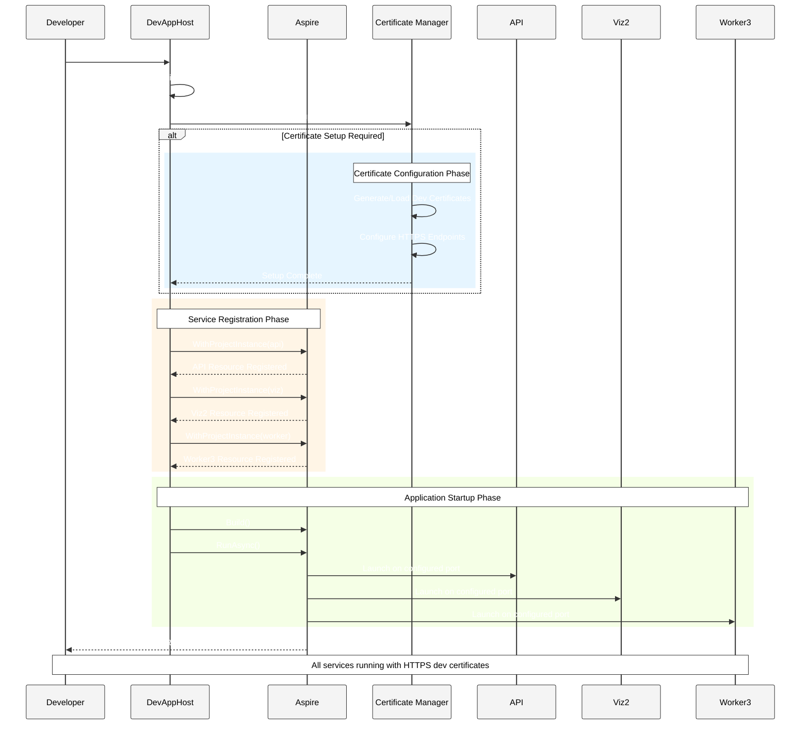
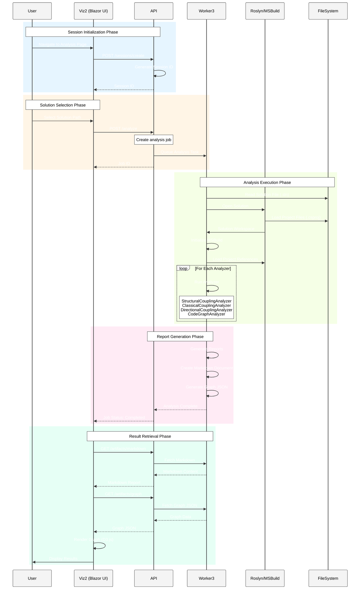
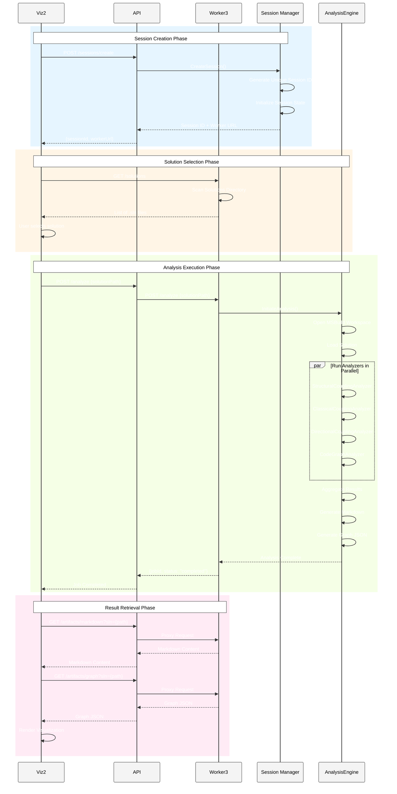

# CSharp.ProjectDependency5 - Architecture Documentation

## Overview

`CSharp.ProjectDependency5` is a .NET 9 solution analyzer that visualizes and analyzes C# project dependencies using Roslyn and MSBuild. The system uses .NET Aspire for orchestration and provides a Blazor-based web interface for interactive dependency visualization.

## Solution Structure

### Projects

#### Core Projects

- **FrenchExDev.Net.CSharp.ProjectDependency5.Core**
  - Core domain models and analysis engine
  - MSBuild and Roslyn workspace integration
  - Project dependency analysis algorithms
  - Report generation framework
  - Graph model for visualization

#### Application Projects

- **FrenchExDev.Net.CSharp.ProjectDependency5.DevAppHost**
  - .NET Aspire AppHost for orchestrating services
  - Development environment setup and configuration
  - Certificate management for HTTPS

- **FrenchExDev.Net.CSharp.ProjectDependency5.Api**
  - REST API service (Web API project)
  - Orchestrates analysis requests
  - Manages communication between Viz2 and Worker3

- **FrenchExDev.Net.CSharp.ProjectDependency5.Viz2**
  - Blazor Web App with Server and WebAssembly modes
  - Interactive UI for dependency visualization
  - D3.js-based graph renderer
  - Solution selection and analysis triggering

- **FrenchExDev.Net.CSharp.ProjectDependency5.Viz2.Client**
  - Blazor WebAssembly client components
  - Client-side rendering logic

- **FrenchExDev.Net.CSharp.ProjectDependency5.Worker3**
  - Background worker service
  - Executes analysis tasks
  - Processes solution files using Roslyn
  - Generates markdown reports and graph data

## Architecture Diagrams

### System Overview - Aspire DevAppHost Sequence



### Key Actors Interaction - Analysis Workflow



### Component Interaction - Create Session & Analyze



## Core Components

### Analysis Engine

#### MSBuild Integration
- **MsBuildRegisteringService**: Registers MSBuild instance for solution loading
- **MsBuildWorkspace**: Roslyn workspace wrapper for MSBuild projects
- **DefaultProjectCollection**: Manages MSBuild project collection

#### Domain Models
- **Solution**: Represents a C# solution with projects collection
- **Project**: Represents a C# project with dependencies
- **IProjectDependency**: Abstraction for project dependencies

#### Analyzers
All analyzers implement `IProjectAnalyzer` interface:

1. **StructuralCouplingAnalyzer**
   - Analyzes structural project references
   - Builds dependency graph from .csproj files

2. **ClassicalCouplingAnalyzer**
   - Calculates afferent coupling (Ca)
   - Calculates efferent coupling (Ce)
   - Computes instability metric: I = Ce/(Ca+Ce)

3. **DirectionalCouplingAnalyzer**
   - Identifies directional dependency patterns
   - Detects circular dependencies

4. **CodeGraphAnalyzer**
   - Generates graph model for visualization
   - Creates nodes and edges for D3.js rendering

#### Report Generators
All generators implement `IReportGenerator<T>`:

- **StructuralCouplingReportGenerator**
- **ClassicalCouplingReportGenerator**
- **DirectionalCouplingReportGenerator**
- **CodeGraphReportGenerator**

### Markdown Generation

- **MarkdownDocument**: Container for markdown sections
- **MarkdownSection**: Individual report section with title and content

## Technology Stack

### Backend
- **.NET 9**: Target framework
- **Roslyn**: Code analysis and compilation APIs
- **MSBuild**: Project system integration
- **.NET Aspire**: Service orchestration and development

### Frontend
- **Blazor Server & WebAssembly**: UI framework
- **D3.js**: Graph visualization
- **Bootstrap**: UI styling

### Analysis
- **Microsoft.CodeAnalysis.CSharp.Workspaces**: Roslyn APIs
- **Microsoft.Build**: MSBuild evaluation
- **Microsoft.Build.Locator**: MSBuild instance location

## Development Workflow

### Running the Application

1. **Start DevAppHost**
   ```bash
   cd CSharp.ProjectDependency5/src/FrenchExDev.Net.CSharp.ProjectDependency5.DevAppHost
   dotnet run
   ```

2. **Aspire Dashboard**
   - Opens automatically at `https://localhost:[port]`
   - Shows all running services (API, Viz2, Worker3)
   - Monitors health checks and logs

3. **Access Viz2 UI**
   - Navigate to Viz2 URL from Aspire dashboard
   - Create session
   - Select solution
   - Run analysis
   - View results and graph

### Analysis Flow

1. **Session Creation**: User requests a new analysis session via Viz2
2. **Solution Selection**: User browses and selects a .sln file
3. **Analysis Trigger**: Viz2 sends analysis request to API
4. **Job Queuing**: API forwards request to Worker3
5. **MSBuild Loading**: Worker3 loads solution using Roslyn
6. **Analysis Execution**: Multiple analyzers process the solution
7. **Report Generation**: Markdown and graph artifacts are created
8. **Result Delivery**: Viz2 retrieves and displays results

## Key Features

### Analysis Capabilities
- Project dependency mapping
- Coupling metrics calculation
- Circular dependency detection
- Graph visualization
- Markdown report generation

### Visualization
- Interactive D3.js graph
- Node and edge styling
- Zoom and pan controls
- Search and filtering
- Theme switching (light/dark)

### Development Features
- HTTPS development certificates
- Aspire dashboard integration
- Health check endpoints
- Hot reload support
- Structured logging

## Configuration

### Aspire Configuration
```csharp
await DevAppHost.Default(
    builder: () => DistributedApplication.CreateBuilder(args),
    environment: "Development")
.EnsureSetup()
.WithProjectInstance(
    resourceBuilder: (builder) => builder.AddProject<Projects.FrenchExDev_Net_CSharp_ProjectDependency5_Api>("api"),
    name: "api"
)
.WithProjectInstance(
    resourceBuilder: (builder) => builder.AddProject<Projects.FrenchExDev_Net_CSharp_ProjectDependency5_Viz2>("viz"),
    name: "viz"
)
.WithProjectInstance(
    resourceBuilder: (builder) => builder.AddProject<Projects.FrenchExDev_Net_CSharp_ProjectDependency5_Worker3>("worker"),
    name: "worker"
)
.Build()
.RunAsync();
```

### Certificate Management
- Auto-generated development certificates
- HTTPS configuration for all services
- PEM format support
- Cross-platform compatibility

## Extensibility

### Adding New Analyzers

1. Implement `IProjectAnalyzer` interface
2. Add analyzer to `ProjectAnalyzerAggregator`
3. Create corresponding `IReportGenerator<T>`
4. Register in analysis pipeline

### Custom Report Formats

1. Implement `IReportGenerator<TResult>`
2. Process analysis results
3. Generate markdown sections
4. Integrate with markdown document

## Security Considerations

- HTTPS enforced for all communication
- Development certificates for local testing
- No authentication implemented (development only)
- Solution paths validated against configured root

## Future Enhancements

- Real-time WebSocket progress updates
- Multiple simultaneous analyses
- Export to various formats (PDF, HTML)
- Caching of analysis results
- Advanced filtering and querying
- Namespace-level analysis
- Type-level dependency tracking

---

**Version**: 1.0  
**Last Updated**: 2024  
**Target Framework**: .NET 9  
**Architecture Style**: Microservices with Aspire Orchestration
