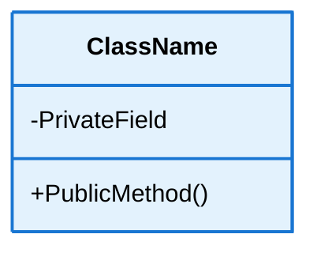

# Documentation Guidelines for FrenchExDev.Net

This document provides comprehensive guidelines for creating and maintaining documentation across all solution directories in the FrenchExDev.Net repository.

## Table of Contents

- [Overview](#overview)
- [Documentation Structure](#documentation-structure)
- [Sequence Diagram Guidelines](#sequence-diagram-guidelines)
- [Class Diagram Guidelines](#class-diagram-guidelines)
- [README Template](#readme-template)
- [Architecture Document Template](#architecture-document-template)
- [Best Practices](#best-practices)

---

## Overview

Each solution directory in FrenchExDev.Net should have comprehensive documentation including:
- **README.md** - Overview, getting started, usage examples
- **doc/ARCHITECTURE.md** - Detailed architecture with diagrams
- Sequence diagrams for workflows
- Class diagrams for architecture visualization

---

## Documentation Structure

### Standard Structure

```
SolutionDirectory/
??? README.md              # Solution overview and quick start
??? doc/
?   ??? ARCHITECTURE.md    # Detailed architecture documentation
?   ??? *.md              # Additional documentation
??? src/                   # Source projects
??? test/                  # Test projects
```

### File Naming Conventions

- Use PascalCase for markdown files: `ARCHITECTURE.md`, `README.md`
- Use kebab-case for specific topic docs: `getting-started.md`, `api-reference.md`

---

## Sequence Diagram Guidelines

### Theme Configuration

All sequence diagrams MUST use this Mermaid theme configuration for consistent text visibility:

```javascript
%%{init: {'theme':'base', 'themeVariables': { 
  'fontFamily':'arial',
  'fontSize':'14px',
  'primaryColor':'#fff',
  'primaryTextColor':'#000',
  'primaryBorderColor':'#333',
  'lineColor':'#333',
  'secondaryColor':'#fff',
  'tertiaryColor':'#fff',
  'noteTextColor':'#000',
  'noteBkgColor':'#fff',
  'noteBorderColor':'#333',
  'actorBkg':'#f4f4f4',
  'actorBorder':'#333',
  'actorTextColor':'#000',
  'actorLineColor':'#333',
  'signalColor':'#333',
  'signalTextColor':'#fff',        // WHITE for messages on dark arrows
  'labelBoxBkgColor':'#f4f4f4',
  'labelBoxBorderColor':'#333',
  'labelTextColor':'#000',
  'loopTextColor':'#000',
  'activationBorderColor':'#333',
  'activationBkgColor':'#e8e8e8',
  'sequenceNumberColor':'#fff',     // WHITE for sequence numbers
  'altLabelBkgColor':'#f4f4f4',
  'altLabelBorderColor':'#333'
}}}%%
```

### Text Visibility Rules

#### WHITE TEXT (`#fff`) - Used for:
- **Arrow messages** - Signal text on dark arrow lines
- **Sequence numbers** - Numbers on arrows
- **Any text on dark backgrounds** - Ensures readability

#### BLACK TEXT (`#000`) - Used for:
- **Participant names** - Actor/participant labels
- **Note text** - Content inside note boxes
- **Alt/Opt labels** - Control flow labels
- **Loop labels** - Iteration labels
- **Text in rect sections** - Phase descriptions on light backgrounds

### Colored Rect Sections

Use light pastel backgrounds for workflow phases with semantic meaning:

```markdown
rect rgb(230, 245, 255)
Note over Actor1,Actor2: Setup/Discovery Phase
// Workflow steps...
end
```

#### Recommended Color Schemes

| Phase Type | RGB Color | Use Case |
|------------|-----------|----------|
| **Setup/Discovery** | `rgb(230, 245, 255)` | Blue tint - Initialization, configuration loading |
| **Execution** | `rgb(255, 245, 230)` | Orange tint - Main processing, parallel execution |
| **Success/Completion** | `rgb(245, 255, 230)` | Green tint - Successful operations, sequential steps |
| **Generation/Output** | `rgb(255, 235, 245)` | Pink tint - Report generation, file creation |
| **Validation** | `rgb(255, 250, 230)` | Yellow tint - Threshold checks, validation steps |
| **Error Handling** | `rgb(255, 240, 240)` | Light red - Error paths, fallback logic |

### Complete Example

```markdown
### Example Workflow

\`\`\`mermaid
%%{init: {'theme':'base', 'themeVariables': { 'fontFamily':'arial','fontSize':'14px','primaryColor':'#fff','primaryTextColor':'#000','primaryBorderColor':'#333','lineColor':'#333','secondaryColor':'#fff','tertiaryColor':'#fff','noteTextColor':'#000','noteBkgColor':'#fff','noteBorderColor':'#333','actorBkg':'#f4f4f4','actorBorder':'#333','actorTextColor':'#000','actorLineColor':'#333','signalColor':'#333','signalTextColor':'#fff','labelBoxBkgColor':'#f4f4f4','labelBoxBorderColor':'#333','labelTextColor':'#000','loopTextColor':'#000','activationBorderColor':'#333','activationBkgColor':'#e8e8e8','sequenceNumberColor':'#fff','altLabelBkgColor':'#f4f4f4','altLabelBorderColor':'#333'}}}%%
sequenceDiagram
    participant User
    participant System
    participant Database
    
    User->>System: Execute command
    
    rect rgb(230, 245, 255)
    Note over System,Database: Initialization Phase
    System->>Database: Load configuration
    Database-->>System: Config data
    end
    
    alt Success Path
        rect rgb(245, 255, 230)
        Note over System,Database: Process Data
        System->>Database: Query data
        Database-->>System: Results
        end
    else Error Path
        rect rgb(255, 240, 240)
        Note over System,System: Handle Error
        System->>System: Log error
        System->>User: Error message
        end
    end
    
    System-->>User: Complete
\`\`\`
```

### Text Visibility Checklist

Before finalizing a sequence diagram, verify:

? **Arrow messages** - White text visible on dark arrows (e.g., "Execute command")  
? **Participant names** - Black text visible on light gray boxes  
? **Note content** - Black text visible on white/light yellow backgrounds  
? **Rect section notes** - Black text visible on light pastel backgrounds  
? **Alt/Opt labels** - Black text visible on light gray labels  
? **Loop labels** - Black text visible  
? **Sequence numbers** - White text visible on arrows  

---

## Class Diagram Guidelines

### Theme Configuration

Class diagrams should use light pastel backgrounds with dark text:



### Recommended Color Palette

| Component Type | Fill Color | Stroke Color | Text Color |
|----------------|------------|--------------|------------|
| **Core Classes** | `#e3f2fd` (light blue) | `#1976d2` (blue) | `#000` (black) |
| **Abstractions** | `#fff3e0` (light orange) | `#f57c00` (orange) | `#000` (black) |
| **Infrastructure** | `#f3e5f5` (light purple) | `#7b1fa2` (purple) | `#000` (black) |
| **Services** | `#e8f5e9` (light green) | `#388e3c` (green) | `#000` (black) |
| **Testing** | `#fce4ec` (light pink) | `#c2185b` (pink) | `#000` (black) |
| **Utilities** | `#fff9c4` (light yellow) | `#f9a825` (yellow) | `#000` (black) |
| **External** | `#e0f2f1` (light teal) | `#00695c` (teal) | `#000` (black) |

### Complete Example

```markdown
### Architecture Overview

\`\`\`mermaid
classDiagram
    class CoreService {
        +Execute()
        -ValidateInput()
    }
    
    class AbstractionLayer {
        <<interface>>
        +Process()
    }
    
    class InfrastructureComponent {
        +Connect()
        +Disconnect()
    }
    
    CoreService ..|> AbstractionLayer : implements
    CoreService --> InfrastructureComponent : uses
    
    style CoreService fill:#e3f2fd,stroke:#1976d2,stroke-width:2px,color:#000
    style AbstractionLayer fill:#fff3e0,stroke:#f57c00,stroke-width:2px,color:#000
    style InfrastructureComponent fill:#f3e5f5,stroke:#7b1fa2,stroke-width:2px,color:#000
\`\`\`
```

---

## README Template

Each solution directory should have a README.md following this structure:

```markdown
# [Solution Name]

Brief description of the solution's purpose and key features.

## Table of Contents

- [Overview](#overview)
- [Features](#features)
- [Getting Started](#getting-started)
- [Architecture](#architecture)
- [Usage Examples](#usage-examples)
- [Testing](#testing)
- [Dependencies](#dependencies)
- [Contributing](#contributing)

---

## Overview

Detailed description of what this solution provides and its role in the ecosystem.

**Key Capabilities:**
- Feature 1
- Feature 2
- Feature 3

---

## Features

### Feature Category 1
- Specific feature with description
- Another feature

### Feature Category 2
- More features...

---

## Getting Started

### Prerequisites
- .NET 9 SDK
- Additional requirements...

### Installation

\`\`\`bash
dotnet add package FrenchExDev.Net.[SolutionName]
\`\`\`

### Quick Start

\`\`\`csharp
// Example usage code
\`\`\`

---

## Architecture

[Link to ARCHITECTURE.md for detailed diagrams and documentation]

### Project Structure

| Project | Description |
|---------|-------------|
| Core | Main implementation |
| Abstractions | Interfaces and contracts |
| Infrastructure | Platform-specific implementations |
| Testing | Test utilities |

---

## Usage Examples

### Example 1: Basic Usage

\`\`\`csharp
// Code example with comments
\`\`\`

### Example 2: Advanced Scenario

\`\`\`csharp
// Advanced example
\`\`\`

---

## Testing

\`\`\`powershell
# Run tests
.\_Scripts\Run-SolutionTests.ps1 -Include '[SolutionName]'
\`\`\`

---

## Dependencies

### Internal Dependencies
- FrenchExDev.Net.Dependency1
- FrenchExDev.Net.Dependency2

### External Dependencies
- NuGet.Package1
- NuGet.Package2

---

## Contributing

See main repository [CONTRIBUTING.md](../CONTRIBUTING.md)

---

**Target Framework:** .NET 9  
**License:** MIT  
**Documentation:** [Architecture](doc/ARCHITECTURE.md)
```

---

## Architecture Document Template

```markdown
# [Solution Name] - Architecture Documentation

## Table of Contents

- [Overview](#overview)
- [Architecture Diagrams](#architecture-diagrams)
- [Core Components](#core-components)
- [Sequence Diagrams](#sequence-diagrams)
- [Design Decisions](#design-decisions)
- [Best Practices](#best-practices)

---

## Overview

Comprehensive architectural overview with key design principles.

---

## Architecture Diagrams

### Component Architecture

[Class diagram showing main components]

### System Context

[Diagram showing external interactions]

---

## Core Components

### Component 1

**Purpose:** What it does

**Responsibilities:**
- Responsibility 1
- Responsibility 2

**Key Methods:**
\`\`\`csharp
public interface IComponent
{
    void Method1();
    Task<Result> Method2Async();
}
\`\`\`

---

## Sequence Diagrams

### Workflow 1: [Name]

[Sequence diagram with proper theme and colors]

**Description:**
Step-by-step explanation of the workflow.

---

## Design Decisions

### Decision 1: [Topic]

**Context:** Why this decision was needed

**Decision:** What was chosen

**Rationale:** Why this approach

**Alternatives Considered:**
- Alternative A - why rejected
- Alternative B - why rejected

---

## Best Practices

### ? Do
- Best practice 1
- Best practice 2

### ? Don't
- Anti-pattern 1
- Anti-pattern 2

---

**Version:** 1.0  
**Last Updated:** [Date]  
**Target Framework:** .NET 9
```

---

## Best Practices

### General Documentation

1. **Keep docs up-to-date** - Update documentation with code changes
2. **Use consistent formatting** - Follow templates and guidelines
3. **Include code examples** - Real, working code snippets
4. **Add visual diagrams** - Mermaid diagrams for clarity
5. **Link related docs** - Cross-reference between documents

### Mermaid Diagrams

1. **Always use theme configuration** - Ensures consistent appearance
2. **Verify text visibility** - Check all text is readable
3. **Use semantic colors** - Colors should convey meaning
4. **Add descriptive notes** - Explain what's happening in each phase
5. **Keep diagrams focused** - One workflow per diagram

### Sequence Diagrams

1. **White text on arrows** - For messages and sequence numbers
2. **Black text in boxes** - For participants, notes, labels
3. **Light pastel rect backgrounds** - For workflow phases
4. **Semantic color coding** - Consistent colors for similar phases
5. **Descriptive note titles** - Clear phase descriptions

### Class Diagrams

1. **Consistent color coding** - Same type = same colors
2. **Light backgrounds** - Better for printing and viewing
3. **Dark text always** - Maximum readability
4. **Clear relationships** - Use appropriate arrow types
5. **Style all classes** - Don't leave default styling

### Code Examples

1. **Complete and runnable** - Examples should work as-is
2. **Include comments** - Explain non-obvious code
3. **Show best practices** - Demonstrate recommended usage
4. **Handle errors properly** - Use Result pattern, proper exception handling
5. **Match documentation** - Code should match text descriptions

---

## Quick Reference

### Mermaid Theme (Copy-Paste Ready)

```
%%{init: {'theme':'base', 'themeVariables': { 'fontFamily':'arial','fontSize':'14px','primaryColor':'#fff','primaryTextColor':'#000','primaryBorderColor':'#333','lineColor':'#333','secondaryColor':'#fff','tertiaryColor':'#fff','noteTextColor':'#000','noteBkgColor':'#fff','noteBorderColor':'#333','actorBkg':'#f4f4f4','actorBorder':'#333','actorTextColor':'#000','actorLineColor':'#333','signalColor':'#333','signalTextColor':'#fff','labelBoxBkgColor':'#f4f4f4','labelBoxBorderColor':'#333','labelTextColor':'#000','loopTextColor':'#000','activationBorderColor':'#333','activationBkgColor':'#e8e8e8','sequenceNumberColor':'#fff','altLabelBkgColor':'#f4f4f4','altLabelBorderColor':'#333'}}}%%
```

### Class Diagram Style (Example)

```
style ClassName fill:#e3f2fd,stroke:#1976d2,stroke-width:2px,color:#000
```

### Rect Colors (Copy-Paste Ready)

```
rect rgb(230, 245, 255)   // Blue - Setup/Discovery
rect rgb(255, 245, 230)   // Orange - Execution
rect rgb(245, 255, 230)   // Green - Success
rect rgb(255, 235, 245)   // Pink - Generation
rect rgb(255, 250, 230)   // Yellow - Validation
rect rgb(255, 240, 240)   // Light Red - Error
```

---

## Validation Checklist

Before finalizing documentation, verify:

### README Checklist
- [ ] Table of contents present and linked
- [ ] Overview section complete
- [ ] Getting started instructions clear
- [ ] Code examples tested and working
- [ ] Links to architecture docs functional
- [ ] Dependencies listed
- [ ] Testing instructions included

### Architecture Document Checklist
- [ ] Architecture diagrams present
- [ ] Sequence diagrams use correct theme
- [ ] All text is readable (white on dark, black on light)
- [ ] Colored rect sections have semantic meaning
- [ ] Component descriptions complete
- [ ] Design decisions documented
- [ ] Best practices included

### Diagram Checklist
- [ ] Theme configuration applied
- [ ] Arrow messages in white
- [ ] Participant names in black
- [ ] Note text in black on light backgrounds
- [ ] Rect sections use light pastel colors
- [ ] All text is readable in both light and dark mode
- [ ] Semantic color coding applied
- [ ] No default Mermaid styling visible

---

## Examples from Repository

### Excellent Examples to Follow

1. **CSharp.Aspire.Dev/doc/ARCHITECTURE.md**
   - Comprehensive architecture documentation
   - Well-structured sequence diagrams
   - Proper theme configuration
   - Semantic rect coloring

2. **Object.Biz/doc/ARCHITECTURE.md**
   - Detailed pattern documentation
   - Clear class diagrams
   - Usage examples
   - Best practices section

3. **_Scripts/README.md**
   - Complete TOC with links
   - Multiple sequence diagrams
   - Class diagram
   - Usage examples

---

## Tools and Resources

### Mermaid Documentation
- [Mermaid Official Docs](https://mermaid.js.org/)
- [Sequence Diagram Syntax](https://mermaid.js.org/syntax/sequenceDiagram.html)
- [Class Diagram Syntax](https://mermaid.js.org/syntax/classDiagram.html)

### Markdown Resources
- [GitHub Markdown Guide](https://guides.github.com/features/mastering-markdown/)
- [Markdown Tables Generator](https://www.tablesgenerator.com/markdown_tables)

### Color Tools
- [RGB Color Picker](https://www.rapidtables.com/web/color/RGB_Color.html)
- [Color Contrast Checker](https://webaim.org/resources/contrastchecker/)

---

**Version:** 1.0  
**Last Updated:** January 2025  
**Maintained By:** FrenchExDev.Net Team  
**Repository:** https://github.com/FrenchExDev/FrenchExDev.Net
