# Projects Table of Contents

- [FenchExDev.Net.Testing](#fenchexdevnettesting)
- [FrenchExDev.Net.Alpine.Version](#frenchexdevnetalpineversion)
- [FrenchExDev.Net.Alpine.Version.Testing](#frenchexdevnetalpineversiontesting)
- [FrenchExDev.Net.Alpine.Version.Tests](#frenchexdevnetalpineversiontests)
- [FrenchExDev.Net.CSharp.ManagedDictionary](#frenchexdevnetcsharpmanageddictionary)
- [FrenchExDev.Net.CSharp.ManagedDictionary.Testing](#frenchexdevnetcsharpmanageddictionarytesting)
- [FrenchExDev.Net.CSharp.ManagedDictionary.Tests](#frenchexdevnetcsharpmanageddictionarytests)
- [FrenchExDev.Net.CSharp.ManagedList](#frenchexdevnetcsharpmanagedlist)
- [FrenchExDev.Net.CSharp.ManagedList.Testing](#frenchexdevnetcsharpmanagedlisttesting)
- [FrenchExDev.Net.CSharp.ManagedList.Tests](#frenchexdevnetcsharpmanagedlisttests)
- [FrenchExDev.Net.CSharp.Object.Biz](#frenchexdevnetcsharpobjectbiz)
- [FrenchExDev.Net.CSharp.Object.Biz.Testing](#frenchexdevnetcsharpobjectbiztesting)
- [FrenchExDev.Net.CSharp.Object.Biz.Tests](#frenchexdevnetcsharpobjectbiztests)
- [FrenchExDev.Net.CSharp.Object.Builder2](#frenchexdevnetcsharpobjectbuilder2)
- [FrenchExDev.Net.CSharp.Object.Builder2.Testing](#frenchexdevnetcsharpobjectbuilder2testing)
- [FrenchExDev.Net.CSharp.Object.Builder2.Tests](#frenchexdevnetcsharpobjectbuilder2tests)
- [FrenchExDev.Net.CSharp.Object.Model](#frenchexdevnetcsharpobjectmodel)
- [FrenchExDev.Net.CSharp.Object.Model.Abstractions](#frenchexdevnetcsharpobjectmodelabstractions)
- [FrenchExDev.Net.CSharp.Object.Model.Infrastructure](#frenchexdevnetcsharpobjectmodelinfrastructure)
- [FrenchExDev.Net.CSharp.Object.Model.Testing](#frenchexdevnetcsharpobjectmodeltesting)
- [FrenchExDev.Net.CSharp.Object.Model.Tests](#frenchexdevnetcsharpobjectmodeltests)
- [FrenchExDev.Net.CSharp.Object.Result](#frenchexdevnetcsharpobjectresult)
- [FrenchExDev.Net.CSharp.Object.Result.Testing](#frenchexdevnetcsharpobjectresulttesting)
- [FrenchExDev.Net.CSharp.Object.Result.Tests](#frenchexdevnetcsharpobjectresulttests)
- [FrenchExDev.Net.CSharp.ProjectDependency](#frenchexdevnetcsharpprojectdependency)
- [FrenchExDev.Net.CSharp.ProjectDependency.Abstractions](#frenchexdevnetcsharpprojectdependencyabstractions)
- [FrenchExDev.Net.CSharp.ProjectDependency.Testing](#frenchexdevnetcsharpprojectdependencytesting)
- [FrenchExDev.Net.Csharp.ProjectDependency.Tests](#frenchexdevnetcsharpprojectdependencytests)
- [FrenchExDev.Net.CSharp.SolutionEngineering](#frenchexdevnetcsharpsolutionengineering)
- [FrenchExDev.Net.CSharp.SolutionEngineering.Testing](#frenchexdevnetcsharpsolutionengineeringtesting)
- [FrenchExDev.Net.CSharp.SolutionEngineering.Tests](#frenchexdevnetcsharpsolutionengineeringtests)
- [FrenchExDev.Net.Dotnet.Project](#frenchexdevnetdotnetproject)
- [FrenchExDev.Net.Dotnet.Project.Abstractions](#frenchexdevnetdotnetprojectabstractions)
- [FrenchExDev.Net.Dotnet.Project.Infrastructure](#frenchexdevnetdotnetprojectinfrastructure)
- [FrenchExDev.Net.Dotnet.Project.Testing](#frenchexdevnetdotnetprojecttesting)
- [FrenchExDev.Net.Dotnet.Project.Tests](#frenchexdevnetdotnetprojecttests)
- [FrenchExDev.Net.Dotnet.Project.Types.ClassProjectType](#frenchexdevnetdotnetprojecttypesclassprojecttype)
- [FrenchExDev.Net.Dotnet.Project.Types.ClassProjectType.Abstractions](#frenchexdevnetdotnetprojecttypesclassprojecttypeabstractions)
- [FrenchExDev.Net.Dotnet.Project.Types.ClassProjectType.Infrastructure](#frenchexdevnetdotnetprojecttypesclassprojecttypeinfrastructure)
- [FrenchExDev.Net.Dotnet.Project.Types.ClassProjectType.Testing](#frenchexdevnetdotnetprojecttypesclassprojecttypetesting)
- [FrenchExDev.Net.Dotnet.Project.Types.ClassProjectType.Tests](#frenchexdevnetdotnetprojecttypesclassprojecttypetests)
- [FrenchExDev.Net.Dotnet.Project.Types.CliProjectType](#frenchexdevnetdotnetprojecttypescliprojecttype)
- [FrenchExDev.Net.Dotnet.Project.Types.CliProjectType.Abstractions](#frenchexdevnetdotnetprojecttypescliprojecttypeabstractions)
- [FrenchExDev.Net.Dotnet.Project.Types.CliProjectType.Infrastructure](#frenchexdevnetdotnetprojecttypescliprojecttypeinfrastructure)
- [FrenchExDev.Net.Dotnet.Project.Types.CliProjectType.Testing](#frenchexdevnetdotnetprojecttypescliprojecttypetesting)
- [FrenchExDev.Net.Dotnet.Project.Types.CliProjectType.Tests](#frenchexdevnetdotnetprojecttypescliprojecttypetests)
- [FrenchExDev.Net.Dotnet.Project.Types.DesktopProjectType](#frenchexdevnetdotnetprojecttypesdesktopprojecttype)
- [FrenchExDev.Net.Dotnet.Project.Types.DesktopProjectType.Abstractions](#frenchexdevnetdotnetprojecttypesdesktopprojecttypeabstractions)
- [FrenchExDev.Net.Dotnet.Project.Types.DesktopProjectType.Infrastructure](#frenchexdevnetdotnetprojecttypesdesktopprojecttypeinfrastructure)
- [FrenchExDev.Net.Dotnet.Project.Types.DesktopProjectType.Testing](#frenchexdevnetdotnetprojecttypesdesktopprojecttypetesting)
- [FrenchExDev.Net.Dotnet.Project.Types.DesktopProjectType.Tests](#frenchexdevnetdotnetprojecttypesdesktopprojecttypetests)
- [FrenchExDev.Net.Dotnet.Project.Types.LibraryProject](#frenchexdevnetdotnetprojecttypeslibraryproject)
- [FrenchExDev.Net.Dotnet.Project.Types.LibraryProject.Abstractions](#frenchexdevnetdotnetprojecttypeslibraryprojectabstractions)
- [FrenchExDev.Net.Dotnet.Project.Types.LibraryProject.Infrastructure](#frenchexdevnetdotnetprojecttypeslibraryprojectinfrastructure)
- [FrenchExDev.Net.Dotnet.Project.Types.LibraryProject.Testing](#frenchexdevnetdotnetprojecttypeslibraryprojecttesting)
- [FrenchExDev.Net.Dotnet.Project.Types.LibraryProject.Tests](#frenchexdevnetdotnetprojecttypeslibraryprojecttests)
- [FrenchExDev.Net.Dotnet.Project.Types.WebApiProjectType](#frenchexdevnetdotnetprojecttypeswebapiprojecttype)
- [FrenchExDev.Net.Dotnet.Project.Types.WebApiProjectType.Abstractions](#frenchexdevnetdotnetprojecttypeswebapiprojecttypeabstractions)
- [FrenchExDev.Net.Dotnet.Project.Types.WebApiProjectType.Infrastructure](#frenchexdevnetdotnetprojecttypeswebapiprojecttypeinfrastructure)
- [FrenchExDev.Net.Dotnet.Project.Types.WebApiProjectType.Testing](#frenchexdevnetdotnetprojecttypeswebapiprojecttypetesting)
- [FrenchExDev.Net.Dotnet.Project.Types.WebApiProjectType.Tests](#frenchexdevnetdotnetprojecttypeswebapiprojecttypetests)
- [FrenchExDev.Net.Dotnet.Project.Types.WebWorkerProjectType](#frenchexdevnetdotnetprojecttypeswebworkerprojecttype)
- [FrenchExDev.Net.Dotnet.Project.Types.WebWorkerProjectType.Abstractions](#frenchexdevnetdotnetprojecttypeswebworkerprojecttypeabstractions)
- [FrenchExDev.Net.Dotnet.Project.Types.WebWorkerProjectType.Infrastructure](#frenchexdevnetdotnetprojecttypeswebworkerprojecttypeinfrastructure)
- [FrenchExDev.Net.Dotnet.Project.Types.WebWorkerProjectType.Testing](#frenchexdevnetdotnetprojecttypeswebworkerprojecttypetesting)
- [FrenchExDev.Net.Dotnet.Project.Types.WebWorkerProjectType.Tests](#frenchexdevnetdotnetprojecttypeswebworkerprojecttypetests)
- [FrenchExDev.Net.Dotnet.Solution](#frenchexdevnetdotnetsolution)
- [FrenchExDev.Net.Dotnet.Solution.Abstractions](#frenchexdevnetdotnetsolutionabstractions)
- [FrenchExDev.Net.Dotnet.Solution.Infrastructure](#frenchexdevnetdotnetsolutioninfrastructure)
- [FrenchExDev.Net.Dotnet.Solution.Testing](#frenchexdevnetdotnetsolutiontesting)
- [FrenchExDev.Net.Dotnet.Solution.Tests](#frenchexdevnetdotnetsolutiontests)
- [FrenchExDev.Net.HttpClient](#frenchexdevnethttpclient)
- [FrenchExDev.Net.HttpClient.Testing](#frenchexdevnethttpclienttesting)
- [FrenchExDev.Net.Mm](#frenchexdevnetmm)
- [FrenchExDev.Net.Mm.Abstractions](#frenchexdevnetmmabstractions)
- [FrenchExDev.Net.Mm.Abstractions.Tests](#frenchexdevnetmmabstractionstests)
- [FrenchExDev.Net.Mm.App.Cli](#frenchexdevnetmmappcli)
- [FrenchExDev.Net.Mm.App.Cli.Builder.Tests](#frenchexdevnetmmappclibuildertests)
- [FrenchExDev.Net.Mm.App.Cli.Generator.Tests](#frenchexdevnetmmappcligeneratortests)
- [FrenchExDev.Net.Mm.App.Cli.Testing](#frenchexdevnetmmappclitesting)
- [FrenchExDev.Net.Mm.App.Cli.Tests](#frenchexdevnetmmappclitests)
- [FrenchExDev.Net.Mm.App.Desktop](#frenchexdevnetmmappdesktop)
- [FrenchExDev.Net.Mm.App.Desktop.Abstractions](#frenchexdevnetmmappdesktopabstractions)
- [FrenchExDev.Net.Mm.App.Desktop.Builder](#frenchexdevnetmmappdesktopbuilder)
- [FrenchExDev.Net.Mm.App.Desktop.Builder.Abstractions](#frenchexdevnetmmappdesktopbuilderabstractions)
- [FrenchExDev.Net.Mm.App.Desktop.Builder.Infrastructure](#frenchexdevnetmmappdesktopbuilderinfrastructure)
- [FrenchExDev.Net.Mm.App.Desktop.Builder.Testing](#frenchexdevnetmmappdesktopbuildertesting)
- [FrenchExDev.Net.Mm.App.Desktop.Builder.Tests](#frenchexdevnetmmappdesktopbuildertests)
- [FrenchExDev.Net.Mm.App.Desktop.Generator.Tests](#frenchexdevnetmmappdesktopgeneratortests)
- [FrenchExDev.Net.Mm.App.Desktop.Tests](#frenchexdevnetmmappdesktoptests)
- [FrenchExDev.Net.Mm.App.WebApi](#frenchexdevnetmmappwebapi)
- [FrenchExDev.Net.Mm.App.WebApi.Testing](#frenchexdevnetmmappwebapitesting)
- [FrenchExDev.Net.Mm.App.WebApi.Tests](#frenchexdevnetmmappwebapitests)
- [FrenchExDev.Net.Mm.App.WebWorker](#frenchexdevnetmmappwebworker)
- [FrenchExDev.Net.Mm.App.WebWorker.Testing](#frenchexdevnetmmappwebworkertesting)
- [FrenchExDev.Net.Mm.App.WebWorker.Tests](#frenchexdevnetmmappwebworkertests)
- [FrenchExDev.Net.Mm.Module.Library](#frenchexdevnetmmmodulelibrary)
- [FrenchExDev.Net.Mm.Module.Library.Abstractions](#frenchexdevnetmmmodulelibraryabstractions)
- [FrenchExDev.Net.Mm.Module.Library.Builder.Tests](#frenchexdevnetmmmodulelibrarybuildertests)
- [FrenchExDev.Net.Mm.Module.Library.Generator.Tests](#frenchexdevnetmmmodulelibrarygeneratortests)
- [FrenchExDev.Net.Mm.Module.Library.Infrastructure](#frenchexdevnetmmmodulelibraryinfrastructure)
- [FrenchExDev.Net.Mm.Module.Library.Testing](#frenchexdevnetmmmodulelibrarytesting)
- [FrenchExDev.Net.Mm.Module.Library.Tests](#frenchexdevnetmmmodulelibrarytests)
- [FrenchExDev.Net.Packer](#frenchexdevnetpacker)
- [FrenchExDev.Net.Packer.Abstractions](#frenchexdevnetpackerabstractions)
- [FrenchExDev.Net.Packer.Alpine](#frenchexdevnetpackeralpine)
- [FrenchExDev.Net.Packer.Alpine.Abstractions](#frenchexdevnetpackeralpineabstractions)
- [FrenchExDev.Net.Packer.Alpine.Docker](#frenchexdevnetpackeralpinedocker)
- [FrenchExDev.Net.Packer.Alpine.Docker.Abstractions](#frenchexdevnetpackeralpinedockerabstractions)
- [FrenchExDev.Net.Packer.Alpine.Docker.Infrastructure](#frenchexdevnetpackeralpinedockerinfrastructure)
- [FrenchExDev.Net.Packer.Alpine.Docker.Testing](#frenchexdevnetpackeralpinedockertesting)
- [FrenchExDev.Net.Packer.Alpine.Docker.Tests](#frenchexdevnetpackeralpinedockertests)
- [FrenchExDev.Net.Packer.Alpine.Kubernetes](#frenchexdevnetpackeralpinekubernetes)
- [FrenchExDev.Net.Packer.Alpine.Kubernetes.Abstractions](#frenchexdevnetpackeralpinekubernetesabstractions)
- [FrenchExDev.Net.Packer.Alpine.Kubernetes.Testing](#frenchexdevnetpackeralpinekubernetestesting)
- [FrenchExDev.Net.Packer.Alpine.Kubernetes.Tests](#frenchexdevnetpackeralpinekubernetestests)
- [FrenchExDev.Net.Packer.Alpine.Testing](#frenchexdevnetpackeralpinetesting)
- [FrenchExDev.Net.Packer.Alpine.Tests](#frenchexdevnetpackeralpinetests)
- [FrenchExDev.Net.Packer.Bundle](#frenchexdevnetpackerbundle)
- [FrenchExDev.Net.Packer.Bundle.Testing](#frenchexdevnetpackerbundletesting)
- [FrenchExDev.Net.Packer.Bundle.Tests](#frenchexdevnetpackerbundletests)
- [FrenchExDev.Net.Packer.Testing](#frenchexdevnetpackertesting)
- [FrenchExDev.Net.Packer.Tests](#frenchexdevnetpackertests)
- [FrenchExDev.Net.Ssh.Config](#frenchexdevnetsshconfig)
- [FrenchExDev.Net.Ssh.Config.Testing](#frenchexdevnetsshconfigtesting)
- [FrenchExDev.Net.Ssh.Config.Tests](#frenchexdevnetsshconfigtests)
- [FrenchExDev.Net.Vagrant](#frenchexdevnetvagrant)
- [FrenchExDev.Net.Vagrant.Testing](#frenchexdevnetvagranttesting)
- [FrenchExDev.Net.Vagrant.Tests](#frenchexdevnetvagranttests)
- [FrenchExDev.Net.VirtualBox.Version](#frenchexdevnetvirtualboxversion)
- [FrenchExDev.Net.VirtualBox.Version.DependencyInjection](#frenchexdevnetvirtualboxversiondependencyinjection)
- [FrenchExDev.Net.VirtualBox.Version.Mm](#frenchexdevnetvirtualboxversionmm)
- [FrenchExDev.Net.VirtualBox.Version.Testing](#frenchexdevnetvirtualboxversiontesting)
- [FrenchExDev.Net.VirtualBox.Version.Tests](#frenchexdevnetvirtualboxversiontests)
- [FrenchExDev.Net.Vos](#frenchexdevnetvos)
- [FrenchExDev.Net.Vos.Abstractions](#frenchexdevnetvosabstractions)
- [FrenchExDev.Net.Vos.Alpine](#frenchexdevnetvosalpine)
- [FrenchExDev.Net.Vos.Alpine.Abstractions](#frenchexdevnetvosalpineabstractions)
- [FrenchExDev.Net.Vos.Alpine.Docker](#frenchexdevnetvosalpinedocker)
- [FrenchExDev.Net.Vos.Alpine.Docker.Abstractions](#frenchexdevnetvosalpinedockerabstractions)
- [FrenchExDev.Net.Vos.Alpine.Docker.Infrastructure](#frenchexdevnetvosalpinedockerinfrastructure)
- [FrenchExDev.Net.Vos.Alpine.Docker.Testing](#frenchexdevnetvosalpinedockertesting)
- [FrenchExDev.Net.Vos.Alpine.Docker.Tests](#frenchexdevnetvosalpinedockertests)
- [FrenchExDev.Net.Vos.Alpine.Kubernetes](#frenchexdevnetvosalpinekubernetes)
- [FrenchExDev.Net.Vos.Alpine.Kubernetes.Abstractions](#frenchexdevnetvosalpinekubernetesabstractions)
- [FrenchExDev.Net.Vos.Alpine.Kubernetes.Infrastructure](#frenchexdevnetvosalpinekubernetesinfrastructure)
- [FrenchExDev.Net.Vos.Alpine.Kubernetes.Testing](#frenchexdevnetvosalpinekubernetestesting)
- [FrenchExDev.Net.Vos.Alpine.Kubernetes.Tests](#frenchexdevnetvosalpinekubernetestests)
- [FrenchExDev.Net.Vos.Alpine.Tests](#frenchexdevnetvosalpinetests)
- [FrenchExDev.Net.Vos.Infrastructure](#frenchexdevnetvosinfrastructure)
- [FrenchExDev.Net.Vos.Testing](#frenchexdevnetvostesting)
- [FrenchExDev.Net.Vos.Tests](#frenchexdevnetvostests)

---


## Projects KPI summary

Project | Times used | Source files | LOC | Diagnostics | Cyclomatic | Commits | Last commit | Maintainability
--- | ---: | ---: | ---: | ---: | ---: | ---: | --- | ---: 
FenchExDev.Net.Testing | 4 | 4 | 183 | 12 | 1 | 1 | 2025-09-21 01:40:40Z | 93,0
FrenchExDev.Net.Alpine.Version | 2 | 15 | 1484 | 8 | 155 | 2 | 2025-09-21 01:40:40Z | 0,0
FrenchExDev.Net.Alpine.Version.Testing | 1 | 4 | 100 | 10 | 2 | 2 | 2025-09-21 01:40:40Z | 93,0
FrenchExDev.Net.Alpine.Version.Tests | 0 | 6 | 725 | 14 | 4 | 3 | 2025-10-14 21:22:31Z | 89,0
FrenchExDev.Net.CSharp.ManagedDictionary | 2 | 4 | 566 | 12 | 33 | 1 | 2025-10-14 20:25:20Z | 61,0
FrenchExDev.Net.CSharp.ManagedDictionary.Testing | 1 | 4 | 45 | 13 | 0 | 1 | 2025-10-14 20:25:20Z | 93,5
FrenchExDev.Net.CSharp.ManagedDictionary.Tests | 0 | 5 | 54 | 15 | 2 | 2 | 2025-10-14 21:22:31Z | 90,5
FrenchExDev.Net.CSharp.ManagedList | 4 | 4 | 370 | 11 | 24 | 1 | 2025-09-28 19:42:25Z | 70,5
FrenchExDev.Net.CSharp.ManagedList.Testing | 1 | 4 | 89 | 12 | 2 | 1 | 2025-09-28 19:42:25Z | 92,0
FrenchExDev.Net.CSharp.ManagedList.Tests | 0 | 5 | 268 | 15 | 10 | 2 | 2025-10-14 21:22:31Z | 82,5
FrenchExDev.Net.CSharp.Object.Biz | 1 | 4 | 195 | 11 | 11 | 1 | 2025-09-28 19:42:25Z | 83,5
FrenchExDev.Net.CSharp.Object.Biz.Testing | 1 | 4 | 45 | 13 | 0 | 1 | 2025-09-28 19:42:25Z | 93,5
FrenchExDev.Net.CSharp.Object.Biz.Tests | 0 | 6 | 165 | 15 | 5 | 2 | 2025-10-14 21:22:31Z | 87,5
FrenchExDev.Net.CSharp.Object.Builder2 | 10 | 4 | 1040 | 10 | 122 | 1 | 2025-09-16 20:20:24Z | 0,0
FrenchExDev.Net.CSharp.Object.Builder2.Testing | 1 | 4 | 400 | 11 | 28 | 1 | 2025-09-16 20:20:24Z | 66,5
FrenchExDev.Net.CSharp.Object.Builder2.Tests | 0 | 5 | 148 | 13 | 3 | 1 | 2025-09-16 20:20:24Z | 90,5
FrenchExDev.Net.CSharp.Object.Model | 1 | 3 | 37 | 13 | 0 | 1 | 2025-09-07 17:11:29Z | 93,5
FrenchExDev.Net.CSharp.Object.Model.Abstractions | 2 | 45 | 3749 | 10 | 160 | 3 | 2025-09-21 01:40:40Z | 0,0
FrenchExDev.Net.CSharp.Object.Model.Infrastructure | 2 | 6 | 520 | 10 | 36 | 1 | 2025-09-07 17:11:29Z | 59,0
FrenchExDev.Net.CSharp.Object.Model.Testing | 1 | 4 | 130 | 12 | 2 | 1 | 2025-09-07 17:11:29Z | 92,0
FrenchExDev.Net.CSharp.Object.Model.Tests | 0 | 5 | 120 | 13 | 3 | 1 | 2025-09-07 17:11:29Z | 90,5
FrenchExDev.Net.CSharp.Object.Result | 5 | 4 | 335 | 11 | 19 | 1 | 2025-09-28 19:42:25Z | 75,5
FrenchExDev.Net.CSharp.Object.Result.Testing | 1 | 4 | 44 | 13 | 0 | 1 | 2025-09-28 19:42:25Z | 93,5
FrenchExDev.Net.CSharp.Object.Result.Tests | 0 | 5 | 50 | 16 | 1 | 2 | 2025-10-14 21:22:31Z | 91,0
FrenchExDev.Net.CSharp.ProjectDependency | 1 | 4 | 128 | 9 | 7 | 1 | 2025-10-14 20:25:20Z | 88,5
FrenchExDev.Net.CSharp.ProjectDependency.Abstractions | 2 | 26 | 2000 | 52 | 277 | 4 | 2025-10-16 21:17:51Z | 0,0
FrenchExDev.Net.CSharp.ProjectDependency.Testing | 0 | 4 | 45 | 13 | 0 | 1 | 2025-10-14 20:25:20Z | 93,5
FrenchExDev.Net.Csharp.ProjectDependency.Tests | 0 | 7 | 267 | 26 | 9 | 2 | 2025-10-14 21:22:31Z | 78,0
FrenchExDev.Net.CSharp.SolutionEngineering | 1 | 4 | 167 | 11 | 7 | 2 | 2025-10-14 20:25:20Z | 87,5
FrenchExDev.Net.CSharp.SolutionEngineering.Testing | 1 | 4 | 45 | 13 | 0 | 1 | 2025-10-14 20:25:20Z | 93,5
FrenchExDev.Net.CSharp.SolutionEngineering.Tests | 0 | 5 | 54 | 15 | 2 | 3 | 2025-10-14 21:22:31Z | 90,5
FrenchExDev.Net.Dotnet.Project | 3 | 4 | 49 | 13 | 0 | 2 | 2025-09-07 22:28:22Z | 93,5
FrenchExDev.Net.Dotnet.Project.Abstractions | 5 | 18 | 1444 | 9 | 70 | 3 | 2025-09-21 01:40:40Z | 25,5
FrenchExDev.Net.Dotnet.Project.Infrastructure | 1 | 4 | 160 | 13 | 19 | 3 | 2025-09-13 15:07:00Z | 74,5
FrenchExDev.Net.Dotnet.Project.Testing | 1 | 4 | 49 | 13 | 0 | 1 | 2025-08-30 22:38:46Z | 93,5
FrenchExDev.Net.Dotnet.Project.Tests | 0 | 5 | 81 | 15 | 2 | 3 | 2025-10-14 21:22:31Z | 90,5
FrenchExDev.Net.Dotnet.Project.Types.ClassProjectType | 1 | 4 | 93 | 13 | 1 | 1 | 2025-09-07 17:11:29Z | 92,5
FrenchExDev.Net.Dotnet.Project.Types.ClassProjectType.Abstractions | 1 | 5 | 148 | 11 | 3 | 2 | 2025-09-07 21:46:20Z | 91,5
FrenchExDev.Net.Dotnet.Project.Types.ClassProjectType.Infrastructure | 1 | 4 | 44 | 13 | 0 | 1 | 2025-09-07 17:11:29Z | 93,5
FrenchExDev.Net.Dotnet.Project.Types.ClassProjectType.Testing | 1 | 4 | 100 | 12 | 2 | 2 | 2025-09-07 21:46:20Z | 92,0
FrenchExDev.Net.Dotnet.Project.Types.ClassProjectType.Tests | 0 | 5 | 124 | 15 | 3 | 3 | 2025-10-14 21:22:31Z | 89,5
FrenchExDev.Net.Dotnet.Project.Types.CliProjectType | 1 | 4 | 83 | 13 | 1 | 1 | 2025-09-07 17:11:29Z | 92,5
FrenchExDev.Net.Dotnet.Project.Types.CliProjectType.Abstractions | 1 | 5 | 184 | 12 | 2 | 2 | 2025-09-07 21:46:20Z | 92,0
FrenchExDev.Net.Dotnet.Project.Types.CliProjectType.Infrastructure | 1 | 4 | 45 | 13 | 0 | 1 | 2025-09-07 17:11:29Z | 93,5
FrenchExDev.Net.Dotnet.Project.Types.CliProjectType.Testing | 0 | 4 | 45 | 13 | 0 | 1 | 2025-09-07 17:11:29Z | 93,5
FrenchExDev.Net.Dotnet.Project.Types.CliProjectType.Tests | 0 | 5 | 54 | 15 | 2 | 2 | 2025-10-14 21:22:31Z | 90,5
FrenchExDev.Net.Dotnet.Project.Types.DesktopProjectType | 0 | 4 | 103 | 13 | 1 | 2 | 2025-09-07 21:46:20Z | 92,5
FrenchExDev.Net.Dotnet.Project.Types.DesktopProjectType.Abstractions | 1 | 5 | 197 | 11 | 2 | 2 | 2025-09-07 21:46:20Z | 92,5
FrenchExDev.Net.Dotnet.Project.Types.DesktopProjectType.Infrastructure | 1 | 4 | 45 | 13 | 0 | 1 | 2025-09-07 17:11:29Z | 93,5
FrenchExDev.Net.Dotnet.Project.Types.DesktopProjectType.Testing | 0 | 4 | 45 | 13 | 0 | 1 | 2025-09-07 17:11:29Z | 93,5
FrenchExDev.Net.Dotnet.Project.Types.DesktopProjectType.Tests | 0 | 5 | 54 | 15 | 2 | 2 | 2025-10-14 21:22:31Z | 90,5
FrenchExDev.Net.Dotnet.Project.Types.LibraryProject | 1 | 4 | 44 | 13 | 0 | 1 | 2025-09-07 17:11:29Z | 93,5
FrenchExDev.Net.Dotnet.Project.Types.LibraryProject.Abstractions | 1 | 5 | 182 | 11 | 2 | 1 | 2025-09-07 17:11:29Z | 92,5
FrenchExDev.Net.Dotnet.Project.Types.LibraryProject.Infrastructure | 1 | 4 | 45 | 13 | 0 | 1 | 2025-09-07 17:11:29Z | 93,5
FrenchExDev.Net.Dotnet.Project.Types.LibraryProject.Testing | 0 | 4 | 45 | 13 | 0 | 1 | 2025-09-07 17:11:29Z | 93,5
FrenchExDev.Net.Dotnet.Project.Types.LibraryProject.Tests | 0 | 5 | 50 | 16 | 1 | 2 | 2025-10-14 21:22:31Z | 91,0
FrenchExDev.Net.Dotnet.Project.Types.WebApiProjectType | 1 | 4 | 45 | 13 | 0 | 1 | 2025-09-07 17:11:29Z | 93,5
FrenchExDev.Net.Dotnet.Project.Types.WebApiProjectType.Abstractions | 1 | 4 | 45 | 13 | 0 | 1 | 2025-09-07 17:11:29Z | 93,5
FrenchExDev.Net.Dotnet.Project.Types.WebApiProjectType.Infrastructure | 1 | 4 | 45 | 13 | 0 | 1 | 2025-09-07 17:11:29Z | 93,5
FrenchExDev.Net.Dotnet.Project.Types.WebApiProjectType.Testing | 0 | 4 | 45 | 13 | 0 | 1 | 2025-09-07 17:11:29Z | 93,5
FrenchExDev.Net.Dotnet.Project.Types.WebApiProjectType.Tests | 0 | 5 | 54 | 15 | 2 | 2 | 2025-10-14 21:22:31Z | 90,5
FrenchExDev.Net.Dotnet.Project.Types.WebWorkerProjectType | 1 | 4 | 45 | 13 | 0 | 1 | 2025-09-07 17:11:29Z | 93,5
FrenchExDev.Net.Dotnet.Project.Types.WebWorkerProjectType.Abstractions | 1 | 4 | 45 | 13 | 0 | 1 | 2025-09-07 17:11:29Z | 93,5
FrenchExDev.Net.Dotnet.Project.Types.WebWorkerProjectType.Infrastructure | 1 | 4 | 45 | 13 | 0 | 1 | 2025-09-07 17:11:29Z | 93,5
FrenchExDev.Net.Dotnet.Project.Types.WebWorkerProjectType.Testing | 1 | 4 | 45 | 13 | 0 | 1 | 2025-09-07 17:11:29Z | 93,5
FrenchExDev.Net.Dotnet.Project.Types.WebWorkerProjectType.Tests | 0 | 5 | 54 | 15 | 2 | 2 | 2025-10-14 21:22:31Z | 90,5
FrenchExDev.Net.Dotnet.Solution | 1 | 4 | 45 | 13 | 0 | 1 | 2025-08-30 22:38:46Z | 93,5
FrenchExDev.Net.Dotnet.Solution.Abstractions | 2 | 4 | 45 | 13 | 0 | 1 | 2025-08-30 22:38:46Z | 93,5
FrenchExDev.Net.Dotnet.Solution.Infrastructure | 1 | 4 | 45 | 13 | 0 | 1 | 2025-08-30 22:38:46Z | 93,5
FrenchExDev.Net.Dotnet.Solution.Testing | 0 | 4 | 45 | 13 | 0 | 1 | 2025-08-30 22:38:46Z | 93,5
FrenchExDev.Net.Dotnet.Solution.Tests | 0 | 5 | 54 | 15 | 2 | 3 | 2025-10-14 21:22:31Z | 90,5
FrenchExDev.Net.HttpClient | 2 | 4 | 108 | 10 | 2 | 1 | 2025-09-21 01:40:40Z | 93,0
FrenchExDev.Net.HttpClient.Testing | 1 | 5 | 271 | 7 | 18 | 1 | 2025-09-21 01:40:40Z | 78,5
FrenchExDev.Net.Mm | 0 | 3 | 40 | 13 | 0 | 2 | 2025-08-30 22:38:30Z | 93,5
FrenchExDev.Net.Mm.Abstractions | 2 | 16 | 863 | 10 | 83 | 6 | 2025-09-21 01:40:40Z | 12,0
FrenchExDev.Net.Mm.Abstractions.Tests | 0 | 5 | 133 | 16 | 8 | 2 | 2025-10-14 21:22:31Z | 84,0
FrenchExDev.Net.Mm.App.Cli | 0 | 4 | 48 | 13 | 0 | 3 | 2025-09-02 21:28:50Z | 93,5
FrenchExDev.Net.Mm.App.Cli.Builder.Tests | 0 | 5 | 54 | 15 | 2 | 2 | 2025-10-14 21:22:31Z | 90,5
FrenchExDev.Net.Mm.App.Cli.Generator.Tests | 0 | 5 | 54 | 15 | 2 | 2 | 2025-10-14 21:22:31Z | 90,5
FrenchExDev.Net.Mm.App.Cli.Testing | 0 | 4 | 48 | 13 | 0 | 3 | 2025-09-02 21:28:50Z | 93,5
FrenchExDev.Net.Mm.App.Cli.Tests | 0 | 5 | 54 | 15 | 2 | 2 | 2025-10-14 21:22:31Z | 90,5
FrenchExDev.Net.Mm.App.Desktop | 0 | 4 | 48 | 13 | 0 | 2 | 2025-08-29 20:50:06Z | 93,5
FrenchExDev.Net.Mm.App.Desktop.Abstractions | 0 | 4 | 48 | 13 | 0 | 2 | 2025-08-29 20:50:06Z | 93,5
FrenchExDev.Net.Mm.App.Desktop.Builder | 0 | 4 | 48 | 13 | 0 | 2 | 2025-08-29 20:50:06Z | 93,5
FrenchExDev.Net.Mm.App.Desktop.Builder.Abstractions | 0 | 4 | 48 | 13 | 0 | 2 | 2025-08-29 20:50:06Z | 93,5
FrenchExDev.Net.Mm.App.Desktop.Builder.Infrastructure | 0 | 4 | 48 | 13 | 0 | 2 | 2025-08-29 20:50:06Z | 93,5
FrenchExDev.Net.Mm.App.Desktop.Builder.Testing | 0 | 4 | 48 | 13 | 0 | 2 | 2025-08-29 20:50:06Z | 93,5
FrenchExDev.Net.Mm.App.Desktop.Builder.Tests | 0 | 5 | 54 | 15 | 2 | 2 | 2025-10-14 21:22:31Z | 90,5
FrenchExDev.Net.Mm.App.Desktop.Generator.Tests | 0 | 5 | 54 | 15 | 2 | 2 | 2025-10-14 21:22:31Z | 90,5
FrenchExDev.Net.Mm.App.Desktop.Tests | 0 | 5 | 54 | 15 | 2 | 2 | 2025-10-14 21:22:31Z | 90,5
FrenchExDev.Net.Mm.App.WebApi | 0 | 4 | 48 | 13 | 0 | 2 | 2025-08-29 20:50:06Z | 93,5
FrenchExDev.Net.Mm.App.WebApi.Testing | 0 | 4 | 48 | 13 | 0 | 3 | 2025-09-02 21:28:50Z | 93,5
FrenchExDev.Net.Mm.App.WebApi.Tests | 0 | 5 | 54 | 15 | 2 | 2 | 2025-10-14 21:22:31Z | 90,5
FrenchExDev.Net.Mm.App.WebWorker | 0 | 4 | 48 | 13 | 0 | 3 | 2025-09-02 21:28:50Z | 93,5
FrenchExDev.Net.Mm.App.WebWorker.Testing | 0 | 4 | 48 | 13 | 0 | 3 | 2025-09-02 21:28:50Z | 93,5
FrenchExDev.Net.Mm.App.WebWorker.Tests | 0 | 5 | 54 | 15 | 2 | 2 | 2025-10-14 21:22:31Z | 90,5
FrenchExDev.Net.Mm.Module.Library | 2 | 8 | 424 | 8 | 16 | 4 | 2025-09-02 21:28:50Z | 80,0
FrenchExDev.Net.Mm.Module.Library.Abstractions | 2 | 10 | 319 | 11 | 14 | 3 | 2025-09-02 21:28:50Z | 80,5
FrenchExDev.Net.Mm.Module.Library.Builder.Tests | 0 | 5 | 54 | 15 | 2 | 2 | 2025-10-14 21:22:31Z | 90,5
FrenchExDev.Net.Mm.Module.Library.Generator.Tests | 0 | 5 | 54 | 15 | 2 | 2 | 2025-10-14 21:22:31Z | 90,5
FrenchExDev.Net.Mm.Module.Library.Infrastructure | 1 | 4 | 89 | 10 | 3 | 2 | 2025-09-02 21:28:50Z | 92,0
FrenchExDev.Net.Mm.Module.Library.Testing | 1 | 3 | 40 | 13 | 0 | 3 | 2025-08-31 19:28:18Z | 93,5
FrenchExDev.Net.Mm.Module.Library.Tests | 0 | 5 | 275 | 12 | 23 | 6 | 2025-10-14 21:22:31Z | 71,0
FrenchExDev.Net.Packer | 1 | 4 | 610 | 9 | 62 | 2 | 2025-10-01 21:30:42Z | 33,5
FrenchExDev.Net.Packer.Abstractions | 1 | 4 | 777 | 29 | 40 | 5 | 2025-10-01 21:30:42Z | 45,5
FrenchExDev.Net.Packer.Alpine | 0 | 4 | 45 | 13 | 0 | 2 | 2025-10-01 21:30:42Z | 93,5
FrenchExDev.Net.Packer.Alpine.Abstractions | 2 | 7 | 1110 | 15 | 25 | 3 | 2025-10-01 21:30:42Z | 67,5
FrenchExDev.Net.Packer.Alpine.Docker | 1 | 4 | 45 | 13 | 0 | 1 | 2025-09-05 19:50:49Z | 93,5
FrenchExDev.Net.Packer.Alpine.Docker.Abstractions | 1 | 4 | 45 | 13 | 0 | 1 | 2025-09-05 19:50:49Z | 93,5
FrenchExDev.Net.Packer.Alpine.Docker.Infrastructure | 1 | 4 | 45 | 13 | 0 | 1 | 2025-09-05 19:50:49Z | 93,5
FrenchExDev.Net.Packer.Alpine.Docker.Testing | 1 | 4 | 45 | 13 | 0 | 1 | 2025-09-05 19:50:49Z | 93,5
FrenchExDev.Net.Packer.Alpine.Docker.Tests | 0 | 5 | 54 | 15 | 2 | 2 | 2025-10-14 21:22:31Z | 90,5
FrenchExDev.Net.Packer.Alpine.Kubernetes | 0 | 4 | 45 | 13 | 0 | 1 | 2025-09-05 19:50:49Z | 93,5
FrenchExDev.Net.Packer.Alpine.Kubernetes.Abstractions | 0 | 4 | 44 | 13 | 0 | 1 | 2025-09-05 19:50:49Z | 93,5
FrenchExDev.Net.Packer.Alpine.Kubernetes.Testing | 0 | 4 | 44 | 13 | 0 | 1 | 2025-09-05 19:50:49Z | 93,5
FrenchExDev.Net.Packer.Alpine.Kubernetes.Tests | 0 | 5 | 53 | 15 | 2 | 2 | 2025-10-14 21:22:31Z | 90,5
FrenchExDev.Net.Packer.Alpine.Testing | 1 | 4 | 45 | 13 | 0 | 2 | 2025-09-21 20:13:01Z | 93,5
FrenchExDev.Net.Packer.Alpine.Tests | 0 | 5 | 104 | 15 | 2 | 3 | 2025-10-14 21:22:31Z | 90,5
FrenchExDev.Net.Packer.Bundle | 4 | 33 | 2647 | 7 | 141 | 3 | 2025-09-21 01:40:40Z | 0,0
FrenchExDev.Net.Packer.Bundle.Testing | 3 | 5 | 136 | 12 | 4 | 2 | 2025-09-21 20:13:01Z | 90,0
FrenchExDev.Net.Packer.Bundle.Tests | 0 | 5 | 79 | 15 | 2 | 4 | 2025-10-14 21:22:31Z | 90,5
FrenchExDev.Net.Packer.Testing | 0 | 4 | 45 | 13 | 0 | 3 | 2025-10-01 21:30:42Z | 93,5
FrenchExDev.Net.Packer.Tests | 0 | 5 | 54 | 15 | 2 | 2 | 2025-10-14 21:22:31Z | 90,5
FrenchExDev.Net.Ssh.Config | 1 | 26 | 3256 | 10 | 190 | 3 | 2025-09-21 01:40:40Z | 0,0
FrenchExDev.Net.Ssh.Config.Testing | 1 | 4 | 150 | 12 | 4 | 1 | 2025-09-14 00:23:24Z | 90,0
FrenchExDev.Net.Ssh.Config.Tests | 0 | 6 | 1408 | 15 | 130 | 2 | 2025-10-14 21:22:31Z | 0,0
FrenchExDev.Net.Vagrant | 1 | 91 | 2948 | 31 | 382 | 3 | 2025-10-12 19:04:56Z | 0,0
FrenchExDev.Net.Vagrant.Testing | 1 | 5 | 382 | 8 | 3 | 1 | 2025-10-01 21:30:42Z | 93,0
FrenchExDev.Net.Vagrant.Tests | 0 | 43 | 2173 | 17 | 136 | 4 | 2025-10-14 21:22:31Z | 0,0
FrenchExDev.Net.VirtualBox.Version | 3 | 10 | 273 | 7 | 10 | 1 | 2025-09-14 00:23:34Z | 86,5
FrenchExDev.Net.VirtualBox.Version.DependencyInjection | 0 | 4 | 58 | 13 | 1 | 1 | 2025-09-14 00:23:34Z | 92,5
FrenchExDev.Net.VirtualBox.Version.Mm | 0 | 4 | 99 | 10 | 4 | 1 | 2025-09-14 00:34:15Z | 91,0
FrenchExDev.Net.VirtualBox.Version.Testing | 1 | 4 | 68 | 9 | 1 | 1 | 2025-09-14 00:23:34Z | 94,5
FrenchExDev.Net.VirtualBox.Version.Tests | 0 | 5 | 100 | 12 | 3 | 2 | 2025-10-14 21:22:31Z | 91,0
FrenchExDev.Net.Vos | 0 | 4 | 45 | 13 | 0 | 1 | 2025-09-05 19:50:49Z | 93,5
FrenchExDev.Net.Vos.Abstractions | 0 | 4 | 45 | 13 | 0 | 1 | 2025-09-05 19:50:49Z | 93,5
FrenchExDev.Net.Vos.Alpine | 1 | 4 | 44 | 13 | 0 | 1 | 2025-09-05 19:50:49Z | 93,5
FrenchExDev.Net.Vos.Alpine.Abstractions | 1 | 4 | 45 | 13 | 0 | 1 | 2025-09-05 19:50:49Z | 93,5
FrenchExDev.Net.Vos.Alpine.Docker | 1 | 4 | 45 | 13 | 0 | 1 | 2025-09-05 19:50:49Z | 93,5
FrenchExDev.Net.Vos.Alpine.Docker.Abstractions | 1 | 4 | 45 | 13 | 0 | 1 | 2025-09-05 19:50:49Z | 93,5
FrenchExDev.Net.Vos.Alpine.Docker.Infrastructure | 1 | 4 | 45 | 13 | 0 | 1 | 2025-09-05 19:50:49Z | 93,5
FrenchExDev.Net.Vos.Alpine.Docker.Testing | 1 | 4 | 45 | 13 | 0 | 1 | 2025-09-05 19:50:49Z | 93,5
FrenchExDev.Net.Vos.Alpine.Docker.Tests | 0 | 5 | 54 | 15 | 2 | 2 | 2025-10-14 21:22:31Z | 90,5
FrenchExDev.Net.Vos.Alpine.Kubernetes | 2 | 4 | 45 | 13 | 0 | 1 | 2025-09-05 19:50:49Z | 93,5
FrenchExDev.Net.Vos.Alpine.Kubernetes.Abstractions | 1 | 4 | 45 | 13 | 0 | 1 | 2025-09-05 19:50:49Z | 93,5
FrenchExDev.Net.Vos.Alpine.Kubernetes.Infrastructure | 1 | 4 | 45 | 13 | 0 | 1 | 2025-09-05 19:50:49Z | 93,5
FrenchExDev.Net.Vos.Alpine.Kubernetes.Testing | 0 | 4 | 45 | 13 | 0 | 1 | 2025-09-05 19:50:49Z | 93,5
FrenchExDev.Net.Vos.Alpine.Kubernetes.Tests | 0 | 5 | 54 | 15 | 2 | 2 | 2025-10-14 21:22:31Z | 90,5
FrenchExDev.Net.Vos.Alpine.Tests | 0 | 5 | 54 | 15 | 2 | 2 | 2025-10-14 21:22:31Z | 90,5
FrenchExDev.Net.Vos.Infrastructure | 0 | 4 | 45 | 13 | 0 | 1 | 2025-09-05 19:50:49Z | 93,5
FrenchExDev.Net.Vos.Testing | 0 | 4 | 45 | 13 | 0 | 1 | 2025-09-05 19:50:49Z | 93,5
FrenchExDev.Net.Vos.Tests | 0 | 5 | 54 | 15 | 2 | 2 | 2025-10-14 21:22:31Z | 90,5


## Dependency graph
```mermaid
graph LR
    C__code_FrenchExDev_Net_FrenchExDev_Net_i2_FrenchExDev_Net_Mm_src_FrenchExDev_Net_Mm_FrenchExDev_Net_Mm_csproj["FrenchExDev.Net.Mm"]
    C__code_FrenchExDev_Net_FrenchExDev_Net_i2_FrenchExDev_Net_Mm_src_FrenchExDev_Net_Mm_Abstractions_FrenchExDev_Net_Mm_Abstractions_csproj["FrenchExDev.Net.Mm.Abstractions"]
    C__code_FrenchExDev_Net_FrenchExDev_Net_i2_FrenchExDev_Net_CSharp_Object_Builder2_src_FrenchExDev_Net_CSharp_Object_Builder2_FrenchExDev_Net_CSharp_Object_Builder2_csproj["FrenchExDev.Net.CSharp.Object.Builder2"]
    C__code_FrenchExDev_Net_FrenchExDev_Net_i2_FrenchExDev_Net_Mm_src_FrenchExDev_Net_Mm_App_Cli_FrenchExDev_Net_Mm_App_Cli_csproj["FrenchExDev.Net.Mm.App.Cli"]
    C__code_FrenchExDev_Net_FrenchExDev_Net_i2_FrenchExDev_Net_Mm_src_FrenchExDev_Net_Mm_App_Cli_Testing_FrenchExDev_Net_Mm_App_Cli_Testing_csproj["FrenchExDev.Net.Mm.App.Cli.Testing"]
    C__code_FrenchExDev_Net_FrenchExDev_Net_i2_FrenchExDev_Net_Mm_src_FrenchExDev_Net_Mm_App_WebApi_FrenchExDev_Net_Mm_App_WebApi_csproj["FrenchExDev.Net.Mm.App.WebApi"]
    C__code_FrenchExDev_Net_FrenchExDev_Net_i2_FrenchExDev_Net_Mm_src_FrenchExDev_Net_Mm_App_WebApi_Testing_FrenchExDev_Net_Mm_App_WebApi_Testing_csproj["FrenchExDev.Net.Mm.App.WebApi.Testing"]
    C__code_FrenchExDev_Net_FrenchExDev_Net_i2_FrenchExDev_Net_Mm_src_FrenchExDev_Net_Mm_App_WebWorker_FrenchExDev_Net_Mm_App_WebWorker_csproj["FrenchExDev.Net.Mm.App.WebWorker"]
    C__code_FrenchExDev_Net_FrenchExDev_Net_i2_FrenchExDev_Net_Mm_src_FrenchExDev_Net_Mm_App_WebWorker_Testing_FrenchExDev_Net_Mm_App_WebWorker_Testing_csproj["FrenchExDev.Net.Mm.App.WebWorker.Testing"]
    C__code_FrenchExDev_Net_FrenchExDev_Net_i2_FrenchExDev_Net_Mm_src_FrenchExDev_Net_Mm_Module_Library_FrenchExDev_Net_Mm_Module_Library_csproj["FrenchExDev.Net.Mm.Module.Library"]
    C__code_FrenchExDev_Net_FrenchExDev_Net_i2_FrenchExDev_Net_Mm_src_FrenchExDev_Net_Mm_Module_Library_Infrastructure_FrenchExDev_Net_Mm_Module_Library_Infrastructure_csproj["FrenchExDev.Net.Mm.Module.Library.Infrastructure"]
    C__code_FrenchExDev_Net_FrenchExDev_Net_i2_FrenchExDev_Net_Mm_src_FrenchExDev_Net_Mm_Module_Library_Abstractions_FrenchExDev_Net_Mm_Module_Library_Abstractions_csproj["FrenchExDev.Net.Mm.Module.Library.Abstractions"]
    C__code_FrenchExDev_Net_FrenchExDev_Net_i2_FrenchExDev_Net_Mm_src_FrenchExDev_Net_Mm_Module_Library_Testing_FrenchExDev_Net_Mm_Module_Library_Testing_csproj["FrenchExDev.Net.Mm.Module.Library.Testing"]
    C__code_FrenchExDev_Net_FrenchExDev_Net_i2_FrenchExDev_Net_Mm_test_FrenchExDev_Net_Mm_Abstractions_Tests_FrenchExDev_Net_Mm_Abstractions_Tests_csproj["FrenchExDev.Net.Mm.Abstractions.Tests"]
    C__code_FrenchExDev_Net_FrenchExDev_Net_i2_FrenchExDev_Net_Mm_test_FrenchExDev_Net_Mm_App_Cli_Tests_FrenchExDev_Net_Mm_App_Cli_Tests_csproj["FrenchExDev.Net.Mm.App.Cli.Tests"]
    C__code_FrenchExDev_Net_FrenchExDev_Net_i2_FrenchExDev_Net_Mm_test_FrenchExDev_Net_Mm_App_WebApi_Tests_FrenchExDev_Net_Mm_App_WebApi_Tests_csproj["FrenchExDev.Net.Mm.App.WebApi.Tests"]
    C__code_FrenchExDev_Net_FrenchExDev_Net_i2_FrenchExDev_Net_Mm_test_FrenchExDev_Net_Mm_App_WebWorker_Tests_FrenchExDev_Net_Mm_App_WebWorker_Tests_csproj["FrenchExDev.Net.Mm.App.WebWorker.Tests"]
    C__code_FrenchExDev_Net_FrenchExDev_Net_i2_FrenchExDev_Net_Mm_test_FrenchExDev_Net_Mm_Module_Library_Tests_FrenchExDev_Net_Mm_Module_Library_Tests_csproj["FrenchExDev.Net.Mm.Module.Library.Tests"]
    C__code_FrenchExDev_Net_FrenchExDev_Net_i2_FrenchExDev_Net_Mm_test_FrenchExDev_Net_Mm_App_Cli_Builder_Tests_FrenchExDev_Net_Mm_App_Cli_Builder_Tests_csproj["FrenchExDev.Net.Mm.App.Cli.Builder.Tests"]
    C__code_FrenchExDev_Net_FrenchExDev_Net_i2_FrenchExDev_Net_Mm_test_FrenchExDev_Net_Mm_App_Cli_Generator_Tests_FrenchExDev_Net_Mm_App_Cli_Generator_Tests_csproj["FrenchExDev.Net.Mm.App.Cli.Generator.Tests"]
    C__code_FrenchExDev_Net_FrenchExDev_Net_i2_FrenchExDev_Net_Mm_test_FrenchExDev_Net_Mm_App_Desktop_Builder_Tests_FrenchExDev_Net_Mm_App_Desktop_Builder_Tests_csproj["FrenchExDev.Net.Mm.App.Desktop.Builder.Tests"]
    C__code_FrenchExDev_Net_FrenchExDev_Net_i2_FrenchExDev_Net_Mm_test_FrenchExDev_Net_Mm_App_Desktop_Generator_Tests_FrenchExDev_Net_Mm_App_Desktop_Generator_Tests_csproj["FrenchExDev.Net.Mm.App.Desktop.Generator.Tests"]
    C__code_FrenchExDev_Net_FrenchExDev_Net_i2_FrenchExDev_Net_Mm_test_FrenchExDev_Net_Mm_App_Desktop_Tests_FrenchExDev_Net_Mm_App_Desktop_Tests_csproj["FrenchExDev.Net.Mm.App.Desktop.Tests"]
    C__code_FrenchExDev_Net_FrenchExDev_Net_i2_FrenchExDev_Net_Mm_test_FrenchExDev_Net_Mm_Module_Library_Builder_Tests_FrenchExDev_Net_Mm_Module_Library_Builder_Tests_csproj["FrenchExDev.Net.Mm.Module.Library.Builder.Tests"]
    C__code_FrenchExDev_Net_FrenchExDev_Net_i2_FrenchExDev_Net_Mm_test_FrenchExDev_Net_Mm_Module_Library_Generator_Tests_FrenchExDev_Net_Mm_Module_Library_Generator_Tests_csproj["FrenchExDev.Net.Mm.Module.Library.Generator.Tests"]
    C__code_FrenchExDev_Net_FrenchExDev_Net_i2_FrenchExDev_Net_Dotnet_Project_src_FrenchExDev_Net_Dotnet_Project_FrenchExDev_Net_Dotnet_Project_csproj["FrenchExDev.Net.Dotnet.Project"]
    C__code_FrenchExDev_Net_FrenchExDev_Net_i2_FrenchExDev_Net_Dotnet_Project_src_FrenchExDev_Net_Dotnet_Project_Infrastructure_FrenchExDev_Net_Dotnet_Project_Infrastructure_csproj["FrenchExDev.Net.Dotnet.Project.Infrastructure"]
    C__code_FrenchExDev_Net_FrenchExDev_Net_i2_FrenchExDev_Net_Dotnet_Project_src_FrenchExDev_Net_Dotnet_Project_Abstractions_FrenchExDev_Net_Dotnet_Project_Abstractions_csproj["FrenchExDev.Net.Dotnet.Project.Abstractions"]
    C__code_FrenchExDev_Net_FrenchExDev_Net_i2_FrenchExDev_Net_CSharp_Object_Model_src_FrenchExDev_Net_CSharp_Object_Model_Abstractions_FrenchExDev_Net_CSharp_Object_Model_Abstractions_csproj["FrenchExDev.Net.CSharp.Object.Model.Abstractions"]
    C__code_FrenchExDev_Net_FrenchExDev_Net_i2_FrenchExDev_Net_Dotnet_Project_src_FrenchExDev_Net_Dotnet_Project_Testing_FrenchExDev_Net_Dotnet_Project_Testing_csproj["FrenchExDev.Net.Dotnet.Project.Testing"]
    C__code_FrenchExDev_Net_FrenchExDev_Net_i2_FrenchExDev_Net_Dotnet_Project_test_FrenchExDev_Net_Dotnet_Project_Tests_FrenchExDev_Net_Dotnet_Project_Tests_csproj["FrenchExDev.Net.Dotnet.Project.Tests"]
    C__code_FrenchExDev_Net_FrenchExDev_Net_i2_FrenchExDev_Net_CSharp_Object_Model_src_FrenchExDev_Net_CSharp_Object_Model_Infrastructure_FrenchExDev_Net_CSharp_Object_Model_Infrastructure_csproj["FrenchExDev.Net.CSharp.Object.Model.Infrastructure"]
    C__code_FrenchExDev_Net_FrenchExDev_Net_i2_FrenchExDev_Net_Dotnet_Solution_src_FrenchExDev_Net_Dotnet_Solution_FrenchExDev_Net_Dotnet_Solution_csproj["FrenchExDev.Net.Dotnet.Solution"]
    C__code_FrenchExDev_Net_FrenchExDev_Net_i2_FrenchExDev_Net_Dotnet_Solution_src_FrenchExDev_Net_Dotnet_Solution_Infrastructure_FrenchExDev_Net_Dotnet_Solution_Infrastructure_csproj["FrenchExDev.Net.Dotnet.Solution.Infrastructure"]
    C__code_FrenchExDev_Net_FrenchExDev_Net_i2_FrenchExDev_Net_Dotnet_Solution_src_FrenchExDev_Net_Dotnet_Solution_Abstractions_FrenchExDev_Net_Dotnet_Solution_Abstractions_csproj["FrenchExDev.Net.Dotnet.Solution.Abstractions"]
    C__code_FrenchExDev_Net_FrenchExDev_Net_i2_FrenchExDev_Net_Dotnet_Solution_src_FrenchExDev_Net_Dotnet_Solution_Testing_FrenchExDev_Net_Dotnet_Solution_Testing_csproj["FrenchExDev.Net.Dotnet.Solution.Testing"]
    C__code_FrenchExDev_Net_FrenchExDev_Net_i2_FrenchExDev_Net_Dotnet_Solution_test_FrenchExDev_Net_Dotnet_Solution_Tests_FrenchExDev_Net_Dotnet_Solution_Tests_csproj["FrenchExDev.Net.Dotnet.Solution.Tests"]
    C__code_FrenchExDev_Net_FrenchExDev_Net_i2_FrenchExDev_Net_Mm_src_FrenchExDev_Net_Mm_App_Desktop_FrenchExDev_Net_Mm_App_Desktop_csproj["FrenchExDev.Net.Mm.App.Desktop"]
    C__code_FrenchExDev_Net_FrenchExDev_Net_i2_FrenchExDev_Net_Mm_src_FrenchExDev_Net_Mm_App_Desktop_Abstractions_FrenchExDev_Net_Mm_App_Desktop_Abstractions_csproj["FrenchExDev.Net.Mm.App.Desktop.Abstractions"]
    C__code_FrenchExDev_Net_FrenchExDev_Net_i2_FrenchExDev_Net_Mm_src_FrenchExDev_Net_Mm_App_Desktop_Builder_FrenchExDev_Net_Mm_App_Desktop_Builder_csproj["FrenchExDev.Net.Mm.App.Desktop.Builder"]
    C__code_FrenchExDev_Net_FrenchExDev_Net_i2_FrenchExDev_Net_Mm_src_FrenchExDev_Net_Mm_App_Desktop_Builder_Abstractions_FrenchExDev_Net_Mm_App_Desktop_Builder_Abstractions_csproj["FrenchExDev.Net.Mm.App.Desktop.Builder.Abstractions"]
    C__code_FrenchExDev_Net_FrenchExDev_Net_i2_FrenchExDev_Net_Mm_src_FrenchExDev_Net_Mm_App_Desktop_Builder_Infrastructure_FrenchExDev_Net_Mm_App_Desktop_Builder_Infrastructure_csproj["FrenchExDev.Net.Mm.App.Desktop.Builder.Infrastructure"]
    C__code_FrenchExDev_Net_FrenchExDev_Net_i2_FrenchExDev_Net_Mm_src_FrenchExDev_Net_Mm_App_Desktop_Builder_Testing_FrenchExDev_Net_Mm_App_Desktop_Builder_Testing_csproj["FrenchExDev.Net.Mm.App.Desktop.Builder.Testing"]
    C__code_FrenchExDev_Net_FrenchExDev_Net_i2_FrenchExDev_Net_Alpine_src_FrenchExDev_Net_Alpine_Version_FrenchExDev_Net_Alpine_Version_csproj["FrenchExDev.Net.Alpine.Version"]
    C__code_FrenchExDev_Net_FrenchExDev_Net_i2_FrenchExDev_Net_HttpClient_src_FrenchExDev_Net_HttpClient_FrenchExDev_Net_HttpClient_csproj["FrenchExDev.Net.HttpClient"]
    C__code_FrenchExDev_Net_FrenchExDev_Net_i2_FrenchExDev_Net_Alpine_src_FrenchExDev_Net_Alpine_Version_Testing_FrenchExDev_Net_Alpine_Version_Testing_csproj["FrenchExDev.Net.Alpine.Version.Testing"]
    C__code_FrenchExDev_Net_FrenchExDev_Net_i2_FrenchExDev_Net_HttpClient_src_FrenchExDev_Net_HttpClient_Testing_FrenchExDev_Net_HttpClient_Testing_csproj["FrenchExDev.Net.HttpClient.Testing"]
    C__code_FrenchExDev_Net_FrenchExDev_Net_i2_FrenchExDev_Net_Alpine_test_FrenchExDev_Net_Alpine_Version_Tests_FrenchExDev_Net_Alpine_Version_Tests_csproj["FrenchExDev.Net.Alpine.Version.Tests"]
    C__code_FrenchExDev_Net_FrenchExDev_Net_i2_FrenchExDev_Net_Testing_src_FenchExDev_Net_Testing_FenchExDev_Net_Testing_csproj["FenchExDev.Net.Testing"]
    C__code_FrenchExDev_Net_FrenchExDev_Net_i2_FrenchExDev_Net_Packer_src_FrenchExDev_Net_Packer_FrenchExDev_Net_Packer_csproj["FrenchExDev.Net.Packer"]
    C__code_FrenchExDev_Net_FrenchExDev_Net_i2_FrenchExDev_Net_Packer_src_FrenchExDev_Net_Packer_Abstractions_FrenchExDev_Net_Packer_Abstractions_csproj["FrenchExDev.Net.Packer.Abstractions"]
    C__code_FrenchExDev_Net_FrenchExDev_Net_i2_FrenchExDev_Net_Packer_src_FrenchExDev_Net_Packer_Bundle_FrenchExDev_Net_Packer_Bundle_csproj["FrenchExDev.Net.Packer.Bundle"]
    C__code_FrenchExDev_Net_FrenchExDev_Net_i2_FrenchExDev_Net_Packer_src_FrenchExDev_Net_Packer_Testing_FrenchExDev_Net_Packer_Testing_csproj["FrenchExDev.Net.Packer.Testing"]
    C__code_FrenchExDev_Net_FrenchExDev_Net_i2_FrenchExDev_Net_Packer_src_FrenchExDev_Net_Packer_Bundle_Testing_FrenchExDev_Net_Packer_Bundle_Testing_csproj["FrenchExDev.Net.Packer.Bundle.Testing"]
    C__code_FrenchExDev_Net_FrenchExDev_Net_i2_FrenchExDev_Net_Packer_test_FrenchExDev_Net_Packer_Tests_FrenchExDev_Net_Packer_Tests_csproj["FrenchExDev.Net.Packer.Tests"]
    C__code_FrenchExDev_Net_FrenchExDev_Net_i2_FrenchExDev_Net_Packer_Alpine_src_FrenchExDev_Net_Packer_Alpine_FrenchExDev_Net_Packer_Alpine_csproj["FrenchExDev.Net.Packer.Alpine"]
    C__code_FrenchExDev_Net_FrenchExDev_Net_i2_FrenchExDev_Net_Packer_Alpine_src_FrenchExDev_Net_Packer_Alpine_Abstractions_FrenchExDev_Net_Packer_Alpine_Abstractions_csproj["FrenchExDev.Net.Packer.Alpine.Abstractions"]
    C__code_FrenchExDev_Net_FrenchExDev_Net_i2_FrenchExDev_Net_Packer_Alpine_src_FrenchExDev_Net_Packer_Alpine_Testing_FrenchExDev_Net_Packer_Alpine_Testing_csproj["FrenchExDev.Net.Packer.Alpine.Testing"]
    C__code_FrenchExDev_Net_FrenchExDev_Net_i2_FrenchExDev_Net_Packer_Alpine_test_FrenchExDev_Net_Packer_Alpine_Tests_FrenchExDev_Net_Packer_Alpine_Tests_csproj["FrenchExDev.Net.Packer.Alpine.Tests"]
    C__code_FrenchExDev_Net_FrenchExDev_Net_i2_FrenchExDev_Net_Packer_Alpine_Docker_src_FrenchExDev_Net_Packer_Alpine_Docker_FrenchExDev_Net_Packer_Alpine_Docker_csproj["FrenchExDev.Net.Packer.Alpine.Docker"]
    C__code_FrenchExDev_Net_FrenchExDev_Net_i2_FrenchExDev_Net_Packer_Alpine_Docker_src_FrenchExDev_Net_Packer_Alpine_Docker_Infrastructure_FrenchExDev_Net_Packer_Alpine_Docker_Infrastructure_csproj["FrenchExDev.Net.Packer.Alpine.Docker.Infrastructure"]
    C__code_FrenchExDev_Net_FrenchExDev_Net_i2_FrenchExDev_Net_Packer_Alpine_Docker_src_FrenchExDev_Net_Packer_Alpine_Docker_Abstractions_FrenchExDev_Net_Packer_Alpine_Docker_Abstractions_csproj["FrenchExDev.Net.Packer.Alpine.Docker.Abstractions"]
    C__code_FrenchExDev_Net_FrenchExDev_Net_i2_FrenchExDev_Net_Packer_Alpine_Docker_src_FrenchExDev_Net_Packer_Alpine_Docker_Testing_FrenchExDev_Net_Packer_Alpine_Docker_Testing_csproj["FrenchExDev.Net.Packer.Alpine.Docker.Testing"]
    C__code_FrenchExDev_Net_FrenchExDev_Net_i2_FrenchExDev_Net_Packer_Alpine_Docker_test_FrenchExDev_Net_Packer_Alpine_Docker_Tests_FrenchExDev_Net_Packer_Alpine_Docker_Tests_csproj["FrenchExDev.Net.Packer.Alpine.Docker.Tests"]
    C__code_FrenchExDev_Net_FrenchExDev_Net_i2_FrenchExDev_Net_Packer_Alpine_Kubernetes_src_FrenchExDev_Net_Packer_Alpine_Kubernetes_FrenchExDev_Net_Packer_Alpine_Kubernetes_csproj["FrenchExDev.Net.Packer.Alpine.Kubernetes"]
    C__code_FrenchExDev_Net_FrenchExDev_Net_i2_FrenchExDev_Net_Packer_Alpine_Kubernetes_src_FrenchExDev_Net_Packer_Alpine_Kubernetes_Abstractions_FrenchExDev_Net_Packer_Alpine_Kubernetes_Abstractions_csproj["FrenchExDev.Net.Packer.Alpine.Kubernetes.Abstractions"]
    C__code_FrenchExDev_Net_FrenchExDev_Net_i2_FrenchExDev_Net_Packer_Alpine_Kubernetes_src_FrenchExDev_Net_Packer_Alpine_Kubernetes_Testing_FrenchExDev_Net_Packer_Alpine_Kubernetes_Testing_csproj["FrenchExDev.Net.Packer.Alpine.Kubernetes.Testing"]
    C__code_FrenchExDev_Net_FrenchExDev_Net_i2_FrenchExDev_Net_Packer_Alpine_Kubernetes_test_FrenchExDev_Net_Packer_Alpine_Kubernetes_Tests_FrenchExDev_Net_Packer_Alpine_Kubernetes_Tests_csproj["FrenchExDev.Net.Packer.Alpine.Kubernetes.Tests"]
    C__code_FrenchExDev_Net_FrenchExDev_Net_i2_FrenchExDev_Net_Vos_Alpine_src_FrenchExDev_Net_Vos_Alpine_FrenchExDev_Net_Vos_Alpine_csproj["FrenchExDev.Net.Vos.Alpine"]
    C__code_FrenchExDev_Net_FrenchExDev_Net_i2_FrenchExDev_Net_Vos_Alpine_src_FrenchExDev_Net_Vos_Alpine_Abstractions_FrenchExDev_Net_Vos_Alpine_Abstractions_csproj["FrenchExDev.Net.Vos.Alpine.Abstractions"]
    C__code_FrenchExDev_Net_FrenchExDev_Net_i2_FrenchExDev_Net_Vos_Alpine_test_FrenchExDev_Net_Vos_Alpine_Tests_FrenchExDev_Net_Vos_Alpine_Tests_csproj["FrenchExDev.Net.Vos.Alpine.Tests"]
    C__code_FrenchExDev_Net_FrenchExDev_Net_i2_FrenchExDev_Net_Vos_Alpine_Docker_src_FrenchExDev_Net_Vos_Alpine_Docker_FrenchExDev_Net_Vos_Alpine_Docker_csproj["FrenchExDev.Net.Vos.Alpine.Docker"]
    C__code_FrenchExDev_Net_FrenchExDev_Net_i2_FrenchExDev_Net_Vos_Alpine_Docker_src_FrenchExDev_Net_Vos_Alpine_Docker_Infrastructure_FrenchExDev_Net_Vos_Alpine_Docker_Infrastructure_csproj["FrenchExDev.Net.Vos.Alpine.Docker.Infrastructure"]
    C__code_FrenchExDev_Net_FrenchExDev_Net_i2_FrenchExDev_Net_Vos_Alpine_Docker_src_FrenchExDev_Net_Vos_Alpine_Docker_Abstractions_FrenchExDev_Net_Vos_Alpine_Docker_Abstractions_csproj["FrenchExDev.Net.Vos.Alpine.Docker.Abstractions"]
    C__code_FrenchExDev_Net_FrenchExDev_Net_i2_FrenchExDev_Net_Vos_Alpine_Docker_src_FrenchExDev_Net_Vos_Alpine_Docker_Testing_FrenchExDev_Net_Vos_Alpine_Docker_Testing_csproj["FrenchExDev.Net.Vos.Alpine.Docker.Testing"]
    C__code_FrenchExDev_Net_FrenchExDev_Net_i2_FrenchExDev_Net_Vos_Alpine_Docker_test_FrenchExDev_Net_Vos_Alpine_Docker_Tests_FrenchExDev_Net_Vos_Alpine_Docker_Tests_csproj["FrenchExDev.Net.Vos.Alpine.Docker.Tests"]
    C__code_FrenchExDev_Net_FrenchExDev_Net_i2_FrenchExDev_Net_Vos_Alpine_Kubernetes_src_FrenchExDev_Net_Vos_Alpine_Kubernetes_FrenchExDev_Net_Vos_Alpine_Kubernetes_csproj["FrenchExDev.Net.Vos.Alpine.Kubernetes"]
    C__code_FrenchExDev_Net_FrenchExDev_Net_i2_FrenchExDev_Net_Vos_Alpine_Kubernetes_src_FrenchExDev_Net_Vos_Alpine_Kubernetes_Infrastructure_FrenchExDev_Net_Vos_Alpine_Kubernetes_Infrastructure_csproj["FrenchExDev.Net.Vos.Alpine.Kubernetes.Infrastructure"]
    C__code_FrenchExDev_Net_FrenchExDev_Net_i2_FrenchExDev_Net_Vos_Alpine_Kubernetes_src_FrenchExDev_Net_Vos_Alpine_Kubernetes_Abstractions_FrenchExDev_Net_Vos_Alpine_Kubernetes_Abstractions_csproj["FrenchExDev.Net.Vos.Alpine.Kubernetes.Abstractions"]
    C__code_FrenchExDev_Net_FrenchExDev_Net_i2_FrenchExDev_Net_Vos_Alpine_Kubernetes_src_FrenchExDev_Net_Vos_Alpine_Kubernetes_Testing_FrenchExDev_Net_Vos_Alpine_Kubernetes_Testing_csproj["FrenchExDev.Net.Vos.Alpine.Kubernetes.Testing"]
    C__code_FrenchExDev_Net_FrenchExDev_Net_i2_FrenchExDev_Net_Vos_Alpine_Kubernetes_test_FrenchExDev_Net_Vos_Alpine_Kubernetes_Tests_FrenchExDev_Net_Vos_Alpine_Kubernetes_Tests_csproj["FrenchExDev.Net.Vos.Alpine.Kubernetes.Tests"]
    C__code_FrenchExDev_Net_FrenchExDev_Net_i2_FrenchExDev_Net_Vos_src_FrenchExDev_Net_Vos_FrenchExDev_Net_Vos_csproj["FrenchExDev.Net.Vos"]
    C__code_FrenchExDev_Net_FrenchExDev_Net_i2_FrenchExDev_Net_Vos_src_FrenchExDev_Net_Vos_Abstractions_FrenchExDev_Net_Vos_Abstractions_csproj["FrenchExDev.Net.Vos.Abstractions"]
    C__code_FrenchExDev_Net_FrenchExDev_Net_i2_FrenchExDev_Net_Vos_src_FrenchExDev_Net_Vos_Infrastructure_FrenchExDev_Net_Vos_Infrastructure_csproj["FrenchExDev.Net.Vos.Infrastructure"]
    C__code_FrenchExDev_Net_FrenchExDev_Net_i2_FrenchExDev_Net_Vos_src_FrenchExDev_Net_Vos_Testing_FrenchExDev_Net_Vos_Testing_csproj["FrenchExDev.Net.Vos.Testing"]
    C__code_FrenchExDev_Net_FrenchExDev_Net_i2_FrenchExDev_Net_Vos_test_FrenchExDev_Net_Vos_Tests_FrenchExDev_Net_Vos_Tests_csproj["FrenchExDev.Net.Vos.Tests"]
    C__code_FrenchExDev_Net_FrenchExDev_Net_i2_FrenchExDev_Net_CSharp_Object_Model_src_FrenchExDev_Net_CSharp_Object_Model_FrenchExDev_Net_CSharp_Object_Model_csproj["FrenchExDev.Net.CSharp.Object.Model"]
    C__code_FrenchExDev_Net_FrenchExDev_Net_i2_FrenchExDev_Net_CSharp_Object_Model_src_FrenchExDev_Net_CSharp_Object_Model_Testing_FrenchExDev_Net_CSharp_Object_Model_Testing_csproj["FrenchExDev.Net.CSharp.Object.Model.Testing"]
    C__code_FrenchExDev_Net_FrenchExDev_Net_i2_FrenchExDev_Net_CSharp_Object_Model_test_FrenchExDev_Net_CSharp_Object_Model_Tests_FrenchExDev_Net_CSharp_Object_Model_Tests_csproj["FrenchExDev.Net.CSharp.Object.Model.Tests"]
    C__code_FrenchExDev_Net_FrenchExDev_Net_i2_FrenchExDev_Net_Dotnet_Project_src_FrenchExDev_Net_Dotnet_Project_Types_ClassProjectType_FrenchExDev_Net_Dotnet_Project_Types_ClassProjectType_csproj["FrenchExDev.Net.Dotnet.Project.Types.ClassProjectType"]
    C__code_FrenchExDev_Net_FrenchExDev_Net_i2_FrenchExDev_Net_Dotnet_Project_src_FrenchExDev_Net_Dotnet_Project_Types_ClassProjectType_Infrastructure_FrenchExDev_Net_Dotnet_Project_Types_ClassProjectType_Infrastructure_csproj["FrenchExDev.Net.Dotnet.Project.Types.ClassProjectType.Infrastructure"]
    C__code_FrenchExDev_Net_FrenchExDev_Net_i2_FrenchExDev_Net_Dotnet_Project_src_FrenchExDev_Net_Dotnet_Project_Types_ClassProjectType_Abstractions_FrenchExDev_Net_Dotnet_Project_Types_ClassProjectType_Abstractions_csproj["FrenchExDev.Net.Dotnet.Project.Types.ClassProjectType.Abstractions"]
    C__code_FrenchExDev_Net_FrenchExDev_Net_i2_FrenchExDev_Net_Dotnet_Project_src_FrenchExDev_Net_Dotnet_Project_Types_ClassProjectType_Testing_FrenchExDev_Net_Dotnet_Project_Types_ClassProjectType_Testing_csproj["FrenchExDev.Net.Dotnet.Project.Types.ClassProjectType.Testing"]
    C__code_FrenchExDev_Net_FrenchExDev_Net_i2_FrenchExDev_Net_Dotnet_Project_src_FrenchExDev_Net_Dotnet_Project_Types_CliProjectType_FrenchExDev_Net_Dotnet_Project_Types_CliProjectType_csproj["FrenchExDev.Net.Dotnet.Project.Types.CliProjectType"]
    C__code_FrenchExDev_Net_FrenchExDev_Net_i2_FrenchExDev_Net_Dotnet_Project_src_FrenchExDev_Net_Dotnet_Project_Types_CliProjectType_Infrastructure_FrenchExDev_Net_Dotnet_Project_Types_CliProjectType_Infrastructure_csproj["FrenchExDev.Net.Dotnet.Project.Types.CliProjectType.Infrastructure"]
    C__code_FrenchExDev_Net_FrenchExDev_Net_i2_FrenchExDev_Net_Dotnet_Project_src_FrenchExDev_Net_Dotnet_Project_Types_CliProjectType_Abstractions_FrenchExDev_Net_Dotnet_Project_Types_CliProjectType_Abstractions_csproj["FrenchExDev.Net.Dotnet.Project.Types.CliProjectType.Abstractions"]
    C__code_FrenchExDev_Net_FrenchExDev_Net_i2_FrenchExDev_Net_Dotnet_Project_src_FrenchExDev_Net_Dotnet_Project_Types_CliProjectType_Testing_FrenchExDev_Net_Dotnet_Project_Types_CliProjectType_Testing_csproj["FrenchExDev.Net.Dotnet.Project.Types.CliProjectType.Testing"]
    C__code_FrenchExDev_Net_FrenchExDev_Net_i2_FrenchExDev_Net_Dotnet_Project_src_FrenchExDev_Net_Dotnet_Project_Types_DesktopProjectType_FrenchExDev_Net_Dotnet_Project_Types_DesktopProjectType_csproj["FrenchExDev.Net.Dotnet.Project.Types.DesktopProjectType"]
    C__code_FrenchExDev_Net_FrenchExDev_Net_i2_FrenchExDev_Net_Dotnet_Project_src_FrenchExDev_Net_Dotnet_Project_Types_DesktopProjectType_Infrastructure_FrenchExDev_Net_Dotnet_Project_Types_DesktopProjectType_Infrastructure_csproj["FrenchExDev.Net.Dotnet.Project.Types.DesktopProjectType.Infrastructure"]
    C__code_FrenchExDev_Net_FrenchExDev_Net_i2_FrenchExDev_Net_Dotnet_Project_src_FrenchExDev_Net_Dotnet_Project_Types_DesktopProjectType_Abstractions_FrenchExDev_Net_Dotnet_Project_Types_DesktopProjectType_Abstractions_csproj["FrenchExDev.Net.Dotnet.Project.Types.DesktopProjectType.Abstractions"]
    C__code_FrenchExDev_Net_FrenchExDev_Net_i2_FrenchExDev_Net_Dotnet_Project_src_FrenchExDev_Net_Dotnet_Project_Types_DesktopProjectType_Testing_FrenchExDev_Net_Dotnet_Project_Types_DesktopProjectType_Testing_csproj["FrenchExDev.Net.Dotnet.Project.Types.DesktopProjectType.Testing"]
    C__code_FrenchExDev_Net_FrenchExDev_Net_i2_FrenchExDev_Net_Dotnet_Project_src_FrenchExDev_Net_Dotnet_Project_Types_LibraryProject_FrenchExDev_Net_Dotnet_Project_Types_LibraryProject_csproj["FrenchExDev.Net.Dotnet.Project.Types.LibraryProject"]
    C__code_FrenchExDev_Net_FrenchExDev_Net_i2_FrenchExDev_Net_Dotnet_Project_src_FrenchExDev_Net_Dotnet_Project_Types_LibraryProject_Infrastructure_FrenchExDev_Net_Dotnet_Project_Types_LibraryProject_Infrastructure_csproj["FrenchExDev.Net.Dotnet.Project.Types.LibraryProject.Infrastructure"]
    C__code_FrenchExDev_Net_FrenchExDev_Net_i2_FrenchExDev_Net_Dotnet_Project_src_FrenchExDev_Net_Dotnet_Project_Types_LibraryProject_Abstractions_FrenchExDev_Net_Dotnet_Project_Types_LibraryProject_Abstractions_csproj["FrenchExDev.Net.Dotnet.Project.Types.LibraryProject.Abstractions"]
    C__code_FrenchExDev_Net_FrenchExDev_Net_i2_FrenchExDev_Net_Dotnet_Project_src_FrenchExDev_Net_Dotnet_Project_Types_LibraryProject_Testing_FrenchExDev_Net_Dotnet_Project_Types_LibraryProject_Testing_csproj["FrenchExDev.Net.Dotnet.Project.Types.LibraryProject.Testing"]
    C__code_FrenchExDev_Net_FrenchExDev_Net_i2_FrenchExDev_Net_Dotnet_Project_src_FrenchExDev_Net_Dotnet_Project_Types_WebApiProjectType_FrenchExDev_Net_Dotnet_Project_Types_WebApiProjectType_csproj["FrenchExDev.Net.Dotnet.Project.Types.WebApiProjectType"]
    C__code_FrenchExDev_Net_FrenchExDev_Net_i2_FrenchExDev_Net_Dotnet_Project_src_FrenchExDev_Net_Dotnet_Project_Types_WebApiProjectType_Infrastructure_FrenchExDev_Net_Dotnet_Project_Types_WebApiProjectType_Infrastructure_csproj["FrenchExDev.Net.Dotnet.Project.Types.WebApiProjectType.Infrastructure"]
    C__code_FrenchExDev_Net_FrenchExDev_Net_i2_FrenchExDev_Net_Dotnet_Project_src_FrenchExDev_Net_Dotnet_Project_Types_WebApiProjectType_Abstractions_FrenchExDev_Net_Dotnet_Project_Types_WebApiProjectType_Abstractions_csproj["FrenchExDev.Net.Dotnet.Project.Types.WebApiProjectType.Abstractions"]
    C__code_FrenchExDev_Net_FrenchExDev_Net_i2_FrenchExDev_Net_Dotnet_Project_src_FrenchExDev_Net_Dotnet_Project_Types_WebApiProjectType_Testing_FrenchExDev_Net_Dotnet_Project_Types_WebApiProjectType_Testing_csproj["FrenchExDev.Net.Dotnet.Project.Types.WebApiProjectType.Testing"]
    C__code_FrenchExDev_Net_FrenchExDev_Net_i2_FrenchExDev_Net_Dotnet_Project_src_FrenchExDev_Net_Dotnet_Project_Types_WebWorkerProjectType_FrenchExDev_Net_Dotnet_Project_Types_WebWorkerProjectType_csproj["FrenchExDev.Net.Dotnet.Project.Types.WebWorkerProjectType"]
    C__code_FrenchExDev_Net_FrenchExDev_Net_i2_FrenchExDev_Net_Dotnet_Project_src_FrenchExDev_Net_Dotnet_Project_Types_WebWorkerProjectType_Infrastructure_FrenchExDev_Net_Dotnet_Project_Types_WebWorkerProjectType_Infrastructure_csproj["FrenchExDev.Net.Dotnet.Project.Types.WebWorkerProjectType.Infrastructure"]
    C__code_FrenchExDev_Net_FrenchExDev_Net_i2_FrenchExDev_Net_Dotnet_Project_src_FrenchExDev_Net_Dotnet_Project_Types_WebWorkerProjectType_Abstractions_FrenchExDev_Net_Dotnet_Project_Types_WebWorkerProjectType_Abstractions_csproj["FrenchExDev.Net.Dotnet.Project.Types.WebWorkerProjectType.Abstractions"]
    C__code_FrenchExDev_Net_FrenchExDev_Net_i2_FrenchExDev_Net_Dotnet_Project_src_FrenchExDev_Net_Dotnet_Project_Types_WebWorkerProjectType_Testing_FrenchExDev_Net_Dotnet_Project_Types_WebWorkerProjectType_Testing_csproj["FrenchExDev.Net.Dotnet.Project.Types.WebWorkerProjectType.Testing"]
    C__code_FrenchExDev_Net_FrenchExDev_Net_i2_FrenchExDev_Net_Dotnet_Project_test_FrenchExDev_Net_Dotnet_Project_Types_ClassProjectType_Tests_FrenchExDev_Net_Dotnet_Project_Types_ClassProjectType_Tests_csproj["FrenchExDev.Net.Dotnet.Project.Types.ClassProjectType.Tests"]
    C__code_FrenchExDev_Net_FrenchExDev_Net_i2_FrenchExDev_Net_Dotnet_Project_test_FrenchExDev_Net_Dotnet_Project_Types_CliProjectType_Tests_FrenchExDev_Net_Dotnet_Project_Types_CliProjectType_Tests_csproj["FrenchExDev.Net.Dotnet.Project.Types.CliProjectType.Tests"]
    C__code_FrenchExDev_Net_FrenchExDev_Net_i2_FrenchExDev_Net_Dotnet_Project_test_FrenchExDev_Net_Dotnet_Project_Types_DesktopProjectType_Tests_FrenchExDev_Net_Dotnet_Project_Types_DesktopProjectType_Tests_csproj["FrenchExDev.Net.Dotnet.Project.Types.DesktopProjectType.Tests"]
    C__code_FrenchExDev_Net_FrenchExDev_Net_i2_FrenchExDev_Net_Dotnet_Project_test_FrenchExDev_Net_Dotnet_Project_Types_LibraryProject_Tests_FrenchExDev_Net_Dotnet_Project_Types_LibraryProject_Tests_csproj["FrenchExDev.Net.Dotnet.Project.Types.LibraryProject.Tests"]
    C__code_FrenchExDev_Net_FrenchExDev_Net_i2_FrenchExDev_Net_Dotnet_Project_test_FrenchExDev_Net_Dotnet_Project_Types_WebApiProjectType_Tests_FrenchExDev_Net_Dotnet_Project_Types_WebApiProjectType_Tests_csproj["FrenchExDev.Net.Dotnet.Project.Types.WebApiProjectType.Tests"]
    C__code_FrenchExDev_Net_FrenchExDev_Net_i2_FrenchExDev_Net_Dotnet_Project_test_FrenchExDev_Net_Dotnet_Project_Types_WebWorkerProjectType_Tests_FrenchExDev_Net_Dotnet_Project_Types_WebWorkerProjectType_Tests_csproj["FrenchExDev.Net.Dotnet.Project.Types.WebWorkerProjectType.Tests"]
    C__code_FrenchExDev_Net_FrenchExDev_Net_i2_FrenchExDev_Net_VirtualBox_Version_src_FrenchExDev_Net_VirtualBox_Version_FrenchExDev_Net_VirtualBox_Version_csproj["FrenchExDev.Net.VirtualBox.Version"]
    C__code_FrenchExDev_Net_FrenchExDev_Net_i2_FrenchExDev_Net_VirtualBox_Version_src_FrenchExDev_Net_VirtualBox_Version_Testing_FrenchExDev_Net_VirtualBox_Version_Testing_csproj["FrenchExDev.Net.VirtualBox.Version.Testing"]
    C__code_FrenchExDev_Net_FrenchExDev_Net_i2_FrenchExDev_Net_VirtualBox_Version_test_FrenchExDev_Net_VirtualBox_Version_Tests_FrenchExDev_Net_VirtualBox_Version_Tests_csproj["FrenchExDev.Net.VirtualBox.Version.Tests"]
    C__code_FrenchExDev_Net_FrenchExDev_Net_i2_FrenchExDev_Net_VirtualBox_Version_src_FrenchExDev_Net_VirtualBox_Version_DependencyInjection_FrenchExDev_Net_VirtualBox_Version_DependencyInjection_csproj["FrenchExDev.Net.VirtualBox.Version.DependencyInjection"]
    C__code_FrenchExDev_Net_FrenchExDev_Net_i2_FrenchExDev_Net_Ssh_Config_src_FrenchExDev_Net_Ssh_Config_FrenchExDev_Net_Ssh_Config_csproj["FrenchExDev.Net.Ssh.Config"]
    C__code_FrenchExDev_Net_FrenchExDev_Net_i2_FrenchExDev_Net_Ssh_Config_src_FrenchExDev_Net_Ssh_Config_Testing_FrenchExDev_Net_Ssh_Config_Testing_csproj["FrenchExDev.Net.Ssh.Config.Testing"]
    C__code_FrenchExDev_Net_FrenchExDev_Net_i2_FrenchExDev_Net_Ssh_Config_test_FrenchExDev_Net_Ssh_Config_Tests_FrenchExDev_Net_Ssh_Config_Tests_csproj["FrenchExDev.Net.Ssh.Config.Tests"]
    C__code_FrenchExDev_Net_FrenchExDev_Net_i2_FrenchExDev_Net_VirtualBox_Version_src_FrenchExDev_Net_VirtualBox_Version_Mm_FrenchExDev_Net_VirtualBox_Version_Mm_csproj["FrenchExDev.Net.VirtualBox.Version.Mm"]
    C__code_FrenchExDev_Net_FrenchExDev_Net_i2_FrenchExDev_Net_Packer_test_FrenchExDev_Net_Packer_Bundle_Tests_FrenchExDev_Net_Packer_Bundle_Tests_csproj["FrenchExDev.Net.Packer.Bundle.Tests"]
    C__code_FrenchExDev_Net_FrenchExDev_Net_i2_FrenchExDev_Net_CSharp_Object_Builder2_test_FrenchExDev_Net_CSharp_Object_Builder2_Tests_FrenchExDev_Net_CSharp_Object_Builder2_Tests_csproj["FrenchExDev.Net.CSharp.Object.Builder2.Tests"]
    C__code_FrenchExDev_Net_FrenchExDev_Net_i2_FrenchExDev_Net_CSharp_Object_Builder2_src_FrenchExDev_Net_CSharp_Object_Builder2_Testing_FrenchExDev_Net_CSharp_Object_Builder2_Testing_csproj["FrenchExDev.Net.CSharp.Object.Builder2.Testing"]
    C__code_FrenchExDev_Net_FrenchExDev_Net_i2_FrenchExDev_Net_Object_Biz_src_FrenchExDev_Net_CSharp_Object_Biz_FrenchExDev_Net_CSharp_Object_Biz_csproj["FrenchExDev.Net.CSharp.Object.Biz"]
    C__code_FrenchExDev_Net_FrenchExDev_Net_i2_FrenchExDev_Net_CSharp_Object_Result_src_FrenchExDev_Net_CSharp_Object_Result_FrenchExDev_Net_CSharp_Object_Result_csproj["FrenchExDev.Net.CSharp.Object.Result"]
    C__code_FrenchExDev_Net_FrenchExDev_Net_i2_FrenchExDev_Net_Object_Biz_test_FrenchExDev_Net_CSharp_Object_Biz_Tests_FrenchExDev_Net_CSharp_Object_Biz_Tests_csproj["FrenchExDev.Net.CSharp.Object.Biz.Tests"]
    C__code_FrenchExDev_Net_FrenchExDev_Net_i2_FrenchExDev_Net_Object_Biz_src_FrenchExDev_Net_CSharp_Object_Biz_Testing_FrenchExDev_Net_CSharp_Object_Biz_Testing_csproj["FrenchExDev.Net.CSharp.Object.Biz.Testing"]
    C__code_FrenchExDev_Net_FrenchExDev_Net_i2_FrenchExDev_Net_CSharp_ManagedList_src_FrenchExDev_Net_CSharp_ManagedList_FrenchExDev_Net_CSharp_ManagedList_csproj["FrenchExDev.Net.CSharp.ManagedList"]
    C__code_FrenchExDev_Net_FrenchExDev_Net_i2_FrenchExDev_Net_CSharp_ManagedList_test_FrenchExDev_Net_CSharp_ManagedList_Tests_FrenchExDev_Net_CSharp_ManagedList_Tests_csproj["FrenchExDev.Net.CSharp.ManagedList.Tests"]
    C__code_FrenchExDev_Net_FrenchExDev_Net_i2_FrenchExDev_Net_CSharp_ManagedList_src_FrenchExDev_Net_CSharp_ManagedList_Testing_FrenchExDev_Net_CSharp_ManagedList_Testing_csproj["FrenchExDev.Net.CSharp.ManagedList.Testing"]
    C__code_FrenchExDev_Net_FrenchExDev_Net_i2_FrenchExDev_Net_CSharp_Object_Result_src_FrenchExDev_Net_CSharp_Object_Result_Testing_FrenchExDev_Net_CSharp_Object_Result_Testing_csproj["FrenchExDev.Net.CSharp.Object.Result.Testing"]
    C__code_FrenchExDev_Net_FrenchExDev_Net_i2_FrenchExDev_Net_CSharp_Object_Result_test_FrenchExDev_Net_CSharp_Object_Result_Tests_FrenchExDev_Net_CSharp_Object_Result_Tests_csproj["FrenchExDev.Net.CSharp.Object.Result.Tests"]
    C__code_FrenchExDev_Net_FrenchExDev_Net_i2_FrenchExDev_Net_CSharp_SolutionEngineering_src_FrenchExDev_Net_CSharp_SolutionEngineering_FrenchExDev_Net_CSharp_SolutionEngineering_csproj["FrenchExDev.Net.CSharp.SolutionEngineering"]
    C__code_FrenchExDev_Net_FrenchExDev_Net_i2_FrenchExDev_Net_CSharp_SolutionEngineering_test_FrenchExDev_Net_CSharp_SolutionEngineering_Tests_FrenchExDev_Net_CSharp_SolutionEngineering_Tests_csproj["FrenchExDev.Net.CSharp.SolutionEngineering.Tests"]
    C__code_FrenchExDev_Net_FrenchExDev_Net_i2_FrenchExDev_Net_CSharp_SolutionEngineering_src_FrenchExDev_Net_CSharp_SolutionEngineering_Testing_FrenchExDev_Net_CSharp_SolutionEngineering_Testing_csproj["FrenchExDev.Net.CSharp.SolutionEngineering.Testing"]
    C__code_FrenchExDev_Net_FrenchExDev_Net_i2_FrenchExDev_Net_Vagrant_src_FrenchExDev_Net_Vagrant_FrenchExDev_Net_Vagrant_csproj["FrenchExDev.Net.Vagrant"]
    C__code_FrenchExDev_Net_FrenchExDev_Net_i2_FrenchExDev_Net_Vagrant_src_FrenchExDev_Net_Vagrant_Testing_FrenchExDev_Net_Vagrant_Testing_csproj["FrenchExDev.Net.Vagrant.Testing"]
    C__code_FrenchExDev_Net_FrenchExDev_Net_i2_FrenchExDev_Net_Vagrant_test_FrenchExDev_Net_Vagrant_Tests_FrenchExDev_Net_Vagrant_Tests_csproj["FrenchExDev.Net.Vagrant.Tests"]
    C__code_FrenchExDev_Net_FrenchExDev_Net_i2_FrenchExDev_Net_CSharp_ManagedDictionary_src_FrenchExDev_Net_CSharp_ManagedDictionary_FrenchExDev_Net_CSharp_ManagedDictionary_csproj["FrenchExDev.Net.CSharp.ManagedDictionary"]
    C__code_FrenchExDev_Net_FrenchExDev_Net_i2_FrenchExDev_Net_CSharp_ManagedDictionary_src_FrenchExDev_Net_CSharp_ManagedDictionary_Testing_FrenchExDev_Net_CSharp_ManagedDictionary_Testing_csproj["FrenchExDev.Net.CSharp.ManagedDictionary.Testing"]
    C__code_FrenchExDev_Net_FrenchExDev_Net_i2_FrenchExDev_Net_CSharp_ManagedDictionary_test_FrenchExDev_Net_CSharp_ManagedDictionary_Tests_FrenchExDev_Net_CSharp_ManagedDictionary_Tests_csproj["FrenchExDev.Net.CSharp.ManagedDictionary.Tests"]
    C__code_FrenchExDev_Net_FrenchExDev_Net_i2_FrenchExDev_Net_CSharp_ProjectDependency_src_FrenchExDev_Net_CSharp_ProjectDependency_FrenchExDev_Net_CSharp_ProjectDependency_csproj["FrenchExDev.Net.CSharp.ProjectDependency"]
    C__code_FrenchExDev_Net_FrenchExDev_Net_i2_FrenchExDev_Net_CSharp_ProjectDependency_src_FrenchExDev_Net_CSharp_ProjectDependency_Abstractions_FrenchExDev_Net_CSharp_ProjectDependency_Abstractions_csproj["FrenchExDev.Net.CSharp.ProjectDependency.Abstractions"]
    C__code_FrenchExDev_Net_FrenchExDev_Net_i2_FrenchExDev_Net_CSharp_ProjectDependency_src_FrenchExDev_Net_CSharp_ProjectDependency_Testing_FrenchExDev_Net_CSharp_ProjectDependency_Testing_csproj["FrenchExDev.Net.CSharp.ProjectDependency.Testing"]
    C__code_FrenchExDev_Net_FrenchExDev_Net_i2_FrenchExDev_Net_CSharp_ProjectDependency_test_FrenchExDev_Net_Csharp_ProjectDependency_Tests_FrenchExDev_Net_Csharp_ProjectDependency_Tests_csproj["FrenchExDev.Net.Csharp.ProjectDependency.Tests"]
    C__code_FrenchExDev_Net_FrenchExDev_Net_i2_FrenchExDev_Net_Mm_src_FrenchExDev_Net_Mm_Abstractions_FrenchExDev_Net_Mm_Abstractions_csproj --> C__code_FrenchExDev_Net_FrenchExDev_Net_i2_FrenchExDev_Net_CSharp_Object_Builder2_src_FrenchExDev_Net_CSharp_Object_Builder2_FrenchExDev_Net_CSharp_Object_Builder2_csproj
    C__code_FrenchExDev_Net_FrenchExDev_Net_i2_FrenchExDev_Net_Mm_src_FrenchExDev_Net_Mm_Module_Library_FrenchExDev_Net_Mm_Module_Library_csproj --> C__code_FrenchExDev_Net_FrenchExDev_Net_i2_FrenchExDev_Net_Mm_src_FrenchExDev_Net_Mm_Module_Library_Abstractions_FrenchExDev_Net_Mm_Module_Library_Abstractions_csproj
    C__code_FrenchExDev_Net_FrenchExDev_Net_i2_FrenchExDev_Net_Mm_src_FrenchExDev_Net_Mm_Module_Library_FrenchExDev_Net_Mm_Module_Library_csproj --> C__code_FrenchExDev_Net_FrenchExDev_Net_i2_FrenchExDev_Net_Mm_src_FrenchExDev_Net_Mm_Module_Library_Infrastructure_FrenchExDev_Net_Mm_Module_Library_Infrastructure_csproj
    C__code_FrenchExDev_Net_FrenchExDev_Net_i2_FrenchExDev_Net_Mm_src_FrenchExDev_Net_Mm_Module_Library_Infrastructure_FrenchExDev_Net_Mm_Module_Library_Infrastructure_csproj --> C__code_FrenchExDev_Net_FrenchExDev_Net_i2_FrenchExDev_Net_Mm_src_FrenchExDev_Net_Mm_Module_Library_Abstractions_FrenchExDev_Net_Mm_Module_Library_Abstractions_csproj
    C__code_FrenchExDev_Net_FrenchExDev_Net_i2_FrenchExDev_Net_Mm_src_FrenchExDev_Net_Mm_Module_Library_Abstractions_FrenchExDev_Net_Mm_Module_Library_Abstractions_csproj --> C__code_FrenchExDev_Net_FrenchExDev_Net_i2_FrenchExDev_Net_Mm_src_FrenchExDev_Net_Mm_Abstractions_FrenchExDev_Net_Mm_Abstractions_csproj
    C__code_FrenchExDev_Net_FrenchExDev_Net_i2_FrenchExDev_Net_Mm_src_FrenchExDev_Net_Mm_Module_Library_Testing_FrenchExDev_Net_Mm_Module_Library_Testing_csproj --> C__code_FrenchExDev_Net_FrenchExDev_Net_i2_FrenchExDev_Net_Mm_src_FrenchExDev_Net_Mm_Module_Library_FrenchExDev_Net_Mm_Module_Library_csproj
    C__code_FrenchExDev_Net_FrenchExDev_Net_i2_FrenchExDev_Net_Mm_test_FrenchExDev_Net_Mm_Abstractions_Tests_FrenchExDev_Net_Mm_Abstractions_Tests_csproj --> C__code_FrenchExDev_Net_FrenchExDev_Net_i2_FrenchExDev_Net_Mm_src_FrenchExDev_Net_Mm_Abstractions_FrenchExDev_Net_Mm_Abstractions_csproj
    C__code_FrenchExDev_Net_FrenchExDev_Net_i2_FrenchExDev_Net_Mm_test_FrenchExDev_Net_Mm_Module_Library_Tests_FrenchExDev_Net_Mm_Module_Library_Tests_csproj --> C__code_FrenchExDev_Net_FrenchExDev_Net_i2_FrenchExDev_Net_Mm_src_FrenchExDev_Net_Mm_Module_Library_Testing_FrenchExDev_Net_Mm_Module_Library_Testing_csproj
    C__code_FrenchExDev_Net_FrenchExDev_Net_i2_FrenchExDev_Net_Dotnet_Project_src_FrenchExDev_Net_Dotnet_Project_FrenchExDev_Net_Dotnet_Project_csproj --> C__code_FrenchExDev_Net_FrenchExDev_Net_i2_FrenchExDev_Net_Dotnet_Project_src_FrenchExDev_Net_Dotnet_Project_Infrastructure_FrenchExDev_Net_Dotnet_Project_Infrastructure_csproj
    C__code_FrenchExDev_Net_FrenchExDev_Net_i2_FrenchExDev_Net_Dotnet_Project_src_FrenchExDev_Net_Dotnet_Project_Infrastructure_FrenchExDev_Net_Dotnet_Project_Infrastructure_csproj --> C__code_FrenchExDev_Net_FrenchExDev_Net_i2_FrenchExDev_Net_Dotnet_Project_src_FrenchExDev_Net_Dotnet_Project_Abstractions_FrenchExDev_Net_Dotnet_Project_Abstractions_csproj
    C__code_FrenchExDev_Net_FrenchExDev_Net_i2_FrenchExDev_Net_Dotnet_Project_src_FrenchExDev_Net_Dotnet_Project_Abstractions_FrenchExDev_Net_Dotnet_Project_Abstractions_csproj --> C__code_FrenchExDev_Net_FrenchExDev_Net_i2_FrenchExDev_Net_CSharp_Object_Builder2_src_FrenchExDev_Net_CSharp_Object_Builder2_FrenchExDev_Net_CSharp_Object_Builder2_csproj
    C__code_FrenchExDev_Net_FrenchExDev_Net_i2_FrenchExDev_Net_Dotnet_Project_src_FrenchExDev_Net_Dotnet_Project_Abstractions_FrenchExDev_Net_Dotnet_Project_Abstractions_csproj --> C__code_FrenchExDev_Net_FrenchExDev_Net_i2_FrenchExDev_Net_CSharp_Object_Model_src_FrenchExDev_Net_CSharp_Object_Model_Abstractions_FrenchExDev_Net_CSharp_Object_Model_Abstractions_csproj
    C__code_FrenchExDev_Net_FrenchExDev_Net_i2_FrenchExDev_Net_CSharp_Object_Model_src_FrenchExDev_Net_CSharp_Object_Model_Abstractions_FrenchExDev_Net_CSharp_Object_Model_Abstractions_csproj --> C__code_FrenchExDev_Net_FrenchExDev_Net_i2_FrenchExDev_Net_CSharp_Object_Builder2_src_FrenchExDev_Net_CSharp_Object_Builder2_FrenchExDev_Net_CSharp_Object_Builder2_csproj
    C__code_FrenchExDev_Net_FrenchExDev_Net_i2_FrenchExDev_Net_Dotnet_Project_src_FrenchExDev_Net_Dotnet_Project_Testing_FrenchExDev_Net_Dotnet_Project_Testing_csproj --> C__code_FrenchExDev_Net_FrenchExDev_Net_i2_FrenchExDev_Net_Dotnet_Project_src_FrenchExDev_Net_Dotnet_Project_FrenchExDev_Net_Dotnet_Project_csproj
    C__code_FrenchExDev_Net_FrenchExDev_Net_i2_FrenchExDev_Net_Dotnet_Project_test_FrenchExDev_Net_Dotnet_Project_Tests_FrenchExDev_Net_Dotnet_Project_Tests_csproj --> C__code_FrenchExDev_Net_FrenchExDev_Net_i2_FrenchExDev_Net_CSharp_Object_Model_src_FrenchExDev_Net_CSharp_Object_Model_Infrastructure_FrenchExDev_Net_CSharp_Object_Model_Infrastructure_csproj
    C__code_FrenchExDev_Net_FrenchExDev_Net_i2_FrenchExDev_Net_Dotnet_Project_test_FrenchExDev_Net_Dotnet_Project_Tests_FrenchExDev_Net_Dotnet_Project_Tests_csproj --> C__code_FrenchExDev_Net_FrenchExDev_Net_i2_FrenchExDev_Net_Dotnet_Project_src_FrenchExDev_Net_Dotnet_Project_FrenchExDev_Net_Dotnet_Project_csproj
    C__code_FrenchExDev_Net_FrenchExDev_Net_i2_FrenchExDev_Net_CSharp_Object_Model_src_FrenchExDev_Net_CSharp_Object_Model_Infrastructure_FrenchExDev_Net_CSharp_Object_Model_Infrastructure_csproj --> C__code_FrenchExDev_Net_FrenchExDev_Net_i2_FrenchExDev_Net_CSharp_Object_Model_src_FrenchExDev_Net_CSharp_Object_Model_Abstractions_FrenchExDev_Net_CSharp_Object_Model_Abstractions_csproj
    C__code_FrenchExDev_Net_FrenchExDev_Net_i2_FrenchExDev_Net_Dotnet_Solution_src_FrenchExDev_Net_Dotnet_Solution_FrenchExDev_Net_Dotnet_Solution_csproj --> C__code_FrenchExDev_Net_FrenchExDev_Net_i2_FrenchExDev_Net_Dotnet_Solution_src_FrenchExDev_Net_Dotnet_Solution_Abstractions_FrenchExDev_Net_Dotnet_Solution_Abstractions_csproj
    C__code_FrenchExDev_Net_FrenchExDev_Net_i2_FrenchExDev_Net_Dotnet_Solution_src_FrenchExDev_Net_Dotnet_Solution_FrenchExDev_Net_Dotnet_Solution_csproj --> C__code_FrenchExDev_Net_FrenchExDev_Net_i2_FrenchExDev_Net_Dotnet_Solution_src_FrenchExDev_Net_Dotnet_Solution_Infrastructure_FrenchExDev_Net_Dotnet_Solution_Infrastructure_csproj
    C__code_FrenchExDev_Net_FrenchExDev_Net_i2_FrenchExDev_Net_Dotnet_Solution_src_FrenchExDev_Net_Dotnet_Solution_Infrastructure_FrenchExDev_Net_Dotnet_Solution_Infrastructure_csproj --> C__code_FrenchExDev_Net_FrenchExDev_Net_i2_FrenchExDev_Net_Dotnet_Solution_src_FrenchExDev_Net_Dotnet_Solution_Abstractions_FrenchExDev_Net_Dotnet_Solution_Abstractions_csproj
    C__code_FrenchExDev_Net_FrenchExDev_Net_i2_FrenchExDev_Net_Dotnet_Solution_src_FrenchExDev_Net_Dotnet_Solution_Testing_FrenchExDev_Net_Dotnet_Solution_Testing_csproj --> C__code_FrenchExDev_Net_FrenchExDev_Net_i2_FrenchExDev_Net_Dotnet_Solution_src_FrenchExDev_Net_Dotnet_Solution_FrenchExDev_Net_Dotnet_Solution_csproj
    C__code_FrenchExDev_Net_FrenchExDev_Net_i2_FrenchExDev_Net_Alpine_src_FrenchExDev_Net_Alpine_Version_FrenchExDev_Net_Alpine_Version_csproj --> C__code_FrenchExDev_Net_FrenchExDev_Net_i2_FrenchExDev_Net_HttpClient_src_FrenchExDev_Net_HttpClient_FrenchExDev_Net_HttpClient_csproj
    C__code_FrenchExDev_Net_FrenchExDev_Net_i2_FrenchExDev_Net_Alpine_src_FrenchExDev_Net_Alpine_Version_Testing_FrenchExDev_Net_Alpine_Version_Testing_csproj --> C__code_FrenchExDev_Net_FrenchExDev_Net_i2_FrenchExDev_Net_CSharp_Object_Builder2_src_FrenchExDev_Net_CSharp_Object_Builder2_FrenchExDev_Net_CSharp_Object_Builder2_csproj
    C__code_FrenchExDev_Net_FrenchExDev_Net_i2_FrenchExDev_Net_Alpine_src_FrenchExDev_Net_Alpine_Version_Testing_FrenchExDev_Net_Alpine_Version_Testing_csproj --> C__code_FrenchExDev_Net_FrenchExDev_Net_i2_FrenchExDev_Net_HttpClient_src_FrenchExDev_Net_HttpClient_Testing_FrenchExDev_Net_HttpClient_Testing_csproj
    C__code_FrenchExDev_Net_FrenchExDev_Net_i2_FrenchExDev_Net_Alpine_src_FrenchExDev_Net_Alpine_Version_Testing_FrenchExDev_Net_Alpine_Version_Testing_csproj --> C__code_FrenchExDev_Net_FrenchExDev_Net_i2_FrenchExDev_Net_Alpine_src_FrenchExDev_Net_Alpine_Version_FrenchExDev_Net_Alpine_Version_csproj
    C__code_FrenchExDev_Net_FrenchExDev_Net_i2_FrenchExDev_Net_HttpClient_src_FrenchExDev_Net_HttpClient_Testing_FrenchExDev_Net_HttpClient_Testing_csproj --> C__code_FrenchExDev_Net_FrenchExDev_Net_i2_FrenchExDev_Net_CSharp_Object_Builder2_src_FrenchExDev_Net_CSharp_Object_Builder2_FrenchExDev_Net_CSharp_Object_Builder2_csproj
    C__code_FrenchExDev_Net_FrenchExDev_Net_i2_FrenchExDev_Net_HttpClient_src_FrenchExDev_Net_HttpClient_Testing_FrenchExDev_Net_HttpClient_Testing_csproj --> C__code_FrenchExDev_Net_FrenchExDev_Net_i2_FrenchExDev_Net_HttpClient_src_FrenchExDev_Net_HttpClient_FrenchExDev_Net_HttpClient_csproj
    C__code_FrenchExDev_Net_FrenchExDev_Net_i2_FrenchExDev_Net_Alpine_test_FrenchExDev_Net_Alpine_Version_Tests_FrenchExDev_Net_Alpine_Version_Tests_csproj --> C__code_FrenchExDev_Net_FrenchExDev_Net_i2_FrenchExDev_Net_CSharp_Object_Builder2_src_FrenchExDev_Net_CSharp_Object_Builder2_FrenchExDev_Net_CSharp_Object_Builder2_csproj
    C__code_FrenchExDev_Net_FrenchExDev_Net_i2_FrenchExDev_Net_Alpine_test_FrenchExDev_Net_Alpine_Version_Tests_FrenchExDev_Net_Alpine_Version_Tests_csproj --> C__code_FrenchExDev_Net_FrenchExDev_Net_i2_FrenchExDev_Net_Testing_src_FenchExDev_Net_Testing_FenchExDev_Net_Testing_csproj
    C__code_FrenchExDev_Net_FrenchExDev_Net_i2_FrenchExDev_Net_Alpine_test_FrenchExDev_Net_Alpine_Version_Tests_FrenchExDev_Net_Alpine_Version_Tests_csproj --> C__code_FrenchExDev_Net_FrenchExDev_Net_i2_FrenchExDev_Net_Alpine_src_FrenchExDev_Net_Alpine_Version_Testing_FrenchExDev_Net_Alpine_Version_Testing_csproj
    C__code_FrenchExDev_Net_FrenchExDev_Net_i2_FrenchExDev_Net_Packer_src_FrenchExDev_Net_Packer_Abstractions_FrenchExDev_Net_Packer_Abstractions_csproj --> C__code_FrenchExDev_Net_FrenchExDev_Net_i2_FrenchExDev_Net_Packer_src_FrenchExDev_Net_Packer_Bundle_FrenchExDev_Net_Packer_Bundle_csproj
    C__code_FrenchExDev_Net_FrenchExDev_Net_i2_FrenchExDev_Net_Packer_src_FrenchExDev_Net_Packer_Bundle_FrenchExDev_Net_Packer_Bundle_csproj --> C__code_FrenchExDev_Net_FrenchExDev_Net_i2_FrenchExDev_Net_CSharp_Object_Builder2_src_FrenchExDev_Net_CSharp_Object_Builder2_FrenchExDev_Net_CSharp_Object_Builder2_csproj
    C__code_FrenchExDev_Net_FrenchExDev_Net_i2_FrenchExDev_Net_Packer_src_FrenchExDev_Net_Packer_Testing_FrenchExDev_Net_Packer_Testing_csproj --> C__code_FrenchExDev_Net_FrenchExDev_Net_i2_FrenchExDev_Net_Packer_src_FrenchExDev_Net_Packer_Bundle_Testing_FrenchExDev_Net_Packer_Bundle_Testing_csproj
    C__code_FrenchExDev_Net_FrenchExDev_Net_i2_FrenchExDev_Net_Packer_src_FrenchExDev_Net_Packer_Testing_FrenchExDev_Net_Packer_Testing_csproj --> C__code_FrenchExDev_Net_FrenchExDev_Net_i2_FrenchExDev_Net_Packer_src_FrenchExDev_Net_Packer_FrenchExDev_Net_Packer_csproj
    C__code_FrenchExDev_Net_FrenchExDev_Net_i2_FrenchExDev_Net_Packer_src_FrenchExDev_Net_Packer_Bundle_Testing_FrenchExDev_Net_Packer_Bundle_Testing_csproj --> C__code_FrenchExDev_Net_FrenchExDev_Net_i2_FrenchExDev_Net_Testing_src_FenchExDev_Net_Testing_FenchExDev_Net_Testing_csproj
    C__code_FrenchExDev_Net_FrenchExDev_Net_i2_FrenchExDev_Net_Packer_src_FrenchExDev_Net_Packer_Bundle_Testing_FrenchExDev_Net_Packer_Bundle_Testing_csproj --> C__code_FrenchExDev_Net_FrenchExDev_Net_i2_FrenchExDev_Net_Packer_src_FrenchExDev_Net_Packer_Bundle_FrenchExDev_Net_Packer_Bundle_csproj
    C__code_FrenchExDev_Net_FrenchExDev_Net_i2_FrenchExDev_Net_Packer_Alpine_src_FrenchExDev_Net_Packer_Alpine_FrenchExDev_Net_Packer_Alpine_csproj --> C__code_FrenchExDev_Net_FrenchExDev_Net_i2_FrenchExDev_Net_Packer_Alpine_src_FrenchExDev_Net_Packer_Alpine_Abstractions_FrenchExDev_Net_Packer_Alpine_Abstractions_csproj
    C__code_FrenchExDev_Net_FrenchExDev_Net_i2_FrenchExDev_Net_Packer_Alpine_src_FrenchExDev_Net_Packer_Alpine_Abstractions_FrenchExDev_Net_Packer_Alpine_Abstractions_csproj --> C__code_FrenchExDev_Net_FrenchExDev_Net_i2_FrenchExDev_Net_Alpine_src_FrenchExDev_Net_Alpine_Version_FrenchExDev_Net_Alpine_Version_csproj
    C__code_FrenchExDev_Net_FrenchExDev_Net_i2_FrenchExDev_Net_Packer_Alpine_src_FrenchExDev_Net_Packer_Alpine_Abstractions_FrenchExDev_Net_Packer_Alpine_Abstractions_csproj --> C__code_FrenchExDev_Net_FrenchExDev_Net_i2_FrenchExDev_Net_Packer_src_FrenchExDev_Net_Packer_Abstractions_FrenchExDev_Net_Packer_Abstractions_csproj
    C__code_FrenchExDev_Net_FrenchExDev_Net_i2_FrenchExDev_Net_Packer_Alpine_src_FrenchExDev_Net_Packer_Alpine_Abstractions_FrenchExDev_Net_Packer_Alpine_Abstractions_csproj --> C__code_FrenchExDev_Net_FrenchExDev_Net_i2_FrenchExDev_Net_Packer_src_FrenchExDev_Net_Packer_Bundle_FrenchExDev_Net_Packer_Bundle_csproj
    C__code_FrenchExDev_Net_FrenchExDev_Net_i2_FrenchExDev_Net_Packer_Alpine_test_FrenchExDev_Net_Packer_Alpine_Tests_FrenchExDev_Net_Packer_Alpine_Tests_csproj --> C__code_FrenchExDev_Net_FrenchExDev_Net_i2_FrenchExDev_Net_Packer_src_FrenchExDev_Net_Packer_Bundle_Testing_FrenchExDev_Net_Packer_Bundle_Testing_csproj
    C__code_FrenchExDev_Net_FrenchExDev_Net_i2_FrenchExDev_Net_Packer_Alpine_test_FrenchExDev_Net_Packer_Alpine_Tests_FrenchExDev_Net_Packer_Alpine_Tests_csproj --> C__code_FrenchExDev_Net_FrenchExDev_Net_i2_FrenchExDev_Net_Packer_src_FrenchExDev_Net_Packer_Bundle_FrenchExDev_Net_Packer_Bundle_csproj
    C__code_FrenchExDev_Net_FrenchExDev_Net_i2_FrenchExDev_Net_Packer_Alpine_test_FrenchExDev_Net_Packer_Alpine_Tests_FrenchExDev_Net_Packer_Alpine_Tests_csproj --> C__code_FrenchExDev_Net_FrenchExDev_Net_i2_FrenchExDev_Net_Packer_Alpine_src_FrenchExDev_Net_Packer_Alpine_Abstractions_FrenchExDev_Net_Packer_Alpine_Abstractions_csproj
    C__code_FrenchExDev_Net_FrenchExDev_Net_i2_FrenchExDev_Net_Packer_Alpine_test_FrenchExDev_Net_Packer_Alpine_Tests_FrenchExDev_Net_Packer_Alpine_Tests_csproj --> C__code_FrenchExDev_Net_FrenchExDev_Net_i2_FrenchExDev_Net_Packer_Alpine_src_FrenchExDev_Net_Packer_Alpine_Testing_FrenchExDev_Net_Packer_Alpine_Testing_csproj
    C__code_FrenchExDev_Net_FrenchExDev_Net_i2_FrenchExDev_Net_Packer_Alpine_Docker_src_FrenchExDev_Net_Packer_Alpine_Docker_FrenchExDev_Net_Packer_Alpine_Docker_csproj --> C__code_FrenchExDev_Net_FrenchExDev_Net_i2_FrenchExDev_Net_Packer_Alpine_Docker_src_FrenchExDev_Net_Packer_Alpine_Docker_Infrastructure_FrenchExDev_Net_Packer_Alpine_Docker_Infrastructure_csproj
    C__code_FrenchExDev_Net_FrenchExDev_Net_i2_FrenchExDev_Net_Packer_Alpine_Docker_src_FrenchExDev_Net_Packer_Alpine_Docker_Infrastructure_FrenchExDev_Net_Packer_Alpine_Docker_Infrastructure_csproj --> C__code_FrenchExDev_Net_FrenchExDev_Net_i2_FrenchExDev_Net_Packer_Alpine_Docker_src_FrenchExDev_Net_Packer_Alpine_Docker_Abstractions_FrenchExDev_Net_Packer_Alpine_Docker_Abstractions_csproj
    C__code_FrenchExDev_Net_FrenchExDev_Net_i2_FrenchExDev_Net_Packer_Alpine_Docker_src_FrenchExDev_Net_Packer_Alpine_Docker_Testing_FrenchExDev_Net_Packer_Alpine_Docker_Testing_csproj --> C__code_FrenchExDev_Net_FrenchExDev_Net_i2_FrenchExDev_Net_Packer_Alpine_Docker_src_FrenchExDev_Net_Packer_Alpine_Docker_FrenchExDev_Net_Packer_Alpine_Docker_csproj
    C__code_FrenchExDev_Net_FrenchExDev_Net_i2_FrenchExDev_Net_Packer_Alpine_Docker_test_FrenchExDev_Net_Packer_Alpine_Docker_Tests_FrenchExDev_Net_Packer_Alpine_Docker_Tests_csproj --> C__code_FrenchExDev_Net_FrenchExDev_Net_i2_FrenchExDev_Net_Packer_Alpine_Docker_src_FrenchExDev_Net_Packer_Alpine_Docker_Testing_FrenchExDev_Net_Packer_Alpine_Docker_Testing_csproj
    C__code_FrenchExDev_Net_FrenchExDev_Net_i2_FrenchExDev_Net_Vos_Alpine_src_FrenchExDev_Net_Vos_Alpine_FrenchExDev_Net_Vos_Alpine_csproj --> C__code_FrenchExDev_Net_FrenchExDev_Net_i2_FrenchExDev_Net_Vos_Alpine_src_FrenchExDev_Net_Vos_Alpine_Abstractions_FrenchExDev_Net_Vos_Alpine_Abstractions_csproj
    C__code_FrenchExDev_Net_FrenchExDev_Net_i2_FrenchExDev_Net_Vos_Alpine_test_FrenchExDev_Net_Vos_Alpine_Tests_FrenchExDev_Net_Vos_Alpine_Tests_csproj --> C__code_FrenchExDev_Net_FrenchExDev_Net_i2_FrenchExDev_Net_Vos_Alpine_src_FrenchExDev_Net_Vos_Alpine_FrenchExDev_Net_Vos_Alpine_csproj
    C__code_FrenchExDev_Net_FrenchExDev_Net_i2_FrenchExDev_Net_Vos_Alpine_Docker_src_FrenchExDev_Net_Vos_Alpine_Docker_FrenchExDev_Net_Vos_Alpine_Docker_csproj --> C__code_FrenchExDev_Net_FrenchExDev_Net_i2_FrenchExDev_Net_Vos_Alpine_Docker_src_FrenchExDev_Net_Vos_Alpine_Docker_Infrastructure_FrenchExDev_Net_Vos_Alpine_Docker_Infrastructure_csproj
    C__code_FrenchExDev_Net_FrenchExDev_Net_i2_FrenchExDev_Net_Vos_Alpine_Docker_src_FrenchExDev_Net_Vos_Alpine_Docker_Infrastructure_FrenchExDev_Net_Vos_Alpine_Docker_Infrastructure_csproj --> C__code_FrenchExDev_Net_FrenchExDev_Net_i2_FrenchExDev_Net_Vos_Alpine_Docker_src_FrenchExDev_Net_Vos_Alpine_Docker_Abstractions_FrenchExDev_Net_Vos_Alpine_Docker_Abstractions_csproj
    C__code_FrenchExDev_Net_FrenchExDev_Net_i2_FrenchExDev_Net_Vos_Alpine_Docker_src_FrenchExDev_Net_Vos_Alpine_Docker_Testing_FrenchExDev_Net_Vos_Alpine_Docker_Testing_csproj --> C__code_FrenchExDev_Net_FrenchExDev_Net_i2_FrenchExDev_Net_Vos_Alpine_Docker_src_FrenchExDev_Net_Vos_Alpine_Docker_FrenchExDev_Net_Vos_Alpine_Docker_csproj
    C__code_FrenchExDev_Net_FrenchExDev_Net_i2_FrenchExDev_Net_Vos_Alpine_Docker_test_FrenchExDev_Net_Vos_Alpine_Docker_Tests_FrenchExDev_Net_Vos_Alpine_Docker_Tests_csproj --> C__code_FrenchExDev_Net_FrenchExDev_Net_i2_FrenchExDev_Net_Vos_Alpine_Docker_src_FrenchExDev_Net_Vos_Alpine_Docker_Testing_FrenchExDev_Net_Vos_Alpine_Docker_Testing_csproj
    C__code_FrenchExDev_Net_FrenchExDev_Net_i2_FrenchExDev_Net_Vos_Alpine_Kubernetes_src_FrenchExDev_Net_Vos_Alpine_Kubernetes_FrenchExDev_Net_Vos_Alpine_Kubernetes_csproj --> C__code_FrenchExDev_Net_FrenchExDev_Net_i2_FrenchExDev_Net_Vos_Alpine_Kubernetes_src_FrenchExDev_Net_Vos_Alpine_Kubernetes_Infrastructure_FrenchExDev_Net_Vos_Alpine_Kubernetes_Infrastructure_csproj
    C__code_FrenchExDev_Net_FrenchExDev_Net_i2_FrenchExDev_Net_Vos_Alpine_Kubernetes_src_FrenchExDev_Net_Vos_Alpine_Kubernetes_Infrastructure_FrenchExDev_Net_Vos_Alpine_Kubernetes_Infrastructure_csproj --> C__code_FrenchExDev_Net_FrenchExDev_Net_i2_FrenchExDev_Net_Vos_Alpine_Kubernetes_src_FrenchExDev_Net_Vos_Alpine_Kubernetes_Abstractions_FrenchExDev_Net_Vos_Alpine_Kubernetes_Abstractions_csproj
    C__code_FrenchExDev_Net_FrenchExDev_Net_i2_FrenchExDev_Net_Vos_Alpine_Kubernetes_src_FrenchExDev_Net_Vos_Alpine_Kubernetes_Testing_FrenchExDev_Net_Vos_Alpine_Kubernetes_Testing_csproj --> C__code_FrenchExDev_Net_FrenchExDev_Net_i2_FrenchExDev_Net_Vos_Alpine_Kubernetes_src_FrenchExDev_Net_Vos_Alpine_Kubernetes_FrenchExDev_Net_Vos_Alpine_Kubernetes_csproj
    C__code_FrenchExDev_Net_FrenchExDev_Net_i2_FrenchExDev_Net_Vos_Alpine_Kubernetes_test_FrenchExDev_Net_Vos_Alpine_Kubernetes_Tests_FrenchExDev_Net_Vos_Alpine_Kubernetes_Tests_csproj --> C__code_FrenchExDev_Net_FrenchExDev_Net_i2_FrenchExDev_Net_Vos_Alpine_Kubernetes_src_FrenchExDev_Net_Vos_Alpine_Kubernetes_FrenchExDev_Net_Vos_Alpine_Kubernetes_csproj
    C__code_FrenchExDev_Net_FrenchExDev_Net_i2_FrenchExDev_Net_CSharp_Object_Model_src_FrenchExDev_Net_CSharp_Object_Model_FrenchExDev_Net_CSharp_Object_Model_csproj --> C__code_FrenchExDev_Net_FrenchExDev_Net_i2_FrenchExDev_Net_CSharp_Object_Model_src_FrenchExDev_Net_CSharp_Object_Model_Infrastructure_FrenchExDev_Net_CSharp_Object_Model_Infrastructure_csproj
    C__code_FrenchExDev_Net_FrenchExDev_Net_i2_FrenchExDev_Net_CSharp_Object_Model_src_FrenchExDev_Net_CSharp_Object_Model_Testing_FrenchExDev_Net_CSharp_Object_Model_Testing_csproj --> C__code_FrenchExDev_Net_FrenchExDev_Net_i2_FrenchExDev_Net_CSharp_Object_Model_src_FrenchExDev_Net_CSharp_Object_Model_FrenchExDev_Net_CSharp_Object_Model_csproj
    C__code_FrenchExDev_Net_FrenchExDev_Net_i2_FrenchExDev_Net_CSharp_Object_Model_test_FrenchExDev_Net_CSharp_Object_Model_Tests_FrenchExDev_Net_CSharp_Object_Model_Tests_csproj --> C__code_FrenchExDev_Net_FrenchExDev_Net_i2_FrenchExDev_Net_CSharp_Object_Model_src_FrenchExDev_Net_CSharp_Object_Model_Testing_FrenchExDev_Net_CSharp_Object_Model_Testing_csproj
    C__code_FrenchExDev_Net_FrenchExDev_Net_i2_FrenchExDev_Net_Dotnet_Project_src_FrenchExDev_Net_Dotnet_Project_Types_ClassProjectType_FrenchExDev_Net_Dotnet_Project_Types_ClassProjectType_csproj --> C__code_FrenchExDev_Net_FrenchExDev_Net_i2_FrenchExDev_Net_Dotnet_Project_src_FrenchExDev_Net_Dotnet_Project_Types_ClassProjectType_Infrastructure_FrenchExDev_Net_Dotnet_Project_Types_ClassProjectType_Infrastructure_csproj
    C__code_FrenchExDev_Net_FrenchExDev_Net_i2_FrenchExDev_Net_Dotnet_Project_src_FrenchExDev_Net_Dotnet_Project_Types_ClassProjectType_Infrastructure_FrenchExDev_Net_Dotnet_Project_Types_ClassProjectType_Infrastructure_csproj --> C__code_FrenchExDev_Net_FrenchExDev_Net_i2_FrenchExDev_Net_Dotnet_Project_src_FrenchExDev_Net_Dotnet_Project_Types_ClassProjectType_Abstractions_FrenchExDev_Net_Dotnet_Project_Types_ClassProjectType_Abstractions_csproj
    C__code_FrenchExDev_Net_FrenchExDev_Net_i2_FrenchExDev_Net_Dotnet_Project_src_FrenchExDev_Net_Dotnet_Project_Types_ClassProjectType_Abstractions_FrenchExDev_Net_Dotnet_Project_Types_ClassProjectType_Abstractions_csproj --> C__code_FrenchExDev_Net_FrenchExDev_Net_i2_FrenchExDev_Net_Dotnet_Project_src_FrenchExDev_Net_Dotnet_Project_Abstractions_FrenchExDev_Net_Dotnet_Project_Abstractions_csproj
    C__code_FrenchExDev_Net_FrenchExDev_Net_i2_FrenchExDev_Net_Dotnet_Project_src_FrenchExDev_Net_Dotnet_Project_Types_ClassProjectType_Testing_FrenchExDev_Net_Dotnet_Project_Types_ClassProjectType_Testing_csproj --> C__code_FrenchExDev_Net_FrenchExDev_Net_i2_FrenchExDev_Net_Dotnet_Project_src_FrenchExDev_Net_Dotnet_Project_Types_ClassProjectType_FrenchExDev_Net_Dotnet_Project_Types_ClassProjectType_csproj
    C__code_FrenchExDev_Net_FrenchExDev_Net_i2_FrenchExDev_Net_Dotnet_Project_src_FrenchExDev_Net_Dotnet_Project_Types_CliProjectType_FrenchExDev_Net_Dotnet_Project_Types_CliProjectType_csproj --> C__code_FrenchExDev_Net_FrenchExDev_Net_i2_FrenchExDev_Net_Dotnet_Project_src_FrenchExDev_Net_Dotnet_Project_Types_CliProjectType_Infrastructure_FrenchExDev_Net_Dotnet_Project_Types_CliProjectType_Infrastructure_csproj
    C__code_FrenchExDev_Net_FrenchExDev_Net_i2_FrenchExDev_Net_Dotnet_Project_src_FrenchExDev_Net_Dotnet_Project_Types_CliProjectType_Infrastructure_FrenchExDev_Net_Dotnet_Project_Types_CliProjectType_Infrastructure_csproj --> C__code_FrenchExDev_Net_FrenchExDev_Net_i2_FrenchExDev_Net_Dotnet_Project_src_FrenchExDev_Net_Dotnet_Project_Types_CliProjectType_Abstractions_FrenchExDev_Net_Dotnet_Project_Types_CliProjectType_Abstractions_csproj
    C__code_FrenchExDev_Net_FrenchExDev_Net_i2_FrenchExDev_Net_Dotnet_Project_src_FrenchExDev_Net_Dotnet_Project_Types_CliProjectType_Abstractions_FrenchExDev_Net_Dotnet_Project_Types_CliProjectType_Abstractions_csproj --> C__code_FrenchExDev_Net_FrenchExDev_Net_i2_FrenchExDev_Net_Dotnet_Project_src_FrenchExDev_Net_Dotnet_Project_Abstractions_FrenchExDev_Net_Dotnet_Project_Abstractions_csproj
    C__code_FrenchExDev_Net_FrenchExDev_Net_i2_FrenchExDev_Net_Dotnet_Project_src_FrenchExDev_Net_Dotnet_Project_Types_CliProjectType_Testing_FrenchExDev_Net_Dotnet_Project_Types_CliProjectType_Testing_csproj --> C__code_FrenchExDev_Net_FrenchExDev_Net_i2_FrenchExDev_Net_Dotnet_Project_src_FrenchExDev_Net_Dotnet_Project_Types_CliProjectType_FrenchExDev_Net_Dotnet_Project_Types_CliProjectType_csproj
    C__code_FrenchExDev_Net_FrenchExDev_Net_i2_FrenchExDev_Net_Dotnet_Project_src_FrenchExDev_Net_Dotnet_Project_Types_DesktopProjectType_FrenchExDev_Net_Dotnet_Project_Types_DesktopProjectType_csproj --> C__code_FrenchExDev_Net_FrenchExDev_Net_i2_FrenchExDev_Net_Dotnet_Project_src_FrenchExDev_Net_Dotnet_Project_Types_DesktopProjectType_Abstractions_FrenchExDev_Net_Dotnet_Project_Types_DesktopProjectType_Abstractions_csproj
    C__code_FrenchExDev_Net_FrenchExDev_Net_i2_FrenchExDev_Net_Dotnet_Project_src_FrenchExDev_Net_Dotnet_Project_Types_DesktopProjectType_FrenchExDev_Net_Dotnet_Project_Types_DesktopProjectType_csproj --> C__code_FrenchExDev_Net_FrenchExDev_Net_i2_FrenchExDev_Net_Dotnet_Project_src_FrenchExDev_Net_Dotnet_Project_Types_DesktopProjectType_Infrastructure_FrenchExDev_Net_Dotnet_Project_Types_DesktopProjectType_Infrastructure_csproj
    C__code_FrenchExDev_Net_FrenchExDev_Net_i2_FrenchExDev_Net_Dotnet_Project_src_FrenchExDev_Net_Dotnet_Project_Types_DesktopProjectType_Abstractions_FrenchExDev_Net_Dotnet_Project_Types_DesktopProjectType_Abstractions_csproj --> C__code_FrenchExDev_Net_FrenchExDev_Net_i2_FrenchExDev_Net_Dotnet_Project_src_FrenchExDev_Net_Dotnet_Project_Abstractions_FrenchExDev_Net_Dotnet_Project_Abstractions_csproj
    C__code_FrenchExDev_Net_FrenchExDev_Net_i2_FrenchExDev_Net_Dotnet_Project_src_FrenchExDev_Net_Dotnet_Project_Types_LibraryProject_FrenchExDev_Net_Dotnet_Project_Types_LibraryProject_csproj --> C__code_FrenchExDev_Net_FrenchExDev_Net_i2_FrenchExDev_Net_Dotnet_Project_src_FrenchExDev_Net_Dotnet_Project_Types_LibraryProject_Infrastructure_FrenchExDev_Net_Dotnet_Project_Types_LibraryProject_Infrastructure_csproj
    C__code_FrenchExDev_Net_FrenchExDev_Net_i2_FrenchExDev_Net_Dotnet_Project_src_FrenchExDev_Net_Dotnet_Project_Types_LibraryProject_Infrastructure_FrenchExDev_Net_Dotnet_Project_Types_LibraryProject_Infrastructure_csproj --> C__code_FrenchExDev_Net_FrenchExDev_Net_i2_FrenchExDev_Net_Dotnet_Project_src_FrenchExDev_Net_Dotnet_Project_Types_LibraryProject_Abstractions_FrenchExDev_Net_Dotnet_Project_Types_LibraryProject_Abstractions_csproj
    C__code_FrenchExDev_Net_FrenchExDev_Net_i2_FrenchExDev_Net_Dotnet_Project_src_FrenchExDev_Net_Dotnet_Project_Types_LibraryProject_Abstractions_FrenchExDev_Net_Dotnet_Project_Types_LibraryProject_Abstractions_csproj --> C__code_FrenchExDev_Net_FrenchExDev_Net_i2_FrenchExDev_Net_Dotnet_Project_src_FrenchExDev_Net_Dotnet_Project_Abstractions_FrenchExDev_Net_Dotnet_Project_Abstractions_csproj
    C__code_FrenchExDev_Net_FrenchExDev_Net_i2_FrenchExDev_Net_Dotnet_Project_src_FrenchExDev_Net_Dotnet_Project_Types_LibraryProject_Testing_FrenchExDev_Net_Dotnet_Project_Types_LibraryProject_Testing_csproj --> C__code_FrenchExDev_Net_FrenchExDev_Net_i2_FrenchExDev_Net_Dotnet_Project_src_FrenchExDev_Net_Dotnet_Project_Types_LibraryProject_FrenchExDev_Net_Dotnet_Project_Types_LibraryProject_csproj
    C__code_FrenchExDev_Net_FrenchExDev_Net_i2_FrenchExDev_Net_Dotnet_Project_src_FrenchExDev_Net_Dotnet_Project_Types_WebApiProjectType_FrenchExDev_Net_Dotnet_Project_Types_WebApiProjectType_csproj --> C__code_FrenchExDev_Net_FrenchExDev_Net_i2_FrenchExDev_Net_Dotnet_Project_src_FrenchExDev_Net_Dotnet_Project_Types_WebApiProjectType_Infrastructure_FrenchExDev_Net_Dotnet_Project_Types_WebApiProjectType_Infrastructure_csproj
    C__code_FrenchExDev_Net_FrenchExDev_Net_i2_FrenchExDev_Net_Dotnet_Project_src_FrenchExDev_Net_Dotnet_Project_Types_WebApiProjectType_Infrastructure_FrenchExDev_Net_Dotnet_Project_Types_WebApiProjectType_Infrastructure_csproj --> C__code_FrenchExDev_Net_FrenchExDev_Net_i2_FrenchExDev_Net_Dotnet_Project_src_FrenchExDev_Net_Dotnet_Project_Types_WebApiProjectType_Abstractions_FrenchExDev_Net_Dotnet_Project_Types_WebApiProjectType_Abstractions_csproj
    C__code_FrenchExDev_Net_FrenchExDev_Net_i2_FrenchExDev_Net_Dotnet_Project_src_FrenchExDev_Net_Dotnet_Project_Types_WebApiProjectType_Testing_FrenchExDev_Net_Dotnet_Project_Types_WebApiProjectType_Testing_csproj --> C__code_FrenchExDev_Net_FrenchExDev_Net_i2_FrenchExDev_Net_Dotnet_Project_src_FrenchExDev_Net_Dotnet_Project_Types_WebApiProjectType_FrenchExDev_Net_Dotnet_Project_Types_WebApiProjectType_csproj
    C__code_FrenchExDev_Net_FrenchExDev_Net_i2_FrenchExDev_Net_Dotnet_Project_src_FrenchExDev_Net_Dotnet_Project_Types_WebWorkerProjectType_FrenchExDev_Net_Dotnet_Project_Types_WebWorkerProjectType_csproj --> C__code_FrenchExDev_Net_FrenchExDev_Net_i2_FrenchExDev_Net_Dotnet_Project_src_FrenchExDev_Net_Dotnet_Project_Types_WebWorkerProjectType_Infrastructure_FrenchExDev_Net_Dotnet_Project_Types_WebWorkerProjectType_Infrastructure_csproj
    C__code_FrenchExDev_Net_FrenchExDev_Net_i2_FrenchExDev_Net_Dotnet_Project_src_FrenchExDev_Net_Dotnet_Project_Types_WebWorkerProjectType_Infrastructure_FrenchExDev_Net_Dotnet_Project_Types_WebWorkerProjectType_Infrastructure_csproj --> C__code_FrenchExDev_Net_FrenchExDev_Net_i2_FrenchExDev_Net_Dotnet_Project_src_FrenchExDev_Net_Dotnet_Project_Types_WebWorkerProjectType_Abstractions_FrenchExDev_Net_Dotnet_Project_Types_WebWorkerProjectType_Abstractions_csproj
    C__code_FrenchExDev_Net_FrenchExDev_Net_i2_FrenchExDev_Net_Dotnet_Project_src_FrenchExDev_Net_Dotnet_Project_Types_WebWorkerProjectType_Testing_FrenchExDev_Net_Dotnet_Project_Types_WebWorkerProjectType_Testing_csproj --> C__code_FrenchExDev_Net_FrenchExDev_Net_i2_FrenchExDev_Net_Dotnet_Project_src_FrenchExDev_Net_Dotnet_Project_Types_WebWorkerProjectType_FrenchExDev_Net_Dotnet_Project_Types_WebWorkerProjectType_csproj
    C__code_FrenchExDev_Net_FrenchExDev_Net_i2_FrenchExDev_Net_Dotnet_Project_test_FrenchExDev_Net_Dotnet_Project_Types_ClassProjectType_Tests_FrenchExDev_Net_Dotnet_Project_Types_ClassProjectType_Tests_csproj --> C__code_FrenchExDev_Net_FrenchExDev_Net_i2_FrenchExDev_Net_Dotnet_Project_src_FrenchExDev_Net_Dotnet_Project_Types_ClassProjectType_Testing_FrenchExDev_Net_Dotnet_Project_Types_ClassProjectType_Testing_csproj
    C__code_FrenchExDev_Net_FrenchExDev_Net_i2_FrenchExDev_Net_Dotnet_Project_test_FrenchExDev_Net_Dotnet_Project_Types_WebWorkerProjectType_Tests_FrenchExDev_Net_Dotnet_Project_Types_WebWorkerProjectType_Tests_csproj --> C__code_FrenchExDev_Net_FrenchExDev_Net_i2_FrenchExDev_Net_Dotnet_Project_src_FrenchExDev_Net_Dotnet_Project_Types_WebWorkerProjectType_Testing_FrenchExDev_Net_Dotnet_Project_Types_WebWorkerProjectType_Testing_csproj
    C__code_FrenchExDev_Net_FrenchExDev_Net_i2_FrenchExDev_Net_VirtualBox_Version_src_FrenchExDev_Net_VirtualBox_Version_Testing_FrenchExDev_Net_VirtualBox_Version_Testing_csproj --> C__code_FrenchExDev_Net_FrenchExDev_Net_i2_FrenchExDev_Net_VirtualBox_Version_src_FrenchExDev_Net_VirtualBox_Version_FrenchExDev_Net_VirtualBox_Version_csproj
    C__code_FrenchExDev_Net_FrenchExDev_Net_i2_FrenchExDev_Net_VirtualBox_Version_test_FrenchExDev_Net_VirtualBox_Version_Tests_FrenchExDev_Net_VirtualBox_Version_Tests_csproj --> C__code_FrenchExDev_Net_FrenchExDev_Net_i2_FrenchExDev_Net_VirtualBox_Version_src_FrenchExDev_Net_VirtualBox_Version_Testing_FrenchExDev_Net_VirtualBox_Version_Testing_csproj
    C__code_FrenchExDev_Net_FrenchExDev_Net_i2_FrenchExDev_Net_VirtualBox_Version_src_FrenchExDev_Net_VirtualBox_Version_DependencyInjection_FrenchExDev_Net_VirtualBox_Version_DependencyInjection_csproj --> C__code_FrenchExDev_Net_FrenchExDev_Net_i2_FrenchExDev_Net_VirtualBox_Version_src_FrenchExDev_Net_VirtualBox_Version_FrenchExDev_Net_VirtualBox_Version_csproj
    C__code_FrenchExDev_Net_FrenchExDev_Net_i2_FrenchExDev_Net_Ssh_Config_src_FrenchExDev_Net_Ssh_Config_FrenchExDev_Net_Ssh_Config_csproj --> C__code_FrenchExDev_Net_FrenchExDev_Net_i2_FrenchExDev_Net_CSharp_Object_Builder2_src_FrenchExDev_Net_CSharp_Object_Builder2_FrenchExDev_Net_CSharp_Object_Builder2_csproj
    C__code_FrenchExDev_Net_FrenchExDev_Net_i2_FrenchExDev_Net_Ssh_Config_src_FrenchExDev_Net_Ssh_Config_Testing_FrenchExDev_Net_Ssh_Config_Testing_csproj --> C__code_FrenchExDev_Net_FrenchExDev_Net_i2_FrenchExDev_Net_Ssh_Config_src_FrenchExDev_Net_Ssh_Config_FrenchExDev_Net_Ssh_Config_csproj
    C__code_FrenchExDev_Net_FrenchExDev_Net_i2_FrenchExDev_Net_Ssh_Config_test_FrenchExDev_Net_Ssh_Config_Tests_FrenchExDev_Net_Ssh_Config_Tests_csproj --> C__code_FrenchExDev_Net_FrenchExDev_Net_i2_FrenchExDev_Net_Ssh_Config_src_FrenchExDev_Net_Ssh_Config_Testing_FrenchExDev_Net_Ssh_Config_Testing_csproj
    C__code_FrenchExDev_Net_FrenchExDev_Net_i2_FrenchExDev_Net_VirtualBox_Version_src_FrenchExDev_Net_VirtualBox_Version_Mm_FrenchExDev_Net_VirtualBox_Version_Mm_csproj --> C__code_FrenchExDev_Net_FrenchExDev_Net_i2_FrenchExDev_Net_Mm_src_FrenchExDev_Net_Mm_Module_Library_FrenchExDev_Net_Mm_Module_Library_csproj
    C__code_FrenchExDev_Net_FrenchExDev_Net_i2_FrenchExDev_Net_VirtualBox_Version_src_FrenchExDev_Net_VirtualBox_Version_Mm_FrenchExDev_Net_VirtualBox_Version_Mm_csproj --> C__code_FrenchExDev_Net_FrenchExDev_Net_i2_FrenchExDev_Net_VirtualBox_Version_src_FrenchExDev_Net_VirtualBox_Version_FrenchExDev_Net_VirtualBox_Version_csproj
    C__code_FrenchExDev_Net_FrenchExDev_Net_i2_FrenchExDev_Net_Packer_test_FrenchExDev_Net_Packer_Bundle_Tests_FrenchExDev_Net_Packer_Bundle_Tests_csproj --> C__code_FrenchExDev_Net_FrenchExDev_Net_i2_FrenchExDev_Net_Testing_src_FenchExDev_Net_Testing_FenchExDev_Net_Testing_csproj
    C__code_FrenchExDev_Net_FrenchExDev_Net_i2_FrenchExDev_Net_Packer_test_FrenchExDev_Net_Packer_Bundle_Tests_FrenchExDev_Net_Packer_Bundle_Tests_csproj --> C__code_FrenchExDev_Net_FrenchExDev_Net_i2_FrenchExDev_Net_Packer_src_FrenchExDev_Net_Packer_Bundle_Testing_FrenchExDev_Net_Packer_Bundle_Testing_csproj
    C__code_FrenchExDev_Net_FrenchExDev_Net_i2_FrenchExDev_Net_CSharp_Object_Builder2_test_FrenchExDev_Net_CSharp_Object_Builder2_Tests_FrenchExDev_Net_CSharp_Object_Builder2_Tests_csproj --> C__code_FrenchExDev_Net_FrenchExDev_Net_i2_FrenchExDev_Net_CSharp_Object_Builder2_src_FrenchExDev_Net_CSharp_Object_Builder2_Testing_FrenchExDev_Net_CSharp_Object_Builder2_Testing_csproj
    C__code_FrenchExDev_Net_FrenchExDev_Net_i2_FrenchExDev_Net_CSharp_Object_Builder2_src_FrenchExDev_Net_CSharp_Object_Builder2_Testing_FrenchExDev_Net_CSharp_Object_Builder2_Testing_csproj --> C__code_FrenchExDev_Net_FrenchExDev_Net_i2_FrenchExDev_Net_CSharp_Object_Builder2_src_FrenchExDev_Net_CSharp_Object_Builder2_FrenchExDev_Net_CSharp_Object_Builder2_csproj
    C__code_FrenchExDev_Net_FrenchExDev_Net_i2_FrenchExDev_Net_Object_Biz_src_FrenchExDev_Net_CSharp_Object_Biz_FrenchExDev_Net_CSharp_Object_Biz_csproj --> C__code_FrenchExDev_Net_FrenchExDev_Net_i2_FrenchExDev_Net_CSharp_Object_Result_src_FrenchExDev_Net_CSharp_Object_Result_FrenchExDev_Net_CSharp_Object_Result_csproj
    C__code_FrenchExDev_Net_FrenchExDev_Net_i2_FrenchExDev_Net_Object_Biz_test_FrenchExDev_Net_CSharp_Object_Biz_Tests_FrenchExDev_Net_CSharp_Object_Biz_Tests_csproj --> C__code_FrenchExDev_Net_FrenchExDev_Net_i2_FrenchExDev_Net_CSharp_Object_Result_src_FrenchExDev_Net_CSharp_Object_Result_FrenchExDev_Net_CSharp_Object_Result_csproj
    C__code_FrenchExDev_Net_FrenchExDev_Net_i2_FrenchExDev_Net_Object_Biz_test_FrenchExDev_Net_CSharp_Object_Biz_Tests_FrenchExDev_Net_CSharp_Object_Biz_Tests_csproj --> C__code_FrenchExDev_Net_FrenchExDev_Net_i2_FrenchExDev_Net_Object_Biz_src_FrenchExDev_Net_CSharp_Object_Biz_Testing_FrenchExDev_Net_CSharp_Object_Biz_Testing_csproj
    C__code_FrenchExDev_Net_FrenchExDev_Net_i2_FrenchExDev_Net_Object_Biz_src_FrenchExDev_Net_CSharp_Object_Biz_Testing_FrenchExDev_Net_CSharp_Object_Biz_Testing_csproj --> C__code_FrenchExDev_Net_FrenchExDev_Net_i2_FrenchExDev_Net_Object_Biz_src_FrenchExDev_Net_CSharp_Object_Biz_FrenchExDev_Net_CSharp_Object_Biz_csproj
    C__code_FrenchExDev_Net_FrenchExDev_Net_i2_FrenchExDev_Net_CSharp_ManagedList_test_FrenchExDev_Net_CSharp_ManagedList_Tests_FrenchExDev_Net_CSharp_ManagedList_Tests_csproj --> C__code_FrenchExDev_Net_FrenchExDev_Net_i2_FrenchExDev_Net_CSharp_ManagedList_src_FrenchExDev_Net_CSharp_ManagedList_Testing_FrenchExDev_Net_CSharp_ManagedList_Testing_csproj
    C__code_FrenchExDev_Net_FrenchExDev_Net_i2_FrenchExDev_Net_CSharp_ManagedList_src_FrenchExDev_Net_CSharp_ManagedList_Testing_FrenchExDev_Net_CSharp_ManagedList_Testing_csproj --> C__code_FrenchExDev_Net_FrenchExDev_Net_i2_FrenchExDev_Net_CSharp_ManagedList_src_FrenchExDev_Net_CSharp_ManagedList_FrenchExDev_Net_CSharp_ManagedList_csproj
    C__code_FrenchExDev_Net_FrenchExDev_Net_i2_FrenchExDev_Net_CSharp_Object_Result_src_FrenchExDev_Net_CSharp_Object_Result_Testing_FrenchExDev_Net_CSharp_Object_Result_Testing_csproj --> C__code_FrenchExDev_Net_FrenchExDev_Net_i2_FrenchExDev_Net_CSharp_Object_Result_src_FrenchExDev_Net_CSharp_Object_Result_FrenchExDev_Net_CSharp_Object_Result_csproj
    C__code_FrenchExDev_Net_FrenchExDev_Net_i2_FrenchExDev_Net_CSharp_Object_Result_test_FrenchExDev_Net_CSharp_Object_Result_Tests_FrenchExDev_Net_CSharp_Object_Result_Tests_csproj --> C__code_FrenchExDev_Net_FrenchExDev_Net_i2_FrenchExDev_Net_CSharp_Object_Result_src_FrenchExDev_Net_CSharp_Object_Result_Testing_FrenchExDev_Net_CSharp_Object_Result_Testing_csproj
    C__code_FrenchExDev_Net_FrenchExDev_Net_i2_FrenchExDev_Net_CSharp_SolutionEngineering_src_FrenchExDev_Net_CSharp_SolutionEngineering_FrenchExDev_Net_CSharp_SolutionEngineering_csproj --> C__code_FrenchExDev_Net_FrenchExDev_Net_i2_FrenchExDev_Net_CSharp_ManagedList_src_FrenchExDev_Net_CSharp_ManagedList_FrenchExDev_Net_CSharp_ManagedList_csproj
    C__code_FrenchExDev_Net_FrenchExDev_Net_i2_FrenchExDev_Net_CSharp_SolutionEngineering_test_FrenchExDev_Net_CSharp_SolutionEngineering_Tests_FrenchExDev_Net_CSharp_SolutionEngineering_Tests_csproj --> C__code_FrenchExDev_Net_FrenchExDev_Net_i2_FrenchExDev_Net_CSharp_SolutionEngineering_src_FrenchExDev_Net_CSharp_SolutionEngineering_Testing_FrenchExDev_Net_CSharp_SolutionEngineering_Testing_csproj
    C__code_FrenchExDev_Net_FrenchExDev_Net_i2_FrenchExDev_Net_CSharp_SolutionEngineering_src_FrenchExDev_Net_CSharp_SolutionEngineering_Testing_FrenchExDev_Net_CSharp_SolutionEngineering_Testing_csproj --> C__code_FrenchExDev_Net_FrenchExDev_Net_i2_FrenchExDev_Net_CSharp_SolutionEngineering_src_FrenchExDev_Net_CSharp_SolutionEngineering_FrenchExDev_Net_CSharp_SolutionEngineering_csproj
    C__code_FrenchExDev_Net_FrenchExDev_Net_i2_FrenchExDev_Net_Vagrant_src_FrenchExDev_Net_Vagrant_FrenchExDev_Net_Vagrant_csproj --> C__code_FrenchExDev_Net_FrenchExDev_Net_i2_FrenchExDev_Net_CSharp_Object_Builder2_src_FrenchExDev_Net_CSharp_Object_Builder2_FrenchExDev_Net_CSharp_Object_Builder2_csproj
    C__code_FrenchExDev_Net_FrenchExDev_Net_i2_FrenchExDev_Net_Vagrant_src_FrenchExDev_Net_Vagrant_Testing_FrenchExDev_Net_Vagrant_Testing_csproj --> C__code_FrenchExDev_Net_FrenchExDev_Net_i2_FrenchExDev_Net_Vagrant_src_FrenchExDev_Net_Vagrant_FrenchExDev_Net_Vagrant_csproj
    C__code_FrenchExDev_Net_FrenchExDev_Net_i2_FrenchExDev_Net_Vagrant_test_FrenchExDev_Net_Vagrant_Tests_FrenchExDev_Net_Vagrant_Tests_csproj --> C__code_FrenchExDev_Net_FrenchExDev_Net_i2_FrenchExDev_Net_Testing_src_FenchExDev_Net_Testing_FenchExDev_Net_Testing_csproj
    C__code_FrenchExDev_Net_FrenchExDev_Net_i2_FrenchExDev_Net_Vagrant_test_FrenchExDev_Net_Vagrant_Tests_FrenchExDev_Net_Vagrant_Tests_csproj --> C__code_FrenchExDev_Net_FrenchExDev_Net_i2_FrenchExDev_Net_Vagrant_src_FrenchExDev_Net_Vagrant_Testing_FrenchExDev_Net_Vagrant_Testing_csproj
    C__code_FrenchExDev_Net_FrenchExDev_Net_i2_FrenchExDev_Net_CSharp_ManagedDictionary_src_FrenchExDev_Net_CSharp_ManagedDictionary_Testing_FrenchExDev_Net_CSharp_ManagedDictionary_Testing_csproj --> C__code_FrenchExDev_Net_FrenchExDev_Net_i2_FrenchExDev_Net_CSharp_ManagedDictionary_src_FrenchExDev_Net_CSharp_ManagedDictionary_FrenchExDev_Net_CSharp_ManagedDictionary_csproj
    C__code_FrenchExDev_Net_FrenchExDev_Net_i2_FrenchExDev_Net_CSharp_ManagedDictionary_test_FrenchExDev_Net_CSharp_ManagedDictionary_Tests_FrenchExDev_Net_CSharp_ManagedDictionary_Tests_csproj --> C__code_FrenchExDev_Net_FrenchExDev_Net_i2_FrenchExDev_Net_CSharp_ManagedDictionary_src_FrenchExDev_Net_CSharp_ManagedDictionary_Testing_FrenchExDev_Net_CSharp_ManagedDictionary_Testing_csproj
    C__code_FrenchExDev_Net_FrenchExDev_Net_i2_FrenchExDev_Net_CSharp_ProjectDependency_src_FrenchExDev_Net_CSharp_ProjectDependency_FrenchExDev_Net_CSharp_ProjectDependency_csproj --> C__code_FrenchExDev_Net_FrenchExDev_Net_i2_FrenchExDev_Net_CSharp_ManagedList_src_FrenchExDev_Net_CSharp_ManagedList_FrenchExDev_Net_CSharp_ManagedList_csproj
    C__code_FrenchExDev_Net_FrenchExDev_Net_i2_FrenchExDev_Net_CSharp_ProjectDependency_src_FrenchExDev_Net_CSharp_ProjectDependency_FrenchExDev_Net_CSharp_ProjectDependency_csproj --> C__code_FrenchExDev_Net_FrenchExDev_Net_i2_FrenchExDev_Net_CSharp_Object_Result_src_FrenchExDev_Net_CSharp_Object_Result_FrenchExDev_Net_CSharp_Object_Result_csproj
    C__code_FrenchExDev_Net_FrenchExDev_Net_i2_FrenchExDev_Net_CSharp_ProjectDependency_src_FrenchExDev_Net_CSharp_ProjectDependency_FrenchExDev_Net_CSharp_ProjectDependency_csproj --> C__code_FrenchExDev_Net_FrenchExDev_Net_i2_FrenchExDev_Net_CSharp_ProjectDependency_src_FrenchExDev_Net_CSharp_ProjectDependency_Abstractions_FrenchExDev_Net_CSharp_ProjectDependency_Abstractions_csproj
    C__code_FrenchExDev_Net_FrenchExDev_Net_i2_FrenchExDev_Net_CSharp_ProjectDependency_src_FrenchExDev_Net_CSharp_ProjectDependency_Abstractions_FrenchExDev_Net_CSharp_ProjectDependency_Abstractions_csproj --> C__code_FrenchExDev_Net_FrenchExDev_Net_i2_FrenchExDev_Net_CSharp_ManagedDictionary_src_FrenchExDev_Net_CSharp_ManagedDictionary_FrenchExDev_Net_CSharp_ManagedDictionary_csproj
    C__code_FrenchExDev_Net_FrenchExDev_Net_i2_FrenchExDev_Net_CSharp_ProjectDependency_src_FrenchExDev_Net_CSharp_ProjectDependency_Abstractions_FrenchExDev_Net_CSharp_ProjectDependency_Abstractions_csproj --> C__code_FrenchExDev_Net_FrenchExDev_Net_i2_FrenchExDev_Net_CSharp_ManagedList_src_FrenchExDev_Net_CSharp_ManagedList_FrenchExDev_Net_CSharp_ManagedList_csproj
    C__code_FrenchExDev_Net_FrenchExDev_Net_i2_FrenchExDev_Net_CSharp_ProjectDependency_src_FrenchExDev_Net_CSharp_ProjectDependency_Abstractions_FrenchExDev_Net_CSharp_ProjectDependency_Abstractions_csproj --> C__code_FrenchExDev_Net_FrenchExDev_Net_i2_FrenchExDev_Net_CSharp_Object_Result_src_FrenchExDev_Net_CSharp_Object_Result_FrenchExDev_Net_CSharp_Object_Result_csproj
    C__code_FrenchExDev_Net_FrenchExDev_Net_i2_FrenchExDev_Net_CSharp_ProjectDependency_src_FrenchExDev_Net_CSharp_ProjectDependency_Testing_FrenchExDev_Net_CSharp_ProjectDependency_Testing_csproj --> C__code_FrenchExDev_Net_FrenchExDev_Net_i2_FrenchExDev_Net_Dotnet_Project_src_FrenchExDev_Net_Dotnet_Project_FrenchExDev_Net_Dotnet_Project_csproj
    C__code_FrenchExDev_Net_FrenchExDev_Net_i2_FrenchExDev_Net_CSharp_ProjectDependency_test_FrenchExDev_Net_Csharp_ProjectDependency_Tests_FrenchExDev_Net_Csharp_ProjectDependency_Tests_csproj --> C__code_FrenchExDev_Net_FrenchExDev_Net_i2_FrenchExDev_Net_Dotnet_Project_src_FrenchExDev_Net_Dotnet_Project_Testing_FrenchExDev_Net_Dotnet_Project_Testing_csproj
    C__code_FrenchExDev_Net_FrenchExDev_Net_i2_FrenchExDev_Net_CSharp_ProjectDependency_test_FrenchExDev_Net_Csharp_ProjectDependency_Tests_FrenchExDev_Net_Csharp_ProjectDependency_Tests_csproj --> C__code_FrenchExDev_Net_FrenchExDev_Net_i2_FrenchExDev_Net_CSharp_ProjectDependency_src_FrenchExDev_Net_CSharp_ProjectDependency_Abstractions_FrenchExDev_Net_CSharp_ProjectDependency_Abstractions_csproj
    C__code_FrenchExDev_Net_FrenchExDev_Net_i2_FrenchExDev_Net_CSharp_ProjectDependency_test_FrenchExDev_Net_Csharp_ProjectDependency_Tests_FrenchExDev_Net_Csharp_ProjectDependency_Tests_csproj --> C__code_FrenchExDev_Net_FrenchExDev_Net_i2_FrenchExDev_Net_CSharp_ProjectDependency_src_FrenchExDev_Net_CSharp_ProjectDependency_FrenchExDev_Net_CSharp_ProjectDependency_csproj
```

## Project usage distribution
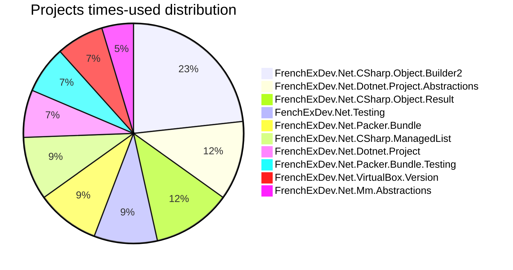

## Top NuGet packages (by project references)
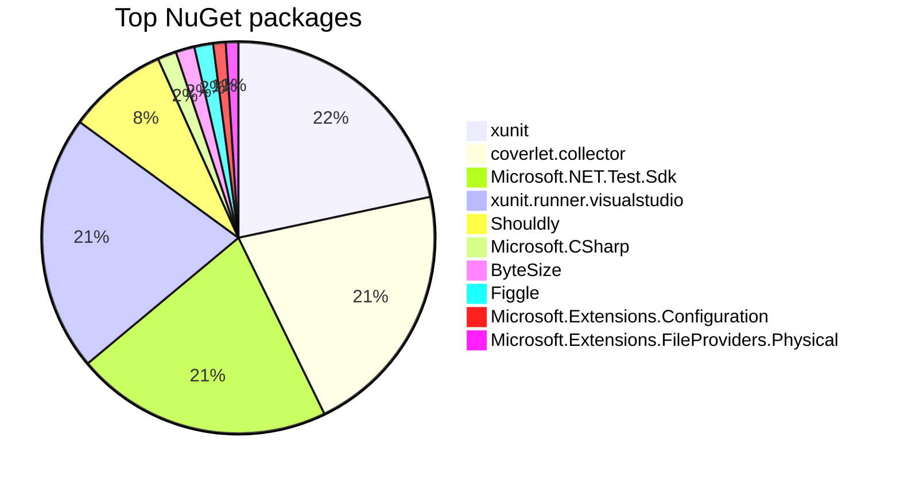


# FenchExDev.Net.Testing

`Path:` C:\code\FrenchExDev.Net\FrenchExDev.Net_i2\FrenchExDev.Net\Testing\src\FenchExDev.Net.Testing\FenchExDev.Net.Testing.csproj

### Key metrics
Metric | Value
--- | ---
Times used | 4
Outgoing project refs | 0
NuGet references | 0
Source files | 4
Lines of code | 183
Comment lines | 83
Comment density | 45,4 %
Diagnostics | 12
Cyclomatic complexity | 1
Commit count | 1
Last commit | 2025-09-21 01:40:40Z
Maintainability index | 93,0
Testability index | -0,5
Hotspot score | 8,80

### Exported constructs
- Records: **1**
- Enums: **2**
- Classes: **5**
- Interfaces: **0**
- Structs: **0**
- Extension methods: **0**
- Public members: **44**

### Package references
_Aucune dépendance NuGet._

### Project references
_Aucune référence de projet._

### Reference coupling
_No coupling data._


### Declarations
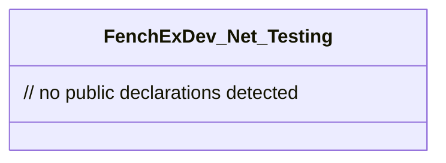

### Packages


### Project references


# FrenchExDev.Net.Alpine.Version

`Path:` C:\code\FrenchExDev.Net\FrenchExDev.Net_i2\FrenchExDev.Net\Alpine\src\FrenchExDev.Net.Alpine.Version\FrenchExDev.Net.Alpine.Version.csproj

### Key metrics
Metric | Value
--- | ---
Times used | 2
Outgoing project refs | 1
NuGet references | 0
Source files | 15
Lines of code | 1484
Comment lines | 525
Comment density | 35,4 %
Diagnostics | 8
Cyclomatic complexity | 155
Commit count | 2
Last commit | 2025-09-21 01:40:40Z
Maintainability index | 0,0
Testability index | 0,3
Hotspot score | 23,60

### Exported constructs
- Records: **3**
- Enums: **3**
- Classes: **7**
- Interfaces: **1**
- Structs: **0**
- Extension methods: **1**
- Public members: **157**

### Package references
_Aucune dépendance NuGet._

### Project references
- FrenchExDev.Net.HttpClient — `C:\code\FrenchExDev.Net\FrenchExDev.Net_i2\FrenchExDev.Net\HttpClient\src\FrenchExDev.Net.HttpClient\FrenchExDev.Net.HttpClient.csproj`

### Reference coupling
Reference | Coupling | TotalUses | InterfaceUses | ClassUses
--- | --- | ---: | ---: | ---:
FrenchExDev.Net.HttpClient.csproj | Low | 7 | 7 | 0


### Declarations
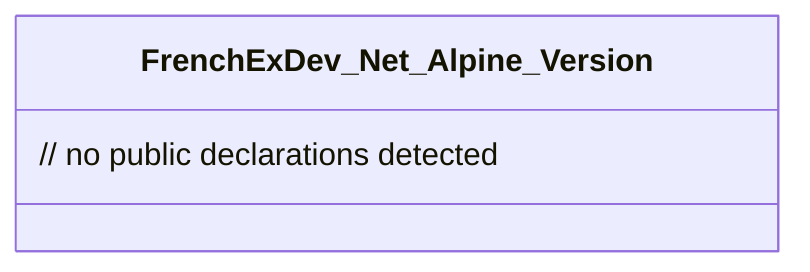

### Packages


### Project references


# FrenchExDev.Net.Alpine.Version.Testing

`Path:` C:\code\FrenchExDev.Net\FrenchExDev.Net_i2\FrenchExDev.Net\Alpine\src\FrenchExDev.Net.Alpine.Version.Testing\FrenchExDev.Net.Alpine.Version.Testing.csproj

### Key metrics
Metric | Value
--- | ---
Times used | 1
Outgoing project refs | 3
NuGet references | 1
Source files | 4
Lines of code | 100
Comment lines | 38
Comment density | 38,0 %
Diagnostics | 10
Cyclomatic complexity | 2
Commit count | 2
Last commit | 2025-09-21 01:40:40Z
Maintainability index | 93,0
Testability index | -0,1
Hotspot score | 2,00

### Exported constructs
- Records: **0**
- Enums: **0**
- Classes: **1**
- Interfaces: **0**
- Structs: **0**
- Extension methods: **0**
- Public members: **2**

### Package references
- Shouldly 

### Project references
- FrenchExDev.Net.CSharp.Object.Builder2 — `C:\code\FrenchExDev.Net\FrenchExDev.Net_i2\FrenchExDev.Net\CSharp.Object.Builder2\src\FrenchExDev.Net.CSharp.Object.Builder2\FrenchExDev.Net.CSharp.Object.Builder2.csproj`
- FrenchExDev.Net.HttpClient.Testing — `C:\code\FrenchExDev.Net\FrenchExDev.Net_i2\FrenchExDev.Net\HttpClient\src\FrenchExDev.Net.HttpClient.Testing\FrenchExDev.Net.HttpClient.Testing.csproj`
- FrenchExDev.Net.Alpine.Version — `C:\code\FrenchExDev.Net\FrenchExDev.Net_i2\FrenchExDev.Net\Alpine\src\FrenchExDev.Net.Alpine.Version\FrenchExDev.Net.Alpine.Version.csproj`

### Reference coupling
Reference | Coupling | TotalUses | InterfaceUses | ClassUses
--- | --- | ---: | ---: | ---:
FrenchExDev.Net.CSharp.Object.Builder2.csproj | Low | 0 | 0 | 0
FrenchExDev.Net.HttpClient.Testing.csproj | High | 4 | 0 | 4
FrenchExDev.Net.Alpine.Version.csproj | High | 10 | 2 | 8


### Declarations
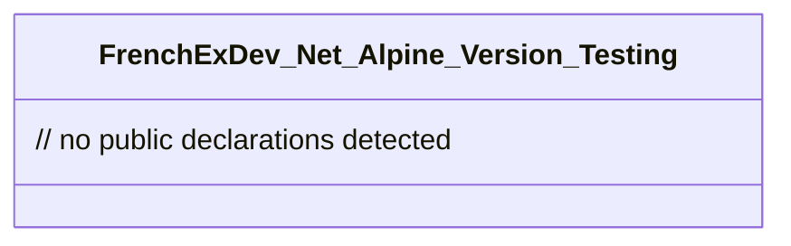

### Packages


### Project references
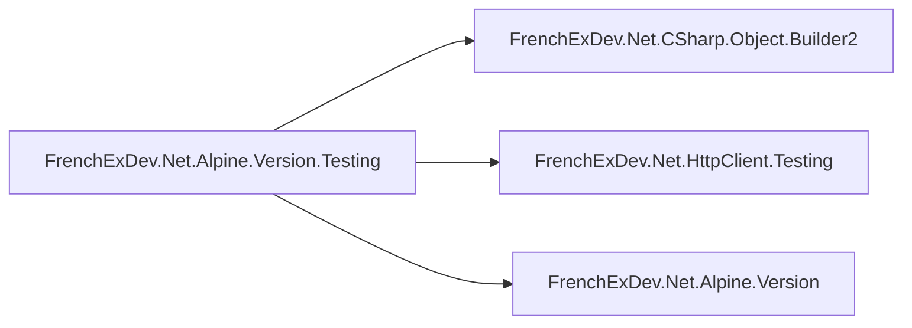

# FrenchExDev.Net.Alpine.Version.Tests

`Path:` C:\code\FrenchExDev.Net\FrenchExDev.Net_i2\FrenchExDev.Net\Alpine\test\FrenchExDev.Net.Alpine.Version.Tests\FrenchExDev.Net.Alpine.Version.Tests.csproj

### Key metrics
Metric | Value
--- | ---
Times used | 0
Outgoing project refs | 3
NuGet references | 4
Source files | 6
Lines of code | 725
Comment lines | 49
Comment density | 6,8 %
Diagnostics | 14
Cyclomatic complexity | 4
Commit count | 3
Last commit | 2025-10-14 21:22:31Z
Maintainability index | 89,0
Testability index | -0,2
Hotspot score | 0,00

### Exported constructs
- Records: **0**
- Enums: **0**
- Classes: **2**
- Interfaces: **0**
- Structs: **0**
- Extension methods: **0**
- Public members: **5**

### Package references
- coverlet.collector 
- Microsoft.NET.Test.Sdk 
- xunit 
- xunit.runner.visualstudio 

### Project references
- FrenchExDev.Net.CSharp.Object.Builder2 — `C:\code\FrenchExDev.Net\FrenchExDev.Net_i2\FrenchExDev.Net\CSharp.Object.Builder2\src\FrenchExDev.Net.CSharp.Object.Builder2\FrenchExDev.Net.CSharp.Object.Builder2.csproj`
- FenchExDev.Net.Testing — `C:\code\FrenchExDev.Net\FrenchExDev.Net_i2\FrenchExDev.Net\Testing\src\FenchExDev.Net.Testing\FenchExDev.Net.Testing.csproj`
- FrenchExDev.Net.Alpine.Version.Testing — `C:\code\FrenchExDev.Net\FrenchExDev.Net_i2\FrenchExDev.Net\Alpine\src\FrenchExDev.Net.Alpine.Version.Testing\FrenchExDev.Net.Alpine.Version.Testing.csproj`

### Reference coupling
Reference | Coupling | TotalUses | InterfaceUses | ClassUses
--- | --- | ---: | ---: | ---:
FrenchExDev.Net.CSharp.Object.Builder2.csproj | Low | 0 | 0 | 0
FenchExDev.Net.Testing.csproj | High | 16 | 4 | 12
FrenchExDev.Net.Alpine.Version.Testing.csproj | High | 4 | 0 | 4


### Declarations
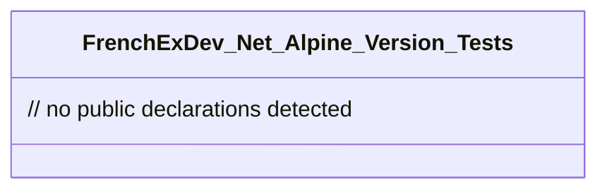

### Packages
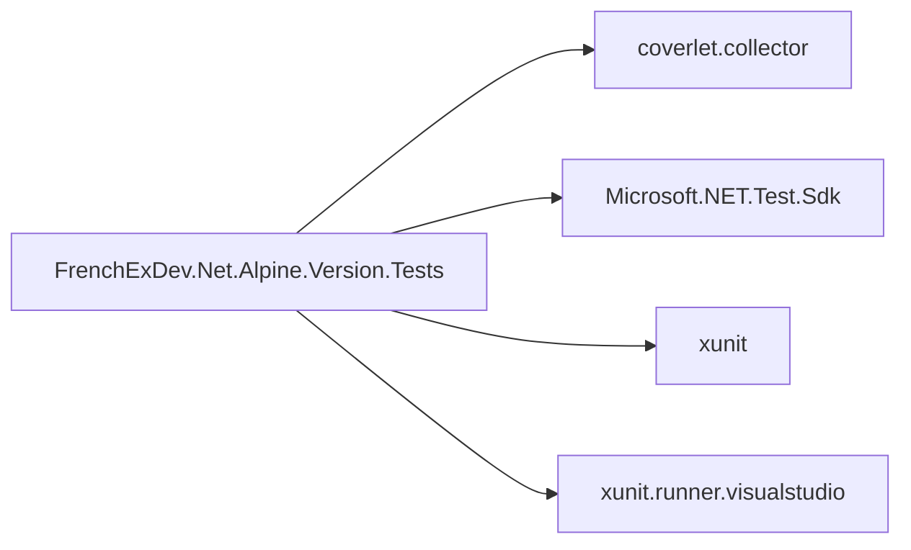

### Project references
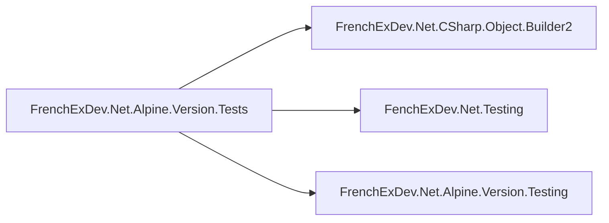

# FrenchExDev.Net.CSharp.ManagedDictionary

`Path:` C:\code\FrenchExDev.Net\FrenchExDev.Net_i2\FrenchExDev.Net\CSharp.ManagedDictionary\src\FrenchExDev.Net.CSharp.ManagedDictionary\FrenchExDev.Net.CSharp.ManagedDictionary.csproj

### Key metrics
Metric | Value
--- | ---
Times used | 2
Outgoing project refs | 0
NuGet references | 0
Source files | 4
Lines of code | 566
Comment lines | 295
Comment density | 52,1 %
Diagnostics | 12
Cyclomatic complexity | 33
Commit count | 1
Last commit | 2025-10-14 20:25:20Z
Maintainability index | 61,0
Testability index | -0,7
Hotspot score | 20,40

### Exported constructs
- Records: **0**
- Enums: **0**
- Classes: **7**
- Interfaces: **0**
- Structs: **0**
- Extension methods: **0**
- Public members: **40**

### Package references
_Aucune dépendance NuGet._

### Project references
_Aucune référence de projet._

### Reference coupling
_No coupling data._


### Declarations
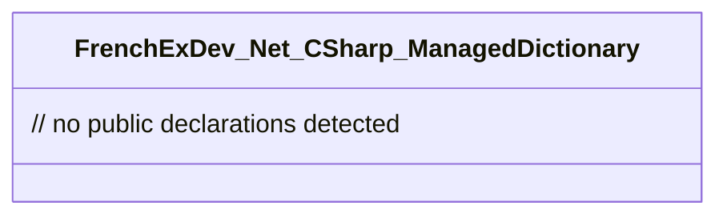

### Packages


### Project references


# FrenchExDev.Net.CSharp.ManagedDictionary.Testing

`Path:` C:\code\FrenchExDev.Net\FrenchExDev.Net_i2\FrenchExDev.Net\CSharp.ManagedDictionary\src\FrenchExDev.Net.CSharp.ManagedDictionary.Testing\FrenchExDev.Net.CSharp.ManagedDictionary.Testing.csproj

### Key metrics
Metric | Value
--- | ---
Times used | 1
Outgoing project refs | 1
NuGet references | 0
Source files | 4
Lines of code | 45
Comment lines | 11
Comment density | 24,4 %
Diagnostics | 13
Cyclomatic complexity | 0
Commit count | 1
Last commit | 2025-10-14 20:25:20Z
Maintainability index | 93,5
Testability index | -0,1
Hotspot score | 2,30

### Exported constructs
- Records: **0**
- Enums: **0**
- Classes: **1**
- Interfaces: **0**
- Structs: **0**
- Extension methods: **0**
- Public members: **1**

### Package references
_Aucune dépendance NuGet._

### Project references
- FrenchExDev.Net.CSharp.ManagedDictionary — `C:\code\FrenchExDev.Net\FrenchExDev.Net_i2\FrenchExDev.Net\CSharp.ManagedDictionary\src\FrenchExDev.Net.CSharp.ManagedDictionary\FrenchExDev.Net.CSharp.ManagedDictionary.csproj`

### Reference coupling
Reference | Coupling | TotalUses | InterfaceUses | ClassUses
--- | --- | ---: | ---: | ---:
FrenchExDev.Net.CSharp.ManagedDictionary.csproj | Low | 0 | 0 | 0


### Declarations
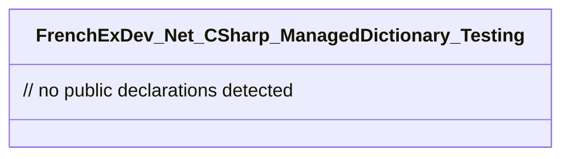

### Packages


### Project references


# FrenchExDev.Net.CSharp.ManagedDictionary.Tests

`Path:` C:\code\FrenchExDev.Net\FrenchExDev.Net_i2\FrenchExDev.Net\CSharp.ManagedDictionary\test\FrenchExDev.Net.CSharp.ManagedDictionary.Tests\FrenchExDev.Net.CSharp.ManagedDictionary.Tests.csproj

### Key metrics
Metric | Value
--- | ---
Times used | 0
Outgoing project refs | 1
NuGet references | 4
Source files | 5
Lines of code | 54
Comment lines | 12
Comment density | 22,2 %
Diagnostics | 15
Cyclomatic complexity | 2
Commit count | 2
Last commit | 2025-10-14 21:22:31Z
Maintainability index | 90,5
Testability index | -0,1
Hotspot score | 0,00

### Exported constructs
- Records: **0**
- Enums: **0**
- Classes: **1**
- Interfaces: **0**
- Structs: **0**
- Extension methods: **0**
- Public members: **2**

### Package references
- coverlet.collector 
- Microsoft.NET.Test.Sdk 
- xunit 
- xunit.runner.visualstudio 

### Project references
- FrenchExDev.Net.CSharp.ManagedDictionary.Testing — `C:\code\FrenchExDev.Net\FrenchExDev.Net_i2\FrenchExDev.Net\CSharp.ManagedDictionary\src\FrenchExDev.Net.CSharp.ManagedDictionary.Testing\FrenchExDev.Net.CSharp.ManagedDictionary.Testing.csproj`

### Reference coupling
Reference | Coupling | TotalUses | InterfaceUses | ClassUses
--- | --- | ---: | ---: | ---:
FrenchExDev.Net.CSharp.ManagedDictionary.Testing.csproj | Low | 0 | 0 | 0


### Declarations
```mermaid
classDiagram
    class FrenchExDev_Net_CSharp_ManagedDictionary_Tests {
        // no public declarations detected
    }
```

### Packages
```mermaid
graph LR
    proj["FrenchExDev.Net.CSharp.ManagedDictionary.Tests"]
    coverlet_collector["coverlet.collector"]
    proj --> coverlet_collector
    Microsoft_NET_Test_Sdk["Microsoft.NET.Test.Sdk"]
    proj --> Microsoft_NET_Test_Sdk
    xunit["xunit"]
    proj --> xunit
    xunit_runner_visualstudio["xunit.runner.visualstudio"]
    proj --> xunit_runner_visualstudio
```

### Project references
```mermaid
graph LR
    proj["FrenchExDev.Net.CSharp.ManagedDictionary.Tests"]
    C__code_FrenchExDev_Net_FrenchExDev_Net_i2_FrenchExDev_Net_CSharp_ManagedDictionary_src_FrenchExDev_Net_CSharp_ManagedDictionary_Testing_FrenchExDev_Net_CSharp_ManagedDictionary_Testing_csproj["FrenchExDev.Net.CSharp.ManagedDictionary.Testing"]
    proj --> C__code_FrenchExDev_Net_FrenchExDev_Net_i2_FrenchExDev_Net_CSharp_ManagedDictionary_src_FrenchExDev_Net_CSharp_ManagedDictionary_Testing_FrenchExDev_Net_CSharp_ManagedDictionary_Testing_csproj
```

# FrenchExDev.Net.CSharp.ManagedList

`Path:` C:\code\FrenchExDev.Net\FrenchExDev.Net_i2\FrenchExDev.Net\CSharp.ManagedList\src\FrenchExDev.Net.CSharp.ManagedList\FrenchExDev.Net.CSharp.ManagedList.csproj

### Key metrics
Metric | Value
--- | ---
Times used | 4
Outgoing project refs | 0
NuGet references | 0
Source files | 4
Lines of code | 370
Comment lines | 157
Comment density | 42,4 %
Diagnostics | 11
Cyclomatic complexity | 24
Commit count | 1
Last commit | 2025-09-28 19:42:25Z
Maintainability index | 70,5
Testability index | -0,7
Hotspot score | 32,40

### Exported constructs
- Records: **0**
- Enums: **0**
- Classes: **7**
- Interfaces: **0**
- Structs: **0**
- Extension methods: **0**
- Public members: **32**

### Package references
_Aucune dépendance NuGet._

### Project references
_Aucune référence de projet._

### Reference coupling
_No coupling data._


### Declarations
```mermaid
classDiagram
    class FrenchExDev_Net_CSharp_ManagedList {
        // no public declarations detected
    }
```

### Packages
```mermaid
graph LR
    proj["FrenchExDev.Net.CSharp.ManagedList"]
```

### Project references
```mermaid
graph LR
    proj["FrenchExDev.Net.CSharp.ManagedList"]
```

# FrenchExDev.Net.CSharp.ManagedList.Testing

`Path:` C:\code\FrenchExDev.Net\FrenchExDev.Net_i2\FrenchExDev.Net\CSharp.ManagedList\src\FrenchExDev.Net.CSharp.ManagedList.Testing\FrenchExDev.Net.CSharp.ManagedList.Testing.csproj

### Key metrics
Metric | Value
--- | ---
Times used | 1
Outgoing project refs | 1
NuGet references | 1
Source files | 4
Lines of code | 89
Comment lines | 40
Comment density | 44,9 %
Diagnostics | 12
Cyclomatic complexity | 2
Commit count | 1
Last commit | 2025-09-28 19:42:25Z
Maintainability index | 92,0
Testability index | -0,1
Hotspot score | 2,20

### Exported constructs
- Records: **0**
- Enums: **0**
- Classes: **1**
- Interfaces: **0**
- Structs: **0**
- Extension methods: **0**
- Public members: **2**

### Package references
- Shouldly 

### Project references
- FrenchExDev.Net.CSharp.ManagedList — `C:\code\FrenchExDev.Net\FrenchExDev.Net_i2\FrenchExDev.Net\CSharp.ManagedList\src\FrenchExDev.Net.CSharp.ManagedList\FrenchExDev.Net.CSharp.ManagedList.csproj`

### Reference coupling
Reference | Coupling | TotalUses | InterfaceUses | ClassUses
--- | --- | ---: | ---: | ---:
FrenchExDev.Net.CSharp.ManagedList.csproj | High | 6 | 0 | 6


### Declarations
```mermaid
classDiagram
    class FrenchExDev_Net_CSharp_ManagedList_Testing {
        // no public declarations detected
    }
```

### Packages
```mermaid
graph LR
    proj["FrenchExDev.Net.CSharp.ManagedList.Testing"]
    Shouldly["Shouldly"]
    proj --> Shouldly
```

### Project references
```mermaid
graph LR
    proj["FrenchExDev.Net.CSharp.ManagedList.Testing"]
    C__code_FrenchExDev_Net_FrenchExDev_Net_i2_FrenchExDev_Net_CSharp_ManagedList_src_FrenchExDev_Net_CSharp_ManagedList_FrenchExDev_Net_CSharp_ManagedList_csproj["FrenchExDev.Net.CSharp.ManagedList"]
    proj --> C__code_FrenchExDev_Net_FrenchExDev_Net_i2_FrenchExDev_Net_CSharp_ManagedList_src_FrenchExDev_Net_CSharp_ManagedList_FrenchExDev_Net_CSharp_ManagedList_csproj
```

# FrenchExDev.Net.CSharp.ManagedList.Tests

`Path:` C:\code\FrenchExDev.Net\FrenchExDev.Net_i2\FrenchExDev.Net\CSharp.ManagedList\test\FrenchExDev.Net.CSharp.ManagedList.Tests\FrenchExDev.Net.CSharp.ManagedList.Tests.csproj

### Key metrics
Metric | Value
--- | ---
Times used | 0
Outgoing project refs | 1
NuGet references | 4
Source files | 5
Lines of code | 268
Comment lines | 92
Comment density | 34,3 %
Diagnostics | 15
Cyclomatic complexity | 10
Commit count | 2
Last commit | 2025-10-14 21:22:31Z
Maintainability index | 82,5
Testability index | -0,1
Hotspot score | 0,00

### Exported constructs
- Records: **0**
- Enums: **0**
- Classes: **1**
- Interfaces: **0**
- Structs: **0**
- Extension methods: **0**
- Public members: **7**

### Package references
- coverlet.collector 
- Microsoft.NET.Test.Sdk 
- xunit 
- xunit.runner.visualstudio 

### Project references
- FrenchExDev.Net.CSharp.ManagedList.Testing — `C:\code\FrenchExDev.Net\FrenchExDev.Net_i2\FrenchExDev.Net\CSharp.ManagedList\src\FrenchExDev.Net.CSharp.ManagedList.Testing\FrenchExDev.Net.CSharp.ManagedList.Testing.csproj`

### Reference coupling
Reference | Coupling | TotalUses | InterfaceUses | ClassUses
--- | --- | ---: | ---: | ---:
FrenchExDev.Net.CSharp.ManagedList.Testing.csproj | High | 6 | 0 | 6


### Declarations
```mermaid
classDiagram
    class FrenchExDev_Net_CSharp_ManagedList_Tests {
        // no public declarations detected
    }
```

### Packages
```mermaid
graph LR
    proj["FrenchExDev.Net.CSharp.ManagedList.Tests"]
    coverlet_collector["coverlet.collector"]
    proj --> coverlet_collector
    Microsoft_NET_Test_Sdk["Microsoft.NET.Test.Sdk"]
    proj --> Microsoft_NET_Test_Sdk
    xunit["xunit"]
    proj --> xunit
    xunit_runner_visualstudio["xunit.runner.visualstudio"]
    proj --> xunit_runner_visualstudio
```

### Project references
```mermaid
graph LR
    proj["FrenchExDev.Net.CSharp.ManagedList.Tests"]
    C__code_FrenchExDev_Net_FrenchExDev_Net_i2_FrenchExDev_Net_CSharp_ManagedList_src_FrenchExDev_Net_CSharp_ManagedList_Testing_FrenchExDev_Net_CSharp_ManagedList_Testing_csproj["FrenchExDev.Net.CSharp.ManagedList.Testing"]
    proj --> C__code_FrenchExDev_Net_FrenchExDev_Net_i2_FrenchExDev_Net_CSharp_ManagedList_src_FrenchExDev_Net_CSharp_ManagedList_Testing_FrenchExDev_Net_CSharp_ManagedList_Testing_csproj
```

# FrenchExDev.Net.CSharp.Object.Biz

`Path:` C:\code\FrenchExDev.Net\FrenchExDev.Net_i2\FrenchExDev.Net\Object.Biz\src\FrenchExDev.Net.CSharp.Object.Biz\FrenchExDev.Net.CSharp.Object.Biz.csproj

### Key metrics
Metric | Value
--- | ---
Times used | 1
Outgoing project refs | 1
NuGet references | 0
Source files | 4
Lines of code | 195
Comment lines | 76
Comment density | 39,0 %
Diagnostics | 11
Cyclomatic complexity | 11
Commit count | 1
Last commit | 2025-09-28 19:42:25Z
Maintainability index | 83,5
Testability index | 2,5
Hotspot score | 4,10

### Exported constructs
- Records: **0**
- Enums: **0**
- Classes: **5**
- Interfaces: **3**
- Structs: **0**
- Extension methods: **0**
- Public members: **14**

### Package references
_Aucune dépendance NuGet._

### Project references
- FrenchExDev.Net.CSharp.Object.Result — `C:\code\FrenchExDev.Net\FrenchExDev.Net_i2\FrenchExDev.Net\CSharp.Object.Result\src\FrenchExDev.Net.CSharp.Object.Result\FrenchExDev.Net.CSharp.Object.Result.csproj`

### Reference coupling
Reference | Coupling | TotalUses | InterfaceUses | ClassUses
--- | --- | ---: | ---: | ---:
FrenchExDev.Net.CSharp.Object.Result.csproj | Low | 5 | 4 | 1


### Declarations
```mermaid
classDiagram
    class FrenchExDev_Net_CSharp_Object_Biz {
        // no public declarations detected
    }
```

### Packages
```mermaid
graph LR
    proj["FrenchExDev.Net.CSharp.Object.Biz"]
```

### Project references
```mermaid
graph LR
    proj["FrenchExDev.Net.CSharp.Object.Biz"]
    C__code_FrenchExDev_Net_FrenchExDev_Net_i2_FrenchExDev_Net_CSharp_Object_Result_src_FrenchExDev_Net_CSharp_Object_Result_FrenchExDev_Net_CSharp_Object_Result_csproj["FrenchExDev.Net.CSharp.Object.Result"]
    proj --> C__code_FrenchExDev_Net_FrenchExDev_Net_i2_FrenchExDev_Net_CSharp_Object_Result_src_FrenchExDev_Net_CSharp_Object_Result_FrenchExDev_Net_CSharp_Object_Result_csproj
```

# FrenchExDev.Net.CSharp.Object.Biz.Testing

`Path:` C:\code\FrenchExDev.Net\FrenchExDev.Net_i2\FrenchExDev.Net\Object.Biz\src\FrenchExDev.Net.CSharp.Object.Biz.Testing\FrenchExDev.Net.CSharp.Object.Biz.Testing.csproj

### Key metrics
Metric | Value
--- | ---
Times used | 1
Outgoing project refs | 1
NuGet references | 1
Source files | 4
Lines of code | 45
Comment lines | 11
Comment density | 24,4 %
Diagnostics | 13
Cyclomatic complexity | 0
Commit count | 1
Last commit | 2025-09-28 19:42:25Z
Maintainability index | 93,5
Testability index | -0,1
Hotspot score | 2,30

### Exported constructs
- Records: **0**
- Enums: **0**
- Classes: **1**
- Interfaces: **0**
- Structs: **0**
- Extension methods: **0**
- Public members: **1**

### Package references
- Shouldly 

### Project references
- FrenchExDev.Net.CSharp.Object.Biz — `C:\code\FrenchExDev.Net\FrenchExDev.Net_i2\FrenchExDev.Net\Object.Biz\src\FrenchExDev.Net.CSharp.Object.Biz\FrenchExDev.Net.CSharp.Object.Biz.csproj`

### Reference coupling
Reference | Coupling | TotalUses | InterfaceUses | ClassUses
--- | --- | ---: | ---: | ---:
FrenchExDev.Net.CSharp.Object.Biz.csproj | Low | 0 | 0 | 0


### Declarations
```mermaid
classDiagram
    class FrenchExDev_Net_CSharp_Object_Biz_Testing {
        // no public declarations detected
    }
```

### Packages
```mermaid
graph LR
    proj["FrenchExDev.Net.CSharp.Object.Biz.Testing"]
    Shouldly["Shouldly"]
    proj --> Shouldly
```

### Project references
```mermaid
graph LR
    proj["FrenchExDev.Net.CSharp.Object.Biz.Testing"]
    C__code_FrenchExDev_Net_FrenchExDev_Net_i2_FrenchExDev_Net_Object_Biz_src_FrenchExDev_Net_CSharp_Object_Biz_FrenchExDev_Net_CSharp_Object_Biz_csproj["FrenchExDev.Net.CSharp.Object.Biz"]
    proj --> C__code_FrenchExDev_Net_FrenchExDev_Net_i2_FrenchExDev_Net_Object_Biz_src_FrenchExDev_Net_CSharp_Object_Biz_FrenchExDev_Net_CSharp_Object_Biz_csproj
```

# FrenchExDev.Net.CSharp.Object.Biz.Tests

`Path:` C:\code\FrenchExDev.Net\FrenchExDev.Net_i2\FrenchExDev.Net\Object.Biz\test\FrenchExDev.Net.CSharp.Object.Biz.Tests\FrenchExDev.Net.CSharp.Object.Biz.Tests.csproj

### Key metrics
Metric | Value
--- | ---
Times used | 0
Outgoing project refs | 2
NuGet references | 4
Source files | 6
Lines of code | 165
Comment lines | 68
Comment density | 41,2 %
Diagnostics | 15
Cyclomatic complexity | 5
Commit count | 2
Last commit | 2025-10-14 21:22:31Z
Maintainability index | 87,5
Testability index | -0,2
Hotspot score | 0,00

### Exported constructs
- Records: **0**
- Enums: **0**
- Classes: **2**
- Interfaces: **0**
- Structs: **0**
- Extension methods: **0**
- Public members: **4**

### Package references
- coverlet.collector 
- Microsoft.NET.Test.Sdk 
- xunit 
- xunit.runner.visualstudio 

### Project references
- FrenchExDev.Net.CSharp.Object.Result — `C:\code\FrenchExDev.Net\FrenchExDev.Net_i2\FrenchExDev.Net\CSharp.Object.Result\src\FrenchExDev.Net.CSharp.Object.Result\FrenchExDev.Net.CSharp.Object.Result.csproj`
- FrenchExDev.Net.CSharp.Object.Biz.Testing — `C:\code\FrenchExDev.Net\FrenchExDev.Net_i2\FrenchExDev.Net\Object.Biz\src\FrenchExDev.Net.CSharp.Object.Biz.Testing\FrenchExDev.Net.CSharp.Object.Biz.Testing.csproj`

### Reference coupling
Reference | Coupling | TotalUses | InterfaceUses | ClassUses
--- | --- | ---: | ---: | ---:
FrenchExDev.Net.CSharp.Object.Result.csproj | Low | 0 | 0 | 0
FrenchExDev.Net.CSharp.Object.Biz.Testing.csproj | Low | 0 | 0 | 0


### Declarations
```mermaid
classDiagram
    class FrenchExDev_Net_CSharp_Object_Biz_Tests {
        // no public declarations detected
    }
```

### Packages
```mermaid
graph LR
    proj["FrenchExDev.Net.CSharp.Object.Biz.Tests"]
    coverlet_collector["coverlet.collector"]
    proj --> coverlet_collector
    Microsoft_NET_Test_Sdk["Microsoft.NET.Test.Sdk"]
    proj --> Microsoft_NET_Test_Sdk
    xunit["xunit"]
    proj --> xunit
    xunit_runner_visualstudio["xunit.runner.visualstudio"]
    proj --> xunit_runner_visualstudio
```

### Project references
```mermaid
graph LR
    proj["FrenchExDev.Net.CSharp.Object.Biz.Tests"]
    C__code_FrenchExDev_Net_FrenchExDev_Net_i2_FrenchExDev_Net_CSharp_Object_Result_src_FrenchExDev_Net_CSharp_Object_Result_FrenchExDev_Net_CSharp_Object_Result_csproj["FrenchExDev.Net.CSharp.Object.Result"]
    proj --> C__code_FrenchExDev_Net_FrenchExDev_Net_i2_FrenchExDev_Net_CSharp_Object_Result_src_FrenchExDev_Net_CSharp_Object_Result_FrenchExDev_Net_CSharp_Object_Result_csproj
    C__code_FrenchExDev_Net_FrenchExDev_Net_i2_FrenchExDev_Net_Object_Biz_src_FrenchExDev_Net_CSharp_Object_Biz_Testing_FrenchExDev_Net_CSharp_Object_Biz_Testing_csproj["FrenchExDev.Net.CSharp.Object.Biz.Testing"]
    proj --> C__code_FrenchExDev_Net_FrenchExDev_Net_i2_FrenchExDev_Net_Object_Biz_src_FrenchExDev_Net_CSharp_Object_Biz_Testing_FrenchExDev_Net_CSharp_Object_Biz_Testing_csproj
```

# FrenchExDev.Net.CSharp.Object.Builder2

`Path:` C:\code\FrenchExDev.Net\FrenchExDev.Net_i2\FrenchExDev.Net\CSharp.Object.Builder2\src\FrenchExDev.Net.CSharp.Object.Builder2\FrenchExDev.Net.CSharp.Object.Builder2.csproj

### Key metrics
Metric | Value
--- | ---
Times used | 10
Outgoing project refs | 0
NuGet references | 0
Source files | 4
Lines of code | 1040
Comment lines | 599
Comment density | 57,6 %
Diagnostics | 10
Cyclomatic complexity | 122
Commit count | 1
Last commit | 2025-09-16 20:20:24Z
Maintainability index | 0,0
Testability index | 1,7
Hotspot score | 320,00

### Exported constructs
- Records: **1**
- Enums: **2**
- Classes: **13**
- Interfaces: **3**
- Structs: **1**
- Extension methods: **4**
- Public members: **137**

### Package references
_Aucune dépendance NuGet._

### Project references
_Aucune référence de projet._

### Reference coupling
_No coupling data._


### Declarations
```mermaid
classDiagram
    class FrenchExDev_Net_CSharp_Object_Builder2 {
        // no public declarations detected
    }
```

### Packages
```mermaid
graph LR
    proj["FrenchExDev.Net.CSharp.Object.Builder2"]
```

### Project references
```mermaid
graph LR
    proj["FrenchExDev.Net.CSharp.Object.Builder2"]
```

# FrenchExDev.Net.CSharp.Object.Builder2.Testing

`Path:` C:\code\FrenchExDev.Net\FrenchExDev.Net_i2\FrenchExDev.Net\CSharp.Object.Builder2\src\FrenchExDev.Net.CSharp.Object.Builder2.Testing\FrenchExDev.Net.CSharp.Object.Builder2.Testing.csproj

### Key metrics
Metric | Value
--- | ---
Times used | 1
Outgoing project refs | 1
NuGet references | 1
Source files | 4
Lines of code | 400
Comment lines | 152
Comment density | 38,0 %
Diagnostics | 11
Cyclomatic complexity | 28
Commit count | 1
Last commit | 2025-09-16 20:20:24Z
Maintainability index | 66,5
Testability index | -1,0
Hotspot score | 9,10

### Exported constructs
- Records: **0**
- Enums: **0**
- Classes: **10**
- Interfaces: **0**
- Structs: **0**
- Extension methods: **0**
- Public members: **42**

### Package references
- Shouldly 

### Project references
- FrenchExDev.Net.CSharp.Object.Builder2 — `C:\code\FrenchExDev.Net\FrenchExDev.Net_i2\FrenchExDev.Net\CSharp.Object.Builder2\src\FrenchExDev.Net.CSharp.Object.Builder2\FrenchExDev.Net.CSharp.Object.Builder2.csproj`

### Reference coupling
Reference | Coupling | TotalUses | InterfaceUses | ClassUses
--- | --- | ---: | ---: | ---:
FrenchExDev.Net.CSharp.Object.Builder2.csproj | High | 29 | 0 | 29


### Declarations
```mermaid
classDiagram
    class FrenchExDev_Net_CSharp_Object_Builder2_Testing {
        // no public declarations detected
    }
```

### Packages
```mermaid
graph LR
    proj["FrenchExDev.Net.CSharp.Object.Builder2.Testing"]
    Shouldly["Shouldly"]
    proj --> Shouldly
```

### Project references
```mermaid
graph LR
    proj["FrenchExDev.Net.CSharp.Object.Builder2.Testing"]
    C__code_FrenchExDev_Net_FrenchExDev_Net_i2_FrenchExDev_Net_CSharp_Object_Builder2_src_FrenchExDev_Net_CSharp_Object_Builder2_FrenchExDev_Net_CSharp_Object_Builder2_csproj["FrenchExDev.Net.CSharp.Object.Builder2"]
    proj --> C__code_FrenchExDev_Net_FrenchExDev_Net_i2_FrenchExDev_Net_CSharp_Object_Builder2_src_FrenchExDev_Net_CSharp_Object_Builder2_FrenchExDev_Net_CSharp_Object_Builder2_csproj
```

# FrenchExDev.Net.CSharp.Object.Builder2.Tests

`Path:` C:\code\FrenchExDev.Net\FrenchExDev.Net_i2\FrenchExDev.Net\CSharp.Object.Builder2\test\FrenchExDev.Net.CSharp.Object.Builder2.Tests\FrenchExDev.Net.CSharp.Object.Builder2.Tests.csproj

### Key metrics
Metric | Value
--- | ---
Times used | 0
Outgoing project refs | 1
NuGet references | 4
Source files | 5
Lines of code | 148
Comment lines | 38
Comment density | 25,7 %
Diagnostics | 13
Cyclomatic complexity | 3
Commit count | 1
Last commit | 2025-09-16 20:20:24Z
Maintainability index | 90,5
Testability index | -0,1
Hotspot score | 0,00

### Exported constructs
- Records: **0**
- Enums: **0**
- Classes: **1**
- Interfaces: **0**
- Structs: **0**
- Extension methods: **0**
- Public members: **3**

### Package references
- coverlet.collector 
- Microsoft.NET.Test.Sdk 
- xunit 
- xunit.runner.visualstudio 

### Project references
- FrenchExDev.Net.CSharp.Object.Builder2.Testing — `C:\code\FrenchExDev.Net\FrenchExDev.Net_i2\FrenchExDev.Net\CSharp.Object.Builder2\src\FrenchExDev.Net.CSharp.Object.Builder2.Testing\FrenchExDev.Net.CSharp.Object.Builder2.Testing.csproj`

### Reference coupling
Reference | Coupling | TotalUses | InterfaceUses | ClassUses
--- | --- | ---: | ---: | ---:
FrenchExDev.Net.CSharp.Object.Builder2.Testing.csproj | High | 40 | 0 | 40


### Declarations
```mermaid
classDiagram
    class FrenchExDev_Net_CSharp_Object_Builder2_Tests {
        // no public declarations detected
    }
```

### Packages
```mermaid
graph LR
    proj["FrenchExDev.Net.CSharp.Object.Builder2.Tests"]
    coverlet_collector["coverlet.collector"]
    proj --> coverlet_collector
    Microsoft_NET_Test_Sdk["Microsoft.NET.Test.Sdk"]
    proj --> Microsoft_NET_Test_Sdk
    xunit["xunit"]
    proj --> xunit
    xunit_runner_visualstudio["xunit.runner.visualstudio"]
    proj --> xunit_runner_visualstudio
```

### Project references
```mermaid
graph LR
    proj["FrenchExDev.Net.CSharp.Object.Builder2.Tests"]
    C__code_FrenchExDev_Net_FrenchExDev_Net_i2_FrenchExDev_Net_CSharp_Object_Builder2_src_FrenchExDev_Net_CSharp_Object_Builder2_Testing_FrenchExDev_Net_CSharp_Object_Builder2_Testing_csproj["FrenchExDev.Net.CSharp.Object.Builder2.Testing"]
    proj --> C__code_FrenchExDev_Net_FrenchExDev_Net_i2_FrenchExDev_Net_CSharp_Object_Builder2_src_FrenchExDev_Net_CSharp_Object_Builder2_Testing_FrenchExDev_Net_CSharp_Object_Builder2_Testing_csproj
```

# FrenchExDev.Net.CSharp.Object.Model

`Path:` C:\code\FrenchExDev.Net\FrenchExDev.Net_i2\FrenchExDev.Net\CSharp.Object.Model\src\FrenchExDev.Net.CSharp.Object.Model\FrenchExDev.Net.CSharp.Object.Model.csproj

### Key metrics
Metric | Value
--- | ---
Times used | 1
Outgoing project refs | 1
NuGet references | 0
Source files | 3
Lines of code | 37
Comment lines | 11
Comment density | 29,7 %
Diagnostics | 13
Cyclomatic complexity | 0
Commit count | 1
Last commit | 2025-09-07 17:11:29Z
Maintainability index | 93,5
Testability index | 0,0
Hotspot score | 2,30

### Exported constructs
- Records: **0**
- Enums: **0**
- Classes: **0**
- Interfaces: **0**
- Structs: **0**
- Extension methods: **0**
- Public members: **0**

### Package references
_Aucune dépendance NuGet._

### Project references
- FrenchExDev.Net.CSharp.Object.Model.Infrastructure — `C:\code\FrenchExDev.Net\FrenchExDev.Net_i2\FrenchExDev.Net\CSharp.Object.Model\src\FrenchExDev.Net.CSharp.Object.Model.Infrastructure\FrenchExDev.Net.CSharp.Object.Model.Infrastructure.csproj`

### Reference coupling
Reference | Coupling | TotalUses | InterfaceUses | ClassUses
--- | --- | ---: | ---: | ---:
FrenchExDev.Net.CSharp.Object.Model.Infrastructure.csproj | Low | 0 | 0 | 0


### Declarations
```mermaid
classDiagram
    class FrenchExDev_Net_CSharp_Object_Model {
        // no public declarations detected
    }
```

### Packages
```mermaid
graph LR
    proj["FrenchExDev.Net.CSharp.Object.Model"]
```

### Project references
```mermaid
graph LR
    proj["FrenchExDev.Net.CSharp.Object.Model"]
    C__code_FrenchExDev_Net_FrenchExDev_Net_i2_FrenchExDev_Net_CSharp_Object_Model_src_FrenchExDev_Net_CSharp_Object_Model_Infrastructure_FrenchExDev_Net_CSharp_Object_Model_Infrastructure_csproj["FrenchExDev.Net.CSharp.Object.Model.Infrastructure"]
    proj --> C__code_FrenchExDev_Net_FrenchExDev_Net_i2_FrenchExDev_Net_CSharp_Object_Model_src_FrenchExDev_Net_CSharp_Object_Model_Infrastructure_FrenchExDev_Net_CSharp_Object_Model_Infrastructure_csproj
```

# FrenchExDev.Net.CSharp.Object.Model.Abstractions

`Path:` C:\code\FrenchExDev.Net\FrenchExDev.Net_i2\FrenchExDev.Net\CSharp.Object.Model\src\FrenchExDev.Net.CSharp.Object.Model.Abstractions\FrenchExDev.Net.CSharp.Object.Model.Abstractions.csproj

### Key metrics
Metric | Value
--- | ---
Times used | 2
Outgoing project refs | 1
NuGet references | 0
Source files | 45
Lines of code | 3749
Comment lines | 1819
Comment density | 48,5 %
Diagnostics | 10
Cyclomatic complexity | 160
Commit count | 3
Last commit | 2025-09-21 01:40:40Z
Maintainability index | 0,0
Testability index | -1,5
Hotspot score | 10,00

### Exported constructs
- Records: **0**
- Enums: **6**
- Classes: **35**
- Interfaces: **2**
- Structs: **0**
- Extension methods: **1**
- Public members: **378**

### Package references
_Aucune dépendance NuGet._

### Project references
- FrenchExDev.Net.CSharp.Object.Builder2 — `C:\code\FrenchExDev.Net\FrenchExDev.Net_i2\FrenchExDev.Net\CSharp.Object.Builder2\src\FrenchExDev.Net.CSharp.Object.Builder2\FrenchExDev.Net.CSharp.Object.Builder2.csproj`

### Reference coupling
Reference | Coupling | TotalUses | InterfaceUses | ClassUses
--- | --- | ---: | ---: | ---:
FrenchExDev.Net.CSharp.Object.Builder2.csproj | High | 189 | 7 | 182


### Declarations
```mermaid
classDiagram
    class FrenchExDev_Net_CSharp_Object_Model_Abstractions {
        // no public declarations detected
    }
```

### Packages
```mermaid
graph LR
    proj["FrenchExDev.Net.CSharp.Object.Model.Abstractions"]
```

### Project references
```mermaid
graph LR
    proj["FrenchExDev.Net.CSharp.Object.Model.Abstractions"]
    C__code_FrenchExDev_Net_FrenchExDev_Net_i2_FrenchExDev_Net_CSharp_Object_Builder2_src_FrenchExDev_Net_CSharp_Object_Builder2_FrenchExDev_Net_CSharp_Object_Builder2_csproj["FrenchExDev.Net.CSharp.Object.Builder2"]
    proj --> C__code_FrenchExDev_Net_FrenchExDev_Net_i2_FrenchExDev_Net_CSharp_Object_Builder2_src_FrenchExDev_Net_CSharp_Object_Builder2_FrenchExDev_Net_CSharp_Object_Builder2_csproj
```

# FrenchExDev.Net.CSharp.Object.Model.Infrastructure

`Path:` C:\code\FrenchExDev.Net\FrenchExDev.Net_i2\FrenchExDev.Net\CSharp.Object.Model\src\FrenchExDev.Net.CSharp.Object.Model.Infrastructure\FrenchExDev.Net.CSharp.Object.Model.Infrastructure.csproj

### Key metrics
Metric | Value
--- | ---
Times used | 2
Outgoing project refs | 1
NuGet references | 2
Source files | 6
Lines of code | 520
Comment lines | 129
Comment density | 24,8 %
Diagnostics | 10
Cyclomatic complexity | 36
Commit count | 1
Last commit | 2025-09-07 17:11:29Z
Maintainability index | 59,0
Testability index | 0,8
Hotspot score | 16,00

### Exported constructs
- Records: **0**
- Enums: **0**
- Classes: **2**
- Interfaces: **1**
- Structs: **0**
- Extension methods: **1**
- Public members: **22**

### Package references
- Microsoft.CodeAnalysis.CSharp 
- Microsoft.CSharp 

### Project references
- FrenchExDev.Net.CSharp.Object.Model.Abstractions — `C:\code\FrenchExDev.Net\FrenchExDev.Net_i2\FrenchExDev.Net\CSharp.Object.Model\src\FrenchExDev.Net.CSharp.Object.Model.Abstractions\FrenchExDev.Net.CSharp.Object.Model.Abstractions.csproj`

### Reference coupling
Reference | Coupling | TotalUses | InterfaceUses | ClassUses
--- | --- | ---: | ---: | ---:
FrenchExDev.Net.CSharp.Object.Model.Abstractions.csproj | High | 36 | 9 | 27


### Declarations
```mermaid
classDiagram
    class FrenchExDev_Net_CSharp_Object_Model_Infrastructure {
        // no public declarations detected
    }
```

### Packages
```mermaid
graph LR
    proj["FrenchExDev.Net.CSharp.Object.Model.Infrastructure"]
    Microsoft_CodeAnalysis_CSharp["Microsoft.CodeAnalysis.CSharp"]
    proj --> Microsoft_CodeAnalysis_CSharp
    Microsoft_CSharp["Microsoft.CSharp"]
    proj --> Microsoft_CSharp
```

### Project references
```mermaid
graph LR
    proj["FrenchExDev.Net.CSharp.Object.Model.Infrastructure"]
    C__code_FrenchExDev_Net_FrenchExDev_Net_i2_FrenchExDev_Net_CSharp_Object_Model_src_FrenchExDev_Net_CSharp_Object_Model_Abstractions_FrenchExDev_Net_CSharp_Object_Model_Abstractions_csproj["FrenchExDev.Net.CSharp.Object.Model.Abstractions"]
    proj --> C__code_FrenchExDev_Net_FrenchExDev_Net_i2_FrenchExDev_Net_CSharp_Object_Model_src_FrenchExDev_Net_CSharp_Object_Model_Abstractions_FrenchExDev_Net_CSharp_Object_Model_Abstractions_csproj
```

# FrenchExDev.Net.CSharp.Object.Model.Testing

`Path:` C:\code\FrenchExDev.Net\FrenchExDev.Net_i2\FrenchExDev.Net\CSharp.Object.Model\src\FrenchExDev.Net.CSharp.Object.Model.Testing\FrenchExDev.Net.CSharp.Object.Model.Testing.csproj

### Key metrics
Metric | Value
--- | ---
Times used | 1
Outgoing project refs | 1
NuGet references | 1
Source files | 4
Lines of code | 130
Comment lines | 49
Comment density | 37,7 %
Diagnostics | 12
Cyclomatic complexity | 2
Commit count | 1
Last commit | 2025-09-07 17:11:29Z
Maintainability index | 92,0
Testability index | -0,1
Hotspot score | 2,20

### Exported constructs
- Records: **0**
- Enums: **0**
- Classes: **1**
- Interfaces: **0**
- Structs: **0**
- Extension methods: **0**
- Public members: **2**

### Package references
- Shouldly 

### Project references
- FrenchExDev.Net.CSharp.Object.Model — `C:\code\FrenchExDev.Net\FrenchExDev.Net_i2\FrenchExDev.Net\CSharp.Object.Model\src\FrenchExDev.Net.CSharp.Object.Model\FrenchExDev.Net.CSharp.Object.Model.csproj`

### Reference coupling
Reference | Coupling | TotalUses | InterfaceUses | ClassUses
--- | --- | ---: | ---: | ---:
FrenchExDev.Net.CSharp.Object.Model.csproj | Low | 0 | 0 | 0


### Declarations
```mermaid
classDiagram
    class FrenchExDev_Net_CSharp_Object_Model_Testing {
        // no public declarations detected
    }
```

### Packages
```mermaid
graph LR
    proj["FrenchExDev.Net.CSharp.Object.Model.Testing"]
    Shouldly["Shouldly"]
    proj --> Shouldly
```

### Project references
```mermaid
graph LR
    proj["FrenchExDev.Net.CSharp.Object.Model.Testing"]
    C__code_FrenchExDev_Net_FrenchExDev_Net_i2_FrenchExDev_Net_CSharp_Object_Model_src_FrenchExDev_Net_CSharp_Object_Model_FrenchExDev_Net_CSharp_Object_Model_csproj["FrenchExDev.Net.CSharp.Object.Model"]
    proj --> C__code_FrenchExDev_Net_FrenchExDev_Net_i2_FrenchExDev_Net_CSharp_Object_Model_src_FrenchExDev_Net_CSharp_Object_Model_FrenchExDev_Net_CSharp_Object_Model_csproj
```

# FrenchExDev.Net.CSharp.Object.Model.Tests

`Path:` C:\code\FrenchExDev.Net\FrenchExDev.Net_i2\FrenchExDev.Net\CSharp.Object.Model\test\FrenchExDev.Net.CSharp.Object.Model.Tests\FrenchExDev.Net.CSharp.Object.Model.Tests.csproj

### Key metrics
Metric | Value
--- | ---
Times used | 0
Outgoing project refs | 1
NuGet references | 4
Source files | 5
Lines of code | 120
Comment lines | 26
Comment density | 21,7 %
Diagnostics | 13
Cyclomatic complexity | 3
Commit count | 1
Last commit | 2025-09-07 17:11:29Z
Maintainability index | 90,5
Testability index | -0,1
Hotspot score | 0,00

### Exported constructs
- Records: **0**
- Enums: **0**
- Classes: **1**
- Interfaces: **0**
- Structs: **0**
- Extension methods: **0**
- Public members: **3**

### Package references
- coverlet.collector 
- Microsoft.NET.Test.Sdk 
- xunit 
- xunit.runner.visualstudio 

### Project references
- FrenchExDev.Net.CSharp.Object.Model.Testing — `C:\code\FrenchExDev.Net\FrenchExDev.Net_i2\FrenchExDev.Net\CSharp.Object.Model\src\FrenchExDev.Net.CSharp.Object.Model.Testing\FrenchExDev.Net.CSharp.Object.Model.Testing.csproj`

### Reference coupling
Reference | Coupling | TotalUses | InterfaceUses | ClassUses
--- | --- | ---: | ---: | ---:
FrenchExDev.Net.CSharp.Object.Model.Testing.csproj | High | 2 | 0 | 2


### Declarations
```mermaid
classDiagram
    class FrenchExDev_Net_CSharp_Object_Model_Tests {
        // no public declarations detected
    }
```

### Packages
```mermaid
graph LR
    proj["FrenchExDev.Net.CSharp.Object.Model.Tests"]
    coverlet_collector["coverlet.collector"]
    proj --> coverlet_collector
    Microsoft_NET_Test_Sdk["Microsoft.NET.Test.Sdk"]
    proj --> Microsoft_NET_Test_Sdk
    xunit["xunit"]
    proj --> xunit
    xunit_runner_visualstudio["xunit.runner.visualstudio"]
    proj --> xunit_runner_visualstudio
```

### Project references
```mermaid
graph LR
    proj["FrenchExDev.Net.CSharp.Object.Model.Tests"]
    C__code_FrenchExDev_Net_FrenchExDev_Net_i2_FrenchExDev_Net_CSharp_Object_Model_src_FrenchExDev_Net_CSharp_Object_Model_Testing_FrenchExDev_Net_CSharp_Object_Model_Testing_csproj["FrenchExDev.Net.CSharp.Object.Model.Testing"]
    proj --> C__code_FrenchExDev_Net_FrenchExDev_Net_i2_FrenchExDev_Net_CSharp_Object_Model_src_FrenchExDev_Net_CSharp_Object_Model_Testing_FrenchExDev_Net_CSharp_Object_Model_Testing_csproj
```

# FrenchExDev.Net.CSharp.Object.Result

`Path:` C:\code\FrenchExDev.Net\FrenchExDev.Net_i2\FrenchExDev.Net\CSharp.Object.Result\src\FrenchExDev.Net.CSharp.Object.Result\FrenchExDev.Net.CSharp.Object.Result.csproj

### Key metrics
Metric | Value
--- | ---
Times used | 5
Outgoing project refs | 0
NuGet references | 0
Source files | 4
Lines of code | 335
Comment lines | 177
Comment density | 52,8 %
Diagnostics | 11
Cyclomatic complexity | 19
Commit count | 1
Last commit | 2025-09-28 19:42:25Z
Maintainability index | 75,5
Testability index | 0,6
Hotspot score | 30,50

### Exported constructs
- Records: **0**
- Enums: **0**
- Classes: **4**
- Interfaces: **1**
- Structs: **2**
- Extension methods: **0**
- Public members: **37**

### Package references
_Aucune dépendance NuGet._

### Project references
_Aucune référence de projet._

### Reference coupling
_No coupling data._


### Declarations
```mermaid
classDiagram
    class FrenchExDev_Net_CSharp_Object_Result {
        // no public declarations detected
    }
```

### Packages
```mermaid
graph LR
    proj["FrenchExDev.Net.CSharp.Object.Result"]
```

### Project references
```mermaid
graph LR
    proj["FrenchExDev.Net.CSharp.Object.Result"]
```

# FrenchExDev.Net.CSharp.Object.Result.Testing

`Path:` C:\code\FrenchExDev.Net\FrenchExDev.Net_i2\FrenchExDev.Net\CSharp.Object.Result\src\FrenchExDev.Net.CSharp.Object.Result.Testing\FrenchExDev.Net.CSharp.Object.Result.Testing.csproj

### Key metrics
Metric | Value
--- | ---
Times used | 1
Outgoing project refs | 1
NuGet references | 0
Source files | 4
Lines of code | 44
Comment lines | 11
Comment density | 25,0 %
Diagnostics | 13
Cyclomatic complexity | 0
Commit count | 1
Last commit | 2025-09-28 19:42:25Z
Maintainability index | 93,5
Testability index | -0,1
Hotspot score | 2,30

### Exported constructs
- Records: **0**
- Enums: **0**
- Classes: **1**
- Interfaces: **0**
- Structs: **0**
- Extension methods: **0**
- Public members: **1**

### Package references
_Aucune dépendance NuGet._

### Project references
- FrenchExDev.Net.CSharp.Object.Result — `C:\code\FrenchExDev.Net\FrenchExDev.Net_i2\FrenchExDev.Net\CSharp.Object.Result\src\FrenchExDev.Net.CSharp.Object.Result\FrenchExDev.Net.CSharp.Object.Result.csproj`

### Reference coupling
Reference | Coupling | TotalUses | InterfaceUses | ClassUses
--- | --- | ---: | ---: | ---:
FrenchExDev.Net.CSharp.Object.Result.csproj | Low | 0 | 0 | 0


### Declarations
```mermaid
classDiagram
    class FrenchExDev_Net_CSharp_Object_Result_Testing {
        // no public declarations detected
    }
```

### Packages
```mermaid
graph LR
    proj["FrenchExDev.Net.CSharp.Object.Result.Testing"]
```

### Project references
```mermaid
graph LR
    proj["FrenchExDev.Net.CSharp.Object.Result.Testing"]
    C__code_FrenchExDev_Net_FrenchExDev_Net_i2_FrenchExDev_Net_CSharp_Object_Result_src_FrenchExDev_Net_CSharp_Object_Result_FrenchExDev_Net_CSharp_Object_Result_csproj["FrenchExDev.Net.CSharp.Object.Result"]
    proj --> C__code_FrenchExDev_Net_FrenchExDev_Net_i2_FrenchExDev_Net_CSharp_Object_Result_src_FrenchExDev_Net_CSharp_Object_Result_FrenchExDev_Net_CSharp_Object_Result_csproj
```

# FrenchExDev.Net.CSharp.Object.Result.Tests

`Path:` C:\code\FrenchExDev.Net\FrenchExDev.Net_i2\FrenchExDev.Net\CSharp.Object.Result\test\FrenchExDev.Net.CSharp.Object.Result.Tests\FrenchExDev.Net.CSharp.Object.Result.Tests.csproj

### Key metrics
Metric | Value
--- | ---
Times used | 0
Outgoing project refs | 1
NuGet references | 5
Source files | 5
Lines of code | 50
Comment lines | 12
Comment density | 24,0 %
Diagnostics | 16
Cyclomatic complexity | 1
Commit count | 2
Last commit | 2025-10-14 21:22:31Z
Maintainability index | 91,0
Testability index | -0,1
Hotspot score | 0,00

### Exported constructs
- Records: **0**
- Enums: **0**
- Classes: **1**
- Interfaces: **0**
- Structs: **0**
- Extension methods: **0**
- Public members: **1**

### Package references
- coverlet.collector 
- Microsoft.NET.Test.Sdk 
- xunit 
- xunit.runner.visualstudio 
- Shouldly 

### Project references
- FrenchExDev.Net.CSharp.Object.Result.Testing — `C:\code\FrenchExDev.Net\FrenchExDev.Net_i2\FrenchExDev.Net\CSharp.Object.Result\src\FrenchExDev.Net.CSharp.Object.Result.Testing\FrenchExDev.Net.CSharp.Object.Result.Testing.csproj`

### Reference coupling
Reference | Coupling | TotalUses | InterfaceUses | ClassUses
--- | --- | ---: | ---: | ---:
FrenchExDev.Net.CSharp.Object.Result.Testing.csproj | Low | 0 | 0 | 0


### Declarations
```mermaid
classDiagram
    class FrenchExDev_Net_CSharp_Object_Result_Tests {
        // no public declarations detected
    }
```

### Packages
```mermaid
graph LR
    proj["FrenchExDev.Net.CSharp.Object.Result.Tests"]
    coverlet_collector["coverlet.collector"]
    proj --> coverlet_collector
    Microsoft_NET_Test_Sdk["Microsoft.NET.Test.Sdk"]
    proj --> Microsoft_NET_Test_Sdk
    xunit["xunit"]
    proj --> xunit
    xunit_runner_visualstudio["xunit.runner.visualstudio"]
    proj --> xunit_runner_visualstudio
    Shouldly["Shouldly"]
    proj --> Shouldly
```

### Project references
```mermaid
graph LR
    proj["FrenchExDev.Net.CSharp.Object.Result.Tests"]
    C__code_FrenchExDev_Net_FrenchExDev_Net_i2_FrenchExDev_Net_CSharp_Object_Result_src_FrenchExDev_Net_CSharp_Object_Result_Testing_FrenchExDev_Net_CSharp_Object_Result_Testing_csproj["FrenchExDev.Net.CSharp.Object.Result.Testing"]
    proj --> C__code_FrenchExDev_Net_FrenchExDev_Net_i2_FrenchExDev_Net_CSharp_Object_Result_src_FrenchExDev_Net_CSharp_Object_Result_Testing_FrenchExDev_Net_CSharp_Object_Result_Testing_csproj
```

# FrenchExDev.Net.CSharp.ProjectDependency

`Path:` C:\code\FrenchExDev.Net\FrenchExDev.Net_i2\FrenchExDev.Net\CSharp.ProjectDependency\src\FrenchExDev.Net.CSharp.ProjectDependency\FrenchExDev.Net.CSharp.ProjectDependency.csproj

### Key metrics
Metric | Value
--- | ---
Times used | 1
Outgoing project refs | 3
NuGet references | 0
Source files | 4
Lines of code | 128
Comment lines | 25
Comment density | 19,5 %
Diagnostics | 9
Cyclomatic complexity | 7
Commit count | 1
Last commit | 2025-10-14 20:25:20Z
Maintainability index | 88,5
Testability index | -0,2
Hotspot score | 2,90

### Exported constructs
- Records: **0**
- Enums: **0**
- Classes: **2**
- Interfaces: **0**
- Structs: **0**
- Extension methods: **0**
- Public members: **13**

### Package references
_Aucune dépendance NuGet._

### Project references
- FrenchExDev.Net.CSharp.ManagedList — `C:\code\FrenchExDev.Net\FrenchExDev.Net_i2\FrenchExDev.Net\CSharp.ManagedList\src\FrenchExDev.Net.CSharp.ManagedList\FrenchExDev.Net.CSharp.ManagedList.csproj`
- FrenchExDev.Net.CSharp.Object.Result — `C:\code\FrenchExDev.Net\FrenchExDev.Net_i2\FrenchExDev.Net\CSharp.Object.Result\src\FrenchExDev.Net.CSharp.Object.Result\FrenchExDev.Net.CSharp.Object.Result.csproj`
- FrenchExDev.Net.CSharp.ProjectDependency.Abstractions — `C:\code\FrenchExDev.Net\FrenchExDev.Net_i2\FrenchExDev.Net\CSharp.ProjectDependency\src\FrenchExDev.Net.CSharp.ProjectDependency.Abstractions\FrenchExDev.Net.CSharp.ProjectDependency.Abstractions.csproj`

### Reference coupling
Reference | Coupling | TotalUses | InterfaceUses | ClassUses
--- | --- | ---: | ---: | ---:
FrenchExDev.Net.CSharp.ManagedList.csproj | Low | 0 | 0 | 0
FrenchExDev.Net.CSharp.Object.Result.csproj | Low | 6 | 4 | 2
FrenchExDev.Net.CSharp.ProjectDependency.Abstractions.csproj | High | 13 | 5 | 8


### Declarations
```mermaid
classDiagram
    class FrenchExDev_Net_CSharp_ProjectDependency {
        // no public declarations detected
    }
```

### Packages
```mermaid
graph LR
    proj["FrenchExDev.Net.CSharp.ProjectDependency"]
```

### Project references
```mermaid
graph LR
    proj["FrenchExDev.Net.CSharp.ProjectDependency"]
    C__code_FrenchExDev_Net_FrenchExDev_Net_i2_FrenchExDev_Net_CSharp_ManagedList_src_FrenchExDev_Net_CSharp_ManagedList_FrenchExDev_Net_CSharp_ManagedList_csproj["FrenchExDev.Net.CSharp.ManagedList"]
    proj --> C__code_FrenchExDev_Net_FrenchExDev_Net_i2_FrenchExDev_Net_CSharp_ManagedList_src_FrenchExDev_Net_CSharp_ManagedList_FrenchExDev_Net_CSharp_ManagedList_csproj
    C__code_FrenchExDev_Net_FrenchExDev_Net_i2_FrenchExDev_Net_CSharp_Object_Result_src_FrenchExDev_Net_CSharp_Object_Result_FrenchExDev_Net_CSharp_Object_Result_csproj["FrenchExDev.Net.CSharp.Object.Result"]
    proj --> C__code_FrenchExDev_Net_FrenchExDev_Net_i2_FrenchExDev_Net_CSharp_Object_Result_src_FrenchExDev_Net_CSharp_Object_Result_FrenchExDev_Net_CSharp_Object_Result_csproj
    C__code_FrenchExDev_Net_FrenchExDev_Net_i2_FrenchExDev_Net_CSharp_ProjectDependency_src_FrenchExDev_Net_CSharp_ProjectDependency_Abstractions_FrenchExDev_Net_CSharp_ProjectDependency_Abstractions_csproj["FrenchExDev.Net.CSharp.ProjectDependency.Abstractions"]
    proj --> C__code_FrenchExDev_Net_FrenchExDev_Net_i2_FrenchExDev_Net_CSharp_ProjectDependency_src_FrenchExDev_Net_CSharp_ProjectDependency_Abstractions_FrenchExDev_Net_CSharp_ProjectDependency_Abstractions_csproj
```

# FrenchExDev.Net.CSharp.ProjectDependency.Abstractions

`Path:` C:\code\FrenchExDev.Net\FrenchExDev.Net_i2\FrenchExDev.Net\CSharp.ProjectDependency\src\FrenchExDev.Net.CSharp.ProjectDependency.Abstractions\FrenchExDev.Net.CSharp.ProjectDependency.Abstractions.csproj

### Key metrics
Metric | Value
--- | ---
Times used | 2
Outgoing project refs | 3
NuGet references | 8
Source files | 26
Lines of code | 2000
Comment lines | 264
Comment density | 13,2 %
Diagnostics | 52
Cyclomatic complexity | 277
Commit count | 4
Last commit | 2025-10-16 21:17:51Z
Maintainability index | 0,0
Testability index | 11,4
Hotspot score | 32,40

### Exported constructs
- Records: **18**
- Enums: **1**
- Classes: **16**
- Interfaces: **13**
- Structs: **0**
- Extension methods: **0**
- Public members: **474**

### Package references
- Microsoft.Build 
- Microsoft.Build.Locator 
- Microsoft.CodeAnalysis.CSharp.Workspaces 
- Microsoft.CodeAnalysis.FlowAnalysis.Utilities 
- Microsoft.CodeAnalysis.Workspaces.MSBuild 
- Microsoft.CSharp 
- Roslynator.Analyzers 
- LibGit2Sharp 

### Project references
- FrenchExDev.Net.CSharp.ManagedDictionary — `C:\code\FrenchExDev.Net\FrenchExDev.Net_i2\FrenchExDev.Net\CSharp.ManagedDictionary\src\FrenchExDev.Net.CSharp.ManagedDictionary\FrenchExDev.Net.CSharp.ManagedDictionary.csproj`
- FrenchExDev.Net.CSharp.ManagedList — `C:\code\FrenchExDev.Net\FrenchExDev.Net_i2\FrenchExDev.Net\CSharp.ManagedList\src\FrenchExDev.Net.CSharp.ManagedList\FrenchExDev.Net.CSharp.ManagedList.csproj`
- FrenchExDev.Net.CSharp.Object.Result — `C:\code\FrenchExDev.Net\FrenchExDev.Net_i2\FrenchExDev.Net\CSharp.Object.Result\src\FrenchExDev.Net.CSharp.Object.Result\FrenchExDev.Net.CSharp.Object.Result.csproj`

### Reference coupling
Reference | Coupling | TotalUses | InterfaceUses | ClassUses
--- | --- | ---: | ---: | ---:
FrenchExDev.Net.CSharp.ManagedDictionary.csproj | High | 5 | 0 | 5
FrenchExDev.Net.CSharp.ManagedList.csproj | Low | 0 | 0 | 0
FrenchExDev.Net.CSharp.Object.Result.csproj | Low | 36 | 30 | 6


### Declarations
```mermaid
classDiagram
    class FrenchExDev_Net_CSharp_ProjectDependency_Abstractions {
        // no public declarations detected
    }
```

### Packages
```mermaid
graph LR
    proj["FrenchExDev.Net.CSharp.ProjectDependency.Abstractions"]
    Microsoft_Build["Microsoft.Build"]
    proj --> Microsoft_Build
    Microsoft_Build_Locator["Microsoft.Build.Locator"]
    proj --> Microsoft_Build_Locator
    Microsoft_CodeAnalysis_CSharp_Workspaces["Microsoft.CodeAnalysis.CSharp.Workspaces"]
    proj --> Microsoft_CodeAnalysis_CSharp_Workspaces
    Microsoft_CodeAnalysis_FlowAnalysis_Utilities["Microsoft.CodeAnalysis.FlowAnalysis.Utilities"]
    proj --> Microsoft_CodeAnalysis_FlowAnalysis_Utilities
    Microsoft_CodeAnalysis_Workspaces_MSBuild["Microsoft.CodeAnalysis.Workspaces.MSBuild"]
    proj --> Microsoft_CodeAnalysis_Workspaces_MSBuild
    Microsoft_CSharp["Microsoft.CSharp"]
    proj --> Microsoft_CSharp
    Roslynator_Analyzers["Roslynator.Analyzers"]
    proj --> Roslynator_Analyzers
    LibGit2Sharp["LibGit2Sharp"]
    proj --> LibGit2Sharp
```

### Project references
```mermaid
graph LR
    proj["FrenchExDev.Net.CSharp.ProjectDependency.Abstractions"]
    C__code_FrenchExDev_Net_FrenchExDev_Net_i2_FrenchExDev_Net_CSharp_ManagedDictionary_src_FrenchExDev_Net_CSharp_ManagedDictionary_FrenchExDev_Net_CSharp_ManagedDictionary_csproj["FrenchExDev.Net.CSharp.ManagedDictionary"]
    proj --> C__code_FrenchExDev_Net_FrenchExDev_Net_i2_FrenchExDev_Net_CSharp_ManagedDictionary_src_FrenchExDev_Net_CSharp_ManagedDictionary_FrenchExDev_Net_CSharp_ManagedDictionary_csproj
    C__code_FrenchExDev_Net_FrenchExDev_Net_i2_FrenchExDev_Net_CSharp_ManagedList_src_FrenchExDev_Net_CSharp_ManagedList_FrenchExDev_Net_CSharp_ManagedList_csproj["FrenchExDev.Net.CSharp.ManagedList"]
    proj --> C__code_FrenchExDev_Net_FrenchExDev_Net_i2_FrenchExDev_Net_CSharp_ManagedList_src_FrenchExDev_Net_CSharp_ManagedList_FrenchExDev_Net_CSharp_ManagedList_csproj
    C__code_FrenchExDev_Net_FrenchExDev_Net_i2_FrenchExDev_Net_CSharp_Object_Result_src_FrenchExDev_Net_CSharp_Object_Result_FrenchExDev_Net_CSharp_Object_Result_csproj["FrenchExDev.Net.CSharp.Object.Result"]
    proj --> C__code_FrenchExDev_Net_FrenchExDev_Net_i2_FrenchExDev_Net_CSharp_Object_Result_src_FrenchExDev_Net_CSharp_Object_Result_FrenchExDev_Net_CSharp_Object_Result_csproj
```

# FrenchExDev.Net.CSharp.ProjectDependency.Testing

`Path:` C:\code\FrenchExDev.Net\FrenchExDev.Net_i2\FrenchExDev.Net\CSharp.ProjectDependency\src\FrenchExDev.Net.CSharp.ProjectDependency.Testing\FrenchExDev.Net.CSharp.ProjectDependency.Testing.csproj

### Key metrics
Metric | Value
--- | ---
Times used | 0
Outgoing project refs | 1
NuGet references | 1
Source files | 4
Lines of code | 45
Comment lines | 11
Comment density | 24,4 %
Diagnostics | 13
Cyclomatic complexity | 0
Commit count | 1
Last commit | 2025-10-14 20:25:20Z
Maintainability index | 93,5
Testability index | -0,1
Hotspot score | 0,00

### Exported constructs
- Records: **0**
- Enums: **0**
- Classes: **1**
- Interfaces: **0**
- Structs: **0**
- Extension methods: **0**
- Public members: **1**

### Package references
- Shouldly 

### Project references
- FrenchExDev.Net.Dotnet.Project — `C:\code\FrenchExDev.Net\FrenchExDev.Net_i2\FrenchExDev.Net\Dotnet\Project\src\FrenchExDev.Net.Dotnet.Project\FrenchExDev.Net.Dotnet.Project.csproj`

### Reference coupling
Reference | Coupling | TotalUses | InterfaceUses | ClassUses
--- | --- | ---: | ---: | ---:
FrenchExDev.Net.Dotnet.Project.csproj | Low | 0 | 0 | 0


### Declarations
```mermaid
classDiagram
    class FrenchExDev_Net_CSharp_ProjectDependency_Testing {
        // no public declarations detected
    }
```

### Packages
```mermaid
graph LR
    proj["FrenchExDev.Net.CSharp.ProjectDependency.Testing"]
    Shouldly["Shouldly"]
    proj --> Shouldly
```

### Project references
```mermaid
graph LR
    proj["FrenchExDev.Net.CSharp.ProjectDependency.Testing"]
    C__code_FrenchExDev_Net_FrenchExDev_Net_i2_FrenchExDev_Net_Dotnet_Project_src_FrenchExDev_Net_Dotnet_Project_FrenchExDev_Net_Dotnet_Project_csproj["FrenchExDev.Net.Dotnet.Project"]
    proj --> C__code_FrenchExDev_Net_FrenchExDev_Net_i2_FrenchExDev_Net_Dotnet_Project_src_FrenchExDev_Net_Dotnet_Project_FrenchExDev_Net_Dotnet_Project_csproj
```

# FrenchExDev.Net.Csharp.ProjectDependency.Tests

`Path:` C:\code\FrenchExDev.Net\FrenchExDev.Net_i2\FrenchExDev.Net\CSharp.ProjectDependency\test\FrenchExDev.Net.Csharp.ProjectDependency.Tests\FrenchExDev.Net.Csharp.ProjectDependency.Tests.csproj

### Key metrics
Metric | Value
--- | ---
Times used | 0
Outgoing project refs | 3
NuGet references | 5
Source files | 7
Lines of code | 267
Comment lines | 24
Comment density | 9,0 %
Diagnostics | 26
Cyclomatic complexity | 9
Commit count | 2
Last commit | 2025-10-14 21:22:31Z
Maintainability index | 78,0
Testability index | -0,3
Hotspot score | 0,00

### Exported constructs
- Records: **0**
- Enums: **0**
- Classes: **3**
- Interfaces: **0**
- Structs: **0**
- Extension methods: **0**
- Public members: **8**

### Package references
- coverlet.collector 
- MermaidDotNet 
- Microsoft.NET.Test.Sdk 
- xunit 
- xunit.runner.visualstudio 

### Project references
- FrenchExDev.Net.Dotnet.Project.Testing — `C:\code\FrenchExDev.Net\FrenchExDev.Net_i2\FrenchExDev.Net\Dotnet\Project\src\FrenchExDev.Net.Dotnet.Project.Testing\FrenchExDev.Net.Dotnet.Project.Testing.csproj`
- FrenchExDev.Net.CSharp.ProjectDependency.Abstractions — `C:\code\FrenchExDev.Net\FrenchExDev.Net_i2\FrenchExDev.Net\CSharp.ProjectDependency\src\FrenchExDev.Net.CSharp.ProjectDependency.Abstractions\FrenchExDev.Net.CSharp.ProjectDependency.Abstractions.csproj`
- FrenchExDev.Net.CSharp.ProjectDependency — `C:\code\FrenchExDev.Net\FrenchExDev.Net_i2\FrenchExDev.Net\CSharp.ProjectDependency\src\FrenchExDev.Net.CSharp.ProjectDependency\FrenchExDev.Net.CSharp.ProjectDependency.csproj`

### Reference coupling
Reference | Coupling | TotalUses | InterfaceUses | ClassUses
--- | --- | ---: | ---: | ---:
FrenchExDev.Net.Dotnet.Project.Testing.csproj | Low | 0 | 0 | 0
FrenchExDev.Net.CSharp.ProjectDependency.Abstractions.csproj | High | 67 | 5 | 62
FrenchExDev.Net.CSharp.ProjectDependency.csproj | High | 24 | 0 | 24


### Declarations
```mermaid
classDiagram
    class FrenchExDev_Net_Csharp_ProjectDependency_Tests {
        // no public declarations detected
    }
```

### Packages
```mermaid
graph LR
    proj["FrenchExDev.Net.Csharp.ProjectDependency.Tests"]
    coverlet_collector["coverlet.collector"]
    proj --> coverlet_collector
    MermaidDotNet["MermaidDotNet"]
    proj --> MermaidDotNet
    Microsoft_NET_Test_Sdk["Microsoft.NET.Test.Sdk"]
    proj --> Microsoft_NET_Test_Sdk
    xunit["xunit"]
    proj --> xunit
    xunit_runner_visualstudio["xunit.runner.visualstudio"]
    proj --> xunit_runner_visualstudio
```

### Project references
```mermaid
graph LR
    proj["FrenchExDev.Net.Csharp.ProjectDependency.Tests"]
    C__code_FrenchExDev_Net_FrenchExDev_Net_i2_FrenchExDev_Net_Dotnet_Project_src_FrenchExDev_Net_Dotnet_Project_Testing_FrenchExDev_Net_Dotnet_Project_Testing_csproj["FrenchExDev.Net.Dotnet.Project.Testing"]
    proj --> C__code_FrenchExDev_Net_FrenchExDev_Net_i2_FrenchExDev_Net_Dotnet_Project_src_FrenchExDev_Net_Dotnet_Project_Testing_FrenchExDev_Net_Dotnet_Project_Testing_csproj
    C__code_FrenchExDev_Net_FrenchExDev_Net_i2_FrenchExDev_Net_CSharp_ProjectDependency_src_FrenchExDev_Net_CSharp_ProjectDependency_Abstractions_FrenchExDev_Net_CSharp_ProjectDependency_Abstractions_csproj["FrenchExDev.Net.CSharp.ProjectDependency.Abstractions"]
    proj --> C__code_FrenchExDev_Net_FrenchExDev_Net_i2_FrenchExDev_Net_CSharp_ProjectDependency_src_FrenchExDev_Net_CSharp_ProjectDependency_Abstractions_FrenchExDev_Net_CSharp_ProjectDependency_Abstractions_csproj
    C__code_FrenchExDev_Net_FrenchExDev_Net_i2_FrenchExDev_Net_CSharp_ProjectDependency_src_FrenchExDev_Net_CSharp_ProjectDependency_FrenchExDev_Net_CSharp_ProjectDependency_csproj["FrenchExDev.Net.CSharp.ProjectDependency"]
    proj --> C__code_FrenchExDev_Net_FrenchExDev_Net_i2_FrenchExDev_Net_CSharp_ProjectDependency_src_FrenchExDev_Net_CSharp_ProjectDependency_FrenchExDev_Net_CSharp_ProjectDependency_csproj
```

# FrenchExDev.Net.CSharp.SolutionEngineering

`Path:` C:\code\FrenchExDev.Net\FrenchExDev.Net_i2\FrenchExDev.Net\CSharp.SolutionEngineering\src\FrenchExDev.Net.CSharp.SolutionEngineering\FrenchExDev.Net.CSharp.SolutionEngineering.csproj

### Key metrics
Metric | Value
--- | ---
Times used | 1
Outgoing project refs | 1
NuGet references | 0
Source files | 4
Lines of code | 167
Comment lines | 11
Comment density | 6,6 %
Diagnostics | 11
Cyclomatic complexity | 7
Commit count | 2
Last commit | 2025-10-14 20:25:20Z
Maintainability index | 87,5
Testability index | 1,5
Hotspot score | 3,10

### Exported constructs
- Records: **1**
- Enums: **2**
- Classes: **5**
- Interfaces: **2**
- Structs: **0**
- Extension methods: **0**
- Public members: **65**

### Package references
_Aucune dépendance NuGet._

### Project references
- FrenchExDev.Net.CSharp.ManagedList — `C:\code\FrenchExDev.Net\FrenchExDev.Net_i2\FrenchExDev.Net\CSharp.ManagedList\src\FrenchExDev.Net.CSharp.ManagedList\FrenchExDev.Net.CSharp.ManagedList.csproj`

### Reference coupling
Reference | Coupling | TotalUses | InterfaceUses | ClassUses
--- | --- | ---: | ---: | ---:
FrenchExDev.Net.CSharp.ManagedList.csproj | Low | 0 | 0 | 0


### Declarations
```mermaid
classDiagram
    class FrenchExDev_Net_CSharp_SolutionEngineering {
        // no public declarations detected
    }
```

### Packages
```mermaid
graph LR
    proj["FrenchExDev.Net.CSharp.SolutionEngineering"]
```

### Project references
```mermaid
graph LR
    proj["FrenchExDev.Net.CSharp.SolutionEngineering"]
    C__code_FrenchExDev_Net_FrenchExDev_Net_i2_FrenchExDev_Net_CSharp_ManagedList_src_FrenchExDev_Net_CSharp_ManagedList_FrenchExDev_Net_CSharp_ManagedList_csproj["FrenchExDev.Net.CSharp.ManagedList"]
    proj --> C__code_FrenchExDev_Net_FrenchExDev_Net_i2_FrenchExDev_Net_CSharp_ManagedList_src_FrenchExDev_Net_CSharp_ManagedList_FrenchExDev_Net_CSharp_ManagedList_csproj
```

# FrenchExDev.Net.CSharp.SolutionEngineering.Testing

`Path:` C:\code\FrenchExDev.Net\FrenchExDev.Net_i2\FrenchExDev.Net\CSharp.SolutionEngineering\src\FrenchExDev.Net.CSharp.SolutionEngineering.Testing\FrenchExDev.Net.CSharp.SolutionEngineering.Testing.csproj

### Key metrics
Metric | Value
--- | ---
Times used | 1
Outgoing project refs | 1
NuGet references | 0
Source files | 4
Lines of code | 45
Comment lines | 11
Comment density | 24,4 %
Diagnostics | 13
Cyclomatic complexity | 0
Commit count | 1
Last commit | 2025-10-14 20:25:20Z
Maintainability index | 93,5
Testability index | -0,1
Hotspot score | 2,30

### Exported constructs
- Records: **0**
- Enums: **0**
- Classes: **1**
- Interfaces: **0**
- Structs: **0**
- Extension methods: **0**
- Public members: **1**

### Package references
_Aucune dépendance NuGet._

### Project references
- FrenchExDev.Net.CSharp.SolutionEngineering — `C:\code\FrenchExDev.Net\FrenchExDev.Net_i2\FrenchExDev.Net\CSharp.SolutionEngineering\src\FrenchExDev.Net.CSharp.SolutionEngineering\FrenchExDev.Net.CSharp.SolutionEngineering.csproj`

### Reference coupling
Reference | Coupling | TotalUses | InterfaceUses | ClassUses
--- | --- | ---: | ---: | ---:
FrenchExDev.Net.CSharp.SolutionEngineering.csproj | Low | 0 | 0 | 0


### Declarations
```mermaid
classDiagram
    class FrenchExDev_Net_CSharp_SolutionEngineering_Testing {
        // no public declarations detected
    }
```

### Packages
```mermaid
graph LR
    proj["FrenchExDev.Net.CSharp.SolutionEngineering.Testing"]
```

### Project references
```mermaid
graph LR
    proj["FrenchExDev.Net.CSharp.SolutionEngineering.Testing"]
    C__code_FrenchExDev_Net_FrenchExDev_Net_i2_FrenchExDev_Net_CSharp_SolutionEngineering_src_FrenchExDev_Net_CSharp_SolutionEngineering_FrenchExDev_Net_CSharp_SolutionEngineering_csproj["FrenchExDev.Net.CSharp.SolutionEngineering"]
    proj --> C__code_FrenchExDev_Net_FrenchExDev_Net_i2_FrenchExDev_Net_CSharp_SolutionEngineering_src_FrenchExDev_Net_CSharp_SolutionEngineering_FrenchExDev_Net_CSharp_SolutionEngineering_csproj
```

# FrenchExDev.Net.CSharp.SolutionEngineering.Tests

`Path:` C:\code\FrenchExDev.Net\FrenchExDev.Net_i2\FrenchExDev.Net\CSharp.SolutionEngineering\test\FrenchExDev.Net.CSharp.SolutionEngineering.Tests\FrenchExDev.Net.CSharp.SolutionEngineering.Tests.csproj

### Key metrics
Metric | Value
--- | ---
Times used | 0
Outgoing project refs | 1
NuGet references | 4
Source files | 5
Lines of code | 54
Comment lines | 12
Comment density | 22,2 %
Diagnostics | 15
Cyclomatic complexity | 2
Commit count | 3
Last commit | 2025-10-14 21:22:31Z
Maintainability index | 90,5
Testability index | -0,1
Hotspot score | 0,00

### Exported constructs
- Records: **0**
- Enums: **0**
- Classes: **1**
- Interfaces: **0**
- Structs: **0**
- Extension methods: **0**
- Public members: **2**

### Package references
- coverlet.collector 
- Microsoft.NET.Test.Sdk 
- xunit 
- xunit.runner.visualstudio 

### Project references
- FrenchExDev.Net.CSharp.SolutionEngineering.Testing — `C:\code\FrenchExDev.Net\FrenchExDev.Net_i2\FrenchExDev.Net\CSharp.SolutionEngineering\src\FrenchExDev.Net.CSharp.SolutionEngineering.Testing\FrenchExDev.Net.CSharp.SolutionEngineering.Testing.csproj`

### Reference coupling
Reference | Coupling | TotalUses | InterfaceUses | ClassUses
--- | --- | ---: | ---: | ---:
FrenchExDev.Net.CSharp.SolutionEngineering.Testing.csproj | Low | 0 | 0 | 0


### Declarations
```mermaid
classDiagram
    class FrenchExDev_Net_CSharp_SolutionEngineering_Tests {
        // no public declarations detected
    }
```

### Packages
```mermaid
graph LR
    proj["FrenchExDev.Net.CSharp.SolutionEngineering.Tests"]
    coverlet_collector["coverlet.collector"]
    proj --> coverlet_collector
    Microsoft_NET_Test_Sdk["Microsoft.NET.Test.Sdk"]
    proj --> Microsoft_NET_Test_Sdk
    xunit["xunit"]
    proj --> xunit
    xunit_runner_visualstudio["xunit.runner.visualstudio"]
    proj --> xunit_runner_visualstudio
```

### Project references
```mermaid
graph LR
    proj["FrenchExDev.Net.CSharp.SolutionEngineering.Tests"]
    C__code_FrenchExDev_Net_FrenchExDev_Net_i2_FrenchExDev_Net_CSharp_SolutionEngineering_src_FrenchExDev_Net_CSharp_SolutionEngineering_Testing_FrenchExDev_Net_CSharp_SolutionEngineering_Testing_csproj["FrenchExDev.Net.CSharp.SolutionEngineering.Testing"]
    proj --> C__code_FrenchExDev_Net_FrenchExDev_Net_i2_FrenchExDev_Net_CSharp_SolutionEngineering_src_FrenchExDev_Net_CSharp_SolutionEngineering_Testing_FrenchExDev_Net_CSharp_SolutionEngineering_Testing_csproj
```

# FrenchExDev.Net.Dotnet.Project

`Path:` C:\code\FrenchExDev.Net\FrenchExDev.Net_i2\FrenchExDev.Net\Dotnet\Project\src\FrenchExDev.Net.Dotnet.Project\FrenchExDev.Net.Dotnet.Project.csproj

### Key metrics
Metric | Value
--- | ---
Times used | 3
Outgoing project refs | 1
NuGet references | 0
Source files | 4
Lines of code | 49
Comment lines | 12
Comment density | 24,5 %
Diagnostics | 13
Cyclomatic complexity | 0
Commit count | 2
Last commit | 2025-09-07 22:28:22Z
Maintainability index | 93,5
Testability index | -0,1
Hotspot score | 6,90

### Exported constructs
- Records: **0**
- Enums: **0**
- Classes: **1**
- Interfaces: **0**
- Structs: **0**
- Extension methods: **0**
- Public members: **1**

### Package references
_Aucune dépendance NuGet._

### Project references
- FrenchExDev.Net.Dotnet.Project.Infrastructure — `C:\code\FrenchExDev.Net\FrenchExDev.Net_i2\FrenchExDev.Net\Dotnet\Project\src\FrenchExDev.Net.Dotnet.Project.Infrastructure\FrenchExDev.Net.Dotnet.Project.Infrastructure.csproj`

### Reference coupling
Reference | Coupling | TotalUses | InterfaceUses | ClassUses
--- | --- | ---: | ---: | ---:
FrenchExDev.Net.Dotnet.Project.Infrastructure.csproj | Low | 0 | 0 | 0


### Declarations
```mermaid
classDiagram
    class FrenchExDev_Net_Dotnet_Project {
        // no public declarations detected
    }
```

### Packages
```mermaid
graph LR
    proj["FrenchExDev.Net.Dotnet.Project"]
```

### Project references
```mermaid
graph LR
    proj["FrenchExDev.Net.Dotnet.Project"]
    C__code_FrenchExDev_Net_FrenchExDev_Net_i2_FrenchExDev_Net_Dotnet_Project_src_FrenchExDev_Net_Dotnet_Project_Infrastructure_FrenchExDev_Net_Dotnet_Project_Infrastructure_csproj["FrenchExDev.Net.Dotnet.Project.Infrastructure"]
    proj --> C__code_FrenchExDev_Net_FrenchExDev_Net_i2_FrenchExDev_Net_Dotnet_Project_src_FrenchExDev_Net_Dotnet_Project_Infrastructure_FrenchExDev_Net_Dotnet_Project_Infrastructure_csproj
```

# FrenchExDev.Net.Dotnet.Project.Abstractions

`Path:` C:\code\FrenchExDev.Net\FrenchExDev.Net_i2\FrenchExDev.Net\Dotnet\Project\src\FrenchExDev.Net.Dotnet.Project.Abstractions\FrenchExDev.Net.Dotnet.Project.Abstractions.csproj

### Key metrics
Metric | Value
--- | ---
Times used | 5
Outgoing project refs | 2
NuGet references | 0
Source files | 18
Lines of code | 1444
Comment lines | 773
Comment density | 53,5 %
Diagnostics | 9
Cyclomatic complexity | 70
Commit count | 3
Last commit | 2025-09-21 01:40:40Z
Maintainability index | 25,5
Testability index | 2,2
Hotspot score | 24,50

### Exported constructs
- Records: **5**
- Enums: **0**
- Classes: **8**
- Interfaces: **3**
- Structs: **0**
- Extension methods: **0**
- Public members: **194**

### Package references
_Aucune dépendance NuGet._

### Project references
- FrenchExDev.Net.CSharp.Object.Builder2 — `C:\code\FrenchExDev.Net\FrenchExDev.Net_i2\FrenchExDev.Net\CSharp.Object.Builder2\src\FrenchExDev.Net.CSharp.Object.Builder2\FrenchExDev.Net.CSharp.Object.Builder2.csproj`
- FrenchExDev.Net.CSharp.Object.Model.Abstractions — `C:\code\FrenchExDev.Net\FrenchExDev.Net_i2\FrenchExDev.Net\CSharp.Object.Model\src\FrenchExDev.Net.CSharp.Object.Model.Abstractions\FrenchExDev.Net.CSharp.Object.Model.Abstractions.csproj`

### Reference coupling
Reference | Coupling | TotalUses | InterfaceUses | ClassUses
--- | --- | ---: | ---: | ---:
FrenchExDev.Net.CSharp.Object.Builder2.csproj | High | 40 | 0 | 40
FrenchExDev.Net.CSharp.Object.Model.Abstractions.csproj | Low | 6 | 4 | 2


### Declarations
```mermaid
classDiagram
    class FrenchExDev_Net_Dotnet_Project_Abstractions {
        // no public declarations detected
    }
```

### Packages
```mermaid
graph LR
    proj["FrenchExDev.Net.Dotnet.Project.Abstractions"]
```

### Project references
```mermaid
graph LR
    proj["FrenchExDev.Net.Dotnet.Project.Abstractions"]
    C__code_FrenchExDev_Net_FrenchExDev_Net_i2_FrenchExDev_Net_CSharp_Object_Builder2_src_FrenchExDev_Net_CSharp_Object_Builder2_FrenchExDev_Net_CSharp_Object_Builder2_csproj["FrenchExDev.Net.CSharp.Object.Builder2"]
    proj --> C__code_FrenchExDev_Net_FrenchExDev_Net_i2_FrenchExDev_Net_CSharp_Object_Builder2_src_FrenchExDev_Net_CSharp_Object_Builder2_FrenchExDev_Net_CSharp_Object_Builder2_csproj
    C__code_FrenchExDev_Net_FrenchExDev_Net_i2_FrenchExDev_Net_CSharp_Object_Model_src_FrenchExDev_Net_CSharp_Object_Model_Abstractions_FrenchExDev_Net_CSharp_Object_Model_Abstractions_csproj["FrenchExDev.Net.CSharp.Object.Model.Abstractions"]
    proj --> C__code_FrenchExDev_Net_FrenchExDev_Net_i2_FrenchExDev_Net_CSharp_Object_Model_src_FrenchExDev_Net_CSharp_Object_Model_Abstractions_FrenchExDev_Net_CSharp_Object_Model_Abstractions_csproj
```

# FrenchExDev.Net.Dotnet.Project.Infrastructure

`Path:` C:\code\FrenchExDev.Net\FrenchExDev.Net_i2\FrenchExDev.Net\Dotnet\Project\src\FrenchExDev.Net.Dotnet.Project.Infrastructure\FrenchExDev.Net.Dotnet.Project.Infrastructure.csproj

### Key metrics
Metric | Value
--- | ---
Times used | 1
Outgoing project refs | 1
NuGet references | 3
Source files | 4
Lines of code | 160
Comment lines | 31
Comment density | 19,4 %
Diagnostics | 13
Cyclomatic complexity | 19
Commit count | 3
Last commit | 2025-09-13 15:07:00Z
Maintainability index | 74,5
Testability index | -0,1
Hotspot score | 6,30

### Exported constructs
- Records: **0**
- Enums: **0**
- Classes: **1**
- Interfaces: **0**
- Structs: **0**
- Extension methods: **1**
- Public members: **17**

### Package references
- Microsoft.Build 
- Microsoft.CodeAnalysis.CSharp 
- Microsoft.CSharp 

### Project references
- FrenchExDev.Net.Dotnet.Project.Abstractions — `C:\code\FrenchExDev.Net\FrenchExDev.Net_i2\FrenchExDev.Net\Dotnet\Project\src\FrenchExDev.Net.Dotnet.Project.Abstractions\FrenchExDev.Net.Dotnet.Project.Abstractions.csproj`

### Reference coupling
Reference | Coupling | TotalUses | InterfaceUses | ClassUses
--- | --- | ---: | ---: | ---:
FrenchExDev.Net.Dotnet.Project.Abstractions.csproj | Low | 2 | 2 | 0


### Declarations
```mermaid
classDiagram
    class FrenchExDev_Net_Dotnet_Project_Infrastructure {
        // no public declarations detected
    }
```

### Packages
```mermaid
graph LR
    proj["FrenchExDev.Net.Dotnet.Project.Infrastructure"]
    Microsoft_Build["Microsoft.Build"]
    proj --> Microsoft_Build
    Microsoft_CodeAnalysis_CSharp["Microsoft.CodeAnalysis.CSharp"]
    proj --> Microsoft_CodeAnalysis_CSharp
    Microsoft_CSharp["Microsoft.CSharp"]
    proj --> Microsoft_CSharp
```

### Project references
```mermaid
graph LR
    proj["FrenchExDev.Net.Dotnet.Project.Infrastructure"]
    C__code_FrenchExDev_Net_FrenchExDev_Net_i2_FrenchExDev_Net_Dotnet_Project_src_FrenchExDev_Net_Dotnet_Project_Abstractions_FrenchExDev_Net_Dotnet_Project_Abstractions_csproj["FrenchExDev.Net.Dotnet.Project.Abstractions"]
    proj --> C__code_FrenchExDev_Net_FrenchExDev_Net_i2_FrenchExDev_Net_Dotnet_Project_src_FrenchExDev_Net_Dotnet_Project_Abstractions_FrenchExDev_Net_Dotnet_Project_Abstractions_csproj
```

# FrenchExDev.Net.Dotnet.Project.Testing

`Path:` C:\code\FrenchExDev.Net\FrenchExDev.Net_i2\FrenchExDev.Net\Dotnet\Project\src\FrenchExDev.Net.Dotnet.Project.Testing\FrenchExDev.Net.Dotnet.Project.Testing.csproj

### Key metrics
Metric | Value
--- | ---
Times used | 1
Outgoing project refs | 1
NuGet references | 0
Source files | 4
Lines of code | 49
Comment lines | 12
Comment density | 24,5 %
Diagnostics | 13
Cyclomatic complexity | 0
Commit count | 1
Last commit | 2025-08-30 22:38:46Z
Maintainability index | 93,5
Testability index | -0,1
Hotspot score | 2,30

### Exported constructs
- Records: **0**
- Enums: **0**
- Classes: **1**
- Interfaces: **0**
- Structs: **0**
- Extension methods: **0**
- Public members: **1**

### Package references
_Aucune dépendance NuGet._

### Project references
- FrenchExDev.Net.Dotnet.Project — `C:\code\FrenchExDev.Net\FrenchExDev.Net_i2\FrenchExDev.Net\Dotnet\Project\src\FrenchExDev.Net.Dotnet.Project\FrenchExDev.Net.Dotnet.Project.csproj`

### Reference coupling
Reference | Coupling | TotalUses | InterfaceUses | ClassUses
--- | --- | ---: | ---: | ---:
FrenchExDev.Net.Dotnet.Project.csproj | Low | 0 | 0 | 0


### Declarations
```mermaid
classDiagram
    class FrenchExDev_Net_Dotnet_Project_Testing {
        // no public declarations detected
    }
```

### Packages
```mermaid
graph LR
    proj["FrenchExDev.Net.Dotnet.Project.Testing"]
```

### Project references
```mermaid
graph LR
    proj["FrenchExDev.Net.Dotnet.Project.Testing"]
    C__code_FrenchExDev_Net_FrenchExDev_Net_i2_FrenchExDev_Net_Dotnet_Project_src_FrenchExDev_Net_Dotnet_Project_FrenchExDev_Net_Dotnet_Project_csproj["FrenchExDev.Net.Dotnet.Project"]
    proj --> C__code_FrenchExDev_Net_FrenchExDev_Net_i2_FrenchExDev_Net_Dotnet_Project_src_FrenchExDev_Net_Dotnet_Project_FrenchExDev_Net_Dotnet_Project_csproj
```

# FrenchExDev.Net.Dotnet.Project.Tests

`Path:` C:\code\FrenchExDev.Net\FrenchExDev.Net_i2\FrenchExDev.Net\Dotnet\Project\test\FrenchExDev.Net.Dotnet.Project.Tests\FrenchExDev.Net.Dotnet.Project.Tests.csproj

### Key metrics
Metric | Value
--- | ---
Times used | 0
Outgoing project refs | 2
NuGet references | 4
Source files | 5
Lines of code | 81
Comment lines | 12
Comment density | 14,8 %
Diagnostics | 15
Cyclomatic complexity | 2
Commit count | 3
Last commit | 2025-10-14 21:22:31Z
Maintainability index | 90,5
Testability index | -0,1
Hotspot score | 0,00

### Exported constructs
- Records: **0**
- Enums: **0**
- Classes: **1**
- Interfaces: **0**
- Structs: **0**
- Extension methods: **0**
- Public members: **2**

### Package references
- coverlet.collector 
- Microsoft.NET.Test.Sdk 
- xunit 
- xunit.runner.visualstudio 

### Project references
- FrenchExDev.Net.CSharp.Object.Model.Infrastructure — `C:\code\FrenchExDev.Net\FrenchExDev.Net_i2\FrenchExDev.Net\CSharp.Object.Model\src\FrenchExDev.Net.CSharp.Object.Model.Infrastructure\FrenchExDev.Net.CSharp.Object.Model.Infrastructure.csproj`
- FrenchExDev.Net.Dotnet.Project — `C:\code\FrenchExDev.Net\FrenchExDev.Net_i2\FrenchExDev.Net\Dotnet\Project\src\FrenchExDev.Net.Dotnet.Project\FrenchExDev.Net.Dotnet.Project.csproj`

### Reference coupling
Reference | Coupling | TotalUses | InterfaceUses | ClassUses
--- | --- | ---: | ---: | ---:
FrenchExDev.Net.CSharp.Object.Model.Infrastructure.csproj | High | 3 | 0 | 3
FrenchExDev.Net.Dotnet.Project.csproj | Low | 0 | 0 | 0


### Declarations
```mermaid
classDiagram
    class FrenchExDev_Net_Dotnet_Project_Tests {
        // no public declarations detected
    }
```

### Packages
```mermaid
graph LR
    proj["FrenchExDev.Net.Dotnet.Project.Tests"]
    coverlet_collector["coverlet.collector"]
    proj --> coverlet_collector
    Microsoft_NET_Test_Sdk["Microsoft.NET.Test.Sdk"]
    proj --> Microsoft_NET_Test_Sdk
    xunit["xunit"]
    proj --> xunit
    xunit_runner_visualstudio["xunit.runner.visualstudio"]
    proj --> xunit_runner_visualstudio
```

### Project references
```mermaid
graph LR
    proj["FrenchExDev.Net.Dotnet.Project.Tests"]
    C__code_FrenchExDev_Net_FrenchExDev_Net_i2_FrenchExDev_Net_CSharp_Object_Model_src_FrenchExDev_Net_CSharp_Object_Model_Infrastructure_FrenchExDev_Net_CSharp_Object_Model_Infrastructure_csproj["FrenchExDev.Net.CSharp.Object.Model.Infrastructure"]
    proj --> C__code_FrenchExDev_Net_FrenchExDev_Net_i2_FrenchExDev_Net_CSharp_Object_Model_src_FrenchExDev_Net_CSharp_Object_Model_Infrastructure_FrenchExDev_Net_CSharp_Object_Model_Infrastructure_csproj
    C__code_FrenchExDev_Net_FrenchExDev_Net_i2_FrenchExDev_Net_Dotnet_Project_src_FrenchExDev_Net_Dotnet_Project_FrenchExDev_Net_Dotnet_Project_csproj["FrenchExDev.Net.Dotnet.Project"]
    proj --> C__code_FrenchExDev_Net_FrenchExDev_Net_i2_FrenchExDev_Net_Dotnet_Project_src_FrenchExDev_Net_Dotnet_Project_FrenchExDev_Net_Dotnet_Project_csproj
```

# FrenchExDev.Net.Dotnet.Project.Types.ClassProjectType

`Path:` C:\code\FrenchExDev.Net\FrenchExDev.Net_i2\FrenchExDev.Net\Dotnet\Project\src\FrenchExDev.Net.Dotnet.Project.Types.ClassProjectType\FrenchExDev.Net.Dotnet.Project.Types.ClassProjectType.csproj

### Key metrics
Metric | Value
--- | ---
Times used | 1
Outgoing project refs | 1
NuGet references | 0
Source files | 4
Lines of code | 93
Comment lines | 29
Comment density | 31,2 %
Diagnostics | 13
Cyclomatic complexity | 1
Commit count | 1
Last commit | 2025-09-07 17:11:29Z
Maintainability index | 92,5
Testability index | -0,1
Hotspot score | 2,30

### Exported constructs
- Records: **0**
- Enums: **0**
- Classes: **1**
- Interfaces: **0**
- Structs: **0**
- Extension methods: **0**
- Public members: **4**

### Package references
_Aucune dépendance NuGet._

### Project references
- FrenchExDev.Net.Dotnet.Project.Types.ClassProjectType.Infrastructure — `C:\code\FrenchExDev.Net\FrenchExDev.Net_i2\FrenchExDev.Net\Dotnet\Project\src\FrenchExDev.Net.Dotnet.Project.Types.ClassProjectType.Infrastructure\FrenchExDev.Net.Dotnet.Project.Types.ClassProjectType.Infrastructure.csproj`

### Reference coupling
Reference | Coupling | TotalUses | InterfaceUses | ClassUses
--- | --- | ---: | ---: | ---:
FrenchExDev.Net.Dotnet.Project.Types.ClassProjectType.Infrastructure.csproj | Low | 0 | 0 | 0


### Declarations
```mermaid
classDiagram
    class FrenchExDev_Net_Dotnet_Project_Types_ClassProjectType {
        // no public declarations detected
    }
```

### Packages
```mermaid
graph LR
    proj["FrenchExDev.Net.Dotnet.Project.Types.ClassProjectType"]
```

### Project references
```mermaid
graph LR
    proj["FrenchExDev.Net.Dotnet.Project.Types.ClassProjectType"]
    C__code_FrenchExDev_Net_FrenchExDev_Net_i2_FrenchExDev_Net_Dotnet_Project_src_FrenchExDev_Net_Dotnet_Project_Types_ClassProjectType_Infrastructure_FrenchExDev_Net_Dotnet_Project_Types_ClassProjectType_Infrastructure_csproj["FrenchExDev.Net.Dotnet.Project.Types.ClassProjectType.Infrastructure"]
    proj --> C__code_FrenchExDev_Net_FrenchExDev_Net_i2_FrenchExDev_Net_Dotnet_Project_src_FrenchExDev_Net_Dotnet_Project_Types_ClassProjectType_Infrastructure_FrenchExDev_Net_Dotnet_Project_Types_ClassProjectType_Infrastructure_csproj
```

# FrenchExDev.Net.Dotnet.Project.Types.ClassProjectType.Abstractions

`Path:` C:\code\FrenchExDev.Net\FrenchExDev.Net_i2\FrenchExDev.Net\Dotnet\Project\src\FrenchExDev.Net.Dotnet.Project.Types.ClassProjectType.Abstractions\FrenchExDev.Net.Dotnet.Project.Types.ClassProjectType.Abstractions.csproj

### Key metrics
Metric | Value
--- | ---
Times used | 1
Outgoing project refs | 1
NuGet references | 0
Source files | 5
Lines of code | 148
Comment lines | 40
Comment density | 27,0 %
Diagnostics | 11
Cyclomatic complexity | 3
Commit count | 2
Last commit | 2025-09-07 21:46:20Z
Maintainability index | 91,5
Testability index | -0,2
Hotspot score | 2,10

### Exported constructs
- Records: **0**
- Enums: **0**
- Classes: **2**
- Interfaces: **0**
- Structs: **0**
- Extension methods: **0**
- Public members: **2**

### Package references
_Aucune dépendance NuGet._

### Project references
- FrenchExDev.Net.Dotnet.Project.Abstractions — `C:\code\FrenchExDev.Net\FrenchExDev.Net_i2\FrenchExDev.Net\Dotnet\Project\src\FrenchExDev.Net.Dotnet.Project.Abstractions\FrenchExDev.Net.Dotnet.Project.Abstractions.csproj`

### Reference coupling
Reference | Coupling | TotalUses | InterfaceUses | ClassUses
--- | --- | ---: | ---: | ---:
FrenchExDev.Net.Dotnet.Project.Abstractions.csproj | Low | 3 | 3 | 0


### Declarations
```mermaid
classDiagram
    class FrenchExDev_Net_Dotnet_Project_Types_ClassProjectType_Abstractions {
        // no public declarations detected
    }
```

### Packages
```mermaid
graph LR
    proj["FrenchExDev.Net.Dotnet.Project.Types.ClassProjectType.Abstractions"]
```

### Project references
```mermaid
graph LR
    proj["FrenchExDev.Net.Dotnet.Project.Types.ClassProjectType.Abstractions"]
    C__code_FrenchExDev_Net_FrenchExDev_Net_i2_FrenchExDev_Net_Dotnet_Project_src_FrenchExDev_Net_Dotnet_Project_Abstractions_FrenchExDev_Net_Dotnet_Project_Abstractions_csproj["FrenchExDev.Net.Dotnet.Project.Abstractions"]
    proj --> C__code_FrenchExDev_Net_FrenchExDev_Net_i2_FrenchExDev_Net_Dotnet_Project_src_FrenchExDev_Net_Dotnet_Project_Abstractions_FrenchExDev_Net_Dotnet_Project_Abstractions_csproj
```

# FrenchExDev.Net.Dotnet.Project.Types.ClassProjectType.Infrastructure

`Path:` C:\code\FrenchExDev.Net\FrenchExDev.Net_i2\FrenchExDev.Net\Dotnet\Project\src\FrenchExDev.Net.Dotnet.Project.Types.ClassProjectType.Infrastructure\FrenchExDev.Net.Dotnet.Project.Types.ClassProjectType.Infrastructure.csproj

### Key metrics
Metric | Value
--- | ---
Times used | 1
Outgoing project refs | 1
NuGet references | 0
Source files | 4
Lines of code | 44
Comment lines | 11
Comment density | 25,0 %
Diagnostics | 13
Cyclomatic complexity | 0
Commit count | 1
Last commit | 2025-09-07 17:11:29Z
Maintainability index | 93,5
Testability index | -0,1
Hotspot score | 2,30

### Exported constructs
- Records: **0**
- Enums: **0**
- Classes: **1**
- Interfaces: **0**
- Structs: **0**
- Extension methods: **0**
- Public members: **1**

### Package references
_Aucune dépendance NuGet._

### Project references
- FrenchExDev.Net.Dotnet.Project.Types.ClassProjectType.Abstractions — `C:\code\FrenchExDev.Net\FrenchExDev.Net_i2\FrenchExDev.Net\Dotnet\Project\src\FrenchExDev.Net.Dotnet.Project.Types.ClassProjectType.Abstractions\FrenchExDev.Net.Dotnet.Project.Types.ClassProjectType.Abstractions.csproj`

### Reference coupling
Reference | Coupling | TotalUses | InterfaceUses | ClassUses
--- | --- | ---: | ---: | ---:
FrenchExDev.Net.Dotnet.Project.Types.ClassProjectType.Abstractions.csproj | Low | 0 | 0 | 0


### Declarations
```mermaid
classDiagram
    class FrenchExDev_Net_Dotnet_Project_Types_ClassProjectType_Infrastructure {
        // no public declarations detected
    }
```

### Packages
```mermaid
graph LR
    proj["FrenchExDev.Net.Dotnet.Project.Types.ClassProjectType.Infrastructure"]
```

### Project references
```mermaid
graph LR
    proj["FrenchExDev.Net.Dotnet.Project.Types.ClassProjectType.Infrastructure"]
    C__code_FrenchExDev_Net_FrenchExDev_Net_i2_FrenchExDev_Net_Dotnet_Project_src_FrenchExDev_Net_Dotnet_Project_Types_ClassProjectType_Abstractions_FrenchExDev_Net_Dotnet_Project_Types_ClassProjectType_Abstractions_csproj["FrenchExDev.Net.Dotnet.Project.Types.ClassProjectType.Abstractions"]
    proj --> C__code_FrenchExDev_Net_FrenchExDev_Net_i2_FrenchExDev_Net_Dotnet_Project_src_FrenchExDev_Net_Dotnet_Project_Types_ClassProjectType_Abstractions_FrenchExDev_Net_Dotnet_Project_Types_ClassProjectType_Abstractions_csproj
```

# FrenchExDev.Net.Dotnet.Project.Types.ClassProjectType.Testing

`Path:` C:\code\FrenchExDev.Net\FrenchExDev.Net_i2\FrenchExDev.Net\Dotnet\Project\src\FrenchExDev.Net.Dotnet.Project.Types.ClassProjectType.Testing\FrenchExDev.Net.Dotnet.Project.Types.ClassProjectType.Testing.csproj

### Key metrics
Metric | Value
--- | ---
Times used | 1
Outgoing project refs | 1
NuGet references | 1
Source files | 4
Lines of code | 100
Comment lines | 44
Comment density | 44,0 %
Diagnostics | 12
Cyclomatic complexity | 2
Commit count | 2
Last commit | 2025-09-07 21:46:20Z
Maintainability index | 92,0
Testability index | -0,1
Hotspot score | 2,20

### Exported constructs
- Records: **0**
- Enums: **0**
- Classes: **1**
- Interfaces: **0**
- Structs: **0**
- Extension methods: **0**
- Public members: **3**

### Package references
- Shouldly 

### Project references
- FrenchExDev.Net.Dotnet.Project.Types.ClassProjectType — `C:\code\FrenchExDev.Net\FrenchExDev.Net_i2\FrenchExDev.Net\Dotnet\Project\src\FrenchExDev.Net.Dotnet.Project.Types.ClassProjectType\FrenchExDev.Net.Dotnet.Project.Types.ClassProjectType.csproj`

### Reference coupling
Reference | Coupling | TotalUses | InterfaceUses | ClassUses
--- | --- | ---: | ---: | ---:
FrenchExDev.Net.Dotnet.Project.Types.ClassProjectType.csproj | Low | 0 | 0 | 0


### Declarations
```mermaid
classDiagram
    class FrenchExDev_Net_Dotnet_Project_Types_ClassProjectType_Testing {
        // no public declarations detected
    }
```

### Packages
```mermaid
graph LR
    proj["FrenchExDev.Net.Dotnet.Project.Types.ClassProjectType.Testing"]
    Shouldly["Shouldly"]
    proj --> Shouldly
```

### Project references
```mermaid
graph LR
    proj["FrenchExDev.Net.Dotnet.Project.Types.ClassProjectType.Testing"]
    C__code_FrenchExDev_Net_FrenchExDev_Net_i2_FrenchExDev_Net_Dotnet_Project_src_FrenchExDev_Net_Dotnet_Project_Types_ClassProjectType_FrenchExDev_Net_Dotnet_Project_Types_ClassProjectType_csproj["FrenchExDev.Net.Dotnet.Project.Types.ClassProjectType"]
    proj --> C__code_FrenchExDev_Net_FrenchExDev_Net_i2_FrenchExDev_Net_Dotnet_Project_src_FrenchExDev_Net_Dotnet_Project_Types_ClassProjectType_FrenchExDev_Net_Dotnet_Project_Types_ClassProjectType_csproj
```

# FrenchExDev.Net.Dotnet.Project.Types.ClassProjectType.Tests

`Path:` C:\code\FrenchExDev.Net\FrenchExDev.Net_i2\FrenchExDev.Net\Dotnet\Project\test\FrenchExDev.Net.Dotnet.Project.Types.ClassProjectType.Tests\FrenchExDev.Net.Dotnet.Project.Types.ClassProjectType.Tests.csproj

### Key metrics
Metric | Value
--- | ---
Times used | 0
Outgoing project refs | 1
NuGet references | 4
Source files | 5
Lines of code | 124
Comment lines | 43
Comment density | 34,7 %
Diagnostics | 15
Cyclomatic complexity | 3
Commit count | 3
Last commit | 2025-10-14 21:22:31Z
Maintainability index | 89,5
Testability index | -0,1
Hotspot score | 0,00

### Exported constructs
- Records: **0**
- Enums: **0**
- Classes: **1**
- Interfaces: **0**
- Structs: **0**
- Extension methods: **0**
- Public members: **3**

### Package references
- coverlet.collector 
- Microsoft.NET.Test.Sdk 
- xunit 
- xunit.runner.visualstudio 

### Project references
- FrenchExDev.Net.Dotnet.Project.Types.ClassProjectType.Testing — `C:\code\FrenchExDev.Net\FrenchExDev.Net_i2\FrenchExDev.Net\Dotnet\Project\src\FrenchExDev.Net.Dotnet.Project.Types.ClassProjectType.Testing\FrenchExDev.Net.Dotnet.Project.Types.ClassProjectType.Testing.csproj`

### Reference coupling
Reference | Coupling | TotalUses | InterfaceUses | ClassUses
--- | --- | ---: | ---: | ---:
FrenchExDev.Net.Dotnet.Project.Types.ClassProjectType.Testing.csproj | High | 4 | 0 | 4


### Declarations
```mermaid
classDiagram
    class FrenchExDev_Net_Dotnet_Project_Types_ClassProjectType_Tests {
        // no public declarations detected
    }
```

### Packages
```mermaid
graph LR
    proj["FrenchExDev.Net.Dotnet.Project.Types.ClassProjectType.Tests"]
    coverlet_collector["coverlet.collector"]
    proj --> coverlet_collector
    Microsoft_NET_Test_Sdk["Microsoft.NET.Test.Sdk"]
    proj --> Microsoft_NET_Test_Sdk
    xunit["xunit"]
    proj --> xunit
    xunit_runner_visualstudio["xunit.runner.visualstudio"]
    proj --> xunit_runner_visualstudio
```

### Project references
```mermaid
graph LR
    proj["FrenchExDev.Net.Dotnet.Project.Types.ClassProjectType.Tests"]
    C__code_FrenchExDev_Net_FrenchExDev_Net_i2_FrenchExDev_Net_Dotnet_Project_src_FrenchExDev_Net_Dotnet_Project_Types_ClassProjectType_Testing_FrenchExDev_Net_Dotnet_Project_Types_ClassProjectType_Testing_csproj["FrenchExDev.Net.Dotnet.Project.Types.ClassProjectType.Testing"]
    proj --> C__code_FrenchExDev_Net_FrenchExDev_Net_i2_FrenchExDev_Net_Dotnet_Project_src_FrenchExDev_Net_Dotnet_Project_Types_ClassProjectType_Testing_FrenchExDev_Net_Dotnet_Project_Types_ClassProjectType_Testing_csproj
```

# FrenchExDev.Net.Dotnet.Project.Types.CliProjectType

`Path:` C:\code\FrenchExDev.Net\FrenchExDev.Net_i2\FrenchExDev.Net\Dotnet\Project\src\FrenchExDev.Net.Dotnet.Project.Types.CliProjectType\FrenchExDev.Net.Dotnet.Project.Types.CliProjectType.csproj

### Key metrics
Metric | Value
--- | ---
Times used | 1
Outgoing project refs | 1
NuGet references | 0
Source files | 4
Lines of code | 83
Comment lines | 27
Comment density | 32,5 %
Diagnostics | 13
Cyclomatic complexity | 1
Commit count | 1
Last commit | 2025-09-07 17:11:29Z
Maintainability index | 92,5
Testability index | -0,1
Hotspot score | 2,30

### Exported constructs
- Records: **0**
- Enums: **0**
- Classes: **1**
- Interfaces: **0**
- Structs: **0**
- Extension methods: **0**
- Public members: **4**

### Package references
_Aucune dépendance NuGet._

### Project references
- FrenchExDev.Net.Dotnet.Project.Types.CliProjectType.Infrastructure — `C:\code\FrenchExDev.Net\FrenchExDev.Net_i2\FrenchExDev.Net\Dotnet\Project\src\FrenchExDev.Net.Dotnet.Project.Types.CliProjectType.Infrastructure\FrenchExDev.Net.Dotnet.Project.Types.CliProjectType.Infrastructure.csproj`

### Reference coupling
Reference | Coupling | TotalUses | InterfaceUses | ClassUses
--- | --- | ---: | ---: | ---:
FrenchExDev.Net.Dotnet.Project.Types.CliProjectType.Infrastructure.csproj | Low | 0 | 0 | 0


### Declarations
```mermaid
classDiagram
    class FrenchExDev_Net_Dotnet_Project_Types_CliProjectType {
        // no public declarations detected
    }
```

### Packages
```mermaid
graph LR
    proj["FrenchExDev.Net.Dotnet.Project.Types.CliProjectType"]
```

### Project references
```mermaid
graph LR
    proj["FrenchExDev.Net.Dotnet.Project.Types.CliProjectType"]
    C__code_FrenchExDev_Net_FrenchExDev_Net_i2_FrenchExDev_Net_Dotnet_Project_src_FrenchExDev_Net_Dotnet_Project_Types_CliProjectType_Infrastructure_FrenchExDev_Net_Dotnet_Project_Types_CliProjectType_Infrastructure_csproj["FrenchExDev.Net.Dotnet.Project.Types.CliProjectType.Infrastructure"]
    proj --> C__code_FrenchExDev_Net_FrenchExDev_Net_i2_FrenchExDev_Net_Dotnet_Project_src_FrenchExDev_Net_Dotnet_Project_Types_CliProjectType_Infrastructure_FrenchExDev_Net_Dotnet_Project_Types_CliProjectType_Infrastructure_csproj
```

# FrenchExDev.Net.Dotnet.Project.Types.CliProjectType.Abstractions

`Path:` C:\code\FrenchExDev.Net\FrenchExDev.Net_i2\FrenchExDev.Net\Dotnet\Project\src\FrenchExDev.Net.Dotnet.Project.Types.CliProjectType.Abstractions\FrenchExDev.Net.Dotnet.Project.Types.CliProjectType.Abstractions.csproj

### Key metrics
Metric | Value
--- | ---
Times used | 1
Outgoing project refs | 1
NuGet references | 0
Source files | 5
Lines of code | 184
Comment lines | 92
Comment density | 50,0 %
Diagnostics | 12
Cyclomatic complexity | 2
Commit count | 2
Last commit | 2025-09-07 21:46:20Z
Maintainability index | 92,0
Testability index | -0,2
Hotspot score | 2,20

### Exported constructs
- Records: **0**
- Enums: **0**
- Classes: **2**
- Interfaces: **0**
- Structs: **0**
- Extension methods: **0**
- Public members: **2**

### Package references
_Aucune dépendance NuGet._

### Project references
- FrenchExDev.Net.Dotnet.Project.Abstractions — `C:\code\FrenchExDev.Net\FrenchExDev.Net_i2\FrenchExDev.Net\Dotnet\Project\src\FrenchExDev.Net.Dotnet.Project.Abstractions\FrenchExDev.Net.Dotnet.Project.Abstractions.csproj`

### Reference coupling
Reference | Coupling | TotalUses | InterfaceUses | ClassUses
--- | --- | ---: | ---: | ---:
FrenchExDev.Net.Dotnet.Project.Abstractions.csproj | Low | 4 | 3 | 1


### Declarations
```mermaid
classDiagram
    class FrenchExDev_Net_Dotnet_Project_Types_CliProjectType_Abstractions {
        // no public declarations detected
    }
```

### Packages
```mermaid
graph LR
    proj["FrenchExDev.Net.Dotnet.Project.Types.CliProjectType.Abstractions"]
```

### Project references
```mermaid
graph LR
    proj["FrenchExDev.Net.Dotnet.Project.Types.CliProjectType.Abstractions"]
    C__code_FrenchExDev_Net_FrenchExDev_Net_i2_FrenchExDev_Net_Dotnet_Project_src_FrenchExDev_Net_Dotnet_Project_Abstractions_FrenchExDev_Net_Dotnet_Project_Abstractions_csproj["FrenchExDev.Net.Dotnet.Project.Abstractions"]
    proj --> C__code_FrenchExDev_Net_FrenchExDev_Net_i2_FrenchExDev_Net_Dotnet_Project_src_FrenchExDev_Net_Dotnet_Project_Abstractions_FrenchExDev_Net_Dotnet_Project_Abstractions_csproj
```

# FrenchExDev.Net.Dotnet.Project.Types.CliProjectType.Infrastructure

`Path:` C:\code\FrenchExDev.Net\FrenchExDev.Net_i2\FrenchExDev.Net\Dotnet\Project\src\FrenchExDev.Net.Dotnet.Project.Types.CliProjectType.Infrastructure\FrenchExDev.Net.Dotnet.Project.Types.CliProjectType.Infrastructure.csproj

### Key metrics
Metric | Value
--- | ---
Times used | 1
Outgoing project refs | 1
NuGet references | 0
Source files | 4
Lines of code | 45
Comment lines | 11
Comment density | 24,4 %
Diagnostics | 13
Cyclomatic complexity | 0
Commit count | 1
Last commit | 2025-09-07 17:11:29Z
Maintainability index | 93,5
Testability index | -0,1
Hotspot score | 2,30

### Exported constructs
- Records: **0**
- Enums: **0**
- Classes: **1**
- Interfaces: **0**
- Structs: **0**
- Extension methods: **0**
- Public members: **1**

### Package references
_Aucune dépendance NuGet._

### Project references
- FrenchExDev.Net.Dotnet.Project.Types.CliProjectType.Abstractions — `C:\code\FrenchExDev.Net\FrenchExDev.Net_i2\FrenchExDev.Net\Dotnet\Project\src\FrenchExDev.Net.Dotnet.Project.Types.CliProjectType.Abstractions\FrenchExDev.Net.Dotnet.Project.Types.CliProjectType.Abstractions.csproj`

### Reference coupling
Reference | Coupling | TotalUses | InterfaceUses | ClassUses
--- | --- | ---: | ---: | ---:
FrenchExDev.Net.Dotnet.Project.Types.CliProjectType.Abstractions.csproj | Low | 0 | 0 | 0


### Declarations
```mermaid
classDiagram
    class FrenchExDev_Net_Dotnet_Project_Types_CliProjectType_Infrastructure {
        // no public declarations detected
    }
```

### Packages
```mermaid
graph LR
    proj["FrenchExDev.Net.Dotnet.Project.Types.CliProjectType.Infrastructure"]
```

### Project references
```mermaid
graph LR
    proj["FrenchExDev.Net.Dotnet.Project.Types.CliProjectType.Infrastructure"]
    C__code_FrenchExDev_Net_FrenchExDev_Net_i2_FrenchExDev_Net_Dotnet_Project_src_FrenchExDev_Net_Dotnet_Project_Types_CliProjectType_Abstractions_FrenchExDev_Net_Dotnet_Project_Types_CliProjectType_Abstractions_csproj["FrenchExDev.Net.Dotnet.Project.Types.CliProjectType.Abstractions"]
    proj --> C__code_FrenchExDev_Net_FrenchExDev_Net_i2_FrenchExDev_Net_Dotnet_Project_src_FrenchExDev_Net_Dotnet_Project_Types_CliProjectType_Abstractions_FrenchExDev_Net_Dotnet_Project_Types_CliProjectType_Abstractions_csproj
```

# FrenchExDev.Net.Dotnet.Project.Types.CliProjectType.Testing

`Path:` C:\code\FrenchExDev.Net\FrenchExDev.Net_i2\FrenchExDev.Net\Dotnet\Project\src\FrenchExDev.Net.Dotnet.Project.Types.CliProjectType.Testing\FrenchExDev.Net.Dotnet.Project.Types.CliProjectType.Testing.csproj

### Key metrics
Metric | Value
--- | ---
Times used | 0
Outgoing project refs | 1
NuGet references | 0
Source files | 4
Lines of code | 45
Comment lines | 11
Comment density | 24,4 %
Diagnostics | 13
Cyclomatic complexity | 0
Commit count | 1
Last commit | 2025-09-07 17:11:29Z
Maintainability index | 93,5
Testability index | -0,1
Hotspot score | 0,00

### Exported constructs
- Records: **0**
- Enums: **0**
- Classes: **1**
- Interfaces: **0**
- Structs: **0**
- Extension methods: **0**
- Public members: **1**

### Package references
_Aucune dépendance NuGet._

### Project references
- FrenchExDev.Net.Dotnet.Project.Types.CliProjectType — `C:\code\FrenchExDev.Net\FrenchExDev.Net_i2\FrenchExDev.Net\Dotnet\Project\src\FrenchExDev.Net.Dotnet.Project.Types.CliProjectType\FrenchExDev.Net.Dotnet.Project.Types.CliProjectType.csproj`

### Reference coupling
Reference | Coupling | TotalUses | InterfaceUses | ClassUses
--- | --- | ---: | ---: | ---:
FrenchExDev.Net.Dotnet.Project.Types.CliProjectType.csproj | Low | 0 | 0 | 0


### Declarations
```mermaid
classDiagram
    class FrenchExDev_Net_Dotnet_Project_Types_CliProjectType_Testing {
        // no public declarations detected
    }
```

### Packages
```mermaid
graph LR
    proj["FrenchExDev.Net.Dotnet.Project.Types.CliProjectType.Testing"]
```

### Project references
```mermaid
graph LR
    proj["FrenchExDev.Net.Dotnet.Project.Types.CliProjectType.Testing"]
    C__code_FrenchExDev_Net_FrenchExDev_Net_i2_FrenchExDev_Net_Dotnet_Project_src_FrenchExDev_Net_Dotnet_Project_Types_CliProjectType_FrenchExDev_Net_Dotnet_Project_Types_CliProjectType_csproj["FrenchExDev.Net.Dotnet.Project.Types.CliProjectType"]
    proj --> C__code_FrenchExDev_Net_FrenchExDev_Net_i2_FrenchExDev_Net_Dotnet_Project_src_FrenchExDev_Net_Dotnet_Project_Types_CliProjectType_FrenchExDev_Net_Dotnet_Project_Types_CliProjectType_csproj
```

# FrenchExDev.Net.Dotnet.Project.Types.CliProjectType.Tests

`Path:` C:\code\FrenchExDev.Net\FrenchExDev.Net_i2\FrenchExDev.Net\Dotnet\Project\test\FrenchExDev.Net.Dotnet.Project.Types.CliProjectType.Tests\FrenchExDev.Net.Dotnet.Project.Types.CliProjectType.Tests.csproj

### Key metrics
Metric | Value
--- | ---
Times used | 0
Outgoing project refs | 0
NuGet references | 4
Source files | 5
Lines of code | 54
Comment lines | 12
Comment density | 22,2 %
Diagnostics | 15
Cyclomatic complexity | 2
Commit count | 2
Last commit | 2025-10-14 21:22:31Z
Maintainability index | 90,5
Testability index | -0,1
Hotspot score | 0,00

### Exported constructs
- Records: **0**
- Enums: **0**
- Classes: **1**
- Interfaces: **0**
- Structs: **0**
- Extension methods: **0**
- Public members: **2**

### Package references
- coverlet.collector 
- Microsoft.NET.Test.Sdk 
- xunit 
- xunit.runner.visualstudio 

### Project references
_Aucune référence de projet._

### Reference coupling
_No coupling data._


### Declarations
```mermaid
classDiagram
    class FrenchExDev_Net_Dotnet_Project_Types_CliProjectType_Tests {
        // no public declarations detected
    }
```

### Packages
```mermaid
graph LR
    proj["FrenchExDev.Net.Dotnet.Project.Types.CliProjectType.Tests"]
    coverlet_collector["coverlet.collector"]
    proj --> coverlet_collector
    Microsoft_NET_Test_Sdk["Microsoft.NET.Test.Sdk"]
    proj --> Microsoft_NET_Test_Sdk
    xunit["xunit"]
    proj --> xunit
    xunit_runner_visualstudio["xunit.runner.visualstudio"]
    proj --> xunit_runner_visualstudio
```

### Project references
```mermaid
graph LR
    proj["FrenchExDev.Net.Dotnet.Project.Types.CliProjectType.Tests"]
```

# FrenchExDev.Net.Dotnet.Project.Types.DesktopProjectType

`Path:` C:\code\FrenchExDev.Net\FrenchExDev.Net_i2\FrenchExDev.Net\Dotnet\Project\src\FrenchExDev.Net.Dotnet.Project.Types.DesktopProjectType\FrenchExDev.Net.Dotnet.Project.Types.DesktopProjectType.csproj

### Key metrics
Metric | Value
--- | ---
Times used | 0
Outgoing project refs | 2
NuGet references | 0
Source files | 4
Lines of code | 103
Comment lines | 48
Comment density | 46,6 %
Diagnostics | 13
Cyclomatic complexity | 1
Commit count | 2
Last commit | 2025-09-07 21:46:20Z
Maintainability index | 92,5
Testability index | -0,1
Hotspot score | 0,00

### Exported constructs
- Records: **0**
- Enums: **0**
- Classes: **1**
- Interfaces: **0**
- Structs: **0**
- Extension methods: **0**
- Public members: **4**

### Package references
_Aucune dépendance NuGet._

### Project references
- FrenchExDev.Net.Dotnet.Project.Types.DesktopProjectType.Abstractions — `C:\code\FrenchExDev.Net\FrenchExDev.Net_i2\FrenchExDev.Net\Dotnet\Project\src\FrenchExDev.Net.Dotnet.Project.Types.DesktopProjectType.Abstractions\FrenchExDev.Net.Dotnet.Project.Types.DesktopProjectType.Abstractions.csproj`
- FrenchExDev.Net.Dotnet.Project.Types.DesktopProjectType.Infrastructure — `C:\code\FrenchExDev.Net\FrenchExDev.Net_i2\FrenchExDev.Net\Dotnet\Project\src\FrenchExDev.Net.Dotnet.Project.Types.DesktopProjectType.Infrastructure\FrenchExDev.Net.Dotnet.Project.Types.DesktopProjectType.Infrastructure.csproj`

### Reference coupling
Reference | Coupling | TotalUses | InterfaceUses | ClassUses
--- | --- | ---: | ---: | ---:
FrenchExDev.Net.Dotnet.Project.Types.DesktopProjectType.Abstractions.csproj | High | 4 | 0 | 4
FrenchExDev.Net.Dotnet.Project.Types.DesktopProjectType.Infrastructure.csproj | Low | 0 | 0 | 0


### Declarations
```mermaid
classDiagram
    class FrenchExDev_Net_Dotnet_Project_Types_DesktopProjectType {
        // no public declarations detected
    }
```

### Packages
```mermaid
graph LR
    proj["FrenchExDev.Net.Dotnet.Project.Types.DesktopProjectType"]
```

### Project references
```mermaid
graph LR
    proj["FrenchExDev.Net.Dotnet.Project.Types.DesktopProjectType"]
    C__code_FrenchExDev_Net_FrenchExDev_Net_i2_FrenchExDev_Net_Dotnet_Project_src_FrenchExDev_Net_Dotnet_Project_Types_DesktopProjectType_Abstractions_FrenchExDev_Net_Dotnet_Project_Types_DesktopProjectType_Abstractions_csproj["FrenchExDev.Net.Dotnet.Project.Types.DesktopProjectType.Abstractions"]
    proj --> C__code_FrenchExDev_Net_FrenchExDev_Net_i2_FrenchExDev_Net_Dotnet_Project_src_FrenchExDev_Net_Dotnet_Project_Types_DesktopProjectType_Abstractions_FrenchExDev_Net_Dotnet_Project_Types_DesktopProjectType_Abstractions_csproj
    C__code_FrenchExDev_Net_FrenchExDev_Net_i2_FrenchExDev_Net_Dotnet_Project_src_FrenchExDev_Net_Dotnet_Project_Types_DesktopProjectType_Infrastructure_FrenchExDev_Net_Dotnet_Project_Types_DesktopProjectType_Infrastructure_csproj["FrenchExDev.Net.Dotnet.Project.Types.DesktopProjectType.Infrastructure"]
    proj --> C__code_FrenchExDev_Net_FrenchExDev_Net_i2_FrenchExDev_Net_Dotnet_Project_src_FrenchExDev_Net_Dotnet_Project_Types_DesktopProjectType_Infrastructure_FrenchExDev_Net_Dotnet_Project_Types_DesktopProjectType_Infrastructure_csproj
```

# FrenchExDev.Net.Dotnet.Project.Types.DesktopProjectType.Abstractions

`Path:` C:\code\FrenchExDev.Net\FrenchExDev.Net_i2\FrenchExDev.Net\Dotnet\Project\src\FrenchExDev.Net.Dotnet.Project.Types.DesktopProjectType.Abstractions\FrenchExDev.Net.Dotnet.Project.Types.DesktopProjectType.Abstractions.csproj

### Key metrics
Metric | Value
--- | ---
Times used | 1
Outgoing project refs | 1
NuGet references | 0
Source files | 5
Lines of code | 197
Comment lines | 105
Comment density | 53,3 %
Diagnostics | 11
Cyclomatic complexity | 2
Commit count | 2
Last commit | 2025-09-07 21:46:20Z
Maintainability index | 92,5
Testability index | -0,2
Hotspot score | 2,10

### Exported constructs
- Records: **0**
- Enums: **0**
- Classes: **2**
- Interfaces: **0**
- Structs: **0**
- Extension methods: **0**
- Public members: **2**

### Package references
_Aucune dépendance NuGet._

### Project references
- FrenchExDev.Net.Dotnet.Project.Abstractions — `C:\code\FrenchExDev.Net\FrenchExDev.Net_i2\FrenchExDev.Net\Dotnet\Project\src\FrenchExDev.Net.Dotnet.Project.Abstractions\FrenchExDev.Net.Dotnet.Project.Abstractions.csproj`

### Reference coupling
Reference | Coupling | TotalUses | InterfaceUses | ClassUses
--- | --- | ---: | ---: | ---:
FrenchExDev.Net.Dotnet.Project.Abstractions.csproj | Low | 4 | 3 | 1


### Declarations
```mermaid
classDiagram
    class FrenchExDev_Net_Dotnet_Project_Types_DesktopProjectType_Abstractions {
        // no public declarations detected
    }
```

### Packages
```mermaid
graph LR
    proj["FrenchExDev.Net.Dotnet.Project.Types.DesktopProjectType.Abstractions"]
```

### Project references
```mermaid
graph LR
    proj["FrenchExDev.Net.Dotnet.Project.Types.DesktopProjectType.Abstractions"]
    C__code_FrenchExDev_Net_FrenchExDev_Net_i2_FrenchExDev_Net_Dotnet_Project_src_FrenchExDev_Net_Dotnet_Project_Abstractions_FrenchExDev_Net_Dotnet_Project_Abstractions_csproj["FrenchExDev.Net.Dotnet.Project.Abstractions"]
    proj --> C__code_FrenchExDev_Net_FrenchExDev_Net_i2_FrenchExDev_Net_Dotnet_Project_src_FrenchExDev_Net_Dotnet_Project_Abstractions_FrenchExDev_Net_Dotnet_Project_Abstractions_csproj
```

# FrenchExDev.Net.Dotnet.Project.Types.DesktopProjectType.Infrastructure

`Path:` C:\code\FrenchExDev.Net\FrenchExDev.Net_i2\FrenchExDev.Net\Dotnet\Project\src\FrenchExDev.Net.Dotnet.Project.Types.DesktopProjectType.Infrastructure\FrenchExDev.Net.Dotnet.Project.Types.DesktopProjectType.Infrastructure.csproj

### Key metrics
Metric | Value
--- | ---
Times used | 1
Outgoing project refs | 0
NuGet references | 0
Source files | 4
Lines of code | 45
Comment lines | 11
Comment density | 24,4 %
Diagnostics | 13
Cyclomatic complexity | 0
Commit count | 1
Last commit | 2025-09-07 17:11:29Z
Maintainability index | 93,5
Testability index | -0,1
Hotspot score | 2,30

### Exported constructs
- Records: **0**
- Enums: **0**
- Classes: **1**
- Interfaces: **0**
- Structs: **0**
- Extension methods: **0**
- Public members: **1**

### Package references
_Aucune dépendance NuGet._

### Project references
_Aucune référence de projet._

### Reference coupling
_No coupling data._


### Declarations
```mermaid
classDiagram
    class FrenchExDev_Net_Dotnet_Project_Types_DesktopProjectType_Infrastructure {
        // no public declarations detected
    }
```

### Packages
```mermaid
graph LR
    proj["FrenchExDev.Net.Dotnet.Project.Types.DesktopProjectType.Infrastructure"]
```

### Project references
```mermaid
graph LR
    proj["FrenchExDev.Net.Dotnet.Project.Types.DesktopProjectType.Infrastructure"]
```

# FrenchExDev.Net.Dotnet.Project.Types.DesktopProjectType.Testing

`Path:` C:\code\FrenchExDev.Net\FrenchExDev.Net_i2\FrenchExDev.Net\Dotnet\Project\src\FrenchExDev.Net.Dotnet.Project.Types.DesktopProjectType.Testing\FrenchExDev.Net.Dotnet.Project.Types.DesktopProjectType.Testing.csproj

### Key metrics
Metric | Value
--- | ---
Times used | 0
Outgoing project refs | 0
NuGet references | 0
Source files | 4
Lines of code | 45
Comment lines | 11
Comment density | 24,4 %
Diagnostics | 13
Cyclomatic complexity | 0
Commit count | 1
Last commit | 2025-09-07 17:11:29Z
Maintainability index | 93,5
Testability index | -0,1
Hotspot score | 0,00

### Exported constructs
- Records: **0**
- Enums: **0**
- Classes: **1**
- Interfaces: **0**
- Structs: **0**
- Extension methods: **0**
- Public members: **1**

### Package references
_Aucune dépendance NuGet._

### Project references
_Aucune référence de projet._

### Reference coupling
_No coupling data._


### Declarations
```mermaid
classDiagram
    class FrenchExDev_Net_Dotnet_Project_Types_DesktopProjectType_Testing {
        // no public declarations detected
    }
```

### Packages
```mermaid
graph LR
    proj["FrenchExDev.Net.Dotnet.Project.Types.DesktopProjectType.Testing"]
```

### Project references
```mermaid
graph LR
    proj["FrenchExDev.Net.Dotnet.Project.Types.DesktopProjectType.Testing"]
```

# FrenchExDev.Net.Dotnet.Project.Types.DesktopProjectType.Tests

`Path:` C:\code\FrenchExDev.Net\FrenchExDev.Net_i2\FrenchExDev.Net\Dotnet\Project\test\FrenchExDev.Net.Dotnet.Project.Types.DesktopProjectType.Tests\FrenchExDev.Net.Dotnet.Project.Types.DesktopProjectType.Tests.csproj

### Key metrics
Metric | Value
--- | ---
Times used | 0
Outgoing project refs | 0
NuGet references | 4
Source files | 5
Lines of code | 54
Comment lines | 12
Comment density | 22,2 %
Diagnostics | 15
Cyclomatic complexity | 2
Commit count | 2
Last commit | 2025-10-14 21:22:31Z
Maintainability index | 90,5
Testability index | -0,1
Hotspot score | 0,00

### Exported constructs
- Records: **0**
- Enums: **0**
- Classes: **1**
- Interfaces: **0**
- Structs: **0**
- Extension methods: **0**
- Public members: **2**

### Package references
- coverlet.collector 
- Microsoft.NET.Test.Sdk 
- xunit 
- xunit.runner.visualstudio 

### Project references
_Aucune référence de projet._

### Reference coupling
_No coupling data._


### Declarations
```mermaid
classDiagram
    class FrenchExDev_Net_Dotnet_Project_Types_DesktopProjectType_Tests {
        // no public declarations detected
    }
```

### Packages
```mermaid
graph LR
    proj["FrenchExDev.Net.Dotnet.Project.Types.DesktopProjectType.Tests"]
    coverlet_collector["coverlet.collector"]
    proj --> coverlet_collector
    Microsoft_NET_Test_Sdk["Microsoft.NET.Test.Sdk"]
    proj --> Microsoft_NET_Test_Sdk
    xunit["xunit"]
    proj --> xunit
    xunit_runner_visualstudio["xunit.runner.visualstudio"]
    proj --> xunit_runner_visualstudio
```

### Project references
```mermaid
graph LR
    proj["FrenchExDev.Net.Dotnet.Project.Types.DesktopProjectType.Tests"]
```

# FrenchExDev.Net.Dotnet.Project.Types.LibraryProject

`Path:` C:\code\FrenchExDev.Net\FrenchExDev.Net_i2\FrenchExDev.Net\Dotnet\Project\src\FrenchExDev.Net.Dotnet.Project.Types.LibraryProject\FrenchExDev.Net.Dotnet.Project.Types.LibraryProject.csproj

### Key metrics
Metric | Value
--- | ---
Times used | 1
Outgoing project refs | 1
NuGet references | 0
Source files | 4
Lines of code | 44
Comment lines | 11
Comment density | 25,0 %
Diagnostics | 13
Cyclomatic complexity | 0
Commit count | 1
Last commit | 2025-09-07 17:11:29Z
Maintainability index | 93,5
Testability index | -0,1
Hotspot score | 2,30

### Exported constructs
- Records: **0**
- Enums: **0**
- Classes: **1**
- Interfaces: **0**
- Structs: **0**
- Extension methods: **0**
- Public members: **1**

### Package references
_Aucune dépendance NuGet._

### Project references
- FrenchExDev.Net.Dotnet.Project.Types.LibraryProject.Infrastructure — `C:\code\FrenchExDev.Net\FrenchExDev.Net_i2\FrenchExDev.Net\Dotnet\Project\src\FrenchExDev.Net.Dotnet.Project.Types.LibraryProject.Infrastructure\FrenchExDev.Net.Dotnet.Project.Types.LibraryProject.Infrastructure.csproj`

### Reference coupling
Reference | Coupling | TotalUses | InterfaceUses | ClassUses
--- | --- | ---: | ---: | ---:
FrenchExDev.Net.Dotnet.Project.Types.LibraryProject.Infrastructure.csproj | Low | 0 | 0 | 0


### Declarations
```mermaid
classDiagram
    class FrenchExDev_Net_Dotnet_Project_Types_LibraryProject {
        // no public declarations detected
    }
```

### Packages
```mermaid
graph LR
    proj["FrenchExDev.Net.Dotnet.Project.Types.LibraryProject"]
```

### Project references
```mermaid
graph LR
    proj["FrenchExDev.Net.Dotnet.Project.Types.LibraryProject"]
    C__code_FrenchExDev_Net_FrenchExDev_Net_i2_FrenchExDev_Net_Dotnet_Project_src_FrenchExDev_Net_Dotnet_Project_Types_LibraryProject_Infrastructure_FrenchExDev_Net_Dotnet_Project_Types_LibraryProject_Infrastructure_csproj["FrenchExDev.Net.Dotnet.Project.Types.LibraryProject.Infrastructure"]
    proj --> C__code_FrenchExDev_Net_FrenchExDev_Net_i2_FrenchExDev_Net_Dotnet_Project_src_FrenchExDev_Net_Dotnet_Project_Types_LibraryProject_Infrastructure_FrenchExDev_Net_Dotnet_Project_Types_LibraryProject_Infrastructure_csproj
```

# FrenchExDev.Net.Dotnet.Project.Types.LibraryProject.Abstractions

`Path:` C:\code\FrenchExDev.Net\FrenchExDev.Net_i2\FrenchExDev.Net\Dotnet\Project\src\FrenchExDev.Net.Dotnet.Project.Types.LibraryProject.Abstractions\FrenchExDev.Net.Dotnet.Project.Types.LibraryProject.Abstractions.csproj

### Key metrics
Metric | Value
--- | ---
Times used | 1
Outgoing project refs | 1
NuGet references | 0
Source files | 5
Lines of code | 182
Comment lines | 90
Comment density | 49,5 %
Diagnostics | 11
Cyclomatic complexity | 2
Commit count | 1
Last commit | 2025-09-07 17:11:29Z
Maintainability index | 92,5
Testability index | -0,2
Hotspot score | 2,10

### Exported constructs
- Records: **0**
- Enums: **0**
- Classes: **2**
- Interfaces: **0**
- Structs: **0**
- Extension methods: **0**
- Public members: **2**

### Package references
_Aucune dépendance NuGet._

### Project references
- FrenchExDev.Net.Dotnet.Project.Abstractions — `C:\code\FrenchExDev.Net\FrenchExDev.Net_i2\FrenchExDev.Net\Dotnet\Project\src\FrenchExDev.Net.Dotnet.Project.Abstractions\FrenchExDev.Net.Dotnet.Project.Abstractions.csproj`

### Reference coupling
Reference | Coupling | TotalUses | InterfaceUses | ClassUses
--- | --- | ---: | ---: | ---:
FrenchExDev.Net.Dotnet.Project.Abstractions.csproj | Low | 4 | 3 | 1


### Declarations
```mermaid
classDiagram
    class FrenchExDev_Net_Dotnet_Project_Types_LibraryProject_Abstractions {
        // no public declarations detected
    }
```

### Packages
```mermaid
graph LR
    proj["FrenchExDev.Net.Dotnet.Project.Types.LibraryProject.Abstractions"]
```

### Project references
```mermaid
graph LR
    proj["FrenchExDev.Net.Dotnet.Project.Types.LibraryProject.Abstractions"]
    C__code_FrenchExDev_Net_FrenchExDev_Net_i2_FrenchExDev_Net_Dotnet_Project_src_FrenchExDev_Net_Dotnet_Project_Abstractions_FrenchExDev_Net_Dotnet_Project_Abstractions_csproj["FrenchExDev.Net.Dotnet.Project.Abstractions"]
    proj --> C__code_FrenchExDev_Net_FrenchExDev_Net_i2_FrenchExDev_Net_Dotnet_Project_src_FrenchExDev_Net_Dotnet_Project_Abstractions_FrenchExDev_Net_Dotnet_Project_Abstractions_csproj
```

# FrenchExDev.Net.Dotnet.Project.Types.LibraryProject.Infrastructure

`Path:` C:\code\FrenchExDev.Net\FrenchExDev.Net_i2\FrenchExDev.Net\Dotnet\Project\src\FrenchExDev.Net.Dotnet.Project.Types.LibraryProject.Infrastructure\FrenchExDev.Net.Dotnet.Project.Types.LibraryProject.Infrastructure.csproj

### Key metrics
Metric | Value
--- | ---
Times used | 1
Outgoing project refs | 1
NuGet references | 0
Source files | 4
Lines of code | 45
Comment lines | 11
Comment density | 24,4 %
Diagnostics | 13
Cyclomatic complexity | 0
Commit count | 1
Last commit | 2025-09-07 17:11:29Z
Maintainability index | 93,5
Testability index | -0,1
Hotspot score | 2,30

### Exported constructs
- Records: **0**
- Enums: **0**
- Classes: **1**
- Interfaces: **0**
- Structs: **0**
- Extension methods: **0**
- Public members: **1**

### Package references
_Aucune dépendance NuGet._

### Project references
- FrenchExDev.Net.Dotnet.Project.Types.LibraryProject.Abstractions — `C:\code\FrenchExDev.Net\FrenchExDev.Net_i2\FrenchExDev.Net\Dotnet\Project\src\FrenchExDev.Net.Dotnet.Project.Types.LibraryProject.Abstractions\FrenchExDev.Net.Dotnet.Project.Types.LibraryProject.Abstractions.csproj`

### Reference coupling
Reference | Coupling | TotalUses | InterfaceUses | ClassUses
--- | --- | ---: | ---: | ---:
FrenchExDev.Net.Dotnet.Project.Types.LibraryProject.Abstractions.csproj | Low | 0 | 0 | 0


### Declarations
```mermaid
classDiagram
    class FrenchExDev_Net_Dotnet_Project_Types_LibraryProject_Infrastructure {
        // no public declarations detected
    }
```

### Packages
```mermaid
graph LR
    proj["FrenchExDev.Net.Dotnet.Project.Types.LibraryProject.Infrastructure"]
```

### Project references
```mermaid
graph LR
    proj["FrenchExDev.Net.Dotnet.Project.Types.LibraryProject.Infrastructure"]
    C__code_FrenchExDev_Net_FrenchExDev_Net_i2_FrenchExDev_Net_Dotnet_Project_src_FrenchExDev_Net_Dotnet_Project_Types_LibraryProject_Abstractions_FrenchExDev_Net_Dotnet_Project_Types_LibraryProject_Abstractions_csproj["FrenchExDev.Net.Dotnet.Project.Types.LibraryProject.Abstractions"]
    proj --> C__code_FrenchExDev_Net_FrenchExDev_Net_i2_FrenchExDev_Net_Dotnet_Project_src_FrenchExDev_Net_Dotnet_Project_Types_LibraryProject_Abstractions_FrenchExDev_Net_Dotnet_Project_Types_LibraryProject_Abstractions_csproj
```

# FrenchExDev.Net.Dotnet.Project.Types.LibraryProject.Testing

`Path:` C:\code\FrenchExDev.Net\FrenchExDev.Net_i2\FrenchExDev.Net\Dotnet\Project\src\FrenchExDev.Net.Dotnet.Project.Types.LibraryProject.Testing\FrenchExDev.Net.Dotnet.Project.Types.LibraryProject.Testing.csproj

### Key metrics
Metric | Value
--- | ---
Times used | 0
Outgoing project refs | 1
NuGet references | 0
Source files | 4
Lines of code | 45
Comment lines | 11
Comment density | 24,4 %
Diagnostics | 13
Cyclomatic complexity | 0
Commit count | 1
Last commit | 2025-09-07 17:11:29Z
Maintainability index | 93,5
Testability index | -0,1
Hotspot score | 0,00

### Exported constructs
- Records: **0**
- Enums: **0**
- Classes: **1**
- Interfaces: **0**
- Structs: **0**
- Extension methods: **0**
- Public members: **1**

### Package references
_Aucune dépendance NuGet._

### Project references
- FrenchExDev.Net.Dotnet.Project.Types.LibraryProject — `C:\code\FrenchExDev.Net\FrenchExDev.Net_i2\FrenchExDev.Net\Dotnet\Project\src\FrenchExDev.Net.Dotnet.Project.Types.LibraryProject\FrenchExDev.Net.Dotnet.Project.Types.LibraryProject.csproj`

### Reference coupling
Reference | Coupling | TotalUses | InterfaceUses | ClassUses
--- | --- | ---: | ---: | ---:
FrenchExDev.Net.Dotnet.Project.Types.LibraryProject.csproj | Low | 0 | 0 | 0


### Declarations
```mermaid
classDiagram
    class FrenchExDev_Net_Dotnet_Project_Types_LibraryProject_Testing {
        // no public declarations detected
    }
```

### Packages
```mermaid
graph LR
    proj["FrenchExDev.Net.Dotnet.Project.Types.LibraryProject.Testing"]
```

### Project references
```mermaid
graph LR
    proj["FrenchExDev.Net.Dotnet.Project.Types.LibraryProject.Testing"]
    C__code_FrenchExDev_Net_FrenchExDev_Net_i2_FrenchExDev_Net_Dotnet_Project_src_FrenchExDev_Net_Dotnet_Project_Types_LibraryProject_FrenchExDev_Net_Dotnet_Project_Types_LibraryProject_csproj["FrenchExDev.Net.Dotnet.Project.Types.LibraryProject"]
    proj --> C__code_FrenchExDev_Net_FrenchExDev_Net_i2_FrenchExDev_Net_Dotnet_Project_src_FrenchExDev_Net_Dotnet_Project_Types_LibraryProject_FrenchExDev_Net_Dotnet_Project_Types_LibraryProject_csproj
```

# FrenchExDev.Net.Dotnet.Project.Types.LibraryProject.Tests

`Path:` C:\code\FrenchExDev.Net\FrenchExDev.Net_i2\FrenchExDev.Net\Dotnet\Project\test\FrenchExDev.Net.Dotnet.Project.Types.LibraryProject.Tests\FrenchExDev.Net.Dotnet.Project.Types.LibraryProject.Tests.csproj

### Key metrics
Metric | Value
--- | ---
Times used | 0
Outgoing project refs | 0
NuGet references | 4
Source files | 5
Lines of code | 50
Comment lines | 12
Comment density | 24,0 %
Diagnostics | 16
Cyclomatic complexity | 1
Commit count | 2
Last commit | 2025-10-14 21:22:31Z
Maintainability index | 91,0
Testability index | -0,1
Hotspot score | 0,00

### Exported constructs
- Records: **0**
- Enums: **0**
- Classes: **1**
- Interfaces: **0**
- Structs: **0**
- Extension methods: **0**
- Public members: **1**

### Package references
- coverlet.collector 
- Microsoft.NET.Test.Sdk 
- xunit 
- xunit.runner.visualstudio 

### Project references
_Aucune référence de projet._

### Reference coupling
_No coupling data._


### Declarations
```mermaid
classDiagram
    class FrenchExDev_Net_Dotnet_Project_Types_LibraryProject_Tests {
        // no public declarations detected
    }
```

### Packages
```mermaid
graph LR
    proj["FrenchExDev.Net.Dotnet.Project.Types.LibraryProject.Tests"]
    coverlet_collector["coverlet.collector"]
    proj --> coverlet_collector
    Microsoft_NET_Test_Sdk["Microsoft.NET.Test.Sdk"]
    proj --> Microsoft_NET_Test_Sdk
    xunit["xunit"]
    proj --> xunit
    xunit_runner_visualstudio["xunit.runner.visualstudio"]
    proj --> xunit_runner_visualstudio
```

### Project references
```mermaid
graph LR
    proj["FrenchExDev.Net.Dotnet.Project.Types.LibraryProject.Tests"]
```

# FrenchExDev.Net.Dotnet.Project.Types.WebApiProjectType

`Path:` C:\code\FrenchExDev.Net\FrenchExDev.Net_i2\FrenchExDev.Net\Dotnet\Project\src\FrenchExDev.Net.Dotnet.Project.Types.WebApiProjectType\FrenchExDev.Net.Dotnet.Project.Types.WebApiProjectType.csproj

### Key metrics
Metric | Value
--- | ---
Times used | 1
Outgoing project refs | 1
NuGet references | 0
Source files | 4
Lines of code | 45
Comment lines | 11
Comment density | 24,4 %
Diagnostics | 13
Cyclomatic complexity | 0
Commit count | 1
Last commit | 2025-09-07 17:11:29Z
Maintainability index | 93,5
Testability index | -0,1
Hotspot score | 2,30

### Exported constructs
- Records: **0**
- Enums: **0**
- Classes: **1**
- Interfaces: **0**
- Structs: **0**
- Extension methods: **0**
- Public members: **1**

### Package references
_Aucune dépendance NuGet._

### Project references
- FrenchExDev.Net.Dotnet.Project.Types.WebApiProjectType.Infrastructure — `C:\code\FrenchExDev.Net\FrenchExDev.Net_i2\FrenchExDev.Net\Dotnet\Project\src\FrenchExDev.Net.Dotnet.Project.Types.WebApiProjectType.Infrastructure\FrenchExDev.Net.Dotnet.Project.Types.WebApiProjectType.Infrastructure.csproj`

### Reference coupling
Reference | Coupling | TotalUses | InterfaceUses | ClassUses
--- | --- | ---: | ---: | ---:
FrenchExDev.Net.Dotnet.Project.Types.WebApiProjectType.Infrastructure.csproj | Low | 0 | 0 | 0


### Declarations
```mermaid
classDiagram
    class FrenchExDev_Net_Dotnet_Project_Types_WebApiProjectType {
        // no public declarations detected
    }
```

### Packages
```mermaid
graph LR
    proj["FrenchExDev.Net.Dotnet.Project.Types.WebApiProjectType"]
```

### Project references
```mermaid
graph LR
    proj["FrenchExDev.Net.Dotnet.Project.Types.WebApiProjectType"]
    C__code_FrenchExDev_Net_FrenchExDev_Net_i2_FrenchExDev_Net_Dotnet_Project_src_FrenchExDev_Net_Dotnet_Project_Types_WebApiProjectType_Infrastructure_FrenchExDev_Net_Dotnet_Project_Types_WebApiProjectType_Infrastructure_csproj["FrenchExDev.Net.Dotnet.Project.Types.WebApiProjectType.Infrastructure"]
    proj --> C__code_FrenchExDev_Net_FrenchExDev_Net_i2_FrenchExDev_Net_Dotnet_Project_src_FrenchExDev_Net_Dotnet_Project_Types_WebApiProjectType_Infrastructure_FrenchExDev_Net_Dotnet_Project_Types_WebApiProjectType_Infrastructure_csproj
```

# FrenchExDev.Net.Dotnet.Project.Types.WebApiProjectType.Abstractions

`Path:` C:\code\FrenchExDev.Net\FrenchExDev.Net_i2\FrenchExDev.Net\Dotnet\Project\src\FrenchExDev.Net.Dotnet.Project.Types.WebApiProjectType.Abstractions\FrenchExDev.Net.Dotnet.Project.Types.WebApiProjectType.Abstractions.csproj

### Key metrics
Metric | Value
--- | ---
Times used | 1
Outgoing project refs | 0
NuGet references | 0
Source files | 4
Lines of code | 45
Comment lines | 11
Comment density | 24,4 %
Diagnostics | 13
Cyclomatic complexity | 0
Commit count | 1
Last commit | 2025-09-07 17:11:29Z
Maintainability index | 93,5
Testability index | -0,1
Hotspot score | 2,30

### Exported constructs
- Records: **0**
- Enums: **0**
- Classes: **1**
- Interfaces: **0**
- Structs: **0**
- Extension methods: **0**
- Public members: **1**

### Package references
_Aucune dépendance NuGet._

### Project references
_Aucune référence de projet._

### Reference coupling
_No coupling data._


### Declarations
```mermaid
classDiagram
    class FrenchExDev_Net_Dotnet_Project_Types_WebApiProjectType_Abstractions {
        // no public declarations detected
    }
```

### Packages
```mermaid
graph LR
    proj["FrenchExDev.Net.Dotnet.Project.Types.WebApiProjectType.Abstractions"]
```

### Project references
```mermaid
graph LR
    proj["FrenchExDev.Net.Dotnet.Project.Types.WebApiProjectType.Abstractions"]
```

# FrenchExDev.Net.Dotnet.Project.Types.WebApiProjectType.Infrastructure

`Path:` C:\code\FrenchExDev.Net\FrenchExDev.Net_i2\FrenchExDev.Net\Dotnet\Project\src\FrenchExDev.Net.Dotnet.Project.Types.WebApiProjectType.Infrastructure\FrenchExDev.Net.Dotnet.Project.Types.WebApiProjectType.Infrastructure.csproj

### Key metrics
Metric | Value
--- | ---
Times used | 1
Outgoing project refs | 1
NuGet references | 0
Source files | 4
Lines of code | 45
Comment lines | 11
Comment density | 24,4 %
Diagnostics | 13
Cyclomatic complexity | 0
Commit count | 1
Last commit | 2025-09-07 17:11:29Z
Maintainability index | 93,5
Testability index | -0,1
Hotspot score | 2,30

### Exported constructs
- Records: **0**
- Enums: **0**
- Classes: **1**
- Interfaces: **0**
- Structs: **0**
- Extension methods: **0**
- Public members: **1**

### Package references
_Aucune dépendance NuGet._

### Project references
- FrenchExDev.Net.Dotnet.Project.Types.WebApiProjectType.Abstractions — `C:\code\FrenchExDev.Net\FrenchExDev.Net_i2\FrenchExDev.Net\Dotnet\Project\src\FrenchExDev.Net.Dotnet.Project.Types.WebApiProjectType.Abstractions\FrenchExDev.Net.Dotnet.Project.Types.WebApiProjectType.Abstractions.csproj`

### Reference coupling
Reference | Coupling | TotalUses | InterfaceUses | ClassUses
--- | --- | ---: | ---: | ---:
FrenchExDev.Net.Dotnet.Project.Types.WebApiProjectType.Abstractions.csproj | Low | 0 | 0 | 0


### Declarations
```mermaid
classDiagram
    class FrenchExDev_Net_Dotnet_Project_Types_WebApiProjectType_Infrastructure {
        // no public declarations detected
    }
```

### Packages
```mermaid
graph LR
    proj["FrenchExDev.Net.Dotnet.Project.Types.WebApiProjectType.Infrastructure"]
```

### Project references
```mermaid
graph LR
    proj["FrenchExDev.Net.Dotnet.Project.Types.WebApiProjectType.Infrastructure"]
    C__code_FrenchExDev_Net_FrenchExDev_Net_i2_FrenchExDev_Net_Dotnet_Project_src_FrenchExDev_Net_Dotnet_Project_Types_WebApiProjectType_Abstractions_FrenchExDev_Net_Dotnet_Project_Types_WebApiProjectType_Abstractions_csproj["FrenchExDev.Net.Dotnet.Project.Types.WebApiProjectType.Abstractions"]
    proj --> C__code_FrenchExDev_Net_FrenchExDev_Net_i2_FrenchExDev_Net_Dotnet_Project_src_FrenchExDev_Net_Dotnet_Project_Types_WebApiProjectType_Abstractions_FrenchExDev_Net_Dotnet_Project_Types_WebApiProjectType_Abstractions_csproj
```

# FrenchExDev.Net.Dotnet.Project.Types.WebApiProjectType.Testing

`Path:` C:\code\FrenchExDev.Net\FrenchExDev.Net_i2\FrenchExDev.Net\Dotnet\Project\src\FrenchExDev.Net.Dotnet.Project.Types.WebApiProjectType.Testing\FrenchExDev.Net.Dotnet.Project.Types.WebApiProjectType.Testing.csproj

### Key metrics
Metric | Value
--- | ---
Times used | 0
Outgoing project refs | 1
NuGet references | 0
Source files | 4
Lines of code | 45
Comment lines | 11
Comment density | 24,4 %
Diagnostics | 13
Cyclomatic complexity | 0
Commit count | 1
Last commit | 2025-09-07 17:11:29Z
Maintainability index | 93,5
Testability index | -0,1
Hotspot score | 0,00

### Exported constructs
- Records: **0**
- Enums: **0**
- Classes: **1**
- Interfaces: **0**
- Structs: **0**
- Extension methods: **0**
- Public members: **1**

### Package references
_Aucune dépendance NuGet._

### Project references
- FrenchExDev.Net.Dotnet.Project.Types.WebApiProjectType — `C:\code\FrenchExDev.Net\FrenchExDev.Net_i2\FrenchExDev.Net\Dotnet\Project\src\FrenchExDev.Net.Dotnet.Project.Types.WebApiProjectType\FrenchExDev.Net.Dotnet.Project.Types.WebApiProjectType.csproj`

### Reference coupling
Reference | Coupling | TotalUses | InterfaceUses | ClassUses
--- | --- | ---: | ---: | ---:
FrenchExDev.Net.Dotnet.Project.Types.WebApiProjectType.csproj | Low | 0 | 0 | 0


### Declarations
```mermaid
classDiagram
    class FrenchExDev_Net_Dotnet_Project_Types_WebApiProjectType_Testing {
        // no public declarations detected
    }
```

### Packages
```mermaid
graph LR
    proj["FrenchExDev.Net.Dotnet.Project.Types.WebApiProjectType.Testing"]
```

### Project references
```mermaid
graph LR
    proj["FrenchExDev.Net.Dotnet.Project.Types.WebApiProjectType.Testing"]
    C__code_FrenchExDev_Net_FrenchExDev_Net_i2_FrenchExDev_Net_Dotnet_Project_src_FrenchExDev_Net_Dotnet_Project_Types_WebApiProjectType_FrenchExDev_Net_Dotnet_Project_Types_WebApiProjectType_csproj["FrenchExDev.Net.Dotnet.Project.Types.WebApiProjectType"]
    proj --> C__code_FrenchExDev_Net_FrenchExDev_Net_i2_FrenchExDev_Net_Dotnet_Project_src_FrenchExDev_Net_Dotnet_Project_Types_WebApiProjectType_FrenchExDev_Net_Dotnet_Project_Types_WebApiProjectType_csproj
```

# FrenchExDev.Net.Dotnet.Project.Types.WebApiProjectType.Tests

`Path:` C:\code\FrenchExDev.Net\FrenchExDev.Net_i2\FrenchExDev.Net\Dotnet\Project\test\FrenchExDev.Net.Dotnet.Project.Types.WebApiProjectType.Tests\FrenchExDev.Net.Dotnet.Project.Types.WebApiProjectType.Tests.csproj

### Key metrics
Metric | Value
--- | ---
Times used | 0
Outgoing project refs | 0
NuGet references | 4
Source files | 5
Lines of code | 54
Comment lines | 12
Comment density | 22,2 %
Diagnostics | 15
Cyclomatic complexity | 2
Commit count | 2
Last commit | 2025-10-14 21:22:31Z
Maintainability index | 90,5
Testability index | -0,1
Hotspot score | 0,00

### Exported constructs
- Records: **0**
- Enums: **0**
- Classes: **1**
- Interfaces: **0**
- Structs: **0**
- Extension methods: **0**
- Public members: **2**

### Package references
- coverlet.collector 
- Microsoft.NET.Test.Sdk 
- xunit 
- xunit.runner.visualstudio 

### Project references
_Aucune référence de projet._

### Reference coupling
_No coupling data._


### Declarations
```mermaid
classDiagram
    class FrenchExDev_Net_Dotnet_Project_Types_WebApiProjectType_Tests {
        // no public declarations detected
    }
```

### Packages
```mermaid
graph LR
    proj["FrenchExDev.Net.Dotnet.Project.Types.WebApiProjectType.Tests"]
    coverlet_collector["coverlet.collector"]
    proj --> coverlet_collector
    Microsoft_NET_Test_Sdk["Microsoft.NET.Test.Sdk"]
    proj --> Microsoft_NET_Test_Sdk
    xunit["xunit"]
    proj --> xunit
    xunit_runner_visualstudio["xunit.runner.visualstudio"]
    proj --> xunit_runner_visualstudio
```

### Project references
```mermaid
graph LR
    proj["FrenchExDev.Net.Dotnet.Project.Types.WebApiProjectType.Tests"]
```

# FrenchExDev.Net.Dotnet.Project.Types.WebWorkerProjectType

`Path:` C:\code\FrenchExDev.Net\FrenchExDev.Net_i2\FrenchExDev.Net\Dotnet\Project\src\FrenchExDev.Net.Dotnet.Project.Types.WebWorkerProjectType\FrenchExDev.Net.Dotnet.Project.Types.WebWorkerProjectType.csproj

### Key metrics
Metric | Value
--- | ---
Times used | 1
Outgoing project refs | 1
NuGet references | 0
Source files | 4
Lines of code | 45
Comment lines | 11
Comment density | 24,4 %
Diagnostics | 13
Cyclomatic complexity | 0
Commit count | 1
Last commit | 2025-09-07 17:11:29Z
Maintainability index | 93,5
Testability index | -0,1
Hotspot score | 2,30

### Exported constructs
- Records: **0**
- Enums: **0**
- Classes: **1**
- Interfaces: **0**
- Structs: **0**
- Extension methods: **0**
- Public members: **1**

### Package references
_Aucune dépendance NuGet._

### Project references
- FrenchExDev.Net.Dotnet.Project.Types.WebWorkerProjectType.Infrastructure — `C:\code\FrenchExDev.Net\FrenchExDev.Net_i2\FrenchExDev.Net\Dotnet\Project\src\FrenchExDev.Net.Dotnet.Project.Types.WebWorkerProjectType.Infrastructure\FrenchExDev.Net.Dotnet.Project.Types.WebWorkerProjectType.Infrastructure.csproj`

### Reference coupling
Reference | Coupling | TotalUses | InterfaceUses | ClassUses
--- | --- | ---: | ---: | ---:
FrenchExDev.Net.Dotnet.Project.Types.WebWorkerProjectType.Infrastructure.csproj | Low | 0 | 0 | 0


### Declarations
```mermaid
classDiagram
    class FrenchExDev_Net_Dotnet_Project_Types_WebWorkerProjectType {
        // no public declarations detected
    }
```

### Packages
```mermaid
graph LR
    proj["FrenchExDev.Net.Dotnet.Project.Types.WebWorkerProjectType"]
```

### Project references
```mermaid
graph LR
    proj["FrenchExDev.Net.Dotnet.Project.Types.WebWorkerProjectType"]
    C__code_FrenchExDev_Net_FrenchExDev_Net_i2_FrenchExDev_Net_Dotnet_Project_src_FrenchExDev_Net_Dotnet_Project_Types_WebWorkerProjectType_Infrastructure_FrenchExDev_Net_Dotnet_Project_Types_WebWorkerProjectType_Infrastructure_csproj["FrenchExDev.Net.Dotnet.Project.Types.WebWorkerProjectType.Infrastructure"]
    proj --> C__code_FrenchExDev_Net_FrenchExDev_Net_i2_FrenchExDev_Net_Dotnet_Project_src_FrenchExDev_Net_Dotnet_Project_Types_WebWorkerProjectType_Infrastructure_FrenchExDev_Net_Dotnet_Project_Types_WebWorkerProjectType_Infrastructure_csproj
```

# FrenchExDev.Net.Dotnet.Project.Types.WebWorkerProjectType.Abstractions

`Path:` C:\code\FrenchExDev.Net\FrenchExDev.Net_i2\FrenchExDev.Net\Dotnet\Project\src\FrenchExDev.Net.Dotnet.Project.Types.WebWorkerProjectType.Abstractions\FrenchExDev.Net.Dotnet.Project.Types.WebWorkerProjectType.Abstractions.csproj

### Key metrics
Metric | Value
--- | ---
Times used | 1
Outgoing project refs | 0
NuGet references | 0
Source files | 4
Lines of code | 45
Comment lines | 11
Comment density | 24,4 %
Diagnostics | 13
Cyclomatic complexity | 0
Commit count | 1
Last commit | 2025-09-07 17:11:29Z
Maintainability index | 93,5
Testability index | -0,1
Hotspot score | 2,30

### Exported constructs
- Records: **0**
- Enums: **0**
- Classes: **1**
- Interfaces: **0**
- Structs: **0**
- Extension methods: **0**
- Public members: **1**

### Package references
_Aucune dépendance NuGet._

### Project references
_Aucune référence de projet._

### Reference coupling
_No coupling data._


### Declarations
```mermaid
classDiagram
    class FrenchExDev_Net_Dotnet_Project_Types_WebWorkerProjectType_Abstractions {
        // no public declarations detected
    }
```

### Packages
```mermaid
graph LR
    proj["FrenchExDev.Net.Dotnet.Project.Types.WebWorkerProjectType.Abstractions"]
```

### Project references
```mermaid
graph LR
    proj["FrenchExDev.Net.Dotnet.Project.Types.WebWorkerProjectType.Abstractions"]
```

# FrenchExDev.Net.Dotnet.Project.Types.WebWorkerProjectType.Infrastructure

`Path:` C:\code\FrenchExDev.Net\FrenchExDev.Net_i2\FrenchExDev.Net\Dotnet\Project\src\FrenchExDev.Net.Dotnet.Project.Types.WebWorkerProjectType.Infrastructure\FrenchExDev.Net.Dotnet.Project.Types.WebWorkerProjectType.Infrastructure.csproj

### Key metrics
Metric | Value
--- | ---
Times used | 1
Outgoing project refs | 1
NuGet references | 0
Source files | 4
Lines of code | 45
Comment lines | 11
Comment density | 24,4 %
Diagnostics | 13
Cyclomatic complexity | 0
Commit count | 1
Last commit | 2025-09-07 17:11:29Z
Maintainability index | 93,5
Testability index | -0,1
Hotspot score | 2,30

### Exported constructs
- Records: **0**
- Enums: **0**
- Classes: **1**
- Interfaces: **0**
- Structs: **0**
- Extension methods: **0**
- Public members: **1**

### Package references
_Aucune dépendance NuGet._

### Project references
- FrenchExDev.Net.Dotnet.Project.Types.WebWorkerProjectType.Abstractions — `C:\code\FrenchExDev.Net\FrenchExDev.Net_i2\FrenchExDev.Net\Dotnet\Project\src\FrenchExDev.Net.Dotnet.Project.Types.WebWorkerProjectType.Abstractions\FrenchExDev.Net.Dotnet.Project.Types.WebWorkerProjectType.Abstractions.csproj`

### Reference coupling
Reference | Coupling | TotalUses | InterfaceUses | ClassUses
--- | --- | ---: | ---: | ---:
FrenchExDev.Net.Dotnet.Project.Types.WebWorkerProjectType.Abstractions.csproj | Low | 0 | 0 | 0


### Declarations
```mermaid
classDiagram
    class FrenchExDev_Net_Dotnet_Project_Types_WebWorkerProjectType_Infrastructure {
        // no public declarations detected
    }
```

### Packages
```mermaid
graph LR
    proj["FrenchExDev.Net.Dotnet.Project.Types.WebWorkerProjectType.Infrastructure"]
```

### Project references
```mermaid
graph LR
    proj["FrenchExDev.Net.Dotnet.Project.Types.WebWorkerProjectType.Infrastructure"]
    C__code_FrenchExDev_Net_FrenchExDev_Net_i2_FrenchExDev_Net_Dotnet_Project_src_FrenchExDev_Net_Dotnet_Project_Types_WebWorkerProjectType_Abstractions_FrenchExDev_Net_Dotnet_Project_Types_WebWorkerProjectType_Abstractions_csproj["FrenchExDev.Net.Dotnet.Project.Types.WebWorkerProjectType.Abstractions"]
    proj --> C__code_FrenchExDev_Net_FrenchExDev_Net_i2_FrenchExDev_Net_Dotnet_Project_src_FrenchExDev_Net_Dotnet_Project_Types_WebWorkerProjectType_Abstractions_FrenchExDev_Net_Dotnet_Project_Types_WebWorkerProjectType_Abstractions_csproj
```

# FrenchExDev.Net.Dotnet.Project.Types.WebWorkerProjectType.Testing

`Path:` C:\code\FrenchExDev.Net\FrenchExDev.Net_i2\FrenchExDev.Net\Dotnet\Project\src\FrenchExDev.Net.Dotnet.Project.Types.WebWorkerProjectType.Testing\FrenchExDev.Net.Dotnet.Project.Types.WebWorkerProjectType.Testing.csproj

### Key metrics
Metric | Value
--- | ---
Times used | 1
Outgoing project refs | 1
NuGet references | 0
Source files | 4
Lines of code | 45
Comment lines | 11
Comment density | 24,4 %
Diagnostics | 13
Cyclomatic complexity | 0
Commit count | 1
Last commit | 2025-09-07 17:11:29Z
Maintainability index | 93,5
Testability index | -0,1
Hotspot score | 2,30

### Exported constructs
- Records: **0**
- Enums: **0**
- Classes: **1**
- Interfaces: **0**
- Structs: **0**
- Extension methods: **0**
- Public members: **1**

### Package references
_Aucune dépendance NuGet._

### Project references
- FrenchExDev.Net.Dotnet.Project.Types.WebWorkerProjectType — `C:\code\FrenchExDev.Net\FrenchExDev.Net_i2\FrenchExDev.Net\Dotnet\Project\src\FrenchExDev.Net.Dotnet.Project.Types.WebWorkerProjectType\FrenchExDev.Net.Dotnet.Project.Types.WebWorkerProjectType.csproj`

### Reference coupling
Reference | Coupling | TotalUses | InterfaceUses | ClassUses
--- | --- | ---: | ---: | ---:
FrenchExDev.Net.Dotnet.Project.Types.WebWorkerProjectType.csproj | Low | 0 | 0 | 0


### Declarations
```mermaid
classDiagram
    class FrenchExDev_Net_Dotnet_Project_Types_WebWorkerProjectType_Testing {
        // no public declarations detected
    }
```

### Packages
```mermaid
graph LR
    proj["FrenchExDev.Net.Dotnet.Project.Types.WebWorkerProjectType.Testing"]
```

### Project references
```mermaid
graph LR
    proj["FrenchExDev.Net.Dotnet.Project.Types.WebWorkerProjectType.Testing"]
    C__code_FrenchExDev_Net_FrenchExDev_Net_i2_FrenchExDev_Net_Dotnet_Project_src_FrenchExDev_Net_Dotnet_Project_Types_WebWorkerProjectType_FrenchExDev_Net_Dotnet_Project_Types_WebWorkerProjectType_csproj["FrenchExDev.Net.Dotnet.Project.Types.WebWorkerProjectType"]
    proj --> C__code_FrenchExDev_Net_FrenchExDev_Net_i2_FrenchExDev_Net_Dotnet_Project_src_FrenchExDev_Net_Dotnet_Project_Types_WebWorkerProjectType_FrenchExDev_Net_Dotnet_Project_Types_WebWorkerProjectType_csproj
```

# FrenchExDev.Net.Dotnet.Project.Types.WebWorkerProjectType.Tests

`Path:` C:\code\FrenchExDev.Net\FrenchExDev.Net_i2\FrenchExDev.Net\Dotnet\Project\test\FrenchExDev.Net.Dotnet.Project.Types.WebWorkerProjectType.Tests\FrenchExDev.Net.Dotnet.Project.Types.WebWorkerProjectType.Tests.csproj

### Key metrics
Metric | Value
--- | ---
Times used | 0
Outgoing project refs | 1
NuGet references | 4
Source files | 5
Lines of code | 54
Comment lines | 12
Comment density | 22,2 %
Diagnostics | 15
Cyclomatic complexity | 2
Commit count | 2
Last commit | 2025-10-14 21:22:31Z
Maintainability index | 90,5
Testability index | -0,1
Hotspot score | 0,00

### Exported constructs
- Records: **0**
- Enums: **0**
- Classes: **1**
- Interfaces: **0**
- Structs: **0**
- Extension methods: **0**
- Public members: **2**

### Package references
- coverlet.collector 
- Microsoft.NET.Test.Sdk 
- xunit 
- xunit.runner.visualstudio 

### Project references
- FrenchExDev.Net.Dotnet.Project.Types.WebWorkerProjectType.Testing — `C:\code\FrenchExDev.Net\FrenchExDev.Net_i2\FrenchExDev.Net\Dotnet\Project\src\FrenchExDev.Net.Dotnet.Project.Types.WebWorkerProjectType.Testing\FrenchExDev.Net.Dotnet.Project.Types.WebWorkerProjectType.Testing.csproj`

### Reference coupling
Reference | Coupling | TotalUses | InterfaceUses | ClassUses
--- | --- | ---: | ---: | ---:
FrenchExDev.Net.Dotnet.Project.Types.WebWorkerProjectType.Testing.csproj | Low | 0 | 0 | 0


### Declarations
```mermaid
classDiagram
    class FrenchExDev_Net_Dotnet_Project_Types_WebWorkerProjectType_Tests {
        // no public declarations detected
    }
```

### Packages
```mermaid
graph LR
    proj["FrenchExDev.Net.Dotnet.Project.Types.WebWorkerProjectType.Tests"]
    coverlet_collector["coverlet.collector"]
    proj --> coverlet_collector
    Microsoft_NET_Test_Sdk["Microsoft.NET.Test.Sdk"]
    proj --> Microsoft_NET_Test_Sdk
    xunit["xunit"]
    proj --> xunit
    xunit_runner_visualstudio["xunit.runner.visualstudio"]
    proj --> xunit_runner_visualstudio
```

### Project references
```mermaid
graph LR
    proj["FrenchExDev.Net.Dotnet.Project.Types.WebWorkerProjectType.Tests"]
    C__code_FrenchExDev_Net_FrenchExDev_Net_i2_FrenchExDev_Net_Dotnet_Project_src_FrenchExDev_Net_Dotnet_Project_Types_WebWorkerProjectType_Testing_FrenchExDev_Net_Dotnet_Project_Types_WebWorkerProjectType_Testing_csproj["FrenchExDev.Net.Dotnet.Project.Types.WebWorkerProjectType.Testing"]
    proj --> C__code_FrenchExDev_Net_FrenchExDev_Net_i2_FrenchExDev_Net_Dotnet_Project_src_FrenchExDev_Net_Dotnet_Project_Types_WebWorkerProjectType_Testing_FrenchExDev_Net_Dotnet_Project_Types_WebWorkerProjectType_Testing_csproj
```

# FrenchExDev.Net.Dotnet.Solution

`Path:` C:\code\FrenchExDev.Net\FrenchExDev.Net_i2\FrenchExDev.Net\Dotnet\Solution\src\FrenchExDev.Net.Dotnet.Solution\FrenchExDev.Net.Dotnet.Solution.csproj

### Key metrics
Metric | Value
--- | ---
Times used | 1
Outgoing project refs | 2
NuGet references | 0
Source files | 4
Lines of code | 45
Comment lines | 11
Comment density | 24,4 %
Diagnostics | 13
Cyclomatic complexity | 0
Commit count | 1
Last commit | 2025-08-30 22:38:46Z
Maintainability index | 93,5
Testability index | -0,1
Hotspot score | 2,30

### Exported constructs
- Records: **0**
- Enums: **0**
- Classes: **1**
- Interfaces: **0**
- Structs: **0**
- Extension methods: **0**
- Public members: **1**

### Package references
_Aucune dépendance NuGet._

### Project references
- FrenchExDev.Net.Dotnet.Solution.Abstractions — `C:\code\FrenchExDev.Net\FrenchExDev.Net_i2\FrenchExDev.Net\Dotnet\Solution\src\FrenchExDev.Net.Dotnet.Solution.Abstractions\FrenchExDev.Net.Dotnet.Solution.Abstractions.csproj`
- FrenchExDev.Net.Dotnet.Solution.Infrastructure — `C:\code\FrenchExDev.Net\FrenchExDev.Net_i2\FrenchExDev.Net\Dotnet\Solution\src\FrenchExDev.Net.Dotnet.Solution.Infrastructure\FrenchExDev.Net.Dotnet.Solution.Infrastructure.csproj`

### Reference coupling
Reference | Coupling | TotalUses | InterfaceUses | ClassUses
--- | --- | ---: | ---: | ---:
FrenchExDev.Net.Dotnet.Solution.Abstractions.csproj | Low | 0 | 0 | 0
FrenchExDev.Net.Dotnet.Solution.Infrastructure.csproj | Low | 0 | 0 | 0


### Declarations
```mermaid
classDiagram
    class FrenchExDev_Net_Dotnet_Solution {
        // no public declarations detected
    }
```

### Packages
```mermaid
graph LR
    proj["FrenchExDev.Net.Dotnet.Solution"]
```

### Project references
```mermaid
graph LR
    proj["FrenchExDev.Net.Dotnet.Solution"]
    C__code_FrenchExDev_Net_FrenchExDev_Net_i2_FrenchExDev_Net_Dotnet_Solution_src_FrenchExDev_Net_Dotnet_Solution_Abstractions_FrenchExDev_Net_Dotnet_Solution_Abstractions_csproj["FrenchExDev.Net.Dotnet.Solution.Abstractions"]
    proj --> C__code_FrenchExDev_Net_FrenchExDev_Net_i2_FrenchExDev_Net_Dotnet_Solution_src_FrenchExDev_Net_Dotnet_Solution_Abstractions_FrenchExDev_Net_Dotnet_Solution_Abstractions_csproj
    C__code_FrenchExDev_Net_FrenchExDev_Net_i2_FrenchExDev_Net_Dotnet_Solution_src_FrenchExDev_Net_Dotnet_Solution_Infrastructure_FrenchExDev_Net_Dotnet_Solution_Infrastructure_csproj["FrenchExDev.Net.Dotnet.Solution.Infrastructure"]
    proj --> C__code_FrenchExDev_Net_FrenchExDev_Net_i2_FrenchExDev_Net_Dotnet_Solution_src_FrenchExDev_Net_Dotnet_Solution_Infrastructure_FrenchExDev_Net_Dotnet_Solution_Infrastructure_csproj
```

# FrenchExDev.Net.Dotnet.Solution.Abstractions

`Path:` C:\code\FrenchExDev.Net\FrenchExDev.Net_i2\FrenchExDev.Net\Dotnet\Solution\src\FrenchExDev.Net.Dotnet.Solution.Abstractions\FrenchExDev.Net.Dotnet.Solution.Abstractions.csproj

### Key metrics
Metric | Value
--- | ---
Times used | 2
Outgoing project refs | 0
NuGet references | 0
Source files | 4
Lines of code | 45
Comment lines | 11
Comment density | 24,4 %
Diagnostics | 13
Cyclomatic complexity | 0
Commit count | 1
Last commit | 2025-08-30 22:38:46Z
Maintainability index | 93,5
Testability index | -0,1
Hotspot score | 4,60

### Exported constructs
- Records: **0**
- Enums: **0**
- Classes: **1**
- Interfaces: **0**
- Structs: **0**
- Extension methods: **0**
- Public members: **1**

### Package references
_Aucune dépendance NuGet._

### Project references
_Aucune référence de projet._

### Reference coupling
_No coupling data._


### Declarations
```mermaid
classDiagram
    class FrenchExDev_Net_Dotnet_Solution_Abstractions {
        // no public declarations detected
    }
```

### Packages
```mermaid
graph LR
    proj["FrenchExDev.Net.Dotnet.Solution.Abstractions"]
```

### Project references
```mermaid
graph LR
    proj["FrenchExDev.Net.Dotnet.Solution.Abstractions"]
```

# FrenchExDev.Net.Dotnet.Solution.Infrastructure

`Path:` C:\code\FrenchExDev.Net\FrenchExDev.Net_i2\FrenchExDev.Net\Dotnet\Solution\src\FrenchExDev.Net.Dotnet.Solution.Infrastructure\FrenchExDev.Net.Dotnet.Solution.Infrastructure.csproj

### Key metrics
Metric | Value
--- | ---
Times used | 1
Outgoing project refs | 1
NuGet references | 0
Source files | 4
Lines of code | 45
Comment lines | 11
Comment density | 24,4 %
Diagnostics | 13
Cyclomatic complexity | 0
Commit count | 1
Last commit | 2025-08-30 22:38:46Z
Maintainability index | 93,5
Testability index | -0,1
Hotspot score | 2,30

### Exported constructs
- Records: **0**
- Enums: **0**
- Classes: **1**
- Interfaces: **0**
- Structs: **0**
- Extension methods: **0**
- Public members: **1**

### Package references
_Aucune dépendance NuGet._

### Project references
- FrenchExDev.Net.Dotnet.Solution.Abstractions — `C:\code\FrenchExDev.Net\FrenchExDev.Net_i2\FrenchExDev.Net\Dotnet\Solution\src\FrenchExDev.Net.Dotnet.Solution.Abstractions\FrenchExDev.Net.Dotnet.Solution.Abstractions.csproj`

### Reference coupling
Reference | Coupling | TotalUses | InterfaceUses | ClassUses
--- | --- | ---: | ---: | ---:
FrenchExDev.Net.Dotnet.Solution.Abstractions.csproj | Low | 0 | 0 | 0


### Declarations
```mermaid
classDiagram
    class FrenchExDev_Net_Dotnet_Solution_Infrastructure {
        // no public declarations detected
    }
```

### Packages
```mermaid
graph LR
    proj["FrenchExDev.Net.Dotnet.Solution.Infrastructure"]
```

### Project references
```mermaid
graph LR
    proj["FrenchExDev.Net.Dotnet.Solution.Infrastructure"]
    C__code_FrenchExDev_Net_FrenchExDev_Net_i2_FrenchExDev_Net_Dotnet_Solution_src_FrenchExDev_Net_Dotnet_Solution_Abstractions_FrenchExDev_Net_Dotnet_Solution_Abstractions_csproj["FrenchExDev.Net.Dotnet.Solution.Abstractions"]
    proj --> C__code_FrenchExDev_Net_FrenchExDev_Net_i2_FrenchExDev_Net_Dotnet_Solution_src_FrenchExDev_Net_Dotnet_Solution_Abstractions_FrenchExDev_Net_Dotnet_Solution_Abstractions_csproj
```

# FrenchExDev.Net.Dotnet.Solution.Testing

`Path:` C:\code\FrenchExDev.Net\FrenchExDev.Net_i2\FrenchExDev.Net\Dotnet\Solution\src\FrenchExDev.Net.Dotnet.Solution.Testing\FrenchExDev.Net.Dotnet.Solution.Testing.csproj

### Key metrics
Metric | Value
--- | ---
Times used | 0
Outgoing project refs | 1
NuGet references | 0
Source files | 4
Lines of code | 45
Comment lines | 11
Comment density | 24,4 %
Diagnostics | 13
Cyclomatic complexity | 0
Commit count | 1
Last commit | 2025-08-30 22:38:46Z
Maintainability index | 93,5
Testability index | -0,1
Hotspot score | 0,00

### Exported constructs
- Records: **0**
- Enums: **0**
- Classes: **1**
- Interfaces: **0**
- Structs: **0**
- Extension methods: **0**
- Public members: **1**

### Package references
_Aucune dépendance NuGet._

### Project references
- FrenchExDev.Net.Dotnet.Solution — `C:\code\FrenchExDev.Net\FrenchExDev.Net_i2\FrenchExDev.Net\Dotnet\Solution\src\FrenchExDev.Net.Dotnet.Solution\FrenchExDev.Net.Dotnet.Solution.csproj`

### Reference coupling
Reference | Coupling | TotalUses | InterfaceUses | ClassUses
--- | --- | ---: | ---: | ---:
FrenchExDev.Net.Dotnet.Solution.csproj | Low | 0 | 0 | 0


### Declarations
```mermaid
classDiagram
    class FrenchExDev_Net_Dotnet_Solution_Testing {
        // no public declarations detected
    }
```

### Packages
```mermaid
graph LR
    proj["FrenchExDev.Net.Dotnet.Solution.Testing"]
```

### Project references
```mermaid
graph LR
    proj["FrenchExDev.Net.Dotnet.Solution.Testing"]
    C__code_FrenchExDev_Net_FrenchExDev_Net_i2_FrenchExDev_Net_Dotnet_Solution_src_FrenchExDev_Net_Dotnet_Solution_FrenchExDev_Net_Dotnet_Solution_csproj["FrenchExDev.Net.Dotnet.Solution"]
    proj --> C__code_FrenchExDev_Net_FrenchExDev_Net_i2_FrenchExDev_Net_Dotnet_Solution_src_FrenchExDev_Net_Dotnet_Solution_FrenchExDev_Net_Dotnet_Solution_csproj
```

# FrenchExDev.Net.Dotnet.Solution.Tests

`Path:` C:\code\FrenchExDev.Net\FrenchExDev.Net_i2\FrenchExDev.Net\Dotnet\Solution\test\FrenchExDev.Net.Dotnet.Solution.Tests\FrenchExDev.Net.Dotnet.Solution.Tests.csproj

### Key metrics
Metric | Value
--- | ---
Times used | 0
Outgoing project refs | 0
NuGet references | 4
Source files | 5
Lines of code | 54
Comment lines | 12
Comment density | 22,2 %
Diagnostics | 15
Cyclomatic complexity | 2
Commit count | 3
Last commit | 2025-10-14 21:22:31Z
Maintainability index | 90,5
Testability index | -0,1
Hotspot score | 0,00

### Exported constructs
- Records: **0**
- Enums: **0**
- Classes: **1**
- Interfaces: **0**
- Structs: **0**
- Extension methods: **0**
- Public members: **2**

### Package references
- coverlet.collector 
- Microsoft.NET.Test.Sdk 
- xunit 
- xunit.runner.visualstudio 

### Project references
_Aucune référence de projet._

### Reference coupling
_No coupling data._


### Declarations
```mermaid
classDiagram
    class FrenchExDev_Net_Dotnet_Solution_Tests {
        // no public declarations detected
    }
```

### Packages
```mermaid
graph LR
    proj["FrenchExDev.Net.Dotnet.Solution.Tests"]
    coverlet_collector["coverlet.collector"]
    proj --> coverlet_collector
    Microsoft_NET_Test_Sdk["Microsoft.NET.Test.Sdk"]
    proj --> Microsoft_NET_Test_Sdk
    xunit["xunit"]
    proj --> xunit
    xunit_runner_visualstudio["xunit.runner.visualstudio"]
    proj --> xunit_runner_visualstudio
```

### Project references
```mermaid
graph LR
    proj["FrenchExDev.Net.Dotnet.Solution.Tests"]
```

# FrenchExDev.Net.HttpClient

`Path:` C:\code\FrenchExDev.Net\FrenchExDev.Net_i2\FrenchExDev.Net\HttpClient\src\FrenchExDev.Net.HttpClient\FrenchExDev.Net.HttpClient.csproj

### Key metrics
Metric | Value
--- | ---
Times used | 2
Outgoing project refs | 0
NuGet references | 0
Source files | 4
Lines of code | 108
Comment lines | 50
Comment density | 46,3 %
Diagnostics | 10
Cyclomatic complexity | 2
Commit count | 1
Last commit | 2025-09-21 01:40:40Z
Maintainability index | 93,0
Testability index | 0,9
Hotspot score | 4,00

### Exported constructs
- Records: **0**
- Enums: **0**
- Classes: **1**
- Interfaces: **1**
- Structs: **0**
- Extension methods: **0**
- Public members: **3**

### Package references
_Aucune dépendance NuGet._

### Project references
_Aucune référence de projet._

### Reference coupling
_No coupling data._


### Declarations
```mermaid
classDiagram
    class FrenchExDev_Net_HttpClient {
        // no public declarations detected
    }
```

### Packages
```mermaid
graph LR
    proj["FrenchExDev.Net.HttpClient"]
```

### Project references
```mermaid
graph LR
    proj["FrenchExDev.Net.HttpClient"]
```

# FrenchExDev.Net.HttpClient.Testing

`Path:` C:\code\FrenchExDev.Net\FrenchExDev.Net_i2\FrenchExDev.Net\HttpClient\src\FrenchExDev.Net.HttpClient.Testing\FrenchExDev.Net.HttpClient.Testing.csproj

### Key metrics
Metric | Value
--- | ---
Times used | 1
Outgoing project refs | 2
NuGet references | 0
Source files | 5
Lines of code | 271
Comment lines | 91
Comment density | 33,6 %
Diagnostics | 7
Cyclomatic complexity | 18
Commit count | 1
Last commit | 2025-09-21 01:40:40Z
Maintainability index | 78,5
Testability index | -0,3
Hotspot score | 4,70

### Exported constructs
- Records: **0**
- Enums: **0**
- Classes: **3**
- Interfaces: **0**
- Structs: **0**
- Extension methods: **0**
- Public members: **36**

### Package references
_Aucune dépendance NuGet._

### Project references
- FrenchExDev.Net.CSharp.Object.Builder2 — `C:\code\FrenchExDev.Net\FrenchExDev.Net_i2\FrenchExDev.Net\CSharp.Object.Builder2\src\FrenchExDev.Net.CSharp.Object.Builder2\FrenchExDev.Net.CSharp.Object.Builder2.csproj`
- FrenchExDev.Net.HttpClient — `C:\code\FrenchExDev.Net\FrenchExDev.Net_i2\FrenchExDev.Net\HttpClient\src\FrenchExDev.Net.HttpClient\FrenchExDev.Net.HttpClient.csproj`

### Reference coupling
Reference | Coupling | TotalUses | InterfaceUses | ClassUses
--- | --- | ---: | ---: | ---:
FrenchExDev.Net.CSharp.Object.Builder2.csproj | Low | 16 | 9 | 7
FrenchExDev.Net.HttpClient.csproj | Low | 9 | 9 | 0


### Declarations
```mermaid
classDiagram
    class FrenchExDev_Net_HttpClient_Testing {
        // no public declarations detected
    }
```

### Packages
```mermaid
graph LR
    proj["FrenchExDev.Net.HttpClient.Testing"]
```

### Project references
```mermaid
graph LR
    proj["FrenchExDev.Net.HttpClient.Testing"]
    C__code_FrenchExDev_Net_FrenchExDev_Net_i2_FrenchExDev_Net_CSharp_Object_Builder2_src_FrenchExDev_Net_CSharp_Object_Builder2_FrenchExDev_Net_CSharp_Object_Builder2_csproj["FrenchExDev.Net.CSharp.Object.Builder2"]
    proj --> C__code_FrenchExDev_Net_FrenchExDev_Net_i2_FrenchExDev_Net_CSharp_Object_Builder2_src_FrenchExDev_Net_CSharp_Object_Builder2_FrenchExDev_Net_CSharp_Object_Builder2_csproj
    C__code_FrenchExDev_Net_FrenchExDev_Net_i2_FrenchExDev_Net_HttpClient_src_FrenchExDev_Net_HttpClient_FrenchExDev_Net_HttpClient_csproj["FrenchExDev.Net.HttpClient"]
    proj --> C__code_FrenchExDev_Net_FrenchExDev_Net_i2_FrenchExDev_Net_HttpClient_src_FrenchExDev_Net_HttpClient_FrenchExDev_Net_HttpClient_csproj
```

# FrenchExDev.Net.Mm

`Path:` C:\code\FrenchExDev.Net\FrenchExDev.Net_i2\FrenchExDev.Net\Mm\src\FrenchExDev.Net.Mm\FrenchExDev.Net.Mm.csproj

### Key metrics
Metric | Value
--- | ---
Times used | 0
Outgoing project refs | 0
NuGet references | 0
Source files | 3
Lines of code | 40
Comment lines | 11
Comment density | 27,5 %
Diagnostics | 13
Cyclomatic complexity | 0
Commit count | 2
Last commit | 2025-08-30 22:38:30Z
Maintainability index | 93,5
Testability index | 0,0
Hotspot score | 0,00

### Exported constructs
- Records: **0**
- Enums: **0**
- Classes: **0**
- Interfaces: **0**
- Structs: **0**
- Extension methods: **0**
- Public members: **0**

### Package references
_Aucune dépendance NuGet._

### Project references
_Aucune référence de projet._

### Reference coupling
_No coupling data._


### Declarations
```mermaid
classDiagram
    class FrenchExDev_Net_Mm {
        // no public declarations detected
    }
```

### Packages
```mermaid
graph LR
    proj["FrenchExDev.Net.Mm"]
```

### Project references
```mermaid
graph LR
    proj["FrenchExDev.Net.Mm"]
```

# FrenchExDev.Net.Mm.Abstractions

`Path:` C:\code\FrenchExDev.Net\FrenchExDev.Net_i2\FrenchExDev.Net\Mm\src\FrenchExDev.Net.Mm.Abstractions\FrenchExDev.Net.Mm.Abstractions.csproj

### Key metrics
Metric | Value
--- | ---
Times used | 2
Outgoing project refs | 1
NuGet references | 0
Source files | 16
Lines of code | 863
Comment lines | 378
Comment density | 43,8 %
Diagnostics | 10
Cyclomatic complexity | 83
Commit count | 6
Last commit | 2025-09-21 01:40:40Z
Maintainability index | 12,0
Testability index | 2,2
Hotspot score | 14,00

### Exported constructs
- Records: **2**
- Enums: **2**
- Classes: **8**
- Interfaces: **3**
- Structs: **0**
- Extension methods: **0**
- Public members: **113**

### Package references
_Aucune dépendance NuGet._

### Project references
- FrenchExDev.Net.CSharp.Object.Builder2 — `C:\code\FrenchExDev.Net\FrenchExDev.Net_i2\FrenchExDev.Net\CSharp.Object.Builder2\src\FrenchExDev.Net.CSharp.Object.Builder2\FrenchExDev.Net.CSharp.Object.Builder2.csproj`

### Reference coupling
Reference | Coupling | TotalUses | InterfaceUses | ClassUses
--- | --- | ---: | ---: | ---:
FrenchExDev.Net.CSharp.Object.Builder2.csproj | High | 15 | 0 | 15


### Declarations
```mermaid
classDiagram
    class FrenchExDev_Net_Mm_Abstractions {
        // no public declarations detected
    }
```

### Packages
```mermaid
graph LR
    proj["FrenchExDev.Net.Mm.Abstractions"]
```

### Project references
```mermaid
graph LR
    proj["FrenchExDev.Net.Mm.Abstractions"]
    C__code_FrenchExDev_Net_FrenchExDev_Net_i2_FrenchExDev_Net_CSharp_Object_Builder2_src_FrenchExDev_Net_CSharp_Object_Builder2_FrenchExDev_Net_CSharp_Object_Builder2_csproj["FrenchExDev.Net.CSharp.Object.Builder2"]
    proj --> C__code_FrenchExDev_Net_FrenchExDev_Net_i2_FrenchExDev_Net_CSharp_Object_Builder2_src_FrenchExDev_Net_CSharp_Object_Builder2_FrenchExDev_Net_CSharp_Object_Builder2_csproj
```

# FrenchExDev.Net.Mm.Abstractions.Tests

`Path:` C:\code\FrenchExDev.Net\FrenchExDev.Net_i2\FrenchExDev.Net\Mm\test\FrenchExDev.Net.Mm.Abstractions.Tests\FrenchExDev.Net.Mm.Abstractions.Tests.csproj

### Key metrics
Metric | Value
--- | ---
Times used | 0
Outgoing project refs | 1
NuGet references | 5
Source files | 5
Lines of code | 133
Comment lines | 36
Comment density | 27,1 %
Diagnostics | 16
Cyclomatic complexity | 8
Commit count | 2
Last commit | 2025-10-14 21:22:31Z
Maintainability index | 84,0
Testability index | -0,1
Hotspot score | 0,00

### Exported constructs
- Records: **0**
- Enums: **0**
- Classes: **1**
- Interfaces: **0**
- Structs: **0**
- Extension methods: **0**
- Public members: **8**

### Package references
- coverlet.collector 
- Microsoft.NET.Test.Sdk 
- xunit 
- xunit.runner.visualstudio 
- Shouldly 

### Project references
- FrenchExDev.Net.Mm.Abstractions — `C:\code\FrenchExDev.Net\FrenchExDev.Net_i2\FrenchExDev.Net\Mm\src\FrenchExDev.Net.Mm.Abstractions\FrenchExDev.Net.Mm.Abstractions.csproj`

### Reference coupling
Reference | Coupling | TotalUses | InterfaceUses | ClassUses
--- | --- | ---: | ---: | ---:
FrenchExDev.Net.Mm.Abstractions.csproj | High | 23 | 0 | 23


### Declarations
```mermaid
classDiagram
    class FrenchExDev_Net_Mm_Abstractions_Tests {
        // no public declarations detected
    }
```

### Packages
```mermaid
graph LR
    proj["FrenchExDev.Net.Mm.Abstractions.Tests"]
    coverlet_collector["coverlet.collector"]
    proj --> coverlet_collector
    Microsoft_NET_Test_Sdk["Microsoft.NET.Test.Sdk"]
    proj --> Microsoft_NET_Test_Sdk
    xunit["xunit"]
    proj --> xunit
    xunit_runner_visualstudio["xunit.runner.visualstudio"]
    proj --> xunit_runner_visualstudio
    Shouldly["Shouldly"]
    proj --> Shouldly
```

### Project references
```mermaid
graph LR
    proj["FrenchExDev.Net.Mm.Abstractions.Tests"]
    C__code_FrenchExDev_Net_FrenchExDev_Net_i2_FrenchExDev_Net_Mm_src_FrenchExDev_Net_Mm_Abstractions_FrenchExDev_Net_Mm_Abstractions_csproj["FrenchExDev.Net.Mm.Abstractions"]
    proj --> C__code_FrenchExDev_Net_FrenchExDev_Net_i2_FrenchExDev_Net_Mm_src_FrenchExDev_Net_Mm_Abstractions_FrenchExDev_Net_Mm_Abstractions_csproj
```

# FrenchExDev.Net.Mm.App.Cli

`Path:` C:\code\FrenchExDev.Net\FrenchExDev.Net_i2\FrenchExDev.Net\Mm\src\FrenchExDev.Net.Mm.App.Cli\FrenchExDev.Net.Mm.App.Cli.csproj

### Key metrics
Metric | Value
--- | ---
Times used | 0
Outgoing project refs | 0
NuGet references | 0
Source files | 4
Lines of code | 48
Comment lines | 11
Comment density | 22,9 %
Diagnostics | 13
Cyclomatic complexity | 0
Commit count | 3
Last commit | 2025-09-02 21:28:50Z
Maintainability index | 93,5
Testability index | -0,1
Hotspot score | 0,00

### Exported constructs
- Records: **0**
- Enums: **0**
- Classes: **1**
- Interfaces: **0**
- Structs: **0**
- Extension methods: **0**
- Public members: **1**

### Package references
_Aucune dépendance NuGet._

### Project references
_Aucune référence de projet._

### Reference coupling
_No coupling data._


### Declarations
```mermaid
classDiagram
    class FrenchExDev_Net_Mm_App_Cli {
        // no public declarations detected
    }
```

### Packages
```mermaid
graph LR
    proj["FrenchExDev.Net.Mm.App.Cli"]
```

### Project references
```mermaid
graph LR
    proj["FrenchExDev.Net.Mm.App.Cli"]
```

# FrenchExDev.Net.Mm.App.Cli.Builder.Tests

`Path:` C:\code\FrenchExDev.Net\FrenchExDev.Net_i2\FrenchExDev.Net\Mm\test\FrenchExDev.Net.Mm.App.Cli.Builder.Tests\FrenchExDev.Net.Mm.App.Cli.Builder.Tests.csproj

### Key metrics
Metric | Value
--- | ---
Times used | 0
Outgoing project refs | 0
NuGet references | 4
Source files | 5
Lines of code | 54
Comment lines | 12
Comment density | 22,2 %
Diagnostics | 15
Cyclomatic complexity | 2
Commit count | 2
Last commit | 2025-10-14 21:22:31Z
Maintainability index | 90,5
Testability index | -0,1
Hotspot score | 0,00

### Exported constructs
- Records: **0**
- Enums: **0**
- Classes: **1**
- Interfaces: **0**
- Structs: **0**
- Extension methods: **0**
- Public members: **2**

### Package references
- coverlet.collector 
- Microsoft.NET.Test.Sdk 
- xunit 
- xunit.runner.visualstudio 

### Project references
_Aucune référence de projet._

### Reference coupling
_No coupling data._


### Declarations
```mermaid
classDiagram
    class FrenchExDev_Net_Mm_App_Cli_Builder_Tests {
        // no public declarations detected
    }
```

### Packages
```mermaid
graph LR
    proj["FrenchExDev.Net.Mm.App.Cli.Builder.Tests"]
    coverlet_collector["coverlet.collector"]
    proj --> coverlet_collector
    Microsoft_NET_Test_Sdk["Microsoft.NET.Test.Sdk"]
    proj --> Microsoft_NET_Test_Sdk
    xunit["xunit"]
    proj --> xunit
    xunit_runner_visualstudio["xunit.runner.visualstudio"]
    proj --> xunit_runner_visualstudio
```

### Project references
```mermaid
graph LR
    proj["FrenchExDev.Net.Mm.App.Cli.Builder.Tests"]
```

# FrenchExDev.Net.Mm.App.Cli.Generator.Tests

`Path:` C:\code\FrenchExDev.Net\FrenchExDev.Net_i2\FrenchExDev.Net\Mm\test\FrenchExDev.Net.Mm.App.Cli.Generator.Tests\FrenchExDev.Net.Mm.App.Cli.Generator.Tests.csproj

### Key metrics
Metric | Value
--- | ---
Times used | 0
Outgoing project refs | 0
NuGet references | 4
Source files | 5
Lines of code | 54
Comment lines | 12
Comment density | 22,2 %
Diagnostics | 15
Cyclomatic complexity | 2
Commit count | 2
Last commit | 2025-10-14 21:22:31Z
Maintainability index | 90,5
Testability index | -0,1
Hotspot score | 0,00

### Exported constructs
- Records: **0**
- Enums: **0**
- Classes: **1**
- Interfaces: **0**
- Structs: **0**
- Extension methods: **0**
- Public members: **2**

### Package references
- coverlet.collector 
- Microsoft.NET.Test.Sdk 
- xunit 
- xunit.runner.visualstudio 

### Project references
_Aucune référence de projet._

### Reference coupling
_No coupling data._


### Declarations
```mermaid
classDiagram
    class FrenchExDev_Net_Mm_App_Cli_Generator_Tests {
        // no public declarations detected
    }
```

### Packages
```mermaid
graph LR
    proj["FrenchExDev.Net.Mm.App.Cli.Generator.Tests"]
    coverlet_collector["coverlet.collector"]
    proj --> coverlet_collector
    Microsoft_NET_Test_Sdk["Microsoft.NET.Test.Sdk"]
    proj --> Microsoft_NET_Test_Sdk
    xunit["xunit"]
    proj --> xunit
    xunit_runner_visualstudio["xunit.runner.visualstudio"]
    proj --> xunit_runner_visualstudio
```

### Project references
```mermaid
graph LR
    proj["FrenchExDev.Net.Mm.App.Cli.Generator.Tests"]
```

# FrenchExDev.Net.Mm.App.Cli.Testing

`Path:` C:\code\FrenchExDev.Net\FrenchExDev.Net_i2\FrenchExDev.Net\Mm\src\FrenchExDev.Net.Mm.App.Cli.Testing\FrenchExDev.Net.Mm.App.Cli.Testing.csproj

### Key metrics
Metric | Value
--- | ---
Times used | 0
Outgoing project refs | 0
NuGet references | 0
Source files | 4
Lines of code | 48
Comment lines | 11
Comment density | 22,9 %
Diagnostics | 13
Cyclomatic complexity | 0
Commit count | 3
Last commit | 2025-09-02 21:28:50Z
Maintainability index | 93,5
Testability index | -0,1
Hotspot score | 0,00

### Exported constructs
- Records: **0**
- Enums: **0**
- Classes: **1**
- Interfaces: **0**
- Structs: **0**
- Extension methods: **0**
- Public members: **1**

### Package references
_Aucune dépendance NuGet._

### Project references
_Aucune référence de projet._

### Reference coupling
_No coupling data._


### Declarations
```mermaid
classDiagram
    class FrenchExDev_Net_Mm_App_Cli_Testing {
        // no public declarations detected
    }
```

### Packages
```mermaid
graph LR
    proj["FrenchExDev.Net.Mm.App.Cli.Testing"]
```

### Project references
```mermaid
graph LR
    proj["FrenchExDev.Net.Mm.App.Cli.Testing"]
```

# FrenchExDev.Net.Mm.App.Cli.Tests

`Path:` C:\code\FrenchExDev.Net\FrenchExDev.Net_i2\FrenchExDev.Net\Mm\test\FrenchExDev.Net.Mm.App.Cli.Tests\FrenchExDev.Net.Mm.App.Cli.Tests.csproj

### Key metrics
Metric | Value
--- | ---
Times used | 0
Outgoing project refs | 0
NuGet references | 4
Source files | 5
Lines of code | 54
Comment lines | 12
Comment density | 22,2 %
Diagnostics | 15
Cyclomatic complexity | 2
Commit count | 2
Last commit | 2025-10-14 21:22:31Z
Maintainability index | 90,5
Testability index | -0,1
Hotspot score | 0,00

### Exported constructs
- Records: **0**
- Enums: **0**
- Classes: **1**
- Interfaces: **0**
- Structs: **0**
- Extension methods: **0**
- Public members: **2**

### Package references
- coverlet.collector 
- Microsoft.NET.Test.Sdk 
- xunit 
- xunit.runner.visualstudio 

### Project references
_Aucune référence de projet._

### Reference coupling
_No coupling data._


### Declarations
```mermaid
classDiagram
    class FrenchExDev_Net_Mm_App_Cli_Tests {
        // no public declarations detected
    }
```

### Packages
```mermaid
graph LR
    proj["FrenchExDev.Net.Mm.App.Cli.Tests"]
    coverlet_collector["coverlet.collector"]
    proj --> coverlet_collector
    Microsoft_NET_Test_Sdk["Microsoft.NET.Test.Sdk"]
    proj --> Microsoft_NET_Test_Sdk
    xunit["xunit"]
    proj --> xunit
    xunit_runner_visualstudio["xunit.runner.visualstudio"]
    proj --> xunit_runner_visualstudio
```

### Project references
```mermaid
graph LR
    proj["FrenchExDev.Net.Mm.App.Cli.Tests"]
```

# FrenchExDev.Net.Mm.App.Desktop

`Path:` C:\code\FrenchExDev.Net\FrenchExDev.Net_i2\FrenchExDev.Net\Mm\src\FrenchExDev.Net.Mm.App.Desktop\FrenchExDev.Net.Mm.App.Desktop.csproj

### Key metrics
Metric | Value
--- | ---
Times used | 0
Outgoing project refs | 0
NuGet references | 0
Source files | 4
Lines of code | 48
Comment lines | 11
Comment density | 22,9 %
Diagnostics | 13
Cyclomatic complexity | 0
Commit count | 2
Last commit | 2025-08-29 20:50:06Z
Maintainability index | 93,5
Testability index | -0,1
Hotspot score | 0,00

### Exported constructs
- Records: **0**
- Enums: **0**
- Classes: **1**
- Interfaces: **0**
- Structs: **0**
- Extension methods: **0**
- Public members: **1**

### Package references
_Aucune dépendance NuGet._

### Project references
_Aucune référence de projet._

### Reference coupling
_No coupling data._


### Declarations
```mermaid
classDiagram
    class FrenchExDev_Net_Mm_App_Desktop {
        // no public declarations detected
    }
```

### Packages
```mermaid
graph LR
    proj["FrenchExDev.Net.Mm.App.Desktop"]
```

### Project references
```mermaid
graph LR
    proj["FrenchExDev.Net.Mm.App.Desktop"]
```

# FrenchExDev.Net.Mm.App.Desktop.Abstractions

`Path:` C:\code\FrenchExDev.Net\FrenchExDev.Net_i2\FrenchExDev.Net\Mm\src\FrenchExDev.Net.Mm.App.Desktop.Abstractions\FrenchExDev.Net.Mm.App.Desktop.Abstractions.csproj

### Key metrics
Metric | Value
--- | ---
Times used | 0
Outgoing project refs | 0
NuGet references | 0
Source files | 4
Lines of code | 48
Comment lines | 11
Comment density | 22,9 %
Diagnostics | 13
Cyclomatic complexity | 0
Commit count | 2
Last commit | 2025-08-29 20:50:06Z
Maintainability index | 93,5
Testability index | -0,1
Hotspot score | 0,00

### Exported constructs
- Records: **0**
- Enums: **0**
- Classes: **1**
- Interfaces: **0**
- Structs: **0**
- Extension methods: **0**
- Public members: **1**

### Package references
_Aucune dépendance NuGet._

### Project references
_Aucune référence de projet._

### Reference coupling
_No coupling data._


### Declarations
```mermaid
classDiagram
    class FrenchExDev_Net_Mm_App_Desktop_Abstractions {
        // no public declarations detected
    }
```

### Packages
```mermaid
graph LR
    proj["FrenchExDev.Net.Mm.App.Desktop.Abstractions"]
```

### Project references
```mermaid
graph LR
    proj["FrenchExDev.Net.Mm.App.Desktop.Abstractions"]
```

# FrenchExDev.Net.Mm.App.Desktop.Builder

`Path:` C:\code\FrenchExDev.Net\FrenchExDev.Net_i2\FrenchExDev.Net\Mm\src\FrenchExDev.Net.Mm.App.Desktop.Builder\FrenchExDev.Net.Mm.App.Desktop.Builder.csproj

### Key metrics
Metric | Value
--- | ---
Times used | 0
Outgoing project refs | 0
NuGet references | 0
Source files | 4
Lines of code | 48
Comment lines | 11
Comment density | 22,9 %
Diagnostics | 13
Cyclomatic complexity | 0
Commit count | 2
Last commit | 2025-08-29 20:50:06Z
Maintainability index | 93,5
Testability index | -0,1
Hotspot score | 0,00

### Exported constructs
- Records: **0**
- Enums: **0**
- Classes: **1**
- Interfaces: **0**
- Structs: **0**
- Extension methods: **0**
- Public members: **1**

### Package references
_Aucune dépendance NuGet._

### Project references
_Aucune référence de projet._

### Reference coupling
_No coupling data._


### Declarations
```mermaid
classDiagram
    class FrenchExDev_Net_Mm_App_Desktop_Builder {
        // no public declarations detected
    }
```

### Packages
```mermaid
graph LR
    proj["FrenchExDev.Net.Mm.App.Desktop.Builder"]
```

### Project references
```mermaid
graph LR
    proj["FrenchExDev.Net.Mm.App.Desktop.Builder"]
```

# FrenchExDev.Net.Mm.App.Desktop.Builder.Abstractions

`Path:` C:\code\FrenchExDev.Net\FrenchExDev.Net_i2\FrenchExDev.Net\Mm\src\FrenchExDev.Net.Mm.App.Desktop.Builder.Abstractions\FrenchExDev.Net.Mm.App.Desktop.Builder.Abstractions.csproj

### Key metrics
Metric | Value
--- | ---
Times used | 0
Outgoing project refs | 0
NuGet references | 0
Source files | 4
Lines of code | 48
Comment lines | 11
Comment density | 22,9 %
Diagnostics | 13
Cyclomatic complexity | 0
Commit count | 2
Last commit | 2025-08-29 20:50:06Z
Maintainability index | 93,5
Testability index | -0,1
Hotspot score | 0,00

### Exported constructs
- Records: **0**
- Enums: **0**
- Classes: **1**
- Interfaces: **0**
- Structs: **0**
- Extension methods: **0**
- Public members: **1**

### Package references
_Aucune dépendance NuGet._

### Project references
_Aucune référence de projet._

### Reference coupling
_No coupling data._


### Declarations
```mermaid
classDiagram
    class FrenchExDev_Net_Mm_App_Desktop_Builder_Abstractions {
        // no public declarations detected
    }
```

### Packages
```mermaid
graph LR
    proj["FrenchExDev.Net.Mm.App.Desktop.Builder.Abstractions"]
```

### Project references
```mermaid
graph LR
    proj["FrenchExDev.Net.Mm.App.Desktop.Builder.Abstractions"]
```

# FrenchExDev.Net.Mm.App.Desktop.Builder.Infrastructure

`Path:` C:\code\FrenchExDev.Net\FrenchExDev.Net_i2\FrenchExDev.Net\Mm\src\FrenchExDev.Net.Mm.App.Desktop.Builder.Infrastructure\FrenchExDev.Net.Mm.App.Desktop.Builder.Infrastructure.csproj

### Key metrics
Metric | Value
--- | ---
Times used | 0
Outgoing project refs | 0
NuGet references | 0
Source files | 4
Lines of code | 48
Comment lines | 11
Comment density | 22,9 %
Diagnostics | 13
Cyclomatic complexity | 0
Commit count | 2
Last commit | 2025-08-29 20:50:06Z
Maintainability index | 93,5
Testability index | -0,1
Hotspot score | 0,00

### Exported constructs
- Records: **0**
- Enums: **0**
- Classes: **1**
- Interfaces: **0**
- Structs: **0**
- Extension methods: **0**
- Public members: **1**

### Package references
_Aucune dépendance NuGet._

### Project references
_Aucune référence de projet._

### Reference coupling
_No coupling data._


### Declarations
```mermaid
classDiagram
    class FrenchExDev_Net_Mm_App_Desktop_Builder_Infrastructure {
        // no public declarations detected
    }
```

### Packages
```mermaid
graph LR
    proj["FrenchExDev.Net.Mm.App.Desktop.Builder.Infrastructure"]
```

### Project references
```mermaid
graph LR
    proj["FrenchExDev.Net.Mm.App.Desktop.Builder.Infrastructure"]
```

# FrenchExDev.Net.Mm.App.Desktop.Builder.Testing

`Path:` C:\code\FrenchExDev.Net\FrenchExDev.Net_i2\FrenchExDev.Net\Mm\src\FrenchExDev.Net.Mm.App.Desktop.Builder.Testing\FrenchExDev.Net.Mm.App.Desktop.Builder.Testing.csproj

### Key metrics
Metric | Value
--- | ---
Times used | 0
Outgoing project refs | 0
NuGet references | 0
Source files | 4
Lines of code | 48
Comment lines | 11
Comment density | 22,9 %
Diagnostics | 13
Cyclomatic complexity | 0
Commit count | 2
Last commit | 2025-08-29 20:50:06Z
Maintainability index | 93,5
Testability index | -0,1
Hotspot score | 0,00

### Exported constructs
- Records: **0**
- Enums: **0**
- Classes: **1**
- Interfaces: **0**
- Structs: **0**
- Extension methods: **0**
- Public members: **1**

### Package references
_Aucune dépendance NuGet._

### Project references
_Aucune référence de projet._

### Reference coupling
_No coupling data._


### Declarations
```mermaid
classDiagram
    class FrenchExDev_Net_Mm_App_Desktop_Builder_Testing {
        // no public declarations detected
    }
```

### Packages
```mermaid
graph LR
    proj["FrenchExDev.Net.Mm.App.Desktop.Builder.Testing"]
```

### Project references
```mermaid
graph LR
    proj["FrenchExDev.Net.Mm.App.Desktop.Builder.Testing"]
```

# FrenchExDev.Net.Mm.App.Desktop.Builder.Tests

`Path:` C:\code\FrenchExDev.Net\FrenchExDev.Net_i2\FrenchExDev.Net\Mm\test\FrenchExDev.Net.Mm.App.Desktop.Builder.Tests\FrenchExDev.Net.Mm.App.Desktop.Builder.Tests.csproj

### Key metrics
Metric | Value
--- | ---
Times used | 0
Outgoing project refs | 0
NuGet references | 4
Source files | 5
Lines of code | 54
Comment lines | 12
Comment density | 22,2 %
Diagnostics | 15
Cyclomatic complexity | 2
Commit count | 2
Last commit | 2025-10-14 21:22:31Z
Maintainability index | 90,5
Testability index | -0,1
Hotspot score | 0,00

### Exported constructs
- Records: **0**
- Enums: **0**
- Classes: **1**
- Interfaces: **0**
- Structs: **0**
- Extension methods: **0**
- Public members: **2**

### Package references
- coverlet.collector 
- Microsoft.NET.Test.Sdk 
- xunit 
- xunit.runner.visualstudio 

### Project references
_Aucune référence de projet._

### Reference coupling
_No coupling data._


### Declarations
```mermaid
classDiagram
    class FrenchExDev_Net_Mm_App_Desktop_Builder_Tests {
        // no public declarations detected
    }
```

### Packages
```mermaid
graph LR
    proj["FrenchExDev.Net.Mm.App.Desktop.Builder.Tests"]
    coverlet_collector["coverlet.collector"]
    proj --> coverlet_collector
    Microsoft_NET_Test_Sdk["Microsoft.NET.Test.Sdk"]
    proj --> Microsoft_NET_Test_Sdk
    xunit["xunit"]
    proj --> xunit
    xunit_runner_visualstudio["xunit.runner.visualstudio"]
    proj --> xunit_runner_visualstudio
```

### Project references
```mermaid
graph LR
    proj["FrenchExDev.Net.Mm.App.Desktop.Builder.Tests"]
```

# FrenchExDev.Net.Mm.App.Desktop.Generator.Tests

`Path:` C:\code\FrenchExDev.Net\FrenchExDev.Net_i2\FrenchExDev.Net\Mm\test\FrenchExDev.Net.Mm.App.Desktop.Generator.Tests\FrenchExDev.Net.Mm.App.Desktop.Generator.Tests.csproj

### Key metrics
Metric | Value
--- | ---
Times used | 0
Outgoing project refs | 0
NuGet references | 4
Source files | 5
Lines of code | 54
Comment lines | 12
Comment density | 22,2 %
Diagnostics | 15
Cyclomatic complexity | 2
Commit count | 2
Last commit | 2025-10-14 21:22:31Z
Maintainability index | 90,5
Testability index | -0,1
Hotspot score | 0,00

### Exported constructs
- Records: **0**
- Enums: **0**
- Classes: **1**
- Interfaces: **0**
- Structs: **0**
- Extension methods: **0**
- Public members: **2**

### Package references
- coverlet.collector 
- Microsoft.NET.Test.Sdk 
- xunit 
- xunit.runner.visualstudio 

### Project references
_Aucune référence de projet._

### Reference coupling
_No coupling data._


### Declarations
```mermaid
classDiagram
    class FrenchExDev_Net_Mm_App_Desktop_Generator_Tests {
        // no public declarations detected
    }
```

### Packages
```mermaid
graph LR
    proj["FrenchExDev.Net.Mm.App.Desktop.Generator.Tests"]
    coverlet_collector["coverlet.collector"]
    proj --> coverlet_collector
    Microsoft_NET_Test_Sdk["Microsoft.NET.Test.Sdk"]
    proj --> Microsoft_NET_Test_Sdk
    xunit["xunit"]
    proj --> xunit
    xunit_runner_visualstudio["xunit.runner.visualstudio"]
    proj --> xunit_runner_visualstudio
```

### Project references
```mermaid
graph LR
    proj["FrenchExDev.Net.Mm.App.Desktop.Generator.Tests"]
```

# FrenchExDev.Net.Mm.App.Desktop.Tests

`Path:` C:\code\FrenchExDev.Net\FrenchExDev.Net_i2\FrenchExDev.Net\Mm\test\FrenchExDev.Net.Mm.App.Desktop.Tests\FrenchExDev.Net.Mm.App.Desktop.Tests.csproj

### Key metrics
Metric | Value
--- | ---
Times used | 0
Outgoing project refs | 0
NuGet references | 4
Source files | 5
Lines of code | 54
Comment lines | 12
Comment density | 22,2 %
Diagnostics | 15
Cyclomatic complexity | 2
Commit count | 2
Last commit | 2025-10-14 21:22:31Z
Maintainability index | 90,5
Testability index | -0,1
Hotspot score | 0,00

### Exported constructs
- Records: **0**
- Enums: **0**
- Classes: **1**
- Interfaces: **0**
- Structs: **0**
- Extension methods: **0**
- Public members: **2**

### Package references
- coverlet.collector 
- Microsoft.NET.Test.Sdk 
- xunit 
- xunit.runner.visualstudio 

### Project references
_Aucune référence de projet._

### Reference coupling
_No coupling data._


### Declarations
```mermaid
classDiagram
    class FrenchExDev_Net_Mm_App_Desktop_Tests {
        // no public declarations detected
    }
```

### Packages
```mermaid
graph LR
    proj["FrenchExDev.Net.Mm.App.Desktop.Tests"]
    coverlet_collector["coverlet.collector"]
    proj --> coverlet_collector
    Microsoft_NET_Test_Sdk["Microsoft.NET.Test.Sdk"]
    proj --> Microsoft_NET_Test_Sdk
    xunit["xunit"]
    proj --> xunit
    xunit_runner_visualstudio["xunit.runner.visualstudio"]
    proj --> xunit_runner_visualstudio
```

### Project references
```mermaid
graph LR
    proj["FrenchExDev.Net.Mm.App.Desktop.Tests"]
```

# FrenchExDev.Net.Mm.App.WebApi

`Path:` C:\code\FrenchExDev.Net\FrenchExDev.Net_i2\FrenchExDev.Net\Mm\src\FrenchExDev.Net.Mm.App.WebApi\FrenchExDev.Net.Mm.App.WebApi.csproj

### Key metrics
Metric | Value
--- | ---
Times used | 0
Outgoing project refs | 0
NuGet references | 0
Source files | 4
Lines of code | 48
Comment lines | 11
Comment density | 22,9 %
Diagnostics | 13
Cyclomatic complexity | 0
Commit count | 2
Last commit | 2025-08-29 20:50:06Z
Maintainability index | 93,5
Testability index | -0,1
Hotspot score | 0,00

### Exported constructs
- Records: **0**
- Enums: **0**
- Classes: **1**
- Interfaces: **0**
- Structs: **0**
- Extension methods: **0**
- Public members: **1**

### Package references
_Aucune dépendance NuGet._

### Project references
_Aucune référence de projet._

### Reference coupling
_No coupling data._


### Declarations
```mermaid
classDiagram
    class FrenchExDev_Net_Mm_App_WebApi {
        // no public declarations detected
    }
```

### Packages
```mermaid
graph LR
    proj["FrenchExDev.Net.Mm.App.WebApi"]
```

### Project references
```mermaid
graph LR
    proj["FrenchExDev.Net.Mm.App.WebApi"]
```

# FrenchExDev.Net.Mm.App.WebApi.Testing

`Path:` C:\code\FrenchExDev.Net\FrenchExDev.Net_i2\FrenchExDev.Net\Mm\src\FrenchExDev.Net.Mm.App.WebApi.Testing\FrenchExDev.Net.Mm.App.WebApi.Testing.csproj

### Key metrics
Metric | Value
--- | ---
Times used | 0
Outgoing project refs | 0
NuGet references | 0
Source files | 4
Lines of code | 48
Comment lines | 11
Comment density | 22,9 %
Diagnostics | 13
Cyclomatic complexity | 0
Commit count | 3
Last commit | 2025-09-02 21:28:50Z
Maintainability index | 93,5
Testability index | -0,1
Hotspot score | 0,00

### Exported constructs
- Records: **0**
- Enums: **0**
- Classes: **1**
- Interfaces: **0**
- Structs: **0**
- Extension methods: **0**
- Public members: **1**

### Package references
_Aucune dépendance NuGet._

### Project references
_Aucune référence de projet._

### Reference coupling
_No coupling data._


### Declarations
```mermaid
classDiagram
    class FrenchExDev_Net_Mm_App_WebApi_Testing {
        // no public declarations detected
    }
```

### Packages
```mermaid
graph LR
    proj["FrenchExDev.Net.Mm.App.WebApi.Testing"]
```

### Project references
```mermaid
graph LR
    proj["FrenchExDev.Net.Mm.App.WebApi.Testing"]
```

# FrenchExDev.Net.Mm.App.WebApi.Tests

`Path:` C:\code\FrenchExDev.Net\FrenchExDev.Net_i2\FrenchExDev.Net\Mm\test\FrenchExDev.Net.Mm.App.WebApi.Tests\FrenchExDev.Net.Mm.App.WebApi.Tests.csproj

### Key metrics
Metric | Value
--- | ---
Times used | 0
Outgoing project refs | 0
NuGet references | 4
Source files | 5
Lines of code | 54
Comment lines | 12
Comment density | 22,2 %
Diagnostics | 15
Cyclomatic complexity | 2
Commit count | 2
Last commit | 2025-10-14 21:22:31Z
Maintainability index | 90,5
Testability index | -0,1
Hotspot score | 0,00

### Exported constructs
- Records: **0**
- Enums: **0**
- Classes: **1**
- Interfaces: **0**
- Structs: **0**
- Extension methods: **0**
- Public members: **2**

### Package references
- coverlet.collector 
- Microsoft.NET.Test.Sdk 
- xunit 
- xunit.runner.visualstudio 

### Project references
_Aucune référence de projet._

### Reference coupling
_No coupling data._


### Declarations
```mermaid
classDiagram
    class FrenchExDev_Net_Mm_App_WebApi_Tests {
        // no public declarations detected
    }
```

### Packages
```mermaid
graph LR
    proj["FrenchExDev.Net.Mm.App.WebApi.Tests"]
    coverlet_collector["coverlet.collector"]
    proj --> coverlet_collector
    Microsoft_NET_Test_Sdk["Microsoft.NET.Test.Sdk"]
    proj --> Microsoft_NET_Test_Sdk
    xunit["xunit"]
    proj --> xunit
    xunit_runner_visualstudio["xunit.runner.visualstudio"]
    proj --> xunit_runner_visualstudio
```

### Project references
```mermaid
graph LR
    proj["FrenchExDev.Net.Mm.App.WebApi.Tests"]
```

# FrenchExDev.Net.Mm.App.WebWorker

`Path:` C:\code\FrenchExDev.Net\FrenchExDev.Net_i2\FrenchExDev.Net\Mm\src\FrenchExDev.Net.Mm.App.WebWorker\FrenchExDev.Net.Mm.App.WebWorker.csproj

### Key metrics
Metric | Value
--- | ---
Times used | 0
Outgoing project refs | 0
NuGet references | 0
Source files | 4
Lines of code | 48
Comment lines | 11
Comment density | 22,9 %
Diagnostics | 13
Cyclomatic complexity | 0
Commit count | 3
Last commit | 2025-09-02 21:28:50Z
Maintainability index | 93,5
Testability index | -0,1
Hotspot score | 0,00

### Exported constructs
- Records: **0**
- Enums: **0**
- Classes: **1**
- Interfaces: **0**
- Structs: **0**
- Extension methods: **0**
- Public members: **1**

### Package references
_Aucune dépendance NuGet._

### Project references
_Aucune référence de projet._

### Reference coupling
_No coupling data._


### Declarations
```mermaid
classDiagram
    class FrenchExDev_Net_Mm_App_WebWorker {
        // no public declarations detected
    }
```

### Packages
```mermaid
graph LR
    proj["FrenchExDev.Net.Mm.App.WebWorker"]
```

### Project references
```mermaid
graph LR
    proj["FrenchExDev.Net.Mm.App.WebWorker"]
```

# FrenchExDev.Net.Mm.App.WebWorker.Testing

`Path:` C:\code\FrenchExDev.Net\FrenchExDev.Net_i2\FrenchExDev.Net\Mm\src\FrenchExDev.Net.Mm.App.WebWorker.Testing\FrenchExDev.Net.Mm.App.WebWorker.Testing.csproj

### Key metrics
Metric | Value
--- | ---
Times used | 0
Outgoing project refs | 0
NuGet references | 0
Source files | 4
Lines of code | 48
Comment lines | 11
Comment density | 22,9 %
Diagnostics | 13
Cyclomatic complexity | 0
Commit count | 3
Last commit | 2025-09-02 21:28:50Z
Maintainability index | 93,5
Testability index | -0,1
Hotspot score | 0,00

### Exported constructs
- Records: **0**
- Enums: **0**
- Classes: **1**
- Interfaces: **0**
- Structs: **0**
- Extension methods: **0**
- Public members: **1**

### Package references
_Aucune dépendance NuGet._

### Project references
_Aucune référence de projet._

### Reference coupling
_No coupling data._


### Declarations
```mermaid
classDiagram
    class FrenchExDev_Net_Mm_App_WebWorker_Testing {
        // no public declarations detected
    }
```

### Packages
```mermaid
graph LR
    proj["FrenchExDev.Net.Mm.App.WebWorker.Testing"]
```

### Project references
```mermaid
graph LR
    proj["FrenchExDev.Net.Mm.App.WebWorker.Testing"]
```

# FrenchExDev.Net.Mm.App.WebWorker.Tests

`Path:` C:\code\FrenchExDev.Net\FrenchExDev.Net_i2\FrenchExDev.Net\Mm\test\FrenchExDev.Net.Mm.App.WebWorker.Tests\FrenchExDev.Net.Mm.App.WebWorker.Tests.csproj

### Key metrics
Metric | Value
--- | ---
Times used | 0
Outgoing project refs | 0
NuGet references | 4
Source files | 5
Lines of code | 54
Comment lines | 12
Comment density | 22,2 %
Diagnostics | 15
Cyclomatic complexity | 2
Commit count | 2
Last commit | 2025-10-14 21:22:31Z
Maintainability index | 90,5
Testability index | -0,1
Hotspot score | 0,00

### Exported constructs
- Records: **0**
- Enums: **0**
- Classes: **1**
- Interfaces: **0**
- Structs: **0**
- Extension methods: **0**
- Public members: **2**

### Package references
- coverlet.collector 
- Microsoft.NET.Test.Sdk 
- xunit 
- xunit.runner.visualstudio 

### Project references
_Aucune référence de projet._

### Reference coupling
_No coupling data._


### Declarations
```mermaid
classDiagram
    class FrenchExDev_Net_Mm_App_WebWorker_Tests {
        // no public declarations detected
    }
```

### Packages
```mermaid
graph LR
    proj["FrenchExDev.Net.Mm.App.WebWorker.Tests"]
    coverlet_collector["coverlet.collector"]
    proj --> coverlet_collector
    Microsoft_NET_Test_Sdk["Microsoft.NET.Test.Sdk"]
    proj --> Microsoft_NET_Test_Sdk
    xunit["xunit"]
    proj --> xunit
    xunit_runner_visualstudio["xunit.runner.visualstudio"]
    proj --> xunit_runner_visualstudio
```

### Project references
```mermaid
graph LR
    proj["FrenchExDev.Net.Mm.App.WebWorker.Tests"]
```

# FrenchExDev.Net.Mm.Module.Library

`Path:` C:\code\FrenchExDev.Net\FrenchExDev.Net_i2\FrenchExDev.Net\Mm\src\FrenchExDev.Net.Mm.Module.Library\FrenchExDev.Net.Mm.Module.Library.csproj

### Key metrics
Metric | Value
--- | ---
Times used | 2
Outgoing project refs | 2
NuGet references | 2
Source files | 8
Lines of code | 424
Comment lines | 158
Comment density | 37,3 %
Diagnostics | 8
Cyclomatic complexity | 16
Commit count | 4
Last commit | 2025-09-02 21:28:50Z
Maintainability index | 80,0
Testability index | -0,4
Hotspot score | 7,60

### Exported constructs
- Records: **0**
- Enums: **0**
- Classes: **4**
- Interfaces: **0**
- Structs: **0**
- Extension methods: **0**
- Public members: **31**

### Package references
- Microsoft.Extensions.Configuration 
- Microsoft.Extensions.FileProviders.Physical 

### Project references
- FrenchExDev.Net.Mm.Module.Library.Abstractions — `C:\code\FrenchExDev.Net\FrenchExDev.Net_i2\FrenchExDev.Net\Mm\src\FrenchExDev.Net.Mm.Module.Library.Abstractions\FrenchExDev.Net.Mm.Module.Library.Abstractions.csproj`
- FrenchExDev.Net.Mm.Module.Library.Infrastructure — `C:\code\FrenchExDev.Net\FrenchExDev.Net_i2\FrenchExDev.Net\Mm\src\FrenchExDev.Net.Mm.Module.Library.Infrastructure\FrenchExDev.Net.Mm.Module.Library.Infrastructure.csproj`

### Reference coupling
Reference | Coupling | TotalUses | InterfaceUses | ClassUses
--- | --- | ---: | ---: | ---:
FrenchExDev.Net.Mm.Module.Library.Abstractions.csproj | Low | 27 | 20 | 7
FrenchExDev.Net.Mm.Module.Library.Infrastructure.csproj | Low | 0 | 0 | 0


### Declarations
```mermaid
classDiagram
    class FrenchExDev_Net_Mm_Module_Library {
        // no public declarations detected
    }
```

### Packages
```mermaid
graph LR
    proj["FrenchExDev.Net.Mm.Module.Library"]
    Microsoft_Extensions_Configuration["Microsoft.Extensions.Configuration"]
    proj --> Microsoft_Extensions_Configuration
    Microsoft_Extensions_FileProviders_Physical["Microsoft.Extensions.FileProviders.Physical"]
    proj --> Microsoft_Extensions_FileProviders_Physical
```

### Project references
```mermaid
graph LR
    proj["FrenchExDev.Net.Mm.Module.Library"]
    C__code_FrenchExDev_Net_FrenchExDev_Net_i2_FrenchExDev_Net_Mm_src_FrenchExDev_Net_Mm_Module_Library_Abstractions_FrenchExDev_Net_Mm_Module_Library_Abstractions_csproj["FrenchExDev.Net.Mm.Module.Library.Abstractions"]
    proj --> C__code_FrenchExDev_Net_FrenchExDev_Net_i2_FrenchExDev_Net_Mm_src_FrenchExDev_Net_Mm_Module_Library_Abstractions_FrenchExDev_Net_Mm_Module_Library_Abstractions_csproj
    C__code_FrenchExDev_Net_FrenchExDev_Net_i2_FrenchExDev_Net_Mm_src_FrenchExDev_Net_Mm_Module_Library_Infrastructure_FrenchExDev_Net_Mm_Module_Library_Infrastructure_csproj["FrenchExDev.Net.Mm.Module.Library.Infrastructure"]
    proj --> C__code_FrenchExDev_Net_FrenchExDev_Net_i2_FrenchExDev_Net_Mm_src_FrenchExDev_Net_Mm_Module_Library_Infrastructure_FrenchExDev_Net_Mm_Module_Library_Infrastructure_csproj
```

# FrenchExDev.Net.Mm.Module.Library.Abstractions

`Path:` C:\code\FrenchExDev.Net\FrenchExDev.Net_i2\FrenchExDev.Net\Mm\src\FrenchExDev.Net.Mm.Module.Library.Abstractions\FrenchExDev.Net.Mm.Module.Library.Abstractions.csproj

### Key metrics
Metric | Value
--- | ---
Times used | 2
Outgoing project refs | 1
NuGet references | 2
Source files | 10
Lines of code | 319
Comment lines | 152
Comment density | 47,6 %
Diagnostics | 11
Cyclomatic complexity | 14
Commit count | 3
Last commit | 2025-09-02 21:28:50Z
Maintainability index | 80,5
Testability index | 3,7
Hotspot score | 6,20

### Exported constructs
- Records: **0**
- Enums: **0**
- Classes: **3**
- Interfaces: **4**
- Structs: **0**
- Extension methods: **0**
- Public members: **18**

### Package references
- Microsoft.Extensions.Hosting.Abstractions 
- Microsoft.Extensions.Configuration.Abstractions 

### Project references
- FrenchExDev.Net.Mm.Abstractions — `C:\code\FrenchExDev.Net\FrenchExDev.Net_i2\FrenchExDev.Net\Mm\src\FrenchExDev.Net.Mm.Abstractions\FrenchExDev.Net.Mm.Abstractions.csproj`

### Reference coupling
Reference | Coupling | TotalUses | InterfaceUses | ClassUses
--- | --- | ---: | ---: | ---:
FrenchExDev.Net.Mm.Abstractions.csproj | Low | 11 | 11 | 0


### Declarations
```mermaid
classDiagram
    class FrenchExDev_Net_Mm_Module_Library_Abstractions {
        // no public declarations detected
    }
```

### Packages
```mermaid
graph LR
    proj["FrenchExDev.Net.Mm.Module.Library.Abstractions"]
    Microsoft_Extensions_Hosting_Abstractions["Microsoft.Extensions.Hosting.Abstractions"]
    proj --> Microsoft_Extensions_Hosting_Abstractions
    Microsoft_Extensions_Configuration_Abstractions["Microsoft.Extensions.Configuration.Abstractions"]
    proj --> Microsoft_Extensions_Configuration_Abstractions
```

### Project references
```mermaid
graph LR
    proj["FrenchExDev.Net.Mm.Module.Library.Abstractions"]
    C__code_FrenchExDev_Net_FrenchExDev_Net_i2_FrenchExDev_Net_Mm_src_FrenchExDev_Net_Mm_Abstractions_FrenchExDev_Net_Mm_Abstractions_csproj["FrenchExDev.Net.Mm.Abstractions"]
    proj --> C__code_FrenchExDev_Net_FrenchExDev_Net_i2_FrenchExDev_Net_Mm_src_FrenchExDev_Net_Mm_Abstractions_FrenchExDev_Net_Mm_Abstractions_csproj
```

# FrenchExDev.Net.Mm.Module.Library.Builder.Tests

`Path:` C:\code\FrenchExDev.Net\FrenchExDev.Net_i2\FrenchExDev.Net\Mm\test\FrenchExDev.Net.Mm.Module.Library.Builder.Tests\FrenchExDev.Net.Mm.Module.Library.Builder.Tests.csproj

### Key metrics
Metric | Value
--- | ---
Times used | 0
Outgoing project refs | 0
NuGet references | 4
Source files | 5
Lines of code | 54
Comment lines | 12
Comment density | 22,2 %
Diagnostics | 15
Cyclomatic complexity | 2
Commit count | 2
Last commit | 2025-10-14 21:22:31Z
Maintainability index | 90,5
Testability index | -0,1
Hotspot score | 0,00

### Exported constructs
- Records: **0**
- Enums: **0**
- Classes: **1**
- Interfaces: **0**
- Structs: **0**
- Extension methods: **0**
- Public members: **2**

### Package references
- coverlet.collector 
- Microsoft.NET.Test.Sdk 
- xunit 
- xunit.runner.visualstudio 

### Project references
_Aucune référence de projet._

### Reference coupling
_No coupling data._


### Declarations
```mermaid
classDiagram
    class FrenchExDev_Net_Mm_Module_Library_Builder_Tests {
        // no public declarations detected
    }
```

### Packages
```mermaid
graph LR
    proj["FrenchExDev.Net.Mm.Module.Library.Builder.Tests"]
    coverlet_collector["coverlet.collector"]
    proj --> coverlet_collector
    Microsoft_NET_Test_Sdk["Microsoft.NET.Test.Sdk"]
    proj --> Microsoft_NET_Test_Sdk
    xunit["xunit"]
    proj --> xunit
    xunit_runner_visualstudio["xunit.runner.visualstudio"]
    proj --> xunit_runner_visualstudio
```

### Project references
```mermaid
graph LR
    proj["FrenchExDev.Net.Mm.Module.Library.Builder.Tests"]
```

# FrenchExDev.Net.Mm.Module.Library.Generator.Tests

`Path:` C:\code\FrenchExDev.Net\FrenchExDev.Net_i2\FrenchExDev.Net\Mm\test\FrenchExDev.Net.Mm.Module.Library.Generator.Tests\FrenchExDev.Net.Mm.Module.Library.Generator.Tests.csproj

### Key metrics
Metric | Value
--- | ---
Times used | 0
Outgoing project refs | 0
NuGet references | 4
Source files | 5
Lines of code | 54
Comment lines | 12
Comment density | 22,2 %
Diagnostics | 15
Cyclomatic complexity | 2
Commit count | 2
Last commit | 2025-10-14 21:22:31Z
Maintainability index | 90,5
Testability index | -0,1
Hotspot score | 0,00

### Exported constructs
- Records: **0**
- Enums: **0**
- Classes: **1**
- Interfaces: **0**
- Structs: **0**
- Extension methods: **0**
- Public members: **2**

### Package references
- coverlet.collector 
- Microsoft.NET.Test.Sdk 
- xunit 
- xunit.runner.visualstudio 

### Project references
_Aucune référence de projet._

### Reference coupling
_No coupling data._


### Declarations
```mermaid
classDiagram
    class FrenchExDev_Net_Mm_Module_Library_Generator_Tests {
        // no public declarations detected
    }
```

### Packages
```mermaid
graph LR
    proj["FrenchExDev.Net.Mm.Module.Library.Generator.Tests"]
    coverlet_collector["coverlet.collector"]
    proj --> coverlet_collector
    Microsoft_NET_Test_Sdk["Microsoft.NET.Test.Sdk"]
    proj --> Microsoft_NET_Test_Sdk
    xunit["xunit"]
    proj --> xunit
    xunit_runner_visualstudio["xunit.runner.visualstudio"]
    proj --> xunit_runner_visualstudio
```

### Project references
```mermaid
graph LR
    proj["FrenchExDev.Net.Mm.Module.Library.Generator.Tests"]
```

# FrenchExDev.Net.Mm.Module.Library.Infrastructure

`Path:` C:\code\FrenchExDev.Net\FrenchExDev.Net_i2\FrenchExDev.Net\Mm\src\FrenchExDev.Net.Mm.Module.Library.Infrastructure\FrenchExDev.Net.Mm.Module.Library.Infrastructure.csproj

### Key metrics
Metric | Value
--- | ---
Times used | 1
Outgoing project refs | 1
NuGet references | 2
Source files | 4
Lines of code | 89
Comment lines | 30
Comment density | 33,7 %
Diagnostics | 10
Cyclomatic complexity | 3
Commit count | 2
Last commit | 2025-09-02 21:28:50Z
Maintainability index | 92,0
Testability index | -0,1
Hotspot score | 2,00

### Exported constructs
- Records: **0**
- Enums: **0**
- Classes: **1**
- Interfaces: **0**
- Structs: **0**
- Extension methods: **0**
- Public members: **2**

### Package references
- Microsoft.Extensions.Configuration 
- MediatR 

### Project references
- FrenchExDev.Net.Mm.Module.Library.Abstractions — `C:\code\FrenchExDev.Net\FrenchExDev.Net_i2\FrenchExDev.Net\Mm\src\FrenchExDev.Net.Mm.Module.Library.Abstractions\FrenchExDev.Net.Mm.Module.Library.Abstractions.csproj`

### Reference coupling
Reference | Coupling | TotalUses | InterfaceUses | ClassUses
--- | --- | ---: | ---: | ---:
FrenchExDev.Net.Mm.Module.Library.Abstractions.csproj | Low | 3 | 3 | 0


### Declarations
```mermaid
classDiagram
    class FrenchExDev_Net_Mm_Module_Library_Infrastructure {
        // no public declarations detected
    }
```

### Packages
```mermaid
graph LR
    proj["FrenchExDev.Net.Mm.Module.Library.Infrastructure"]
    Microsoft_Extensions_Configuration["Microsoft.Extensions.Configuration"]
    proj --> Microsoft_Extensions_Configuration
    MediatR["MediatR"]
    proj --> MediatR
```

### Project references
```mermaid
graph LR
    proj["FrenchExDev.Net.Mm.Module.Library.Infrastructure"]
    C__code_FrenchExDev_Net_FrenchExDev_Net_i2_FrenchExDev_Net_Mm_src_FrenchExDev_Net_Mm_Module_Library_Abstractions_FrenchExDev_Net_Mm_Module_Library_Abstractions_csproj["FrenchExDev.Net.Mm.Module.Library.Abstractions"]
    proj --> C__code_FrenchExDev_Net_FrenchExDev_Net_i2_FrenchExDev_Net_Mm_src_FrenchExDev_Net_Mm_Module_Library_Abstractions_FrenchExDev_Net_Mm_Module_Library_Abstractions_csproj
```

# FrenchExDev.Net.Mm.Module.Library.Testing

`Path:` C:\code\FrenchExDev.Net\FrenchExDev.Net_i2\FrenchExDev.Net\Mm\src\FrenchExDev.Net.Mm.Module.Library.Testing\FrenchExDev.Net.Mm.Module.Library.Testing.csproj

### Key metrics
Metric | Value
--- | ---
Times used | 1
Outgoing project refs | 1
NuGet references | 1
Source files | 3
Lines of code | 40
Comment lines | 11
Comment density | 27,5 %
Diagnostics | 13
Cyclomatic complexity | 0
Commit count | 3
Last commit | 2025-08-31 19:28:18Z
Maintainability index | 93,5
Testability index | 0,0
Hotspot score | 2,30

### Exported constructs
- Records: **0**
- Enums: **0**
- Classes: **0**
- Interfaces: **0**
- Structs: **0**
- Extension methods: **0**
- Public members: **0**

### Package references
- Shouldly 

### Project references
- FrenchExDev.Net.Mm.Module.Library — `C:\code\FrenchExDev.Net\FrenchExDev.Net_i2\FrenchExDev.Net\Mm\src\FrenchExDev.Net.Mm.Module.Library\FrenchExDev.Net.Mm.Module.Library.csproj`

### Reference coupling
Reference | Coupling | TotalUses | InterfaceUses | ClassUses
--- | --- | ---: | ---: | ---:
FrenchExDev.Net.Mm.Module.Library.csproj | Low | 0 | 0 | 0


### Declarations
```mermaid
classDiagram
    class FrenchExDev_Net_Mm_Module_Library_Testing {
        // no public declarations detected
    }
```

### Packages
```mermaid
graph LR
    proj["FrenchExDev.Net.Mm.Module.Library.Testing"]
    Shouldly["Shouldly"]
    proj --> Shouldly
```

### Project references
```mermaid
graph LR
    proj["FrenchExDev.Net.Mm.Module.Library.Testing"]
    C__code_FrenchExDev_Net_FrenchExDev_Net_i2_FrenchExDev_Net_Mm_src_FrenchExDev_Net_Mm_Module_Library_FrenchExDev_Net_Mm_Module_Library_csproj["FrenchExDev.Net.Mm.Module.Library"]
    proj --> C__code_FrenchExDev_Net_FrenchExDev_Net_i2_FrenchExDev_Net_Mm_src_FrenchExDev_Net_Mm_Module_Library_FrenchExDev_Net_Mm_Module_Library_csproj
```

# FrenchExDev.Net.Mm.Module.Library.Tests

`Path:` C:\code\FrenchExDev.Net\FrenchExDev.Net_i2\FrenchExDev.Net\Mm\test\FrenchExDev.Net.Mm.Module.Library.Tests\FrenchExDev.Net.Mm.Module.Library.Tests.csproj

### Key metrics
Metric | Value
--- | ---
Times used | 0
Outgoing project refs | 1
NuGet references | 5
Source files | 5
Lines of code | 275
Comment lines | 15
Comment density | 5,5 %
Diagnostics | 12
Cyclomatic complexity | 23
Commit count | 6
Last commit | 2025-10-14 21:22:31Z
Maintainability index | 71,0
Testability index | -0,1
Hotspot score | 0,00

### Exported constructs
- Records: **0**
- Enums: **0**
- Classes: **1**
- Interfaces: **0**
- Structs: **0**
- Extension methods: **0**
- Public members: **4**

### Package references
- coverlet.collector 
- Microsoft.Extensions.FileProviders.Physical 
- Microsoft.NET.Test.Sdk 
- xunit 
- xunit.runner.visualstudio 

### Project references
- FrenchExDev.Net.Mm.Module.Library.Testing — `C:\code\FrenchExDev.Net\FrenchExDev.Net_i2\FrenchExDev.Net\Mm\src\FrenchExDev.Net.Mm.Module.Library.Testing\FrenchExDev.Net.Mm.Module.Library.Testing.csproj`

### Reference coupling
Reference | Coupling | TotalUses | InterfaceUses | ClassUses
--- | --- | ---: | ---: | ---:
FrenchExDev.Net.Mm.Module.Library.Testing.csproj | Low | 0 | 0 | 0


### Declarations
```mermaid
classDiagram
    class FrenchExDev_Net_Mm_Module_Library_Tests {
        // no public declarations detected
    }
```

### Packages
```mermaid
graph LR
    proj["FrenchExDev.Net.Mm.Module.Library.Tests"]
    coverlet_collector["coverlet.collector"]
    proj --> coverlet_collector
    Microsoft_Extensions_FileProviders_Physical["Microsoft.Extensions.FileProviders.Physical"]
    proj --> Microsoft_Extensions_FileProviders_Physical
    Microsoft_NET_Test_Sdk["Microsoft.NET.Test.Sdk"]
    proj --> Microsoft_NET_Test_Sdk
    xunit["xunit"]
    proj --> xunit
    xunit_runner_visualstudio["xunit.runner.visualstudio"]
    proj --> xunit_runner_visualstudio
```

### Project references
```mermaid
graph LR
    proj["FrenchExDev.Net.Mm.Module.Library.Tests"]
    C__code_FrenchExDev_Net_FrenchExDev_Net_i2_FrenchExDev_Net_Mm_src_FrenchExDev_Net_Mm_Module_Library_Testing_FrenchExDev_Net_Mm_Module_Library_Testing_csproj["FrenchExDev.Net.Mm.Module.Library.Testing"]
    proj --> C__code_FrenchExDev_Net_FrenchExDev_Net_i2_FrenchExDev_Net_Mm_src_FrenchExDev_Net_Mm_Module_Library_Testing_FrenchExDev_Net_Mm_Module_Library_Testing_csproj
```

# FrenchExDev.Net.Packer

`Path:` C:\code\FrenchExDev.Net\FrenchExDev.Net_i2\FrenchExDev.Net\Packer\src\FrenchExDev.Net.Packer\FrenchExDev.Net.Packer.csproj

### Key metrics
Metric | Value
--- | ---
Times used | 1
Outgoing project refs | 0
NuGet references | 0
Source files | 4
Lines of code | 610
Comment lines | 255
Comment density | 41,8 %
Diagnostics | 9
Cyclomatic complexity | 62
Commit count | 2
Last commit | 2025-10-01 21:30:42Z
Maintainability index | 33,5
Testability index | 1,5
Hotspot score | 16,90

### Exported constructs
- Records: **0**
- Enums: **1**
- Classes: **5**
- Interfaces: **2**
- Structs: **0**
- Extension methods: **3**
- Public members: **90**

### Package references
_Aucune dépendance NuGet._

### Project references
_Aucune référence de projet._

### Reference coupling
_No coupling data._


### Declarations
```mermaid
classDiagram
    class FrenchExDev_Net_Packer {
        // no public declarations detected
    }
```

### Packages
```mermaid
graph LR
    proj["FrenchExDev.Net.Packer"]
```

### Project references
```mermaid
graph LR
    proj["FrenchExDev.Net.Packer"]
```

# FrenchExDev.Net.Packer.Abstractions

`Path:` C:\code\FrenchExDev.Net\FrenchExDev.Net_i2\FrenchExDev.Net\Packer\src\FrenchExDev.Net.Packer.Abstractions\FrenchExDev.Net.Packer.Abstractions.csproj

### Key metrics
Metric | Value
--- | ---
Times used | 1
Outgoing project refs | 1
NuGet references | 0
Source files | 4
Lines of code | 777
Comment lines | 341
Comment density | 43,9 %
Diagnostics | 29
Cyclomatic complexity | 40
Commit count | 5
Last commit | 2025-10-01 21:30:42Z
Maintainability index | 45,5
Testability index | -1,4
Hotspot score | 13,90

### Exported constructs
- Records: **3**
- Enums: **3**
- Classes: **14**
- Interfaces: **0**
- Structs: **0**
- Extension methods: **0**
- Public members: **114**

### Package references
_Aucune dépendance NuGet._

### Project references
- FrenchExDev.Net.Packer.Bundle — `C:\code\FrenchExDev.Net\FrenchExDev.Net_i2\FrenchExDev.Net\Packer\src\FrenchExDev.Net.Packer.Bundle\FrenchExDev.Net.Packer.Bundle.csproj`

### Reference coupling
Reference | Coupling | TotalUses | InterfaceUses | ClassUses
--- | --- | ---: | ---: | ---:
FrenchExDev.Net.Packer.Bundle.csproj | High | 35 | 0 | 35


### Declarations
```mermaid
classDiagram
    class FrenchExDev_Net_Packer_Abstractions {
        // no public declarations detected
    }
```

### Packages
```mermaid
graph LR
    proj["FrenchExDev.Net.Packer.Abstractions"]
```

### Project references
```mermaid
graph LR
    proj["FrenchExDev.Net.Packer.Abstractions"]
    C__code_FrenchExDev_Net_FrenchExDev_Net_i2_FrenchExDev_Net_Packer_src_FrenchExDev_Net_Packer_Bundle_FrenchExDev_Net_Packer_Bundle_csproj["FrenchExDev.Net.Packer.Bundle"]
    proj --> C__code_FrenchExDev_Net_FrenchExDev_Net_i2_FrenchExDev_Net_Packer_src_FrenchExDev_Net_Packer_Bundle_FrenchExDev_Net_Packer_Bundle_csproj
```

# FrenchExDev.Net.Packer.Alpine

`Path:` C:\code\FrenchExDev.Net\FrenchExDev.Net_i2\FrenchExDev.Net\Packer.Alpine\src\FrenchExDev.Net.Packer.Alpine\FrenchExDev.Net.Packer.Alpine.csproj

### Key metrics
Metric | Value
--- | ---
Times used | 0
Outgoing project refs | 1
NuGet references | 0
Source files | 4
Lines of code | 45
Comment lines | 11
Comment density | 24,4 %
Diagnostics | 13
Cyclomatic complexity | 0
Commit count | 2
Last commit | 2025-10-01 21:30:42Z
Maintainability index | 93,5
Testability index | -0,1
Hotspot score | 0,00

### Exported constructs
- Records: **0**
- Enums: **0**
- Classes: **1**
- Interfaces: **0**
- Structs: **0**
- Extension methods: **0**
- Public members: **1**

### Package references
_Aucune dépendance NuGet._

### Project references
- FrenchExDev.Net.Packer.Alpine.Abstractions — `C:\code\FrenchExDev.Net\FrenchExDev.Net_i2\FrenchExDev.Net\Packer.Alpine\src\FrenchExDev.Net.Packer.Alpine.Abstractions\FrenchExDev.Net.Packer.Alpine.Abstractions.csproj`

### Reference coupling
Reference | Coupling | TotalUses | InterfaceUses | ClassUses
--- | --- | ---: | ---: | ---:
FrenchExDev.Net.Packer.Alpine.Abstractions.csproj | Low | 0 | 0 | 0


### Declarations
```mermaid
classDiagram
    class FrenchExDev_Net_Packer_Alpine {
        // no public declarations detected
    }
```

### Packages
```mermaid
graph LR
    proj["FrenchExDev.Net.Packer.Alpine"]
```

### Project references
```mermaid
graph LR
    proj["FrenchExDev.Net.Packer.Alpine"]
    C__code_FrenchExDev_Net_FrenchExDev_Net_i2_FrenchExDev_Net_Packer_Alpine_src_FrenchExDev_Net_Packer_Alpine_Abstractions_FrenchExDev_Net_Packer_Alpine_Abstractions_csproj["FrenchExDev.Net.Packer.Alpine.Abstractions"]
    proj --> C__code_FrenchExDev_Net_FrenchExDev_Net_i2_FrenchExDev_Net_Packer_Alpine_src_FrenchExDev_Net_Packer_Alpine_Abstractions_FrenchExDev_Net_Packer_Alpine_Abstractions_csproj
```

# FrenchExDev.Net.Packer.Alpine.Abstractions

`Path:` C:\code\FrenchExDev.Net\FrenchExDev.Net_i2\FrenchExDev.Net\Packer.Alpine\src\FrenchExDev.Net.Packer.Alpine.Abstractions\FrenchExDev.Net.Packer.Alpine.Abstractions.csproj

### Key metrics
Metric | Value
--- | ---
Times used | 2
Outgoing project refs | 3
NuGet references | 2
Source files | 7
Lines of code | 1110
Comment lines | 269
Comment density | 24,2 %
Diagnostics | 15
Cyclomatic complexity | 25
Commit count | 3
Last commit | 2025-10-01 21:30:42Z
Maintainability index | 67,5
Testability index | -0,4
Hotspot score | 11,00

### Exported constructs
- Records: **0**
- Enums: **0**
- Classes: **4**
- Interfaces: **0**
- Structs: **0**
- Extension methods: **0**
- Public members: **76**

### Package references
- ByteSize 
- Figgle 

### Project references
- FrenchExDev.Net.Alpine.Version — `C:\code\FrenchExDev.Net\FrenchExDev.Net_i2\FrenchExDev.Net\Alpine\src\FrenchExDev.Net.Alpine.Version\FrenchExDev.Net.Alpine.Version.csproj`
- FrenchExDev.Net.Packer.Abstractions — `C:\code\FrenchExDev.Net\FrenchExDev.Net_i2\FrenchExDev.Net\Packer\src\FrenchExDev.Net.Packer.Abstractions\FrenchExDev.Net.Packer.Abstractions.csproj`
- FrenchExDev.Net.Packer.Bundle — `C:\code\FrenchExDev.Net\FrenchExDev.Net_i2\FrenchExDev.Net\Packer\src\FrenchExDev.Net.Packer.Bundle\FrenchExDev.Net.Packer.Bundle.csproj`

### Reference coupling
Reference | Coupling | TotalUses | InterfaceUses | ClassUses
--- | --- | ---: | ---: | ---:
FrenchExDev.Net.Alpine.Version.csproj | High | 11 | 0 | 11
FrenchExDev.Net.Packer.Abstractions.csproj | High | 1 | 0 | 1
FrenchExDev.Net.Packer.Bundle.csproj | High | 259 | 0 | 259


### Declarations
```mermaid
classDiagram
    class FrenchExDev_Net_Packer_Alpine_Abstractions {
        // no public declarations detected
    }
```

### Packages
```mermaid
graph LR
    proj["FrenchExDev.Net.Packer.Alpine.Abstractions"]
    ByteSize["ByteSize"]
    proj --> ByteSize
    Figgle["Figgle"]
    proj --> Figgle
```

### Project references
```mermaid
graph LR
    proj["FrenchExDev.Net.Packer.Alpine.Abstractions"]
    C__code_FrenchExDev_Net_FrenchExDev_Net_i2_FrenchExDev_Net_Alpine_src_FrenchExDev_Net_Alpine_Version_FrenchExDev_Net_Alpine_Version_csproj["FrenchExDev.Net.Alpine.Version"]
    proj --> C__code_FrenchExDev_Net_FrenchExDev_Net_i2_FrenchExDev_Net_Alpine_src_FrenchExDev_Net_Alpine_Version_FrenchExDev_Net_Alpine_Version_csproj
    C__code_FrenchExDev_Net_FrenchExDev_Net_i2_FrenchExDev_Net_Packer_src_FrenchExDev_Net_Packer_Abstractions_FrenchExDev_Net_Packer_Abstractions_csproj["FrenchExDev.Net.Packer.Abstractions"]
    proj --> C__code_FrenchExDev_Net_FrenchExDev_Net_i2_FrenchExDev_Net_Packer_src_FrenchExDev_Net_Packer_Abstractions_FrenchExDev_Net_Packer_Abstractions_csproj
    C__code_FrenchExDev_Net_FrenchExDev_Net_i2_FrenchExDev_Net_Packer_src_FrenchExDev_Net_Packer_Bundle_FrenchExDev_Net_Packer_Bundle_csproj["FrenchExDev.Net.Packer.Bundle"]
    proj --> C__code_FrenchExDev_Net_FrenchExDev_Net_i2_FrenchExDev_Net_Packer_src_FrenchExDev_Net_Packer_Bundle_FrenchExDev_Net_Packer_Bundle_csproj
```

# FrenchExDev.Net.Packer.Alpine.Docker

`Path:` C:\code\FrenchExDev.Net\FrenchExDev.Net_i2\FrenchExDev.Net\Packer.Alpine.Docker\src\FrenchExDev.Net.Packer.Alpine.Docker\FrenchExDev.Net.Packer.Alpine.Docker.csproj

### Key metrics
Metric | Value
--- | ---
Times used | 1
Outgoing project refs | 1
NuGet references | 0
Source files | 4
Lines of code | 45
Comment lines | 11
Comment density | 24,4 %
Diagnostics | 13
Cyclomatic complexity | 0
Commit count | 1
Last commit | 2025-09-05 19:50:49Z
Maintainability index | 93,5
Testability index | -0,1
Hotspot score | 2,30

### Exported constructs
- Records: **0**
- Enums: **0**
- Classes: **1**
- Interfaces: **0**
- Structs: **0**
- Extension methods: **0**
- Public members: **1**

### Package references
_Aucune dépendance NuGet._

### Project references
- FrenchExDev.Net.Packer.Alpine.Docker.Infrastructure — `C:\code\FrenchExDev.Net\FrenchExDev.Net_i2\FrenchExDev.Net\Packer.Alpine.Docker\src\FrenchExDev.Net.Packer.Alpine.Docker.Infrastructure\FrenchExDev.Net.Packer.Alpine.Docker.Infrastructure.csproj`

### Reference coupling
Reference | Coupling | TotalUses | InterfaceUses | ClassUses
--- | --- | ---: | ---: | ---:
FrenchExDev.Net.Packer.Alpine.Docker.Infrastructure.csproj | Low | 0 | 0 | 0


### Declarations
```mermaid
classDiagram
    class FrenchExDev_Net_Packer_Alpine_Docker {
        // no public declarations detected
    }
```

### Packages
```mermaid
graph LR
    proj["FrenchExDev.Net.Packer.Alpine.Docker"]
```

### Project references
```mermaid
graph LR
    proj["FrenchExDev.Net.Packer.Alpine.Docker"]
    C__code_FrenchExDev_Net_FrenchExDev_Net_i2_FrenchExDev_Net_Packer_Alpine_Docker_src_FrenchExDev_Net_Packer_Alpine_Docker_Infrastructure_FrenchExDev_Net_Packer_Alpine_Docker_Infrastructure_csproj["FrenchExDev.Net.Packer.Alpine.Docker.Infrastructure"]
    proj --> C__code_FrenchExDev_Net_FrenchExDev_Net_i2_FrenchExDev_Net_Packer_Alpine_Docker_src_FrenchExDev_Net_Packer_Alpine_Docker_Infrastructure_FrenchExDev_Net_Packer_Alpine_Docker_Infrastructure_csproj
```

# FrenchExDev.Net.Packer.Alpine.Docker.Abstractions

`Path:` C:\code\FrenchExDev.Net\FrenchExDev.Net_i2\FrenchExDev.Net\Packer.Alpine.Docker\src\FrenchExDev.Net.Packer.Alpine.Docker.Abstractions\FrenchExDev.Net.Packer.Alpine.Docker.Abstractions.csproj

### Key metrics
Metric | Value
--- | ---
Times used | 1
Outgoing project refs | 0
NuGet references | 0
Source files | 4
Lines of code | 45
Comment lines | 11
Comment density | 24,4 %
Diagnostics | 13
Cyclomatic complexity | 0
Commit count | 1
Last commit | 2025-09-05 19:50:49Z
Maintainability index | 93,5
Testability index | -0,1
Hotspot score | 2,30

### Exported constructs
- Records: **0**
- Enums: **0**
- Classes: **1**
- Interfaces: **0**
- Structs: **0**
- Extension methods: **0**
- Public members: **1**

### Package references
_Aucune dépendance NuGet._

### Project references
_Aucune référence de projet._

### Reference coupling
_No coupling data._


### Declarations
```mermaid
classDiagram
    class FrenchExDev_Net_Packer_Alpine_Docker_Abstractions {
        // no public declarations detected
    }
```

### Packages
```mermaid
graph LR
    proj["FrenchExDev.Net.Packer.Alpine.Docker.Abstractions"]
```

### Project references
```mermaid
graph LR
    proj["FrenchExDev.Net.Packer.Alpine.Docker.Abstractions"]
```

# FrenchExDev.Net.Packer.Alpine.Docker.Infrastructure

`Path:` C:\code\FrenchExDev.Net\FrenchExDev.Net_i2\FrenchExDev.Net\Packer.Alpine.Docker\src\FrenchExDev.Net.Packer.Alpine.Docker.Infrastructure\FrenchExDev.Net.Packer.Alpine.Docker.Infrastructure.csproj

### Key metrics
Metric | Value
--- | ---
Times used | 1
Outgoing project refs | 1
NuGet references | 0
Source files | 4
Lines of code | 45
Comment lines | 11
Comment density | 24,4 %
Diagnostics | 13
Cyclomatic complexity | 0
Commit count | 1
Last commit | 2025-09-05 19:50:49Z
Maintainability index | 93,5
Testability index | -0,1
Hotspot score | 2,30

### Exported constructs
- Records: **0**
- Enums: **0**
- Classes: **1**
- Interfaces: **0**
- Structs: **0**
- Extension methods: **0**
- Public members: **1**

### Package references
_Aucune dépendance NuGet._

### Project references
- FrenchExDev.Net.Packer.Alpine.Docker.Abstractions — `C:\code\FrenchExDev.Net\FrenchExDev.Net_i2\FrenchExDev.Net\Packer.Alpine.Docker\src\FrenchExDev.Net.Packer.Alpine.Docker.Abstractions\FrenchExDev.Net.Packer.Alpine.Docker.Abstractions.csproj`

### Reference coupling
Reference | Coupling | TotalUses | InterfaceUses | ClassUses
--- | --- | ---: | ---: | ---:
FrenchExDev.Net.Packer.Alpine.Docker.Abstractions.csproj | Low | 0 | 0 | 0


### Declarations
```mermaid
classDiagram
    class FrenchExDev_Net_Packer_Alpine_Docker_Infrastructure {
        // no public declarations detected
    }
```

### Packages
```mermaid
graph LR
    proj["FrenchExDev.Net.Packer.Alpine.Docker.Infrastructure"]
```

### Project references
```mermaid
graph LR
    proj["FrenchExDev.Net.Packer.Alpine.Docker.Infrastructure"]
    C__code_FrenchExDev_Net_FrenchExDev_Net_i2_FrenchExDev_Net_Packer_Alpine_Docker_src_FrenchExDev_Net_Packer_Alpine_Docker_Abstractions_FrenchExDev_Net_Packer_Alpine_Docker_Abstractions_csproj["FrenchExDev.Net.Packer.Alpine.Docker.Abstractions"]
    proj --> C__code_FrenchExDev_Net_FrenchExDev_Net_i2_FrenchExDev_Net_Packer_Alpine_Docker_src_FrenchExDev_Net_Packer_Alpine_Docker_Abstractions_FrenchExDev_Net_Packer_Alpine_Docker_Abstractions_csproj
```

# FrenchExDev.Net.Packer.Alpine.Docker.Testing

`Path:` C:\code\FrenchExDev.Net\FrenchExDev.Net_i2\FrenchExDev.Net\Packer.Alpine.Docker\src\FrenchExDev.Net.Packer.Alpine.Docker.Testing\FrenchExDev.Net.Packer.Alpine.Docker.Testing.csproj

### Key metrics
Metric | Value
--- | ---
Times used | 1
Outgoing project refs | 1
NuGet references | 0
Source files | 4
Lines of code | 45
Comment lines | 11
Comment density | 24,4 %
Diagnostics | 13
Cyclomatic complexity | 0
Commit count | 1
Last commit | 2025-09-05 19:50:49Z
Maintainability index | 93,5
Testability index | -0,1
Hotspot score | 2,30

### Exported constructs
- Records: **0**
- Enums: **0**
- Classes: **1**
- Interfaces: **0**
- Structs: **0**
- Extension methods: **0**
- Public members: **1**

### Package references
_Aucune dépendance NuGet._

### Project references
- FrenchExDev.Net.Packer.Alpine.Docker — `C:\code\FrenchExDev.Net\FrenchExDev.Net_i2\FrenchExDev.Net\Packer.Alpine.Docker\src\FrenchExDev.Net.Packer.Alpine.Docker\FrenchExDev.Net.Packer.Alpine.Docker.csproj`

### Reference coupling
Reference | Coupling | TotalUses | InterfaceUses | ClassUses
--- | --- | ---: | ---: | ---:
FrenchExDev.Net.Packer.Alpine.Docker.csproj | Low | 0 | 0 | 0


### Declarations
```mermaid
classDiagram
    class FrenchExDev_Net_Packer_Alpine_Docker_Testing {
        // no public declarations detected
    }
```

### Packages
```mermaid
graph LR
    proj["FrenchExDev.Net.Packer.Alpine.Docker.Testing"]
```

### Project references
```mermaid
graph LR
    proj["FrenchExDev.Net.Packer.Alpine.Docker.Testing"]
    C__code_FrenchExDev_Net_FrenchExDev_Net_i2_FrenchExDev_Net_Packer_Alpine_Docker_src_FrenchExDev_Net_Packer_Alpine_Docker_FrenchExDev_Net_Packer_Alpine_Docker_csproj["FrenchExDev.Net.Packer.Alpine.Docker"]
    proj --> C__code_FrenchExDev_Net_FrenchExDev_Net_i2_FrenchExDev_Net_Packer_Alpine_Docker_src_FrenchExDev_Net_Packer_Alpine_Docker_FrenchExDev_Net_Packer_Alpine_Docker_csproj
```

# FrenchExDev.Net.Packer.Alpine.Docker.Tests

`Path:` C:\code\FrenchExDev.Net\FrenchExDev.Net_i2\FrenchExDev.Net\Packer.Alpine.Docker\test\FrenchExDev.Net.Packer.Alpine.Docker.Tests\FrenchExDev.Net.Packer.Alpine.Docker.Tests.csproj

### Key metrics
Metric | Value
--- | ---
Times used | 0
Outgoing project refs | 1
NuGet references | 4
Source files | 5
Lines of code | 54
Comment lines | 12
Comment density | 22,2 %
Diagnostics | 15
Cyclomatic complexity | 2
Commit count | 2
Last commit | 2025-10-14 21:22:31Z
Maintainability index | 90,5
Testability index | -0,1
Hotspot score | 0,00

### Exported constructs
- Records: **0**
- Enums: **0**
- Classes: **1**
- Interfaces: **0**
- Structs: **0**
- Extension methods: **0**
- Public members: **2**

### Package references
- coverlet.collector 
- Microsoft.NET.Test.Sdk 
- xunit 
- xunit.runner.visualstudio 

### Project references
- FrenchExDev.Net.Packer.Alpine.Docker.Testing — `C:\code\FrenchExDev.Net\FrenchExDev.Net_i2\FrenchExDev.Net\Packer.Alpine.Docker\src\FrenchExDev.Net.Packer.Alpine.Docker.Testing\FrenchExDev.Net.Packer.Alpine.Docker.Testing.csproj`

### Reference coupling
Reference | Coupling | TotalUses | InterfaceUses | ClassUses
--- | --- | ---: | ---: | ---:
FrenchExDev.Net.Packer.Alpine.Docker.Testing.csproj | Low | 0 | 0 | 0


### Declarations
```mermaid
classDiagram
    class FrenchExDev_Net_Packer_Alpine_Docker_Tests {
        // no public declarations detected
    }
```

### Packages
```mermaid
graph LR
    proj["FrenchExDev.Net.Packer.Alpine.Docker.Tests"]
    coverlet_collector["coverlet.collector"]
    proj --> coverlet_collector
    Microsoft_NET_Test_Sdk["Microsoft.NET.Test.Sdk"]
    proj --> Microsoft_NET_Test_Sdk
    xunit["xunit"]
    proj --> xunit
    xunit_runner_visualstudio["xunit.runner.visualstudio"]
    proj --> xunit_runner_visualstudio
```

### Project references
```mermaid
graph LR
    proj["FrenchExDev.Net.Packer.Alpine.Docker.Tests"]
    C__code_FrenchExDev_Net_FrenchExDev_Net_i2_FrenchExDev_Net_Packer_Alpine_Docker_src_FrenchExDev_Net_Packer_Alpine_Docker_Testing_FrenchExDev_Net_Packer_Alpine_Docker_Testing_csproj["FrenchExDev.Net.Packer.Alpine.Docker.Testing"]
    proj --> C__code_FrenchExDev_Net_FrenchExDev_Net_i2_FrenchExDev_Net_Packer_Alpine_Docker_src_FrenchExDev_Net_Packer_Alpine_Docker_Testing_FrenchExDev_Net_Packer_Alpine_Docker_Testing_csproj
```

# FrenchExDev.Net.Packer.Alpine.Kubernetes

`Path:` C:\code\FrenchExDev.Net\FrenchExDev.Net_i2\FrenchExDev.Net\Packer.Alpine.Kubernetes\src\FrenchExDev.Net.Packer.Alpine.Kubernetes\FrenchExDev.Net.Packer.Alpine.Kubernetes.csproj

### Key metrics
Metric | Value
--- | ---
Times used | 0
Outgoing project refs | 0
NuGet references | 0
Source files | 4
Lines of code | 45
Comment lines | 11
Comment density | 24,4 %
Diagnostics | 13
Cyclomatic complexity | 0
Commit count | 1
Last commit | 2025-09-05 19:50:49Z
Maintainability index | 93,5
Testability index | -0,1
Hotspot score | 0,00

### Exported constructs
- Records: **0**
- Enums: **0**
- Classes: **1**
- Interfaces: **0**
- Structs: **0**
- Extension methods: **0**
- Public members: **1**

### Package references
_Aucune dépendance NuGet._

### Project references
_Aucune référence de projet._

### Reference coupling
_No coupling data._


### Declarations
```mermaid
classDiagram
    class FrenchExDev_Net_Packer_Alpine_Kubernetes {
        // no public declarations detected
    }
```

### Packages
```mermaid
graph LR
    proj["FrenchExDev.Net.Packer.Alpine.Kubernetes"]
```

### Project references
```mermaid
graph LR
    proj["FrenchExDev.Net.Packer.Alpine.Kubernetes"]
```

# FrenchExDev.Net.Packer.Alpine.Kubernetes.Abstractions

`Path:` C:\code\FrenchExDev.Net\FrenchExDev.Net_i2\FrenchExDev.Net\Packer.Alpine.Kubernetes\src\FrenchExDev.Net.Packer.Alpine.Kubernetes.Abstractions\FrenchExDev.Net.Packer.Alpine.Kubernetes.Abstractions.csproj

### Key metrics
Metric | Value
--- | ---
Times used | 0
Outgoing project refs | 0
NuGet references | 0
Source files | 4
Lines of code | 44
Comment lines | 11
Comment density | 25,0 %
Diagnostics | 13
Cyclomatic complexity | 0
Commit count | 1
Last commit | 2025-09-05 19:50:49Z
Maintainability index | 93,5
Testability index | -0,1
Hotspot score | 0,00

### Exported constructs
- Records: **0**
- Enums: **0**
- Classes: **1**
- Interfaces: **0**
- Structs: **0**
- Extension methods: **0**
- Public members: **1**

### Package references
_Aucune dépendance NuGet._

### Project references
_Aucune référence de projet._

### Reference coupling
_No coupling data._


### Declarations
```mermaid
classDiagram
    class FrenchExDev_Net_Packer_Alpine_Kubernetes_Abstractions {
        // no public declarations detected
    }
```

### Packages
```mermaid
graph LR
    proj["FrenchExDev.Net.Packer.Alpine.Kubernetes.Abstractions"]
```

### Project references
```mermaid
graph LR
    proj["FrenchExDev.Net.Packer.Alpine.Kubernetes.Abstractions"]
```

# FrenchExDev.Net.Packer.Alpine.Kubernetes.Testing

`Path:` C:\code\FrenchExDev.Net\FrenchExDev.Net_i2\FrenchExDev.Net\Packer.Alpine.Kubernetes\src\FrenchExDev.Net.Packer.Alpine.Kubernetes.Testing\FrenchExDev.Net.Packer.Alpine.Kubernetes.Testing.csproj

### Key metrics
Metric | Value
--- | ---
Times used | 0
Outgoing project refs | 0
NuGet references | 0
Source files | 4
Lines of code | 44
Comment lines | 11
Comment density | 25,0 %
Diagnostics | 13
Cyclomatic complexity | 0
Commit count | 1
Last commit | 2025-09-05 19:50:49Z
Maintainability index | 93,5
Testability index | -0,1
Hotspot score | 0,00

### Exported constructs
- Records: **0**
- Enums: **0**
- Classes: **1**
- Interfaces: **0**
- Structs: **0**
- Extension methods: **0**
- Public members: **1**

### Package references
_Aucune dépendance NuGet._

### Project references
_Aucune référence de projet._

### Reference coupling
_No coupling data._


### Declarations
```mermaid
classDiagram
    class FrenchExDev_Net_Packer_Alpine_Kubernetes_Testing {
        // no public declarations detected
    }
```

### Packages
```mermaid
graph LR
    proj["FrenchExDev.Net.Packer.Alpine.Kubernetes.Testing"]
```

### Project references
```mermaid
graph LR
    proj["FrenchExDev.Net.Packer.Alpine.Kubernetes.Testing"]
```

# FrenchExDev.Net.Packer.Alpine.Kubernetes.Tests

`Path:` C:\code\FrenchExDev.Net\FrenchExDev.Net_i2\FrenchExDev.Net\Packer.Alpine.Kubernetes\test\FrenchExDev.Net.Packer.Alpine.Kubernetes.Tests\FrenchExDev.Net.Packer.Alpine.Kubernetes.Tests.csproj

### Key metrics
Metric | Value
--- | ---
Times used | 0
Outgoing project refs | 0
NuGet references | 4
Source files | 5
Lines of code | 53
Comment lines | 12
Comment density | 22,6 %
Diagnostics | 15
Cyclomatic complexity | 2
Commit count | 2
Last commit | 2025-10-14 21:22:31Z
Maintainability index | 90,5
Testability index | -0,1
Hotspot score | 0,00

### Exported constructs
- Records: **0**
- Enums: **0**
- Classes: **1**
- Interfaces: **0**
- Structs: **0**
- Extension methods: **0**
- Public members: **2**

### Package references
- coverlet.collector 
- Microsoft.NET.Test.Sdk 
- xunit 
- xunit.runner.visualstudio 

### Project references
_Aucune référence de projet._

### Reference coupling
_No coupling data._


### Declarations
```mermaid
classDiagram
    class FrenchExDev_Net_Packer_Alpine_Kubernetes_Tests {
        // no public declarations detected
    }
```

### Packages
```mermaid
graph LR
    proj["FrenchExDev.Net.Packer.Alpine.Kubernetes.Tests"]
    coverlet_collector["coverlet.collector"]
    proj --> coverlet_collector
    Microsoft_NET_Test_Sdk["Microsoft.NET.Test.Sdk"]
    proj --> Microsoft_NET_Test_Sdk
    xunit["xunit"]
    proj --> xunit
    xunit_runner_visualstudio["xunit.runner.visualstudio"]
    proj --> xunit_runner_visualstudio
```

### Project references
```mermaid
graph LR
    proj["FrenchExDev.Net.Packer.Alpine.Kubernetes.Tests"]
```

# FrenchExDev.Net.Packer.Alpine.Testing

`Path:` C:\code\FrenchExDev.Net\FrenchExDev.Net_i2\FrenchExDev.Net\Packer.Alpine\src\FrenchExDev.Net.Packer.Alpine.Testing\FrenchExDev.Net.Packer.Alpine.Testing.csproj

### Key metrics
Metric | Value
--- | ---
Times used | 1
Outgoing project refs | 0
NuGet references | 2
Source files | 4
Lines of code | 45
Comment lines | 11
Comment density | 24,4 %
Diagnostics | 13
Cyclomatic complexity | 0
Commit count | 2
Last commit | 2025-09-21 20:13:01Z
Maintainability index | 93,5
Testability index | -0,1
Hotspot score | 2,30

### Exported constructs
- Records: **0**
- Enums: **0**
- Classes: **1**
- Interfaces: **0**
- Structs: **0**
- Extension methods: **0**
- Public members: **1**

### Package references
- ByteSize 
- Figgle 

### Project references
_Aucune référence de projet._

### Reference coupling
_No coupling data._


### Declarations
```mermaid
classDiagram
    class FrenchExDev_Net_Packer_Alpine_Testing {
        // no public declarations detected
    }
```

### Packages
```mermaid
graph LR
    proj["FrenchExDev.Net.Packer.Alpine.Testing"]
    ByteSize["ByteSize"]
    proj --> ByteSize
    Figgle["Figgle"]
    proj --> Figgle
```

### Project references
```mermaid
graph LR
    proj["FrenchExDev.Net.Packer.Alpine.Testing"]
```

# FrenchExDev.Net.Packer.Alpine.Tests

`Path:` C:\code\FrenchExDev.Net\FrenchExDev.Net_i2\FrenchExDev.Net\Packer.Alpine\test\FrenchExDev.Net.Packer.Alpine.Tests\FrenchExDev.Net.Packer.Alpine.Tests.csproj

### Key metrics
Metric | Value
--- | ---
Times used | 0
Outgoing project refs | 4
NuGet references | 4
Source files | 5
Lines of code | 104
Comment lines | 20
Comment density | 19,2 %
Diagnostics | 15
Cyclomatic complexity | 2
Commit count | 3
Last commit | 2025-10-14 21:22:31Z
Maintainability index | 90,5
Testability index | -0,1
Hotspot score | 0,00

### Exported constructs
- Records: **0**
- Enums: **0**
- Classes: **1**
- Interfaces: **0**
- Structs: **0**
- Extension methods: **0**
- Public members: **2**

### Package references
- coverlet.collector 
- Microsoft.NET.Test.Sdk 
- xunit 
- xunit.runner.visualstudio 

### Project references
- FrenchExDev.Net.Packer.Bundle.Testing — `C:\code\FrenchExDev.Net\FrenchExDev.Net_i2\FrenchExDev.Net\Packer\src\FrenchExDev.Net.Packer.Bundle.Testing\FrenchExDev.Net.Packer.Bundle.Testing.csproj`
- FrenchExDev.Net.Packer.Bundle — `C:\code\FrenchExDev.Net\FrenchExDev.Net_i2\FrenchExDev.Net\Packer\src\FrenchExDev.Net.Packer.Bundle\FrenchExDev.Net.Packer.Bundle.csproj`
- FrenchExDev.Net.Packer.Alpine.Abstractions — `C:\code\FrenchExDev.Net\FrenchExDev.Net_i2\FrenchExDev.Net\Packer.Alpine\src\FrenchExDev.Net.Packer.Alpine.Abstractions\FrenchExDev.Net.Packer.Alpine.Abstractions.csproj`
- FrenchExDev.Net.Packer.Alpine.Testing — `C:\code\FrenchExDev.Net\FrenchExDev.Net_i2\FrenchExDev.Net\Packer.Alpine\src\FrenchExDev.Net.Packer.Alpine.Testing\FrenchExDev.Net.Packer.Alpine.Testing.csproj`

### Reference coupling
Reference | Coupling | TotalUses | InterfaceUses | ClassUses
--- | --- | ---: | ---: | ---:
FrenchExDev.Net.Packer.Bundle.Testing.csproj | High | 2 | 0 | 2
FrenchExDev.Net.Packer.Bundle.csproj | High | 7 | 0 | 7
FrenchExDev.Net.Packer.Alpine.Abstractions.csproj | High | 5 | 0 | 5
FrenchExDev.Net.Packer.Alpine.Testing.csproj | Low | 0 | 0 | 0


### Declarations
```mermaid
classDiagram
    class FrenchExDev_Net_Packer_Alpine_Tests {
        // no public declarations detected
    }
```

### Packages
```mermaid
graph LR
    proj["FrenchExDev.Net.Packer.Alpine.Tests"]
    coverlet_collector["coverlet.collector"]
    proj --> coverlet_collector
    Microsoft_NET_Test_Sdk["Microsoft.NET.Test.Sdk"]
    proj --> Microsoft_NET_Test_Sdk
    xunit["xunit"]
    proj --> xunit
    xunit_runner_visualstudio["xunit.runner.visualstudio"]
    proj --> xunit_runner_visualstudio
```

### Project references
```mermaid
graph LR
    proj["FrenchExDev.Net.Packer.Alpine.Tests"]
    C__code_FrenchExDev_Net_FrenchExDev_Net_i2_FrenchExDev_Net_Packer_src_FrenchExDev_Net_Packer_Bundle_Testing_FrenchExDev_Net_Packer_Bundle_Testing_csproj["FrenchExDev.Net.Packer.Bundle.Testing"]
    proj --> C__code_FrenchExDev_Net_FrenchExDev_Net_i2_FrenchExDev_Net_Packer_src_FrenchExDev_Net_Packer_Bundle_Testing_FrenchExDev_Net_Packer_Bundle_Testing_csproj
    C__code_FrenchExDev_Net_FrenchExDev_Net_i2_FrenchExDev_Net_Packer_src_FrenchExDev_Net_Packer_Bundle_FrenchExDev_Net_Packer_Bundle_csproj["FrenchExDev.Net.Packer.Bundle"]
    proj --> C__code_FrenchExDev_Net_FrenchExDev_Net_i2_FrenchExDev_Net_Packer_src_FrenchExDev_Net_Packer_Bundle_FrenchExDev_Net_Packer_Bundle_csproj
    C__code_FrenchExDev_Net_FrenchExDev_Net_i2_FrenchExDev_Net_Packer_Alpine_src_FrenchExDev_Net_Packer_Alpine_Abstractions_FrenchExDev_Net_Packer_Alpine_Abstractions_csproj["FrenchExDev.Net.Packer.Alpine.Abstractions"]
    proj --> C__code_FrenchExDev_Net_FrenchExDev_Net_i2_FrenchExDev_Net_Packer_Alpine_src_FrenchExDev_Net_Packer_Alpine_Abstractions_FrenchExDev_Net_Packer_Alpine_Abstractions_csproj
    C__code_FrenchExDev_Net_FrenchExDev_Net_i2_FrenchExDev_Net_Packer_Alpine_src_FrenchExDev_Net_Packer_Alpine_Testing_FrenchExDev_Net_Packer_Alpine_Testing_csproj["FrenchExDev.Net.Packer.Alpine.Testing"]
    proj --> C__code_FrenchExDev_Net_FrenchExDev_Net_i2_FrenchExDev_Net_Packer_Alpine_src_FrenchExDev_Net_Packer_Alpine_Testing_FrenchExDev_Net_Packer_Alpine_Testing_csproj
```

# FrenchExDev.Net.Packer.Bundle

`Path:` C:\code\FrenchExDev.Net\FrenchExDev.Net_i2\FrenchExDev.Net\Packer\src\FrenchExDev.Net.Packer.Bundle\FrenchExDev.Net.Packer.Bundle.csproj

### Key metrics
Metric | Value
--- | ---
Times used | 4
Outgoing project refs | 1
NuGet references | 0
Source files | 33
Lines of code | 2647
Comment lines | 1084
Comment density | 41,0 %
Diagnostics | 7
Cyclomatic complexity | 141
Commit count | 3
Last commit | 2025-09-21 01:40:40Z
Maintainability index | 0,0
Testability index | 0,1
Hotspot score | 22,80

### Exported constructs
- Records: **2**
- Enums: **0**
- Classes: **29**
- Interfaces: **3**
- Structs: **0**
- Extension methods: **2**
- Public members: **329**

### Package references
_Aucune dépendance NuGet._

### Project references
- FrenchExDev.Net.CSharp.Object.Builder2 — `C:\code\FrenchExDev.Net\FrenchExDev.Net_i2\FrenchExDev.Net\CSharp.Object.Builder2\src\FrenchExDev.Net.CSharp.Object.Builder2\FrenchExDev.Net.CSharp.Object.Builder2.csproj`

### Reference coupling
Reference | Coupling | TotalUses | InterfaceUses | ClassUses
--- | --- | ---: | ---: | ---:
FrenchExDev.Net.CSharp.Object.Builder2.csproj | High | 90 | 1 | 89


### Declarations
```mermaid
classDiagram
    class FrenchExDev_Net_Packer_Bundle {
        // no public declarations detected
    }
```

### Packages
```mermaid
graph LR
    proj["FrenchExDev.Net.Packer.Bundle"]
```

### Project references
```mermaid
graph LR
    proj["FrenchExDev.Net.Packer.Bundle"]
    C__code_FrenchExDev_Net_FrenchExDev_Net_i2_FrenchExDev_Net_CSharp_Object_Builder2_src_FrenchExDev_Net_CSharp_Object_Builder2_FrenchExDev_Net_CSharp_Object_Builder2_csproj["FrenchExDev.Net.CSharp.Object.Builder2"]
    proj --> C__code_FrenchExDev_Net_FrenchExDev_Net_i2_FrenchExDev_Net_CSharp_Object_Builder2_src_FrenchExDev_Net_CSharp_Object_Builder2_FrenchExDev_Net_CSharp_Object_Builder2_csproj
```

# FrenchExDev.Net.Packer.Bundle.Testing

`Path:` C:\code\FrenchExDev.Net\FrenchExDev.Net_i2\FrenchExDev.Net\Packer\src\FrenchExDev.Net.Packer.Bundle.Testing\FrenchExDev.Net.Packer.Bundle.Testing.csproj

### Key metrics
Metric | Value
--- | ---
Times used | 3
Outgoing project refs | 2
NuGet references | 1
Source files | 5
Lines of code | 136
Comment lines | 50
Comment density | 36,8 %
Diagnostics | 12
Cyclomatic complexity | 4
Commit count | 2
Last commit | 2025-09-21 20:13:01Z
Maintainability index | 90,0
Testability index | -0,2
Hotspot score | 6,60

### Exported constructs
- Records: **0**
- Enums: **0**
- Classes: **2**
- Interfaces: **0**
- Structs: **0**
- Extension methods: **0**
- Public members: **5**

### Package references
- Shouldly 

### Project references
- FenchExDev.Net.Testing — `C:\code\FrenchExDev.Net\FrenchExDev.Net_i2\FrenchExDev.Net\Testing\src\FenchExDev.Net.Testing\FenchExDev.Net.Testing.csproj`
- FrenchExDev.Net.Packer.Bundle — `C:\code\FrenchExDev.Net\FrenchExDev.Net_i2\FrenchExDev.Net\Packer\src\FrenchExDev.Net.Packer.Bundle\FrenchExDev.Net.Packer.Bundle.csproj`

### Reference coupling
Reference | Coupling | TotalUses | InterfaceUses | ClassUses
--- | --- | ---: | ---: | ---:
FenchExDev.Net.Testing.csproj | Low | 4 | 2 | 2
FrenchExDev.Net.Packer.Bundle.csproj | High | 10 | 0 | 10


### Declarations
```mermaid
classDiagram
    class FrenchExDev_Net_Packer_Bundle_Testing {
        // no public declarations detected
    }
```

### Packages
```mermaid
graph LR
    proj["FrenchExDev.Net.Packer.Bundle.Testing"]
    Shouldly["Shouldly"]
    proj --> Shouldly
```

### Project references
```mermaid
graph LR
    proj["FrenchExDev.Net.Packer.Bundle.Testing"]
    C__code_FrenchExDev_Net_FrenchExDev_Net_i2_FrenchExDev_Net_Testing_src_FenchExDev_Net_Testing_FenchExDev_Net_Testing_csproj["FenchExDev.Net.Testing"]
    proj --> C__code_FrenchExDev_Net_FrenchExDev_Net_i2_FrenchExDev_Net_Testing_src_FenchExDev_Net_Testing_FenchExDev_Net_Testing_csproj
    C__code_FrenchExDev_Net_FrenchExDev_Net_i2_FrenchExDev_Net_Packer_src_FrenchExDev_Net_Packer_Bundle_FrenchExDev_Net_Packer_Bundle_csproj["FrenchExDev.Net.Packer.Bundle"]
    proj --> C__code_FrenchExDev_Net_FrenchExDev_Net_i2_FrenchExDev_Net_Packer_src_FrenchExDev_Net_Packer_Bundle_FrenchExDev_Net_Packer_Bundle_csproj
```

# FrenchExDev.Net.Packer.Bundle.Tests

`Path:` C:\code\FrenchExDev.Net\FrenchExDev.Net_i2\FrenchExDev.Net\Packer\test\FrenchExDev.Net.Packer.Bundle.Tests\FrenchExDev.Net.Packer.Bundle.Tests.csproj

### Key metrics
Metric | Value
--- | ---
Times used | 0
Outgoing project refs | 2
NuGet references | 6
Source files | 5
Lines of code | 79
Comment lines | 14
Comment density | 17,7 %
Diagnostics | 15
Cyclomatic complexity | 2
Commit count | 4
Last commit | 2025-10-14 21:22:31Z
Maintainability index | 90,5
Testability index | -0,1
Hotspot score | 0,00

### Exported constructs
- Records: **0**
- Enums: **0**
- Classes: **1**
- Interfaces: **0**
- Structs: **0**
- Extension methods: **0**
- Public members: **2**

### Package references
- coverlet.collector 
- Microsoft.NET.Test.Sdk 
- xunit 
- xunit.runner.visualstudio 
- ByteSize 
- Figgle 

### Project references
- FenchExDev.Net.Testing — `C:\code\FrenchExDev.Net\FrenchExDev.Net_i2\FrenchExDev.Net\Testing\src\FenchExDev.Net.Testing\FenchExDev.Net.Testing.csproj`
- FrenchExDev.Net.Packer.Bundle.Testing — `C:\code\FrenchExDev.Net\FrenchExDev.Net_i2\FrenchExDev.Net\Packer\src\FrenchExDev.Net.Packer.Bundle.Testing\FrenchExDev.Net.Packer.Bundle.Testing.csproj`

### Reference coupling
Reference | Coupling | TotalUses | InterfaceUses | ClassUses
--- | --- | ---: | ---: | ---:
FenchExDev.Net.Testing.csproj | High | 6 | 1 | 5
FrenchExDev.Net.Packer.Bundle.Testing.csproj | High | 3 | 0 | 3


### Declarations
```mermaid
classDiagram
    class FrenchExDev_Net_Packer_Bundle_Tests {
        // no public declarations detected
    }
```

### Packages
```mermaid
graph LR
    proj["FrenchExDev.Net.Packer.Bundle.Tests"]
    coverlet_collector["coverlet.collector"]
    proj --> coverlet_collector
    Microsoft_NET_Test_Sdk["Microsoft.NET.Test.Sdk"]
    proj --> Microsoft_NET_Test_Sdk
    xunit["xunit"]
    proj --> xunit
    xunit_runner_visualstudio["xunit.runner.visualstudio"]
    proj --> xunit_runner_visualstudio
    ByteSize["ByteSize"]
    proj --> ByteSize
    Figgle["Figgle"]
    proj --> Figgle
```

### Project references
```mermaid
graph LR
    proj["FrenchExDev.Net.Packer.Bundle.Tests"]
    C__code_FrenchExDev_Net_FrenchExDev_Net_i2_FrenchExDev_Net_Testing_src_FenchExDev_Net_Testing_FenchExDev_Net_Testing_csproj["FenchExDev.Net.Testing"]
    proj --> C__code_FrenchExDev_Net_FrenchExDev_Net_i2_FrenchExDev_Net_Testing_src_FenchExDev_Net_Testing_FenchExDev_Net_Testing_csproj
    C__code_FrenchExDev_Net_FrenchExDev_Net_i2_FrenchExDev_Net_Packer_src_FrenchExDev_Net_Packer_Bundle_Testing_FrenchExDev_Net_Packer_Bundle_Testing_csproj["FrenchExDev.Net.Packer.Bundle.Testing"]
    proj --> C__code_FrenchExDev_Net_FrenchExDev_Net_i2_FrenchExDev_Net_Packer_src_FrenchExDev_Net_Packer_Bundle_Testing_FrenchExDev_Net_Packer_Bundle_Testing_csproj
```

# FrenchExDev.Net.Packer.Testing

`Path:` C:\code\FrenchExDev.Net\FrenchExDev.Net_i2\FrenchExDev.Net\Packer\src\FrenchExDev.Net.Packer.Testing\FrenchExDev.Net.Packer.Testing.csproj

### Key metrics
Metric | Value
--- | ---
Times used | 0
Outgoing project refs | 2
NuGet references | 1
Source files | 4
Lines of code | 45
Comment lines | 11
Comment density | 24,4 %
Diagnostics | 13
Cyclomatic complexity | 0
Commit count | 3
Last commit | 2025-10-01 21:30:42Z
Maintainability index | 93,5
Testability index | -0,1
Hotspot score | 0,00

### Exported constructs
- Records: **0**
- Enums: **0**
- Classes: **1**
- Interfaces: **0**
- Structs: **0**
- Extension methods: **0**
- Public members: **1**

### Package references
- Shouldly 

### Project references
- FrenchExDev.Net.Packer.Bundle.Testing — `C:\code\FrenchExDev.Net\FrenchExDev.Net_i2\FrenchExDev.Net\Packer\src\FrenchExDev.Net.Packer.Bundle.Testing\FrenchExDev.Net.Packer.Bundle.Testing.csproj`
- FrenchExDev.Net.Packer — `C:\code\FrenchExDev.Net\FrenchExDev.Net_i2\FrenchExDev.Net\Packer\src\FrenchExDev.Net.Packer\FrenchExDev.Net.Packer.csproj`

### Reference coupling
Reference | Coupling | TotalUses | InterfaceUses | ClassUses
--- | --- | ---: | ---: | ---:
FrenchExDev.Net.Packer.Bundle.Testing.csproj | Low | 0 | 0 | 0
FrenchExDev.Net.Packer.csproj | Low | 0 | 0 | 0


### Declarations
```mermaid
classDiagram
    class FrenchExDev_Net_Packer_Testing {
        // no public declarations detected
    }
```

### Packages
```mermaid
graph LR
    proj["FrenchExDev.Net.Packer.Testing"]
    Shouldly["Shouldly"]
    proj --> Shouldly
```

### Project references
```mermaid
graph LR
    proj["FrenchExDev.Net.Packer.Testing"]
    C__code_FrenchExDev_Net_FrenchExDev_Net_i2_FrenchExDev_Net_Packer_src_FrenchExDev_Net_Packer_Bundle_Testing_FrenchExDev_Net_Packer_Bundle_Testing_csproj["FrenchExDev.Net.Packer.Bundle.Testing"]
    proj --> C__code_FrenchExDev_Net_FrenchExDev_Net_i2_FrenchExDev_Net_Packer_src_FrenchExDev_Net_Packer_Bundle_Testing_FrenchExDev_Net_Packer_Bundle_Testing_csproj
    C__code_FrenchExDev_Net_FrenchExDev_Net_i2_FrenchExDev_Net_Packer_src_FrenchExDev_Net_Packer_FrenchExDev_Net_Packer_csproj["FrenchExDev.Net.Packer"]
    proj --> C__code_FrenchExDev_Net_FrenchExDev_Net_i2_FrenchExDev_Net_Packer_src_FrenchExDev_Net_Packer_FrenchExDev_Net_Packer_csproj
```

# FrenchExDev.Net.Packer.Tests

`Path:` C:\code\FrenchExDev.Net\FrenchExDev.Net_i2\FrenchExDev.Net\Packer\test\FrenchExDev.Net.Packer.Tests\FrenchExDev.Net.Packer.Tests.csproj

### Key metrics
Metric | Value
--- | ---
Times used | 0
Outgoing project refs | 0
NuGet references | 4
Source files | 5
Lines of code | 54
Comment lines | 12
Comment density | 22,2 %
Diagnostics | 15
Cyclomatic complexity | 2
Commit count | 2
Last commit | 2025-10-14 21:22:31Z
Maintainability index | 90,5
Testability index | -0,1
Hotspot score | 0,00

### Exported constructs
- Records: **0**
- Enums: **0**
- Classes: **1**
- Interfaces: **0**
- Structs: **0**
- Extension methods: **0**
- Public members: **2**

### Package references
- coverlet.collector 
- Microsoft.NET.Test.Sdk 
- xunit 
- xunit.runner.visualstudio 

### Project references
_Aucune référence de projet._

### Reference coupling
_No coupling data._


### Declarations
```mermaid
classDiagram
    class FrenchExDev_Net_Packer_Tests {
        // no public declarations detected
    }
```

### Packages
```mermaid
graph LR
    proj["FrenchExDev.Net.Packer.Tests"]
    coverlet_collector["coverlet.collector"]
    proj --> coverlet_collector
    Microsoft_NET_Test_Sdk["Microsoft.NET.Test.Sdk"]
    proj --> Microsoft_NET_Test_Sdk
    xunit["xunit"]
    proj --> xunit
    xunit_runner_visualstudio["xunit.runner.visualstudio"]
    proj --> xunit_runner_visualstudio
```

### Project references
```mermaid
graph LR
    proj["FrenchExDev.Net.Packer.Tests"]
```

# FrenchExDev.Net.Ssh.Config

`Path:` C:\code\FrenchExDev.Net\FrenchExDev.Net_i2\FrenchExDev.Net\Ssh.Config\src\FrenchExDev.Net.Ssh.Config\FrenchExDev.Net.Ssh.Config.csproj

### Key metrics
Metric | Value
--- | ---
Times used | 1
Outgoing project refs | 1
NuGet references | 0
Source files | 26
Lines of code | 3256
Comment lines | 1618
Comment density | 49,7 %
Diagnostics | 10
Cyclomatic complexity | 190
Commit count | 3
Last commit | 2025-09-21 01:40:40Z
Maintainability index | 0,0
Testability index | 1,4
Hotspot score | 9,00

### Exported constructs
- Records: **0**
- Enums: **4**
- Classes: **16**
- Interfaces: **3**
- Structs: **0**
- Extension methods: **0**
- Public members: **405**

### Package references
_Aucune dépendance NuGet._

### Project references
- FrenchExDev.Net.CSharp.Object.Builder2 — `C:\code\FrenchExDev.Net\FrenchExDev.Net_i2\FrenchExDev.Net\CSharp.Object.Builder2\src\FrenchExDev.Net.CSharp.Object.Builder2\FrenchExDev.Net.CSharp.Object.Builder2.csproj`

### Reference coupling
Reference | Coupling | TotalUses | InterfaceUses | ClassUses
--- | --- | ---: | ---: | ---:
FrenchExDev.Net.CSharp.Object.Builder2.csproj | High | 69 | 0 | 69


### Declarations
```mermaid
classDiagram
    class FrenchExDev_Net_Ssh_Config {
        // no public declarations detected
    }
```

### Packages
```mermaid
graph LR
    proj["FrenchExDev.Net.Ssh.Config"]
```

### Project references
```mermaid
graph LR
    proj["FrenchExDev.Net.Ssh.Config"]
    C__code_FrenchExDev_Net_FrenchExDev_Net_i2_FrenchExDev_Net_CSharp_Object_Builder2_src_FrenchExDev_Net_CSharp_Object_Builder2_FrenchExDev_Net_CSharp_Object_Builder2_csproj["FrenchExDev.Net.CSharp.Object.Builder2"]
    proj --> C__code_FrenchExDev_Net_FrenchExDev_Net_i2_FrenchExDev_Net_CSharp_Object_Builder2_src_FrenchExDev_Net_CSharp_Object_Builder2_FrenchExDev_Net_CSharp_Object_Builder2_csproj
```

# FrenchExDev.Net.Ssh.Config.Testing

`Path:` C:\code\FrenchExDev.Net\FrenchExDev.Net_i2\FrenchExDev.Net\Ssh.Config\src\FrenchExDev.Net.Ssh.Config.Testing\FrenchExDev.Net.Ssh.Config.Testing.csproj

### Key metrics
Metric | Value
--- | ---
Times used | 1
Outgoing project refs | 1
NuGet references | 1
Source files | 4
Lines of code | 150
Comment lines | 67
Comment density | 44,7 %
Diagnostics | 12
Cyclomatic complexity | 4
Commit count | 1
Last commit | 2025-09-14 00:23:24Z
Maintainability index | 90,0
Testability index | -0,3
Hotspot score | 3,20

### Exported constructs
- Records: **0**
- Enums: **0**
- Classes: **3**
- Interfaces: **0**
- Structs: **0**
- Extension methods: **0**
- Public members: **6**

### Package references
- Shouldly 

### Project references
- FrenchExDev.Net.Ssh.Config — `C:\code\FrenchExDev.Net\FrenchExDev.Net_i2\FrenchExDev.Net\Ssh.Config\src\FrenchExDev.Net.Ssh.Config\FrenchExDev.Net.Ssh.Config.csproj`

### Reference coupling
Reference | Coupling | TotalUses | InterfaceUses | ClassUses
--- | --- | ---: | ---: | ---:
FrenchExDev.Net.Ssh.Config.csproj | High | 16 | 0 | 16


### Declarations
```mermaid
classDiagram
    class FrenchExDev_Net_Ssh_Config_Testing {
        // no public declarations detected
    }
```

### Packages
```mermaid
graph LR
    proj["FrenchExDev.Net.Ssh.Config.Testing"]
    Shouldly["Shouldly"]
    proj --> Shouldly
```

### Project references
```mermaid
graph LR
    proj["FrenchExDev.Net.Ssh.Config.Testing"]
    C__code_FrenchExDev_Net_FrenchExDev_Net_i2_FrenchExDev_Net_Ssh_Config_src_FrenchExDev_Net_Ssh_Config_FrenchExDev_Net_Ssh_Config_csproj["FrenchExDev.Net.Ssh.Config"]
    proj --> C__code_FrenchExDev_Net_FrenchExDev_Net_i2_FrenchExDev_Net_Ssh_Config_src_FrenchExDev_Net_Ssh_Config_FrenchExDev_Net_Ssh_Config_csproj
```

# FrenchExDev.Net.Ssh.Config.Tests

`Path:` C:\code\FrenchExDev.Net\FrenchExDev.Net_i2\FrenchExDev.Net\Ssh.Config\test\FrenchExDev.Net.Ssh.Config.Tests\FrenchExDev.Net.Ssh.Config.Tests.csproj

### Key metrics
Metric | Value
--- | ---
Times used | 0
Outgoing project refs | 1
NuGet references | 4
Source files | 6
Lines of code | 1408
Comment lines | 404
Comment density | 28,7 %
Diagnostics | 15
Cyclomatic complexity | 130
Commit count | 2
Last commit | 2025-10-14 21:22:31Z
Maintainability index | 0,0
Testability index | -0,2
Hotspot score | 0,00

### Exported constructs
- Records: **0**
- Enums: **0**
- Classes: **2**
- Interfaces: **0**
- Structs: **0**
- Extension methods: **0**
- Public members: **129**

### Package references
- coverlet.collector 
- Microsoft.NET.Test.Sdk 
- xunit 
- xunit.runner.visualstudio 

### Project references
- FrenchExDev.Net.Ssh.Config.Testing — `C:\code\FrenchExDev.Net\FrenchExDev.Net_i2\FrenchExDev.Net\Ssh.Config\src\FrenchExDev.Net.Ssh.Config.Testing\FrenchExDev.Net.Ssh.Config.Testing.csproj`

### Reference coupling
Reference | Coupling | TotalUses | InterfaceUses | ClassUses
--- | --- | ---: | ---: | ---:
FrenchExDev.Net.Ssh.Config.Testing.csproj | High | 381 | 0 | 381


### Declarations
```mermaid
classDiagram
    class FrenchExDev_Net_Ssh_Config_Tests {
        // no public declarations detected
    }
```

### Packages
```mermaid
graph LR
    proj["FrenchExDev.Net.Ssh.Config.Tests"]
    coverlet_collector["coverlet.collector"]
    proj --> coverlet_collector
    Microsoft_NET_Test_Sdk["Microsoft.NET.Test.Sdk"]
    proj --> Microsoft_NET_Test_Sdk
    xunit["xunit"]
    proj --> xunit
    xunit_runner_visualstudio["xunit.runner.visualstudio"]
    proj --> xunit_runner_visualstudio
```

### Project references
```mermaid
graph LR
    proj["FrenchExDev.Net.Ssh.Config.Tests"]
    C__code_FrenchExDev_Net_FrenchExDev_Net_i2_FrenchExDev_Net_Ssh_Config_src_FrenchExDev_Net_Ssh_Config_Testing_FrenchExDev_Net_Ssh_Config_Testing_csproj["FrenchExDev.Net.Ssh.Config.Testing"]
    proj --> C__code_FrenchExDev_Net_FrenchExDev_Net_i2_FrenchExDev_Net_Ssh_Config_src_FrenchExDev_Net_Ssh_Config_Testing_FrenchExDev_Net_Ssh_Config_Testing_csproj
```

# FrenchExDev.Net.Vagrant

`Path:` C:\code\FrenchExDev.Net\FrenchExDev.Net_i2\FrenchExDev.Net\Vagrant\src\FrenchExDev.Net.Vagrant\FrenchExDev.Net.Vagrant.csproj

### Key metrics
Metric | Value
--- | ---
Times used | 1
Outgoing project refs | 1
NuGet references | 0
Source files | 91
Lines of code | 2948
Comment lines | 213
Comment density | 7,2 %
Diagnostics | 31
Cyclomatic complexity | 382
Commit count | 3
Last commit | 2025-10-12 19:04:56Z
Maintainability index | 0,0
Testability index | -3,4
Hotspot score | 8,10

### Exported constructs
- Records: **46**
- Enums: **0**
- Classes: **44**
- Interfaces: **1**
- Structs: **0**
- Extension methods: **0**
- Public members: **846**

### Package references
_Aucune dépendance NuGet._

### Project references
- FrenchExDev.Net.CSharp.Object.Builder2 — `C:\code\FrenchExDev.Net\FrenchExDev.Net_i2\FrenchExDev.Net\CSharp.Object.Builder2\src\FrenchExDev.Net.CSharp.Object.Builder2\FrenchExDev.Net.CSharp.Object.Builder2.csproj`

### Reference coupling
Reference | Coupling | TotalUses | InterfaceUses | ClassUses
--- | --- | ---: | ---: | ---:
FrenchExDev.Net.CSharp.Object.Builder2.csproj | High | 87 | 0 | 87


### Declarations
```mermaid
classDiagram
    class FrenchExDev_Net_Vagrant {
        // no public declarations detected
    }
```

### Packages
```mermaid
graph LR
    proj["FrenchExDev.Net.Vagrant"]
```

### Project references
```mermaid
graph LR
    proj["FrenchExDev.Net.Vagrant"]
    C__code_FrenchExDev_Net_FrenchExDev_Net_i2_FrenchExDev_Net_CSharp_Object_Builder2_src_FrenchExDev_Net_CSharp_Object_Builder2_FrenchExDev_Net_CSharp_Object_Builder2_csproj["FrenchExDev.Net.CSharp.Object.Builder2"]
    proj --> C__code_FrenchExDev_Net_FrenchExDev_Net_i2_FrenchExDev_Net_CSharp_Object_Builder2_src_FrenchExDev_Net_CSharp_Object_Builder2_FrenchExDev_Net_CSharp_Object_Builder2_csproj
```

# FrenchExDev.Net.Vagrant.Testing

`Path:` C:\code\FrenchExDev.Net\FrenchExDev.Net_i2\FrenchExDev.Net\Vagrant\src\FrenchExDev.Net.Vagrant.Testing\FrenchExDev.Net.Vagrant.Testing.csproj

### Key metrics
Metric | Value
--- | ---
Times used | 1
Outgoing project refs | 1
NuGet references | 2
Source files | 5
Lines of code | 382
Comment lines | 191
Comment density | 50,0 %
Diagnostics | 8
Cyclomatic complexity | 3
Commit count | 1
Last commit | 2025-10-01 21:30:42Z
Maintainability index | 93,0
Testability index | -3,1
Hotspot score | 1,80

### Exported constructs
- Records: **0**
- Enums: **0**
- Classes: **31**
- Interfaces: **0**
- Structs: **0**
- Extension methods: **0**
- Public members: **31**

### Package references
- xunit 
- Shouldly 

### Project references
- FrenchExDev.Net.Vagrant — `C:\code\FrenchExDev.Net\FrenchExDev.Net_i2\FrenchExDev.Net\Vagrant\src\FrenchExDev.Net.Vagrant\FrenchExDev.Net.Vagrant.csproj`

### Reference coupling
Reference | Coupling | TotalUses | InterfaceUses | ClassUses
--- | --- | ---: | ---: | ---:
FrenchExDev.Net.Vagrant.csproj | Low | 65 | 33 | 32


### Declarations
```mermaid
classDiagram
    class FrenchExDev_Net_Vagrant_Testing {
        // no public declarations detected
    }
```

### Packages
```mermaid
graph LR
    proj["FrenchExDev.Net.Vagrant.Testing"]
    xunit["xunit"]
    proj --> xunit
    Shouldly["Shouldly"]
    proj --> Shouldly
```

### Project references
```mermaid
graph LR
    proj["FrenchExDev.Net.Vagrant.Testing"]
    C__code_FrenchExDev_Net_FrenchExDev_Net_i2_FrenchExDev_Net_Vagrant_src_FrenchExDev_Net_Vagrant_FrenchExDev_Net_Vagrant_csproj["FrenchExDev.Net.Vagrant"]
    proj --> C__code_FrenchExDev_Net_FrenchExDev_Net_i2_FrenchExDev_Net_Vagrant_src_FrenchExDev_Net_Vagrant_FrenchExDev_Net_Vagrant_csproj
```

# FrenchExDev.Net.Vagrant.Tests

`Path:` C:\code\FrenchExDev.Net\FrenchExDev.Net_i2\FrenchExDev.Net\Vagrant\test\FrenchExDev.Net.Vagrant.Tests\FrenchExDev.Net.Vagrant.Tests.csproj

### Key metrics
Metric | Value
--- | ---
Times used | 0
Outgoing project refs | 2
NuGet references | 5
Source files | 43
Lines of code | 2173
Comment lines | 13
Comment density | 0,6 %
Diagnostics | 17
Cyclomatic complexity | 136
Commit count | 4
Last commit | 2025-10-14 21:22:31Z
Maintainability index | 0,0
Testability index | -3,9
Hotspot score | 0,00

### Exported constructs
- Records: **0**
- Enums: **0**
- Classes: **39**
- Interfaces: **0**
- Structs: **0**
- Extension methods: **0**
- Public members: **174**

### Package references
- coverlet.collector 
- Microsoft.NET.Test.Sdk 
- xunit 
- xunit.runner.visualstudio 
- Shouldly 

### Project references
- FenchExDev.Net.Testing — `C:\code\FrenchExDev.Net\FrenchExDev.Net_i2\FrenchExDev.Net\Testing\src\FenchExDev.Net.Testing\FenchExDev.Net.Testing.csproj`
- FrenchExDev.Net.Vagrant.Testing — `C:\code\FrenchExDev.Net\FrenchExDev.Net_i2\FrenchExDev.Net\Vagrant\src\FrenchExDev.Net.Vagrant.Testing\FrenchExDev.Net.Vagrant.Testing.csproj`

### Reference coupling
Reference | Coupling | TotalUses | InterfaceUses | ClassUses
--- | --- | ---: | ---: | ---:
FenchExDev.Net.Testing.csproj | Low | 0 | 0 | 0
FrenchExDev.Net.Vagrant.Testing.csproj | High | 135 | 0 | 135


### Declarations
```mermaid
classDiagram
    class FrenchExDev_Net_Vagrant_Tests {
        // no public declarations detected
    }
```

### Packages
```mermaid
graph LR
    proj["FrenchExDev.Net.Vagrant.Tests"]
    coverlet_collector["coverlet.collector"]
    proj --> coverlet_collector
    Microsoft_NET_Test_Sdk["Microsoft.NET.Test.Sdk"]
    proj --> Microsoft_NET_Test_Sdk
    xunit["xunit"]
    proj --> xunit
    xunit_runner_visualstudio["xunit.runner.visualstudio"]
    proj --> xunit_runner_visualstudio
    Shouldly["Shouldly"]
    proj --> Shouldly
```

### Project references
```mermaid
graph LR
    proj["FrenchExDev.Net.Vagrant.Tests"]
    C__code_FrenchExDev_Net_FrenchExDev_Net_i2_FrenchExDev_Net_Testing_src_FenchExDev_Net_Testing_FenchExDev_Net_Testing_csproj["FenchExDev.Net.Testing"]
    proj --> C__code_FrenchExDev_Net_FrenchExDev_Net_i2_FrenchExDev_Net_Testing_src_FenchExDev_Net_Testing_FenchExDev_Net_Testing_csproj
    C__code_FrenchExDev_Net_FrenchExDev_Net_i2_FrenchExDev_Net_Vagrant_src_FrenchExDev_Net_Vagrant_Testing_FrenchExDev_Net_Vagrant_Testing_csproj["FrenchExDev.Net.Vagrant.Testing"]
    proj --> C__code_FrenchExDev_Net_FrenchExDev_Net_i2_FrenchExDev_Net_Vagrant_src_FrenchExDev_Net_Vagrant_Testing_FrenchExDev_Net_Vagrant_Testing_csproj
```

# FrenchExDev.Net.VirtualBox.Version

`Path:` C:\code\FrenchExDev.Net\FrenchExDev.Net_i2\FrenchExDev.Net\VirtualBox.Version\src\FrenchExDev.Net.VirtualBox.Version\FrenchExDev.Net.VirtualBox.Version.csproj

### Key metrics
Metric | Value
--- | ---
Times used | 3
Outgoing project refs | 0
NuGet references | 0
Source files | 10
Lines of code | 273
Comment lines | 117
Comment density | 42,9 %
Diagnostics | 7
Cyclomatic complexity | 10
Commit count | 1
Last commit | 2025-09-14 00:23:34Z
Maintainability index | 86,5
Testability index | 1,8
Hotspot score | 8,10

### Exported constructs
- Records: **3**
- Enums: **0**
- Classes: **2**
- Interfaces: **2**
- Structs: **0**
- Extension methods: **0**
- Public members: **55**

### Package references
_Aucune dépendance NuGet._

### Project references
_Aucune référence de projet._

### Reference coupling
_No coupling data._


### Declarations
```mermaid
classDiagram
    class FrenchExDev_Net_VirtualBox_Version {
        // no public declarations detected
    }
```

### Packages
```mermaid
graph LR
    proj["FrenchExDev.Net.VirtualBox.Version"]
```

### Project references
```mermaid
graph LR
    proj["FrenchExDev.Net.VirtualBox.Version"]
```

# FrenchExDev.Net.VirtualBox.Version.DependencyInjection

`Path:` C:\code\FrenchExDev.Net\FrenchExDev.Net_i2\FrenchExDev.Net\VirtualBox.Version\src\FrenchExDev.Net.VirtualBox.Version.DependencyInjection\FrenchExDev.Net.VirtualBox.Version.DependencyInjection.csproj

### Key metrics
Metric | Value
--- | ---
Times used | 0
Outgoing project refs | 1
NuGet references | 1
Source files | 4
Lines of code | 58
Comment lines | 18
Comment density | 31,0 %
Diagnostics | 13
Cyclomatic complexity | 1
Commit count | 1
Last commit | 2025-09-14 00:23:34Z
Maintainability index | 92,5
Testability index | -0,1
Hotspot score | 0,00

### Exported constructs
- Records: **0**
- Enums: **0**
- Classes: **1**
- Interfaces: **0**
- Structs: **0**
- Extension methods: **1**
- Public members: **1**

### Package references
- Microsoft.Extensions.DependencyInjection 

### Project references
- FrenchExDev.Net.VirtualBox.Version — `C:\code\FrenchExDev.Net\FrenchExDev.Net_i2\FrenchExDev.Net\VirtualBox.Version\src\FrenchExDev.Net.VirtualBox.Version\FrenchExDev.Net.VirtualBox.Version.csproj`

### Reference coupling
Reference | Coupling | TotalUses | InterfaceUses | ClassUses
--- | --- | ---: | ---: | ---:
FrenchExDev.Net.VirtualBox.Version.csproj | Low | 4 | 2 | 2


### Declarations
```mermaid
classDiagram
    class FrenchExDev_Net_VirtualBox_Version_DependencyInjection {
        // no public declarations detected
    }
```

### Packages
```mermaid
graph LR
    proj["FrenchExDev.Net.VirtualBox.Version.DependencyInjection"]
    Microsoft_Extensions_DependencyInjection["Microsoft.Extensions.DependencyInjection"]
    proj --> Microsoft_Extensions_DependencyInjection
```

### Project references
```mermaid
graph LR
    proj["FrenchExDev.Net.VirtualBox.Version.DependencyInjection"]
    C__code_FrenchExDev_Net_FrenchExDev_Net_i2_FrenchExDev_Net_VirtualBox_Version_src_FrenchExDev_Net_VirtualBox_Version_FrenchExDev_Net_VirtualBox_Version_csproj["FrenchExDev.Net.VirtualBox.Version"]
    proj --> C__code_FrenchExDev_Net_FrenchExDev_Net_i2_FrenchExDev_Net_VirtualBox_Version_src_FrenchExDev_Net_VirtualBox_Version_FrenchExDev_Net_VirtualBox_Version_csproj
```

# FrenchExDev.Net.VirtualBox.Version.Mm

`Path:` C:\code\FrenchExDev.Net\FrenchExDev.Net_i2\FrenchExDev.Net\VirtualBox.Version\src\FrenchExDev.Net.VirtualBox.Version.Mm\FrenchExDev.Net.VirtualBox.Version.Mm.csproj

### Key metrics
Metric | Value
--- | ---
Times used | 0
Outgoing project refs | 2
NuGet references | 0
Source files | 4
Lines of code | 99
Comment lines | 43
Comment density | 43,4 %
Diagnostics | 10
Cyclomatic complexity | 4
Commit count | 1
Last commit | 2025-09-14 00:34:15Z
Maintainability index | 91,0
Testability index | -0,1
Hotspot score | 0,00

### Exported constructs
- Records: **0**
- Enums: **0**
- Classes: **1**
- Interfaces: **0**
- Structs: **0**
- Extension methods: **0**
- Public members: **2**

### Package references
_Aucune dépendance NuGet._

### Project references
- FrenchExDev.Net.Mm.Module.Library — `C:\code\FrenchExDev.Net\FrenchExDev.Net_i2\FrenchExDev.Net\Mm\src\FrenchExDev.Net.Mm.Module.Library\FrenchExDev.Net.Mm.Module.Library.csproj`
- FrenchExDev.Net.VirtualBox.Version — `C:\code\FrenchExDev.Net\FrenchExDev.Net_i2\FrenchExDev.Net\VirtualBox.Version\src\FrenchExDev.Net.VirtualBox.Version\FrenchExDev.Net.VirtualBox.Version.csproj`

### Reference coupling
Reference | Coupling | TotalUses | InterfaceUses | ClassUses
--- | --- | ---: | ---: | ---:
FrenchExDev.Net.Mm.Module.Library.csproj | High | 1 | 0 | 1
FrenchExDev.Net.VirtualBox.Version.csproj | Low | 4 | 2 | 2


### Declarations
```mermaid
classDiagram
    class FrenchExDev_Net_VirtualBox_Version_Mm {
        // no public declarations detected
    }
```

### Packages
```mermaid
graph LR
    proj["FrenchExDev.Net.VirtualBox.Version.Mm"]
```

### Project references
```mermaid
graph LR
    proj["FrenchExDev.Net.VirtualBox.Version.Mm"]
    C__code_FrenchExDev_Net_FrenchExDev_Net_i2_FrenchExDev_Net_Mm_src_FrenchExDev_Net_Mm_Module_Library_FrenchExDev_Net_Mm_Module_Library_csproj["FrenchExDev.Net.Mm.Module.Library"]
    proj --> C__code_FrenchExDev_Net_FrenchExDev_Net_i2_FrenchExDev_Net_Mm_src_FrenchExDev_Net_Mm_Module_Library_FrenchExDev_Net_Mm_Module_Library_csproj
    C__code_FrenchExDev_Net_FrenchExDev_Net_i2_FrenchExDev_Net_VirtualBox_Version_src_FrenchExDev_Net_VirtualBox_Version_FrenchExDev_Net_VirtualBox_Version_csproj["FrenchExDev.Net.VirtualBox.Version"]
    proj --> C__code_FrenchExDev_Net_FrenchExDev_Net_i2_FrenchExDev_Net_VirtualBox_Version_src_FrenchExDev_Net_VirtualBox_Version_FrenchExDev_Net_VirtualBox_Version_csproj
```

# FrenchExDev.Net.VirtualBox.Version.Testing

`Path:` C:\code\FrenchExDev.Net\FrenchExDev.Net_i2\FrenchExDev.Net\VirtualBox.Version\src\FrenchExDev.Net.VirtualBox.Version.Testing\FrenchExDev.Net.VirtualBox.Version.Testing.csproj

### Key metrics
Metric | Value
--- | ---
Times used | 1
Outgoing project refs | 1
NuGet references | 1
Source files | 4
Lines of code | 68
Comment lines | 29
Comment density | 42,6 %
Diagnostics | 9
Cyclomatic complexity | 1
Commit count | 1
Last commit | 2025-09-14 00:23:34Z
Maintainability index | 94,5
Testability index | -0,1
Hotspot score | 1,90

### Exported constructs
- Records: **0**
- Enums: **0**
- Classes: **1**
- Interfaces: **0**
- Structs: **0**
- Extension methods: **0**
- Public members: **1**

### Package references
- Shouldly 

### Project references
- FrenchExDev.Net.VirtualBox.Version — `C:\code\FrenchExDev.Net\FrenchExDev.Net_i2\FrenchExDev.Net\VirtualBox.Version\src\FrenchExDev.Net.VirtualBox.Version\FrenchExDev.Net.VirtualBox.Version.csproj`

### Reference coupling
Reference | Coupling | TotalUses | InterfaceUses | ClassUses
--- | --- | ---: | ---: | ---:
FrenchExDev.Net.VirtualBox.Version.csproj | Low | 7 | 4 | 3


### Declarations
```mermaid
classDiagram
    class FrenchExDev_Net_VirtualBox_Version_Testing {
        // no public declarations detected
    }
```

### Packages
```mermaid
graph LR
    proj["FrenchExDev.Net.VirtualBox.Version.Testing"]
    Shouldly["Shouldly"]
    proj --> Shouldly
```

### Project references
```mermaid
graph LR
    proj["FrenchExDev.Net.VirtualBox.Version.Testing"]
    C__code_FrenchExDev_Net_FrenchExDev_Net_i2_FrenchExDev_Net_VirtualBox_Version_src_FrenchExDev_Net_VirtualBox_Version_FrenchExDev_Net_VirtualBox_Version_csproj["FrenchExDev.Net.VirtualBox.Version"]
    proj --> C__code_FrenchExDev_Net_FrenchExDev_Net_i2_FrenchExDev_Net_VirtualBox_Version_src_FrenchExDev_Net_VirtualBox_Version_FrenchExDev_Net_VirtualBox_Version_csproj
```

# FrenchExDev.Net.VirtualBox.Version.Tests

`Path:` C:\code\FrenchExDev.Net\FrenchExDev.Net_i2\FrenchExDev.Net\VirtualBox.Version\test\FrenchExDev.Net.VirtualBox.Version.Tests\FrenchExDev.Net.VirtualBox.Version.Tests.csproj

### Key metrics
Metric | Value
--- | ---
Times used | 0
Outgoing project refs | 1
NuGet references | 4
Source files | 5
Lines of code | 100
Comment lines | 35
Comment density | 35,0 %
Diagnostics | 12
Cyclomatic complexity | 3
Commit count | 2
Last commit | 2025-10-14 21:22:31Z
Maintainability index | 91,0
Testability index | -0,1
Hotspot score | 0,00

### Exported constructs
- Records: **0**
- Enums: **0**
- Classes: **1**
- Interfaces: **0**
- Structs: **0**
- Extension methods: **0**
- Public members: **3**

### Package references
- coverlet.collector 
- Microsoft.NET.Test.Sdk 
- xunit 
- xunit.runner.visualstudio 

### Project references
- FrenchExDev.Net.VirtualBox.Version.Testing — `C:\code\FrenchExDev.Net\FrenchExDev.Net_i2\FrenchExDev.Net\VirtualBox.Version\src\FrenchExDev.Net.VirtualBox.Version.Testing\FrenchExDev.Net.VirtualBox.Version.Testing.csproj`

### Reference coupling
Reference | Coupling | TotalUses | InterfaceUses | ClassUses
--- | --- | ---: | ---: | ---:
FrenchExDev.Net.VirtualBox.Version.Testing.csproj | High | 2 | 0 | 2


### Declarations
```mermaid
classDiagram
    class FrenchExDev_Net_VirtualBox_Version_Tests {
        // no public declarations detected
    }
```

### Packages
```mermaid
graph LR
    proj["FrenchExDev.Net.VirtualBox.Version.Tests"]
    coverlet_collector["coverlet.collector"]
    proj --> coverlet_collector
    Microsoft_NET_Test_Sdk["Microsoft.NET.Test.Sdk"]
    proj --> Microsoft_NET_Test_Sdk
    xunit["xunit"]
    proj --> xunit
    xunit_runner_visualstudio["xunit.runner.visualstudio"]
    proj --> xunit_runner_visualstudio
```

### Project references
```mermaid
graph LR
    proj["FrenchExDev.Net.VirtualBox.Version.Tests"]
    C__code_FrenchExDev_Net_FrenchExDev_Net_i2_FrenchExDev_Net_VirtualBox_Version_src_FrenchExDev_Net_VirtualBox_Version_Testing_FrenchExDev_Net_VirtualBox_Version_Testing_csproj["FrenchExDev.Net.VirtualBox.Version.Testing"]
    proj --> C__code_FrenchExDev_Net_FrenchExDev_Net_i2_FrenchExDev_Net_VirtualBox_Version_src_FrenchExDev_Net_VirtualBox_Version_Testing_FrenchExDev_Net_VirtualBox_Version_Testing_csproj
```

# FrenchExDev.Net.Vos

`Path:` C:\code\FrenchExDev.Net\FrenchExDev.Net_i2\FrenchExDev.Net\Vos\src\FrenchExDev.Net.Vos\FrenchExDev.Net.Vos.csproj

### Key metrics
Metric | Value
--- | ---
Times used | 0
Outgoing project refs | 0
NuGet references | 0
Source files | 4
Lines of code | 45
Comment lines | 11
Comment density | 24,4 %
Diagnostics | 13
Cyclomatic complexity | 0
Commit count | 1
Last commit | 2025-09-05 19:50:49Z
Maintainability index | 93,5
Testability index | -0,1
Hotspot score | 0,00

### Exported constructs
- Records: **0**
- Enums: **0**
- Classes: **1**
- Interfaces: **0**
- Structs: **0**
- Extension methods: **0**
- Public members: **1**

### Package references
_Aucune dépendance NuGet._

### Project references
_Aucune référence de projet._

### Reference coupling
_No coupling data._


### Declarations
```mermaid
classDiagram
    class FrenchExDev_Net_Vos {
        // no public declarations detected
    }
```

### Packages
```mermaid
graph LR
    proj["FrenchExDev.Net.Vos"]
```

### Project references
```mermaid
graph LR
    proj["FrenchExDev.Net.Vos"]
```

# FrenchExDev.Net.Vos.Abstractions

`Path:` C:\code\FrenchExDev.Net\FrenchExDev.Net_i2\FrenchExDev.Net\Vos\src\FrenchExDev.Net.Vos.Abstractions\FrenchExDev.Net.Vos.Abstractions.csproj

### Key metrics
Metric | Value
--- | ---
Times used | 0
Outgoing project refs | 0
NuGet references | 0
Source files | 4
Lines of code | 45
Comment lines | 11
Comment density | 24,4 %
Diagnostics | 13
Cyclomatic complexity | 0
Commit count | 1
Last commit | 2025-09-05 19:50:49Z
Maintainability index | 93,5
Testability index | -0,1
Hotspot score | 0,00

### Exported constructs
- Records: **0**
- Enums: **0**
- Classes: **1**
- Interfaces: **0**
- Structs: **0**
- Extension methods: **0**
- Public members: **1**

### Package references
_Aucune dépendance NuGet._

### Project references
_Aucune référence de projet._

### Reference coupling
_No coupling data._


### Declarations
```mermaid
classDiagram
    class FrenchExDev_Net_Vos_Abstractions {
        // no public declarations detected
    }
```

### Packages
```mermaid
graph LR
    proj["FrenchExDev.Net.Vos.Abstractions"]
```

### Project references
```mermaid
graph LR
    proj["FrenchExDev.Net.Vos.Abstractions"]
```

# FrenchExDev.Net.Vos.Alpine

`Path:` C:\code\FrenchExDev.Net\FrenchExDev.Net_i2\FrenchExDev.Net\Vos.Alpine\src\FrenchExDev.Net.Vos.Alpine\FrenchExDev.Net.Vos.Alpine.csproj

### Key metrics
Metric | Value
--- | ---
Times used | 1
Outgoing project refs | 1
NuGet references | 0
Source files | 4
Lines of code | 44
Comment lines | 11
Comment density | 25,0 %
Diagnostics | 13
Cyclomatic complexity | 0
Commit count | 1
Last commit | 2025-09-05 19:50:49Z
Maintainability index | 93,5
Testability index | -0,1
Hotspot score | 2,30

### Exported constructs
- Records: **0**
- Enums: **0**
- Classes: **1**
- Interfaces: **0**
- Structs: **0**
- Extension methods: **0**
- Public members: **1**

### Package references
_Aucune dépendance NuGet._

### Project references
- FrenchExDev.Net.Vos.Alpine.Abstractions — `C:\code\FrenchExDev.Net\FrenchExDev.Net_i2\FrenchExDev.Net\Vos.Alpine\src\FrenchExDev.Net.Vos.Alpine.Abstractions\FrenchExDev.Net.Vos.Alpine.Abstractions.csproj`

### Reference coupling
Reference | Coupling | TotalUses | InterfaceUses | ClassUses
--- | --- | ---: | ---: | ---:
FrenchExDev.Net.Vos.Alpine.Abstractions.csproj | Low | 0 | 0 | 0


### Declarations
```mermaid
classDiagram
    class FrenchExDev_Net_Vos_Alpine {
        // no public declarations detected
    }
```

### Packages
```mermaid
graph LR
    proj["FrenchExDev.Net.Vos.Alpine"]
```

### Project references
```mermaid
graph LR
    proj["FrenchExDev.Net.Vos.Alpine"]
    C__code_FrenchExDev_Net_FrenchExDev_Net_i2_FrenchExDev_Net_Vos_Alpine_src_FrenchExDev_Net_Vos_Alpine_Abstractions_FrenchExDev_Net_Vos_Alpine_Abstractions_csproj["FrenchExDev.Net.Vos.Alpine.Abstractions"]
    proj --> C__code_FrenchExDev_Net_FrenchExDev_Net_i2_FrenchExDev_Net_Vos_Alpine_src_FrenchExDev_Net_Vos_Alpine_Abstractions_FrenchExDev_Net_Vos_Alpine_Abstractions_csproj
```

# FrenchExDev.Net.Vos.Alpine.Abstractions

`Path:` C:\code\FrenchExDev.Net\FrenchExDev.Net_i2\FrenchExDev.Net\Vos.Alpine\src\FrenchExDev.Net.Vos.Alpine.Abstractions\FrenchExDev.Net.Vos.Alpine.Abstractions.csproj

### Key metrics
Metric | Value
--- | ---
Times used | 1
Outgoing project refs | 0
NuGet references | 0
Source files | 4
Lines of code | 45
Comment lines | 11
Comment density | 24,4 %
Diagnostics | 13
Cyclomatic complexity | 0
Commit count | 1
Last commit | 2025-09-05 19:50:49Z
Maintainability index | 93,5
Testability index | -0,1
Hotspot score | 2,30

### Exported constructs
- Records: **0**
- Enums: **0**
- Classes: **1**
- Interfaces: **0**
- Structs: **0**
- Extension methods: **0**
- Public members: **1**

### Package references
_Aucune dépendance NuGet._

### Project references
_Aucune référence de projet._

### Reference coupling
_No coupling data._


### Declarations
```mermaid
classDiagram
    class FrenchExDev_Net_Vos_Alpine_Abstractions {
        // no public declarations detected
    }
```

### Packages
```mermaid
graph LR
    proj["FrenchExDev.Net.Vos.Alpine.Abstractions"]
```

### Project references
```mermaid
graph LR
    proj["FrenchExDev.Net.Vos.Alpine.Abstractions"]
```

# FrenchExDev.Net.Vos.Alpine.Docker

`Path:` C:\code\FrenchExDev.Net\FrenchExDev.Net_i2\FrenchExDev.Net\Vos.Alpine.Docker\src\FrenchExDev.Net.Vos.Alpine.Docker\FrenchExDev.Net.Vos.Alpine.Docker.csproj

### Key metrics
Metric | Value
--- | ---
Times used | 1
Outgoing project refs | 1
NuGet references | 0
Source files | 4
Lines of code | 45
Comment lines | 11
Comment density | 24,4 %
Diagnostics | 13
Cyclomatic complexity | 0
Commit count | 1
Last commit | 2025-09-05 19:50:49Z
Maintainability index | 93,5
Testability index | -0,1
Hotspot score | 2,30

### Exported constructs
- Records: **0**
- Enums: **0**
- Classes: **1**
- Interfaces: **0**
- Structs: **0**
- Extension methods: **0**
- Public members: **1**

### Package references
_Aucune dépendance NuGet._

### Project references
- FrenchExDev.Net.Vos.Alpine.Docker.Infrastructure — `C:\code\FrenchExDev.Net\FrenchExDev.Net_i2\FrenchExDev.Net\Vos.Alpine.Docker\src\FrenchExDev.Net.Vos.Alpine.Docker.Infrastructure\FrenchExDev.Net.Vos.Alpine.Docker.Infrastructure.csproj`

### Reference coupling
Reference | Coupling | TotalUses | InterfaceUses | ClassUses
--- | --- | ---: | ---: | ---:
FrenchExDev.Net.Vos.Alpine.Docker.Infrastructure.csproj | Low | 0 | 0 | 0


### Declarations
```mermaid
classDiagram
    class FrenchExDev_Net_Vos_Alpine_Docker {
        // no public declarations detected
    }
```

### Packages
```mermaid
graph LR
    proj["FrenchExDev.Net.Vos.Alpine.Docker"]
```

### Project references
```mermaid
graph LR
    proj["FrenchExDev.Net.Vos.Alpine.Docker"]
    C__code_FrenchExDev_Net_FrenchExDev_Net_i2_FrenchExDev_Net_Vos_Alpine_Docker_src_FrenchExDev_Net_Vos_Alpine_Docker_Infrastructure_FrenchExDev_Net_Vos_Alpine_Docker_Infrastructure_csproj["FrenchExDev.Net.Vos.Alpine.Docker.Infrastructure"]
    proj --> C__code_FrenchExDev_Net_FrenchExDev_Net_i2_FrenchExDev_Net_Vos_Alpine_Docker_src_FrenchExDev_Net_Vos_Alpine_Docker_Infrastructure_FrenchExDev_Net_Vos_Alpine_Docker_Infrastructure_csproj
```

# FrenchExDev.Net.Vos.Alpine.Docker.Abstractions

`Path:` C:\code\FrenchExDev.Net\FrenchExDev.Net_i2\FrenchExDev.Net\Vos.Alpine.Docker\src\FrenchExDev.Net.Vos.Alpine.Docker.Abstractions\FrenchExDev.Net.Vos.Alpine.Docker.Abstractions.csproj

### Key metrics
Metric | Value
--- | ---
Times used | 1
Outgoing project refs | 0
NuGet references | 0
Source files | 4
Lines of code | 45
Comment lines | 11
Comment density | 24,4 %
Diagnostics | 13
Cyclomatic complexity | 0
Commit count | 1
Last commit | 2025-09-05 19:50:49Z
Maintainability index | 93,5
Testability index | -0,1
Hotspot score | 2,30

### Exported constructs
- Records: **0**
- Enums: **0**
- Classes: **1**
- Interfaces: **0**
- Structs: **0**
- Extension methods: **0**
- Public members: **1**

### Package references
_Aucune dépendance NuGet._

### Project references
_Aucune référence de projet._

### Reference coupling
_No coupling data._


### Declarations
```mermaid
classDiagram
    class FrenchExDev_Net_Vos_Alpine_Docker_Abstractions {
        // no public declarations detected
    }
```

### Packages
```mermaid
graph LR
    proj["FrenchExDev.Net.Vos.Alpine.Docker.Abstractions"]
```

### Project references
```mermaid
graph LR
    proj["FrenchExDev.Net.Vos.Alpine.Docker.Abstractions"]
```

# FrenchExDev.Net.Vos.Alpine.Docker.Infrastructure

`Path:` C:\code\FrenchExDev.Net\FrenchExDev.Net_i2\FrenchExDev.Net\Vos.Alpine.Docker\src\FrenchExDev.Net.Vos.Alpine.Docker.Infrastructure\FrenchExDev.Net.Vos.Alpine.Docker.Infrastructure.csproj

### Key metrics
Metric | Value
--- | ---
Times used | 1
Outgoing project refs | 1
NuGet references | 0
Source files | 4
Lines of code | 45
Comment lines | 11
Comment density | 24,4 %
Diagnostics | 13
Cyclomatic complexity | 0
Commit count | 1
Last commit | 2025-09-05 19:50:49Z
Maintainability index | 93,5
Testability index | -0,1
Hotspot score | 2,30

### Exported constructs
- Records: **0**
- Enums: **0**
- Classes: **1**
- Interfaces: **0**
- Structs: **0**
- Extension methods: **0**
- Public members: **1**

### Package references
_Aucune dépendance NuGet._

### Project references
- FrenchExDev.Net.Vos.Alpine.Docker.Abstractions — `C:\code\FrenchExDev.Net\FrenchExDev.Net_i2\FrenchExDev.Net\Vos.Alpine.Docker\src\FrenchExDev.Net.Vos.Alpine.Docker.Abstractions\FrenchExDev.Net.Vos.Alpine.Docker.Abstractions.csproj`

### Reference coupling
Reference | Coupling | TotalUses | InterfaceUses | ClassUses
--- | --- | ---: | ---: | ---:
FrenchExDev.Net.Vos.Alpine.Docker.Abstractions.csproj | Low | 0 | 0 | 0


### Declarations
```mermaid
classDiagram
    class FrenchExDev_Net_Vos_Alpine_Docker_Infrastructure {
        // no public declarations detected
    }
```

### Packages
```mermaid
graph LR
    proj["FrenchExDev.Net.Vos.Alpine.Docker.Infrastructure"]
```

### Project references
```mermaid
graph LR
    proj["FrenchExDev.Net.Vos.Alpine.Docker.Infrastructure"]
    C__code_FrenchExDev_Net_FrenchExDev_Net_i2_FrenchExDev_Net_Vos_Alpine_Docker_src_FrenchExDev_Net_Vos_Alpine_Docker_Abstractions_FrenchExDev_Net_Vos_Alpine_Docker_Abstractions_csproj["FrenchExDev.Net.Vos.Alpine.Docker.Abstractions"]
    proj --> C__code_FrenchExDev_Net_FrenchExDev_Net_i2_FrenchExDev_Net_Vos_Alpine_Docker_src_FrenchExDev_Net_Vos_Alpine_Docker_Abstractions_FrenchExDev_Net_Vos_Alpine_Docker_Abstractions_csproj
```

# FrenchExDev.Net.Vos.Alpine.Docker.Testing

`Path:` C:\code\FrenchExDev.Net\FrenchExDev.Net_i2\FrenchExDev.Net\Vos.Alpine.Docker\src\FrenchExDev.Net.Vos.Alpine.Docker.Testing\FrenchExDev.Net.Vos.Alpine.Docker.Testing.csproj

### Key metrics
Metric | Value
--- | ---
Times used | 1
Outgoing project refs | 1
NuGet references | 0
Source files | 4
Lines of code | 45
Comment lines | 11
Comment density | 24,4 %
Diagnostics | 13
Cyclomatic complexity | 0
Commit count | 1
Last commit | 2025-09-05 19:50:49Z
Maintainability index | 93,5
Testability index | -0,1
Hotspot score | 2,30

### Exported constructs
- Records: **0**
- Enums: **0**
- Classes: **1**
- Interfaces: **0**
- Structs: **0**
- Extension methods: **0**
- Public members: **1**

### Package references
_Aucune dépendance NuGet._

### Project references
- FrenchExDev.Net.Vos.Alpine.Docker — `C:\code\FrenchExDev.Net\FrenchExDev.Net_i2\FrenchExDev.Net\Vos.Alpine.Docker\src\FrenchExDev.Net.Vos.Alpine.Docker\FrenchExDev.Net.Vos.Alpine.Docker.csproj`

### Reference coupling
Reference | Coupling | TotalUses | InterfaceUses | ClassUses
--- | --- | ---: | ---: | ---:
FrenchExDev.Net.Vos.Alpine.Docker.csproj | Low | 0 | 0 | 0


### Declarations
```mermaid
classDiagram
    class FrenchExDev_Net_Vos_Alpine_Docker_Testing {
        // no public declarations detected
    }
```

### Packages
```mermaid
graph LR
    proj["FrenchExDev.Net.Vos.Alpine.Docker.Testing"]
```

### Project references
```mermaid
graph LR
    proj["FrenchExDev.Net.Vos.Alpine.Docker.Testing"]
    C__code_FrenchExDev_Net_FrenchExDev_Net_i2_FrenchExDev_Net_Vos_Alpine_Docker_src_FrenchExDev_Net_Vos_Alpine_Docker_FrenchExDev_Net_Vos_Alpine_Docker_csproj["FrenchExDev.Net.Vos.Alpine.Docker"]
    proj --> C__code_FrenchExDev_Net_FrenchExDev_Net_i2_FrenchExDev_Net_Vos_Alpine_Docker_src_FrenchExDev_Net_Vos_Alpine_Docker_FrenchExDev_Net_Vos_Alpine_Docker_csproj
```

# FrenchExDev.Net.Vos.Alpine.Docker.Tests

`Path:` C:\code\FrenchExDev.Net\FrenchExDev.Net_i2\FrenchExDev.Net\Vos.Alpine.Docker\test\FrenchExDev.Net.Vos.Alpine.Docker.Tests\FrenchExDev.Net.Vos.Alpine.Docker.Tests.csproj

### Key metrics
Metric | Value
--- | ---
Times used | 0
Outgoing project refs | 1
NuGet references | 4
Source files | 5
Lines of code | 54
Comment lines | 12
Comment density | 22,2 %
Diagnostics | 15
Cyclomatic complexity | 2
Commit count | 2
Last commit | 2025-10-14 21:22:31Z
Maintainability index | 90,5
Testability index | -0,1
Hotspot score | 0,00

### Exported constructs
- Records: **0**
- Enums: **0**
- Classes: **1**
- Interfaces: **0**
- Structs: **0**
- Extension methods: **0**
- Public members: **2**

### Package references
- coverlet.collector 
- Microsoft.NET.Test.Sdk 
- xunit 
- xunit.runner.visualstudio 

### Project references
- FrenchExDev.Net.Vos.Alpine.Docker.Testing — `C:\code\FrenchExDev.Net\FrenchExDev.Net_i2\FrenchExDev.Net\Vos.Alpine.Docker\src\FrenchExDev.Net.Vos.Alpine.Docker.Testing\FrenchExDev.Net.Vos.Alpine.Docker.Testing.csproj`

### Reference coupling
Reference | Coupling | TotalUses | InterfaceUses | ClassUses
--- | --- | ---: | ---: | ---:
FrenchExDev.Net.Vos.Alpine.Docker.Testing.csproj | Low | 0 | 0 | 0


### Declarations
```mermaid
classDiagram
    class FrenchExDev_Net_Vos_Alpine_Docker_Tests {
        // no public declarations detected
    }
```

### Packages
```mermaid
graph LR
    proj["FrenchExDev.Net.Vos.Alpine.Docker.Tests"]
    coverlet_collector["coverlet.collector"]
    proj --> coverlet_collector
    Microsoft_NET_Test_Sdk["Microsoft.NET.Test.Sdk"]
    proj --> Microsoft_NET_Test_Sdk
    xunit["xunit"]
    proj --> xunit
    xunit_runner_visualstudio["xunit.runner.visualstudio"]
    proj --> xunit_runner_visualstudio
```

### Project references
```mermaid
graph LR
    proj["FrenchExDev.Net.Vos.Alpine.Docker.Tests"]
    C__code_FrenchExDev_Net_FrenchExDev_Net_i2_FrenchExDev_Net_Vos_Alpine_Docker_src_FrenchExDev_Net_Vos_Alpine_Docker_Testing_FrenchExDev_Net_Vos_Alpine_Docker_Testing_csproj["FrenchExDev.Net.Vos.Alpine.Docker.Testing"]
    proj --> C__code_FrenchExDev_Net_FrenchExDev_Net_i2_FrenchExDev_Net_Vos_Alpine_Docker_src_FrenchExDev_Net_Vos_Alpine_Docker_Testing_FrenchExDev_Net_Vos_Alpine_Docker_Testing_csproj
```

# FrenchExDev.Net.Vos.Alpine.Kubernetes

`Path:` C:\code\FrenchExDev.Net\FrenchExDev.Net_i2\FrenchExDev.Net\Vos.Alpine.Kubernetes\src\FrenchExDev.Net.Vos.Alpine.Kubernetes\FrenchExDev.Net.Vos.Alpine.Kubernetes.csproj

### Key metrics
Metric | Value
--- | ---
Times used | 2
Outgoing project refs | 1
NuGet references | 0
Source files | 4
Lines of code | 45
Comment lines | 11
Comment density | 24,4 %
Diagnostics | 13
Cyclomatic complexity | 0
Commit count | 1
Last commit | 2025-09-05 19:50:49Z
Maintainability index | 93,5
Testability index | -0,1
Hotspot score | 4,60

### Exported constructs
- Records: **0**
- Enums: **0**
- Classes: **1**
- Interfaces: **0**
- Structs: **0**
- Extension methods: **0**
- Public members: **1**

### Package references
_Aucune dépendance NuGet._

### Project references
- FrenchExDev.Net.Vos.Alpine.Kubernetes.Infrastructure — `C:\code\FrenchExDev.Net\FrenchExDev.Net_i2\FrenchExDev.Net\Vos.Alpine.Kubernetes\src\FrenchExDev.Net.Vos.Alpine.Kubernetes.Infrastructure\FrenchExDev.Net.Vos.Alpine.Kubernetes.Infrastructure.csproj`

### Reference coupling
Reference | Coupling | TotalUses | InterfaceUses | ClassUses
--- | --- | ---: | ---: | ---:
FrenchExDev.Net.Vos.Alpine.Kubernetes.Infrastructure.csproj | Low | 0 | 0 | 0


### Declarations
```mermaid
classDiagram
    class FrenchExDev_Net_Vos_Alpine_Kubernetes {
        // no public declarations detected
    }
```

### Packages
```mermaid
graph LR
    proj["FrenchExDev.Net.Vos.Alpine.Kubernetes"]
```

### Project references
```mermaid
graph LR
    proj["FrenchExDev.Net.Vos.Alpine.Kubernetes"]
    C__code_FrenchExDev_Net_FrenchExDev_Net_i2_FrenchExDev_Net_Vos_Alpine_Kubernetes_src_FrenchExDev_Net_Vos_Alpine_Kubernetes_Infrastructure_FrenchExDev_Net_Vos_Alpine_Kubernetes_Infrastructure_csproj["FrenchExDev.Net.Vos.Alpine.Kubernetes.Infrastructure"]
    proj --> C__code_FrenchExDev_Net_FrenchExDev_Net_i2_FrenchExDev_Net_Vos_Alpine_Kubernetes_src_FrenchExDev_Net_Vos_Alpine_Kubernetes_Infrastructure_FrenchExDev_Net_Vos_Alpine_Kubernetes_Infrastructure_csproj
```

# FrenchExDev.Net.Vos.Alpine.Kubernetes.Abstractions

`Path:` C:\code\FrenchExDev.Net\FrenchExDev.Net_i2\FrenchExDev.Net\Vos.Alpine.Kubernetes\src\FrenchExDev.Net.Vos.Alpine.Kubernetes.Abstractions\FrenchExDev.Net.Vos.Alpine.Kubernetes.Abstractions.csproj

### Key metrics
Metric | Value
--- | ---
Times used | 1
Outgoing project refs | 0
NuGet references | 0
Source files | 4
Lines of code | 45
Comment lines | 11
Comment density | 24,4 %
Diagnostics | 13
Cyclomatic complexity | 0
Commit count | 1
Last commit | 2025-09-05 19:50:49Z
Maintainability index | 93,5
Testability index | -0,1
Hotspot score | 2,30

### Exported constructs
- Records: **0**
- Enums: **0**
- Classes: **1**
- Interfaces: **0**
- Structs: **0**
- Extension methods: **0**
- Public members: **1**

### Package references
_Aucune dépendance NuGet._

### Project references
_Aucune référence de projet._

### Reference coupling
_No coupling data._


### Declarations
```mermaid
classDiagram
    class FrenchExDev_Net_Vos_Alpine_Kubernetes_Abstractions {
        // no public declarations detected
    }
```

### Packages
```mermaid
graph LR
    proj["FrenchExDev.Net.Vos.Alpine.Kubernetes.Abstractions"]
```

### Project references
```mermaid
graph LR
    proj["FrenchExDev.Net.Vos.Alpine.Kubernetes.Abstractions"]
```

# FrenchExDev.Net.Vos.Alpine.Kubernetes.Infrastructure

`Path:` C:\code\FrenchExDev.Net\FrenchExDev.Net_i2\FrenchExDev.Net\Vos.Alpine.Kubernetes\src\FrenchExDev.Net.Vos.Alpine.Kubernetes.Infrastructure\FrenchExDev.Net.Vos.Alpine.Kubernetes.Infrastructure.csproj

### Key metrics
Metric | Value
--- | ---
Times used | 1
Outgoing project refs | 1
NuGet references | 0
Source files | 4
Lines of code | 45
Comment lines | 11
Comment density | 24,4 %
Diagnostics | 13
Cyclomatic complexity | 0
Commit count | 1
Last commit | 2025-09-05 19:50:49Z
Maintainability index | 93,5
Testability index | -0,1
Hotspot score | 2,30

### Exported constructs
- Records: **0**
- Enums: **0**
- Classes: **1**
- Interfaces: **0**
- Structs: **0**
- Extension methods: **0**
- Public members: **1**

### Package references
_Aucune dépendance NuGet._

### Project references
- FrenchExDev.Net.Vos.Alpine.Kubernetes.Abstractions — `C:\code\FrenchExDev.Net\FrenchExDev.Net_i2\FrenchExDev.Net\Vos.Alpine.Kubernetes\src\FrenchExDev.Net.Vos.Alpine.Kubernetes.Abstractions\FrenchExDev.Net.Vos.Alpine.Kubernetes.Abstractions.csproj`

### Reference coupling
Reference | Coupling | TotalUses | InterfaceUses | ClassUses
--- | --- | ---: | ---: | ---:
FrenchExDev.Net.Vos.Alpine.Kubernetes.Abstractions.csproj | Low | 0 | 0 | 0


### Declarations
```mermaid
classDiagram
    class FrenchExDev_Net_Vos_Alpine_Kubernetes_Infrastructure {
        // no public declarations detected
    }
```

### Packages
```mermaid
graph LR
    proj["FrenchExDev.Net.Vos.Alpine.Kubernetes.Infrastructure"]
```

### Project references
```mermaid
graph LR
    proj["FrenchExDev.Net.Vos.Alpine.Kubernetes.Infrastructure"]
    C__code_FrenchExDev_Net_FrenchExDev_Net_i2_FrenchExDev_Net_Vos_Alpine_Kubernetes_src_FrenchExDev_Net_Vos_Alpine_Kubernetes_Abstractions_FrenchExDev_Net_Vos_Alpine_Kubernetes_Abstractions_csproj["FrenchExDev.Net.Vos.Alpine.Kubernetes.Abstractions"]
    proj --> C__code_FrenchExDev_Net_FrenchExDev_Net_i2_FrenchExDev_Net_Vos_Alpine_Kubernetes_src_FrenchExDev_Net_Vos_Alpine_Kubernetes_Abstractions_FrenchExDev_Net_Vos_Alpine_Kubernetes_Abstractions_csproj
```

# FrenchExDev.Net.Vos.Alpine.Kubernetes.Testing

`Path:` C:\code\FrenchExDev.Net\FrenchExDev.Net_i2\FrenchExDev.Net\Vos.Alpine.Kubernetes\src\FrenchExDev.Net.Vos.Alpine.Kubernetes.Testing\FrenchExDev.Net.Vos.Alpine.Kubernetes.Testing.csproj

### Key metrics
Metric | Value
--- | ---
Times used | 0
Outgoing project refs | 1
NuGet references | 0
Source files | 4
Lines of code | 45
Comment lines | 11
Comment density | 24,4 %
Diagnostics | 13
Cyclomatic complexity | 0
Commit count | 1
Last commit | 2025-09-05 19:50:49Z
Maintainability index | 93,5
Testability index | -0,1
Hotspot score | 0,00

### Exported constructs
- Records: **0**
- Enums: **0**
- Classes: **1**
- Interfaces: **0**
- Structs: **0**
- Extension methods: **0**
- Public members: **1**

### Package references
_Aucune dépendance NuGet._

### Project references
- FrenchExDev.Net.Vos.Alpine.Kubernetes — `C:\code\FrenchExDev.Net\FrenchExDev.Net_i2\FrenchExDev.Net\Vos.Alpine.Kubernetes\src\FrenchExDev.Net.Vos.Alpine.Kubernetes\FrenchExDev.Net.Vos.Alpine.Kubernetes.csproj`

### Reference coupling
Reference | Coupling | TotalUses | InterfaceUses | ClassUses
--- | --- | ---: | ---: | ---:
FrenchExDev.Net.Vos.Alpine.Kubernetes.csproj | Low | 0 | 0 | 0


### Declarations
```mermaid
classDiagram
    class FrenchExDev_Net_Vos_Alpine_Kubernetes_Testing {
        // no public declarations detected
    }
```

### Packages
```mermaid
graph LR
    proj["FrenchExDev.Net.Vos.Alpine.Kubernetes.Testing"]
```

### Project references
```mermaid
graph LR
    proj["FrenchExDev.Net.Vos.Alpine.Kubernetes.Testing"]
    C__code_FrenchExDev_Net_FrenchExDev_Net_i2_FrenchExDev_Net_Vos_Alpine_Kubernetes_src_FrenchExDev_Net_Vos_Alpine_Kubernetes_FrenchExDev_Net_Vos_Alpine_Kubernetes_csproj["FrenchExDev.Net.Vos.Alpine.Kubernetes"]
    proj --> C__code_FrenchExDev_Net_FrenchExDev_Net_i2_FrenchExDev_Net_Vos_Alpine_Kubernetes_src_FrenchExDev_Net_Vos_Alpine_Kubernetes_FrenchExDev_Net_Vos_Alpine_Kubernetes_csproj
```

# FrenchExDev.Net.Vos.Alpine.Kubernetes.Tests

`Path:` C:\code\FrenchExDev.Net\FrenchExDev.Net_i2\FrenchExDev.Net\Vos.Alpine.Kubernetes\test\FrenchExDev.Net.Vos.Alpine.Kubernetes.Tests\FrenchExDev.Net.Vos.Alpine.Kubernetes.Tests.csproj

### Key metrics
Metric | Value
--- | ---
Times used | 0
Outgoing project refs | 1
NuGet references | 4
Source files | 5
Lines of code | 54
Comment lines | 12
Comment density | 22,2 %
Diagnostics | 15
Cyclomatic complexity | 2
Commit count | 2
Last commit | 2025-10-14 21:22:31Z
Maintainability index | 90,5
Testability index | -0,1
Hotspot score | 0,00

### Exported constructs
- Records: **0**
- Enums: **0**
- Classes: **1**
- Interfaces: **0**
- Structs: **0**
- Extension methods: **0**
- Public members: **2**

### Package references
- coverlet.collector 
- Microsoft.NET.Test.Sdk 
- xunit 
- xunit.runner.visualstudio 

### Project references
- FrenchExDev.Net.Vos.Alpine.Kubernetes — `C:\code\FrenchExDev.Net\FrenchExDev.Net_i2\FrenchExDev.Net\Vos.Alpine.Kubernetes\src\FrenchExDev.Net.Vos.Alpine.Kubernetes\FrenchExDev.Net.Vos.Alpine.Kubernetes.csproj`

### Reference coupling
Reference | Coupling | TotalUses | InterfaceUses | ClassUses
--- | --- | ---: | ---: | ---:
FrenchExDev.Net.Vos.Alpine.Kubernetes.csproj | Low | 0 | 0 | 0


### Declarations
```mermaid
classDiagram
    class FrenchExDev_Net_Vos_Alpine_Kubernetes_Tests {
        // no public declarations detected
    }
```

### Packages
```mermaid
graph LR
    proj["FrenchExDev.Net.Vos.Alpine.Kubernetes.Tests"]
    coverlet_collector["coverlet.collector"]
    proj --> coverlet_collector
    Microsoft_NET_Test_Sdk["Microsoft.NET.Test.Sdk"]
    proj --> Microsoft_NET_Test_Sdk
    xunit["xunit"]
    proj --> xunit
    xunit_runner_visualstudio["xunit.runner.visualstudio"]
    proj --> xunit_runner_visualstudio
```

### Project references
```mermaid
graph LR
    proj["FrenchExDev.Net.Vos.Alpine.Kubernetes.Tests"]
    C__code_FrenchExDev_Net_FrenchExDev_Net_i2_FrenchExDev_Net_Vos_Alpine_Kubernetes_src_FrenchExDev_Net_Vos_Alpine_Kubernetes_FrenchExDev_Net_Vos_Alpine_Kubernetes_csproj["FrenchExDev.Net.Vos.Alpine.Kubernetes"]
    proj --> C__code_FrenchExDev_Net_FrenchExDev_Net_i2_FrenchExDev_Net_Vos_Alpine_Kubernetes_src_FrenchExDev_Net_Vos_Alpine_Kubernetes_FrenchExDev_Net_Vos_Alpine_Kubernetes_csproj
```

# FrenchExDev.Net.Vos.Alpine.Tests

`Path:` C:\code\FrenchExDev.Net\FrenchExDev.Net_i2\FrenchExDev.Net\Vos.Alpine\test\FrenchExDev.Net.Vos.Alpine.Tests\FrenchExDev.Net.Vos.Alpine.Tests.csproj

### Key metrics
Metric | Value
--- | ---
Times used | 0
Outgoing project refs | 1
NuGet references | 4
Source files | 5
Lines of code | 54
Comment lines | 12
Comment density | 22,2 %
Diagnostics | 15
Cyclomatic complexity | 2
Commit count | 2
Last commit | 2025-10-14 21:22:31Z
Maintainability index | 90,5
Testability index | -0,1
Hotspot score | 0,00

### Exported constructs
- Records: **0**
- Enums: **0**
- Classes: **1**
- Interfaces: **0**
- Structs: **0**
- Extension methods: **0**
- Public members: **2**

### Package references
- coverlet.collector 
- Microsoft.NET.Test.Sdk 
- xunit 
- xunit.runner.visualstudio 

### Project references
- FrenchExDev.Net.Vos.Alpine — `C:\code\FrenchExDev.Net\FrenchExDev.Net_i2\FrenchExDev.Net\Vos.Alpine\src\FrenchExDev.Net.Vos.Alpine\FrenchExDev.Net.Vos.Alpine.csproj`

### Reference coupling
Reference | Coupling | TotalUses | InterfaceUses | ClassUses
--- | --- | ---: | ---: | ---:
FrenchExDev.Net.Vos.Alpine.csproj | Low | 0 | 0 | 0


### Declarations
```mermaid
classDiagram
    class FrenchExDev_Net_Vos_Alpine_Tests {
        // no public declarations detected
    }
```

### Packages
```mermaid
graph LR
    proj["FrenchExDev.Net.Vos.Alpine.Tests"]
    coverlet_collector["coverlet.collector"]
    proj --> coverlet_collector
    Microsoft_NET_Test_Sdk["Microsoft.NET.Test.Sdk"]
    proj --> Microsoft_NET_Test_Sdk
    xunit["xunit"]
    proj --> xunit
    xunit_runner_visualstudio["xunit.runner.visualstudio"]
    proj --> xunit_runner_visualstudio
```

### Project references
```mermaid
graph LR
    proj["FrenchExDev.Net.Vos.Alpine.Tests"]
    C__code_FrenchExDev_Net_FrenchExDev_Net_i2_FrenchExDev_Net_Vos_Alpine_src_FrenchExDev_Net_Vos_Alpine_FrenchExDev_Net_Vos_Alpine_csproj["FrenchExDev.Net.Vos.Alpine"]
    proj --> C__code_FrenchExDev_Net_FrenchExDev_Net_i2_FrenchExDev_Net_Vos_Alpine_src_FrenchExDev_Net_Vos_Alpine_FrenchExDev_Net_Vos_Alpine_csproj
```

# FrenchExDev.Net.Vos.Infrastructure

`Path:` C:\code\FrenchExDev.Net\FrenchExDev.Net_i2\FrenchExDev.Net\Vos\src\FrenchExDev.Net.Vos.Infrastructure\FrenchExDev.Net.Vos.Infrastructure.csproj

### Key metrics
Metric | Value
--- | ---
Times used | 0
Outgoing project refs | 0
NuGet references | 0
Source files | 4
Lines of code | 45
Comment lines | 11
Comment density | 24,4 %
Diagnostics | 13
Cyclomatic complexity | 0
Commit count | 1
Last commit | 2025-09-05 19:50:49Z
Maintainability index | 93,5
Testability index | -0,1
Hotspot score | 0,00

### Exported constructs
- Records: **0**
- Enums: **0**
- Classes: **1**
- Interfaces: **0**
- Structs: **0**
- Extension methods: **0**
- Public members: **1**

### Package references
_Aucune dépendance NuGet._

### Project references
_Aucune référence de projet._

### Reference coupling
_No coupling data._


### Declarations
```mermaid
classDiagram
    class FrenchExDev_Net_Vos_Infrastructure {
        // no public declarations detected
    }
```

### Packages
```mermaid
graph LR
    proj["FrenchExDev.Net.Vos.Infrastructure"]
```

### Project references
```mermaid
graph LR
    proj["FrenchExDev.Net.Vos.Infrastructure"]
```

# FrenchExDev.Net.Vos.Testing

`Path:` C:\code\FrenchExDev.Net\FrenchExDev.Net_i2\FrenchExDev.Net\Vos\src\FrenchExDev.Net.Vos.Testing\FrenchExDev.Net.Vos.Testing.csproj

### Key metrics
Metric | Value
--- | ---
Times used | 0
Outgoing project refs | 0
NuGet references | 0
Source files | 4
Lines of code | 45
Comment lines | 11
Comment density | 24,4 %
Diagnostics | 13
Cyclomatic complexity | 0
Commit count | 1
Last commit | 2025-09-05 19:50:49Z
Maintainability index | 93,5
Testability index | -0,1
Hotspot score | 0,00

### Exported constructs
- Records: **0**
- Enums: **0**
- Classes: **1**
- Interfaces: **0**
- Structs: **0**
- Extension methods: **0**
- Public members: **1**

### Package references
_Aucune dépendance NuGet._

### Project references
_Aucune référence de projet._

### Reference coupling
_No coupling data._


### Declarations
```mermaid
classDiagram
    class FrenchExDev_Net_Vos_Testing {
        // no public declarations detected
    }
```

### Packages
```mermaid
graph LR
    proj["FrenchExDev.Net.Vos.Testing"]
```

### Project references
```mermaid
graph LR
    proj["FrenchExDev.Net.Vos.Testing"]
```

# FrenchExDev.Net.Vos.Tests

`Path:` C:\code\FrenchExDev.Net\FrenchExDev.Net_i2\FrenchExDev.Net\Vos\test\FrenchExDev.Net.Vos.Tests\FrenchExDev.Net.Vos.Tests.csproj

### Key metrics
Metric | Value
--- | ---
Times used | 0
Outgoing project refs | 0
NuGet references | 4
Source files | 5
Lines of code | 54
Comment lines | 12
Comment density | 22,2 %
Diagnostics | 15
Cyclomatic complexity | 2
Commit count | 2
Last commit | 2025-10-14 21:22:31Z
Maintainability index | 90,5
Testability index | -0,1
Hotspot score | 0,00

### Exported constructs
- Records: **0**
- Enums: **0**
- Classes: **1**
- Interfaces: **0**
- Structs: **0**
- Extension methods: **0**
- Public members: **2**

### Package references
- coverlet.collector 
- Microsoft.NET.Test.Sdk 
- xunit 
- xunit.runner.visualstudio 

### Project references
_Aucune référence de projet._

### Reference coupling
_No coupling data._


### Declarations
```mermaid
classDiagram
    class FrenchExDev_Net_Vos_Tests {
        // no public declarations detected
    }
```

### Packages
```mermaid
graph LR
    proj["FrenchExDev.Net.Vos.Tests"]
    coverlet_collector["coverlet.collector"]
    proj --> coverlet_collector
    Microsoft_NET_Test_Sdk["Microsoft.NET.Test.Sdk"]
    proj --> Microsoft_NET_Test_Sdk
    xunit["xunit"]
    proj --> xunit
    xunit_runner_visualstudio["xunit.runner.visualstudio"]
    proj --> xunit_runner_visualstudio
```

### Project references
```mermaid
graph LR
    proj["FrenchExDev.Net.Vos.Tests"]
```


