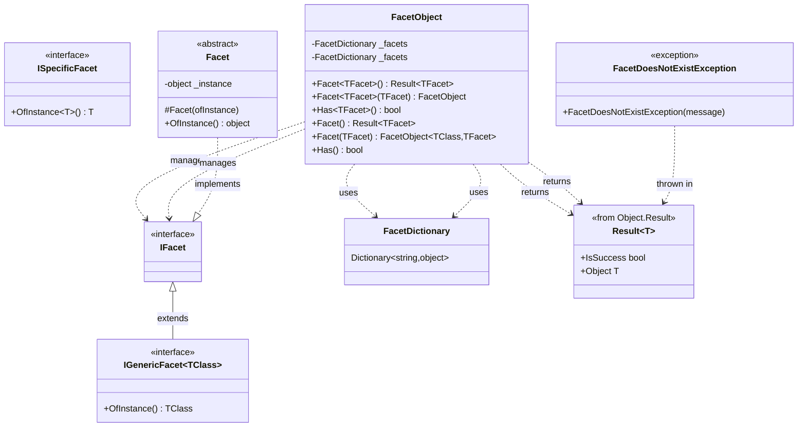

# FrenchExDev.Net.CSharp.Object.Biz - Architecture Documentation

## Overview

FrenchExDev.Net.CSharp.Object.Biz is a .NET 9 library that implements the **Facetted Object Pattern**, enabling dynamic composition of behaviors and metadata onto objects without modifying their core structure. This pattern provides a flexible way to extend objects with optional capabilities through facets.

## Solution Structure

### Projects

#### Core Library

- **FrenchExDev.Net.CSharp.Object.Biz**
  - Main library implementing the Facetted Object Pattern
  - `FacetObject` and `FacetObject<TClass, TFacet>` for facet management
  - `IFacet` and `IGenericFacet<TClass>` interfaces
  - `FacetDictionary` for storing facets
  - Integration with Result pattern for safe facet retrieval
  - Type-safe facet operations

#### Testing Projects

- **FrenchExDev.Net.CSharp.Object.Biz.Testing**
  - Testing utilities and helpers
  - Example facet implementations

- **FrenchExDev.Net.CSharp.Object.Biz.Tests**
  - Comprehensive unit tests using xUnit and Shouldly
  - Tests for generic and non-generic facet objects
  - Facet retrieval and assignment scenarios

## Architecture Diagrams

### Project Structure


### Type Hierarchy



### Facet Association Pattern


## Sequence Diagrams

### Adding and Retrieving Facets


### Checking Facet Existence


### Generic vs Non-Generic Usage


## Core Components

### IFacet Interface

Base marker interface for all facets.

**Purpose:** Identifies a type as a facet that can be associated with objects.

```csharp
public interface IFacet { }
```

### IGenericFacet<TClass>

Generic interface for facets bound to specific class types.

**Purpose:** Provides type-safe access to the instance the facet is associated with.

```csharp
public interface IGenericFacet<TClass> : IFacet where TClass : notnull
{
    TClass OfInstance();
}
```

### FacetObject (Non-Generic)

Flexible facet container that can hold facets of any type.

**Key Features:**
- Store multiple facet types dynamically
- Type-safe facet retrieval via generics
- Result pattern for safe access
- Fluent API for facet assignment

**Methods:**
```csharp
public Result<TFacet> Facet<TFacet>() where TFacet : notnull, IFacet
public FacetObject Facet<TFacet>(TFacet aspect) where TFacet : notnull, IFacet
public bool Has<TFacet>() where TFacet : notnull, IFacet
```

**Usage:**
```csharp
var car = new FacetObject();
car.Facet(new ElectricCarFacet(car))
   .Facet(new LuxuryCarFacet(car));

var electricFacet = car.Facet<ElectricCarFacet>();
if (electricFacet.IsSuccess)
{
    electricFacet.Object.ChargeBattery();
}

if (car.Has<LuxuryCarFacet>())
{
    var luxury = car.Facet<LuxuryCarFacet>().Object;
    luxury.ActivateMassage();
}
```

### FacetObject<TClass, TFacet>

Generic facet container for a specific class-facet pair.

**Key Features:**
- Compile-time type safety
- No need for generic parameters on methods
- Single facet type per object
- Fluent API

**Methods:**
```csharp
public Result<TFacet> Facet()
public FacetObject<TClass, TFacet> Facet(TFacet aspect)
public bool Has()
```

**Usage:**
```csharp
public class Car : FacetObject<Car, ICarFacet>
{
    public string Model { get; set; }
    public int Year { get; set; }
}

var car = new Car { Model = "Model S", Year = 2024 };
var electricFacet = new ElectricCarFacet(car);
car.Facet(electricFacet);

var facet = car.Facet().Object; // No generic parameter needed
facet.ChargeBattery();
```

### FacetDictionary

Storage for facets keyed by type name.

**Purpose:** Internally stores facets as objects, retrieved by their type name.

```csharp
public class FacetDictionary : Dictionary<string, object>
{
}
```

**Key Characteristics:**
- Keys are type names (e.g., "ElectricCarFacet")
- Values are facet instances stored as `object`
- Type-safe retrieval through generic methods

### Facet Base Class

Abstract base class for facets that need to reference their host object.

```csharp
public abstract class Facet
{
    private object _instance;
    
    public Facet(object ofInstance)
    {
        _instance = ofInstance;
    }
    
    public object OfInstance()
    {
        return _instance;
    }
}
```

### FacetDoesNotExistException

Exception thrown when a requested facet is not found.

```csharp
public class FacetDoesNotExistException : Exception
{
    public FacetDoesNotExistException(string message) : base(message) { }
}
```

**Used in:** Result pattern failures when a facet doesn't exist.

## Key Features

### 1. Dynamic Object Extension

Add behaviors to objects without modifying their core structure:

```csharp
// Core object
public class Document
{
    public string Title { get; set; }
    public string Content { get; set; }
}

// Extend with facets
var doc = new FacetObject();
doc.Facet(new VersioningFacet(doc))
   .Facet(new CollaborationFacet(doc))
   .Facet(new EncryptionFacet(doc));
```

### 2. Type-Safe Facet Access

Leverage generics for compile-time type safety:

```csharp
// Type-safe retrieval
var versioningFacet = doc.Facet<VersioningFacet>();
if (versioningFacet.IsSuccess)
{
    var facet = versioningFacet.Object;
    facet.CreateVersion();
}
```

### 3. Result Pattern Integration

Safe facet access using Result pattern:

```csharp
var result = car.Facet<ElectricCarFacet>();

if (result.IsSuccess)
{
    var facet = result.Object;
    facet.ChargeBattery();
}
else
{
    Console.WriteLine("Electric facet not available");
}
```

### 4. Fluent API

Chain facet assignments:

```csharp
car.Facet(electricFacet)
   .Facet(luxuryFacet)
   .Facet(autonomousFacet);
```

### 5. Existence Checking

Check for facet presence before retrieval:

```csharp
if (car.Has<ElectricCarFacet>())
{
    var facet = car.Facet<ElectricCarFacet>().Object;
    // Use facet
}
```

## Usage Patterns

### Pattern 1: Feature Flags via Facets

```csharp
public interface IFeatureFacet : IFacet
{
    bool IsEnabled();
}

public class BetaFeatureFacet : IFeatureFacet
{
    public bool IsEnabled() => true;
}

public class User : FacetObject
{
    public string Name { get; set; }
}

var user = new User { Name = "John" };

// Enable beta features for user
user.Facet(new BetaFeatureFacet());

// Check access
if (user.Has<BetaFeatureFacet>())
{
    var feature = user.Facet<BetaFeatureFacet>().Object;
    if (feature.IsEnabled())
    {
        ShowBetaFeatures();
    }
}
```

### Pattern 2: Plugin Architecture

```csharp
public interface IPluginFacet : IFacet
{
    void Execute();
}

public class LoggingPlugin : IPluginFacet
{
    public void Execute() => Console.WriteLine("Logging...");
}

public class CachingPlugin : IPluginFacet
{
    public void Execute() => Console.WriteLine("Caching...");
}

var application = new FacetObject();
application
    .Facet(new LoggingPlugin())
    .Facet(new CachingPlugin());

// Execute all plugins
if (application.Has<LoggingPlugin>())
    application.Facet<LoggingPlugin>().Object.Execute();

if (application.Has<CachingPlugin>())
    application.Facet<CachingPlugin>().Object.Execute();
```

### Pattern 3: Metadata Augmentation

```csharp
public interface IMetadataFacet : IFacet
{
    Dictionary<string, string> Metadata { get; }
}

public class DocumentMetadata : IMetadataFacet
{
    public Dictionary<string, string> Metadata { get; } = new();
}

public class Document : FacetObject
{
    public string Title { get; set; }
}

var doc = new Document { Title = "Report" };
var metadata = new DocumentMetadata();
metadata.Metadata["Author"] = "John Doe";
metadata.Metadata["CreatedDate"] = DateTime.Now.ToString();
doc.Facet(metadata);

// Access metadata
if (doc.Has<DocumentMetadata>())
{
    var meta = doc.Facet<DocumentMetadata>().Object;
    Console.WriteLine($"Author: {meta.Metadata["Author"]}");
}
```

### Pattern 4: Capability Discovery

```csharp
public interface ISearchableFacet : IFacet
{
    IEnumerable<string> Search(string query);
}

public interface ISortableFacet : IFacet
{
    void Sort(string property);
}

public class DataGrid : FacetObject
{
    public List<object> Data { get; set; }
}

var grid = new DataGrid();

// Add capabilities conditionally
if (configuration.EnableSearch)
{
    grid.Facet(new SearchCapability(grid));
}

if (configuration.EnableSorting)
{
    grid.Facet(new SortCapability(grid));
}

// Use capabilities if available
if (grid.Has<ISearchableFacet>())
{
    var results = grid.Facet<ISearchableFacet>().Object.Search("query");
}

if (grid.Has<ISortableFacet>())
{
    grid.Facet<ISortableFacet>().Object.Sort("Name");
}
```

### Pattern 5: Role-Based Access

```csharp
public interface IRoleFacet : IFacet
{
    bool HasPermission(string permission);
}

public class AdminRole : IRoleFacet
{
    public bool HasPermission(string permission) => true; // All
}

public class GuestRole : IRoleFacet
{
    private readonly string[] _allowedPermissions = { "Read" };
    
    public bool HasPermission(string permission) => 
        _allowedPermissions.Contains(permission);
}

public class UserContext : FacetObject
{
    public string Username { get; set; }
}

var user = new UserContext { Username = "john" };
user.Facet(new GuestRole());

// Check permissions
if (user.Has<IRoleFacet>())
{
    var role = user.Facet<IRoleFacet>().Object;
    if (role.HasPermission("Write"))
    {
        PerformWrite();
    }
}
```

## Design Decisions

### Why Result Pattern?

Instead of throwing exceptions or returning null:

```csharp
// ? Exception-based
try
{
    var facet = car.Facet<ElectricCarFacet>();
}
catch (FacetDoesNotExistException)
{
    // Handle missing facet
}

// ? Result-based
var result = car.Facet<ElectricCarFacet>();
if (result.IsSuccess)
{
    var facet = result.Object;
    // Use facet
}
```

### Generic vs Non-Generic

**Non-Generic FacetObject:**
- ? Can hold multiple different facet types
- ? More flexible
- ? Requires generic parameter on methods

**Generic FacetObject<TClass, TFacet>:**
- ? Compile-time type safety
- ? No generic parameters on methods
- ? Single facet type only
- ? Better for domain models

### Type Name as Key

Facets are keyed by type name:
- Simple and automatic
- No manual key management
- One facet per type (by design)
- Name collisions unlikely with namespaces

## Comparison with Other Patterns

### vs Extension Methods

| Feature | Facets | Extension Methods |
|---------|--------|-------------------|
| **Runtime addition** | ? Yes | ? No (compile-time) |
| **Instance-specific** | ? Yes | ? No |
| **State storage** | ? Yes | ? No (unless static) |
| **Discovery** | ? `Has<T>()` | ? Manual |
| **Optional** | ? Yes | ? Yes |

### vs Inheritance

| Feature | Facets | Inheritance |
|---------|--------|-------------|
| **Single vs Multiple** | ? Multiple facets | ? Single base |
| **Runtime modification** | ? Add/remove | ? Fixed |
| **Composition** | ? Yes | ? No |
| **Decoupling** | ? High | ? Tight coupling |

### vs Decorator Pattern

| Feature | Facets | Decorator |
|---------|--------|-----------|
| **Wrapping** | ? No wrapping | ? Wraps object |
| **Interface preservation** | ? Original preserved | ? Yes |
| **Multiple aspects** | ? Easy | ? Nested wrappers |
| **Discovery** | ? `Has<T>()` | ? Manual |

## Best Practices

### ? Do

1. **Use Interfaces for Facets**
   ```csharp
   public interface ICarFacet : IGenericFacet<Car> { }
   public class ElectricCarFacet : ICarFacet { }
   ```

2. **Check Existence Before Use**
   ```csharp
   if (car.Has<ElectricCarFacet>())
   {
       var facet = car.Facet<ElectricCarFacet>().Object;
   }
   ```

3. **Use Result Pattern**
   ```csharp
   var result = car.Facet<ElectricCarFacet>();
   if (result.IsSuccess)
   {
       // Use result.Object
   }
   ```

4. **Store Reference to Host**
   ```csharp
   public class ElectricCarFacet : ICarFacet
   {
       private readonly Car _car;
       public ElectricCarFacet(Car car) { _car = car; }
   }
   ```

### ? Don't

1. **Don't Store Critical State**
   ```csharp
   // ? Bad - critical data shouldn't be in facets
   public class Car
   {
       // Missing Model property - in facet instead
   }
   
   // ? Good - core properties on object
   public class Car
   {
       public string Model { get; set; }
   }
   ```

2. **Don't Ignore Result Failures**
   ```csharp
   // ? Bad
   var facet = car.Facet<ElectricCarFacet>().Object; // May throw
   
   // ? Good
   var result = car.Facet<ElectricCarFacet>();
   if (result.IsSuccess)
   {
       var facet = result.Object;
   }
   ```

3. **Don't Use for Core Functionality**
   ```csharp
   // ? Bad - core behavior should be in class
   public class Car { }  // Empty!
   public class DrivingFacet : ICarFacet
   {
       public void Drive() { }  // Core functionality in facet
   }
   
   // ? Good
   public class Car
   {
       public void Drive() { }  // Core functionality
   }
   ```

## Testing

### Unit Test Example

```csharp
[Fact]
public void FacetObject_CanAddAndRetrieveFacet()
{
    // Arrange
    var car = new FacetObject();
    var electricFacet = new ElectricCarFacet(car);
    
    // Act
    car.Facet(electricFacet);
    var result = car.Facet<ElectricCarFacet>();
    
    // Assert
    result.IsSuccess.ShouldBeTrue();
    result.Object.ShouldBeSameAs(electricFacet);
}

[Fact]
public void FacetObject_MissingFacet_ReturnsFailure()
{
    // Arrange
    var car = new FacetObject();
    
    // Act
    var result = car.Facet<ElectricCarFacet>();
    
    // Assert
    result.IsFailure.ShouldBeTrue();
}

[Fact]
public void FacetObject_Has_ReturnsCorrectValue()
{
    // Arrange
    var car = new FacetObject();
    car.Facet(new ElectricCarFacet(car));
    
    // Act & Assert
    car.Has<ElectricCarFacet>().ShouldBeTrue();
    car.Has<LuxuryCarFacet>().ShouldBeFalse();
}
```

## Future Enhancements

- **Facet Events**: Notify when facets are added/removed
- **Facet Dependencies**: Declare required facets
- **Facet Composition**: Combine multiple facets
- **Facet Serialization**: Save/load facet state
- **Facet Validation**: Ensure facet compatibility
- **Facet Queries**: LINQ-like queries over facets
- **Async Facets**: Support for async operations

---

**Version**: 1.0  
**Last Updated**: 2024  
**Target Framework**: .NET 9  
**Pattern**: Facetted Object Pattern
