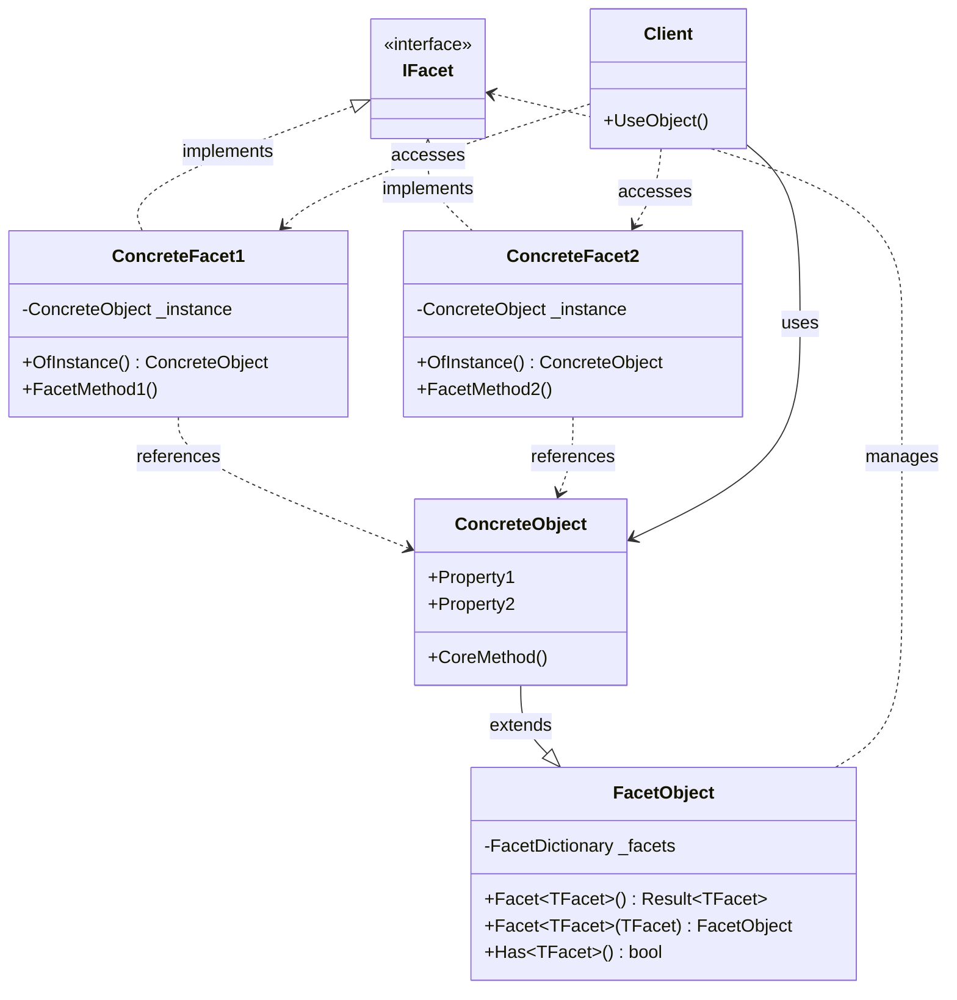
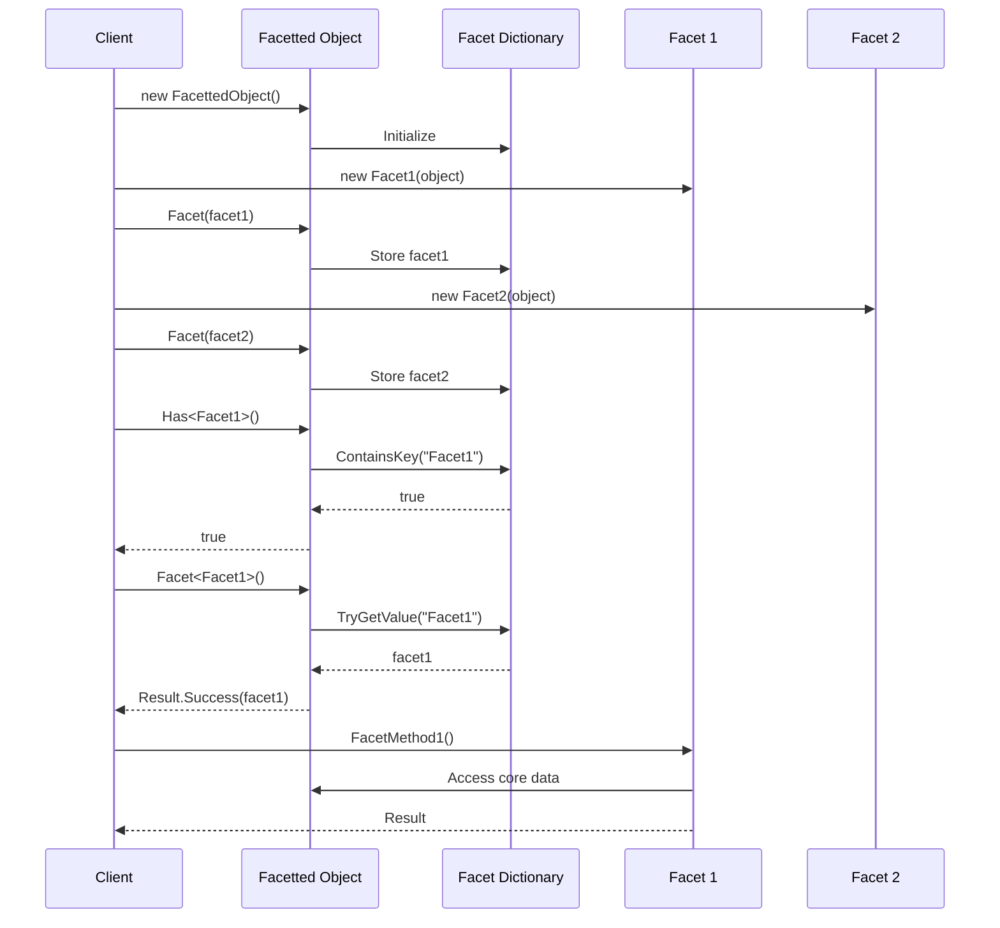
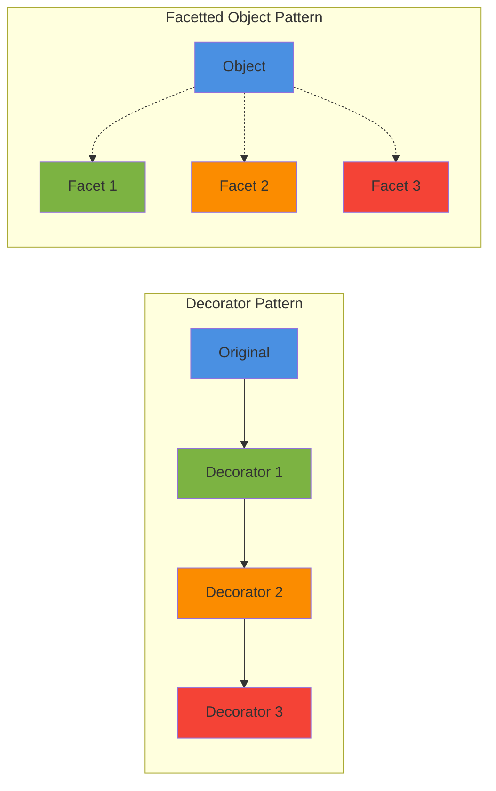

# Facetted Object Pattern - Implementation Guide

## Overview

The Facetted Object Pattern is a structural design pattern that enables dynamic composition of behaviors and capabilities onto objects without modifying their core structure. Facets represent discrete aspects or features that can be independently attached to and detached from objects at runtime.

## Pattern Intent

**Problem:** How do you extend objects with optional capabilities without:
- Creating deep inheritance hierarchies
- Tightly coupling features to objects
- Modifying existing classes
- Creating numerous subclasses for feature combinations

**Solution:** Attach facets (independent feature objects) to a host object that manages and provides access to them.

## Core Concepts

### What is a Facet?

A **facet** is a discrete, independent aspect or capability that can be associated with an object:

```csharp
public interface IFacet { }

public class ElectricPowerFacet : IFacet
{
    private readonly Car _car;
    public int BatteryCapacity { get; set; }
    
    public ElectricPowerFacet(Car car)
    {
        _car = car;
    }
    
    public void ChargeBattery()
    {
        Console.WriteLine($"Charging {_car.Model}...");
    }
}
```

### What is a Facetted Object?

An object that can have facets attached to it:

```csharp
public class Car : FacetObject<Car, ICarFacet>
{
    public string Model { get; set; }
    public int Year { get; set; }
}

// Usage
var car = new Car { Model = "Model S" };
car.Facet(new ElectricPowerFacet(car));

if (car.Has<ElectricPowerFacet>())
{
    var electric = car.Facet<ElectricPowerFacet>().Object;
    electric.ChargeBattery();
}
```

## Pattern Structure

### Class Diagram



### Sequence Diagram



## Implementation

### Step 1: Define Facet Interfaces

```csharp
// Base marker interface
public interface IFacet { }

// Generic facet interface
public interface IGenericFacet<TClass> : IFacet where TClass : notnull
{
    TClass OfInstance();
}

// Specific facet interface
public interface ICarFacet : IGenericFacet<Car> { }
```

### Step 2: Create the Host Object

```csharp
public class Car : FacetObject<Car, ICarFacet>
{
    // Core properties
    public string Model { get; set; }
    public int Year { get; set; }
    public string Color { get; set; }
    
    // Core methods
    public void Drive()
    {
        Console.WriteLine($"Driving {Model}");
    }
}
```

### Step 3: Implement Facets

```csharp
public class ElectricPowerFacet : ICarFacet
{
    private readonly Car _car;
    public int BatteryCapacity { get; set; }
    public int CurrentCharge { get; set; }
    
    public ElectricPowerFacet(Car car)
    {
        _car = car;
        BatteryCapacity = 100;
        CurrentCharge = 100;
    }
    
    public Car OfInstance() => _car;
    
    public void ChargeBattery()
    {
        CurrentCharge = BatteryCapacity;
        Console.WriteLine($"{_car.Model} battery fully charged");
    }
    
    public int GetRange()
    {
        return (CurrentCharge * 300) / 100; // Simplified
    }
}

public class AutonomousDrivingFacet : ICarFacet
{
    private readonly Car _car;
    public int AutonomyLevel { get; set; } // 1-5
    
    public AutonomousDrivingFacet(Car car, int level)
    {
        _car = car;
        AutonomyLevel = level;
    }
    
    public Car OfInstance() => _car;
    
    public void EnableAutopilot()
    {
        Console.WriteLine($"{_car.Model} autopilot enabled (Level {AutonomyLevel})");
    }
}

public class LuxuryFacet : ICarFacet
{
    private readonly Car _car;
    public bool HasMassageSeats { get; set; }
    public bool HasPremiumSound { get; set; }
    
    public LuxuryFacet(Car car)
    {
        _car = car;
    }
    
    public Car OfInstance() => _car;
    
    public void ActivateMassage()
    {
        if (HasMassageSeats)
        {
            Console.WriteLine($"{_car.Model} massage seats activated");
        }
    }
}
```

### Step 4: Use the Pattern

```csharp
// Create car
var car = new Car 
{ 
    Model = "Model S", 
    Year = 2024,
    Color = "Red"
};

// Add facets dynamically
car.Facet(new ElectricPowerFacet(car) 
{ 
    BatteryCapacity = 100 
});

car.Facet(new AutonomousDrivingFacet(car, level: 4));

car.Facet(new LuxuryFacet(car) 
{ 
    HasMassageSeats = true,
    HasPremiumSound = true 
});

// Use core functionality
car.Drive();

// Use facets conditionally
if (car.Has<ElectricPowerFacet>())
{
    var electric = car.Facet<ElectricPowerFacet>().Object;
    electric.ChargeBattery();
    Console.WriteLine($"Range: {electric.GetRange()} miles");
}

if (car.Has<AutonomousDrivingFacet>())
{
    var autonomous = car.Facet<AutonomousDrivingFacet>().Object;
    autonomous.EnableAutopilot();
}

if (car.Has<LuxuryFacet>())
{
    var luxury = car.Facet<LuxuryFacet>().Object;
    luxury.ActivateMassage();
}
```

## Real-World Examples

### Example 1: E-Commerce Product System

```csharp
public class Product : FacetObject
{
    public string Name { get; set; }
    public decimal Price { get; set; }
}

// Facets for different product capabilities
public class DigitalDownloadFacet : IFacet
{
    public string DownloadUrl { get; set; }
    public int MaxDownloads { get; set; }
    
    public void GenerateDownloadLink()
    {
        // Implementation
    }
}

public class PhysicalShippingFacet : IFacet
{
    public decimal Weight { get; set; }
    public Dimensions Dimensions { get; set; }
    
    public decimal CalculateShipping(string destination)
    {
        // Implementation
        return 0;
    }
}

public class SubscriptionFacet : IFacet
{
    public TimeSpan BillingPeriod { get; set; }
    public decimal RecurringPrice { get; set; }
    
    public void ProcessRecurringPayment()
    {
        // Implementation
    }
}

// Usage
var ebook = new Product { Name = "E-Book", Price = 9.99m };
ebook.Facet(new DigitalDownloadFacet 
{ 
    DownloadUrl = "https://...",
    MaxDownloads = 3 
});

var physicalBook = new Product { Name = "Physical Book", Price = 19.99m };
physicalBook.Facet(new PhysicalShippingFacet 
{ 
    Weight = 0.5m,
    Dimensions = new Dimensions { Width = 6, Height = 9, Depth = 1 }
});

var subscription = new Product { Name = "Magazine", Price = 4.99m };
subscription.Facet(new SubscriptionFacet 
{
    BillingPeriod = TimeSpan.FromDays(30),
    RecurringPrice = 4.99m
});

// Process checkout based on facets
foreach (var item in cart)
{
    if (item.Has<DigitalDownloadFacet>())
    {
        var digital = item.Facet<DigitalDownloadFacet>().Object;
        SendDownloadEmail(digital.DownloadUrl);
    }
    
    if (item.Has<PhysicalShippingFacet>())
    {
        var shipping = item.Facet<PhysicalShippingFacet>().Object;
        var cost = shipping.CalculateShipping(customer.Address);
        AddShippingCost(cost);
    }
    
    if (item.Has<SubscriptionFacet>())
    {
        var sub = item.Facet<SubscriptionFacet>().Object;
        ScheduleRecurringPayment(sub);
    }
}
```

### Example 2: User Management System

```csharp
public class User : FacetObject
{
    public string Username { get; set; }
    public string Email { get; set; }
}

// Role facets
public interface IRoleFacet : IFacet
{
    bool HasPermission(string permission);
    List<string> GetAllPermissions();
}

public class AdminRoleFacet : IRoleFacet
{
    public bool HasPermission(string permission) => true;
    
    public List<string> GetAllPermissions() => 
        new List<string> { "*" }; // All permissions
}

public class EditorRoleFacet : IRoleFacet
{
    private readonly List<string> _permissions = new()
    {
        "Read", "Write", "Edit", "Delete"
    };
    
    public bool HasPermission(string permission) => 
        _permissions.Contains(permission);
    
    public List<string> GetAllPermissions() => _permissions;
}

public class ViewerRoleFacet : IRoleFacet
{
    private readonly List<string> _permissions = new() { "Read" };
    
    public bool HasPermission(string permission) => 
        _permissions.Contains(permission);
    
    public List<string> GetAllPermissions() => _permissions;
}

// Additional capabilities
public class TwoFactorAuthFacet : IFacet
{
    public string PhoneNumber { get; set; }
    public string BackupEmail { get; set; }
    
    public bool VerifyCode(string code)
    {
        // Implementation
        return true;
    }
}

public class ApiAccessFacet : IFacet
{
    public string ApiKey { get; set; }
    public int RateLimit { get; set; }
    
    public bool ValidateApiKey(string key)
    {
        return ApiKey == key;
    }
}

// Usage
var adminUser = new User { Username = "admin" };
adminUser.Facet(new AdminRoleFacet())
         .Facet(new TwoFactorAuthFacet { PhoneNumber = "+1234567890" });

var editorUser = new User { Username = "editor" };
editorUser.Facet(new EditorRoleFacet())
          .Facet(new ApiAccessFacet 
          { 
              ApiKey = "key123",
              RateLimit = 1000 
          });

// Authorization check
bool CanPerformAction(User user, string permission)
{
    if (!user.Has<IRoleFacet>())
        return false;
    
    var role = user.Facet<IRoleFacet>().Object;
    return role.HasPermission(permission);
}

// MFA check
bool RequiresMFA(User user)
{
    return user.Has<TwoFactorAuthFacet>();
}
```

### Example 3: Document Management System

```csharp
public class Document : FacetObject
{
    public string Title { get; set; }
    public string Content { get; set; }
    public DateTime CreatedAt { get; set; }
}

// Version control facet
public class VersionControlFacet : IFacet
{
    private readonly List<DocumentVersion> _versions = new();
    
    public void CreateVersion(Document doc)
    {
        _versions.Add(new DocumentVersion
        {
            Content = doc.Content,
            Timestamp = DateTime.Now
        });
    }
    
    public void RestoreVersion(int versionNumber, Document doc)
    {
        if (versionNumber < _versions.Count)
        {
            doc.Content = _versions[versionNumber].Content;
        }
    }
    
    public List<DocumentVersion> GetHistory() => _versions;
}

// Collaboration facet
public class CollaborationFacet : IFacet
{
    public List<string> Collaborators { get; } = new();
    public List<Comment> Comments { get; } = new();
    
    public void AddCollaborator(string userId)
    {
        if (!Collaborators.Contains(userId))
        {
            Collaborators.Add(userId);
        }
    }
    
    public void AddComment(string userId, string text)
    {
        Comments.Add(new Comment
        {
            UserId = userId,
            Text = text,
            Timestamp = DateTime.Now
        });
    }
}

// Encryption facet
public class EncryptionFacet : IFacet
{
    public bool IsEncrypted { get; private set; }
    private string _encryptionKey;
    
    public void Encrypt(Document doc, string key)
    {
        // Encrypt doc.Content
        _encryptionKey = key;
        IsEncrypted = true;
    }
    
    public void Decrypt(Document doc, string key)
    {
        if (key == _encryptionKey)
        {
            // Decrypt doc.Content
            IsEncrypted = false;
        }
    }
}

// Workflow facet
public class WorkflowFacet : IFacet
{
    public enum WorkflowState { Draft, Review, Approved, Published }
    
    public WorkflowState CurrentState { get; private set; }
    public List<WorkflowTransition> History { get; } = new();
    
    public void TransitionTo(WorkflowState newState, string userId)
    {
        History.Add(new WorkflowTransition
        {
            From = CurrentState,
            To = newState,
            UserId = userId,
            Timestamp = DateTime.Now
        });
        CurrentState = newState;
    }
}

// Usage
var document = new Document 
{ 
    Title = "Project Plan",
    Content = "Initial content"
};

// Enable versioning for this document
document.Facet(new VersionControlFacet());

// Enable collaboration
document.Facet(new CollaborationFacet());

// Enable encryption for sensitive docs
if (isSensitive)
{
    document.Facet(new EncryptionFacet());
}

// Enable workflow for documents that need approval
document.Facet(new WorkflowFacet());

// Use facets
if (document.Has<VersionControlFacet>())
{
    var versioning = document.Facet<VersionControlFacet>().Object;
    versioning.CreateVersion(document);
}

if (document.Has<CollaborationFacet>())
{
    var collab = document.Facet<CollaborationFacet>().Object;
    collab.AddCollaborator("user123");
    collab.AddComment("user123", "Looks good!");
}

if (document.Has<WorkflowFacet>())
{
    var workflow = document.Facet<WorkflowFacet>().Object;
    workflow.TransitionTo(WorkflowFacet.WorkflowState.Review, "user123");
}
```

## Pattern Benefits

### 1. **Open/Closed Principle**

Objects are open for extension (add facets) but closed for modification (no changes to core class).

```csharp
// Add new capability without changing Car class
public class SelfParkingFacet : ICarFacet
{
    private readonly Car _car;
    
    public SelfParkingFacet(Car car) { _car = car; }
    
    public void ParkAutomatically()
    {
        // New functionality
    }
}

car.Facet(new SelfParkingFacet(car)); // No Car class changes needed
```

### 2. **Single Responsibility Principle**

Each facet has a single, well-defined responsibility.

```csharp
// Each facet focuses on one aspect
public class ElectricPowerFacet : ICarFacet  // Battery management
public class AutonomousFacet : ICarFacet     // Self-driving
public class LuxuryFacet : ICarFacet         // Comfort features
```

### 3. **Runtime Flexibility**

Add/remove capabilities at runtime based on conditions.

```csharp
if (customer.HasSubscription("Premium"))
{
    car.Facet(new LuxuryFacet(car));
}

if (customer.HasLicense("Autonomous"))
{
    car.Facet(new AutonomousFacet(car, level: 4));
}
```

### 4. **Avoid Feature Explosion**

No need for combinatorial subclasses.

```csharp
// ? Without facets: many subclasses
// ElectricCar, LuxuryCar, AutonomousCar
// ElectricLuxuryCar, ElectricAutonomousCar
// LuxuryAutonomousCar, ElectricLuxuryAutonomousCar

// ? With facets: one class, mix-and-match
var car = new Car();
car.Facet(new ElectricPowerFacet(car));
car.Facet(new LuxuryFacet(car));
car.Facet(new AutonomousFacet(car));
```

### 5. **Testability**

Test facets independently of the host object.

```csharp
[Fact]
public void ElectricPowerFacet_ChargeBattery_IncreasesCharge()
{
    var car = new Car { Model = "Test" };
    var facet = new ElectricPowerFacet(car) { CurrentCharge = 50 };
    
    facet.ChargeBattery();
    
    facet.CurrentCharge.ShouldBe(facet.BatteryCapacity);
}
```

## When to Use

### ? Good Use Cases

1. **Optional Features**
   - Features that only some instances need
   - Premium/subscription features

2. **Plugin Architecture**
   - Extensible systems
   - Third-party extensions

3. **Role-Based Capabilities**
   - User roles with different permissions
   - Dynamic access control

4. **Configuration-Driven Behavior**
   - Features enabled via configuration
   - A/B testing scenarios

5. **Cross-Cutting Concerns**
   - Logging, caching, monitoring
   - Can be added/removed dynamically

### ? When Not to Use

1. **Core Functionality**
   - Essential features of an object
   - Features all instances must have

2. **Simple Objects**
   - Objects with few variations
   - Overkill for simple scenarios

3. **Performance Critical**
   - Dictionary lookup overhead
   - Tight loops with facet access

4. **Strongly Coupled Features**
   - Features that depend heavily on each other
   - Better as part of core class

## Comparison with Other Patterns

### vs Decorator Pattern



| Aspect | Facetted Object | Decorator |
|--------|----------------|-----------|
| **Structure** | Object + attached facets | Wrapped objects |
| **Access** | Direct facet access | Through wrapper interface |
| **Discovery** | `Has<T>()` method | Not available |
| **Combination** | Easy - multiple facets | Complex - nested wrappers |
| **Object Identity** | Preserved | Changed (wrapper) |

### vs Strategy Pattern

| Aspect | Facetted Object | Strategy |
|--------|----------------|----------|
| **Purpose** | Add capabilities | Vary algorithms |
| **Quantity** | Multiple facets | Single strategy |
| **Access** | By type | Through interface |
| **Runtime Change** | Add/remove facets | Replace strategy |

### vs Mixin Pattern

| Aspect | Facetted Object | Mixin |
|--------|----------------|-------|
| **When Applied** | Runtime | Compile-time |
| **Flexibility** | Instance-specific | Class-wide |
| **State** | Instance state | No state or class state |
| **Discovery** | `Has<T>()` | Type checking |

## Best Practices

### 1. Design Facets as Capabilities

```csharp
// ? Good - represents a capability
public interface ISearchableFacet : IFacet
{
    IEnumerable<string> Search(string query);
}

// ? Bad - too generic
public interface IDataFacet : IFacet
{
    object GetData();
}
```

### 2. Keep Facets Focused

```csharp
// ? Good - single responsibility
public class ValidationFacet : IFacet
{
    public List<ValidationResult> Validate();
}

// ? Bad - multiple responsibilities
public class ValidationAndLoggingFacet : IFacet
{
    public List<ValidationResult> Validate();
    public void Log(string message);
}
```

### 3. Use Result Pattern for Safe Access

```csharp
// ? Good - safe access
var result = document.Facet<VersionControlFacet>();
if (result.IsSuccess)
{
    var versioning = result.Object;
    versioning.CreateVersion(document);
}

// ? Bad - may throw
try
{
    var versioning = document.Facet<VersionControlFacet>().Object;
    versioning.CreateVersion(document);
}
catch (Exception)
{
    // Handle
}
```

### 4. Check Existence First

```csharp
// ? Good - check before use
if (user.Has<TwoFactorAuthFacet>())
{
    var twoFA = user.Facet<TwoFactorAuthFacet>().Object;
    twoFA.SendCode();
}

// ? Bad - always try to get
var result = user.Facet<TwoFactorAuthFacet>();
if (result.IsSuccess)
{
    result.Object.SendCode();
}
```

### 5. Store Reference to Host

```csharp
// ? Good - facet knows its host
public class CarFacet : ICarFacet
{
    private readonly Car _car;
    
    public CarFacet(Car car)
    {
        _car = car;
    }
    
    public void DoSomething()
    {
        // Can access _car properties
        Console.WriteLine(_car.Model);
    }
}
```

---

**Version**: 1.0  
**Last Updated**: 2024  
**Target Framework**: .NET 9  
**Pattern Category**: Structural Design Pattern
