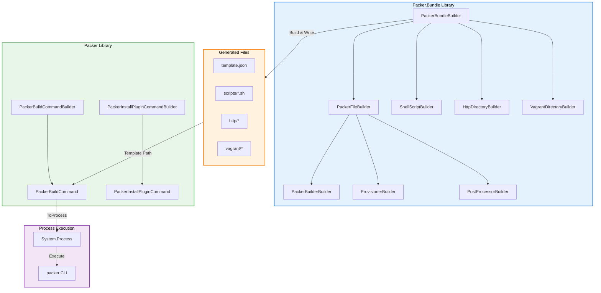

# Packer
[](https://dotnet.microsoft.com/)

A comprehensive .NET solution for working with [HashiCorp Packer](https://www.packer.io/) - the open-source tool for creating identical machine images for multiple platforms from a single source configuration.

This solution provides two complementary libraries for building and executing Packer configurations programmatically in .NET.

## 📦 Solution Structure

```
Packer/
├── src/
│   ├── FrenchExDev.Net.Packer/                    # Core CLI command abstractions
│   ├── FrenchExDev.Net.Packer.Bundle/             # Bundle building library
│   ├── FrenchExDev.Net.Packer.Testing/            # Core testing utilities
│   └── FrenchExDev.Net.Packer.Bundle.Testing/     # Bundle testing utilities
├── test/
│   ├── FrenchExDev.Net.Packer.Tests/              # Core library tests
│   └── FrenchExDev.Net.Packer.Bundle.Tests/       # Bundle library tests
└── README.md                                       # This file
```

## 📚 Libraries

### [FrenchExDev.Net.Packer](./src/FrenchExDev.Net.Packer/README.md)

Core library providing typed abstractions for Packer CLI commands.

**Key Features:**
- Fluent builders for `packer build` and `packer plugins install` commands
- Process management with stdout/stderr stream handling
- Shell-safe command line generation
- Environment variable injection

```csharp
var command = new PackerBuildCommandBuilder()
    .WithTemplatePath("template.json")
    .WithForce(true)
    .WithWorkingDirectory("/build")
    .Build()
    .Success<PackerBuildCommand>();

using var process = command.ToProcess(Console.WriteLine, Console.Error.WriteLine);
await process.WaitAsync();
```

### [FrenchExDev.Net.Packer.Bundle](./src/FrenchExDev.Net.Packer.Bundle/README.md)

Library for building complete Packer project bundles programmatically.

**Key Features:**
- Fluent builders for Packer templates (JSON)
- VirtualBox ISO builder configuration
- Shell script generation
- HTTP directory and Vagrant file management
- File system output writing

```csharp
var bundle = new PackerBundleBuilder()
    .PackerFile(pf => pf
        .Builder(b => b
            .Type("virtualbox-iso")
            .VmName("alpine-vm")
            .DiskSize("20000"))
        .Provisioner(p => p
            .Type("shell")
            .AddScript("scripts/setup.sh")))
    .Script("scripts/setup.sh", s => s
        .Set("-ex")
        .AddLine("apk update"))
    .Build()
    .Success<PackerBundle>();
```

## 🔄 Complete Workflow



## 🚀 Quick Start

### 1. Create a Packer Bundle

```csharp
using FrenchExDev.Net.Packer.Bundle;

var bundle = new PackerBundleBuilder()
    .PackerFile(pf => pf
        .Description("Alpine Linux VM")
        .Builder(b => b
            .Type("virtualbox-iso")
            .BootWait("30s")
            .AddBootCommand("root<enter>")
            .DiskSize("20000")
            .Format("ova")
            .GuestOsType("Linux_64")
            .HttpDirectory("http")
            .IsoChecksum("sha256:...")
            .AddIsoUrl("https://dl-cdn.alpinelinux.org/...")
            .SshUsername("root")
            .SshPassword("vagrant")
            .VmName("alpine-vm")
            .ModifyVm("--memory", "1024"))
        .Provisioner(p => p
            .Type("shell")
            .AddScript("scripts/setup.sh"))
        .PostProcessor(pp => pp
            .Type("vagrant")
            .Output("output/alpine.box")))
    .Script("scripts/setup.sh", s => s
        .Set("-ex")
        .AddLine("apk update")
        .AddLine("apk upgrade"))
    .HttpDirectory(h => h
        .AddFile("answers", answersFile))
    .Directory("output")
    .Build()
    .Success<PackerBundle>();
```

### 2. Write Bundle to Disk

```csharp
var writer = new PackerBundleWriter();
var context = new PackerBundleWritingContext("/tmp/packer-build");

await writer.WriteAsync(bundle, context);
```

### 3. Execute Packer Build

```csharp
using FrenchExDev.Net.Packer;

var buildCommand = new PackerBuildCommandBuilder()
    .WithTemplatePath("alpine.json")
    .WithWorkingDirectory("/tmp/packer-build")
    .WithForce(true)
    .WithTimestampUi(true)
    .Build()
    .Success<PackerBuildCommand>();

using var process = buildCommand.ToProcess(
    onStdOut: line => Console.WriteLine($"[PACKER] {line}"),
    onStdErr: line => Console.Error.WriteLine($"[ERROR] {line}")
);

await process.WaitAsync();

if (process.ExitCode == 0)
    Console.WriteLine("Build completed successfully!");
```

## 📋 Use Cases

| Use Case | Library | Description |
|----------|---------|-------------|
| Generate Packer templates | Bundle | Create JSON templates programmatically |
| Create provisioning scripts | Bundle | Generate shell scripts with proper formatting |
| Configure VirtualBox VMs | Bundle | Full VBoxManage command support |
| Execute `packer build` | Core | Type-safe command execution |
| Install Packer plugins | Core | Manage plugin dependencies |
| CI/CD integration | Both | Automate image building pipelines |

## 🛠️ Requirements

- .NET 10.0 or later
- HashiCorp Packer CLI (for execution)
- VirtualBox (for VirtualBox ISO builds)

## 📦 Dependencies

- `FrenchExDev.Net.CSharp.Object.Builder` - Builder pattern infrastructure

## 📄 License

See the [LICENSE](./LICENSE.md) file for details.

## 🔗 Related Projects

- [FrenchExDev.Net.CSharp.Object.Builder](../CSharp.Object.Builder/README.md) - Builder pattern library
- [FrenchExDev.Net.CSharp.Object.Result](../CSharp.Object.Result/README.md) - Result type library
