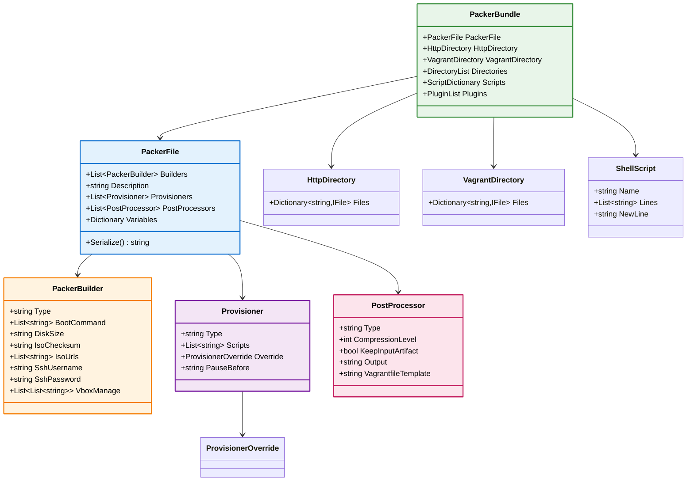
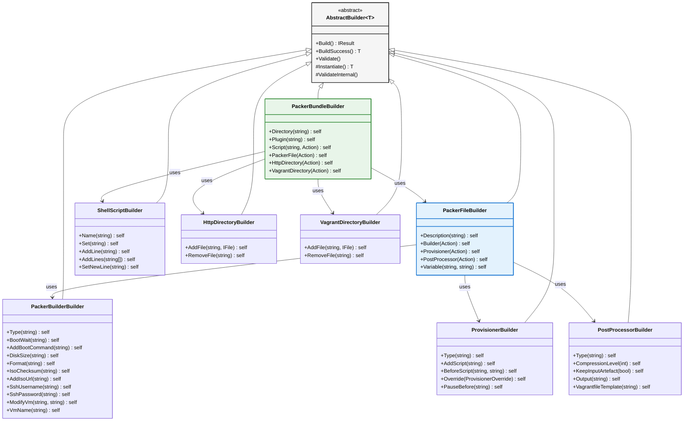
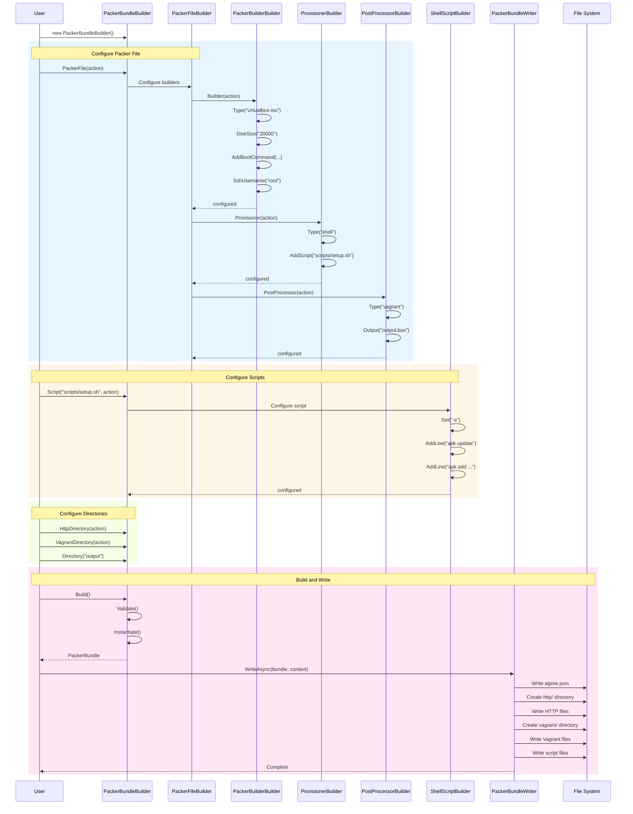

# `FrenchExDev.Net.Packer.Bundle`

A comprehensive .NET library for building [HashiCorp Packer](https://www.packer.io/) configurations programmatically using a fluent builder pattern. Generate complete Packer bundles including JSON templates, provisioning scripts, HTTP directory files, and Vagrant configurations.

## ?? Project Structure

```
Packer/
??? src/
?   ??? FrenchExDev.Net.Packer/                    # Core Packer CLI command abstractions
?   ??? FrenchExDev.Net.Packer.Bundle/             # Bundle building library (this package)
?   ??? FrenchExDev.Net.Packer.Bundle.Testing/     # Testing utilities
?   ??? FrenchExDev.Net.Packer.Testing/            # Core testing utilities
??? test/
    ??? FrenchExDev.Net.Packer.Tests/              # Core tests
    ??? FrenchExDev.Net.Packer.Bundle.Tests/       # Bundle tests
```

## ?? Features

- **Fluent Builder Pattern** - Type-safe, chainable API for constructing Packer configurations
- **Complete Bundle Generation** - Create entire Packer project structures including:
  - Packer JSON/HCL templates
  - Shell provisioning scripts
  - HTTP directory files (for kickstart/preseed/answer files)
  - Vagrant post-processor configurations
- **VirtualBox Support** - First-class support for VirtualBox ISO builder configurations
- **Validation** - Built-in validation ensures configurations are complete before building
- **Serialization** - Direct JSON serialization of Packer templates
- **File System Writing** - Write complete bundle structures to disk

## ??? Architecture Overview



## ?? Builder Hierarchy



## ?? Bundle Building Workflow



## ?? Usage

### Creating a Complete Packer Bundle

```csharp
var bundleBuilder = new PackerBundleBuilder()
    // Configure the main Packer file
    .PackerFile(packer => packer
        .Description("Alpine Linux VM Build")
        
        // Configure VirtualBox ISO builder
        .Builder(builder => builder
            .Type("virtualbox-iso")
            .BootWait("30s")
            .AddBootCommand("root<enter>")
            .AddBootCommand("ifconfig eth0 up && udhcpc<enter>")
            .DiskSize("20000")
            .Format("ova")
            .GuestOsType("Linux_64")
            .Headless(true)
            .HttpDirectory("http")
            .IsoChecksum("sha256:abc123...")
            .AddIsoUrl("https://dl-cdn.alpinelinux.org/alpine/v3.18/releases/x86_64/alpine-standard-3.18.0-x86_64.iso")
            .SshUsername("root")
            .SshPassword("vagrant")
            .SshTimeout("10m")
            .ShutdownCommand("poweroff")
            .VmName("alpine-vm")
            .ModifyVm("--memory", "1024")
            .ModifyVm("--cpus", "2")
        )
        
        // Configure shell provisioner
        .Provisioner(prov => prov
            .Type("shell")
            .AddScript("scripts/setup.sh")
            .AddScript("scripts/cleanup.sh")
        )
        
        // Configure Vagrant post-processor
        .PostProcessor(pp => pp
            .Type("vagrant")
            .CompressionLevel(6)
            .KeepInputArtefact(false)
            .Output("output/alpine-{{.Provider}}.box")
            .VagrantfileTemplate("vagrant/Vagrantfile.template")
        )
        
        // Add variables
        .Variable("alpine_version", "3.18.0")
        .Variable("vm_name", "alpine-vm")
    )
    
    // Add provisioning scripts
    .Script("scripts/setup.sh", script => script
        .Name("setup.sh")
        .Set("-ex")
        .AddLine("apk update")
        .AddLine("apk upgrade")
        .AddLine("apk add bash curl wget")
    )
    .Script("scripts/cleanup.sh", script => script
        .Name("cleanup.sh")
        .Set("-ex")
        .AddLine("rm -rf /var/cache/apk/*")
    )
    
    // Configure HTTP directory (for kickstart/preseed files)
    .HttpDirectory(http => http
        .AddFile("answers", new FileBuilder()
            .AddLine("KEYMAPOPTS=\"us us\"")
            .AddLine("HOSTNAMEOPTS=\"-n alpine\"")
            .AddLine("INTERFACESOPTS=\"auto lo\"")
            .Build().Success<File>())
    )
    
    // Configure Vagrant directory
    .VagrantDirectory(vagrant => vagrant
        .AddFile("Vagrantfile.template", new FileBuilder()
            .AddLine("Vagrant.configure(\"2\") do |config|")
            .AddLine("  config.vm.box = \"alpine\"")
            .AddLine("end")
            .Build().Success<File>())
    )
    
    // Additional directories to create
    .Directory("output")
    .Directory("logs");

// Build the bundle
var result = bundleBuilder.Build();
var bundle = result.Success<PackerBundle>();
```

### Writing Bundle to Disk

```csharp
var writer = new PackerBundleWriter();
var context = new PackerBundleWritingContext("/path/to/output");

await writer.WriteAsync(bundle, context);

// This creates:
// /path/to/output/
// ??? alpine.json           # Packer template
// ??? http/
// ?   ??? answers           # HTTP files for boot
// ??? vagrant/
// ?   ??? Vagrantfile.template
// ??? scripts/
// ?   ??? setup.sh
// ?   ??? cleanup.sh
// ??? output/
// ??? logs/
```

### Configuring VirtualBox VM Settings

```csharp
.Builder(builder => builder
    .Type("virtualbox-iso")
    // Basic VM settings
    .ModifyVm("--memory", "2048")
    .ModifyVm("--cpus", "4")
    .ModifyVm("--vram", "32")
    
    // Conditional settings
    .ModifyVmIf(() => enableEfi, "--firmware", "efi")
    
    // Storage controller configuration
    .HardDriveInterface("sata")
    .HardDriveDiscard(true)
    .ModifyStorageController("SATA Controller", "--hostiocache", "on")
    
    // Guest additions
    .GuestAdditionMode("upload")
    .GuestAdditionUrl("https://download.virtualbox.org/virtualbox/7.0.0/VBoxGuestAdditions_7.0.0.iso")
    .GuestAdditionSha256("abc123...")
    .GuestAdditionPath("VBoxGuestAdditions.iso")
    
    // Extra data
    .SetExtraData("VBoxInternal/Devices/VMMDev/0/Config/GetHostTimeDisabled", "1")
)
```

### Creating Multiple Scripts

```csharp
// Using dictionary syntax
.Script(new Dictionary<string, Action<ShellScriptBuilder>>
{
    ["scripts/base.sh"] = s => s
        .Name("base.sh")
        .Set("-ex")
        .AddLines(new[] { "apk update", "apk upgrade" }),
        
    ["scripts/packages.sh"] = s => s
        .Name("packages.sh")
        .Set("-ex")
        .AddLine("apk add vim git curl"),
        
    ["scripts/users.sh"] = s => s
        .Name("users.sh")
        .Set("-ex")
        .AddLine("adduser -D vagrant")
        .AddLine("echo 'vagrant:vagrant' | chpasswd")
})
```

### Using Provisioner Overrides

```csharp
.Provisioner(prov => prov
    .Type("shell")
    .AddScript("scripts/setup.sh")
    .PauseBefore("10s")
    .Override(new ProvisionerOverrideBuilder()
        .VirtualBoxIso(new VirtualBoxIsoProvisionerOverride
        {
            ExecuteCommand = "chmod +x {{.Path}} && {{.Vars}} {{.Path}}"
        })
        .Build().Success<ProvisionerOverride>())
)
```

## ?? API Reference

### PackerBundleBuilder

| Method | Description |
|--------|-------------|
| `Directory(string)` | Adds a directory to create in the bundle |
| `Plugin(string)` | Adds a Packer plugin dependency |
| `Script(string, Action<ShellScriptBuilder>)` | Adds a named shell script |
| `Script(Dictionary<string, Action<ShellScriptBuilder>>)` | Adds multiple scripts |
| `ScriptRemove(string)` | Removes a script by name |
| `PackerFile(Action<PackerFileBuilder>)` | Configures the Packer template |
| `HttpDirectory(Action<HttpDirectoryBuilder>)` | Configures HTTP directory files |
| `VagrantDirectory(Action<VagrantDirectoryBuilder>)` | Configures Vagrant directory |

### PackerFileBuilder

| Method | Description |
|--------|-------------|
| `Description(string)` | Sets the template description |
| `Builder(Action<PackerBuilderBuilder>)` | Adds a builder configuration |
| `Provisioner(Action<ProvisionerBuilder>)` | Adds a provisioner |
| `PostProcessor(Action<PostProcessorBuilder>)` | Adds a post-processor |
| `Variable(string, string)` | Adds/updates a variable |
| `GetBuilder(predicate)` | Gets a builder by predicate |
| `GetProvisioner(predicate)` | Gets a provisioner by predicate |
| `UpdateProvisioner(predicate, Action)` | Updates a provisioner |

### PackerBuilderBuilder (VirtualBox ISO)

| Method | Description |
|--------|-------------|
| `Type(string)` | Builder type (e.g., "virtualbox-iso") |
| `BootWait(string)` | Wait before boot commands |
| `AddBootCommand(string)` | Adds a boot keystroke |
| `DiskSize(string)` | Primary disk size in MB |
| `Format(string)` | Output format (ova, vdi, etc.) |
| `GuestOsType(string)` | Guest OS type hint |
| `Headless(bool)` | Run VM headless |
| `HttpDirectory(string)` | HTTP directory path |
| `IsoChecksum(string)` | ISO checksum |
| `AddIsoUrl(string)` | Adds ISO download URL |
| `SshUsername(string)` | SSH username |
| `SshPassword(string)` | SSH password |
| `SshTimeout(string)` | SSH connection timeout |
| `ShutdownCommand(string)` | Shutdown command |
| `VmName(string)` | VM name |
| `ModifyVm(string, string)` | VBoxManage modifyvm command |
| `ModifyVmIf(Func<bool>, string, string)` | Conditional VM modification |
| `ModifyStorageController(...)` | Storage controller settings |
| `SetExtraData(string, string)` | VBoxManage setextradata |

### ShellScriptBuilder

| Method | Description |
|--------|-------------|
| `Name(string)` | Script filename |
| `Set(string)` | Shell options (e.g., "-ex") |
| `AddLine(string)` | Adds a script line |
| `AddLines(string[])` | Adds multiple lines |
| `AddLines(string, string)` | Splits string by delimiter |
| `SetNewLine(string)` | Line ending character |

## ?? Generated Output Structure

```
bundle-output/
??? alpine.json                 # Main Packer template
??? http/                       # HTTP server directory
?   ??? answers                 # Kickstart/preseed file
?   ??? ...
??? vagrant/                    # Vagrant files
?   ??? Vagrantfile.template
??? scripts/                    # Provisioning scripts
?   ??? setup.sh
?   ??? packages.sh
?   ??? cleanup.sh
??? output/                     # Build output directory
??? logs/                       # Log directory
```

## ?? Integration with Packer CLI

The bundle integrates with the `FrenchExDev.Net.Packer` library for executing builds:

```csharp
// Write bundle to disk
await writer.WriteAsync(bundle, new PackerBundleWritingContext("/tmp/build"));

// Create and execute Packer build command
var buildCommand = new PackerBuildCommandBuilder()
    .WithTemplatePath("alpine.json")
    .WithWorkingDirectory("/tmp/build")
    .WithForce(true)
    .WithTimestampUi(true)
    .Build().Success<PackerBuildCommand>();

// Execute
using var process = buildCommand.ToProcess(
    onStdOut: Console.WriteLine,
    onStdErr: Console.Error.WriteLine
);

await process.WaitAsync();
```

## ??? Requirements

- .NET 10.0 or later
- `FrenchExDev.Net.CSharp.Object.Builder` (builder pattern infrastructure)

## ?? License

See the [LICENSE](./LICENSE.md) file for details.
