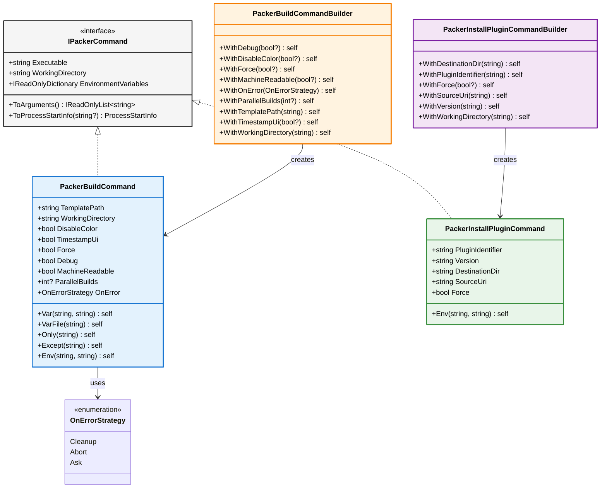
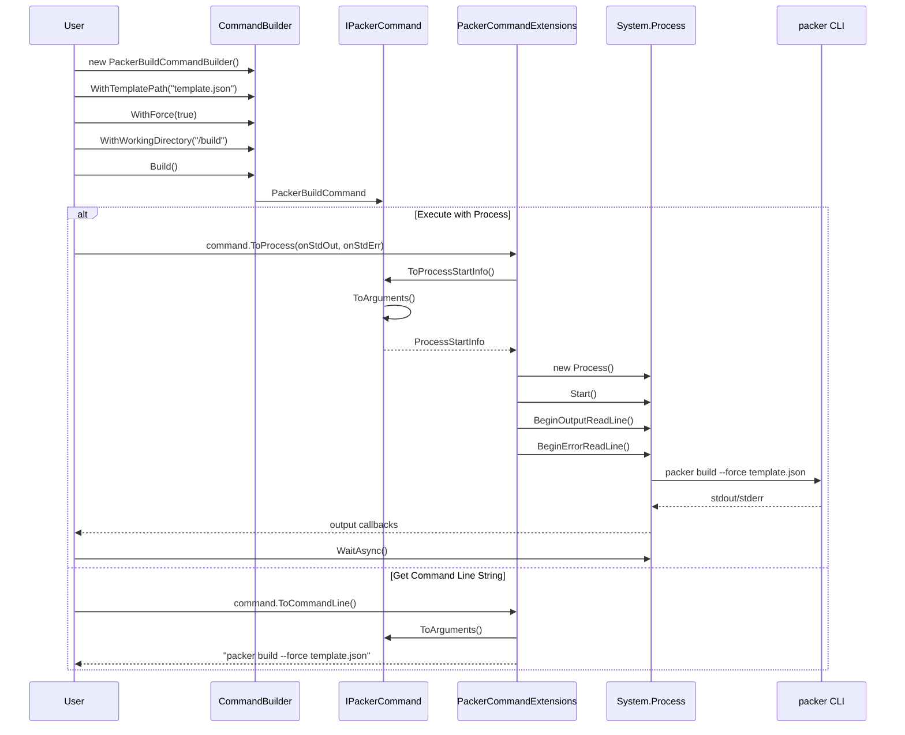

# `FrenchExDev.Net.Packer`

A .NET library providing typed abstractions for [HashiCorp Packer](https://www.packer.io/) CLI commands. Build, configure, and execute Packer commands programmatically with full type safety and fluent builders.

## ?? Project Structure

```
Packer/
??? src/
?   ??? FrenchExDev.Net.Packer/                    # Core CLI abstractions (this package)
?   ??? FrenchExDev.Net.Packer.Bundle/             # Bundle building library
?   ??? FrenchExDev.Net.Packer.Bundle.Testing/     # Bundle testing utilities
?   ??? FrenchExDev.Net.Packer.Testing/            # Core testing utilities
??? test/
    ??? FrenchExDev.Net.Packer.Tests/              # Core tests
    ??? FrenchExDev.Net.Packer.Bundle.Tests/       # Bundle tests
```

## ?? Features

- **Typed Command Builders** - Fluent API for constructing Packer CLI commands
- **`PackerBuildCommand`** - Execute `packer build` with full option support
- **`PackerInstallPluginCommand`** - Install Packer plugins programmatically
- **Process Management** - Start processes with output/error stream handling
- **Command Line Generation** - Generate shell-safe command strings
- **Environment Variables** - Inject environment variables into Packer processes

## ??? Architecture



## ?? Command Execution Flow



## ?? Usage

### Building a Packer Build Command

```csharp
// Using the fluent builder
var command = new PackerBuildCommandBuilder()
    .WithTemplatePath("alpine.json")
    .WithWorkingDirectory("/path/to/build")
    .WithForce(true)
    .WithDebug(false)
    .WithDisableColor(false)
    .WithTimestampUi(true)
    .WithMachineReadable(false)
    .WithParallelBuilds(2)
    .WithOnError(OnErrorStrategy.Cleanup)
    .Build()
    .Success<PackerBuildCommand>();

// Add variables
command
    .Var("version", "1.0.0")
    .Var("iso_url", "https://example.com/image.iso")
    .VarFile("variables.pkrvars.hcl");

// Filter builders
command
    .Only("virtualbox-iso")
    .Except("vmware-iso");

// Set environment variables
command.Env("PACKER_LOG", "1");
```

### Executing a Command

```csharp
// Execute with output handlers
using var process = command.ToProcess(
    onStdOut: line => Console.WriteLine($"[OUT] {line}"),
    onStdErr: line => Console.Error.WriteLine($"[ERR] {line}")
);

// Wait for completion
await process.WaitAsync();

// Check exit code
if (process.ExitCode != 0)
{
    Console.WriteLine($"Build failed with exit code {process.ExitCode}");
}
```

### Getting the Command Line String

```csharp
// Generate shell-safe command string
string commandLine = command.ToCommandLine();
// Output: packer build --force --timestamp-ui -parallel-builds 2 -var "version=1.0.0" alpine.json

Console.WriteLine($"Executing: {commandLine}");
```

### Installing Packer Plugins

```csharp
var installCommand = new PackerInstallPluginCommandBuilder()
    .WithPluginIdentifier("github.com/hashicorp/virtualbox")
    .WithVersion("~> 1.0")
    .WithForce(true)
    .WithWorkingDirectory("/path/to/project")
    .Build()
    .Success<PackerInstallPluginCommand>();

// Execute plugin installation
using var process = installCommand.ToProcess(
    onStdOut: Console.WriteLine,
    onStdErr: Console.Error.WriteLine
);

await process.WaitAsync();
```

### Custom Plugin Source

```csharp
var installCommand = new PackerInstallPluginCommandBuilder()
    .WithPluginIdentifier("mycompany/custom-builder")
    .WithVersion("1.2.3")
    .WithSourceUri("https://releases.mycompany.com/packer-plugins")
    .WithDestinationDir("/custom/plugins/path")
    .WithWorkingDirectory("/project")
    .Build()
    .Success<PackerInstallPluginCommand>();
```

### Direct Command Construction

```csharp
// Create command directly (all properties required)
var command = new PackerBuildCommand
{
    TemplatePath = "template.pkr.hcl",
    WorkingDirectory = "/build",
    DisableColor = false,
    TimestampUi = true,
    Force = true,
    Debug = false,
    MachineReadable = false,
    ParallelBuilds = 0,
    OnError = OnErrorStrategy.Cleanup
};
```

## ?? API Reference

### IPackerCommand Interface

| Member | Description |
|--------|-------------|
| `Executable` | Returns "packer" (CLI executable name) |
| `WorkingDirectory` | Optional working directory for the command |
| `EnvironmentVariables` | Environment variables to inject |
| `ToArguments()` | Returns ordered list of CLI arguments |
| `ToProcessStartInfo(string?)` | Creates configured ProcessStartInfo |

### PackerBuildCommand

| Property | Type | Description |
|----------|------|-------------|
| `TemplatePath` | `string` | Path to template file (required) |
| `WorkingDirectory` | `string?` | Working directory |
| `DisableColor` | `bool` | Disable ANSI color output |
| `TimestampUi` | `bool` | Enable timestamp prefix |
| `Force` | `bool` | Force overwrite artifacts |
| `Debug` | `bool` | Enable debug output |
| `MachineReadable` | `bool` | Machine-readable output |
| `ParallelBuilds` | `int?` | Number of parallel builds |
| `OnError` | `OnErrorStrategy` | Error handling strategy |

| Method | Description |
|--------|-------------|
| `Var(string, string)` | Adds `-var 'key=value'` |
| `VarFile(string)` | Adds `-var-file=path` |
| `Only(string)` | Restrict to specific builder |
| `Except(string)` | Exclude specific builder |
| `Env(string, string)` | Set environment variable |

### PackerInstallPluginCommand

| Property | Type | Description |
|----------|------|-------------|
| `PluginIdentifier` | `string` | Plugin target (e.g., "hashicorp/amazon") |
| `Version` | `string` | Version or constraint (e.g., "~> 1.0") |
| `DestinationDir` | `string?` | Custom plugin directory |
| `SourceUri` | `string?` | Custom plugin source URL |
| `Force` | `bool` | Force reinstallation |
| `WorkingDirectory` | `string?` | Working directory |

### OnErrorStrategy Enum

| Value | Description |
|-------|-------------|
| `Cleanup` | Clean up temporary artifacts (default) |
| `Abort` | Abort immediately, leave partial state |
| `Ask` | Prompt user interactively |

### PackerCommandExtensions

| Method | Description |
|--------|-------------|
| `ToCommandLine()` | Generates shell-safe command string |
| `ToProcess(Action?, Action?)` | Creates and starts Process with handlers |
| `WaitAsync()` | Async wait for process completion |

## ?? Generated CLI Arguments

### Build Command Examples

```bash
# Basic build
packer build template.json

# With options
packer build -force -timestamp-ui -parallel-builds 2 template.json

# With variables
packer build -var "version=1.0.0" -var "name=myvm" template.json

# With var file
packer build -var-file=prod.pkrvars.hcl template.json

# Filter builders
packer build -only=virtualbox-iso -except=vmware-iso template.json

# Error handling
packer build -on-error=abort template.json

# Debug mode
packer build -debug -color=false template.json
```

### Plugin Install Examples

```bash
# Basic install
packer plugins install hashicorp/virtualbox 1.0.0

# With version constraint
packer plugins install hashicorp/amazon ~> 1.1

# Force reinstall
packer plugins install -force hashicorp/virtualbox 1.0.0

# Custom source
packer plugins install -source https://custom.registry.com mycompany/builder 1.0.0

# Custom destination
packer plugins install -path /custom/plugins hashicorp/virtualbox 1.0.0
```

## ?? Integration with Packer.Bundle

This package works seamlessly with `FrenchExDev.Net.Packer.Bundle` for complete Packer workflows:

```csharp
// 1. Build the bundle using Packer.Bundle
var bundle = new PackerBundleBuilder()
    .PackerFile(pf => pf
        .Builder(b => b.Type("virtualbox-iso").VmName("myvm"))
        .Provisioner(p => p.Type("shell").AddScript("setup.sh"))
    )
    .Script("setup.sh", s => s.AddLine("echo Hello"))
    .Build()
    .Success<PackerBundle>();

// 2. Write bundle to disk
var writer = new PackerBundleWriter();
await writer.WriteAsync(bundle, new PackerBundleWritingContext("/tmp/build"));

// 3. Execute with Packer CLI commands
var buildCommand = new PackerBuildCommandBuilder()
    .WithTemplatePath("alpine.json")
    .WithWorkingDirectory("/tmp/build")
    .WithForce(true)
    .Build()
    .Success<PackerBuildCommand>();

using var process = buildCommand.ToProcess(Console.WriteLine, Console.Error.WriteLine);
await process.WaitAsync();
```

## ??? Requirements

- .NET 10.0 or later
- HashiCorp Packer CLI installed and available in PATH
- `FrenchExDev.Net.CSharp.Object.Builder` (builder pattern infrastructure)

## ?? License

See the [LICENSE](./LICENSE.md) file for details.
